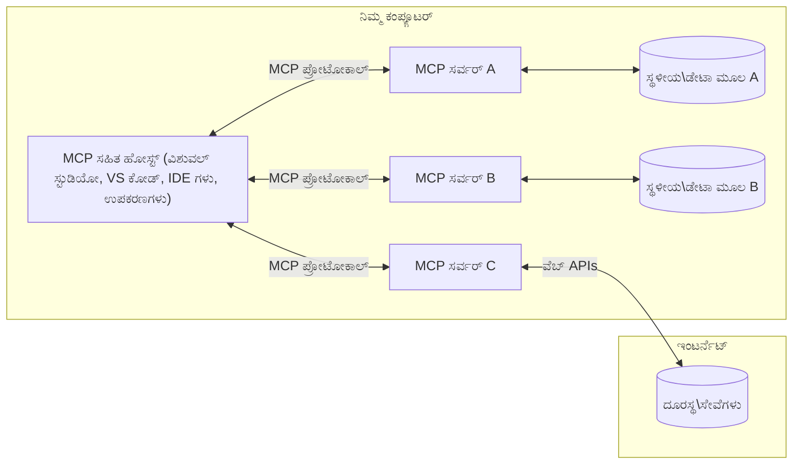

# MCP ಕೋರ್ ಸಂಪ್ರದಾಯಗಳು: AI ಏಕರಿಕೆಗೆ ಮಾದರಿ ಪ್ರಾಸಂಗಿಕ ಪ್ರೋಟೋಕಾಲ್‌ನ ತಿಳುವಳಿಕೆ

[](https://youtu.be/earDzWGtE84)

_(ಈ ಪಾಠದ ವೀಡಿಯೊವನ್ನು ನೋಡಿ ಮೇಲಿನ ಚಿತ್ರವನ್ನು ಕ್ಲಿಕ್ ಮಾಡಿ)_

[ಮಾದರಿ ಪ್ರಾಸಂಗಿಕ ಪ್ರೋಟೋಕಾಲ್ (MCP)](https://github.com/modelcontextprotocol) ಒಂದು ಶಕ್ತಿಶಾಲಿ, ಮಾನಕೀಕೃತ ರೂಪರೇಖೆ ಆಗಿದ್ದು, ದೊಡ್ಡ ಭಾಷಾ ಮಾದರಿಗಳು (LLMs) ಮತ್ತು ಹೊರಗಿನ ಸಾಧನಗಳು, ಅಪ್ಲಿಕೇಶನ್‌ಗಳು ಮತ್ತು ಡೇಟಾ ಮೂಲಗಳ ನಡುವಣ ಸಂವಹನವನ್ನು ಕ್ರಮಬದ್ಧಗೊಳಿಸುತ್ತದೆ.  
ಈ ಮಾರ್ಗದೇಶವು MCP ನ ಪ್ರಮುಖ ಸಂಪ್ರದಾಯಗಳನ್ನು ನಿಮಗೆ ಪರಿಚಯಿಸುತ್ತದೆ. ನೀವು ಅದರ ಕ್ಲಯಿಂಟ್-ಸರ್ವರ್ ವಾಸ್ತುಶಿಲ್ಪ, ಅತ್ಯಾವಶ್ಯಕ ಭಾಗಗಳು, ಸಂವಹನ ವಿಧಾನಗಳು ಹಾಗೂ ಅನುಷ್ಠಾನದ ಉತ್ತಮ ಪದ್ಧತಿಗಳು ಬಗ್ಗೆ ತಿಳಿದುಕೊಳ್ಳುತ್ತೀರಿ.

- **ಸ್ಪಷ್ಟ ಬಳಕೆದಾರ ಅನುಮತಿ**: ಎಲ್ಲಾ ಡೇಟಾ ಪ್ರವೇಶ ಮತ್ತು ಕಾರ್ಯಾಚರಣೆಗಳಿಗೆ ಕಾರ್ಯಗತಗೊಳಿಸುವ ಮೊದಲು ಸ್ಪಷ್ಟ ಬಳಕೆದಾರ ಅಂಗೀಕಾರ ಅಗತ್ಯ. ಬಳಕೆದಾರರು ಯಾವ ಡೇಟಾ ಪ್ರವೇಶಗೊಳ್ಳಲಾಗುತ್ತದೆ ಮತ್ತು ಯಾವ ಕ್ರಿಯೆಗಳು ನಡೆಯುತ್ತವೆ ಎಂಬುದನ್ನು ಸ್ಪಷ್ಟವಾಗಿ ಅರ್ಥಮಾಡಿಕೊಳ್ಳಬೇಕು, ಅನುಮತಿ ಮತ್ತು ಪ್ರಾಧಿಕಾರಗಳ ನಿರ್ದಿಷ್ಟ ನಿಯಂತ್ರಣದೊಂದಿಗೆ.

- **ಡೇಟಾ ಗೌಪ್ಯತೆ ರಕ್ಷಣಾ**: ಬಳಕೆದಾರರ ಡೇಟಾ ಕೇವಲ ಸ್ಪಷ್ಟ ಅನುಮತಿಯೊಂದಿಗೆ ಬಿಡುಗಡೆ ಮಾಡಬೇಕು ಮತ್ತು ಪೂರ್ಣ ಸಂವಾದ ಆಯುಷ್ಯಕಾಲದಲ್ಲಿ ಸದೃಡ ಪ್ರವೇಶ ನಿಯಂತ್ರಣಗಳ ಮೂಲಕ ರಕ್ಷಿಸಬೇಕು. ಅನುಷ್ಠಾನಗಳು ಅನುಮತಿಸದ ಡೇಟಾ ಪ್ರಸರಣವನ್ನು ತಡೆಯಬೇಕು ಮತ್ತು ಕಠಿಣ ಗೌಪ್ಯತಾ ಗಡಿಯಾರಗಳನ್ನು ಕಾಯ್ದಿರಿಸಬೇಕು.

- **ಸಾಧನ ಕಾರ್ಯಾಚರಣೆ ಭದ್ರತೆ**: ಪ್ರತೀ ಸಾಧನ ಕರಪತ್ರಕ್ಕಾಗಿ ಸ್ಪಷ್ಟ ಬಳಕೆದಾರ ಅನುಮತಿ ಅಗತ್ಯವಿದ್ದು, ಸಾಧನದ ಕಾರ್ಯಕ್ಷಮತೆ, ಪರಿಮಾಣಗಳು ಮತ್ತು ಸಾಧ್ಯ ಪರಿಣಾಮಗಳನ್ನು ಸ್ಪಷ್ಟವಾಗಿ ಅರ್ಥಮಾಡಿಕೊಳ್ಳಬೇಕು. ವಿನಾಯಕ, ಅಪಾಯಕಾರಿ ಅಥವಾ ದುಷ್ಟ ಸಾಧನ ಕಾರ್ಯಾಚರಣೆ ತಡೆಯುವ ಭದ್ರತಾ ಗಡಿಯಾರಗಳು ಬೇಕಾಗಿವೆ.

- **ರುದ್ರವಾದ ಸಂವಹನ ಭದ್ರತೆ**: ಎಲ್ಲ ಸಂವಹನ ಮಾರ್ಗಗಳಲ್ಲಿ ಸೂಕ್ತ ಎನ್ಕ್ರಿಪ್ಷನ್ ಮತ್ತು ಪ್ರಮಾಣೀಕರಣ ವಿಧಾನಗಳನ್ನು ಬಳಸಬೇಕು. ದೂರಸ್ಥ ಸಂಪರ್ಕಗಳು ಸುರಕ್ಷಿತ ಸಾರಿಗೆ ಪ್ರೋಟೋಕಾಲ್ಗಳನ್ನು ಮತ್ತು ಸರಿಯಾದ ಪ್ರಮಾಣಪತ್ರ ನಿರ್ವಹಣೆಯನ್ನು ಅನುಷ್ಠಾನಗೊಳಿಸಬೇಕು.

#### ಅನುಷ್ಠಾನ ಮಾರ್ಗದರ್ಶನಗಳು:

- **ಅನುಮತಿ ನಿರ್ವಹಣೆ**: ಬಳಕೆದಾರರಿಗೆ ಯಾವ ಸರ್ವರ್‌ಗಳು, ಸಾಧನಗಳು ಮತ್ತು ಸಂಪನ್ಮೂಲಗಳು ಪ್ರವೇಶಾರ್ಹ ಎಂಬುದನ್ನು ನಿಯಂತ್ರಿಸುವ ಸೂಕ್ಷ್ಮ ಅನುಮತಿ ವ್ಯವಸ್ಥೆಗಳನ್ನು ಅನುಷ್ಠಾನಗೊಳಿಸಿ
- **ಪ್ರಮಾಣೀಕರಣ ಮತ್ತು ಪ್ರಾಧಿಕಾರೀಕರಣ**: ಸುರಕ್ಷಿತ ಪ್ರಮಾಣೀಕರಣ ವಿಧಾನಗಳನ್ನು (OAuth, API ಕೀಗಳು) ಸರಿಯಾದ ಟೋಕನ್ ನಿರ್ವಹಣೆ ಮತ್ತು ಅವಧಿ ಕೊನೆಯೊಂದಿಗೆ ಬಳಸಿ  
- **ಇನ್‌ಪುಟ್ ಪರಿಶೀಲನೆ**: ಇಂಜಕ್ಷನ್ ದಾಳಿಗಳನ್ನು ತಡೆಯಲು ನಿರ್ದಿಷ್ಟ ಯೋಜನೆಗಳ ಪ್ರಕಾರ ಎಲ್ಲಾ ಮೌಲ್ಯಗಳು ಮತ್ತು ಡೇಟಾ ಇನ್‌ಪುಟ್‌ಗಳು ಪರಿಶೀಲಿಸಿ
- **ಆಡಿಟ್ ಲಾಗಿಂಗ್**: ಭದ್ರತೆ ಮಾನಗಮನ ಮತ್ತು ಅನುಸರಣೆಗಾಗಿ ಎಲ್ಲಾ ಕಾರ್ಯಾಚರಣೆಗಳ ಸಮಗ್ರ ಲಾಗ್‌ಗಳನ್ನು ಕಾಯ್ದಿರಿಸಿ

## ಅವಲೋಕನ

ಈ ಪಾಠದಲ್ಲಿ ನೀವು ಮಾದರಿ ಪ್ರಾಸಂಗಿಕ ಪ್ರೋಟೋಕಾಲ್ (MCP) ಪರಿಸರವನ್ನು ರಚಿಸುವ ಮೂಲ ವಾಸ್ತುಶಿಲ್ಪ ಮತ್ತು ಘಟಕಗಳನ್ನು ಅನ್ವೇಷಿಸುತ್ತೀರಿ. MCP ಸಂವಹನಗಳನ್ನು ಪವರ್ ಮಾಡುತ್ತಿರುವ ಕ್ಲಯಿಂಟ್-ಸರ್ವರ್ ವಾಸ್ತುಶಿಲ್ಪ, ಪ್ರಮುಖ ಘಟಕಗಳು ಮತ್ತು ಸಂವಹನ ವಿಧಾನಗಳ ಬಗ್ಗೆ ತಿಳಿಯುತ್ತೀರಿ.

## ಪ್ರಮುಖ ಕಲಿಕಾ ಗುರಿಗಳು

ಈ ಪಾಠದ ಅಂತ್ಯಕ್ಕೆ ನೀವು:

- MCP ಕ್ಲಯಿಂಟ್-ಸರ್ವರ್ ವಾಸ್ತುಶಿಲ್ಪವನ್ನು ಅರ್ಥಮಾಡಿಕೊಳ್ಳಲು.
- ಹೋಸ್ಟ್‌ಗಳು, ಕ್ಲಯಿಂಟ್‌ಗಳು ಮತ್ತು ಸರ್ವರ್‌ಗಳ ಪಾತ್ರಗಳು ಮತ್ತು ಹೊಣೆಗಾರಿಕೆಗಳನ್ನು ಗುರುತಿಸಲು.
- MCP ಅನ್ನು ಒಂದು ಲವಚಿಕ ಏಕರಿಕಾ ಪರತೆಯಾಗಿ ಮಾಡುವ ಮೂಲ ವೈಶಿಷ್ಟ್ಯಗಳನ್ನು ವಿಶ್ಲೇಷಿಸಲು.
- MCP ಪರಿಸರದಲ್ಲಿ ಮಾಹಿತಿ ಹೇಗೆ ಹರಿಯುತ್ತದೆ ಎಂಬುದನ್ನು ತಿಳಿದುಕೊಳ್ಳಲು.
- .NET, ಜಾವಾ, ಪೈಥಾನ್, ಮತ್ತು ಜಾವಾಸ್ಕ್ರಿಪ್ಟ್‌ನಲ್ಲಿ ಕೋಡ್ ಉದಾಹರಣೆಗಳ ಮೂಲಕ ಅಸ್ತಿತ್ವಪೂರ್ಣ ತಜ್ಞತೆಯನ್ನು ಪಡೆಯಲು.

## MCP ವಾಸ್ತುಶಿಲ್ಪ: ಒಂದು ಆಳವಾದ ದೃಷ್ಟಿ

MCP ಪರಿಸರವು ಕ್ಲಯಿಂಟ್-ಸರ್ವರ್ ಮಾದರಿಯ ಮೇಲೆ ನಿರ್ಮಿತವಾಗಿದೆ. ಈ ಘಟಕಗಳ ರಚನೆ ಎಐ ಅಪ್ಲಿಕೇಶನ್‌ಗಳಿಗಾಗಿ ಸಾಧನಗಳು, ಡೇಟಾಬೇಸ್‌ಗಳು, API-ಗಳು ಮತ್ತು ಪ್ರಾಸಂಗಿಕ ಸಂಪನ್ಮೂಲಗಳೊಂದಿಗೆ ಪರಿಣಾಮಕಾರಿಯಾಗಿ ಸಂವಹನ ಮಾಡಲು ಅನುಮತಿಸುತ್ತದೆ. ನಾವು ಈ ವಾಸ್ತುಶಿಲ್ಪವನ್ನು ಅದರ ಪ್ರಮುಖ ಘಟಕಗಳಾಗಿ ವಿಭಜಿಸೋಣ.

ಮೂಲತಃ MCP ಒಂದು ಕ್ಲಯಿಂಟ್-ಸರ್ವರ್ ವಾಸ್ತುಶಿಲ್ಪವನ್ನು ಅನುಸರಿಸುತ್ತವೆ, ಇಲ್ಲಿ ಸರ್ವರ್‌ಗಳು ಬಹುತೇಕ ಸಂಪರ್ಕಕ್ಕೊಡನೆ ಒಂದು ಹೋಸ್ಟ್ ಅಪ್ಲಿಕೇಶನ್ ಸಂಪರ್ಕ ಮಾಡಬಹುದು:


- **MCP ಹೋಸ್ಟ್‌ಗಳು**: VSCode, Claude Desktop, IDEಗಳಂತಹ ಪ್ರೋಗ್ರಾಂಗಳು ಅಥವಾ MCP ಮೂಲಕ ಡೇಟಾಗೆ ಪ್ರವೇಶ ಪಡೆಯಲು ಬಯಸುವ AI ಸಾಧನಗಳು  
- **MCP ಕ್ಲಯಿಂಟ್‌ಗಳು**: ಸರ್ವರ್‌ಗಳೊಂದಿಗೆ 1:1 ಸಂಪರ್ಕಗಳನ್ನು ಕಾಯ್ದುಕೊಂಡಿರುವ ಪ್ರೋಟೋಕಾಲ್ ಕ್ಲಯಿಂಟ್‌ಗಳು  
- **MCP ಸರ್ವರ್‌ಗಳು**: ಮಾನಕೀಕೃತ ಮಾದರಿ ಪ್ರಾಸಂಗಿಕ ಪ್ರೋಟೋಕಾಲ್ ಮೂಲಕ ನಿಶ್ಚಿತ ಸಾಮರ್ಥ್ಯಗಳನ್ನು ಸೌಲಭ್ಯ ಮಾಡಿಸುವ ತೂಕಹೀನ ಪ್ರೋಗ್ರಾಂಗಳು  
- **ಸ್ಥಳೀಯ ಡೇಟಾ ಮೂಲಗಳು**: ನಿಮ್ಮ ಕಂಪ್ಯೂಟರ್‌ನ ಫೈಲ್‌ಗಳು, ಡೇಟಾಬೇಸ್‌ಗಳು ಮತ್ತು ಸೇವೆಗಳು, ಸೂಕ್ತವಾಗಿ MCP ಸರ್ವರ್‌ಗಳು ಆಕ್ಸೆಸ್ ಮಾಡಬಲ್ಲವು  
- **ದೂರಸ್ಥ ಸೇವೆಗಳು**: ಇಂಟರ್ನೆಟ್ ಮೂಲಕ ಲಭ್ಯವಿರುವ ಹೊರಗಿನ ವ್ಯವಸ್ಥೆಗಳು, MCP ಸರ್ವರ್‌ಗಳು APIಗಳ ಮೂಲಕ ಸಂಪರ್ಕ ಮಾಡಬಹುದು.

MCP ಪ್ರೋಟೋಕಾಲ್ ದಿನಾಂಕ ಆಧಾರಿತ ಆವೃತ್ತಿ (YYYY-MM-DD ವಿನ್ಯಾಸ) ಉಪಯೋಗಿಸುವ ಬೆಳೆಯುತ್ತಿರುವ ಮಾನಕ. ಪ್ರಸ್ತುತ ಪ್ರೋಟೋಕಾಲ್ ಆವೃತ್ತಿ **2025-11-25** ಆಗಿದ್ದು, ನೀವು ಲೇಟೆಸ್ಟ್ ನವೀಕರಣಗಳನ್ನು [ಪ್ರೋಟೋಕಾಲ್ ವಿಶಿಷ್ಟ](https://modelcontextprotocol.io/specification/2025-11-25/) ನಲ್ಲಿ ನೋಡಬಹುದು.

### 1. ಹೋಸ್ಟ್‌ಗಳು

ಮಾದರಿ ಪ್ರಾಸಂಗಿಕ ಪ್ರೋಟೋಕಾಲ್ (MCP) ನಲ್ಲಿ **ಹೋಸ್ಟ್‌ಗಳು** ಪ್ರಾಥಮಿಕ ಸಂವಹನ ಮುಖಪುಟವಾಗಿರುವ AI ಅಪ್ಲಿಕೇಶನ್‌ಗಳಾಗಿವೆ. ಹೋಸ್ಟ್‌ಗಳು ಪ್ರತಿಯೊಂದು ಸರ್ವರ್ ಸಂಪರ್ಕಕ್ಕಾಗಿ ಸಮರ್ಪಿತ MCP ಕ್ಲಯಿಂಟ್‌ಗಳನ್ನು ಸೃಷ್ಟಿಸುವ ಮೂಲಕ ಹಲವಾರು MCP ಸರ್ವರ್‌ಗಳೊಂದಿಗೆ ಸಂಪರ್ಕ ನಿರ್ವಹಿಸುತ್ತವೆ. ಹೋಸ್ಟ್‌ಗಳ ಉದಾಹರಣೆಗಳು:

- **AI ಅಪ್ಲಿಕೇಶನ್‌ಗಳು**: Claude Desktop, Visual Studio Code, Claude Code  
- **ಅಭಿವೃದ್ಧಿ ವಾತಾವರಣಗಳು**: MCP ಏಕರಿಕೆ ಹೊಂದಿರುವ IDEಗಳು ಮತ್ತು ಕೋಡ್ ಸಂಪಾದಕರು  
- **ಕಸ್ಟಮ್ ಅಪ್ಲಿಕೇಶನ್‌ಗಳು**: ಉದ್ದೇಶಕ್ಕಾಗಿ ರಚಿಸಲಾಗಿರುವ AI ಏಜೆಂಟ್ಸ್ ಮತ್ತು ಸಾಧನಗಳು

**ಹೋಸ್ಟ್‌ಗಳು** AI ಮಾದರಿಗಳ ಪರಸ್ಪರ ಕ್ರಿಯೆಯ ನಿರ್ವಹಣೆಯಲ್ಲಿ ಸಂಯೋಜಕರು ಆಗಿವೆ. ಅವು:

- **AI ಮಾದರಿಗಳನ್ನು ಸಂಯೋಜಿಸು**: LLM ಗಳೊಂದಿಗೆ ಪ್ರತಿಕ್ರಿಯೆಗಳ ನಿರ್ಮಾಣ ಮತ್ತು AI ಕಾರ್ಯರಚನೆಗಳನ್ನು ನಿರ್ವಹಣೆ  
- **ಕ್ಲಯಿಂಟ್ ಸಂಪರ್ಕ ನಿರ್ವಹಣೆ**: ಪ್ರತಿಯೊಂದು MCP ಸರ್ವರ್‌ ಸಂಪರ್ಕಕ್ಕೆ ಒಬ್ಬ MCP ಕ್ಲಯಿಂಟ್ ಸೃಷ್ಟಿ ಹಾಗೂ ನಿರ್ವಹಣೆ  
- **ಬಳಕೆದಾರ ಮುಖಪುಟ ನಿಯಂತ್ರಣ**: ಸಂಭಾಷಣಾ ಪ್ರಗತಿ, ಬಳಕೆದಾರ ಪರಸ್ಪರ ಕ್ರಿಯೆ ಮತ್ತು ಪ್ರತಿಕ್ರಿಯೆಗಳ ಪ್ರದರ್ಶನ ನಿರ್ವಹಣೆ  
- **ಭದ್ರತೆ ಕಾಪಾಡುವಿಕೆ**: ಅನುಮತಿ, ಭದ್ರತಾ ನಿಯಮಗಳು ಮತ್ತು ಪ್ರಮಾಣೀಕರಣ ನಿಯಂತ್ರಣ  
- **ಬಳಕೆದಾರ ಅನುಮತಿ ನಿರ್ವಹಣೆ**: ಡೇಟಾ ಹಂಚಿಕೆ ಮತ್ತು ಸಾಧನ ಕಾರ್ಯಾಚರಣೆಗೆ ಬಳಕೆದಾರ ಅಂಗೀಕಾರ ನಿರ್ವಹಣೆ

### 2. ಕ್ಲಯಿಂಟ್‌ಗಳು

**ಕ್ಲಯಿಂಟ್‌ಗಳು**ವೆಂದರೆ ಹೋಸ್ಟ್ ಮತ್ತು MCP ಸರ್ವರ್‌ಗಳ ನಡುವೆ ನಿಶ್ಚಿತ 1:1 ಸಂಪರ್ಕಗಳನ್ನು ಕಾಯ್ದುಕೊಳ್ಳುವ ಅತ್ಯತ್ಯಾವಶ್ಯಕ ಘಟಕಗಳು. ಪ್ರತಿಯೊಂದು MCP ಕ್ಲಯಿಂಟ್ ನಿರ್ದಿಷ್ಟ MCP ಸರ್ವರ್ ಗೆ ಸಂಪರ್ಕಿಸಲು ಹೋಸ್ಟ್ ಸೃಷ್ಟಿಸುವದು, ಸಂಘಟಿತ ಮತ್ತು ಭದ್ರ ಸಂವಹನ ಚಾನೆಲ್ಗಳನ್ನು ಖಚಿತಪಡಿಸುತ್ತದೆ. ಬಹು-clients ಇರುವುದರಿಂದ ಹೋಸ್ಟ್‌ಗಳು ಒಂದಕ್ಕಿಂತ ಹೆಚ್ಚು ಸರ್ವರ್‌ಗಳಿಗೆ ಒಂದೇ ಸಮಯದಲ್ಲಿ ಸಂಪರ್ಕ ಕೊಂಡುಕೊಳ್ಳಬಹುದು.

**ಕ್ಲಯಿಂಟ್‌ಗಳು** ಹೋಸ್ಟ್ ಅಪ್ಲಿಕೇಶನ್‌ಗೆ ಒಳಗಾಗಿರುವ ಸಂಯೋಜಕ ಘಟಕಗಳಾಗಿವೆ. ಅವು:

- **ಪ್ರೋಟೋಕಾಲ್ ಸಂವಹನ**: ಸರ್ವರ್‌ಗಳಿಗೆ JSON-RPC 2.0 ವಿನಂತಿಗಳನ್ನು ಪ್ರಾಂಪ್ಟ್‌ಗಳು ಮತ್ತು ಸೂಚನೆಗಳೊಂದಿಗೆ ಕಳುಹಿಸು  
- **ಸಾಮರ್ಥ್ಯ ಸಭಾಗಾರಿಕೆ**: ಆರಂಭಕಾಲದಲ್ಲಿ ಸರ್ವರ್‌ಗಳೊಂದಿಗೆ ಬೆಂಬಲಿತ ವೈಶಿಷ್ಟ್ಯಗಳು ಮತ್ತು ಪ್ರೋಟೋಕಾಲ್ ಆವೃತ್ತಿಗಳನ್ನು ಮಾತುಕತೆ ಮಾಡಿ  
- **ಸಾಧನ ಕಾರ್ಯಾಚರಣೆ**: ಮಾದರಿಗಳಿಂದ ಆಗುವ ಸಾಧನ ಕಾರ್ಯಾಚರಣೆ ವಿನಂತಿಗಳನ್ನು ನಿರ್ವಹಣೆ ಮತ್ತು ಪ್ರತಿಕ್ರಿಯೆಗಳನ್ನು ಪ್ರಕ್ರಿಯೆ ಮಾಡಿ  
- **ನಿಜ-ಸಮಯ ನವೀಕರಣಗಳು**: ಸರ್ವರ್‌ಗಳಿಂದ ಆಡಳಿತ ಮತ್ತು ನವೀಕರಣಗಳ ನಿರ್ವಹಣೆ  
- **ಪ್ರತಿಕ್ರಿಯೆ ಸಂಸ್ಕರಣೆ**: ಬಳಕೆದಾರರಿಗೆ ಪ್ರದರ್ಶನಕ್ಕಾಗಿ ಸರ್ವರ್ ಪ್ರತಿಕ್ರಿಯೆಗಳನ್ನು ಪ್ರಕ್ರಿಯೆ ಮತ್ತು ರೂಪಾಂತರ ಮಾಡು

### 3. ಸರ್ವರ್‌ಗಳು

**ಸರ್ವರ್‌ಗಳು** MCP ಕ್ಲಯಿಂಟ್‌ಗಳಿಗೆ ಪ್ರಾಸಂಗಿಕತೆ, ಸಾಧನಗಳು ಮತ್ತು ಸಾಮರ್ಥ್ಯಗಳನ್ನು ಒದಗಿಸುವ ಪ್ರೋಗ್ರಾಂಗಳು. ಅವು ಸ್ಥಳೀಯವಾಗಿ (ಹೋಸ್ಟ್ ಅವರ ಅದೇ ಯಂತ್ರದಲ್ಲಿ) ಅಥವಾ ದೂರಸ್ಥವಾಗಿ (ಹೊರಗಿನ ವೇದಿಕೆಗಳಲ್ಲಿ) ಕಾರ್ಯನಿರ್ವಹಿಸಬಹುದು, ಕ್ಲಯಿಂಟ್ ವಿನಂತಿಗಳನ್ನು ನಿರ್ವಹಿಸಿ ಕಟ್ಟಿಕೆಯಾಗುವ ಪ್ರತಿಕ್ರಿಯೆಗಳನ್ನು ಒದಗಿಸುವವರು. ಸರ್ವರ್‌ಗಳು ಮಾನಕೀಕೃತ ಮಾದರಿ ಪ್ರಾಸಂಗಿಕ ಪ್ರೋಟೋಕಾಲ್ ಮೂಲಕ ವಿಶಿಷ್ಟ ಕಾರ್ಯಕ್ಷಮತೆಯನ್ನು ಅನಾವರಣ ಮಾಡುತ್ತವೆ.

**ಸರ್ವರ್‌ಗಳು** ಪ್ರಾಸಂಗಿಕತೆ ಮತ್ತು ಸಾಮರ್ಥ್ಯಗಳನ್ನು ಒದಗಿಸುವ ಸೇವೆಗಳಾಗಿವೆ. ಅವು:

- **ವೈಶಿಷ್ಟ್ಯ ನೋಂದಣಿ**: ಲಭ್ಯವಿರುವ ಮೂಲಭೂತ ಘಟಕಗಳನ್ನು (ಸಂಪನ್ಮೂಲಗಳು, ಪ್ರಾಂಪ್ಟ್‌ಗಳು, ಸಾಧನಗಳು) ಕ್ಲಯಿಂಟ್‌ಗಳಿಗೆ ನೋಂದಣಿ ಮಾಡಿ ಅನಾವರಣ ಮಾಡು  
- **ವಿನಂತಿ ಸಂಸ್ಕರಣೆ**: ಸಾಧನ ಕರೆ, ಸಂಪನ್ಮೂಲ, ಮತ್ತು ಪ್ರಾಂಪ್ಟ್ ವಿನಂತಿಗಳನ್ನು ಸ್ವೀಕರಿಸಿ ಕಾರ್ಯಗತಗೊಳಿಸು  
- **ಪ್ರಾಸಂಗಿಕತೆ ಒದಗಿಸುವಿಕೆ**: ಮಾದರಿ ಪ್ರತಿಕ್ರಿಯೆಗಳನ್ನು ಉತ್ತೇಜಿಸಲು ಸಂಬಂಧಿತ ಮಾಹಿತಿ ಮತ್ತು ಡೇಟಾವನ್ನು ಒದಗಿಸು  
- **ಸ್ಥಿತಿ ನಿರ್ವಹಣೆ**: ಅವಶ್ಯಕತೆ ಇದ್ದರೆ ಸತ್ರ ಸ್ಥಿತಿಯನ್ನು ಕಾಪಾಡಿ, ಸ್ಥಿತಿಗೆ ಸಂಬಂಧಿಸಿದ ಸಂವಹನಗಳನ್ನು ನಿರ್ವಹಿಸು  
- **ನಿಜ-ಸಮಯ ಸುದ್ದಿಸಾಗಣೆ**: ಸಾಮರ್ಥ್ಯ ಬದಲಾವಣೆಗಳು ಮತ್ತು ನವೀಕರಣಗಳ ಕುರಿತು ಸಂಪರ್ಕ ಹೊಂದಿದ ಕ್ಲಯಿಂಟ್‌ಗಳಿಗೆ ಅಧಿಸೂಚನೆ ಕಳುಹಿಸು

ಮಾದರಿ ಸಾಮರ್ಥ್ಯ ವಿಸ್ತರಣೆಗೆ ಸರ್ವರ್‌ಗಳನ್ನು ಯಾರೂ ಅಭಿವೃದ್ಧಿಪಡಿಸಬಹುದು ಮತ್ತು ಅವು ಸ್ಥಳೀಯ ಮತ್ತು ದೂರಸ್ಥ ನಿರ್ಧರಿಸುವ ವ್ಯವಸ್ಥೆಗಳನ್ನು ಬೆಂಬಲಿಸುತ್ತವೆ.

### 4. ಸರ್ವರ್ ಮೂಲಭೂತ ಘಟಕಗಳು

ಮಾದರಿ ಪ್ರಾಸಂಗಿಕ ಪ್ರೋಟೋಕಾಲ್ (MCP) ನಲ್ಲಿ ಸರ್ವರ್‌ಗಳು ಮೂರು ಮೂಲಭೂತ **ಮೂಲಭೂತ ಘಟಕಗಳನ್ನು** ಒದಗಿಸುತ್ತವೆ, ಅವು ಕ್ಲಯಿಂಟ್‌ಗಳು, ಹೋಸ್ಟ್‌ಗಳು ಮತ್ತು ಭಾಷಾ ಮಾದರಿಗಳ ನಡುವೆ ಶ್ರೀಮಂತ ಸಂವಹನಗಳ ಮೂಲಭೂತ ಕಟ್ಟಿಗೆಗಳನ್ನು ನಿರ್ದಿಷ್ಟಪಡಿಸುತ್ತವೆ. ಈ ಘಟಕಗಳು ಪ್ರೋಟೋಕಾಲ್ ಮೂಲಕ ಲಭ್ಯವಿರುವ ಪ್ರಾಸಂಗಿಕ ಮಾಹಿತಿ ಹಾಗೂ ಕ್ರಿಯೆಗಳ ವಿಧಿಗಳನ್ನು ವಿವರಿಸುತ್ತವೆ.

MCP ಸರ್ವರ್‌ಗಳು ಕೆಳಗಿನ ಮೂರು ಮೂಲಭೂತ ಘಟಕಗಳ ಯಾವುದೇ ಸಂಯೋಜನೆಯನ್ನು ಅನಾವರಣ ಮಾಡಬಹುದು:

#### ಸಂಪನ್ಮೂಲಗಳು

**ಸಂಪನ್ಮೂಲಗಳು** ಎಂದರೆ AI ಅಪ್ಲಿಕೇಶನ್‌ಗಳಿಗೆ ಪ್ರಾಸಂಗಿಕ ಮಾಹಿತಿಯನ್ನು ಒದಗಿಸುವ ಡೇಟಾ ಮೂಲಗಳು. ಅವು ಸ್ಥಿರ ಅಥವಾ ಚಲشೀಲ ವಿಷಯಗಳನ್ನು ಪ್ರತಿನಿಧಿಸುತ್ತವೆ, ಅವು ಮಾದರಿ ಅರ್ಥ ಮಾಡಿಕೊಂಡು ನಿರ್ಧಾರಗಳ ಮೇಲೆ ಉತ್ತಮ ಪರಿಣಾಮ ಉಂಟುಮಾಡುತ್ತವೆ:

- **ಪ್ರಾಸಂಗಿಕ ಡೇಟಾ**: AI ಮಾದರಿ ಉಪಯೋಗಕ್ಕಾಗಿ ರಚನೆಯಾದ ಮಾಹಿತಿ ಮತ್ತು ಪ್ರಾಸಂಗಿಕತೆ  
- **ಜ್ಞಾನ ಮೂಲಗಳು**: ದಾಖಲೆ ಸಂಗ್ರಹಗಳು, ಲೇಖನಗಳು, ಮಾರ್ಗದರ್ಶಿಕೆಗಳು ಮತ್ತು ಸಂಶೋಧನಾ ಪತ್ರಿಕೆಗಳು  
- **ಸ್ಥಳೀಯ ಡೇಟಾ ಮೂಲಗಳು**: ಫೈಲ್‌ಗಳು, ಡೇಟಾಬೇಸ್‌ಗಳು ಮತ್ತು ಸ್ಥಳೀಯ ವ್ಯವಸ್ಥೆಯ ಮಾಹಿತಿ  
- **ಬಹಿರಂಗ ಡೇಟಾ**: API ಪ್ರತಿಕ್ರಿಯೆಗಳು, ವೆಬ್ ಸೇವೆಗಳು ಮತ್ತು ದೂರಸ್ಥ ವ್ಯವಸ್ಥೆ ಡೇಟಾ  
- **ಚಲಿಶೀಲ ವಿಷಯ**: ಹೊರಗಿನ ಅಡಚಣೆಗಳ ಆಧಾರದ ಮೇಲೆ ನವೀಕರಿಸುವ ನಿಜ-ಸಮಯ ಡೇಟಾ

ಸಂಪನ್ಮೂಲಗಳನ್ನು URIಗಳ ಮೂಲಕ ಗುರುತಿಸಲಾಗುತ್ತದೆ ಮತ್ತು `resources/list` ಮೂಲಕ ಕಂಡುಹಿಡಿದು `resources/read` ಮೂಲಕ ನಿರ್ವಹಣೆ ಮಾಡಬಹುದು:

```text
file://documents/project-spec.md
database://production/users/schema
api://weather/current
```
  
#### ಪ್ರಾಂಪ್ಟ್‌ಗಳು

**ಪ್ರಾಂಪ್ಟ್‌ಗಳು** ಎಂದರೆ ಭಾಷಾ ಮಾದರಿಗಳೊಂದಿಗೆ ಸಂವಹನವನ್ನು ರಚಿಸಲು ಸಹಾಯ ಮಾಡುವ ಪುನಃಬಳಕೆಯಾದ ಟೆಂಪ್ಲೇಟ್‌ಗಳು. ಅವು ಮಾನಕೀಕೃತ ಸಂವಹನ ಮಾದರಿಗಳ ಮತ್ತು ಟೆಂಪ್ಲೇಟ್ ಕಾರ್ಯವಿಧಾನದ ಸಾಲುಗಳನ್ನು ಒದಗಿಸುತ್ತವೆ:

- **ಟೆಂಪ್ಲೇಟ್ ಆಧಾರಿತ ಸಂವಹನ**: ಪೂರ್ವರೂಪಗೊಂಡ ಸಂದೇಶಗಳು ಮತ್ತು ಸಂಭಾಷಣೆ ಪ್ರಾರಂಭಿಸುವ ಮುಖಗಳಿಂದ  
- **ಕಾರ್ಯವಿಧಾನ ಟೆಂಪ್ಲೇಟ್‌ಗಳು**: ಸಾಮಾನ್ಯ ಕಾರ್ಯಗಳು ಮತ್ತು ಸಂವಹನಗಳಿಗೆ ಮಾನಕೀಕೃತ ಕ್ರಮ  
- **ಕಡಿಮೆ ಉದಾಹರಣೆಗಳು**: ಮಾದರಿ ಸೂಚನೆಗಾಗಿ ಉದಾಹರಣಾ ಆಧಾರಿತ ಟೆಂಪ್ಲೇಟುಗಳು  
- **ಸಿಸ್ಟಮ್ ಪ್ರಾಂಪ್ಟ್‌ಗಳು**: ಮಾದರಿ ನಡೆಗೆ ಮತ್ತು ದೊರಕುವ ಪ್ರಾಸಂಗಿಕತೆಗೆ ವಿಭಿನ್ನ ಪ್ರಾಂಪ್ಟ್‌ಗಳು  
- **ಡೈನಮಿಕ್ ಟೆಂಪ್ಲೇಟ್‌ಗಳು**: ನಿಶ್ಚಿತ ಪ್ರಾಸಂಗಗಳಿಗೆ ಅನುಗುಣವಾಗಿ ಹೊಂದಿಕೊಳ್ಳುವ ಪರಿಮಾಣಿತ ಪ್ರಾಂಪ್ಟ್‌ಗಳು

ಪ್ರಾಂಪ್ಟ್‌ಗಳು ಪರಿವರ್ತನೀಯ ಮೌಲ್ಯಗಳನ್ನು ಇಟ್ಟುಕೊಳ್ಳುತ್ತವೆ ಮತ್ತು `prompts/list` ಮೂಲಕ ಕಂಡುಹಿಡಿಯಬಹುದು ಮತ್ತು `prompts/get` ಮೂಲಕ ಪಡೆಯಬಹುದು:

```markdown
Generate a {{task_type}} for {{product}} targeting {{audience}} with the following requirements: {{requirements}}
```
  
#### ಸಾಧನಗಳು

**ಸಾಧನಗಳು** ಎಂದರೆ AI ಮಾದರಿಗಳು ವಿಶೇಷ ಕ್ರಿಯೆಗಳನ್ನು ಮಾಡಲು ಕರೆಮಾಡಬಹುದಾದ ಕಾರ್ಯನಿರ್ವಹಣಾ ಫಂಕ್ಷನ್‌ಗಳು. ಅವು MCP ಪರಿಸರದ "ಕ್ರಿಯಾಪದಗಳು", ಭಾಷಾ ಮಾದರಿಗಳು ಹೊರಗಿನ ವ್ಯವಸ್ಥೆಗಳೊಂದಿಗೆ ಸಂವಹನ ಮಾಡಲು ಅವಕಾಶ ಕೊಡುವವು:

- **ಕಾರ್ಯನಿರ್ವಹಣಾ ಫಂಕ್ಷನ್‌ಗಳು**: ಮಾದರಿಗಳು ನಿಶ್ಚಿತ ಪರಿಮಾಣಗಳೊಂದಿಗೆ ಕಾರ್ಯಗಳಿಗೆ ಕರೆಮಾಡಬಹುದಾದ ವಿಭಜಿತ ಕಾರ್ಯಗಳು  
- **ಹೊರಗಿನ ವ್ಯವಸ್ಥೆ ಏಕರಿಕೆ**: API ಕರೆಗಳು, ಡೇಟಾಬೇಸ್ ವಿಚಾರಣೆಗಳು, ಫೈಲ್ ಕಾರ್ಯಾಚರಣೆಗಳು, ಲೆಕ್ಕಾಚಾರಗಳು  
- **ವೈಶಿಷ್ಟ್ಯಪೂರ್ಣ ಗುರುತು**: ಪ್ರತಿಯೊಂದು ಸಾಧನಕ್ಕೆ ವಿಭಿನ್ನ ಹೆಸರು, ವಿವರಣೆ ಮತ್ತು ಪರಿಮಾಣ ಪಟ್ಟಿ  
- **ಸಂರಚಿತ ಇನ್‌ಪುಟ್/ಔಟ್‌ಪುಟ್**: ಸಾಧನಗಳು ಪರಿಶೀಲಿತ ಪರಿಮಾಣಗಳನ್ನು ಸ್ವೀಕರಿಸಿ ಸಂರಚಿತ, ಟೈಪ್ಡ್ ಪ್ರತಿಕ್ರಿಯೆಗಳನ್ನು ನೀಡುತ್ತವೆ  
- **ಕ್ರಿಯಾ ಸಾಮರ್ಥ್ಯಗಳು**: ಮಾದರಿಗಳನ್ನು ನಿಜಜೀವನದಲ್ಲಿ ಕ್ರಿಯೆಗಳನ್ನು ಮಾಡಲು ಮತ್ತು ನೈಜ ಡೇಟಾ ಪಡೆಯಲು ಸದುಪಾಯ ಮಾಡುತ್ತವೆ

ಸಾಧನಗಳನ್ನು ಪರಿಮಾಣ ಪರಿಶೀಲನೆಗಾಗಿ JSON Schema ಜೊತೆಗೆ ವ್ಯಾಖ್ಯಾನಿಸಲಾಗುತ್ತದೆ ಮತ್ತು `tools/list` ಮೂಲಕ ಕಂಡುಹೇಳಿಕೆ ಹಾಗೂ `tools/call` ಮೂಲಕ ಕಾರ್ಯಗತಗೊಳಿಸಲಾಗುತ್ತದೆ. ಉತ್ತಮ UI ಪ್ರದರ್ಶನಕ್ಕಾಗಿ ಸಾಧನಗಳು **ಐಕಾನ್‌ಗಳು** ಹೆಸರು ವ್ಯಾಪಾರದ ವಿಸ್ತರಣೆಯಂತೆ ಸೇರಿಸಬಹುದು.

**ಸಾಧನ ಸೂಚನೆಗಳು**: ಸಾಧನಗಳು ವರ್ತನೆಯ ಸೂಚನೆಗಳನ್ನು ಬೆಂಬಲಿಸುತ್ತವೆ (ಉದಾಹರಣೆಗೆ, `readOnlyHint`, `destructiveHint`) ಅವು ಸಾಧನ ಓದಲು ಮಾತ್ರ ಅಥವಾ ನಾಶಕಾರಿ ಎಂದು ವರ್ಣಿಸುತ್ತವೆ, ಇದರಿಂದ ಕ್ಲಯಿಂಟ್‌ಗಳು ಸಾಧನ ಕಾರ್ಯಗತಗೊಳ್ಳುವ ಕುರಿತು ತಿಳಿವಳಿಕೆ ಹೊಂದುತ್ತವೆ.

ಉದಾಹರಣೆಯ ಸಾಧನ ವ್ಯಾಖ್ಯಾನ:

```typescript
server.tool(
  "search_products", 
  {
    query: z.string().describe("Search query for products"),
    category: z.string().optional().describe("Product category filter"),
    max_results: z.number().default(10).describe("Maximum results to return")
  }, 
  async (params) => {
    // ಹುಡುಕಾಟ ನಡೆಸಿ ಮತ್ತು ರಚನೆಯಾದ ಫಲಿತಾಂಶಗಳನ್ನು ಹಿಂದಿರುಗಿಸಿ
    return await productService.search(params);
  }
);
```
  
## ಕ್ಲಯಿಂಟ್ ಮೂಲಭೂತ ಘಟಕಗಳು

ಮಾದರಿ ಪ್ರಾಸಂಗಿಕ ಪ್ರೋಟೋಕಾಲ್ (MCP) ನಲ್ಲಿ, **ಕ್ಲಯಿಂಟ್‌ಗಳು** ಹೋಸ್ಟ್ ಅಪ್ಲಿಕೇಶನ್‌ನಿಂದ ಸರ್ವರ್‌ಗಳಿಗೆ ಹೆಚ್ಚುವರಿ ಸಾಮರ್ಥ್ಯಗಳನ್ನು ಕೇಳಲು ಮೂಲಭೂತ ಘಟಕಗಳನ್ನು ಅನಾವರಣ ಮಾಡಬಹುದು. ಈ ಕ್ಲಯಿಂಟ್-ಬದಿಯ ಮೂಲಭೂತ ಘಟಕಗಳು ಶ್ರೀಮಂತ ಮತ್ತು ಹೆಚ್ಚು ಸಂವಹನಾತ್ಮಕ ಸರ್ವರ್ ಅನುಷ್ಠಾನಗಳಿಗೆ ಅವಕಾಶ ನೀಡುತ್ತವೆ, ಎಐ ಮಾದರಿ ಸಾಮರ್ಥ್ಯಗಳು ಮತ್ತು ಬಳಕೆದಾರ ಸಂವಹನಗಳ ಪ್ರವೇಶಕ್ಕಾಗಿಯೂ.

### ಮಾದರಿ ಆಯ್ಕೆ (Sampling)

**ಮಾದರಿ ಆಯ್ಕೆ** ಸರ್ವರ್‌ಗಳಿಗೆ ಕ್ಲಯಿಂಟ್‌ನ AI ಅಪ್ಲಿಕೇಶನ್‌ನಿಂದ ಭಾಷಾ ಮಾದರಿ ಪೂರ್ಣತೆಗಳನ್ನು ಕೇಳುವ ಅವಕಾಶ ನೀಡುತ್ತದೆ. ಈ ಮೂಲಭೂತ ಘಟಕವು ಸರ್ವರ್‌ಗಳಿಗೆ ತಮ್ಮ ಮಾದರಿ ಅವಲಂಬನೆಗಳಿಲ್ಲದೆ LLM ಸಾಮರ್ಥ್ಯಗಳನ್ನು ಪ್ರವೇಶಿಸಲು ಅವಕಾಶ ಮಾಡಿಕೊಡುತ್ತದೆ:

- **ಮಾದರಿ-ಸ್ವತಂತ್ರ ಪ್ರವೇಶ**: ಸರ್ವರ್‌ಗಳು LLM SDK ಗಳನ್ನು ಒಳಗೊಂಡಿಲ್ಲದೆ ಪೂರ್ಣತೆಗಳಿಗೆ ವಿನಂತಿ ಮಾಡಬಹುದು  
- **ಸರ್ವರ್ ಪ್ರಚೋದಿತ AI**: ಸರ್ವರ್‌ಗಳು ಸ್ವತಃ ಕ್ಲಯಿಂಟ್‌ನ AI ಮಾದರಿಯನ್ನು ಬಳಸಿ ವಿಷಯಗಳನ್ನು ರಚಿಸಬಹುದು  
- **ಪರಿಸರ ಪೂರ್ಣ LLM ಸಂವಹನ**: ಸಂಕೀರ್ಣ ಸಂದರ್ಭಗಳಲ್ಲಿ AI ಸಹಾಯಕ್ಕಾಗಿ ಸರ್ವರ್‌ಗಳು ಸಹಾಯ ಪಡೆಯಬಹುದು  
- **ಡೈನಮಿಕ್ ವಿಷಯ ನಿರ್ಮಾಣ**: ಹೋಸ್ಟ್ ಮಾದರಿಯನ್ನು ಬಳಸಿ ಪ್ರಾಸಂಗಿಕ ಉತ್ತರಗಳನ್ನು ಸೃಷ್ಟಿಸಲು ಸರ್ವರ್‌ಗಳು ಅನುಮತಿಸು  
- **ಸಾಧನ ಕರೆ ಬೆಂಬಲ**: ಮಾದರಿ ಆಯ್ಕೆ ವೇಳೆ ಸಾಧನಗಳಿಗೆ ಮಾದರಿ ಕರೆಯಲು `tools` ಮತ್ತು `toolChoice` ಪರಿಮಾಣಗಳನ್ನು ಬಳಸಬಹುದು

ಮಾದರಿ ಆಯ್ಕೆ `sampling/complete` ವಿಧಾನದಿಂದ ಪ್ರಾರಂಭವಾಗುತ್ತದೆ, ಇಲ್ಲಿ ಸರ್ವರ್‌ಗಳು ಪೂರ್ಣತೆ ವಿನಂತಿಗಳನ್ನು ಕ್ಲಯಿಂಟ್‌ಗಳಿಗೆ ಕಳುಹಿಸುತ್ತವೆ.

### ರೂಟ್ಸ್ (Roots)

**ರೂಟ್ಸ್** ಅಂದರೆ ಕ್ಲಯಿಂಟ್‌ಗಳು ಸರ್ವರ್‌ಗಳಿಗೆ ಫೈಲ್‌ಸಿಸ್ಟಮ್ ಗಡಿಗಳನ್ನು ಮಾನಕೀಕೃತ ರೀತಿಯಲ್ಲಿ ಅನಾವರಣ ಮಾಡುವ ವಿಧಾನ, ಇದರಿಂದ ಸರ್ವರ್‌ಗಳಿಗೆ ಯಾವ ಡೈರೆಕ್ಟರಿಗಳು ಮತ್ತು ಫೈಲ್‌ಗಳಿಗೆ ಪ್ರವೇಶಇರುವುದೆಂದು ತಿಳಿಯಲು ಸಹಾಯವಾಗುತ್ತದೆ:

- **ಫೈಲ್‌ಸಿಸ್ಟಮ್ ಗಡಿಗಳು**: ಸರ್ವರ್‌ಗಳು ಕಾರ್ಯನಿರ್ವಹಿಸಲು ಫೈಲ್‌ಸಿಸ್ಟಮ್‌ನ ಆ ಕಾರ್ಯಪ್ರದೇಶವನ್ನು ನಿರ್ಧರಿಸು  
- **ಪ್ರವೇಶ ನಿಯಂತ್ರಣ**: ಸರ್ವರ್‌ಗಳಿಗೆ ಯಾವ ಡೈರೆಕ್ಟರಿಗಳು ಮತ್ತು ಫೈಲ್‌ಗಳು ಪ್ರವೇಶಾರ್ಹ ಎಂದು ತಿಳಿದುಕೊಳ್ಳಲು ಸಹಾಯ  
- **ಚಲಿಶೀಲ ನವೀಕರಣಗಳು**: ರೂಟ್ಸ್ ಪಟ್ಟಿಯಲ್ಲಿ ಬದಲಾವಣೆ ಆಗುವಾಗ ಕ್ಲಯಿಂಟ್‌ಗಳು ಸರ್ವರ್‌ಗೆ ಅಧಿಸೂಚನೆ ನೀಡಿ  
- **URI ಆಧಾರಿತ ಗುರುತು**: `file://` URIಗಳನ್ನು ಬಳಸಿ ಪ್ರಾಪ್ತ ಡೈರೆಕ್ಟರಿಗಳು ಮತ್ತು ಫೈಲ್‌ಗಳನ್ನು ಗುರುತಿಸಿ

ರೂಟ್ಸ್ `roots/list` ವಿಧಾನದ ಮೂಲಕ ಕಂಡುಹೇಳಿಕೆ ಮಾಡಬಹುದು, ರೂಟ್ ಬದಲಾಗುವ ವೇಳೆ ಕ್ಲಯಿಂಟ್‌ಗಳು `notifications/roots/list_changed` ಕಳುಹಿಸುತ್ತವೆ.

### ಸಂಗ್ರಹಣೆ (Elicitation)

**ಸಂಗ್ರಹಣೆ** ಸರ್ವರ್‌ಗಳಿಗೆ ಬಳಕೆದಾರರಿಂದ ಹೆಚ್ಚುವರಿ ಮಾಹಿತಿ ಅಥವಾ ದೃಢೀಕರಣ ಪಡೆಯಲು ಕ್ಲಯಿಂಟ್ ಮುಖಪುಟದ ಮೂಲಕ ವಿನಂತಿಸುವಿಗೆ ಅವಕಾಶ ನೀಡುತ್ತದೆ:

- **ಬಳಕೆದಾರ ಇನ್‌ಪುಟ್ ವಿನಂತಿಗಳು**: ಸಾಧನ ಕಾರ್ಯಗತಗೊಳಿಸುವಿಕೆಯಲ್ಲಿ ಅಗತ್ಯವಿರುವ ಹೆಚ್ಚುವರಿ ಮಾಹಿತಿಗಾಗಿ ಸರ್ವರ್‌ಗಳು ಕೇಳಬಹುದು  
- **ದೃಢೀಕರಣ ಸಂವಾದಗಳು**: ಸ್ಪರ್ಶಕ ಅಥವಾ ಪರಿಣಾಮಕಾರಿ ಕಾರ್ಯಗಳಿಗೆ ಬಳಕೆದಾರ ಅನುಮತಿಗಾಗಿ ವಿನಂತಿ  
- **ಪರಸ್ಪರ ಕ್ರಿಯಾತ್ಮಕ ಕಾರ್ಯವಿಧಾನಗಳು**: ಹಂತ ಹಂತವಾಗಿ ಬಳಕೆದಾರ ಸಂವಹನವನ್ನು ಸೃಷ್ಟಿಸಲು ಸರ್ವರ್‌ಗಳಿಗೆ ಅವಕಾಶ  
- **ಡೈನಮಿಕ್ ಪರಿಮಾಣ ಸಂಗ್ರಹಣೆ**: ಸಾಧನ ಕಾರ್ಯಗತಗೊಳಿಸುವಿಕೆಗೆ ಅಗತ್ಯವಿರುವ ಕಳೆದುಹೋಗಿರುವ ಅಥವಾ ಐಚ್ಛಿಕ ಪರಿಮಾಣಗಳ ಸಂಗ್ರಹಣೆ

ಸಂಗ್ರಹಣೆ ವಿನಂತಿಗಳನ್ನು `elicitation/request` ವಿಧಾನದ ಮೂಲಕ ಕ್ಲಯಿಂಟ್ ಮುಖಪುಟದಲ್ಲಿ ಬಳಕೆದಾರ ಇನ್‌ಪುಟ್ ಸಂಗ್ರಹಿಸಲು ನಡೆಸಲಾಗುತ್ತದೆ.

**URL ಮೋಡ್ ಸಂಗ್ರಹಣೆ**: ಸರ್ವರ್‌ಗಳು ವಾಪಾಸು ಬಳಕೆದಾರಗಳನ್ನು ಹೊರಗಿನ ವೆಬ್ ಪುಟಗಳಿಗೆ ದಾರಿತಪ್ಪಿಸಲು ಕೂಡ URL ಆಧಾರಿತ ಬಳಕೆದಾರ ಸಂವಹನಗಳನ್ನು ವಿನಂತಿಸಬಹುದು, ಇದರಿಂದ ಪ್ರಮಾಣೀಕರಣ, ದೃಢೀಕರಣ ಅಥವಾ ಡೇಟಾ ನಮೂದಿಸಲು ಅವಕಾಶ.

### ಲಾಗ್ (Logging)

**ಲಾಗಿಂಗ್** ಸರ್ವರ್‌ಗಳಿಗೆ ಡಿಬಗ್ಗೇಸಿಂಗ್, ಮಾನಿಟರಿಂಗ್ ಮತ್ತು ಕಾರ್ಯಾಚರಣಾತ್ಮಕ ಗೋಚರತೆಗಾಗಿ ಕ್ಲಯಿಂಟ್‌ಗಳಿಗೆ ಸಂರಚಿತ ಲಾಗ್ ಸಂದೇಶಗಳನ್ನು ಕಳುಹಿಸಲು ಅವಕಾಶ ನೀಡುತ್ತದೆ:

- **ಡಿಬಗ್ಗೇಸಿಂಗ್ ಬೆಂಬಲ**: ದೋಷ ನಿವಾರಣೆಗೆ ವಿವರವಾದ ಕಾರ್ಯ ಚರಿತ್ರೆ ಲಾಗ್ ನೀಡಲು ಸರ್ವರ್‌ಗಳಿಗೆ ನೆರವು  
- **ಕಾರ್ಯಾಚರಣೆ ಮಾನಿಟರಿಂಗ್**: ಸ್ಟೇಟಸ್ ನವೀಕರಣಗಳು ಮತ್ತು ಕಾರ್ಯಕ್ಷಮತಾ ಮಾಪಕಗಳನ್ನು ಕ್ಲಯಿಂಟ್‌ಗೆ ಕಳುಹಿಸಿ  
- **ದೋಷ ವರದಿ**: ವಿವರವಾದ ದೋಷ ಪ್ರಸಂಗ ಮತ್ತು ನಿರೀಕ್ಷಾ ಮಾಹಿತಿ ಒದಗಿಸಿ  
- **ಆಡಿಟ್ ಟ್ರೇಲ್ಸ್**: ಸರ್ವರ್ ಕಾರ್ಯ ಮತ್ತು ನಿರ್ಣಯಗಳ ಸಮಗ್ರ ಲಾಗ್‌ಗಳನ್ನು ಸೃಷ್ಟಿಸು

ಲಾಗ್ ಸಂದೇಶಗಳು ಸರ್ವರ್ ಕಾರ್ಯಾಚರಣೆಗಳಲ್ಲಿ ಪಾರದರ್ಶಕತೆ ನೀಡಲು ಮತ್ತು ಡಿಬಗ್ಗೇಸಿಂಗ್ ಸುಗಮಗೊಳಿಸಲು ಕ್ಲಯಿಂಟ್‌ಗೆ ಕಳುಹಿಸಲಾಗುತ್ತವೆ.

## MCP ನಲ್ಲಿ ಮಾಹಿತಿ ಹರಿವು

ಮಾದರಿ ಪ್ರಾಸಂಗಿಕ ಪ್ರೋಟೋಕಾಲ್ (MCP) ಹೋಸ್ಟ್‌ಗಳು, ಕ್ಲಯಿಂಟ್‌ಗಳು, ಸರ್ವರ್‌ಗಳು ಮತ್ತು ಮಾದರಿಗಳ ನಡುವೆ ನಿರ್ಮಿತ ರೂಪದಲ್ಲಿನ ಮಾಹಿತಿ ಹರಿಕೆಯನ್ನು ನಿರ್ದಿಷ್ಟಪಡಿಸುತ್ತದೆ. ಬಳಕೆದಾರ ವಿನಂತಿಗಳು ಹೇಗೆ ಪ್ರಕ್ರಿಯೆಯಾಗುತ್ತವೆ ಮತ್ತು ಹೊರಗಿನ ಸಾಧನಗಳು ಮತ್ತು ಡೇಟಾ ಮಾದರಿ ಪ್ರತಿಕ್ರಿಯೆಗಳಿಗೆ ಹೇಗೆ ಸೇರಿಸಲಾಗುತ್ತವೆ ಎಂಬುದನ್ನು ಈ ಹರಿವು ಸ್ಪಷ್ಟಗೊಳಿಸುತ್ತದೆ.

- **ಹೋಸ್ಟ್ ಸಂಪರ್ಕ ಪ್ರಾರಂಭಿಸುತ್ತದೆ**  
  ಹೋಸ್ಟ್ ಅಪ್ಲಿಕೇಶನ್ (IDE ಅಥವಾ ಚಾಟ್ ಇಂಟರ್ಫೇಸ್ ಮುಂತಾದವು) ಸಾಮಾನ್ಯವಾಗಿ STDIO, ವೆಬ್‌ಸಾಕೆಟ್ ಅಥವಾ ಇತರೆ ಬೆಂಬಲಿತ ಸಾರಿಗೆ ಮಾರ್ಗದ ಮೂಲಕ MCP ಸರ್ವರ್‌ಗೆ ಸಂಪರ್ಕ ಸ್ಥಾಪಿಸುತ್ತದೆ.

- **ಸಾಮರ್ಥ್ಯ ಸಭಾಗಾರಿಕೆ**  
  ಕ್ಲಯಿಂಟ್ (ಹೋಸ್ಟ್‌ನಲ್ಲಿ ಒಳಗೊಂಡಿರುವ) ಮತ್ತು ಸರ್ವರ್ ತಮ್ಮ ಬೆಂಬಲಿತ ವೈಶಿಷ್ಟ್ಯಗಳು, ಸಾಧನಗಳು, ಸಂಪನ್ಮೂಲಗಳು ಮತ್ತು ಪ್ರೋಟೋಕಾಲ್ ಆವೃತ್ತಿ ಮಾಹಿತಿಯನ್ನು ವಿನಿಮಯ ಮಾಡಿಕೊಳ್ಳುತ್ತಾರೆ. ಇದು ಎರಡೂ ಭಾಗಗಳು ಸೆಷನ್‌ಗೆ ಲಭ್ಯವಿರುವ ಸಾಮರ್ಥ್ಯಗಳನ್ನು ಅರ್ಥಮಾಡಿಕೊಳ್ಳಲು ಸಹಾಯ ಮಾಡುತ್ತದೆ.

- **ಬಳಕೆದಾರ ವಿನಂತಿ**  
  ಬಳಕೆದಾರ ಹೋಸ್ಟ್ ಜೊತೆಗೆ ಪರಸ್ಪರ ಕ್ರಿಯೆಯಲ್ಲಿ (ಉದಾ: ಪ್ರಾಂಪ್ಟ್ ಅಥವಾ ಕಮಾಂಡ್ ನಮೂದಿಸುವುದು). ಹೋಸ್ಟ್ ಈ ಇನ್‌ಪುಟ್ ಅನ್ನು ಸಂಗ್ರಹಿಸಿ ಪ್ರಕ್ರಿಯೆಗೆ ಕ್ಲಯಿಂಟ್‌ಗೆ ಕಳುಹಿಸುತ್ತದೆ.

- **ಸಂಪನ್ಮೂಲ ಅಥವಾ ಸಾಧನ ಬಳಕೆ**  
  - ಕ್ಲಯಿಂಟ್ ಮಾದರಿಯ ಅರ್ಥಳನ್ನು ಹೆಚ್ಚಿಸುವ ಸಲುವಾಗಿ ಸರ್ವರ್‌ನಿಂದ ಹೆಚ್ಚುವರಿ ಪ್ರಾಸಂಗಿಕತೆ ಅಥವಾ ಸಂಪನ್ಮೂಲಗಳನ್ನು (ಫೈಲ್‌ಗಳು, ಡೇಟಾಬೇಸ್ ಐಟಂಗಳ, ಜ್ಞಾನ ಆವರಣ ದಾಖಲೆಗಳು) ಕೇಳಬಹುದು.  
  - ಮಾದರಿ ಅತ್ಯವಶ್ಯಕತೆ ಇದ್ದರೆ ಸಾಧನವನ್ನು ಕರೆಮಾಡುವ ನಿರ್ಧಾರ ಮಾಡಿದಾಗ, ಕ್ಲಯಿಂಟ್ `tools/call` ಮೂಲಕ ಸಾಧನ ಕರೆಯುವ ವಿನಂತಿಯನ್ನು ಸರ್ವರ್‌ಗೆ ಕಳುಹಿಸುತ್ತದೆ, ಸಾಧನ ಹೆಸರು ಮತ್ತು ಪರಿಮಾಣಗಳನ್ನು ನಿರ್ದಿಷ್ಟ ಪಡುವ ಮೂಲಕ.

- **ಸರ್ವರ್ ಕಾರ್ಯಗತಗೊಳಿಸುವಿಕೆ**
  ಸರ್ವರ್ ಸಂಪನ್ಮೂಲ ಅಥವಾ ಸಾಧನ ವಿನಂತಿಯನ್ನು ಸ್ವೀಕರಿಸಿ, ಅಗತ್ಯವಾದ ಕಾರ್ಯಗಳನ್ನು (ಉದಾಹರಣೆಗೆ ಒಂದು ಫಂಕ್ಷನ್ ಚಾಲನೆ, ಡೇಟಾಬೇಸ್ ವಿಚಾರಣೆ ಅಥವಾ ಫೈಲ್ ಪ್ರಾಪ್ತಿ) ನಿರ್ವಹಿಸಿ, ಫಲಿತಾಂಶಗಳನ್ನು ವಿನ್ಯಾಸಬದ್ಧ ಸ್ವರೂಪದಲ್ಲಿ ಕ್ಲೈಂಟ್‌ಗೆ ಹಿಂತಿರುಗಿಸುತ್ತದೆ.

- **ಪ್ರತಿಕ್ರಿಯೆ ಉತ್ಪಾದನೆ**  
  ಕ್ಲೈಂಟ್ ಸರ್ವರ್‌ನ ಪ್ರತಿಕ್ರಿಯೆಗಳನ್ನು (ಸಂಪನ್ಮೂಲ ಡೇಟಾ, ಸಾಧನ ಔಟ್‌ಪುಟ್‌ಗಳು ಇತ್ಯಾದಿ) جاری ಮಾದರಿ ಸಂವಾದಕ್ಕೆ ಸೇರಿಸಿಕೊಳ್ಳುತ್ತದೆ. ಮಾದರಿ ಈ ಮಾಹಿತಿಯನ್ನು ಬಳಸಿ ಸಮಗ್ರ ಮತ್ತು ಪ್ರಾಸಂಗಿಕವಾಗಿ ಸಂಬಂಧಪಟ್ಟ ಪ್ರತಿಕ್ರಿಯೆಯನ್ನು ತಯಾರಿಸುತ್ತದೆ.

- **ಫಲಿತಾಂಶ ಪ್ರದರ್ಶನ**  
  ಹೋಸ್ಟ್ ಅಂತಿಮ ಔಟ್‌ಪುಟ್ ಆಗಿ ಕ್ಲೈಂಟ್‌ನಿಂದ ಸ್ವೀಕರಿಸಿದ ಮಾಹಿತಿಯನ್ನು ಬಳಕೆದಾರರಿಗೆ ಪ್ರದರ್ಶಿಸುತ್ತದೆ, ಸಾಮಾನ್ಯವಾಗಿ ಇದರಲ್ಲಿ ಮಾದರಿ ತಯಾರಿಸಿದ ಪಠ್ಯ ಮತ್ತು ಸಾಧನ ಕಾರ್ಯಾಚರಣೆಗಳಿಂದ ಅಥವಾ ಸಂಪನ್ಮೂಲ ಹುಡುಕಾಟಗಳಿಂದեկան ಫಲಿತಾಂಶಗಳೂ ಸೇರಿರುತ್ತವೆ.

ಈ ಪ್ರಕ್ರಿಯೆ MCP ಗೆ ಬಾಹ್ಯ ಸಾಧನಗಳು ಮತ್ತು ಡೇಟಾ ಮೂಲಗಳೊಂದಿಗೆ ಮಾದರಿಗಳನ್ನು ಅನುಭವಪೂರ್ವಕವಾಗಿ ಮತ್ತು ಪ್ರಾಸಂಗಿಕವಾಗಿ ಸಂಪರ್ಕಿಸುವ ಮೂಲಕ ಉನ್ನತ, ಸಂವಹನಾತ್ಮಕ ಮತ್ತು ಸಾಂದರ್ಭಿಕ ಅರಿವು ಹೊಂದಿದ AI ಅನ್ವಯಿಕೆಗಳನ್ನು ಬೆಂಬಲಿಸಲು ಸಹಾಯ ಮಾಡುತ್ತದೆ.

## ಪ್ರೊಟೋಕಾಲ್ ಶಿಲ್ಪರಚನೆ ಮತ್ತು ಪದರಗಳು

MCP ಎರಡು ವಿಭಿನ್ನ ಶಿಲ್ಪರಚನಾ ಪದರಗಳೊಂದಿಗೆ ನಿರ್ಮಿತವಾಗಿದೆ, ಕಾರ್ಯಗತವಾಗಿ ಸಮಗ್ರ ಸಂವಹನ ವ್ಯವಸ್ಥೆಯನ್ನು ಒದಗಿಸಲು ಸಹಕರಿಸುತ್ತವೆ:

### ಡೇಟಾ ಪದರ

**ಡೇಟಾ ಪದರ** MCP ಪ್ರೊಟೋಕಾಲ್‌ನ ಮೂಲಭೂತವನ್ನು **JSON-RPC 2.0** ಬಳಸಿ ಅನುಷ್ಠಾನಗೊಳಿಸುತ್ತದೆ. ಈ ಪದರ ಸಂದೇಶ ರೂಪರೇಷೆ, ಅರ್ಥಗಳು ಮತ್ತು ಸಂವಹನ ಮಾದರಿಗಳನ್ನು ನಿರ್ಧರಿಸುತ್ತದೆ:

#### ಮುಖ್ಯ ಅಂಶಗಳು:

- **JSON-RPC 2.0 ಪ್ರೋಟೋಕಾಲ್**: ಎಲ್ಲಾ ಸಂವಹನมาตರಗಳನ್ನು ವಿನ್ಯಾಸಗೊಳಿಸುವ ಮಾನಕ JSON-RPC 2.0 ಸಂದೇಶ ಸ್ವರೂಪವನ್ನು ಪದ್ಧತಿ ಕರೆಗಳು, ಪ್ರತಿಕ್ರಿಯೆಗಳು ಮತ್ತು ನೋಟಿಫಿಕೇಶನ್‌ಗಳಿಗೆ ಬಳಸುತ್ತದೆ  
- **ಜೀವನಚಕ್ರ ನಿರ್ವಹಣೆ**: ಕ್ಲೈಂಟ್ ಮತ್ತು ಸರ್ವರ್‌ಗಳ ನಡುವೆ ಸಂಪರ್ಕ ಆರಂಭ, ಸಾಮರ್ಥ್ಯ ಆಲೋಚನೆ ಮತ್ತು ಸೆಷನ್ ಮುಕ್ತಾಯವನ್ನು ನಿರ್ವಹಿಸುತ್ತದೆ  
- **ಸರ್ವರ್ ಪ್ರಿಮಿಟಿವ್‌ಗಳು**: ಸರ್ವರ್‌ಗಳು ಸಾಧನಗಳು, ಸಂಪನ್ಮೂಲಗಳು ಮತ್ತು ಪ್ರಾಂಪ್ಟ್‌ಗಳ ಮೂಲಕ ಮೂಲ ಕಾರ್ಯಚಟುವಟಿಕೆಗಳನ್ನು ಒದಗಿಸಲು ಸಹಾಯ ಮಾಡುತ್ತದೆ  
- **ಕ್ಲೈಂಟ್ ಪ್ರಿಮಿಟಿವ್‌ಗಳು**: ಮಾದರಿಯಿಂದ ಮಾದರಿ ಪೂರ್ಣಗೊಳಿಸುವಿಕೆಗಾಗಿ ವಿನಂತಿಗಳನ್ನು ಬರೆಯಲು, ಬಳಕೆದಾರ ಇನ್ಪುಟ್ ಪಡೆಯಲು ಮತ್ತು ಲಾಗ್ ಸಂದೇಶಗಳನ್ನು ಕಳುহಿಸಲು ಸಹಾಯ ಮಾಡುತ್ತದೆ  
- **ನಿಜ-ಸಮಯ ನೋಟಿಫಿಕೇಶನ್‌ಗಳು**: ಪೋಲಿಂಗ್ ಇಲ್ಲದೆ ಡೈನಾಮಿಕ್ ನವೀಕರಣಗಳಿಗೆ ಅಸಿಂಕ್ರೋನಸ್ ನೋಟಿಫಿಕೇಶನ್‌ಗಳನ್ನು ಬೆಂಬಲಿಸುತ್ತದೆ

#### ಮುಖ್ಯ ವೈಶಿಷ್ಟ್ಯಗಳು:

- **ಪ್ರೋಟೋಕಾಲ್ ಆವೃತ್ತಿ ಚರ್ಚೆ**: YYYY-MM-DD ಆಧಾರಿತ ತಾರೀಖು ಆಧಾರಿತ ಆವೃತ್ತಿ ಬಳಕೆದಾರ ಸ್ಪಷ್ಟತೆಯನ್ನು ಖಚಿತಪಡಿಸುತ್ತದೆ  
- **ಸಾಮರ್ಥ್ಯ ಅನ್ವೇಷಣೆ**: ಶುರುವಾಗುವ ವೇಳೆಯಲ್ಲಿ ಕ್ಲೈಂಟ್ ಮತ್ತು ಸರ್ವರ್ ಗಳ ನಡುವೆ ಬೆಂಬಲಿಸುವ ವೈಶಿಷ್ಟ್ಯ ಮಾಹಿತಿ ವಿನಿಮಯವಾಗುತ್ತದೆ  
- **ಸ್ಥಿತಿಕಕ್ಕೆ ಸಂಬಂಧಿಸಿದ ಸೆಷನ್ಗಳು**: ಅನೇಕ ಸಂಭಾಷಣೆಗಳ ಮೂಲಕ ಸಂಪರ್ಕ ಸ್ಥಿತಿಯನ್ನು ಕಾಪಾಡುವ ಮೂಲಕ ಸಾಂದರ್ಭಿಕ ಅನುಕೂಲತೆ ನಿರ್ವಹಣೆ

### ಸಾರಿಗೆ ಪದರ

**ಸಾರಿಗೆ ಪದರ** MCP ಭಾಗಿಗಳ ನಡುವೆ ಸಂವಹನ ಚಾನಲ್‌ಗಳು, ಸಂದೇಶ ರೂಪರೇಷೆ ಮತ್ತು ಪ್ರಮಾಣೀಕರಣವನ್ನು ನಿರ್ವಹಿಸುತ್ತದೆ:

#### ಬೆಂಬಲಿತ ಸಾರಿಗೆ ಯಂತ್ರಗಳು:

1. **STDIO ಸಾರಿಗೆ**:  
   - ಡೈರೆಕ್ಟ್ ಪ್ರಕ್ರಿಯಾ ಸಂವಹನಕ್ಕಾಗಿ ಸ್ಟ್ಯಾಂಡರ್ಡ್ ಇನ್‌ಪುಟ್ / ಔಟ್‌ಪುಟ್ ಸ್ಟ್ರೀಮ್‌ಗಳನ್ನು ಉಪಯೋಗಿಸುತ್ತದೆ  
   - ಯಾವುದೇ ನೆಟ್ವರ್ಕ್ ಓವರ್‌ಹೆಡ್ ಇಲ್ಲದೆ ಸ್ಥಳೀಯ ಪ್ರಕ್ರಿಯೆಗಳಿಗೆ ಅತ್ಯುತ್ತಮ  
   - ಸಾಮಾನ್ಯವಾಗಿ ಸ್ಥಳೀಯ MCP ಸರ್ವರ್ ಅನುಷ್ಠಾನಗಳಿಗೆ ಬಳಸಲಾಗುತ್ತದೆ  

2. **ಸ್ಟ್ರೀಮಬಲ್ HTTP ಸಾರಿಗೆ**:  
   - ಕ್ಲೈಂಟ್ ನಿಂದ ಸರ್ವರ್‌ಗೆ HTTP POST ಬಳಕೆ  
   - ಐಚ್ಛಿಕ Server-Sent Events (SSE) ಸೆರ್ವರ್ ನಿಂದ ಕ್ಲೈಂಟ್‌ಗೆ ಸ್ಟ್ರೀಮಿಂಗ್  
   - ನೆಟ್ವರ್ಕ್‌ಗಳ ನಡುವೆ ದೂರದ ಸರ್ವರ್ ಸಂವಹನಕ್ಕೆ ಅನುಕೂಲ  
   - ಸ್ಟ್ಯಾಂಡರ್ಡ್ HTTP ಪ್ರಮಾಣೀಕರಣ (Bearer ಟೋಕನ್ ಗಳು, API ಕೀಗಳು, ಕಸ್ಟಮ್ ಹೆಡರ್‌ಗಳು) ಬೆಂಬಲ  
   - ಮುಂಬರುವ ಸುರಕ್ಷಿತ ಟೋಕನ್ ಆಧಾರಿತ ಪ್ರಮಾಣೀಕರಣಕ್ಕಾಗಿ MCP ಶಿಫಾರಸು OAuth ಅನ್ನು ಮಾಡುತ್ತದೆ

#### ಸಾರಿಗೆ ನಿವೃತ್ತಿ:

ಸಾರಿಗೆಯ ಪದರವು ಮೆಸ್ಸೇಜ್ ಫಾರ್ಮ್ಯಾಟ್‌ನ ವಿವರಗಳನ್ನು ಡೇಟಾ ಪದರದಿಂದ ಸಾಗಿಸುವುದರಿಂದ ಎಲ್ಲಾ ಸಾರಿಗೆ ಯಂತ್ರಗಳಲ್ಲಿ ಒಂದೇ JSON-RPC 2.0 ಸಂದೇಶ ಸ್ವರೂಪ ಬಳಕೆ ಸಾಧ್ಯ. ಈ ನಿವೃತ್ತಿಯಿಂದ ಆಪ್ಲಿಕೇಶನ್‌ಗಳು ಸ್ಥಳೀಯ ಮತ್ತು ದೂರದ ಸರ್ವರ್‌ಗಳ ನಡುವೆ ಸುಗಮವಾಗಿ ಬದಲಾವಣೆ ಮಾಡಬಹುದು.

### ಸುರಕ್ಷತೆ ಮಟ್ಟಗಳು

MCP ಅನುಷ್ಠಾನಗಳು ಎಲ್ಲಾ ಪ್ರೊಟೋಕಾಲ್ ಕಾರ್ಯಾಚರಣೆಗಳಲ್ಲಿ ಸುರಕ್ಷಿತ, ನಂಬಿಕೆಯಾಗುವ ಮತ್ತು ಸುರಕ್ಷಿತ ಸಂವಹನ ಖಾತ್ರಿ ಪಡಿಸಲು ಕೆಲವು ಅವಶ್ಯಕ ಸುರಕ್ಷತೆ ತತ್ವಗಳನ್ನು ಪಾಲಿಸಬೇಕು:

- **ಬಳಕೆದಾರ ಅನುಮತಿ ಮತ್ತು ನಿಯಂತ್ರಣ**: ಯಾವುದೇ ಡೇಟಾ ಪ್ರವೇಶಿಸುವ ಮೊದಲು ಮತ್ತು ಕಾರ್ಯಾಚರಣೆ ಮಾಡಿ ಮುಂಚಿತವಾಗಿ ಬಳಕೆದಾರರಿಂದ ಸ್ಪಷ್ಟ ಅನುಮತಿ ಪಡೆಯಬೇಕು. ಯಾವ ಡೇಟಾ ಹಂಚಿಕೊಳ್ಳುವುದು ಮತ್ತು ಯಾವ ಕ್ರಿಯೆಗಳ ಅನುಮತಿ ದೊರೆಯಬೇಕು ಎಂಬುದರ ಮೇಲೆ ನಿರ್ದಿಷ್ಟ ನಿಯಂತ್ರಣ ಬಳಕೆದಾರರಿಗೆ ದೊರಕಬೇಕು. ಚಟುವಟಿಕೆ ವಿಮರ್ಶೆ ಮತ್ತು ಅನುಮೋದನೆಗಾಗಿ ಹಗುರ ಮತ್ತು ಸುಲಭ ಬಳಕೆದಾರ ಇಂಟರ್ಫೇಸ್ಗಳನ್ನು ಒದಗಿಸಬೇಕು.

- **ಡೇಟಾ ಗೋಪ್ಯತೆ**: ಬಳಕೆದಾರರ ಡೇಟಾ ಸ್ಪಷ್ಟ ಅನುಮತಿದೊಂದಿಗೆ ಮಾತ್ರ ಬಹಿರಂಗವಾಗಬೇಕು ಮತ್ತು ಸೂಕ್ತ ಪ್ರವೇಶ ನಿಯಂತ್ರಣಗಳ ಮೂಲಕ ರಕ್ಷಿತವಾಗಿರಬೇಕು. MCP ಅನುಷ್ಠಾನಗಳು ಅನುಮತಿ ಇಲ್ಲದ ಡೇಟಾ ಪ್ರಸರಣದ ವಿರುದ್ಧ ಕಾಪಾಡಬೇಕು ಮತ್ತು ಎಲ್ಲಾ ಸಂವಹನಗಳಲ್ಲಿ ಗೌಪ್ಯತೆ ಕಾಪಾಡಬೇಕಾಗಿದೆ.

- **ಸಾಧನ ಸುರಕ್ಷತೆ**: ಯಾವುದೇ ಸಾಧನವನ್ನು ಕರೆ ಮಾಡುವ ಮೊದಲು ಸ್ಪಷ್ಟ ಬಳಕೆದಾರ ಅನುಮತಿ ಅತ್ಯಾವಶ್ಯಕ. ಬಳಕೆದಾರರು ಪ್ರತಿ ಸಾಧನ ಕಾರ್ಯಚಟುವಟಿಕೆಯ ಕಾರ್ಯಪ್ರವೃತ್ತಿಯನ್ನು ಸ್ಪಷ್ಟವಾಗಿ ತಿಳಿದುಕೊಳ್ಳಬೇಕು, ಹಾಗೂ ಅನೇಕರ ಧೈರ್ಯವಿಲ್ಲದ ಅಥವಾ ಅಪಾಯಪೂರ್ಣ ಸಾಧನ ಬಾಹ್ಯ ನಿರ್ವಹಣೆಯ ವಿರುದ್ಧ ಸुदೃಢ ಸುರಕ್ಷತಾ ಸೀಮೆಗಳು ಜಾರಿಗೊಳಿಸಬೇಕಾಗಿವೆ.

ಈ ಸುರಕ್ಷತೆ ತತ್ವಗಳನ್ನು ಅನುಸರಿಸುವ ಮೂಲಕ MCP ಎಲ್ಲಾ ಪ್ರೊಟೋಕಾಲ್ ಸಂವಹನಗಳಲ್ಲಿಯೂ ಬಳಕೆದಾರ ನಂಬಿಕೆ, ಗೌಪ್ಯತೆ ಮತ್ತು ಸುರಕ್ಷತೆಯನ್ನು ಖಚಿತಪಡಿಸುತ್ತದೆ ಮತ್ತು ಶಕ್ತಿ-ನಿರ್ಮಿತ AI ಸಂಯೋಜನೆಗಳನ್ನು ಸಾಧ್ಯವಾಗಿಸುತ್ತದೆ.

## ಕೋಡ್ ಉದಾಹರಣೆಗಳು: ಮುಖ್ಯ ಅಂಶಗಳು

ಕೆಳಗಿನ ಹಲವು ಜನಪ್ರಿಯ ಪ್ರೋಗ್ರಾಮಿಂಗ್ ಭಾಷೆಗಳಲ್ಲಿ ಪರಿಕಲ್ಪನೆಗಳನ್ನು ತೋರಿಸುವ ಕೋಡ್ ಉದಾಹರಣೆಗಳು MCP ಸರ್ವರ್ ಪ್ರಮುಖ ಘಟಕಗಳು ಮತ್ತು ಸಾಧನಗಳ ಅನುಷ್ಠಾನವನ್ನು ಚಿತ್ರಿಸುತ್ತವೆ.

### .NET ಉದಾಹರಣೆ: ಸಾಮಾನ್ಯ MCP ಸರ್ವರ್ ಸಾಧನಗಳೊಂದಿಗೆ ರಚನೆ

ಕೆಳಗಿನ .NET ಕೋಡ್ ಉದಾಹರಣೆ ಅನ್ವಯ MCP ಸರ್ವರ್ ಮತ್ತು ಕಸ್ಟಮ್ ಸಾಧನಗಳನ್ನು ಹೇಗೆ ರಚಿಸುವುದನ್ನು ತೋರಿಸುತ್ತದೆ. ಈ ಉದಾಹರಣೆ ಸಾಧನಗಳು ನಿಗಧಿಪಡಿಸುವುದು, ವಿನಂತಿಗಳನ್ನು ನಿರ್ವಹಿಸುವುದು ಮತ್ತು ಮಾದರಿ ಸನ್‍ಧಿ ಪ್ರೋಟೋಕಾಲ್ ಬಳಸಿ ಸರ್ವರ್ ಸಂಪರ್ಕಿಸುವುದನ್ನು ಹರಡುವುದನ್ನು ಸೂಚಿಸುತ್ತದೆ.

```csharp
using System;
using System.Threading.Tasks;
using ModelContextProtocol.Server;
using ModelContextProtocol.Server.Transport;
using ModelContextProtocol.Server.Tools;

public class WeatherServer
{
    public static async Task Main(string[] args)
    {
        // Create an MCP server
        var server = new McpServer(
            name: "Weather MCP Server",
            version: "1.0.0"
        );
        
        // Register our custom weather tool
        server.AddTool<string, WeatherData>("weatherTool", 
            description: "Gets current weather for a location",
            execute: async (location) => {
                // Call weather API (simplified)
                var weatherData = await GetWeatherDataAsync(location);
                return weatherData;
            });
        
        // Connect the server using stdio transport
        var transport = new StdioServerTransport();
        await server.ConnectAsync(transport);
        
        Console.WriteLine("Weather MCP Server started");
        
        // Keep the server running until process is terminated
        await Task.Delay(-1);
    }
    
    private static async Task<WeatherData> GetWeatherDataAsync(string location)
    {
        // This would normally call a weather API
        // Simplified for demonstration
        await Task.Delay(100); // Simulate API call
        return new WeatherData { 
            Temperature = 72.5,
            Conditions = "Sunny",
            Location = location
        };
    }
}

public class WeatherData
{
    public double Temperature { get; set; }
    public string Conditions { get; set; }
    public string Location { get; set; }
}
```


### ಜಾವಾ ಉದಾಹರಣೆ: MCP ಸರ್ವರ್ ಘಟಕಗಳು

ಈ ಉದಾಹರಣೆ ಮೇಲಿನ .NET ಉದಾಹರಣೆಯಂತೆ MCP ಸರ್ವರ್ ಮತ್ತು ಸಾಧನ ನೋಂದಣಿ ತೋರಿಸುತ್ತದೆ, ಆದರೆ ಜಾವಾ ಭಾಷೆಯಲ್ಲಿ ಅನುಷ್ಠಾನಗೊಂಡಿದೆ.

```java
import io.modelcontextprotocol.server.McpServer;
import io.modelcontextprotocol.server.McpToolDefinition;
import io.modelcontextprotocol.server.transport.StdioServerTransport;
import io.modelcontextprotocol.server.tool.ToolExecutionContext;
import io.modelcontextprotocol.server.tool.ToolResponse;

public class WeatherMcpServer {
    public static void main(String[] args) throws Exception {
        // ಒಂದು MCP ಸರ್ವರ್ ಸೃಷ್ಟಿಸಿ
        McpServer server = McpServer.builder()
            .name("Weather MCP Server")
            .version("1.0.0")
            .build();
            
        // ಹವಾಮಾನ ಸಾಧನವನ್ನು ನೋಂದಾಯಿಸಿ
        server.registerTool(McpToolDefinition.builder("weatherTool")
            .description("Gets current weather for a location")
            .parameter("location", String.class)
            .execute((ToolExecutionContext ctx) -> {
                String location = ctx.getParameter("location", String.class);
                
                // ಹವಾಮಾನ ಡೇಟಾವನ್ನು ಪಡೆಯಿರಿ (ಸರಳೀಕೃತ)
                WeatherData data = getWeatherData(location);
                
                // ಸ್ವರೂಪಬದ್ಧ ಪ್ರತಿಕ್ರಿಯೆಯನ್ನು ಹಿಂತಿರುಗಿಸಿ
                return ToolResponse.content(
                    String.format("Temperature: %.1f°F, Conditions: %s, Location: %s", 
                    data.getTemperature(), 
                    data.getConditions(), 
                    data.getLocation())
                );
            })
            .build());
        
        // stdio ಸಾರಿಗೆ ಬಳಸಿ ಸರ್ವರ್ ಸಂಪರ್ಕಿಸಿ
        try (StdioServerTransport transport = new StdioServerTransport()) {
            server.connect(transport);
            System.out.println("Weather MCP Server started");
            // ಪ್ರಕ್ರಿಯೆ ಮುಗಿಯುವವರೆಗೆ ಸರ್ವರ್ ಕಾರ್ಯನಿರತವಾಗಿರಲಿ
            Thread.currentThread().join();
        }
    }
    
    private static WeatherData getWeatherData(String location) {
        // ಕಾರ್ಯಗತಗೊಳിക്കൽ ಹವಾಮಾನ API ಅನ್ನು ಕರೆ ಮಾಡುತ್ತದೆ
        // ಉದಾಹರಣೆ ಉದ್ದೇಶಗಳಿಗಾಗಿ ಸರಳೀಕೃತವಾಗಿದೆ
        return new WeatherData(72.5, "Sunny", location);
    }
}

class WeatherData {
    private double temperature;
    private String conditions;
    private String location;
    
    public WeatherData(double temperature, String conditions, String location) {
        this.temperature = temperature;
        this.conditions = conditions;
        this.location = location;
    }
    
    public double getTemperature() {
        return temperature;
    }
    
    public String getConditions() {
        return conditions;
    }
    
    public String getLocation() {
        return location;
    }
}
```


### ಪೈಥಾನ್ ಉದಾಹರಣೆ: MCP ಸರ್ವರ್ ನಿರ್ಮಾಣ

ಈ ಉದಾಹರಣೆಯಲ್ಲಿ fastmcp ಬಳಸಿ, ಆದ್ದರಿಂದ ನೀವು ಮೊದಲು ಅದನ್ನು ಸ್ಥಾಪಿಸಿಕೊಳ್ಳಬೇಕು:

```python
pip install fastmcp
```
Code Sample:

```python
#!/usr/bin/env python3
import asyncio
from fastmcp import FastMCP
from fastmcp.transports.stdio import serve_stdio

# ಫಾಸ್ಟ್‌ಎಂಪಿಸಿ ಸರ್ವರ್ ರಚಿಸಿ
mcp = FastMCP(
    name="Weather MCP Server",
    version="1.0.0"
)

@mcp.tool()
def get_weather(location: str) -> dict:
    """Gets current weather for a location."""
    return {
        "temperature": 72.5,
        "conditions": "Sunny",
        "location": location
    }

# ವರ್ಗವನ್ನು ಬಳಸಿದ ಪರ್ಯಾಯ ವಿಧಾನ
class WeatherTools:
    @mcp.tool()
    def forecast(self, location: str, days: int = 1) -> dict:
        """Gets weather forecast for a location for the specified number of days."""
        return {
            "location": location,
            "forecast": [
                {"day": i+1, "temperature": 70 + i, "conditions": "Partly Cloudy"}
                for i in range(days)
            ]
        }

# ವರ್ಗ સાધನಗಳನ್ನು ದಾಖಲಿಸಿ
weather_tools = WeatherTools()

# ಸರ್ವರ್ ಪ್ರಾರಂಭಿಸಿ
if __name__ == "__main__":
    asyncio.run(serve_stdio(mcp))
```


### ಜಾವಾಸ್ಕ್ರಿಪ್ಟ್ ಉದಾಹರಣೆ: MCP ಸರ್ವರ್ ರಚನೆ

ಈ ಉದಾಹರಣೆ ಜಾವಾಸ್ಕ್ರಿಪ್ಟ್‌ನಲ್ಲಿ MCP ಸರ್ವರ್ ರಚನೆಯನ್ನೂ, ಇಬ್ಬರು ಹವಾಮಾನ ಸಂಬಂಧಿತ ಸಾಧನಗಳನ್ನು ಯಾವ ರೀತಿ ನೋಂದಣಿ ಮಾಡುವುದು ಎಂಬುದನ್ನೂ ತೋರಿಸುತ್ತದೆ.

```javascript
// ಅಧಿಕೃತ ಮಾದರಿ ಸಂಚಾರಿ ಪ್ರೊಟೋಕಾಲ್ SDK ಬಳಸುತೆವೆ
import { McpServer } from "@modelcontextprotocol/sdk/server/mcp.js";
import { StdioServerTransport } from "@modelcontextprotocol/sdk/server/stdio.js";
import { z } from "zod"; // ಪ್ಯಾರಾಮೀಟರ್ ಪರಿಶೀಲನೆಗಾಗಿ

// MCP ಸರ್ವರ್ ರಚಿಸಿ
const server = new McpServer({
  name: "Weather MCP Server",
  version: "1.0.0"
});

// ಹವಾಮಾನ ಸಾಧನವನ್ನು ನಿರ್ಧರಿಸಿ
server.tool(
  "weatherTool",
  {
    location: z.string().describe("The location to get weather for")
  },
  async ({ location }) => {
    // ಇದು ಸಾಮಾನ್ಯವಾಗಿ ಹವಾಮಾನ API ಅನ್ನು ಕರೆ ಮಾಡುತ್ತದೆ
    // ಪ್ರದರ್ಶನಕ್ಕಾಗಿ ಸರಳೀಕರಿಸಲಾಗಿದೆ
    const weatherData = await getWeatherData(location);
    
    return {
      content: [
        { 
          type: "text", 
          text: `Temperature: ${weatherData.temperature}°F, Conditions: ${weatherData.conditions}, Location: ${weatherData.location}` 
        }
      ]
    };
  }
);

// ಮುನ್ಸೂಚನೆ ಸಾಧನವನ್ನು ನಿರ್ಧರಿಸಿ
server.tool(
  "forecastTool",
  {
    location: z.string(),
    days: z.number().default(3).describe("Number of days for forecast")
  },
  async ({ location, days }) => {
    // ಇದು ಸಾಮಾನ್ಯವಾಗಿ ಹವಾಮಾನ API ಅನ್ನು ಕರೆ ಮಾಡುತ್ತದೆ
    // ಪ್ರದರ್ಶನಕ್ಕಾಗಿ ಸರಳೀಕರಿಸಲಾಗಿದೆ
    const forecast = await getForecastData(location, days);
    
    return {
      content: [
        { 
          type: "text", 
          text: `${days}-day forecast for ${location}: ${JSON.stringify(forecast)}` 
        }
      ]
    };
  }
);

// ಸಹಾಯಕ ಕಾರ್ಯಗಳು
async function getWeatherData(location) {
  // API ಕರೆಯುವಿಕೆಯನ್ನು ಅನುಕೃತಿ ಮಾಡಿ
  return {
    temperature: 72.5,
    conditions: "Sunny",
    location: location
  };
}

async function getForecastData(location, days) {
  // API ಕರೆಯುವಿಕೆಯನ್ನು ಅನುಕೃತಿ ಮಾಡಿ
  return Array.from({ length: days }, (_, i) => ({
    day: i + 1,
    temperature: 70 + Math.floor(Math.random() * 10),
    conditions: i % 2 === 0 ? "Sunny" : "Partly Cloudy"
  }));
}

// stdio ಸಾರಿಗೆ ಬಳಸಿ ಸರ್ವರ್ ಸಂಪರ್ಕಿಸಿ
const transport = new StdioServerTransport();
server.connect(transport).catch(console.error);

console.log("Weather MCP Server started");
```


ಈ ಜಾವಾಸ್ಕ್ರಿಪ್ಟ್ ಉದಾಹರಣೆ MCP ಕ್ಲೈಂಟ್ ರಚಿಸುವುದನ್ನು ಹಾಗೂ ಸರ್ವರ್‌ಗೆ ಸಂಪರ್ಕಿಸಿ, ಪ್ರಾಂಪ್ಟ್ ಕಳುಹಿಸಿ, ಮತ್ತು ಸಾಧನ ಕರೆಗಳನ್ನು ಒಳಗೊಂಡ ಪ್ರತಿಕ್ರಿಯೆಯನ್ನು ಪ್ರಕ್ರಿಯೆ ಮಾಡುವುದನ್ನು ತೋರಿಸುತ್ತದೆ.

## ಸುರಕ್ಷತೆ ಮತ್ತು ಪ್ರಾಧಿಕರಣ

MCP ಪ್ರೊಟೋಕಾಲ್‌ನಲ್ಲಿ ಸುರಕ್ಷತೆ ಮತ್ತು ಪ್ರಾಧಿಕರಣ ನಿರ್ವಹಣೆಗೆ ಹಲವಾರು ಆಂತರಿಕ ಪರಿಕಲ್ಪನೆಗಳು ಮತ್ತು ವಿಧಾನಗಳನ್ನು ಒಳಗೊಂಡಿದೆ:

1. **ಸಾಧನ ಅನುಮತಿ ನಿಯಂತ್ರಣ**:  
   ಸಂವಾದದ ಅವಧಿಯಲ್ಲಿ ಯಾವ ಸಾಧನಗಳನ್ನು ಮಾದರಿ ಬಳಸಬಹುದು ಎಂದು ಕ್ಲೈಂಟ್ ನಿರ್ಧರಿಸಬಹುದು. ಇದರಿಂದ ಮಾತ್ರ ಸ್ಪಷ್ಟವಾಗಿ ಅನುಮೋದಿತ ಸಾಧನಗಳಿಗೆ ಪ್ರವೇಶ ದೊರಕುವುದರಿಂದ ಅನಗತ್ಯ ಅಪಾಯ ದೂರವಾಗುತ್ತದೆ. ಬಳಕೆದಾರ ಸ್ನೇಹಿ ಅಭಿರುಚಿ, ಸಂಸ್ಥಾ ನೀತಿಗಳು ಅಥವಾ ಸಂಭಾಷಣೆಯ ಸಾಂದರ್ಭಿಕತೆ ಆಧರಿಸಿ ಅನುಮತಿಗಳನ್ನು ಗತಿಯಲ್ಲಿಯೇ ಬದಲಾಯಿಸಬಹುದು.

2. **ಪ್ರಮಾಣೀಕರಣ**:  
   ಸಾಧನಗಳು, ಸಂಪನ್ಮೂಲಗಳು ಅಥವಾ ಸಂವೇದಿ ಕಾರ್ಯಗಳ ಪ್ರವೇಶಕ್ಕೆ ಸರ್ವರ್‌ಗಳು ಪ್ರಮಾಣೀಕರಣವನ್ನು ಕೇಳಬಹುದು. ಇದರಲ್ಲಿ API ಕೀಗಳು, OAuth ಟೋಕನ್ ಗಳು ಅಥವಾ ಇತರ ಪ್ರಮಾಣೀಕರಣ ಯಂತ್ರಗಳು ಇರಬಹುದು. ಸರಿಯಾದ ಪ್ರಮಾಣೀಕರಣದಿಂದ ಮಾತ್ರ ನಂಬಲರ್ಹ ಕ್ಲೈಂಟ್‌ಗಳು ಮತ್ತು ಬಳಕೆದಾರರು ಸರ್ವರ್‌ದೇಯ ಸಾಮರ್ಥ್ಯಗಳನ್ನು ಕರೆಮಾಡಬಹುದು.

3. **ಮಾನ್ಯತೆ**:  
   ಎಲ್ಲಾ ಸಾಧನ ಕರೆಗಳಿಗೆ ಪ್ಯಾರಾಮಿ೦ಟರ್ ಮಾನ್ಯತೆ ಕಡ್ಡಾಯ. ಪ್ರತಿ ಸಾಧನ ತನ್ನ ಪ್ಯಾರಾಮಿ೦ಟರ್‌ಗಳ ನಿರೀಕ್ಷಿತ ವಿಧಗಳು, ಸ್ವರೂಪಗಳು ಮತ್ತು ನಿಯಂತ್ರಣಗಳನ್ನು ವಿವರಿಸುತ್ತದೆ ಮತ್ತು ಸರ್ವರ್ ಬಂದ ವಿನಂತಿಗಳನ್ನು ಈ ಪ್ರಕಾರವಾಗಿ ಪರಿಶೀಲಿಸಿ ಮಾನ್ಯತೆ ಮಾಡುತ್ತದೆ. ಇದು ದುಷ್ಟ ಇನ್ಪುಟ್ ಅಥವಾ ತಪ್ಪು ರೂಪದಲ್ಲಿ ಬಂದ ಮಾಹಿತಿಯನ್ನು ತಡೆಯಲು ಸಹಾಯ ಮಾಡುತ್ತದೆ ಮತ್ತು ಕಾರ್ಯಚಟುವಟಿಕೆಗಳ ಸಮಗ್ರತೆಯನ್ನು ಕಾಪಾಡುತ್ತದೆ.

4. **ರೇಟು ಮಿತಿಗೊಳಿಸುವಿಕೆ**:  
   ದೂರು ನೀಡುವಿಕೆಯಿಂದ ತಪ್ಪಿಸಿ ಮತ್ತು ಸರ್ವರ್ ಸಂಪನ್ಮೂಲಗಳ ಸಮರ್ಪಕ ಬಳಕೆಯನ್ನು ಖಚಿತಪಡಿಸಲು MCP ಸರ್ವರ್‌ಗಳು ಸಾಧನ ಕರೆ ಮತ್ತು ಸಂಪನ್ಮೂಲ ಪ್ರವೇಶಗಳಿಗೆ ರೇಟು ಮಿತಿಯನ್ನು ಜಾರಿಗೆ ತರಬಹುದು. ಇದು ಬಳಕೆದಾರನಿಗನುಗುಣ, ಸೆಷನ್ ಆಧಾರಿತ ಅಥವಾ ಗ್ಲೋಬಲ್ ಮಟ್ಟದಲ್ಲಿ ಅನ್ವಯಿಸಬಹುದು ಮತ್ತು ಡಿನಯಲ್ ಆಫ್ ಸರ್ವಿಸ್ ದಾಳಿ ಅಥವಾ ಅತಿಯಾದ ಸಂಪನ್ಮೂಲ ಬಳಕೆಯನ್ನು ತಡೆಯುತ್ತದೆ.

ಈ ವಿಧಾನಗಳನ್ನು ಸಂಯೋಜಿಸುವ ಮೂಲಕ MCP ಭಾಷಾ ಮಾದರಿಗಳನ್ನು ಬಾಹ್ಯ ಸಾಧನಗಳು ಮತ್ತು ಡೇಟಾ ಮೂಲಗಳೊಂದಿಗೆ ಸುರಕ್ಷಿತವಾಗಿ ಒದಗಿಸಲು ಸವಾರು കൂടി, ಬಳಕೆದಾರರಿಗೆ ಮತ್ತು ಡೆವಲಪರ್‌ಗಳಿಗೆ ಪ್ರವೇಶ ಮತ್ತು ಬಳಕೆಯ ಮೇಲೆ ಸೂಕ್ಷ್ಮ ನಿಯಂತ್ರಣವನ್ನು ಒದಗಿಸುತ್ತದೆ.

## ಪ್ರೊಟೋಕಾಲ್ ಸಂದೇಶಗಳು ಮತ್ತು ಸಂವಹನ ಪ್ರವರ್ತನೆ

MCP ಸಂವಹನSTRUCTURED **JSON-RPC 2.0** ಸಂದೇಶಗಳನ್ನು ಬಳಸುತ್ತದೆ, ಹೋಸ್ಟ್, ಕ್ಲೈಂಟ್ ಮತ್ತು ಸರ್ವರ್ ನಡುವೆ ಸ್ಪಷ್ಟ ಮತ್ತು ವಿಶ್ವಾಸಾರ್ಹ ಸಂವಹನಕ್ಕಾಗಿ ಇವು ವಿಶೇಷ ಸಂದೇಶ ಮಾದರಿಗಳನ್ನು ನಿರ್ಧರಿಸುತ್ತವೆ:

### ಕೋರ್ ಸಂದೇಶ ಗಳು:

#### **ಆರಂಭಿಕ ಸಂಧೇಶಗಳು**
- **`initialize` ವಿನಂತಿ**: ಸಂಪರ್ಕ ಸ್ಥಾಪನೆ ಮಾಡಿ ಪ್ರೊಟೋಕಾಲ್ ಆವೃತ್ತಿ ಮತ್ತು ಸಾಮರ್ಥ್ಯಗಳ ಪ್ರತ್ಯಾಯ  
- **`initialize` ಪ್ರತಿಕ್ರಿಯೆ**: ಬೆಂಬಲಿತ ವೈಶಿಷ್ಟ್ಯಗಳು ಮತ್ತು ಸರ್ವರ್ ಮಾಹಿತಿ ದೃಢೀಕರಣ  
- **`notifications/initialized`**: ಸೂಚಿಸುತ್ತದೆ ಸಂಧಯ ಆರಂಭ ಸಮಾಪ್ತಿಯಾಗಿದೆ ಮತ್ತು ಸೆಷನ್ ಸಿದ್ಧವಾಗಿದೆ

#### **ಅನ್ವೇಷಣಾ ಸಂದೇಶಗಳು**
- **`tools/list` ವಿನಂತಿ**: ಸರ್ವರ್ ನಲ್ಲಿ ಲಭ್ಯವಿರುವ ಸಾಧನಗಳನ್ನು ಪತ್ತೆಮಾಡುವುದು  
- **`resources/list` ವಿನಂತಿ**: ಲಭ್ಯವಿರುವ ಸಂಪನ್ಮೂಲಗಳ (ಡೇಟಾ ಮೂಲಗಳು) ಪಟ್ಟಿಯನ್ನು ಪಡೆಯುವುದು  
- **`prompts/list` ವಿನಂತಿ**: ಲಭ್ಯವಿರುವ ಪ್ರಾಂಪ್ಟ್ ಟೆಂಪ್ಲೇಟುಗಳನ್ನು ಪಡೆಯುವುದು

#### **ಕಾರ್ಯಾಚರಣೆ ಸಂದೇಶಗಳು**  
- **`tools/call` ವಿನಂತಿ**: ನೀಡಲಾದ ಪ್ಯಾರಾಮಿ೦ಟರ್‌ಗಳೊಂದಿಗೆ ನಿರ್ದಿಷ್ಟ ಸಾಧನವನ್ನು ಕಾರ್ಯಗತಗೊಳಿಸುವುದು  
- **`resources/read` ವಿನಂತಿ**: ನಿರ್ದಿಷ್ಟ ಸಂಪನ್ಮೂಲದಿಂದ ಹಾಗೂ ವಿಷಯವನ್ನು ಪಡೆಯುವುದು  
- **`prompts/get` ವಿನಂತಿ**: ಐಚ್ಛಿಕ ಪ್ಯಾರಾಮಿ೦ಟರ್‌ಗಳೊಂದಿಗೆ ಪ್ರಾಂಪ್ಟ್ ಟೆಂಪ್ಲೇಟು ಪಡೆಯುವುದು

#### **ಕ್ಲೈಂಟ್ ದಿಕ್ಕಿನ ಸಂದೇಶಗಳು**
- **`sampling/complete` ವಿನಂತಿ**: ಸರ್ವರ್ LLM ಪೂರ್ಣಗೊಳಿಸುವಿಕೆಯನ್ನು ಕ್ಲೈಂಟ್ ಬಳಿ ಕೇಳುತ್ತದೆ  
- **`elicitation/request`**: ಬಳಕೆದಾರ ಇನ್ಪುಟ್ ಪಡೆಯಲು ಸರ್ವರ್ ಕ್ಲೈಂಟ್ ಮುಖಂದ겨 ವಿನಂತಿ ಮಾಡುತ್ತದೆ  
- **ಲಾಗಿಂಗ್ ಸಂದೇಶಗಳು**: ಸ್ವರೂಪಬದ್ಧ ಲಾಗ್ ಸಂದೇಶಗಳನ್ನು ಸರ್ವರ್ ಕ್ಲೈಂಟ್ ಗೆ ಕಳುಹಿಸುತ್ತದೆ

#### **ನೋಟಿಫಿಕೇಶನ್ ಸಂದೇಶಗಳು**
- **`notifications/tools/list_changed`**: ಸಾಧನ ಬದಲಾವಣೆಯ ಕುರಿತು ಕ್ಲೈಂಟ್‌ಗೆ ಸರ್‌ವರ್ನಿಂದ ನೋಟಿಫಿಕೇಶನ್  
- **`notifications/resources/list_changed`**: ಸಂಪನ್ಮೂಲ ಬದಲಾವಣೆಗಳ ಕುರಿತು ನೋಟಿಫಿಕೇಶನ್  
- **`notifications/prompts/list_changed`**: ಪ್ರಾಂಪ್ಟ್ ಬದಲಾವಣೆಗೆ ನೋಟಿಫಿಕೇಶನ್ ನೀಡುವಿಕೆ

### ಸಂದೇಶ ರೂಪರೇಷೆ:

ಎಲ್ಲಾ MCP ಸಂದೇಶಗಳು JSON-RPC 2.0 ಸ್ವರೂಪವನ್ನು ಅನುಸರಿಸುತ್ತವೆ:
- **ವಿನಂತಿ ಸಂದೇಶಗಳು**: `id`, `method`, ಮತ್ತು ಐಚ್ಛಿಕ `params` ಇರಬೇಕು  
- **ಪ್ರತಿಕ್ರಿಯೆ ಸಂದೇಶಗಳು**: `id` ಮತ್ತು `result` ಅಥವಾ `error` ಒಳಗೊಂಡಿರಬೇಕು  
- **ನೋಟಿಫಿಕೇಶನ್ ಸಂದೇಶಗಳು**: `method` ಮತ್ತು ಐಚ್ಛಿಕ `params` ಹೊಂದಿರಬಹುದು (ಯಾವುದೇ `id` ಅಥವಾ ಪ್ರತಿಕ್ರಿಯೆ ಬೇಕಿಲ್ಲ)

ಈ ರೂಪಬದ್ಧ ಸಂವಹನವು ವಿಶ್ವಾಸಾರ್ಹ, ಟ್ರೇಸಬಲ್ ಹಾಗೂ ವಿಸ್ತರಿಸಬಹುದಾದ ಸಂವಾದಗಳನ್ನು ಒದಗಿಸುತ್ತದೆ, ನಿಜ-ಸಮಯ ನವೀಕರಣಗಳು, ಸಾಧನ ಸರಪಳಿ ಮತ್ತು ದೋಷ ನಿರ್ವಹಣೆಯಂತಹ ಅಡ್ವಾನ್ಸಡ್ ಸ್ಥಿತಿಚಲನೆಯನ್ನೂ ಬೆಂಬಲಿಸುತ್ತದೆ.

### ಕಾರ್ಯಗಳು (ಪ್ರಾಯೋಗಿಕ)

**ಕಾರ್ಯಗಳು** ಎಂಬುದು ಒಂದು ಪ್ರಯೋಗಾತ್ಮಕ ವೈಶಿಷ್ಟ್ಯ, ಇದು MCP ವಿನಂತಿಗಳಿಗೆ ದೀರ್ಘಕಾಲಿಕ ಕಾರ್ಯಾಚರಣೆಗಳ ಫಲಿತಾಂಶ ಮರುಪಡೆಯಲು ಮತ್ತು ಸ್ಥಿತಿಯನ್ನು ಮಾನಿಟರ್ ಮಾಡಲು ಅನುಮತಿಸುವ ಮುಂದುವರೆದ ಕಾರ್ಯಾಚರಣೆಯ ಮೊಲಕಟ್ಟುವಿಕೆಗಳನ್ನು ಒದಗಿಸುತ್ತದೆ:

- **ದೆರ್ಘಾವಧಿ ಕಾರ್ಯಾಚರಣೆಗಳು**: ದುಹುλουಣ್ ಗಣನೆಗಳು, ಕಾರ್ಯಪ್ರವಾಹ ಸ್ವಯಂಕ್ರಿಯತೆ ಮತ್ತು ಬ್ಯಾಚ್ ಪ್ರಕ್ರಿಯೆಗಳನ್ನು ಮಾನಿಟರ್ ಮಾಡುವುದು  
- **ವಿಲಂಬಿತ ಫಲಿತಾಂಶಗಳು**: ಕಾರ್ಯ ಸ್ಥಿತಿಗಾಗಿ ಪೋಲಿಂಗ್ ಮಾಡಿ ಕಾರ್ಯಾಚರಣೆಗಳು ಪೂರ್ಣಗೊಂಡಾಗ ಫಲಿತಾಂಶ ಮರುಪಡೆಯುವುದು  
- **ಸ್ಥಿತಿ ಅನುಸರಣೆ**: ನಿರ್ಧಾರಿತ ಜೀವನಚಕ್ರ ಹಂತಗಳ ಮೂಲಕ ಕಾರ್ಯ ಪ್ರಗತಿಯನ್ನು ಕಾಣುವುದು  
- **ಬಹು ಹಂತ ಕಾರ್ಯಾಚರಣೆಗಳು**: ಅನೇಕ ಸಂವಾದಗಳನ್ನು ಒಳಗೊಂಡ ಸಂಕೀರ್ಣ ಕಾರ್ಯಪ್ರವಾಹಗಳನ್ನು ಬೆಂಬಲಿಸುವುದು

ಕಾರ್ಯಗಳು معمولي MCP ವಿನಂತಿಗಳನ್ನು ಅಸಿಂಕ್ರೋನಸ್ ಕಾರ್ಯಗತಗೊಳಿಸುವ ಮಾದರಿಗೆ ಹೊಡೆತ ನೀಡುತ್ತವೆ, ನೇರವಾಗಿ ಪೂರ್ಣಗೊಳ್ಳದ ಕಾರ್ಯಗಳನ್ನು ಅನುಮತಿಸುತ್ತವೆ.

## ಪ್ರಮುಖ ಪಾಠಗಳು

- **ಶಿಲ್ಪರಚನೆ**: MCP ಕ್ಲೈಂಟ್-ಸರ್ವರ್ ಶಿಲ್ಪರಚನೆಯನ್ನು ಬಳಸುತ್ತದೆ, ಇಲ್ಲಿ ಹೋಸ್ಟ್ ಗಳು ಹಲವಾರು ಕ್ಲೈಂಟ್ ಸಂಪರ್ಕಗಳನ್ನು ಸರ್ವರ್ ಗೆ ನಿರ್ವಹಿಸುತ್ತವೆ  
- **ಭಾಗವಹಿಸುವವರು**: ಈ ವೈವಿಧ್ಯದಲ್ಲಿ ಹೋಸ್ಟ್ ಗಳು (AI ಅಪ್ಲಿಕೇಶನ್ ಗಳು), ಕ್ಲೈಂಟ್ ಗಳು (ಪ್ರೋಟೋಕಾಲ್ ಸಂಪರ್ಕಕಗಳು) ಮತ್ತು ಸರ್ವರ್ ಗಳು (ಸಾಮರ್ಥ್ಯ ಒದಗಿಸುವವರು) ಸೇರಿವೆ  
- **ಸಾರಿಗೆ ಯಂತ್ರಗಳು**: STDIO (ಸ್ಥಳೀಯ) ಮತ್ತು ಸ್ಟ್ರೀಮಬಲ್ HTTP ಜೊತೆಗೆ ಐಚ್ಛಿಕ SSE (ದೂರದ) ಸಂವಹನವನ್ನು ಬೆಂಬಲಿಸುತ್ತದೆ  
- **ಮೂಲಭೂತ ಪ್ರಿಮಿಟಿವ್‌ಗಳು**: ಸರ್ವರ್‌ಗಳು ಸಾಧನಗಳು (ನಿರ್ವಾಹಿಸಲು ಬರುವ ಫಂಕ್ಷನ್‌ಗಳು), ಸಂಪನ್ಮೂಲಗಳು (ಡೇಟಾ ಮೂಲಗಳು) ಮತ್ತು ಪ್ರಾಂಪ್ಟ್‌ಗಳು ( ಟೆಂಪ್ಲೇಟುಗಳು) ಅನ್ನು ಒದಗಿಸುತ್ತವೆ  
- **ಕ್ಲೈಂಟ್ ಪ್ರಿಮಿಟಿವ್‌ಗಳು**: ಸರ್ವರ್ LLM ಪೂರ್ಣತೆ (ಸಾಧನ ಕರೆ ಬೆಂಬಲಿತ) ವಿನಂತಿಸುವುದು, ಬಳಕೆದಾರ ಇನ್ಪುಟ್ (ಯುಆರ್‌ಎಲ್ ಮೋಡ್ ಸೇರಿದಂತೆ), ರೂಟ್ಗಳು (ಫೈಲ್‌ಸಿಸ್ಟಮ್ ಗಿಡಗಳು) ಮತ್ತು ಲಾಗಿಂಗ್ ಅನ್ನು ಕೇಳಬಹುದು  
- **ಪ್ರಾಯೋಗಿಕ ವೈಶಿಷ್ಟ್ಯಗಳು**: ಕಾರ್ಯಗಳು ದೀರ್ಘಕಾಲೀನ ಕಾರ್ಯಗಳಿಗಾಗಿ ದೀರ್ಘಕಾಲಿಕ ಕಾರ್ಯಗತಗೊಳಿಸುವ ಮೊಲಕಟ್ಟುವಿಕೆಗಳನ್ನು ಒದಗಿಸುತ್ತವೆ  
- **ಪ್ರೋಟೋಕಾಲ್ ಆಧಾರ**: JSON-RPC 2.0 ಆಧಾರಿತ, ದಿನಾಂಕ ಆಧಾರಿತ ಆವೃತ್ತಿ ಸಂಚಿಕೆಯಿಂದ (ಪ್ರಸ್ತುತ: 2025-11-25)  
- **ನಿಜ-ಸಮಯ ಸಾಮರ್ಥ್ಯಗಳು**: ಡೈನಾಮಿಕ್ ನವೀಕರಣ ಮತ್ತು ನಿಜ-ಸಮಯ ಸಿಂಕ್ರೊನೈಸೇಶನ್ ಅವರು ಬೆಂಬಲಿಸಲಾಗುತ್ತದೆ  
- **ಪ್ರಾಥಮಿಕ ಗೌಪ್ಯತೆ**: ಸ್ಪಷ್ಟ ಬಳಕೆದಾರ ಅನುಮತಿ, ಡೇಟಾ ಗೌಪ್ಯತೆ ರಕ್ಷಣಾ ಕ್ರಮಗಳು ಮತ್ತು ಸುರಕ್ಷಿತ ಸಾರಿಗೆ ಪ್ರಮುಖ ಅಗತ್ಯಗಳು

## ವ್ಯಾಯಾಮ

ನಿಮ್ಮ ಕ್ಷೇತ್ರದಲ್ಲಿ ಉಪಯುಕ್ತವಾಗುವ ಸರಳ MCP ಸಾಧನವನ್ನು ವಿನ್ಯಾಸಗೊಳಿಸಿ. ನಿಶ್ಚಯಿಸಿ:  
1. ಸಾಧನಕ್ಕೆ ಯಾವ ಹೆಸರು ನೀಡಲಾಗುವುದು  
2. ಅದು ಯಾವ ಪ್ಯಾರಾಮಿ೦ಟರ್‌ಗಳನ್ನು ಸ್ವೀಕರಿಸುತ್ತದೆ  
3. ಅದು ಯಾವ ಔಟ್ಪುಟ್ ನೀಡುತ್ತದೆ  
4. ಬಳಕೆದಾರ ಸಮಸ್ಯೆಗಳನ್ನು ಪರಿಹರಿಸಲು ಮಾದರಿ ಈ ಸಾಧನವನ್ನು ಹೇಗೆ ಬಳಸಬಹುದು

---

## ಮುಂದೇನು

ಮುಂದುವರಿಕೆ: [ಅಧ್ಯಾಯ 2: ಸುರಕ್ಷತೆ](../02-Security/README.md)

---

<!-- CO-OP TRANSLATOR DISCLAIMER START -->
**ಜಾಹಿರಾತು**:
ಈ ದಾಖಲೆ AI ಅನುವಾದ ಸೇವೆ [Co-op Translator](https://github.com/Azure/co-op-translator) ಬಳಸಿ ಅನುವಾದಿಸಲಾಗಿದೆ. ನಾವು ಶುದ್ಧತೆಯಿಗಾಗಿ ಪ್ರಯತ್ನಿಸಿದರೂ, ಸ್ವಯಂಚಾಲಿತ ಅನುವಾದಗಳಲ್ಲಿ ತಪ್ಪುಗಳು ಅಥವಾ ಅಸತ್ಯತೆಗಳಿದ್ದಿರಬಹುದು ಎಂದು ದಯವಿಟ್ಟು ತಿಳಿಯಿರಿ. ಮೂಲದಾಖಲೆ ಅದರ ಮೂಲ ಭಾಷೆಯಲ್ಲಿಯೇ ಅಧಿಕೃತ ಮತ್ತು ಪ್ರಾಮಾಣಿಕ ಮೂಲವಾಗಿದೆ ಎಂದು ಪರಿಗಣಿಸಬೇಕು. ಮಹತ್ವಪೂರ್ಣ ಮಾಹಿತಿಗಾಗಿ ವೃತ್ತಿಪರ ಮಾನವ ಅನುವಾದವನ್ನು ಶಿಫಾರಸು ಮಾಡಲಾಗುತ್ತದೆ. ಈ ಅನುವಾದ ಬಳಕೆಯಿಂದ ಉಂಟಾಗುವ ಯಾವುದೇ ತಕ್ಕಮಟ್ಟಿನ ಅರ್ಥದುರು, ತಪ್ಪು ಅರ್ಥಮಾಡಿಕೊಳ್ಳುವಿಕೆಗಳಿಗೆ ನಾವು ಜವಾಬ್ದಾರಿಯಲ್ಲ.
<!-- CO-OP TRANSLATOR DISCLAIMER END -->