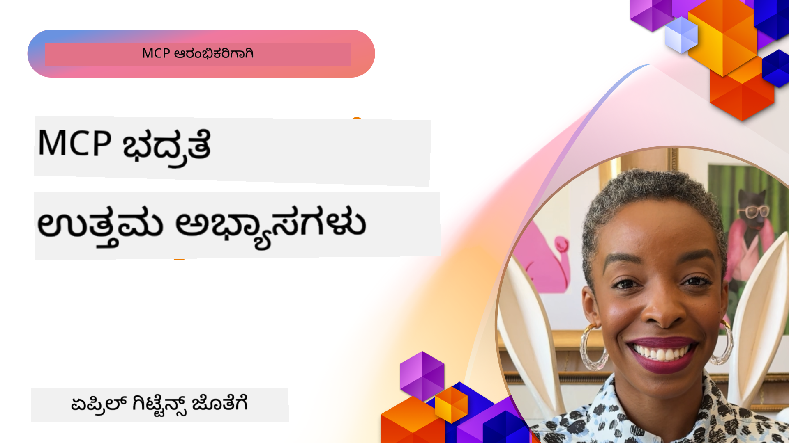

<!--
CO_OP_TRANSLATOR_METADATA:
{
  "original_hash": "1c767a35642f753127dc08545c25a290",
  "translation_date": "2025-12-11T11:25:55+00:00",
  "source_file": "02-Security/README.md",
  "language_code": "kn"
}
-->
# MCP ಭದ್ರತೆ: AI ವ್ಯವಸ್ಥೆಗಳಿಗಾಗಿ ಸಮಗ್ರ ರಕ್ಷಣೆ

_(ಈ ಪಾಠದ ವೀಡಿಯೋವನ್ನು ನೋಡಲು ಮೇಲಿನ ಚಿತ್ರವನ್ನು ಕ್ಲಿಕ್ ಮಾಡಿ)_

ಭದ್ರತೆ AI ವ್ಯವಸ್ಥೆಯ ವಿನ್ಯಾಸಕ್ಕೆ ಮೂಲಭೂತವಾಗಿದೆ, ಅದಕ್ಕಾಗಿ ನಾವು ಇದನ್ನು ನಮ್ಮ ಎರಡನೇ ವಿಭಾಗವಾಗಿ ಪ್ರಾಥಮ್ಯ ನೀಡುತ್ತೇವೆ. ಇದು Microsoft ನ [Secure Future Initiative](https://www.microsoft.com/security/blog/2025/04/17/microsofts-secure-by-design-journey-one-year-of-success/) ನ **Secure by Design** ತತ್ವದೊಂದಿಗೆ ಹೊಂದಿಕೆಯಾಗುತ್ತದೆ.

ಮಾದರಿ ಸನ್ನಿವೇಶ ಪ್ರೋಟೋಕಾಲ್ (MCP) AI ಚಾಲಿತ ಅಪ್ಲಿಕೇಶನ್‌ಗಳಿಗೆ ಶಕ್ತಿಶಾಲಿ ಹೊಸ ಸಾಮರ್ಥ್ಯಗಳನ್ನು ತರುತ್ತದೆ, ಆದರೆ ಸಾಂಪ್ರದಾಯಿಕ ಸಾಫ್ಟ್‌ವೇರ್ ಅಪಾಯಗಳಿಗಿಂತ ಮೀರಿದ ವಿಶಿಷ್ಟ ಭದ್ರತಾ ಸವಾಲುಗಳನ್ನು ಪರಿಚಯಿಸುತ್ತದೆ. MCP ವ್ಯವಸ್ಥೆಗಳು ಸ್ಥಾಪಿತ ಭದ್ರತಾ ಚಿಂತೆಗಳು (ಭದ್ರ ಕೋಡಿಂಗ್, ಕನಿಷ್ಠ привಿಲೇಜ್, ಸರಬರಾಜು ಸರಪಳಿ ಭದ್ರತೆ) ಮತ್ತು ಹೊಸ AI-ನಿರ್ದಿಷ್ಟ ಅಪಾಯಗಳನ್ನು ಎದುರಿಸುತ್ತವೆ, ಉದಾಹರಣೆಗೆ ಪ್ರಾಂಪ್ಟ್ ಇಂಜೆಕ್ಷನ್, ಉಪಕರಣ ವಿಷಕಾರಕತೆ, ಸೆಷನ್ ಹೈಜ್ಯಾಕಿಂಗ್, ಗೊಂದಲದ ಡೆಪ್ಯೂ ದಾಳಿಗಳು, ಟೋಕನ್ ಪಾಸ್ತ್ರೂ ವಲ್ನರಬಿಲಿಟಿಗಳು ಮತ್ತು ಡೈನಾಮಿಕ್ ಸಾಮರ್ಥ್ಯ ಬದಲಾವಣೆ.

ಈ ಪಾಠದಲ್ಲಿ MCP ಅನುಷ್ಠಾನಗಳಲ್ಲಿ ಅತ್ಯಂತ ಪ್ರಮುಖ ಭದ್ರತಾ ಅಪಾಯಗಳನ್ನು ಅನ್ವೇಷಿಸಲಾಗುತ್ತದೆ—ಪ್ರಮಾಣೀಕರಣ, ಪ್ರಾಧಿಕಾರ, ಅತಿರಿಕ್ತ ಅನುಮತಿಗಳು, ಪರೋಕ್ಷ ಪ್ರಾಂಪ್ಟ್ ಇಂಜೆಕ್ಷನ್, ಸೆಷನ್ ಭದ್ರತೆ, ಗೊಂದಲದ ಡೆಪ್ಯೂ ಸಮಸ್ಯೆಗಳು, ಟೋಕನ್ ನಿರ್ವಹಣೆ ಮತ್ತು ಸರಬರಾಜು ಸರಪಳಿ ದುರ್ಬಲತೆಗಳನ್ನು ಒಳಗೊಂಡಂತೆ. ನೀವು ಈ ಅಪಾಯಗಳನ್ನು ತಗ್ಗಿಸಲು ಕಾರ್ಯನಿರ್ವಹಣೀಯ ನಿಯಂತ್ರಣಗಳು ಮತ್ತು ಉತ್ತಮ ಅಭ್ಯಾಸಗಳನ್ನು ಕಲಿಯುತ್ತೀರಿ, ಜೊತೆಗೆ Microsoft ಪರಿಹಾರಗಳು Prompt Shields, Azure Content Safety ಮತ್ತು GitHub Advanced Security ಅನ್ನು ಬಳಸಿಕೊಂಡು ನಿಮ್ಮ MCP ನಿಯೋಜನೆಯನ್ನು ಬಲಪಡಿಸುವುದು.

## ಕಲಿಕೆಯ ಉದ್ದೇಶಗಳು

ಈ ಪಾಠದ ಅಂತ್ಯಕ್ಕೆ, ನೀವು ಸಾಧ್ಯವಾಗುವುದು:

- **MCP-ನಿರ್ದಿಷ್ಟ ಅಪಾಯಗಳನ್ನು ಗುರುತಿಸುವುದು**: MCP ವ್ಯವಸ್ಥೆಗಳಲ್ಲಿ ವಿಶಿಷ್ಟ ಭದ್ರತಾ ಅಪಾಯಗಳನ್ನು ಗುರುತಿಸುವುದು, ಉದಾಹರಣೆಗೆ ಪ್ರಾಂಪ್ಟ್ ಇಂಜೆಕ್ಷನ್, ಉಪಕರಣ ವಿಷಕಾರಕತೆ, ಅತಿರಿಕ್ತ ಅನುಮತಿಗಳು, ಸೆಷನ್ ಹೈಜ್ಯಾಕಿಂಗ್, ಗೊಂದಲದ ಡೆಪ್ಯೂ ಸಮಸ್ಯೆಗಳು, ಟೋಕನ್ ಪಾಸ್ತ್ರೂ ದುರ್ಬಲತೆಗಳು ಮತ್ತು ಸರಬರಾಜು ಸರಪಳಿ ಅಪಾಯಗಳು
- **ಭದ್ರತಾ ನಿಯಂತ್ರಣಗಳನ್ನು ಅನ್ವಯಿಸುವುದು**: ಬಲವಾದ ಪ್ರಮಾಣೀಕರಣ, ಕನಿಷ್ಠ привಿಲೇಜ್ ಪ್ರವೇಶ, ಭದ್ರ ಟೋಕನ್ ನಿರ್ವಹಣೆ, ಸೆಷನ್ ಭದ್ರತಾ ನಿಯಂತ್ರಣಗಳು ಮತ್ತು ಸರಬರಾಜು ಸರಪಳಿ ಪರಿಶೀಲನೆ ಸೇರಿದಂತೆ ಪರಿಣಾಮಕಾರಿ ತಡೆಗಟ್ಟುವಿಕೆಗಳನ್ನು ಜಾರಿಗೆ ತರುವುದು
- **Microsoft ಭದ್ರತಾ ಪರಿಹಾರಗಳನ್ನು ಬಳಸಿಕೊಳ್ಳುವುದು**: MCP ಕಾರ್ಯಭಾರ ರಕ್ಷಣೆಗೆ Microsoft Prompt Shields, Azure Content Safety ಮತ್ತು GitHub Advanced Security ಅನ್ನು ಅರ್ಥಮಾಡಿಕೊಳ್ಳಿ ಮತ್ತು ನಿಯೋಜಿಸಿ
- **ಉಪಕರಣ ಭದ್ರತೆಯನ್ನು ಪರಿಶೀಲಿಸುವುದು**: ಉಪಕರಣ ಮೆಟಾಡೇಟಾ ಪರಿಶೀಲನೆಯ ಮಹತ್ವವನ್ನು ಗುರುತಿಸಿ, ಡೈನಾಮಿಕ್ ಬದಲಾವಣೆಗಳ ಮೇಲ್ವಿಚಾರಣೆ ಮತ್ತು ಪರೋಕ್ಷ ಪ್ರಾಂಪ್ಟ್ ಇಂಜೆಕ್ಷನ್ ದಾಳಿಗಳ ವಿರುದ್ಧ ರಕ್ಷಣೆ
- **ಉತ್ತಮ ಅಭ್ಯಾಸಗಳನ್ನು ಸಂಯೋಜಿಸುವುದು**: ಸ್ಥಾಪಿತ ಭದ್ರತಾ ಮೂಲತತ್ವಗಳು (ಭದ್ರ ಕೋಡಿಂಗ್, ಸರ್ವರ್ ಹಾರ್ಡನಿಂಗ್, ಶೂನ್ಯ ನಂಬಿಕೆ) ಮತ್ತು MCP-ನಿರ್ದಿಷ್ಟ ನಿಯಂತ್ರಣಗಳನ್ನು ಸಮಗ್ರ ರಕ್ಷಣೆಗೆ ಸಂಯೋಜಿಸುವುದು

# MCP ಭದ್ರತಾ ವಾಸ್ತುಶಿಲ್ಪ ಮತ್ತು ನಿಯಂತ್ರಣಗಳು

ಆಧುನಿಕ MCP ಅನುಷ್ಠಾನಗಳು ಸಾಂಪ್ರದಾಯಿಕ ಸಾಫ್ಟ್‌ವೇರ್ ಭದ್ರತೆ ಮತ್ತು AI-ನಿರ್ದಿಷ್ಟ ಅಪಾಯಗಳನ್ನು ಪರಿಹರಿಸುವ ಪದರಬದ್ಧ ಭದ್ರತಾ ವಿಧಾನಗಳನ್ನು ಅಗತ್ಯವಿದೆ. ವೇಗವಾಗಿ ಅಭಿವೃದ್ಧಿಯಾಗುತ್ತಿರುವ MCP ನಿರ್ದಿಷ್ಟತೆ ತನ್ನ ಭದ್ರತಾ ನಿಯಂತ್ರಣಗಳನ್ನು ಮೆರೆಯುತ್ತಾ, ಎಂಟರ್‌ಪ್ರೈಸ್ ಭದ್ರತಾ ವಾಸ್ತುಶಿಲ್ಪಗಳೊಂದಿಗೆ ಮತ್ತು ಸ್ಥಾಪಿತ ಉತ್ತಮ ಅಭ್ಯಾಸಗಳೊಂದಿಗೆ ಉತ್ತಮ ಸಂಯೋಜನೆಯನ್ನು ಸಾಧ್ಯಮಾಡುತ್ತಿದೆ.

[Microsoft Digital Defense Report](https://aka.ms/mddr) ನ ಸಂಶೋಧನೆ ಪ್ರಕಾರ **98% ವರದಿಯಾದ ಉಲ್ಲಂಘನೆಗಳನ್ನು ಬಲವಾದ ಭದ್ರತಾ ಸ್ವಚ್ಛತೆ ಮೂಲಕ ತಡೆಯಬಹುದು**. ಅತ್ಯಂತ ಪರಿಣಾಮಕಾರಿ ರಕ್ಷಣಾ ತಂತ್ರವು ಮೂಲಭೂತ ಭದ್ರತಾ ಅಭ್ಯಾಸಗಳನ್ನು MCP-ನಿರ್ದಿಷ್ಟ ನಿಯಂತ್ರಣಗಳೊಂದಿಗೆ ಸಂಯೋಜಿಸುವುದಾಗಿದೆ—ಪ್ರಮಾಣಿತ ಭದ್ರತಾ ಕ್ರಮಗಳು ಒಟ್ಟು ಭದ್ರತಾ ಅಪಾಯವನ್ನು ಕಡಿಮೆ ಮಾಡುವಲ್ಲಿ ಅತ್ಯಂತ ಪರಿಣಾಮಕಾರಿ.

## ಪ್ರಸ್ತುತ ಭದ್ರತಾ ಪರಿಸರ

> **ಗಮನಿಸಿ:** ಈ ಮಾಹಿತಿ **ಆಗಸ್ಟ್ 18, 2025** ರ MCP ಭದ್ರತಾ ಮಾನದಂಡಗಳನ್ನು ಪ್ರತಿಬಿಂಬಿಸುತ್ತದೆ. MCP ಪ್ರೋಟೋಕಾಲ್ ವೇಗವಾಗಿ ಅಭಿವೃದ್ಧಿಯಾಗುತ್ತಿದ್ದು, ಭವಿಷ್ಯದ ಅನುಷ್ಠಾನಗಳು ಹೊಸ ಪ್ರಮಾಣೀಕರಣ ಮಾದರಿಗಳನ್ನು ಮತ್ತು ಸುಧಾರಿತ ನಿಯಂತ್ರಣಗಳನ್ನು ಪರಿಚಯಿಸಬಹುದು. ಸದಾ ಪ್ರಸ್ತುತ [MCP ನಿರ್ದಿಷ್ಟತೆ](https://spec.modelcontextprotocol.io/), [MCP GitHub ಸಂಗ್ರಹಾಲಯ](https://github.com/modelcontextprotocol) ಮತ್ತು [ಭದ್ರತಾ ಉತ್ತಮ ಅಭ್ಯಾಸಗಳ ಡಾಕ್ಯುಮೆಂಟೇಶನ್](https://modelcontextprotocol.io/specification/2025-06-18/basic/security_best_practices) ಅನ್ನು ನೋಡಿ.

### MCP ಪ್ರಮಾಣೀಕರಣದ ಅಭಿವೃದ್ಧಿ

MCP ನಿರ್ದಿಷ್ಟತೆ ಪ್ರಮಾಣೀಕರಣ ಮತ್ತು ಪ್ರಾಧಿಕಾರಕ್ಕೆ ಸಂಬಂಧಿಸಿದಂತೆ ಬಹುಮಟ್ಟಿಗೆ ಅಭಿವೃದ್ಧಿ ಹೊಂದಿದೆ:

- **ಮೂಲ ವಿಧಾನ**: ಆರಂಭಿಕ ನಿರ್ದಿಷ್ಟತೆಗಳು ಡೆವಲಪರ್‌ಗಳು ಕಸ್ಟಮ್ ಪ್ರಮಾಣೀಕರಣ ಸರ್ವರ್‌ಗಳನ್ನು ಜಾರಿಗೆ ತರುವಂತೆ ಕೇಳುತ್ತವೆ, MCP ಸರ್ವರ್‌ಗಳು OAuth 2.0 ಪ್ರಾಧಿಕಾರ ಸರ್ವರ್‌ಗಳಾಗಿ ಕಾರ್ಯನಿರ್ವಹಿಸಿ ಬಳಕೆದಾರರ ಪ್ರಮಾಣೀಕರಣವನ್ನು ನೇರವಾಗಿ ನಿರ್ವಹಿಸುತ್ತವೆ
- **ಪ್ರಸ್ತುತ ಮಾನದಂಡ (2025-06-18)**: ನವೀಕೃತ ನಿರ್ದಿಷ್ಟತೆ MCP ಸರ್ವರ್‌ಗಳು ಹೊರಗಿನ ಗುರುತಿನ ಒದಗಿಸುವವರ (ಉದಾ. Microsoft Entra ID) ಬಳಿ ಪ್ರಮಾಣೀಕರಣವನ್ನು ನಿಯೋಜಿಸಲು ಅನುಮತಿಸುತ್ತದೆ, ಭದ್ರತಾ ಸ್ಥಿತಿಯನ್ನು ಸುಧಾರಿಸುತ್ತದೆ ಮತ್ತು ಅನುಷ್ಠಾನ ಸಂಕೀರ್ಣತೆಯನ್ನು ಕಡಿಮೆ ಮಾಡುತ್ತದೆ
- **ಟ್ರಾನ್ಸ್‌ಪೋರ್ಟ್ ಲೇಯರ್ ಭದ್ರತೆ**: ಸ್ಥಳೀಯ (STDIO) ಮತ್ತು ದೂರಸ್ಥ (Streamable HTTP) ಸಂಪರ್ಕಗಳಿಗೆ ಸರಿಯಾದ ಪ್ರಮಾಣೀಕರಣ ಮಾದರಿಗಳೊಂದಿಗೆ ಭದ್ರ ಟ್ರಾನ್ಸ್‌ಪೋರ್ಟ್ ವ್ಯವಸ್ಥೆಗಳ ಬೆಂಬಲವನ್ನು ಹೆಚ್ಚಿಸಿದೆ

## ಪ್ರಮಾಣೀಕರಣ ಮತ್ತು ಪ್ರಾಧಿಕಾರ ಭದ್ರತೆ

### ಪ್ರಸ್ತುತ ಭದ್ರತಾ ಸವಾಲುಗಳು

ಆಧುನಿಕ MCP ಅನುಷ್ಠಾನಗಳು ಹಲವಾರು ಪ್ರಮಾಣೀಕರಣ ಮತ್ತು ಪ್ರಾಧಿಕಾರ ಸವಾಲುಗಳನ್ನು ಎದುರಿಸುತ್ತವೆ:

### ಅಪಾಯಗಳು ಮತ್ತು ದಾಳಿಯ ಮಾರ್ಗಗಳು

- **ತಪ್ಪಾಗಿ ಸಂರಚಿಸಲಾದ ಪ್ರಾಧಿಕಾರ ಲಾಜಿಕ್**: MCP ಸರ್ವರ್‌ಗಳಲ್ಲಿ ದೋಷಪೂರಿತ ಪ್ರಾಧಿಕಾರ ಜಾರಿಗೆ ಸಂವೇದನಾಶೀಲ ಡೇಟಾವನ್ನು ಬಹಿರಂಗಪಡಿಸಬಹುದು ಮತ್ತು ತಪ್ಪಾಗಿ ಪ್ರವೇಶ ನಿಯಂತ್ರಣಗಳನ್ನು ಅನ್ವಯಿಸಬಹುದು
- **OAuth ಟೋಕನ್ ಕಳವು**: ಸ್ಥಳೀಯ MCP ಸರ್ವರ್ ಟೋಕನ್ ಕಳವು ದಾಳಿಗಾರರಿಗೆ ಸರ್ವರ್‌ಗಳಾಗಿ ನಕಲಿ ಮಾಡಿಕೊಳ್ಳಲು ಮತ್ತು ಡೌನ್‌ಸ್ಟ್ರೀಮ್ ಸೇವೆಗಳಿಗೆ ಪ್ರವೇಶ ಪಡೆಯಲು ಅವಕಾಶ ನೀಡುತ್ತದೆ
- **ಟೋಕನ್ ಪಾಸ್ತ್ರೂ ದುರ್ಬಲತೆಗಳು**: ತಪ್ಪಾಗಿ ಟೋಕನ್ ನಿರ್ವಹಣೆ ಭದ್ರತಾ ನಿಯಂತ್ರಣಗಳನ್ನು ಬಾಯ್‌ಪಾಸ್ ಮಾಡುತ್ತದೆ ಮತ್ತು ಹೊಣೆಗಾರಿಕೆ ಗ್ಯಾಪ್‌ಗಳನ್ನು ಉಂಟುಮಾಡುತ್ತದೆ
- **ಅತಿರಿಕ್ತ ಅನುಮತಿಗಳು**: ಅಧಿಕ привಿಲೇಜ್ ಹೊಂದಿರುವ MCP ಸರ್ವರ್‌ಗಳು ಕನಿಷ್ಠ привಿಲೇಜ್ ತತ್ವವನ್ನು ಉಲ್ಲಂಘಿಸಿ ದಾಳಿಯ ಮೇಲ್ಮೈಗಳನ್ನು ವಿಸ್ತರಿಸುತ್ತವೆ

#### ಟೋಕನ್ ಪಾಸ್ತ್ರೂ: ಗಂಭೀರ ವಿರೋಧ ಮಾದರಿ

ಪ್ರಸ್ತುತ MCP ಪ್ರಾಧಿಕಾರ ನಿರ್ದಿಷ್ಟತೆಯಲ್ಲಿ **ಟೋಕನ್ ಪಾಸ್ತ್ರೂ ಸ್ಪಷ್ಟವಾಗಿ ನಿಷೇಧಿಸಲಾಗಿದೆ** ಗಂಭೀರ ಭದ್ರತಾ ಪರಿಣಾಮಗಳ ಕಾರಣದಿಂದ:

##### ಭದ್ರತಾ ನಿಯಂತ್ರಣ ತಿರಸ್ಕರಣೆ
- MCP ಸರ್ವರ್‌ಗಳು ಮತ್ತು ಡೌನ್‌ಸ್ಟ್ರೀಮ್ API ಗಳು (ರೇಟ್ ಲಿಮಿಟಿಂಗ್, ವಿನಂತಿ ಪರಿಶೀಲನೆ, ಟ್ರಾಫಿಕ್ ಮೇಲ್ವಿಚಾರಣೆ) ಮುಂತಾದ ಪ್ರಮುಖ ಭದ್ರತಾ ನಿಯಂತ್ರಣಗಳನ್ನು ಜಾರಿಗೆ ತರುತ್ತವೆ, ಅವು ಸರಿಯಾದ ಟೋಕನ್ ಪರಿಶೀಲನೆಗೆ ಅವಲಂಬಿತವಾಗಿವೆ
- ನೇರ ಕ್ಲೈಂಟ್-ಟು-API ಟೋಕನ್ ಬಳಕೆ ಈ ಅವಶ್ಯಕ ರಕ್ಷಣೆಯನ್ನು ಬಾಯ್‌ಪಾಸ್ ಮಾಡುತ್ತದೆ, ಭದ್ರತಾ ವಾಸ್ತುಶಿಲ್ಪವನ್ನು ಹಾಳುಮಾಡುತ್ತದೆ

##### ಹೊಣೆಗಾರಿಕೆ ಮತ್ತು ಆಡಿಟ್ ಸವಾಲುಗಳು  
- MCP ಸರ್ವರ್‌ಗಳು ಅಪ್‌ಸ್ಟ್ರೀಮ್ ನೀಡಿದ ಟೋಕನ್‌ಗಳನ್ನು ಬಳಸುವ ಕ್ಲೈಂಟ್‌ಗಳನ್ನು ವಿಭಿನ್ನಗೊಳಿಸಲು ಸಾಧ್ಯವಿಲ್ಲ, ಆದ್ದರಿಂದ ಆಡಿಟ್ ಟ್ರೇಲ್ಗಳು ಮುರಿಯುತ್ತವೆ
- ಡೌನ್‌ಸ್ಟ್ರೀಮ್ ಸಂಪನ್ಮೂಲ ಸರ್ವರ್ ಲಾಗ್‌ಗಳು ತಪ್ಪು ವಿನಂತಿ ಮೂಲಗಳನ್ನು ತೋರಿಸುತ್ತವೆ, ನಿಜವಾದ MCP ಸರ್ವರ್ ಮಧ್ಯವರ್ತಿಗಳನ್ನು ಅಲ್ಲ
- ಘಟನೆ ತನಿಖೆ ಮತ್ತು ಅನುಕೂಲತೆ ಆಡಿಟಿಂಗ್ ಬಹಳ ಕಷ್ಟಕರವಾಗುತ್ತದೆ

##### ಡೇಟಾ ಹೊರಹಾಕುವ ಅಪಾಯಗಳು
- ಪರಿಶೀಲಿಸಲಾಗದ ಟೋಕನ್ ಹಕ್ಕುಗಳು ಕಳ್ಳರ ಟೋಕನ್‌ಗಳೊಂದಿಗೆ MCP ಸರ್ವರ್‌ಗಳನ್ನು ಡೇಟಾ ಹೊರಹಾಕುವ ಪ್ರಾಕ್ಸಿಗಳಾಗಿ ಬಳಸಲು ಅವಕಾಶ ನೀಡುತ್ತವೆ
- ನಂಬಿಕೆ ಗಡಿಬಿಡಿ ಉಲ್ಲಂಘನೆಗಳು ಉದ್ದೇಶಿತ ಭದ್ರತಾ ನಿಯಂತ್ರಣಗಳನ್ನು ಬಾಯ್‌ಪಾಸ್ ಮಾಡುವ ಪ್ರವೇಶ ಮಾದರಿಗಳನ್ನು ಅನುಮತಿಸುತ್ತವೆ

##### ಬಹು-ಸೇವಾ ದಾಳಿ ಮಾರ್ಗಗಳು
- ಒಡೆತಗೊಂಡ ಟೋಕನ್‌ಗಳನ್ನು ಹಲವಾರು ಸೇವೆಗಳು ಸ್ವೀಕರಿಸುವುದರಿಂದ ಸಂಪರ್ಕಿತ ವ್ಯವಸ್ಥೆಗಳ ನಡುವೆ ಲ್ಯಾಟರಲ್ ಚಲನೆ ಸಾಧ್ಯವಾಗುತ್ತದೆ
- ಟೋಕನ್ ಮೂಲಗಳನ್ನು ಪರಿಶೀಲಿಸಲಾಗದಾಗ ಸೇವೆಗಳ ನಡುವೆ ನಂಬಿಕೆ ಊಹೆಗಳು ಉಲ್ಲಂಘಿತವಾಗಬಹುದು

### ಭದ್ರತಾ ನಿಯಂತ್ರಣಗಳು ಮತ್ತು ತಡೆಗಟ್ಟುವಿಕೆಗಳು

**ಗಂಭೀರ ಭದ್ರತಾ ಅಗತ್ಯಗಳು:**

> **ಅತ್ಯಾವಶ್ಯಕ**: MCP ಸರ್ವರ್‌ಗಳು **MCP ಸರ್ವರ್‌ಗೆ ಸ್ಪಷ್ಟವಾಗಿ ನೀಡದ ಯಾವುದೇ ಟೋಕನ್‌ಗಳನ್ನು ಸ್ವೀಕರಿಸಬಾರದು**

#### ಪ್ರಮಾಣೀಕರಣ ಮತ್ತು ಪ್ರಾಧಿಕಾರ ನಿಯಂತ್ರಣಗಳು

- **ಕಠಿಣ ಪ್ರಾಧಿಕಾರ ಪರಿಶೀಲನೆ**: MCP ಸರ್ವರ್ ಪ್ರಾಧಿಕಾರ ಲಾಜಿಕ್‌ನ ಸಮಗ್ರ ಆಡಿಟ್ ನಡೆಸಿ, ಕೇವಲ ಉದ್ದೇಶಿತ ಬಳಕೆದಾರರು ಮತ್ತು ಕ್ಲೈಂಟ್‌ಗಳು ಸಂವೇದನಾಶೀಲ ಸಂಪನ್ಮೂಲಗಳಿಗೆ ಪ್ರವೇಶ ಹೊಂದುವಂತೆ ಖಚಿತಪಡಿಸಿಕೊಳ್ಳಿ
  - **ಅನುಷ್ಠಾನ ಮಾರ್ಗದರ್ಶಿ**: [Azure API Management as Authentication Gateway for MCP Servers](https://techcommunity.microsoft.com/blog/integrationsonazureblog/azure-api-management-your-auth-gateway-for-mcp-servers/4402690)
  - **ಗುರುತಿನ ಸಂಯೋಜನೆ**: [Microsoft Entra ID ಬಳಸಿ MCP ಸರ್ವರ್ ಪ್ರಮಾಣೀಕರಣ](https://den.dev/blog/mcp-server-auth-entra-id-session/)

- **ಭದ್ರ ಟೋಕನ್ ನಿರ್ವಹಣೆ**: [Microsoft ನ ಟೋಕನ್ ಪರಿಶೀಲನೆ ಮತ್ತು ಜೀವನಚಕ್ರ ಉತ್ತಮ ಅಭ್ಯಾಸಗಳು](https://learn.microsoft.com/en-us/entra/identity-platform/access-tokens) ಜಾರಿಗೆ ತರುವುದಾಗಿ
  - ಟೋಕನ್ ಪ್ರೇಕ್ಷಕ ಹಕ್ಕುಗಳು MCP ಸರ್ವರ್ ಗುರುತಿನೊಂದಿಗೆ ಹೊಂದಿಕೆಯಾಗುವಂತೆ ಪರಿಶೀಲಿಸಿ
  - ಸರಿಯಾದ ಟೋಕನ್ ರೋಟೇಶನ್ ಮತ್ತು ಅವಧಿ ನಿಯಮಗಳನ್ನು ಜಾರಿಗೆ ತರುವುದು
  - ಟೋಕನ್ ಮರುಪ್ರಯೋಗ ದಾಳಿಗಳನ್ನು ಮತ್ತು ಅನಧಿಕೃತ ಬಳಕೆಯನ್ನು ತಡೆಯುವುದು

- **ರಕ್ಷಿತ ಟೋಕನ್ ಸಂಗ್ರಹಣೆ**: ವಿಶ್ರಾಂತಿ ಮತ್ತು ಸಂಚಾರದಲ್ಲಿ ಎನ್ಕ್ರಿಪ್ಷನ್ ಮೂಲಕ ಟೋಕನ್ ಸಂಗ್ರಹಣೆಯನ್ನು ಭದ್ರಗೊಳಿಸಿ
  - **ಉತ್ತಮ ಅಭ್ಯಾಸಗಳು**: [ಭದ್ರ ಟೋಕನ್ ಸಂಗ್ರಹಣೆ ಮತ್ತು ಎನ್ಕ್ರಿಪ್ಷನ್ ಮಾರ್ಗಸೂಚಿಗಳು](https://youtu.be/uRdX37EcCwg?si=6fSChs1G4glwXRy2)

#### ಪ್ರವೇಶ ನಿಯಂತ್ರಣ ಜಾರಿಗೆ

- **ಕನಿಷ್ಠ привಿಲೇಜ್ ತತ್ವ**: MCP ಸರ್ವರ್‌ಗಳಿಗೆ ಕೇವಲ ಉದ್ದೇಶಿತ ಕಾರ್ಯಕ್ಷಮತೆಯಿಗಾಗಿ ಕನಿಷ್ಠ ಅನುಮತಿಗಳನ್ನು ನೀಡಿ
  - ನಿಯಮಿತ ಅನುಮತಿ ಪರಿಶೀಲನೆ ಮತ್ತು ನವೀಕರಣಗಳು привಿಲೇಜ್ ಕ್ರೀಪ್ ತಡೆಯಲು
  - **Microsoft ಡಾಕ್ಯುಮೆಂಟೇಶನ್**: [ಭದ್ರ ಕನಿಷ್ಠ-ಪ್ರивಿಲೇಜ್ ಪ್ರವೇಶ](https://learn.microsoft.com/entra/identity-platform/secure-least-privileged-access)

- **ಪಾತ್ರಾಧಾರಿತ ಪ್ರವೇಶ ನಿಯಂತ್ರಣ (RBAC)**: ಸೂಕ್ಷ್ಮ ಪಾತ್ರ ನಿಯೋಜನೆಗಳನ್ನು ಜಾರಿಗೆ ತರುವುದು
  - ಪಾತ್ರಗಳನ್ನು ನಿರ್ದಿಷ್ಟ ಸಂಪನ್ಮೂಲಗಳು ಮತ್ತು ಕ್ರಿಯೆಗಳಿಗಷ್ಟೇ ಕಟ್ಟುನಿಟ್ಟಾಗಿ ವ್ಯಾಪಿಸು
  - ದಾಳಿಯ ಮೇಲ್ಮೈಗಳನ್ನು ವಿಸ್ತರಿಸುವ ಅಗತ್ಯವಿಲ್ಲದ ಅಥವಾ ವ್ಯಾಪಕ ಅನುಮತಿಗಳನ್ನು ತಪ್ಪಿಸಿ

- **ನಿರಂತರ ಅನುಮತಿ ಮೇಲ್ವಿಚಾರಣೆ**: ನಿರಂತರ ಪ್ರವೇಶ ಆಡಿಟ್ ಮತ್ತು ಮೇಲ್ವಿಚಾರಣೆಯನ್ನು ಜಾರಿಗೆ ತರುವುದು
  - ಅನುಮತಿ ಬಳಕೆ ಮಾದರಿಗಳನ್ನು ಅನೋಮಲಿಗಳಿಗಾಗಿ ಮೇಲ್ವಿಚಾರಣೆ ಮಾಡಿ
  - ಅತಿರಿಕ್ತ ಅಥವಾ ಬಳಕೆಯಾಗದ привಿಲೇಜ್‌ಗಳನ್ನು ತಕ್ಷಣ ಸರಿಪಡಿಸಿ

## AI-ನಿರ್ದಿಷ್ಟ ಭದ್ರತಾ ಅಪಾಯಗಳು

### ಪ್ರಾಂಪ್ಟ್ ಇಂಜೆಕ್ಷನ್ ಮತ್ತು ಉಪಕರಣ ಮ್ಯಾನಿಪ್ಯುಲೇಶನ್ ದಾಳಿಗಳು

ಆಧುನಿಕ MCP ಅನುಷ್ಠಾನಗಳು ಸಾಂಪ್ರದಾಯಿಕ ಭದ್ರತಾ ಕ್ರಮಗಳು ಸಂಪೂರ್ಣವಾಗಿ ಪರಿಹರಿಸಲು ಸಾಧ್ಯವಿಲ್ಲದ ಸುಕ್ಷ್ಮ AI-ನಿರ್ದಿಷ್ಟ ದಾಳಿ ಮಾರ್ಗಗಳನ್ನು ಎದುರಿಸುತ್ತವೆ:

#### **ಪರೋಕ್ಷ ಪ್ರಾಂಪ್ಟ್ ಇಂಜೆಕ್ಷನ್ (ಕ್ರಾಸ್-ಡೊಮೇನ್ ಪ್ರಾಂಪ್ಟ್ ಇಂಜೆಕ್ಷನ್)**

**ಪರೋಕ್ಷ ಪ್ರಾಂಪ್ಟ್ ಇಂಜೆಕ್ಷನ್** MCP-ಸಕ್ರಿಯ AI ವ್ಯವಸ್ಥೆಗಳಲ್ಲಿ ಅತ್ಯಂತ ಗಂಭೀರ ದುರ್ಬಲತೆಯೊಂದನ್ನು ಪ್ರತಿನಿಧಿಸುತ್ತದೆ. ದಾಳಿಗಾರರು ದೋಷಪೂರಿತ ಸೂಚನೆಗಳನ್ನು ಹೊರಗಿನ ವಿಷಯಗಳಲ್ಲಿ—ದಾಖಲೆಗಳು, ವೆಬ್ ಪುಟಗಳು, ಇಮೇಲ್‌ಗಳು ಅಥವಾ ಡೇಟಾ ಮೂಲಗಳು—ಒಳಗೊಳಿಸುತ್ತಾರೆ, ಅವುಗಳನ್ನು AI ವ್ಯವಸ್ಥೆಗಳು ನಂತರ ಮಾನ್ಯ ಆದೇಶಗಳಾಗಿ ಪ್ರಕ್ರಿಯೆ ಮಾಡುತ್ತವೆ.

**ದಾಳಿ ದೃಶ್ಯಗಳು:**
- **ದಾಖಲೆ ಆಧಾರಿತ ಇಂಜೆಕ್ಷನ್**: ಪ್ರಕ್ರಿಯೆಗೊಳಿಸಿದ ದಾಖಲೆಗಳಲ್ಲಿ ಮರೆಮಾಚಿದ ದುಷ್ಟ ಸೂಚನೆಗಳು ಅನಿರೀಕ್ಷಿತ AI ಕ್ರಿಯೆಗಳನ್ನು ಪ್ರೇರೇಪಿಸುತ್ತವೆ
- **ವೆಬ್ ವಿಷಯ ದುರುಪಯೋಗ**: ಸ್ಕ್ರ್ಯಾಪ್ ಮಾಡಿದಾಗ AI ವರ್ತನೆಯನ್ನು ನಿಯಂತ್ರಿಸುವ ಎम्बೆಡ್ಡೆಡ್ ಪ್ರಾಂಪ್ಟ್‌ಗಳನ್ನು ಹೊಂದಿರುವ ಹಾಳಾದ ವೆಬ್ ಪುಟಗಳು
- **ಇಮೇಲ್ ಆಧಾರಿತ ದಾಳಿಗಳು**: AI ಸಹಾಯಕರಿಂದ ಮಾಹಿತಿಯನ್ನು ಲೀಕ್ ಮಾಡಿಸುವ ಅಥವಾ ಅನಧಿಕೃತ ಕ್ರಿಯೆಗಳನ್ನು ಮಾಡುವ ದುಷ್ಟ ಪ್ರಾಂಪ್ಟ್‌ಗಳು ಇಮೇಲ್‌ಗಳಲ್ಲಿ
- **ಡೇಟಾ ಮೂಲ ಮಾಲಿನ್ಯ**: ಹಾಳಾದ ಡೇಟಾಬೇಸ್‌ಗಳು ಅಥವಾ API ಗಳು AI ವ್ಯವಸ್ಥೆಗಳಿಗೆ ಮಾಲಿನ್ಯಗೊಂಡ ವಿಷಯವನ್ನು ಒದಗಿಸುವುದು

**ವಾಸ್ತವಿಕ ಪರಿಣಾಮ**: ಈ ದಾಳಿಗಳು ಡೇಟಾ ಹೊರಹಾಕುವಿಕೆ, ಗೌಪ್ಯತೆ ಉಲ್ಲಂಘನೆಗಳು, ಹಾನಿಕಾರಕ ವಿಷಯ ಸೃಷ್ಟಿ ಮತ್ತು ಬಳಕೆದಾರ ಸಂವಹನದ ಮ್ಯಾನಿಪ್ಯುಲೇಶನ್‌ಗೆ ಕಾರಣವಾಗಬಹುದು. ವಿವರವಾದ ವಿಶ್ಲೇಷಣೆಗೆ [Prompt Injection in MCP (Simon Willison)](https://simonwillison.net/2025/Apr/9/mcp-prompt-injection/) ನೋಡಿ.

#### **ಉಪಕರಣ ವಿಷಕಾರಕತೆ ದಾಳಿಗಳು**

**ಉಪಕರಣ ವಿಷಕಾರಕತೆ** MCP ಉಪಕರಣಗಳನ್ನು ವ್ಯಾಖ್ಯಾನಿಸುವ ಮೆಟಾಡೇಟಾವನ್ನು ಗುರಿಯಾಗಿಸಿಕೊಂಡು, LLM ಗಳು ಉಪಕರಣ ವಿವರಣೆಗಳು ಮತ್ತು ಪರಿಮಾಣಗಳನ್ನು ಹೇಗೆ ಅರ್ಥಮಾಡಿಕೊಳ್ಳುತ್ತವೆ ಎಂಬುದನ್ನು ದುರುಪಯೋಗ ಮಾಡುತ್ತದೆ.

**ದಾಳಿ ವಿಧಾನಗಳು:**
- **ಮೆಟಾಡೇಟಾ ಮ್ಯಾನಿಪ್ಯುಲೇಶನ್**: ದಾಳಿಗಾರರು ಉಪಕರಣ ವಿವರಣೆಗಳು, ಪರಿಮಾಣ ವ್ಯಾಖ್ಯಾನಗಳು ಅಥವಾ ಬಳಕೆ ಉದಾಹರಣೆಗಳಲ್ಲಿ ದುಷ್ಟ ಸೂಚನೆಗಳನ್ನು ಸೇರಿಸುತ್ತಾರೆ
- **ಅದೃಶ್ಯ ಸೂಚನೆಗಳು**: ಮಾನವ ಬಳಕೆದಾರರಿಗೆ ಕಾಣದ, AI ಮಾದರಿಗಳು ಪ್ರಕ್ರಿಯೆ ಮಾಡುವ ಉಪಕರಣ ಮೆಟಾಡೇಟಾದಲ್ಲಿ ಮರೆಮಾಚಿದ ಪ್ರಾಂಪ್ಟ್‌ಗಳು
- **ಡೈನಾಮಿಕ್ ಉಪಕರಣ ಬದಲಾವಣೆ ("ರಗ್ ಪುಲ್ಸ್")**: ಬಳಕೆದಾರರಿಂದ ಅನುಮೋದಿತ ಉಪಕರಣಗಳನ್ನು ನಂತರ ದುಷ್ಟ ಕ್ರಿಯೆಗಳಿಗೆ ಬದಲಾಯಿಸುವುದು, ಬಳಕೆದಾರರ ಅರಿವಿಲ್ಲದೆ
- **ಅಧಿಕಾರ ಪರಿಶೀಲನೆ**: ಅಧಿಕೃತತೆ ಅನುಷ್ಠಾನಗೊಳಿಸುವ MCP ಸರ್ವರ್‌ಗಳು ಎಲ್ಲಾ ಒಳಬರುವ ವಿನಂತಿಗಳನ್ನು ಪರಿಶೀಲಿಸಬೇಕು ಮತ್ತು ಪ್ರಮಾಣೀಕರಣಕ್ಕಾಗಿ ಸೆಷನ್‌ಗಳ ಮೇಲೆ ಅವಲಂಬಿಸಬಾರದು  
- **ಸುರಕ್ಷಿತ ಸೆಷನ್ ರಚನೆ**: ಕ್ರಿಪ್ಟೋಗ್ರಾಫಿಕ್‌ವಾಗಿ ಸುರಕ್ಷಿತ, ನಿರ್ಧಾರಾತ್ಮಕವಲ್ಲದ ಸೆಷನ್ ಐಡಿಗಳನ್ನು ಸುರಕ್ಷಿತ ಯಾದೃಚ್ಛಿಕ ಸಂಖ್ಯೆ ಜನರೇಟರ್‌ಗಳೊಂದಿಗೆ ರಚಿಸಿ  
- **ಬಳಕೆದಾರ-ನಿರ್ದಿಷ್ಟ ಬಂಧನ**: ಸೆಷನ್ ಐಡಿಗಳನ್ನು ಬಳಕೆದಾರ-ನಿರ್ದಿಷ್ಟ ಮಾಹಿತಿಗೆ `<user_id>:<session_id>` ಮಾದರಿಯಲ್ಲಿ ಬಂಧಿಸಿ, ಬಳಕೆದಾರರ ನಡುವೆ ಸೆಷನ್ ದುರುಪಯೋಗವನ್ನು ತಡೆಯಲು  
- **ಸೆಷನ್ ಜೀವನಚಕ್ರ ನಿರ್ವಹಣೆ**: ದುರ್ಬಲತೆ ವಿಂಡೋಗಳನ್ನು ಮಿತಿಗೊಳಿಸಲು ಸರಿಯಾದ ಅವಧಿ, ರೋಟೇಶನ್ ಮತ್ತು ಅಮಾನ್ಯತೆ ಅನುಷ್ಠಾನಗೊಳಿಸಿ  
- **ಸಂವಹನ ಸುರಕ್ಷತೆ**: ಸೆಷನ್ ಐಡಿ ಹಗರಣ ತಡೆಯಲು ಎಲ್ಲಾ ಸಂವಹನಗಳಿಗೆ ಕಡ್ಡಾಯ HTTPS ಬಳಸಿ  

### ಗೊಂದಲಗೊಂಡ ಡೆಪ್ಯೂಟಿ ಸಮಸ್ಯೆ

**ಗೊಂದಲಗೊಂಡ ಡೆಪ್ಯೂಟಿ ಸಮಸ್ಯೆ** ಆಗುತ್ತದೆ MCP ಸರ್ವರ್‌ಗಳು ಗ್ರಾಹಕರು ಮತ್ತು ಮೂರನೇ ಪಕ್ಷದ ಸೇವೆಗಳ ನಡುವೆ ಪ್ರಮಾಣೀಕರಣ ಪ್ರಾಕ್ಸಿಗಳಾಗಿ ಕಾರ್ಯನಿರ್ವಹಿಸುವಾಗ, ಸ್ಥಿರ ಗ್ರಾಹಕ ಐಡಿ ದುರುಪಯೋಗದಿಂದ ಅಧಿಕೃತತೆ ಬೈಸ್ಪಾಸ್‌ಗಾಗಿ ಅವಕಾಶಗಳನ್ನು ಸೃಷ್ಟಿಸುವುದು.

#### **ದಾಳಿ ಯಂತ್ರಶಾಸ್ತ್ರ ಮತ್ತು ಅಪಾಯಗಳು**

- **ಕುಕೀ ಆಧಾರಿತ ಒಪ್ಪಿಗೆ ಬೈಸ್ಪಾಸ್**: ಹಿಂದಿನ ಬಳಕೆದಾರ ಪ್ರಮಾಣೀಕರಣ ಒಪ್ಪಿಗೆ ಕುಕೀಗಳನ್ನು ಸೃಷ್ಟಿಸುತ್ತದೆ, ದಾಳಿಗಾರರು ಕೃತಕ ರೀಡೈರೆಕ್ಟ್ URIಗಳೊಂದಿಗೆ ದುರುದ್ದೇಶಿ ಅಧಿಕೃತತೆ ವಿನಂತಿಗಳನ್ನು ಬಳಸಿಕೊಂಡು ಅವುಗಳನ್ನು ದುರುಪಯೋಗ ಮಾಡುತ್ತಾರೆ  
- **ಅಧಿಕೃತತೆ ಕೋಡ್ ಕಳ್ಳತನ**: ಇತ್ತೀಚಿನ ಒಪ್ಪಿಗೆ ಕುಕೀಗಳು ಅಧಿಕೃತತೆ ಸರ್ವರ್‌ಗಳನ್ನು ಒಪ್ಪಿಗೆ ಪರದೆಗಳನ್ನು ತಪ್ಪಿಸಿ, ಕೋಡ್‌ಗಳನ್ನು ದಾಳಿಗಾರರ ನಿಯಂತ್ರಣದ ಅಂತಿಮ ಬಿಂದುಗಳಿಗೆ ರೀಡೈರೆಕ್ಟ್ ಮಾಡಬಹುದು  
- **ಅನಧಿಕೃತ API ಪ್ರವೇಶ**: ಕಳ್ಳತನ ಮಾಡಿದ ಅಧಿಕೃತತೆ ಕೋಡ್‌ಗಳು ಟೋಕನ್ ವಿನಿಮಯ ಮತ್ತು ಬಳಕೆದಾರ ನಕಲಿ ಮಾಡಲು ಅನುಮತಿಸದೆ ಸಹಾಯ ಮಾಡುತ್ತವೆ  

#### **ತಡೆಗಟ್ಟುವ ತಂತ್ರಗಳು**

**ಕಡ್ಡಾಯ ನಿಯಂತ್ರಣಗಳು:**  
- **ಸ್ಪಷ್ಟ ಒಪ್ಪಿಗೆ ಅಗತ್ಯಗಳು**: ಸ್ಥಿರ ಗ್ರಾಹಕ ಐಡಿಗಳನ್ನು ಬಳಸುವ MCP ಪ್ರಾಕ್ಸಿ ಸರ್ವರ್‌ಗಳು ಪ್ರತಿ ಡೈನಾಮಿಕ್ ನೋಂದಾಯಿತ ಗ್ರಾಹಕನಿಗೆ ಬಳಕೆದಾರ ಒಪ್ಪಿಗೆಯನ್ನು ಪಡೆಯಬೇಕು  
- **OAuth 2.1 ಸುರಕ್ಷತೆ ಅನುಷ್ಠಾನ**: ಎಲ್ಲಾ ಅಧಿಕೃತತೆ ವಿನಂತಿಗಳಿಗೆ PKCE (ಪ್ರೂಫ್ ಕೀ ಫಾರ್ ಕೋಡ್ ಎಕ್ಸ್ಚೇಂಜ್) ಸೇರಿದಂತೆ ಪ್ರಸ್ತುತ OAuth ಸುರಕ್ಷತಾ ಉತ್ತಮ ಅಭ್ಯಾಸಗಳನ್ನು ಅನುಸರಿಸಿ  
- **ಕಠಿಣ ಗ್ರಾಹಕ ಪರಿಶೀಲನೆ**: ದುರುಪಯೋಗ ತಡೆಯಲು ರೀಡೈರೆಕ್ಟ್ URIಗಳು ಮತ್ತು ಗ್ರಾಹಕ ಗುರುತಿನ ಕಠಿಣ ಪರಿಶೀಲನೆ ಅನುಷ್ಠಾನಗೊಳಿಸಿ  

### ಟೋಕನ್ ಪಾಸ್ತ್ರೂ ವಲ್ನರಬಿಲಿಟಿಗಳು  

**ಟೋಕನ್ ಪಾಸ್ತ್ರೂ** ಎಂಬುದು ಸ್ಪಷ್ಟವಾದ ವಿರೋಧ ಮಾದರಿ, ಇದರಲ್ಲಿ MCP ಸರ್ವರ್‌ಗಳು ಗ್ರಾಹಕ ಟೋಕನ್‌ಗಳನ್ನು ಸರಿಯಾದ ಪರಿಶೀಲನೆ ಇಲ್ಲದೆ ಸ್ವೀಕರಿಸಿ, ಅವುಗಳನ್ನು ಡೌನ್‌ಸ್ಟ್ರೀಮ್ APIಗಳಿಗೆ ಮುಂದುವರಿಸುತ್ತವೆ, ಇದು MCP ಅಧಿಕೃತತೆ ನಿರ್ದಿಷ್ಟತೆಗಳನ್ನು ಉಲ್ಲಂಘಿಸುತ್ತದೆ.

#### **ಸುರಕ್ಷತಾ ಪರಿಣಾಮಗಳು**

- **ನಿಯಂತ್ರಣ ಬೈಸ್ಪಾಸ್**: ನೇರ ಗ್ರಾಹಕ-ತೊಡಗು API ಟೋಕನ್ ಬಳಕೆ ಪ್ರಮುಖ ದರ ಮಿತಿಗೊಳಿಸುವಿಕೆ, ಪರಿಶೀಲನೆ ಮತ್ತು ಮೇಲ್ವಿಚಾರಣಾ ನಿಯಂತ್ರಣಗಳನ್ನು ಬೈಸ್ಪಾಸ್ ಮಾಡುತ್ತದೆ  
- **ಆಡಿಟ್ ಟ್ರೇಲ್ ಹಾಳುಮಾಡುವುದು**: ಮೇಲ್ವಿಚಾರಣೆಯ ಟೋಕನ್‌ಗಳು ಗ್ರಾಹಕ ಗುರುತಿಸುವಿಕೆಯನ್ನು ಅಸಾಧ್ಯಗೊಳಿಸಿ, ಘಟನೆ ತನಿಖಾ ಸಾಮರ್ಥ್ಯಗಳನ್ನು ಮುರಿಯುತ್ತವೆ  
- **ಪ್ರಾಕ್ಸಿ ಆಧಾರಿತ ಡೇಟಾ ಕಳ್ಳತನ**: ಪರಿಶೀಲನೆ ಇಲ್ಲದ ಟೋಕನ್‌ಗಳು ದುರುದ್ದೇಶಿ ವ್ಯಕ್ತಿಗಳಿಗೆ ಸರ್ವರ್‌ಗಳನ್ನು ಅನಧಿಕೃತ ಡೇಟಾ ಪ್ರವೇಶಕ್ಕಾಗಿ ಪ್ರಾಕ್ಸಿಗಳಾಗಿ ಬಳಸಲು ಅವಕಾಶ ನೀಡುತ್ತವೆ  
- **ನಂಬಿಕೆ ಗಡಿಬಿಡಿ ಉಲ್ಲಂಘನೆಗಳು**: ಟೋಕನ್ ಮೂಲಗಳನ್ನು ಪರಿಶೀಲಿಸಲಾಗದಾಗ ಡೌನ್‌ಸ್ಟ್ರೀಮ್ ಸೇವೆಗಳ ನಂಬಿಕೆ ಊಹೆಗಳು ಉಲ್ಲಂಘಿತವಾಗಬಹುದು  
- **ಬಹು-ಸೇವಾ ದಾಳಿ ವಿಸ್ತರಣೆ**: ಒಡೆದ ಟೋಕನ್‌ಗಳು ಹಲವಾರು ಸೇವೆಗಳಲ್ಲಿ ಸ್ವೀಕರಿಸಿದಾಗ ಪಕ್ಕದ ಚಲನೆಯು ಸಾಧ್ಯವಾಗುತ್ತದೆ  

#### **ಅಗತ್ಯ ಸುರಕ್ಷತಾ ನಿಯಂತ್ರಣಗಳು**

**ಅಪರಿವರ್ತನೀಯ ಅಗತ್ಯಗಳು:**  
- **ಟೋಕನ್ ಪರಿಶೀಲನೆ**: MCP ಸರ್ವರ್‌ಗಳು ಸ್ಪಷ್ಟವಾಗಿ MCP ಸರ್ವರ್‌ಗೆ ನೀಡದ ಟೋಕನ್‌ಗಳನ್ನು ಸ್ವೀಕರಿಸಬಾರದು  
- **ಪ್ರೇಕ್ಷಕ ಪರಿಶೀಲನೆ**: ಟೋಕನ್ ಪ್ರೇಕ್ಷಕ ಹಕ್ಕು MCP ಸರ್ವರ್ ಗುರುತಿನೊಂದಿಗೆ ಹೊಂದಿಕೆಯಾಗುವುದನ್ನು ಯಾವಾಗಲೂ ಪರಿಶೀಲಿಸಿ  
- **ಸರಿಯಾದ ಟೋಕನ್ ಜೀವನಚಕ್ರ**: ಸುರಕ್ಷಿತ ರೋಟೇಶನ್ ಅಭ್ಯಾಸಗಳೊಂದಿಗೆ ಕಡಿಮೆ ಅವಧಿಯ ಪ್ರವೇಶ ಟೋಕನ್‌ಗಳನ್ನು ಅನುಷ್ಠಾನಗೊಳಿಸಿ  

## AI ವ್ಯವಸ್ಥೆಗಳ ಸರಬರಾಜು ಸರಪಳಿ ಸುರಕ್ಷತೆ

ಸರಬರಾಜು ಸರಪಳಿ ಸುರಕ್ಷತೆ ಸಾಂಪ್ರದಾಯಿಕ ಸಾಫ್ಟ್‌ವೇರ್ ಅವಲಂಬನೆಗಳಿಗಿಂತ ಮೀರಿದಂತೆ ಅಭಿವೃದ್ಧಿ ಹೊಂದಿದೆ ಮತ್ತು ಸಂಪೂರ್ಣ AI ಪರಿಸರವನ್ನು ಒಳಗೊಂಡಿದೆ. ಆಧುನಿಕ MCP ಅನುಷ್ಠಾನಗಳು ಎಲ್ಲಾ AI ಸಂಬಂಧಿತ ಘಟಕಗಳನ್ನು ಕಟ್ಟುನಿಟ್ಟಾಗಿ ಪರಿಶೀಲಿಸಿ ಮತ್ತು ಮೇಲ್ವಿಚಾರಣೆ ಮಾಡಬೇಕು, ಏಕೆಂದರೆ ಪ್ರತಿಯೊಂದು ಘಟಕವೂ ವ್ಯವಸ್ಥೆಯ ಅಖಂಡತೆಯನ್ನು ಹಾನಿಗೊಳಿಸುವ ಸಾಧ್ಯತೆಗಳನ್ನು ಪರಿಚಯಿಸುತ್ತದೆ.

### ವಿಸ್ತೃತ AI ಸರಬರಾಜು ಸರಪಳಿ ಘಟಕಗಳು

**ಸಾಂಪ್ರದಾಯಿಕ ಸಾಫ್ಟ್‌ವೇರ್ ಅವಲಂಬನೆಗಳು:**  
- ಓಪನ್-ಸೋರ್ಸ್ ಲೈಬ್ರರಿಗಳು ಮತ್ತು ಫ್ರೇಮ್ವರ್ಕ್‌ಗಳು  
- ಕಂಟೈನರ್ ಚಿತ್ರಗಳು ಮತ್ತು ಮೂಲ ವ್ಯವಸ್ಥೆಗಳು  
- ಅಭಿವೃದ್ಧಿ ಸಾಧನಗಳು ಮತ್ತು ನಿರ್ಮಾಣ ಪೈಪ್ಲೈನ್ಗಳು  
- ಮೂಲಸೌಕರ್ಯ ಘಟಕಗಳು ಮತ್ತು ಸೇವೆಗಳು  

**AI-ನಿರ್ದಿಷ್ಟ ಸರಬರಾಜು ಸರಪಳಿ ಅಂಶಗಳು:**  
- **ಫೌಂಡೇಶನ್ ಮಾದರಿಗಳು**: ವಿವಿಧ ಒದಗಿಸುವವರಿಂದ ಪೂರ್ವ-ತರಬೇತಿ ಪಡೆದ ಮಾದರಿಗಳು, ಮೂಲ ಪರಿಶೀಲನೆ ಅಗತ್ಯವಿದೆ  
- **ಎಂಬೆಡ್ಡಿಂಗ್ ಸೇವೆಗಳು**: ಬಾಹ್ಯ ವೆಕ್ಟರೈಜೆಷನ್ ಮತ್ತು ಅರ್ಥಪೂರ್ಣ ಹುಡುಕಾಟ ಸೇವೆಗಳು  
- **ಸಂದರ್ಭ ಒದಗಿಸುವವರು**: ಡೇಟಾ ಮೂಲಗಳು, ಜ್ಞಾನ ಆಧಾರಗಳು ಮತ್ತು ಡಾಕ್ಯುಮೆಂಟ್ ಸಂಗ್ರಹಗಳು  
- **ಮೂರನೇ ಪಕ್ಷದ APIಗಳು**: ಬಾಹ್ಯ AI ಸೇವೆಗಳು, ML ಪೈಪ್ಲೈನ್‌ಗಳು ಮತ್ತು ಡೇಟಾ ಪ್ರಕ್ರಿಯೆ ಅಂತಿಮ ಬಿಂದುಗಳು  
- **ಮಾದರಿ ಕಲೆಗಳು**: ತೂಕಗಳು, ಸಂರಚನೆಗಳು ಮತ್ತು ಸೂಕ್ಷ್ಮ-ಸಂಯೋಜಿತ ಮಾದರಿ ಬದಲಾವಣೆಗಳು  
- **ತರಬೇತಿ ಡೇಟಾ ಮೂಲಗಳು**: ಮಾದರಿ ತರಬೇತಿ ಮತ್ತು ಸೂಕ್ಷ್ಮ-ಸಂಯೋಜನೆಗೆ ಬಳಸುವ ಡೇಟಾಸೆಟ್‌ಗಳು  

### ಸಮಗ್ರ ಸರಬರಾಜು ಸರಪಳಿ ಸುರಕ್ಷತಾ ತಂತ್ರಜ್ಞಾನ

#### **ಘಟಕ ಪರಿಶೀಲನೆ ಮತ್ತು ನಂಬಿಕೆ**  
- **ಮೂಲ ಪರಿಶೀಲನೆ**: ಎಲ್ಲ AI ಘಟಕಗಳ ಮೂಲ, ಪರವಾನಗಿ ಮತ್ತು ಅಖಂಡತೆಯನ್ನು ಏಕೀಕೃತಗೊಳಿಸುವ ಮೊದಲು ಪರಿಶೀಲಿಸಿ  
- **ಸುರಕ್ಷತಾ ಮೌಲ್ಯಮಾಪನ**: ಮಾದರಿಗಳು, ಡೇಟಾ ಮೂಲಗಳು ಮತ್ತು AI ಸೇವೆಗಳ ದುರ್ಬಲತೆ ಸ್ಕ್ಯಾನ್ ಮತ್ತು ಸುರಕ್ಷತಾ ವಿಮರ್ಶೆ ನಡೆಸಿ  
- **ಖ್ಯಾತಿ ವಿಶ್ಲೇಷಣೆ**: AI ಸೇವಾ ಒದಗಿಸುವವರ ಸುರಕ್ಷತಾ ದಾಖಲೆ ಮತ್ತು ಅಭ್ಯಾಸಗಳನ್ನು ಮೌಲ್ಯಮಾಪನ ಮಾಡಿ  
- **ಅನುಕೂಲ ಪರಿಶೀಲನೆ**: ಎಲ್ಲಾ ಘಟಕಗಳು ಸಂಸ್ಥೆಯ ಸುರಕ್ಷತಾ ಮತ್ತು ನಿಯಂತ್ರಣ ಅಗತ್ಯಗಳನ್ನು ಪೂರೈಸುತ್ತವೆ ಎಂದು ಖಚಿತಪಡಿಸಿ  

#### **ಸುರಕ್ಷಿತ ನಿಯೋಜನೆ ಪೈಪ್ಲೈನ್‌ಗಳು**  
- **ಸ್ವಯಂಚಾಲಿತ CI/CD ಸುರಕ್ಷತೆ**: ಸ್ವಯಂಚಾಲಿತ ನಿಯೋಜನೆ ಪೈಪ್ಲೈನ್‌ಗಳಲ್ಲಿನ ಸುರಕ್ಷತಾ ಸ್ಕ್ಯಾನಿಂಗ್ ಅನ್ನು ಏಕೀಕೃತಗೊಳಿಸಿ  
- **ಕಲೆ ಅಖಂಡತೆ**: ನಿಯೋಜಿಸಲಾದ ಎಲ್ಲಾ ಕಲೆಗಳ (ಕೋಡ್, ಮಾದರಿ, ಸಂರಚನೆ) ಕ್ರಿಪ್ಟೋಗ್ರಾಫಿಕ್ ಪರಿಶೀಲನೆ ಅನುಷ್ಠಾನಗೊಳಿಸಿ  
- **ಹಂತಬದ್ಧ ನಿಯೋಜನೆ**: ಪ್ರತಿ ಹಂತದಲ್ಲಿ ಸುರಕ್ಷತಾ ಪರಿಶೀಲನೆಗಳೊಂದಿಗೆ ಪ್ರಗತಿಶೀಲ ನಿಯೋಜನೆ ತಂತ್ರಗಳನ್ನು ಬಳಸಿ  
- **ನಂಬಿಗಸ್ತ ಕಲೆ ಸಂಗ್ರಹಾಲಯಗಳು**: ಪರಿಶೀಲಿತ, ಸುರಕ್ಷಿತ ಕಲೆ ಸಂಗ್ರಹಾಲಯಗಳಿಂದ ಮಾತ್ರ ನಿಯೋಜನೆ ಮಾಡಿ  

#### **ನಿರಂತರ ಮೇಲ್ವಿಚಾರಣೆ ಮತ್ತು ಪ್ರತಿಕ್ರಿಯೆ**  
- **ಅವಲಂಬನೆ ಸ್ಕ್ಯಾನಿಂಗ್**: ಎಲ್ಲಾ ಸಾಫ್ಟ್‌ವೇರ್ ಮತ್ತು AI ಘಟಕ ಅವಲಂಬನೆಗಳ ದುರ್ಬಲತೆಗಳ ನಿರಂತರ ಮೇಲ್ವಿಚಾರಣೆ  
- **ಮಾದರಿ ಮೇಲ್ವಿಚಾರಣೆ**: ಮಾದರಿ ವರ್ತನೆ, ಕಾರ್ಯಕ್ಷಮತೆ ಬದಲಾವಣೆ ಮತ್ತು ಸುರಕ್ಷತಾ ಅನಾಮಲಿಗಳನ್ನು ನಿರಂತರವಾಗಿ ಮೌಲ್ಯಮಾಪನ ಮಾಡಿ  
- **ಸೇವೆಯ ಆರೋಗ್ಯ ಟ್ರ್ಯಾಕಿಂಗ್**: ಬಾಹ್ಯ AI ಸೇವೆಗಳ ಲಭ್ಯತೆ, ಸುರಕ್ಷತಾ ಘಟನೆಗಳು ಮತ್ತು ನೀತಿ ಬದಲಾವಣೆಗಳ ಮೇಲ್ವಿಚಾರಣೆ  
- **ಮತ್ತು ಬುದ್ಧಿವಂತಿಕೆ ಏಕೀಕರಣ**: AI ಮತ್ತು ML ಸುರಕ್ಷತಾ ಅಪಾಯಗಳಿಗೆ ವಿಶೇಷವಾದ ಬೆದರಿಕೆ ಫೀಡ್ಗಳನ್ನು ಸೇರಿಸಿ  

#### **ಪ್ರವೇಶ ನಿಯಂತ್ರಣ ಮತ್ತು ಕನಿಷ್ಠ ಹಕ್ಕುಗಳು**  
- **ಘಟಕ-ಮಟ್ಟದ ಅನುಮತಿಗಳು**: ವ್ಯವಹಾರ ಅಗತ್ಯದ ಆಧಾರದ ಮೇಲೆ ಮಾದರಿ, ಡೇಟಾ ಮತ್ತು ಸೇವೆಗಳ ಪ್ರವೇಶವನ್ನು ನಿರ್ಬಂಧಿಸಿ  
- **ಸೇವಾ ಖಾತೆ ನಿರ್ವಹಣೆ**: ಕನಿಷ್ಠ ಅಗತ್ಯ ಅನುಮತಿಗಳೊಂದಿಗೆ ಸಮರ್ಪಿತ ಸೇವಾ ಖಾತೆಗಳನ್ನು ಅನುಷ್ಠಾನಗೊಳಿಸಿ  
- **ನೆಟ್‌ವರ್ಕ್ ವಿಭಜನೆ**: AI ಘಟಕಗಳನ್ನು ವಿಭಜಿಸಿ ಮತ್ತು ಸೇವೆಗಳ ನಡುವೆ ನೆಟ್‌ವರ್ಕ್ ಪ್ರವೇಶವನ್ನು ಮಿತಿಗೊಳಿಸಿ  
- **API ಗೇಟ್ವೇ ನಿಯಂತ್ರಣಗಳು**: ಬಾಹ್ಯ AI ಸೇವೆಗಳ ಪ್ರವೇಶವನ್ನು ನಿಯಂತ್ರಿಸಲು ಮತ್ತು ಮೇಲ್ವಿಚಾರಣೆ ಮಾಡಲು ಕೇಂದ್ರಿತ API ಗೇಟ್ವೇಗಳನ್ನು ಬಳಸಿ  

#### **ಘಟನೆ ಪ್ರತಿಕ್ರಿಯೆ ಮತ್ತು ಪುನಃಪಡೆಯುವಿಕೆ**  
- **ತ್ವರಿತ ಪ್ರತಿಕ್ರಿಯೆ ಪ್ರಕ್ರಿಯೆಗಳು**: ಒಡೆದ AI ಘಟಕಗಳನ್ನು ಪ್ಯಾಚ್ ಮಾಡುವ ಅಥವಾ ಬದಲಾಯಿಸುವ ಸ್ಥಾಪಿತ ಪ್ರಕ್ರಿಯೆಗಳು  
- **ಪ್ರಮಾಣಪತ್ರ ರೋಟೇಶನ್**: ರಹಸ್ಯಗಳು, API ಕೀಗಳು ಮತ್ತು ಸೇವಾ ಪ್ರಮಾಣಪತ್ರಗಳನ್ನು ಸ್ವಯಂಚಾಲಿತವಾಗಿ ರೋಟೇಟ್ ಮಾಡುವ ವ್ಯವಸ್ಥೆಗಳು  
- **ರೋಲ್ಬ್ಯಾಕ್ ಸಾಮರ್ಥ್ಯಗಳು**: AI ಘಟಕಗಳ ಹಿಂದಿನ ತಿಳಿದ-ಚೆನ್ನಾಗಿರುವ ಆವೃತ್ತಿಗಳಿಗೆ ತ್ವರಿತವಾಗಿ ಹಿಂತಿರುಗುವ ಸಾಮರ್ಥ್ಯ  
- **ಸರಬರಾಜು ಸರಪಳಿ ಉಲ್ಲಂಘನೆ ಪುನಃಪಡೆಯುವಿಕೆ**: ಮೇಲ್ವಿಚಾರಣೆಯ AI ಸೇವೆ ಒಡೆದಾಗ ಪ್ರತಿಕ್ರಿಯಿಸುವ ವಿಶೇಷ ಪ್ರಕ್ರಿಯೆಗಳು  

### ಮೈಕ್ರೋಸಾಫ್ಟ್ ಸುರಕ್ಷತಾ ಸಾಧನಗಳು ಮತ್ತು ಏಕೀಕರಣ

**GitHub ಅಡ್ವಾನ್ಸ್ಡ್ ಸುರಕ್ಷತೆ** ಸಮಗ್ರ ಸರಬರಾಜು ಸರಪಳಿ ರಕ್ಷಣೆ ಒದಗಿಸುತ್ತದೆ, ಇದರಲ್ಲಿ:  
- **ರಹಸ್ಯ ಸ್ಕ್ಯಾನಿಂಗ್**: ಸಂಗ್ರಹಾಲಯಗಳಲ್ಲಿ ಪ್ರಮಾಣಪತ್ರಗಳು, API ಕೀಗಳು ಮತ್ತು ಟೋಕನ್‌ಗಳ ಸ್ವಯಂಚಾಲಿತ ಪತ್ತೆ  
- **ಅವಲಂಬನೆ ಸ್ಕ್ಯಾನಿಂಗ್**: ಓಪನ್-ಸೋರ್ಸ್ ಅವಲಂಬನೆಗಳು ಮತ್ತು ಲೈಬ್ರರಿಗಳ ದುರ್ಬಲತೆ ಮೌಲ್ಯಮಾಪನ  
- **CodeQL ವಿಶ್ಲೇಷಣೆ**: ಸುರಕ್ಷತಾ ದುರ್ಬಲತೆಗಳು ಮತ್ತು ಕೋಡಿಂಗ್ ಸಮಸ್ಯೆಗಳ ಸ್ಥಿರ ಕೋಡ್ ವಿಶ್ಲೇಷಣೆ  
- **ಸರಬರಾಜು ಸರಪಳಿ ಒಳನೋಟಗಳು**: ಅವಲಂಬನೆ ಆರೋಗ್ಯ ಮತ್ತು ಸುರಕ್ಷತಾ ಸ್ಥಿತಿಗೆ ದೃಷ್ಟಿ  

**Azure DevOps ಮತ್ತು Azure Repos ಏಕೀಕರಣ:**  
- ಮೈಕ್ರೋಸಾಫ್ಟ್ ಅಭಿವೃದ್ಧಿ ವೇದಿಕೆಗಳಾದ್ಯಂತ ನಿರಂತರ ಸುರಕ್ಷತಾ ಸ್ಕ್ಯಾನಿಂಗ್ ಏಕೀಕರಣ  
- AI ಕಾರ್ಯಭಾರಗಳಿಗೆ Azure ಪೈಪ್ಲೈನ್ಗಳಲ್ಲಿ ಸ್ವಯಂಚಾಲಿತ ಸುರಕ್ಷತಾ ಪರಿಶೀಲನೆಗಳು  
- ಸುರಕ್ಷಿತ AI ಘಟಕ ನಿಯೋಜನೆಗೆ ನೀತಿ ಜಾರಿಗೆ  

**ಮೈಕ್ರೋಸಾಫ್ಟ್ ಆಂತರಿಕ ಅಭ್ಯಾಸಗಳು:**  
ಮೈಕ್ರೋಸಾಫ್ಟ್ ಎಲ್ಲಾ ಉತ್ಪನ್ನಗಳಲ್ಲಿ ವ್ಯಾಪಕ ಸರಬರಾಜು ಸರಪಳಿ ಸುರಕ್ಷತಾ ಅಭ್ಯಾಸಗಳನ್ನು ಅನುಷ್ಠಾನಗೊಳಿಸುತ್ತದೆ. [The Journey to Secure the Software Supply Chain at Microsoft](https://devblogs.microsoft.com/engineering-at-microsoft/the-journey-to-secure-the-software-supply-chain-at-microsoft/) ನಲ್ಲಿ ಸಾಬೀತಾದ ವಿಧಾನಗಳನ್ನು ತಿಳಿದುಕೊಳ್ಳಿ.  

## ಫೌಂಡೇಶನ್ ಸುರಕ್ಷತಾ ಉತ್ತಮ ಅಭ್ಯಾಸಗಳು

MCP ಅನುಷ್ಠಾನಗಳು ನಿಮ್ಮ ಸಂಸ್ಥೆಯ ಇತ್ತೀಚಿನ ಸುರಕ್ಷತಾ ಸ್ಥಿತಿಯನ್ನು ಸ್ವೀಕರಿಸಿ ಅದನ್ನು ವೃದ್ಧಿಸುತ್ತವೆ. ಮೂಲಭೂತ ಸುರಕ್ಷತಾ ಅಭ್ಯಾಸಗಳನ್ನು ಬಲಪಡಿಸುವುದು AI ವ್ಯವಸ್ಥೆಗಳ ಮತ್ತು MCP ನಿಯೋಜನೆಗಳ ಒಟ್ಟು ಸುರಕ್ಷತೆಯನ್ನು ಬಹುಮಟ್ಟಿಗೆ ಹೆಚ್ಚಿಸುತ್ತದೆ.

### ಮೂಲ ಸುರಕ್ಷತಾ ಮೂಲತತ್ವಗಳು

#### **ಸುರಕ್ಷಿತ ಅಭಿವೃದ್ಧಿ ಅಭ್ಯಾಸಗಳು**  
- **OWASP ಅನುಕೂಲತೆ**: [OWASP ಟಾಪ್ 10](https://owasp.org/www-project-top-ten/) ವೆಬ್ ಅಪ್ಲಿಕೇಶನ್ ದುರ್ಬಲತೆಗಳ ವಿರುದ್ಧ ರಕ್ಷಣೆ  
- **AI-ನಿರ್ದಿಷ್ಟ ರಕ್ಷಣೆಗಳು**: [LLMಗಳಿಗಾಗಿ OWASP ಟಾಪ್ 10](https://genai.owasp.org/download/43299/?tmstv=1731900559) ನಿಯಂತ್ರಣಗಳನ್ನು ಅನುಷ್ಠಾನಗೊಳಿಸಿ  
- **ಸುರಕ್ಷಿತ ರಹಸ್ಯ ನಿರ್ವಹಣೆ**: ಟೋಕನ್‌ಗಳು, API ಕೀಗಳು ಮತ್ತು ಸಂವೇದನಾಶೀಲ ಸಂರಚನಾ ಡೇಟಾಗಾಗಿ ಸಮರ್ಪಿತ ವಾಲ್ಟ್‌ಗಳನ್ನು ಬಳಸಿ  
- **ಎಂಡ್-ಟು-ಎಂಡ್ ಎನ್‌ಕ್ರಿಪ್ಷನ್**: ಎಲ್ಲಾ ಅಪ್ಲಿಕೇಶನ್ ಘಟಕಗಳು ಮತ್ತು ಡೇಟಾ ಹರಿವುಗಳ ನಡುವೆ ಸುರಕ್ಷಿತ ಸಂವಹನ ಅನುಷ್ಠಾನಗೊಳಿಸಿ  
- **ಇನ್ಪುಟ್ ಪರಿಶೀಲನೆ**: ಎಲ್ಲಾ ಬಳಕೆದಾರ ಇನ್ಪುಟ್‌ಗಳು, API ಪರಿಮಾಣಗಳು ಮತ್ತು ಡೇಟಾ ಮೂಲಗಳ ಕಟ್ಟುನಿಟ್ಟಾದ ಪರಿಶೀಲನೆ  

#### **ಮೂಲಸೌಕರ್ಯ ಬಲಪಡಿಸುವಿಕೆ**  
- **ಬಹು-ಘಟಕ ಪ್ರಮಾಣೀಕರಣ**: ಎಲ್ಲಾ ಆಡಳಿತ ಮತ್ತು ಸೇವಾ ಖಾತೆಗಳಿಗೆ ಕಡ್ಡಾಯ MFA  
- **ಪ್ಯಾಚ್ ನಿರ್ವಹಣೆ**: ಕಾರ್ಯಾಚರಣೆ ವ್ಯವಸ್ಥೆಗಳು, ಫ್ರೇಮ್ವರ್ಕ್‌ಗಳು ಮತ್ತು ಅವಲಂಬನೆಗಳಿಗೆ ಸ್ವಯಂಚಾಲಿತ, ಸಮಯೋಚಿತ ಪ್ಯಾಚಿಂಗ್  
- **ಗುರುತಿನ ಒದಗಿಸುವವರ ಏಕೀಕರಣ**: ಎಂಟರ್‌ಪ್ರೈಸ್ ಗುರುತಿನ ಒದಗಿಸುವವರ ಮೂಲಕ ಕೇಂದ್ರಿತ ಗುರುತಿನ ನಿರ್ವಹಣೆ (Microsoft Entra ID, Active Directory)  
- **ನೆಟ್‌ವರ್ಕ್ ವಿಭಜನೆ**: MCP ಘಟಕಗಳ ತಾರ್ಕಿಕ ವಿಭಜನೆ, ಪಕ್ಕದ ಚಲನೆಯ ಸಾಧ್ಯತೆಯನ್ನು ಮಿತಿಗೊಳಿಸಲು  
- **ಕನಿಷ್ಠ ಹಕ್ಕು ತತ್ವ**: ಎಲ್ಲಾ ವ್ಯವಸ್ಥೆ ಘಟಕಗಳು ಮತ್ತು ಖಾತೆಗಳಿಗೆ ಕನಿಷ್ಠ ಅಗತ್ಯ ಅನುಮತಿಗಳು  

#### **ಸುರಕ್ಷತಾ ಮೇಲ್ವಿಚಾರಣೆ ಮತ್ತು ಪತ್ತೆ**  
- **ವಿಸ್ತೃತ ಲಾಗಿಂಗ್**: MCP ಗ್ರಾಹಕ-ಸರ್ವರ್ ಸಂವಹನ ಸೇರಿದಂತೆ AI ಅಪ್ಲಿಕೇಶನ್ ಚಟುವಟಿಕೆಗಳ ವಿವರವಾದ ಲಾಗಿಂಗ್  
- **SIEM ಏಕೀಕರಣ**: ಅನಾಮಲಿಗಳ ಪತ್ತೆಗೆ ಕೇಂದ್ರಿತ ಸುರಕ್ಷತಾ ಮಾಹಿತಿ ಮತ್ತು ಘಟನೆ ನಿರ್ವಹಣೆ  
- **ವರ್ತನೆ ವಿಶ್ಲೇಷಣೆ**: ವ್ಯವಸ್ಥೆ ಮತ್ತು ಬಳಕೆದಾರ ವರ್ತನೆಯಲ್ಲಿ ಅಸಾಮಾನ್ಯ ಮಾದರಿಗಳನ್ನು ಪತ್ತೆಹಚ್ಚಲು AI ಚಾಲಿತ ಮೇಲ್ವಿಚಾರಣೆ  
- **ಬೆದರಿಕೆ ಬುದ್ಧಿವಂತಿಕೆ**: ಬಾಹ್ಯ ಬೆದರಿಕೆ ಫೀಡ್ಗಳು ಮತ್ತು ಉಲ್ಲಂಘನೆ ಸೂಚಕಗಳ (IOCs) ಏಕೀಕರಣ  
- **ಘಟನೆ ಪ್ರತಿಕ್ರಿಯೆ**: ಸುರಕ್ಷತಾ ಘಟನೆ ಪತ್ತೆ, ಪ್ರತಿಕ್ರಿಯೆ ಮತ್ತು ಪುನಃಪಡೆಯುವಿಕೆಗಾಗಿ ಚೆನ್ನಾಗಿ ವ್ಯಾಖ್ಯಾನಿತ ಪ್ರಕ್ರಿಯೆಗಳು  

#### **ಶೂನ್ಯ ನಂಬಿಕೆ ವಾಸ್ತುಶಿಲ್ಪ**  
- **ಯಾವಾಗಲೂ ನಂಬಬೇಡಿ, ಯಾವಾಗಲೂ ಪರಿಶೀಲಿಸಿ**: ಬಳಕೆದಾರರು, ಸಾಧನಗಳು ಮತ್ತು ನೆಟ್‌ವರ್ಕ್ ಸಂಪರ್ಕಗಳ ನಿರಂತರ ಪರಿಶೀಲನೆ  
- **ಮೈಕ್ರೋ-ವಿಭಜನೆ**: ವೈಯಕ್ತಿಕ ಕಾರ್ಯಭಾರಗಳು ಮತ್ತು ಸೇವೆಗಳನ್ನು ವಿಭಜಿಸುವ ಸೂಕ್ಷ್ಮ ನೆಟ್‌ವರ್ಕ್ ನಿಯಂತ್ರಣಗಳು  
- **ಗುರುತಿನ ಕೇಂದ್ರಿತ ಸುರಕ್ಷತೆ**: ನೆಟ್‌ವರ್ಕ್ ಸ್ಥಳದ ಬದಲು ಪರಿಶೀಲಿತ ಗುರುತಿನ ಆಧಾರದ ಮೇಲೆ ಸುರಕ್ಷತಾ ನೀತಿಗಳು  
- **ನಿರಂತರ ಅಪಾಯ ಮೌಲ್ಯಮಾಪನ**: ಪ್ರಸ್ತುತ ಸನ್ನಿವ
- [MCP ಭದ್ರತಾ ಸಂಶೋಧನಾ ಸಂಕ್ಷಿಪ್ತ (Wiz Security)](https://www.wiz.io/blog/mcp-security-research-briefing#remote-servers-22)

### **Microsoft ಭದ್ರತಾ ಪರಿಹಾರಗಳು**
- [Microsoft ಪ್ರಾಂಪ್ಟ್ ಶೀಲ್ಡ್‌ಗಳ ಡಾಕ್ಯುಮೆಂಟೇಶನ್](https://learn.microsoft.com/azure/ai-services/content-safety/concepts/jailbreak-detection)
- [Azure ವಿಷಯ ಭದ್ರತಾ ಸೇವೆ](https://learn.microsoft.com/azure/ai-services/content-safety/)
- [Microsoft Entra ID ಭದ್ರತೆ](https://learn.microsoft.com/entra/identity-platform/secure-least-privileged-access)
- [Azure ಟೋಕನ್ ನಿರ್ವಹಣೆಯ ಉತ್ತಮ ಅಭ್ಯಾಸಗಳು](https://learn.microsoft.com/entra/identity-platform/access-tokens)
- [GitHub ಅಡ್ವಾನ್ಸ್ಡ್ ಭದ್ರತೆ](https://github.com/security/advanced-security)

### **ಅಮಲಾತ್ಮಕ ಮಾರ್ಗದರ್ಶಿಗಳು ಮತ್ತು ಪಾಠಗಳು**
- [MCP ಪ್ರಮಾಣೀಕರಣ ಗೇಟ್ವೇ ಆಗಿ Azure API ನಿರ್ವಹಣೆ](https://techcommunity.microsoft.com/blog/integrationsonazureblog/azure-api-management-your-auth-gateway-for-mcp-servers/4402690)
- [MCP ಸರ್ವರ್‌ಗಳೊಂದಿಗೆ Microsoft Entra ID ಪ್ರಮಾಣೀಕರಣ](https://den.dev/blog/mcp-server-auth-entra-id-session/)
- [ಭದ್ರ ಟೋಕನ್ ಸಂಗ್ರಹಣೆ ಮತ್ತು ಎನ್‌ಕ್ರಿಪ್ಷನ್ (ವೀಡಿಯೊ)](https://youtu.be/uRdX37EcCwg?si=6fSChs1G4glwXRy2)

### **DevOps ಮತ್ತು ಸರಬರಾಜು ಸರಪಳಿ ಭದ್ರತೆ**
- [Azure DevOps ಭದ್ರತೆ](https://azure.microsoft.com/products/devops)
- [Azure Repos ಭದ್ರತೆ](https://azure.microsoft.com/products/devops/repos/)
- [Microsoft ಸರಬರಾಜು ಸರಪಳಿ ಭದ್ರತಾ ಪ್ರಯಾಣ](https://devblogs.microsoft.com/engineering-at-microsoft/the-journey-to-secure-the-software-supply-chain-at-microsoft/)

## **ಹೆಚ್ಚಿನ ಭದ್ರತಾ ಡಾಕ್ಯುಮೆಂಟೇಶನ್**

ಸಂಪೂರ್ಣ ಭದ್ರತಾ ಮಾರ್ಗದರ್ಶನಕ್ಕಾಗಿ, ಈ ವಿಭಾಗದಲ್ಲಿರುವ ವಿಶೇಷ ಡಾಕ್ಯುಮೆಂಟ್‌ಗಳನ್ನು ನೋಡಿ:

- **[MCP ಭದ್ರತಾ ಉತ್ತಮ ಅಭ್ಯಾಸಗಳು 2025](./mcp-security-best-practices-2025.md)** - MCP ಅನುಷ್ಠಾನಗಳಿಗಾಗಿ ಸಂಪೂರ್ಣ ಭದ್ರತಾ ಉತ್ತಮ ಅಭ್ಯಾಸಗಳು
- **[Azure ವಿಷಯ ಭದ್ರತಾ ಅನುಷ್ಠಾನ](./azure-content-safety-implementation.md)** - Azure ವಿಷಯ ಭದ್ರತಾ ಸಂಯೋಜನೆಗೆ ಪ್ರಾಯೋಗಿಕ ಅನುಷ್ಠಾನ ಉದಾಹರಣೆಗಳು  
- **[MCP ಭದ್ರತಾ ನಿಯಂತ್ರಣಗಳು 2025](./mcp-security-controls-2025.md)** - MCP ನಿಯೋಜನೆಗಳಿಗಾಗಿ ಇತ್ತೀಚಿನ ಭದ್ರತಾ ನಿಯಂತ್ರಣಗಳು ಮತ್ತು ತಂತ್ರಗಳು
- **[MCP ಉತ್ತಮ ಅಭ್ಯಾಸಗಳ ತ್ವರಿತ ಸೂಚನೆ](./mcp-best-practices.md)** - ಅಗತ್ಯ MCP ಭದ್ರತಾ ಅಭ್ಯಾಸಗಳ ತ್ವರಿತ ಸೂಚನೆ ಮಾರ್ಗದರ್ಶಿ

---

## ಮುಂದೇನು

ಮುಂದೆ: [ಅಧ್ಯಾಯ 3: ಪ್ರಾರಂಭಿಸುವುದು](../03-GettingStarted/README.md)

---

<!-- CO-OP TRANSLATOR DISCLAIMER START -->
**ಅಸ್ವೀಕಾರ**:  
ಈ ದಸ್ತಾವೇಜು AI ಅನುವಾದ ಸೇವೆ [Co-op Translator](https://github.com/Azure/co-op-translator) ಬಳಸಿ ಅನುವಾದಿಸಲಾಗಿದೆ. ನಾವು ನಿಖರತೆಯಿಗಾಗಿ ಪ್ರಯತ್ನಿಸುತ್ತಿದ್ದರೂ, ಸ್ವಯಂಚಾಲಿತ ಅನುವಾದಗಳಲ್ಲಿ ತಪ್ಪುಗಳು ಅಥವಾ ಅಸತ್ಯತೆಗಳು ಇರಬಹುದು ಎಂದು ದಯವಿಟ್ಟು ಗಮನಿಸಿ. ಮೂಲ ಭಾಷೆಯಲ್ಲಿರುವ ಮೂಲ ದಸ್ತಾವೇಜನ್ನು ಅಧಿಕೃತ ಮೂಲವೆಂದು ಪರಿಗಣಿಸಬೇಕು. ಪ್ರಮುಖ ಮಾಹಿತಿಗಾಗಿ, ವೃತ್ತಿಪರ ಮಾನವ ಅನುವಾದವನ್ನು ಶಿಫಾರಸು ಮಾಡಲಾಗುತ್ತದೆ. ಈ ಅನುವಾದ ಬಳಕೆಯಿಂದ ಉಂಟಾಗುವ ಯಾವುದೇ ತಪ್ಪು ಅರ್ಥಮಾಡಿಕೊಳ್ಳುವಿಕೆ ಅಥವಾ ತಪ್ಪು ವಿವರಣೆಗಳಿಗೆ ನಾವು ಹೊಣೆಗಾರರಾಗುವುದಿಲ್ಲ.
<!-- CO-OP TRANSLATOR DISCLAIMER END -->