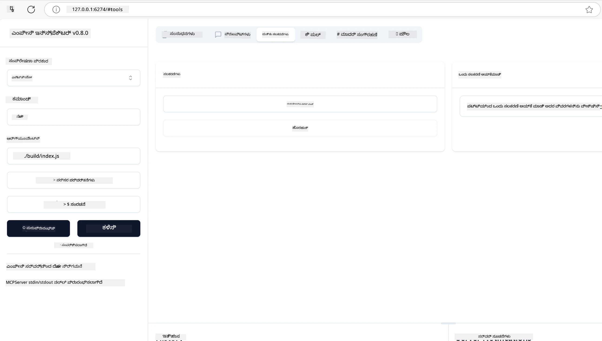
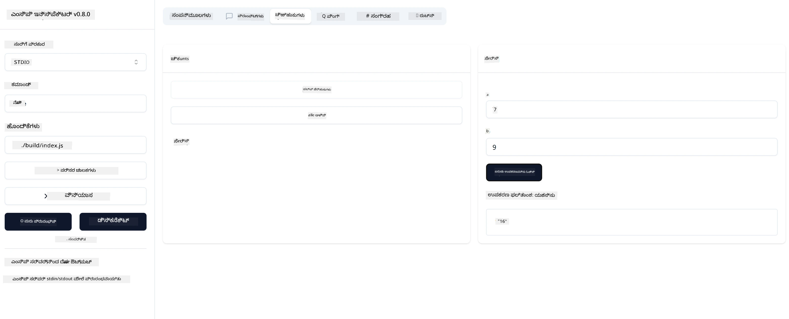

# MCP ನೊಂದಿಗೆ ಪ್ರಾರಂಭಿಸುವುದು

ಮಾಡೆಲ್ ಕಾಂಟೆಕ್ಸ್ಟ್ ಪ್ರೋಟೋಕಾಲ್ (MCP) ನೊಂದಿಗೆ ನಿಮ್ಮ ಮೊದಲ ಹೆಜ್ಜೆಗಳಿಗೆ ಸ್ವಾಗತ! ನೀವು MCP ಗೆ ಹೊಸದಾಗಿದ್ದೀರಾ ಅಥವಾ ನಿಮ್ಮ ಅರ್ಥವನ್ನು ಗಾಢಗೊಳಿಸಲು ಬಯಸುತ್ತಿದ್ದೀರಾ, ಈ ಮಾರ್ಗದರ್ಶಿ ನಿಮಗೆ ಅಗತ್ಯವಿರುವ ಸೆಟಪ್ ಮತ್ತು ಅಭಿವೃದ್ಧಿ ಪ್ರಕ್ರಿಯೆಯನ್ನು ಹಾದುಹೋಗುತ್ತದೆ. ನೀವು MCP ಹೇಗೆ AI ಮಾದರಿಗಳು ಮತ್ತು ಅಪ್ಲಿಕೇಶನ್‌ಗಳ ನಡುವೆ ನಿರಂತರ ಸಂಯೋಜನೆಯನ್ನು ಸಾದ್ಯಮಾಡುತ್ತದೆ ಎಂದು ಕಂಡುಹಿಡಿಯುತ್ತೀರಿ ಮತ್ತು MCP-ಚಾಲಿತ ಪರಿಹಾರಗಳನ್ನು ನಿರ್ಮಿಸಲು ಮತ್ತು ಪರೀಕ್ಷಿಸಲು ನಿಮ್ಮ ಪರಿಸರವನ್ನು ತ್ವರಿತವಾಗಿ ಸಿದ್ಧಪಡಿಸುವುದನ್ನು ಕಲಿಯುತ್ತೀರಿ.

> TLDR; ನೀವು AI ಅಪ್ಲಿಕೇಶನ್‌ಗಳನ್ನು ನಿರ್ಮಿಸಿದರೆ, ನೀವು ತಿಳಿದಿರಬಹುದು ನೀವು ನಿಮ್ಮ LLM (ದೊಡ್ಡ ಭಾಷಾ ಮಾದರಿ) ಗೆ ಉಪಕರಣಗಳು ಮತ್ತು ಇತರ ಸಂಪನ್ಮೂಲಗಳನ್ನು ಸೇರಿಸಬಹುದು, LLM ಅನ್ನು ಹೆಚ್ಚು ಜ್ಞಾನವಂತವಾಗಿಸಲು. ಆದರೆ ನೀವು ಆ ಉಪಕರಣಗಳು ಮತ್ತು ಸಂಪನ್ಮೂಲಗಳನ್ನು ಸರ್ವರ್ ಮೇಲೆ ಇರಿಸಿದರೆ, ಆ ಅಪ್ಲಿಕೇಶನ್ ಮತ್ತು ಸರ್ವರ್ ಸಾಮರ್ಥ್ಯಗಳನ್ನು ಯಾವುದೇ ಕ್ಲೈಂಟ್ LLM ಇದ್ದರೂ ಇಲ್ಲದಿದ್ದರೂ ಬಳಸಬಹುದು.

## ಅವಲೋಕನ

ಈ ಪಾಠವು MCP ಪರಿಸರಗಳನ್ನು ಸೆಟ್‌ಅಪ್ ಮಾಡುವುದು ಮತ್ತು ನಿಮ್ಮ ಮೊದಲ MCP ಅಪ್ಲಿಕೇಶನ್‌ಗಳನ್ನು ನಿರ್ಮಿಸುವ ಬಗ್ಗೆ ಪ್ರಾಯೋಗಿಕ ಮಾರ್ಗದರ್ಶನವನ್ನು ಒದಗಿಸುತ್ತದೆ. ನೀವು ಅಗತ್ಯವಿರುವ ಉಪಕರಣಗಳು ಮತ್ತು ಫ್ರೇಮ್ವರ್ಕ್‌ಗಳನ್ನು ಸೆಟ್‌ಅಪ್ ಮಾಡುವುದು, ಮೂಲ MCP ಸರ್ವರ್‌ಗಳನ್ನು ನಿರ್ಮಿಸುವುದು, ಹೋಸ್ಟ್ ಅಪ್ಲಿಕೇಶನ್‌ಗಳನ್ನು ರಚಿಸುವುದು ಮತ್ತು ನಿಮ್ಮ ಅನುಷ್ಠಾನಗಳನ್ನು ಪರೀಕ್ಷಿಸುವುದನ್ನು ಕಲಿಯುತ್ತೀರಿ.

ಮಾಡೆಲ್ ಕಾಂಟೆಕ್ಸ್ಟ್ ಪ್ರೋಟೋಕಾಲ್ (MCP) ಒಂದು ತೆರೆಯಲಾದ ಪ್ರೋಟೋಕಾಲ್ ಆಗಿದ್ದು, ಅಪ್ಲಿಕೇಶನ್‌ಗಳು LLM ಗಳಿಗೆ ಕಾಂಟೆಕ್ಸ್ಟ್ ಅನ್ನು ಹೇಗೆ ಒದಗಿಸುತ್ತವೆ ಎಂಬುದನ್ನು ಮಾನಕೀಕರಿಸುತ್ತದೆ. MCP ಅನ್ನು AI ಅಪ್ಲಿಕೇಶನ್‌ಗಳಿಗೆ USB-C ಪೋರ್ಟ್ ಎಂದು ಭಾವಿಸಿ - ಇದು AI ಮಾದರಿಗಳನ್ನು ವಿಭಿನ್ನ ಡೇಟಾ ಮೂಲಗಳು ಮತ್ತು ಉಪಕರಣಗಳಿಗೆ ಸಂಪರ್ಕಿಸುವ ಮಾನಕೀಕೃತ ಮಾರ್ಗವನ್ನು ಒದಗಿಸುತ್ತದೆ.

## ಕಲಿಕೆಯ ಗುರಿಗಳು

ಈ ಪಾಠದ ಕೊನೆಯಲ್ಲಿ, ನೀವು ಸಾಧ್ಯವಾಗುತ್ತದೆ:

- C#, Java, Python, TypeScript, ಮತ್ತು Rust ನಲ್ಲಿ MCP ಅಭಿವೃದ್ಧಿ ಪರಿಸರಗಳನ್ನು ಸೆಟ್‌ಅಪ್ ಮಾಡುವುದು
- ಕಸ್ಟಮ್ ವೈಶಿಷ್ಟ್ಯಗಳೊಂದಿಗೆ (ಸಂಪನ್ಮೂಲಗಳು, ಪ್ರಾಂಪ್ಟ್‌ಗಳು, ಮತ್ತು ಉಪಕರಣಗಳು) ಮೂಲ MCP ಸರ್ವರ್‌ಗಳನ್ನು ನಿರ್ಮಿಸಿ ಮತ್ತು ನಿಯೋಜಿಸುವುದು
- MCP ಸರ್ವರ್‌ಗಳಿಗೆ ಸಂಪರ್ಕಿಸುವ ಹೋಸ್ಟ್ ಅಪ್ಲಿಕೇಶನ್‌ಗಳನ್ನು ರಚಿಸುವುದು
- MCP ಅನುಷ್ಠಾನಗಳನ್ನು ಪರೀಕ್ಷಿಸಿ ಮತ್ತು ಡಿಬಗ್ ಮಾಡುವುದು

## ನಿಮ್ಮ MCP ಪರಿಸರವನ್ನು ಸೆಟ್‌ಅಪ್ ಮಾಡುವುದು

MCP ಜೊತೆ ಕೆಲಸ ಪ್ರಾರಂಭಿಸುವ ಮೊದಲು, ನಿಮ್ಮ ಅಭಿವೃದ್ಧಿ ಪರಿಸರವನ್ನು ಸಿದ್ಧಪಡಿಸುವುದು ಮತ್ತು ಮೂಲ ಕಾರ್ಯಪ್ರವಾಹವನ್ನು ಅರ್ಥಮಾಡಿಕೊಳ್ಳುವುದು ಮುಖ್ಯ. ಈ ವಿಭಾಗವು MCP ನೊಂದಿಗೆ ಸುಗಮ ಪ್ರಾರಂಭಕ್ಕಾಗಿ ಪ್ರಾಥಮಿಕ ಸೆಟ್‌ಅಪ್ ಹಂತಗಳನ್ನು ಮಾರ್ಗದರ್ಶಿಸುತ್ತದೆ.

### ಪೂರ್ವಾಪೇಕ್ಷಿತಗಳು

MCP ಅಭಿವೃದ್ಧಿಯಲ್ಲಿ ಮುಳುಗುವ ಮೊದಲು, ನೀವು ಖಚಿತಪಡಿಸಿಕೊಳ್ಳಿ:

- **ಅಭಿವೃದ್ಧಿ ಪರಿಸರ**: ನಿಮ್ಮ ಆಯ್ದ ಭಾಷೆಗೆ (C#, Java, Python, TypeScript, ಅಥವಾ Rust)
- **IDE/ಎಡಿಟರ್**: Visual Studio, Visual Studio Code, IntelliJ, Eclipse, PyCharm, ಅಥವಾ ಯಾವುದೇ ಆಧುನಿಕ ಕೋಡ್ ಎಡಿಟರ್
- **ಪ್ಯಾಕೇಜ್ ಮ್ಯಾನೇಜರ್‌ಗಳು**: NuGet, Maven/Gradle, pip, npm/yarn, ಅಥವಾ Cargo
- **API ಕೀಗಳು**: ನೀವು ನಿಮ್ಮ ಹೋಸ್ಟ್ ಅಪ್ಲಿಕೇಶನ್‌ಗಳಲ್ಲಿ ಬಳಸಲು ಯೋಜಿಸಿರುವ ಯಾವುದೇ AI ಸೇವೆಗಳಿಗಾಗಿ

## ಮೂಲ MCP ಸರ್ವರ್ ರಚನೆ

ಒಂದು MCP ಸರ್ವರ್ ಸಾಮಾನ್ಯವಾಗಿ ಒಳಗೊಂಡಿರುತ್ತದೆ:

- **ಸರ್ವರ್ ಸಂರಚನೆ**: ಪೋರ್ಟ್, ಪ್ರಾಮಾಣೀಕರಣ ಮತ್ತು ಇತರ ಸೆಟ್ಟಿಂಗ್‌ಗಳನ್ನು ಸೆಟ್‌ಅಪ್ ಮಾಡುವುದು
- **ಸಂಪನ್ಮೂಲಗಳು**: LLM ಗಳಿಗೆ ಲಭ್ಯವಿರುವ ಡೇಟಾ ಮತ್ತು ಕಾಂಟೆಕ್ಸ್ಟ್
- **ಉಪಕರಣಗಳು**: ಮಾದರಿಗಳು ಕರೆಮಾಡಬಹುದಾದ ಕಾರ್ಯಕ್ಷಮತೆ
- **ಪ್ರಾಂಪ್ಟ್‌ಗಳು**: ಪಠ್ಯವನ್ನು ರಚಿಸಲು ಅಥವಾ ರಚನೆ ಮಾಡಲು ಟೆಂಪ್ಲೇಟುಗಳು

ಇದು TypeScript ನಲ್ಲಿ ಸರಳೀಕೃತ ಉದಾಹರಣೆ:

```typescript
import { McpServer, ResourceTemplate } from "@modelcontextprotocol/sdk/server/mcp.js";
import { StdioServerTransport } from "@modelcontextprotocol/sdk/server/stdio.js";
import { z } from "zod";

// MCP ಸರ್ವರ್ ಅನ್ನು ರಚಿಸಿ
const server = new McpServer({
  name: "Demo",
  version: "1.0.0"
});

// ಒಂದು ಸೇರ್ಪಡೆ ಸಾಧನವನ್ನು ಸೇರಿಸಿ
server.tool("add",
  { a: z.number(), b: z.number() },
  async ({ a, b }) => ({
    content: [{ type: "text", text: String(a + b) }]
  })
);

// ಒಂದು ಡೈನಾಮಿಕ್ ಸ್ವಾಗತ ಸಂಪನ್ಮೂಲವನ್ನು ಸೇರಿಸಿ
server.resource(
  "file",
  // 'list' ಪರಿಮಾಣವು ಸಂಪನ್ಮೂಲವು ಲಭ್ಯವಿರುವ ಕಡತಗಳನ್ನು ಹೇಗೆ ಪಟ್ಟಿ ಮಾಡುತ್ತದೆ ಎಂಬುದನ್ನು ನಿಯಂತ್ರಿಸುತ್ತದೆ. ಇದನ್ನು ಅಸ್ಪಷ್ಟವಾಗಿ ಹೊಂದಿಸುವುದು ಈ ಸಂಪನ್ಮೂಲಕ್ಕಾಗಿ ಪಟ್ಟಿ ಮಾಡುವುದನ್ನು ನಿಷ್ಕ್ರಿಯಗೊಳಿಸುತ್ತದೆ.
  new ResourceTemplate("file://{path}", { list: undefined }),
  async (uri, { path }) => ({
    contents: [{
      uri: uri.href,
      text: `File, ${path}!`
    }]
  })
);

// ಕಡತದ ವಿಷಯಗಳನ್ನು ಓದುವ ಕಡತ ಸಂಪನ್ಮೂಲವನ್ನು ಸೇರಿಸಿ
server.resource(
  "file",
  new ResourceTemplate("file://{path}", { list: undefined }),
  async (uri, { path }) => {
    let text;
    try {
      text = await fs.readFile(path, "utf8");
    } catch (err) {
      text = `Error reading file: ${err.message}`;
    }
    return {
      contents: [{
        uri: uri.href,
        text
      }]
    };
  }
);

server.prompt(
  "review-code",
  { code: z.string() },
  ({ code }) => ({
    messages: [{
      role: "user",
      content: {
        type: "text",
        text: `Please review this code:\n\n${code}`
      }
    }]
  })
);

// stdin ನಲ್ಲಿ ಸಂದೇಶಗಳನ್ನು ಸ್ವೀಕರಿಸುವುದನ್ನು ಪ್ರಾರಂಭಿಸಿ ಮತ್ತು stdout ನಲ್ಲಿ ಸಂದೇಶಗಳನ್ನು ಕಳುಹಿಸುವುದನ್ನು ಪ್ರಾರಂಭಿಸಿ
const transport = new StdioServerTransport();
await server.connect(transport);
```

ಮೇಲಿನ ಕೋಡ್‌ನಲ್ಲಿ ನಾವು:

- MCP TypeScript SDK ನಿಂದ ಅಗತ್ಯವಿರುವ ವರ್ಗಗಳನ್ನು ಆಮದು ಮಾಡಿಕೊಳ್ಳುತ್ತೇವೆ.
- ಹೊಸ MCP ಸರ್ವರ್ ಉದಾಹರಣೆಯನ್ನು ರಚಿಸಿ ಮತ್ತು ಸಂರಚಿಸುತ್ತೇವೆ.
- ಕಸ್ಟಮ್ ಉಪಕರಣ (`calculator`) ಅನ್ನು ಹ್ಯಾಂಡ್ಲರ್ ಫಂಕ್ಷನ್ ಜೊತೆಗೆ ನೋಂದಾಯಿಸುತ್ತೇವೆ.
- MCP ವಿನಂತಿಗಳನ್ನು ಸ್ವೀಕರಿಸಲು ಸರ್ವರ್ ಅನ್ನು ಪ್ರಾರಂಭಿಸುತ್ತೇವೆ.

## ಪರೀಕ್ಷೆ ಮತ್ತು ಡಿಬಗ್

ನೀವು ನಿಮ್ಮ MCP ಸರ್ವರ್ ಅನ್ನು ಪರೀಕ್ಷಿಸುವ ಮೊದಲು, ಲಭ್ಯವಿರುವ ಉಪಕರಣಗಳು ಮತ್ತು ಡಿಬಗ್ ಮಾಡಲು ಉತ್ತಮ ಅಭ್ಯಾಸಗಳನ್ನು ಅರ್ಥಮಾಡಿಕೊಳ್ಳುವುದು ಮುಖ್ಯ. ಪರಿಣಾಮಕಾರಿ ಪರೀಕ್ಷೆ ನಿಮ್ಮ ಸರ್ವರ್ ನಿರೀಕ್ಷಿತವಾಗಿ ಕಾರ್ಯನಿರ್ವಹಿಸುವುದನ್ನು ಖಚಿತಪಡಿಸುತ್ತದೆ ಮತ್ತು ಸಮಸ್ಯೆಗಳನ್ನು ತ್ವರಿತವಾಗಿ ಗುರುತಿಸಿ ಪರಿಹರಿಸಲು ಸಹಾಯ ಮಾಡುತ್ತದೆ. ಕೆಳಗಿನ ವಿಭಾಗವು ನಿಮ್ಮ MCP ಅನುಷ್ಠಾನವನ್ನು ಮಾನ್ಯಗೊಳಿಸಲು ಶಿಫಾರಸು ಮಾಡಲಾದ ವಿಧಾನಗಳನ್ನು ವಿವರಿಸುತ್ತದೆ.

MCP ನಿಮ್ಮ ಸರ್ವರ್‌ಗಳನ್ನು ಪರೀಕ್ಷಿಸಲು ಮತ್ತು ಡಿಬಗ್ ಮಾಡಲು ಉಪಕರಣಗಳನ್ನು ಒದಗಿಸುತ್ತದೆ:

- **ಇನ್ಸ್‌ಪೆಕ್ಟರ್ ಉಪಕರಣ**, ಈ ಗ್ರಾಫಿಕಲ್ ಇಂಟರ್ಫೇಸ್ ನಿಮ್ಮ ಸರ್ವರ್‌ಗೆ ಸಂಪರ್ಕಿಸಿ ನಿಮ್ಮ ಉಪಕರಣಗಳು, ಪ್ರಾಂಪ್ಟ್‌ಗಳು ಮತ್ತು ಸಂಪನ್ಮೂಲಗಳನ್ನು ಪರೀಕ್ಷಿಸಲು ಅನುಮತಿಸುತ್ತದೆ.
- **curl**, ನೀವು ಕಮಾಂಡ್ ಲೈನ್ ಉಪಕರಣವಾದ curl ಅಥವಾ HTTP ಕಮಾಂಡ್‌ಗಳನ್ನು ರಚಿಸಿ ಮತ್ತು ಚಾಲನೆ ಮಾಡಬಹುದಾದ ಇತರ ಕ್ಲೈಂಟ್‌ಗಳ ಮೂಲಕ ನಿಮ್ಮ ಸರ್ವರ್‌ಗೆ ಸಂಪರ್ಕಿಸಬಹುದು.

### MCP ಇನ್ಸ್‌ಪೆಕ್ಟರ್ ಬಳಕೆ

[MCP ಇನ್ಸ್‌ಪೆಕ್ಟರ್](https://github.com/modelcontextprotocol/inspector) ಒಂದು ದೃಶ್ಯಾತ್ಮಕ ಪರೀಕ್ಷಾ ಉಪಕರಣವಾಗಿದೆ, ಇದು ನಿಮಗೆ ಸಹಾಯ ಮಾಡುತ್ತದೆ:

1. **ಸರ್ವರ್ ಸಾಮರ್ಥ್ಯಗಳನ್ನು ಕಂಡುಹಿಡಿಯುವುದು**: ಲಭ್ಯವಿರುವ ಸಂಪನ್ಮೂಲಗಳು, ಉಪಕರಣಗಳು ಮತ್ತು ಪ್ರಾಂಪ್ಟ್‌ಗಳನ್ನು ಸ್ವಯಂಚಾಲಿತವಾಗಿ ಪತ್ತೆಮಾಡುವುದು
2. **ಉಪಕರಣ ಕಾರ್ಯಾಚರಣೆಯನ್ನು ಪರೀಕ್ಷಿಸುವುದು**: ವಿಭಿನ್ನ ಪ್ಯಾರಾಮೀಟರ್‌ಗಳನ್ನು ಪ್ರಯತ್ನಿಸಿ ಮತ್ತು ನೈಜ ಸಮಯದಲ್ಲಿ ಪ್ರತಿಕ್ರಿಯೆಗಳನ್ನು ನೋಡುವುದು
3. **ಸರ್ವರ್ ಮೆಟಾಡೇಟಾವನ್ನು ವೀಕ್ಷಿಸುವುದು**: ಸರ್ವರ್ ಮಾಹಿತಿ, ಸ್ಕೀಮಾ ಮತ್ತು ಸಂರಚನೆಗಳನ್ನು ಪರಿಶೀಲಿಸುವುದು

```bash
# ಉದಾಹರಣೆ TypeScript, MCP ಇನ್ಸ್‌ಪೆಕ್ಟರ್ ಅನ್ನು ಸ್ಥಾಪಿಸುವುದು ಮತ್ತು ಚಾಲನೆ ಮಾಡುವುದು
npx @modelcontextprotocol/inspector node build/index.js
```

ನೀವು ಮೇಲಿನ ಕಮಾಂಡ್‌ಗಳನ್ನು ಚಾಲನೆ ಮಾಡಿದಾಗ, MCP ಇನ್ಸ್‌ಪೆಕ್ಟರ್ ನಿಮ್ಮ ಬ್ರೌಸರ್‌ನಲ್ಲಿ ಸ್ಥಳೀಯ ವೆಬ್ ಇಂಟರ್ಫೇಸ್ ಅನ್ನು ಪ್ರಾರಂಭಿಸುತ್ತದೆ. ನೀವು ನೋಂದಾಯಿಸಿದ MCP ಸರ್ವರ್‌ಗಳು, ಅವುಗಳ ಲಭ್ಯವಿರುವ ಉಪಕರಣಗಳು, ಸಂಪನ್ಮೂಲಗಳು ಮತ್ತು ಪ್ರಾಂಪ್ಟ್‌ಗಳನ್ನು ಪ್ರದರ್ಶಿಸುವ ಡ್ಯಾಶ್‌ಬೋರ್ಡ್ ಅನ್ನು ನೋಡಬಹುದು. ಈ ಇಂಟರ್ಫೇಸ್ ಉಪಕರಣ ಕಾರ್ಯಾಚರಣೆಯನ್ನು ಪರಸ್ಪರ ಕ್ರಿಯಾಶೀಲವಾಗಿ ಪರೀಕ್ಷಿಸಲು, ಸರ್ವರ್ ಮೆಟಾಡೇಟಾವನ್ನು ಪರಿಶೀಲಿಸಲು ಮತ್ತು ನೈಜ ಸಮಯದಲ್ಲಿ ಪ್ರತಿಕ್ರಿಯೆಗಳನ್ನು ವೀಕ್ಷಿಸಲು ಅನುಮತಿಸುತ್ತದೆ, ಇದು ನಿಮ್ಮ MCP ಸರ್ವರ್ ಅನುಷ್ಠಾನಗಳನ್ನು ಮಾನ್ಯಗೊಳಿಸಲು ಮತ್ತು ಡಿಬಗ್ ಮಾಡಲು ಸುಲಭವಾಗಿಸುತ್ತದೆ.

ಇದೀಗ ಇದು ಹೇಗಿರಬಹುದು ಎಂಬುದರ ಸ್ಕ್ರೀನ್‌ಶಾಟ್ ಇಲ್ಲಿದೆ:



## ಸಾಮಾನ್ಯ ಸೆಟ್‌ಅಪ್ ಸಮಸ್ಯೆಗಳು ಮತ್ತು ಪರಿಹಾರಗಳು

| ಸಮಸ್ಯೆ | ಸಾಧ್ಯವಿರುವ ಪರಿಹಾರ |
|-------|-------------------|
| ಸಂಪರ್ಕ ನಿರಾಕರಿಸಲಾಗಿದೆ | ಸರ್ವರ್ ಚಾಲನೆಯಲ್ಲಿದೆಯೇ ಮತ್ತು ಪೋರ್ಟ್ ಸರಿಯೇ ಎಂದು ಪರಿಶೀಲಿಸಿ |
| ಉಪಕರಣ ಕಾರ್ಯಾಚರಣೆ ದೋಷಗಳು | ಪ್ಯಾರಾಮೀಟರ್ ಮಾನ್ಯತೆ ಮತ್ತು ದೋಷ ನಿರ್ವಹಣೆಯನ್ನು ಪರಿಶೀಲಿಸಿ |
| ಪ್ರಾಮಾಣೀಕರಣ ವಿಫಲತೆಗಳು | API ಕೀಗಳು ಮತ್ತು ಅನುಮತಿಗಳನ್ನು ಪರಿಶೀಲಿಸಿ |
| ಸ್ಕೀಮಾ ಮಾನ್ಯತೆ ದೋಷಗಳು | ಪ್ಯಾರಾಮೀಟರ್‌ಗಳು ನಿರ್ದಿಷ್ಟ ಸ್ಕೀಮಾ ಗೆ ಹೊಂದಿಕೆಯಾಗುತ್ತವೆಯೇ ಎಂದು ಖಚಿತಪಡಿಸಿ |
| ಸರ್ವರ್ ಪ್ರಾರಂಭವಾಗುತ್ತಿಲ್ಲ | ಪೋರ್ಟ್ ಸಂಘರ್ಷಗಳು ಅಥವಾ ಕಳೆದುಹೋಗಿರುವ ಅವಲಂಬನೆಗಳನ್ನು ಪರಿಶೀಲಿಸಿ |
| CORS ದೋಷಗಳು | ಕ್ರಾಸ್-ಓರಿಜಿನ್ ವಿನಂತಿಗಳಿಗಾಗಿ ಸರಿಯಾದ CORS ಹೆಡರ್‌ಗಳನ್ನು ಸಂರಚಿಸಿ |
| ಪ್ರಾಮಾಣೀಕರಣ ಸಮಸ್ಯೆಗಳು | ಟೋಕನ್ ಮಾನ್ಯತೆ ಮತ್ತು ಅನುಮತಿಗಳನ್ನು ಪರಿಶೀಲಿಸಿ |

## ಸ್ಥಳೀಯ ಅಭಿವೃದ್ಧಿ

ಸ್ಥಳೀಯ ಅಭಿವೃದ್ಧಿ ಮತ್ತು ಪರೀಕ್ಷೆಗಾಗಿ, ನೀವು ನಿಮ್ಮ ಯಂತ್ರದಲ್ಲಿ ನೇರವಾಗಿ MCP ಸರ್ವರ್‌ಗಳನ್ನು ಚಾಲನೆ ಮಾಡಬಹುದು:

1. **ಸರ್ವರ್ ಪ್ರಕ್ರಿಯೆಯನ್ನು ಪ್ರಾರಂಭಿಸಿ**: ನಿಮ್ಮ MCP ಸರ್ವರ್ ಅಪ್ಲಿಕೇಶನ್ ಅನ್ನು ಚಾಲನೆ ಮಾಡಿ
2. **ನೆಟ್ವರ್ಕಿಂಗ್ ಅನ್ನು ಸಂರಚಿಸಿ**: ಸರ್ವರ್ ನಿರೀಕ್ಷಿತ ಪೋರ್ಟ್‌ನಲ್ಲಿ ಲಭ್ಯವಿರುವುದನ್ನು ಖಚಿತಪಡಿಸಿ
3. **ಕ್ಲೈಂಟ್‌ಗಳನ್ನು ಸಂಪರ್ಕಿಸಿ**: `http://localhost:3000` ಮುಂತಾದ ಸ್ಥಳೀಯ ಸಂಪರ್ಕ URL ಗಳನ್ನು ಬಳಸಿ

```bash
# ಉದಾಹರಣೆ: ಟೈಪ್‌ಸ್ಕ್ರಿಪ್ಟ್ MCP ಸರ್ವರ್ ಅನ್ನು ಸ್ಥಳೀಯವಾಗಿ ಚಾಲನೆ ಮಾಡುವುದು
npm run start
# ಸರ್ವರ್ http://localhost:3000 ನಲ್ಲಿ ಚಾಲನೆ ಆಗುತ್ತಿದೆ
```

## ನಿಮ್ಮ ಮೊದಲ MCP ಸರ್ವರ್ ನಿರ್ಮಿಸುವುದು

ನಾವು ಹಿಂದಿನ ಪಾಠದಲ್ಲಿ [ಮೂಲಭೂತ ತತ್ವಗಳು](/01-CoreConcepts/README.md) ಅನ್ನು ಆವರಿಸಿಕೊಂಡಿದ್ದೇವೆ, ಈಗ ಆ ಜ್ಞಾನವನ್ನು ಕಾರ್ಯಗತಗೊಳಿಸುವ ಸಮಯ.

### ಸರ್ವರ್ ಏನು ಮಾಡಬಹುದು

ನಾವು ಕೋಡ್ ಬರೆಯಲು ಪ್ರಾರಂಭಿಸುವ ಮೊದಲು, ಸರ್ವರ್ ಏನು ಮಾಡಬಹುದು ಎಂಬುದನ್ನು ನೆನಪಿಸಿಕೊಳ್ಳೋಣ:

ಒಂದು MCP ಸರ್ವರ್ ಉದಾಹರಣೆಗೆ:

- ಸ್ಥಳೀಯ ಫೈಲ್‌ಗಳು ಮತ್ತು ಡೇಟಾಬೇಸ್‌ಗಳಿಗೆ ಪ್ರವೇಶ
- ದೂರದ API ಗಳಿಗೆ ಸಂಪರ್ಕ
- ಗಣನೆಗಳನ್ನು ನಿರ್ವಹಿಸುವುದು
- ಇತರ ಉಪಕರಣಗಳು ಮತ್ತು ಸೇವೆಗಳೊಂದಿಗೆ ಸಂಯೋಜನೆ
- ಸಂವಹನಕ್ಕಾಗಿ ಬಳಕೆದಾರ ಇಂಟರ್ಫೇಸ್ ಒದಗಿಸುವುದು

ಚೆನ್ನಾಗಿದೆ, ಈಗ ನಾವು ಏನು ಮಾಡಬಹುದು ಎಂದು ತಿಳಿದಿದ್ದೇವೆ, ಬರೆಯಲು ಪ್ರಾರಂಭಿಸೋಣ.

## ಅಭ್ಯಾಸ: ಸರ್ವರ್ ರಚನೆ

ಸರ್ವರ್ ರಚಿಸಲು, ನೀವು ಈ ಹಂತಗಳನ್ನು ಅನುಸರಿಸಬೇಕು:

- MCP SDK ಅನ್ನು ಸ್ಥಾಪಿಸಿ.
- ಒಂದು ಪ್ರಾಜೆಕ್ಟ್ ರಚಿಸಿ ಮತ್ತು ಪ್ರಾಜೆಕ್ಟ್ ರಚನೆಯನ್ನು ಸೆಟ್‌ಅಪ್ ಮಾಡಿ.
- ಸರ್ವರ್ ಕೋಡ್ ಬರೆಯಿರಿ.
- ಸರ್ವರ್ ಅನ್ನು ಪರೀಕ್ಷಿಸಿ.

### -1- ಪ್ರಾಜೆಕ್ಟ್ ರಚನೆ

#### TypeScript

```sh
# ಪ್ರಾಜೆಕ್ಟ್ ಡೈರೆಕ್ಟರಿ ರಚಿಸಿ ಮತ್ತು npm ಪ್ರಾಜೆಕ್ಟ್ ಅನ್ನು ಪ್ರಾರಂಭಿಸಿ
mkdir calculator-server
cd calculator-server
npm init -y
```

#### Python

```sh
# ಪ್ರಾಜೆಕ್ಟ್ ಡೈರೆಕ್ಟರಿ ರಚಿಸಿ
mkdir calculator-server
cd calculator-server
# ಫೋಲ್ಡರ್ ಅನ್ನು Visual Studio Code ನಲ್ಲಿ ತೆರೆಯಿರಿ - ನೀವು ಬೇರೆ IDE ಬಳಸುತ್ತಿದ್ದರೆ ಇದನ್ನು ಬಿಟ್ಟುಬಿಡಿ
code .
```

#### .NET

```sh
dotnet new console -n McpCalculatorServer
cd McpCalculatorServer
```

#### Java

Java ಗಾಗಿ, Spring Boot ಪ್ರಾಜೆಕ್ಟ್ ರಚಿಸಿ:

```bash
curl https://start.spring.io/starter.zip \
  -d dependencies=web \
  -d javaVersion=21 \
  -d type=maven-project \
  -d groupId=com.example \
  -d artifactId=calculator-server \
  -d name=McpServer \
  -d packageName=com.microsoft.mcp.sample.server \
  -o calculator-server.zip
```

ಜಿಪ್ ಫೈಲ್ ಅನ್ನು ಅನ್ಜಿಪ್ ಮಾಡಿ:

```bash
unzip calculator-server.zip -d calculator-server
cd calculator-server
# ಐಚ್ಛಿಕವಾಗಿ ಬಳಸದ ಪರೀಕ್ಷೆಯನ್ನು ತೆಗೆದುಹಾಕಿ
rm -rf src/test/java
```

ನಿಮ್ಮ *pom.xml* ಫೈಲ್‌ಗೆ ಕೆಳಗಿನ ಸಂಪೂರ್ಣ ಸಂರಚನೆಯನ್ನು ಸೇರಿಸಿ:

```xml
<?xml version="1.0" encoding="UTF-8"?>
<project xmlns="http://maven.apache.org/POM/4.0.0"
    xmlns:xsi="http://www.w3.org/2001/XMLSchema-instance"
    xsi:schemaLocation="http://maven.apache.org/POM/4.0.0 http://maven.apache.org/xsd/maven-4.0.0.xsd">
    <modelVersion>4.0.0</modelVersion>
    
    <!-- Spring Boot parent for dependency management -->
    <parent>
        <groupId>org.springframework.boot</groupId>
        <artifactId>spring-boot-starter-parent</artifactId>
        <version>3.5.0</version>
        <relativePath />
    </parent>

    <!-- Project coordinates -->
    <groupId>com.example</groupId>
    <artifactId>calculator-server</artifactId>
    <version>0.0.1-SNAPSHOT</version>
    <name>Calculator Server</name>
    <description>Basic calculator MCP service for beginners</description>

    <!-- Properties -->
    <properties>
        <java.version>21</java.version>
        <maven.compiler.source>21</maven.compiler.source>
        <maven.compiler.target>21</maven.compiler.target>
    </properties>

    <!-- Spring AI BOM for version management -->
    <dependencyManagement>
        <dependencies>
            <dependency>
                <groupId>org.springframework.ai</groupId>
                <artifactId>spring-ai-bom</artifactId>
                <version>1.0.0-SNAPSHOT</version>
                <type>pom</type>
                <scope>import</scope>
            </dependency>
        </dependencies>
    </dependencyManagement>

    <!-- Dependencies -->
    <dependencies>
        <dependency>
            <groupId>org.springframework.ai</groupId>
            <artifactId>spring-ai-starter-mcp-server-webflux</artifactId>
        </dependency>
        <dependency>
            <groupId>org.springframework.boot</groupId>
            <artifactId>spring-boot-starter-actuator</artifactId>
        </dependency>
        <dependency>
         <groupId>org.springframework.boot</groupId>
         <artifactId>spring-boot-starter-test</artifactId>
         <scope>test</scope>
      </dependency>
    </dependencies>

    <!-- Build configuration -->
    <build>
        <plugins>
            <plugin>
                <groupId>org.springframework.boot</groupId>
                <artifactId>spring-boot-maven-plugin</artifactId>
            </plugin>
            <plugin>
                <groupId>org.apache.maven.plugins</groupId>
                <artifactId>maven-compiler-plugin</artifactId>
                <configuration>
                    <release>21</release>
                </configuration>
            </plugin>
        </plugins>
    </build>

    <!-- Repositories for Spring AI snapshots -->
    <repositories>
        <repository>
            <id>spring-milestones</id>
            <name>Spring Milestones</name>
            <url>https://repo.spring.io/milestone</url>
            <snapshots>
                <enabled>false</enabled>
            </snapshots>
        </repository>
        <repository>
            <id>spring-snapshots</id>
            <name>Spring Snapshots</name>
            <url>https://repo.spring.io/snapshot</url>
            <releases>
                <enabled>false</enabled>
            </releases>
        </repository>
    </repositories>
</project>
```

#### Rust

```sh
mkdir calculator-server
cd calculator-server
cargo init
```

### -2- ಅವಲಂಬನೆಗಳನ್ನು ಸೇರಿಸಿ

ನೀವು ಪ್ರಾಜೆಕ್ಟ್ ರಚಿಸಿದ ನಂತರ, ಮುಂದಿನ ಹಂತದಲ್ಲಿ ಅವಲಂಬನೆಗಳನ್ನು ಸೇರಿಸೋಣ:

#### TypeScript

```sh
# ಈಗಾಗಲೇ ಸ್ಥಾಪಿಸಲಾಗದಿದ್ದರೆ, TypeScript ಅನ್ನು ಜಾಗತಿಕವಾಗಿ ಸ್ಥಾಪಿಸಿ
npm install typescript -g

# MCP SDK ಮತ್ತು ಸ್ಕೀಮಾ ಮಾನ್ಯತೆಗಾಗಿ Zod ಅನ್ನು ಸ್ಥಾಪಿಸಿ
npm install @modelcontextprotocol/sdk zod
npm install -D @types/node typescript
```

#### Python

```sh
# ವರ್ಚುವಲ್ ಎನ್‌ವೈರನ್ಮೆಂಟ್ ರಚಿಸಿ ಮತ್ತು ಅವಲಂಬನೆಗಳನ್ನು ಸ್ಥಾಪಿಸಿ
python -m venv venv
venv\Scripts\activate
pip install "mcp[cli]"
```

#### Java

```bash
cd calculator-server
./mvnw clean install -DskipTests
```

#### Rust

```sh
cargo add rmcp --features server,transport-io
cargo add serde
cargo add tokio --features rt-multi-thread
```

### -3- ಪ್ರಾಜೆಕ್ಟ್ ಫೈಲ್‌ಗಳನ್ನು ರಚಿಸಿ

#### TypeScript

*package.json* ಫೈಲ್ ತೆರೆಯಿರಿ ಮತ್ತು ಕೆಳಗಿನ ವಿಷಯವನ್ನು ಬದಲಾಯಿಸಿ, ಸರ್ವರ್ ಅನ್ನು ನಿರ್ಮಿಸಲು ಮತ್ತು ಚಾಲನೆ ಮಾಡಲು ಖಚಿತಪಡಿಸಿಕೊಳ್ಳಲು:

```json
{
  "name": "calculator-server",
  "version": "1.0.0",
  "main": "index.js",
  "type": "module",
  "scripts": {
    "build": "tsc",
    "start": "npm run build && node ./build/index.js",
  },
  "keywords": [],
  "author": "",
  "license": "ISC",
  "description": "A simple calculator server using Model Context Protocol",
  "dependencies": {
    "@modelcontextprotocol/sdk": "^1.16.0",
    "zod": "^3.25.76"
  },
  "devDependencies": {
    "@types/node": "^24.0.14",
    "typescript": "^5.8.3"
  }
}
```

*tsconfig.json* ರಚಿಸಿ ಮತ್ತು ಕೆಳಗಿನ ವಿಷಯವನ್ನು ಸೇರಿಸಿ:

```json
{
  "compilerOptions": {
    "target": "ES2022",
    "module": "Node16",
    "moduleResolution": "Node16",
    "outDir": "./build",
    "rootDir": "./src",
    "strict": true,
    "esModuleInterop": true,
    "skipLibCheck": true,
    "forceConsistentCasingInFileNames": true
  },
  "include": ["src/**/*"],
  "exclude": ["node_modules"]
}
```

ನಿಮ್ಮ ಮೂಲ ಕೋಡ್‌ಗಾಗಿ ಡೈರೆಕ್ಟರಿ ರಚಿಸಿ:

```sh
mkdir src
touch src/index.ts
```

#### Python

*server.py* ಫೈಲ್ ರಚಿಸಿ

```sh
touch server.py
```

#### .NET

ಅಗತ್ಯವಿರುವ NuGet ಪ್ಯಾಕೇಜ್‌ಗಳನ್ನು ಸ್ಥಾಪಿಸಿ:

```sh
dotnet add package ModelContextProtocol --prerelease
dotnet add package Microsoft.Extensions.Hosting
```

#### Java

Java Spring Boot ಪ್ರಾಜೆಕ್ಟ್‌ಗಳಿಗೆ, ಪ್ರಾಜೆಕ್ಟ್ ರಚನೆ ಸ್ವಯಂಚಾಲಿತವಾಗಿ ಆಗುತ್ತದೆ.

#### Rust

Rust ಗಾಗಿ, `cargo init` ಅನ್ನು ಚಾಲನೆ ಮಾಡಿದಾಗ *src/main.rs* ಫೈಲ್ ಡೀಫಾಲ್ಟ್ ಆಗಿ ರಚಿಸಲಾಗುತ್ತದೆ. ಫೈಲ್ ತೆರೆಯಿರಿ ಮತ್ತು ಡೀಫಾಲ್ಟ್ ಕೋಡ್ ಅನ್ನು ಅಳಿಸಿ.

### -4- ಸರ್ವರ್ ಕೋಡ್ ರಚನೆ

#### TypeScript

*index.ts* ಫೈಲ್ ರಚಿಸಿ ಮತ್ತು ಕೆಳಗಿನ ಕೋಡ್ ಸೇರಿಸಿ:

```typescript
import { McpServer, ResourceTemplate } from "@modelcontextprotocol/sdk/server/mcp.js";
import { StdioServerTransport } from "@modelcontextprotocol/sdk/server/stdio.js";
import { z } from "zod";
 
// MCP ಸರ್ವರ್ ಅನ್ನು ರಚಿಸಿ
const server = new McpServer({
  name: "Calculator MCP Server",
  version: "1.0.0"
});
```

ನೀವು ಈಗ ಸರ್ವರ್ ಹೊಂದಿದ್ದೀರಿ, ಆದರೆ ಅದು ಹೆಚ್ಚು ಕಾರ್ಯನಿರ್ವಹಿಸುವುದಿಲ್ಲ, ಅದನ್ನು ಸರಿಪಡಿಸೋಣ.

#### Python

```python
# server.py
from mcp.server.fastmcp import FastMCP

# ಒಂದು MCP ಸರ್ವರ್ ರಚಿಸಿ
mcp = FastMCP("Demo")
```

#### .NET

```csharp
using Microsoft.Extensions.DependencyInjection;
using Microsoft.Extensions.Hosting;
using Microsoft.Extensions.Logging;
using ModelContextProtocol.Server;
using System.ComponentModel;

var builder = Host.CreateApplicationBuilder(args);
builder.Logging.AddConsole(consoleLogOptions =>
{
    // Configure all logs to go to stderr
    consoleLogOptions.LogToStandardErrorThreshold = LogLevel.Trace;
});

builder.Services
    .AddMcpServer()
    .WithStdioServerTransport()
    .WithToolsFromAssembly();
await builder.Build().RunAsync();

// add features
```

#### Java

Java ಗಾಗಿ, ಮೂಲ ಸರ್ವರ್ ಘಟಕಗಳನ್ನು ರಚಿಸಿ. ಮೊದಲು, ಮುಖ್ಯ ಅಪ್ಲಿಕೇಶನ್ ಕ್ಲಾಸ್ ಅನ್ನು ಬದಲಾಯಿಸಿ:

*src/main/java/com/microsoft/mcp/sample/server/McpServerApplication.java*:

```java
package com.microsoft.mcp.sample.server;

import org.springframework.ai.tool.ToolCallbackProvider;
import org.springframework.ai.tool.method.MethodToolCallbackProvider;
import org.springframework.boot.SpringApplication;
import org.springframework.boot.autoconfigure.SpringBootApplication;
import org.springframework.context.annotation.Bean;
import com.microsoft.mcp.sample.server.service.CalculatorService;

@SpringBootApplication
public class McpServerApplication {

    public static void main(String[] args) {
        SpringApplication.run(McpServerApplication.class, args);
    }
    
    @Bean
    public ToolCallbackProvider calculatorTools(CalculatorService calculator) {
        return MethodToolCallbackProvider.builder().toolObjects(calculator).build();
    }
}
```

ಕ್ಯಾಲ್ಕ್ಯುಲೇಟರ್ ಸೇವೆಯನ್ನು ರಚಿಸಿ *src/main/java/com/microsoft/mcp/sample/server/service/CalculatorService.java*:

```java
package com.microsoft.mcp.sample.server.service;

import org.springframework.ai.tool.annotation.Tool;
import org.springframework.stereotype.Service;

/**
 * Service for basic calculator operations.
 * This service provides simple calculator functionality through MCP.
 */
@Service
public class CalculatorService {

    /**
     * Add two numbers
     * @param a The first number
     * @param b The second number
     * @return The sum of the two numbers
     */
    @Tool(description = "Add two numbers together")
    public String add(double a, double b) {
        double result = a + b;
        return formatResult(a, "+", b, result);
    }

    /**
     * Subtract one number from another
     * @param a The number to subtract from
     * @param b The number to subtract
     * @return The result of the subtraction
     */
    @Tool(description = "Subtract the second number from the first number")
    public String subtract(double a, double b) {
        double result = a - b;
        return formatResult(a, "-", b, result);
    }

    /**
     * Multiply two numbers
     * @param a The first number
     * @param b The second number
     * @return The product of the two numbers
     */
    @Tool(description = "Multiply two numbers together")
    public String multiply(double a, double b) {
        double result = a * b;
        return formatResult(a, "*", b, result);
    }

    /**
     * Divide one number by another
     * @param a The numerator
     * @param b The denominator
     * @return The result of the division
     */
    @Tool(description = "Divide the first number by the second number")
    public String divide(double a, double b) {
        if (b == 0) {
            return "Error: Cannot divide by zero";
        }
        double result = a / b;
        return formatResult(a, "/", b, result);
    }

    /**
     * Calculate the power of a number
     * @param base The base number
     * @param exponent The exponent
     * @return The result of raising the base to the exponent
     */
    @Tool(description = "Calculate the power of a number (base raised to an exponent)")
    public String power(double base, double exponent) {
        double result = Math.pow(base, exponent);
        return formatResult(base, "^", exponent, result);
    }

    /**
     * Calculate the square root of a number
     * @param number The number to find the square root of
     * @return The square root of the number
     */
    @Tool(description = "Calculate the square root of a number")
    public String squareRoot(double number) {
        if (number < 0) {
            return "Error: Cannot calculate square root of a negative number";
        }
        double result = Math.sqrt(number);
        return String.format("√%.2f = %.2f", number, result);
    }

    /**
     * Calculate the modulus (remainder) of division
     * @param a The dividend
     * @param b The divisor
     * @return The remainder of the division
     */
    @Tool(description = "Calculate the remainder when one number is divided by another")
    public String modulus(double a, double b) {
        if (b == 0) {
            return "Error: Cannot divide by zero";
        }
        double result = a % b;
        return formatResult(a, "%", b, result);
    }

    /**
     * Calculate the absolute value of a number
     * @param number The number to find the absolute value of
     * @return The absolute value of the number
     */
    @Tool(description = "Calculate the absolute value of a number")
    public String absolute(double number) {
        double result = Math.abs(number);
        return String.format("|%.2f| = %.2f", number, result);
    }

    /**
     * Get help about available calculator operations
     * @return Information about available operations
     */
    @Tool(description = "Get help about available calculator operations")
    public String help() {
        return "Basic Calculator MCP Service\n\n" +
               "Available operations:\n" +
               "1. add(a, b) - Adds two numbers\n" +
               "2. subtract(a, b) - Subtracts the second number from the first\n" +
               "3. multiply(a, b) - Multiplies two numbers\n" +
               "4. divide(a, b) - Divides the first number by the second\n" +
               "5. power(base, exponent) - Raises a number to a power\n" +
               "6. squareRoot(number) - Calculates the square root\n" + 
               "7. modulus(a, b) - Calculates the remainder of division\n" +
               "8. absolute(number) - Calculates the absolute value\n\n" +
               "Example usage: add(5, 3) will return 5 + 3 = 8";
    }

    /**
     * Format the result of a calculation
     */
    private String formatResult(double a, String operator, double b, double result) {
        return String.format("%.2f %s %.2f = %.2f", a, operator, b, result);
    }
}
```

**ಉತ್ಪಾದನಾ-ಸಿದ್ಧ ಸೇವೆಗೆ ಐಚ್ಛಿಕ ಘಟಕಗಳು:**

ಸ್ಟಾರ್ಟ್‌ಅಪ್ ಸಂರಚನೆ ರಚಿಸಿ *src/main/java/com/microsoft/mcp/sample/server/config/StartupConfig.java*:

```java
package com.microsoft.mcp.sample.server.config;

import org.springframework.boot.CommandLineRunner;
import org.springframework.context.annotation.Bean;
import org.springframework.context.annotation.Configuration;

@Configuration
public class StartupConfig {
    
    @Bean
    public CommandLineRunner startupInfo() {
        return args -> {
            System.out.println("\n" + "=".repeat(60));
            System.out.println("Calculator MCP Server is starting...");
            System.out.println("SSE endpoint: http://localhost:8080/sse");
            System.out.println("Health check: http://localhost:8080/actuator/health");
            System.out.println("=".repeat(60) + "\n");
        };
    }
}
```

ಹೆಲ್ತ್ ಕಂಟ್ರೋಲರ್ ರಚಿಸಿ *src/main/java/com/microsoft/mcp/sample/server/controller/HealthController.java*:

```java
package com.microsoft.mcp.sample.server.controller;

import org.springframework.http.ResponseEntity;
import org.springframework.web.bind.annotation.GetMapping;
import org.springframework.web.bind.annotation.RestController;
import java.time.LocalDateTime;
import java.util.HashMap;
import java.util.Map;

@RestController
public class HealthController {
    
    @GetMapping("/health")
    public ResponseEntity<Map<String, Object>> healthCheck() {
        Map<String, Object> response = new HashMap<>();
        response.put("status", "UP");
        response.put("timestamp", LocalDateTime.now().toString());
        response.put("service", "Calculator MCP Server");
        return ResponseEntity.ok(response);
    }
}
```

ಎಕ್ಸೆಪ್ಷನ್ ಹ್ಯಾಂಡ್ಲರ್ ರಚಿಸಿ *src/main/java/com/microsoft/mcp/sample/server/exception/GlobalExceptionHandler.java*:

```java
package com.microsoft.mcp.sample.server.exception;

import org.springframework.http.HttpStatus;
import org.springframework.http.ResponseEntity;
import org.springframework.web.bind.annotation.ExceptionHandler;
import org.springframework.web.bind.annotation.RestControllerAdvice;

@RestControllerAdvice
public class GlobalExceptionHandler {

    @ExceptionHandler(IllegalArgumentException.class)
    public ResponseEntity<ErrorResponse> handleIllegalArgumentException(IllegalArgumentException ex) {
        ErrorResponse error = new ErrorResponse(
            "Invalid_Input", 
            "Invalid input parameter: " + ex.getMessage());
        return new ResponseEntity<>(error, HttpStatus.BAD_REQUEST);
    }

    public static class ErrorResponse {
        private String code;
        private String message;

        public ErrorResponse(String code, String message) {
            this.code = code;
            this.message = message;
        }

        // ಪಡೆಯುವವರು
        public String getCode() { return code; }
        public String getMessage() { return message; }
    }
}
```

ಕಸ್ಟಮ್ ಬ್ಯಾನರ್ ರಚಿಸಿ *src/main/resources/banner.txt*:

```text
_____      _            _       _             
 / ____|    | |          | |     | |            
| |     __ _| | ___ _   _| | __ _| |_ ___  _ __ 
| |    / _` | |/ __| | | | |/ _` | __/ _ \| '__|
| |___| (_| | | (__| |_| | | (_| | || (_) | |   
 \_____\__,_|_|\___|\__,_|_|\__,_|\__\___/|_|   
                                                
Calculator MCP Server v1.0
Spring Boot MCP Application
```

</details>

#### Rust

*src/main.rs* ಫೈಲ್ ಮೇಲ್ಭಾಗಕ್ಕೆ ಕೆಳಗಿನ ಕೋಡ್ ಸೇರಿಸಿ. ಇದು ನಿಮ್ಮ MCP ಸರ್ವರ್‌ಗೆ ಅಗತ್ಯವಿರುವ ಗ್ರಂಥಾಲಯಗಳು ಮತ್ತು ಮೋಡ್ಯೂಲ್‌ಗಳನ್ನು ಆಮದು ಮಾಡುತ್ತದೆ.

```rust
use rmcp::{
    handler::server::{router::tool::ToolRouter, tool::Parameters},
    model::{ServerCapabilities, ServerInfo},
    schemars, tool, tool_handler, tool_router,
    transport::stdio,
    ServerHandler, ServiceExt,
};
use std::error::Error;
```

ಕ್ಯಾಲ್ಕ್ಯುಲೇಟರ್ ಸರ್ವರ್ ಸರಳವಾಗಿದ್ದು, ಎರಡು ಸಂಖ್ಯೆಗಳ ಮೊತ್ತವನ್ನು ಸೇರಿಸಬಹುದು. ಕ್ಯಾಲ್ಕ್ಯುಲೇಟರ್ ವಿನಂತಿಯನ್ನು ಪ್ರತಿನಿಧಿಸಲು ಒಂದು struct ರಚಿಸೋಣ.

```rust
#[derive(Debug, serde::Deserialize, schemars::JsonSchema)]
pub struct CalculatorRequest {
    pub a: f64,
    pub b: f64,
}
```

ಮುಂದೆ, ಕ್ಯಾಲ್ಕ್ಯುಲೇಟರ್ ಸರ್ವರ್ ಅನ್ನು ಪ್ರತಿನಿಧಿಸಲು struct ರಚಿಸಿ. ಈ struct ಉಪಕರಣ ರೌಟರ್ ಅನ್ನು ಹೊಂದಿರುತ್ತದೆ, ಇದು ಉಪಕರಣಗಳನ್ನು ನೋಂದಾಯಿಸಲು ಬಳಸಲಾಗುತ್ತದೆ.

```rust
#[derive(Debug, Clone)]
pub struct Calculator {
    tool_router: ToolRouter<Self>,
}
```

ಈಗ, `Calculator` struct ಅನ್ನು ಅನುಷ್ಠಾನಗೊಳಿಸಿ, ಸರ್ವರ್ ಹೊಸ ಉದಾಹರಣೆಯನ್ನು ರಚಿಸಿ ಮತ್ತು ಸರ್ವರ್ ಮಾಹಿತಿ ಒದಗಿಸಲು ಸರ್ವರ್ ಹ್ಯಾಂಡ್ಲರ್ ಅನ್ನು ಅನುಷ್ಠಾನಗೊಳಿಸೋಣ.

```rust
#[tool_router]
impl Calculator {
    pub fn new() -> Self {
        Self {
            tool_router: Self::tool_router(),
        }
    }
}

#[tool_handler]
impl ServerHandler for Calculator {
    fn get_info(&self) -> ServerInfo {
        ServerInfo {
            instructions: Some("A simple calculator tool".into()),
            capabilities: ServerCapabilities::builder().enable_tools().build(),
            ..Default::default()
        }
    }
}
```

ಕೊನೆಗೆ, ಸರ್ವರ್ ಪ್ರಾರಂಭಿಸಲು ಮುಖ್ಯ ಫಂಕ್ಷನ್ ಅನ್ನು ಅನುಷ್ಠಾನಗೊಳಿಸಬೇಕು. ಈ ಫಂಕ್ಷನ್ `Calculator` struct ನ ಉದಾಹರಣೆಯನ್ನು ರಚಿಸಿ, ಸ್ಟ್ಯಾಂಡರ್ಡ್ ಇನ್‌ಪುಟ್/ಔಟ್‌ಪುಟ್ ಮೂಲಕ ಸೇವೆ ನೀಡುತ್ತದೆ.

```rust
#[tokio::main]
async fn main() -> Result<(), Box<dyn Error>> {
    let service = Calculator::new().serve(stdio()).await?;
    service.waiting().await?;
    Ok(())
}
```

ಸರ್ವರ್ ಈಗ ತನ್ನ ಬಗ್ಗೆ ಮೂಲ ಮಾಹಿತಿಯನ್ನು ಒದಗಿಸಲು ಸಿದ್ಧವಾಗಿದೆ. ಮುಂದಿನ ಹಂತದಲ್ಲಿ, ಸೇರಿಸುವ ಕಾರ್ಯವನ್ನು ನಿರ್ವಹಿಸುವ ಉಪಕರಣವನ್ನು ಸೇರಿಸೋಣ.

### -5- ಉಪಕರಣ ಮತ್ತು ಸಂಪನ್ಮೂಲ ಸೇರಿಸುವುದು

ಕೆಳಗಿನ ಕೋಡ್ ಸೇರಿಸುವ ಮೂಲಕ ಉಪಕರಣ ಮತ್ತು ಸಂಪನ್ಮೂಲವನ್ನು ಸೇರಿಸಿ:

#### TypeScript

```typescript
server.tool(
  "add",
  { a: z.number(), b: z.number() },
  async ({ a, b }) => ({
    content: [{ type: "text", text: String(a + b) }]
  })
);

server.resource(
  "greeting",
  new ResourceTemplate("greeting://{name}", { list: undefined }),
  async (uri, { name }) => ({
    contents: [{
      uri: uri.href,
      text: `Hello, ${name}!`
    }]
  })
);
```

ನಿಮ್ಮ ಉಪಕರಣ `a` ಮತ್ತು `b` ಪ್ಯಾರಾಮೀಟರ್‌ಗಳನ್ನು ತೆಗೆದುಕೊಳ್ಳುತ್ತದೆ ಮತ್ತು ಕೆಳಗಿನ ರೂಪದಲ್ಲಿ ಪ್ರತಿಕ್ರಿಯೆಯನ್ನು ಉತ್ಪಾದಿಸುತ್ತದೆ:

```typescript
{
  contents: [{
    type: "text", content: "some content"
  }]
}
```

ನಿಮ್ಮ ಸಂಪನ್ಮೂಲವನ್ನು "greeting" ಸ್ಟ್ರಿಂಗ್ ಮೂಲಕ ಪ್ರವೇಶಿಸಲಾಗುತ್ತದೆ ಮತ್ತು `name` ಪ್ಯಾರಾಮೀಟರ್ ತೆಗೆದುಕೊಳ್ಳುತ್ತದೆ ಮತ್ತು ಉಪಕರಣದಂತೆ ಸಮಾನ ಪ್ರತಿಕ್ರಿಯೆಯನ್ನು ಉತ್ಪಾದಿಸುತ್ತದೆ:

```typescript
{
  uri: "<href>",
  text: "a text"
}
```

#### Python

```python
# ಒಂದು ಸೇರ್ಪಡೆ ಸಾಧನವನ್ನು ಸೇರಿಸಿ
@mcp.tool()
def add(a: int, b: int) -> int:
    """Add two numbers"""
    return a + b


# ಒಂದು ಗತಿಶೀಲ ಸ್ವಾಗತ ಸಂಪನ್ಮೂಲವನ್ನು ಸೇರಿಸಿ
@mcp.resource("greeting://{name}")
def get_greeting(name: str) -> str:
    """Get a personalized greeting"""
    return f"Hello, {name}!"
```

ಮೇಲಿನ ಕೋಡ್‌ನಲ್ಲಿ ನಾವು:

- `add` ಎಂಬ ಉಪಕರಣವನ್ನು ವ್ಯಾಖ್ಯಾನಿಸಿದ್ದೇವೆ, ಇದು `a` ಮತ್ತು `b` ಎಂಬ ಪೂರ್ಣಾಂಕ ಪ್ಯಾರಾಮೀಟರ್‌ಗಳನ್ನು ತೆಗೆದುಕೊಳ್ಳುತ್ತದೆ.
- `greeting` ಎಂಬ ಸಂಪನ್ಮೂಲವನ್ನು ರಚಿಸಿದ್ದೇವೆ, ಇದು `name` ಪ್ಯಾರಾಮೀಟರ್ ಅನ್ನು ತೆಗೆದುಕೊಳ್ಳುತ್ತದೆ.

#### .NET

ನಿಮ್ಮ Program.cs ಫೈಲ್‌ಗೆ ಇದನ್ನು ಸೇರಿಸಿ:

```csharp
[McpServerToolType]
public static class CalculatorTool
{
    [McpServerTool, Description("Adds two numbers")]
    public static string Add(int a, int b) => $"Sum {a + b}";
}
```

#### Java

ಮುಂಬರುವ ಹಂತದಲ್ಲಿ ಉಪಕರಣಗಳು ಈಗಾಗಲೇ ರಚಿಸಲಾಗಿದೆ.

#### Rust

`impl Calculator` ಬ್ಲಾಕ್ ಒಳಗೆ ಹೊಸ ಉಪಕರಣವನ್ನು ಸೇರಿಸಿ:

```rust
#[tool(description = "Adds a and b")]
async fn add(
    &self,
    Parameters(CalculatorRequest { a, b }): Parameters<CalculatorRequest>,
) -> String {
    (a + b).to_string()
}
```

### -6- ಅಂತಿಮ ಕೋಡ್

ಸರ್ವರ್ ಪ್ರಾರಂಭಿಸಲು ಅಗತ್ಯವಿರುವ ಕೊನೆಯ ಕೋಡ್ ಅನ್ನು ಸೇರಿಸೋಣ:

#### TypeScript

```typescript
// stdin ನಲ್ಲಿ ಸಂದೇಶಗಳನ್ನು ಸ್ವೀಕರಿಸಲು ಮತ್ತು stdout ನಲ್ಲಿ ಸಂದೇಶಗಳನ್ನು ಕಳುಹಿಸಲು ಪ್ರಾರಂಭಿಸಿ
const transport = new StdioServerTransport();
await server.connect(transport);
```

ಇದು ಸಂಪೂರ್ಣ ಕೋಡ್:

```typescript
// index.ts
import { McpServer, ResourceTemplate } from "@modelcontextprotocol/sdk/server/mcp.js";
import { StdioServerTransport } from "@modelcontextprotocol/sdk/server/stdio.js";
import { z } from "zod";

// MCP ಸರ್ವರ್ ಅನ್ನು ರಚಿಸಿ
const server = new McpServer({
  name: "Calculator MCP Server",
  version: "1.0.0"
});

// ಒಂದು ಸೇರ್ಪಡೆ ಸಾಧನವನ್ನು ಸೇರಿಸಿ
server.tool(
  "add",
  { a: z.number(), b: z.number() },
  async ({ a, b }) => ({
    content: [{ type: "text", text: String(a + b) }]
  })
);

// ಒಂದು ಗತಿಶೀಲ ಸ್ವಾಗತ ಸಂಪನ್ಮೂಲವನ್ನು ಸೇರಿಸಿ
server.resource(
  "greeting",
  new ResourceTemplate("greeting://{name}", { list: undefined }),
  async (uri, { name }) => ({
    contents: [{
      uri: uri.href,
      text: `Hello, ${name}!`
    }]
  })
);

// stdin ನಲ್ಲಿ ಸಂದೇಶಗಳನ್ನು ಸ್ವೀಕರಿಸಲು ಮತ್ತು stdout ನಲ್ಲಿ ಸಂದೇಶಗಳನ್ನು ಕಳುಹಿಸಲು ಪ್ರಾರಂಭಿಸಿ
const transport = new StdioServerTransport();
server.connect(transport);
```

#### Python

```python
# server.py
from mcp.server.fastmcp import FastMCP

# MCP ಸರ್ವರ್ ರಚಿಸಿ
mcp = FastMCP("Demo")


# ಒಂದು ಸೇರ್ಪಡೆ ಸಾಧನವನ್ನು ಸೇರಿಸಿ
@mcp.tool()
def add(a: int, b: int) -> int:
    """Add two numbers"""
    return a + b


# ಒಂದು ಗತಿಶೀಲ ಸ್ವಾಗತ ಸಂಪನ್ಮೂಲವನ್ನು ಸೇರಿಸಿ
@mcp.resource("greeting://{name}")
def get_greeting(name: str) -> str:
    """Get a personalized greeting"""
    return f"Hello, {name}!"

# ಮುಖ್ಯ ಕಾರ್ಯಾಚರಣೆ ಬ್ಲಾಕ್ - ಸರ್ವರ್ ಅನ್ನು ಚಾಲನೆ ಮಾಡಲು ಇದು ಅಗತ್ಯವಿದೆ
if __name__ == "__main__":
    mcp.run()
```

#### .NET

ಕೆಳಗಿನ ವಿಷಯದೊಂದಿಗೆ Program.cs ಫೈಲ್ ರಚಿಸಿ:

```csharp
using Microsoft.Extensions.DependencyInjection;
using Microsoft.Extensions.Hosting;
using Microsoft.Extensions.Logging;
using ModelContextProtocol.Server;
using System.ComponentModel;

var builder = Host.CreateApplicationBuilder(args);
builder.Logging.AddConsole(consoleLogOptions =>
{
    // Configure all logs to go to stderr
    consoleLogOptions.LogToStandardErrorThreshold = LogLevel.Trace;
});

builder.Services
    .AddMcpServer()
    .WithStdioServerTransport()
    .WithToolsFromAssembly();
await builder.Build().RunAsync();

[McpServerToolType]
public static class CalculatorTool
{
    [McpServerTool, Description("Adds two numbers")]
    public static string Add(int a, int b) => $"Sum {a + b}";
}
```

#### Java

ನಿಮ್ಮ ಸಂಪೂರ್ಣ ಮುಖ್ಯ ಅಪ್ಲಿಕೇಶನ್ ಕ್ಲಾಸ್ ಹೀಗೆ ಕಾಣಬೇಕು:

@@CODE_BLOCK_43
`Command` ಕ್ಷೇತ್ರದಲ್ಲಿ `python` ಅನ್ನು ಮತ್ತು `Arguments` ಆಗಿ `server.py` ಅನ್ನು ಹೊಂದಿಸುವುದನ್ನು ಖಚಿತಪಡಿಸಿಕೊಳ್ಳಿ. ಇದರಿಂದ ಸ್ಕ್ರಿಪ್ಟ್ ಸರಿಯಾಗಿ ಕಾರ್ಯನಿರ್ವಹಿಸುತ್ತದೆ.

#### .NET

ನೀವು ನಿಮ್ಮ ಪ್ರಾಜೆಕ್ಟ್ ಡೈರೆಕ್ಟರಿಯಲ್ಲಿ ಇದ್ದೀರಿ ಎಂದು ಖಚಿತಪಡಿಸಿಕೊಳ್ಳಿ:

```sh
cd McpCalculatorServer
npx @modelcontextprotocol/inspector dotnet run
```

#### ಜಾವಾ

ನೀವು ಕ್ಯಾಲ್ಕುಲೇಟರ್ ಸರ್ವರ್ ಚಾಲನೆಯಲ್ಲಿದೆ ಎಂದು ಖಚಿತಪಡಿಸಿಕೊಳ್ಳಿ
ನಂತರ ಇನ್ಸ್ಪೆಕ್ಟರ್ ಅನ್ನು ಚಾಲನೆ ಮಾಡಿ:

```cmd
npx @modelcontextprotocol/inspector
```

ಇನ್ಸ್ಪೆಕ್ಟರ್ ವೆಬ್ ಇಂಟರ್ಫೇಸ್ನಲ್ಲಿ:

1. "SSE" ಅನ್ನು ಟ್ರಾನ್ಸ್‌ಪೋರ್ಟ್ ಪ್ರಕಾರವಾಗಿ ಆಯ್ಕೆಮಾಡಿ
2. URL ಅನ್ನು ಈ ರೀತಿಯಾಗಿ ಹೊಂದಿಸಿ: `http://localhost:8080/sse`
3. "Connect" ಕ್ಲಿಕ್ ಮಾಡಿ


**ನೀವು ಈಗ ಸರ್ವರ್‌ಗೆ ಸಂಪರ್ಕ ಹೊಂದಿದ್ದೀರಿ**
**ಜಾವಾ ಸರ್ವರ್ ಪರೀಕ್ಷಾ ವಿಭಾಗ ಈಗ ಪೂರ್ಣಗೊಂಡಿದೆ**

ಮುಂದಿನ ವಿಭಾಗವು ಸರ್ವರ್‌ನೊಂದಿಗೆ ಸಂವಹನದ ಬಗ್ಗೆ.

ನೀವು ಕೆಳಗಿನ ಬಳಕೆದಾರ ಇಂಟರ್ಫೇಸ್ ಅನ್ನು ನೋಡಬೇಕು:


1. Connect ಬಟನ್ ಆಯ್ಕೆಮಾಡಿ ಸರ್ವರ್‌ಗೆ ಸಂಪರ್ಕ ಹೊಂದಿ
  ಸರ್ವರ್‌ಗೆ ಸಂಪರ್ಕ ಹೊಂದಿದ ನಂತರ, ನೀವು ಕೆಳಗಿನವುಗಳನ್ನು ನೋಡಬೇಕು:

  

1. "Tools" ಮತ್ತು "listTools" ಆಯ್ಕೆಮಾಡಿ, "Add" ಕಾಣಿಸಿಕೊಳ್ಳಬೇಕು, "Add" ಆಯ್ಕೆಮಾಡಿ ಮತ್ತು ಪ್ಯಾರಾಮೀಟರ್ ಮೌಲ್ಯಗಳನ್ನು ಭರ್ತಿ ಮಾಡಿ.

  ನೀವು ಕೆಳಗಿನ ಪ್ರತಿಕ್ರಿಯೆಯನ್ನು ನೋಡಬೇಕು, ಅಂದರೆ "add" ಟೂಲ್‌ನಿಂದ ಫಲಿತಾಂಶ:

  

ಅಭಿನಂದನೆಗಳು, ನೀವು ನಿಮ್ಮ ಮೊದಲ ಸರ್ವರ್ ಅನ್ನು ರಚಿಸಿ ಚಾಲನೆ ಮಾಡಿದ್ದೀರಿ!

#### ರಸ್ಟ್

MCP ಇನ್ಸ್ಪೆಕ್ಟರ್ CLI ಬಳಸಿ ರಸ್ಟ್ ಸರ್ವರ್ ಅನ್ನು ಚಾಲನೆ ಮಾಡಲು, ಕೆಳಗಿನ ಕಮಾಂಡ್ ಬಳಸಿ:

```sh
npx @modelcontextprotocol/inspector cargo run --cli --method tools/call --tool-name add --tool-arg a=1 b=2
```

### ಅಧಿಕೃತ SDKಗಳು

MCP ಹಲವಾರು ಭಾಷೆಗಳಿಗಾಗಿ ಅಧಿಕೃತ SDKಗಳನ್ನು ಒದಗಿಸುತ್ತದೆ:

- [C# SDK](https://github.com/modelcontextprotocol/csharp-sdk) - ಮೈಕ್ರೋಸಾಫ್ಟ್ ಜೊತೆಗೆ ಸಹಯೋಗದಲ್ಲಿ ನಿರ್ವಹಿಸಲಾಗಿದೆ
- [Java SDK](https://github.com/modelcontextprotocol/java-sdk) - Spring AI ಜೊತೆಗೆ ಸಹಯೋಗದಲ್ಲಿ ನಿರ್ವಹಿಸಲಾಗಿದೆ
- [TypeScript SDK](https://github.com/modelcontextprotocol/typescript-sdk) - ಅಧಿಕೃತ TypeScript ಅನುಷ್ಠಾನ
- [Python SDK](https://github.com/modelcontextprotocol/python-sdk) - ಅಧಿಕೃತ Python ಅನುಷ್ಠಾನ
- [Kotlin SDK](https://github.com/modelcontextprotocol/kotlin-sdk) - ಅಧಿಕೃತ Kotlin ಅನುಷ್ಠಾನ
- [Swift SDK](https://github.com/modelcontextprotocol/swift-sdk) - Loopwork AI ಜೊತೆಗೆ ಸಹಯೋಗದಲ್ಲಿ ನಿರ್ವಹಿಸಲಾಗಿದೆ
- [Rust SDK](https://github.com/modelcontextprotocol/rust-sdk) - ಅಧಿಕೃತ Rust ಅನುಷ್ಠಾನ

## ಪ್ರಮುಖ ಅಂಶಗಳು

- MCP ಅಭಿವೃದ್ಧಿ ಪರಿಸರವನ್ನು ಭಾಷಾ-ನಿರ್ದಿಷ್ಟ SDKಗಳೊಂದಿಗೆ ಸುಲಭವಾಗಿ ಸ್ಥಾಪಿಸಬಹುದು
- MCP ಸರ್ವರ್‌ಗಳನ್ನು ನಿರ್ಮಿಸುವುದು ಸ್ಪಷ್ಟ ಸ್ಕೀಮಾ ಹೊಂದಿರುವ ಟೂಲ್‌ಗಳನ್ನು ರಚಿಸುವುದು ಮತ್ತು ನೋಂದಾಯಿಸುವುದನ್ನು ಒಳಗೊಂಡಿದೆ
- ಪರೀಕ್ಷೆ ಮತ್ತು ಡಿಬಗಿಂಗ್ ವಿಶ್ವಾಸಾರ್ಹ MCP ಅನುಷ್ಠಾನಗಳಿಗೆ ಅಗತ್ಯ

## ಮಾದರಿಗಳು

- [Java Calculator](../samples/java/calculator/README.md)
- [.Net Calculator](../../../../03-GettingStarted/samples/csharp)
- [JavaScript Calculator](../samples/javascript/README.md)
- [TypeScript Calculator](../samples/typescript/README.md)
- [Python Calculator](../../../../03-GettingStarted/samples/python)
- [Rust Calculator](../../../../03-GettingStarted/samples/rust)

## ಕಾರ್ಯ

ನಿಮ್ಮ ಆಯ್ಕೆಯ ಟೂಲ್‌ನೊಂದಿಗೆ ಸರಳ MCP ಸರ್ವರ್ ರಚಿಸಿ:

1. ನಿಮ್ಮ ಇಷ್ಟದ ಭಾಷೆಯಲ್ಲಿ ಟೂಲ್ ಅನ್ನು ಅನುಷ್ಠಾನಗೊಳಿಸಿ (.NET, ಜಾವಾ, Python, TypeScript, ಅಥವಾ ರಸ್ಟ್).
2. ಇನ್‌ಪುಟ್ ಪ್ಯಾರಾಮೀಟರ್‌ಗಳು ಮತ್ತು ರಿಟರ್ನ್ ಮೌಲ್ಯಗಳನ್ನು ವ್ಯಾಖ್ಯಾನಿಸಿ.
3. ಸರ್ವರ್ ಸರಿಯಾಗಿ ಕಾರ್ಯನಿರ್ವಹಿಸುತ್ತಿದೆಯೇ ಎಂದು ಖಚಿತಪಡಿಸಲು ಇನ್ಸ್ಪೆಕ್ಟರ್ ಟೂಲ್ ಅನ್ನು ಚಾಲನೆ ಮಾಡಿ.
4. ವಿವಿಧ ಇನ್‌ಪುಟ್‌ಗಳೊಂದಿಗೆ ಅನುಷ್ಠಾನವನ್ನು ಪರೀಕ್ಷಿಸಿ.

## ಪರಿಹಾರ

[Solution](./solution/README.md)

## ಹೆಚ್ಚುವರಿ ಸಂಪನ್ಮೂಲಗಳು

- [Azure ನಲ್ಲಿ Model Context Protocol ಬಳಸಿ ಏಜೆಂಟ್‌ಗಳನ್ನು ನಿರ್ಮಿಸುವುದು](https://learn.microsoft.com/azure/developer/ai/intro-agents-mcp)
- [Azure Container Apps (Node.js/TypeScript/JavaScript) ಮೂಲಕ ರಿಮೋಟ್ MCP](https://learn.microsoft.com/samples/azure-samples/mcp-container-ts/mcp-container-ts/)
- [.NET OpenAI MCP ಏಜೆಂಟ್](https://learn.microsoft.com/samples/azure-samples/openai-mcp-agent-dotnet/openai-mcp-agent-dotnet/)

## ಮುಂದಿನದು ಏನು

ಮುಂದೆ: [MCP ಕ್ಲೈಂಟ್‌ಗಳೊಂದಿಗೆ ಪ್ರಾರಂಭಿಸುವುದು](../02-client/README.md)

---

<!-- CO-OP TRANSLATOR DISCLAIMER START -->
**ಅಸ್ವೀಕರಣ**:  
ಈ ದಸ್ತಾವೇಜು AI ಅನುವಾದ ಸೇವೆ [Co-op Translator](https://github.com/Azure/co-op-translator) ಬಳಸಿ ಅನುವಾದಿಸಲಾಗಿದೆ. ನಾವು ನಿಖರತೆಯಿಗಾಗಿ ಪ್ರಯತ್ನಿಸುತ್ತಿದ್ದರೂ, ಸ್ವಯಂಚಾಲಿತ ಅನುವಾದಗಳಲ್ಲಿ ತಪ್ಪುಗಳು ಅಥವಾ ಅಸತ್ಯತೆಗಳು ಇರಬಹುದು ಎಂದು ದಯವಿಟ್ಟು ಗಮನಿಸಿ. ಮೂಲ ಭಾಷೆಯಲ್ಲಿರುವ ಮೂಲ ದಸ್ತಾವೇಜನ್ನು ಅಧಿಕೃತ ಮೂಲವೆಂದು ಪರಿಗಣಿಸಬೇಕು. ಪ್ರಮುಖ ಮಾಹಿತಿಗಾಗಿ, ವೃತ್ತಿಪರ ಮಾನವ ಅನುವಾದವನ್ನು ಶಿಫಾರಸು ಮಾಡಲಾಗುತ್ತದೆ. ಈ ಅನುವಾದ ಬಳಕೆಯಿಂದ ಉಂಟಾಗುವ ಯಾವುದೇ ತಪ್ಪು ಅರ್ಥಮಾಡಿಕೊಳ್ಳುವಿಕೆ ಅಥವಾ ತಪ್ಪು ವಿವರಣೆಗಳಿಗೆ ನಾವು ಹೊಣೆಗಾರರಾಗುವುದಿಲ್ಲ.
<!-- CO-OP TRANSLATOR DISCLAIMER END -->