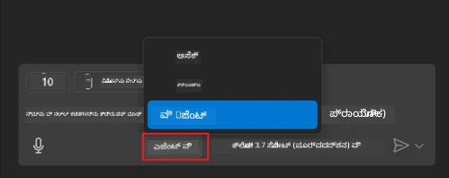
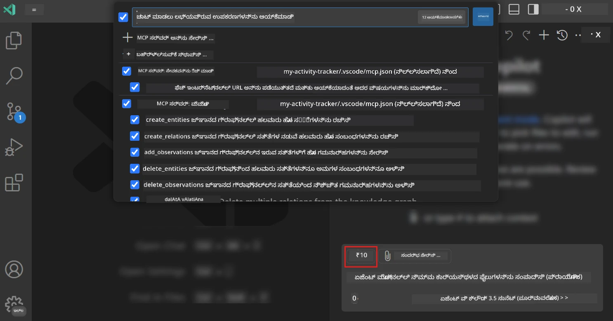
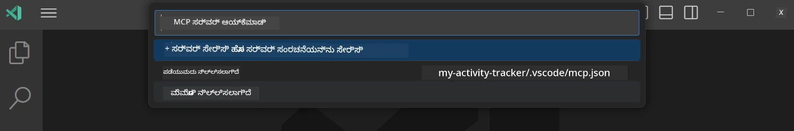
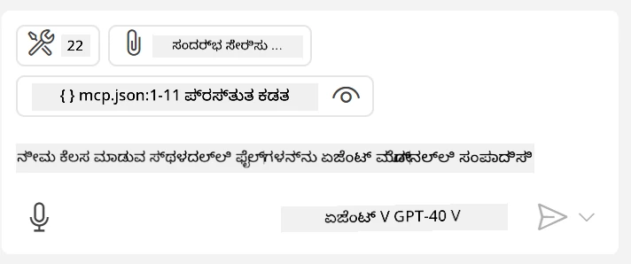
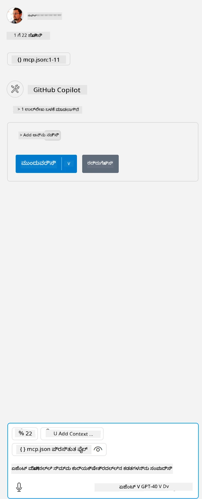

# GitHub Copilot ಏಜೆಂಟ್ ಮೋಡ್‌ನಿಂದ ಸರ್ವರ್ ಅನ್ನು ಉಪಯೋಗಿಸುವುದು

Visual Studio Code ಮತ್ತು GitHub Copilot ಕ್ಲೈಂಟ್ ಆಗಿ ಕಾರ್ಯನಿರ್ವಹಿಸಿ MCP ಸರ್ವರ್ ಅನ್ನು ಉಪಯೋಗಿಸಬಹುದು. ನೀವು ಏಕೆ ಇದನ್ನು ಮಾಡಬೇಕು ಎಂದು ಕೇಳಬಹುದು? ಅಂದರೆ MCP ಸರ್ವರ್ ಹೊಂದಿರುವ ಯಾವುದೇ ವೈಶಿಷ್ಟ್ಯಗಳನ್ನು ಈಗ ನಿಮ್ಮ IDE ಒಳಗಿಂದ ಬಳಸಬಹುದು. ಉದಾಹರಣೆಗೆ GitHub ನ MCP ಸರ್ವರ್ ಅನ್ನು ಸೇರಿಸಿದರೆ, ಟರ್ಮಿನಲ್‌ನಲ್ಲಿ ನಿರ್ದಿಷ್ಟ ಕಮಾಂಡ್‌ಗಳನ್ನು ಟೈಪ್ ಮಾಡುವ ಬದಲು ಪ್ರಾಂಪ್ಟ್‌ಗಳ ಮೂಲಕ GitHub ಅನ್ನು ನಿಯಂತ್ರಿಸಲು ಸಾಧ್ಯವಾಗುತ್ತದೆ. ಅಥವಾ ಸಾಮಾನ್ಯವಾಗಿ ನಿಮ್ಮ ಡೆವಲಪರ್ ಅನುಭವವನ್ನು ಸುಧಾರಿಸುವ ಯಾವುದೇ ವಿಷಯವನ್ನು ನೈಸರ್ಗಿಕ ಭಾಷೆಯಿಂದ ನಿಯಂತ್ರಿಸಬಹುದು ಎಂದು ಕಲ್ಪಿಸಿ. ಈಗ ನೀವು ಗೆಲುವನ್ನು ಕಾಣುತ್ತೀರಾ?

## ಅವಲೋಕನ

ಈ ಪಾಠವು Visual Studio Code ಮತ್ತು GitHub Copilot ನ ಏಜೆಂಟ್ ಮೋಡ್ ಅನ್ನು ನಿಮ್ಮ MCP ಸರ್ವರ್‌ಗಾಗಿ ಕ್ಲೈಂಟ್ ಆಗಿ ಹೇಗೆ ಬಳಸುವುದು ಎಂಬುದನ್ನು ಒಳಗೊಂಡಿದೆ.

## ಕಲಿಕೆಯ ಉದ್ದೇಶಗಳು

ಈ ಪಾಠದ ಅಂತ್ಯಕ್ಕೆ, ನೀವು ಈ ಕೆಳಗಿನವುಗಳನ್ನು ಮಾಡಲು ಸಾಧ್ಯವಾಗುತ್ತದೆ:

- Visual Studio Code ಮೂಲಕ MCP ಸರ್ವರ್ ಅನ್ನು ಉಪಯೋಗಿಸುವುದು.
- GitHub Copilot ಮೂಲಕ ಸಾಧನಗಳನ್ನು ಚಾಲನೆ ಮಾಡುವುದು.
- Visual Studio Code ಅನ್ನು ನಿಮ್ಮ MCP ಸರ್ವರ್ ಅನ್ನು ಹುಡುಕಿ ನಿರ್ವಹಿಸಲು ಸಂರಚಿಸುವುದು.

## ಬಳಕೆ

ನೀವು ನಿಮ್ಮ MCP ಸರ್ವರ್ ಅನ್ನು ಎರಡು ವಿಭಿನ್ನ ರೀತಿಗಳಲ್ಲಿ ನಿಯಂತ್ರಿಸಬಹುದು:

- ಬಳಕೆದಾರ ಇಂಟರ್ಫೇಸ್, ಇದು ಈ ಅಧ್ಯಾಯದ ನಂತರದ ಭಾಗದಲ್ಲಿ ಹೇಗೆ ಮಾಡಲಾಗುತ್ತದೆ ಎಂದು ನೀವು ನೋಡುತ್ತೀರಿ.
- ಟರ್ಮಿನಲ್, `code` ಎಕ್ಸಿಕ್ಯೂಟೇಬಲ್ ಬಳಸಿ ಟರ್ಮಿನಲ್‌ನಿಂದ ವಸ್ತುಗಳನ್ನು ನಿಯಂತ್ರಿಸುವುದು ಸಾಧ್ಯ:

  ನಿಮ್ಮ ಬಳಕೆದಾರ ಪ್ರೊಫೈಲ್‌ಗೆ MCP ಸರ್ವರ್ ಸೇರಿಸಲು, --add-mcp ಕಮಾಂಡ್ ಲೈನ್ ಆಯ್ಕೆಯನ್ನು ಬಳಸಿ, ಮತ್ತು JSON ಸರ್ವರ್ ಸಂರಚನೆಯನ್ನು {\"name\":\"server-name\",\"command\":...} ರೂಪದಲ್ಲಿ ಒದಗಿಸಿ.

  ```
  code --add-mcp "{\"name\":\"my-server\",\"command\": \"uvx\",\"args\": [\"mcp-server-fetch\"]}"
  ```

### ಸ್ಕ್ರೀನ್‌ಶಾಟ್‌ಗಳು





ಮುಂದಿನ ವಿಭಾಗಗಳಲ್ಲಿ ನಾವು ದೃಶ್ಯ ಇಂಟರ್ಫೇಸ್ ಅನ್ನು ಹೇಗೆ ಬಳಸುತ್ತೇವೆ ಎಂಬುದನ್ನು ಹೆಚ್ಚು ಚರ್ಚಿಸೋಣ.

## ವಿಧಾನ

ಇದನ್ನು ಉನ್ನತ ಮಟ್ಟದಲ್ಲಿ ಹೇಗೆ ಎದುರಿಸಬೇಕೆಂದು ಇಲ್ಲಿದೆ:

- ನಮ್ಮ MCP ಸರ್ವರ್ ಅನ್ನು ಹುಡುಕಲು ಫೈಲ್ ಅನ್ನು ಸಂರಚಿಸಿ.
- ಆ ಸರ್ವರ್ ಅನ್ನು ಪ್ರಾರಂಭಿಸಿ/ಸಂಪರ್ಕಿಸಿ ಮತ್ತು ಅದರ ಸಾಮರ್ಥ್ಯಗಳನ್ನು ಪಟ್ಟಿ ಮಾಡಿಸಿಕೊಳ್ಳಿ.
- GitHub Copilot ಚಾಟ್ ಇಂಟರ್ಫೇಸ್ ಮೂಲಕ ಆ ಸಾಮರ್ಥ್ಯಗಳನ್ನು ಬಳಸಿ.

ಚೆನ್ನಾಗಿದೆ, ಈಗ ನಾವು ಪ್ರಕ್ರಿಯೆಯನ್ನು ಅರ್ಥಮಾಡಿಕೊಂಡಿದ್ದೇವೆ, Visual Studio Code ಮೂಲಕ MCP ಸರ್ವರ್ ಅನ್ನು ಉಪಯೋಗಿಸುವ ಪ್ರಯತ್ನ ಮಾಡೋಣ.

## ಅಭ್ಯಾಸ: ಸರ್ವರ್ ಅನ್ನು ಉಪಯೋಗಿಸುವುದು

ಈ ಅಭ್ಯಾಸದಲ್ಲಿ, ನಾವು Visual Studio Code ಅನ್ನು ನಿಮ್ಮ MCP ಸರ್ವರ್ ಅನ್ನು ಹುಡುಕಲು ಸಂರಚಿಸುವೆವು, ಇದರಿಂದ GitHub Copilot ಚಾಟ್ ಇಂಟರ್ಫೇಸ್ ಮೂಲಕ ಅದನ್ನು ಬಳಸಬಹುದು.

### -0- ಪೂರ್ವಪದವಿ, MCP ಸರ್ವರ್ ಅನ್ವೇಷಣೆಯನ್ನು ಸಕ್ರಿಯಗೊಳಿಸಿ

ನೀವು MCP ಸರ್ವರ್‌ಗಳ ಅನ್ವೇಷಣೆಯನ್ನು ಸಕ್ರಿಯಗೊಳಿಸಬೇಕಾಗಬಹುದು.

1. Visual Studio Code ನಲ್ಲಿ `File -> Preferences -> Settings` ಗೆ ಹೋಗಿ.

1. "MCP" ಅನ್ನು ಹುಡುಕಿ ಮತ್ತು settings.json ಫೈಲ್‌ನಲ್ಲಿ `chat.mcp.discovery.enabled` ಅನ್ನು ಸಕ್ರಿಯಗೊಳಿಸಿ.

### -1- ಸಂರಚನಾ ಫೈಲ್ ರಚಿಸಿ

ನಿಮ್ಮ ಪ್ರಾಜೆಕ್ಟ್ ರೂಟ್‌ನಲ್ಲಿ ಸಂರಚನಾ ಫೈಲ್ ರಚಿಸುವುದರಿಂದ ಪ್ರಾರಂಭಿಸಿ, ನೀವು MCP.json ಎಂಬ ಫೈಲ್ ಅನ್ನು .vscode ಎಂಬ ಫೋಲ್ಡರ್‌ನಲ್ಲಿ ಇರಿಸಬೇಕು. ಇದು ಹೀಗೆ ಕಾಣಬೇಕು:

```text
.vscode
|-- mcp.json
```

ಮುಂದೆ, ಸರ್ವರ್ ಎಂಟ್ರಿಯನ್ನು ಹೇಗೆ ಸೇರಿಸುವುದನ್ನು ನೋಡೋಣ.

### -2- ಸರ್ವರ್ ಅನ್ನು ಸಂರಚಿಸಿ

*ಮcp.json* ಗೆ ಕೆಳಗಿನ ವಿಷಯವನ್ನು ಸೇರಿಸಿ:

```json
{
    "inputs": [],
    "servers": {
       "hello-mcp": {
           "command": "node",
           "args": [
               "build/index.js"
           ]
       }
    }
}
```

ಮೇಲಿನ ಉದಾಹರಣೆಯಲ್ಲಿ Node.js ನಲ್ಲಿ ಬರೆಯಲಾದ ಸರ್ವರ್ ಅನ್ನು ಪ್ರಾರಂಭಿಸುವ ಸರಳ ಉದಾಹರಣೆ ಇದೆ, ಇತರ ರನ್‌ಟೈಮ್‌ಗಳಿಗೆ ಸರಿಯಾದ ಕಮಾಂಡ್ ಅನ್ನು `command` ಮತ್ತು `args` ಬಳಸಿ ಸೂಚಿಸಿ.

### -3- ಸರ್ವರ್ ಪ್ರಾರಂಭಿಸಿ

ನೀವು ಎಂಟ್ರಿಯನ್ನು ಸೇರಿಸಿದ ನಂತರ, ಸರ್ವರ್ ಅನ್ನು ಪ್ರಾರಂಭಿಸೋಣ:

1. *mcp.json* ನಲ್ಲಿ ನಿಮ್ಮ ಎಂಟ್ರಿಯನ್ನು ಕಂಡು "play" ಐಕಾನ್ ಅನ್ನು ಹುಡುಕಿ:

    

1. "play" ಐಕಾನ್ ಕ್ಲಿಕ್ ಮಾಡಿ, GitHub Copilot ಚಾಟ್‌ನಲ್ಲಿ ಸಾಧನಗಳ ಐಕಾನ್ ಲಭ್ಯವಿರುವ ಸಾಧನಗಳ ಸಂಖ್ಯೆಯನ್ನು ಹೆಚ್ಚಿಸುವುದನ್ನು ನೀವು ನೋಡಬಹುದು. ಆ ಸಾಧನಗಳ ಐಕಾನ್ ಕ್ಲಿಕ್ ಮಾಡಿದರೆ, ನೋಂದಾಯಿತ ಸಾಧನಗಳ ಪಟ್ಟಿ ಕಾಣುತ್ತದೆ. ನೀವು GitHub Copilot ಅವುಗಳನ್ನು ಸಂದರ್ಭವಾಗಿ ಬಳಸಬೇಕೆಂದು ಬಯಸಿದರೆ ಪ್ರತಿ ಸಾಧನವನ್ನು ಪರಿಶೀಲಿಸಬಹುದು/ಅಪರಿಶೀಲಿಸಬಹುದು:

  

1. ಸಾಧನವನ್ನು ಚಾಲನೆ ಮಾಡಲು, ನೀವು ತಿಳಿದಿರುವ ಸಾಧನ ವಿವರಣೆಗೆ ಹೊಂದಿಕೆಯಾಗುವ ಪ್ರಾಂಪ್ಟ್ ಅನ್ನು ಟೈಪ್ ಮಾಡಿ, ಉದಾಹರಣೆಗೆ "add 22 to 1" ಎಂಬ ಪ್ರಾಂಪ್ಟ್:

  

  ನೀವು 23 ಎಂದು ಉತ್ತರವನ್ನು ನೋಡಬೇಕು.

## ನಿಯೋಜನೆ

ನಿಮ್ಮ *mcp.json* ಫೈಲ್‌ಗೆ ಸರ್ವರ್ ಎಂಟ್ರಿಯನ್ನು ಸೇರಿಸಿ ಮತ್ತು ಸರ್ವರ್ ಅನ್ನು ಪ್ರಾರಂಭಿಸುವುದು/ನಿಲ್ಲಿಸುವುದು ಸಾಧ್ಯವಿರುವುದನ್ನು ಖಚಿತಪಡಿಸಿಕೊಳ್ಳಿ. GitHub Copilot ಚಾಟ್ ಇಂಟರ್ಫೇಸ್ ಮೂಲಕ ನಿಮ್ಮ ಸರ್ವರ್‌ನ ಸಾಧನಗಳೊಂದಿಗೆ ಸಂವಹನ ಮಾಡಬಹುದಾದುದನ್ನು ಖಚಿತಪಡಿಸಿಕೊಳ್ಳಿ.

## ಪರಿಹಾರ

[ಪರಿಹಾರ](./solution/README.md)

## ಪ್ರಮುಖ ಅಂಶಗಳು

ಈ ಅಧ್ಯಾಯದಿಂದ ಪಡೆದ ಪ್ರಮುಖ ಅಂಶಗಳು:

- Visual Studio Code ಒಂದು ಅದ್ಭುತ ಕ್ಲೈಂಟ್ ಆಗಿದ್ದು, ನೀವು ಹಲವಾರು MCP ಸರ್ವರ್‌ಗಳು ಮತ್ತು ಅವುಗಳ ಸಾಧನಗಳನ್ನು ಉಪಯೋಗಿಸಬಹುದು.
- GitHub Copilot ಚಾಟ್ ಇಂಟರ್ಫೇಸ್ ಮೂಲಕ ನೀವು ಸರ್ವರ್‌ಗಳೊಂದಿಗೆ ಸಂವಹನ ಮಾಡುತ್ತೀರಿ.
- ಬಳಕೆದಾರರಿಂದ API ಕೀಗಳು ಮುಂತಾದ ಇನ್ಪುಟ್‌ಗಳನ್ನು ಕೇಳಬಹುದು, ಅವುಗಳನ್ನು *mcp.json* ಫೈಲ್‌ನಲ್ಲಿ ಸರ್ವರ್ ಎಂಟ್ರಿ ಸಂರಚಿಸುವಾಗ MCP ಸರ್ವರ್‌ಗೆ ಪಾಸ್ ಮಾಡಬಹುದು.

## ಮಾದರಿಗಳು

- [Java ಕ್ಯಾಲ್ಕ್ಯುಲೇಟರ್](../samples/java/calculator/README.md)
- [.Net ಕ್ಯಾಲ್ಕ್ಯುಲೇಟರ್](../../../../03-GettingStarted/samples/csharp)
- [JavaScript ಕ್ಯಾಲ್ಕ್ಯುಲೇಟರ್](../samples/javascript/README.md)
- [TypeScript ಕ್ಯಾಲ್ಕ್ಯುಲೇಟರ್](../samples/typescript/README.md)
- [Python ಕ್ಯಾಲ್ಕ್ಯುಲೇಟರ್](../../../../03-GettingStarted/samples/python)

## ಹೆಚ್ಚುವರಿ ಸಂಪನ್ಮೂಲಗಳು

- [Visual Studio ಡಾಕ್ಯುಮೆಂಟೇಶನ್](https://code.visualstudio.com/docs/copilot/chat/mcp-servers)

## ಮುಂದಿನದು ಏನು

- ಮುಂದಿನದು: [stdio ಸರ್ವರ್ ರಚನೆ](../05-stdio-server/README.md)

---

<!-- CO-OP TRANSLATOR DISCLAIMER START -->
**ಅಸ್ವೀಕರಣ**:  
ಈ ದಸ್ತಾವೇಜು AI ಅನುವಾದ ಸೇವೆ [Co-op Translator](https://github.com/Azure/co-op-translator) ಬಳಸಿ ಅನುವಾದಿಸಲಾಗಿದೆ. ನಾವು ನಿಖರತೆಯಿಗಾಗಿ ಪ್ರಯತ್ನಿಸುತ್ತಿದ್ದರೂ, ಸ್ವಯಂಚಾಲಿತ ಅನುವಾದಗಳಲ್ಲಿ ತಪ್ಪುಗಳು ಅಥವಾ ಅಸತ್ಯತೆಗಳು ಇರಬಹುದು ಎಂದು ದಯವಿಟ್ಟು ಗಮನಿಸಿ. ಮೂಲ ಭಾಷೆಯಲ್ಲಿರುವ ಮೂಲ ದಸ್ತಾವೇಜನ್ನು ಅಧಿಕೃತ ಮೂಲವಾಗಿ ಪರಿಗಣಿಸಬೇಕು. ಪ್ರಮುಖ ಮಾಹಿತಿಗಾಗಿ, ವೃತ್ತಿಪರ ಮಾನವ ಅನುವಾದವನ್ನು ಶಿಫಾರಸು ಮಾಡಲಾಗುತ್ತದೆ. ಈ ಅನುವಾದ ಬಳಕೆಯಿಂದ ಉಂಟಾಗುವ ಯಾವುದೇ ತಪ್ಪು ಅರ್ಥಮಾಡಿಕೊಳ್ಳುವಿಕೆ ಅಥವಾ ತಪ್ಪು ವಿವರಣೆಗಳಿಗೆ ನಾವು ಹೊಣೆಗಾರರಾಗುವುದಿಲ್ಲ.
<!-- CO-OP TRANSLATOR DISCLAIMER END -->