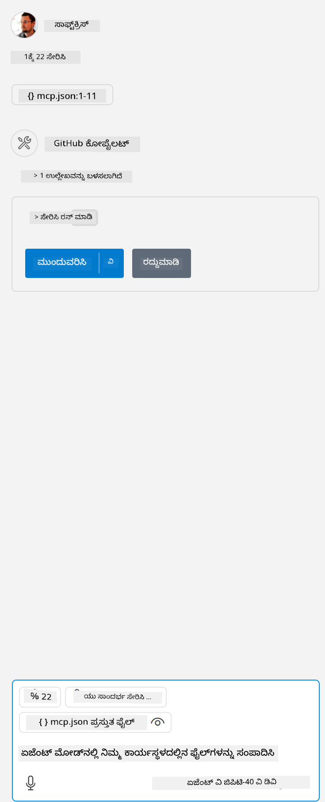

<!--
CO_OP_TRANSLATOR_METADATA:
{
  "original_hash": "5ef8f5821c1a04f7b1fc4f15098ecab8",
  "translation_date": "2025-12-11T13:17:47+00:00",
  "source_file": "03-GettingStarted/04-vscode/solution/README.md",
  "language_code": "kn"
}
-->
# ಮಾದರಿಯನ್ನು ಚಾಲನೆ ಮಾಡುವುದು

ಇಲ್ಲಿ ನಾವು ನೀವು ಈಗಾಗಲೇ ಕಾರ್ಯನಿರ್ವಹಿಸುತ್ತಿರುವ ಸರ್ವರ್ ಕೋಡ್ ಹೊಂದಿದ್ದೀರಿ ಎಂದು فرضಿಸುತ್ತೇವೆ. ದಯವಿಟ್ಟು ಹಿಂದಿನ ಅಧ್ಯಾಯಗಳಲ್ಲಿ ಒಂದರಿಂದ ಸರ್ವರ್ ಅನ್ನು ಹುಡುಕಿ.

## mcp.json ಅನ್ನು ಸೆಟ್ ಅಪ್ ಮಾಡುವುದು

ಇದು ನೀವು ಉಲ್ಲೇಖಕ್ಕಾಗಿ ಬಳಸುವ ಫೈಲ್, [mcp.json](../../../../../03-GettingStarted/04-vscode/solution/mcp.json).

ನಿಮ್ಮ ಸರ್ವರ್‌ಗೆ ಪೂರ್ಣ ಮಾರ್ಗವನ್ನು ಸೂಚಿಸಲು ಮತ್ತು ಚಾಲನೆ ಮಾಡಲು ಅಗತ್ಯವಿರುವ ಸಂಪೂರ್ಣ ಕಮಾಂಡ್ ಸೇರಿಸಿ ಸರ್ವರ್ ಎಂಟ್ರಿಯನ್ನು ಅಗತ್ಯವಿರುವಂತೆ ಬದಲಾಯಿಸಿ.

ಮೇಲಿನ ಉದಾಹರಣಾ ಫೈಲ್‌ನಲ್ಲಿ ಸರ್ವರ್ ಎಂಟ್ರಿ ಹೀಗೆ ಕಾಣಿಸುತ್ತದೆ:

<details>
<summary>node.js</summary>
```json
"hello-mcp": {
    "command": "node",
    "args": [
        "build/index.js"
    ]
}
```
</details>

<details>
<summary>.NET</summary>

ನೀವು GitHub ರೆಪೊಸಿಟರಿ ರೂಟ್ ಅನ್ನು ನಮೂದಿಸಬೇಕಾಗಬಹುದು, ಇದನ್ನು `git rev-parse --show-toplevel` ಕಮಾಂಡ್‌ನಿಂದ ಪಡೆಯಬಹುದು.

```jsonc
{
  "inputs": [
    {
      "type": "promptString",
      "id": "repository-root",
      "description": "The absolute path to the repository root"
    }
  ],
  "servers": {
    "calculator-mcp-dotnet": {
      "type": "stdio",
      "command": "dotnet",
      "args": [
        "run",
        "--project",
        "${input:repository-root}/03-GettingStarted/02-client/solution/server/server.csproj"
      ]
    }
  }
}
```

</details>

ಇದು ಈ ರೀತಿಯ ಕಮಾಂಡ್ ಅನ್ನು ಚಾಲನೆ ಮಾಡುವುದಕ್ಕೆ ಹೊಂದಿಕೆಯಾಗುತ್ತದೆ: `node build/index.js`.

- ನಿಮ್ಮ ಸರ್ವರ್ ಫೈಲ್ ಎಲ್ಲಿದೆ ಅಥವಾ ನಿಮ್ಮ ಆಯ್ಕೆಮಾಡಿದ ರನ್‌ಟೈಮ್ ಮತ್ತು ಸರ್ವರ್ ಸ್ಥಳದ ಆಧಾರದ ಮೇಲೆ ಸರ್ವರ್ ಪ್ರಾರಂಭಿಸಲು ಅಗತ್ಯವಿರುವುದಕ್ಕೆ ಅನುಗುಣವಾಗಿ ಈ ಸರ್ವರ್ ಎಂಟ್ರಿಯನ್ನು ಬದಲಾಯಿಸಿ.

## ಸರ್ವರ್‌ನಲ್ಲಿ ವೈಶಿಷ್ಟ್ಯಗಳನ್ನು ಬಳಸಿ

- ನೀವು *mcp.json* ಅನ್ನು *./vscode* ಫೋಲ್ಡರ್‌ಗೆ ಸೇರಿಸಿದ ನಂತರ, `play` ಐಕಾನ್ ಕ್ಲಿಕ್ ಮಾಡಿ,

    GitHub Copilot ನಲ್ಲಿ ಚಾಟ್ ಕ್ಷೇತ್ರದ ಮೇಲ್ಭಾಗದಲ್ಲಿ ಇರುವ ಟೂಲಿಂಗ್ ಐಕಾನ್ ಬದಲಾವಣೆಯನ್ನು ಗಮನಿಸಿ, ಲಭ್ಯವಿರುವ ಉಪಕರಣಗಳ ಸಂಖ್ಯೆಯನ್ನು ಹೆಚ್ಚಿಸುತ್ತದೆ.

## ಉಪಕರಣವನ್ನು ಚಾಲನೆ ಮಾಡುವುದು

- ನಿಮ್ಮ ಚಾಟ್ ವಿಂಡೋದಲ್ಲಿ ನಿಮ್ಮ ಉಪಕರಣದ ವಿವರಣೆಗೆ ಹೊಂದಿಕೆಯಾಗುವ ಪ್ರಾಂಪ್ಟ್ ಅನ್ನು ಟೈಪ್ ಮಾಡಿ. ಉದಾಹರಣೆಗೆ, `add` ಉಪಕರಣವನ್ನು ಚಾಲನೆ ಮಾಡಲು "add 3 to 20" ಎಂದು ಟೈಪ್ ಮಾಡಿ.

    ನೀವು ಚಾಟ್ ಪಠ್ಯ ಬಾಕ್ಸ್ ಮೇಲ್ಭಾಗದಲ್ಲಿ ಉಪಕರಣವನ್ನು ಆಯ್ಕೆಮಾಡಲು ಸೂಚಿಸುವಂತೆ ಉಪಕರಣವನ್ನು ಪ್ರದರ್ಶಿಸಲಾಗುತ್ತದೆ, ಈ ದೃಶ್ಯದಲ್ಲಿ ಹೀಗೆ ಕಾಣುತ್ತದೆ:

    

    ಉಪಕರಣವನ್ನು ಆಯ್ಕೆಮಾಡಿದರೆ, ನೀವು "23" ಎಂಬ ಸಂಖ್ಯಾತ್ಮಕ ಫಲಿತಾಂಶವನ್ನು ಕಾಣಬೇಕು, ನೀವು ಹಿಂದಿನಂತೆ ಪ್ರಾಂಪ್ಟ್ ನೀಡಿದ್ದರೆ.

---

<!-- CO-OP TRANSLATOR DISCLAIMER START -->
**ಅಸ್ವೀಕಾರ**:  
ಈ ದಸ್ತಾವೇಜು AI ಅನುವಾದ ಸೇವೆ [Co-op Translator](https://github.com/Azure/co-op-translator) ಬಳಸಿ ಅನುವಾದಿಸಲಾಗಿದೆ. ನಾವು ನಿಖರತೆಯಿಗಾಗಿ ಪ್ರಯತ್ನಿಸುತ್ತಿದ್ದರೂ, ಸ್ವಯಂಚಾಲಿತ ಅನುವಾದಗಳಲ್ಲಿ ತಪ್ಪುಗಳು ಅಥವಾ ಅಸತ್ಯತೆಗಳು ಇರಬಹುದು ಎಂದು ದಯವಿಟ್ಟು ಗಮನಿಸಿ. ಮೂಲ ಭಾಷೆಯಲ್ಲಿರುವ ಮೂಲ ದಸ್ತಾವೇಜನ್ನು ಅಧಿಕೃತ ಮೂಲವೆಂದು ಪರಿಗಣಿಸಬೇಕು. ಪ್ರಮುಖ ಮಾಹಿತಿಗಾಗಿ, ವೃತ್ತಿಪರ ಮಾನವ ಅನುವಾದವನ್ನು ಶಿಫಾರಸು ಮಾಡಲಾಗುತ್ತದೆ. ಈ ಅನುವಾದ ಬಳಕೆಯಿಂದ ಉಂಟಾಗುವ ಯಾವುದೇ ತಪ್ಪು ಅರ್ಥಮಾಡಿಕೊಳ್ಳುವಿಕೆ ಅಥವಾ ತಪ್ಪು ವಿವರಣೆಗಳಿಗೆ ನಾವು ಹೊಣೆಗಾರರಾಗುವುದಿಲ್ಲ.
<!-- CO-OP TRANSLATOR DISCLAIMER END -->