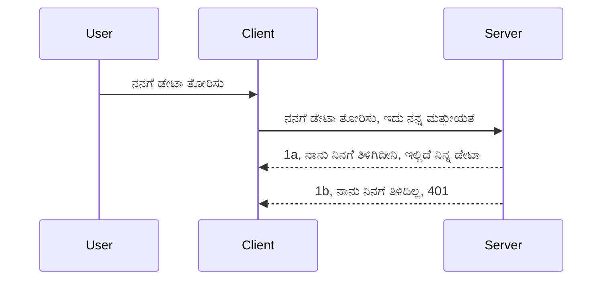

# ಸರಳ ಪ್ರಾಮಾಣೀಕರಣ

MCP SDK ಗಳು OAuth 2.1 ಬಳಕೆಯನ್ನು ಬೆಂಬಲಿಸುತ್ತವೆ, ಇದು ವಾಸ್ತವವಾಗಿ ಸಾಕಷ್ಟು ಜಟಿಲ ಪ್ರಕ್ರಿಯೆಯಾಗಿದ್ದು, auth ಸರ್ವರ್, ресурಸ್ ಸರ್ವರ್, ಪ್ರಮಾಣಪತ್ರಗಳನ್ನು ಪೋಸ್ಟ್ ಮಾಡುವುದು, ಒಂದು ಕೋಡ್ ಪಡೆಯುವುದು, ಆ ಕೋಡ್ ಅನ್ನು ಬೇರರ್ ಟೋಕನ್ ಗೆ ವಿನಿಮಯ ಮಾಡಿಕೊಳ್ಳು ವುದು ಮತ್ತು ಕೊನೆಗೆ ನಿಮ್ಮ ресурಸ್ ಡೇಟಾ ಪಡೆಯುವವರೆಗೆ ಸಂಬಂಧಿಸಿದ್ದಾದ ಸಂಕ್ಷಿಪ್ತ ಕಲ್ಪನೆಗಳನ್ನು ಒಳಗೊಂಡಿದೆ. ನೀವು Implement ಮಾಡಲಿರುವ ಚಿಕ್ಕ ಮಟ್ಟದ auth ನಿಂದ ಪ್ರಾರಂಭಿಸಿ ಮತ್ತು ಕಾಯ್ದುಕೊಳ್ಳುವ ಅವಶ್ಯಕತೆಗಳ ಮೂಲಕ ಉತ್ತಮ ಮತ್ತು ಉತ್ತಮ ಭದ್ರತೆಯತ್ತ ಗಮನ ಹರಿಸುವುದು ಉತ್ತಮ. ಆದಕಾರಣ ಈ ಅಧ್ಯಾಯ ಅಸ್ತಿತ್ವದಲ್ಲಿದೆ, ನಿಮ್ಮನ್ನು ಹೆಚ್ಚಿನ ಮಟ್ಟದ auth ಗೆ ತರುವಿಗಾಗಿ.

## Auth ಅಂದರೆ ಏನು?

Auth ಅನುವಾದ authentication ಮತ್ತು authorization. ಅರ್ಥ ಯೇನೆಂದರೆ ನಾವು ಎರಡು ಕೆಲಸಗಳನ್ನು ಮಾಡಬೇಕಿದೆ:

- **Authentication**, ಅಂದರೆ ನಾವು ಯಾರಾದರೂ ನಮ್ಮ ಮನೆಯಲ್ಲಿ ಪ್ರವೇಶಿಸಲು ಅನುಮತಿಸುವುದಾದರೆ, ಅವರು "ಇಲ್ಲಿ" ಇರುವ ಹಕ್ಕು ಹೊಂದಿದೆಯೇ ಎಂಬುದನ್ನು ತಿಳಿದುಕೊಳ್ಳುವ ಪ್ರಕ್ರಿಯೆ. ಅಂದರೆ ನಮ್ಮ MCP ಸರ್ವರ್ ವೈಶಿಷ್ಟ್ಯಗಳು ನೆಲೆಸಿರುವ ನಮ್ಮ ресурಸ್ ಸರ್ವರ್ ಗೆ ಪ್ರವೇಶ.
- **Authorization**, ಅಂದರೆ ಬಳಕೆದಾರರು ಕೇಳುತ್ತಿರುವ ನಿಖರ resources ಗೆ ಅವರ ಪ್ರವೇಶ ಹಕ್ಕು ಇದೆ ಎಂದು ಗೊತ್ತಾಗಿಸುವ ಪ್ರಕ್ರಿಯೆ. ಉದಾಹರಣೆಗೆ, ಆ ಆರ್ಡರ್‌ಗಳು ಅಥವಾ ಉತ್ಪನ್ನಗಳು ಅಥವಾ ಅವರು ವಿಷಯವನ್ನು ಓದಬಹುದು ಆದರೆ ಅಡೆದುಹಾಕಲು ಅನುಮತಿ ಇಲ್ಲ.

## ಪ್ರಮಾಣಪತ್ರಗಳು: ನಾವು ಸಿಸ್ಟಂಗೆ ನಾವು ಯಾರಾಗಿರುವೆವು ಎಂದು ಹೇಗೆ ಹೇಳುತ್ತೇವೆ

ಅಸಾಮಾನ್ಯವಾಗಿ ಹೆಚ್ಚಿನ ವೆಬ್ ಡೆವೆಲಪರ್ ಗಳು ಸರ್ವರ್ ಗೆ ಒಂದು ಪ್ರಮಾಣಪತ್ರವನ್ನು ಒದಗಿಸುವುದಾಗಿ ಯೋಚಿಸುತ್ತಾರೆ, ಸಾಮಾನ್ಯವಾಗಿ ಒಂದು ಸೀಕ್ರೆಟ್, ಅದು "Authentication" ಮಾಡಲು ಸರ್ವರ್ ನಲ್ಲಿ ಇರುವುದು. ಈ ಪ್ರಮಾಣಪತ್ರವು ಸಾಮಾನ್ಯವಾಗಿ ಬಳಕೆದಾರಹೆಸರು ಮತ್ತು ಪಾಸ್ವರ್ಡ್ ನ base64 ಎನ್‌ಕೋಡ್ಡ್ ಆವೃತ್ತಿ ಅಥವಾ ಕೆಲವೊಂದು ನಿರ್ದಿಷ್ಟ ಬಳಕೆದಾರರನ್ನು ಗುರುತಿಸುವ API ಕೀ ಆಗಿರುತ್ತದೆ.

ಇದನ್ನು "Authorization" ಹೆಸರಿನ ಹೆಡರ್ ಮೂಲಕ ಹೀಗೆ ಕಳುಹಿಸಲಾಗುತ್ತದೆ:

```json
{ "Authorization": "secret123" }
```
  
ಇದು ಸಾಮಾನ್ಯವಾಗಿ ಬೇಸಿಕ್ ಪ್ರಾಮಾಣೀಕರಣ ಎಂದು ಕರೆಯಲ್ಪಡುತ್ತದೆ. ಒಟ್ಟಾರೆ ಪ್ರವಾಹ ಈ ಕೆಳಗಿನಂತೆ ಕೆಲಸ ಮಾಡುತ್ತದೆ:


ಈಗ ನಾವು ಪ್ರವಾಹ ದೃಷ್ಟಿಕೋನದಿಂದ ಇದು ಹೇಗೆ ಕೆಲಸ ಮಾಡುತ್ತದೆ ಎಂದು ಅರ್ಥಮಾಡಿಕೊಂಡಿದ್ದೇವೆ, ನಾವು ಇದನ್ನು ಹೇಗೆ ಅನುಷ್ಠಾನಗೊಳಿಸುತ್ತೇವೆ? ಬಹುತೇಕ ವೆಬ್ ಸರ್ವರ್ ಗಳು middleware ಅನ್ನುವ ಕಲ್ಪನೆಯನ್ನು ಹೊಂದಿವೆ, ಅದು ಒಂದು ಕೋಡ್ ತುಣುಕು, ಇದು ವಿನಂತಿಯ ಭಾಗವಾಗಿರುತ್ತೇ ಮತ್ತು ಪ್ರಮಾಣಪತ್ರವನ್ನು ಪರಿಶೀಲಿಸಿ, ಸರಿಯೆಂದು ವಹಿಸಿದರೆ ವಿನಂತಿಯನ್ನು ಮುಂದುವರಿಸಲು ಅನುಮತಿಸುತ್ತದೆ. ವಿವರಿಸಿದ ಪ್ರಮಾಣಪತ್ರಗಳಿಲ್ಲದಿದ್ದರೆ auth ದೋಷ ಸಿಗುತ್ತದೆ. ಇದನ್ನು ಆಗಾಗ್ಗೆ ಅನುಷ್ಠಾನಗೊಳಿಸುವುದನ್ನು ನೋಡೋಣ:

**Python**

```python
class AuthMiddleware(BaseHTTPMiddleware):
    async def dispatch(self, request, call_next):

        has_header = request.headers.get("Authorization")
        if not has_header:
            print("-> Missing Authorization header!")
            return Response(status_code=401, content="Unauthorized")

        if not valid_token(has_header):
            print("-> Invalid token!")
            return Response(status_code=403, content="Forbidden")

        print("Valid token, proceeding...")
       
        response = await call_next(request)
        # ಸ್ವಲ್ಪ ರೀತಿಯಲ್ಲಿ ಪ್ರತಿಕ್ರಿಯೆಯಲ್ಲಿ ಯಾವುದೇ ಗ್ರಾಹಕ హెಡ್ಡರ್‌ಗಳು ಸೇರಿಸಿ ಅಥವಾ ಬದಲಿಸಿ
        return response


starlette_app.add_middleware(CustomHeaderMiddleware)
```
  
ಇಲ್ಲಿ ನಮ್ಮಲ್ಲಿ ಇದೆ: 

- `AuthMiddleware` ಎನ್ನುವ middleware ರಚಿಸಲಾಗಿದೆ, ಇದರ `dispatch` ವಿಧಾನವನ್ನು ವೆಬ್ ಸರ್ವರ್ ಕರೆದರುತ್ತಿದೆ.
- middleware ಅನ್ನು ವೆಬ್ ಸರ್ವರ್ ಗೆ ಸೇರಿಸಲಾಗಿದೆ:

    ```python
    starlette_app.add_middleware(AuthMiddleware)
    ```
  
- "Authorization" ಹೆಡರ್ ಇರುತ್ತದೆಯೇ ಮತ್ತು ಕಳುಹಿಸಲಾಗುತ್ತಿರುವ ಸೀಕ್ರೆಟ್ ಮಾನ್ಯವೇ ವಿಮರ್ಶಿಸುವ ವಾಶಿಖವರಿಗಳನ್ನು ಬರೆಯಲಾಗಿದೆ:

    ```python
    has_header = request.headers.get("Authorization")
    if not has_header:
        print("-> Missing Authorization header!")
        return Response(status_code=401, content="Unauthorized")

    if not valid_token(has_header):
        print("-> Invalid token!")
        return Response(status_code=403, content="Forbidden")
    ```
  
    ಸೀಕ್ರೆಟ್ ಇದ್ದು ಮಾನ್ಯವಾದರೆ ನಾವು `call_next` ಅನ್ನು ಕರೆದು ವಿನಂತಿಯನ್ನು ಮುಂದುವರಿಸುತ್ತೇವೆ ಮತ್ತು ಪ್ರತಿಕ್ರಿಯೆಯನ್ನು ನೀಡುತ್ತೇವೆ.

    ```python
    response = await call_next(request)
    # ಯಾವುದೇ ಗ್ರಾಹಕ ಶೀರ್ಷಿಕೆಗಳನ್ನು ಸೇರಿಸಿ ಅಥವಾ ಪ್ರತಿಕ್ರಿಯೆಯಲ್ಲಿ ಯಾವದಾದರೂ ಬದಲಾವಣೆ ಮಾಡಿ
    return response
    ```
  
ವೇದಿಕೆ: ವೆಬ್ ವಿನಂತಿ ಸರ್ವರ್ ಕಡೆಗೆ ಮಾಡಿದಾಗ middleware ಕರೆದಮಾಡಲಾಗುತ್ತದೆ ಮತ್ತು ಅದರ ಅನುಷ್ಠಾನದ ಪ್ರಕಾರ ದಿನಾಂಶ ಅಥವಾ ಪ್ರವೇಶದ ಹಕ್ಕಿಲ್ಲದ ದೋಷವನ್ನು ತಲುಪಿಸುತ್ತದೆ.

**TypeScript**

ಇಲ್ಲಿ ನಾವು ಜನಪ್ರಿಯ ಫ್ರೇಮ್ವರ್ಕ್ Express ಬಳಸಿಕೊಂಡು middleware ರಚಿಸುತ್ತೇವೆ ಮತ್ತು MCP ಸರ್ವರ್ ತಲುಪುವ ಮೊದಲು ವಿನಂತಿಯನ್ನು ವರ್ಧಿಸುತ್ತೇವೆ. ಕೆಳಗಿನ ಕೋಡ್ ನೋಡೋಣ:

```typescript
function isValid(secret) {
    return secret === "secret123";
}

app.use((req, res, next) => {
    // 1. ಪ್ರಾಧಿಕಾರಿಕ ಶೀರ್ಷಿಕೆ ಇದೆಯೇ?
    if(!req.headers["Authorization"]) {
        res.status(401).send('Unauthorized');
    }
    
    let token = req.headers["Authorization"];

    // 2. ಮಾನ್ಯತೆಯನ್ನು ಪರಿಶೀಲಿಸಿ.
    if(!isValid(token)) {
        res.status(403).send('Forbidden');
    }

   
    console.log('Middleware executed');
    // 3. ವಿನಂತಿ ಪೈಪ್ಲೈನಿನ ಮುಂದಿನ ಹಂತಕ್ಕೆ ವಿನಂತಿಯನ್ನು ಕಳುಹಿಸುತ್ತದೆ.
    next();
});
```
  
ಈ ಕೋಡ್ ನಲ್ಲಿ ನಾವು:

1. ಮೊದಲು "Authorization" ಹೆಡರ್ ಇರುತ್ತದೆಯೇ ಎಂದು ಪರೀಕ್ಷಿಸಿ, ಇಲ್ಲದ್ದರೆ 401 ದೋಷ ಕಳುಹಿಸುತ್ತೇವೆ.
2. ಪ್ರಮಾಣಪತ್ರ/ಟೋಕನ್ ಸರಿಯೋ ಎಂದು ಖಚಿತಪಡಿಸಿಕೊಳ್ಳಿ, ತಪ್ಪಿದ್ದರೆ 403 ದೋಷ ಕಳುಹಿಸುತ್ತೇವೆ.
3. ಕೊನೆಗೆ ವಿನಂತಿಯನ್ನು ವಿನಂತಿ ಪೈಪ್ ಲೈನಿನಲ್ಲಿ ಸಾಗಿಸಿ, ಕೇಳಿದ resources ಅನ್ನು ಹಿಂತಿರುಗಿಸುತ್ತದೆ.

## ಅಭ್ಯಾಸ: authentication ಅನುಷ್ಠಾನಗೊಳಿಸಿ

ನಮ್ಮ ಜ್ಞಾನವನ್ನು ಬಳಸಿ ಇದನ್ನು ಅನುಷ್ಠಾನಗೊಳಿಸಲು ಪ್ರಯತ್ನಿಸೋಣ. ಯೋಜನೆ:

ಸರ್ವರ್

- ವೆಬ್ ಸರ್ವರ್ ಮತ್ತು MCP ಇನ್ಸ್‌ಟೆನ್ಸ್ ರಚಿಸಿ.  
- ಸರ್ವರ್ ಗೆ ಒಂದು middleware ಅನುಷ್ಠಾನಗೊಳಿಸಿ.

ಗ್ರಾಹಕ  

- ಪ್ರಮಾಣಪತ್ರ ಹೊಂದಿ, ಹೆಡರ್ ಮೂಲಕ ವೆಬ್ ವಿನಂತಿ ಕಳುಹಿಸಿ.

### -1- ವೆಬ್ ಸರ್ವರ್ ಮತ್ತು MCP ಇನ್ಸ್‌ಟೆನ್ಸ್ ರಚಿಸಿ

ನಮ್ಮ ಮೊದಲ ಹಂತದಲ್ಲಿ, ನಾವು ವೆಬ್ ಸರ್ವರ್ ಇನ್ಸ್‌ಟೆನ್ಸ್ ಮತ್ತು MCP ಸರ್ವರ್ ಸೃಷ್ಟಿಸಬೇಕಿದೆ.

**Python**

ಇಲ್ಲಿ MCP ಸರ್ವರ್ ಇನ್ಸ್‌ಟೆನ್ಸ್ ಸೃಷ್ಟಿಸಿ, starlette ವೆಬ್ ಅಪ್ ತಯಾರಿಸಿ ಮತ್ತು uvicorn ಬಳಸಿ ಹೋಸ್ಟ್ ಮಾಡುತ್ತೇವೆ.

```python
# MCP ಸರ್ವರ್ ರಚಿಸಲಾಗುತ್ತಿದೆ

app = FastMCP(
    name="MCP Resource Server",
    instructions="Resource Server that validates tokens via Authorization Server introspection",
    host=settings["host"],
    port=settings["port"],
    debug=True
)

# ಸ್ಟಾರ್ಲೆಟ್ ವೆಬ್ ಆಪ್ ರಚಿಸಲಾಗುತ್ತಿದೆ
starlette_app = app.streamable_http_app()

# ಉವಿಕ್ಕಾರ್ನ್ ಮೂಲಕ ಆಪ್‌ ಸರ್ವ್ ಮಾಡಲಾಗುತ್ತಿದೆ
async def run(starlette_app):
    import uvicorn
    config = uvicorn.Config(
            starlette_app,
            host=app.settings.host,
            port=app.settings.port,
            log_level=app.settings.log_level.lower(),
        )
    server = uvicorn.Server(config)
    await server.serve()

run(starlette_app)
```
  
ಈ ಕೋಡ್ ನಲ್ಲಿ ನಾವು:

- MCP ಸರ್ವರ್ ರಚನೆ ಮಾಡಿದೆವು.
- MCP ಸರ್ವರ್ ನಿಂದ starlette ವೆಬ್ ಅಪ್ ರಚಿಸಲಾಗಿದೆ, `app.streamable_http_app()`.
- uvicorn `server.serve()` ಬಳಸಿ ವೆಬ್ ಅಪ್ ಗೆ ಬೆಂಗಳೂರನ್ನು ಮಾಡಿದೆವು.

**TypeScript**

ಇಲ್ಲಿ MCP ಸರ್ವರ್ ಇನ್ಸ್‌ಟೆನ್ಸ್ ರಚಿಸಲಾಗಿದೆ.

```typescript
const server = new McpServer({
      name: "example-server",
      version: "1.0.0"
    });

    // ... ಸರ್ವರ್ ಸಂಪನ್ಮೂಲಗಳು, ಸಾಧನಗಳು ಮತ್ತು ಪ್ರಾಂಪ್ಟ್‌ಗಳನ್ನು ಹೊಂದಿಸಿ ...
```
  
ಈ MCP ಸರ್ವರ್ ರಚನೆ POST /mcp ರೂಟ್ನ ವ್ಯಾಖ್ಯಾನದಲ್ಲಿ ಇರಬೇಕು, ಅದಕ್ಕಾಗಿ ಮೇಲಿನ ಕೋಡ್ ಅನ್ನು ಹೀಗೆ ಸರಿಸೋಣ:

```typescript
import express from "express";
import { randomUUID } from "node:crypto";
import { McpServer } from "@modelcontextprotocol/sdk/server/mcp.js";
import { StreamableHTTPServerTransport } from "@modelcontextprotocol/sdk/server/streamableHttp.js";
import { isInitializeRequest } from "@modelcontextprotocol/sdk/types.js"

const app = express();
app.use(express.json());

// ಸೆಷನ್ ಐಡಿಯಲ್ಲಿ ಟ್ರಾನ್ಸ್ಪೋರ್ಟ್ ಗಳನ್ನು ಸಂಗ್ರಹಿಸಲು ನಕ್ಷೆ
const transports: { [sessionId: string]: StreamableHTTPServerTransport } = {};

// ಕ್ಲೈಂಟ್-ದಿಂದ-ಸರ್ವರ್ ಸಂವಹನಕ್ಕಾಗಿ POST ವಿನಂತಿಗಳನ್ನು ನಿಭಾಯಿಸಿ
app.post('/mcp', async (req, res) => {
  // ಈಗಾಗಲಿನ ಸೆಷನ್ ಐಡಿ ಪರೀಕ್ಷಿಸಿ
  const sessionId = req.headers['mcp-session-id'] as string | undefined;
  let transport: StreamableHTTPServerTransport;

  if (sessionId && transports[sessionId]) {
    // ಈಗಾಗಲೆ ಇರುವ ಟ್ರಾನ್ಸ್ಪೋರ್ಟ್ ಮರುಬಳಕೆ ಮಾಡು
    transport = transports[sessionId];
  } else if (!sessionId && isInitializeRequest(req.body)) {
    // ಹೊಸ ಪ್ರಾರಂಭಿಕ ವಿನಂತಿ
    transport = new StreamableHTTPServerTransport({
      sessionIdGenerator: () => randomUUID(),
      onsessioninitialized: (sessionId) => {
        // ಟ್ರಾನ್ಸ್ಪೋರ್ಟನ್ನು ಸೆಷನ್ ಐಡಿಯಲ್ಲಿ ಸಂಗ್ರಹಿಸಿ
        transports[sessionId] = transport;
      },
      // ಹಿಂಭಾಗದ ಹೊಂದಾಣಿಕೆಗೆ DNS ರಿಬೈನ್ಡಿಂಗ್ ರಕ್ಷಣೆ ಆಪ್ತವಾಗಿ ನಿಷ್ಕ್ರಿಯವಾಗಿದೆ. ನೀವು ಈ ಸರ್ವರ್ ಅನ್ನು
      // ಸ್ಥಳೀಯವಾಗಿ ಚಲಾಯಿಸುತ್ತಿದ್ದರೆ, ಖಚಿತಪಡಿಸಿಕೊಳ್ಳಿ:
      // enableDnsRebindingProtection: true,
      // allowedHosts: ['127.0.0.1'],
    });

    // ಮುಚ್ಚಿದಾಗ ಟ್ರಾನ್ಸ್ಪೋರ್ಟ್ ಅನ್ನು ಸ್ವಚ್ಛಗೊಳಿಸಿ
    transport.onclose = () => {
      if (transport.sessionId) {
        delete transports[transport.sessionId];
      }
    };
    const server = new McpServer({
      name: "example-server",
      version: "1.0.0"
    });

    // ... ಸರ್ವರ್ ಸಂಪನ್ಮೂಲಗಳು, ಉಪಕರಣಗಳು ಹಾಗೂ ಸೂಚನೆಗಳನ್ನು ಸೆಟ್ ಮಾಡಿ ...

    // MCP ಸರ್ವರ್ ಗೆ ಸಂಪರ್ಕಿಸು
    await server.connect(transport);
  } else {
    // ಅಮಾನ್ಯ ವಿನಂತಿ
    res.status(400).json({
      jsonrpc: '2.0',
      error: {
        code: -32000,
        message: 'Bad Request: No valid session ID provided',
      },
      id: null,
    });
    return;
  }

  // ವಿನಂತಿಯನ್ನು ನಿಭಾಯಿಸಿ
  await transport.handleRequest(req, res, req.body);
});

// GET ಮತ್ತು DELETE ವಿನಂತಿಗಳಿಗಾಗಿ ಮರುಬಳಕೆಯ ಸಾಧ್ಯವಿರುವ ನಿರ್ವಹಣೆ
const handleSessionRequest = async (req: express.Request, res: express.Response) => {
  const sessionId = req.headers['mcp-session-id'] as string | undefined;
  if (!sessionId || !transports[sessionId]) {
    res.status(400).send('Invalid or missing session ID');
    return;
  }
  
  const transport = transports[sessionId];
  await transport.handleRequest(req, res);
};

// ಸರ್ವರ್-ದಿಂದ-ಕ್ಲೈಂಟ್ ಸೂಚನೆಗಳಿಗಾಗಿ SSE ಮೂಲಕ GET ವಿನಂತಿಗಳನ್ನು ನಿಭಾಯಿಸಿ
app.get('/mcp', handleSessionRequest);

// ಸೆಷನ್ terminationಗಾಗಿ DELETE ವಿನಂತಿಗಳನ್ನು ನಿಭಾಯಿಸಿ
app.delete('/mcp', handleSessionRequest);

app.listen(3000);
```
  
ಈಗ ನೀವು ನೋಡಬಹುದು MCP ಸರ್ವರ್ ರಚನೆ `app.post("/mcp")` ಒಳಗೆ ಕಳುಹಿಸಲಾಗಿದೆ.

ಮುಂದಿನ ಹಂತ middleware ರಚಿಸುವ ಮತ್ತು ಪರಿಶೀಲಿಸುವುದು.

### -2- ಸರ್ವರ್ ಗೆ middleware ಅನುಷ್ಠಾನಗೊಳಿಸಿ

middleware ಭಾಗಕ್ಕೆ ಬಾರೋಣ. ಇಲ್ಲಿ ನಾವು `Authorization` ಹೆಡರ್ ನಲ್ಲಿ ಪ್ರಮಾಣಪತ್ರವನ್ನು ಹುಡುಕಿ ಅದನ್ನು ಮಾನ್ಯವೆಂದು ಪರಿಶೀಲಿಸುವ middleware ಸೃಷ್ಟಿಸುವೆವು. ಇದು ಸರಿಯಾದರೆ ವಿನಂತಿ ಮುಂದುವರಿಯುತ್ತದೆ ಮತ್ತು ಬೇಕಾದ ಕಾರ್ಯವನ್ನು ಮಾಡುತ್ತದೆ (ಉದಾ: ಸಾಧನಗಳ ಪಟ್ಟಿ, ресурಸ್ ಓದುವುದು ಅಥವಾ MCP ವೈಶಿಷ್ಟ್ಯಗಳ).

**Python**

middleware ರಚಿಸಲು, `BaseHTTPMiddleware` ನಿಂದ ವಂಶ ಸೃಷ್ಟಿಸುವ ಕ್ಲಾಸ್ ಬೇಕು. ಎರಡು ಪ್ರಮುಖ ಚಿಕ್ಕ ದೊಡ್ಡ ಭಾಗಗಳಿವೆ:

- `request`, ಅದು ಹೆಡರ್ ಮಾಹಿತಿ ಓದುವದು.
- `call_next` ಅದು ಬಂದು ಪ್ರಮಾಣಪತ್ರ ಸರಿ ಇದ್ದರೆ ವಿನಂತಿಯನ್ನು ಮುಂದುವರಿಸಲು ಕರೆ ಮಾಡಬೇಕಾಗಿರುವದಾಗುತ್ತದೆ.

ಮೊದಲು `Authorization` ಹೆಡರ್ ಇಲ್ಲದಿದ್ದಾಗ್ಕ್ಕೆ ಹ್ಯಾಂಡಲ್ ಮಾಡೋಣ:

```python
has_header = request.headers.get("Authorization")

# ಹೆಡರ್ ಇಲ್ಲ, 401 ರೊಂದಿಗೆ ವಿಫಲಗೊಳ್ಳಿ, ಅಲ್ಲದಿದ್ದರೆ ಮುಂದುವರಿಯಿರಿ.
if not has_header:
    print("-> Missing Authorization header!")
    return Response(status_code=401, content="Unauthorized")
```
  
ಇಲ್ಲಿ ನಾವು 401 unauthorized ಸಂದೇಶ ಕಳುಹಿಸುತ್ತೇವೆ ಏಕೆಂದರೆ ಗ್ರಾಹಕ authentication ನಲ್ಲಿ ವಿಫಲವಾಗಿದೆ.

ಮುಂದೆ, ಪ್ರಮಾಣಪತ್ರ ಪೂರೈಸಿದರೆ ಅದರ ಮಾನ್ಯತೆ ಪರಿಶೀಲಿಸೋಣ:

```python
 if not valid_token(has_header):
    print("-> Invalid token!")
    return Response(status_code=403, content="Forbidden")
```
  
ಮೇಲಿನ ಕೋಡ್ ನಲ್ಲಿ 403 forbidden ಸಂದೇಶ ಕಳುಹಿಸುತ್ತೇವೆ. ನಾವು ಈ ಕೆಳಗಿನ middleware ಸಂಪೂರ್ಣವಾಗಿ ನಿಮಗೆ ನೀಡುತ್ತಿದ್ದೇವೆ:

```python
class AuthMiddleware(BaseHTTPMiddleware):
    async def dispatch(self, request, call_next):

        has_header = request.headers.get("Authorization")
        if not has_header:
            print("-> Missing Authorization header!")
            return Response(status_code=401, content="Unauthorized")

        if not valid_token(has_header):
            print("-> Invalid token!")
            return Response(status_code=403, content="Forbidden")

        print("Valid token, proceeding...")
        print(f"-> Received {request.method} {request.url}")
        response = await call_next(request)
        response.headers['Custom'] = 'Example'
        return response

```
  
ಚೆನ್ನಾಗಿದೆ, ಆದರೆ `valid_token` ಫಂಕ್ಷನ್ ಏನು ಮಾಡುತ್ತದೆ? ಇದರ ವಿವರಣೆ ಇಲ್ಲಿದೆ:

```python
# ಉತ್ಪಾದನೆಗಾಗಿ ಬಳಸಬೇಡಿ - ಇದನ್ನು ಸುಧಾರಿಸು !!
def valid_token(token: str) -> bool:
    # "Bearer " ಉಪಸರಣಿಯನ್ನು ತೆಗೆದುಹಾಕಿ
    if token.startswith("Bearer "):
        token = token[7:]
        return token == "secret-token"
    return False
```
  
ಇದು ಸುಧಾರಿಸಲಾಗಬೇಕು.

ಮುಖ್ಯ: ನೀವು ಇಂತಹ ಸೀಕ್ರೆಟ್ಗಳನ್ನು ಕೋಡ್ ನಲ್ಲಿ ಇರಿಸಬಾರದು. ಉತ್ತಮವಾಗಿ ಇದು ಡೇಟಾ ಮೂಲದಿಂದ ಅಥವಾ IDP (identity service provider) ರಿಂದ ತೆಗೆದುಕೊಳ್ಳಬೇಕು ಅಥವಾ IDP ನಿಂದ ಪ್ರಮಾಣೀಕರಣ ಮಾಡಲು ಬಿಡಿ.

**TypeScript**

Express ಬಳಸಿ middleware `use` ವಿಧಾನವನ್ನು ಕರೆಸಬೇಕು.

ನಾವು ಮಾಡಬೇಕಿರುವುದು:

- `Authorization` ಪ್ರಾಪರ್ಟಿಯುಳ್ಳ ಪ್ರಮಾಣಪತ್ರವನ್ನು ಪರಿಶೀಲಿಸುವುದು.
- ಪ್ರಮಾಣಪತ್ರ ಸರಿಯಾದರೆ ವಿನಂತಿಯು ಮುಂದುವರಿಯುವುದು ಮತ್ತು MCP ವಿನಂತಿಯನ್ನು ಎದುರಿಸುವುದು.

ಇಲ್ಲಿ ನಾವು "Authorization" ಹೆಡರ್ ಇರುತ್ತದೆಯೇ ಅಥವಾ ಇಲ್ಲದೆಯೇ ನೋಡುತ್ತೇವೆ, ಇಲ್ಲದಿದ್ದರೆ ವಿನಂತಿ ನಿಲ್ಲಿಸುತ್ತೇವೆ:

```typescript
if(!req.headers["authorization"]) {
    res.status(401).send('Unauthorized');
    return;
}
```
  
ಹೆಡರ್ ಕಳುಹಿಸದಿದ್ದರೆ 401 ಸಿಕ್ಕುತ್ತೆ.

ಮುಂದೆ, ಪ್ರಮಾಣಪತ್ರ ಸರಿಯೋ ನೋಡುತ್ತೇವೆ, ಇಲ್ಲದಿದ್ದರೆ ವಿನಂತಿಯನ್ನು 403 ಜೊತೆಗೆ ನಿಲ್ಲಿಸುತ್ತೇವೆ:

```typescript
if(!isValid(token)) {
    res.status(403).send('Forbidden');
    return;
} 
```
  
ಈಗ 403 ದೋಷ ಸಿಕ್ಕುತ್ತದೆ.

ಸಂಪೂರ್ಣ ಕೋಡ್ ಇಲ್ಲಿದೆ:

```typescript
app.use((req, res, next) => {
    console.log('Request received:', req.method, req.url, req.headers);
    console.log('Headers:', req.headers["authorization"]);
    if(!req.headers["authorization"]) {
        res.status(401).send('Unauthorized');
        return;
    }
    
    let token = req.headers["authorization"];

    if(!isValid(token)) {
        res.status(403).send('Forbidden');
        return;
    }  

    console.log('Middleware executed');
    next();
});
```
  
ನಾವು ವೆಬ್ ಸರ್ವರ್ middleware ಮೂಲಕ ಗ್ರಾಹಕರ ಪ್ರಮಾಣಪತ್ರ ಪರಿಶೀಲಿಸಲು ಸಿದ್ಧಪಡಿಸಿದ್ದೇವೆ. ಗ್ರಾಹಕ ಕಡೆ ಏನು?

### -3- ಪ್ರಮಾಣಪತ್ರ ಹೊಂದಿ ವೆಬ್ ವಿನಂತಿ ಕಳುಹಿಸಿ

ಗ್ರಾಹಕ ಪ್ರಮಾಣಪತ್ರವನ್ನು ಹೆಡರ್ ಮೂಲಕ ಕಳುಹಿಸುತ್ತಿದೆ ಎಂಬುದನ್ನು ಖಚಿತಪಡಿಸಿಕೊಳ್ಳಬೇಕು. MCP ಗ್ರಾಹಕ ಬಳಸಿ ಇದನ್ನು ಹೇಗೆ ಮಾಡುವುದು ನೋಡೋಣ.

**Python**

ಗ್ರಾಹಕಕ್ಕೆ ನಾವು ಪ್ರಮಾಣಪತ್ರ ಹೆಡರ್ ನಲ್ಲಿ ಹೀಗೆ ಪಾಸ್ ಮಾಡಬಹುದು:

```python
# ಸ್ಥಿರ ಮಾನವನ್ನು ಹಾರ್ಡ್‌ಕೋಡ್ ಮಾಡಬೇಡಿ, ಕಡಿಮೆಯಲ್ಲಿ ಅದನ್ನು ಪರಿಸರುವರಿಯಲ್ಲೋ ಅಥವಾ ಸುರಕ್ಷಿತ ಸಂಗ್ರಹಣೆಯಲ್ಲೋ ಇರಿಸಿ
token = "secret-token"

async with streamablehttp_client(
        url = f"http://localhost:{port}/mcp",
        headers = {"Authorization": f"Bearer {token}"}
    ) as (
        read_stream,
        write_stream,
        session_callback,
    ):
        async with ClientSession(
            read_stream,
            write_stream
        ) as session:
            await session.initialize()
      
            # ಮಾಡಬೇಕಾಗಿರುವುದು, ಕ್ಲೈಂಟ್‌ನಲ್ಲಿ ನೀವು ಏನನ್ನು ಮಾಡಬೇಕು ಎಂದು, ಉದಾಹರಣೆಗೆ ಅದನ್ನು ಸಾಧನಗಳನ್ನು ಪಟ್ಟಿ ಮಾಡುವುದು, ಸಾಧನಗಳನ್ನು ಕರೆ ಮಾಡುವುದು ಇತ್ಯಾದಿ.
```
  
`headers = {"Authorization": f"Bearer {token}"}` ಆಗಿ ಪ್ರಾಪರ್ಟಿ ಪೂರೈಸುವ ವಿಧಾನದನ್ನಲಿವೆ.

**TypeScript**

ನಾವು ಎರಡು ಹಂತಗಳಲ್ಲಿ ಇದನ್ನು ಮಾಡಬಹುದು:

1. ಕಾನ್ಫಿಗರೇಶನ್ ಆಬ್ಜೆಕ್ಟ್ ನಿರ್ಮಿಸಿ ಮತ್ತು ಅದರೊಳಗೆ ಪ್ರಮಾಣಪತ್ರ ಸಂಗ್ರಹಿಸಿ.
2. ಆ ಕಾನ್ಫಿಗರೇಶನ್ ಆಬ್ಜೆಕ್ಟ್ನು ಟ್ರಾನ್ಸ್‌ಪೋರ್ಟ್ ಗೆ ಪಾಸ್ ಮಾಡುವುದು.

```typescript

// ಇಲ್ಲಿ ತೋರಿಸಿರುವಂತೆ ಮೌಲ್ಯವನ್ನು ಕಠಿಣವಾಗಿ ಕೋಡ್ ಮಾಡಿದರೆ 안ಗೆ. ಕನಿಷ್ಠ ಆಗಿ ಅದನ್ನು ಎನ್‌ವೈರಾನ್ variável ಆಗಿ ಇಟ್ಟುಕೊಳ್ಳಿ ಮತ್ತು ಡಿವ್ ಮೋಡ್‌ನಲ್ಲಿ ಡಾಟ್‌ಎನ್‌ವೈ (dotenv) ಅನ್ನು ಬಳಸಿರಿ.
let token = "secret123"

// ಗ್ರಾಹಕ ಸಾರಿಗೆ ಆಯ್ಕೆ ಪರ್ಯಾಯ ವಸ್ತುವನ್ನು ನಿರ್ಧರಿಸಿ
let options: StreamableHTTPClientTransportOptions = {
  sessionId: sessionId,
  requestInit: {
    headers: {
      "Authorization": "secret123"
    }
  }
};

// ಟ್ರಾನ್ಸ್‌ಪೋರ್ಟ್‌ಗೆ ಆಯ್ಕೆ ವಸ್ತುವನ್ನು ಪಾಸ್ ಮಾಡಿ
async function main() {
   const transport = new StreamableHTTPClientTransport(
      new URL(serverUrl),
      options
   );
```
  
ಮೇಲಿನ ಕೋಡ್ ನಲ್ಲಿ ನಾವು `options` ಆಬ್ಜೆಕ್ಟ್ ರಚಿಸಿ ಅದರ `requestInit` ನಲ್ಲಿ ಹೆಡರ್ ‌ರನ್ನು ಹಾಕಿದ್ದೇವೆ.

ಮುಖ್ಯ: ಇದನ್ನು ಸುಮಾರು ಹೇಗೆ ಸುಧಾರಿಸಬಹುದು? ಇಲ್ಲಿದೆ: ಇಂತಹ ಪ್ರಮಾಣಪತ್ರ ಕಳುಹಿಸುವುದು ಅಪಾಯಕಾರಿಯಾಗಿದೆ, ವಿಶೇಷವಾಗಿ ನೀವು ಕನಿಷ್ಠ HTTPS ಉಪಯೋಗಿಸದೆ ಇದ್ದರೆ. ಆದರೂ ಪ್ರಮಾಣಪತ್ರ ಕದಲಾಗಬಹುದು, ಆದಕಾರಣ ನೀವು ಟೋಕನ್ ಅನ್ನು ರದ್ದುಗೊಳಿಸುವ, ಮತ್ತು ಹೆಚ್ಚಿನ ಪರಿಶೀಲನೆಗಳನ್ನು ಸೇರಿಸುವ ವ್ಯವಸ್ಥೆ ಇರಬೇಕು (ಎಲ್ಲಿ ಬರುತ್ತಿದೆ, ಫ್ರೀಕ್ವೆನ್ಸಿ, ಇತ್ಯಾದಿ).

ಆದರೆ, ಸರಳ API ಗಳಿಗಾಗಿ, ಯಾರೂ ಲಾಗಿನ್ ಇಲ್ಲದೆ ನಿಮ್ಮ API ಕರೆ ಮಾಡಲು ಬಯಸದಿದ್ದರೆ ಇದೊಂದು ಉತ್ತಮ ಪ್ರಾರಂಭವಾಗಿದೆ.

ಇದರಿಂದ, ನಾವು JSON ವೆಬ್ ಟೋಕನ್ (JWT ಅಥವಾ "JOT") ಎಂಬ ಮಾನ್ಯತಾಪೂರ್ವಕ ಫಾರ್ಮ್ಯಾಟ್ ಬಳಸಿ ಭದ್ರತೆಯನ್ನು ಮತ್ತಷ್ಟು ಬಲಪಡಿಸೋಣ.

## JSON ವೆಬ್ ಟೋಕನ್ಗಳು, JWT

ಚಿಕ್ಕ ಪ್ರಮಾಣಪತ್ರಗಳ ಬದಲು ನಾವು JWT ಅನ್ನು ಅಳವಡಿಸಿಕೊಂಡರೆ ಯಾವ ಲಾಭಗಳಾಗುತ್ತವೆ?

- **ಭದ್ರತಾ ಸುಧಾರಣೆಗಳು**: basic auth ನಲ್ಲಿ ಬಳಕೆದಾರ ಹೆಸರನ್ನು ಮತ್ತು ಪಾಸ್ವರ್ಡ್ ಅನ್ನು base64 ಟೋಕನಾಗಿ ಅಥವಾ API ಕೀವಾಗಿ ಪುನರುಪಯೋಗಿಸುವುದರಿಂದ ಅಪಾಯ ಹೆಚ್ಚಾಗುತ್ತದೆ. JWT ನಲ್ಲಿ ನೀವು ಬಳಕೆದಾರನ ಹೆಸರು, ಪಾಸ್ವರ್ಡ್ ಕಳುಹಿಸಿ ಟೋಕನ್ ಪಡೆಯುತ್ತೀರಿ ಮತ್ತು ಇದು ಸಮಯ ನಿರ್ದಿಷ್ಟವಾದುದು (expires). JWT ನಿಂದ ನೀವು ಸೂಕ್ಷ್ಮ ಪ್ರವೇಶ ನಿಯಂತ್ರಣವನ್ನು roles, scopes ಮತ್ತು permissions ಬಳಸಿಕೊಂಡು ಸುಲಭವಾಗಿ ಮಾಡಬಹುದು.
- **ಸ್ಥಿತಿ-ರಹಿತತೆ ಮತ್ತು ವಿಸ್ತಾರಿಸಬಹುದಾದತೆ**: JWT ಗಳಲ್ಲಿ ಎಲ್ಲಾ ಬಳಕೆದಾರ ಮಾಹಿತಿ ಒಳಗೊಂಡಿದ್ದು, ಸರ್ವರ್-ಬದಿಯಲ್ಲಿ ಸೆಷನ್ ಸಂಗ್ರಹಣೆ ಅಗತ್ಯವಿಲ್ಲ. ಟೋಕನ್ ಸ್ಥಳೀಯವಾಗಿ ಪರಿಶೀಲಿಸಬಹುದು.
- **ಪರಸ್ಪರಚಟುವಟಿಕೆ ಮತ್ತು ಫೆಡೆರೆಷನ್**: JWT Open ID Connect ನ ಕೇಂದ್ರ ಮತ್ತು Entra ID, Google Identity, Auth0 ಮುಂತಾದ ಗುರುತಿನ ನಿಗಮಗಳೊಂದಿಗೆ ಬಳಕೆಯಾಗುತ್ತದೆ. ಸಿಂಗಲ್ ಸೈನ್-ಆನ್ ಮತ್ತು ಇನ್ನಷ್ಟು ಎಂಟರ್‌ಪ್ರೈಸ ಮಟ್ಟದ ಫೀಚರ್‌ಗಳು ಲಭ್ಯ.
- **ಮಾಡ್ಯುಲಾರಿಟಿ ಮತ್ತು নমನೀಯತೆ**: JWT ಗಳನ್ನು API ಗೇಟ್‌ವೇ ಗಳೊಂದಿಗೆ ಬಳಸಬಹುದು: Azure API Management, NGINX ಮತ್ತು ಇತ್ಯಾದಿ. ಇದು ಸರ್ವರ್-ಸೇವಾ ಸಂವಹನ, ಉದಾಹರಣೆಗೆ ಪ್ರತಿನಿಧಿಸುವಿಕೆ, ನಿಯೋಜನೆಗಳನ್ನೂ ಬೆಂಬಲಿಸುತ್ತದೆ.
- **ಕಾರ್ಯಕ್ಷಮತೆ ಮತ್ತು ಕ್ಯಾಶಿಂಗ್**: JWT ಗಳು ಡಿಕೋಡ್ ಮಾಡಿದ ನಂತರ ಕ್ಯಾಶ್ ಮಾಡಬಹುದು, ಪರಿಣಾಮವಾಗಿ ಪಾರ್ಸಿಂಗ್ ಬೇಡಿಕೆ ಕಡಿಮೆಯಾಗುತ್ತದೆ. ಇದರಿಂದ ಹೆಚ್ಚಿನ ಟ್ರಾಫಿಕ್ ಹೊಂದಿರುವ ಅಪ್ಲಿಕೇಶನ್‌ಗಳಿಗೆ ಉತ್ತಮ ಸಂಚಲನ ಮತ್ತು ಇನ್ಫ್ರಾ ಮೇಲೆ ಕಡಿಮೆ ಪೀಡನೆ.
- **ಪ್ರಬುದ್ಧ ವೈಶಿಷ್ಟ್ಯಗಳು**: ಜಾಹೀರಾತು ಮತ್ತು ರದ್ದುಗೊಳಿಸುವಿಕೆ (ಇನ್ಟ್ರೋಸ್ಪೆಕ್ಷನ್) ಬೆಂಬಲ.

ಈ ಎಲ್ಲಾ ಲಾಭಗಳೊಂದಿಗೆ, ನಮ್ಮ ಅದನ್ನು ಮುಂದಕ್ಕೆ ಹೇಗೆ ತೆಗೆದುಕೊಳ್ಳಬಹುದು ನೋಡೋಣ.

## ಬೇಸಿಕ್ auth ನಿಂದ JWT ಗೆ ಪರಿವರ್ತನೆ

ಮೇಲ್ಮುಖ್ಯ ಮಟ್ಟದಲ್ಲಿ ನಾವು ಮಾಡಬೇಕಾದವು:

- **JWT ಟೋಕನ್ ರಚಿಸುವುದು** ಮತ್ತು ಕ್ಲೈಂಟ್-ಸರ್ವರ್ ಮಧ್ಯೆ ಕಳುಹಿಸಲು ಸಿದ್ಧಪಡಿಸುವುದು.
- **JWT ಟೋಕನ್ ಪರಿಶೀಲಿಸುವುದು**, ಮತ್ತು ಸರಿಯಾದರೆ ಕ್ಲೈಂಟ್ ನಮ್ಮ resources ಗೆ ಪ್ರವೇಶ ನೀಡುವುದು.
- **ಟೋಕನ್ ಭದ್ರತೆಯ ನಿರ್ವಹಣೆ**: ಟೋಕನನ್ನು ಎಲ್ಲಿ ಮತ್ತು ಹೇಗೆ ಸಂಗ್ರಹಿಸುವುದು.
- **ರೇಟ್ ರಕ್ಷಿಸುವಿಕೆ**: ನಮ್ಮ ರೂಟ್ಗಳನ್ನು ಮತ್ತು MCP ವೈಶಿಷ್ಟ್ಯಗಳನ್ನು ರಕ್ಷಿಸುವುದು.
- **ರಿಫ್ರೆಶ್ ಟೋಕನ್ ಸೇರಿಸುವುದು**: ಟೋಕನ್ಗಳನ್ನು ಸಣ್ಣ ಅವಧಿಗೆ ಹಾಗೂ ದೀರ್ಘಾವಧಿ ರಿಫ್ರೆಶ್ ಟೋಕನ್ಗಳಲ್ಲಿ ವಿಭಜಿಸುವುದು. ರಿಫ್ರೆಶ್ ಎಂಡ್ಪಾಯಿಂಟ್ ಮತ್ತು ರೋಟೇಶನ್ ಸ್ತ್ರಾಟೆಜಿ ಒದಗಿಸುವುದು.

### -1- JWT ಟೋಕನ್ ರಚನೆ

ಮೊದಲು JWT ಟೋಕನ್ ಭಾಗಗಳು:

- **header**: ಬಳಕೆಯ الگورಿದಮ್ ಮತ್ತು ಟೋಕನ್ ಶೈಲಿ.
- **payload**: ಕ್ಲೇಮ್ಸ್, ಉದಾ sub (ಟೋಕನ್ ಪ್ರತಿನಿಧಿಸುವ ಬಳಕೆದಾರ ياερι / entity), exp (ಘಟನೆಯ ಅವಧಿ), role (ಹಿಸ್ಸೆ).
- **signature**: ಸೀಕ್ರೆಟ್ ಅಥವಾ ಖಾಸಗಿ ಕೀ ಬಳಸಿ ಸಹಿ ಮಾಡಲಾಗಿದೆ.

ಅದರೆರಡನ್ನು ಮಾಡಿ ಎನ್‌ಕೋಡ್ ಟೋಕನ್ ತಯಾರಿಸುವುದು.

**Python**

```python

import jwt
import jwt
from jwt.exceptions import ExpiredSignatureError, InvalidTokenError
import datetime

# JWT ಸಹಿ ಮಾಡಲು ಬಳಸುವ ರಹಸ್ಯ ಕೀ
secret_key = 'your-secret-key'

header = {
    "alg": "HS256",
    "typ": "JWT"
}

# ಬಳಕೆದಾರ ಮಾಹಿತಿಯು ಮತ್ತು ಅದರ ಹಕ್ಕುಗಳು ಮತ್ತು ಅವಧಿ ಸಮಯ
payload = {
    "sub": "1234567890",               # ವಿಷಯ (ಬಳಕೆದಾರ ಐಡಿ)
    "name": "User Userson",                # ಕಸ್ಟಮ್ ಹಕ್ಕು
    "admin": True,                     # ಕಸ್ಟಮ್ ಹಕ್ಕು
    "iat": datetime.datetime.utcnow(),# ಪ್ರಕಟಿಸುವ ಸಮಯ
    "exp": datetime.datetime.utcnow() + datetime.timedelta(hours=1)  # ಅವಧಿ ಮುಗింపు
}

# ಇದನ್ನು ಸಂಕೇತೀಕರಿಸಿ
encoded_jwt = jwt.encode(payload, secret_key, algorithm="HS256", headers=header)
```
  
ಈ ಕೋಡ್ ನಲ್ಲಿ:

- HS256 ಆಲ್ಗೊರಿದಮ್ ಮತ್ತು JWT ಎಂದು ಪ್ರಕಾರವನ್ನು ಹೆಡ್ ಇದ್ದದೆ.
- payload ರಚನೆ ಮಾಡಿದೆವು: subject (user id ಅಥವಾ ಉಪಯೋಗದ), ಬಳಕೆದಾರಹೆಸರು, ಹುದ್ದೆ, ಬಿಡುಗಡೆ ಸಮಯ ಮತ್ತು ಅವಧಿ.

**TypeScript**

ನಾವು JWT ರಚಿಸಲು ಬೇಕಾದ ಅವಲಂಬನೆಗಳನ್ನು ಹೊಂದಬೇಕಿದೆ.

ಅವಲಂಬನೆಗಳು

```sh

npm install jsonwebtoken
npm install --save-dev @types/jsonwebtoken
```
  
ಇದನ್ನು ಹೊಂದಿ header, payload ರಚಿಸಿ ಟೋಕನ್ ರಚಿಸೋಣ.

```typescript
import jwt from 'jsonwebtoken';

const secretKey = 'your-secret-key'; // ಉತ್ಪಾದನೆಗೆ env vars ಅನ್ನು ಬಳಸಿ

// ಪೇಲೋಡ್ ಅನ್ನು ವ್ಯಾಖ್ಯಾನಿಸಿ
const payload = {
  sub: '1234567890',
  name: 'User usersson',
  admin: true,
  iat: Math.floor(Date.now() / 1000), // ಬಿಡುಗಡೆಗೊಂಡ ಸಮಯ
  exp: Math.floor(Date.now() / 1000) + 60 * 60 // 1 ಗಂಟೆಯಲ್ಲಿ ಅವಧಿ ಮುಗಿಯುತ್ತದೆ
};

// ಹೆಡರ್ ಅನ್ನು ವ್ಯಾಖ್ಯಾನಿಸಿ (ಐಚ್ಛಿಕ, jsonwebtoken ಡೀಫಾಲ್ಟ್‌ಗಳನ್ನು ಹೊಂದಿಸುತ್ತದೆ)
const header = {
  alg: 'HS256',
  typ: 'JWT'
};

// ಟೋಕನ್ ಅನ್ನು ರಚಿಸಿ
const token = jwt.sign(payload, secretKey, {
  algorithm: 'HS256',
  header: header
});

console.log('JWT:', token);
```
  
ಈ ಟೋಕನ್:

HS256 ಬಳಸಿ ಸಹಿ ಮಾಡಲಾಗಿದೆ  
1 ಗಂಟೆಯು ವಧಿ  
sub, name, admin, iat, exp ಪ್ರಕಾರ ಕ್ಲೇಮ್ಸ್ ಇವು.

### -2- ಟೋಕನ್ ಪರಿಶೀಲನೆ

ಟೋಕನ್ ಸರ್ವರ್‌ನಲ್ಲಿ ಪರಿಶೀಲಿಸಬೇಕು. ಇದರ ಮಾನ್ಯತೆ, ರಚನೆ ಪರಿಶೀಲನೆ ಸೇರಿದಂತೆ ಹಲವಾರು ಪರೀಕ್ಷೆಗಳಿವೆ. ನೀವು ಬಳಕೆದಾರನ ವ್ಯವಸ್ಥೆಯಲ್ಲಿ ಇರುವುದನ್ನು ಖಚಿತಪಡಿಸುವ ಮತ್ತಷ್ಟು ಪರಿಶುದ್ಧಿ ಸೇರಿಸಬಹುದು.

ಟೋಕನ್ ಡಿಕೋಡ್ ಮಾಡಿ ಓದಿ ಚಾಲನೆ ಮಾಡುವುದು.

**Python**

```python

# JWT ಅನ್ನು ಡಿಕೋಡ್ ಮಾಡಿ ಮತ್ತು ಪರಿಶೀಲಿಸಿ
try:
    decoded = jwt.decode(token, secret_key, algorithms=["HS256"])
    print("✅ Token is valid.")
    print("Decoded claims:")
    for key, value in decoded.items():
        print(f"  {key}: {value}")
except ExpiredSignatureError:
    print("❌ Token has expired.")
except InvalidTokenError as e:
    print(f"❌ Invalid token: {e}")

```
  
ಈ ಕೋಡ್ ನಲ್ಲಿ `jwt.decode` -ಗೆ ಟೋಕನ್, ಸೀಕ್ರೆಟ್ ಕೀ ಮತ್ತು ಆಲ್ಗೋರಿದಮ್ ನೀಡಿ ಕರೆಮಾಡಲಾಗಿದೆ. ಪ್ರಯತ್ನ-ಅಪ್ಪಘಾತ (try-catch) ಬಳಸಿ ವಿಫಲವಾದ ಖಚಿತಪಡಿಸುವಿಕೆ ದೋಷವನ್ನು ತಡೆಯುತ್ತದೆ.

**TypeScript**

ಇಲ್ಲಿ ನಾವು `jwt.verify` ಕರೆದು ಟೋಕನ್ ಅನ್ನು ಡಿಕೋಡ್ ಮಾಡುತ್ತೇವೆ. ವಿಫಲವಾದರೆ ಗತಿಶೀಲತೆ ತಪ್ಪಿದೆ ಅಥವಾ ರೂಪ ತಪ್ಪಿದೆ.

```typescript

try {
  const decoded = jwt.verify(token, secretKey);
  console.log('Decoded Payload:', decoded);
} catch (err) {
  console.error('Token verification failed:', err);
}
```
  
ಸೂಚನೆ: ತನಿಖೆಗೆ, ನಿಮ್ಮ ಬಳಕೆದಾರನು ಬಳಕೆಯಲ್ಲಿದ್ದಾರಾ ಮತ್ತು ಹಕ್ಕು ಹೊಂದಿದ್ದಾರಾ ಎಂದು ಪರಿಶೀಲಿಸುವ ಮತ್ತಷ್ಟು ಪರೀಕ್ಷೆಗಳು ಸೇರಿಸುವುದು ಶಿಫಾರಸು.


ಮುಂದೆ, ನಾವು ಪಾತ್ರ ಆಧಾರಿತ ಪ್ರವೇಶ ನಿಯಂತ್ರಣದ ಬಗ್ಗೆ ನೋಡೋಣ, ಇದು RBAC ಎಂದು ಕೂಡ ಕರೆಯಲಾಗುತ್ತದೆ.

## ಪಾತ್ರ ಆಧಾರಿತ ಪ್ರವೇಶ ನಿಯಂತ್ರಣವನ್ನು ಸೇರಿಸುವುದು

ಭಾವನೆ ಎಂದರೆ, ವಿಭಿನ್ನ ಪಾತ್ರಗಳಿಗೆ ವಿಭಿನ್ನ ಅನುಮತಿಗಳು ಇರುವುದನ್ನು ನಾವು ಪ್ರಕಟಿಸಲು ಬಯಸುತ್ತೇವೆ. ಉದಾಹರಣೆಗೆ, ನಾವು ನಿರ್ಧರಿಸುತ್ತೇವೆ ಆ್ಯಡ್ಮಿನ್ ಎಲ್ಲವನ್ನೂ ಮಾಡಬಹುದು ಮತ್ತು ಸಾಮಾನ್ಯ ಬಳಕೆದಾರರು ಓದು/ಬರೆದಿಗೆ ಸಾಧ್ಯವಿದೆ ಮತ್ತು ಅತಿಥಿ ಕೇವಲ ಓದಲು ಸಾಧ್ಯವಿದೆ. ಆದ್ದರಿಂದ, ಕೆಲವು ಸಾಧ್ಯವಿರುವ ಅನುಮತಿ ಮಟ್ಟಗಳು ಇಲ್ಲಿವೆ:

- Admin.Write 
- User.Read
- Guest.Read

ಮುಂದು ನೋಡೋಣ ನಾವು ಮಧ್ಯವರ್ತಿತ್ವದೊಂದಿಗೆ ಇಂತಹ ನಿಯಂತ್ರಣವನ್ನು ಹೇಗೆ ಜಾರಿಗೆ ತರಬಹುದು. ಮಧ್ಯವರ್ತಿತ್ವಗಳನ್ನು ಪ್ರತಿ ಮಾರ್ಗದ ಅನುಸಾರ ಅಥವಾ ಎಲ್ಲಾ ಮಾರ್ಗಗಳಿಗೂ ಸೇರಿಸಬಹುದು.

**Python**

```python
from starlette.middleware.base import BaseHTTPMiddleware
from starlette.responses import JSONResponse
import jwt

# ರಹಸ್ಯವನ್ನು ಕೋಡ್‌ನಲ್ಲಿ ಇರಿಸಿಕೊಳ್ಳಬೇಡಿ, ಇದು ಪ್ರದರ್ಶನ ಉದ್ದೇಶಗಳಿಗೆ ಮಾತ್ರ. ಅದನ್ನು ಸುರಕ್ಷಿತ ಸ್ಥಳದಿಂದ ಓದಿ.
SECRET_KEY = "your-secret-key" # ಇದನ್ನು env ವೈಶಿಷ್ಟ್ಯದಲ್ಲಿ ಇಡು.
REQUIRED_PERMISSION = "User.Read"

class JWTPermissionMiddleware(BaseHTTPMiddleware):
    async def dispatch(self, request, call_next):
        auth_header = request.headers.get("Authorization")
        if not auth_header or not auth_header.startswith("Bearer "):
            return JSONResponse({"error": "Missing or invalid Authorization header"}, status_code=401)

        token = auth_header.split(" ")[1]
        try:
            decoded = jwt.decode(token, SECRET_KEY, algorithms=["HS256"])
        except jwt.ExpiredSignatureError:
            return JSONResponse({"error": "Token expired"}, status_code=401)
        except jwt.InvalidTokenError:
            return JSONResponse({"error": "Invalid token"}, status_code=401)

        permissions = decoded.get("permissions", [])
        if REQUIRED_PERMISSION not in permissions:
            return JSONResponse({"error": "Permission denied"}, status_code=403)

        request.state.user = decoded
        return await call_next(request)


```

ಕೆಳಗಿನಂತೆ ಮಧ್ಯವರ್ತಿತ್ವವನ್ನು ಸೇರಿಸಲು ಕೆಲವು ವಿಧಿದೆ:

```python

# ಪರ್ಯಾಯ 1: ಸ್ಟಾರ್ಲೆಟ್ ಅಪ್ಲಿಕೇಶನ್ ರಚಿಸುವಾಗ ಮಿಡಲ್‌ವೇರ್ ಅನ್ನು ಸೇರಿಸಿ
middleware = [
    Middleware(JWTPermissionMiddleware)
]

app = Starlette(routes=routes, middleware=middleware)

# ಪರ್ಯಾಯ 2: ಸ್ಟಾರ್ಲೆಟ್ ಅಪ್ಲಿಕೇಶನ್ ಈಗಾಗಲೇ ರಚನೆಯಾದ ನಂತರ ಮಿಡಲ್‌ವೇರ್ ಅನ್ನು ಸೇರಿಸಿ
starlette_app.add_middleware(JWTPermissionMiddleware)

# ಪರ್ಯಾಯ 3: ಪ್ರತಿ ಮಾರ್ಗಕ್ಕೆ ಮಿಡಲ್‌ವೇರ್ ಅನ್ನು ಸೇರಿಸಿ
routes = [
    Route(
        "/mcp",
        endpoint=..., # ಹ್ಯಾಂಡ್ಲರ್
        middleware=[Middleware(JWTPermissionMiddleware)]
    )
]
```

**TypeScript**

`app.use` ಮತ್ತು ಎಲ್ಲಾ ವಿನಂತಿಗಳಿಗೂ ಚಲಿಸುವ ಮಧ್ಯವರ್ತಿತ್ವವನ್ನು ನಾವು ಬಳಸಬಹುದು.

```typescript
app.use((req, res, next) => {
    console.log('Request received:', req.method, req.url, req.headers);
    console.log('Headers:', req.headers["authorization"]);

    // 1. ಅಧಿಕಾರಿಕ ಹೆಡರ್ ಕಳುಹಿಸಲಾಗಿದೆ ಎಂಬುದನ್ನು ಪರಿಶೀಲಿಸಿ

    if(!req.headers["authorization"]) {
        res.status(401).send('Unauthorized');
        return;
    }
    
    let token = req.headers["authorization"];

    // 2. ಟೋಕನ್ ಮಾನ್ಯವಾಗಿದೆ ಎಂಬುದನ್ನು ಪರಿಶೀಲಿಸಿ
    if(!isValid(token)) {
        res.status(403).send('Forbidden');
        return;
    }  

    // 3. ಟೋಕನ್ ಬಳಕೆದಾರ ನಮ್ಮ ವ್ಯವಸ್ಥೆಯಲ್ಲಿ ಅಸ್ತಿತ್ವದಲ್ಲಿದೆಯೇ ಎಂಬುದನ್ನು ಪರಿಶೀಲಿಸಿ
    if(!isExistingUser(token)) {
        res.status(403).send('Forbidden');
        console.log("User does not exist");
        return;
    }
    console.log("User exists");

    // 4. ಟೋಕನ್ ಸರಿಯಾದ ಅನುಮತಿಗಳನ್ನು ಹೊಂದಿದೆಯೇ ಎಂದು ಪರಿಶೀಲಿಸಿ
    if(!hasScopes(token, ["User.Read"])){
        res.status(403).send('Forbidden - insufficient scopes');
    }

    console.log("User has required scopes");

    console.log('Middleware executed');
    next();
});

```

ನಮ್ಮMiddleware ಮಾಡಬಹುದಾದ ಮತ್ತು ಮಾಡಬೇಕಾದ ಹಲವಾರು ಕೆಲಸಗಳಿವೆ, ಅವು:

1. ಅಧಿಕೃತೀಕರಣ ಹೆಡರ್ ಇದ್ದೇ ಇದೆ ಎಂದು ಪರಿಶೀಲಿಸುವುದು
2. ಟೋಕನ್ ಮಾನ್ಯತೆ ಇರುವುದನ್ನು ಪರಿಶೀಲಿಸುವುದು, ನಾವು `isValid` ಎನ್ನುವ ವಿಧಾನವನ್ನು ಬರೆದಿದ್ದು ಅದು JWT ಟೋಕನಿನ ಸಮಗ್ರತೆ ಮತ್ತು ಮಾನ್ಯತೆಯನ್ನು ಪರಿಶೀಲಿಸುತ್ತದೆ.
3. ಬಳಕೆದಾರನ ನಮ್ಮ ವ್ಯವಸ್ಥೆಯಲ್ಲಿ ಇರುವುದನ್ನು ದೃಢೀಕರಿಸುವುದು, ಇದನ್ನು ನಾವು ಪರಿಶೀಲಿಸಬೇಕು.

   ```typescript
    // ಡಿಬಿಯಲ್ಲಿ ಬಳಕೆದಾರರು
   const users = [
     "user1",
     "User usersson",
   ]

   function isExistingUser(token) {
     let decodedToken = verifyToken(token);

     // ಮಾಡಬೇಕಿದೆ, ಬಳಕೆದಾರರು ಡಿಬಿಯಲ್ಲಿ ಇದ್ದಾರೆ ಎಂದು ಪರಿಶೀಲಿಸಿ
     return users.includes(decodedToken?.name || "");
   }
   ```

ಮೇಲಿನಂತೆ, ನಾವು ಬಹಳ ಸರಳವಾದ `users` ಪಟ್ಟಿಯನ್ನು ಸೃಷ್ಟಿಸಿದ್ದೇವೆ, ಇದು ಸ್ಪಷ್ಟವಾಗಿ ಡೇಟಾಬೇಸಿನಲ್ಲಿ ಇರಬೇಕು.

4. ಹೆಚ್ಚುವರಿಯಾಗಿ, ಟೋಕನಿನ ಸರಿಯಾದ ಅನುಮತಿಗಳಿರುವುದನ್ನು ಕೂಡ ಪರಿಶೀಲಿಸಬೇಕು.

   ```typescript
   if(!hasScopes(token, ["User.Read"])){
        res.status(403).send('Forbidden - insufficient scopes');
   }
   ```

ಮಧ್ಯವರ್ತಿತ್ವದಿಂದ ಈ ಮೇಲಿನ ಕೋಡ್‌ನಲ್ಲಿ ನಾವು ಟೋಕನಿನಲ್ಲಿ User.Read ಅನುಮತಿ ಇದೆ ಎಂದು ಪರಿಶೀಲಿಸುತ್ತೇವೆ, ಇಲ್ಲದಿದ್ದರೆ 403 ದೋಷವನ್ನು ಕಳುಹಿಸುತ್ತೇವೆ. ಕೆಳಗಿನದು `hasScopes` ಸಹಾಯಕ ವಿಧಾನ.

   ```typescript
   function hasScopes(scope: string, requiredScopes: string[]) {
     let decodedToken = verifyToken(scope);
    return requiredScopes.every(scope => decodedToken?.scopes.includes(scope));
  }
   ```

Have a think which additional checks you should be doing, but these are the absolute minimum of checks you should be doing.

Using Express as a web framework is a common choice. There are helpers library when you use JWT so you can write less code.

- `express-jwt`, helper library that provides a middleware that helps decode your token.
- `express-jwt-permissions`, this provides a middleware `guard` that helps check if a certain permission is on the token.

Here's what these libraries can look like when used:

```typescript
const express = require('express');
const jwt = require('express-jwt');
const guard = require('express-jwt-permissions')();

const app = express();
const secretKey = 'your-secret-key'; // put this in env variable

// Decode JWT and attach to req.user
app.use(jwt({ secret: secretKey, algorithms: ['HS256'] }));

// Check for User.Read permission
app.use(guard.check('User.Read'));

// multiple permissions
// app.use(guard.check(['User.Read', 'Admin.Access']));

app.get('/protected', (req, res) => {
  res.json({ message: `Welcome ${req.user.name}` });
});

// Error handler
app.use((err, req, res, next) => {
  if (err.code === 'permission_denied') {
    return res.status(403).send('Forbidden');
  }
  next(err);
});

```

ನೀವು ಈಗMiddleware ಅನ್ನು ಸತ್ಯಾಪನ ಮತ್ತು ಅಧಿಕೃತೀಕರಣಕ್ಕಾಗಿ ಹೇಗೆ ಬಳಸಬಹುದೆಂಬುದನ್ನು ನೋಡಿದ್ದೀರಿ, ಆದರೆ MCP ಗಾಗಿ ಹೇಗೆ, auth ನಾವು ಮಾಡುವ ರೀತಿಯಲ್ಲಿ ಬದಲಾವಣೆ ಉಂಟುವೇ? ಬನ್ನಿ ಮುಂದಿನ ಭಾಗದಲ್ಲಿ ತಿಳಿದುಕೊಳ್ಳೋಣ.

### -3- MCP ಗೆ RBAC ಸೇರಿಸುವುದು

ಈವರೆಗೆRBAC ಅನ್ನುMiddleware ಮೂಲಕ ಹೇಗೆ ಸೇರಿಸುವುದು ಎಂಬುದನ್ನು ನೀವು ನೋಡಿದ್ದೀರಿ, ಆದರೆ MCP ಗಾಗಿ ಪ್ರತಿ MCP ಫೀಚರ್ ಗೆRBAC ಸೇರಿಸಲು ಸುಲಭ ಮಾರ್ಗ ಇಲ್ಲ, ಆದ್ದರಿಂದ ನಾವು ಏನು ಮಾಡಬೇಕು? ನಮಗೆ ವಿಶೇಷವಾಗಿ ಈ ಪ್ರಕರಣದಲ್ಲಿ ಕ್ಲೈಂಟ್ ವಿಶೇಷ ಉಪಕರಣವನ್ನು ಕರೆಸಲು ಹಕ್ಕು ಹೊಂದಿದೆಯೇ ಎಂದು ಪರಿಶೀಲಿಸುವಂತಹ ಕೋಡ್ ಸೇರಿಸಬೇಕಾಗುತ್ತದೆ:

ಪ್ರತಿ ಫೀಚರ್ ಗೆRBAC ಸಾಧಿಸಲು ನೀವು ಮಾಡಿದ ಅವಕಾಶಗಳು ಕೆಲವು ಇವು:

- ಪ್ರತಿ ಉಪಕರಣ, ಸಂಪನ್ಮೂಲ, ಸೂಚನೆಗೆ ಪರಿಶೀಲನೆಯು ನೀಡುವ ಅಗತ್ಯವಿರುವ ಸ್ಥಳದಲ್ಲಿ ಅನುಮತಿ ಮಟ್ಟವನ್ನು ಪರಿಶೀಲಿಸಿ.

   **python**

   ```python
   @tool()
   def delete_product(id: int):
      try:
          check_permissions(role="Admin.Write", request)
      catch:
        pass # ಗ್ರಾಹಕ ಅಧಿಕೃತೀಕರಣವನ್ನ ವಿಫಲಗೊಳಿಸಿತು, ಅಧಿಕೃತೀಕರಣ ದೋಷವನ್ನು ಎದ್ದು ತೋರ್ಪಡಿಸಿ
   ```

   **typescript**

   ```typescript
   server.registerTool(
    "delete-product",
    {
      title: Delete a product",
      description: "Deletes a product",
      inputSchema: { id: z.number() }
    },
    async ({ id }) => {
      
      try {
        checkPermissions("Admin.Write", request);
        // ಮಾಡಬೇಕಾದಂತಹುದು, ಐಡಿಯನ್ನು productService ಮತ್ತು ರಿಮೋಟ್ ಎಂಟ್ರಿಗೆ ಕಳುಹಿಸಿ
      } catch(Exception e) {
        console.log("Authorization error, you're not allowed");  
      }

      return {
        content: [{ type: "text", text: `Deletected product with id ${id}` }]
      };
    }
   );
   ```


- ಆಧುನಿಕ ಸರ್ವರ್ ವಿಧಾನ ಮತ್ತು ವಿನಂತಿ ಸೂಚಕಗಳನ್ನು ಬಳಸುವುದರಿಂದ ನೀವು ಪರಿಶೀಲನೆ ಮಾಡಬೇಕಾದ ಸ್ಥಳಗಳ ಸಂಖ್ಯೆ ಕಡಿಮೆ ಮಾಡಬಹುದು.

   **Python**

   ```python
   
   tool_permission = {
      "create_product": ["User.Write", "Admin.Write"],
      "delete_product": ["Admin.Write"]
   }

   def has_permission(user_permissions, required_permissions) -> bool:
      # user_permissions: ಬಳಕೆದಾರನಿದ್ದ ಪರವಾನಗಿಗಳ ಪಟ್ಟಿಯು
      # required_permissions: ಸಾಧನಕ್ಕೆ ಬೇಕಾದ ಪರವಾನಗಿಗಳ ಪಟ್ಟಿಯು
      return any(perm in user_permissions for perm in required_permissions)

   @server.call_tool()
   async def handle_call_tool(
     name: str, arguments: dict[str, str] | None
   ) -> list[types.TextContent]:
    # request.user.permissions ಅನ್ನು ಬಳಕೆದಾರಿಗೆ ಪರವಾನಗಿಗಳ ಪಟ್ಟಿಯಾಗಿ ನೋಡಿಕೊಳ್ಳಿ
     user_permissions = request.user.permissions
     required_permissions = tool_permission.get(name, [])
     if not has_permission(user_permissions, required_permissions):
        # ದೋಷ ಉಂಟುಮಾಡಿ "ನೀವು ಸಾಧನ {name} ಅನ್ನು ಕರೆ ಮಾಡಲು ಪರವಾನಗಿ ಹೊಂದಿರುವಿರಿ"
        raise Exception(f"You don't have permission to call tool {name}")
     # ಮುಂದುವರಿದು ಸಾಧನವನ್ನು ಕರೆ ಮಾಡಿ
     # ...
   ```   
   

   **TypeScript**

   ```typescript
   function hasPermission(userPermissions: string[], requiredPermissions: string[]): boolean {
       if (!Array.isArray(userPermissions) || !Array.isArray(requiredPermissions)) return false;
       // ಬಳಕೆದಾರನಿಗೆ ಕನಿಷ್ಠ ಒಂದು ಅಗತ್ಯ అనుమತಿ ಇದ್ದರೆ true ಅನ್ನು ಹಿಂತಿರುಗಿಸಿ
       
       return requiredPermissions.some(perm => userPermissions.includes(perm));
   }
  
   server.setRequestHandler(CallToolRequestSchema, async (request) => {
      const { params: { name } } = request;
  
      let permissions = request.user.permissions;
  
      if (!hasPermission(permissions, toolPermissions[name])) {
         return new Error(`You don't have permission to call ${name}`);
      }
  
      // ಮುಂದುವರೆಯಿರಿ..
   });
   ```

   ಗಮನಿಸಿ, ಮೇಲಿನ ಕೋಡ್ ಸರಳವಾಗಿರಲು ನಿಮ್ಮMiddleware ವಿನಂತಿಯ user ಗುಣಲಕ್ಷಣಕ್ಕೆ ವಿವರಣೆಗೊಂಡ ಟೋಕನ್ ನಿಯೋಜಿಸಬೇಕು.

### ಸಮ್ಮಿಶ್ರಣ

RBACನ್ನು ಸಾಮಾನ್ಯವಾಗಿ ಮತ್ತು ವಿಶೇಷವಾಗಿ MCP ಗಾಗಿ ಹೇಗೆ ಸೇರಿಸುವುದು ಎಂಬುದನ್ನು ಚರ್ಚಿಸಿದ್ದು, ಈಗ ನೀವು ತಾವು ಕಲಿತ ಕಲ್ಪನೆಗಳನ್ನು ಅನುಷ್ಠಾನಗೊಳಿಸಲು ಸಮಯವಾಗಿದೆ ಮತ್ತು ನಿಮ್ಮ ಸ್ವಂತ ಭದ್ರತೆಯನ್ನು ಪರಿಶೀಲಿಸಲು ಸಮಯ.

## ಕಾರ್ಯ 1: ಮೂಲ ಸತ್ಯಾಪನ ಬಳಸಿ mcp ಸರ್ವರ್ ಮತ್ತು mcp ಕ್ಲೈಂಟ್ ಅನ್ನು ನಿರ್ಮಿಸಿ

ಇಲ್ಲಿ ನೀವು ತಲೆಮಾರಿನ ಮೂಲಕ ಪ್ರಮಾಣಪತ್ರಗಳನ್ನು ಕಳುಹಿಸುವುದನ್ನು ಕಲಿತಿದ್ದೀರಿ.

## ಪರಿಹಾರ 1

[ಪರಿಹಾರ 1](./code/basic/README.md)

## ಕಾರ್ಯ 2: ಕಾರ್ಯ 1 ನಿಂದ ಪರಿಹಾರವನ್ನು JWT ಉಪಯೋಗಿಸಲು ನವೀಕರಿಸಿ

ಮೊದಲ ಪರಿಹಾರವನ್ನು ತೆಗೆದುಕೊಂಡು ಇನ್ನಷ್ಟು ಉತ್ತಮಗೊಳಿಸೋಣ.

ಮೂಲ ಸತ್ಯಾಪನ ಬದಲು, JWT ಉಪಯೋಗಿಸೋಣ.

## ಪರಿಹಾರ 2

[ಪರಿಹಾರ 2](./solution/jwt-solution/README.md)

## ಸವಾಲು

"Add RBAC to MCP" ಎಂಬ ವಿಭಾಗದಲ್ಲಿ ವಿವರಣೆ ಮಾಡಿದಂತೆ ಪ್ರತಿ ಉಪಕರಣಕ್ಕೆ RBAC ಸೇರಿಸಿ.

## ಸಾರಾಂಶ

ಈ ಅಧ್ಯಾಯದಲ್ಲಿ ನೀವು ಭದ್ರತೆಯಿಲ್ಲದ ಸ್ಥಿತಿಯಿಂದ ಪ್ರಾರಂಭಿಸಿ ಮೂಲ ಭದ್ರತೆ, JWT ಮತ್ತು ಅದನ್ನು MCP ಗೆ ಹೇಗೆ ಸೇರಿಸಬಹುದೆಂದು ಕಲಿತಿದ್ದೀರಿ.

ನಾವು ಕಸ್ಟಮ್ JWT ಗಳೊಂದಿಗೆ ಒಟ್ಟಾರೆ ಪಕ್ಕಾ ನೆಲೆ ಹಾಕಿದ್ದೇವೆ, ಆದರೆ ಬೃಹತ್ ಪ್ರಮಾಣಕ್ಕೆ ಪರಂಪರೆ ಆಧಾರಿತ ಗುರುತಿನ ಮಾದರಿಯತ್ತ ಸಾಗುತ್ತಿರುವಾಗ, Entra ಅಥವಾ Keycloak ಹೋಲಿನ IdP ಅವರನ್ನು ಅನುಸರಿಸುವ ಮೂಲಕ ಟೋಕನ್ ಇಶ್ಯೂ, ಮಾನ್ಯತೆ, ಹಾಗೂ ಜೀವನಚಕ್ರ ನಿರ್ವಹಣೆಯನ್ನು ವಿಶ್ವಾಸಾರ್ಹ ವೇದಿಕೆಯ ಮೇಲೆ ಬಿಟ್ಟು ನಮಗೆ ಅಪ್ಲಿಕೇಶನ್ ತರ್ಕ ಮತ್ತು ಬಳಕೆದಾರ ಅನುಭವದ ಮೇಲೆ ಗಮನ ಹರಿಸಬಹುದು.

ಅದರಿಗಾಗಿ, ನಮ್ಮ ಬಳಿ [Entra ಬಗ್ಗೆ ಹೆಚ್ಚಿನ ಅಧ್ಯಾಯ](../../05-AdvancedTopics/mcp-security-entra/README.md) ಇದೆ.

## ಮುಂದೇನಿದೆ

- ಮುಂದೆ: [MCP ಹೋಸ್ಟ್‌ಗಳನ್ನು ಸೆಟ್‌ಅಪ್ ಮಾಡುವುದು](../12-mcp-hosts/README.md)

---

<!-- CO-OP TRANSLATOR DISCLAIMER START -->
**ಅ್ಞಾಪಿಕೆ**:
ಈ ದಸ್ತಾವೇಜು AI ಅನುವಾದ ಸೇವೆ [Co-op Translator](https://github.com/Azure/co-op-translator) ಬಳಸಿಕೊಂಡು ಅನುವಾದಿಸಲಾಗಿದೆ. ನಾವು ನಿಖರತೆಯನ್ನು ಸಾಧಿಸುವ ಪ್ರಯತ್ನ ಮಾಡಿದ್ದರೂ, ಸ್ವಯಂಚಾಲಿತ ಅನುವಾದಗಳಲ್ಲಿ ದೋಷಗಳು ಅಥವಾ ತಪ್ಪುಗಳಿರುವ ಸಾಧ್ಯತೆ ಇದೆ ಎಂದು ದಯವಿಟ್ಟು ಗಮನಿಸಿ. ಮೂಲ ಭಾಷೆಯ ದಸ್ತಾವೇಜು ಅಧಿಕಾರಪ್ರದ ಮೂಲವಾಗಿ ಪರಿಗಣಿಸುಬೇಕು. ಮಹತ್ವದ ಮಾಹಿತಿಗಾಗಿ, ವೃತ್ತಿಪರ ಮಾನವ ಅನುವಾದವನ್ನು ಶಿಫಾರಸು ಮಾಡಲಾಗುತ್ತದೆ. ಈ ಅನುವಾದ ಬಳಕೆಯಿಂದ ಉಂಟಾಗುವ ಯಾವುದೇ ಗ್ರಹಣ ದೋಷಗಳು ಅಥವಾ ಮಿತ misunderstandings ಬಗ್ಗೆ ನಾವು ಜವಾಬ್ದಾರಿಯಲ್ಲ.
<!-- CO-OP TRANSLATOR DISCLAIMER END -->