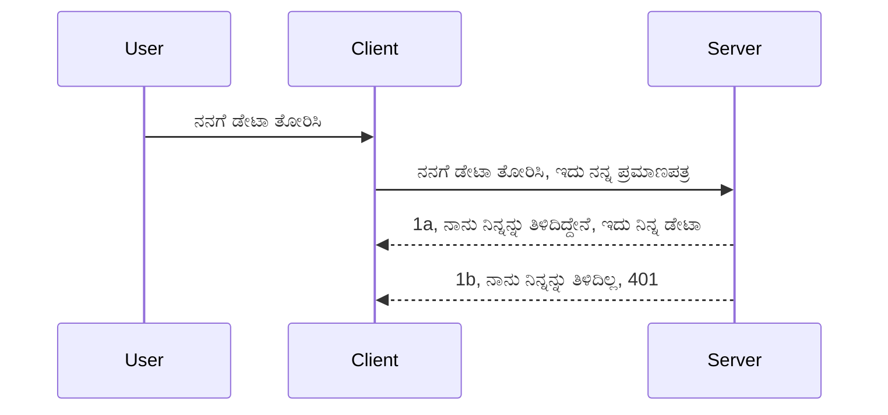

<!--
CO_OP_TRANSLATOR_METADATA:
{
  "original_hash": "5b00b8a8971a07d2d8803be4c9f138f8",
  "translation_date": "2025-12-11T12:21:58+00:00",
  "source_file": "03-GettingStarted/11-simple-auth/README.md",
  "language_code": "kn"
}
-->
# ಸರಳ ಪ್ರಾಮಾಣೀಕರಣ

MCP SDKಗಳು OAuth 2.1 ಬಳಕೆಯನ್ನು ಬೆಂಬಲಿಸುತ್ತವೆ, ಇದು ನ್ಯಾಯವಾಗಿ ಹೇಳುವುದಾದರೆ, ಪ್ರಾಮಾಣೀಕರಣ ಸರ್ವರ್, ಸಂಪನ್ಮೂಲ ಸರ್ವರ್, ಪ್ರಮಾಣಪತ್ರಗಳನ್ನು ಪೋಸ್ಟ್ ಮಾಡುವುದು, ಕೋಡ್ ಪಡೆಯುವುದು, ಕೋಡ್ ಅನ್ನು ಬೇರರ್ ಟೋಕನ್ ಗೆ ವಿನಿಮಯ ಮಾಡಿಕೊಳ್ಳುವುದು ಮತ್ತು ಕೊನೆಗೆ ನಿಮ್ಮ ಸಂಪನ್ಮೂಲ ಡೇಟಾವನ್ನು ಪಡೆಯುವಂತಹ ಸಂಯೋಜಿತ ಪ್ರಕ್ರಿಯೆಯಾಗಿದೆ. ನೀವು OAuth ಗೆ ಪರಿಚಿತರಾಗದಿದ್ದರೆ, ಇದು ಅನುಷ್ಠಾನಗೊಳಿಸಲು ಉತ್ತಮವಾದ ವಿಷಯ, ಆದ್ದರಿಂದ ಕೆಲವು ಮೂಲಭೂತ ಮಟ್ಟದ ಪ್ರಾಮಾಣೀಕರಣದಿಂದ ಪ್ರಾರಂಭಿಸಿ ಉತ್ತಮ ಮತ್ತು ಉತ್ತಮ ಭದ್ರತೆಯತ್ತ ನಿರ್ಮಿಸುವುದು ಒಳ್ಳೆಯದು. ಈ ಅಧ್ಯಾಯ ಇದಕ್ಕಾಗಿ ಇದೆ, ನಿಮಗೆ ಹೆಚ್ಚು ಪ್ರಗತಿಶೀಲ ಪ್ರಾಮಾಣೀಕರಣಕ್ಕೆ ನಿರ್ಮಿಸಲು.

## ಪ್ರಾಮಾಣೀಕರಣ, ನಾವು ಏನು ಅರ್ಥಮಾಡಿಕೊಳ್ಳುತ್ತೇವೆ?

ಪ್ರಾಮಾಣೀಕರಣವು authentication ಮತ್ತು authorization ಗೆ ಸಂಕ್ಷಿಪ್ತವಾಗಿದೆ. ಆಲೋಚನೆ ಏನೆಂದರೆ ನಾವು ಎರಡು ಕಾರ್ಯಗಳನ್ನು ಮಾಡಬೇಕಾಗುತ್ತದೆ:

- **Authentication**, ಇದು ನಾವು ಯಾರಾದರೂ ನಮ್ಮ ಮನೆಯಲ್ಲಿ ಪ್ರವೇಶಿಸಲು ಅನುಮತಿಸುವುದೇ ಎಂದು ಕಂಡುಹಿಡಿಯುವ ಪ್ರಕ್ರಿಯೆ, ಅವರು "ಇಲ್ಲಿ" ಇರಲು ಹಕ್ಕು ಹೊಂದಿದ್ದಾರೆ ಎಂದು ಅರ್ಥ, ಅಂದರೆ ನಮ್ಮ MCP ಸರ್ವರ್ ವೈಶಿಷ್ಟ್ಯಗಳು ಇರುವ ಸಂಪನ್ಮೂಲ ಸರ್ವರ್ ಗೆ ಪ್ರವೇಶ ಹೊಂದಿದ್ದಾರೆ.
- **Authorization**, ಇದು ಬಳಕೆದಾರನು ಕೇಳುತ್ತಿರುವ ನಿರ್ದಿಷ್ಟ ಸಂಪನ್ಮೂಲಗಳಿಗೆ ಪ್ರವೇಶ ಹೊಂದಬೇಕೇ ಎಂದು ಕಂಡುಹಿಡಿಯುವ ಪ್ರಕ್ರಿಯೆ, ಉದಾಹರಣೆಗೆ ಈ ಆರ್ಡರ್‌ಗಳು ಅಥವಾ ಈ ಉತ್ಪನ್ನಗಳು ಅಥವಾ ಅವರು ವಿಷಯವನ್ನು ಓದಲು ಅನುಮತಿಸಲಾಗಿದೆ ಆದರೆ ಅಳಿಸಲು ಅನುಮತಿಸಲಾಗಿಲ್ಲ ಎಂಬ ಮತ್ತೊಂದು ಉದಾಹರಣೆ.

## ಪ್ರಮಾಣಪತ್ರಗಳು: ನಾವು ವ್ಯವಸ್ಥೆಗೆ ನಾವು ಯಾರು ಎಂದು ಹೇಗೆ ಹೇಳುತ್ತೇವೆ

ಬಹುತೇಕ ವೆಬ್ ಡೆವಲಪರ್‌ಗಳು ಸರ್ವರ್‌ಗೆ ಪ್ರಮಾಣಪತ್ರವನ್ನು ಒದಗಿಸುವ ಬಗ್ಗೆ ಯೋಚಿಸುತ್ತಾರೆ, ಸಾಮಾನ್ಯವಾಗಿ "Authentication" ಎಂದು ಹೇಳುವ ರಹಸ್ಯವನ್ನು, ಅವರು ಇಲ್ಲಿ ಇರಲು ಅನುಮತಿಸಲಾಗಿದೆ ಎಂದು ಹೇಳುತ್ತದೆ. ಈ ಪ್ರಮಾಣಪತ್ರವು ಸಾಮಾನ್ಯವಾಗಿ ಬಳಕೆದಾರಹೆಸರು ಮತ್ತು ಪಾಸ್ವರ್ಡ್‌ನ ಬೇಸ್64 ಎನ್‌ಕೋಡ್ ಮಾಡಲಾದ ಆವೃತ್ತಿ ಅಥವಾ ವಿಶಿಷ್ಟ ಬಳಕೆದಾರನನ್ನು ಗುರುತಿಸುವ API ಕೀ ಆಗಿರುತ್ತದೆ.

ಇದನ್ನು "Authorization" ಎಂಬ ಹೆಡರ್ ಮೂಲಕ ಹೀಗೆ ಕಳುಹಿಸಲಾಗುತ್ತದೆ:

```json
{ "Authorization": "secret123" }
```

ಇದನ್ನು ಸಾಮಾನ್ಯವಾಗಿ ಮೂಲಭೂತ ಪ್ರಾಮಾಣೀಕರಣ ಎಂದು ಕರೆಯಲಾಗುತ್ತದೆ. ಒಟ್ಟು ಪ್ರಕ್ರಿಯೆ ಹೀಗಿದೆ:


ಈಗ ನಾವು ಪ್ರಕ್ರಿಯೆಯ ದೃಷ್ಟಿಕೋನದಿಂದ ಹೇಗೆ ಕೆಲಸ ಮಾಡುತ್ತದೆ ಎಂದು ಅರ್ಥಮಾಡಿಕೊಂಡಿದ್ದೇವೆ, ಇದನ್ನು ನಾವು ಹೇಗೆ ಅನುಷ್ಠಾನಗೊಳಿಸಬಹುದು? ಬಹುತೇಕ ವೆಬ್ ಸರ್ವರ್‌ಗಳಿಗೆ middleware ಎಂಬ ಕಲ್ಪನೆ ಇದೆ, ಇದು ವಿನಂತಿಯ ಭಾಗವಾಗಿ ನಡೆಯುವ ಕೋಡ್‌ನ ತುಂಡು, ಇದು ಪ್ರಮಾಣಪತ್ರಗಳನ್ನು ಪರಿಶೀಲಿಸಬಹುದು ಮತ್ತು ಪ್ರಮಾಣಪತ್ರಗಳು ಮಾನ್ಯವಾಗಿದ್ದರೆ ವಿನಂತಿಯನ್ನು ಮುಂದುವರಿಸಲು ಅನುಮತಿಸುತ್ತದೆ. ವಿನಂತಿಗೆ ಮಾನ್ಯ ಪ್ರಮಾಣಪತ್ರಗಳಿಲ್ಲದಿದ್ದರೆ ನೀವು ಪ್ರಾಮಾಣೀಕರಣ ದೋಷವನ್ನು ಪಡೆಯುತ್ತೀರಿ. ಇದನ್ನು ಹೇಗೆ ಅನುಷ್ಠಾನಗೊಳಿಸಬಹುದು ನೋಡೋಣ:

**Python**

```python
class AuthMiddleware(BaseHTTPMiddleware):
    async def dispatch(self, request, call_next):

        has_header = request.headers.get("Authorization")
        if not has_header:
            print("-> Missing Authorization header!")
            return Response(status_code=401, content="Unauthorized")

        if not valid_token(has_header):
            print("-> Invalid token!")
            return Response(status_code=403, content="Forbidden")

        print("Valid token, proceeding...")
       
        response = await call_next(request)
        # ಯಾವುದೇ ಗ್ರಾಹಕ ಶೀರ್ಷಿಕೆಗಳನ್ನು ಸೇರಿಸಿ ಅಥವಾ ಪ್ರತಿಕ್ರಿಯೆಯಲ್ಲಿ ಯಾವುದಾದರೂ ಬದಲಾವಣೆ ಮಾಡಿ
        return response


starlette_app.add_middleware(CustomHeaderMiddleware)
```

ಇಲ್ಲಿ ನಾವು:

- `AuthMiddleware` ಎಂಬ middleware ಅನ್ನು ರಚಿಸಿದ್ದೇವೆ, ಇದರ `dispatch` ವಿಧಾನವನ್ನು ವೆಬ್ ಸರ್ವರ್ ಕರೆ ಮಾಡುತ್ತದೆ.
- middleware ಅನ್ನು ವೆಬ್ ಸರ್ವರ್‌ಗೆ ಸೇರಿಸಿದ್ದೇವೆ:

    ```python
    starlette_app.add_middleware(AuthMiddleware)
    ```

- Authorization ಹೆಡರ್ ಇದ್ದೇ ಇದೆಯೇ ಮತ್ತು ಕಳುಹಿಸಲಾದ ರಹಸ್ಯ ಮಾನ್ಯವಿದೆಯೇ ಎಂದು ಪರಿಶೀಲಿಸುವ ಮಾನ್ಯತೆ ಲಾಜಿಕ್ ಅನ್ನು ಬರೆಯಲಾಗಿದೆ:

    ```python
    has_header = request.headers.get("Authorization")
    if not has_header:
        print("-> Missing Authorization header!")
        return Response(status_code=401, content="Unauthorized")

    if not valid_token(has_header):
        print("-> Invalid token!")
        return Response(status_code=403, content="Forbidden")
    ```

    ರಹಸ್ಯ ಇದ್ದು ಮಾನ್ಯವಾದರೆ, ನಾವು `call_next` ಅನ್ನು ಕರೆಮಾಡಿ ವಿನಂತಿಯನ್ನು ಮುಂದುವರಿಸಲು ಅನುಮತಿಸಿ ಪ್ರತಿಕ್ರಿಯೆಯನ್ನು ಹಿಂತಿರುಗಿಸುತ್ತೇವೆ.

    ```python
    response = await call_next(request)
    # ಯಾವುದೇ ಗ್ರಾಹಕ ಶೀರ್ಷಿಕೆಗಳನ್ನು ಸೇರಿಸಿ ಅಥವಾ ಪ್ರತಿಕ್ರಿಯೆಯಲ್ಲಿ ಯಾವುದಾದರೂ ಬದಲಾವಣೆ ಮಾಡಿ
    return response
    ```

ಹೀಗೆ ಕೆಲಸ ಮಾಡುತ್ತದೆ: ವೆಬ್ ವಿನಂತಿ ಸರ್ವರ್ ಕಡೆಗೆ ಬಂದಾಗ middleware ಅನ್ನು ಕರೆಮಾಡಲಾಗುತ್ತದೆ ಮತ್ತು ಅದರ ಅನುಷ್ಠಾನದ ಪ್ರಕಾರ, ಅದು ವಿನಂತಿಯನ್ನು ಮುಂದುವರಿಸಲು ಅಥವಾ ಕ್ಲೈಂಟ್ ಮುಂದುವರಿಯಲು ಅನುಮತಿಸಲಾಗುವುದಿಲ್ಲ ಎಂಬ ದೋಷವನ್ನು ಹಿಂತಿರುಗಿಸುತ್ತದೆ.

**TypeScript**

ಇಲ್ಲಿ ನಾವು ಜನಪ್ರಿಯ Express ಫ್ರೇಮ್ವರ್ಕ್ ಬಳಸಿ middleware ರಚಿಸಿ MCP ಸರ್ವರ್‌ಗೆ ಮುಂಚಿತವಾಗಿ ವಿನಂತಿಯನ್ನು ಅಡ್ಡಗಟ್ಟುತ್ತೇವೆ. ಇದರ ಕೋಡ್ ಹೀಗಿದೆ:

```typescript
function isValid(secret) {
    return secret === "secret123";
}

app.use((req, res, next) => {
    // 1. ಪ್ರಾಧಿಕಾರ ಶೀರ್ಷಿಕೆ ಇದ್ದೇ ಇದೆಯೇ?
    if(!req.headers["Authorization"]) {
        res.status(401).send('Unauthorized');
    }
    
    let token = req.headers["Authorization"];

    // 2. ಮಾನ್ಯತೆ ಪರಿಶೀಲಿಸಿ.
    if(!isValid(token)) {
        res.status(403).send('Forbidden');
    }

   
    console.log('Middleware executed');
    // 3. ವಿನಂತಿ ಪೈಪ್ಲೈನ್‌ನ ಮುಂದಿನ ಹಂತಕ್ಕೆ ವಿನಂತಿಯನ್ನು ಹಸ್ತಾಂತರಿಸುತ್ತದೆ.
    next();
});
```

ಈ ಕೋಡ್‌ನಲ್ಲಿ ನಾವು:

1. Authorization ಹೆಡರ್ ಇದ್ದೇ ಇದೆಯೇ ಎಂದು ಪರಿಶೀಲಿಸುತ್ತೇವೆ, ಇಲ್ಲದಿದ್ದರೆ 401 ದೋಷ ಕಳುಹಿಸುತ್ತೇವೆ.
2. ಪ್ರಮಾಣಪತ್ರ/ಟೋಕನ್ ಮಾನ್ಯವಿದೆಯೇ ಎಂದು ಖಚಿತಪಡಿಸುತ್ತೇವೆ, ಇಲ್ಲದಿದ್ದರೆ 403 ದೋಷ ಕಳುಹಿಸುತ್ತೇವೆ.
3. ಕೊನೆಗೆ ವಿನಂತಿಯನ್ನು ವಿನಂತಿ ಪೈಪ್ಲೈನ್‌ನಲ್ಲಿ ಮುಂದುವರಿಸಿ ಕೇಳಲಾದ ಸಂಪನ್ಮೂಲವನ್ನು ಹಿಂತಿರುಗಿಸುತ್ತೇವೆ.

## ಅಭ್ಯಾಸ: ಪ್ರಾಮಾಣೀಕರಣವನ್ನು ಅನುಷ್ಠಾನಗೊಳಿಸಿ

ನಮ್ಮ ಜ್ಞಾನವನ್ನು ತೆಗೆದುಕೊಂಡು ಅದನ್ನು ಅನುಷ್ಠಾನಗೊಳಿಸಲು ಪ್ರಯತ್ನಿಸೋಣ. ಯೋಜನೆ ಹೀಗಿದೆ:

ಸರ್ವರ್

- ವೆಬ್ ಸರ್ವರ್ ಮತ್ತು MCP ಉದಾಹರಣೆಯನ್ನು ರಚಿಸಿ.
- ಸರ್ವರ್‌ಗೆ middleware ಅನ್ನು ಅನುಷ್ಠಾನಗೊಳಿಸಿ.

ಕ್ಲೈಂಟ್

- ಹೆಡರ್ ಮೂಲಕ ಪ್ರಮಾಣಪತ್ರದೊಂದಿಗೆ ವೆಬ್ ವಿನಂತಿಯನ್ನು ಕಳುಹಿಸಿ.

### -1- ವೆಬ್ ಸರ್ವರ್ ಮತ್ತು MCP ಉದಾಹರಣೆಯನ್ನು ರಚಿಸಿ

ನಮ್ಮ ಮೊದಲ ಹಂತದಲ್ಲಿ, ನಾವು ವೆಬ್ ಸರ್ವರ್ ಉದಾಹರಣೆಯನ್ನು ಮತ್ತು MCP ಸರ್ವರ್ ಅನ್ನು ರಚಿಸಬೇಕು.

**Python**

ಇಲ್ಲಿ ನಾವು MCP ಸರ್ವರ್ ಉದಾಹರಣೆಯನ್ನು ರಚಿಸಿ, starlette ವೆಬ್ ಅಪ್ಲಿಕೇಶನ್ ರಚಿಸಿ ಮತ್ತು ಅದನ್ನು uvicorn ಮೂಲಕ ಹೋಸ್ಟ್ ಮಾಡುತ್ತೇವೆ.

```python
# MCP ಸರ್ವರ್ ರಚಿಸಲಾಗುತ್ತಿದೆ

app = FastMCP(
    name="MCP Resource Server",
    instructions="Resource Server that validates tokens via Authorization Server introspection",
    host=settings["host"],
    port=settings["port"],
    debug=True
)

# ಸ್ಟಾರ್ಲೆಟ್ ವೆಬ್ ಅಪ್ಲಿಕೇಶನ್ ರಚಿಸಲಾಗುತ್ತಿದೆ
starlette_app = app.streamable_http_app()

# ಅಪ್ಲಿಕೇಶನ್ ಅನ್ನು ಉವಿಕಾರ್ನ್ ಮೂಲಕ ಸೇವೆ ನೀಡಲಾಗುತ್ತಿದೆ
async def run(starlette_app):
    import uvicorn
    config = uvicorn.Config(
            starlette_app,
            host=app.settings.host,
            port=app.settings.port,
            log_level=app.settings.log_level.lower(),
        )
    server = uvicorn.Server(config)
    await server.serve()

run(starlette_app)
```

ಈ ಕೋಡ್‌ನಲ್ಲಿ ನಾವು:

- MCP ಸರ್ವರ್ ಅನ್ನು ರಚಿಸಿದ್ದೇವೆ.
- MCP ಸರ್ವರ್‌ನಿಂದ starlette ವೆಬ್ ಅಪ್ಲಿಕೇಶನ್ ಅನ್ನು ರಚಿಸಿದ್ದೇವೆ, `app.streamable_http_app()`.
- uvicorn ಬಳಸಿ ವೆಬ್ ಅಪ್ಲಿಕೇಶನ್ ಅನ್ನು ಹೋಸ್ಟ್ ಮತ್ತು ಸರ್ವ್ ಮಾಡಿದ್ದೇವೆ `server.serve()`.

**TypeScript**

ಇಲ್ಲಿ ನಾವು MCP ಸರ್ವರ್ ಉದಾಹರಣೆಯನ್ನು ರಚಿಸುತ್ತೇವೆ.

```typescript
const server = new McpServer({
      name: "example-server",
      version: "1.0.0"
    });

    // ... ಸರ್ವರ್ ಸಂಪನ್ಮೂಲಗಳು, ಸಾಧನಗಳು ಮತ್ತು ಪ್ರಾಂಪ್ಟ್‌ಗಳನ್ನು ಹೊಂದಿಸಿ ...
```

ಈ MCP ಸರ್ವರ್ ರಚನೆ ನಮ್ಮ POST /mcp ಮಾರ್ಗ ವ್ಯಾಖ್ಯಾನದಲ್ಲಿ ನಡೆಯಬೇಕು, ಆದ್ದರಿಂದ ಮೇಲಿನ ಕೋಡ್ ಅನ್ನು ಹೀಗೆ ಸರಿಸಿ:

```typescript
import express from "express";
import { randomUUID } from "node:crypto";
import { McpServer } from "@modelcontextprotocol/sdk/server/mcp.js";
import { StreamableHTTPServerTransport } from "@modelcontextprotocol/sdk/server/streamableHttp.js";
import { isInitializeRequest } from "@modelcontextprotocol/sdk/types.js"

const app = express();
app.use(express.json());

// ಸೆಷನ್ ಐಡಿ ಮೂಲಕ ಸಾರಿಗೆಗಳನ್ನು ಸಂಗ್ರಹಿಸಲು ನಕ್ಷೆ
const transports: { [sessionId: string]: StreamableHTTPServerTransport } = {};

// ಕ್ಲೈಂಟ್-ಟು-ಸರ್ವರ್ ಸಂವಹನಕ್ಕಾಗಿ POST ವಿನಂತಿಗಳನ್ನು ನಿರ್ವಹಿಸಿ
app.post('/mcp', async (req, res) => {
  // ಇತ್ತೀಚಿನ ಸೆಷನ್ ಐಡಿ ಪರಿಶೀಲಿಸಿ
  const sessionId = req.headers['mcp-session-id'] as string | undefined;
  let transport: StreamableHTTPServerTransport;

  if (sessionId && transports[sessionId]) {
    // ಇತ್ತೀಚಿನ ಸಾರಿಗೆಯನ್ನು ಮರುಬಳಕೆ ಮಾಡಿ
    transport = transports[sessionId];
  } else if (!sessionId && isInitializeRequest(req.body)) {
    // ಹೊಸ ಪ್ರಾರಂಭಿಕ ವಿನಂತಿ
    transport = new StreamableHTTPServerTransport({
      sessionIdGenerator: () => randomUUID(),
      onsessioninitialized: (sessionId) => {
        // ಸೆಷನ್ ಐಡಿ ಮೂಲಕ ಸಾರಿಗೆಯನ್ನು ಸಂಗ್ರಹಿಸಿ
        transports[sessionId] = transport;
      },
      // ಹಿಂದಿನ ಹೊಂದಾಣಿಕೆಗೆ ಡಿಎನ್ಎಸ್ ರಿಬೈಂಡಿಂಗ್ ರಕ್ಷಣೆ ಡೀಫಾಲ್ಟ್ ಆಗಿ ನಿಷ್ಕ್ರಿಯವಾಗಿದೆ. ನೀವು ಈ ಸರ್ವರ್ ಅನ್ನು
      // ಸ್ಥಳೀಯವಾಗಿ ನಡೆಸುತ್ತಿದ್ದರೆ, ಖಚಿತಪಡಿಸಿಕೊಳ್ಳಿ:
      // enableDnsRebindingProtection: true,
      // allowedHosts: ['127.0.0.1'],
    });

    // ಮುಚ್ಚಿದಾಗ ಸಾರಿಗೆಯನ್ನು ಸ್ವಚ್ಛಗೊಳಿಸಿ
    transport.onclose = () => {
      if (transport.sessionId) {
        delete transports[transport.sessionId];
      }
    };
    const server = new McpServer({
      name: "example-server",
      version: "1.0.0"
    });

    // ... ಸರ್ವರ್ ಸಂಪನ್ಮೂಲಗಳು, ಸಾಧನಗಳು ಮತ್ತು ಪ್ರಾಂಪ್ಟ್‌ಗಳನ್ನು ಹೊಂದಿಸಿ ...

    // MCP ಸರ್ವರ್‌ಗೆ ಸಂಪರ್ಕಿಸಿ
    await server.connect(transport);
  } else {
    // ಅಮಾನ್ಯ ವಿನಂತಿ
    res.status(400).json({
      jsonrpc: '2.0',
      error: {
        code: -32000,
        message: 'Bad Request: No valid session ID provided',
      },
      id: null,
    });
    return;
  }

  // ವಿನಂತಿಯನ್ನು ನಿರ್ವಹಿಸಿ
  await transport.handleRequest(req, res, req.body);
});

// GET ಮತ್ತು DELETE ವಿನಂತಿಗಳಿಗಾಗಿ ಮರುಬಳಕೆ ಮಾಡಬಹುದಾದ ಹ್ಯಾಂಡ್ಲರ್
const handleSessionRequest = async (req: express.Request, res: express.Response) => {
  const sessionId = req.headers['mcp-session-id'] as string | undefined;
  if (!sessionId || !transports[sessionId]) {
    res.status(400).send('Invalid or missing session ID');
    return;
  }
  
  const transport = transports[sessionId];
  await transport.handleRequest(req, res);
};

// SSE ಮೂಲಕ ಸರ್ವರ್-ಟು-ಕ್ಲೈಂಟ್ ಸೂಚನೆಗಳಿಗಾಗಿ GET ವಿನಂತಿಗಳನ್ನು ನಿರ್ವಹಿಸಿ
app.get('/mcp', handleSessionRequest);

// ಸೆಷನ್ ಮುಕ್ತಾಯಕ್ಕಾಗಿ DELETE ವಿನಂತಿಗಳನ್ನು ನಿರ್ವಹಿಸಿ
app.delete('/mcp', handleSessionRequest);

app.listen(3000);
```

ಈಗ ನೀವು ನೋಡಬಹುದು MCP ಸರ್ವರ್ ರಚನೆ `app.post("/mcp")` ಒಳಗೆ ಸರಿಸಲಾಗಿದೆ.

ಮುಂದಿನ ಹಂತಕ್ಕೆ ಹೋಗೋಣ, middleware ರಚಿಸಿ ಬರುವ ಪ್ರಮಾಣಪತ್ರವನ್ನು ಪರಿಶೀಲಿಸೋಣ.

### -2- ಸರ್ವರ್‌ಗೆ middleware ಅನ್ನು ಅನುಷ್ಠಾನಗೊಳಿಸಿ

ಮುಂದೆ middleware ಭಾಗಕ್ಕೆ ಬನ್ನಿ. ಇಲ್ಲಿ ನಾವು `Authorization` ಹೆಡರ್‌ನಲ್ಲಿ ಪ್ರಮಾಣಪತ್ರವನ್ನು ಹುಡುಕಿ ಪರಿಶೀಲಿಸುವ middleware ರಚಿಸುವೆವು. ಅದು ಒಪ್ಪಿಗೆಯಾದರೆ ವಿನಂತಿ ಮುಂದುವರಿಯುತ್ತದೆ (ಉದಾ: ಉಪಕರಣಗಳನ್ನು ಪಟ್ಟಿ ಮಾಡುವುದು, ಸಂಪನ್ಮೂಲ ಓದುವುದು ಅಥವಾ ಕ್ಲೈಂಟ್ ಕೇಳಿದ MCP ಕಾರ್ಯಕ್ಷಮತೆ).

**Python**

middleware ರಚಿಸಲು, ನಾವು `BaseHTTPMiddleware` ನಿಂದ ವಂಶೋತ್ಪತ್ತಿ ಆಗಿರುವ ಕ್ಲಾಸ್ ರಚಿಸಬೇಕು. ಎರಡು ಆಸಕ್ತಿದಾಯಕ ಭಾಗಗಳಿವೆ:

- ವಿನಂತಿ `request`, ಇದರಿಂದ ನಾವು ಹೆಡರ್ ಮಾಹಿತಿಯನ್ನು ಓದುತ್ತೇವೆ.
- `call_next` ಎಂಬ ಕಾಲ್‌ಬ್ಯಾಕ್, ಇದು ಕ್ಲೈಂಟ್ ಒಪ್ಪಿಗೆಯ ಪ್ರಮಾಣಪತ್ರ ತಂದಿದ್ದರೆ ನಾವು ಕರೆಮಾಡಬೇಕು.

ಮೊದಲು, `Authorization` ಹೆಡರ್ ಇಲ್ಲದಿದ್ದರೆ ಹೇಗೆ ನಿರ್ವಹಿಸುವುದು:

```python
has_header = request.headers.get("Authorization")

# ಹೆಡರ್ ಇಲ್ಲ, 401 ನೊಂದಿಗೆ ವಿಫಲವಾಗಿರಿ, ಇಲ್ಲದಿದ್ದರೆ ಮುಂದುವರಿಯಿರಿ.
if not has_header:
    print("-> Missing Authorization header!")
    return Response(status_code=401, content="Unauthorized")
```

ಇಲ್ಲಿ ನಾವು 401 ಅನಧಿಕೃತ ಸಂದೇಶ ಕಳುಹಿಸುತ್ತೇವೆ ಏಕೆಂದರೆ ಕ್ಲೈಂಟ್ ಪ್ರಾಮಾಣೀಕರಣದಲ್ಲಿ ವಿಫಲವಾಗಿದೆ.

ಮುಂದೆ, ಪ್ರಮಾಣಪತ್ರ ಸಲ್ಲಿಸಿದರೆ ಅದರ ಮಾನ್ಯತೆ ಪರಿಶೀಲಿಸೋಣ:

```python
 if not valid_token(has_header):
    print("-> Invalid token!")
    return Response(status_code=403, content="Forbidden")
```

ಮೇಲಿನಂತೆ 403 ನಿಷೇಧಿತ ಸಂದೇಶ ಕಳುಹಿಸುತ್ತೇವೆ. ಕೆಳಗಿನ ಪೂರ್ಣ middleware ಅನ್ನು ನೋಡೋಣ:

```python
class AuthMiddleware(BaseHTTPMiddleware):
    async def dispatch(self, request, call_next):

        has_header = request.headers.get("Authorization")
        if not has_header:
            print("-> Missing Authorization header!")
            return Response(status_code=401, content="Unauthorized")

        if not valid_token(has_header):
            print("-> Invalid token!")
            return Response(status_code=403, content="Forbidden")

        print("Valid token, proceeding...")
        print(f"-> Received {request.method} {request.url}")
        response = await call_next(request)
        response.headers['Custom'] = 'Example'
        return response

```

ಚೆನ್ನಾಗಿದೆ, ಆದರೆ `valid_token` ಫಂಕ್ಷನ್ ಬಗ್ಗೆ? ಇದು ಕೆಳಗಿನಂತಿದೆ:

```python
# ಉತ್ಪಾದನೆಗಾಗಿ ಬಳಸಬೇಡಿ - ಇದನ್ನು ಸುಧಾರಿಸಿ !!
def valid_token(token: str) -> bool:
    # "Bearer " ಪೂರ್ವಪ್ರತ್ಯಯವನ್ನು ತೆಗೆದುಹಾಕಿ
    if token.startswith("Bearer "):
        token = token[7:]
        return token == "secret-token"
    return False
```

ಇದನ್ನು ಸ್ಪಷ್ಟವಾಗಿ ಸುಧಾರಿಸಬೇಕು.

ಮುಖ್ಯ: ನೀವು ಈ ರೀತಿಯ ರಹಸ್ಯಗಳನ್ನು ಕೋಡ್‌ನಲ್ಲಿ ಇರಿಸಬಾರದು. ನೀವು ಹೋಲಿಕೆ ಮಾಡಲು ಮೌಲ್ಯವನ್ನು ಡೇಟಾ ಮೂಲದಿಂದ ಅಥವಾ IDP (ಗುರುತಿನ ಸೇವಾ ಪೂರೈಕೆದಾರ) ಯಿಂದ ಪಡೆಯಬೇಕು ಅಥವಾ ಉತ್ತಮವಾಗಿ IDP ನಿಂದ ಮಾನ್ಯತೆ ಮಾಡಿಸಬೇಕು.

**TypeScript**

Express ಬಳಸಿ ಇದನ್ನು ಅನುಷ್ಠಾನಗೊಳಿಸಲು, ನಾವು middleware ಫಂಕ್ಷನ್‌ಗಳನ್ನು ತೆಗೆದುಕೊಳ್ಳುವ `use` ವಿಧಾನವನ್ನು ಕರೆಮಾಡಬೇಕು.

ನಾವು:

- ವಿನಂತಿ ವೇರಿಯಬಲ್‌ನೊಂದಿಗೆ ಸಂವಹನ ಮಾಡಿ `Authorization` ಗುಣಲಕ್ಷಣದಲ್ಲಿ ಕಳುಹಿಸಲಾದ ಪ್ರಮಾಣಪತ್ರವನ್ನು ಪರಿಶೀಲಿಸಬೇಕು.
- ಪ್ರಮಾಣಪತ್ರವನ್ನು ಮಾನ್ಯಗೊಳಿಸಿ, ಹಾಗಿದ್ದರೆ ವಿನಂತಿಯನ್ನು ಮುಂದುವರಿಸಿ ಮತ್ತು ಕ್ಲೈಂಟ್ MCP ವಿನಂತಿ ಮಾಡಬೇಕಾದ ಕಾರ್ಯವನ್ನು ಮಾಡಲಿ (ಉದಾ: ಉಪಕರಣಗಳನ್ನು ಪಟ್ಟಿ ಮಾಡುವುದು, ಸಂಪನ್ಮೂಲ ಓದುವುದು ಅಥವಾ MCP ಸಂಬಂಧಿತ ಯಾವುದಾದರೂ).

ಇಲ್ಲಿ, `Authorization` ಹೆಡರ್ ಇದ್ದೇ ಇದೆಯೇ ಎಂದು ಪರಿಶೀಲಿಸುತ್ತೇವೆ, ಇಲ್ಲದಿದ್ದರೆ ವಿನಂತಿಯನ್ನು ನಿಲ್ಲಿಸುತ್ತೇವೆ:

```typescript
if(!req.headers["authorization"]) {
    res.status(401).send('Unauthorized');
    return;
}
```

ಹೆಡರ್ ಮೊದಲೇ ಕಳುಹಿಸಲ್ಪಡದಿದ್ದರೆ, ನೀವು 401 ಪಡೆಯುತ್ತೀರಿ.

ಮುಂದೆ, ಪ್ರಮಾಣಪತ್ರ ಮಾನ್ಯವಿದೆಯೇ ಎಂದು ಪರಿಶೀಲಿಸುತ್ತೇವೆ, ಇಲ್ಲದಿದ್ದರೆ ವಿನಂತಿಯನ್ನು ನಿಲ್ಲಿಸುತ್ತೇವೆ ಆದರೆ ಸ್ವಲ್ಪ ವಿಭಿನ್ನ ಸಂದೇಶದೊಂದಿಗೆ:

```typescript
if(!isValid(token)) {
    res.status(403).send('Forbidden');
    return;
} 
```

ಈಗ ನೀವು 403 ದೋಷವನ್ನು ಪಡೆಯುತ್ತೀರಿ.

ಪೂರ್ಣ ಕೋಡ್ ಇಲ್ಲಿದೆ:

```typescript
app.use((req, res, next) => {
    console.log('Request received:', req.method, req.url, req.headers);
    console.log('Headers:', req.headers["authorization"]);
    if(!req.headers["authorization"]) {
        res.status(401).send('Unauthorized');
        return;
    }
    
    let token = req.headers["authorization"];

    if(!isValid(token)) {
        res.status(403).send('Forbidden');
        return;
    }  

    console.log('Middleware executed');
    next();
});
```

ನಾವು ವೆಬ್ ಸರ್ವರ್ ಅನ್ನು middleware ಸ್ವೀಕರಿಸಲು ಸಿದ್ಧಪಡಿಸಿದ್ದೇವೆ, ಇದು ಕ್ಲೈಂಟ್ ಕಳುಹಿಸುತ್ತಿರುವ ಪ್ರಮಾಣಪತ್ರವನ್ನು ಪರಿಶೀಲಿಸುತ್ತದೆ. ಕ್ಲೈಂಟ್ ಬಗ್ಗೆ ಏನು?

### -3- ಹೆಡರ್ ಮೂಲಕ ಪ್ರಮಾಣಪತ್ರದೊಂದಿಗೆ ವೆಬ್ ವಿನಂತಿ ಕಳುಹಿಸಿ

ಕ್ಲೈಂಟ್ ಪ್ರಮಾಣಪತ್ರವನ್ನು ಹೆಡರ್ ಮೂಲಕ ಕಳುಹಿಸುತ್ತಿದೆಯೇ ಎಂದು ಖಚಿತಪಡಿಸಿಕೊಳ್ಳಬೇಕು. ನಾವು MCP ಕ್ಲೈಂಟ್ ಬಳಸಲಿದ್ದೇವೆ, ಅದನ್ನು ಹೇಗೆ ಮಾಡುವುದು ನೋಡೋಣ.

**Python**

ಕ್ಲೈಂಟ್‌ಗೆ, ನಾವು ಹೀಗೆ ಪ್ರಮಾಣಪತ್ರದೊಂದಿಗೆ ಹೆಡರ್ ಕಳುಹಿಸಬೇಕು:

```python
# ಮೌಲ್ಯವನ್ನು ಹಾರ್ಡ್‌ಕೋಡ್ ಮಾಡಬೇಡಿ, ಕನಿಷ್ಠವಾಗಿ ಅದನ್ನು ಪರಿಸರ ಚರದಲ್ಲಿ ಅಥವಾ ಹೆಚ್ಚು ಸುರಕ್ಷಿತ ಸಂಗ್ರಹಣೆಯಲ್ಲಿ ಇರಿಸಿ
token = "secret-token"

async with streamablehttp_client(
        url = f"http://localhost:{port}/mcp",
        headers = {"Authorization": f"Bearer {token}"}
    ) as (
        read_stream,
        write_stream,
        session_callback,
    ):
        async with ClientSession(
            read_stream,
            write_stream
        ) as session:
            await session.initialize()
      
            # TODO, ಕ್ಲೈಂಟ್‌ನಲ್ಲಿ ನೀವು ಏನು ಮಾಡಿಸಬೇಕೆಂದು ಬಯಸುತ್ತೀರಿ, ಉದಾ: ಸಾಧನಗಳನ್ನು ಪಟ್ಟಿ ಮಾಡುವುದು, ಸಾಧನಗಳನ್ನು ಕರೆ ಮಾಡುವುದು ಇತ್ಯಾದಿ.
```

ನೀವು ಹೇಗೆ `headers` ಗುಣಲಕ್ಷಣವನ್ನು ಹೀಗೆ ತುಂಬಿಸುತ್ತೀರಿ ಗಮನಿಸಿ ` headers = {"Authorization": f"Bearer {token}"}`.

**TypeScript**

ನಾವು ಇದನ್ನು ಎರಡು ಹಂತಗಳಲ್ಲಿ ಪರಿಹರಿಸಬಹುದು:

1. ನಮ್ಮ ಪ್ರಮಾಣಪತ್ರದೊಂದಿಗೆ ಸಂರಚನಾ ವಸ್ತುವನ್ನು ತುಂಬಿ.
2. ಸಂರಚನಾ ವಸ್ತುವನ್ನು ಟ್ರಾನ್ಸ್‌ಪೋರ್ಟ್‌ಗೆ ಪಾಸ್ ಮಾಡಿ.

```typescript

// ಇಲ್ಲಿ ತೋರಿಸಿದಂತೆ ಮೌಲ್ಯವನ್ನು ಹಾರ್ಡ್‌ಕೋಡ್ ಮಾಡಬೇಡಿ. ಕನಿಷ್ಠವಾಗಿ ಅದನ್ನು ಪರಿಸರ ಚರ (env variable) ಆಗಿ ಇಟ್ಟು, ಡೆವ್ ಮೋಡ್‌ನಲ್ಲಿ dotenv ಅನ್ನು ಬಳಸಿರಿ.
let token = "secret123"

// ಕ್ಲೈಂಟ್ ಟ್ರಾನ್ಸ್‌ಪೋರ್ಟ್ ಆಯ್ಕೆ ವಸ್ತುವನ್ನು ವ್ಯಾಖ್ಯಾನಿಸಿ
let options: StreamableHTTPClientTransportOptions = {
  sessionId: sessionId,
  requestInit: {
    headers: {
      "Authorization": "secret123"
    }
  }
};

// ಆಯ್ಕೆ ವಸ್ತುವನ್ನು ಟ್ರಾನ್ಸ್‌ಪೋರ್ಟ್‌ಗೆ ಪಾಸ್ ಮಾಡಿ
async function main() {
   const transport = new StreamableHTTPClientTransport(
      new URL(serverUrl),
      options
   );
```

ಮೇಲಿನಂತೆ ನಾವು `options` ವಸ್ತುವನ್ನು ರಚಿಸಿ `requestInit` ಗುಣಲಕ್ಷಣದಡಿ ನಮ್ಮ ಹೆಡರ್‌ಗಳನ್ನು ಇರಿಸಿದ್ದೇವೆ.

ಮುಖ್ಯ: ಇದನ್ನು ನಾವು ಹೇಗೆ ಸುಧಾರಿಸಬಹುದು? ಪ್ರಸ್ತುತ ಅನುಷ್ಠಾನದಲ್ಲಿ ಕೆಲವು ಸಮಸ್ಯೆಗಳಿವೆ. ಮೊದಲನೆಯದಾಗಿ, ಈ ರೀತಿಯಾಗಿ ಪ್ರಮಾಣಪತ್ರವನ್ನು ಕಳುಹಿಸುವುದು ಅಪಾಯಕಾರಿಯಾಗಿದೆ, ಕನಿಷ್ಠ HTTPS ಇದ್ದರೆ ಮಾತ್ರ. ಆದರೂ, ಪ್ರಮಾಣಪತ್ರ ಕದಿಯಲ್ಪಡಬಹುದು, ಆದ್ದರಿಂದ ನೀವು ಟೋಕನ್ ಅನ್ನು ಸುಲಭವಾಗಿ ರದ್ದುಮಾಡಬಹುದಾದ ಮತ್ತು ಹೆಚ್ಚುವರಿ ಪರಿಶೀಲನೆಗಳನ್ನು ಸೇರಿಸುವ ವ್ಯವಸ್ಥೆಯನ್ನು ಬೇಕಾಗುತ್ತದೆ, ಉದಾ: ಇದು ವಿಶ್ವದ ಯಾವ ಭಾಗದಿಂದ ಬರುತ್ತಿದೆ, ವಿನಂತಿ ತುಂಬಾ ಬಾರಿ ಆಗುತ್ತಿದೆಯೇ (ಬಾಟ್-ಹಾಗೆ ವರ್ತನೆ), ಇತ್ಯಾದಿ. 

ಆದರೆ, ಬಹಳ ಸರಳ API ಗಳಿಗೆ, ನೀವು ಯಾರೂ ನಿಮ್ಮ API ಅನ್ನು ಪ್ರಾಮಾಣೀಕರಿಸದೆ ಕರೆಮಾಡಬಾರದು ಎಂದಾದರೆ, ಇಲ್ಲಿ ಇರುವದು ಒಳ್ಳೆಯ ಪ್ರಾರಂಭವಾಗಿದೆ.

ಹೀಗಾಗಿ, ನಾವು ಭದ್ರತೆಯನ್ನು ಸ್ವಲ್ಪ ಗಟ್ಟಿಗೊಳಿಸಲು JSON ವೆಬ್ ಟೋಕನ್ (JWT ಅಥವಾ "JOT" ಟೋಕನ್) ಎಂಬ ಮಾನಕಿತ ಫಾರ್ಮ್ಯಾಟ್ ಬಳಸೋಣ.

## JSON ವೆಬ್ ಟೋಕನ್ಗಳು, JWT

ಹೀಗಾಗಿ, ನಾವು ಬಹಳ ಸರಳ ಪ್ರಮಾಣಪತ್ರಗಳನ್ನು ಕಳುಹಿಸುವುದರಿಂದ ಸುಧಾರಣೆ ಮಾಡಲು ಪ್ರಯತ್ನಿಸುತ್ತಿದ್ದೇವೆ. JWT ಅಳವಡಿಸುವುದರಿಂದ ತಕ್ಷಣವೇ ಯಾವ ಸುಧಾರಣೆಗಳು ಸಿಗುತ್ತವೆ?

- **ಭದ್ರತಾ ಸುಧಾರಣೆಗಳು**. ಮೂಲಭೂತ ಪ್ರಾಮಾಣೀಕರಣದಲ್ಲಿ, ನೀವು ಬಳಕೆದಾರಹೆಸರು ಮತ್ತು ಪಾಸ್ವರ್ಡ್ ಅನ್ನು ಬೇಸ್64 ಎನ್‌ಕೋಡ್ ಮಾಡಿದ ಟೋಕನ್ (ಅಥವಾ API ಕೀ) ಆಗಿ ಮರುಮರು ಕಳುಹಿಸುತ್ತೀರಿ, ಇದು ಅಪಾಯವನ್ನು ಹೆಚ್ಚಿಸುತ್ತದೆ. JWT ನಲ್ಲಿ, ನೀವು ಬಳಕೆದಾರಹೆಸರು ಮತ್ತು ಪಾಸ್ವರ್ಡ್ ಕಳುಹಿಸಿ ಟೋಕನ್ ಪಡೆಯುತ್ತೀರಿ ಮತ್ತು ಇದು ಸಮಯ-ಬಂಧಿತವಾಗಿದ್ದು ಅವಧಿ ಮುಗಿಯುತ್ತದೆ. JWT ನಿಮಗೆ ಪಾತ್ರಗಳು, ವ್ಯಾಪ್ತಿಗಳು ಮತ್ತು ಅನುಮತಿಗಳನ್ನು ಬಳಸಿ ಸೂಕ್ಷ್ಮ ಪ್ರವೇಶ ನಿಯಂತ್ರಣವನ್ನು ಸುಲಭವಾಗಿ ಬಳಸಲು ಅವಕಾಶ ನೀಡುತ್ತದೆ.
- **ಸ್ಥಿತಿಹೀನತೆ ಮತ್ತು ವಿಸ್ತರಣೆ**. JWT ಗಳು ಸ್ವಯಂ-ಸಂಯೋಜಿತವಾಗಿದ್ದು, ಎಲ್ಲಾ ಬಳಕೆದಾರ ಮಾಹಿತಿಯನ್ನು ಹೊಂದುತ್ತವೆ ಮತ್ತು ಸರ್ವರ್-ಪಕ್ಕದ ಸೆಷನ್ ಸಂಗ್ರಹಣೆಯ ಅಗತ್ಯವನ್ನು ತೆಗೆದುಹಾಕುತ್ತವೆ. ಟೋಕನ್ ಅನ್ನು ಸ್ಥಳೀಯವಾಗಿ ಮಾನ್ಯಗೊಳಿಸಬಹುದು.
- **ಅಂತರಚಾಲಕತೆ ಮತ್ತು ಫೆಡರೇಶನ್**. JWT ಗಳು Open ID Connect ನ ಕೇಂದ್ರವಾಗಿದ್ದು Entra ID, Google Identity ಮತ್ತು Auth0 ಮುಂತಾದ ಗುರುತಿನ ಪೂರೈಕೆದಾರರೊಂದಿಗೆ ಬಳಸಲಾಗುತ್ತದೆ. ಅವು ಸಿಂಗಲ್ ಸೈನ್-ಆನ್ ಮತ್ತು ಇನ್ನಷ್ಟು ಎಂಟರ್‌ಪ್ರೈಸ್-ಗ್ರೇಡ್ ವೈಶಿಷ್ಟ್ಯಗಳನ್ನು ಸಾಧ್ಯಮಾಡುತ್ತವೆ.
- **ಮಾಡ್ಯುಲಾರಿಟಿ ಮತ್ತು ಲವಚಿಕತೆ**. JWT ಗಳು Azure API Management, NGINX ಮುಂತಾದ API ಗೇಟ್ವೇಗಳೊಂದಿಗೆ ಬಳಸಬಹುದು. ಇದು ಬಳಕೆದಾರ ಪ್ರಾಮಾಣೀಕರಣ ದೃಶ್ಯಗಳು ಮತ್ತು ಸರ್ವರ್-ಟು-ಸರ್ವಿಸ್ ಸಂವಹನವನ್ನು ಸಹ ಬೆಂಬಲಿಸುತ್ತದೆ, ಇದರಲ್ಲಿ ಪ್ರತಿನಿಧಿಸುವಿಕೆ ಮತ್ತು делегация ದೃಶ್ಯಗಳು ಸೇರಿವೆ.
- **ಕಾರ್ಯಕ್ಷಮತೆ ಮತ್ತು ಕ್ಯಾಶಿಂಗ್**. JWT ಗಳು ಡಿಕೋಡ್ ಮಾಡಿದ ನಂತರ ಕ್ಯಾಶ್ ಮಾಡಬಹುದು, ಇದು ಪಾರ್ಸಿಂಗ್ ಅಗತ್ಯವನ್ನು ಕಡಿಮೆ ಮಾಡುತ್ತದೆ. ಇದು ವಿಶೇಷವಾಗಿ ಹೆಚ್ಚಿನ ಟ್ರಾಫಿಕ್ ಅಪ್ಲಿಕೇಶನ್‌ಗಳಿಗೆ ಸಹಾಯ ಮಾಡುತ್ತದೆ, ಇದರಿಂದ ಥ್ರೂಪುಟ್ ಸುಧಾರಿಸುತ್ತದೆ ಮತ್ತು ನಿಮ್ಮ ಆಯ್ದ ಮೂಲಸೌಕರ್ಯ ಮೇಲಿನ ಭಾರವನ್ನು ಕಡಿಮೆ ಮಾಡುತ್ತದೆ.
- **ಅಧಿಕ ವೈಶಿಷ್ಟ್ಯಗಳು**. ಇದು ಇಂಟ್ರೋಸ್ಪೆಕ್ಷನ್ (ಸರ್ವರ್‌ನಲ್ಲಿ ಮಾನ್ಯತೆ ಪರಿಶೀಲನೆ) ಮತ್ತು ರದ್ದುಪಡಿಸುವಿಕೆ (ಟೋಕನ್ ಅಮಾನ್ಯಗೊಳಿಸುವಿಕೆ) ಅನ್ನು ಸಹ ಬೆಂಬಲಿಸುತ್ತದೆ.

ಈ ಎಲ್ಲಾ ಲಾಭಗಳೊಂದಿಗೆ, ನಾವು ನಮ್ಮ ಅನುಷ್ಠಾನವನ್ನು ಮುಂದಿನ ಹಂತಕ್ಕೆ ಹೇಗೆ ತೆಗೆದುಕೊಳ್ಳಬಹುದು ನೋಡೋಣ.

## ಮೂಲಭೂತ ಪ್ರಾಮಾಣೀಕರಣವನ್ನು JWT ಗೆ ಪರಿವರ್ತಿಸುವುದು

ಹೀಗಾಗಿ, ನಾವು ಮಾಡಬೇಕಾದ ಬದಲಾವಣೆಗಳು ಉದ್ದನೆಯ ದೃಷ್ಟಿಕೋನದಲ್ಲಿ:

- **JWT ಟೋಕನ್ ರಚಿಸುವುದನ್ನು ಕಲಿಯಿರಿ** ಮತ್ತು ಅದನ್ನು ಕ್ಲೈಂಟ್‌ನಿಂದ ಸರ್ವರ್‌ಗೆ ಕಳುಹಿಸಲು ಸಿದ್ಧಪಡಿಸಿ.
- **JWT ಟೋಕನ್ ಮಾನ್ಯಗೊಳಿಸಿ**, ಹಾಗಿದ್ದರೆ ಕ್ಲೈಂಟ್ ನಮ್ಮ ಸಂಪನ್ಮೂಲಗಳನ್ನು ಪಡೆಯಲಿ.
- **ಟೋಕನ್ ಸಂಗ್ರಹಣೆಯ ಭದ್ರತೆ**. ನಾವು ಈ ಟೋಕನ್ ಅನ್ನು ಹೇಗೆ ಸಂಗ್ರಹಿಸೋಣ.
- **ಮಾರ್ಗಗಳನ್ನು ರಕ್ಷಿಸಿ**. ನಾವು ಮಾರ್ಗಗಳನ್ನು ಮತ್ತು ನಿರ್ದಿಷ್ಟ MCP ವೈಶಿಷ್ಟ್ಯಗಳನ್ನು ರಕ್ಷಿಸಬೇಕು.
- **ರಿಫ್ರೆಶ್ ಟೋಕನ್ಗಳನ್ನು ಸೇರಿಸಿ**. ಟೋಕನ್ಗಳು ಕಡಿಮೆ ಅವಧಿಯವು ಆಗಿರಬೇಕು ಆದರೆ ರಿಫ್ರೆಶ್ ಟೋಕನ್ಗಳು ದೀರ್ಘಾವಧಿಯವು ಆಗಿರಬೇಕು, ಅವು ಅವಧಿ ಮುಗಿದರೆ ಹೊಸ ಟೋಕನ್ಗಳನ್ನು ಪಡೆಯಲು ಬಳಸಬಹುದು. ರಿಫ್ರೆಶ್ ಎಂಡ್ಪಾಯಿಂಟ್ ಮತ್ತು ರೋಟೇಶನ್ ತಂತ್ರವನ್ನು ಖಚಿತಪಡಿಸಿಕೊಳ್ಳಿ.

### -1- JWT ಟೋಕನ್ ರಚಿಸಿ

ಮೊದಲು, JWT ಟೋಕನ್ ಕೆಳಗಿನ ಭಾಗಗಳನ್ನು ಹೊಂದಿರುತ್ತದೆ:

- **ಹೆಡರ್**, ಬಳಸಲಾದ ಆಲ್ಗೋರಿದಮ್ ಮತ್ತು ಟೋಕನ್ ಪ್ರಕಾರ.
- **ಪೇಲೋಡ್**, ಕ್ಲೈಮ್ಸ್, ಉದಾ: sub (ಟೋಕನ್ ಪ್ರತಿನಿಧಿಸುವ ಬಳಕೆದಾರ ಅಥವಾ ಘಟಕ, ಸಾಮಾನ್ಯವಾಗಿ auth ದೃಶ್ಯದಲ್ಲಿ ಬಳಕೆದಾರ ಐಡಿ), exp (ಅವಧಿ ಮುಗಿಯುವ ಸಮಯ), role (ಪಾತ್ರ)
- **ಸಹಿ**, ರಹಸ್ಯ ಅಥವಾ ಖಾಸಗಿ ಕೀಲಿಯಿಂದ ಸಹಿ ಮಾಡಲಾಗಿದೆ.

ಇದಕ್ಕಾಗಿ, ನಾವು ಹೆಡರ್, ಪೇಲೋಡ್ ಮತ್ತು ಎನ್‌ಕೋಡ್ ಮಾಡಿದ ಟೋಕನ್ ರಚಿಸಬೇಕು.

**Python**

```python

import jwt
import jwt
from jwt.exceptions import ExpiredSignatureError, InvalidTokenError
import datetime

# JWT ಗೆ ಸಹಿ ಹಾಕಲು ಬಳಸುವ ರಹಸ್ಯ ಕೀ
secret_key = 'your-secret-key'

header = {
    "alg": "HS256",
    "typ": "JWT"
}

# ಬಳಕೆದಾರ ಮಾಹಿತಿ ಮತ್ತು ಅದರ ಹಕ್ಕುಗಳು ಮತ್ತು ಅವಧಿ ಸಮಯ
payload = {
    "sub": "1234567890",               # ವಿಷಯ (ಬಳಕೆದಾರ ID)
    "name": "User Userson",                # ಕಸ್ಟಮ್ ಹಕ್ಕು
    "admin": True,                     # ಕಸ್ಟಮ್ ಹಕ್ಕು
    "iat": datetime.datetime.utcnow(),# ನೀಡಲಾದ ಸಮಯ
    "exp": datetime.datetime.utcnow() + datetime.timedelta(hours=1)  # ಅವಧಿ ಮುಗಿಯುವ ಸಮಯ
}

# ಅದನ್ನು ಎನ್‌ಕೋಡ್ ಮಾಡಿ
encoded_jwt = jwt.encode(payload, secret_key, algorithm="HS256", headers=header)
```

ಮೇಲಿನ ಕೋಡ್‌ನಲ್ಲಿ ನಾವು:

- HS256 ಆಲ್ಗೋರಿದಮ್ ಮತ್ತು JWT ಪ್ರಕಾರವನ್ನು ಬಳಸಿಕೊಂಡು ಹೆಡರ್ ಅನ್ನು ವ್ಯಾಖ್ಯಾನಿಸಿದ್ದೇವೆ.
- ವಿಷಯ ಅಥವಾ ಬಳಕೆದಾರ ಐಡಿ, ಬಳಕೆದಾರಹೆಸರು, ಪಾತ್ರ, ನೀಡಲಾದ ಸಮಯ ಮತ್ತು ಅವಧಿ ಮುಗಿಯುವ ಸಮಯವನ್ನು ಒಳಗೊಂಡ ಪೇಲೋಡ್ ರಚಿಸಿದ್ದೇವೆ, ಇದರಿಂದ ನಾವು ಹಿಂದಿನ ಸಮಯ-ಬಂಧಿತ ಅಂಶವನ್ನು ಅನುಷ್ಠಾನಗೊಳಿಸಿದ್ದೇವೆ.

**TypeScript**

ಇಲ್ಲಿ ನಾವು JWT ಟೋಕನ್ ರಚಿಸಲು ಸಹಾಯ ಮಾಡುವ ಕೆಲವು ಅವಲಂಬನೆಗಳನ್ನು ಬೇಕಾಗುತ್ತದೆ.

ಅವಲಂಬನೆಗಳು

```sh

npm install jsonwebtoken
npm install --save-dev @types/jsonwebtoken
```

ಇದನ್ನು ಹೊಂದಿದ ನಂತರ, ಹೆಡರ್, ಪೇಲೋಡ್ ರಚಿಸಿ ಮತ್ತು ಟೋಕನ್ ರಚಿಸೋಣ.

```typescript
import jwt from 'jsonwebtoken';

const secretKey = 'your-secret-key'; // ಉತ್ಪಾದನೆಯಲ್ಲಿ ಪರಿಸರ ಚರಗಳನ್ನು ಬಳಸಿ

// ಪೇಲೋಡ್ ಅನ್ನು ವ್ಯಾಖ್ಯಾನಿಸಿ
const payload = {
  sub: '1234567890',
  name: 'User usersson',
  admin: true,
  iat: Math.floor(Date.now() / 1000), // ನೀಡಲಾದ ಸಮಯ
  exp: Math.floor(Date.now() / 1000) + 60 * 60 // 1 ಗಂಟೆಯಲ್ಲಿ ಅವಧಿ ಮುಗಿಯುತ್ತದೆ
};

// ಹೆಡರ್ ಅನ್ನು ವ್ಯಾಖ್ಯಾನಿಸಿ (ಐಚ್ಛಿಕ, jsonwebtoken ಡೀಫಾಲ್ಟ್‌ಗಳನ್ನು ಹೊಂದಿಸುತ್ತದೆ)
const header = {
  alg: 'HS256',
  typ: 'JWT'
};

// ಟೋಕನ್ ರಚಿಸಿ
const token = jwt.sign(payload, secretKey, {
  algorithm: 'HS256',
  header: header
});

console.log('JWT:', token);
```


ಮುಂದೆ, ನಾವು ಪಾತ್ರ ಆಧಾರಿತ ಪ್ರವೇಶ ನಿಯಂತ್ರಣವನ್ನು ನೋಡೋಣ, ಇದನ್ನು RBAC ಎಂದೂ ಕರೆಯುತ್ತಾರೆ.

## ಪಾತ್ರ ಆಧಾರಿತ ಪ್ರವೇಶ ನಿಯಂತ್ರಣವನ್ನು ಸೇರಿಸುವುದು

ವಿಚಾರವೆಂದರೆ, ನಾವು ವಿಭಿನ್ನ ಪಾತ್ರಗಳಿಗೆ ವಿಭಿನ್ನ ಅನುಮತಿಗಳು ಇವೆ ಎಂದು ವ್ಯಕ್ತಪಡಿಸಲು ಬಯಸುತ್ತೇವೆ. ಉದಾಹರಣೆಗೆ, ನಾವು ನಿರೀಕ್ಷಿಸುವುದು ಒಂದು ಆಡಳಿತಗಾರನು ಎಲ್ಲವನ್ನೂ ಮಾಡಬಹುದು ಮತ್ತು ಸಾಮಾನ್ಯ ಬಳಕೆದಾರರು ಓದು/ಬರೆದು ಮಾಡಬಹುದು ಮತ್ತು ಅತಿಥಿ ಕೇವಲ ಓದು ಮಾಡಬಹುದು. ಆದ್ದರಿಂದ, ಇಲ್ಲಿ ಕೆಲವು ಸಾಧ್ಯವಾದ ಅನುಮತಿ ಮಟ್ಟಗಳಿವೆ:

- Admin.Write  
- User.Read  
- Guest.Read  

ನಾವು ಮಧ್ಯವರ್ತಿತ್ವದೊಂದಿಗೆ ಇಂತಹ ನಿಯಂತ್ರಣವನ್ನು ಹೇಗೆ ಅನುಷ್ಠಾನಗೊಳಿಸಬಹುದು ಎಂದು ನೋಡೋಣ. ಮಧ್ಯವರ್ತಿತ್ವಗಳನ್ನು ಪ್ರತಿ ಮಾರ್ಗಕ್ಕೆ ಮತ್ತು ಎಲ್ಲಾ ಮಾರ್ಗಗಳಿಗೆ ಸೇರಿಸಬಹುದು.

**Python**

```python
from starlette.middleware.base import BaseHTTPMiddleware
from starlette.responses import JSONResponse
import jwt

# ರಹಸ್ಯವನ್ನು ಕೋಡ್‌ನಲ್ಲಿ ಇರಿಸಬೇಡಿ, ಇದು ಕೇವಲ ಪ್ರದರ್ಶನ ಉದ್ದೇಶಗಳಿಗಾಗಿ ಮಾತ್ರ. ಅದನ್ನು ಸುರಕ್ಷಿತ ಸ್ಥಳದಿಂದ ಓದಿ.
SECRET_KEY = "your-secret-key" # ಇದನ್ನು ಪರಿಸರ ಚರದಲ್ಲಿ ಇಡಿ
REQUIRED_PERMISSION = "User.Read"

class JWTPermissionMiddleware(BaseHTTPMiddleware):
    async def dispatch(self, request, call_next):
        auth_header = request.headers.get("Authorization")
        if not auth_header or not auth_header.startswith("Bearer "):
            return JSONResponse({"error": "Missing or invalid Authorization header"}, status_code=401)

        token = auth_header.split(" ")[1]
        try:
            decoded = jwt.decode(token, SECRET_KEY, algorithms=["HS256"])
        except jwt.ExpiredSignatureError:
            return JSONResponse({"error": "Token expired"}, status_code=401)
        except jwt.InvalidTokenError:
            return JSONResponse({"error": "Invalid token"}, status_code=401)

        permissions = decoded.get("permissions", [])
        if REQUIRED_PERMISSION not in permissions:
            return JSONResponse({"error": "Permission denied"}, status_code=403)

        request.state.user = decoded
        return await call_next(request)


```
  
ಕೆಳಗಿನಂತೆ ಮಧ್ಯವರ್ತಿತ್ವವನ್ನು ಸೇರಿಸುವ ಕೆಲವು ವಿಭಿನ್ನ ವಿಧಾನಗಳಿವೆ:

```python

# ಪರ್ಯಾಯ 1: ಸ್ಟಾರ್ಲೆಟ್ ಅಪ್ಲಿಕೇಶನ್ ರಚಿಸುವಾಗ ಮಧ್ಯವರ್ತಿ ಸೇರಿಸಿ
middleware = [
    Middleware(JWTPermissionMiddleware)
]

app = Starlette(routes=routes, middleware=middleware)

# ಪರ್ಯಾಯ 2: ಸ್ಟಾರ್ಲೆಟ್ ಅಪ್ಲಿಕೇಶನ್ ಈಗಾಗಲೇ ರಚಿಸಲ್ಪಟ್ಟ ನಂತರ ಮಧ್ಯವರ್ತಿ ಸೇರಿಸಿ
starlette_app.add_middleware(JWTPermissionMiddleware)

# ಪರ್ಯಾಯ 3: ಪ್ರತಿ ಮಾರ್ಗಕ್ಕೆ ಮಧ್ಯವರ್ತಿ ಸೇರಿಸಿ
routes = [
    Route(
        "/mcp",
        endpoint=..., # ಹ್ಯಾಂಡ್ಲರ್
        middleware=[Middleware(JWTPermissionMiddleware)]
    )
]
```
  
**TypeScript**

ನಾವು `app.use` ಮತ್ತು ಎಲ್ಲಾ ವಿನಂತಿಗಳಿಗೆ ಚಾಲನೆ ನೀಡುವ ಮಧ್ಯವರ್ತಿತ್ವವನ್ನು ಬಳಸಬಹುದು.

```typescript
app.use((req, res, next) => {
    console.log('Request received:', req.method, req.url, req.headers);
    console.log('Headers:', req.headers["authorization"]);

    // 1. ಪ್ರಾಧಿಕಾರ ಹೆಡರ್ ಕಳುಹಿಸಲಾಗಿದೆ ಎಂದು ಪರಿಶೀಲಿಸಿ

    if(!req.headers["authorization"]) {
        res.status(401).send('Unauthorized');
        return;
    }
    
    let token = req.headers["authorization"];

    // 2. ಟೋಕನ್ ಮಾನ್ಯವಾಗಿದೆ ಎಂದು ಪರಿಶೀಲಿಸಿ
    if(!isValid(token)) {
        res.status(403).send('Forbidden');
        return;
    }  

    // 3. ಟೋಕನ್ ಬಳಕೆದಾರ ನಮ್ಮ ವ್ಯವಸ್ಥೆಯಲ್ಲಿ ಅಸ್ತಿತ್ವದಲ್ಲಿದೆಯೇ ಎಂದು ಪರಿಶೀಲಿಸಿ
    if(!isExistingUser(token)) {
        res.status(403).send('Forbidden');
        console.log("User does not exist");
        return;
    }
    console.log("User exists");

    // 4. ಟೋಕನ್ ಸರಿಯಾದ ಅನುಮತಿಗಳನ್ನು ಹೊಂದಿದೆಯೇ ಎಂದು ಪರಿಶೀಲಿಸಿ
    if(!hasScopes(token, ["User.Read"])){
        res.status(403).send('Forbidden - insufficient scopes');
    }

    console.log("User has required scopes");

    console.log('Middleware executed');
    next();
});

```
  
ನಮ್ಮ ಮಧ್ಯವರ್ತಿತ್ವಕ್ಕೆ ನಾವು ಬಿಡಬಹುದಾದ ಮತ್ತು ನಮ್ಮ ಮಧ್ಯವರ್ತಿತ್ವ ಮಾಡಬೇಕಾದ ಕೆಲವು ಪ್ರಮುಖ ಕಾರ್ಯಗಳಿವೆ, ಅವುಗಳು:

1. ಅನುಮತಿ ಶೀರ್ಷಿಕೆ ಇದ್ದೇ ಇದೆಯೇ ಎಂದು ಪರಿಶೀಲಿಸಿ  
2. ಟೋಕನ್ ಮಾನ್ಯವಿದೆಯೇ ಎಂದು ಪರಿಶೀಲಿಸಿ, ನಾವು `isValid` ಅನ್ನು ಕರೆಸುತ್ತೇವೆ, ಇದು ನಾವು ಬರೆದ ವಿಧಾನವಾಗಿದ್ದು JWT ಟೋಕನ್‌ನ ಅಖಂಡತೆ ಮತ್ತು ಮಾನ್ಯತೆಯನ್ನು ಪರಿಶೀಲಿಸುತ್ತದೆ.  
3. ಬಳಕೆದಾರನು ನಮ್ಮ ವ್ಯವಸ್ಥೆಯಲ್ಲಿ ಇದ್ದಾನೆ ಎಂದು ಪರಿಶೀಲಿಸಿ, ಇದನ್ನು ನಾವು ಪರಿಶೀಲಿಸಬೇಕು.  

   ```typescript
    // ಡಿಬಿಯಲ್ಲಿ ಬಳಕೆದಾರರು
   const users = [
     "user1",
     "User usersson",
   ]

   function isExistingUser(token) {
     let decodedToken = verifyToken(token);

     // TODO, ಬಳಕೆದಾರ ಡಿಬಿಯಲ್ಲಿ ಇದ್ದಾನೆಯೇ ಎಂದು ಪರಿಶೀಲಿಸಿ
     return users.includes(decodedToken?.name || "");
   }
   ```
  
ಮೇಲಿನಲ್ಲಿರುವುದು, ನಾವು ಬಹಳ ಸರಳವಾದ `users` ಪಟ್ಟಿಯನ್ನು ರಚಿಸಿದ್ದೇವೆ, ಇದು ಸ್ಪಷ್ಟವಾಗಿ ಡೇಟಾಬೇಸಿನಲ್ಲಿ ಇರಬೇಕು.

4. ಹೆಚ್ಚುವರಿಯಾಗಿ, ಟೋಕನ್‌ಗೆ ಸರಿಯಾದ ಅನುಮತಿಗಳು ಇದ್ದೇ ಇದೆಯೇ ಎಂದು ಪರಿಶೀಲಿಸಬೇಕು.

   ```typescript
   if(!hasScopes(token, ["User.Read"])){
        res.status(403).send('Forbidden - insufficient scopes');
   }
   ```
  
ಮಧ್ಯವರ್ತಿತ್ವದಿಂದ ಮೇಲಿನ ಕೋಡ್‌ನಲ್ಲಿ, ನಾವು ಟೋಕನ್‌ನಲ್ಲಿ User.Read ಅನುಮತಿ ಇದೆ ಎಂದು ಪರಿಶೀಲಿಸುತ್ತೇವೆ, ಇಲ್ಲದಿದ್ದರೆ 403 ದೋಷವನ್ನು ಕಳುಹಿಸುತ್ತೇವೆ. ಕೆಳಗಿನದು `hasScopes` ಸಹಾಯಕ ವಿಧಾನ.

   ```typescript
   function hasScopes(scope: string, requiredScopes: string[]) {
     let decodedToken = verifyToken(scope);
    return requiredScopes.every(scope => decodedToken?.scopes.includes(scope));
  }  
   ```

Have a think which additional checks you should be doing, but these are the absolute minimum of checks you should be doing.

Using Express as a web framework is a common choice. There are helpers library when you use JWT so you can write less code.

- `express-jwt`, helper library that provides a middleware that helps decode your token.
- `express-jwt-permissions`, this provides a middleware `guard` that helps check if a certain permission is on the token.

Here's what these libraries can look like when used:

```typescript
const express = require('express');
const jwt = require('express-jwt');
const guard = require('express-jwt-permissions')();

const app = express();
const secretKey = 'your-secret-key'; // put this in env variable

// Decode JWT and attach to req.user
app.use(jwt({ secret: secretKey, algorithms: ['HS256'] }));

// Check for User.Read permission
app.use(guard.check('User.Read'));

// multiple permissions
// app.use(guard.check(['User.Read', 'Admin.Access']));

app.get('/protected', (req, res) => {
  res.json({ message: `Welcome ${req.user.name}` });
});

// Error handler
app.use((err, req, res, next) => {
  if (err.code === 'permission_denied') {
    return res.status(403).send('Forbidden');
  }
  next(err);
});

```
  
ಈಗ ನೀವು ಮಧ್ಯವರ್ತಿತ್ವವನ್ನು ದೃಢೀಕರಣ ಮತ್ತು ಅನುಮತಿಗಾಗಿ ಹೇಗೆ ಬಳಸಬಹುದು ಎಂದು ನೋಡಿದ್ದೀರಿ, MCP ಬಗ್ಗೆ ಏನು, ಅದು ನಮ್ಮ ದೃಢೀಕರಣ ವಿಧಾನವನ್ನು ಬದಲಾಯಿಸುತ್ತದೆಯೇ? ಮುಂದಿನ ವಿಭಾಗದಲ್ಲಿ ತಿಳಿದುಕೊಳ್ಳೋಣ.

### -3- MCP ಗೆ RBAC ಸೇರಿಸುವುದು

ನೀವು ಈಗಾಗಲೇ ಮಧ್ಯವರ್ತಿತ್ವದ ಮೂಲಕ RBAC ಅನ್ನು ಹೇಗೆ ಸೇರಿಸಬಹುದು ಎಂದು ನೋಡಿದ್ದೀರಿ, ಆದರೆ MCP ಗೆ ಪ್ರತಿ MCP ವೈಶಿಷ್ಟ್ಯಕ್ಕೆ RBAC ಸೇರಿಸುವ ಸುಲಭ ಮಾರ್ಗವಿಲ್ಲ, ಆದ್ದರಿಂದ ನಾವು ಏನು ಮಾಡಬೇಕು? ನಾವು ಈ ಕೆಳಗಿನಂತೆ ಕೋಡ್ ಸೇರಿಸಬೇಕು, ಇದು ಈ ಸಂದರ್ಭದಲ್ಲಿ ಕ್ಲೈಂಟ್‌ಗೆ ನಿರ್ದಿಷ್ಟ ಸಾಧನವನ್ನು ಕರೆಸಲು ಹಕ್ಕುಗಳಿವೆ ಎಂದು ಪರಿಶೀಲಿಸುತ್ತದೆ:

ಪ್ರತಿ ವೈಶಿಷ್ಟ್ಯಕ್ಕೆ RBAC ಸಾಧಿಸಲು ನೀವು ಕೆಲವು ವಿಭಿನ್ನ ಆಯ್ಕೆಗಳು ಇವೆ, ಕೆಲವು ಇವು:

- ನೀವು ಅನುಮತಿ ಮಟ್ಟವನ್ನು ಪರಿಶೀಲಿಸಬೇಕಾದ ಪ್ರತಿ ಸಾಧನ, ಸಂಪನ್ಮೂಲ, ಪ್ರಾಂಪ್ಟ್‌ಗೆ ಪರಿಶೀಲನೆಯನ್ನು ಸೇರಿಸಿ.

   **python**

   ```python
   @tool()
   def delete_product(id: int):
      try:
          check_permissions(role="Admin.Write", request)
      catch:
        pass # ಗ್ರಾಹಕ ಅನುಮತಿ ವಿಫಲವಾಗಿದೆ, ಅನುಮತಿ ದೋಷವನ್ನು ಎತ್ತಿ
   ```
  
   **typescript**

   ```typescript
   server.registerTool(
    "delete-product",
    {
      title: Delete a product",
      description: "Deletes a product",
      inputSchema: { id: z.number() }
    },
    async ({ id }) => {
      
      try {
        checkPermissions("Admin.Write", request);
        // ಮಾಡಬೇಕಿದೆ, id ಅನ್ನು productService ಮತ್ತು remote entry ಗೆ ಕಳುಹಿಸಿ
      } catch(Exception e) {
        console.log("Authorization error, you're not allowed");  
      }

      return {
        content: [{ type: "text", text: `Deletected product with id ${id}` }]
      };
    }
   );
   ```


- ಸುಧಾರಿತ ಸರ್ವರ್ ವಿಧಾನ ಮತ್ತು ವಿನಂತಿ ಹ್ಯಾಂಡ್ಲರ್‌ಗಳನ್ನು ಬಳಸಿ, ನೀವು ಪರಿಶೀಲನೆ ಮಾಡಬೇಕಾದ ಸ್ಥಳಗಳ ಸಂಖ್ಯೆಯನ್ನು ಕಡಿಮೆ ಮಾಡಬಹುದು.

   **Python**

   ```python
   
   tool_permission = {
      "create_product": ["User.Write", "Admin.Write"],
      "delete_product": ["Admin.Write"]
   }

   def has_permission(user_permissions, required_permissions) -> bool:
      # user_permissions: ಬಳಕೆದಾರನಿಗೆ ಇರುವ ಅನುಮತಿಗಳ ಪಟ್ಟಿ
      # required_permissions: ಸಾಧನಕ್ಕೆ ಅಗತ್ಯವಿರುವ ಅನುಮತಿಗಳ ಪಟ್ಟಿ
      return any(perm in user_permissions for perm in required_permissions)

   @server.call_tool()
   async def handle_call_tool(
     name: str, arguments: dict[str, str] | None
   ) -> list[types.TextContent]:
    # request.user.permissions ಅನ್ನು ಬಳಕೆದಾರನ ಅನುಮತಿಗಳ ಪಟ್ಟಿ ಎಂದು ಊಹಿಸಿ
     user_permissions = request.user.permissions
     required_permissions = tool_permission.get(name, [])
     if not has_permission(user_permissions, required_permissions):
        # ದೋಷವನ್ನು ಎತ್ತಿ "ನೀವು ಸಾಧನ {name} ಅನ್ನು ಕರೆಸಲು ಅನುಮತಿ ಹೊಂದಿಲ್ಲ"
        raise Exception(f"You don't have permission to call tool {name}")
     # ಮುಂದುವರಿದು ಸಾಧನವನ್ನು ಕರೆಸಿ
     # ...
   ```   
   

   **TypeScript**

   ```typescript
   function hasPermission(userPermissions: string[], requiredPermissions: string[]): boolean {
       if (!Array.isArray(userPermissions) || !Array.isArray(requiredPermissions)) return false;
       // ಬಳಕೆದಾರನಿಗೆ ಕನಿಷ್ಠ ಒಂದು ಅಗತ್ಯ ಅನುಮತಿ ಇದ್ದರೆ ಸತ್ಯವನ್ನು ಹಿಂತಿರುಗಿಸಿ
       
       return requiredPermissions.some(perm => userPermissions.includes(perm));
   }
  
   server.setRequestHandler(CallToolRequestSchema, async (request) => {
      const { params: { name } } = request;
  
      let permissions = request.user.permissions;
  
      if (!hasPermission(permissions, toolPermissions[name])) {
         return new Error(`You don't have permission to call ${name}`);
      }
  
      // ಮುಂದುವರಿಯಿರಿ..
   });
   ```
  
   ಗಮನಿಸಿ, ಮೇಲಿನ ಕೋಡ್ ಸರಳವಾಗಿರುವುದಕ್ಕಾಗಿ ನಿಮ್ಮ ಮಧ್ಯವರ್ತಿತ್ವ ವಿನಂತಿಯ user ಗುಣಲಕ್ಷಣಕ್ಕೆ ಡಿಕೋಡ್ ಮಾಡಿದ ಟೋಕನ್ ಅನ್ನು ನಿಯೋಜಿಸಬೇಕು.

### ಸಾರಾಂಶ

ಈಗ ನಾವು ಸಾಮಾನ್ಯವಾಗಿ ಮತ್ತು ವಿಶೇಷವಾಗಿ MCP ಗೆ RBAC ಬೆಂಬಲವನ್ನು ಹೇಗೆ ಸೇರಿಸುವುದನ್ನು ಚರ್ಚಿಸಿದ್ದೇವೆ, ನೀವು ಈ ಕಲಿತ ತತ್ವಗಳನ್ನು ಅರ್ಥಮಾಡಿಕೊಂಡಿದ್ದೀರಾ ಎಂದು ಖಚಿತಪಡಿಸಲು ನಿಮ್ಮದೇ ಆದ ಭದ್ರತೆಯನ್ನು ಅನುಷ್ಠಾನಗೊಳಿಸಲು ಸಮಯವಾಗಿದೆ.

## ಕಾರ್ಯ 1: ಮೂಲ ದೃಢೀಕರಣವನ್ನು ಬಳಸಿ mcp ಸರ್ವರ್ ಮತ್ತು mcp ಕ್ಲೈಂಟ್ ನಿರ್ಮಿಸಿ

ಇಲ್ಲಿ ನೀವು ಶೀರ್ಷಿಕೆಗಳ ಮೂಲಕ ಪ್ರಮಾಣಪತ್ರಗಳನ್ನು ಕಳುಹಿಸುವ ಬಗ್ಗೆ ಕಲಿತದ್ದನ್ನು ತೆಗೆದುಕೊಳ್ಳುತ್ತೀರಿ.

## ಪರಿಹಾರ 1

[Solution 1](./code/basic/README.md)

## ಕಾರ್ಯ 2: ಕಾರ್ಯ 1 ರ ಪರಿಹಾರವನ್ನು JWT ಬಳಸಿ ಅಪ್‌ಗ್ರೇಡ್ ಮಾಡಿ

ಮೊದಲ ಪರಿಹಾರವನ್ನು ತೆಗೆದುಕೊಳ್ಳಿ ಆದರೆ ಈ ಬಾರಿ ಅದನ್ನು ಸುಧಾರಿಸೋಣ.

ಮೂಲಭೂತ ದೃಢೀಕರಣದ ಬದಲು, JWT ಅನ್ನು ಬಳಸಿ.

## ಪರಿಹಾರ 2

[Solution 2](./solution/jwt-solution/README.md)

## ಸವಾಲು

"Add RBAC to MCP" ವಿಭಾಗದಲ್ಲಿ ವಿವರಿಸಿದ ಪ್ರತಿ ಸಾಧನಕ್ಕೆ RBAC ಸೇರಿಸಿ.

## ಸಾರಾಂಶ

ನೀವು ಈ ಅಧ್ಯಾಯದಲ್ಲಿ ಬಹಳಷ್ಟು ಕಲಿತಿದ್ದೀರಿ ಎಂದು ಭಾವಿಸುತ್ತೇವೆ, ಯಾವುದೇ ಭದ್ರತೆ ಇಲ್ಲದಿರುವುದರಿಂದ, ಮೂಲಭೂತ ಭದ್ರತೆ, JWT ಮತ್ತು ಅದನ್ನು MCP ಗೆ ಹೇಗೆ ಸೇರಿಸಬಹುದು ಎಂಬುದರವರೆಗೆ.

ನಾವು ಕಸ್ಟಮ್ JWT ಗಳೊಂದಿಗೆ ದೃಢವಾದ ಆಧಾರವನ್ನು ನಿರ್ಮಿಸಿದ್ದೇವೆ, ಆದರೆ ನಾವು ವಿಸ್ತಾರಗೊಳ್ಳುತ್ತಿದ್ದಂತೆ, ನಾವು ಮಾನದಂಡ ಆಧಾರಿತ ಗುರುತಿನ ಮಾದರಿಯತ್ತ ಸಾಗುತ್ತಿದ್ದೇವೆ. Entra ಅಥವಾ Keycloak ಮುಂತಾದ IdP ಅನ್ನು ಅಳವಡಿಸುವುದರಿಂದ ನಾವು ಟೋಕನ್ ನೀಡುವಿಕೆ, ಮಾನ್ಯತೆ ಮತ್ತು ಜೀವನಚರಿತ್ರೆ ನಿರ್ವಹಣೆಯನ್ನು ವಿಶ್ವಾಸಾರ್ಹ ವೇದಿಕೆಯೊಂದಕ್ಕೆ ಬಿಟ್ಟು, ಅಪ್ಲಿಕೇಶನ್ ಲಾಜಿಕ್ ಮತ್ತು ಬಳಕೆದಾರ ಅನುಭವದ ಮೇಲೆ ಗಮನಹರಿಸಬಹುದು.

ಅದರಿಗಾಗಿ, ನಮ್ಮ ಬಳಿ [Entra ಕುರಿತು ಹೆಚ್ಚು ಪ್ರಗತಿಶೀಲ ಅಧ್ಯಾಯವಿದೆ](../../05-AdvancedTopics/mcp-security-entra/README.md)

---

<!-- CO-OP TRANSLATOR DISCLAIMER START -->
**ಅಸ್ವೀಕಾರ**:  
ಈ ದಸ್ತಾವೇಜು AI ಅನುವಾದ ಸೇವೆ [Co-op Translator](https://github.com/Azure/co-op-translator) ಬಳಸಿ ಅನುವಾದಿಸಲಾಗಿದೆ. ನಾವು ನಿಖರತೆಯಿಗಾಗಿ ಪ್ರಯತ್ನಿಸುತ್ತಿದ್ದರೂ, ಸ್ವಯಂಚಾಲಿತ ಅನುವಾದಗಳಲ್ಲಿ ತಪ್ಪುಗಳು ಅಥವಾ ಅಸತ್ಯತೆಗಳು ಇರಬಹುದು ಎಂದು ದಯವಿಟ್ಟು ಗಮನಿಸಿ. ಮೂಲ ಭಾಷೆಯಲ್ಲಿರುವ ಮೂಲ ದಸ್ತಾವೇಜನ್ನು ಅಧಿಕೃತ ಮೂಲವೆಂದು ಪರಿಗಣಿಸಬೇಕು. ಪ್ರಮುಖ ಮಾಹಿತಿಗಾಗಿ, ವೃತ್ತಿಪರ ಮಾನವ ಅನುವಾದವನ್ನು ಶಿಫಾರಸು ಮಾಡಲಾಗುತ್ತದೆ. ಈ ಅನುವಾದ ಬಳಕೆಯಿಂದ ಉಂಟಾಗುವ ಯಾವುದೇ ತಪ್ಪು ಅರ್ಥಮಾಡಿಕೊಳ್ಳುವಿಕೆ ಅಥವಾ ತಪ್ಪು ವಿವರಣೆಗಳಿಗೆ ನಾವು ಹೊಣೆಗಾರರಾಗುವುದಿಲ್ಲ.
<!-- CO-OP TRANSLATOR DISCLAIMER END -->