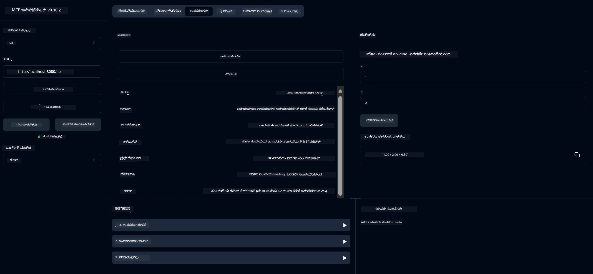

# ಮೂಲ ಕ್ಯಾಲ್ಕುಲೇಟರ್ MCP ಸೇವೆ

ಈ ಸೇವೆ ಸ್ಪ್ರಿಂಗ್ ಬೂಟ್ ಮತ್ತು ವೆಬ್‌ಫ್ಲಕ್ಸ್ ಸಾರಿಗೆ ಬಳಸಿ ಮಾದರಿ ಸಾಂದರ್ಭಿಕ ಪ್ರೋಟೋಕಾಲ್ (MCP) ಮೂಲಕ ಮೂಲ ಕ್ಯಾಲ್ಕುಲೇಟರ್ ಕಾರ್ಯಾಚರಣೆಗಳನ್ನು ಒದಗಿಸುತ್ತದೆ. ಇದು MCP ಅನುಷ್ಠಾನಗಳನ್ನು ಕಲಿಯುತ್ತಿರುವ ಆರಂಭಿಕರಿಗೆ ಸರಳ ಉದಾಹರಣೆಯಾಗಿ ವಿನ್ಯಾಸಗೊಳಿಸಲಾಗಿದೆ.

ಹೆಚ್ಚಿನ ಮಾಹಿತಿಗಾಗಿ, [MCP ಸರ್ವರ್ ಬೂಟ್ ಸ್ಟಾರ್ಟರ್](https://docs.spring.io/spring-ai/reference/api/mcp/mcp-server-boot-starter-docs.html) ಉಲ್ಲೇಖ ಡಾಕ್ಯುಮೆಂಟೇಶನ್ ನೋಡಿ.

## ಅವಲೋಕನ

ಈ ಸೇವೆ ತೋರಿಸುತ್ತದೆ:
- SSE (ಸರ್ವರ್-ಸೆಂಟ್ ಇವೆಂಟ್ಸ್) ಗೆ ಬೆಂಬಲ
- ಸ್ಪ್ರಿಂಗ್ AI ನ `@Tool` ಅಂಕಿತ ಬಳಸಿ ಸ್ವಯಂಚಾಲಿತ ಸಾಧನ ನೋಂದಣಿ
- ಮೂಲ ಕ್ಯಾಲ್ಕುಲೇಟರ್ ಕಾರ್ಯಗಳು:
  - ಸೇರ್ಪಡೆ, ವ್ಯತ್ಯಾಸ, ಗುಣಾಕಾರ, ಭಾಗಾಕಾರ
  - ಶಕ್ತಿ ಲೆಕ್ಕಾಚಾರ ಮತ್ತು ವರ್ಗಮೂಲ
  - ಮೌಲ್ಯಶೇಷ (ಮಾಡ್ಯುಲಸ್) ಮತ್ತು ಪರಮ ಮೌಲ್ಯ
  - ಕಾರ್ಯ ವಿವರಣೆಗಾಗಿ ಸಹಾಯ ಕಾರ್ಯ

## ವೈಶಿಷ್ಟ್ಯಗಳು

ಈ ಕ್ಯಾಲ್ಕುಲೇಟರ್ ಸೇವೆ ಕೆಳಗಿನ ಸಾಮರ್ಥ್ಯಗಳನ್ನು ಒದಗಿಸುತ್ತದೆ:

1. **ಮೂಲ ಅಂಕಗಣಿತ ಕಾರ್ಯಗಳು**:
   - ಎರಡು ಸಂಖ್ಯೆಗಳ ಸೇರ್ಪಡೆ
   - ಒಂದು ಸಂಖ್ಯೆಯಿಂದ ಮತ್ತೊಂದನ್ನು ಕಡಿತಗೊಳಿಸುವುದು
   - ಎರಡು ಸಂಖ್ಯೆಗಳ ಗುಣಾಕಾರ
   - ಒಂದು ಸಂಖ್ಯೆಯನ್ನು ಮತ್ತೊಂದರಿಂದ ಭಾಗಿಸುವುದು (ಶೂನ್ಯ ಭಾಗಾಕಾರ ಪರಿಶೀಲನೆ ಸಹಿತ)

2. **ಅಧಿಕೃತ ಕಾರ್ಯಗಳು**:
   - ಶಕ್ತಿ ಲೆಕ್ಕಾಚಾರ (ಮೂಲ ಸಂಖ್ಯೆಯನ್ನು ಘಾತಕ್ಕೆ ಏರಿಸುವುದು)
   - ವರ್ಗಮೂಲ ಲೆಕ್ಕಾಚಾರ (ನಕಾರಾತ್ಮಕ ಸಂಖ್ಯೆ ಪರಿಶೀಲನೆ ಸಹಿತ)
   - ಮೌಲ್ಯಶೇಷ (ಮಾಡ್ಯುಲಸ್) ಲೆಕ್ಕಾಚಾರ
   - ಪರಮ ಮೌಲ್ಯ ಲೆಕ್ಕಾಚಾರ

3. **ಸಹಾಯ ವ್ಯವಸ್ಥೆ**:
   - ಲಭ್ಯವಿರುವ ಎಲ್ಲಾ ಕಾರ್ಯಗಳನ್ನು ವಿವರಿಸುವ ಒಳಗೊಂಡ ಸಹಾಯ ಕಾರ್ಯ

## ಸೇವೆಯನ್ನು ಬಳಸುವುದು

ಸೇವೆಯು MCP ಪ್ರೋಟೋಕಾಲ್ ಮೂಲಕ ಕೆಳಗಿನ API ಎಂಡ್ಪಾಯಿಂಟ್‌ಗಳನ್ನು ಒದಗಿಸುತ್ತದೆ:

- `add(a, b)`: ಎರಡು ಸಂಖ್ಯೆಗಳ ಸೇರ್ಪಡೆ
- `subtract(a, b)`: ಎರಡನೇ ಸಂಖ್ಯೆಯನ್ನು ಮೊದಲನೆಯಿಂದ ಕಡಿತಗೊಳಿಸುವುದು
- `multiply(a, b)`: ಎರಡು ಸಂಖ್ಯೆಗಳ ಗುಣಾಕಾರ
- `divide(a, b)`: ಮೊದಲ ಸಂಖ್ಯೆಯನ್ನು ಎರಡನೇ ಸಂಖ್ಯೆಯಿಂದ ಭಾಗಿಸುವುದು (ಶೂನ್ಯ ಪರಿಶೀಲನೆ ಸಹಿತ)
- `power(base, exponent)`: ಸಂಖ್ಯೆಯ ಶಕ್ತಿ ಲೆಕ್ಕಾಚಾರ
- `squareRoot(number)`: ವರ್ಗಮೂಲ ಲೆಕ್ಕಾಚಾರ (ನಕಾರಾತ್ಮಕ ಸಂಖ್ಯೆ ಪರಿಶೀಲನೆ ಸಹಿತ)
- `modulus(a, b)`: ಭಾಗಾಕಾರದ ಮೌಲ್ಯಶೇಷ ಲೆಕ್ಕಾಚಾರ
- `absolute(number)`: ಪರಮ ಮೌಲ್ಯ ಲೆಕ್ಕಾಚಾರ
- `help()`: ಲಭ್ಯವಿರುವ ಕಾರ್ಯಗಳ ಬಗ್ಗೆ ಮಾಹಿತಿ ಪಡೆಯುವುದು

## ಪರೀಕ್ಷಾ ಕ್ಲೈಂಟ್

ಸರಳ ಪರೀಕ್ಷಾ ಕ್ಲೈಂಟ್ `com.microsoft.mcp.sample.client` ಪ್ಯಾಕೇಜ್‌ನಲ್ಲಿ ಸೇರಿಸಲಾಗಿದೆ. `SampleCalculatorClient` ವರ್ಗವು ಕ್ಯಾಲ್ಕುಲೇಟರ್ ಸೇವೆಯ ಲಭ್ಯವಿರುವ ಕಾರ್ಯಗಳನ್ನು ಪ್ರದರ್ಶಿಸುತ್ತದೆ.

## LangChain4j ಕ್ಲೈಂಟ್ ಬಳಕೆ

ಈ ಯೋಜನೆಯಲ್ಲಿ LangChain4j ಉದಾಹರಣಾ ಕ್ಲೈಂಟ್ `com.microsoft.mcp.sample.client.LangChain4jClient` ನಲ್ಲಿ ಸೇರಿಸಲಾಗಿದೆ, ಇದು ಕ್ಯಾಲ್ಕುಲೇಟರ್ ಸೇವೆಯನ್ನು LangChain4j ಮತ್ತು GitHub ಮಾದರಿಗಳೊಂದಿಗೆ ಏಕೀಕರಿಸುವುದನ್ನು ತೋರಿಸುತ್ತದೆ:

### ಪೂರ್ವಾಪೇಕ್ಷಿತಗಳು

1. **GitHub ಟೋಕನ್ ಸೆಟ್‌ಅಪ್**:
   
   GitHub ನ AI ಮಾದರಿಗಳನ್ನು (ಉದಾ: phi-4) ಬಳಸಲು, ನಿಮಗೆ GitHub ವೈಯಕ್ತಿಕ ಪ್ರವೇಶ ಟೋಕನ್ ಬೇಕಾಗುತ್ತದೆ:

   a. ನಿಮ್ಮ GitHub ಖಾತೆ ಸೆಟ್ಟಿಂಗ್ಸ್‌ಗೆ ಹೋಗಿ: https://github.com/settings/tokens
   
   b. "Generate new token" → "Generate new token (classic)" ಕ್ಲಿಕ್ ಮಾಡಿ
   
   c. ನಿಮ್ಮ ಟೋಕನ್‌ಗೆ ವಿವರಣಾತ್ಮಕ ಹೆಸರು ನೀಡಿ
   
   d. ಕೆಳಗಿನ ಪರಿಧಿಗಳನ್ನು ಆಯ್ಕೆಮಾಡಿ:
      - `repo` (ಖಾಸಗಿ ರೆಪೊಗಳ ಸಂಪೂರ್ಣ ನಿಯಂತ್ರಣ)
      - `read:org` (ಸಂಸ್ಥೆ ಮತ್ತು ತಂಡ ಸದಸ್ಯತ್ವ ಓದಲು, ಸಂಸ್ಥೆ ಯೋಜನೆಗಳನ್ನು ಓದಲು)
      - `gist` (ಗಿಸ್ಟ್‌ಗಳನ್ನು ರಚಿಸಲು)
      - `user:email` (ಬಳಕೆದಾರರ ಇಮೇಲ್ ವಿಳಾಸಗಳನ್ನು ಪ್ರವೇಶಿಸಲು (ಓದಲು ಮಾತ್ರ))
   
   e. "Generate token" ಕ್ಲಿಕ್ ಮಾಡಿ ಮತ್ತು ಹೊಸ ಟೋಕನ್ ನಕಲಿಸಿ
   
   f. ಅದನ್ನು ಪರಿಸರ ಚರ (environment variable) ಆಗಿ ಸೆಟ್ ಮಾಡಿ:
      
      ವಿಂಡೋಸ್‌ನಲ್ಲಿ:
      ```
      set GITHUB_TOKEN=your-github-token
      ```
      
      macOS/Linux ನಲ್ಲಿ:
      ```bash
      export GITHUB_TOKEN=your-github-token
      ```

   g. ಸ್ಥಿರ ಸೆಟ್‌ಅಪ್‌ಗಾಗಿ, ಸಿಸ್ಟಮ್ ಸೆಟ್ಟಿಂಗ್ಸ್ ಮೂಲಕ ಪರಿಸರ ಚರಗಳಿಗೆ ಸೇರಿಸಿ

2. LangChain4j GitHub ಅವಲಂಬನೆಯನ್ನು ನಿಮ್ಮ ಯೋಜನೆಯಲ್ಲಿ ಸೇರಿಸಿ (pom.xml ನಲ್ಲಿ ಈಗಾಗಲೇ ಸೇರಿಸಲಾಗಿದೆ):
   ```xml
   <dependency>
       <groupId>dev.langchain4j</groupId>
       <artifactId>langchain4j-github</artifactId>
       <version>${langchain4j.version}</version>
   </dependency>
   ```

3. ಕ್ಯಾಲ್ಕುಲೇಟರ್ ಸರ್ವರ್ `localhost:8080` ನಲ್ಲಿ ಚಾಲನೆಯಲ್ಲಿರುವುದನ್ನು ಖಚಿತಪಡಿಸಿಕೊಳ್ಳಿ

### LangChain4j ಕ್ಲೈಂಟ್ ಚಾಲನೆ

ಈ ಉದಾಹರಣೆ ತೋರಿಸುತ್ತದೆ:
- SSE ಸಾರಿಗೆ ಮೂಲಕ ಕ್ಯಾಲ್ಕುಲೇಟರ್ MCP ಸರ್ವರ್‌ಗೆ ಸಂಪರ್ಕ
- LangChain4j ಬಳಸಿ ಕ್ಯಾಲ್ಕುಲೇಟರ್ ಕಾರ್ಯಗಳನ್ನು ಉಪಯೋಗಿಸುವ ಚಾಟ್ ಬಾಟ್ ರಚನೆ
- GitHub AI ಮಾದರಿಗಳೊಂದಿಗೆ ಏಕೀಕರಣ (ಈಗ phi-4 ಮಾದರಿ ಬಳಕೆ)

ಕ್ಲೈಂಟ್ ಕೆಳಗಿನ ಮಾದರಿ ಪ್ರಶ್ನೆಗಳನ್ನು ಕಳುಹಿಸುತ್ತದೆ ಕಾರ್ಯಕ್ಷಮತೆಯನ್ನು ತೋರಿಸಲು:
1. ಎರಡು ಸಂಖ್ಯೆಗಳ ಮೊತ್ತ ಲೆಕ್ಕಾಚಾರ
2. ಸಂಖ್ಯೆಯ ವರ್ಗಮೂಲ ಕಂಡುಹಿಡಿಯುವುದು
3. ಲಭ್ಯವಿರುವ ಕ್ಯಾಲ್ಕುಲೇಟರ್ ಕಾರ್ಯಗಳ ಬಗ್ಗೆ ಸಹಾಯ ಮಾಹಿತಿ ಪಡೆಯುವುದು

ಉದಾಹರಣೆಯನ್ನು ಚಾಲನೆ ಮಾಡಿ ಮತ್ತು ಕಾನ್ಸೋಲ್ ಔಟ್‌ಪುಟ್ ಪರಿಶೀಲಿಸಿ AI ಮಾದರಿ ಕ್ಯಾಲ್ಕುಲೇಟರ್ ಸಾಧನಗಳನ್ನು ಹೇಗೆ ಬಳಸುತ್ತದೆ ಎಂದು ನೋಡಿರಿ.

### GitHub ಮಾದರಿ ಸಂರಚನೆ

LangChain4j ಕ್ಲೈಂಟ್ GitHub ನ phi-4 ಮಾದರಿಯನ್ನು ಕೆಳಗಿನ ಸೆಟ್ಟಿಂಗ್‌ಗಳೊಂದಿಗೆ ಬಳಸಲು ಸಂರಚಿಸಲಾಗಿದೆ:

```java
ChatLanguageModel model = GitHubChatModel.builder()
    .apiKey(System.getenv("GITHUB_TOKEN"))
    .timeout(Duration.ofSeconds(60))
    .modelName("phi-4")
    .logRequests(true)
    .logResponses(true)
    .build();
```

ಬೇರೆ GitHub ಮಾದರಿಗಳನ್ನು ಬಳಸಲು, `modelName` ಪರಿಮಾಣವನ್ನು ಬೇರೆ ಬೆಂಬಲಿತ ಮಾದರಿಯ (ಉದಾ: "claude-3-haiku-20240307", "llama-3-70b-8192" ಇತ್ಯಾದಿ) ಹೆಸರಿಗೆ ಬದಲಾಯಿಸಿ.

## ಅವಲಂಬನೆಗಳು

ಯೋಜನೆಗೆ ಕೆಳಗಿನ ಪ್ರಮುಖ ಅವಲಂಬನೆಗಳು ಬೇಕಾಗಿವೆ:

```xml
<!-- For MCP Server -->
<dependency>
    <groupId>org.springframework.ai</groupId>
    <artifactId>spring-ai-starter-mcp-server-webflux</artifactId>
</dependency>

<!-- For LangChain4j integration -->
<dependency>
    <groupId>dev.langchain4j</groupId>
    <artifactId>langchain4j-mcp</artifactId>
    <version>${langchain4j.version}</version>
</dependency>

<!-- For GitHub models support -->
<dependency>
    <groupId>dev.langchain4j</groupId>
    <artifactId>langchain4j-github</artifactId>
    <version>${langchain4j.version}</version>
</dependency>
```

## ಯೋಜನೆ ನಿರ್ಮಾಣ

Maven ಬಳಸಿ ಯೋಜನೆಯನ್ನು ನಿರ್ಮಿಸಿ:
```bash
./mvnw clean install -DskipTests
```

## ಸರ್ವರ್ ಚಾಲನೆ

### ಜಾವಾ ಬಳಕೆ

```bash
java -jar target/calculator-server-0.0.1-SNAPSHOT.jar
```

### MCP ಇನ್ಸ್‌ಪೆಕ್ಟರ್ ಬಳಕೆ

MCP ಇನ್ಸ್‌ಪೆಕ್ಟರ್ MCP ಸೇವೆಗಳೊಂದಿಗೆ ಸಂವಹನ ಮಾಡಲು ಸಹಾಯಕ ಸಾಧನವಾಗಿದೆ. ಈ ಕ್ಯಾಲ್ಕುಲೇಟರ್ ಸೇವೆಯೊಂದಿಗೆ ಬಳಸಲು:

1. **MCP ಇನ್ಸ್‌ಪೆಕ್ಟರ್ ಅನ್ನು ಇನ್‌ಸ್ಟಾಲ್ ಮಾಡಿ ಮತ್ತು ಹೊಸ ಟರ್ಮಿನಲ್ ವಿಂಡೋದಲ್ಲಿ ಚಾಲನೆ ಮಾಡಿ**:
   ```bash
   npx @modelcontextprotocol/inspector
   ```

2. **ಅ್ಯಪ್ ತೋರಿಸುವ URL (ಸಾಮಾನ್ಯವಾಗಿ http://localhost:6274) ಕ್ಲಿಕ್ ಮಾಡಿ ವೆಬ್ UI ಪ್ರವೇಶಿಸಿ**

3. **ಸಂಪರ್ಕವನ್ನು ಸಂರಚಿಸಿ**:
   - ಸಾರಿಗೆ ಪ್ರಕಾರವನ್ನು "SSE" ಆಗಿ ಸೆಟ್ ಮಾಡಿ
   - ನಿಮ್ಮ ಸರ್ವರ್‌ನ SSE ಎಂಡ್ಪಾಯಿಂಟ್ URL ಅನ್ನು ಸೆಟ್ ಮಾಡಿ: `http://localhost:8080/sse`
   - "Connect" ಕ್ಲಿಕ್ ಮಾಡಿ

4. **ಸಾಧನಗಳನ್ನು ಬಳಸಿ**:
   - "List Tools" ಕ್ಲಿಕ್ ಮಾಡಿ ಲಭ್ಯವಿರುವ ಕ್ಯಾಲ್ಕುಲೇಟರ್ ಕಾರ್ಯಗಳನ್ನು ನೋಡಿ
   - ಸಾಧನವನ್ನು ಆಯ್ಕೆಮಾಡಿ "Run Tool" ಕ್ಲಿಕ್ ಮಾಡಿ ಕಾರ್ಯಾಚರಣೆ ನಡೆಸಿ



### ಡೋಕರ್ ಬಳಕೆ

ಯೋಜನೆಯಲ್ಲಿ ಕಂಟೈನರ್ ನಿಯೋಜನೆಗಾಗಿ ಡೋಕರ್‌ಫೈಲ್ ಸೇರಿಸಲಾಗಿದೆ:

1. **ಡೋಕರ್ ಇಮೇಜ್ ನಿರ್ಮಿಸಿ**:
   ```bash
   docker build -t calculator-mcp-service .
   ```

2. **ಡೋಕರ್ ಕಂಟೈನರ್ ಚಾಲನೆ ಮಾಡಿ**:
   ```bash
   docker run -p 8080:8080 calculator-mcp-service
   ```

ಇದು:
- Maven 3.9.9 ಮತ್ತು Eclipse Temurin 24 JDK ಬಳಸಿ ಬಹು-ಹಂತದ ಡೋಕರ್ ಇಮೇಜ್ ನಿರ್ಮಿಸುತ್ತದೆ
- ಸುಧಾರಿತ ಕಂಟೈನರ್ ಇಮೇಜ್ ರಚಿಸುತ್ತದೆ
- 8080 ಪೋರ್ಟ್‌ನಲ್ಲಿ ಸೇವೆಯನ್ನು ಹೊರತರುತ್ತದೆ
- ಕಂಟೈನರ್ ಒಳಗೆ MCP ಕ್ಯಾಲ್ಕುಲೇಟರ್ ಸೇವೆಯನ್ನು ಪ್ರಾರಂಭಿಸುತ್ತದೆ

ಕಂಟೈನರ್ ಚಾಲನೆಯಲ್ಲಿದ್ದಾಗ ನೀವು `http://localhost:8080` ನಲ್ಲಿ ಸೇವೆಯನ್ನು ಪ್ರವೇಶಿಸಬಹುದು.

## ಸಮಸ್ಯೆ ಪರಿಹಾರ

### GitHub ಟೋಕನ್ ಸಂಬಂಧಿತ ಸಾಮಾನ್ಯ ಸಮಸ್ಯೆಗಳು

1. **ಟೋಕನ್ ಅನುಮತಿ ಸಮಸ್ಯೆಗಳು**: 403 Forbidden ದೋಷ ಬಂದರೆ, ನಿಮ್ಮ ಟೋಕನ್ ಸರಿಯಾದ ಅನುಮತಿಗಳನ್ನು ಹೊಂದಿದೆಯೇ ಎಂದು ಪೂರ್ವಾಪೇಕ್ಷಿತಗಳಲ್ಲಿ ವಿವರಿಸಿದಂತೆ ಪರಿಶೀಲಿಸಿ.

2. **ಟೋಕನ್ ಸಿಗದಿರುವುದು**: "No API key found" ದೋಷ ಬಂದರೆ, GITHUB_TOKEN ಪರಿಸರ ಚರ ಸರಿಯಾಗಿ ಸೆಟ್ ಆಗಿದೆಯೇ ಎಂದು ಖಚಿತಪಡಿಸಿಕೊಳ್ಳಿ.

3. **ರೇಟ್ ಲಿಮಿಟಿಂಗ್**: GitHub API ಗೆ ರೇಟ್ ಮಿತಿ ಇದೆ. 429 ಸ್ಥಿತಿ ಕೋಡ್ ದೋಷ ಬಂದರೆ, ಕೆಲವು ನಿಮಿಷಗಳ ಕಾಲ ಕಾಯಿರಿ ಮತ್ತು ಮತ್ತೆ ಪ್ರಯತ್ನಿಸಿ.

4. **ಟೋಕನ್ ಅವಧಿ ಮುಗಿದಿರುವುದು**: GitHub ಟೋಕನ್‌ಗಳು ಅವಧಿ ಮುಗಿಯಬಹುದು. ಕೆಲವು ಸಮಯದ ನಂತರ ಪ್ರಮಾಣೀಕರಣ ದೋಷ ಬಂದರೆ, ಹೊಸ ಟೋಕನ್ ರಚಿಸಿ ಮತ್ತು ಪರಿಸರ ಚರವನ್ನು ನವೀಕರಿಸಿ.

ಹೆಚ್ಚಿನ ಸಹಾಯಕ್ಕಾಗಿ, [LangChain4j ಡಾಕ್ಯುಮೆಂಟೇಶನ್](https://github.com/langchain4j/langchain4j) ಅಥವಾ [GitHub API ಡಾಕ್ಯುಮೆಂಟೇಶನ್](https://docs.github.com/en/rest) ನೋಡಿ.

---

<!-- CO-OP TRANSLATOR DISCLAIMER START -->
**ಅಸ್ವೀಕರಣ**:  
ಈ ದಸ್ತಾವೇಜು AI ಅನುವಾದ ಸೇವೆ [Co-op Translator](https://github.com/Azure/co-op-translator) ಬಳಸಿ ಅನುವಾದಿಸಲಾಗಿದೆ. ನಾವು ನಿಖರತೆಯಿಗಾಗಿ ಪ್ರಯತ್ನಿಸುತ್ತಿದ್ದರೂ, ಸ್ವಯಂಚಾಲಿತ ಅನುವಾದಗಳಲ್ಲಿ ದೋಷಗಳು ಅಥವಾ ಅಸತ್ಯತೆಗಳು ಇರಬಹುದು ಎಂದು ದಯವಿಟ್ಟು ಗಮನಿಸಿ. ಮೂಲ ಭಾಷೆಯಲ್ಲಿರುವ ಮೂಲ ದಸ್ತಾವೇಜನ್ನು ಅಧಿಕೃತ ಮೂಲವೆಂದು ಪರಿಗಣಿಸಬೇಕು. ಮಹತ್ವದ ಮಾಹಿತಿಗಾಗಿ, ವೃತ್ತಿಪರ ಮಾನವ ಅನುವಾದವನ್ನು ಶಿಫಾರಸು ಮಾಡಲಾಗುತ್ತದೆ. ಈ ಅನುವಾದ ಬಳಕೆಯಿಂದ ಉಂಟಾಗುವ ಯಾವುದೇ ತಪ್ಪು ಅರ್ಥಮಾಡಿಕೊಳ್ಳುವಿಕೆ ಅಥವಾ ತಪ್ಪು ವಿವರಣೆಗಳಿಗೆ ನಾವು ಹೊಣೆಗಾರರಾಗುವುದಿಲ್ಲ.
<!-- CO-OP TRANSLATOR DISCLAIMER END -->