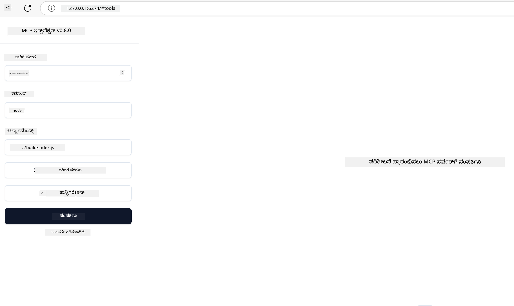

<!--
CO_OP_TRANSLATOR_METADATA:
{
  "original_hash": "83efa75a69bc831277263a6f1ae53669",
  "translation_date": "2025-12-11T11:02:10+00:00",
  "source_file": "04-PracticalImplementation/README.md",
  "language_code": "kn"
}
-->
# ಪ್ರಾಯೋಗಿಕ ಅನುಷ್ಠಾನ

[](https://youtu.be/vCN9-mKBDfQ)

_(ಈ ಪಾಠದ ವೀಡಿಯೋವನ್ನು ನೋಡಲು ಮೇಲಿನ ಚಿತ್ರವನ್ನು ಕ್ಲಿಕ್ ಮಾಡಿ)_

ಪ್ರಾಯೋಗಿಕ ಅನುಷ್ಠಾನವು ಮಾದರಿ ಸನ್ನಿವೇಶ ಪ್ರೋಟೋಕಾಲ್ (MCP) ಶಕ್ತಿಯನ್ನು ಸ್ಪಷ್ಟಗೊಳಿಸುತ್ತದೆ. MCP ಹಿಂದೆ ಇರುವ ಸಿದ್ಧಾಂತ ಮತ್ತು ವಾಸ್ತುಶಿಲ್ಪವನ್ನು ಅರ್ಥಮಾಡಿಕೊಳ್ಳುವುದು ಮಹತ್ವದಿದ್ದರೂ, ನಿಜವಾದ ಮೌಲ್ಯವು ಈ ತತ್ವಗಳನ್ನು ನಿಜಜೀವನದ ಸಮಸ್ಯೆಗಳನ್ನು ಪರಿಹರಿಸುವ ಪರಿಹಾರಗಳನ್ನು ನಿರ್ಮಿಸಲು, ಪರೀಕ್ಷಿಸಲು ಮತ್ತು ನಿಯೋಜಿಸಲು ಅನ್ವಯಿಸಿದಾಗ ಬರುತ್ತದೆ. ಈ ಅಧ್ಯಾಯವು ಕಲ್ಪನಾತ್ಮಕ ಜ್ಞಾನ ಮತ್ತು ಕೈಯಿಂದ ಅಭಿವೃದ್ಧಿಯ ನಡುವಿನ ಅಂತರವನ್ನು ಸೇರುತ್ತದೆ, MCP ಆಧಾರಿತ ಅಪ್ಲಿಕೇಶನ್‌ಗಳನ್ನು ಜೀವಂತಗೊಳಿಸುವ ಪ್ರಕ್ರಿಯೆಯಲ್ಲಿ ನಿಮಗೆ ಮಾರ್ಗದರ್ಶನ ನೀಡುತ್ತದೆ.

ನೀವು ಬುದ್ಧಿವಂತ ಸಹಾಯಕರನ್ನು ಅಭಿವೃದ್ಧಿಪಡಿಸುತ್ತಿದ್ದೀರಾ, ವ್ಯವಹಾರ ಕಾರ್ಯಪ್ರವಾಹಗಳಲ್ಲಿ AI ಅನ್ನು ಸಂಯೋಜಿಸುತ್ತಿದ್ದೀರಾ ಅಥವಾ ಡೇಟಾ ಪ್ರಕ್ರಿಯೆಗಾಗಿ ಕಸ್ಟಮ್ ಸಾಧನಗಳನ್ನು ನಿರ್ಮಿಸುತ್ತಿದ್ದೀರಾ, MCP ಒಂದು ಲವಚಿಕ ಆಧಾರವನ್ನು ಒದಗಿಸುತ್ತದೆ. ಇದರ ಭಾಷಾ-ಸ್ವತಂತ್ರ ವಿನ್ಯಾಸ ಮತ್ತು ಜನಪ್ರಿಯ ಪ್ರೋಗ್ರಾಮಿಂಗ್ ಭಾಷೆಗಳಿಗಾಗಿ ಅಧಿಕೃತ SDKಗಳು ವಿವಿಧ ಡೆವಲಪರ್‌ಗಳಿಗೆ ಲಭ್ಯವಿದೆ. ಈ SDKಗಳನ್ನು ಉಪಯೋಗಿಸಿ, ನೀವು ಬೇಗನೆ ಪ್ರೋಟೋಟೈಪ್ ಮಾಡಬಹುದು, ಪುನರಾವರ್ತನೆ ಮಾಡಬಹುದು ಮತ್ತು ವಿಭಿನ್ನ ವೇದಿಕೆಗಳು ಮತ್ತು ಪರಿಸರಗಳಲ್ಲಿ ನಿಮ್ಮ ಪರಿಹಾರಗಳನ್ನು ವಿಸ್ತರಿಸಬಹುದು.

ಮುಂದಿನ ವಿಭಾಗಗಳಲ್ಲಿ, ನೀವು MCP ಅನ್ನು C#, Java with Spring, TypeScript, JavaScript ಮತ್ತು Python ನಲ್ಲಿ ಅನುಷ್ಠಾನಗೊಳಿಸುವ ಪ್ರಾಯೋಗಿಕ ಉದಾಹರಣೆಗಳು, ಮಾದರಿ ಕೋಡ್ ಮತ್ತು ನಿಯೋಜನೆ ತಂತ್ರಗಳನ್ನು ಕಾಣುತ್ತೀರಿ. ನೀವು ನಿಮ್ಮ MCP ಸರ್ವರ್‌ಗಳನ್ನು ಡಿಬಗ್ ಮತ್ತು ಪರೀಕ್ಷಿಸುವುದು, APIಗಳನ್ನು ನಿರ್ವಹಿಸುವುದು ಮತ್ತು Azure ಬಳಸಿ ಕ್ಲೌಡ್‌ಗೆ ಪರಿಹಾರಗಳನ್ನು ನಿಯೋಜಿಸುವುದನ್ನು ಸಹ ಕಲಿಯುತ್ತೀರಿ. ಈ ಕೈಯಿಂದ ಸಂಪನ್ಮೂಲಗಳು ನಿಮ್ಮ ಕಲಿಕೆಯನ್ನು ವೇಗಗೊಳಿಸಲು ಮತ್ತು ವಿಶ್ವಾಸದಿಂದ ಬಲಿಷ್ಠ, ಉತ್ಪಾದನಾ-ಸಿದ್ಧ MCP ಅಪ್ಲಿಕೇಶನ್‌ಗಳನ್ನು ನಿರ್ಮಿಸಲು ಸಹಾಯ ಮಾಡುತ್ತವೆ.

## ಅವಲೋಕನ

ಈ ಪಾಠವು ವಿವಿಧ ಪ್ರೋಗ್ರಾಮಿಂಗ್ ಭಾಷೆಗಳಲ್ಲಿನ MCP ಅನುಷ್ಠಾನದ ಪ್ರಾಯೋಗಿಕ ಅಂಶಗಳ ಮೇಲೆ ಕೇಂದ್ರೀಕರಿಸುತ್ತದೆ. ನಾವು C#, Java with Spring, TypeScript, JavaScript ಮತ್ತು Python ನಲ್ಲಿ MCP SDKಗಳನ್ನು ಬಳಸಿಕೊಂಡು ಬಲಿಷ್ಠ ಅಪ್ಲಿಕೇಶನ್‌ಗಳನ್ನು ನಿರ್ಮಿಸುವುದು, MCP ಸರ್ವರ್‌ಗಳನ್ನು ಡಿಬಗ್ ಮತ್ತು ಪರೀಕ್ಷಿಸುವುದು ಮತ್ತು ಪುನಃಬಳಕೆ ಮಾಡಬಹುದಾದ ಸಂಪನ್ಮೂಲಗಳು, ಪ್ರಾಂಪ್ಟ್‌ಗಳು ಮತ್ತು ಸಾಧನಗಳನ್ನು ರಚಿಸುವುದನ್ನು ಅನ್ವೇಷಿಸುವೆವು.

## ಕಲಿಕೆಯ ಉದ್ದೇಶಗಳು

ಈ ಪಾಠದ ಅಂತ್ಯಕ್ಕೆ, ನೀವು ಸಾಧ್ಯವಾಗುವುದು:

- ವಿವಿಧ ಪ್ರೋಗ್ರಾಮಿಂಗ್ ಭಾಷೆಗಳ ಅಧಿಕೃತ SDKಗಳನ್ನು ಬಳಸಿ MCP ಪರಿಹಾರಗಳನ್ನು ಅನುಷ್ಠಾನಗೊಳಿಸುವುದು
- MCP ಸರ್ವರ್‌ಗಳನ್ನು ವ್ಯವಸ್ಥಿತವಾಗಿ ಡಿಬಗ್ ಮತ್ತು ಪರೀಕ್ಷಿಸುವುದು
- ಸರ್ವರ್ ವೈಶಿಷ್ಟ್ಯಗಳನ್ನು (ಸಂಪನ್ಮೂಲಗಳು, ಪ್ರಾಂಪ್ಟ್‌ಗಳು ಮತ್ತು ಸಾಧನಗಳು) ರಚಿಸಿ ಬಳಸುವುದು
- ಸಂಕೀರ್ಣ ಕಾರ್ಯಗಳಿಗೆ ಪರಿಣಾಮಕಾರಿ MCP ಕಾರ್ಯಪ್ರವಾಹಗಳನ್ನು ವಿನ್ಯಾಸಗೊಳಿಸುವುದು
- ಕಾರ್ಯಕ್ಷಮತೆ ಮತ್ತು ವಿಶ್ವಾಸಾರ್ಹತೆಗಾಗಿ MCP ಅನುಷ್ಠಾನಗಳನ್ನು ಆಪ್ಟಿಮೈಸ್ ಮಾಡುವುದು

## ಅಧಿಕೃತ SDK ಸಂಪನ್ಮೂಲಗಳು

ಮಾದರಿ ಸನ್ನಿವೇಶ ಪ್ರೋಟೋಕಾಲ್ ಹಲವಾರು ಭಾಷೆಗಳಿಗಾಗಿ ಅಧಿಕೃತ SDKಗಳನ್ನು ಒದಗಿಸುತ್ತದೆ:

- [C# SDK](https://github.com/modelcontextprotocol/csharp-sdk)
- [Java with Spring SDK](https://github.com/modelcontextprotocol/java-sdk) **ಗಮನಿಸಿ:** [Project Reactor](https://projectreactor.io) ಮೇಲೆ ಅವಲಂಬನೆ ಅಗತ್ಯವಿದೆ. (ನೋಡಿ [ಚರ್ಚೆ ವಿಷಯ 246](https://github.com/orgs/modelcontextprotocol/discussions/246).)
- [TypeScript SDK](https://github.com/modelcontextprotocol/typescript-sdk)
- [Python SDK](https://github.com/modelcontextprotocol/python-sdk)
- [Kotlin SDK](https://github.com/modelcontextprotocol/kotlin-sdk)

## MCP SDKಗಳೊಂದಿಗೆ ಕೆಲಸ ಮಾಡುವುದು

ಈ ವಿಭಾಗವು ವಿವಿಧ ಪ್ರೋಗ್ರಾಮಿಂಗ್ ಭಾಷೆಗಳಲ್ಲಿನ MCP ಅನುಷ್ಠಾನದ ಪ್ರಾಯೋಗಿಕ ಉದಾಹರಣೆಗಳನ್ನು ಒದಗಿಸುತ್ತದೆ. ನೀವು ಭಾಷೆಯ ಪ್ರಕಾರ ಸಂಘಟಿತ `samples` ಡೈರೆಕ್ಟರಿಯಲ್ಲಿ ಮಾದರಿ ಕೋಡ್ ಅನ್ನು ಕಾಣಬಹುದು.

### ಲಭ್ಯವಿರುವ ಮಾದರಿಗಳು

ರಿಪೊಸಿಟರಿಯಲ್ಲಿ ಕೆಳಗಿನ ಭಾಷೆಗಳಲ್ಲಿ [ಮಾದರಿ ಅನುಷ್ಠಾನಗಳು](../../../04-PracticalImplementation/samples) ಸೇರಿವೆ:

- [C#](./samples/csharp/README.md)
- [Java with Spring](./samples/java/containerapp/README.md)
- [TypeScript](./samples/typescript/README.md)
- [JavaScript](./samples/javascript/README.md)
- [Python](./samples/python/README.md)

ಪ್ರತಿ ಮಾದರಿ ಆ ಭಾಷೆ ಮತ್ತು ಪರಿಸರದ ಪ್ರಮುಖ MCP ತತ್ವಗಳು ಮತ್ತು ಅನುಷ್ಠಾನ ಮಾದರಿಗಳನ್ನು ತೋರಿಸುತ್ತದೆ.

## ಕೋರ್ ಸರ್ವರ್ ವೈಶಿಷ್ಟ್ಯಗಳು

MCP ಸರ್ವರ್‌ಗಳು ಈ ವೈಶಿಷ್ಟ್ಯಗಳ ಯಾವುದೇ ಸಂಯೋಜನೆಯನ್ನು ಅನುಷ್ಠಾನಗೊಳಿಸಬಹುದು:

### ಸಂಪನ್ಮೂಲಗಳು

ಸಂಪನ್ಮೂಲಗಳು ಬಳಕೆದಾರ ಅಥವಾ AI ಮಾದರಿಗಾಗಿ ಸನ್ನಿವೇಶ ಮತ್ತು ಡೇಟಾವನ್ನು ಒದಗಿಸುತ್ತವೆ:

- ಡಾಕ್ಯುಮೆಂಟ್ ಸಂಗ್ರಹಾಲಯಗಳು
- ಜ್ಞಾನ ಆಧಾರಗಳು
- ರಚಿಸಲಾದ ಡೇಟಾ ಮೂಲಗಳು
- ಫೈಲ್ ವ್ಯವಸ್ಥೆಗಳು

### ಪ್ರಾಂಪ್ಟ್‌ಗಳು

ಪ್ರಾಂಪ್ಟ್‌ಗಳು ಬಳಕೆದಾರರಿಗಾಗಿ ಟೆಂಪ್ಲೇಟು ಮಾಡಿದ ಸಂದೇಶಗಳು ಮತ್ತು ಕಾರ್ಯಪ್ರವಾಹಗಳು:

- ಪೂರ್ವನಿರ್ಧರಿತ ಸಂಭಾಷಣಾ ಟೆಂಪ್ಲೇಟುಗಳು
- ಮಾರ್ಗದರ್ಶಿತ ಸಂವಹನ ಮಾದರಿಗಳು
- ವಿಶೇಷ ಸಂವಾದ ರಚನೆಗಳು

### ಸಾಧನಗಳು

ಸಾಧನಗಳು AI ಮಾದರಿ ಕಾರ್ಯಗತಗೊಳಿಸಲು ಫಂಕ್ಷನ್‌ಗಳು:

- ಡೇಟಾ ಪ್ರಕ್ರಿಯೆ ಉಪಕರಣಗಳು
- ಬಾಹ್ಯ API ಸಂಯೋಜನೆಗಳು
- ಗಣನಾತ್ಮಕ ಸಾಮರ್ಥ್ಯಗಳು
- ಹುಡುಕಾಟ ಕಾರ್ಯಕ್ಷಮತೆ

## ಮಾದರಿ ಅನುಷ್ಠಾನಗಳು: C# ಅನುಷ್ಠಾನ

ಅಧಿಕೃತ C# SDK ರಿಪೊಸಿಟರಿಯಲ್ಲಿ MCP ನ ವಿವಿಧ ಅಂಶಗಳನ್ನು ತೋರಿಸುವ ಹಲವಾರು ಮಾದರಿ ಅನುಷ್ಠಾನಗಳಿವೆ:

- **ಮೂಲ MCP ಕ್ಲೈಂಟ್**: MCP ಕ್ಲೈಂಟ್ ರಚಿಸುವುದು ಮತ್ತು ಸಾಧನಗಳನ್ನು ಕರೆ ಮಾಡುವ ಸರಳ ಉದಾಹರಣೆ
- **ಮೂಲ MCP ಸರ್ವರ್**: ಮೂಲ ಸಾಧನ ನೋಂದಣಿಯೊಂದಿಗೆ ಕನಿಷ್ಠ ಸರ್ವರ್ ಅನುಷ್ಠಾನ
- **ಅಧಿಕೃತ MCP ಸರ್ವರ್**: ಸಾಧನ ನೋಂದಣಿ, ಪ್ರಾಮಾಣೀಕರಣ ಮತ್ತು ದೋಷ ನಿರ್ವಹಣೆಯೊಂದಿಗೆ ಸಂಪೂರ್ಣ ವೈಶಿಷ್ಟ್ಯಗೊಳಿಸಿದ ಸರ್ವರ್
- **ASP.NET ಸಂಯೋಜನೆ**: ASP.NET ಕೋರ್ ಜೊತೆಗೆ ಸಂಯೋಜನೆ ತೋರಿಸುವ ಉದಾಹರಣೆಗಳು
- **ಸಾಧನ ಅನುಷ್ಠಾನ ಮಾದರಿಗಳು**: ವಿಭಿನ್ನ ಸಂಕೀರ್ಣತೆಯೊಂದಿಗೆ ಸಾಧನಗಳನ್ನು ಅನುಷ್ಠಾನಗೊಳಿಸುವ ವಿವಿಧ ಮಾದರಿಗಳು

MCP C# SDK ಪೂರ್ವಾವಲೋಕನದಲ್ಲಿದೆ ಮತ್ತು APIಗಳು ಬದಲಾಗಬಹುದು. SDK ಅಭಿವೃದ್ಧಿಯಾಗುತ್ತಾ ಈ ಬ್ಲಾಗ್ ಅನ್ನು ನಿರಂತರವಾಗಿ ನವೀಕರಿಸಲಾಗುತ್ತದೆ.

### ಪ್ರಮುಖ ವೈಶಿಷ್ಟ್ಯಗಳು

- [C# MCP Nuget ModelContextProtocol](https://www.nuget.org/packages/ModelContextProtocol)
- ನಿಮ್ಮ [ಮೊದಲ MCP ಸರ್ವರ್](https://devblogs.microsoft.com/dotnet/build-a-model-context-protocol-mcp-server-in-csharp/) ನಿರ್ಮಿಸುವುದು.

ಪೂರ್ಣ C# ಅನುಷ್ಠಾನ ಮಾದರಿಗಳಿಗೆ, [ಅಧಿಕೃತ C# SDK ಮಾದರಿ ರಿಪೊಸಿಟರಿ](https://github.com/modelcontextprotocol/csharp-sdk) ಗೆ ಭೇಟಿ ನೀಡಿ

## ಮಾದರಿ ಅನುಷ್ಠಾನ: Java with Spring ಅನುಷ್ಠಾನ

Java with Spring SDK ಉದ್ಯಮ-ಮಟ್ಟದ ವೈಶಿಷ್ಟ್ಯಗಳೊಂದಿಗೆ ಬಲಿಷ್ಠ MCP ಅನುಷ್ಠಾನ ಆಯ್ಕೆಯನ್ನು ಒದಗಿಸುತ್ತದೆ.

### ಪ್ರಮುಖ ವೈಶಿಷ್ಟ್ಯಗಳು

- Spring Framework ಸಂಯೋಜನೆ
- ಬಲವಾದ ಪ್ರಕಾರ ಭದ್ರತೆ
- ಪ್ರತಿಕ್ರಿಯಾತ್ಮಕ ಪ್ರೋಗ್ರಾಮಿಂಗ್ ಬೆಂಬಲ
- ಸಮಗ್ರ ದೋಷ ನಿರ್ವಹಣೆ

ಪೂರ್ಣ Java with Spring ಅನುಷ್ಠಾನ ಮಾದರಿಗಾಗಿ, ಮಾದರಿ ಡೈರೆಕ್ಟರಿಯಲ್ಲಿನ [Java with Spring ಮಾದರಿ](samples/java/containerapp/README.md) ನೋಡಿ.

## ಮಾದರಿ ಅನುಷ್ಠಾನ: JavaScript ಅನುಷ್ಠಾನ

JavaScript SDK MCP ಅನುಷ್ಠಾನಕ್ಕೆ ಲಘು ಮತ್ತು ಲವಚಿಕ ವಿಧಾನವನ್ನು ಒದಗಿಸುತ್ತದೆ.

### ಪ್ರಮುಖ ವೈಶಿಷ್ಟ್ಯಗಳು

- Node.js ಮತ್ತು ಬ್ರೌಸರ್ ಬೆಂಬಲ
- ಪ್ರಾಮಿಸ್ ಆಧಾರಿತ API
- Express ಮತ್ತು ಇತರ ಫ್ರೇಮ್ವರ್ಕ್‌ಗಳೊಂದಿಗೆ ಸುಲಭ ಸಂಯೋಜನೆ
- ಸ್ಟ್ರೀಮಿಂಗ್‌ಗೆ WebSocket ಬೆಂಬಲ

ಪೂರ್ಣ JavaScript ಅನುಷ್ಠಾನ ಮಾದರಿಗಾಗಿ, ಮಾದರಿ ಡೈರೆಕ್ಟರಿಯಲ್ಲಿನ [JavaScript ಮಾದರಿ](samples/javascript/README.md) ನೋಡಿ.

## ಮಾದರಿ ಅನುಷ್ಠಾನ: Python ಅನುಷ್ಠಾನ

Python SDK ಉತ್ತಮ ML ಫ್ರೇಮ್ವರ್ಕ್ ಸಂಯೋಜನೆಗಳೊಂದಿಗೆ Python ಶೈಲಿಯ MCP ಅನುಷ್ಠಾನವನ್ನು ಒದಗಿಸುತ್ತದೆ.

### ಪ್ರಮುಖ ವೈಶಿಷ್ಟ್ಯಗಳು

- asyncio ಜೊತೆಗೆ Async/await ಬೆಂಬಲ
- FastAPI ಸಂಯೋಜನೆ``
- ಸರಳ ಸಾಧನ ನೋಂದಣಿ
- ಜನಪ್ರಿಯ ML ಗ್ರಂಥಾಲಯಗಳೊಂದಿಗೆ ಸ್ಥಳೀಯ ಸಂಯೋಜನೆ

ಪೂರ್ಣ Python ಅನುಷ್ಠಾನ ಮಾದರಿಗಾಗಿ, ಮಾದರಿ ಡೈರೆಕ್ಟರಿಯಲ್ಲಿನ [Python ಮಾದರಿ](samples/python/README.md) ನೋಡಿ.

## API ನಿರ್ವಹಣೆ

Azure API ನಿರ್ವಹಣೆ MCP ಸರ್ವರ್‌ಗಳನ್ನು ಹೇಗೆ ಸುರಕ್ಷಿತಗೊಳಿಸಬಹುದು ಎಂಬುದಕ್ಕೆ ಉತ್ತಮ ಉತ್ತರವಾಗಿದೆ. ಆಲೋಚನೆ ಎಂದರೆ ನಿಮ್ಮ MCP ಸರ್ವರ್ ಮುಂದೆ Azure API ನಿರ್ವಹಣೆ ಘಟಕವನ್ನು ಇಟ್ಟುಕೊಂಡು, ನೀವು ಬಯಸುವ ವೈಶಿಷ್ಟ್ಯಗಳನ್ನು ನಿರ್ವಹಿಸುವುದು:

- ದರ ಮಿತಿ
- ಟೋಕನ್ ನಿರ್ವಹಣೆ
- ಮೇಲ್ವಿಚಾರಣೆ
- ಲೋಡ್ ಸಮತೋಲನ
- ಭದ್ರತೆ

### Azure ಮಾದರಿ

ಇಲ್ಲಿ ಒಂದು Azure ಮಾದರಿ ಇದೆ, ಅಂದರೆ [MCP ಸರ್ವರ್ ರಚಿಸಿ ಮತ್ತು ಅದನ್ನು Azure API ನಿರ್ವಹಣೆಯಿಂದ ಸುರಕ್ಷಿತಗೊಳಿಸುವುದು](https://github.com/Azure-Samples/remote-mcp-apim-functions-python).

ಕೆಳಗಿನ ಚಿತ್ರದಲ್ಲಿ ಪ್ರಾಧಿಕರಣ ಪ್ರಕ್ರಿಯೆ ಹೇಗೆ ನಡೆಯುತ್ತದೆ ನೋಡಿ:


ಮೇಲಿನ ಚಿತ್ರದಲ್ಲಿ, ಕೆಳಗಿನವುಗಳು ನಡೆಯುತ್ತವೆ:

- Microsoft Entra ಬಳಸಿ ಪ್ರಾಮಾಣೀಕರಣ/ಪ್ರಾಧಿಕರಣ ನಡೆಯುತ್ತದೆ.
- Azure API ನಿರ್ವಹಣೆ ಗೇಟ್ವೇ ಆಗಿ ಕಾರ್ಯನಿರ್ವಹಿಸಿ ನೀತಿಗಳನ್ನು ಉಪಯೋಗಿಸಿ ಟ್ರಾಫಿಕ್ ಅನ್ನು ನಿರ್ದೇಶಿಸುತ್ತದೆ ಮತ್ತು ನಿರ್ವಹಿಸುತ್ತದೆ.
- Azure Monitor ಎಲ್ಲಾ ವಿನಂತಿಗಳನ್ನು ಲಾಗ್ ಮಾಡುತ್ತದೆ ಮುಂದಿನ ವಿಶ್ಲೇಷಣೆಗೆ.

#### ಪ್ರಾಧಿಕರಣ ಪ್ರಕ್ರಿಯೆ

ಪ್ರಾಧಿಕರಣ ಪ್ರಕ್ರಿಯೆಯನ್ನು ಇನ್ನಷ್ಟು ವಿವರವಾಗಿ ನೋಡೋಣ:


#### MCP ಪ್ರಾಧಿಕರಣ ನಿರ್ದಿಷ್ಟತೆ

[MCP ಪ್ರಾಧಿಕರಣ ನಿರ್ದಿಷ್ಟತೆ](https://modelcontextprotocol.io/specification/2025-03-26/basic/authorization#2-10-third-party-authorization-flow) ಬಗ್ಗೆ ಇನ್ನಷ್ಟು ತಿಳಿಯಿರಿ

## ರಿಮೋಟ್ MCP ಸರ್ವರ್ ಅನ್ನು Azure ಗೆ ನಿಯೋಜಿಸುವುದು

ನಾವು ಮೊದಲು ಉಲ್ಲೇಖಿಸಿದ ಮಾದರಿಯನ್ನು ನಿಯೋಜಿಸಬಹುದೇ ನೋಡೋಣ:

1. ರಿಪೊ ಕ್ಲೋನ್ ಮಾಡಿ

    ```bash
    git clone https://github.com/Azure-Samples/remote-mcp-apim-functions-python.git
    cd remote-mcp-apim-functions-python
    ```

1. `Microsoft.App` ಸಂಪನ್ಮೂಲ ಪೂರೈಕೆದಾರರನ್ನು ನೋಂದಣಿ ಮಾಡಿಕೊಳ್ಳಿ.

   - ನೀವು Azure CLI ಬಳಸುತ್ತಿದ್ದರೆ, `az provider register --namespace Microsoft.App --wait` ಅನ್ನು ರನ್ ಮಾಡಿ.
   - ನೀವು Azure PowerShell ಬಳಸುತ್ತಿದ್ದರೆ, `Register-AzResourceProvider -ProviderNamespace Microsoft.App` ಅನ್ನು ರನ್ ಮಾಡಿ. ನಂತರ ಕೆಲವು ಸಮಯದ ನಂತರ ನೋಂದಣಿ ಪೂರ್ಣವಾಗಿದೆ ಎಂದು ಪರಿಶೀಲಿಸಲು `(Get-AzResourceProvider -ProviderNamespace Microsoft.App).RegistrationState` ಅನ್ನು ರನ್ ಮಾಡಿ.

1. ಈ [azd](https://aka.ms/azd) ಕಮಾಂಡ್ ಅನ್ನು ರನ್ ಮಾಡಿ API ನಿರ್ವಹಣಾ ಸೇವೆ, ಫಂಕ್ಷನ್ ಅಪ್ಲಿಕೇಶನ್ (ಕೋಡ್ ಜೊತೆಗೆ) ಮತ್ತು ಇತರ ಅಗತ್ಯವಿರುವ Azure ಸಂಪನ್ಮೂಲಗಳನ್ನು ಪ್ರೊವಿಷನ್ ಮಾಡಲು

    ```shell
    azd up
    ```

    ಈ ಕಮಾಂಡ್‌ಗಳು ಎಲ್ಲಾ ಕ್ಲೌಡ್ ಸಂಪನ್ಮೂಲಗಳನ್ನು Azure ಮೇಲೆ ನಿಯೋಜಿಸಬೇಕು

### MCP ಇನ್ಸ್‌ಪೆಕ್ಟರ್ ಬಳಸಿ ನಿಮ್ಮ ಸರ್ವರ್ ಅನ್ನು ಪರೀಕ್ಷಿಸುವುದು

1. **ಹೊಸ ಟರ್ಮಿನಲ್ ವಿಂಡೋದಲ್ಲಿ**, MCP ಇನ್ಸ್‌ಪೆಕ್ಟರ್ ಅನ್ನು ಇನ್‌ಸ್ಟಾಲ್ ಮಾಡಿ ಮತ್ತು ರನ್ ಮಾಡಿ

    ```shell
    npx @modelcontextprotocol/inspector
    ```

    ನೀವು ಈ ರೀತಿಯ ಇಂಟರ್ಫೇಸ್ ಅನ್ನು ನೋಡಬೇಕು:

    

1. MCP ಇನ್ಸ್‌ಪೆಕ್ಟರ್ ವೆಬ್ ಅಪ್ಲಿಕೇಶನ್ URL (ಉದಾ: [http://127.0.0.1:6274/#resources](http://127.0.0.1:6274/#resources)) ನಿಂದ CTRL ಕ್ಲಿಕ್ ಮಾಡಿ ಲೋಡ್ ಮಾಡಿ
1. ಸಾರಿಗೆ ಪ್ರಕಾರವನ್ನು `SSE` ಗೆ ಸೆಟ್ ಮಾಡಿ
1. ನಿಮ್ಮ ಚಾಲನೆಯಲ್ಲಿರುವ API ನಿರ್ವಹಣಾ SSE ಎಂಡ್‌ಪಾಯಿಂಟ್ URL ಅನ್ನು `azd up` ನಂತರ ಪ್ರದರ್ಶಿಸಲಾಗುತ್ತದೆ, ಅದನ್ನು ಸೆಟ್ ಮಾಡಿ ಮತ್ತು **Connect** ಮಾಡಿ:

    ```shell
    https://<apim-servicename-from-azd-output>.azure-api.net/mcp/sse
    ```

1. **ಸಾಧನಗಳನ್ನು ಪಟ್ಟಿ ಮಾಡಿ**. ಸಾಧನವನ್ನು ಕ್ಲಿಕ್ ಮಾಡಿ ಮತ್ತು **ಸಾಧನವನ್ನು ರನ್ ಮಾಡಿ**.

ಎಲ್ಲಾ ಹಂತಗಳು ಯಶಸ್ವಿಯಾಗಿ ನಡೆದಿದ್ದರೆ, ನೀವು ಈಗ MCP ಸರ್ವರ್‌ಗೆ ಸಂಪರ್ಕ ಹೊಂದಿದ್ದೀರಿ ಮತ್ತು ಸಾಧನವನ್ನು ಕರೆಮಾಡಲು ಸಾಧ್ಯವಾಯಿತು.

## Azure ಗಾಗಿ MCP ಸರ್ವರ್‌ಗಳು

[Remote-mcp-functions](https://github.com/Azure-Samples/remote-mcp-functions-dotnet): ಈ ರಿಪೊಸಿಟರಿಗಳು Python, C# .NET ಅಥವಾ Node/TypeScript ಬಳಸಿ Azure Functions ಮೂಲಕ ಕಸ್ಟಮ್ ರಿಮೋಟ್ MCP (ಮಾದರಿ ಸನ್ನಿವೇಶ ಪ್ರೋಟೋಕಾಲ್) ಸರ್ವರ್‌ಗಳನ್ನು ನಿರ್ಮಿಸುವ ಮತ್ತು ನಿಯೋಜಿಸುವ ವೇಗದ ಪ್ರಾರಂಭ ಟೆಂಪ್ಲೇಟುಗಳಾಗಿವೆ.

ಮಾದರಿಗಳು ಡೆವಲಪರ್‌ಗಳಿಗೆ ಸಂಪೂರ್ಣ ಪರಿಹಾರವನ್ನು ಒದಗಿಸುತ್ತವೆ, ಅದು:

- ಸ್ಥಳೀಯವಾಗಿ ನಿರ್ಮಿಸಿ ಮತ್ತು ರನ್ ಮಾಡಿ: ಸ್ಥಳೀಯ ಯಂತ್ರದಲ್ಲಿ MCP ಸರ್ವರ್ ಅನ್ನು ಅಭಿವೃದ್ಧಿಪಡಿಸಿ ಮತ್ತು ಡಿಬಗ್ ಮಾಡಿ
- Azure ಗೆ ನಿಯೋಜಿಸಿ: ಸರಳ azd up ಕಮಾಂಡ್ ಮೂಲಕ ಕ್ಲೌಡ್‌ಗೆ ಸುಲಭವಾಗಿ ನಿಯೋಜಿಸಿ
- ಕ್ಲೈಂಟ್‌ಗಳಿಂದ ಸಂಪರ್ಕಿಸಿ: VS Code ನ Copilot ಏಜೆಂಟ್ ಮೋಡ್ ಮತ್ತು MCP ಇನ್ಸ್‌ಪೆಕ್ಟರ್ ಸಾಧನ ಸೇರಿದಂತೆ ವಿವಿಧ ಕ್ಲೈಂಟ್‌ಗಳಿಂದ MCP ಸರ್ವರ್‌ಗೆ ಸಂಪರ್ಕಿಸಿ

### ಪ್ರಮುಖ ವೈಶಿಷ್ಟ್ಯಗಳು

- ವಿನ್ಯಾಸದ ಮೂಲಕ ಭದ್ರತೆ: MCP ಸರ್ವರ್ ಕೀಗಳು ಮತ್ತು HTTPS ಬಳಸಿ ಸುರಕ್ಷಿತವಾಗಿದೆ
- ಪ್ರಾಮಾಣೀಕರಣ ಆಯ್ಕೆಗಳು: ನಿರ್ಮಿತ ಪ್ರಾಮಾಣೀಕರಣ ಮತ್ತು/ಅಥವಾ API ನಿರ್ವಹಣೆಯನ್ನು ಬಳಸಿ OAuth ಬೆಂಬಲ
- ನೆಟ್‌ವರ್ಕ್ ವಿಭಜನೆ: Azure ವರ್ಚುವಲ್ ನೆಟ್‌ವರ್ಕ್‌ಗಳು (VNET) ಬಳಸಿ ನೆಟ್‌ವರ್ಕ್ ವಿಭಜನೆಗೆ ಅವಕಾಶ
- ಸರ್ವರ್‌ಲೆಸ್ ವಾಸ್ತುಶಿಲ್ಪ: Azure Functions ಬಳಸಿ ವಿಸ್ತರಿಸಬಹುದಾದ, ಘಟನೆ-ಚಾಲಿತ ಕಾರ್ಯಗತಗೊಳಿಸುವಿಕೆ
- ಸ್ಥಳೀಯ ಅಭಿವೃದ್ಧಿ: ಸಮಗ್ರ ಸ್ಥಳೀಯ ಅಭಿವೃದ್ಧಿ ಮತ್ತು ಡಿಬಗ್ ಬೆಂಬಲ
- ಸರಳ ನಿಯೋಜನೆ: Azure ಗೆ ಸರಳ ನಿಯೋಜನೆ ಪ್ರಕ್ರಿಯೆ

ರಿಪೊಸಿಟರಿಯಲ್ಲಿ ಎಲ್ಲಾ ಅಗತ್ಯವಿರುವ ಸಂರಚನಾ ಕಡತಗಳು, ಮೂಲ ಕೋಡ್ ಮತ್ತು ಮೂಲಸೌಕರ್ಯ ವ್ಯಾಖ್ಯಾನಗಳು ಸೇರಿವೆ, ಉತ್ಪಾದನಾ-ಸಿದ್ಧ MCP ಸರ್ವರ್ ಅನುಷ್ಠಾನವನ್ನು ವೇಗವಾಗಿ ಪ್ರಾರಂಭಿಸಲು.

- [Azure Remote MCP Functions Python](https://github.com/Azure-Samples/remote-mcp-functions-python) - Python ಬಳಸಿ Azure Functions ಮೂಲಕ MCP ನ ಮಾದರಿ ಅನುಷ್ಠಾನ

- [Azure Remote MCP Functions .NET](https://github.com/Azure-Samples/remote-mcp-functions-dotnet) - C# .NET ಬಳಸಿ Azure Functions ಮೂಲಕ MCP ನ ಮಾದರಿ ಅನುಷ್ಠಾನ

- [Azure Remote MCP Functions Node/Typescript](https://github.com/Azure-Samples/remote-mcp-functions-typescript) - Node/TypeScript ಬಳಸಿ Azure Functions ಮೂಲಕ MCP ನ ಮಾದರಿ ಅನುಷ್ಠಾನ.

## ಪ್ರಮುಖ ಪಾಠಗಳು

- MCP SDKಗಳು ಬಲಿಷ್ಠ MCP ಪರಿಹಾರಗಳನ್ನು ಅನುಷ್ಠಾನಗೊಳಿಸಲು ಭಾಷಾ-ನಿರ್ದಿಷ್ಟ ಸಾಧನಗಳನ್ನು ಒದಗಿಸುತ್ತವೆ
- ಡಿಬಗ್ ಮತ್ತು ಪರೀಕ್ಷಾ ಪ್ರಕ್ರಿಯೆ ವಿಶ್ವಾಸಾರ್ಹ MCP ಅಪ್ಲಿಕೇಶನ್‌ಗಳಿಗೆ ಅತ್ಯಾವಶ್ಯಕ
- ಪುನಃಬಳಕೆ ಮಾಡಬಹುದಾದ ಪ್ರಾಂಪ್ಟ್ ಟೆಂಪ್ಲೇಟುಗಳು ಸತತ AI ಸಂವಹನಗಳನ್ನು ಸಾಧ್ಯಮಾಡುತ್ತವೆ
- ಚೆನ್ನಾಗಿ ವಿನ್ಯಾಸಗೊಳಿಸಿದ ಕಾರ್ಯಪ್ರವಾಹಗಳು ಹಲವಾರು ಸಾಧನಗಳನ್ನು ಬಳಸಿ ಸಂಕೀರ್ಣ ಕಾರ್ಯಗಳನ್ನು ಸಂಯೋಜಿಸಬಹುದು
- MCP ಪರಿಹಾರಗಳನ್ನು ಅನುಷ್ಠಾನಗೊಳಿಸುವಾಗ ಭದ್ರತೆ, ಕಾರ್ಯಕ್ಷಮತೆ ಮತ್ತು ದೋಷ ನಿರ್ವಹಣೆಯನ್ನು ಪರಿಗಣಿಸುವುದು ಅಗತ್ಯ

## ಅಭ್ಯಾಸ

ನಿಮ್ಮ

---

<!-- CO-OP TRANSLATOR DISCLAIMER START -->
**ಅಸ್ವೀಕರಣ**:  
ಈ ದಸ್ತಾವೇಜು AI ಅನುವಾದ ಸೇವೆ [Co-op Translator](https://github.com/Azure/co-op-translator) ಬಳಸಿ ಅನುವಾದಿಸಲಾಗಿದೆ. ನಾವು ನಿಖರತೆಯಿಗಾಗಿ ಪ್ರಯತ್ನಿಸುತ್ತಿದ್ದರೂ, ಸ್ವಯಂಚಾಲಿತ ಅನುವಾದಗಳಲ್ಲಿ ತಪ್ಪುಗಳು ಅಥವಾ ಅಸತ್ಯತೆಗಳು ಇರಬಹುದು ಎಂದು ದಯವಿಟ್ಟು ಗಮನಿಸಿ. ಮೂಲ ಭಾಷೆಯಲ್ಲಿರುವ ಮೂಲ ದಸ್ತಾವೇಜನ್ನು ಅಧಿಕೃತ ಮೂಲವೆಂದು ಪರಿಗಣಿಸಬೇಕು. ಪ್ರಮುಖ ಮಾಹಿತಿಗಾಗಿ, ವೃತ್ತಿಪರ ಮಾನವ ಅನುವಾದವನ್ನು ಶಿಫಾರಸು ಮಾಡಲಾಗುತ್ತದೆ. ಈ ಅನುವಾದ ಬಳಕೆಯಿಂದ ಉಂಟಾಗುವ ಯಾವುದೇ ತಪ್ಪು ಅರ್ಥಮಾಡಿಕೊಳ್ಳುವಿಕೆ ಅಥವಾ ತಪ್ಪು ವಿವರಣೆಗಳಿಗೆ ನಾವು ಹೊಣೆಗಾರರಾಗುವುದಿಲ್ಲ.
<!-- CO-OP TRANSLATOR DISCLAIMER END -->