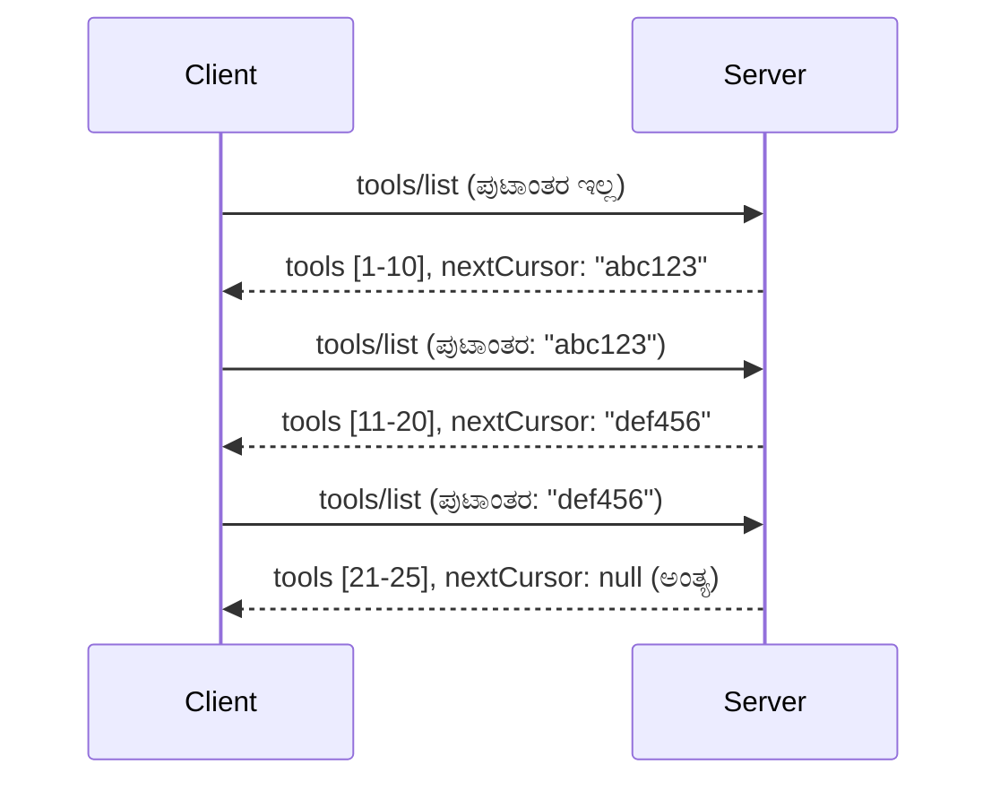

# MCP ನಲ್ಲಿ ಪುಟನಿರ್ಣಯ ಮತ್ತು ದೊಡ್ಡ ಫಲಿತಾಂಶಗಳ ಸೆಟ್ ಗಳು

ನಿಮ್ಮ MCP ಸರ್ವರ್ ದೊಡ್ಡ ಡೇಟಾಸೆಟ್‌ಗಳನ್ನು ನಿರ್ವಹಿಸುವಾಗ - ಸಾವಿರಾರು ಫೈಲ್‌ಗಳು, ಡೇಟಾಬೇಸ್ ದಾಖಲೆಗಳು ಅಥವಾ ಹುಡುಕಾಟ ಫಲಿತಾಂಶಗಳ ಪಟ್ಟಿ ಮಾಡಬೇಕಾಗಿದ್ರೆ - ಸ್ಮೃತಿ ಸಮರ್ಪಕವಾಗಿ ನಿರ್ವಹಿಸಲು ಮತ್ತು ಸ್ಪಂದನಶೀಲ ಬಳಕೆದಾರ ಅನುಭವಗಳನ್ನು ಒದಗಿಸಲು ಪುಟನಿರ್ಣಯ ಅವಶ್ಯಕವಾಗುತ್ತದೆ. ಈ ಮಾರ್ಗಸೂಚಿ MCP ನಲ್ಲಿ ಪುಟನಿರ್ಣಯವನ್ನು ಹೇಗೆ ಅನುಷ್ಠಾನಗೊಳಿಸಬೇಕೆಂಬುದನ್ನು ಹಾಗೂ ಬಳಸುವುದನ್ನು ವಿವರಿಸುತ್ತದೆ.

## ಏಕೆ ಪುಟನಿರ್ಣಯ ಮಹತ್ವವಾಗಿವೆ

ಪುಟನಿರ್ಣಯವಿಲ್ಲದೆ, ದೊಡ್ಡ ಪ್ರತಿಕ್ರಿಯೆಗಳು ತಂದೊಯ್ಯಬಹುದು:

- **ಸ್ಮೃತಿ ಖಾಲಿಯಾಗುವುದು** - ಒಮ್ಮೆಗೆಲಸದಲೀ লক্ষಾಂತರ ದಾಖಲೆಗಳನ್ನು ಲೋಡ್ ಮಾಡುವುದು
- **ಮಂದ ಪ್ರತಿಕ್ರಿಯೆ ಸಮಯಗಳು** - ಎಲ್ಲಾ ಡೇಟಾ ಲೋಡ್ ಆಗುವವರೆಗೆ ಬಳಕೆದಾರರು ಕಾಯಬೇಕು
- **ಟೈಮ್‌ಔಟ್ ದೋಷಗಳು** - ವಿನಂತಿಗಳು ಟೈಮ್‌ಔಟ್ ಮೀರಬಹುದು
- **ಕೆಟ್ಟ AI ಕಾರ್ಯಕ್ಷಮತೆ** - LLM ಗಳು ವಿಸ್ತೃತ ಸಂದರ್ಭದೊಂದಿಗೆ ಸಂಕಷ್ಟ ಪಡುತ್ತವೆ

MCP ನಲಿ **ಕರ್ಸರ್ ಆಧಾರಿತ ಪುಟನಿರ್ಣಯ** ಬಳಸುತ್ತದೆ ವಿಶ್ವಾಸಾರ್ಹ, ಸತತ ಫಲಿತಾಂಶ ಸೆಟ್‌ಗಳ ಮೂಲಕ ಪುಟೀಕರಣ ಮಾಡಲು.

---

## MCP ಪುಟನಿರ್ಣಯ ಹೇಗೆ ಕೆಲಸ ಮಾಡುತ್ತದೆ

### ಕರ್ಸರ್ ಧಾರಣೆ

**ಕರ್ಸರ್** ಎಂದರೆ ಫಲಿತಾಂಶ ಸೆಟ್‌ನಲ್ಲಿ ನಿಮ್ಮ ಸ್ಥಿತಿಯನ್ನು ಗುರುತಿಸುವ ಅಪಾರದಿಯುಕ್ತ ಸ್ಟ್ರಿಂಗ್. ಇದನ್ನು.Lengthy ಪುಸ್ತಕದ ಬುಕ್‌ಮಾರ್ಕ್ ಎಂದು ತಿಳಿದುಕೊಳ್ಳಬಹುದು.


### MCP ವಿಧಾನಗಳಲ್ಲಿ ಪುಟನಿರ್ಣಯ

ಈ MCP ವಿಧಾನಗಳು ಪುಟನಿರ್ಣಯವನ್ನು ಬೆಂಬಲಿಸುತ್ತವೆ:

| ವಿಧಾನ | ಮರಳಿಸುವುದು | ಕರ್ಸರ್ ಬೆಂಬಲ |
|--------|------------|--------------|
| `tools/list` | ಉಪಕರಣ ನಿರ್ವಚನೆಗಳು | ✅ |
| `resources/list` | ಸಂಪನ್ಮೂಲ ನಿರ್ವಚನೆಗಳು | ✅ |
| `prompts/list` | ಪ್ರಾಂಪ್ಟ್ ನಿರ್ವಚನೆಗಳು | ✅ |
| `resources/templates/list` | ಸಂಪನ್ಮೂಲ ಟೆಂಪ್ಲೇಟುಗಳು | ✅ |

---

## ಸರ್ವರ್ ಜಾರಿಗೊಳ್ಳುವಿಕೆ

### Python (FastMCP)

```python
from mcp.server import Server
from mcp.types import Tool, ListToolsResult
import math

app = Server("paginated-server")

# ನಕಲಿ ದೊಡ್ಡ ಡೇಟಾಸೆಟ್
ALL_TOOLS = [
    Tool(name=f"tool_{i}", description=f"Tool number {i}", inputSchema={})
    for i in range(100)
]

PAGE_SIZE = 10

@app.list_tools()
async def list_tools(cursor: str | None = None) -> ListToolsResult:
    """List tools with pagination support."""
    
    # ಪ್ರಾರಂಭಿಸುವ ಸೂಚ್ಯಂಕವನ್ನು ಪಡೆಯಲು ಕರ್ಸರ್ ಡಿಕೋಡ್ ಮಾಡಿ
    start_index = 0
    if cursor:
        try:
            start_index = int(cursor)
        except ValueError:
            start_index = 0
    
    # ಫಲಿತಾಂಶಗಳ ಪುಟವನ್ನು ಪಡೆಯಿರಿ
    end_index = min(start_index + PAGE_SIZE, len(ALL_TOOLS))
    page_tools = ALL_TOOLS[start_index:end_index]
    
    # ಮುಂದಿನ ಕರ್ಸರ್ ಅನ್ನು ಲೆಕ್ಕಹಾಕಿ
    next_cursor = None
    if end_index < len(ALL_TOOLS):
        next_cursor = str(end_index)
    
    return ListToolsResult(
        tools=page_tools,
        nextCursor=next_cursor
    )
```

### TypeScript

```typescript
import { Server } from "@modelcontextprotocol/sdk/server/index.js";
import { ListToolsResultSchema } from "@modelcontextprotocol/sdk/types.js";

const server = new Server({
  name: "paginated-server",
  version: "1.0.0"
});

// ಅನುಕರಿಸಿದ ದೊಡ್ಡ ಡೇಟಾಸೆಟ್
const ALL_TOOLS = Array.from({ length: 100 }, (_, i) => ({
  name: `tool_${i}`,
  description: `Tool number ${i}`,
  inputSchema: { type: "object", properties: {} }
}));

const PAGE_SIZE = 10;

server.setRequestHandler(ListToolsResultSchema, async (request) => {
  // ಕರ್ಸರ್ ಡಿಕೋಡ್ ಮಾಡಿ
  let startIndex = 0;
  if (request.params?.cursor) {
    startIndex = parseInt(request.params.cursor, 10) || 0;
  }
  
  // ಫಲಿತಾಂಶಗಳ ಪುಟ ಪಡೆಯಿರಿ
  const endIndex = Math.min(startIndex + PAGE_SIZE, ALL_TOOLS.length);
  const pageTools = ALL_TOOLS.slice(startIndex, endIndex);
  
  // ಮುಂದಿನ ಕರ್ಸರ್ ಲೆಕ್ಕಿಸು
  const nextCursor = endIndex < ALL_TOOLS.length ? String(endIndex) : undefined;
  
  return {
    tools: pageTools,
    nextCursor
  };
});
```

### Java (Spring MCP)

```java
@Service
public class PaginatedToolService {
    
    private static final int PAGE_SIZE = 10;
    private final List<Tool> allTools;
    
    public PaginatedToolService() {
        // ದೊಡ್ಡ ಡೇಟಾಸೆಟ್ ಅನ್ನು ಪ್ರಾರಂಭಿಸಿ
        this.allTools = IntStream.range(0, 100)
            .mapToObj(i -> new Tool("tool_" + i, "Tool number " + i, Map.of()))
            .collect(Collectors.toList());
    }
    
    @McpMethod("tools/list")
    public ListToolsResult listTools(@Param("cursor") String cursor) {
        // ಕರ್ಸರ್ ಅನ್ನು ಡಿಕೋಡ್ ಮಾಡಿ
        int startIndex = 0;
        if (cursor != null && !cursor.isEmpty()) {
            try {
                startIndex = Integer.parseInt(cursor);
            } catch (NumberFormatException e) {
                startIndex = 0;
            }
        }
        
        // ಫಲಿತಾಂಶಗಳ ಪುಟವನ್ನು ಪಡೆದುಕೊಳ್ಳಿ
        int endIndex = Math.min(startIndex + PAGE_SIZE, allTools.size());
        List<Tool> pageTools = allTools.subList(startIndex, endIndex);
        
        // ಮುಂದಿನ ಕರ್ಸರ್ ಅನ್ನು ಲೆಕ್ಕಿಸು
        String nextCursor = endIndex < allTools.size() ? String.valueOf(endIndex) : null;
        
        return new ListToolsResult(pageTools, nextCursor);
    }
}
```

---

## ಕ್ಲೈಂಟ್ ಜಾರಿಗೊಳ್ಳುವಿಕೆ

### Python ಕ್ಲೈಂಟ್

```python
from mcp import ClientSession

async def get_all_tools(session: ClientSession) -> list:
    """Fetch all tools using pagination."""
    all_tools = []
    cursor = None
    
    while True:
        result = await session.list_tools(cursor=cursor)
        all_tools.extend(result.tools)
        
        if result.nextCursor is None:
            break
        cursor = result.nextCursor
    
    return all_tools

# ಬಳಕೆ
async with client_session as session:
    tools = await get_all_tools(session)
    print(f"Found {len(tools)} tools")
```

### TypeScript ಕ್ಲೈಂಟ್

```typescript
import { Client } from "@modelcontextprotocol/sdk/client/index.js";

async function getAllTools(client: Client): Promise<Tool[]> {
  const allTools: Tool[] = [];
  let cursor: string | undefined = undefined;
  
  do {
    const result = await client.listTools({ cursor });
    allTools.push(...result.tools);
    cursor = result.nextCursor;
  } while (cursor);
  
  return allTools;
}

// ಉಪಯೋಗ
const tools = await getAllTools(client);
console.log(`Found ${tools.length} tools`);
```

### ಸೂಳು ಲೋಡ್ ಮಾದರಿ

ಬಹಳ ದೊಡ್ಡ ಡೇಟಾಸೆಟ್‌ಗಳಿಗಾಗಿ, ಅವಶ್ಯಕತೆ ಇದ್ದವರು ಪುಟಗಳನ್ನು ಆವಶ್ಯಕತೆ ಪ್ರಕಾರ ಲೋಡ್ ಮಾಡಿ:

```python
class PaginatedToolIterator:
    """Lazily iterate through paginated tools."""
    
    def __init__(self, session: ClientSession):
        self.session = session
        self.cursor = None
        self.buffer = []
        self.exhausted = False
    
    async def __anext__(self):
        # ಲಭ್ಯವಿದ್ದರೆ ಬಫರ್ ನಿಂದ ಹಿಂತಿರುಗಿ
        if self.buffer:
            return self.buffer.pop(0)
        
        # ನಾವು ಎಲ್ಲಾ ಪುಟಗಳನ್ನು ಖಾಲಿ ಮಾಡಿದ್ದೇವೆ ಎಂದು ಪರಿಶೀಲಿಸಿ
        if self.exhausted:
            raise StopAsyncIteration
        
        # ಮುಂದಿನ ಪುಟವನ್ನು ಪಡೆಯಿರಿ
        result = await self.session.list_tools(cursor=self.cursor)
        self.buffer = list(result.tools)
        self.cursor = result.nextCursor
        
        if self.cursor is None:
            self.exhausted = True
        
        if not self.buffer:
            raise StopAsyncIteration
        
        return self.buffer.pop(0)
    
    def __aiter__(self):
        return self

# ಬಳಕೆ - ದೊಡ್ಡ ಡೇಟಾಸೆಟ್ ಗಾಗಿ ನೆನಪು ಮಿತಿವಂತರಾಗಿರುವುದು
async for tool in PaginatedToolIterator(session):
    process_tool(tool)
```

---

## ಸಂಪನ್ಮೂಲಗಳಿಗಾಗಿ ಪುಟನಿರ್ಣಯ

ಸಂಪನ್ಮೂಲಗಳಿಗೆ directory ಗಳಿಗೆ ಅಥವಾ ದೊಡ್ಡ ಡೇಟಾಸೆಟ್‌ಗಳಿಗೆ ಪುಟನಿರ್ಣಯ ತಾಳಬೇಕಾಗುತ್ತದೆ:

```python
from mcp.server import Server
from mcp.types import Resource, ListResourcesResult
import os

app = Server("file-server")

@app.list_resources()
async def list_resources(cursor: str | None = None) -> ListResourcesResult:
    """List files in directory with pagination."""
    
    directory = "/data/files"
    all_files = sorted(os.listdir(directory))
    
    # ಕರಸರ್ ಅನ್ನು ಡಿಕೋಡ್ ಮಾಡಿ (ಫೈಲ್ ಸೂಚ್ಯಂಕ)
    start_index = int(cursor) if cursor else 0
    page_size = 20
    end_index = min(start_index + page_size, len(all_files))
    
    # ಈ ಪುಟದಿಗಾಗಿ ಸಂಪನ್ಮೂಲ ಪಟ್ಟಿಯನ್ನು ರಚಿಸಿ
    resources = []
    for filename in all_files[start_index:end_index]:
        filepath = os.path.join(directory, filename)
        resources.append(Resource(
            uri=f"file://{filepath}",
            name=filename,
            mimeType="application/octet-stream"
        ))
    
    # ಮುಂದಿನ ಕರಸರ್ ಅನ್ನು ಲెక్కಿಸಿ
    next_cursor = str(end_index) if end_index < len(all_files) else None
    
    return ListResourcesResult(
        resources=resources,
        nextCursor=next_cursor
    )
```

---

## ಕರ್ಸರ್ ವಿನ್ಯಾಸ ತಂತ್ರಗಳು

### ತಂತ್ರ 1: ಸೂಚ್ಯಂಕ ಆಧಾರಿತ (ಸರಳ)

```python
# ಕುರ್ಸರ್ ಕೇವಲ ಸೂಚ್ಯಂಕವಾಗಿದೆ
cursor = "50"  # ಐಟಂ 50 ರಿಂದ ಪ್ರಾರಂಭಿಸಿ
```

**ข้อดี:** ಸರಳ, ಸ್ಟೇಟ್‌ಲೆಸ್  
**ತುಷಾರು:** ಖಂಡಿತ ವಿವರಗಳು ಸೇರಿಸಿದರೆ / ತೆಗೆದರೆ ಫಲಿತಾಂಶಗಳು ಬದಲಾಯಿಸಬಹುದು

### ತಂತ್ರ 2: ID ಆಧಾರಿತ (ಸ್ಥಿರ)

```python
# ಕರ್ಸರ್ ಕೊನೆಯ ಬಾರಿ ಕಂಡ ಐಡಿ ಆಗಿದೆ
cursor = "item_abc123"  # ಈ ಐಟಂನ ನಂತರ ಪ್ರಾರಂಭಿಸಿ
```

**ข้อดี:** ಸರಕಾರವು ಬದಲಾಗಿದ್ದರೂ ಸ್ಥಿರವಾಗಿದೆ  
**ತುಷಾರು:** ಆದೇಶಿತ ID ಗಳ ಅವಶ್ಯಕತೆ

### ತಂತ್ರ 3: ಸಂಕುಚಿತ ಸ್ಥಿತಿ (ಸಂಕೀರ್ಣ)

```python
import base64
import json

def encode_cursor(state: dict) -> str:
    return base64.b64encode(json.dumps(state).encode()).decode()

def decode_cursor(cursor: str) -> dict:
    return json.loads(base64.b64decode(cursor).decode())

# ಕರ್ಸರ್‌ನಲ್ಲಿ 여러 ರಾಜ್ಯ ಕ್ಷೇತ್ರಗಳು ಇವೆ
cursor = encode_cursor({
    "offset": 50,
    "filter": "active",
    "sort": "name"
})
```

**ข้อดี:** ಸಂಕೀರ್ಣ ಸ್ಥಿತಿಗಳನ್ನು ಸಂಕೇತಿಸಬಹುದಾಗಿದೆ  
**ತುಷಾರು:** ಹೆಚ್ಚು ಸಂಕೀರ್ಣ, ದೊಡ್ಡ ಕರ್ಸರ್ ಸ್ಟ್ರಿಂಗ್‌ಗಳು

---

## ಉತ್ತಮ ಪದ್ಧತಿಗಳು

### 1. ಯುಕ್ತಿಪೂರ್ತಿಯಾದ ಪುಟ ಗಾತ್ರವನ್ನು ಆಯ್ಕೆಮಾಡಿ

```python
# ದತ್ತಾಂಶದ ಗಾತ್ರವನ್ನು ಪರಿಗಣಿಸಿ
PAGE_SIZE_SMALL_ITEMS = 100   # ಸರಳ ಮೆಟಾಡೇಟಾದ
PAGE_SIZE_MEDIUM_ITEMS = 20   # ಸಮೃದ್ಧ ವಸ್ತುಗಳು
PAGE_SIZE_LARGE_ITEMS = 5     # ಜಟಿಲ ವಿಷಯ
```

### 2. ಅಮಾನ್ಯ ಕರ್ಸರ್ಗಳನ್ನು ಶಾಂತವಾಗಿಯೂ ನಿಭಾಯಿಸಿ

```python
@app.list_tools()
async def list_tools(cursor: str | None = None) -> ListToolsResult:
    try:
        start_index = int(cursor) if cursor else 0
        if start_index < 0 or start_index >= len(ALL_TOOLS):
            start_index = 0  # ಆರಂಭಕ್ಕೆ ಮರುಹೊಂದಿಸಿ
    except (ValueError, TypeError):
        start_index = 0  # ಅಮಾನ್ಯ ಕರ್ಸರ್, ಹೊಸದಾಗಿ ಪ್ರಾರಂಭಿಸಿ
    # ...
```

### 3. ಒಟ್ಟು ಎಣಿಕೆಯನ್ನು ಸೇರಿಸಿ (ಐಚ್ಛಿಕ)

```python
return ListToolsResult(
    tools=page_tools,
    nextCursor=next_cursor,
    # ಕೆಲವು ರಚನೆಗಳು UI ಪ್ರಗತಿಗಾಗಿ ಒಟ್ಟು ಅನ್ನು ಸೇರಿಸುತ್ತವೆ
    _meta={"total": len(ALL_TOOLS)}
)
```

### 4. ಅಡ್ಡಬದಿಯ ಪ್ರಕರಣಗಳನ್ನು ಪರೀಕ್ಷಿಸಿ

```python
async def test_pagination():
    # ಖಾಲಿ ಫಲಿತಾಂಶ ಸೆಟ್
    result = await session.list_tools()
    assert result.tools == []
    assert result.nextCursor is None
    
    # ಏಕ ಪುಟ
    result = await session.list_tools()
    assert len(result.tools) <= PAGE_SIZE
    
    # ಅಮಾನ್ಯ ಕರ್ಸರ್
    result = await session.list_tools(cursor="invalid")
    assert result.tools  # ಮೊದಲ ಪುಟವನ್ನು ಮರಳಿಸಬೇಕು
```

---

## ಸಾಮಾನ್ಯ ತಪ್ಪುಗಳು

### ❌ ಎಲ್ಲಾ ಫಲಿತಾಂಶಗಳನ್ನು ಮರಳಿ ತರುತ್ತದೆ ಮತ್ತು ಬಳಿಕ ಕ್ಲೈಂಟ್-ಪಾರ್ಶ್ವದಲ್ಲಿ ಪುಟೀಕರಣ ಮಾಡುತ್ತವೆ

```python
# ಕೆಟ್ಟದು: ಎಲ್ಲಾ ವಿಷಯಗಳನ್ನು ಮೆಮೊರಿಯಲ್ಲಿ ಲೋಡ್ ಮಾಡುತ್ತದೆ
@app.list_tools()
async def list_tools() -> ListToolsResult:
    all_tools = load_all_tools()  # 1 ಮಿಲಿಯನ್ ಉಪಕರಣಗಳು!
    return ListToolsResult(tools=all_tools)
```

### ✅ ಮೊದಲಿನಿಂದಲೇ ಡೇಟಾ ಮೂಲದಲ್ಲೇ ಪುಟೀಕರಣ ಮಾಡಿ

```python
# ಚೆನ್ನಾಗಿದೆ: ಕೋರಿಕೆಯಂತೇ ಅವಶ್ಯಕವಾದ ವಸ್ತುಗಳನ್ನು ಮಾತ್ರ ಲೋಡ್ ಮಾಡುತ್ತದೆ
@app.list_tools()
async def list_tools(cursor: str | None = None) -> ListToolsResult:
    offset = int(cursor) if cursor else 0
    tools = await db.query_tools(offset=offset, limit=PAGE_SIZE)
    return ListToolsResult(tools=tools, nextCursor=...)
```

---

## ಮುಂದಿನ ವಿಷಯಗಳು

- [ಮಾಡ್ಯೂಲ್ 5.14 - ಸಂದರ್ಭ ಇಂಜಿನಿಯರಿಂಗ್](../../05-AdvancedTopics/mcp-contextengineering/README.md)
- [ಮಾಡ್ಯೂಲ್ 8 - ಉತ್ತಮ ಪದ್ಧತಿಗಳು](../../08-BestPractices/README.md)
- [3.8 - ನಿಮ್ಮ MCP ಸರ್ವರ್ ಅನ್ನು ಪರೀಕ್ಷಿಸುವುದು](../../03-GettingStarted/08-testing/README.md)

---

## ಹೆಚ್ಚುವರಿ ಸಂಪನ್ಮೂಲಗಳು

- [MCP ವಿವರಿಕೆ - ಪುಟನಿರ್ಣಯ](https://spec.modelcontextprotocol.io/specification/2025-11-25/)
- [ಕರ್ಸರ್ ಆಧಾರಿತ ಪುಟನಿರ್ಣಯ ವಿವರಣೆ](https://slack.engineering/evolving-api-pagination-at-slack/)
- [Python SDK ಪುಟನಿರ್ಣಯ ಪರೀಕ್ಷೆಗಳು](https://github.com/modelcontextprotocol/python-sdk/blob/main/tests/client/test_list_methods_cursor.py)

---

<!-- CO-OP TRANSLATOR DISCLAIMER START -->
**ತ್ಯಾಜ್ಯ ತಿಳಿವು**:  
ಈ ದಾಖಲೆ AI ಅನುವಾದ ಸೇವೆ [Co-op Translator](https://github.com/Azure/co-op-translator) ಬಳಸಿ ಅನುವಾದಿಸಲಾಗಿದೆ. ನಾವಿನ್ನೂ ಶುದ್ಧತೆಗಾಗಿ ಪ್ರಯತ್ನಿಸುತ್ತಿದ್ದರೂ, ಸ್ವಯಂಚಾಲಿತ ಅನುವಾದಗಳಲ್ಲಿ ತಪ್ಪುಗಳು ಅಥವಾ ಅಸತ್ಯತೆಗಳು ಇರಬಹುದಾಗಿದೆ ಎಂದು ದಯವಿಟ್ಟು ಗಮನಿಸಿ. ಮೂಲ ಭಾಷೆಯಲ್ಲಿನ ದಾಖಲೆಯೇ ಪ್ರಾಮಾಣಿಕ ಮತ್ತು ಅಧಿಕೃತ ಮೂಲ ಎಂದು ಪರಿಗಣಿಸಬೇಕು. ಪ್ರಮುಖ ಮಾಹಿತಿಗಾಗಿ ವೃತ್ತಿಪರ ಮಾನವ ಅನುವಾದವನ್ನು ಶಿಫಾರಸು ಮಾಡಲಾಗಿದೆ. ಈ ಅನುವಾದದ ಬಳಕೆಯಿಂದ ಉಂಟಾಗುವ ಯಾವುದಾದರೂ ತಪ್ಪು ನಿರ್ವಾಹಣೆ ಅಥವಾ ತಪ್ಪು ಅರ್ಥಗಳಿಗಾಗಿ ನಾವು ಜವಾಬ್ದಾರಿಯಾಗಿರುವುದಿಲ್ಲ.
<!-- CO-OP TRANSLATOR DISCLAIMER END -->