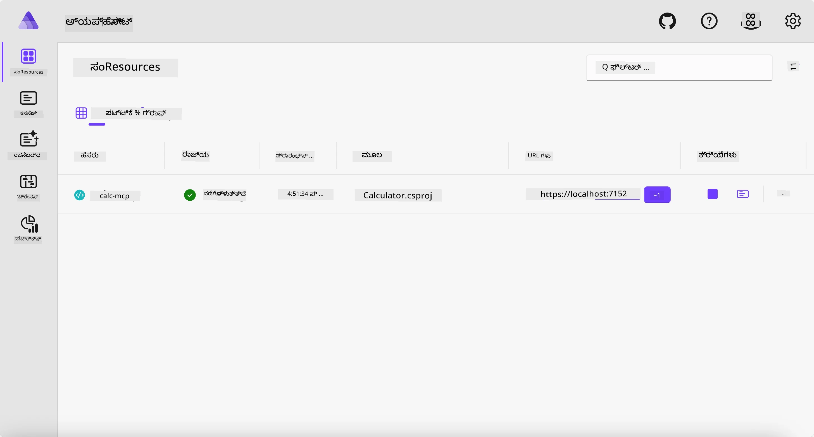
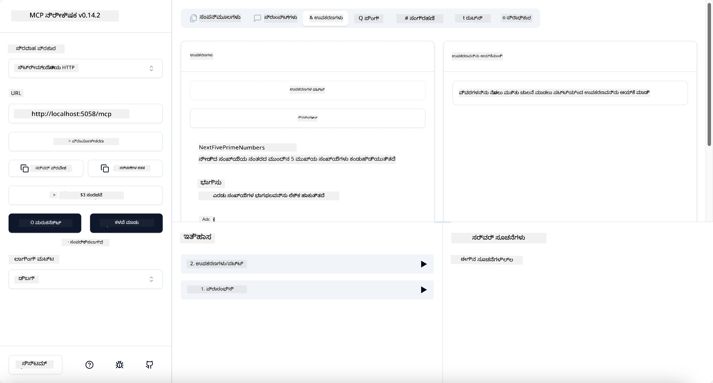
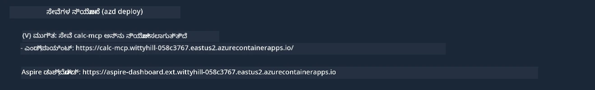

# ಮಾದರಿ

ಹಿಂದಿನ ಉದಾಹರಣೆ `stdio` ಪ್ರಕಾರದ ಸ್ಥಳೀಯ .NET ಪ್ರಾಜೆಕ್ಟ್ ಅನ್ನು ಹೇಗೆ ಬಳಸುವುದು ಮತ್ತು ಸರ್ವರ್ ಅನ್ನು ಸ್ಥಳೀಯವಾಗಿ ಕಂಟೈನರ್‌ನಲ್ಲಿ ಹೇಗೆ ಚಾಲನೆ ಮಾಡುವುದು ಎಂಬುದನ್ನು ತೋರಿಸುತ್ತದೆ. ಇದು ಅನೇಕ ಸಂದರ್ಭಗಳಲ್ಲಿ ಒಳ್ಳೆಯ ಪರಿಹಾರವಾಗಿದೆ. ಆದಾಗ್ಯೂ, ಸರ್ವರ್ ಅನ್ನು ಕ್ಲೌಡ್ ಪರಿಸರದಂತೆ ದೂರಸ್ಥವಾಗಿ ಚಾಲನೆ ಮಾಡುವುದು ಸಹ ಉಪಯುಕ್ತವಾಗಬಹುದು. ಇದಕ್ಕೆ `http` ಪ್ರಕಾರ ಬರುತ್ತದೆ.

`04-PracticalImplementation` ಫೋಲ್ಡರ್‌ನಲ್ಲಿರುವ ಪರಿಹಾರವನ್ನು ನೋಡಿದರೆ, ಅದು ಹಿಂದಿನದಿಗಿಂತ ಬಹಳ ಹೆಚ್ಚು ಸಂಕೀರ್ಣವಾಗಿರುವಂತೆ ಕಾಣಬಹುದು. ಆದರೆ ವಾಸ್ತವದಲ್ಲಿ ಅದು ಅಲ್ಲ. ನೀವು `src/Calculator` ಪ್ರಾಜೆಕ್ಟ್ ಅನ್ನು ನಿಕಟವಾಗಿ ನೋಡಿದರೆ, ಅದು ಬಹುಮಟ್ಟಿಗೆ ಹಿಂದಿನ ಉದಾಹರಣೆಯೇ ಆಗಿದೆ ಎಂದು ಕಾಣುತ್ತದೆ. ಏಕೈಕ ವ್ಯತ್ಯಾಸವೆಂದರೆ ನಾವು HTTP ವಿನಂತಿಗಳನ್ನು ನಿರ್ವಹಿಸಲು ವಿಭಿನ್ನ ಲೈಬ್ರರಿ `ModelContextProtocol.AspNetCore` ಅನ್ನು ಬಳಸುತ್ತಿದ್ದೇವೆ. ಮತ್ತು `IsPrime` ವಿಧಾನವನ್ನು ಖಾಸಗಿ ಮಾಡಲು ಬದಲಾಯಿಸಿದ್ದೇವೆ, ಇದು ನಿಮ್ಮ ಕೋಡ್‌ನಲ್ಲಿ ಖಾಸಗಿ ವಿಧಾನಗಳನ್ನು ಹೊಂದಬಹುದು ಎಂದು ತೋರಿಸಲು. ಉಳಿದ ಕೋಡ್ ಹಿಂದಿನಂತೆಯೇ ಇದೆ.

ಇತರ ಪ್ರಾಜೆಕ್ಟ್‌ಗಳು [.NET Aspire](https://learn.microsoft.com/dotnet/aspire/get-started/aspire-overview) ನಿಂದ ಆಗಿವೆ. ಪರಿಹಾರದಲ್ಲಿ .NET Aspire ಇದ್ದರೆ ಅಭಿವೃದ್ಧಿಪಡಿಸುವವರು ಅಭಿವೃದ್ಧಿ ಮತ್ತು ಪರೀಕ್ಷೆ ಮಾಡುವಾಗ ಅನುಭವವನ್ನು ಸುಧಾರಿಸುತ್ತದೆ ಮತ್ತು ಗಮನಾರ್ಹತೆಯಲ್ಲಿ ಸಹಾಯ ಮಾಡುತ್ತದೆ. ಸರ್ವರ್ ಚಾಲನೆ ಮಾಡಲು ಇದು ಅಗತ್ಯವಿಲ್ಲ, ಆದರೆ ನಿಮ್ಮ ಪರಿಹಾರದಲ್ಲಿ ಇದನ್ನು ಹೊಂದಿರುವುದು ಒಳ್ಳೆಯ ಅಭ್ಯಾಸ.

## ಸರ್ವರ್ ಅನ್ನು ಸ್ಥಳೀಯವಾಗಿ ಪ್ರಾರಂಭಿಸಿ

1. VS Code (C# DevKit ವಿಸ್ತರಣೆ ಜೊತೆಗೆ) ನಿಂದ `04-PracticalImplementation/samples/csharp` ಡೈರೆಕ್ಟರಿಯ ಕಡೆಗೆ ನವಿಗೇಟ್ ಮಾಡಿ.
1. ಸರ್ವರ್ ಪ್ರಾರಂಭಿಸಲು ಕೆಳಗಿನ ಆಜ್ಞೆಯನ್ನು ನಿರ್ವಹಿಸಿ:

   ```bash
    dotnet watch run --project ./src/AppHost
   ```

1. ವೆಬ್ ಬ್ರೌಸರ್ .NET Aspire ಡ್ಯಾಶ್‌ಬೋರ್ಡ್ ತೆರೆಯುವಾಗ, `http` URL ಗಮನಿಸಿ. ಅದು `http://localhost:5058/` ಎಂಬುದಾಗಿ ಇರಬಹುದು.

   

## MCP ಇನ್ಸ್‌ಪೆಕ್ಟರ್‌ನೊಂದಿಗೆ ಸ್ಟ್ರೀಮಬಲ್ HTTP ಪರೀಕ್ಷಿಸಿ

ನೀವು Node.js 22.7.5 ಮತ್ತು ಮೇಲಿನ ಆವೃತ್ತಿಗಳನ್ನು ಹೊಂದಿದ್ದರೆ, MCP ಇನ್ಸ್‌ಪೆಕ್ಟರ್ ಬಳಸಿ ನಿಮ್ಮ ಸರ್ವರ್ ಅನ್ನು ಪರೀಕ್ಷಿಸಬಹುದು.

ಸರ್ವರ್ ಪ್ರಾರಂಭಿಸಿ ಮತ್ತು ಟರ್ಮಿನಲ್‌ನಲ್ಲಿ ಕೆಳಗಿನ ಆಜ್ಞೆಯನ್ನು ನಿರ್ವಹಿಸಿ:

```bash
npx @modelcontextprotocol/inspector http://localhost:5058
```



- ಟ್ರಾನ್ಸ್‌ಪೋರ್ಟ್ ಪ್ರಕಾರವಾಗಿ `Streamable HTTP` ಆಯ್ಕೆಮಾಡಿ.
- Url ಕ್ಷೇತ್ರದಲ್ಲಿ ಮೊದಲು ಗಮನಿಸಿದ ಸರ್ವರ್ URL ಅನ್ನು ನಮೂದಿಸಿ ಮತ್ತು `/mcp` ಅನ್ನು ಸೇರಿಸಿ. ಅದು `http` (https ಅಲ್ಲ) ಆಗಿರಬೇಕು, ಉದಾಹರಣೆಗೆ `http://localhost:5058/mcp`.
- Connect ಬಟನ್ ಆಯ್ಕೆಮಾಡಿ.

ಇನ್ಸ್‌ಪೆಕ್ಟರ್‌ನ ಒಳ್ಳೆಯ ವಿಷಯವೆಂದರೆ ಅದು ಏನಾಗುತ್ತಿದೆ ಎಂಬುದರ ಮೇಲೆ ಉತ್ತಮ ದೃಶ್ಯಮಾನತೆ ಒದಗಿಸುತ್ತದೆ.

- ಲಭ್ಯವಿರುವ ಉಪಕರಣಗಳನ್ನು ಪಟ್ಟಿ ಮಾಡಲು ಪ್ರಯತ್ನಿಸಿ
- ಕೆಲವು ಉಪಕರಣಗಳನ್ನು ಪ್ರಯತ್ನಿಸಿ, ಅದು ಹಿಂದಿನಂತೆ ಕಾರ್ಯನಿರ್ವಹಿಸಬೇಕು.

## VS Code ನಲ್ಲಿ GitHub Copilot Chat ಜೊತೆಗೆ MCP ಸರ್ವರ್ ಪರೀಕ್ಷಿಸಿ

GitHub Copilot Chat ಜೊತೆಗೆ Streamable HTTP ಟ್ರಾನ್ಸ್‌ಪೋರ್ಟ್ ಬಳಸಲು, ಹಿಂದಿನಂತೆ ರಚಿಸಿದ `calc-mcp` ಸರ್ವರ್ ಸಂರಚನೆಯನ್ನು ಈ ರೀತಿಯಾಗಿ ಬದಲಾಯಿಸಿ:

```jsonc
// .vscode/mcp.json
{
  "servers": {
    "calc-mcp": {
      "type": "http",
      "url": "http://localhost:5058/mcp"
    }
  }
}
```

ಕೆಲವು ಪರೀಕ್ಷೆಗಳನ್ನು ಮಾಡಿ:

- "6780 ನಂತರ 3 ಪ್ರೈಮ್ ಸಂಖ್ಯೆಗಳು" ಕೇಳಿ. Copilot ಹೊಸ ಉಪಕರಣಗಳು `NextFivePrimeNumbers` ಅನ್ನು ಬಳಸುತ್ತದೆ ಮತ್ತು ಮೊದಲ 3 ಪ್ರೈಮ್ ಸಂಖ್ಯೆಗಳನ್ನಷ್ಟೇ ಹಿಂತಿರುಗಿಸುತ್ತದೆ.
- "111 ನಂತರ 7 ಪ್ರೈಮ್ ಸಂಖ್ಯೆಗಳು" ಕೇಳಿ, ಏನಾಗುತ್ತದೆ ನೋಡಿ.
- "ಜಾನ್ ಬಳಿ 24 ಲಾಲಿಗಳು ಇದ್ದು ಅವುಗಳನ್ನು ತನ್ನ 3 ಮಕ್ಕಳಿಗೆ ಹಂಚಲು ಬಯಸುತ್ತಾನೆ. ಪ್ರತಿ ಮಗುವಿಗೆ ಎಷ್ಟು ಲಾಲಿಗಳು ಸಿಗುತ್ತವೆ?" ಕೇಳಿ, ಏನಾಗುತ್ತದೆ ನೋಡಿ.

## ಸರ್ವರ್ ಅನ್ನು Azure ಗೆ ನಿಯೋಜಿಸಿ

ಹೆಚ್ಚು ಜನರು ಬಳಸಲು ಸರ್ವರ್ ಅನ್ನು Azure ಗೆ ನಿಯೋಜಿಸೋಣ.

ಟರ್ಮಿನಲ್‌ನಿಂದ `04-PracticalImplementation/samples/csharp` ಫೋಲ್ಡರ್‌ಗೆ ನವಿಗೇಟ್ ಮಾಡಿ ಮತ್ತು ಕೆಳಗಿನ ಆಜ್ಞೆಯನ್ನು ನಿರ್ವಹಿಸಿ:

```bash
azd up
```

ನಿಯೋಜನೆ ಮುಗಿದ ಮೇಲೆ, ನೀವು ಈ ರೀತಿಯ ಸಂದೇಶವನ್ನು ನೋಡಬೇಕು:



URL ಅನ್ನು ಹಿಡಿದು MCP ಇನ್ಸ್‌ಪೆಕ್ಟರ್ ಮತ್ತು GitHub Copilot Chat ನಲ್ಲಿ ಬಳಸಿ.

```jsonc
// .vscode/mcp.json
{
  "servers": {
    "calc-mcp": {
      "type": "http",
      "url": "https://calc-mcp.gentleriver-3977fbcf.australiaeast.azurecontainerapps.io/mcp"
    }
  }
}
```

## ಮುಂದೇನು?

ನಾವು ವಿಭಿನ್ನ ಟ್ರಾನ್ಸ್‌ಪೋರ್ಟ್ ಪ್ರಕಾರಗಳು ಮತ್ತು ಪರೀಕ್ಷಾ ಉಪಕರಣಗಳನ್ನು ಪ್ರಯತ್ನಿಸುತ್ತೇವೆ. ನಾವು ನಿಮ್ಮ MCP ಸರ್ವರ್ ಅನ್ನು Azure ಗೆ ನಿಯೋಜಿಸುತ್ತೇವೆ. ಆದರೆ ನಮ್ಮ ಸರ್ವರ್ ಖಾಸಗಿ ಸಂಪನ್ಮೂಲಗಳಿಗೆ ಪ್ರವೇಶ ಬೇಕಾದರೆ? ಉದಾಹರಣೆಗೆ, ಡೇಟಾಬೇಸ್ ಅಥವಾ ಖಾಸಗಿ API? ಮುಂದಿನ ಅಧ್ಯಾಯದಲ್ಲಿ, ನಾವು ನಮ್ಮ ಸರ್ವರ್‌ನ ಭದ್ರತೆಯನ್ನು ಹೇಗೆ ಸುಧಾರಿಸಬಹುದು ಎಂದು ನೋಡೋಣ.

---

<!-- CO-OP TRANSLATOR DISCLAIMER START -->
**ಅಸ್ವೀಕಾರ**:  
ಈ ದಸ್ತಾವೇಜು AI ಅನುವಾದ ಸೇವೆ [Co-op Translator](https://github.com/Azure/co-op-translator) ಬಳಸಿ ಅನುವಾದಿಸಲಾಗಿದೆ. ನಾವು ನಿಖರತೆಯಿಗಾಗಿ ಪ್ರಯತ್ನಿಸುತ್ತಿದ್ದರೂ, ಸ್ವಯಂಚಾಲಿತ ಅನುವಾದಗಳಲ್ಲಿ ತಪ್ಪುಗಳು ಅಥವಾ ಅಸತ್ಯತೆಗಳು ಇರಬಹುದು ಎಂದು ದಯವಿಟ್ಟು ಗಮನಿಸಿ. ಮೂಲ ಭಾಷೆಯಲ್ಲಿರುವ ಮೂಲ ದಸ್ತಾವೇಜನ್ನು ಅಧಿಕೃತ ಮೂಲವೆಂದು ಪರಿಗಣಿಸಬೇಕು. ಪ್ರಮುಖ ಮಾಹಿತಿಗಾಗಿ, ವೃತ್ತಿಪರ ಮಾನವ ಅನುವಾದವನ್ನು ಶಿಫಾರಸು ಮಾಡಲಾಗುತ್ತದೆ. ಈ ಅನುವಾದ ಬಳಕೆಯಿಂದ ಉಂಟಾಗುವ ಯಾವುದೇ ತಪ್ಪು ಅರ್ಥಮಾಡಿಕೊಳ್ಳುವಿಕೆ ಅಥವಾ ತಪ್ಪು ವಿವರಣೆಗಳಿಗೆ ನಾವು ಹೊಣೆಗಾರರಾಗುವುದಿಲ್ಲ.
<!-- CO-OP TRANSLATOR DISCLAIMER END -->