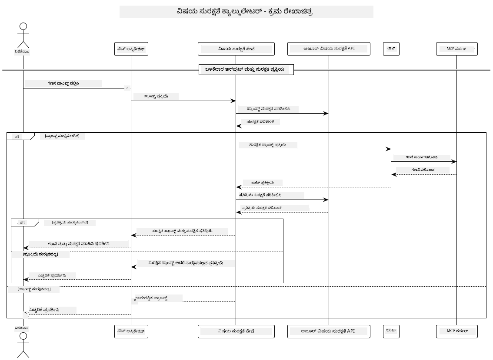

<!--
CO_OP_TRANSLATOR_METADATA:
{
  "original_hash": "e5ea5e7582f70008ea9bec3b3820f20a",
  "translation_date": "2025-12-11T16:39:32+00:00",
  "source_file": "04-PracticalImplementation/samples/java/containerapp/README.md",
  "language_code": "kn"
}
-->
## ಸಿಸ್ಟಮ್ ವಾಸ್ತುಶಿಲ್ಪ

ಈ ಯೋಜನೆ ಬಳಕೆದಾರರ ಪ್ರಾಂಪ್ಟ್‌ಗಳನ್ನು ಕ್ಯಾಲ್ಕುಲೇಟರ್ ಸೇವೆಗೆ Model Context Protocol (MCP) ಮೂಲಕ ಕಳುಹಿಸುವ ಮೊದಲು ವಿಷಯ ಸುರಕ್ಷತೆ ಪರಿಶೀಲನೆ ಬಳಸುವ ವೆಬ್ ಅಪ್ಲಿಕೇಶನ್ ಅನ್ನು ಪ್ರದರ್ಶಿಸುತ್ತದೆ.



### ಇದು ಹೇಗೆ ಕೆಲಸ ಮಾಡುತ್ತದೆ

1. **ಬಳಕೆದಾರ ಇನ್‌ಪುಟ್**: ಬಳಕೆದಾರ ವೆಬ್ ಇಂಟರ್ಫೇಸ್‌ನಲ್ಲಿ ಗಣನೆ ಪ್ರಾಂಪ್ಟ್ ಅನ್ನು ನಮೂದಿಸುತ್ತಾರೆ  
2. **ವಿಷಯ ಸುರಕ್ಷತೆ ಪರಿಶೀಲನೆ (ಇನ್‌ಪುಟ್)**: ಪ್ರಾಂಪ್ಟ್ ಅನ್ನು Azure Content Safety API ಮೂಲಕ ವಿಶ್ಲೇಷಿಸಲಾಗುತ್ತದೆ  
3. **ಸುರಕ್ಷತೆ ನಿರ್ಧಾರ (ಇನ್‌ಪುಟ್)**:  
   - ವಿಷಯ ಸುರಕ್ಷಿತವಾಗಿದ್ದರೆ (ಎಲ್ಲಾ ವರ್ಗಗಳಲ್ಲಿ ತೀವ್ರತೆ < 2), ಅದು ಕ್ಯಾಲ್ಕುಲೇಟರ್‌ಗೆ ಮುಂದುವರೆಯುತ್ತದೆ  
   - ವಿಷಯವು ಸಾಧ್ಯತೆಯುಳ್ಳ ಹಾನಿಕರ ಎಂದು ಗುರುತಿಸಿದರೆ, ಪ್ರಕ್ರಿಯೆ ನಿಲ್ಲಿಸಿ ಎಚ್ಚರಿಕೆ ನೀಡುತ್ತದೆ  
4. **ಕ್ಯಾಲ್ಕುಲೇಟರ್ ಸಂಯೋಜನೆ**: ಸುರಕ್ಷಿತ ವಿಷಯವನ್ನು LangChain4j ಪ್ರಕ್ರಿಯೆಗೊಳಿಸುತ್ತದೆ, ಇದು MCP ಕ್ಯಾಲ್ಕುಲೇಟರ್ ಸರ್ವರ್ ಜೊತೆಗೆ ಸಂವಹನ ಮಾಡುತ್ತದೆ  
5. **ವಿಷಯ ಸುರಕ್ಷತೆ ಪರಿಶೀಲನೆ (ಔಟ್‌ಪುಟ್)**: ಬಾಟ್ ಪ್ರತಿಕ್ರಿಯೆಯನ್ನು Azure Content Safety API ಮೂಲಕ ವಿಶ್ಲೇಷಿಸಲಾಗುತ್ತದೆ  
6. **ಸುರಕ್ಷತೆ ನಿರ್ಧಾರ (ಔಟ್‌ಪುಟ್)**:  
   - ಬಾಟ್ ಪ್ರತಿಕ್ರಿಯೆ ಸುರಕ್ಷಿತವಾಗಿದ್ದರೆ, ಅದನ್ನು ಬಳಕೆದಾರರಿಗೆ ತೋರಿಸಲಾಗುತ್ತದೆ  
   - ಬಾಟ್ ಪ್ರತಿಕ್ರಿಯೆ ಸಾಧ್ಯತೆಯುಳ್ಳ ಹಾನಿಕರ ಎಂದು ಗುರುತಿಸಿದರೆ, ಅದನ್ನು ಎಚ್ಚರಿಕೆಯಿಂದ ಬದಲಿಸಲಾಗುತ್ತದೆ  
7. **ಪ್ರತಿಕ್ರಿಯೆ**: ಫಲಿತಾಂಶಗಳು (ಸುರಕ್ಷಿತವಾದರೆ) ಬಳಕೆದಾರರಿಗೆ ಎರಡೂ ಸುರಕ್ಷತೆ ವಿಶ್ಲೇಷಣೆಗಳೊಂದಿಗೆ ಪ್ರದರ್ಶಿಸಲಾಗುತ್ತದೆ

## ಕ್ಯಾಲ್ಕುಲೇಟರ್ ಸೇವೆಗಳೊಂದಿಗೆ Model Context Protocol (MCP) ಬಳಕೆ

ಈ ಯೋಜನೆ LangChain4j ನಿಂದ ಕ್ಯಾಲ್ಕುಲೇಟರ್ MCP ಸೇವೆಗಳನ್ನು ಕರೆ ಮಾಡಲು Model Context Protocol (MCP) ಅನ್ನು ಹೇಗೆ ಬಳಸುವುದು ಎಂಬುದನ್ನು ಪ್ರದರ್ಶಿಸುತ್ತದೆ. ಅನುಷ್ಠಾನವು 8080 ಪೋರ್ಟ್‌ನಲ್ಲಿ ಚಾಲನೆಯಲ್ಲಿರುವ ಸ್ಥಳೀಯ MCP ಸರ್ವರ್ ಅನ್ನು ಬಳಸಿ ಕ್ಯಾಲ್ಕುಲೇಟರ್ ಕಾರ್ಯಾಚರಣೆಗಳನ್ನು ಒದಗಿಸುತ್ತದೆ.

### Azure Content Safety ಸೇವೆಯನ್ನು ಸೆಟ್‌ಅಪ್ ಮಾಡುವುದು

ವಿಷಯ ಸುರಕ್ಷತೆ ವೈಶಿಷ್ಟ್ಯಗಳನ್ನು ಬಳಸುವ ಮೊದಲು, ನೀವು Azure Content Safety ಸೇವಾ ಸಂಪನ್ಮೂಲವನ್ನು ರಚಿಸಬೇಕು:

1. [Azure Portal](https://portal.azure.com) ಗೆ ಸೈನ್ ಇನ್ ಆಗಿ  
2. "Create a resource" ಕ್ಲಿಕ್ ಮಾಡಿ ಮತ್ತು "Content Safety" ಅನ್ನು ಹುಡುಕಿ  
3. "Content Safety" ಆಯ್ಕೆಮಾಡಿ ಮತ್ತು "Create" ಕ್ಲಿಕ್ ಮಾಡಿ  
4. ನಿಮ್ಮ ಸಂಪನ್ಮೂಲಕ್ಕೆ ವಿಶಿಷ್ಟ ಹೆಸರು ನಮೂದಿಸಿ  
5. ನಿಮ್ಮ ಸಬ್ಸ್ಕ್ರಿಪ್ಷನ್ ಮತ್ತು ಸಂಪನ್ಮೂಲ ಗುಂಪನ್ನು ಆಯ್ಕೆಮಾಡಿ (ಅಥವಾ ಹೊಸದನ್ನು ರಚಿಸಿ)  
6. ಬೆಂಬಲಿತ ಪ್ರದೇಶವನ್ನು ಆಯ್ಕೆಮಾಡಿ ([Region availability](https://azure.microsoft.com/en-us/global-infrastructure/services/?products=cognitive-services) ವಿವರಗಳಿಗೆ ಪರಿಶೀಲಿಸಿ)  
7. ಸೂಕ್ತ ಬೆಲೆಮಾಪನ ಮಟ್ಟವನ್ನು ಆಯ್ಕೆಮಾಡಿ  
8. ಸಂಪನ್ಮೂಲವನ್ನು ನಿಯೋಜಿಸಲು "Create" ಕ್ಲಿಕ್ ಮಾಡಿ  
9. ನಿಯೋಜನೆ ಪೂರ್ಣಗೊಂಡ ನಂತರ, "Go to resource" ಕ್ಲಿಕ್ ಮಾಡಿ  
10. ಎಡ ಪ್ಯಾನೆಲ್‌ನಲ್ಲಿ "Resource Management" ಅಡಿಯಲ್ಲಿ "Keys and Endpoint" ಆಯ್ಕೆಮಾಡಿ  
11. ಮುಂದಿನ ಹಂತದಲ್ಲಿ ಬಳಸಲು ಯಾವುದೇ ಒಂದು ಕೀ ಮತ್ತು ಎಂಡ್‌ಪಾಯಿಂಟ್ URL ನಕಲಿಸಿ

### ಪರಿಸರ ಚರಗಳನ್ನು ಸಂರಚಿಸುವುದು

GitHub ಮಾದರಿಗಳ ಪ್ರಾಮಾಣೀಕರಣಕ್ಕಾಗಿ `GITHUB_TOKEN` ಪರಿಸರ ಚರವನ್ನು ಸೆಟ್ ಮಾಡಿ:  
```sh
export GITHUB_TOKEN=<your_github_token>
```
  
ವಿಷಯ ಸುರಕ್ಷತೆ ವೈಶಿಷ್ಟ್ಯಗಳಿಗಾಗಿ, ಸೆಟ್ ಮಾಡಿ:  
```sh
export CONTENT_SAFETY_ENDPOINT=<your_content_safety_endpoint>
export CONTENT_SAFETY_KEY=<your_content_safety_key>
```
  
ಈ ಪರಿಸರ ಚರಗಳನ್ನು ಅಪ್ಲಿಕೇಶನ್ Azure Content Safety ಸೇವೆಯೊಂದಿಗೆ ಪ್ರಾಮಾಣೀಕರಿಸಲು ಬಳಸುತ್ತದೆ. ಈ ಚರಗಳು ಸೆಟ್ ಆಗದಿದ್ದರೆ, ಅಪ್ಲಿಕೇಶನ್ ಪ್ರದರ್ಶನ ಉದ್ದೇಶಕ್ಕಾಗಿ ಪ್ಲೇಸ್‌ಹೋಲ್ಡರ್ ಮೌಲ್ಯಗಳನ್ನು ಬಳಸುತ್ತದೆ, ಆದರೆ ವಿಷಯ ಸುರಕ್ಷತೆ ವೈಶಿಷ್ಟ್ಯಗಳು ಸರಿಯಾಗಿ ಕಾರ್ಯನಿರ್ವಹಿಸುವುದಿಲ್ಲ.

### ಕ್ಯಾಲ್ಕುಲೇಟರ್ MCP ಸರ್ವರ್ ಪ್ರಾರಂಭಿಸುವುದು

ಕ್ಲೈಂಟ್ ಅನ್ನು ಚಾಲನೆ ಮಾಡುವ ಮೊದಲು, ನೀವು localhost:8080 ನಲ್ಲಿ SSE ಮೋಡ್‌ನಲ್ಲಿ ಕ್ಯಾಲ್ಕುಲೇಟರ್ MCP ಸರ್ವರ್ ಅನ್ನು ಪ್ರಾರಂಭಿಸಬೇಕು.

## ಯೋಜನೆ ವಿವರಣೆ

ಈ ಯೋಜನೆ LangChain4j ಜೊತೆಗೆ Model Context Protocol (MCP) ಸಂಯೋಜನೆಯನ್ನು ಪ್ರದರ್ಶಿಸುತ್ತದೆ, ಕ್ಯಾಲ್ಕುಲೇಟರ್ ಸೇವೆಗಳನ್ನು ಕರೆ ಮಾಡಲು. ಪ್ರಮುಖ ವೈಶಿಷ್ಟ್ಯಗಳು:

- MCP ಬಳಸಿ ಮೂಲ ಗಣಿತ ಕಾರ್ಯಾಚರಣೆಗಳಿಗೆ ಕ್ಯಾಲ್ಕುಲೇಟರ್ ಸೇವೆಗೆ ಸಂಪರ್ಕ  
- ಬಳಕೆದಾರರ ಪ್ರಾಂಪ್ಟ್‌ಗಳು ಮತ್ತು ಬಾಟ್ ಪ್ರತಿಕ್ರಿಯೆಗಳ ಮೇಲೆ ದ್ವಿತೀಯ-ಮಟ್ಟದ ವಿಷಯ ಸುರಕ್ಷತೆ ಪರಿಶೀಲನೆ  
- LangChain4j ಮೂಲಕ GitHub ನ gpt-4.1-nano ಮಾದರಿಯೊಂದಿಗೆ ಸಂಯೋಜನೆ  
- MCP ಸಾರಿಗೆಗಾಗಿ Server-Sent Events (SSE) ಬಳಕೆ

## ವಿಷಯ ಸುರಕ್ಷತೆ ಸಂಯೋಜನೆ

ಈ ಯೋಜನೆಯಲ್ಲಿ ಬಳಕೆದಾರರ ಇನ್‌ಪುಟ್‌ಗಳು ಮತ್ತು ಸಿಸ್ಟಮ್ ಪ್ರತಿಕ್ರಿಯೆಗಳು ಹಾನಿಕರ ವಿಷಯದಿಂದ ಮುಕ್ತವಾಗಿರುವುದನ್ನು ಖಚಿತಪಡಿಸಲು ಸಮಗ್ರ ವಿಷಯ ಸುರಕ್ಷತೆ ವೈಶಿಷ್ಟ್ಯಗಳಿವೆ:

1. **ಇನ್‌ಪುಟ್ ಪರಿಶೀಲನೆ**: ಎಲ್ಲಾ ಬಳಕೆದಾರರ ಪ್ರಾಂಪ್ಟ್‌ಗಳನ್ನು ಹೇಟ್ ಸ್ಪೀಚ್, ಹಿಂಸಾಚಾರ, ಸ್ವಯಂ ಹಾನಿ ಮತ್ತು ಲೈಂಗಿಕ ವಿಷಯದಂತಹ ಹಾನಿಕರ ವಿಷಯ ವರ್ಗಗಳಿಗೆ ವಿಶ್ಲೇಷಿಸಲಾಗುತ್ತದೆ.  
2. **ಔಟ್‌ಪುಟ್ ಪರಿಶೀಲನೆ**: ಸಾಧ್ಯತೆಯುಳ್ಳ ಅನಿಯಂತ್ರಿತ ಮಾದರಿಗಳನ್ನು ಬಳಸಿದಾಗಲೂ, ಸಿಸ್ಟಮ್ ಎಲ್ಲಾ ಉತ್ಪನ್ನ ಪ್ರತಿಕ್ರಿಯೆಗಳನ್ನು ಅದೇ ವಿಷಯ ಸುರಕ್ಷತೆ ಫಿಲ್ಟರ್‌ಗಳ ಮೂಲಕ ಪರಿಶೀಲಿಸುತ್ತದೆ ಮತ್ತು ಬಳಕೆದಾರರಿಗೆ ತೋರಿಸುವ ಮೊದಲು.

ಈ ದ್ವಿತೀಯ-ಮಟ್ಟದ ವಿಧಾನವು ಯಾವ AI ಮಾದರಿಯನ್ನು ಬಳಸಲಾಗುತ್ತಿದೆಯೋ ಅದರಿಂದ ಸಿಸ್ಟಮ್ ಸುರಕ್ಷಿತವಾಗಿರಲು ಮತ್ತು ಬಳಕೆದಾರರನ್ನು ಹಾನಿಕರ ಇನ್‌ಪುಟ್‌ಗಳು ಮತ್ತು ಸಾಧ್ಯತೆಯುಳ್ಳ ಸಮಸ್ಯೆ ಉಂಟುಮಾಡುವ AI ಉತ್ಪನ್ನಗಳಿಂದ ರಕ್ಷಿಸುತ್ತದೆ.

## ವೆಬ್ ಕ್ಲೈಂಟ್

ಅಪ್ಲಿಕೇಶನ್ ಬಳಕೆದಾರರ ಸ್ನೇಹಿ ವೆಬ್ ಇಂಟರ್ಫೇಸ್ ಅನ್ನು ಒಳಗೊಂಡಿದೆ, ಇದು ಬಳಕೆದಾರರಿಗೆ Content Safety Calculator ಸಿಸ್ಟಮ್ ಜೊತೆಗೆ ಸಂವಹನ ಮಾಡಲು ಅನುಮತಿಸುತ್ತದೆ:

### ವೆಬ್ ಇಂಟರ್ಫೇಸ್ ವೈಶಿಷ್ಟ್ಯಗಳು

- ಗಣನೆ ಪ್ರಾಂಪ್ಟ್‌ಗಳನ್ನು ನಮೂದಿಸಲು ಸರಳ, ಸುಲಭ ಫಾರ್ಮ್  
- ದ್ವಿತೀಯ-ಮಟ್ಟದ ವಿಷಯ ಸುರಕ್ಷತೆ ಮಾನ್ಯತೆ (ಇನ್‌ಪುಟ್ ಮತ್ತು ಔಟ್‌ಪುಟ್)  
- ಪ್ರಾಂಪ್ಟ್ ಮತ್ತು ಪ್ರತಿಕ್ರಿಯೆಯ ಸುರಕ್ಷತೆ ಕುರಿತು ನೈಜ-ಸಮಯ ಪ್ರತಿಕ್ರಿಯೆ  
- ಸುಲಭ ಅರ್ಥಮಾಡಿಕೊಳ್ಳಲು ಬಣ್ಣ-ಕೋಡ್ ಮಾಡಿದ ಸುರಕ್ಷತೆ ಸೂಚಕಗಳು  
- ವಿವಿಧ ಸಾಧನಗಳಲ್ಲಿ ಕಾರ್ಯನಿರ್ವಹಿಸುವ ಸ್ವಚ್ಛ, ಪ್ರತಿಕ್ರಿಯಾಶೀಲ ವಿನ್ಯಾಸ  
- ಬಳಕೆದಾರರಿಗೆ ಮಾರ್ಗದರ್ಶನ ನೀಡಲು ಉದಾಹರಣೆಯ ಸುರಕ್ಷಿತ ಪ್ರಾಂಪ್ಟ್‌ಗಳು

### ವೆಬ್ ಕ್ಲೈಂಟ್ ಬಳಕೆ

1. ಅಪ್ಲಿಕೇಶನ್ ಪ್ರಾರಂಭಿಸಿ:  
   ```sh
   mvn spring-boot:run
   ```
  
2. ನಿಮ್ಮ ಬ್ರೌಸರ್ ತೆರೆಯಿರಿ ಮತ್ತು `http://localhost:8087` ಗೆ ಹೋಗಿ  

3. ನೀಡಲಾದ ಪಠ್ಯ ಪ್ರದೇಶದಲ್ಲಿ ಗಣನೆ ಪ್ರಾಂಪ್ಟ್ ನಮೂದಿಸಿ (ಉದಾ: "24.5 ಮತ್ತು 17.3 ರ ಮೊತ್ತವನ್ನು ಲೆಕ್ಕಿಸಿ")  

4. ನಿಮ್ಮ ವಿನಂತಿಯನ್ನು ಪ್ರಕ್ರಿಯೆಗೊಳಿಸಲು "Submit" ಕ್ಲಿಕ್ ಮಾಡಿ  

5. ಫಲಿತಾಂಶಗಳನ್ನು ವೀಕ್ಷಿಸಿ, ಇದರಲ್ಲಿ ಸೇರಿರುತ್ತದೆ:  
   - ನಿಮ್ಮ ಪ್ರಾಂಪ್ಟ್‌ನ ವಿಷಯ ಸುರಕ್ಷತೆ ವಿಶ್ಲೇಷಣೆ  
   - ಲೆಕ್ಕಿಸಲಾದ ಫಲಿತಾಂಶ (ಪ್ರಾಂಪ್ಟ್ ಸುರಕ್ಷಿತವಾಗಿದ್ದರೆ)  
   - ಬಾಟ್ ಪ್ರತಿಕ್ರಿಯೆಯ ವಿಷಯ ಸುರಕ್ಷತೆ ವಿಶ್ಲೇಷಣೆ  
   - ಇನ್‌ಪುಟ್ ಅಥವಾ ಔಟ್‌ಪುಟ್ ಯಾವುದೇ ಒಂದು ಗುರುತಿಸಲ್ಪಟ್ಟರೆ ಸುರಕ್ಷತೆ ಎಚ್ಚರಿಕೆಗಳು

ವೆಬ್ ಕ್ಲೈಂಟ್ ಸ್ವಯಂಚಾಲಿತವಾಗಿ ಎರಡೂ ವಿಷಯ ಸುರಕ್ಷತೆ ಪರಿಶೀಲನೆ ಪ್ರಕ್ರಿಯೆಗಳನ್ನು ನಿರ್ವಹಿಸುತ್ತದೆ, ಯಾವ AI ಮಾದರಿಯನ್ನು ಬಳಸಲಾಗುತ್ತಿದೆಯೋ ಅದರಿಂದ ಯಾವುದೇ ವ್ಯತ್ಯಯವಿಲ್ಲದೆ ಎಲ್ಲಾ ಸಂವಹನಗಳು ಸುರಕ್ಷಿತ ಮತ್ತು ಸೂಕ್ತವಾಗಿರಲು ಖಚಿತಪಡಿಸುತ್ತದೆ.

---

<!-- CO-OP TRANSLATOR DISCLAIMER START -->
**ಅಸ್ವೀಕರಣ**:  
ಈ ದಸ್ತಾವೇಜು AI ಅನುವಾದ ಸೇವೆ [Co-op Translator](https://github.com/Azure/co-op-translator) ಬಳಸಿ ಅನುವಾದಿಸಲಾಗಿದೆ. ನಾವು ನಿಖರತೆಯಿಗಾಗಿ ಪ್ರಯತ್ನಿಸುತ್ತಿದ್ದರೂ, ಸ್ವಯಂಚಾಲಿತ ಅನುವಾದಗಳಲ್ಲಿ ದೋಷಗಳು ಅಥವಾ ಅಸತ್ಯತೆಗಳು ಇರಬಹುದು ಎಂದು ದಯವಿಟ್ಟು ಗಮನಿಸಿ. ಮೂಲ ಭಾಷೆಯಲ್ಲಿರುವ ಮೂಲ ದಸ್ತಾವೇಜನ್ನು ಅಧಿಕೃತ ಮೂಲವೆಂದು ಪರಿಗಣಿಸಬೇಕು. ಮಹತ್ವದ ಮಾಹಿತಿಗಾಗಿ, ವೃತ್ತಿಪರ ಮಾನವ ಅನುವಾದವನ್ನು ಶಿಫಾರಸು ಮಾಡಲಾಗುತ್ತದೆ. ಈ ಅನುವಾದ ಬಳಕೆಯಿಂದ ಉಂಟಾಗುವ ಯಾವುದೇ ತಪ್ಪು ಅರ್ಥಮಾಡಿಕೊಳ್ಳುವಿಕೆ ಅಥವಾ ತಪ್ಪು ವಿವರಣೆಗಳಿಗೆ ನಾವು ಹೊಣೆಗಾರರಾಗುವುದಿಲ್ಲ.
<!-- CO-OP TRANSLATOR DISCLAIMER END -->