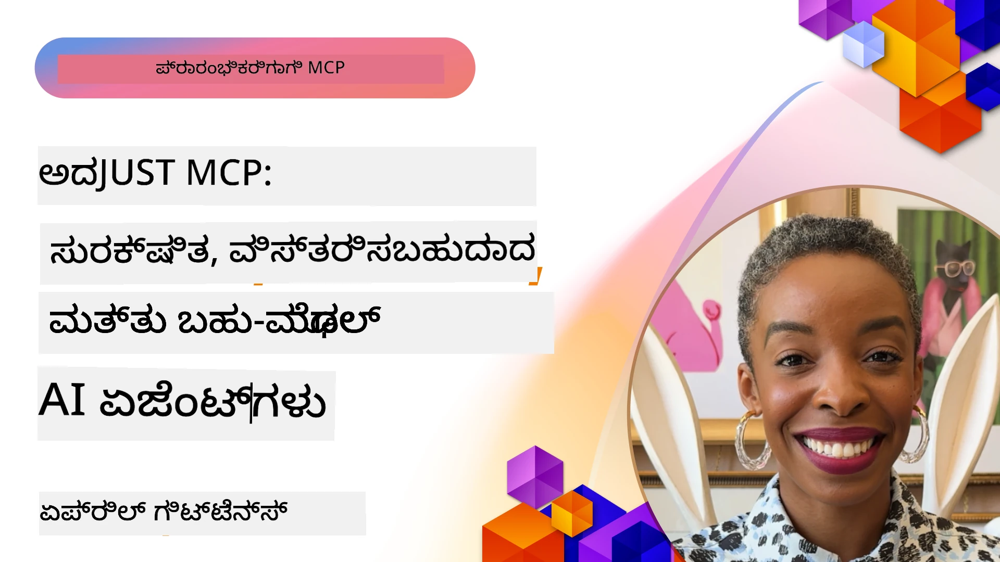

# MCP ನಲ್ಲಿ ಸುಧಾರಿತ ವಿಷಯಗಳು

_(ಈ ಪಾಠದ ವೀಡಿಯೋದರ್ಶನಕ್ಕಾಗಿ ಮೇಲಿನ ಚಿತ್ರದ ಮೇಲೆ ಕ್ಲಿಕ್ ಮಾಡಿ)_

ಈ ಅಧ್ಯಾಯವು ಮಾದರಿ ಸಾಂದರ್ಭಿಕ ಪ್ರೋಟೋಕಾಲ್ (MCP) ಅನುಷ್ಠಾನದಲ್ಲಿ ಬಹು-ಮೋಡ್ ಇಂಟಿಗ್ರೇಷನ್, ಪ್ರಮಾಣನವರ್ಧನೆ, ಸುರಕ್ಷತೆ ಉತ್ತಮ ಅಭ್ಯಾಸಗಳು ಮತ್ತು ಎಂಟರ್‌ಪ್ರೈಸ್ ಇಂಟಿಗ್ರೇಷನ್ ಸೇರಿದಂತೆ ಹಲವು ಸುಧಾರಿತ ವಿಷಯಗಳನ್ನು ಒಳಗೊಂಡಿದೆ. ಆಧುನಿಕ AI ವ್ಯವಸ್ಥೆಗಳ ಬೇಡಿಕೆಗಳನ್ನು ಪೂರೈಸಲು ಶಕ್ತಿಶಾಲಿ ಮತ್ತು ಉತ್ಪಾದನೆಗೆ ತಯಾರಾದ MCP ಅಪ್ಲಿಕೇಶನ್‌ಗಳನ್ನು ನಿರ್ಮಿಸಲು ಈ ವಿಷಯಗಳು ಅತ್ಯವಶ್ಯಕ.

## ಅವಲೋಕನ

ಈ ಪಾಠವು ಮಾದರಿ ಸಾಂದರ್ಭಿಕ ಪ್ರೋಟೋಕಾಲ್ ಅನುಷ್ಠಾನದಲ್ಲಿ ಸುಧಾರಿತ ಕಲ್ಪನೆಗಳನ್ನು ಅನ್ವೇಷಿಸುತ್ತದೆ, ಮುಖ್ಯವಾಗಿ ಬಹು-ಮೋಡ್ ಇಂಟಿಗ್ರೇಷನ್, ಪ್ರಮಾಣನವರ್ಧನೆ, ಸುರಕ್ಷತೆ ಉತ್ತಮ ಅಭ್ಯಾಸಗಳು ಮತ್ತು ಎಂಟರ್‌ಪ್ರೈಸ್ ಇಂಟಿಗ್ರೇಷನ್. ಸಂಕೀರ್ಣ ಅಗತ್ಯಗಳನ್ನು ನಿರ್ವಹಿಸಲು ಉತ್ಪಾದನಾ ಗ್ರೇಡ್ MCP ಅಪ್ಲಿಕೇಶನ್‌ಗಳನ್ನು ನಿರ್ಮಿಸುವುದು ಈ ವಿಷಯಗಳ ಮುಖ್ಯ ಉದ್ದೇಶ.

## ಕಲಿಕೆ ಗುರಿಗಳು

ಈ ಪಾಠದ ಮುಕ್ತಾಯದವರೆಗೆ, ನೀವು ಇವುಗಳನ್ನು ಮಾಡಲು ಸಮರ್ಥರಾಗಿರುತ್ತೀರಿ:

- MCP ರೂಪರೇಖೆಗಳ ಒಳಗೆ ಬಹು-ಮೋಡ್ ಸಾಮರ್ಥ್ಯಗಳನ್ನು ಅನುಷ್ಠಾನಗೊಳಿಸು
- ಹೆಚ್ಚಿನ ಬೇಡಿಕೆಯ ಸನ್ನಿವೇಶಗಳಿಗೆ ಪ್ರಮಾಣನವರ್ಧಿತ MCP ವಾಸ್ತುಶಿಲ್ಪವನ್ನು ವಿನ್ಯಾಸ ಮಾಡು
- MCP ನ ಸುರಕ್ಷತಾ ತತ್ವಗಳಿಗೆ ಅನುಗುಣವಾಗಿ ಸುರಕ್ಷತೆ ಉತ್ತಮ ಅಭ್ಯಾಸಗಳನ್ನು ಅನ್ವಯಿಸು
- MCPನ್ನು ಎಂಟರ್‌ಪ್ರೈಸ್ AI ವ್ಯವಸ್ಥೆಗಳ ಹಾಗೂ ರೂಪರೇಖೆಗಳೊಂದಿಗೆ ಕಲವಣೆ ಮಾಡು
- ಉತ್ಪಾದನೆಯ ಪರಿಸರದಲ್ಲಿ ಕಾರ್ಯಕ್ಷಮತೆ ಮತ್ತು ವಿಶ್ವಾಸಾರ್ಹತೆಯನ್ನು ಗರಿಷ್ಠಗೊಳಿಸು

## ಪಾಠಗಳು ಮತ್ತು ಮಾದರಿ ಪ್ರಾಜೆಕ್ಟುಗಳು

| ಲಿಂಕ್ | ಶೀರ್ಷಿಕೆ | ವಿವರಣೆ |
|------|-------|-------------|
| [5.1 Azure ನೊಂದಿಗೆ ಏಕೀಕರಣ](./mcp-integration/README.md) | Azure ನೊಂದಿಗೆ ಏಕೀಕರಿಸಿ | ನಿಮ್ಮ MCP ಸರ್ವರ್ ಅನ್ನು Azure ನಲ್ಲಿ ಏಕೀಕರಿಸುವ ವಿಧಾನವನ್ನು ಕಲಿಯಿರಿ |
| [5.2 ಬಹು-ಮೋಡ್ ಮಾದರಿ](./mcp-multi-modality/README.md) | MCP ಬಹು-ಮೋಡ್ ಮಾದರಿಗಳು | ಧ್ವನಿ, ಚಿತ್ರ ಮತ್ತು ಬಹು-ಮೋಡ್ ಪ್ರತಿಕ್ರಿಯೆಗಳ ಮಾದರಿಗಳು |
| [5.3 MCP OAuth2 ಮಾದರಿ](../../../05-AdvancedTopics/mcp-oauth2-demo) | MCP OAuth2 ಪ್ರದರ್ಶನ | MCP ಜೊತೆ OAuth2 ಅನ್ನು ನಿರ್ದಿಷ್ಟಪಡಿಸುವ ಸಲ್ಪಸ್ವರೂಪ ಸ್ಪ್ರಿಂಗ್ ಬೂಟ್ ಅಪ್ಲಿಕೇಶನ್, ಪ್ರಾಧಿಕಾರ ಮತ್ತು ಸಂಪನ್ಮೂಲ ಸರ್ವರ್‌ಗಳಾಗಿ. ಸುರಕ್ಷಿತ ಟೋಕನ್ ಜಾರಿ, ರಕ್ಷಿತ ಎಂಡ್ಪಾಯಿಂಟ್‌ಗಳು, Azure ಕಂಟೇನರ್ ಅಪ್ಲಿಕೆಷನ್ಗಳ ನಿರ್ವಹಣೆ ಮತ್ತು API ನಿರ್ವಹಣೆಯ ಸ್ನೇಹಪೂರ್ಣ ಅನುಷ್ಠಾನ. |
| [5.4 ರೂಟ್ ಸಾಂದರ್ಭಗಳು](./mcp-root-contexts/README.md) | ರೂಟ್ ಸಾಂದರ್ಭಗಳು | ರೂಟ್ ಸಾಂದರ್ಭಗಳ ಬಗ್ಗೆ ಮತ್ತು ಅವುಗಳನ್ನು ಅನುಷ್ಠಾನಗೊಳಿಸುವುದನ್ನು ತಿಳಿದುಕೊಳ್ಳಿ |
| [5.5 ಮಾರ್ಗನಿರ್ದೇಶನ](./mcp-routing/README.md) | ಮಾರ್ಗನಿರ್ದೇಶನ | ವಿವಿಧ ರೀತಿಯ ಮಾರ್ಗನಿರ್ದೇಶನಗಳನ್ನು ಕಲಿಯಿರಿ |
| [5.6 ಸಂಪ್ರದಾಯ ಪ್ರಕ್ರಿಯೆ](./mcp-sampling/README.md) | ಸಂಪ್ರದಾಯ ಮಾಡುವುದು | ಸಂಪ್ರದಾಯ ಪ್ರಕ್ರಿಯೆಯೊಂದಿಗೆ ಕಾರ್ಯನಿರ್ವಹಿಸುವುದನ್ನು ಕಲಿಯಿರಿ |
| [5.7 ಪ್ರಮಾಣನವರ್ಧನೆ](./mcp-scaling/README.md) | ಪ್ರಮಾಣನವರ್ಧನೆ | ಪ್ರಮಾಣನವರ್ಧನೆ ಬಗ್ಗೆ ತಿಳಿದುಕೊಳ್ಳಿ |
| [5.8 ಸುರಕ್ಷತೆ](./mcp-security/README.md) | ಸುರಕ್ಷತೆ | ನಿಮ್ಮ MCP ಸರ್ವರ್ ಅನ್ನು ಸುರಕ್ಷಿತವಾಗಿಡಿ |
| [5.9 ವೆಬ್ ಶೋಧನಾ ಮಾದರಿ](./web-search-mcp/README.md) | ವೆಬ್ ಶೋಧನಾ MCP | Python MCP ಸರ್ವರ್ ಮತ್ತು ಕ್ಲೈಯಂಟ್ SerpAPI ನೊಂದಿಗೆ ರಿಯಲ್-ಟೈಮ್ ವೆಬ್, ಸುದ್ದಿ, ಉತ್ಪನ್ನ ಶೋಧನೆ ಮತ್ತು ಪ್ರಶ್ನೋತ್ತರಗಳಿಗಾಗಿ ಏಕೀಕೃತ. ಬಹು-ಉಪಕರಣ ಸಂಯೋಜನೆ, ಬಾಹ್ಯ API ಏಕೀಕರಣ ಮತ್ತು ದೃಢವಾದ ದೋಷ ನಿರ್ವಹಣೆಯ ತೋರಣ. |
| [5.10 ರಿಯಲ್‌ಟೈಮ್ ಸ್ಟ್ರೀಮಿಂಗ್](./mcp-realtimestreaming/README.md) | ಸ್ಟ್ರೀಮಿಂಗ್ | ಇಂದು ಡೇಟಾ ಚಾಲಿತ ಜಗತ್ತಿನಲ್ಲಿ ಉದ್ಯಮಗಳು ಮತ್ತು ಅಪ್ಲಿಕೇಶನ್‌ಗಳಿಗೆ ತಕ್ಷಣ ಮಾಹಿತಿಗೆ ಪ್ರವೇಶ ಅಗತ್ಯವಿದೆ, ಆದ್ದರಿಂದ ರಿಯಲ್-ಟೈಮ್ ಡೇಟಾ ಸ್ಟ್ರೀಮಿಂಗ್ ಅನಿವಾರ್ಯವಾಗಿದೆ. |
| [5.11 ರಿಯಲ್‌ಟೈಮ್ ವೆಬ್ ಶೋಧನೆ](./mcp-realtimesearch/README.md) | ವೆಬ್ ಶೋಧನೆ | ರಿಯಲ್-ಟೈಮ್ ವೆಬ್ ಶೋಧನೆ ಎಐ ಮಾದರಿಗಳು, ಶೋಧ ಯಂತ್ರಗಳು ಮತ್ತು ಅಪ್ಲಿಕೇಶನ್‌ಗಳ ಸಾಂದರ್ಭ ನಿರ್ವಹಣೆಗೆ ಮಾನಕೀಕೃತ ವಿಧಾನ ಒದಗಿಸುವ ಮೂಲಕ MCP ಹೇಗೆ ಪರಿವರ್ತಿಸುತ್ತದೆ. |
| [5.12 ಮಾದರಿ ಸಾಂದರ್ಭಿಕ ಪ್ರೋಟೋಕಾಲ್ ಸರ್ವರ್‌ಗಳಿಗೆ Entra ID ಪ್ರಮಾಣೀಕರಣ](./mcp-security-entra/README.md) | Entra ID ಪ್ರಮಾಣೀಕರಣ | ಮೈಕ್ರೋಸಾಫ್ಟ್ Entra ID ದೃಢವಾದ ಕ್ಲೌಡ್ ಆಧಾರಿತ ಐಡೆಂಟಿಟಿ ಮತ್ತು ಪ್ರವೇಶ ನಿರ್ವಹಣೆ ಪರಿಹಾರ ಒದಗಿಸುತ್ತದೆ, ಇದು ಕೇವಲಅನುಮೋದಿತ ಬಳಕೆದಾರರು ಮತ್ತು ಅಪ್ಲಿಕೇಶನ್‌ಗಳು ನಿಮ್ಮ MCP ಸರ್ವರ್ ಜೊತೆಗೆ ಸಂಪರ್ಕ ಹೊಂದಲು ಸಹಾಯ ಮಾಡುತ್ತದೆ. |
| [5.13 Azure AI Foundry ಏಜೆಂಟ್ ಏಕೀಕರಣ](./mcp-foundry-agent-integration/README.md) | Azure AI Foundry ಏಕೀಕರಣ | ಮಾದರಿ ಸಾಂದರ್ಭಿಕ ಪ್ರೋಟೋಕಾಲ್ ಸರ್ವರ್‌ಗಳನ್ನು Azure AI Foundry ಏಜೆಂಟ್‌ಗಳೊಂದಿಗೆ ಏಕೀಕರಿಸಲು ಕಲಿಯಿರಿ, ಶಕ್ತಿಶಾಲಿ ಉಪಕರಣ ಸಂಯೋಜನೆ ಮತ್ತು ಎಂಟರ್‌ಪ್ರೈಸ್ AI ಸಾಮರ್ಥ್ಯಗಳನ್ನು ಮಾನಕೀಕೃತ ಬಾಹ್ಯ ಡೇಟಾ ಮೂಲದ ಸಂಪರ್ಕಗಳೊಂದಿಗೆ ಸಕ್ರಿಯಗೊಳಿಸುತ್ತದೆ. |
| [5.14 ಸಾಂದರ್ಭಿಕ ಇಂಜಿನಿಯರಿಂಗ್](./mcp-contextengineering/README.md) | ಸಾಂದರ್ಭಿಕ ಇಂಜಿನಿಯರಿಂಗ್ | MCP ಸರ್ವರ್‌ಗಳಿಗಾಗಿ ಸಾಂದರ್ಭಿಕ ಇಂಜಿನಿಯರಿಂಗ್ ತಂತ್ರಗಳನ್ನು ಭವಿಷ್ಯದ ಅವಕಾಶ, ಇದರಲ್ಲಿ ಸಾಂದರ್ಭಿಕ ಗರಿಷ್ಠೀಕರಣ, ಪ್ರೇರಣಾತ್ಮಕ ಸಾಂದರ್ಭಿಕ ನಿರ್ವಹಣೆ ಮತ್ತು MCP ರೂಪರೇಖೆಗಳಲ್ಲಿ ಪರಿಣಾಮಕಾರಿ ಪ್ರಾಂಪ್ಟ್ ಇಂಜಿನಿಯರಿಂಗ್ ತಂತ್ರಗಳು ಸೇರಿವೆ. |
| [5.15 MCP ಕಸ್ಟಮ್ ಸಂಚಾರ](./mcp-transport/README.md) | ಕಸ್ಟಮ್ ಸಂಚಾರ | ವಿಶೇಷ MCP ಸಂವಹನ ಸನ್ನಿವೇಶಗಳಿಗೆ ಕಸ್ಟಮ್ ಸಂಚಾರ ಯಂತ್ರಗಳನ್ನು ಅನುಷ್ಠಾನಗೊಳಿಸುವ ವಿಧಾನವನ್ನು ಕಲಿಯಿರಿ. |
| [5.16 ಪ್ರೋಟೋಕಾಲ್ ವೈಶಿಷ್ಟ್ಯಗಳ ಡೀಪ್ ಡೈವ್](./mcp-protocol-features/README.md) | ಪ್ರೋಟೋಕಾಲ್ ವೈಶಿಷ್ಟ್ಯಗಳು | ಪ್ರಗತಿ ಸೂಚನೆಗಳು, ವಿನಂತಿ ರದ್ದುಪಡಿಸುವಿಕೆ, ಸಂಪನ್ಮೂಲ ಟೆಂಪ್ಲೇಟುಗಳು ಮತ್ತು ದೋಷ ನಿರ್ವಹಣೆಯ ಮಾದರಿಗಳನ್ನು ಒಳಗೊಂಡ ಸುಧಾರಿತ ಪ್ರೋಟೋಕಾಲ್ ವೈಶಿಷ್ಟ್ಯಗಳನ್ನು ಮುಗ್ಧರಾಗಿ ತಿಳಿದುಕೊಳ್ಳಿ. |

> **MCP ವಿಶೇಷಣ 2025-11-25 ರಲ್ಲಿ ಹೊಸದು**: ಈಗ ವಿಶೇಷಣವು ಪ್ರಯೋಗಾತ್ಮಕ ಬೆಂಬಲವನ್ನು ಸೇರಿಸಿದೆ **ಕಾರ್ಯಗಳಿಗೆ** (ಪ್ರಗತಿ ಹಾದಳಿಕೆ ಅಗಲಿದ ದೀರ್ಘಕಾಲದ ಕಾರ್ಯಗಳು), **ಉಪಕರಣ ಟಿಪ್ಪಣಿಗಳು** (ಭದ್ರತೆಗಾಗಿ ಉಪಕರಣ ವರ್ತನೆಯ ಮೆಟಾಡೇಟಾ), **URL ಮೋಡ್ ಪ್ರೇರಣೆ** (ಗ್ರಾಹಕರಿಂದ ನಿರ್ದಿಷ್ಟ URL ವಿಷಯವನ್ನು ಕೇಳುವುದು), ಮತ್ತು ಸುಧಾರಿತ **ರೂಟ್‌ಗಳು** (ಕಾರ्यालय ಸಾಂದರ್ಭ ನಿರ್ವಹಣೆಗಾಗಿ). ಪೂರ್ಣ ವಿವರಗಳಿಗೆ [MCP ವಿಶೇಷಣ ಬದಲಾವಣಾ ದಾಖಲೆ](https://spec.modelcontextprotocol.io/) ನೋಡಿ.

## ಹೆಚ್ಚುವರಿ ಉಲ್ಲೇಖಗಳು

ಸುಧಾರಿತ MCP ವಿಷಯಗಳ ನವೀಕೃತ ಮಾಹಿತಿಗಾಗಿ ನೋಡಿ:
- [MCP ದಾಖಲಾತಿ](https://modelcontextprotocol.io/)
- [MCP ವಿಶೇಷಣ (2025-11-25)](https://spec.modelcontextprotocol.io/specification/2025-11-25/)
- [GitHub ಸಂಗ್ರಹಣೆ](https://github.com/modelcontextprotocol)
- [OWASP MCP ಮಧ್ಯಮ ಶ್ರೇಣಿ 10](https://microsoft.github.io/mcp-azure-security-guide/mcp/) - ಸುರಕ್ಷತಾ ಅಪಾಯಗಳು ಮತ್ತು ತಡೆಗಟ್ಟುವಿಕೆಗಳು
- [MCP ಸುರಕ್ಷತಾ ಶಿಖರಣ ಶಿಬಿರ (ಶೆರ್ಪಾ)](https://azure-samples.github.io/sherpa/) - ಕೈಲಾಸಿಕ ಸುರಕ್ಷತಾ ತರಬೇತಿ

## ಪ್ರಮುಖ ತಿಳಿವಳಿಕೆಗಳು

- ಬಹು-ಮೋಡ್ MCP ಅನುಷ್ಠಾನಗಳು ಪಠ್ಯದ ಪ್ರಕ್ರಿಯೆಗಿಂತ ಹೆಚ್ಚಿನ AI ಸಾಮರ್ಥ್ಯಗಳನ್ನು ವಿಸ್ತರಿಸುತ್ತವೆ
- ಪ್ರಮಾಣನವರ್ಧನೆ ಎಂಟರ್‌ಪ್ರೈಸ್ ವಿತರಣೆಗೆ ಅವಶ್ಯಕ ಮತ್ತು ಗದಿ ಹಾಗೂ ಲಂಬ ಪ್ರಮಾಣನವರ್ಧನೆಯ ಮೂಲಕ ಸಾಧ್ಯ
- ಸಮಗ್ರ ಸುರಕ್ಷತಾ ಕ್ರಮಗಳು ಡೇಟಾವನ್ನು ರಕ್ಷಿಸುತ್ತವೆ ಮತ್ತು ಸೂಕ್ತ ಪ್ರವೇಶ ನಿಯಂತ್ರಣವನ್ನು ಖಚಿತಪಡಿಸುತ್ತವೆ
- Azure OpenAI ಮತ್ತು Microsoft AI Foundry ಸೇರಿದಂತೆ ವೇದಿಕೆಗಳೊಡನೆ ಎಂಟರ್‌ಪ್ರೈಸ್ ಏಕೀಕರಣ MCP ಸಾಮರ್ಥ್ಯಗಳನ್ನು ವರ್ಧಿಸುತ್ತದೆ
- ಸುಧಾರಿತ MCP ಅನುಷ್ಠಾನಗಳು ಪರಿಷ್ಕೃತ ವಾಸ್ತುಶಿಲ್ಪ ಮತ್ತು ಜಾಗರೂಕ ಸಂಪನ್ಮೂಲ ನಿರ್ವಹಣೆಯಿಂದ ಲಾಭ ಪಡೆಯುತ್ತವೆ

## ವ್ಯಾಯಾಮ

ನಿರ್ದಿಷ್ಟ ಬಳಕೆಗಾಗಿ ಏಂಟರ್‌ಪ್ರೈಸ್-ಗ್ರೇಡ್ MCP ಅನುಷ್ಠಾನವನ್ನು ವಿನ್ಯಾಸಮಾಡಿ:

1. ನಿಮ್ಮ ಬಳಕೆಗಾಗಿ ಬಹು-ಮೋಡ್ ಅಗತ್ಯಗಳನ್ನು ಗುರುತಿಸಿ
2. ಸಂವೇದನಶೀಲ ಡೇಟಾವನ್ನು ರಕ್ಷಿಸಲು ಅಗತ್ಯವಾದ ಸುರಕ್ಷತಾ ನಿಯಂತ್ರಣಗಳನ್ನು ವಿವರಿಸಿ
3. ಬದಲಾಗುವ ಬಾರಿಕೆಗೆ ತಕ್ಕ ಪ್ರಮಾಣನವರ್ಧಿತ ವಾಸ್ತುಶಿಲ್ಪವನ್ನು ವಿನ್ಯಾಸಮಾಡಿ
4. ಎಂಟರ್‌ಪ್ರೈಸ್ AI ವ್ಯವಸ್ಥೆಗಳೊಂದಿಗೆ ಏಕೀಕರಣ ಬಿಂದುವನ್ನು ಯೋಜಿಸಿ
5. ಸಾಧ್ಯವಿರುವ ಕಾರ್ಯಕ್ಷಮತೆಯ ತೊಂದರೆ ಮತ್ತು ತಡೆಗಟ್ಟುವ ತಂತ್ರಗಳನ್ನು ದಾಖಲಿಸಿ

## ಹೆಚ್ಚುವರಿ ಸಂಪನ್ಮೂಲಗಳು

- [Azure OpenAI ದಾಖಲೆ](https://learn.microsoft.com/en-us/azure/ai-services/openai/)
- [Microsoft AI Foundry ದಾಖಲೆ](https://learn.microsoft.com/en-us/ai-services/)

---

## ಮುಂದೇನು?

ಈ ಘಟಕದಲ್ಲಿನ ಪಾಠಗಳನ್ನು ಅನ್ವೇಷಿಸಿ ಪ್ರಾರಂಭಿಸಿ: [5.1 MCP ಏಕೀಕರಣ](./mcp-integration/README.md)

ಈ ಘಟಕವನ್ನು ಮುಗಿಸಿದ ನಂತರ ಮುಂದುವರಿಯಿರಿ: [ಘಟಕ 6: ಸಮುದಾಯ ಕೊಡುಗೆಗಳು](../06-CommunityContributions/README.md)

---

<!-- CO-OP TRANSLATOR DISCLAIMER START -->
**ಅಸ್ವೀಕಾರಣೆ**:  
ಈ ದಾಖಲೆಯನ್ನು AI ಅನುವಾದ ಸೇವೆಯಾದ [ಕೋ-ഓಪ್ ಅನುವಾದಕ](https://github.com/Azure/co-op-translator) ಬಳಸಿ ಅನುವದಿಸಲಾಗಿದೆ. ನಾವು ನಿಖರತೆಗೆ ಯತ್ನಿಸಿದರೂ, ಸ್ವಯಂಚಾಲಿತ ಅನುವಾದಗಳಲ್ಲಿ ತಪ್ಪುಗಳು ಅಥವಾ ಅಸಮರ್ಥತೆಗಳು ಇರಬಹುದಾಗಿದೆ ಎಂಬುದು ಜಾಗರೂಕರಾಗಿರಲಿ. ಮೂಲ ಭಾಷೆಯ ಮೂಲ ದಾಖಲೆ ನಿರ್ಣಾಯಕ ಮೂಲವೆಂದು ಪರಿಗಣಿಸಬೇಕು. ಗಂಭೀರ ಮಾಹಿತಿಗಾಗಿ ವೃತ್ತಿಪರ ಮಾನವ ಅನುವಾದವನ್ನು ಶಿಫಾರಸು ಮಾಡಲಾಗುತ್ತದೆ. ಈ ಅನುವಾದ ಬಳಕೆಯಿಂದ ಉಂಟಾಗುವ ಯಾವುದೇ ತಪ್ಪು түсಿಸುವಿಕೆಗಳು ಅಥವಾ ಭ್ರಾಂತಿಗೆ ನಾವು ಜವಾಬ್ದಾರಿಯಲ್ಲ.
<!-- CO-OP TRANSLATOR DISCLAIMER END -->