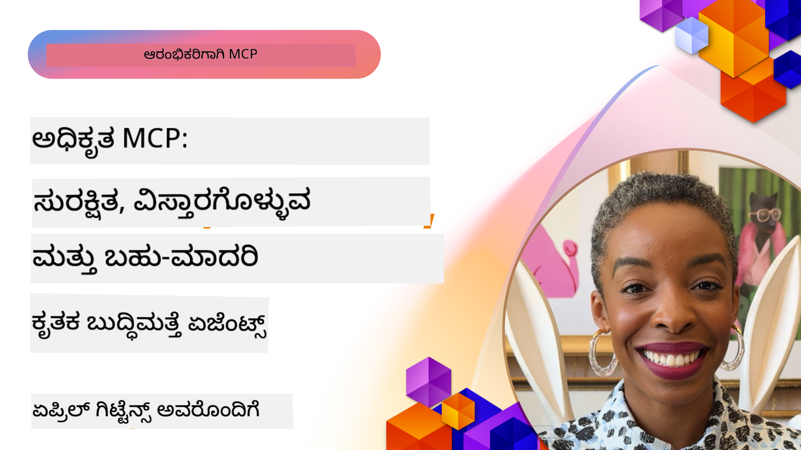

<!--
CO_OP_TRANSLATOR_METADATA:
{
  "original_hash": "d204bc94ea6027d06a703b21b711ca57",
  "translation_date": "2025-12-11T10:59:42+00:00",
  "source_file": "05-AdvancedTopics/README.md",
  "language_code": "kn"
}
-->
# MCP ನಲ್ಲಿ ಉನ್ನತ ವಿಷಯಗಳು

_(ಈ ಪಾಠದ ವೀಡಿಯೋವನ್ನು ನೋಡಲು ಮೇಲಿನ ಚಿತ್ರವನ್ನು ಕ್ಲಿಕ್ ಮಾಡಿ)_

ಈ ಅಧ್ಯಾಯವು ಮಾದರಿ ಸಾಂದರ್ಭಿಕ ಪ್ರೋಟೋಕಾಲ್ (MCP) ಅನುಷ್ಠಾನದಲ್ಲಿ ಬಹು-ಮೋಡಲ್ ಏಕೀಕರಣ, ವಿಸ್ತಾರಗೊಳ್ಳುವಿಕೆ, ಸುರಕ್ಷತೆ ಉತ್ತಮ ಅಭ್ಯಾಸಗಳು ಮತ್ತು ಎಂಟರ್‌ಪ್ರೈಸ್ ಏಕೀಕರಣ ಸೇರಿದಂತೆ ಉನ್ನತ ವಿಷಯಗಳ ಸರಣಿಯನ್ನು ಒಳಗೊಂಡಿದೆ. ಈ ವಿಷಯಗಳು ಆಧುನಿಕ AI ವ್ಯವಸ್ಥೆಗಳ ಬೇಡಿಕೆಗಳನ್ನು ಪೂರೈಸಲು ಶಕ್ತಿಶಾಲಿ ಮತ್ತು ಉತ್ಪಾದನಾ-ಸಿದ್ಧ MCP ಅಪ್ಲಿಕೇಶನ್‌ಗಳನ್ನು ನಿರ್ಮಿಸಲು ಅತ್ಯಾವಶ್ಯಕವಾಗಿವೆ.

## ಅವಲೋಕನ

ಈ ಪಾಠವು ಮಾದರಿ ಸಾಂದರ್ಭಿಕ ಪ್ರೋಟೋಕಾಲ್ ಅನುಷ್ಠಾನದಲ್ಲಿ ಉನ್ನತ ತತ್ವಗಳನ್ನು ಅನ್ವೇಷಿಸುತ್ತದೆ, ಬಹು-ಮೋಡಲ್ ಏಕೀಕರಣ, ವಿಸ್ತಾರಗೊಳ್ಳುವಿಕೆ, ಸುರಕ್ಷತೆ ಉತ್ತಮ ಅಭ್ಯಾಸಗಳು ಮತ್ತು ಎಂಟರ್‌ಪ್ರೈಸ್ ಏಕೀಕರಣದ ಮೇಲೆ ಕೇಂದ್ರೀಕರಿಸುತ್ತದೆ. ಈ ವಿಷಯಗಳು ಎಂಟರ್‌ಪ್ರೈಸ್ ಪರಿಸರಗಳಲ್ಲಿ ಸಂಕೀರ್ಣ ಅಗತ್ಯಗಳನ್ನು ನಿರ್ವಹಿಸಲು ಉತ್ಪಾದನಾ-ಮಟ್ಟದ MCP ಅಪ್ಲಿಕೇಶನ್‌ಗಳನ್ನು ನಿರ್ಮಿಸಲು ಅಗತ್ಯವಿದೆ.

## ಕಲಿಕೆಯ ಉದ್ದೇಶಗಳು

ಈ ಪಾಠದ ಅಂತ್ಯಕ್ಕೆ, ನೀವು ಸಾಧ್ಯವಾಗುವುದು:

- MCP ಫ್ರೇಮ್ವರ್ಕ್‌ಗಳಲ್ಲಿ ಬಹು-ಮೋಡಲ್ ಸಾಮರ್ಥ್ಯಗಳನ್ನು ಅನುಷ್ಠಾನಗೊಳಿಸುವುದು
- ಹೆಚ್ಚಿನ ಬೇಡಿಕೆಗಳ ಸಂದರ್ಭಗಳಿಗೆ ವಿಸ್ತಾರಗೊಳ್ಳುವ MCP ವಾಸ್ತುಶಿಲ್ಪಗಳನ್ನು ವಿನ್ಯಾಸಗೊಳಿಸುವುದು
- MCP ನ ಸುರಕ್ಷತಾ ತತ್ವಗಳಿಗೆ ಅನುಗುಣವಾಗಿ ಸುರಕ್ಷತೆ ಉತ್ತಮ ಅಭ್ಯಾಸಗಳನ್ನು ಅನ್ವಯಿಸುವುದು
- MCP ಅನ್ನು ಎಂಟರ್‌ಪ್ರೈಸ್ AI ವ್ಯವಸ್ಥೆಗಳು ಮತ್ತು ಫ್ರೇಮ್ವರ್ಕ್‌ಗಳೊಂದಿಗೆ ಏಕೀಕರಿಸುವುದು
- ಉತ್ಪಾದನಾ ಪರಿಸರಗಳಲ್ಲಿ ಕಾರ್ಯಕ್ಷಮತೆ ಮತ್ತು ವಿಶ್ವಾಸಾರ್ಹತೆಯನ್ನು ಸುಧಾರಿಸುವುದು

## ಪಾಠಗಳು ಮತ್ತು ಮಾದರಿ ಯೋಜನೆಗಳು

| ಲಿಂಕ್ | ಶೀರ್ಷಿಕೆ | ವಿವರಣೆ |
|------|-------|-------------|
| [5.1 Azure ಜೊತೆಗೆ ಏಕೀಕರಣ](./mcp-integration/README.md) | Azure ಜೊತೆಗೆ ಏಕೀಕರಿಸಿ | ನಿಮ್ಮ MCP ಸರ್ವರ್ ಅನ್ನು Azure ನಲ್ಲಿ ಏಕೀಕರಿಸುವ ವಿಧಾನವನ್ನು ಕಲಿಯಿರಿ |
| [5.2 ಬಹು-ಮೋಡಲ್ ಮಾದರಿ](./mcp-multi-modality/README.md) | MCP ಬಹು-ಮೋಡಲ್ ಮಾದರಿಗಳು | ಧ್ವನಿ, ಚಿತ್ರ ಮತ್ತು ಬಹು-ಮೋಡಲ್ ಪ್ರತಿಕ್ರಿಯೆಗಳ ಮಾದರಿಗಳು |
| [5.3 MCP OAuth2 ಮಾದರಿ](../../../05-AdvancedTopics/mcp-oauth2-demo) | MCP OAuth2 ಡೆಮೊ | MCP ಜೊತೆಗೆ OAuth2 ಅನ್ನು ಪ್ರಾತಿನಿಧ್ಯಗೊಳಿಸುವ ಕನಿಷ್ಠ ಸ್ಪ್ರಿಂಗ್ ಬೂಟ್ ಅಪ್ಲಿಕೇಶನ್, ಪ್ರಾಧಿಕಾರ ಮತ್ತು ಸಂಪನ್ಮೂಲ ಸರ್ವರ್ ಎರಡೂ. ಸುರಕ್ಷಿತ ಟೋಕನ್ ನೀಡಿಕೆ, ರಕ್ಷಿತ ಎಂಡ್ಪಾಯಿಂಟ್‌ಗಳು, Azure ಕಂಟೈನರ್ ಅಪ್ಲಿಕೇಶನ್ ನಿಯೋಜನೆ ಮತ್ತು API ನಿರ್ವಹಣೆಯ ಏಕೀಕರಣವನ್ನು ತೋರಿಸುತ್ತದೆ. |
| [5.4 ರೂಟ್ ಸಾಂದರ್ಭಿಕಗಳು](./mcp-root-contexts/README.md) | ರೂಟ್ ಸಾಂದರ್ಭಿಕಗಳು | ರೂಟ್ ಸಾಂದರ್ಭಿಕಗಳ ಬಗ್ಗೆ ಹೆಚ್ಚು ತಿಳಿದುಕೊಳ್ಳಿ ಮತ್ತು ಅವುಗಳನ್ನು ಹೇಗೆ ಅನುಷ್ಠಾನಗೊಳಿಸುವುದು |
| [5.5 ಮಾರ್ಗದರ್ಶನ](./mcp-routing/README.md) | ಮಾರ್ಗದರ್ಶನ | ವಿವಿಧ ರೀತಿಯ ಮಾರ್ಗದರ್ಶನಗಳನ್ನು ಕಲಿಯಿರಿ |
| [5.6 ಮಾದರಿ ಸಂಗ್ರಹಣೆ](./mcp-sampling/README.md) | ಮಾದರಿ ಸಂಗ್ರಹಣೆ | ಮಾದರಿ ಸಂಗ್ರಹಣೆಯೊಂದಿಗೆ ಹೇಗೆ ಕೆಲಸ ಮಾಡುವುದು ಕಲಿಯಿರಿ |
| [5.7 ವಿಸ್ತಾರಗೊಳ್ಳುವಿಕೆ](./mcp-scaling/README.md) | ವಿಸ್ತಾರಗೊಳ್ಳುವಿಕೆ | ವಿಸ್ತಾರಗೊಳ್ಳುವಿಕೆ ಬಗ್ಗೆ ತಿಳಿದುಕೊಳ್ಳಿ |
| [5.8 ಸುರಕ್ಷತೆ](./mcp-security/README.md) | ಸುರಕ್ಷತೆ | ನಿಮ್ಮ MCP ಸರ್ವರ್ ಅನ್ನು ಸುರಕ್ಷಿತಗೊಳಿಸಿ |
| [5.9 ವೆಬ್ ಹುಡುಕಾಟ ಮಾದರಿ](./web-search-mcp/README.md) | ವೆಬ್ ಹುಡುಕಾಟ MCP | Python MCP ಸರ್ವರ್ ಮತ್ತು ಕ್ಲೈಂಟ್ SerpAPI ಜೊತೆಗೆ ಏಕೀಕರಿಸಿ, ನೈಜ ಸಮಯದ ವೆಬ್, ಸುದ್ದಿ, ಉತ್ಪನ್ನ ಹುಡುಕಾಟ ಮತ್ತು ಪ್ರಶ್ನೋತ್ತರಗಳನ್ನು ನಿರ್ವಹಿಸುತ್ತದೆ. ಬಹು-ಉಪಕರಣ ಸಂಯೋಜನೆ, ಬಾಹ್ಯ API ಏಕೀಕರಣ ಮತ್ತು ದೃಢವಾದ ದೋಷ ನಿರ್ವಹಣೆಯನ್ನು ತೋರಿಸುತ್ತದೆ. |
| [5.10 ನೈಜ ಸಮಯದ ಸ್ಟ್ರೀಮಿಂಗ್](./mcp-realtimestreaming/README.md) | ಸ್ಟ್ರೀಮಿಂಗ್ | ನೈಜ ಸಮಯದ ಡೇಟಾ ಸ್ಟ್ರೀಮಿಂಗ್ ಇಂದಿನ ಡೇಟಾ-ಚಾಲಿತ ಜಗತ್ತಿನಲ್ಲಿ ಅತ್ಯಾವಶ್ಯಕವಾಗಿದೆ, ಇಲ್ಲಿ ವ್ಯವಹಾರಗಳು ಮತ್ತು ಅಪ್ಲಿಕೇಶನ್‌ಗಳು ತಕ್ಷಣದ ನಿರ್ಧಾರಗಳನ್ನು ಕೈಗೊಳ್ಳಲು ತಕ್ಷಣದ ಮಾಹಿತಿಗೆ ಅಗತ್ಯವಿದೆ.|
| [5.11 ನೈಜ ಸಮಯದ ವೆಬ್ ಹುಡುಕಾಟ](./mcp-realtimesearch/README.md) | ವೆಬ್ ಹುಡುಕಾಟ | ನೈಜ ಸಮಯದ ವೆಬ್ ಹುಡುಕಾಟದಲ್ಲಿ MCP ಹೇಗೆ AI ಮಾದರಿಗಳು, ಹುಡುಕಾಟ ಎಂಜಿನ್‌ಗಳು ಮತ್ತು ಅಪ್ಲಿಕೇಶನ್‌ಗಳ ನಡುವೆ ಸಾಂದರ್ಭಿಕ ನಿರ್ವಹಣೆಗೆ ಮಾನಕೀಕೃತ ವಿಧಾನವನ್ನು ಒದಗಿಸುವ ಮೂಲಕ ಪರಿವರ್ತಿಸುತ್ತದೆ.|
| [5.12 ಮಾದರಿ ಸಾಂದರ್ಭಿಕ ಪ್ರೋಟೋಕಾಲ್ ಸರ್ವರ್‌ಗಳಿಗೆ Entra ID ಪ್ರಾಮಾಣೀಕರಣ](./mcp-security-entra/README.md) | Entra ID ಪ್ರಾಮಾಣೀಕರಣ | Microsoft Entra ID ಒಂದು ಶಕ್ತಿಶಾಲಿ ಕ್ಲೌಡ್ ಆಧಾರಿತ ಗುರುತು ಮತ್ತು ಪ್ರವೇಶ ನಿರ್ವಹಣಾ ಪರಿಹಾರವನ್ನು ಒದಗಿಸುತ್ತದೆ, ಇದು ಕೇವಲ ಅನುಮತಿಪ್ರಾಪ್ತ ಬಳಕೆದಾರರು ಮತ್ತು ಅಪ್ಲಿಕೇಶನ್‌ಗಳು ನಿಮ್ಮ MCP ಸರ್ವರ್ ಜೊತೆಗೆ ಸಂವಹನ ಮಾಡಬಹುದು ಎಂದು ಖಚಿತಪಡಿಸುತ್ತದೆ.|
| [5.13 Azure AI Foundry ಏಜೆಂಟ್ ಏಕೀಕರಣ](./mcp-foundry-agent-integration/README.md) | Azure AI Foundry ಏಕೀಕರಣ | ಮಾದರಿ ಸಾಂದರ್ಭಿಕ ಪ್ರೋಟೋಕಾಲ್ ಸರ್ವರ್‌ಗಳನ್ನು Azure AI Foundry ಏಜೆಂಟ್‌ಗಳೊಂದಿಗೆ ಏಕೀಕರಿಸುವ ವಿಧಾನವನ್ನು ಕಲಿಯಿರಿ, ಇದು ಶಕ್ತಿಶಾಲಿ ಉಪಕರಣ ಸಂಯೋಜನೆ ಮತ್ತು ಮಾನಕೀಕೃತ ಬಾಹ್ಯ ಡೇಟಾ ಮೂಲ ಸಂಪರ್ಕಗಳೊಂದಿಗೆ ಎಂಟರ್‌ಪ್ರೈಸ್ AI ಸಾಮರ್ಥ್ಯಗಳನ್ನು ಸಕ್ರಿಯಗೊಳಿಸುತ್ತದೆ.|
| [5.14 ಸಾಂದರ್ಭಿಕ ಎಂಜಿನಿಯರಿಂಗ್](./mcp-contextengineering/README.md) | ಸಾಂದರ್ಭಿಕ ಎಂಜಿನಿಯರಿಂಗ್ | MCP ಸರ್ವರ್‌ಗಳಿಗಾಗಿ ಸಾಂದರ್ಭಿಕ ಎಂಜಿನಿಯರಿಂಗ್ ತಂತ್ರಜ್ಞಾನಗಳ ಭವಿಷ್ಯದ ಅವಕಾಶಗಳು, ಇದರಲ್ಲಿ ಸಾಂದರ್ಭಿಕ ಸುಧಾರಣೆ, ಗತಿಶೀಲ ಸಾಂದರ್ಭಿಕ ನಿರ್ವಹಣೆ ಮತ್ತು MCP ಫ್ರೇಮ್ವರ್ಕ್‌ಗಳಲ್ಲಿ ಪರಿಣಾಮಕಾರಿ ಪ್ರಾಂಪ್ಟ್ ಎಂಜಿನಿಯರಿಂಗ್ ತಂತ್ರಗಳು ಸೇರಿವೆ.|

## ಹೆಚ್ಚುವರಿ ಉಲ್ಲೇಖಗಳು

ಉನ್ನತ MCP ವಿಷಯಗಳ ಬಗ್ಗೆ ಅತ್ಯಂತ ನವೀಕೃತ ಮಾಹಿತಿಗಾಗಿ, ನೋಡಿ:
- [MCP ಡಾಕ್ಯುಮೆಂಟೇಶನ್](https://modelcontextprotocol.io/)
- [MCP ನಿರ್ದಿಷ್ಟತೆ](https://spec.modelcontextprotocol.io/)
- [GitHub ಸಂಗ್ರಹಾಲಯ](https://github.com/modelcontextprotocol)

## ಪ್ರಮುಖ ಪಾಠಗಳು

- ಬಹು-ಮೋಡಲ್ MCP ಅನುಷ್ಠಾನಗಳು ಪಠ್ಯ ಪ್ರಕ್ರಿಯೆಗಿಂತ ಮೀರಿದ AI ಸಾಮರ್ಥ್ಯಗಳನ್ನು ವಿಸ್ತರಿಸುತ್ತವೆ
- ವಿಸ್ತಾರಗೊಳ್ಳುವಿಕೆ ಎಂಟರ್‌ಪ್ರೈಸ್ ನಿಯೋಜನೆಗಳಿಗೆ ಅಗತ್ಯ ಮತ್ತು ಅದನ್ನು ಅಡ್ಡ ಮತ್ತು ಲಂಬ ವಿಸ್ತಾರಗೊಳ್ಳುವಿಕೆಯಿಂದ ಪರಿಹರಿಸಬಹುದು
- ಸಮಗ್ರ ಸುರಕ್ಷತಾ ಕ್ರಮಗಳು ಡೇಟಾವನ್ನು ರಕ್ಷಿಸುತ್ತವೆ ಮತ್ತು ಸರಿಯಾದ ಪ್ರವೇಶ ನಿಯಂತ್ರಣವನ್ನು ಖಚಿತಪಡಿಸುತ್ತವೆ
- Azure OpenAI ಮತ್ತು Microsoft AI Foundry ಮುಂತಾದ ವೇದಿಕೆಗಳೊಂದಿಗೆ ಎಂಟರ್‌ಪ್ರೈಸ್ ಏಕೀಕರಣ MCP ಸಾಮರ್ಥ್ಯಗಳನ್ನು ಹೆಚ್ಚಿಸುತ್ತದೆ
- ಉನ್ನತ MCP ಅನುಷ್ಠಾನಗಳು ಸುಧಾರಿತ ವಾಸ್ತುಶಿಲ್ಪಗಳು ಮತ್ತು ಜಾಗರೂಕ ಸಂಪನ್ಮೂಲ ನಿರ್ವಹಣೆಯಿಂದ ಲಾಭ ಪಡೆಯುತ್ತವೆ

## ಅಭ್ಯಾಸ

ನಿರ್ದಿಷ್ಟ ಬಳಕೆ ಪ್ರಕರಣಕ್ಕಾಗಿ ಎಂಟರ್‌ಪ್ರೈಸ್-ಮಟ್ಟದ MCP ಅನುಷ್ಠಾನವನ್ನು ವಿನ್ಯಾಸಗೊಳಿಸಿ:

1. ನಿಮ್ಮ ಬಳಕೆ ಪ್ರಕರಣಕ್ಕಾಗಿ ಬಹು-ಮೋಡಲ್ ಅಗತ್ಯಗಳನ್ನು ಗುರುತಿಸಿ
2. ಸಂವೇದನಶೀಲ ಡೇಟಾವನ್ನು ರಕ್ಷಿಸಲು ಅಗತ್ಯವಿರುವ ಸುರಕ್ಷತಾ ನಿಯಂತ್ರಣಗಳನ್ನು ರೂಪಿಸಿ
3. ಬದಲಾಗುವ ಲೋಡ್ ಅನ್ನು ನಿರ್ವಹಿಸಲು ವಿಸ್ತಾರಗೊಳ್ಳುವ ವಾಸ್ತುಶಿಲ್ಪವನ್ನು ವಿನ್ಯಾಸಗೊಳಿಸಿ
4. ಎಂಟರ್‌ಪ್ರೈಸ್ AI ವ್ಯವಸ್ಥೆಗಳೊಂದಿಗೆ ಏಕೀಕರಣ ಬಿಂದುಗಳನ್ನು ಯೋಜಿಸಿ
5. ಸಾಧ್ಯವಿರುವ ಕಾರ್ಯಕ್ಷಮತೆ ತೊಂದರೆಗಳು ಮತ್ತು ಪರಿಹಾರ ತಂತ್ರಗಳನ್ನು ದಾಖಲೆ ಮಾಡಿರಿ

## ಹೆಚ್ಚುವರಿ ಸಂಪನ್ಮೂಲಗಳು

- [Azure OpenAI ಡಾಕ್ಯುಮೆಂಟೇಶನ್](https://learn.microsoft.com/en-us/azure/ai-services/openai/)
- [Microsoft AI Foundry ಡಾಕ್ಯುಮೆಂಟೇಶನ್](https://learn.microsoft.com/en-us/ai-services/)

---

## ಮುಂದೇನು

- [5.1 MCP ಏಕೀಕರಣ](./mcp-integration/README.md)

---

<!-- CO-OP TRANSLATOR DISCLAIMER START -->
**ಅಸ್ವೀಕರಣ**:  
ಈ ದಸ್ತಾವೇಜು AI ಅನುವಾದ ಸೇವೆ [Co-op Translator](https://github.com/Azure/co-op-translator) ಬಳಸಿ ಅನುವಾದಿಸಲಾಗಿದೆ. ನಾವು ನಿಖರತೆಯಿಗಾಗಿ ಪ್ರಯತ್ನಿಸುತ್ತಿದ್ದರೂ, ಸ್ವಯಂಚಾಲಿತ ಅನುವಾದಗಳಲ್ಲಿ ದೋಷಗಳು ಅಥವಾ ಅಸತ್ಯತೆಗಳು ಇರಬಹುದು ಎಂದು ದಯವಿಟ್ಟು ಗಮನಿಸಿ. ಮೂಲ ಭಾಷೆಯಲ್ಲಿರುವ ಮೂಲ ದಸ್ತಾವೇಜನ್ನು ಅಧಿಕೃತ ಮೂಲವೆಂದು ಪರಿಗಣಿಸಬೇಕು. ಪ್ರಮುಖ ಮಾಹಿತಿಗಾಗಿ, ವೃತ್ತಿಪರ ಮಾನವ ಅನುವಾದವನ್ನು ಶಿಫಾರಸು ಮಾಡಲಾಗುತ್ತದೆ. ಈ ಅನುವಾದ ಬಳಕೆಯಿಂದ ಉಂಟಾಗುವ ಯಾವುದೇ ತಪ್ಪು ಅರ್ಥಮಾಡಿಕೊಳ್ಳುವಿಕೆ ಅಥವಾ ತಪ್ಪು ವಿವರಣೆಗಳಿಗೆ ನಾವು ಹೊಣೆಗಾರರಾಗುವುದಿಲ್ಲ.
<!-- CO-OP TRANSLATOR DISCLAIMER END -->