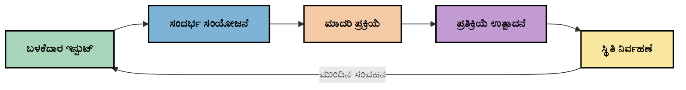
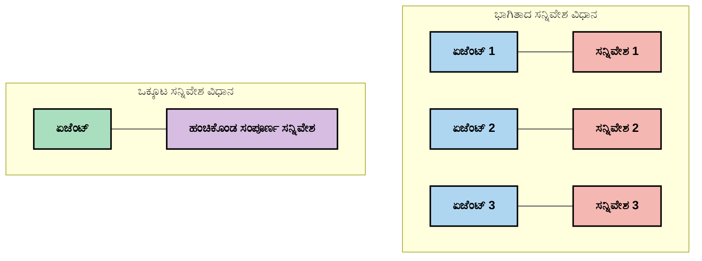
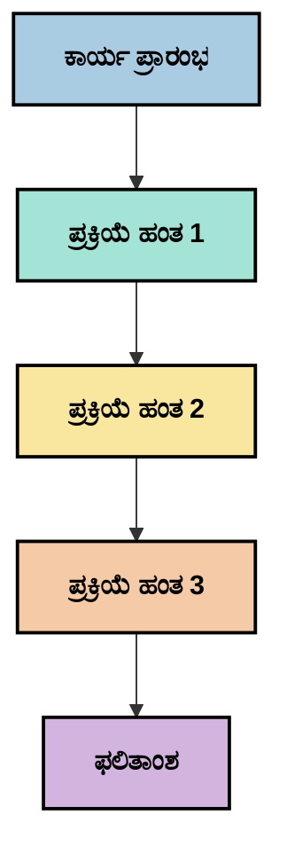
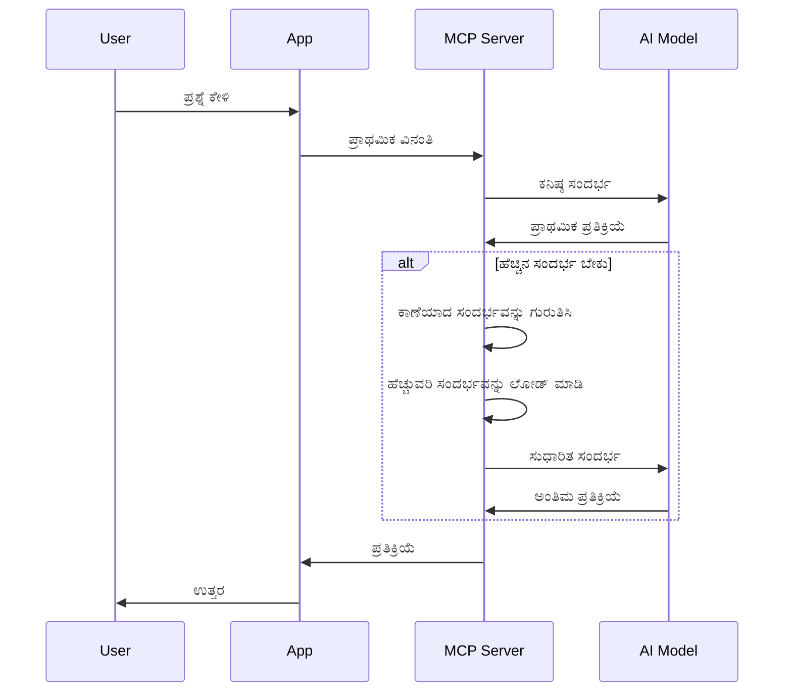
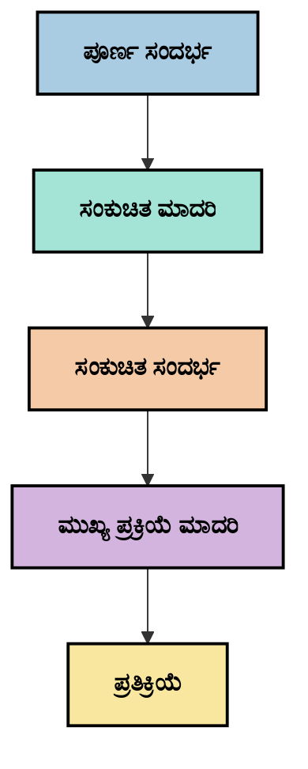

# ಸಾಂದರ್ಭಿಕ ಎಂಜಿನಿಯರಿಂಗ್: MCP ಪರಿಸರದಲ್ಲಿ ಉದಯೋನ್ಮುಖ ಸಂಪ್ರದಾಯ

## ಅವಲೋಕನ

ಸಾಂದರ್ಭಿಕ ಎಂಜಿನಿಯರಿಂಗ್ ಎಂಬುದು AI ಕ್ಷೇತ್ರದಲ್ಲಿ ಉದಯೋನ್ಮುಖ ಸಂಪ್ರದಾಯವಾಗಿದ್ದು, ಗ್ರಾಹಕರು ಮತ್ತು AI ಸೇವೆಗಳ ನಡುವಿನ ಸಂವಹನಗಳಲ್ಲಿ ಮಾಹಿತಿ ಹೇಗೆ ರಚನೆಗೊಳ್ಳುತ್ತದೆ, ವಿತರಿಸಲಾಗುತ್ತದೆ ಮತ್ತು ನಿರ್ವಹಿಸಲಾಗುತ್ತದೆ ಎಂಬುದನ್ನು ಅನ್ವೇಷಿಸುತ್ತದೆ. ಮಾದರಿ ಸಾಂದರ್ಭಿಕ ಪ್ರೋಟೋಕಾಲ್ (MCP) ಪರಿಸರವು ಅಭಿವೃದ್ಧಿಯಾಗುತ್ತಿರುತ್ತಾ, ಸಾಂದರ್ಭಿಕವನ್ನು ಪರಿಣಾಮಕಾರಿಯಾಗಿ ನಿರ್ವಹಿಸುವುದು ಹೆಚ್ಚಾಗಿ ಮಹತ್ವಪೂರ್ಣವಾಗುತ್ತಿದೆ. ಈ ಘಟಕವು ಸಾಂದರ್ಭಿಕ ಎಂಜಿನಿಯರಿಂಗ್ ಸಂಪ್ರದಾಯವನ್ನು ಪರಿಚಯಿಸಿ, MCP ಅನುಷ್ಠಾನಗಳಲ್ಲಿ ಅದರ ಸಾಧ್ಯತೆಗಳನ್ನು ಅನ್ವೇಷಿಸುತ್ತದೆ.

## ಕಲಿಕೆಯ ಉದ್ದೇಶಗಳು

ಈ ಘಟಕದ ಅಂತ್ಯಕ್ಕೆ, ನೀವು ಸಾಧ್ಯವಾಗುವುದು:

- ಸಾಂದರ್ಭಿಕ ಎಂಜಿನಿಯರಿಂಗ್ ಎಂಬ ಉದಯೋನ್ಮುಖ ಸಂಪ್ರದಾಯ ಮತ್ತು MCP ಅನ್ವಯಗಳಲ್ಲಿ ಅದರ ಸಾಧ್ಯ ಪಾತ್ರವನ್ನು ಅರ್ಥಮಾಡಿಕೊಳ್ಳುವುದು
- MCP ಪ್ರೋಟೋಕಾಲ್ ವಿನ್ಯಾಸವು ಪರಿಹರಿಸುವ ಸಾಂದರ್ಭಿಕ ನಿರ್ವಹಣೆಯ ಪ್ರಮುಖ ಸವಾಲುಗಳನ್ನು ಗುರುತಿಸುವುದು
- ಉತ್ತಮ ಸಾಂದರ್ಭಿಕ ನಿರ್ವಹಣೆಯ ಮೂಲಕ ಮಾದರಿ ಕಾರ್ಯಕ್ಷಮತೆಯನ್ನು ಸುಧಾರಿಸುವ ತಂತ್ರಗಳನ್ನು ಅನ್ವೇಷಿಸುವುದು
- ಸಾಂದರ್ಭಿಕ ಪರಿಣಾಮಕಾರಿತ್ವವನ್ನು ಅಳೆಯಲು ಮತ್ತು ಮೌಲ್ಯಮಾಪನ ಮಾಡಲು ವಿಧಾನಗಳನ್ನು ಪರಿಗಣಿಸುವುದು
- MCP ಚಟುವಟಿಕೆ ಮೂಲಕ AI ಅನುಭವಗಳನ್ನು ಸುಧಾರಿಸಲು ಈ ಉದಯೋನ್ಮುಖ ಸಂಪ್ರದಾಯಗಳನ್ನು ಅನ್ವಯಿಸುವುದು

## ಸಾಂದರ್ಭಿಕ ಎಂಜಿನಿಯರಿಂಗ್ ಪರಿಚಯ

ಸಾಂದರ್ಭಿಕ ಎಂಜಿನಿಯರಿಂಗ್ ಎಂಬುದು ಬಳಕೆದಾರರು, ಅನ್ವಯಗಳು ಮತ್ತು AI ಮಾದರಿಗಳ ನಡುವೆ ಮಾಹಿತಿ ಹರಿವಿನ ಉದ್ದೇಶಪೂರ್ವಕ ವಿನ್ಯಾಸ ಮತ್ತು ನಿರ್ವಹಣೆಯ ಮೇಲೆ ಕೇಂದ್ರೀಕೃತವಾದ ಉದಯೋನ್ಮುಖ ಸಂಪ್ರದಾಯ. ಪ್ರಾಂಪ್ಟ್ ಎಂಜಿನಿಯರಿಂಗ್ ಮುಂತಾದ ಸ್ಥಾಪಿತ ಕ್ಷೇತ್ರಗಳಿಗಿಂತ ವಿಭಿನ್ನವಾಗಿ, ಸಾಂದರ್ಭಿಕ ಎಂಜಿನಿಯರಿಂಗ್ ಅನ್ನು ಪ್ರಾಯೋಗಿಕರು ಇನ್ನೂ ವ್ಯಾಖ್ಯಾನಿಸುತ್ತಿದ್ದಾರೆ, ಏಕೆಂದರೆ ಅವರು AI ಮಾದರಿಗಳಿಗೆ ಸರಿಯಾದ ಸಮಯದಲ್ಲಿ ಸರಿಯಾದ ಮಾಹಿತಿಯನ್ನು ಒದಗಿಸುವ ವಿಶಿಷ್ಟ ಸವಾಲುಗಳನ್ನು ಪರಿಹರಿಸಲು ಕೆಲಸ ಮಾಡುತ್ತಿದ್ದಾರೆ.

ದೊಡ್ಡ ಭಾಷಾ ಮಾದರಿಗಳು (LLMs) ಅಭಿವೃದ್ಧಿಯಾಗುತ್ತಾ, ಸಾಂದರ್ಭಿಕದ ಮಹತ್ವವು ಹೆಚ್ಚಾಗುತ್ತಿದೆ. ನಾವು ಒದಗಿಸುವ ಸಾಂದರ್ಭಿಕದ ಗುಣಮಟ್ಟ, ಪ್ರಾಸಂಗಿಕತೆ ಮತ್ತು ರಚನೆ ನೇರವಾಗಿ ಮಾದರಿ ಫಲಿತಾಂಶಗಳನ್ನು ಪ್ರಭಾವಿಸುತ್ತದೆ. ಸಾಂದರ್ಭಿಕ ಎಂಜಿನಿಯರಿಂಗ್ ಈ ಸಂಬಂಧವನ್ನು ಅನ್ವೇಷಿಸಿ ಪರಿಣಾಮಕಾರಿ ಸಾಂದರ್ಭಿಕ ನಿರ್ವಹಣೆಗೆ ತತ್ವಗಳನ್ನು ಅಭಿವೃದ್ಧಿಪಡಿಸಲು ಪ್ರಯತ್ನಿಸುತ್ತದೆ.

> "2025 ರಲ್ಲಿ, ಆ ಮಾದರಿಗಳು ಅತ್ಯಂತ ಬುದ್ಧಿವಂತಿಕೆ ಹೊಂದಿವೆ. ಆದರೆ ಅತ್ಯಂತ ಬುದ್ಧಿವಂತ ಮಾನವನೂ ಕೂಡ ಅವರು ಕೇಳಲಾಗುತ್ತಿರುವ ಕಾರ್ಯದ ಸಾಂದರ್ಭಿಕವಿಲ್ಲದೆ ತಮ್ಮ ಕೆಲಸವನ್ನು ಪರಿಣಾಮಕಾರಿಯಾಗಿ ಮಾಡಲು ಸಾಧ್ಯವಿಲ್ಲ... 'ಸಾಂದರ್ಭಿಕ ಎಂಜಿನಿಯರಿಂಗ್' ಪ್ರಾಂಪ್ಟ್ ಎಂಜಿನಿಯರಿಂಗ್‌ನ ಮುಂದಿನ ಹಂತ. ಇದು ಡೈನಾಮಿಕ್ ವ್ಯವಸ್ಥೆಯಲ್ಲಿ ಸ್ವಯಂಚಾಲಿತವಾಗಿ ಮಾಡುವುದಾಗಿದೆ." — ವಾಲ್ಡನ್ ಯಾನ್, ಕಾಗ್ನಿಷನ್ AI

ಸಾಂದರ್ಭಿಕ ಎಂಜಿನಿಯರಿಂಗ್ ಒಳಗೊಂಡಿರಬಹುದು:

1. **ಸಾಂದರ್ಭಿಕ ಆಯ್ಕೆ**: ನಿರ್ದಿಷ್ಟ ಕಾರ್ಯಕ್ಕೆ ಯಾವ ಮಾಹಿತಿ ಪ್ರಾಸಂಗಿಕವಾಗಿದೆ ಎಂದು ನಿರ್ಧರಿಸುವುದು
2. **ಸಾಂದರ್ಭಿಕ ರಚನೆ**: ಮಾದರಿಯ ಅರ್ಥಮಾಡಿಕೊಳ್ಳುವಿಕೆಯನ್ನು ಗರಿಷ್ಠಗೊಳಿಸಲು ಮಾಹಿತಿಯನ್ನು ಸಂಘಟಿಸುವುದು
3. **ಸಾಂದರ್ಭಿಕ ವಿತರಣೆ**: ಮಾಹಿತಿಯನ್ನು ಮಾದರಿಗಳಿಗೆ ಹೇಗೆ ಮತ್ತು ಯಾವಾಗ ಕಳುಹಿಸುವುದನ್ನು ಸುಧಾರಿಸುವುದು
4. **ಸಾಂದರ್ಭಿಕ ನಿರ್ವಹಣೆ**: ಸಮಯದೊಂದಿಗೆ ಸಾಂದರ್ಭಿಕ ಸ್ಥಿತಿ ಮತ್ತು ವಿಕಾಸವನ್ನು ನಿರ್ವಹಿಸುವುದು
5. **ಸಾಂದರ್ಭಿಕ ಮೌಲ್ಯಮಾಪನ**: ಸಾಂದರ್ಭಿಕದ ಪರಿಣಾಮಕಾರಿತ್ವವನ್ನು ಅಳೆಯುವುದು ಮತ್ತು ಸುಧಾರಿಸುವುದು

ಈ ಗಮನಾರ್ಹ ಕ್ಷೇತ್ರಗಳು MCP ಪರಿಸರಕ್ಕೆ ವಿಶೇಷವಾಗಿ ಸಂಬಂಧಿಸಿದವು, ಇದು ಅನ್ವಯಗಳಿಗೆ LLMಗಳಿಗೆ ಸಾಂದರ್ಭಿಕ ಒದಗಿಸುವ ಮಾನಕೀಕೃತ ಮಾರ್ಗವನ್ನು ಒದಗಿಸುತ್ತದೆ.

## ಸಾಂದರ್ಭಿಕ ಪ್ರಯಾಣ ದೃಷ್ಟಿಕೋನ

ಸಾಂದರ್ಭಿಕ ಎಂಜಿನಿಯರಿಂಗ್ ಅನ್ನು ದೃಶ್ಯೀಕರಿಸುವ ಒಂದು ಮಾರ್ಗವೆಂದರೆ MCP ವ್ಯವಸ್ಥೆಯ ಮೂಲಕ ಮಾಹಿತಿ ಹೇಗೆ ಪ್ರಯಾಣಿಸುತ್ತದೆ ಎಂಬುದನ್ನು ಹಾದುಹೋಗುವುದು:


### ಸಾಂದರ್ಭಿಕ ಪ್ರಯಾಣದ ಪ್ರಮುಖ ಹಂತಗಳು:

1. **ಬಳಕೆದಾರ ಇನ್‌ಪುಟ್**: ಬಳಕೆದಾರರಿಂದ ಕಚ್ಚಾ ಮಾಹಿತಿ (ಪಠ್ಯ, ಚಿತ್ರಗಳು, ದಾಖಲೆಗಳು)
2. **ಸಾಂದರ್ಭಿಕ ಸಂಯೋಜನೆ**: ಬಳಕೆದಾರ ಇನ್‌ಪುಟ್ ಅನ್ನು ವ್ಯವಸ್ಥೆಯ ಸಾಂದರ್ಭಿಕ, ಸಂಭಾಷಣಾ ಇತಿಹಾಸ ಮತ್ತು ಇತರ ಪಡೆದ ಮಾಹಿತಿಯೊಂದಿಗೆ ಸಂಯೋಜಿಸುವುದು
3. **ಮಾದರಿ ಪ್ರಕ್ರಿಯೆ**: AI ಮಾದರಿ ಸಂಯೋಜಿತ ಸಾಂದರ್ಭಿಕವನ್ನು ಪ್ರಕ್ರಿಯೆಗೊಳಿಸುತ್ತದೆ
4. **ಪ್ರತಿಕ್ರಿಯೆ ಉತ್ಪಾದನೆ**: ಒದಗಿಸಿದ ಸಾಂದರ್ಭಿಕದ ಆಧಾರದ ಮೇಲೆ ಮಾದರಿ ಫಲಿತಾಂಶಗಳನ್ನು ಉತ್ಪಾದಿಸುತ್ತದೆ
5. **ಸ್ಥಿತಿ ನಿರ್ವಹಣೆ**: ಸಂವಹನದ ಆಧಾರದ ಮೇಲೆ ವ್ಯವಸ್ಥೆಯ ಆಂತರಿಕ ಸ್ಥಿತಿಯನ್ನು ನವೀಕರಿಸುತ್ತದೆ

ಈ ದೃಷ್ಟಿಕೋನವು AI ವ್ಯವಸ್ಥೆಗಳಲ್ಲಿ ಸಾಂದರ್ಭಿಕದ ಚಲನೆಯ ಸ್ವಭಾವವನ್ನು ಹೈಲೈಟ್ ಮಾಡುತ್ತದೆ ಮತ್ತು ಪ್ರತಿ ಹಂತದಲ್ಲಿ ಮಾಹಿತಿಯನ್ನು ಹೇಗೆ ಉತ್ತಮವಾಗಿ ನಿರ್ವಹಿಸಬೇಕೆಂಬ ಮಹತ್ವದ ಪ್ರಶ್ನೆಗಳನ್ನು ಎತ್ತಿಹಿಡಿಯುತ್ತದೆ.

## ಸಾಂದರ್ಭಿಕ ಎಂಜಿನಿಯರಿಂಗ್‌ನ ಉದಯೋನ್ಮುಖ ತತ್ವಗಳು

ಸಾಂದರ್ಭಿಕ ಎಂಜಿನಿಯರಿಂಗ್ ಕ್ಷೇತ್ರ ರೂಪುಗೊಳ್ಳುತ್ತಾ, ಕೆಲವು ಪ್ರಾಥಮಿಕ ತತ್ವಗಳು ಪ್ರಾಯೋಗಿಕರಿಂದ ಉದಯಿಸುತ್ತಿವೆ. ಈ ತತ್ವಗಳು MCP ಅನುಷ್ಠಾನ ಆಯ್ಕೆಗಳನ್ನು ತಿಳಿಸಲು ಸಹಾಯ ಮಾಡಬಹುದು:

### ತತ್ವ 1: ಸಾಂದರ್ಭಿಕವನ್ನು ಸಂಪೂರ್ಣವಾಗಿ ಹಂಚಿಕೊಳ್ಳಿ

ಸಾಂದರ್ಭಿಕವು ವ್ಯವಸ್ಥೆಯ ಎಲ್ಲಾ ಘಟಕಗಳ ನಡುವೆ ಸಂಪೂರ್ಣವಾಗಿ ಹಂಚಿಕೊಳ್ಳಬೇಕು, ಬಹು ಏಜೆಂಟ್‌ಗಳು ಅಥವಾ ಪ್ರಕ್ರಿಯೆಗಳ ನಡುವೆ ವಿಭಜಿತವಾಗಬಾರದು. ಸಾಂದರ್ಭಿಕ ವಿತರಿತವಾಗಿದ್ದಾಗ, ವ್ಯವಸ್ಥೆಯ ಒಂದು ಭಾಗದಲ್ಲಿ ತೆಗೆದುಕೊಳ್ಳಲಾದ ನಿರ್ಧಾರಗಳು ಇತರ ಭಾಗಗಳಲ್ಲಿ ತೆಗೆದುಕೊಳ್ಳಲಾದ ನಿರ್ಧಾರಗಳೊಂದಿಗೆ ಸಂಘರ್ಷವಾಗಬಹುದು.


MCP ಅನ್ವಯಗಳಲ್ಲಿ, ಇದು ಸಾಂದರ್ಭಿಕವು ಸಂಪೂರ್ಣ ಪೈಪ್ಲೈನ್ ಮೂಲಕ ನಿರಂತರವಾಗಿ ಹರಿಯುವಂತೆ ವ್ಯವಸ್ಥೆಗಳನ್ನು ವಿನ್ಯಾಸಗೊಳಿಸುವುದನ್ನು ಸೂಚಿಸುತ್ತದೆ, ವಿಭಜಿತವಾಗಿರುವುದನ್ನು ತಪ್ಪಿಸುವುದು.

### ತತ್ವ 2: ಕ್ರಿಯೆಗಳು ಅಂತರ್ನಿಹಿತ ನಿರ್ಧಾರಗಳನ್ನು ಹೊಂದುತ್ತವೆ ಎಂದು ಗುರುತಿಸಿ

ಪ್ರತಿ ಕ್ರಿಯೆಯು ಸಾಂದರ್ಭಿಕವನ್ನು ಹೇಗೆ ಅರ್ಥಮಾಡಿಕೊಳ್ಳಬೇಕೆಂಬ ಅಂತರ್ನಿಹಿತ ನಿರ್ಧಾರಗಳನ್ನು ಒಳಗೊಂಡಿರುತ್ತದೆ. ವಿವಿಧ ಘಟಕಗಳು ವಿಭಿನ್ನ ಸಾಂದರ್ಭಿಕಗಳ ಮೇಲೆ ಕಾರ್ಯನಿರ್ವಹಿಸಿದಾಗ, ಈ ಅಂತರ್ನಿಹಿತ ನಿರ್ಧಾರಗಳು ಸಂಘರ್ಷಕ್ಕೆ ಕಾರಣವಾಗಬಹುದು, ಅಸಮಂಜಸ ಫಲಿತಾಂಶಗಳಿಗೆ ದಾರಿ ಮಾಡಿಕೊಡಬಹುದು.

ಈ ತತ್ವವು MCP ಅನ್ವಯಗಳಿಗೆ ಪ್ರಮುಖ ಪರಿಣಾಮಗಳನ್ನು ಹೊಂದಿದೆ:
- ವಿಭಜಿತ ಸಾಂದರ್ಭಿಕದೊಂದಿಗೆ ಸಮಾಂತರ ಕಾರ್ಯಾಚರಣೆಯ ಬದಲು ಸಂಕೀರ್ಣ ಕಾರ್ಯಗಳ ರೇಖೀಯ ಪ್ರಕ್ರಿಯೆಯನ್ನು ಆದ್ಯತೆ ನೀಡುವುದು
- ಎಲ್ಲಾ ನಿರ್ಧಾರ ಬಿಂದುಗಳಿಗೆ ಒಂದೇ ಸಾಂದರ್ಭಿಕ ಮಾಹಿತಿಗೆ ಪ್ರವೇಶವನ್ನು ಖಚಿತಪಡಿಸುವುದು
- ನಂತರದ ಹಂತಗಳು ಮೊದಲಿನ ನಿರ್ಧಾರಗಳ ಸಂಪೂರ್ಣ ಸಾಂದರ್ಭಿಕವನ್ನು ನೋಡಬಹುದಾದ ವ್ಯವಸ್ಥೆಗಳನ್ನು ವಿನ್ಯಾಸಗೊಳಿಸುವುದು

### ತತ್ವ 3: ಸಾಂದರ್ಭಿಕ ಆಳವನ್ನು ವಿಂಡೋ ಮಿತಿಗಳೊಂದಿಗೆ ಸಮತೋಲನಗೊಳಿಸಿ

ಸಂಭಾಷಣೆಗಳು ಮತ್ತು ಪ್ರಕ್ರಿಯೆಗಳು ಉದ್ದವಾಗುತ್ತಾ, ಸಾಂದರ್ಭಿಕ ವಿಂಡೋಗಳು ಕೊನೆಗೆ ತುಂಬಿ ಹೋಗುತ್ತವೆ. ಪರಿಣಾಮಕಾರಿ ಸಾಂದರ್ಭಿಕ ಎಂಜಿನಿಯರಿಂಗ್ ಈ ಸಮಗ್ರ ಸಾಂದರ್ಭಿಕ ಮತ್ತು ತಾಂತ್ರಿಕ ಮಿತಿಗಳ ನಡುವಿನ ಒತ್ತಡವನ್ನು ನಿರ್ವಹಿಸುವ ವಿಧಾನಗಳನ್ನು ಅನ್ವೇಷಿಸುತ್ತದೆ.

ಅನ್ವೇಷಿಸಲಾಗುತ್ತಿರುವ ಸಾಧ್ಯ ವಿಧಾನಗಳು:
- ಟೋಕನ್ ಬಳಕೆಯನ್ನು ಕಡಿಮೆ ಮಾಡುವಾಗ ಅಗತ್ಯ ಮಾಹಿತಿಯನ್ನು ಉಳಿಸುವ ಸಾಂದರ್ಭಿಕ ಸಂಕುಚಿತಗೊಳಿಸುವಿಕೆ
- ಪ್ರಸ್ತುತ ಅಗತ್ಯಗಳಿಗೆ ಪ್ರಾಸಂಗಿಕತೆಯ ಆಧಾರದ ಮೇಲೆ ಸಾಂದರ್ಭಿಕವನ್ನು ಕ್ರಮೇಣ ಲೋಡ್ ಮಾಡುವುದು
- ಪ್ರಮುಖ ನಿರ್ಧಾರಗಳು ಮತ್ತು ವಾಸ್ತವಾಂಶಗಳನ್ನು ಉಳಿಸಿಕೊಂಡು ಹಿಂದಿನ ಸಂವಹನಗಳ ಸಾರಾಂಶ

## ಸಾಂದರ್ಭಿಕ ಸವಾಲುಗಳು ಮತ್ತು MCP ಪ್ರೋಟೋಕಾಲ್ ವಿನ್ಯಾಸ

ಮಾದರಿ ಸಾಂದರ್ಭಿಕ ಪ್ರೋಟೋಕಾಲ್ (MCP) ಅನ್ನು ಸಾಂದರ್ಭಿಕ ನಿರ್ವಹಣೆಯ ವಿಶಿಷ್ಟ ಸವಾಲುಗಳ ಅರಿವಿನಿಂದ ವಿನ್ಯಾಸಗೊಳಿಸಲಾಗಿದೆ. ಈ ಸವಾಲುಗಳನ್ನು ಅರ್ಥಮಾಡಿಕೊಳ್ಳುವುದು MCP ಪ್ರೋಟೋಕಾಲ್ ವಿನ್ಯಾಸದ ಪ್ರಮುಖ ಅಂಶಗಳನ್ನು ವಿವರಿಸುತ್ತದೆ:

### ಸವಾಲು 1: ಸಾಂದರ್ಭಿಕ ವಿಂಡೋ ಮಿತಿಗಳು
ಬಹುತೇಕ AI ಮಾದರಿಗಳಿಗೆ ನಿಗದಿತ ಸಾಂದರ್ಭಿಕ ವಿಂಡೋ ಗಾತ್ರಗಳಿವೆ, ಅವು ಒಂದೇ ಸಮಯದಲ್ಲಿ ಪ್ರಕ್ರಿಯೆಗೊಳಿಸಬಹುದಾದ ಮಾಹಿತಿಯನ್ನು ಮಿತಿಗೊಳಿಸುತ್ತವೆ.

**MCP ವಿನ್ಯಾಸ ಪ್ರತಿಕ್ರಿಯೆ:** 
- ಪ್ರೋಟೋಕಾಲ್ ರಚನೆಗೊಳ್ಳಲಾದ, ಸಂಪನ್ಮೂಲ ಆಧಾರಿತ ಸಾಂದರ್ಭಿಕವನ್ನು ಪರಿಣಾಮಕಾರಿಯಾಗಿ ಉಲ್ಲೇಖಿಸಲು ಬೆಂಬಲಿಸುತ್ತದೆ
- ಸಂಪನ್ಮೂಲಗಳನ್ನು ಪುಟಗೊಳಿಸಿ ಕ್ರಮೇಣ ಲೋಡ್ ಮಾಡಬಹುದು

### ಸವಾಲು 2: ಪ್ರಾಸಂಗಿಕತೆ ನಿರ್ಧಾರ
ಯಾವ ಮಾಹಿತಿ ಸಾಂದರ್ಭಿಕದಲ್ಲಿ ಸೇರಿಸಬೇಕೆಂದು ನಿರ್ಧರಿಸುವುದು ಕಷ್ಟಕರ.

**MCP ವಿನ್ಯಾಸ ಪ್ರತಿಕ್ರಿಯೆ:**
- ಅಗತ್ಯ ಆಧಾರದ ಮೇಲೆ ಡೈನಾಮಿಕ್ ಮಾಹಿತಿಯನ್ನು ಪಡೆಯಲು ಲವಚಿಕ ಉಪಕರಣಗಳು
- ಸಾಂದರ್ಭಿಕ ಸಂಘಟನೆಯನ್ನು ಸತತವಾಗಿರಿಸಲು ರಚಿತ ಪ್ರಾಂಪ್ಟ್‌ಗಳು

### ಸವಾಲು 3: ಸಾಂದರ್ಭಿಕ ಸ್ಥಿರತೆ
ಸಂವಹನಗಳ ನಡುವೆ ಸ್ಥಿತಿಯನ್ನು ನಿರ್ವಹಿಸುವುದು ಜಾಗರೂಕ ಟ್ರ್ಯಾಕಿಂಗ್ ಅಗತ್ಯವಿದೆ.

**MCP ವಿನ್ಯಾಸ ಪ್ರತಿಕ್ರಿಯೆ:**
- ಮಾನಕೀಕೃತ ಸೆಷನ್ ನಿರ್ವಹಣೆ
- ಸಾಂದರ್ಭಿಕ ವಿಕಾಸಕ್ಕಾಗಿ ಸ್ಪಷ್ಟವಾಗಿ ವ್ಯಾಖ್ಯಾನಿಸಲಾದ ಸಂವಹನ ಮಾದರಿಗಳು

### ಸವಾಲು 4: ಬಹು-ಮೋಡಲ್ ಸಾಂದರ್ಭಿಕ
ವಿಭಿನ್ನ ಡೇಟಾ ಪ್ರಕಾರಗಳು (ಪಠ್ಯ, ಚಿತ್ರಗಳು, ರಚಿತ ಡೇಟಾ) ವಿಭಿನ್ನ ನಿರ್ವಹಣೆಯನ್ನು ಅಗತ್ಯವಿರುತ್ತದೆ.

**MCP ವಿನ್ಯಾಸ ಪ್ರತಿಕ್ರಿಯೆ:**
- ವಿವಿಧ ವಿಷಯ ಪ್ರಕಾರಗಳನ್ನು ಹೊಂದಿಕೊಳ್ಳುವ ಪ್ರೋಟೋಕಾಲ್ ವಿನ್ಯಾಸ
- ಬಹು-ಮೋಡಲ್ ಮಾಹಿತಿಯ ಮಾನಕೀಕೃತ ಪ್ರತಿನಿಧಾನ

### ಸವಾಲು 5: ಭದ್ರತೆ ಮತ್ತು ಗೌಪ್ಯತೆ
ಸಾಂದರ್ಭಿಕದಲ್ಲಿ ಸಾಮಾನ್ಯವಾಗಿ ಸಂವೇದನಾಶೀಲ ಮಾಹಿತಿ ಇರುತ್ತದೆ, ಅದನ್ನು ರಕ್ಷಿಸಬೇಕಾಗುತ್ತದೆ.

**MCP ವಿನ್ಯಾಸ ಪ್ರತಿಕ್ರಿಯೆ:**
- ಗ್ರಾಹಕ ಮತ್ತು ಸರ್ವರ್ ಜವಾಬ್ದಾರಿಗಳ ನಡುವೆ ಸ್ಪಷ್ಟ ಗಡಿಗಳು
- ಡೇಟಾ ಬಹಿರಂಗಪಡಿಸುವಿಕೆಯನ್ನು ಕಡಿಮೆ ಮಾಡಲು ಸ್ಥಳೀಯ ಪ್ರಕ್ರಿಯೆ ಆಯ್ಕೆಗಳು

ಈ ಸವಾಲುಗಳನ್ನು ಅರ್ಥಮಾಡಿಕೊಳ್ಳುವುದು ಮತ್ತು MCP ಅವುಗಳನ್ನು ಹೇಗೆ ಪರಿಹರಿಸುತ್ತದೆ ಎಂಬುದನ್ನು ತಿಳಿದುಕೊಳ್ಳುವುದು ಹೆಚ್ಚಿನ ಸಾಂದರ್ಭಿಕ ಎಂಜಿನಿಯರಿಂಗ್ ತಂತ್ರಗಳನ್ನು ಅನ್ವೇಷಿಸಲು ಆಧಾರವನ್ನು ಒದಗಿಸುತ್ತದೆ.

## ಉದಯೋನ್ಮುಖ ಸಾಂದರ್ಭಿಕ ಎಂಜಿನಿಯರಿಂಗ್ ವಿಧಾನಗಳು

ಸಾಂದರ್ಭಿಕ ಎಂಜಿನಿಯರಿಂಗ್ ಕ್ಷೇತ್ರ ಅಭಿವೃದ್ಧಿಯಾಗುತ್ತಾ, ಕೆಲವು ಭರವಸೆಯ ವಿಧಾನಗಳು ಉದಯಿಸುತ್ತಿವೆ. ಇವು ಸ್ಥಾಪಿತ ಉತ್ತಮ ಅಭ್ಯಾಸಗಳಿಗಿಂತ ಪ್ರಸ್ತುತ ಚಿಂತನೆಗಳನ್ನು ಪ್ರತಿನಿಧಿಸುತ್ತವೆ ಮತ್ತು MCP ಅನುಷ್ಠಾನಗಳೊಂದಿಗೆ ಅನುಭವ ಹೆಚ್ಚಾದಂತೆ ಅಭಿವೃದ್ಧಿಯಾಗಬಹುದು.

### 1. ಏಕ-ಥ್ರೆಡ್ ರೇಖೀಯ ಪ್ರಕ್ರಿಯೆ

ಸಾಂದರ್ಭಿಕವನ್ನು ವಿತರಿಸುವ ಬಹು-ಏಜೆಂಟ್ ವಾಸ್ತುಶಿಲ್ಪಗಳ ವಿರುದ್ಧವಾಗಿ, ಕೆಲವು ಪ್ರಾಯೋಗಿಕರು ಏಕ-ಥ್ರೆಡ್ ರೇಖೀಯ ಪ್ರಕ್ರಿಯೆ ಹೆಚ್ಚು ಸತತ ಫಲಿತಾಂಶಗಳನ್ನು ನೀಡುತ್ತದೆ ಎಂದು ಕಂಡುಹಿಡಿದಿದ್ದಾರೆ. ಇದು ಏಕೀಕೃತ ಸಾಂದರ್ಭಿಕವನ್ನು ಕಾಯ್ದುಕೊಳ್ಳುವ ತತ್ವಕ್ಕೆ ಹೊಂದಿಕೆಯಾಗುತ್ತದೆ.


ಈ ವಿಧಾನವು ಸಮಾಂತರ ಪ್ರಕ್ರಿಯೆಗಿಂತ ಕಡಿಮೆ ಪರಿಣಾಮಕಾರಿಯಾಗಬಹುದು ಎಂದು ತೋರುತ್ತಿದ್ದರೂ, ಪ್ರತಿ ಹಂತವು ಹಿಂದಿನ ನಿರ್ಧಾರಗಳ ಸಂಪೂರ್ಣ ಅರ್ಥಮಾಡಿಕೊಳ್ಳುವಿಕೆಯನ್ನು ಆಧರಿಸುವುದರಿಂದ ಹೆಚ್ಚು ಸಮ್ಮಿಲಿತ ಮತ್ತು ನಂಬಿಗಸ್ತ ಫಲಿತಾಂಶಗಳನ್ನು ಉತ್ಪಾದಿಸುತ್ತದೆ.

### 2. ಸಾಂದರ್ಭಿಕ ತುಂಡುಮಾಡಿಕೆ ಮತ್ತು ಆದ್ಯತೆ

ದೊಡ್ಡ ಸಾಂದರ್ಭಿಕಗಳನ್ನು ನಿರ್ವಹಣೀಯ ತುಂಡುಗಳಾಗಿ ವಿಭಜಿಸಿ, ಅತ್ಯಂತ ಪ್ರಮುಖವನ್ನು ಆದ್ಯತೆ ನೀಡುವುದು.

```python
# ಕಲ್ಪನಾತ್ಮಕ ಉದಾಹರಣೆ: ಸಾಂದರ್ಭಿಕ ಚಂಕಿಂಗ್ ಮತ್ತು ಪ್ರಾಥಮಿಕತೆ
def process_with_chunked_context(documents, query):
    # 1. ದಾಖಲೆಗಳನ್ನು ಸಣ್ಣ ಚುಂಕುಗಳಾಗಿ ವಿಭಜಿಸಿ
    chunks = chunk_documents(documents)
    
    # 2. ಪ್ರತಿ ಚುಂಕಿನ ಪ್ರಾಸಂಗಿಕತೆ ಅಂಕಗಳನ್ನು ಲೆಕ್ಕಿಸಿ
    scored_chunks = [(chunk, calculate_relevance(chunk, query)) for chunk in chunks]
    
    # 3. ಪ್ರಾಸಂಗಿಕತೆ ಅಂಕಗಳ ಆಧಾರದ ಮೇಲೆ ಚುಂಕುಗಳನ್ನು ಕ್ರಮಿಸಿ
    sorted_chunks = sorted(scored_chunks, key=lambda x: x[1], reverse=True)
    
    # 4. ಅತ್ಯಂತ ಪ್ರಾಸಂಗಿಕ ಚುಂಕುಗಳನ್ನು ಸಾಂದರ್ಭಿಕವಾಗಿ ಬಳಸಿ
    context = create_context_from_chunks([chunk for chunk, score in sorted_chunks[:5]])
    
    # 5. ಪ್ರಾಥಮಿಕತೆಯಾದ ಸಾಂದರ್ಭಿಕತೆಯೊಂದಿಗೆ ಪ್ರಕ್ರಿಯೆ ಮಾಡಿ
    return generate_response(context, query)
```

ಮೇಲಿನ ಕಲ್ಪನೆ ದೊಡ್ಡ ದಾಖಲೆಗಳನ್ನು ನಿರ್ವಹಣೀಯ ತುಂಡುಗಳಾಗಿ ವಿಭಜಿಸಿ, ಸಾಂದರ್ಭಿಕಕ್ಕೆ ಅತ್ಯಂತ ಪ್ರಾಸಂಗಿಕ ಭಾಗಗಳನ್ನು ಮಾತ್ರ ಆಯ್ಕೆಮಾಡುವ ವಿಧಾನವನ್ನು ತೋರಿಸುತ್ತದೆ. ಈ ವಿಧಾನವು ಸಾಂದರ್ಭಿಕ ವಿಂಡೋ ಮಿತಿಗಳೊಳಗೆ ಕೆಲಸ ಮಾಡಲು ಸಹಾಯ ಮಾಡುತ್ತದೆ ಮತ್ತು ದೊಡ್ಡ ಜ್ಞಾನ ಆಧಾರಗಳನ್ನು ಬಳಸಲು ಸಹಾಯಕ.

### 3. ಕ್ರಮೇಣ ಸಾಂದರ್ಭಿಕ ಲೋಡಿಂಗ್

ಎಲ್ಲವನ್ನೂ ಒಂದೇ ಬಾರಿ ಲೋಡ್ ಮಾಡುವ ಬದಲು ಅಗತ್ಯವಿರುವಂತೆ ಕ್ರಮೇಣ ಸಾಂದರ್ಭಿಕವನ್ನು ಲೋಡ್ ಮಾಡುವುದು.


ಕ್ರಮೇಣ ಸಾಂದರ್ಭಿಕ ಲೋಡಿಂಗ್ ಕನಿಷ್ಠ ಸಾಂದರ್ಭಿಕದಿಂದ ಪ್ರಾರಂಭಿಸಿ ಅಗತ್ಯವಿದ್ದಾಗ ಮಾತ್ರ ವಿಸ್ತರಿಸುತ್ತದೆ. ಇದು ಸರಳ ಪ್ರಶ್ನೆಗಳಿಗೆ ಟೋಕನ್ ಬಳಕೆಯನ್ನು ಬಹಳಷ್ಟು ಕಡಿಮೆ ಮಾಡಬಹುದು ಮತ್ತು ಸಂಕೀರ್ಣ ಪ್ರಶ್ನೆಗಳನ್ನು ನಿರ್ವಹಿಸುವ ಸಾಮರ್ಥ್ಯವನ್ನು ಉಳಿಸುತ್ತದೆ.

### 4. ಸಾಂದರ್ಭಿಕ ಸಂಕುಚಿತಗೊಳಿಸುವಿಕೆ ಮತ್ತು ಸಾರಾಂಶ

ಅಗತ್ಯ ಮಾಹಿತಿಯನ್ನು ಉಳಿಸಿಕೊಂಡು ಸಾಂದರ್ಭಿಕದ ಗಾತ್ರವನ್ನು ಕಡಿಮೆ ಮಾಡುವುದು.


ಸಾಂದರ್ಭಿಕ ಸಂಕುಚಿತಗೊಳಿಸುವಿಕೆ ಕೆಳಗಿನ ವಿಷಯಗಳ ಮೇಲೆ ಕೇಂದ್ರೀಕರಿಸುತ್ತದೆ:
- ಅನಾವಶ್ಯಕ ಮಾಹಿತಿಯನ್ನು ತೆಗೆದುಹಾಕುವುದು
- ಉದ್ದವಾದ ವಿಷಯದ ಸಾರಾಂಶ
- ಪ್ರಮುಖ ವಾಸ್ತವಾಂಶಗಳು ಮತ್ತು ವಿವರಗಳನ್ನು ಹೊರತೆಗೆಯುವುದು
- ಪ್ರಮುಖ ಸಾಂದರ್ಭಿಕ ಅಂಶಗಳನ್ನು ಉಳಿಸುವುದು
- ಟೋಕನ್ ಪರಿಣಾಮಕಾರಿತ್ವಕ್ಕಾಗಿ ಆಪ್ಟಿಮೈಸ್ ಮಾಡುವುದು

ಈ ವಿಧಾನವು ಸಾಂದರ್ಭಿಕ ವಿಂಡೋಗಳೊಳಗಿನ ದೀರ್ಘ ಸಂಭಾಷಣೆಗಳನ್ನು ನಿರ್ವಹಿಸಲು ಅಥವಾ ದೊಡ್ಡ ದಾಖಲೆಗಳನ್ನು ಪರಿಣಾಮಕಾರಿಯಾಗಿ ಪ್ರಕ್ರಿಯೆಗೊಳಿಸಲು ವಿಶೇಷವಾಗಿ ಮೌಲ್ಯಯುತವಾಗಿದೆ. ಕೆಲವು ಪ್ರಾಯೋಗಿಕರು ಸಂಭಾಷಣಾ ಇತಿಹಾಸದ ಸಾಂದರ್ಭಿಕ ಸಂಕುಚಿತಗೊಳಿಸುವಿಕೆ ಮತ್ತು ಸಾರಾಂಶಕ್ಕಾಗಿ ವಿಶೇಷ ಮಾದರಿಗಳನ್ನು ಬಳಸುತ್ತಿದ್ದಾರೆ.

## ಅನ್ವೇಷಣಾತ್ಮಕ ಸಾಂದರ್ಭಿಕ ಎಂಜಿನಿಯರಿಂಗ್ ಪರಿಗಣನೆಗಳು

ಸಾಂದರ್ಭಿಕ ಎಂಜಿನಿಯರಿಂಗ್ ಕ್ಷೇತ್ರವನ್ನು ಅನ್ವೇಷಿಸುವಾಗ, MCP ಅನುಷ್ಠಾನಗಳೊಂದಿಗೆ ಕೆಲಸ ಮಾಡುವಾಗ ಕೆಲವು ಪರಿಗಣನೆಗಳನ್ನು ಮನಸ್ಸಿನಲ್ಲಿ ಇಡುವುದು ಸೂಕ್ತ. ಇವು ನಿಯಮಿತ ಉತ್ತಮ ಅಭ್ಯಾಸಗಳಲ್ಲ, ಬದಲಾಗಿ ನಿಮ್ಮ ನಿರ್ದಿಷ್ಟ ಬಳಕೆಯಲ್ಲಿ ಸುಧಾರಣೆಗಳನ್ನು ತರಬಹುದಾದ ಅನ್ವೇಷಣಾ ಕ್ಷೇತ್ರಗಳಾಗಿವೆ.

### ನಿಮ್ಮ ಸಾಂದರ್ಭಿಕ ಗುರಿಗಳನ್ನು ಪರಿಗಣಿಸಿ

ಸಂಕೀರ್ಣ ಸಾಂದರ್ಭಿಕ ನಿರ್ವಹಣಾ ಪರಿಹಾರಗಳನ್ನು ಅನುಷ್ಠಾನಗೊಳಿಸುವ ಮೊದಲು, ನೀವು ಏನು ಸಾಧಿಸಲು ಯತ್ನಿಸುತ್ತಿದ್ದೀರಿ ಎಂಬುದನ್ನು ಸ್ಪಷ್ಟವಾಗಿ ವಿವರಿಸಿ:
- ಮಾದರಿಗೆ ಯಶಸ್ವಿಯಾಗಲು ಯಾವ ವಿಶೇಷ ಮಾಹಿತಿ ಅಗತ್ಯವಿದೆ?
- ಯಾವ ಮಾಹಿತಿ ಅವಶ್ಯಕ ಮತ್ತು ಯಾವುದು ಪೂರಕ?
- ನಿಮ್ಮ ಕಾರ್ಯಕ್ಷಮತಾ ನಿರ್ಬಂಧಗಳು ಯಾವುವು (ವಿಲಂಬ, ಟೋಕನ್ ಮಿತಿಗಳು, ವೆಚ್ಚಗಳು)?

### ಪದರಬದ್ಧ ಸಾಂದರ್ಭಿಕ ವಿಧಾನಗಳನ್ನು ಅನ್ವೇಷಿಸಿ

ಕೆಲವು ಪ್ರಾಯೋಗಿಕರು ಸಾಂದರ್ಭಿಕವನ್ನು ಕಲ್ಪನಾತ್ಮಕ ಪದರಗಳಲ್ಲಿ ವ್ಯವಸ್ಥಿತಗೊಳಿಸುವಲ್ಲಿ ಯಶಸ್ಸು ಕಂಡಿದ್ದಾರೆ:
- **ಮೂಲ ಪದರ**: ಮಾದರಿಗೆ ಯಾವಾಗಲೂ ಅಗತ್ಯವಿರುವ ಅವಶ್ಯಕ ಮಾಹಿತಿ
- **ಪರಿಸ್ಥಿತಿಗತ ಪದರ**: ಪ್ರಸ್ತುತ ಸಂವಹನಕ್ಕೆ ವಿಶೇಷ ಸಾಂದರ್ಭಿಕ
- **ಬೆಂಬಲ ಪದರ**: ಸಹಾಯಕವಾಗಬಹುದಾದ ಹೆಚ್ಚುವರಿ ಮಾಹಿತಿ
- **ಬಳಿಕೆಗೆ ಬಿಟ್ಟಿರುವ ಪದರ**: ಅಗತ್ಯವಿದ್ದಾಗ ಮಾತ್ರ ಪ್ರವೇಶಿಸುವ ಮಾಹಿತಿ

### ಪಡೆಯುವ ತಂತ್ರಗಳನ್ನು ಪರಿಶೀಲಿಸಿ

ನಿಮ್ಮ ಸಾಂದರ್ಭಿಕದ ಪರಿಣಾಮಕಾರಿತ್ವವು ನೀವು ಮಾಹಿತಿಯನ್ನು ಹೇಗೆ ಪಡೆಯುತ್ತೀರಿ ಎಂಬುದರ ಮೇಲೆ ಅವಲಂಬಿತವಾಗಿದೆ:
- ಕಲ್ಪನಾತ್ಮಕವಾಗಿ ಪ್ರಾಸಂಗಿಕ ಮಾಹಿತಿಯನ್ನು ಹುಡುಕಲು ಸಾಂದರ್ಭಿಕ ಹುಡುಕಾಟ ಮತ್ತು ಎम्बೆಡ್ಡಿಂಗ್‌ಗಳು
- ನಿರ್ದಿಷ್ಟ ವಾಸ್ತವಾಂಶಗಳಿಗಾಗಿ ಕೀವರ್ಡ್ ಆಧಾರಿತ ಹುಡುಕಾಟ
- ಹಲವು ಪಡೆಯುವ ವಿಧಾನಗಳನ್ನು ಸಂಯೋಜಿಸುವ ಸಂಯುಕ್ತ ವಿಧಾನಗಳು
- ವರ್ಗಗಳು, ದಿನಾಂಕಗಳು ಅಥವಾ ಮೂಲಗಳ ಆಧಾರದ ಮೇಲೆ ವ್ಯಾಪ್ತಿಯನ್ನು ಸೀಮಿತಗೊಳಿಸಲು ಮೆಟಾಡೇಟಾ ಫಿಲ್ಟರಿಂಗ್

### ಸಾಂದರ್ಭಿಕ ಸಮ್ಮಿಲನವನ್ನು ಪ್ರಯೋಗ
- [ಮಾದರಿ ಸನ್ನಿವೇಶ ಪ್ರೋಟೋಕಾಲ್ ವೆಬ್‌ಸೈಟ್](https://modelcontextprotocol.io/)
- [ಮಾದರಿ ಸನ್ನಿವೇಶ ಪ್ರೋಟೋಕಾಲ್ ವಿಶೇಷಣ](https://github.com/modelcontextprotocol/modelcontextprotocol)
- [MCP ಡಾಕ್ಯುಮೆಂಟೇಶನ್](https://modelcontextprotocol.io/docs)
- [MCP C# SDK](https://github.com/modelcontextprotocol/csharp-sdk)
- [MCP ಪೈಥಾನ್ SDK](https://github.com/modelcontextprotocol/python-sdk)
- [MCP ಟೈಪ್‌ಸ್ಕ್ರಿಪ್ಟ್ SDK](https://github.com/modelcontextprotocol/typescript-sdk)
- [MCP ಇನ್ಸ್‌ಪೆಕ್ಟರ್](https://github.com/modelcontextprotocol/inspector) - MCP ಸರ್ವರ್‌ಗಳಿಗಾಗಿ ದೃಶ್ಯ ಪರೀಕ್ಷಾ ಸಾಧನ

### ಸನ್ನಿವೇಶ ಎಂಜಿನಿಯರಿಂಗ್ ಲೇಖನಗಳು
- [ಬಹು-ಏಜೆಂಟ್‌ಗಳನ್ನು ನಿರ್ಮಿಸಬೇಡಿ: ಸನ್ನಿವೇಶ ಎಂಜಿನಿಯರಿಂಗ್ ತತ್ವಗಳು](https://cognition.ai/blog/dont-build-multi-agents) - ವಾಲ್ಡನ್ ಯಾನ್ ಅವರ ಸನ್ನಿವೇಶ ಎಂಜಿನಿಯರಿಂಗ್ ತತ್ವಗಳ ಕುರಿತು洞察ಗಳು
- [ಏಜೆಂಟ್‌ಗಳನ್ನು ನಿರ್ಮಿಸುವ ಪ್ರಾಯೋಗಿಕ ಮಾರ್ಗದರ್ಶಿ](https://cdn.openai.com/business-guides-and-resources/a-practical-guide-to-building-agents.pdf) - ಪರಿಣಾಮಕಾರಿ ಏಜೆಂಟ್ ವಿನ್ಯಾಸದ ಮೇಲೆ OpenAI ಮಾರ್ಗದರ್ಶಿ
- [ಪ್ರಭಾವಶಾಲಿ ಏಜೆಂಟ್‌ಗಳನ್ನು ನಿರ್ಮಿಸುವುದು](https://www.anthropic.com/engineering/building-effective-agents) - ಏಜೆಂಟ್ ಅಭಿವೃದ್ಧಿಗೆ Anthropic ನ ದೃಷ್ಟಿಕೋನ

### ಸಂಬಂಧಿತ ಸಂಶೋಧನೆ
- [ದೈನಾಮಿಕ್ ರಿಟ್ರೀವಲ್ ಹೆಚ್ಚಳವು ದೊಡ್ಡ ಭಾಷಾ ಮಾದರಿಗಳಿಗಾಗಿ](https://arxiv.org/abs/2310.01487) - ದೈನಾಮಿಕ್ ರಿಟ್ರೀವಲ್ ವಿಧಾನಗಳ ಕುರಿತು ಸಂಶೋಧನೆ
- [ಮಧ್ಯದಲ್ಲಿ ಕಳೆದುಹೋಗುವುದು: ಭಾಷಾ ಮಾದರಿಗಳು ದೀರ್ಘ ಸನ್ನಿವೇಶಗಳನ್ನು ಹೇಗೆ ಬಳಸುತ್ತವೆ](https://arxiv.org/abs/2307.03172) - ಸನ್ನಿವೇಶ ಪ್ರಕ್ರಿಯೆ ಮಾದರಿಗಳ ಕುರಿತು ಪ್ರಮುಖ ಸಂಶೋಧನೆ
- [CLIP ಲೇಟೆಂಟ್‌ಗಳೊಂದಿಗೆ ಹೈರಾರ್ಕಿಕಲ್ ಪಠ್ಯ-ಆಧಾರಿತ ಚಿತ್ರ ರಚನೆ](https://arxiv.org/abs/2204.06125) - DALL-E 2 ಪೇಪರ್ ಮತ್ತು ಸನ್ನಿವೇಶ ರಚನೆಯ洞察ಗಳು
- [ದೊಡ್ಡ ಭಾಷಾ ಮಾದರಿ ವಾಸ್ತುಶಿಲ್ಪಗಳಲ್ಲಿ ಸನ್ನಿವೇಶದ ಪಾತ್ರವನ್ನು ಅನ್ವೇಷಿಸುವುದು](https://aclanthology.org/2023.findings-emnlp.124/) - ಸನ್ನಿವೇಶ ನಿರ್ವಹಣೆಯ ಇತ್ತೀಚಿನ ಸಂಶೋಧನೆ
- [ಬಹು-ಏಜೆಂಟ್ ಸಹಕಾರ: ಸಮೀಕ್ಷೆ](https://arxiv.org/abs/2304.03442) - ಬಹು-ಏಜೆಂಟ್ ವ್ಯವಸ್ಥೆಗಳ ಮತ್ತು ಅವುಗಳ ಸವಾಲುಗಳ ಕುರಿತು ಸಂಶೋಧನೆ

### ಹೆಚ್ಚುವರಿ ಸಂಪನ್ಮೂಲಗಳು
- [ಸನ್ನಿವೇಶ ವಿಂಡೋ ಆಪ್ಟಿಮೈಜೆಷನ್ ತಂತ್ರಗಳು](https://learn.microsoft.com/en-us/azure/ai-services/openai/concepts/context-window)
- [ಅಧುನಿಕ RAG ತಂತ್ರಗಳು](https://www.microsoft.com/en-us/research/blog/retrieval-augmented-generation-rag-and-frontier-models/)
- [ಸೆಮ್ಯಾಂಟಿಕ್ ಕರ್ಣಲ್ ಡಾಕ್ಯುಮೆಂಟೇಶನ್](https://github.com/microsoft/semantic-kernel)
- [ಸನ್ನಿವೇಶ ನಿರ್ವಹಣೆಗೆ AI ಉಪಕರಣಗಳು](https://github.com/microsoft/aitoolkit)

## ಮುಂದೇನು

- [5.15 MCP ಕಸ್ಟಮ್ ಟ್ರಾನ್ಸ್‌ಪೋರ್ಟ್](../mcp-transport/README.md)

---

<!-- CO-OP TRANSLATOR DISCLAIMER START -->
**ಅಸ್ವೀಕರಣ**:  
ಈ ದಸ್ತಾವೇಜು AI ಅನುವಾದ ಸೇವೆ [Co-op Translator](https://github.com/Azure/co-op-translator) ಬಳಸಿ ಅನುವಾದಿಸಲಾಗಿದೆ. ನಾವು ನಿಖರತೆಯಿಗಾಗಿ ಪ್ರಯತ್ನಿಸುತ್ತಿದ್ದರೂ, ಸ್ವಯಂಚಾಲಿತ ಅನುವಾದಗಳಲ್ಲಿ ದೋಷಗಳು ಅಥವಾ ಅಸತ್ಯತೆಗಳು ಇರಬಹುದು ಎಂದು ದಯವಿಟ್ಟು ಗಮನಿಸಿ. ಮೂಲ ಭಾಷೆಯಲ್ಲಿರುವ ಮೂಲ ದಸ್ತಾವೇಜನ್ನು ಅಧಿಕೃತ ಮೂಲವೆಂದು ಪರಿಗಣಿಸಬೇಕು. ಮಹತ್ವದ ಮಾಹಿತಿಗಾಗಿ, ವೃತ್ತಿಪರ ಮಾನವ ಅನುವಾದವನ್ನು ಶಿಫಾರಸು ಮಾಡಲಾಗುತ್ತದೆ. ಈ ಅನುವಾದ ಬಳಕೆಯಿಂದ ಉಂಟಾಗುವ ಯಾವುದೇ ತಪ್ಪು ಅರ್ಥಮಾಡಿಕೊಳ್ಳುವಿಕೆ ಅಥವಾ ತಪ್ಪು ವಿವರಣೆಗಳಿಗೆ ನಾವು ಹೊಣೆಗಾರರಾಗುವುದಿಲ್ಲ.
<!-- CO-OP TRANSLATOR DISCLAIMER END -->