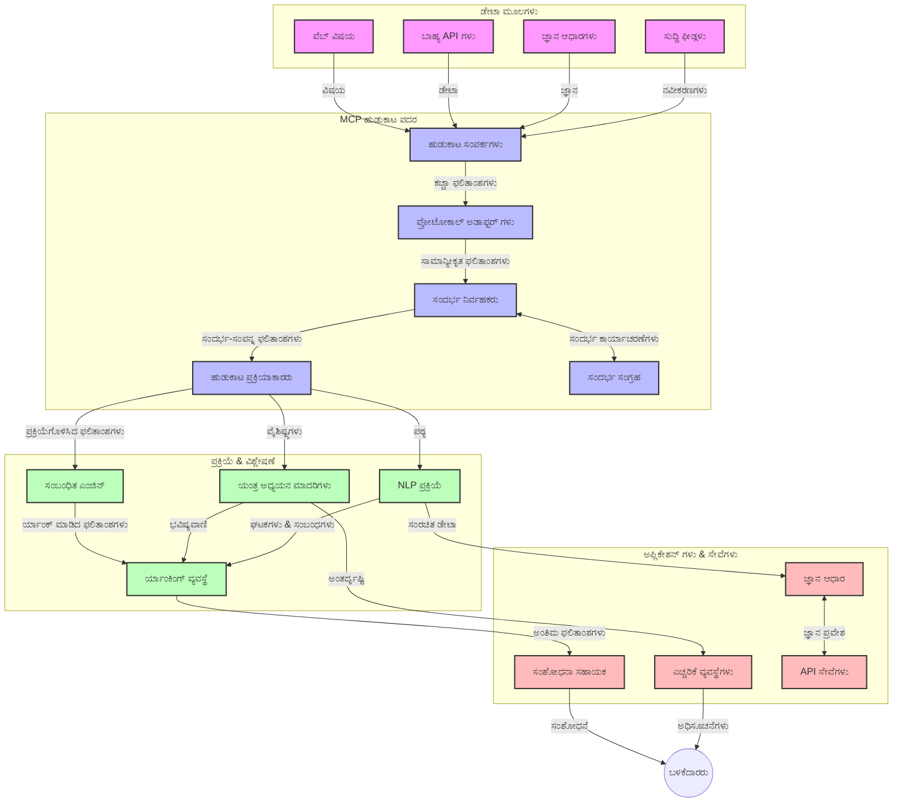

<!--
CO_OP_TRANSLATOR_METADATA:
{
  "original_hash": "333a03e51f90bdf3e6f1ba1694c73f36",
  "translation_date": "2025-12-11T16:13:11+00:00",
  "source_file": "05-AdvancedTopics/mcp-realtimesearch/README.md",
  "language_code": "kn"
}
-->
# ರಿಯಲ್-ಟೈಮ್ ವೆಬ್ ಶೋಧನೆಗಾಗಿ ಮಾದರಿ ಸಾಂದರ್ಭಿಕ ಪ್ರೋಟೋಕಾಲ್

## ಅವಲೋಕನ

ರಿಯಲ್-ಟೈಮ್ ವೆಬ್ ಶೋಧನೆ ಇಂದಿನ ಮಾಹಿತಿ-ಚಾಲಿತ ಪರಿಸರದಲ್ಲಿ ಅಗತ್ಯವಾಗಿದ್ದು, ಅಪ್ಲಿಕೇಶನ್‌ಗಳು ಇಂಟರ್ನೆಟ್‌ನಲ್ಲಿ ನವೀಕೃತ ಮಾಹಿತಿಗೆ ತಕ್ಷಣ ಪ್ರವೇಶ ಹೊಂದಿ ಸಂಬಂಧಿತ ಮತ್ತು ಸಮಯೋಚಿತ ಪ್ರತಿಕ್ರಿಯೆಗಳನ್ನು ನೀಡಬೇಕಾಗುತ್ತದೆ. ಮಾದರಿ ಸಾಂದರ್ಭಿಕ ಪ್ರೋಟೋಕಾಲ್ (MCP) ಈ ರಿಯಲ್-ಟೈಮ್ ಶೋಧನೆ ಪ್ರಕ್ರಿಯೆಗಳನ್ನು ಸುಧಾರಿಸುವಲ್ಲಿ ಮಹತ್ವದ ಪ್ರಗತಿಯನ್ನು ಪ್ರತಿನಿಧಿಸುತ್ತದೆ, ಶೋಧನೆ ಕಾರ್ಯಕ್ಷಮತೆಯನ್ನು ಹೆಚ್ಚಿಸುವುದು, ಸಾಂದರ್ಭಿಕ ಅಖಂಡತೆಯನ್ನು ಕಾಪಾಡುವುದು ಮತ್ತು ಒಟ್ಟು ವ್ಯವಸ್ಥೆಯ ಕಾರ್ಯಕ್ಷಮತೆಯನ್ನು ಸುಧಾರಿಸುವುದು.

ಈ ಮೋಡ್ಯೂಲ್ MCP ಹೇಗೆ AI ಮಾದರಿಗಳು, ಶೋಧನೆ ಎಂಜಿನ್‌ಗಳು ಮತ್ತು ಅಪ್ಲಿಕೇಶನ್‌ಗಳ ನಡುವೆ ಸಾಂದರ್ಭಿಕ ನಿರ್ವಹಣೆಗೆ ಮಾನಕೀಕೃತ ವಿಧಾನವನ್ನು ಒದಗಿಸುವ ಮೂಲಕ ರಿಯಲ್-ಟೈಮ್ ವೆಬ್ ಶೋಧನೆಯನ್ನು ಪರಿವರ್ತಿಸುತ್ತದೆ ಎಂಬುದನ್ನು ಅನ್ವೇಷಿಸುತ್ತದೆ.

### ನೀವು ಕಲಿಯುವದು

ಈ ಸಮಗ್ರ ಮಾರ್ಗದರ್ಶಿಯಲ್ಲಿ, ನೀವು ಕಂಡುಹಿಡಿಯುತ್ತೀರಿ:

- MCP ಹೇಗೆ AI ಮಾದರಿಗಳು ಮತ್ತು ರಿಯಲ್-ಟೈಮ್ ವೆಬ್ ಶೋಧನೆ ಸಾಮರ್ಥ್ಯಗಳ ನಡುವೆ ನಿರಂತರ ಸೇತುವೆಯನ್ನು ಸೃಷ್ಟಿಸುತ್ತದೆ
- MCP ಬಳಸಿ ಪರಿಣಾಮಕಾರಿ ಮತ್ತು ವಿಸ್ತಾರಗೊಳ್ಳುವ ಶೋಧನೆ ಪರಿಹಾರಗಳನ್ನು ಅನುಷ್ಠಾನಗೊಳಿಸುವ ವಾಸ್ತುಶಿಲ್ಪ ಮಾದರಿಗಳು
- ಬಹು ಪ್ರಶ್ನೆಗಳು ಮತ್ತು ಸಂವಹನಗಳ ನಡುವೆ ಶೋಧನೆ ಸಾಂದರ್ಭಿಕತೆಯನ್ನು ಕಾಪಾಡುವ ತಂತ್ರಗಳು
- ವಿವಿಧ ಶೋಧನೆ ಸಂದರ್ಭಗಳಿಗೆ ಪೈಥಾನ್ ಮತ್ತು ಜಾವಾಸ್ಕ್ರಿಪ್ಟ್‌ನಲ್ಲಿ ಪ್ರಾಯೋಗಿಕ ಕೋಡ್ ಅನುಷ್ಠಾನಗಳು
- MCP-ಚಾಲಿತ ಶೋಧನೆ ವ್ಯವಸ್ಥೆಗಳಲ್ಲಿ ಪ್ರಾಸಂಗಿಕತೆ, ನವೀನತೆ ಮತ್ತು ಕಾರ್ಯಕ್ಷಮತೆಯನ್ನು ಸಮತೋಲಿಸುವ ವಿಧಾನಗಳು

## ರಿಯಲ್-ಟೈಮ್ ವೆಬ್ ಶೋಧನೆಗೆ ಪರಿಚಯ

ರಿಯಲ್-ಟೈಮ್ ವೆಬ್ ಶೋಧನೆ ಎಂದರೆ ಪ್ರಕಟವಾಗುತ್ತಿರುವ ಅಥವಾ ನವೀಕರಿಸಲಾಗುತ್ತಿರುವ ವೆಬ್ ಆಧಾರಿತ ಮಾಹಿತಿಯನ್ನು ನಿರಂತರವಾಗಿ ಪ್ರಶ್ನಿಸುವುದು, ಪ್ರಕ್ರಿಯೆಗೊಳಿಸುವುದು ಮತ್ತು ವಿಶ್ಲೇಷಿಸುವ ತಂತ್ರಜ್ಞಾನಾತ್ಮಕ ವಿಧಾನ, ಇದು ವ್ಯವಸ್ಥೆಗಳಿಗೆ ಕಡಿಮೆ ವಿಳಂಬದಲ್ಲಿ تازಾ ಮತ್ತು ಸಂಬಂಧಿತ ಮಾಹಿತಿಯನ್ನು ಒದಗಿಸಲು ಸಹಾಯ ಮಾಡುತ್ತದೆ. ಪರಂಪರাগত ಶೋಧನೆ ವ್ಯವಸ್ಥೆಗಳು ಗಂಟೆಗಳು ಅಥವಾ ದಿನಗಳು ಹಳೆಯ ಇನ್ಡೆಕ್ಸ್ಡ್ ಡೇಟಾದ ಮೇಲೆ ಕಾರ್ಯನಿರ್ವಹಿಸುವುದರಿಂದ ಭಿನ್ನವಾಗಿ, ರಿಯಲ್-ಟೈಮ್ ಶೋಧನೆ ವೆಬ್‌ನಿಂದ ನೇರವಾಗಿ ಲೈವ್ ಡೇಟಾವನ್ನು ಪ್ರಕ್ರಿಯೆಗೊಳಿಸಿ ಆನ್‌ಲೈನ್ ವಿಷಯದ ಪ್ರಸ್ತುತ ಸ್ಥಿತಿಯನ್ನು ಪ್ರತಿಬಿಂಬಿಸುವ ಮಾಹಿತಿ ಮತ್ತು洞察ಗಳನ್ನು ಒದಗಿಸುತ್ತದೆ.

### ರಿಯಲ್-ಟೈಮ್ ವೆಬ್ ಶೋಧನೆಯ ಮೂಲ ತತ್ವಗಳು:

- **ನಿರಂತರ ಪ್ರಶ್ನೆ ಪ್ರಕ್ರಿಯೆ**: ಶೋಧನೆ ಪ್ರಶ್ನೆಗಳು ನಿರಂತರವಾಗಿ ನವೀಕರಿಸುತ್ತಿರುವ ಡೇಟಾ ಮೂಲಗಳ ವಿರುದ್ಧ ಪ್ರಕ್ರಿಯೆಗೊಳ್ಳುತ್ತವೆ
- **ನವೀನತೆಯ ಪ್ರಾಥಮ್ಯತೆ**: ವ್ಯವಸ್ಥೆಗಳು تازಾ ಮಾಹಿತಿಗೆ ಪ್ರಾಥಮ್ಯ ನೀಡಲು ವಿನ್ಯಾಸಗೊಳಿಸಲಾಗಿದೆ
- **ಪ್ರಾಸಂಗಿಕತೆಯ ಸಮತೋಲನ**: ಪ್ರಾಸಂಗಿಕತೆ ಮತ್ತು ನವೀನತೆಯ ನಡುವೆ ಸಮತೋಲನ ಕಾಪಾಡುವುದು
- **ವಿಸ್ತಾರಗೊಳ್ಳುವ ವಾಸ್ತುಶಿಲ್ಪ**: ವ್ಯವಸ್ಥೆಗಳು ಬದಲಾಗುವ ಪ್ರಶ್ನೆ ಭಾರ ಮತ್ತು ಡೇಟಾ ಪ್ರಮಾಣವನ್ನು ನಿರ್ವಹಿಸಬೇಕು
- **ಸಾಂದರ್ಭಿಕ ಅರ್ಥಮಾಡಿಕೊಳ್ಳುವಿಕೆ**: ಶೋಧನೆ ಪುನರಾವೃತ್ತಿಗಳಲ್ಲಿ ಬಳಕೆದಾರರ ಸಾಂದರ್ಭಿಕತೆಯನ್ನು ಕಾಪಾಡುವುದು ಅರ್ಥಪೂರ್ಣ ಫಲಿತಾಂಶಗಳಿಗೆ ಅತ್ಯಾವಶ್ಯಕ
- **ಗತಿಶೀಲ ಪ್ರಶ್ನೆ ಪುನರ್‌ರೂಪಣೆ**: ಸಾಂದರ್ಭಿಕತೆ ಮತ್ತು ಹಿಂದಿನ ಫಲಿತಾಂಶಗಳ ಆಧಾರದ ಮೇಲೆ ಪ್ರಶ್ನೆಗಳನ್ನು ಹೊಂದಿಕೊಳ್ಳುವುದು
- **ಬಹು-ಮೂಲ ಸಂಯೋಜನೆ**: ಬಹು ಶೋಧನೆ ಒದಗಿಸುವವರು ಮತ್ತು ವೆಬ್ ಮೂಲಗಳಿಂದ ಫಲಿತಾಂಶಗಳನ್ನು ಸಂಯೋಜಿಸುವುದು
- **ಅರ್ಥಾತ್ಮಕ ಅರ್ಥಮಾಡಿಕೊಳ್ಳುವಿಕೆ**: ಕೀವರ್ಡ್‌ಗಳಿಗಿಂತ ಅರ್ಥದ ಆಧಾರದ ಮೇಲೆ ಪ್ರಶ್ನೆಗಳು ಮತ್ತು ವಿಷಯವನ್ನು ಪ್ರಕ್ರಿಯೆಗೊಳಿಸುವುದು
- **ರಿಯಲ್-ಟೈಮ್ ರ್ಯಾಂಕಿಂಗ್**: ಹೊಸ ಮಾಹಿತಿ ಲಭ್ಯವಾಗುತ್ತಾ ಇರುವಂತೆ ಫಲಿತಾಂಶಗಳ ರ್ಯಾಂಕಿಂಗ್ ಅನ್ನು ನಿರಂತರವಾಗಿ ಹೊಂದಿಸುವುದು

### ಮಾದರಿ ಸಾಂದರ್ಭಿಕ ಪ್ರೋಟೋಕಾಲ್ ಮತ್ತು ರಿಯಲ್-ಟೈಮ್ ವೆಬ್ ಶೋಧನೆ

ಮಾದರಿ ಸಾಂದರ್ಭಿಕ ಪ್ರೋಟೋಕಾಲ್ (MCP) ರಿಯಲ್-ಟೈಮ್ ವೆಬ್ ಶೋಧನೆ ಪರಿಸರಗಳಲ್ಲಿ ಹಲವಾರು ಪ್ರಮುಖ ಸವಾಲುಗಳನ್ನು ಪರಿಹರಿಸುತ್ತದೆ:

1. **ಶೋಧನೆ ಸಾಂದರ್ಭಿಕತೆ ಕಾಪಾಡುವುದು**: MCP ವಿತರಿತ ಶೋಧನೆ ಘಟಕಗಳ ನಡುವೆ ಸಾಂದರ್ಭಿಕತೆಯನ್ನು ಹೇಗೆ ಕಾಪಾಡಬೇಕು ಎಂಬುದನ್ನು ಮಾನಕೀಕೃತಗೊಳಿಸುತ್ತದೆ, AI ಮಾದರಿಗಳು ಮತ್ತು ಪ್ರಕ್ರಿಯೆಗೊಳಿಸುವ ನೋಡ್‌ಗಳಿಗೆ ಸಂಬಂಧಿತ ಪ್ರಶ್ನೆ ಇತಿಹಾಸ ಮತ್ತು ಬಳಕೆದಾರ ಪ್ರಾಧಾನ್ಯತೆಗಳಿಗೆ ಪ್ರವೇಶವನ್ನು ಖಚಿತಪಡಿಸುತ್ತದೆ.

2. **ಕಾರ್ಯಕ್ಷಮ ಪ್ರಶ್ನೆ ನಿರ್ವಹಣೆ**: ಸಾಂದರ್ಭಿಕತೆ ಪ್ರತಿ ಶೋಧನೆ ಪುನರಾವೃತ್ತಿಯಲ್ಲಿ ಪುನರಾವರ್ತಿಸುವ ಭಾರವನ್ನು ಕಡಿಮೆ ಮಾಡುವ ಮೂಲಕ MCP ರಚನಾತ್ಮಕ ಯಂತ್ರಗಳನ್ನು ಒದಗಿಸುತ್ತದೆ.

3. **ಪರಸ್ಪರ ಕಾರ್ಯಕ್ಷಮತೆ**: MCP ವಿಭಿನ್ನ ಶೋಧನೆ ತಂತ್ರಜ್ಞಾನಗಳು ಮತ್ತು AI ಮಾದರಿಗಳ ನಡುವೆ ಸಾಂದರ್ಭಿಕ ಹಂಚಿಕೆಗೆ ಸಾಮಾನ್ಯ ಭಾಷೆಯನ್ನು ಸೃಷ್ಟಿಸುತ್ತದೆ, ಹೆಚ್ಚು ಲವಚಿಕ ಮತ್ತು ವಿಸ್ತಾರಗೊಳ್ಳುವ ವಾಸ್ತುಶಿಲ್ಪಗಳನ್ನು ಸಾಧ್ಯಮಾಡುತ್ತದೆ.

4. **ಶೋಧನೆ-ಆಪ್ಟಿಮೈಸ್ ಮಾಡಿದ ಸಾಂದರ್ಭಿಕತೆ**: MCP ಅನುಷ್ಠಾನಗಳು ಪರಿಣಾಮಕಾರಿ ಶೋಧನೆಗಾಗಿ ಯಾವ ಸಾಂದರ್ಭಿಕ ಅಂಶಗಳು ಅತ್ಯಂತ ಪ್ರಾಸಂಗಿಕವಾಗಿವೆ ಎಂಬುದನ್ನು ಪ್ರಾಥಮ್ಯ ನೀಡಬಹುದು, ಕಾರ್ಯಕ್ಷಮತೆ ಮತ್ತು ನಿಖರತೆಯನ್ನು ಎರಡನ್ನೂ ಆಪ್ಟಿಮೈಸ್ ಮಾಡುತ್ತದೆ.

5. **ಅನುಕೂಲಿತ ಶೋಧನೆ ಪ್ರಕ್ರಿಯೆ**: MCP ಮೂಲಕ ಸರಿಯಾದ ಸಾಂದರ್ಭಿಕ ನಿರ್ವಹಣೆಯೊಂದಿಗೆ, ಶೋಧನೆ ವ್ಯವಸ್ಥೆಗಳು ಬಳಕೆದಾರರ ಬದಲಾಗುತ್ತಿರುವ ಅಗತ್ಯಗಳು ಮತ್ತು ಮಾಹಿತಿ ಪರಿಸರಗಳ ಆಧಾರದ ಮೇಲೆ ಪ್ರಕ್ರಿಯೆಯನ್ನು ಗತಿಶೀಲವಾಗಿ ಹೊಂದಿಸಬಹುದು.

ಸುದ್ದಿ ಸಂಗ್ರಹಣೆಗಳಿಂದ ಸಂಶೋಧನಾ ಸಹಾಯಕರೆವರೆಗೆ ಆಧುನಿಕ ಅಪ್ಲಿಕೇಶನ್‌ಗಳಲ್ಲಿ, MCP ಮತ್ತು ವೆಬ್ ಶೋಧನೆ ತಂತ್ರಜ್ಞಾನಗಳ ಸಂಯೋಜನೆ ಹೆಚ್ಚು ಬುದ್ಧಿವಂತ, ಸಾಂದರ್ಭಿಕ-ಜಾಗೃತ ಶೋಧನೆಯನ್ನು ಸಾಧ್ಯಮಾಡುತ್ತದೆ, ಇದು ಬಳಕೆದಾರ ಸಂವಹನಗಳು ಮುಂದುವರಿದಂತೆ ಹೆಚ್ಚುತ್ತಿರುವ ಪ್ರಾಸಂಗಿಕ ಫಲಿತಾಂಶಗಳನ್ನು ಒದಗಿಸುತ್ತದೆ.

## ಕಲಿಕೆಯ ಉದ್ದೇಶಗಳು

ಈ ಪಾಠದ ಕೊನೆಯಲ್ಲಿ, ನೀವು ಸಾಧ್ಯವಾಗುವುದು:

- ಆಧುನಿಕ ಅಪ್ಲಿಕೇಶನ್‌ಗಳಲ್ಲಿ ರಿಯಲ್-ಟೈಮ್ ವೆಬ್ ಶೋಧನೆಯ ಮೂಲಭೂತಗಳು ಮತ್ತು ಸವಾಲುಗಳನ್ನು ಅರ್ಥಮಾಡಿಕೊಳ್ಳುವುದು
- ಮಾದರಿ ಸಾಂದರ್ಭಿಕ ಪ್ರೋಟೋಕಾಲ್ (MCP) ರಿಯಲ್-ಟೈಮ್ ವೆಬ್ ಶೋಧನೆ ಸಾಮರ್ಥ್ಯಗಳನ್ನು ಹೇಗೆ ಸುಧಾರಿಸುತ್ತದೆ ಎಂಬುದನ್ನು ವಿವರಿಸುವುದು
- ಜನಪ್ರಿಯ ಫ್ರೇಮ್ವರ್ಕ್‌ಗಳು ಮತ್ತು API ಗಳನ್ನು ಬಳಸಿ MCP ಆಧಾರಿತ ಶೋಧನೆ ಪರಿಹಾರಗಳನ್ನು ಅನುಷ್ಠಾನಗೊಳಿಸುವುದು
- MCP ಬಳಸಿ ವಿಸ್ತಾರಗೊಳ್ಳುವ, ಉನ್ನತ ಕಾರ್ಯಕ್ಷಮತೆಯ ಶೋಧನೆ ವಾಸ್ತುಶಿಲ್ಪಗಳನ್ನು ವಿನ್ಯಾಸಗೊಳಿಸಿ ನಿಯೋಜಿಸುವುದು
- MCP ತತ್ವಗಳನ್ನು ಅರ್ಥಾತ್ಮಕ ಶೋಧನೆ, ಸಂಶೋಧನಾ ಸಹಾಯ, ಮತ್ತು AI-ವೃದ್ಧಿತ ಬ್ರೌಸಿಂಗ್ ಸೇರಿದಂತೆ ವಿವಿಧ ಬಳಕೆ ಪ್ರಕರಣಗಳಿಗೆ ಅನ್ವಯಿಸುವುದು
- MCP ಆಧಾರಿತ ಶೋಧನೆ ತಂತ್ರಜ್ಞಾನಗಳಲ್ಲಿ ಉದಯೋನ್ಮುಖ ಪ್ರವೃತ್ತಿಗಳು ಮತ್ತು ಭವಿಷ್ಯದ ನವೀನತೆಗಳನ್ನು ಮೌಲ್ಯಮಾಪನ ಮಾಡುವುದು
- ಬಳಕೆದಾರ ಸಂವಹನಗಳಿಂದ ಕಲಿಯುವ ಸಾಂದರ್ಭಿಕ-ಜಾಗೃತ ಶೋಧನೆ ವ್ಯವಸ್ಥೆಗಳನ್ನು ಅಭಿವೃದ್ಧಿಪಡಿಸುವುದು
- ಮಾನಕೀಕೃತ MCP ಪ್ರೋಟೋಕಾಲ್‌ಗಳನ್ನು ಬಳಸಿ AI ಸಹಾಯಕರಲ್ಲಿ ವೆಬ್ ಶೋಧನೆ ಸಾಮರ್ಥ್ಯಗಳನ್ನು ಸಂಯೋಜಿಸುವುದು
- ಸಾಂದರ್ಭಿಕತೆಯ ಆಧಾರದ ಮೇಲೆ ಕ್ರಮೇಣ ಫಲಿತಾಂಶಗಳನ್ನು ಶುದ್ಧೀಕರಿಸುವ ಬಹು-ಹಂತ ಶೋಧನೆ ಪೈಪ್‌ಲೈನ್‌ಗಳನ್ನು ರಚಿಸುವುದು
- ಸಮಗ್ರ ಸಾಂದರ್ಭಿಕ ಜಾಗೃತತೆಯನ್ನು ಕಾಪಾಡುತ್ತಾ ಶೋಧನೆ ಕಾರ್ಯಕ್ಷಮತೆಯನ್ನು ಆಪ್ಟಿಮೈಸ್ ಮಾಡುವುದು

### ವ್ಯಾಖ್ಯಾನ ಮತ್ತು ಮಹತ್ವ

ರಿಯಲ್-ಟೈಮ್ ವೆಬ್ ಶೋಧನೆ ಎಂದರೆ ಕಡಿಮೆ ವಿಳಂಬದಲ್ಲಿ ವೆಬ್ ಆಧಾರಿತ ಮಾಹಿತಿಯನ್ನು ನಿರಂತರವಾಗಿ ಪ್ರಶ್ನಿಸುವುದು, ಪಡೆಯುವುದು ಮತ್ತು ವಿತರಿಸುವುದು. ಪರಂಪರাগত ಶೋಧನೆ ಎಂಜಿನ್‌ಗಳು ವೆಬ್ ಅನ್ನು ನಿಯಮಿತವಾಗಿ ಕ್ರಾಲ್ ಮಾಡಿ ಇನ್ಡೆಕ್ಸ್ ಮಾಡುತ್ತವೆ, ಆದರೆ ರಿಯಲ್-ಟೈಮ್ ಶೋಧನೆ ಲಭ್ಯವಾಗುತ್ತಿದ್ದಂತೆ ಮಾಹಿತಿಯನ್ನು ಮೇಲಕ್ಕೆ ತರುತ್ತದೆ, ಅತ್ಯಂತ ಪ್ರಸ್ತುತ ವಿಷಯಕ್ಕೆ ತಕ್ಷಣ ಪ್ರವೇಶವನ್ನು ಸಾಧ್ಯಮಾಡುತ್ತದೆ.

ರಿಯಲ್-ಟೈಮ್ ವೆಬ್ ಶೋಧನೆಯ ಪ್ರಮುಖ ಲಕ್ಷಣಗಳು:

- **ತಾಜಾತನ**: ಇತ್ತೀಚಿನ ವಿಷಯ ಮತ್ತು ನವೀಕರಣಗಳಿಗೆ ಪ್ರಾಥಮ್ಯ ನೀಡುವುದು
- **ನಿರಂತರ ಪ್ರಕ್ರಿಯೆ**: ಹೊಸ ಮಾಹಿತಿಗಾಗಿ ನಿರಂತರವಾಗಿ ಮೇಲ್ವಿಚಾರಣೆ ಮಾಡುವುದು
- **ಪ್ರಶ್ನೆ ಹೊಂದಿಕೆ**: ಸಾಂದರ್ಭಿಕತೆ ಮತ್ತು ಪ್ರತಿಕ್ರಿಯೆಯ ಆಧಾರದ ಮೇಲೆ ಶೋಧನೆ ಪ್ರಶ್ನೆಗಳನ್ನು ಶುದ್ಧೀಕರಿಸುವುದು
- **ತಕ್ಷಣ ವಿತರಣೆ**: ಕಡಿಮೆ ವಿಳಂಬದಲ್ಲಿ ಶೋಧನೆ ಫಲಿತಾಂಶಗಳನ್ನು ಒದಗಿಸುವುದು
- **ಸಾಂದರ್ಭಿಕತೆ ಉಳಿಸುವಿಕೆ**: ಉತ್ತಮ ಪ್ರಾಸಂಗಿಕತೆಯಿಗಾಗಿ ಹಿಂದಿನ ಪ್ರಶ್ನೆಗಳ ಮೇಲೆ ನಿರ್ಮಿಸುವುದು

### ಪರಂಪರাগত ವೆಬ್ ಶೋಧನೆಯಲ್ಲಿ ಸವಾಲುಗಳು

ಪರಂಪರাগত ವೆಬ್ ಶೋಧನೆ ವಿಧಾನಗಳು ರಿಯಲ್-ಟೈಮ್ ಸಂದರ್ಭಗಳಿಗೆ ಅನ್ವಯಿಸಿದಾಗ ಹಲವಾರು ಮಿತಿಗಳನ್ನು ಎದುರಿಸುತ್ತವೆ:

1. **ಸಾಂದರ್ಭಿಕತೆ ವಿಭಜನೆ**: ಬಹು ಪ್ರಶ್ನೆಗಳ ನಡುವೆ ಶೋಧನೆ ಸಾಂದರ್ಭಿಕತೆಯನ್ನು ಕಾಪಾಡಲು ಕಷ್ಟ
2. **ಮಾಹಿತಿ تازಾತನ**: ಅತ್ಯಂತ ಇತ್ತೀಚಿನ ಮಾಹಿತಿಗೆ ಪ್ರವೇಶ ಮತ್ತು ಪ್ರಾಥಮ್ಯ ನೀಡುವಲ್ಲಿ ಸವಾಲುಗಳು
3. **ಸಂಯೋಜನೆ ಸಂಕೀರ್ಣತೆ**: ಶೋಧನೆ ವ್ಯವಸ್ಥೆಗಳು ಮತ್ತು ಅಪ್ಲಿಕೇಶನ್‌ಗಳ ನಡುವೆ ಪರಸ್ಪರ ಕಾರ್ಯಕ್ಷಮತೆಯ ಸಮಸ್ಯೆಗಳು
4. **ವಿಳಂಬ ಸಮಸ್ಯೆಗಳು**: ಪ್ರತಿಕ್ರಿಯೆ ಸಮಯ ಅಗತ್ಯಗಳೊಂದಿಗೆ ಸಮಗ್ರ ಶೋಧನೆಯನ್ನು ಸಮತೋಲಿಸುವುದು
5. **ಪ್ರಾಸಂಗಿಕತೆ ಹೊಂದಿಕೆ**: ನಿಖರತೆ ಮತ್ತು ಪ್ರಾಸಂಗಿಕತೆಯನ್ನು ಖಚಿತಪಡಿಸುವುದು, ನವೀನತೆಯನ್ನು ಪ್ರಾಥಮ್ಯ ನೀಡುವಾಗ

## ಶೋಧನೆಗಾಗಿ ಮಾದರಿ ಸಾಂದರ್ಭಿಕ ಪ್ರೋಟೋಕಾಲ್ (MCP) ಅರ್ಥಮಾಡಿಕೊಳ್ಳುವುದು

### ಶೋಧನೆ ಸಾಂದರ್ಭಿಕತೆಯಲ್ಲಿ MCP ಎಂದರೇನು?

ಮಾದರಿ ಸಾಂದರ್ಭಿಕ ಪ್ರೋಟೋಕಾಲ್ (MCP) ಎಂದರೆ AI ಮಾದರಿಗಳು ಮತ್ತು ಅಪ್ಲಿಕೇಶನ್‌ಗಳ ನಡುವೆ ಪರಿಣಾಮಕಾರಿ ಸಂವಹನವನ್ನು ಸುಗಮಗೊಳಿಸಲು ವಿನ್ಯಾಸಗೊಳಿಸಿದ ಮಾನಕೀಕೃತ ಸಂವಹನ ಪ್ರೋಟೋಕಾಲ್. ರಿಯಲ್-ಟೈಮ್ ವೆಬ್ ಶೋಧನೆ ಸಾಂದರ್ಭಿಕತೆಯಲ್ಲಿ, MCP ಕೆಳಗಿನ ಕಾರ್ಯಗಳಿಗೆ ಫ್ರೇಮ್ವರ್ಕ್ ಒದಗಿಸುತ್ತದೆ:

- ಪ್ರಶ್ನೆ ಸರಣಿಗಳಾದಲ್ಲಿ ಶೋಧನೆ ಸಾಂದರ್ಭಿಕತೆಯನ್ನು ಕಾಪಾಡುವುದು
- ಶೋಧನೆ ಪ್ರಶ್ನೆ ಮತ್ತು ಫಲಿತಾಂಶ ಸ್ವರೂಪಗಳನ್ನು ಮಾನಕೀಕೃತಗೊಳಿಸುವುದು
- ಶೋಧನೆ ಪರಿಮಾಣಗಳು ಮತ್ತು ಫಲಿತಾಂಶಗಳ ಪ್ರಸರಣವನ್ನು ಆಪ್ಟಿಮೈಸ್ ಮಾಡುವುದು
- ಮಾದರಿ-ಶೋಧನೆ ಎಂಜಿನ್ ಸಂವಹನವನ್ನು ಸುಧಾರಿಸುವುದು

### ಮೂಲ ಘಟಕಗಳು ಮತ್ತು ವಾಸ್ತುಶಿಲ್ಪ

ರಿಯಲ್-ಟೈಮ್ ವೆಬ್ ಶೋಧನೆಗಾಗಿ MCP ವಾಸ್ತುಶಿಲ್ಪದಲ್ಲಿ ಕೆಲವು ಪ್ರಮುಖ ಘಟಕಗಳಿವೆ:

1. **ಪ್ರಶ್ನೆ ಸಾಂದರ್ಭಿಕತೆಯ ನಿರ್ವಹಕರು**: ಬಹು ಪ್ರಶ್ನೆಗಳ ನಡುವೆ ಶೋಧನೆ ಸಾಂದರ್ಭಿಕತೆಯನ್ನು ನಿರ್ವಹಿಸಿ ಕಾಪಾಡುತ್ತಾರೆ
2. **ಶೋಧನೆ ಪ್ರಕ್ರಿಯೆಗೊಳಿಸುವವರು**: ಸಾಂದರ್ಭಿಕತೆಯ ಅರಿವಿನೊಂದಿಗೆ ಬರುವ ಶೋಧನೆ ವಿನಂತಿಗಳನ್ನು ಪ್ರಕ್ರಿಯೆಗೊಳಿಸುತ್ತಾರೆ
3. **ಪ್ರೋಟೋಕಾಲ್ ಅಡಾಪ್ಟರ್‌ಗಳು**: ವಿಭಿನ್ನ ಶೋಧನೆ API ಗಳ ನಡುವೆ ಪರಿವರ್ತನೆ ಮಾಡುತ್ತಾ ಸಾಂದರ್ಭಿಕತೆಯನ್ನು ಕಾಪಾಡುತ್ತಾರೆ
4. **ಸಾಂದರ್ಭಿಕ ಸಂಗ್ರಹಣೆ**: ಶೋಧನೆ ಇತಿಹಾಸ ಮತ್ತು ಪ್ರಾಧಾನ್ಯತೆಗಳನ್ನು ಪರಿಣಾಮಕಾರಿಯಾಗಿ ಸಂಗ್ರಹಿಸಿ ಪಡೆಯುತ್ತದೆ
5. **ಶೋಧನೆ ಸಂಪರ್ಕಕಾರರು**: ವಿವಿಧ ಶೋಧನೆ ಎಂಜಿನ್‌ಗಳು ಮತ್ತು ವೆಬ್ API ಗಳಿಗೆ ಸಂಪರ್ಕ ಮಾಡುತ್ತಾರೆ

### MCP ರಿಯಲ್-ಟೈಮ್ ವೆಬ್ ಶೋಧನೆಯನ್ನು ಹೇಗೆ ಸುಧಾರಿಸುತ್ತದೆ

MCP ಪರಂಪರাগত ವೆಬ್ ಶೋಧನೆ ಸವಾಲುಗಳನ್ನು ಈ ಮೂಲಕ ಪರಿಹರಿಸುತ್ತದೆ:

- **ಸಾಂದರ್ಭಿಕ ನಿರಂತರತೆ**: ಸಂಪೂರ್ಣ ಶೋಧನೆ ಸೆಷನ್‌ನಲ್ಲಿ ಪ್ರಶ್ನೆಗಳ ನಡುವಿನ ಸಂಬಂಧಗಳನ್ನು ಕಾಪಾಡುವುದು
- **ಆಪ್ಟಿಮೈಸ್ ಮಾಡಿದ ಪ್ರಸರಣ**: ಬುದ್ಧಿವಂತ ಸಾಂದರ್ಭಿಕ ನಿರ್ವಹಣೆಯ ಮೂಲಕ ಶೋಧನೆ ಪರಿಮಾಣಗಳಲ್ಲಿ ಪುನರಾವರ್ತನೆಯನ್ನು ಕಡಿಮೆ ಮಾಡುವುದು
- **ಮಾನಕೀಕೃತ ಇಂಟರ್ಫೇಸ್‌ಗಳು**: ಶೋಧನೆ ಘಟಕಗಳಿಗೆ ಸತತ API ಗಳನ್ನು ಒದಗಿಸುವುದು
- **ಕಡಿಮೆ ವಿಳಂಬ**: ಪರಿಣಾಮಕಾರಿ ಸಾಂದರ್ಭಿಕ ನಿರ್ವಹಣೆಯ ಮೂಲಕ ಪ್ರಕ್ರಿಯೆ ಭಾರವನ್ನು ಕಡಿಮೆ ಮಾಡುವುದು
- **ಸುಧಾರಿತ ಪ್ರಾಸಂಗಿಕತೆ**: ಬಹು ಪ್ರಶ್ನೆಗಳ ನಡುವೆ ಬಳಕೆದಾರರ ಉದ್ದೇಶವನ್ನು ಕಾಪಾಡಿ ಶೋಧನೆ ಪ್ರಾಸಂಗಿಕತೆಯನ್ನು ಸುಧಾರಿಸುವುದು

## ಸಂಯೋಜನೆ ಮತ್ತು ಅನುಷ್ಠಾನ

ರಿಯಲ್-ಟೈಮ್ ವೆಬ್ ಶೋಧನೆ ವ್ಯವಸ್ಥೆಗಳು ಕಾರ್ಯಕ್ಷಮತೆ ಮತ್ತು ಸಾಂದರ್ಭಿಕ ಅಖಂಡತೆಯನ್ನು ಕಾಪಾಡಲು ಜಾಗರೂಕ ವಾಸ್ತುಶಿಲ್ಪ ವಿನ್ಯಾಸ ಮತ್ತು ಅನುಷ್ಠಾನವನ್ನು ಅಗತ್ಯವಿದೆ. ಮಾದರಿ ಸಾಂದರ್ಭಿಕ ಪ್ರೋಟೋಕಾಲ್ AI ಮಾದರಿಗಳು ಮತ್ತು ಶೋಧನೆ ತಂತ್ರಜ್ಞಾನಗಳನ್ನು ಸಂಯೋಜಿಸಲು ಮಾನಕೀಕೃತ ವಿಧಾನವನ್ನು ಒದಗಿಸುತ್ತದೆ, ಹೆಚ್ಚು ಸುಧಾರಿತ, ಸಾಂದರ್ಭಿಕ-ಜಾಗೃತ ಶೋಧನೆ ಪೈಪ್‌ಲೈನ್‌ಗಳನ್ನು ಸಾಧ್ಯಮಾಡುತ್ತದೆ.

### ಶೋಧನೆ ವಾಸ್ತುಶಿಲ್ಪಗಳಲ್ಲಿ MCP ಸಂಯೋಜನೆಯ ಅವಲೋಕನ

ರಿಯಲ್-ಟೈಮ್ ವೆಬ್ ಶೋಧನೆ ಪರಿಸರಗಳಲ್ಲಿ MCP ಅನುಷ್ಠಾನಕ್ಕೆ ಕೆಲವು ಪ್ರಮುಖ ಪರಿಗಣನೆಗಳಿವೆ:

1. **ಶೋಧನೆ ಸಾಂದರ್ಭಿಕತೆ ಸರಣೀಕರಣ**: MCP ಶೋಧನೆ ವಿನಂತಿಗಳಲ್ಲಿ ಸಾಂದರ್ಭಿಕ ಮಾಹಿತಿಯನ್ನು ಎನ್ಕೋಡ್ ಮಾಡಲು ಪರಿಣಾಮಕಾರಿ ಯಂತ್ರಗಳನ್ನು ಒದಗಿಸುತ್ತದೆ, ಅಗತ್ಯ ಸಾಂದರ್ಭಿಕತೆ ಪ್ರಶ್ನೆಯ ಮೂಲಕ ಪ್ರಕ್ರಿಯೆ ಪೈಪ್‌ಲೈನ್ ಅನ್ನು ಅನುಸರಿಸುತ್ತದೆ. ಇದರಲ್ಲಿ ಶೋಧನೆ ಸಂಬಂಧಿತ ಮೆಟಾಡೇಟಾಗಾಗಿ ಆಪ್ಟಿಮೈಸ್ ಮಾಡಿದ ಮಾನಕೀಕೃತ ಸರಣೀಕರಣ ಸ್ವರೂಪಗಳು ಸೇರಿವೆ.

2. **ಸ್ಥಿತಿಗತ ಶೋಧನೆ ಪ್ರಕ್ರಿಯೆ**: MCP ಶೋಧನೆ ಪುನರಾವೃತ್ತಿಗಳಲ್ಲಿ ಸಾಂದರ್ಭಿಕ ಪ್ರತಿನಿಧಿಯನ್ನು ಸತತವಾಗಿ ಕಾಪಾಡುವ ಮೂಲಕ ಹೆಚ್ಚು ಬುದ್ಧಿವಂತ ಸ್ಥಿತಿಗತ ಪ್ರಕ್ರಿಯೆಯನ್ನು ಸಾಧ್ಯಮಾಡುತ್ತದೆ. ಇದು ಬಹು ಹಂತದ ಶೋಧನೆ ಪೈಪ್‌ಲೈನ್‌ಗಳಲ್ಲಿ ವಿಶೇಷವಾಗಿ ಮೌಲ್ಯಯುತ, ಅಲ್ಲಿ ಸಾಂದರ್ಭಿಕ ಶುದ್ಧೀಕರಣ ಫಲಿತಾಂಶಗಳನ್ನು ಸುಧಾರಿಸುತ್ತದೆ.

3. **ಪ್ರಶ್ನೆ ವಿಸ್ತರಣೆ ಮತ್ತು ಶುದ್ಧೀಕರಣ**: MCP ಅನುಷ್ಠಾನಗಳು ಸಂಗ್ರಹಿತ ಸಾಂದರ್ಭಿಕತೆಯ ಆಧಾರದ ಮೇಲೆ ಸುಧಾರಿತ ಪ್ರಶ್ನೆ ವಿಸ್ತರಣೆ ಮತ್ತು ಶುದ್ಧೀಕರಣವನ್ನು ಸುಗಮಗೊಳಿಸಬಹುದು, ಶೋಧನೆ ಸೆಷನ್ ಮುಂದುವರಿದಂತೆ ಹೆಚ್ಚುತ್ತಿರುವ ಪ್ರಾಸಂಗಿಕ ಫಲಿತಾಂಶಗಳನ್ನು ಅನುಮತಿಸುತ್ತದೆ.

4. **ಫಲಿತಾಂಶ ಕ್ಯಾಶಿಂಗ್ ಮತ್ತು ಪ್ರಾಥಮ್ಯತೆ**: ಸಾಂದರ್ಭಿಕ ನಿರ್ವಹಣೆಯನ್ನು ಮಾನಕೀಕೃತಗೊಳಿಸುವ ಮೂಲಕ MCP ಫಲಿತಾಂಶ ಕ್ಯಾಶಿಂಗ್ ಮತ್ತು ಪ್ರಾಥಮ್ಯತೆಯನ್ನು ನಿರ್ವಹಿಸಲು ಸಹಾಯ ಮಾಡುತ್ತದೆ, ಘಟಕಗಳು ಬದಲಾಗುತ್ತಿರುವ ಶೋಧನೆ ಸಾಂದರ್ಭಿಕತೆಯ ಆಧಾರದ ಮೇಲೆ ಹೊಂದಿಕೊಳ್ಳಬಹುದು.

5. **ಶೋಧನೆ ಫೆಡರೇಶನ್ ಮತ್ತು ಸಂಗ್ರಹಣೆ**: MCP ಶೋಧನೆ ಸಾಂದರ್ಭಿಕತೆಯ ರಚನಾತ್ಮಕ ಪ್ರತಿನಿಧಿಗಳನ್ನು ಒದಗಿಸುವ ಮೂಲಕ ಬಹು ಬ್ಯಾಕೆಂಡ್‌ಗಳ ನಡುವೆ ಹೆಚ್ಚು ಸುಧಾರಿತ ಫೆಡರೇಶನ್ ಅನ್ನು ಸುಗಮಗೊಳಿಸುತ್ತದೆ, ವಿಭಿನ್ನ ಮೂಲಗಳಿಂದ ಫಲಿತಾಂಶಗಳ ಅರ್ಥಪೂರ್ಣ ಸಂಗ್ರಹಣೆಯನ್ನು ಸಾಧ್ಯಮಾಡುತ್ತದೆ.

ವಿಭಿನ್ನ ಶೋಧನೆ ತಂತ್ರಜ್ಞಾನಗಳಲ್ಲಿ MCP ಅನುಷ್ಠಾನವು ಸಾಂದರ್ಭಿಕ ನಿರ್ವಹಣೆಗೆ ಏಕೀಕೃತ ವಿಧಾನವನ್ನು ಸೃಷ್ಟಿಸುತ್ತದೆ, ಕಸ್ಟಮ್ ಸಂಯೋಜನೆ ಕೋಡ್ ಅಗತ್ಯತೆಯನ್ನು ಕಡಿಮೆ ಮಾಡುತ್ತಾ ಶೋಧನೆ ಪ್ರಶ್ನೆಗಳು ಬದಲಾಗುವಂತೆ ಅರ್ಥಪೂರ್ಣ ಸಾಂದರ್ಭಿಕತೆಯನ್ನು ಕಾಪಾಡುವ ವ್ಯವಸ್ಥೆಯ ಸಾಮರ್ಥ್ಯವನ್ನು ಹೆಚ್ಚಿಸುತ್ತದೆ.

### ವಿವಿಧ ವೆಬ್ ಶೋಧನೆ ಅನುಷ್ಠಾನಗಳಲ್ಲಿ MCP

ಮುಂದಿನ ದೃಷ್ಟಿಯಲ್ಲಿ, ನಾವು MCP ಈ ಕೆಳಗಿನ ವಿಷಯಗಳನ್ನು ಪರಿಹರಿಸಲು ಅಭಿವೃದ್ಧಿ ಹೊಂದಲಿದೆ ಎಂದು ನಿರೀಕ್ಷಿಸುತ್ತೇವೆ:

- **ಬಹುಮಾಧ್ಯಮ ಹುಡುಕಾಟ**: ಪಠ್ಯ, ಚಿತ್ರ, ಧ್ವನಿ ಮತ್ತು ವೀಡಿಯೊ ಹುಡುಕಾಟವನ್ನು ಸಂರಕ್ಷಿತ ಸಂದರ್ಭದೊಂದಿಗೆ ಸಂಯೋಜಿಸುವುದು  
- **ವಿಕೇಂದ್ರೀಕೃತ ಹುಡುಕಾಟ**: ವಿತರಿತ ಮತ್ತು ಫೆಡರೇಟೆಡ್ ಹುಡುಕಾಟ ಪರಿಸರಗಳನ್ನು ಬೆಂಬಲಿಸುವುದು  
- **ಹುಡುಕಾಟ ಗೌಪ್ಯತೆ**: ಸಂದರ್ಭ-ಜಾಗೃತ ಗೌಪ್ಯತೆ-ರಕ್ಷಿಸುವ ಹುಡುಕಾಟ ಯಂತ್ರಗಳು  
- **ಪ್ರಶ್ನೆ ಅರ್ಥಮಾಡಿಕೊಳ್ಳುವಿಕೆ**: ನೈಸರ್ಗಿಕ ಭಾಷೆಯ ಹುಡುಕಾಟ ಪ್ರಶ್ನೆಗಳ ಆಳವಾದ ಅರ್ಥಪೂರ್ಣ ವಿಶ್ಲೇಷಣೆ  

### ತಂತ್ರಜ್ಞಾನದಲ್ಲಿ ಸಾಧ್ಯವಿರುವ ಪ್ರಗತಿಗಳು

MCP ಹುಡುಕಾಟದ ಭವಿಷ್ಯವನ್ನು ರೂಪಿಸುವ ಉದಯೋನ್ಮುಖ ತಂತ್ರಜ್ಞಾನಗಳು:

1. **ನ್ಯೂರಲ್ ಹುಡುಕಾಟ ವಾಸ್ತುಶಿಲ್ಪಗಳು**: MCP ಗಾಗಿ ಎम्बೆಡ್ಡಿಂಗ್ ಆಧಾರಿತ ಹುಡುಕಾಟ ವ್ಯವಸ್ಥೆಗಳು  
2. **ವೈಯಕ್ತಿಕೃತ ಹುಡುಕಾಟ ಸಂದರ್ಭ**: ಸಮಯದೊಂದಿಗೆ ವೈಯಕ್ತಿಕ ಬಳಕೆದಾರರ ಹುಡುಕಾಟ ಮಾದರಿಗಳನ್ನು ಕಲಿಯುವುದು  
3. **ಜ್ಞಾನ ಗ್ರಾಫ್ ಸಂಯೋಜನೆ**: ಕ್ಷೇತ್ರ-ನಿರ್ದಿಷ್ಟ ಜ್ಞಾನ ಗ್ರಾಫ್‌ಗಳಿಂದ ಸುಧಾರಿತ ಸಂದರ್ಭ ಹುಡುಕಾಟ  
4. **ಕ್ರಾಸ್-ಮೋಡಲ್ ಸಂದರ್ಭ**: ವಿಭಿನ್ನ ಹುಡುಕಾಟ ಮಾಧ್ಯಮಗಳ ನಡುವೆ ಸಂದರ್ಭವನ್ನು ಕಾಪಾಡುವುದು  

## ಕೈಗೊಂಡು ಅಭ್ಯಾಸಗಳು

### ಅಭ್ಯಾಸ 1: ಮೂಲ MCP ಹುಡುಕಾಟ ಪೈಪ್‌ಲೈನ್ ಸ್ಥಾಪನೆ

ಈ ಅಭ್ಯಾಸದಲ್ಲಿ, ನೀವು ಕಲಿಯುತ್ತೀರಿ:  
- ಮೂಲ MCP ಹುಡುಕಾಟ ಪರಿಸರವನ್ನು ಸಂರಚಿಸುವುದು  
- ವೆಬ್ ಹುಡುಕಾಟಕ್ಕಾಗಿ ಸಂದರ್ಭ ನಿರ್ವಹಕರನ್ನು ಜಾರಿಗೊಳಿಸುವುದು  
- ಹುಡುಕಾಟ ಪುನರಾವೃತ್ತಿಗಳಲ್ಲಿ ಸಂದರ್ಭ ಸಂರಕ್ಷಣೆಯನ್ನು ಪರೀಕ್ಷಿಸಿ ಮಾನ್ಯಗೊಳಿಸುವುದು  

### ಅಭ್ಯಾಸ 2: MCP ಹುಡುಕಾಟದೊಂದಿಗೆ ಸಂಶೋಧನಾ ಸಹಾಯಕನ ನಿರ್ಮಾಣ

ಪೂರ್ಣ ಅಪ್ಲಿಕೇಶನ್ ರಚಿಸಿ, ಅದು:  
- ನೈಸರ್ಗಿಕ ಭಾಷೆಯ ಸಂಶೋಧನಾ ಪ್ರಶ್ನೆಗಳನ್ನು ಪ್ರಕ್ರಿಯೆಗೊಳಿಸುತ್ತದೆ  
- ಸಂದರ್ಭ-ಜಾಗೃತ ವೆಬ್ ಹುಡುಕಾಟಗಳನ್ನು ನಿರ್ವಹಿಸುತ್ತದೆ  
- ಹಲವಾರು ಮೂಲಗಳಿಂದ ಮಾಹಿತಿಯನ್ನು ಸಂಶ್ಲೇಷಿಸುತ್ತದೆ  
- ಸಂಘಟಿತ ಸಂಶೋಧನಾ ಫಲಿತಾಂಶಗಳನ್ನು ಪ್ರಸ್ತುತಪಡಿಸುತ್ತದೆ  

### ಅಭ್ಯಾಸ 3: MCP ಮೂಲಕ ಬಹು-ಮೂಲ ಹುಡುಕಾಟ ಫೆಡರೇಶನ್ ಜಾರಿಗೊಳಿಸುವುದು

ಮುನ್ನಡೆ ಅಭ್ಯಾಸವು ಒಳಗೊಂಡಿದೆ:  
- ಬಹು ಹುಡುಕಾಟ ಎಂಜಿನ್‌ಗಳಿಗೆ ಸಂದರ್ಭ-ಜಾಗೃತ ಪ್ರಶ್ನೆ ವಿತರಣೆ  
- ಫಲಿತಾಂಶಗಳ ಶ್ರೇಣೀಕರಣ ಮತ್ತು ಸಂಗ್ರಹಣೆ  
- ಹುಡುಕಾಟ ಫಲಿತಾಂಶಗಳ ಸಂದರ್ಭಾತ್ಮಕ ನಕಲಿ ನಿವಾರಣೆ  
- ಮೂಲ-ನಿರ್ದಿಷ್ಟ ಮೆಟಾಡೇಟಾ ನಿರ್ವಹಣೆ  

## ಹೆಚ್ಚುವರಿ ಸಂಪನ್ಮೂಲಗಳು

- [Model Context Protocol Specification](https://spec.modelcontextprotocol.io/) - ಅಧಿಕೃತ MCP ನಿರ್ದಿಷ್ಟತೆ ಮತ್ತು ವಿವರವಾದ ಪ್ರೋಟೋಕಾಲ್ ಡಾಕ್ಯುಮೆಂಟೇಶನ್  
- [Model Context Protocol Documentation](https://modelcontextprotocol.io/) - ವಿವರವಾದ ಟ್ಯುಟೋರಿಯಲ್ಗಳು ಮತ್ತು ಜಾರಿಗೊಳಿಸುವ ಮಾರ್ಗದರ್ಶಿಗಳು  
- [MCP Python SDK](https://github.com/modelcontextprotocol/python-sdk) - MCP ಪ್ರೋಟೋಕಾಲ್‌ನ ಅಧಿಕೃತ Python ಜಾರಿಗೊಳಿಸುವಿಕೆ  
- [MCP TypeScript SDK](https://github.com/modelcontextprotocol/typescript-sdk) - MCP ಪ್ರೋಟೋಕಾಲ್‌ನ ಅಧಿಕೃತ TypeScript ಜಾರಿಗೊಳಿಸುವಿಕೆ  
- [MCP Reference Servers](https://github.com/modelcontextprotocol/servers) - MCP ಸರ್ವರ್‌ಗಳ ಉಲ್ಲೇಖ ಜಾರಿಗೊಳಿಸುವಿಕೆಗಳು  
- [Bing Web Search API Documentation](https://learn.microsoft.com/en-us/bing/search-apis/bing-web-search/overview) - ಮೈಕ್ರೋಸಾಫ್ಟ್‌ನ ವೆಬ್ ಹುಡುಕಾಟ API  
- [Google Custom Search JSON API](https://developers.google.com/custom-search/v1/overview) - ಗೂಗಲ್‌ನ ಪ್ರೋಗ್ರಾಮಬಲ್ ಹುಡುಕಾಟ ಎಂಜಿನ್  
- [SerpAPI Documentation](https://serpapi.com/search-api) - ಹುಡುಕಾಟ ಎಂಜಿನ್ ಫಲಿತಾಂಶ ಪುಟ API  
- [Meilisearch Documentation](https://www.meilisearch.com/docs) - ಓಪನ್-ಸೋರ್ಸ್ ಹುಡುಕಾಟ ಎಂಜಿನ್  
- [Elasticsearch Documentation](https://www.elastic.co/guide/index.html) - ವಿತರಿತ ಹುಡುಕಾಟ ಮತ್ತು ವಿಶ್ಲೇಷಣಾ ಎಂಜಿನ್  
- [LangChain Documentation](https://python.langchain.com/docs/get_started/introduction) - LLM ಗಳೊಂದಿಗೆ ಅಪ್ಲಿಕೇಶನ್‌ಗಳನ್ನು ನಿರ್ಮಿಸುವುದು  

## ಕಲಿಕೆಯ ಫಲಿತಾಂಶಗಳು

ಈ ಘಟಕವನ್ನು ಪೂರ್ಣಗೊಳಿಸುವ ಮೂಲಕ, ನೀವು ಸಾಧ್ಯವಾಗುತ್ತದೆ:

- ನೈಜ-ಸಮಯ ವೆಬ್ ಹುಡುಕಾಟದ ಮೂಲಭೂತ ತತ್ವಗಳು ಮತ್ತು ಸವಾಲುಗಳನ್ನು ಅರ್ಥಮಾಡಿಕೊಳ್ಳುವುದು  
- Model Context Protocol (MCP) ನಿಂದ ನೈಜ-ಸಮಯ ವೆಬ್ ಹುಡುಕಾಟ ಸಾಮರ್ಥ್ಯಗಳು ಹೇಗೆ ಸುಧಾರಿತವಾಗುತ್ತವೆ ಎಂಬುದನ್ನು ವಿವರಿಸುವುದು  
- ಜನಪ್ರಿಯ ಫ್ರೇಮ್ವರ್ಕ್‌ಗಳು ಮತ್ತು API ಗಳನ್ನು ಬಳಸಿ MCP ಆಧಾರಿತ ಹುಡುಕಾಟ ಪರಿಹಾರಗಳನ್ನು ಜಾರಿಗೊಳಿಸುವುದು  
- MCP ಬಳಸಿ ವ್ಯಾಪಕ, ಉನ್ನತ-ಕಾರ್ಯಕ್ಷಮತೆ ಹುಡುಕಾಟ ವಾಸ್ತುಶಿಲ್ಪಗಳನ್ನು ವಿನ್ಯಾಸಗೊಳಿಸಿ ನಿಯೋಜಿಸುವುದು  
- MCP ತತ್ವಗಳನ್ನು ವಿವಿಧ ಬಳಕೆ ಪ್ರಕರಣಗಳಿಗೆ ಅನ್ವಯಿಸುವುದು, ಉದಾಹರಣೆಗೆ ಅರ್ಥಪೂರ್ಣ ಹುಡುಕಾಟ, ಸಂಶೋಧನಾ ಸಹಾಯ, ಮತ್ತು AI-ವೃದ್ಧಿತ ಬ್ರೌಸಿಂಗ್  
- MCP ಆಧಾರಿತ ಹುಡುಕಾಟ ತಂತ್ರಜ್ಞಾನಗಳಲ್ಲಿ ಉದಯೋನ್ಮುಖ ಪ್ರವೃತ್ತಿಗಳು ಮತ್ತು ಭವಿಷ್ಯದ ನವೀನತೆಗಳನ್ನು ಮೌಲ್ಯಮಾಪನ ಮಾಡುವುದು  

### ನಂಬಿಕೆ ಮತ್ತು ಸುರಕ್ಷತೆ ಪರಿಗಣನೆಗಳು

MCP ಆಧಾರಿತ ವೆಬ್ ಹುಡುಕಾಟ ಪರಿಹಾರಗಳನ್ನು ಜಾರಿಗೊಳಿಸುವಾಗ, MCP ನಿರ್ದಿಷ್ಟತೆಯಿಂದ ಈ ಪ್ರಮುಖ ತತ್ವಗಳನ್ನು ನೆನಪಿಡಿ:

1. **ಬಳಕೆದಾರ ಅನುಮತಿ ಮತ್ತು ನಿಯಂತ್ರಣ**: ಬಳಕೆದಾರರು ಎಲ್ಲಾ ಡೇಟಾ ಪ್ರವೇಶ ಮತ್ತು ಕಾರ್ಯಾಚರಣೆಗಳನ್ನು ಸ್ಪಷ್ಟವಾಗಿ ಅನುಮತಿಸಿ ಮತ್ತು ಅರ್ಥಮಾಡಿಕೊಳ್ಳಬೇಕು. ಇದು ವಿಶೇಷವಾಗಿ ಹೊರಗಿನ ಡೇಟಾ ಮೂಲಗಳನ್ನು ಪ್ರವೇಶಿಸುವ ವೆಬ್ ಹುಡುಕಾಟ ಜಾರಿಗೊಳಿಸುವಿಕೆಗಳಿಗೆ ಮುಖ್ಯವಾಗಿದೆ.  

2. **ಡೇಟಾ ಗೌಪ್ಯತೆ**: ಹುಡುಕಾಟ ಪ್ರಶ್ನೆಗಳು ಮತ್ತು ಫಲಿತಾಂಶಗಳನ್ನು ಸೂಕ್ತವಾಗಿ ನಿರ್ವಹಿಸಿ, ವಿಶೇಷವಾಗಿ ಅವು ಸಂವೇದನಾಶೀಲ ಮಾಹಿತಿಯನ್ನು ಹೊಂದಿದ್ದರೆ. ಬಳಕೆದಾರ ಡೇಟಾವನ್ನು ರಕ್ಷಿಸಲು ಸೂಕ್ತ ಪ್ರವೇಶ ನಿಯಂತ್ರಣಗಳನ್ನು ಜಾರಿಗೊಳಿಸಿ.  

3. **ಉಪಕರಣ ಸುರಕ್ಷತೆ**: ಹುಡುಕಾಟ ಉಪಕರಣಗಳಿಗೆ ಸರಿಯಾದ ಅನುಮತಿ ಮತ್ತು ಮಾನ್ಯತೆ ಜಾರಿಗೊಳಿಸಿ, ಏಕೆಂದರೆ ಅವು ಅಕಸ್ಮಾತ್ ಕೋಡ್ ನಿರ್ವಹಣೆಯಿಂದ ಭದ್ರತಾ ಅಪಾಯಗಳನ್ನು ಉಂಟುಮಾಡಬಹುದು. ಉಪಕರಣಗಳ ವರ್ತನೆ ವಿವರಣೆಗಳನ್ನು ನಂಬಲಾರದಂತೆ ಪರಿಗಣಿಸಬೇಕು, ಅವು ನಂಬಿಗಸ್ತ ಸರ್ವರ್‌ನಿಂದ ಬಂದಿರದಿದ್ದರೆ.  

4. **ಸ್ಪಷ್ಟ ಡಾಕ್ಯುಮೆಂಟೇಶನ್**: ನಿಮ್ಮ MCP ಆಧಾರಿತ ಹುಡುಕಾಟ ಜಾರಿಗೊಳಿಸುವಿಕೆಯ ಸಾಮರ್ಥ್ಯಗಳು, ಮಿತಿಗಳು ಮತ್ತು ಭದ್ರತಾ ಪರಿಗಣನೆಗಳ ಬಗ್ಗೆ ಸ್ಪಷ್ಟ ಡಾಕ್ಯುಮೆಂಟೇಶನ್ ಒದಗಿಸಿ, MCP ನಿರ್ದಿಷ್ಟತೆಯ ಜಾರಿಗೊಳಿಸುವ ಮಾರ್ಗಸೂಚಿಗಳನ್ನು ಅನುಸರಿಸಿ.  

5. **ದೃಢ ಅನುಮತಿ ಪ್ರಕ್ರಿಯೆಗಳು**: ಪ್ರತಿಯೊಂದು ಉಪಕರಣವು ಬಳಸುವ ಮೊದಲು ಅದರ ಕಾರ್ಯಗಳನ್ನು ಸ್ಪಷ್ಟವಾಗಿ ವಿವರಿಸುವ ದೃಢ ಅನುಮತಿ ಮತ್ತು ಅನುಮೋದನೆ ಪ್ರಕ್ರಿಯೆಗಳನ್ನು ನಿರ್ಮಿಸಿ, ವಿಶೇಷವಾಗಿ ಹೊರಗಿನ ವೆಬ್ ಸಂಪನ್ಮೂಲಗಳೊಂದಿಗೆ ಸಂವಹನ ಮಾಡುವ ಉಪಕರಣಗಳಿಗೆ.  

MCP ಭದ್ರತೆ ಮತ್ತು ನಂಬಿಕೆ ಪರಿಗಣನೆಗಳ ಸಂಪೂರ್ಣ ವಿವರಗಳಿಗೆ, [ಅಧಿಕೃತ ಡಾಕ್ಯುಮೆಂಟೇಶನ್](https://modelcontextprotocol.io/specification/2025-03-26#security-and-trust-%26-safety) ಅನ್ನು ನೋಡಿ.  

## ಮುಂದಿನ ಹಂತ

- [5.12 Entra ID Authentication for Model Context Protocol Servers](../mcp-security-entra/README.md)

---

<!-- CO-OP TRANSLATOR DISCLAIMER START -->
**ಅಸ್ವೀಕರಣ**:  
ಈ ದಸ್ತಾವೇಜು AI ಅನುವಾದ ಸೇವೆ [Co-op Translator](https://github.com/Azure/co-op-translator) ಬಳಸಿ ಅನುವಾದಿಸಲಾಗಿದೆ. ನಾವು ನಿಖರತೆಯಿಗಾಗಿ ಪ್ರಯತ್ನಿಸುತ್ತಿದ್ದರೂ, ಸ್ವಯಂಚಾಲಿತ ಅನುವಾದಗಳಲ್ಲಿ ದೋಷಗಳು ಅಥವಾ ಅಸತ್ಯತೆಗಳು ಇರಬಹುದು ಎಂದು ದಯವಿಟ್ಟು ಗಮನಿಸಿ. ಮೂಲ ಭಾಷೆಯಲ್ಲಿರುವ ಮೂಲ ದಸ್ತಾವೇಜನ್ನು ಅಧಿಕೃತ ಮೂಲವೆಂದು ಪರಿಗಣಿಸಬೇಕು. ಮಹತ್ವದ ಮಾಹಿತಿಗಾಗಿ, ವೃತ್ತಿಪರ ಮಾನವ ಅನುವಾದವನ್ನು ಶಿಫಾರಸು ಮಾಡಲಾಗುತ್ತದೆ. ಈ ಅನುವಾದ ಬಳಕೆಯಿಂದ ಉಂಟಾಗುವ ಯಾವುದೇ ತಪ್ಪು ಅರ್ಥಮಾಡಿಕೊಳ್ಳುವಿಕೆ ಅಥವಾ ತಪ್ಪು ವಿವರಣೆಗಳಿಗೆ ನಾವು ಹೊಣೆಗಾರರಾಗುವುದಿಲ್ಲ.
<!-- CO-OP TRANSLATOR DISCLAIMER END -->