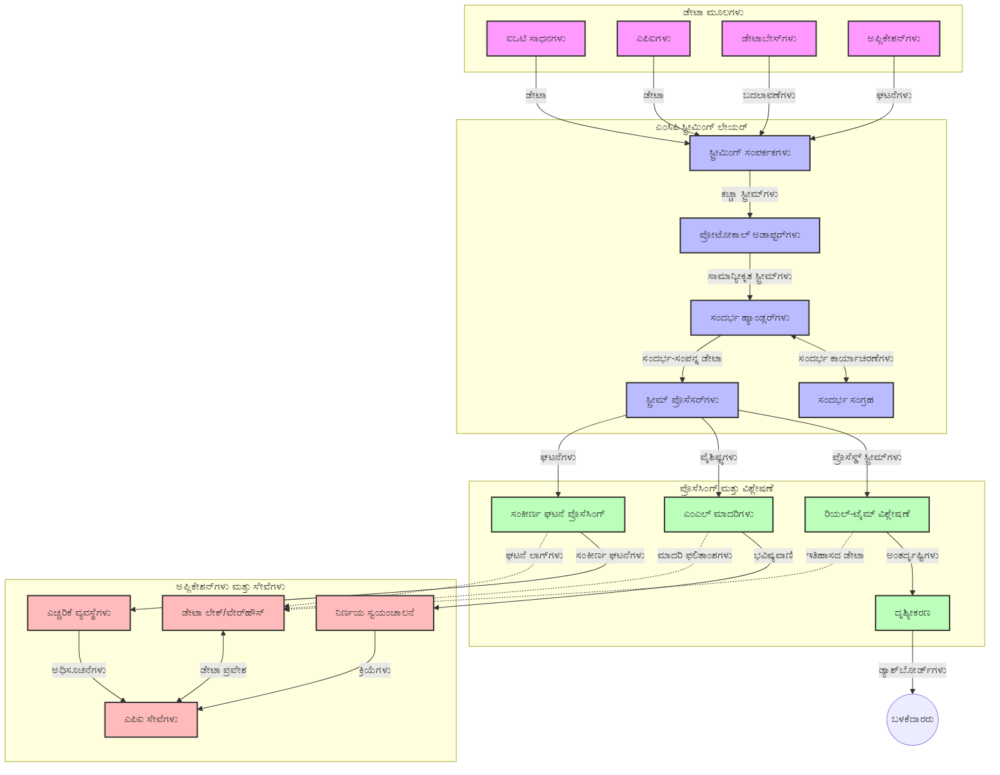

<!--
CO_OP_TRANSLATOR_METADATA:
{
  "original_hash": "195f7287638b77a549acadd96c8f981c",
  "translation_date": "2025-12-11T15:23:42+00:00",
  "source_file": "05-AdvancedTopics/mcp-realtimestreaming/README.md",
  "language_code": "kn"
}
-->
# ರಿಯಲ್-ಟೈಮ್ ಡೇಟಾ ಸ್ಟ್ರೀಮಿಂಗ್‌ಗಾಗಿ ಮಾದರಿ ಸಂದರ್ಭ ಪ್ರೋಟೋಕಾಲ್

## ಅವಲೋಕನ

ರಿಯಲ್-ಟೈಮ್ ಡೇಟಾ ಸ್ಟ್ರೀಮಿಂಗ್ ಇಂದಿನ ಡೇಟಾ ಚಾಲಿತ ಜಗತ್ತಿನಲ್ಲಿ ಅಗತ್ಯವಾಗಿದ್ದು, ವ್ಯವಹಾರಗಳು ಮತ್ತು ಅಪ್ಲಿಕೇಶನ್‌ಗಳಿಗೆ ತಕ್ಷಣದ ನಿರ್ಧಾರಗಳನ್ನು ಕೈಗೊಳ್ಳಲು ತಕ್ಷಣದ ಮಾಹಿತಿಗೆ ಪ್ರವೇಶ ಬೇಕಾಗುತ್ತದೆ. ಮಾದರಿ ಸಂದರ್ಭ ಪ್ರೋಟೋಕಾಲ್ (MCP) ಈ ರಿಯಲ್-ಟೈಮ್ ಸ್ಟ್ರೀಮಿಂಗ್ ಪ್ರಕ್ರಿಯೆಗಳನ್ನು ಸುಧಾರಿಸುವಲ್ಲಿ ಮಹತ್ವದ ಪ್ರಗತಿಯನ್ನು ಪ್ರತಿನಿಧಿಸುತ್ತದೆ, ಡೇಟಾ ಪ್ರಕ್ರಿಯೆ ಕಾರ್ಯಕ್ಷಮತೆಯನ್ನು ಹೆಚ್ಚಿಸುವುದು, ಸಂದರ್ಭದ ಅಖಂಡತೆಯನ್ನು ಕಾಪಾಡುವುದು ಮತ್ತು ಒಟ್ಟು ವ್ಯವಸ್ಥೆಯ ಕಾರ್ಯಕ್ಷಮತೆಯನ್ನು ಸುಧಾರಿಸುವುದು.

ಈ ಮಾಯಾಜಾಲವು MCP ರಿಯಲ್-ಟೈಮ್ ಡೇಟಾ ಸ್ಟ್ರೀಮಿಂಗ್ ಅನ್ನು ಹೇಗೆ ಪರಿವರ್ತಿಸುತ್ತದೆ ಎಂಬುದನ್ನು ಅನ್ವೇಷಿಸುತ್ತದೆ, AI ಮಾದರಿಗಳು, ಸ್ಟ್ರೀಮಿಂಗ್ ವೇದಿಕೆಗಳು ಮತ್ತು ಅಪ್ಲಿಕೇಶನ್‌ಗಳ ನಡುವೆ ಸಂದರ್ಭ ನಿರ್ವಹಣೆಗೆ ಮಾನಕೃತ ವಿಧಾನವನ್ನು ಒದಗಿಸುವ ಮೂಲಕ.

## ರಿಯಲ್-ಟೈಮ್ ಡೇಟಾ ಸ್ಟ್ರೀಮಿಂಗ್ ಪರಿಚಯ

ರಿಯಲ್-ಟೈಮ್ ಡೇಟಾ ಸ್ಟ್ರೀಮಿಂಗ್ ಎಂದರೆ ಉತ್ಪಾದನೆಯಾಗುತ್ತಿರುವಂತೆ ಡೇಟಾವನ್ನು ನಿರಂತರವಾಗಿ ವರ್ಗಾಯಿಸುವುದು, ಪ್ರಕ್ರಿಯೆಗೊಳಿಸುವುದು ಮತ್ತು ವಿಶ್ಲೇಷಿಸುವ ತಂತ್ರಜ್ಞಾನ ಪರಿಕಲ್ಪನೆ, ಇದು ವ್ಯವಸ್ಥೆಗಳಿಗೆ ಹೊಸ ಮಾಹಿತಿಗೆ ತಕ್ಷಣ ಪ್ರತಿಕ್ರಿಯಿಸಲು ಅವಕಾಶ ನೀಡುತ್ತದೆ. ಸ್ಥಿರ ಡೇಟಾಸೆಟ್‌ಗಳ ಮೇಲೆ ಕಾರ್ಯನಿರ್ವಹಿಸುವ ಸಾಂಪ್ರದಾಯಿಕ ಬ್ಯಾಚ್ ಪ್ರಕ್ರಿಯೆಯಿಂದ ಭಿನ್ನವಾಗಿ, ಸ್ಟ್ರೀಮಿಂಗ್ ಚಲಿಸುತ್ತಿರುವ ಡೇಟಾವನ್ನು ಪ್ರಕ್ರಿಯೆಗೊಳಿಸುತ್ತದೆ, ಕಡಿಮೆ ವಿಳಂಬದೊಂದಿಗೆ ಒಳನೋಟಗಳು ಮತ್ತು ಕ್ರಮಗಳನ್ನು ಒದಗಿಸುತ್ತದೆ.

### ರಿಯಲ್-ಟೈಮ್ ಡೇಟಾ ಸ್ಟ್ರೀಮಿಂಗ್‌ನ ಮೂಲ ತತ್ವಗಳು:

- **ನಿರಂತರ ಡೇಟಾ ಹರಿವು**: ಡೇಟಾ ಘಟನೆಗಳು ಅಥವಾ ದಾಖಲೆಗಳ ನಿರಂತರ, ಎಂದಿಗೂ ನಿಲ್ಲದ ಹರಿವಿನಂತೆ ಪ್ರಕ್ರಿಯೆಗೊಳಿಸಲಾಗುತ್ತದೆ.
- **ಕಡಿಮೆ ವಿಳಂಬ ಪ್ರಕ್ರಿಯೆ**: ಡೇಟಾ ಉತ್ಪಾದನೆ ಮತ್ತು ಪ್ರಕ್ರಿಯೆಗೊಳಿಸುವಿಕೆಯ ನಡುವೆ ಸಮಯವನ್ನು ಕನಿಷ್ಠಗೊಳಿಸಲು ವ್ಯವಸ್ಥೆಗಳು ವಿನ್ಯಾಸಗೊಳಿಸಲಾಗಿದೆ.
- **ವಿಸ್ತರಣೀಯತೆ**: ಸ್ಟ್ರೀಮಿಂಗ್ ವಾಸ್ತುಶಿಲ್ಪಗಳು ಬದಲಾದ ಡೇಟಾ ಪ್ರಮಾಣ ಮತ್ತು ವೇಗವನ್ನು ನಿರ್ವಹಿಸಬೇಕು.
- **ದೋಷ ಸಹಿಷ್ಣುತೆ**: ಡೇಟಾ ಹರಿವನ್ನು ನಿರಂತರವಾಗಿರಿಸಲು ವ್ಯವಸ್ಥೆಗಳು ವೈಫಲ್ಯಗಳಿಗೆ ಪ್ರತಿರೋಧಕವಾಗಿರಬೇಕು.
- **ಸ್ಥಿತಿಗತ ಪ್ರಕ್ರಿಯೆ**: ಘಟನೆಗಳ ನಡುವೆ ಸಂದರ್ಭವನ್ನು ಕಾಪಾಡುವುದು ಅರ್ಥಪೂರ್ಣ ವಿಶ್ಲೇಷಣೆಗೆ ಅತ್ಯಾವಶ್ಯಕ.

### ಮಾದರಿ ಸಂದರ್ಭ ಪ್ರೋಟೋಕಾಲ್ ಮತ್ತು ರಿಯಲ್-ಟೈಮ್ ಸ್ಟ್ರೀಮಿಂಗ್

ಮಾದರಿ ಸಂದರ್ಭ ಪ್ರೋಟೋಕಾಲ್ (MCP) ರಿಯಲ್-ಟೈಮ್ ಸ್ಟ್ರೀಮಿಂಗ್ ಪರಿಸರಗಳಲ್ಲಿ ಹಲವಾರು ಪ್ರಮುಖ ಸವಾಲುಗಳನ್ನು ಪರಿಹರಿಸುತ್ತದೆ:

1. **ಸಂದರ್ಭದ ನಿರಂತರತೆ**: MCP ವಿತರಿತ ಸ್ಟ್ರೀಮಿಂಗ್ ಘಟಕಗಳ ನಡುವೆ ಸಂದರ್ಭವನ್ನು ಹೇಗೆ ಕಾಪಾಡಬೇಕು ಎಂಬುದನ್ನು ಮಾನಕೃತಗೊಳಿಸುತ್ತದೆ, AI ಮಾದರಿಗಳು ಮತ್ತು ಪ್ರಕ್ರಿಯೆಗೊಳಿಸುವ ನೋಡ್‌ಗಳಿಗೆ ಸಂಬಂಧಿತ ಇತಿಹಾಸ ಮತ್ತು ಪರಿಸರ ಸಂದರ್ಭಕ್ಕೆ ಪ್ರವೇಶವನ್ನು ಖಚಿತಪಡಿಸುತ್ತದೆ.

2. **ಕಾರ್ಯಕ್ಷಮ ಸ್ಥಿತಿ ನಿರ್ವಹಣೆ**: ಸಂದರ್ಭ ಪ್ರಸರಣಕ್ಕೆ ರಚನಾತ್ಮಕ ಯಂತ್ರಗಳನ್ನು ಒದಗಿಸುವ ಮೂಲಕ, MCP ಸ್ಟ್ರೀಮಿಂಗ್ ಪೈಪ್ಲೈನ್‌ಗಳಲ್ಲಿ ಸ್ಥಿತಿ ನಿರ್ವಹಣೆಯ ಭಾರವನ್ನು ಕಡಿಮೆ ಮಾಡುತ್ತದೆ.

3. **ಪರಸ್ಪರ ಕಾರ್ಯಕ್ಷಮತೆ**: MCP ವಿಭಿನ್ನ ಸ್ಟ್ರೀಮಿಂಗ್ ತಂತ್ರಜ್ಞಾನಗಳು ಮತ್ತು AI ಮಾದರಿಗಳ ನಡುವೆ ಸಂದರ್ಭ ಹಂಚಿಕೆಗೆ ಸಾಮಾನ್ಯ ಭಾಷೆಯನ್ನು ಸೃಷ್ಟಿಸುತ್ತದೆ, ಹೆಚ್ಚು ಲವಚಿಕ ಮತ್ತು ವಿಸ್ತರಣೀಯ ವಾಸ್ತುಶಿಲ್ಪಗಳಿಗೆ ಅವಕಾಶ ನೀಡುತ್ತದೆ.

4. **ಸ್ಟ್ರೀಮಿಂಗ್-ಆಪ್ಟಿಮೈಜ್ಡ್ ಸಂದರ್ಭ**: MCP ಅನುಷ್ಠಾನಗಳು ರಿಯಲ್-ಟೈಮ್ ನಿರ್ಧಾರ ಕೈಗೊಳ್ಳುವಿಕೆಗೆ ಅತ್ಯಂತ ಸಂಬಂಧಿತ ಸಂದರ್ಭ ಅಂಶಗಳನ್ನು ಪ್ರಾಥಮ್ಯ ನೀಡಬಹುದು, ಕಾರ್ಯಕ್ಷಮತೆ ಮತ್ತು ನಿಖರತೆಯನ್ನು ಎರಡನ್ನೂ ಸುಧಾರಿಸುವಂತೆ.

5. **ಅನುಕೂಲಿತ ಪ್ರಕ್ರಿಯೆ**: MCP ಮೂಲಕ ಸರಿಯಾದ ಸಂದರ್ಭ ನಿರ್ವಹಣೆಯೊಂದಿಗೆ, ಸ್ಟ್ರೀಮಿಂಗ್ ವ್ಯವಸ್ಥೆಗಳು ಡೇಟಾದಲ್ಲಿ ಬದಲಾಗುತ್ತಿರುವ ಪರಿಸ್ಥಿತಿಗಳು ಮತ್ತು ಮಾದರಿಗಳ ಆಧಾರದ ಮೇಲೆ ಪ್ರಕ್ರಿಯೆಯನ್ನು ಗತಿಶೀಲವಾಗಿ ಹೊಂದಿಸಬಹುದು.

ಇಂದಿನ ಅಪ್ಲಿಕೇಶನ್‌ಗಳಲ್ಲಿ, ಐಒಟಿ ಸೆನ್ಸಾರ್ ನೆಟ್‌ವರ್ಕ್‌ಗಳಿಂದ ಹಣಕಾಸು ವ್ಯಾಪಾರದ ವೇದಿಕೆಗಳವರೆಗೆ, MCP ಮತ್ತು ಸ್ಟ್ರೀಮಿಂಗ್ ತಂತ್ರಜ್ಞಾನಗಳ ಸಂಯೋಜನೆ ಹೆಚ್ಚು ಬುದ್ಧಿವಂತ, ಸಂದರ್ಭ-ಜಾಗೃತ ಪ್ರಕ್ರಿಯೆಯನ್ನು ಸಾಧ್ಯಮಾಡುತ್ತದೆ, ಇದು ರಿಯಲ್-ಟೈಮ್‌ನಲ್ಲಿ ಸಂಕೀರ್ಣ, ಬದಲಾಗುತ್ತಿರುವ ಪರಿಸ್ಥಿತಿಗಳಿಗೆ ಸೂಕ್ತವಾಗಿ ಪ್ರತಿಕ್ರಿಯಿಸಬಹುದು.

## ಕಲಿಕೆಯ ಉದ್ದೇಶಗಳು

ಈ ಪಾಠದ ಅಂತ್ಯಕ್ಕೆ, ನೀವು ಸಾಧ್ಯವಾಗುವುದು:

- ರಿಯಲ್-ಟೈಮ್ ಡೇಟಾ ಸ್ಟ್ರೀಮಿಂಗ್ ಮತ್ತು ಅದರ ಸವಾಲುಗಳ ಮೂಲಭೂತಗಳನ್ನು ಅರ್ಥಮಾಡಿಕೊಳ್ಳುವುದು
- ಮಾದರಿ ಸಂದರ್ಭ ಪ್ರೋಟೋಕಾಲ್ (MCP) ರಿಯಲ್-ಟೈಮ್ ಡೇಟಾ ಸ್ಟ್ರೀಮಿಂಗ್ ಅನ್ನು ಹೇಗೆ ಸುಧಾರಿಸುತ್ತದೆ ಎಂಬುದನ್ನು ವಿವರಿಸುವುದು
- Kafka ಮತ್ತು Pulsar ಮುಂತಾದ ಜನಪ್ರಿಯ ಫ್ರೇಮ್ವರ್ಕ್‌ಗಳನ್ನು ಬಳಸಿ MCP ಆಧಾರಿತ ಸ್ಟ್ರೀಮಿಂಗ್ ಪರಿಹಾರಗಳನ್ನು ಅನುಷ್ಠಾನಗೊಳಿಸುವುದು
- MCP ಬಳಸಿ ದೋಷ-ಸಹಿಷ್ಣು, ಉನ್ನತ ಕಾರ್ಯಕ್ಷಮತೆಯ ಸ್ಟ್ರೀಮಿಂಗ್ ವಾಸ್ತುಶಿಲ್ಪಗಳನ್ನು ವಿನ್ಯಾಸಗೊಳಿಸಿ ನಿಯೋಜಿಸುವುದು
- MCP ತತ್ವಗಳನ್ನು ಐಒಟಿ, ಹಣಕಾಸು ವ್ಯಾಪಾರ ಮತ್ತು AI ಚಾಲಿತ ವಿಶ್ಲೇಷಣೆ ಬಳಕೆ ಪ್ರಕರಣಗಳಿಗೆ ಅನ್ವಯಿಸುವುದು
- MCP ಆಧಾರಿತ ಸ್ಟ್ರೀಮಿಂಗ್ ತಂತ್ರಜ್ಞಾನಗಳಲ್ಲಿ ಉದಯೋನ್ಮುಖ ಪ್ರವೃತ್ತಿಗಳು ಮತ್ತು ಭವಿಷ್ಯದ ನವೀನತೆಗಳನ್ನು ಮೌಲ್ಯಮಾಪನ ಮಾಡುವುದು

### ವ್ಯಾಖ್ಯಾನ ಮತ್ತು ಮಹತ್ವ

ರಿಯಲ್-ಟೈಮ್ ಡೇಟಾ ಸ್ಟ್ರೀಮಿಂಗ್ ಎಂದರೆ ಕಡಿಮೆ ವಿಳಂಬದೊಂದಿಗೆ ಡೇಟಾವನ್ನು ನಿರಂತರವಾಗಿ ಉತ್ಪಾದಿಸುವುದು, ಪ್ರಕ್ರಿಯೆಗೊಳಿಸುವುದು ಮತ್ತು ವಿತರಿಸುವುದು. ಬ್ಯಾಚ್ ಪ್ರಕ್ರಿಯೆಯಂತೆ, ಡೇಟಾವನ್ನು ಗುಂಪುಗಳಲ್ಲಿ ಸಂಗ್ರಹಿಸಿ ಪ್ರಕ್ರಿಯೆಗೊಳಿಸುವುದರ ಬದಲು, ಸ್ಟ್ರೀಮಿಂಗ್ ಡೇಟಾವನ್ನು ಆಗಾಗ್ಗೆ ಪ್ರಕ್ರಿಯೆಗೊಳಿಸಲಾಗುತ್ತದೆ, ತಕ್ಷಣದ ಒಳನೋಟಗಳು ಮತ್ತು ಕ್ರಮಗಳನ್ನು ಸಾಧ್ಯಮಾಡುತ್ತದೆ.

ರಿಯಲ್-ಟೈಮ್ ಡೇಟಾ ಸ್ಟ್ರೀಮಿಂಗ್‌ನ ಪ್ರಮುಖ ಲಕ್ಷಣಗಳು:

- **ಕಡಿಮೆ ವಿಳಂಬ**: ಮಿಲಿಸೆಕೆಂಡುಗಳಿಂದ ಸೆಕೆಂಡುಗಳೊಳಗೆ ಡೇಟಾ ಪ್ರಕ್ರಿಯೆ ಮತ್ತು ವಿಶ್ಲೇಷಣೆ
- **ನಿರಂತರ ಹರಿವು**: ವಿವಿಧ ಮೂಲಗಳಿಂದ ನಿರಂತರ ಡೇಟಾ ಹರಿವು
- **ತಕ್ಷಣದ ಪ್ರಕ್ರಿಯೆ**: ಬ್ಯಾಚ್‌ಗಳಲ್ಲದೆ ಡೇಟಾ ಬಂದಂತೆ ವಿಶ್ಲೇಷಣೆ
- **ಘಟನೆ-ಚಾಲಿತ ವಾಸ್ತುಶಿಲ್ಪ**: ಘಟನೆಗಳು ಸಂಭವಿಸಿದಂತೆ ಪ್ರತಿಕ್ರಿಯಿಸುವುದು

### ಸಾಂಪ್ರದಾಯಿಕ ಡೇಟಾ ಸ್ಟ್ರೀಮಿಂಗ್‌ನ ಸವಾಲುಗಳು

ಸಾಂಪ್ರದಾಯಿಕ ಡೇಟಾ ಸ್ಟ್ರೀಮಿಂಗ್ ವಿಧಾನಗಳು ಹಲವಾರು ಮಿತಿಗಳನ್ನು ಎದುರಿಸುತ್ತವೆ:

1. **ಸಂದರ್ಭ ನಷ್ಟ**: ವಿತರಿತ ವ್ಯವಸ್ಥೆಗಳ ನಡುವೆ ಸಂದರ್ಭವನ್ನು ಕಾಪಾಡಲು ಕಷ್ಟ
2. **ವಿಸ್ತರಣಾ ಸಮಸ್ಯೆಗಳು**: ಹೆಚ್ಚಿನ ಪ್ರಮಾಣ ಮತ್ತು ವೇಗದ ಡೇಟಾವನ್ನು ನಿರ್ವಹಿಸಲು ಸವಾಲುಗಳು
3. **ಸಂಯೋಜನೆ ಸಂಕೀರ್ಣತೆ**: ವಿಭಿನ್ನ ವ್ಯವಸ್ಥೆಗಳ ನಡುವೆ ಪರಸ್ಪರ ಕಾರ್ಯಕ್ಷಮತೆಯ ಸಮಸ್ಯೆಗಳು
4. **ವಿಳಂಬ ನಿರ್ವಹಣೆ**: ಥ್ರೂಪುಟ್ ಮತ್ತು ಪ್ರಕ್ರಿಯೆ ಸಮಯದ ಸಮತೋಲನ
5. **ಡೇಟಾ ಸुसಂಗತತೆ**: ಸ್ಟ್ರೀಮಿನಲ್ಲಿನ ಡೇಟಾ ನಿಖರತೆ ಮತ್ತು ಪೂರ್ಣತೆಯನ್ನು ಖಚಿತಪಡಿಸುವುದು

## ಮಾದರಿ ಸಂದರ್ಭ ಪ್ರೋಟೋಕಾಲ್ (MCP) ಅರ್ಥಮಾಡಿಕೊಳ್ಳುವುದು

### MCP ಎಂದರೆ ಏನು?

ಮಾದರಿ ಸಂದರ್ಭ ಪ್ರೋಟೋಕಾಲ್ (MCP) ಎಂದರೆ AI ಮಾದರಿಗಳು ಮತ್ತು ಅಪ್ಲಿಕೇಶನ್‌ಗಳ ನಡುವೆ ಪರಿಣಾಮಕಾರಿಯಾಗಿ ಸಂವಹನ ಮಾಡಲು ವಿನ್ಯಾಸಗೊಳಿಸಿದ ಮಾನಕೃತ ಸಂವಹನ ಪ್ರೋಟೋಕಾಲ್. ರಿಯಲ್-ಟೈಮ್ ಡೇಟಾ ಸ್ಟ್ರೀಮಿಂಗ್ ಸಂದರ್ಭದಲ್ಲಿ, MCP ಕೆಳಗಿನವುಗಳಿಗೆ ಫ್ರೇಮ್ವರ್ಕ್ ಒದಗಿಸುತ್ತದೆ:

- ಡೇಟಾ ಪೈಪ್ಲೈನ್‌ನಲ್ಲಿ ಸಂದರ್ಭವನ್ನು ಕಾಪಾಡುವುದು
- ಡೇಟಾ ವಿನಿಮಯ ಸ್ವರೂಪಗಳನ್ನು ಮಾನಕೃತಗೊಳಿಸುವುದು
- ದೊಡ್ಡ ಡೇಟಾಸೆಟ್‌ಗಳ ಪ್ರಸರಣವನ್ನು ಸುಧಾರಿಸುವುದು
- ಮಾದರಿ-ಮಾದರಿ ಮತ್ತು ಮಾದರಿ-ಅಪ್ಲಿಕೇಶನ್ ಸಂವಹನವನ್ನು ಹೆಚ್ಚಿಸುವುದು

### ಮೂಲ ಘಟಕಗಳು ಮತ್ತು ವಾಸ್ತುಶಿಲ್ಪ

ರಿಯಲ್-ಟೈಮ್ ಸ್ಟ್ರೀಮಿಂಗ್‌ಗೆ MCP ವಾಸ್ತುಶಿಲ್ಪದಲ್ಲಿ ಕೆಲವು ಪ್ರಮುಖ ಘಟಕಗಳಿವೆ:

1. **ಸಂದರ್ಭ ಹ್ಯಾಂಡ್ಲರ್‌ಗಳು**: ಸ್ಟ್ರೀಮಿಂಗ್ ಪೈಪ್ಲೈನ್‌ನಲ್ಲಿ ಸಂದರ್ಭ ಮಾಹಿತಿಯನ್ನು ನಿರ್ವಹಿಸಿ ಕಾಪಾಡುವುದು
2. **ಸ್ಟ್ರೀಮ್ ಪ್ರೊಸೆಸರ್‌ಗಳು**: ಸಂದರ್ಭ-ಜಾಗೃತ ತಂತ್ರಗಳನ್ನು ಬಳಸಿ ಬರುವ ಡೇಟಾ ಸ್ಟ್ರೀಮ್‌ಗಳನ್ನು ಪ್ರಕ್ರಿಯೆಗೊಳಿಸುವುದು
3. **ಪ್ರೋಟೋಕಾಲ್ ಅಡಾಪ್ಟರ್‌ಗಳು**: ವಿಭಿನ್ನ ಸ್ಟ್ರೀಮಿಂಗ್ ಪ್ರೋಟೋಕಾಲ್‌ಗಳ ನಡುವೆ ಪರಿವರ್ತನೆ ಮಾಡುವುದು ಮತ್ತು ಸಂದರ್ಭವನ್ನು ಕಾಪಾಡುವುದು
4. **ಸಂದರ್ಭ ಸಂಗ್ರಹಣೆ**: ಸಂದರ್ಭ ಮಾಹಿತಿಯನ್ನು ಪರಿಣಾಮಕಾರಿಯಾಗಿ ಸಂಗ್ರಹಿಸಿ ಪಡೆಯುವುದು
5. **ಸ್ಟ್ರೀಮಿಂಗ್ ಸಂಪರ್ಕಕಗಳು**: ವಿವಿಧ ಸ್ಟ್ರೀಮಿಂಗ್ ವೇದಿಕೆಗಳಿಗೆ ಸಂಪರ್ಕ (Kafka, Pulsar, Kinesis ಮುಂತಾದವು)


### MCP ರಿಯಲ್-ಟೈಮ್ ಡೇಟಾ ಹ್ಯಾಂಡ್ಲಿಂಗ್ ಅನ್ನು ಹೇಗೆ ಸುಧಾರಿಸುತ್ತದೆ

MCP ಸಾಂಪ್ರದಾಯಿಕ ಸ್ಟ್ರೀಮಿಂಗ್ ಸವಾಲುಗಳನ್ನು ಈ ಮೂಲಕ ಪರಿಹರಿಸುತ್ತದೆ:

- **ಸಂದರ್ಭದ ಅಖಂಡತೆ**: ಸಂಪೂರ್ಣ ಪೈಪ್ಲೈನ್‌ನಲ್ಲಿ ಡೇಟಾ ಬಿಂದುಗಳ ನಡುವಿನ ಸಂಬಂಧಗಳನ್ನು ಕಾಪಾಡುವುದು
- **ಆಪ್ಟಿಮೈಜ್ಡ್ ಪ್ರಸರಣ**: ಬುದ್ಧಿವಂತ ಸಂದರ್ಭ ನಿರ್ವಹಣೆಯ ಮೂಲಕ ಡೇಟಾ ವಿನಿಮಯದಲ್ಲಿ ಪುನರಾವರ್ತನೆಯನ್ನು ಕಡಿಮೆ ಮಾಡುವುದು
- **ಮಾನಕೃತ ಇಂಟರ್ಫೇಸ್‌ಗಳು**: ಸ್ಟ್ರೀಮಿಂಗ್ ಘಟಕಗಳಿಗೆ ಸತತ APIಗಳನ್ನು ಒದಗಿಸುವುದು
- **ಕಡಿಮೆ ವಿಳಂಬ**: ಪರಿಣಾಮಕಾರಿಯಾದ ಸಂದರ್ಭ ನಿರ್ವಹಣೆಯ ಮೂಲಕ ಪ್ರಕ್ರಿಯೆ ಭಾರವನ್ನು ಕಡಿಮೆ ಮಾಡುವುದು
- **ಸುಧಾರಿತ ವಿಸ್ತರಣೀಯತೆ**: ಸಂದರ್ಭವನ್ನು ಕಾಪಾಡುತ್ತಾ ಅಡ್ಡವಿಸ್ತಾರವನ್ನು ಬೆಂಬಲಿಸುವುದು

## ಸಂಯೋಜನೆ ಮತ್ತು ಅನುಷ್ಠಾನ

ರಿಯಲ್-ಟೈಮ್ ಡೇಟಾ ಸ್ಟ್ರೀಮಿಂಗ್ ವ್ಯವಸ್ಥೆಗಳು ಕಾರ್ಯಕ್ಷಮತೆ ಮತ್ತು ಸಂದರ್ಭದ ಅಖಂಡತೆಯನ್ನು ಕಾಪಾಡಲು ಜಾಗರೂಕ ವಾಸ್ತುಶಿಲ್ಪ ವಿನ್ಯಾಸ ಮತ್ತು ಅನುಷ್ಠಾನವನ್ನು ಅಗತ್ಯವಿದೆ. ಮಾದರಿ ಸಂದರ್ಭ ಪ್ರೋಟೋಕಾಲ್ AI ಮಾದರಿಗಳು ಮತ್ತು ಸ್ಟ್ರೀಮಿಂಗ್ ತಂತ್ರಜ್ಞಾನಗಳನ್ನು ಸಂಯೋಜಿಸಲು ಮಾನಕೃತ ವಿಧಾನವನ್ನು ಒದಗಿಸುತ್ತದೆ, ಹೆಚ್ಚು ಸುಧಾರಿತ, ಸಂದರ್ಭ-ಜಾಗೃತ ಪ್ರಕ್ರಿಯೆ ಪೈಪ್ಲೈನ್‌ಗಳಿಗೆ ಅವಕಾಶ ನೀಡುತ್ತದೆ.

### ಸ್ಟ್ರೀಮಿಂಗ್ ವಾಸ್ತುಶಿಲ್ಪಗಳಲ್ಲಿ MCP ಸಂಯೋಜನೆಯ ಅವಲೋಕನ

ರಿಯಲ್-ಟೈಮ್ ಸ್ಟ್ರೀಮಿಂಗ್ ಪರಿಸರಗಳಲ್ಲಿ MCP ಅನುಷ್ಠಾನಕ್ಕೆ ಕೆಲವು ಪ್ರಮುಖ ಪರಿಗಣನೆಗಳಿವೆ:

1. **ಸಂದರ್ಭ ಸರಣೀಕರಣ ಮತ್ತು ಸಾರಿಗೆ**: MCP ಸ್ಟ್ರೀಮಿಂಗ್ ಡೇಟಾ ಪ್ಯಾಕೆಟ್‌ಗಳಲ್ಲಿ ಸಂದರ್ಭ ಮಾಹಿತಿಯನ್ನು ಎನ್‌ಕೋಡ್ ಮಾಡಲು ಪರಿಣಾಮಕಾರಿ ಯಂತ್ರಗಳನ್ನು ಒದಗಿಸುತ್ತದೆ, ಅಗತ್ಯ ಸಂದರ್ಭವು ಪ್ರಕ್ರಿಯೆ ಪೈಪ್ಲೈನ್ ಮೂಲಕ ಡೇಟಾ ಜೊತೆಗೆ ಸಾಗುತ್ತದೆ. ಇದರಲ್ಲಿ ಸ್ಟ್ರೀಮಿಂಗ್ ಸಾರಿಗೆಗೆ ಆಪ್ಟಿಮೈಜ್ಡ್ ಮಾನಕೃತ ಸರಣೀಕರಣ ಸ್ವರೂಪಗಳು ಸೇರಿವೆ.

2. **ಸ್ಥಿತಿಗತ ಸ್ಟ್ರೀಮ್ ಪ್ರಕ್ರಿಯೆ**: MCP ಪ್ರಕ್ರಿಯೆ ನೋಡ್‌ಗಳ ನಡುವೆ ಸತತ ಸಂದರ್ಭ ಪ್ರತಿನಿಧಾನವನ್ನು ಕಾಪಾಡುವ ಮೂಲಕ ಹೆಚ್ಚು ಬುದ್ಧಿವಂತ ಸ್ಥಿತಿಗತ ಪ್ರಕ್ರಿಯೆಯನ್ನು ಸಾಧ್ಯಮಾಡುತ್ತದೆ. ಇದು ಸಾಂಪ್ರದಾಯಿಕವಾಗಿ ಸವಾಲುಗಳಾದ ವಿತರಿತ ಸ್ಟ್ರೀಮಿಂಗ್ ವಾಸ್ತುಶಿಲ್ಪಗಳಲ್ಲಿ ವಿಶೇಷವಾಗಿ ಉಪಯುಕ್ತ.

3. **ಘಟನೆ-ಸಮಯ ಮತ್ತು ಪ್ರಕ್ರಿಯೆ-ಸಮಯ**: ಸ್ಟ್ರೀಮಿಂಗ್ ವ್ಯವಸ್ಥೆಗಳಲ್ಲಿ ಘಟನೆಗಳು ಯಾವಾಗ ಸಂಭವಿಸಿದವು ಮತ್ತು ಅವುಗಳನ್ನು ಯಾವಾಗ ಪ್ರಕ್ರಿಯೆಗೊಳಿಸಲಾಗಿದೆ ಎಂಬ ವ್ಯತ್ಯಾಸವನ್ನು MCP ಅನುಷ್ಠಾನಗಳು ಪರಿಹರಿಸಬೇಕು. ಪ್ರೋಟೋಕಾಲ್ ಘಟನೆ ಸಮಯ ಅರ್ಥಗಳನ್ನು ಕಾಪಾಡುವ ಕಾಲಿಕ ಸಂದರ್ಭವನ್ನು ಒಳಗೊಂಡಿರಬಹುದು.

4. **ಬ್ಯಾಕ್‌ಪ್ರೆಶರ್ ನಿರ್ವಹಣೆ**: ಸಂದರ್ಭ ನಿರ್ವಹಣೆಯನ್ನು ಮಾನಕೃತಗೊಳಿಸುವ ಮೂಲಕ, MCP ಸ್ಟ್ರೀಮಿಂಗ್ ವ್ಯವಸ್ಥೆಗಳಲ್ಲಿ ಬ್ಯಾಕ್‌ಪ್ರೆಶರ್ ನಿರ್ವಹಣೆಗೆ ಸಹಾಯ ಮಾಡುತ್ತದೆ, ಘಟಕಗಳು ತಮ್ಮ ಪ್ರಕ್ರಿಯೆ ಸಾಮರ್ಥ್ಯಗಳನ್ನು ಸಂವಹನ ಮಾಡಬಹುದು ಮತ್ತು ಹರಿವನ್ನು ಹೊಂದಿಸಬಹುದು.

5. **ಸಂದರ್ಭ ವಿಂಡೋಯಿಂಗ್ ಮತ್ತು ಸಂಗ್ರಹಣೆ**: MCP ಕಾಲಿಕ ಮತ್ತು ಸಂಬಂಧಿತ ಸಂದರ್ಭಗಳ ರಚನಾತ್ಮಕ ಪ್ರತಿನಿಧಾನಗಳನ್ನು ಒದಗಿಸುವ ಮೂಲಕ ಹೆಚ್ಚು ಸುಧಾರಿತ ವಿಂಡೋಯಿಂಗ್ ಕಾರ್ಯಾಚರಣೆಗಳನ್ನು ಸಾಧ್ಯಮಾಡುತ್ತದೆ, ಘಟನೆ ಸ್ಟ್ರೀಮ್‌ಗಳಾದ್ಯಂತ ಅರ್ಥಪೂರ್ಣ ಸಂಗ್ರಹಣೆಗಳನ್ನು ಅನುಮತಿಸುತ್ತದೆ.

6. **ಖಚಿತ-ಒಮ್ಮೆ ಪ್ರಕ್ರಿಯೆ**: ಖಚಿತ-ಒಮ್ಮೆ ಅರ್ಥಗಳ ಅಗತ್ಯವಿರುವ ಸ್ಟ್ರೀಮಿಂಗ್ ವ್ಯವಸ್ಥೆಗಳಲ್ಲಿ, MCP ವಿತರಿತ ಘಟಕಗಳಾದ್ಯಂತ ಪ್ರಕ್ರಿಯೆ ಸ್ಥಿತಿಯನ್ನು ಟ್ರ್ಯಾಕ್ ಮತ್ತು ಪರಿಶೀಲಿಸಲು ಪ್ರಕ್ರಿಯೆ ಮೆಟಾಡೇಟಾವನ್ನು ಒಳಗೊಂಡಿರಬಹುದು.

ವಿಭಿನ್ನ ಸ್ಟ್ರೀಮಿಂಗ್ ತಂತ್ರಜ್ಞಾನಗಳಲ್ಲಿ MCP ಅನುಷ್ಠಾನವು ಸಂದರ್ಭ ನಿರ್ವಹಣೆಗೆ ಏಕೀಕೃತ ವಿಧಾನವನ್ನು ಸೃಷ್ಟಿಸುತ್ತದೆ, ಕಸ್ಟಮ್ ಸಂಯೋಜನೆ ಕೋಡ್ ಅಗತ್ಯವನ್ನು ಕಡಿಮೆ ಮಾಡುತ್ತಾ, ಡೇಟಾ ಪೈಪ್ಲೈನ್ ಮೂಲಕ ಸಂದರ್ಭವನ್ನು ಅರ್ಥಪೂರ್ಣವಾಗಿ ಕಾಪಾಡುವ ವ್ಯವಸ್ಥೆಯ ಸಾಮರ್ಥ್ಯವನ್ನು ಹೆಚ್ಚಿಸುತ್ತದೆ.

### ವಿವಿಧ ಡೇಟಾ ಸ್ಟ್ರೀಮಿಂಗ್ ಫ್ರೇಮ್ವರ್ಕ್‌ಗಳಲ್ಲಿ MCP

ಈ ಉದಾಹರಣೆಗಳು ಪ್ರಸ್ತುತ MCP ನಿರ್ದಿಷ್ಟೀಕರಣವನ್ನು ಅನುಸರಿಸುತ್ತವೆ, ಇದು JSON-RPC ಆಧಾರಿತ ಪ್ರೋಟೋಕಾಲ್ ಮತ್ತು ವಿಭಿನ್ನ ಸಾರಿಗೆ ಯಂತ್ರಗಳನ್ನು ಒಳಗೊಂಡಿದೆ. ಕೋಡ್ Kafka ಮತ್ತು Pulsar ಮುಂತಾದ ಸ್ಟ್ರೀಮಿಂಗ್ ವೇದಿಕೆಗಳನ್ನು MCP ಪ್ರೋಟೋಕಾಲ್‌ಗಾಗಿ ಪೂರ್ಣ ಹೊಂದಾಣಿಕೆಯಿಂದ ಸಂಯೋಜಿಸುವ ಕಸ್ಟಮ್ ಸಾರಿಗೆಗಳನ್ನು ಹೇಗೆ ಅನುಷ್ಠಾನಗೊಳಿಸಬಹುದು ಎಂಬುದನ್ನು ತೋರಿಸುತ್ತದೆ.

ಈ ಉದಾಹರಣೆಗಳು ಸ್ಟ್ರೀಮಿಂಗ್ ವೇದಿಕೆಗಳನ್ನು MCP ಜೊತೆಗೆ ಸಂಯೋಜಿಸುವ ಮೂಲಕ ರಿಯಲ್-ಟೈಮ್ ಡೇಟಾ ಪ್ರಕ್ರಿಯೆಯನ್ನು ಹೇಗೆ ಒದಗಿಸಬಹುದು ಮತ್ತು MCP ಗೆ ಕೇಂದ್ರವಾಗಿರುವ ಸಂದರ್ಭ ಜಾಗೃತತೆಯನ್ನು ಹೇಗೆ ಕಾಪಾಡಬಹುದು ಎಂಬುದನ್ನು ತೋರಿಸಲು ವಿನ್ಯಾಸಗೊಳಿಸಲಾಗಿದೆ. ಈ ವಿಧಾನವು ಜೂನ್ 2025 ರ MCP ನಿರ್ದಿಷ್ಟೀಕರಣದ ಪ್ರಸ್ತುತ ಸ್ಥಿತಿಯನ್ನು ನಿಖರವಾಗಿ ಪ್ರತಿಬಿಂಬಿಸುತ್ತದೆ.

MCP ಜನಪ್ರಿಯ ಸ್ಟ್ರೀಮಿಂಗ್ ಫ್ರೇಮ್ವರ್ಕ್‌ಗಳೊಂದಿಗೆ ಸಂಯೋಜಿಸಬಹುದು, ಉದಾಹರಣೆಗೆ:

#### ಅಪಾಚಿ Kafka ಸಂಯೋಜನೆ

```python
import asyncio
import json
from typing import Dict, Any, Optional
from confluent_kafka import Consumer, Producer, KafkaError
from mcp.client import Client, ClientCapabilities
from mcp.core.message import JsonRpcMessage
from mcp.core.transports import Transport

# MCP ಅನ್ನು Kafka ಜೊತೆಗೆ ಸೇರ್ಪಡೆಗೊಳಿಸಲು ಕಸ್ಟಮ್ ಟ್ರಾನ್ಸ್‌ಪೋರ್ಟ್ ಕ್ಲಾಸ್
class KafkaMCPTransport(Transport):
    def __init__(self, bootstrap_servers: str, input_topic: str, output_topic: str):
        self.bootstrap_servers = bootstrap_servers
        self.input_topic = input_topic
        self.output_topic = output_topic
        self.producer = Producer({'bootstrap.servers': bootstrap_servers})
        self.consumer = Consumer({
            'bootstrap.servers': bootstrap_servers,
            'group.id': 'mcp-client-group',
            'auto.offset.reset': 'earliest'
        })
        self.message_queue = asyncio.Queue()
        self.running = False
        self.consumer_task = None
        
    async def connect(self):
        """Connect to Kafka and start consuming messages"""
        self.consumer.subscribe([self.input_topic])
        self.running = True
        self.consumer_task = asyncio.create_task(self._consume_messages())
        return self
        
    async def _consume_messages(self):
        """Background task to consume messages from Kafka and queue them for processing"""
        while self.running:
            try:
                msg = self.consumer.poll(1.0)
                if msg is None:
                    await asyncio.sleep(0.1)
                    continue
                
                if msg.error():
                    if msg.error().code() == KafkaError._PARTITION_EOF:
                        continue
                    print(f"Consumer error: {msg.error()}")
                    continue
                
                # ಸಂದೇಶ ಮೌಲ್ಯವನ್ನು JSON-RPC ಆಗಿ ವಿಶ್ಲೇಷಿಸಿ
                try:
                    message_str = msg.value().decode('utf-8')
                    message_data = json.loads(message_str)
                    mcp_message = JsonRpcMessage.from_dict(message_data)
                    await self.message_queue.put(mcp_message)
                except Exception as e:
                    print(f"Error parsing message: {e}")
            except Exception as e:
                print(f"Error in consumer loop: {e}")
                await asyncio.sleep(1)
    
    async def read(self) -> Optional[JsonRpcMessage]:
        """Read the next message from the queue"""
        try:
            message = await self.message_queue.get()
            return message
        except Exception as e:
            print(f"Error reading message: {e}")
            return None
    
    async def write(self, message: JsonRpcMessage) -> None:
        """Write a message to the Kafka output topic"""
        try:
            message_json = json.dumps(message.to_dict())
            self.producer.produce(
                self.output_topic,
                message_json.encode('utf-8'),
                callback=self._delivery_report
            )
            self.producer.poll(0)  # ಕಾಲ್‌ಬ್ಯಾಕ್‌ಗಳನ್ನು ಪ್ರೇರೇಪಿಸಿ
        except Exception as e:
            print(f"Error writing message: {e}")
    
    def _delivery_report(self, err, msg):
        """Kafka producer delivery callback"""
        if err is not None:
            print(f'Message delivery failed: {err}')
        else:
            print(f'Message delivered to {msg.topic()} [{msg.partition()}]')
    
    async def close(self) -> None:
        """Close the transport"""
        self.running = False
        if self.consumer_task:
            self.consumer_task.cancel()
            try:
                await self.consumer_task
            except asyncio.CancelledError:
                pass
        self.consumer.close()
        self.producer.flush()

# Kafka MCP ಟ್ರಾನ್ಸ್‌ಪೋರ್ಟ್‌ನ ಉದಾಹರಣೆಯ ಬಳಕೆ
async def kafka_mcp_example():
    # Kafka ಟ್ರಾನ್ಸ್‌ಪೋರ್ಟ್‌ನೊಂದಿಗೆ MCP ಕ್ಲೈಂಟ್ ರಚಿಸಿ
    client = Client(
        {"name": "kafka-mcp-client", "version": "1.0.0"},
        ClientCapabilities({})
    )
    
    # Kafka ಟ್ರಾನ್ಸ್‌ಪೋರ್ಟ್ ರಚಿಸಿ ಮತ್ತು ಸಂಪರ್ಕಿಸಿ
    transport = KafkaMCPTransport(
        bootstrap_servers="localhost:9092",
        input_topic="mcp-responses",
        output_topic="mcp-requests"
    )
    
    await client.connect(transport)
    
    try:
        # MCP ಸೆಷನ್ ಅನ್ನು ಪ್ರಾರಂಭಿಸಿ
        await client.initialize()
        
        # MCP ಮೂಲಕ ಉಪಕರಣವನ್ನು ಕಾರ್ಯಗತಗೊಳಿಸುವ ಉದಾಹರಣೆ
        response = await client.execute_tool(
            "process_data",
            {
                "data": "sample data",
                "metadata": {
                    "source": "sensor-1",
                    "timestamp": "2025-06-12T10:30:00Z"
                }
            }
        )
        
        print(f"Tool execution response: {response}")
        
        # ಸ್ವಚ್ಛ ಶಟ್ಡೌನ್
        await client.shutdown()
    finally:
        await transport.close()

# ಉದಾಹರಣೆಯನ್ನು ಚಾಲನೆ ಮಾಡಿ
if __name__ == "__main__":
    asyncio.run(kafka_mcp_example())
```

#### ಅಪಾಚಿ Pulsar ಅನುಷ್ಠಾನ

```python
import asyncio
import json
import pulsar
from typing import Dict, Any, Optional
from mcp.core.message import JsonRpcMessage
from mcp.core.transports import Transport
from mcp.server import Server, ServerOptions
from mcp.server.tools import Tool, ToolExecutionContext, ToolMetadata

# ಪಲ್ಸಾರ್ ಬಳಸಿ ಕಸ್ಟಮ್ MCP ಸಾರಿಗೆ ರಚಿಸಿ
class PulsarMCPTransport(Transport):
    def __init__(self, service_url: str, request_topic: str, response_topic: str):
        self.service_url = service_url
        self.request_topic = request_topic
        self.response_topic = response_topic
        self.client = pulsar.Client(service_url)
        self.producer = self.client.create_producer(response_topic)
        self.consumer = self.client.subscribe(
            request_topic,
            "mcp-server-subscription",
            consumer_type=pulsar.ConsumerType.Shared
        )
        self.message_queue = asyncio.Queue()
        self.running = False
        self.consumer_task = None
    
    async def connect(self):
        """Connect to Pulsar and start consuming messages"""
        self.running = True
        self.consumer_task = asyncio.create_task(self._consume_messages())
        return self
    
    async def _consume_messages(self):
        """Background task to consume messages from Pulsar and queue them for processing"""
        while self.running:
            try:
                # ಟೈಮೌಟ್ ಜೊತೆಗೆ ಅಡ್ಡಿಪಡಿಸದ ಸ್ವೀಕೃತಿ
                msg = self.consumer.receive(timeout_millis=500)
                
                # ಸಂದೇಶವನ್ನು ಪ್ರಕ್ರಿಯೆಗೊಳಿಸಿ
                try:
                    message_str = msg.data().decode('utf-8')
                    message_data = json.loads(message_str)
                    mcp_message = JsonRpcMessage.from_dict(message_data)
                    await self.message_queue.put(mcp_message)
                    
                    # ಸಂದೇಶವನ್ನು ಒಪ್ಪಿಕೊಳ್ಳಿ
                    self.consumer.acknowledge(msg)
                except Exception as e:
                    print(f"Error processing message: {e}")
                    # ದೋಷವಿದ್ದರೆ ನಕಾರಾತ್ಮಕ ಒಪ್ಪಿಗೆಯನ್ನು ನೀಡಿ
                    self.consumer.negative_acknowledge(msg)
            except Exception as e:
                # ಟೈಮೌಟ್ ಅಥವಾ ಇತರ ಹೊರತುಪಡಿಸುವಿಕೆಗಳನ್ನು ನಿರ್ವಹಿಸಿ
                await asyncio.sleep(0.1)
    
    async def read(self) -> Optional[JsonRpcMessage]:
        """Read the next message from the queue"""
        try:
            message = await self.message_queue.get()
            return message
        except Exception as e:
            print(f"Error reading message: {e}")
            return None
    
    async def write(self, message: JsonRpcMessage) -> None:
        """Write a message to the Pulsar output topic"""
        try:
            message_json = json.dumps(message.to_dict())
            self.producer.send(message_json.encode('utf-8'))
        except Exception as e:
            print(f"Error writing message: {e}")
    
    async def close(self) -> None:
        """Close the transport"""
        self.running = False
        if self.consumer_task:
            self.consumer_task.cancel()
            try:
                await self.consumer_task
            except asyncio.CancelledError:
                pass
        self.consumer.close()
        self.producer.close()
        self.client.close()

# ಸ್ಟ್ರೀಮಿಂಗ್ ಡೇಟಾವನ್ನು ಪ್ರಕ್ರಿಯೆಗೊಳಿಸುವ ಮಾದರಿ MCP ಸಾಧನವನ್ನು ವ್ಯಾಖ್ಯಾನಿಸಿ
@Tool(
    name="process_streaming_data",
    description="Process streaming data with context preservation",
    metadata=ToolMetadata(
        required_capabilities=["streaming"]
    )
)
async def process_streaming_data(
    ctx: ToolExecutionContext,
    data: str,
    source: str,
    priority: str = "medium"
) -> Dict[str, Any]:
    """
    Process streaming data while preserving context
    
    Args:
        ctx: Tool execution context
        data: The data to process
        source: The source of the data
        priority: Priority level (low, medium, high)
        
    Returns:
        Dict containing processed results and context information
    """
    # MCP ಸನ್ನಿವೇಶವನ್ನು ಉಪಯೋಗಿಸುವ ಉದಾಹರಣಾ ಪ್ರಕ್ರಿಯೆ
    print(f"Processing data from {source} with priority {priority}")
    
    # MCP ನಿಂದ ಸಂಭಾಷಣಾ ಸನ್ನಿವೇಶವನ್ನು ಪ್ರವೇಶಿಸಿ
    conversation_id = ctx.conversation_id if hasattr(ctx, 'conversation_id') else "unknown"
    
    # ವೃದ್ಧಿಪಡಿಸಿದ ಸನ್ನಿವೇಶದೊಂದಿಗೆ ಫಲಿತಾಂಶಗಳನ್ನು ಹಿಂತಿರುಗಿಸಿ
    return {
        "processed_data": f"Processed: {data}",
        "context": {
            "conversation_id": conversation_id,
            "source": source,
            "priority": priority,
            "processing_timestamp": ctx.get_current_time_iso()
        }
    }

# ಪಲ್ಸಾರ್ ಸಾರಿಗೆಯನ್ನು ಬಳಸಿ MCP ಸರ್ವರ್ ಅನುಷ್ಠಾನದ ಉದಾಹರಣೆ
async def run_mcp_server_with_pulsar():
    # MCP ಸರ್ವರ್ ರಚಿಸಿ
    server = Server(
        {"name": "pulsar-mcp-server", "version": "1.0.0"},
        ServerOptions(
            capabilities={"streaming": True}
        )
    )
    
    # ನಮ್ಮ ಸಾಧನವನ್ನು ನೋಂದಾಯಿಸಿ
    server.register_tool(process_streaming_data)
    
    # ಪಲ್ಸಾರ್ ಸಾರಿಗೆಯನ್ನು ರಚಿಸಿ ಮತ್ತು ಸಂಪರ್ಕಿಸಿ
    transport = PulsarMCPTransport(
        service_url="pulsar://localhost:6650",
        request_topic="mcp-requests",
        response_topic="mcp-responses"
    )
    
    try:
        # ಪಲ್ಸಾರ್ ಸಾರಿಗೆಯೊಂದಿಗೆ ಸರ್ವರ್ ಪ್ರಾರಂಭಿಸಿ
        await server.run(transport)
    finally:
        await transport.close()

# ಸರ್ವರ್ ಅನ್ನು ಚಾಲನೆ ಮಾಡಿ
if __name__ == "__main__":
    asyncio.run(run_mcp_server_with_pulsar())
```

### ನಿಯೋಜನೆಗಾಗಿ ಉತ್ತಮ ಅಭ್ಯಾಸಗಳು

ರಿಯಲ್-ಟೈಮ್ ಸ್ಟ್ರೀಮಿಂಗ್‌ಗೆ MCP ಅನುಷ್ಠಾನಗೊಳಿಸುವಾಗ:

1. **ದೋಷ ಸಹಿಷ್ಣುತೆಗೆ ವಿನ್ಯಾಸ ಮಾಡುವುದು**:
   - ಸರಿಯಾದ ದೋಷ ನಿರ್ವಹಣೆಯನ್ನು ಅನುಷ್ಠಾನಗೊಳಿಸಿ
   - ವಿಫಲ ಸಂದೇಶಗಳಿಗೆ ಡೆಡ್-ಲೇಟರ್ ಕ್ಯೂಗಳನ್ನು ಬಳಸಿ
   - ಐಡಂಪೋಟೆಂಟ್ ಪ್ರೊಸೆಸರ್‌ಗಳನ್ನು ವಿನ್ಯಾಸಗೊಳಿಸಿ

2. **ಕಾರ್ಯಕ್ಷಮತೆಯಿಗಾಗಿ ಆಪ್ಟಿಮೈಸ್ ಮಾಡುವುದು**:
   - ಸೂಕ್ತ ಬಫರ್ ಗಾತ್ರಗಳನ್ನು ಸಂರಚಿಸಿ
   - ಅಗತ್ಯವಿದ್ದಲ್ಲಿ ಬ್ಯಾಚಿಂಗ್ ಬಳಸಿ
   - ಬ್ಯಾಕ್‌ಪ್ರೆಶರ್ ಯಂತ್ರಗಳನ್ನು ಅನುಷ್ಠಾನಗೊಳಿಸಿ

3. **ನಿಗಾ ಮತ್ತು ಅವಲೋಕನ**:
   - ಸ್ಟ್ರೀಮ್ ಪ್ರಕ್ರಿಯೆ ಮೆಟ್ರಿಕ್‌ಗಳನ್ನು ಟ್ರ್ಯಾಕ್ ಮಾಡಿ
   - ಸಂದರ್ಭ ಪ್ರಸರಣವನ್ನು ನಿಗಾ ವಹಿಸಿ
   - ಅನಾಮಲಿಗಳಿಗಾಗಿ ಅಲರ್ಟ್‌ಗಳನ್ನು ಹೊಂದಿಸಿ

4. **ನಿಮ್ಮ ಸ್ಟ್ರೀಮ್‌ಗಳನ್ನು ಸುರಕ್ಷಿತಗೊಳಿಸಿ**:
   - ಸಂವೇದನಾಶೀಲ ಡೇಟಾಗಾಗಿ ಎನ್‌ಕ್ರಿಪ್ಷನ್ ಅನುಷ್ಠಾನಗೊಳಿಸಿ
   - ಪ್ರಾಮಾಣೀಕರಣ ಮತ್ತು ಪ್ರಾಧಿಕಾರವನ್ನು ಬಳಸಿ
   - ಸರಿಯಾದ ಪ್ರವೇಶ ನಿಯಂತ್ರಣಗಳನ್ನು ಅನ್ವಯಿಸಿ

### ಐಒಟಿ ಮತ್ತು ಎಡ್ಜ್ ಕಂಪ್ಯೂಟಿಂಗ್‌ನಲ್ಲಿ MCP

MCP ಐಒಟಿ ಸ್ಟ್ರೀಮಿಂಗ್ ಅನ್ನು ಸುಧಾರಿಸುತ್ತದೆ:

- ಪ್ರಕ್ರಿಯೆ ಪೈಪ್ಲೈನ್‌ನಲ್ಲಿ ಸಾಧನ ಸಂದರ್ಭವನ್ನು ಕಾಪಾಡುವುದು
- ಪರಿಣಾಮಕಾರಿ ಎಡ್ಜ್-ಟು-ಕ್ಲೌಡ್ ಡೇಟಾ ಸ್ಟ್ರೀಮಿಂಗ್‌ಗೆ ಅವಕಾಶ ನೀಡುವುದು
- ಐಒಟಿ ಡೇಟಾ ಸ್ಟ್ರೀಮ್‌ಗಳ ಮೇಲೆ ರಿಯಲ್-ಟೈ

---

<!-- CO-OP TRANSLATOR DISCLAIMER START -->
**ಅಸ್ವೀಕಾರ**:  
ಈ ದಸ್ತಾವೇಜು AI ಅನುವಾದ ಸೇವೆ [Co-op Translator](https://github.com/Azure/co-op-translator) ಬಳಸಿ ಅನುವಾದಿಸಲಾಗಿದೆ. ನಾವು ನಿಖರತೆಯಿಗಾಗಿ ಪ್ರಯತ್ನಿಸುತ್ತಿದ್ದರೂ, ಸ್ವಯಂಚಾಲಿತ ಅನುವಾದಗಳಲ್ಲಿ ತಪ್ಪುಗಳು ಅಥವಾ ಅಸತ್ಯತೆಗಳು ಇರಬಹುದು ಎಂದು ದಯವಿಟ್ಟು ಗಮನಿಸಿ. ಮೂಲ ಭಾಷೆಯಲ್ಲಿರುವ ಮೂಲ ದಸ್ತಾವೇಜನ್ನು ಅಧಿಕೃತ ಮೂಲವೆಂದು ಪರಿಗಣಿಸಬೇಕು. ಪ್ರಮುಖ ಮಾಹಿತಿಗಾಗಿ, ವೃತ್ತಿಪರ ಮಾನವ ಅನುವಾದವನ್ನು ಶಿಫಾರಸು ಮಾಡಲಾಗುತ್ತದೆ. ಈ ಅನುವಾದ ಬಳಕೆಯಿಂದ ಉಂಟಾಗುವ ಯಾವುದೇ ತಪ್ಪು ಅರ್ಥಮಾಡಿಕೊಳ್ಳುವಿಕೆ ಅಥವಾ ತಪ್ಪು ವಿವರಣೆಗಳಿಗೆ ನಾವು ಹೊಣೆಗಾರರಾಗುವುದಿಲ್ಲ.
<!-- CO-OP TRANSLATOR DISCLAIMER END -->