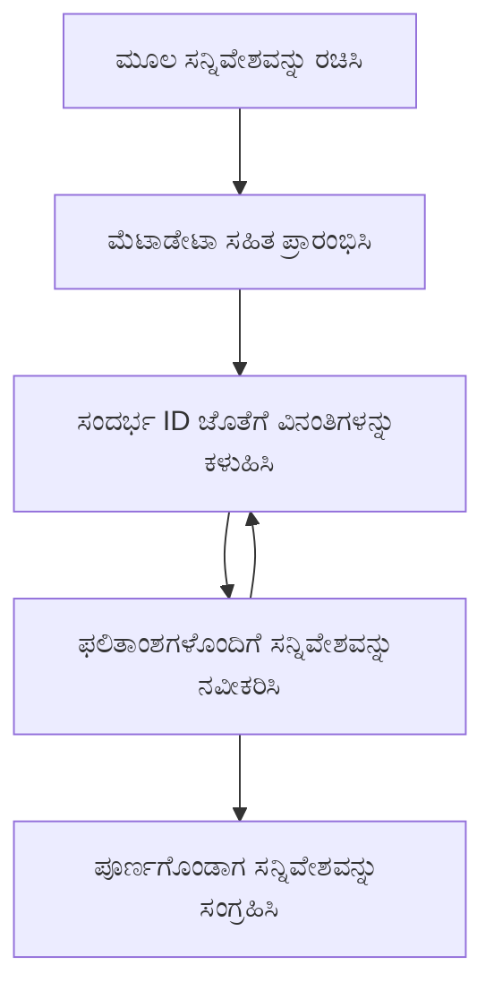

<!--
CO_OP_TRANSLATOR_METADATA:
{
  "original_hash": "ebdb86db46113f1cbd59ce4c74caaa79",
  "translation_date": "2025-12-11T15:16:16+00:00",
  "source_file": "05-AdvancedTopics/mcp-root-contexts/README.md",
  "language_code": "kn"
}
-->
# MCP ರೂಟ್ ಕಾಂಟೆಕ್ಸ್ಟ್‌ಗಳು

ರೂಟ್ ಕಾಂಟೆಕ್ಸ್ಟ್‌ಗಳು ಮಾದರಿ ಕಾಂಟೆಕ್ಸ್ಟ್ ಪ್ರೋಟೋಕಾಲ್‌ನ ಮೂಲಭೂತ ಸಂಪ್ರದಾಯವಾಗಿದ್ದು, ಬಹು ವಿನಂತಿಗಳು ಮತ್ತು ಸೆಷನ್‌ಗಳ ನಡುವೆ ಸಂಭಾಷಣಾ ಇತಿಹಾಸ ಮತ್ತು ಹಂಚಿಕೊಂಡ ಸ್ಥಿತಿಯನ್ನು ನಿರಂತರವಾಗಿ ನಿರ್ವಹಿಸಲು ಒಂದು ಸ್ಥಿರ ಪದರವನ್ನು ಒದಗಿಸುತ್ತವೆ.

## ಪರಿಚಯ

ಈ ಪಾಠದಲ್ಲಿ, ನಾವು MCP ನಲ್ಲಿ ರೂಟ್ ಕಾಂಟೆಕ್ಸ್ಟ್‌ಗಳನ್ನು ಹೇಗೆ ರಚಿಸುವುದು, ನಿರ್ವಹಿಸುವುದು ಮತ್ತು ಬಳಸುವುದು ಎಂಬುದನ್ನು ಅನ್ವೇಷಿಸುವೆವು.

## ಕಲಿಕೆಯ ಉದ್ದೇಶಗಳು

ಈ ಪಾಠದ ಅಂತ್ಯಕ್ಕೆ, ನೀವು ಸಾಧ್ಯವಾಗುವುದು:

- ರೂಟ್ ಕಾಂಟೆಕ್ಸ್ಟ್‌ಗಳ ಉದ್ದೇಶ ಮತ್ತು ರಚನೆಯನ್ನು ಅರ್ಥಮಾಡಿಕೊಳ್ಳುವುದು
- MCP ಕ್ಲೈಂಟ್ ಲೈಬ್ರರಿಗಳನ್ನು ಬಳಸಿ ರೂಟ್ ಕಾಂಟೆಕ್ಸ್ಟ್‌ಗಳನ್ನು ರಚಿಸುವುದು ಮತ್ತು ನಿರ್ವಹಿಸುವುದು
- .NET, ಜಾವಾ, ಜಾವಾಸ್ಕ್ರಿಪ್ಟ್ ಮತ್ತು ಪೈಥಾನ್ ಅಪ್ಲಿಕೇಶನ್‌ಗಳಲ್ಲಿ ರೂಟ್ ಕಾಂಟೆಕ್ಸ್ಟ್‌ಗಳನ್ನು ಜಾರಿಗೆ ತರುವುದು
- ಬಹು-ತಿರುವು ಸಂಭಾಷಣೆಗಳು ಮತ್ತು ಸ್ಥಿತಿ ನಿರ್ವಹಣೆಗೆ ರೂಟ್ ಕಾಂಟೆಕ್ಸ್ಟ್‌ಗಳನ್ನು ಬಳಸುವುದು
- ರೂಟ್ ಕಾಂಟೆಕ್ಸ್ಟ್ ನಿರ್ವಹಣೆಗೆ ಉತ್ತಮ ಅಭ್ಯಾಸಗಳನ್ನು ಜಾರಿಗೆ ತರುವುದು

## ರೂಟ್ ಕಾಂಟೆಕ್ಸ್ಟ್‌ಗಳನ್ನು ಅರ್ಥಮಾಡಿಕೊಳ್ಳುವುದು

ರೂಟ್ ಕಾಂಟೆಕ್ಸ್ಟ್‌ಗಳು ಸಂಬಂಧಿತ ಸಂವಹನಗಳ ಸರಣಿಗೆ ಇತಿಹಾಸ ಮತ್ತು ಸ್ಥಿತಿಯನ್ನು ಹಿಡಿದಿಡುವ ಪಾತ್ರದ ಪಾತ್ರೆಗಳಾಗಿವೆ. ಅವು ಈ ಕೆಳಗಿನವುಗಳನ್ನು ಸಾಧ್ಯಮಾಡುತ್ತವೆ:

- **ಸಂಭಾಷಣೆ ಸ್ಥಿರತೆ**: ಸुसಂಗತ ಬಹು-ತಿರುವು ಸಂಭಾಷಣೆಗಳನ್ನು ನಿರ್ವಹಿಸುವುದು
- **ಸ್ಮೃತಿ ನಿರ್ವಹಣೆ**: ಸಂವಹನಗಳ ನಡುವೆ ಮಾಹಿತಿಯನ್ನು ಸಂಗ್ರಹಿಸುವುದು ಮತ್ತು ಹಿಂತಿರುಗಿಸುವುದು
- **ಸ್ಥಿತಿ ನಿರ್ವಹಣೆ**: ಸಂಕೀರ್ಣ ಕಾರ್ಯಪ್ರವಾಹಗಳಲ್ಲಿ ಪ್ರಗತಿಯನ್ನು ಟ್ರ್ಯಾಕ್ ಮಾಡುವುದು
- **ಕಾಂಟೆಕ್ಸ್ಟ್ ಹಂಚಿಕೆ**: ಬಹು ಕ್ಲೈಂಟ್‌ಗಳು ಒಂದೇ ಸಂಭಾಷಣೆ ಸ್ಥಿತಿಗೆ ಪ್ರವೇಶ ಪಡೆಯಲು ಅವಕಾಶ ನೀಡುವುದು

MCP ನಲ್ಲಿ, ರೂಟ್ ಕಾಂಟೆಕ್ಸ್ಟ್‌ಗಳಿಗೆ ಈ ಪ್ರಮುಖ ಲಕ್ಷಣಗಳಿವೆ:

- ಪ್ರತಿ ರೂಟ್ ಕಾಂಟೆಕ್ಸ್ಟ್‌ಗೆ ವಿಶಿಷ್ಟ ಗುರುತಿನ ಸಂಖ್ಯೆ ಇರುತ್ತದೆ.
- ಅವು ಸಂಭಾಷಣೆ ಇತಿಹಾಸ, ಬಳಕೆದಾರ ಪ್ರಾಧಾನ್ಯತೆಗಳು ಮತ್ತು ಇತರ ಮೆಟಾಡೇಟಾವನ್ನು ಹೊಂದಿರಬಹುದು.
- ಅವುಗಳನ್ನು ಅಗತ್ಯವಿದ್ದಾಗ ರಚಿಸಬಹುದು, ಪ್ರವೇಶಿಸಬಹುದು ಮತ್ತು ಸಂಗ್ರಹಿಸಬಹುದು.
- ಅವು ಸೂಕ್ಷ್ಮ ಪ್ರವೇಶ ನಿಯಂತ್ರಣ ಮತ್ತು ಅನುಮತಿಗಳನ್ನು ಬೆಂಬಲಿಸುತ್ತವೆ.

## ರೂಟ್ ಕಾಂಟೆಕ್ಸ್ಟ್ ಜೀವನಚಕ್ರ


## ರೂಟ್ ಕಾಂಟೆಕ್ಸ್ಟ್‌ಗಳೊಂದಿಗೆ ಕೆಲಸ ಮಾಡುವುದು

ಇಲ್ಲಿ ರೂಟ್ ಕಾಂಟೆಕ್ಸ್ಟ್‌ಗಳನ್ನು ರಚಿಸುವುದು ಮತ್ತು ನಿರ್ವಹಿಸುವುದರ ಉದಾಹರಣೆ ಇದೆ.

### C# ಜಾರಿಗೆ

```csharp
// .NET Example: Root Context Management
using Microsoft.Mcp.Client;
using System;
using System.Threading.Tasks;
using System.Collections.Generic;

public class RootContextExample
{
    private readonly IMcpClient _client;
    private readonly IRootContextManager _contextManager;
    
    public RootContextExample(IMcpClient client, IRootContextManager contextManager)
    {
        _client = client;
        _contextManager = contextManager;
    }
    
    public async Task DemonstrateRootContextAsync()
    {
        // 1. Create a new root context
        var contextResult = await _contextManager.CreateRootContextAsync(new RootContextCreateOptions
        {
            Name = "Customer Support Session",
            Metadata = new Dictionary<string, string>
            {
                ["CustomerName"] = "Acme Corporation",
                ["PriorityLevel"] = "High",
                ["Domain"] = "Cloud Services"
            }
        });
        
        string contextId = contextResult.ContextId;
        Console.WriteLine($"Created root context with ID: {contextId}");
        
        // 2. First interaction using the context
        var response1 = await _client.SendPromptAsync(
            "I'm having issues scaling my web service deployment in the cloud.", 
            new SendPromptOptions { RootContextId = contextId }
        );
        
        Console.WriteLine($"First response: {response1.GeneratedText}");
        
        // Second interaction - the model will have access to the previous conversation
        var response2 = await _client.SendPromptAsync(
            "Yes, we're using containerized deployments with Kubernetes.", 
            new SendPromptOptions { RootContextId = contextId }
        );
        
        Console.WriteLine($"Second response: {response2.GeneratedText}");
        
        // 3. Add metadata to the context based on conversation
        await _contextManager.UpdateContextMetadataAsync(contextId, new Dictionary<string, string>
        {
            ["TechnicalEnvironment"] = "Kubernetes",
            ["IssueType"] = "Scaling"
        });
        
        // 4. Get context information
        var contextInfo = await _contextManager.GetRootContextInfoAsync(contextId);
        
        Console.WriteLine("Context Information:");
        Console.WriteLine($"- Name: {contextInfo.Name}");
        Console.WriteLine($"- Created: {contextInfo.CreatedAt}");
        Console.WriteLine($"- Messages: {contextInfo.MessageCount}");
        
        // 5. When the conversation is complete, archive the context
        await _contextManager.ArchiveRootContextAsync(contextId);
        Console.WriteLine($"Archived context {contextId}");
    }
}
```

ಮುಂಬರುವ ಕೋಡ್‌ನಲ್ಲಿ ನಾವು:

1. ಗ್ರಾಹಕ ಬೆಂಬಲ ಸೆಷನ್‌ಗಾಗಿ ರೂಟ್ ಕಾಂಟೆಕ್ಸ್ಟ್ ರಚಿಸಿದ್ದೇವೆ.
1. ಆ ಕಾಂಟೆಕ್ಸ್ಟ್ ಒಳಗೆ ಬಹು ಸಂದೇಶಗಳನ್ನು ಕಳುಹಿಸಿ, ಮಾದರಿಯು ಸ್ಥಿತಿಯನ್ನು ನಿರ್ವಹಿಸಲು ಅವಕಾಶ ನೀಡಿದೆ.
1. ಸಂಭಾಷಣೆಯ ಆಧಾರದ ಮೇಲೆ ಸಂಬಂಧಿತ ಮೆಟಾಡೇಟಾ ಬಳಸಿ ಕಾಂಟೆಕ್ಸ್ಟ್ ಅನ್ನು ನವೀಕರಿಸಿದ್ದೇವೆ.
1. ಸಂಭಾಷಣೆ ಇತಿಹಾಸವನ್ನು ಅರ್ಥಮಾಡಿಕೊಳ್ಳಲು ಕಾಂಟೆಕ್ಸ್ಟ್ ಮಾಹಿತಿಯನ್ನು ಪಡೆದಿದ್ದೇವೆ.
1. ಸಂಭಾಷಣೆ ಪೂರ್ಣಗೊಂಡಾಗ ಕಾಂಟೆಕ್ಸ್ಟ್ ಅನ್ನು ಸಂಗ್ರಹಿಸಿದ್ದೇವೆ.

## ಉದಾಹರಣೆ: ಹಣಕಾಸು ವಿಶ್ಲೇಷಣೆಗೆ ರೂಟ್ ಕಾಂಟೆಕ್ಸ್ಟ್ ಜಾರಿಗೆ

ಈ ಉದಾಹರಣೆಯಲ್ಲಿ, ನಾವು ಹಣಕಾಸು ವಿಶ್ಲೇಷಣಾ ಸೆಷನ್‌ಗಾಗಿ ರೂಟ್ ಕಾಂಟೆಕ್ಸ್ಟ್ ರಚಿಸುವುದನ್ನು ತೋರಿಸುತ್ತೇವೆ, ಬಹು ಸಂವಹನಗಳ ನಡುವೆ ಸ್ಥಿತಿಯನ್ನು ನಿರ್ವಹಿಸುವ ವಿಧಾನವನ್ನು ಪ್ರದರ್ಶಿಸುತ್ತೇವೆ.

### ಜಾವಾ ಜಾರಿಗೆ

```java
// ಜಾವಾ ಉದಾಹರಣೆ: ರೂಟ್ ಕಾಂಟೆಕ್ಸ್ಟ್ ಅನುಷ್ಠಾನ
package com.example.mcp.contexts;

import com.mcp.client.McpClient;
import com.mcp.client.ContextManager;
import com.mcp.models.RootContext;
import com.mcp.models.McpResponse;

import java.util.HashMap;
import java.util.Map;
import java.util.UUID;

public class RootContextsDemo {
    private final McpClient client;
    private final ContextManager contextManager;
    
    public RootContextsDemo(String serverUrl) {
        this.client = new McpClient.Builder()
            .setServerUrl(serverUrl)
            .build();
            
        this.contextManager = new ContextManager(client);
    }
    
    public void demonstrateRootContext() throws Exception {
        // ಕಾಂಟೆಕ್ಸ್ಟ್ ಮೆಟಾಡೇಟಾ ರಚಿಸಿ
        Map<String, String> metadata = new HashMap<>();
        metadata.put("projectName", "Financial Analysis");
        metadata.put("userRole", "Financial Analyst");
        metadata.put("dataSource", "Q1 2025 Financial Reports");
        
        // 1. ಹೊಸ ರೂಟ್ ಕಾಂಟೆಕ್ಸ್ಟ್ ರಚಿಸಿ
        RootContext context = contextManager.createRootContext("Financial Analysis Session", metadata);
        String contextId = context.getId();
        
        System.out.println("Created context: " + contextId);
        
        // 2. ಮೊದಲ ಸಂವಹನ
        McpResponse response1 = client.sendPrompt(
            "Analyze the trends in Q1 financial data for our technology division",
            contextId
        );
        
        System.out.println("First response: " + response1.getGeneratedText());
        
        // 3. ಪ್ರತಿಕ್ರಿಯೆಯಿಂದ ಪಡೆದ ಪ್ರಮುಖ ಮಾಹಿತಿಯಿಂದ ಕಾಂಟೆಕ್ಸ್ಟ್ ನವೀಕರಿಸಿ
        contextManager.addContextMetadata(contextId, 
            Map.of("identifiedTrend", "Increasing cloud infrastructure costs"));
        
        // ಎರಡನೇ ಸಂವಹನ - ಅದೇ ಕಾಂಟೆಕ್ಸ್ಟ್ ಬಳಸಿ
        McpResponse response2 = client.sendPrompt(
            "What's driving the increase in cloud infrastructure costs?",
            contextId
        );
        
        System.out.println("Second response: " + response2.getGeneratedText());
        
        // 4. ವಿಶ್ಲೇಷಣಾ ಅಧಿವೇಶನದ ಸಾರಾಂಶ ರಚಿಸಿ
        McpResponse summaryResponse = client.sendPrompt(
            "Summarize our analysis of the technology division financials in 3-5 key points",
            contextId
        );
        
        // ಸಾರಾಂಶವನ್ನು ಕಾಂಟೆಕ್ಸ್ಟ್ ಮೆಟಾಡೇಟಾದಲ್ಲಿ ಸಂಗ್ರಹಿಸಿ
        contextManager.addContextMetadata(contextId, 
            Map.of("analysisSummary", summaryResponse.getGeneratedText()));
            
        // ನವೀಕೃತ ಕಾಂಟೆಕ್ಸ್ಟ್ ಮಾಹಿತಿಯನ್ನು ಪಡೆಯಿರಿ
        RootContext updatedContext = contextManager.getRootContext(contextId);
        
        System.out.println("Context Information:");
        System.out.println("- Created: " + updatedContext.getCreatedAt());
        System.out.println("- Last Updated: " + updatedContext.getLastUpdatedAt());
        System.out.println("- Analysis Summary: " + 
            updatedContext.getMetadata().get("analysisSummary"));
            
        // 5. ಕಾರ್ಯ ಮುಗಿದಾಗ ಕಾಂಟೆಕ್ಸ್ಟ್ ಅನ್ನು ಸಂಗ್ರಹಿಸಿ
        contextManager.archiveContext(contextId);
        System.out.println("Context archived");
    }
}
```

ಮುಂಬರುವ ಕೋಡ್‌ನಲ್ಲಿ ನಾವು:

1. ಹಣಕಾಸು ವಿಶ್ಲೇಷಣಾ ಸೆಷನ್‌ಗಾಗಿ ರೂಟ್ ಕಾಂಟೆಕ್ಸ್ಟ್ ರಚಿಸಿದ್ದೇವೆ.
2. ಆ ಕಾಂಟೆಕ್ಸ್ಟ್ ಒಳಗೆ ಬಹು ಸಂದೇಶಗಳನ್ನು ಕಳುಹಿಸಿ, ಮಾದರಿಯು ಸ್ಥಿತಿಯನ್ನು ನಿರ್ವಹಿಸಲು ಅವಕಾಶ ನೀಡಿದೆ.
3. ಸಂಭಾಷಣೆಯ ಆಧಾರದ ಮೇಲೆ ಸಂಬಂಧಿತ ಮೆಟಾಡೇಟಾ ಬಳಸಿ ಕಾಂಟೆಕ್ಸ್ಟ್ ಅನ್ನು ನವೀಕರಿಸಿದ್ದೇವೆ.
4. ವಿಶ್ಲೇಷಣಾ ಸೆಷನ್‌ನ ಸಾರಾಂಶವನ್ನು ರಚಿಸಿ, ಅದನ್ನು ಕಾಂಟೆಕ್ಸ್ಟ್ ಮೆಟಾಡೇಟಾದಲ್ಲಿ ಸಂಗ್ರಹಿಸಿದ್ದೇವೆ.
5. ಸಂಭಾಷಣೆ ಪೂರ್ಣಗೊಂಡಾಗ ಕಾಂಟೆಕ್ಸ್ಟ್ ಅನ್ನು ಸಂಗ್ರಹಿಸಿದ್ದೇವೆ.

## ಉದಾಹರಣೆ: ರೂಟ್ ಕಾಂಟೆಕ್ಸ್ಟ್ ನಿರ್ವಹಣೆ

ರೂಟ್ ಕಾಂಟೆಕ್ಸ್ಟ್‌ಗಳನ್ನು ಪರಿಣಾಮಕಾರಿಯಾಗಿ ನಿರ್ವಹಿಸುವುದು ಸಂಭಾಷಣೆ ಇತಿಹಾಸ ಮತ್ತು ಸ್ಥಿತಿಯನ್ನು ನಿರ್ವಹಿಸಲು ಅತ್ಯಂತ ಮುಖ್ಯ. ಕೆಳಗಿನ ಉದಾಹರಣೆ ರೂಟ್ ಕಾಂಟೆಕ್ಸ್ಟ್ ನಿರ್ವಹಣೆಯನ್ನು ಹೇಗೆ ಜಾರಿಗೆ ತರುವುದೆಂದು ತೋರಿಸುತ್ತದೆ.

### ಜಾವಾಸ್ಕ್ರಿಪ್ಟ್ ಜಾರಿಗೆ

```javascript
// ಜಾವಾಸ್ಕ್ರಿಪ್ಟ್ ಉದಾಹರಣೆ: MCP ರೂಟ್ ಕಾಂಟೆಕ್ಸ್ಟ್‌ಗಳನ್ನು ನಿರ್ವಹಿಸುವುದು
const { McpClient, RootContextManager } = require('@mcp/client');

class ContextSession {
  constructor(serverUrl, apiKey = null) {
    // MCP ಕ್ಲೈಂಟ್ ಅನ್ನು ಪ್ರಾರಂಭಿಸಿ
    this.client = new McpClient({
      serverUrl,
      apiKey
    });
    
    // ಕಾಂಟೆಕ್ಸ್ಟ್ ಮ್ಯಾನೇಜರ್ ಅನ್ನು ಪ್ರಾರಂಭಿಸಿ
    this.contextManager = new RootContextManager(this.client);
  }
  
  /**
   * Create a new conversation context
   * @param {string} sessionName - Name of the conversation session
   * @param {Object} metadata - Additional metadata for the context
   * @returns {Promise<string>} - Context ID
   */
  async createConversationContext(sessionName, metadata = {}) {
    try {
      const contextResult = await this.contextManager.createRootContext({
        name: sessionName,
        metadata: {
          ...metadata,
          createdAt: new Date().toISOString(),
          status: 'active'
        }
      });
      
      console.log(`Created root context '${sessionName}' with ID: ${contextResult.id}`);
      return contextResult.id;
    } catch (error) {
      console.error('Error creating root context:', error);
      throw error;
    }
  }
  
  /**
   * Send a message in an existing context
   * @param {string} contextId - The root context ID
   * @param {string} message - The user's message
   * @param {Object} options - Additional options
   * @returns {Promise<Object>} - Response data
   */
  async sendMessage(contextId, message, options = {}) {
    try {
      // ನಿರ್ದಿಷ್ಟ ಕಾಂಟೆಕ್ಸ್ಟ್ ಬಳಸಿ ಸಂದೇಶವನ್ನು ಕಳುಹಿಸಿ
      const response = await this.client.sendPrompt(message, {
        rootContextId: contextId,
        temperature: options.temperature || 0.7,
        allowedTools: options.allowedTools || []
      });
      
      // ಸಂಭಾಷಣೆಯಿಂದ ಪ್ರಮುಖ ಅಂಶಗಳನ್ನು ಐಚ್ಛಿಕವಾಗಿ ಸಂಗ್ರಹಿಸಿ
      if (options.storeInsights) {
        await this.storeConversationInsights(contextId, message, response.generatedText);
      }
      
      return {
        message: response.generatedText,
        toolCalls: response.toolCalls || [],
        contextId
      };
    } catch (error) {
      console.error(`Error sending message in context ${contextId}:`, error);
      throw error;
    }
  }
  
  /**
   * Store important insights from a conversation
   * @param {string} contextId - The root context ID
   * @param {string} userMessage - User's message
   * @param {string} aiResponse - AI's response
   */
  async storeConversationInsights(contextId, userMessage, aiResponse) {
    try {
      // ಸಾಧ್ಯವಾದ ಅಂಶಗಳನ್ನು ಹೊರತೆಗೆಯಿರಿ (ವಾಸ್ತವಿಕ ಅಪ್ಲಿಕೇಶನ್‌ನಲ್ಲಿ ಇದು ಹೆಚ್ಚು ಸುಧಾರಿತವಾಗಿರುತ್ತದೆ)
      const combinedText = userMessage + "\n" + aiResponse;
      
      // ಸಾಧ್ಯವಾದ ಅಂಶಗಳನ್ನು ಗುರುತಿಸಲು ಸರಳ ನಿಯಮ
      const insightWords = ["important", "key point", "remember", "significant", "crucial"];
      
      const potentialInsights = combinedText
        .split(".")
        .filter(sentence => 
          insightWords.some(word => sentence.toLowerCase().includes(word))
        )
        .map(sentence => sentence.trim())
        .filter(sentence => sentence.length > 10);
      
      // ಅಂಶಗಳನ್ನು ಕಾಂಟೆಕ್ಸ್ಟ್ ಮೆಟಾಡೇಟಾದಲ್ಲಿ ಸಂಗ್ರಹಿಸಿ
      if (potentialInsights.length > 0) {
        const insights = {};
        potentialInsights.forEach((insight, index) => {
          insights[`insight_${Date.now()}_${index}`] = insight;
        });
        
        await this.contextManager.updateContextMetadata(contextId, insights);
        console.log(`Stored ${potentialInsights.length} insights in context ${contextId}`);
      }
    } catch (error) {
      console.warn('Error storing conversation insights:', error);
      // ಗಂಭೀರವಲ್ಲದ ದೋಷ, ಆದ್ದರಿಂದ ಎಚ್ಚರಿಕೆ ಲಾಗ್ ಮಾಡಿ
    }
  }
  
  /**
   * Get summary information about a context
   * @param {string} contextId - The root context ID
   * @returns {Promise<Object>} - Context information
   */
  async getContextInfo(contextId) {
    try {
      const contextInfo = await this.contextManager.getContextInfo(contextId);
      
      return {
        id: contextInfo.id,
        name: contextInfo.name,
        created: new Date(contextInfo.createdAt).toLocaleString(),
        lastUpdated: new Date(contextInfo.lastUpdatedAt).toLocaleString(),
        messageCount: contextInfo.messageCount,
        metadata: contextInfo.metadata,
        status: contextInfo.status
      };
    } catch (error) {
      console.error(`Error getting context info for ${contextId}:`, error);
      throw error;
    }
  }
  
  /**
   * Generate a summary of the conversation in a context
   * @param {string} contextId - The root context ID
   * @returns {Promise<string>} - Generated summary
   */
  async generateContextSummary(contextId) {
    try {
      // ಈಗುವರೆಗೆ ಸಂಭಾಷಣೆಯ ಸಾರಾಂಶವನ್ನು ರಚಿಸಲು ಮಾದರಿಯನ್ನು ಕೇಳಿ
      const response = await this.client.sendPrompt(
        "Please summarize our conversation so far in 3-4 sentences, highlighting the main points discussed.",
        { rootContextId: contextId, temperature: 0.3 }
      );
      
      // ಸಾರಾಂಶವನ್ನು ಕಾಂಟೆಕ್ಸ್ಟ್ ಮೆಟಾಡೇಟಾದಲ್ಲಿ ಸಂಗ್ರಹಿಸಿ
      await this.contextManager.updateContextMetadata(contextId, {
        conversationSummary: response.generatedText,
        summarizedAt: new Date().toISOString()
      });
      
      return response.generatedText;
    } catch (error) {
      console.error(`Error generating context summary for ${contextId}:`, error);
      throw error;
    }
  }
  
  /**
   * Archive a context when it's no longer needed
   * @param {string} contextId - The root context ID
   * @returns {Promise<Object>} - Result of the archive operation
   */
  async archiveContext(contextId) {
    try {
      // ಸಂಗ್ರಹಿಸುವ ಮೊದಲು ಅಂತಿಮ ಸಾರಾಂಶವನ್ನು ರಚಿಸಿ
      const summary = await this.generateContextSummary(contextId);
      
      // ಕಾಂಟೆಕ್ಸ್ಟ್ ಅನ್ನು ಸಂಗ್ರಹಿಸಿ
      await this.contextManager.archiveContext(contextId);
      
      return {
        status: "archived",
        contextId,
        summary
      };
    } catch (error) {
      console.error(`Error archiving context ${contextId}:`, error);
      throw error;
    }
  }
}

// ಉದಾಹರಣೆಯ ಬಳಕೆ
async function demonstrateContextSession() {
  const session = new ContextSession('https://mcp-server-example.com');
  
  try {
    // 1. ಉತ್ಪನ್ನ ಬೆಂಬಲ ಸಂಭಾಷಣೆಗೆ ಹೊಸ ಕಾಂಟೆಕ್ಸ್ಟ್ ರಚಿಸಿ
    const contextId = await session.createConversationContext(
      'Product Support - Database Performance',
      {
        customer: 'Globex Corporation',
        product: 'Enterprise Database',
        severity: 'Medium',
        supportAgent: 'AI Assistant'
      }
    );
    
    // 2. ಸಂಭಾಷಣೆಯ ಮೊದಲ ಸಂದೇಶ
    const response1 = await session.sendMessage(
      contextId,
      "I'm experiencing slow query performance on our database cluster after the latest update.",
      { storeInsights: true }
    );
    console.log('Response 1:', response1.message);
    
    // ಅದೇ ಕಾಂಟೆಕ್ಸ್ಟ್‌ನಲ್ಲಿ ಮುಂದುವರಿದ ಸಂದೇಶ
    const response2 = await session.sendMessage(
      contextId,
      "Yes, we've already checked the indexes and they seem to be properly configured.",
      { storeInsights: true }
    );
    console.log('Response 2:', response2.message);
    
    // 3. ಕಾಂಟೆಕ್ಸ್ಟ್ ಬಗ್ಗೆ ಮಾಹಿತಿ ಪಡೆಯಿರಿ
    const contextInfo = await session.getContextInfo(contextId);
    console.log('Context Information:', contextInfo);
    
    // 4. ಸಂಭಾಷಣೆಯ ಸಾರಾಂಶವನ್ನು ರಚಿಸಿ ಮತ್ತು ಪ್ರದರ್ಶಿಸಿ
    const summary = await session.generateContextSummary(contextId);
    console.log('Conversation Summary:', summary);
    
    // 5. ಮುಗಿದ ಮೇಲೆ ಕಾಂಟೆಕ್ಸ್ಟ್ ಅನ್ನು ಸಂಗ್ರಹಿಸಿ
    const archiveResult = await session.archiveContext(contextId);
    console.log('Archive Result:', archiveResult);
    
    // 6. ಯಾವುದೇ ದೋಷಗಳನ್ನು ಸೌಮ್ಯವಾಗಿ ನಿರ್ವಹಿಸಿ
  } catch (error) {
    console.error('Error in context session demonstration:', error);
  }
}

demonstrateContextSession();
```

ಮುಂಬರುವ ಕೋಡ್‌ನಲ್ಲಿ ನಾವು:

1. `createConversationContext` ಫಂಕ್ಷನ್ ಬಳಸಿ ಉತ್ಪನ್ನ ಬೆಂಬಲ ಸಂಭಾಷಣೆಗೆ ರೂಟ್ ಕಾಂಟೆಕ್ಸ್ಟ್ ರಚಿಸಿದ್ದೇವೆ. ಈ ಸಂದರ್ಭದಲ್ಲಿ, ಕಾಂಟೆಕ್ಸ್ಟ್ ಡೇಟಾಬೇಸ್ ಕಾರ್ಯಕ್ಷಮತೆ ಸಮಸ್ಯೆಗಳ ಬಗ್ಗೆ ಇದೆ.

1. `sendMessage` ಫಂಕ್ಷನ್ ಬಳಸಿ ಆ ಕಾಂಟೆಕ್ಸ್ಟ್ ಒಳಗೆ ಬಹು ಸಂದೇಶಗಳನ್ನು ಕಳುಹಿಸಿ, ಮಾದರಿಯು ಸ್ಥಿತಿಯನ್ನು ನಿರ್ವಹಿಸಲು ಅವಕಾಶ ನೀಡಿದೆ. ಕಳುಹಿಸಲಾದ ಸಂದೇಶಗಳು ನಿಧಾನವಾದ ಕ್ವೇರಿ ಕಾರ್ಯಕ್ಷಮತೆ ಮತ್ತು ಸೂಚ್ಯಂಕ ಸಂರಚನೆಯ ಬಗ್ಗೆ ಇವೆ.

1. ಸಂಭಾಷಣೆಯ ಆಧಾರದ ಮೇಲೆ ಸಂಬಂಧಿತ ಮೆಟಾಡೇಟಾ ಬಳಸಿ ಕಾಂಟೆಕ್ಸ್ಟ್ ಅನ್ನು ನವೀಕರಿಸಿದ್ದೇವೆ.

1. `generateContextSummary` ಫಂಕ್ಷನ್ ಬಳಸಿ ಸಂಭಾಷಣೆಯ ಸಾರಾಂಶವನ್ನು ರಚಿಸಿ, ಅದನ್ನು ಕಾಂಟೆಕ್ಸ್ಟ್ ಮೆಟಾಡೇಟಾದಲ್ಲಿ ಸಂಗ್ರಹಿಸಿದ್ದೇವೆ.

1. `archiveContext` ಫಂಕ್ಷನ್ ಬಳಸಿ ಸಂಭಾಷಣೆ ಪೂರ್ಣಗೊಂಡಾಗ ಕಾಂಟೆಕ್ಸ್ಟ್ ಅನ್ನು ಸಂಗ್ರಹಿಸಿದ್ದೇವೆ.

1. ದೋಷಗಳನ್ನು ಸೌಮ್ಯವಾಗಿ ನಿರ್ವಹಿಸಿ ದೃಢತೆಯನ್ನು ಖಚಿತಪಡಿಸಿದ್ದೇವೆ.

## ಬಹು-ತಿರುವು ಸಹಾಯಕ್ಕಾಗಿ ರೂಟ್ ಕಾಂಟೆಕ್ಸ್ಟ್

ಈ ಉದಾಹರಣೆಯಲ್ಲಿ, ನಾವು ಬಹು-ತಿರುವು ಸಹಾಯ ಸೆಷನ್‌ಗಾಗಿ ರೂಟ್ ಕಾಂಟೆಕ್ಸ್ಟ್ ರಚಿಸುವುದನ್ನು ತೋರಿಸುತ್ತೇವೆ, ಬಹು ಸಂವಹನಗಳ ನಡುವೆ ಸ್ಥಿತಿಯನ್ನು ನಿರ್ವಹಿಸುವ ವಿಧಾನವನ್ನು ಪ್ರದರ್ಶಿಸುತ್ತೇವೆ.

### ಪೈಥಾನ್ ಜಾರಿಗೆ

```python
# ಪೈಥಾನ್ ಉದಾಹರಣೆ: ಬಹು-ತಿರುವು ಸಹಾಯಕ್ಕಾಗಿ ರೂಟ್ ಸಾಂದರ್ಭಿಕತೆ
import asyncio
from datetime import datetime
from mcp_client import McpClient, RootContextManager

class AssistantSession:
    def __init__(self, server_url, api_key=None):
        self.client = McpClient(server_url=server_url, api_key=api_key)
        self.context_manager = RootContextManager(self.client)
    
    async def create_session(self, name, user_info=None):
        """Create a new root context for an assistant session"""
        metadata = {
            "session_type": "assistant",
            "created_at": datetime.now().isoformat(),
        }
        
        # ನೀಡಿದರೆ ಬಳಕೆದಾರ ಮಾಹಿತಿ ಸೇರಿಸಿ
        if user_info:
            metadata.update({f"user_{k}": v for k, v in user_info.items()})
            
        # ರೂಟ್ ಸಾಂದರ್ಭಿಕತೆ ರಚಿಸಿ
        context = await self.context_manager.create_root_context(name, metadata)
        return context.id
    
    async def send_message(self, context_id, message, tools=None):
        """Send a message within a root context"""
        # ಸಾಂದರ್ಭಿಕತೆ ID ಜೊತೆಗೆ ಆಯ್ಕೆಗಳು ರಚಿಸಿ
        options = {
            "root_context_id": context_id
        }
        
        # ಸೂಚಿಸಿದರೆ ಉಪಕರಣಗಳನ್ನು ಸೇರಿಸಿ
        if tools:
            options["allowed_tools"] = tools
        
        # ಸಾಂದರ್ಭಿಕತೆಯೊಳಗೆ ಪ್ರಾಂಪ್ಟ್ ಕಳುಹಿಸಿ
        response = await self.client.send_prompt(message, options)
        
        # ಸಂಭಾಷಣೆಯ ಪ್ರಗತಿಯೊಂದಿಗೆ ಸಾಂದರ್ಭಿಕತೆ ಮೆಟಾಡೇಟಾ ನವೀಕರಿಸಿ
        await self.context_manager.update_context_metadata(
            context_id,
            {
                f"message_{datetime.now().timestamp()}": message[:50] + "...",
                "last_interaction": datetime.now().isoformat()
            }
        )
        
        return response
    
    async def get_conversation_history(self, context_id):
        """Retrieve conversation history from a context"""
        context_info = await self.context_manager.get_context_info(context_id)
        messages = await self.client.get_context_messages(context_id)
        
        return {
            "context_info": context_info,
            "messages": messages
        }
    
    async def end_session(self, context_id):
        """End an assistant session by archiving the context"""
        # ಮೊದಲು ಸಾರಾಂಶ ಪ್ರಾಂಪ್ಟ್ ರಚಿಸಿ
        summary_response = await self.client.send_prompt(
            "Please summarize our conversation and any key points or decisions made.",
            {"root_context_id": context_id}
        )
        
        # ಸಾರಾಂಶವನ್ನು ಮೆಟಾಡೇಟಾದಲ್ಲಿ ಸಂಗ್ರಹಿಸಿ
        await self.context_manager.update_context_metadata(
            context_id,
            {
                "summary": summary_response.generated_text,
                "ended_at": datetime.now().isoformat(),
                "status": "completed"
            }
        )
        
        # ಸಾಂದರ್ಭಿಕತೆಯನ್ನು ಆರ್ಕೈವ್ ಮಾಡಿ
        await self.context_manager.archive_context(context_id)
        
        return {
            "status": "completed",
            "summary": summary_response.generated_text
        }

# ಉದಾಹರಣೆಯ ಬಳಕೆ
async def demo_assistant_session():
    assistant = AssistantSession("https://mcp-server-example.com")
    
    # 1. ಸೆಷನ್ ರಚಿಸಿ
    context_id = await assistant.create_session(
        "Technical Support Session",
        {"name": "Alex", "technical_level": "advanced", "product": "Cloud Services"}
    )
    print(f"Created session with context ID: {context_id}")
    
    # 2. ಮೊದಲ ಸಂವಹನ
    response1 = await assistant.send_message(
        context_id, 
        "I'm having trouble with the auto-scaling feature in your cloud platform.",
        ["documentation_search", "diagnostic_tool"]
    )
    print(f"Response 1: {response1.generated_text}")
    
    # ಅದೇ ಸಾಂದರ್ಭಿಕತೆಯಲ್ಲಿ ಎರಡನೇ ಸಂವಹನ
    response2 = await assistant.send_message(
        context_id,
        "Yes, I've already checked the configuration settings you mentioned, but it's still not working."
    )
    print(f"Response 2: {response2.generated_text}")
    
    # 3. ಇತಿಹಾಸ ಪಡೆಯಿರಿ
    history = await assistant.get_conversation_history(context_id)
    print(f"Session has {len(history['messages'])} messages")
    
    # 4. ಸೆಷನ್ ಮುಗಿಸಿ
    end_result = await assistant.end_session(context_id)
    print(f"Session ended with summary: {end_result['summary']}")

if __name__ == "__main__":
    asyncio.run(demo_assistant_session())
```

ಮುಂಬರುವ ಕೋಡ್‌ನಲ್ಲಿ ನಾವು:

1. `create_session` ಫಂಕ್ಷನ್ ಬಳಸಿ ತಾಂತ್ರಿಕ ಬೆಂಬಲ ಸೆಷನ್‌ಗಾಗಿ ರೂಟ್ ಕಾಂಟೆಕ್ಸ್ಟ್ ರಚಿಸಿದ್ದೇವೆ. ಕಾಂಟೆಕ್ಸ್ಟ್ ಬಳಕೆದಾರ ಮಾಹಿತಿ, ಉದಾಹರಣೆಗೆ ಹೆಸರು ಮತ್ತು ತಾಂತ್ರಿಕ ಮಟ್ಟವನ್ನು ಒಳಗೊಂಡಿದೆ.

1. `send_message` ಫಂಕ್ಷನ್ ಬಳಸಿ ಆ ಕಾಂಟೆಕ್ಸ್ಟ್ ಒಳಗೆ ಬಹು ಸಂದೇಶಗಳನ್ನು ಕಳುಹಿಸಿ, ಮಾದರಿಯು ಸ್ಥಿತಿಯನ್ನು ನಿರ್ವಹಿಸಲು ಅವಕಾಶ ನೀಡಿದೆ. ಕಳುಹಿಸಲಾದ ಸಂದೇಶಗಳು ಸ್ವಯಂ-ಸ್ಕೇಲಿಂಗ್ ವೈಶಿಷ್ಟ್ಯದ ಸಮಸ್ಯೆಗಳ ಬಗ್ಗೆ ಇವೆ.

1. `get_conversation_history` ಫಂಕ್ಷನ್ ಬಳಸಿ ಸಂಭಾಷಣೆ ಇತಿಹಾಸವನ್ನು ಪಡೆದಿದ್ದೇವೆ, ಇದು ಕಾಂಟೆಕ್ಸ್ಟ್ ಮಾಹಿತಿ ಮತ್ತು ಸಂದೇಶಗಳನ್ನು ಒದಗಿಸುತ್ತದೆ.

1. `end_session` ಫಂಕ್ಷನ್ ಬಳಸಿ ಸೆಷನ್ ಅನ್ನು ಮುಗಿಸಿ, ಕಾಂಟೆಕ್ಸ್ಟ್ ಅನ್ನು ಸಂಗ್ರಹಿಸಿ ಮತ್ತು ಸಂಭಾಷಣೆಯ ಪ್ರಮುಖ ಅಂಶಗಳನ್ನು ಹಿಡಿದಿಡುವ ಸಾರಾಂಶವನ್ನು ರಚಿಸಿದ್ದೇವೆ.

## ರೂಟ್ ಕಾಂಟೆಕ್ಸ್ಟ್ ಉತ್ತಮ ಅಭ್ಯಾಸಗಳು

ರೂಟ್ ಕಾಂಟೆಕ್ಸ್ಟ್‌ಗಳನ್ನು ಪರಿಣಾಮಕಾರಿಯಾಗಿ ನಿರ್ವಹಿಸಲು ಕೆಲವು ಉತ್ತಮ ಅಭ್ಯಾಸಗಳು ಇಲ್ಲಿವೆ:

- **ಕೇಂದ್ರೀಕೃತ ಕಾಂಟೆಕ್ಸ್ಟ್‌ಗಳನ್ನು ರಚಿಸಿ**: ವಿಭಿನ್ನ ಸಂಭಾಷಣೆ ಉದ್ದೇಶಗಳು ಅಥವಾ ಕ್ಷೇತ್ರಗಳಿಗೆ ಪ್ರತ್ಯೇಕ ರೂಟ್ ಕಾಂಟೆಕ್ಸ್ಟ್‌ಗಳನ್ನು ರಚಿಸಿ ಸ್ಪಷ್ಟತೆಯನ್ನು ಕಾಪಾಡಿ.

- **ಕಾಲಹರಣ ನೀತಿಗಳನ್ನು ಹೊಂದಿಸಿ**: ಹಳೆಯ ಕಾಂಟೆಕ್ಸ್ಟ್‌ಗಳನ್ನು ಸಂಗ್ರಹಿಸುವುದು ಅಥವಾ ಅಳಿಸುವ ನೀತಿಗಳನ್ನು ಜಾರಿಗೆ ತಂದು ಸಂಗ್ರಹಣೆಯನ್ನು ನಿರ್ವಹಿಸಿ ಮತ್ತು ಡೇಟಾ ಸಂರಕ್ಷಣಾ ನೀತಿಗಳನ್ನು ಪಾಲಿಸಿ.

- **ಸಂಬಂಧಿತ ಮೆಟಾಡೇಟಾವನ್ನು ಸಂಗ್ರಹಿಸಿ**: ಸಂಭಾಷಣೆಯ ಬಗ್ಗೆ ನಂತರ ಉಪಯುಕ್ತವಾಗಬಹುದಾದ ಮಹತ್ವದ ಮಾಹಿತಿಯನ್ನು ಸಂಗ್ರಹಿಸಲು ಕಾಂಟೆಕ್ಸ್ಟ್ ಮೆಟಾಡೇಟಾವನ್ನು ಬಳಸಿ.

- **ಕಾಂಟೆಕ್ಸ್ಟ್ ID ಗಳನ್ನು ಸತತವಾಗಿ ಬಳಸಿ**: ಒಂದು ಬಾರಿ ಕಾಂಟೆಕ್ಸ್ಟ್ ರಚಿಸಿದ ನಂತರ, ಅದರ ID ಅನ್ನು ಎಲ್ಲಾ ಸಂಬಂಧಿತ ವಿನಂತಿಗಳಿಗಾಗಿ ಸತತವಾಗಿ ಬಳಸಿ ನಿರಂತರತೆಯನ್ನು ಕಾಪಾಡಿ.

- **ಸಾರಾಂಶಗಳನ್ನು ರಚಿಸಿ**: ಕಾಂಟೆಕ್ಸ್ಟ್ ದೊಡ್ಡದಾಗಿದಾಗ, ಮುಖ್ಯ ಮಾಹಿತಿಯನ್ನು ಹಿಡಿದಿಡಲು ಮತ್ತು ಕಾಂಟೆಕ್ಸ್ಟ್ ಗಾತ್ರವನ್ನು ನಿರ್ವಹಿಸಲು ಸಾರಾಂಶಗಳನ್ನು ರಚಿಸುವುದನ್ನು ಪರಿಗಣಿಸಿ.

- **ಪ್ರವೇಶ ನಿಯಂತ್ರಣವನ್ನು ಜಾರಿಗೆ ತರುವುದು**: ಬಹು-ಬಳಕೆದಾರ ವ್ಯವಸ್ಥೆಗಳಿಗೆ, ಸಂಭಾಷಣೆ ಕಾಂಟೆಕ್ಸ್ಟ್‌ಗಳ ಗೌಪ್ಯತೆ ಮತ್ತು ಭದ್ರತೆಯನ್ನು ಖಚಿತಪಡಿಸಲು ಸರಿಯಾದ ಪ್ರವೇಶ ನಿಯಂತ್ರಣಗಳನ್ನು ಜಾರಿಗೆ ತರುವುದು.

- **ಕಾಂಟೆಕ್ಸ್ಟ್ ಮಿತಿಗಳನ್ನು ನಿರ್ವಹಿಸಿ**: ಕಾಂಟೆಕ್ಸ್ಟ್ ಗಾತ್ರ ಮಿತಿಗಳನ್ನು ತಿಳಿದುಕೊಳ್ಳಿ ಮತ್ತು ಬಹಳ ದೀರ್ಘ ಸಂಭಾಷಣೆಗಳನ್ನು ನಿರ್ವಹಿಸಲು ತಂತ್ರಗಳನ್ನು ಜಾರಿಗೆ ತರುವುದು.

- **ಪೂರ್ಣಗೊಂಡಾಗ ಸಂಗ್ರಹಿಸಿ**: ಸಂಭಾಷಣೆಗಳು ಪೂರ್ಣಗೊಂಡಾಗ ಕಾಂಟೆಕ್ಸ್ಟ್‌ಗಳನ್ನು ಸಂಗ್ರಹಿಸಿ ಸಂಪನ್ಮೂಲಗಳನ್ನು ಬಿಡುಗಡೆ ಮಾಡಿ ಮತ್ತು ಸಂಭಾಷಣೆ ಇತಿಹಾಸವನ್ನು ಉಳಿಸಿ.

## ಮುಂದೇನು

- [5.5 ಮಾರ್ಗದರ್ಶನ](../mcp-routing/README.md)

---

<!-- CO-OP TRANSLATOR DISCLAIMER START -->
**ಅಸ್ವೀಕರಣ**:  
ಈ ದಸ್ತಾವೇಜು [Co-op Translator](https://github.com/Azure/co-op-translator) ಎಂಬ AI ಅನುವಾದ ಸೇವೆಯನ್ನು ಬಳಸಿ ಅನುವಾದಿಸಲಾಗಿದೆ. ನಾವು ಶುದ್ಧತೆಯತ್ತ ಪ್ರಯತ್ನಿಸುತ್ತಿದ್ದರೂ, ಸ್ವಯಂಚಾಲಿತ ಅನುವಾದಗಳಲ್ಲಿ ತಪ್ಪುಗಳು ಅಥವಾ ಅಸತ್ಯತೆಗಳು ಇರಬಹುದು ಎಂದು ದಯವಿಟ್ಟು ಗಮನಿಸಿ. ಮೂಲ ಭಾಷೆಯಲ್ಲಿರುವ ಮೂಲ ದಸ್ತಾವೇಜನ್ನು ಅಧಿಕೃತ ಮೂಲವೆಂದು ಪರಿಗಣಿಸಬೇಕು. ಮಹತ್ವದ ಮಾಹಿತಿಗಾಗಿ, ವೃತ್ತಿಪರ ಮಾನವ ಅನುವಾದವನ್ನು ಶಿಫಾರಸು ಮಾಡಲಾಗುತ್ತದೆ. ಈ ಅನುವಾದ ಬಳಕೆಯಿಂದ ಉಂಟಾಗುವ ಯಾವುದೇ ತಪ್ಪು ಅರ್ಥಮಾಡಿಕೊಳ್ಳುವಿಕೆ ಅಥವಾ ತಪ್ಪು ವಿವರಣೆಗಳಿಗೆ ನಾವು ಹೊಣೆಗಾರರಾಗುವುದಿಲ್ಲ.
<!-- CO-OP TRANSLATOR DISCLAIMER END -->