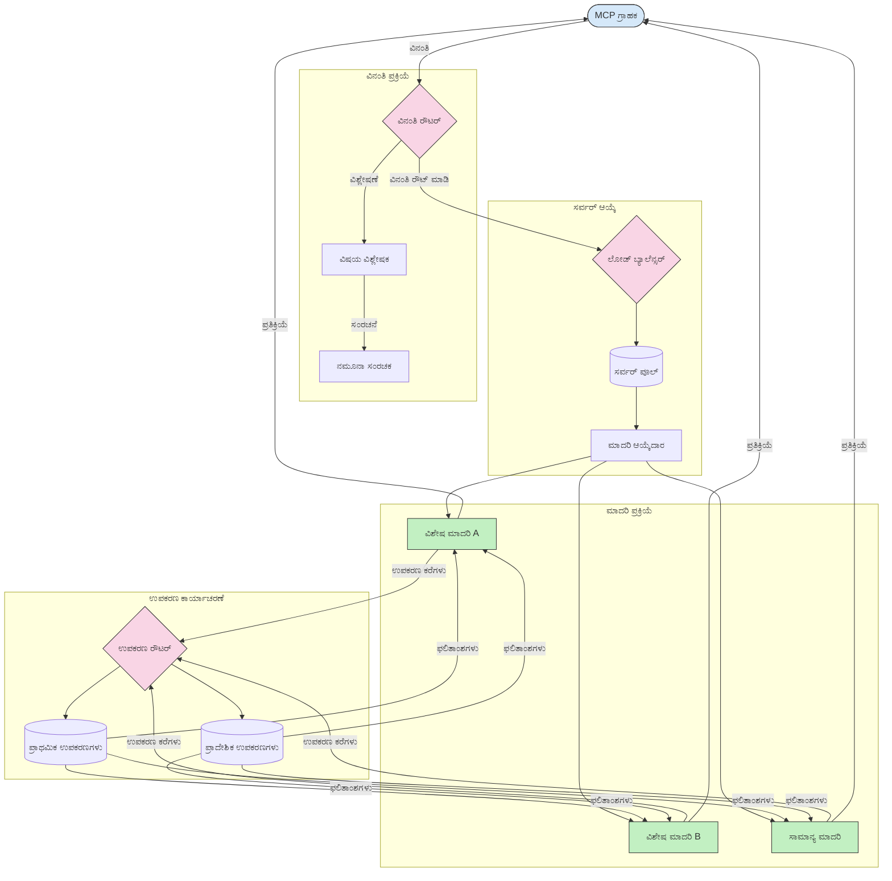

<!--
CO_OP_TRANSLATOR_METADATA:
{
  "original_hash": "2f1b473818b5a6cc9a9bbf777fffa6d4",
  "translation_date": "2025-12-11T16:30:33+00:00",
  "source_file": "05-AdvancedTopics/mcp-routing/README.md",
  "language_code": "kn"
}
-->
# ಮಾದರಿ ಸಂಧರ್ಭ ಪ್ರೋಟೋಕಾಲ್‌ನಲ್ಲಿ ಮಾರ್ಗನಿರ್ದೇಶನ

ಮಾರ್ಗನಿರ್ದೇಶನವು MCP ಪರಿಸರದಲ್ಲಿ ವಿನಂತಿಗಳನ್ನು ಸೂಕ್ತ ಮಾದರಿಗಳು, ಸಾಧನಗಳು ಅಥವಾ ಸೇವೆಗಳಿಗೆ ನಿರ್ದೇಶಿಸುವುದಕ್ಕೆ ಅಗತ್ಯವಾಗಿದೆ.

## ಪರಿಚಯ

ಮಾದರಿ ಸಂಧರ್ಭ ಪ್ರೋಟೋಕಾಲ್ (MCP) ನಲ್ಲಿ ಮಾರ್ಗನಿರ್ದೇಶನವು ವಿಷಯದ ಪ್ರಕಾರ, ಬಳಕೆದಾರ ಸಂಧರ್ಭ ಮತ್ತು ವ್ಯವಸ್ಥೆಯ ಭಾರವನ್ನು ಆಧರಿಸಿ ಅತ್ಯಂತ ಸೂಕ್ತ ಮಾದರಿಗಳು ಅಥವಾ ಸೇವೆಗಳಿಗೆ ವಿನಂತಿಗಳನ್ನು ನಿರ್ದೇಶಿಸುವುದನ್ನು ಒಳಗೊಂಡಿದೆ. ಇದು ಪರಿಣಾಮಕಾರಿಯಾದ ಪ್ರಕ್ರಿಯೆ ಮತ್ತು ಉತ್ತಮ ಸಂಪನ್ಮೂಲ ಬಳಕೆಯನ್ನು ಖಚಿತಪಡಿಸುತ್ತದೆ.

## ಕಲಿಕೆಯ ಉದ್ದೇಶಗಳು

ಈ ಪಾಠದ ಅಂತ್ಯಕ್ಕೆ, ನೀವು ಸಾಧ್ಯವಾಗುವುದು:

- MCP ನಲ್ಲಿ ಮಾರ್ಗನಿರ್ದೇಶನದ ತತ್ವಗಳನ್ನು ಅರ್ಥಮಾಡಿಕೊಳ್ಳುವುದು.
- ವಿಷಯ ಆಧಾರಿತ ಮಾರ್ಗನಿರ್ದೇಶನವನ್ನು ಅನುಷ್ಠಾನಗೊಳಿಸಿ ವಿನಂತಿಗಳನ್ನು ವಿಶೇಷ ಸೇವೆಗಳಿಗೆ ನಿರ್ದೇಶಿಸುವುದು.
- ಸಂಪನ್ಮೂಲ ಬಳಕೆಯನ್ನು ಉತ್ತಮಗೊಳಿಸಲು ಬುದ್ಧಿವಂತ ಲೋಡ್ ಬ್ಯಾಲೆನ್ಸಿಂಗ್ ತಂತ್ರಗಳನ್ನು ಅನ್ವಯಿಸುವುದು.
- ವಿನಂತಿ ಸಂಧರ್ಭದ ಆಧಾರದ ಮೇಲೆ ಡೈನಾಮಿಕ್ ಸಾಧನ ಮಾರ್ಗನಿರ್ದೇಶನವನ್ನು ಅನುಷ್ಠಾನಗೊಳಿಸುವುದು.

## ವಿಷಯ ಆಧಾರಿತ ಮಾರ್ಗನಿರ್ದೇಶನ

ವಿಷಯ ಆಧಾರಿತ ಮಾರ್ಗನಿರ್ದೇಶನವು ವಿನಂತಿಯ ವಿಷಯದ ಆಧಾರದ ಮೇಲೆ ವಿಶೇಷ ಸೇವೆಗಳಿಗೆ ವಿನಂತಿಗಳನ್ನು ನಿರ್ದೇಶಿಸುತ್ತದೆ. ಉದಾಹರಣೆಗೆ, ಕೋಡ್ ಜನರೇಶನ್ ಸಂಬಂಧಿತ ವಿನಂತಿಗಳನ್ನು ವಿಶೇಷ ಕೋಡ್ ಮಾದರಿಗೆ ಮಾರ್ಗನಿರ್ದೇಶನ ಮಾಡಬಹುದು, ಮತ್ತು ಸೃಜನಾತ್ಮಕ ಬರವಣಿಗೆ ವಿನಂತಿಗಳನ್ನು ಸೃಜನಾತ್ಮಕ ಬರವಣಿಗೆ ಮಾದರಿಗೆ ಕಳುಹಿಸಬಹುದು.

ವಿಭಿನ್ನ ಪ್ರೋಗ್ರಾಮಿಂಗ್ ಭಾಷೆಗಳಲ್ಲಿ ಉದಾಹರಣೆಯ ಅನುಷ್ಠಾನವನ್ನು ನೋಡೋಣ.

<details>
<summary>.NET</summary>

```csharp
// .NET Example: Content-based routing in MCP
public class ContentBasedRouter
{
    private readonly Dictionary<string, McpClient> _specializedClients;
    private readonly RoutingClassifier _classifier;
    
    public ContentBasedRouter()
    {
        // Initialize specialized clients for different domains
        _specializedClients = new Dictionary<string, McpClient>
        {
            ["code"] = new McpClient("https://code-specialized-mcp.com"),
            ["creative"] = new McpClient("https://creative-specialized-mcp.com"),
            ["scientific"] = new McpClient("https://scientific-specialized-mcp.com"),
            ["general"] = new McpClient("https://general-mcp.com")
        };
        
        // Initialize content classifier
        _classifier = new RoutingClassifier();
    }
    
    public async Task<McpResponse> RouteAndProcessAsync(string prompt, IDictionary<string, object> parameters = null)
    {
        // Classify the prompt to determine the best specialized service
        string category = await _classifier.ClassifyPromptAsync(prompt);
        
        // Get the appropriate client or fall back to general
        var client = _specializedClients.ContainsKey(category) 
            ? _specializedClients[category] 
            : _specializedClients["general"];
            
        Console.WriteLine($"Routing request to {category} specialized service");
        
        // Send request to the selected service
        return await client.SendPromptAsync(prompt, parameters);
    }
    
    // Simple classifier for routing decisions
    private class RoutingClassifier
    {
        public Task<string> ClassifyPromptAsync(string prompt)
        {
            prompt = prompt.ToLowerInvariant();
            
            if (prompt.Contains("code") || prompt.Contains("function") || 
                prompt.Contains("program") || prompt.Contains("algorithm"))
            {
                return Task.FromResult("code");
            }
            
            if (prompt.Contains("story") || prompt.Contains("creative") || 
                prompt.Contains("imagine") || prompt.Contains("design"))
            {
                return Task.FromResult("creative");
            }
            
            if (prompt.Contains("science") || prompt.Contains("research") || 
                prompt.Contains("analyze") || prompt.Contains("study"))
            {
                return Task.FromResult("scientific");
            }
            
            return Task.FromResult("general");
        }
    }
}
```

ಮುಂಬರುವ ಕೋಡ್‌ನಲ್ಲಿ, ನಾವು:

- ಪ್ರಾಂಪ್ಟ್‌ನ ವಿಷಯದ ಆಧಾರದ ಮೇಲೆ ವಿನಂತಿಗಳನ್ನು ಮಾರ್ಗನಿರ್ದೇಶಿಸುವ `ContentBasedRouter` ಕ್ಲಾಸ್ ಅನ್ನು ರಚಿಸಿದ್ದೇವೆ.
- ವಿಭಿನ್ನ ಕ್ಷೇತ್ರಗಳ (ಕೋಡ್, ಸೃಜನಾತ್ಮಕ, ವೈಜ್ಞಾನಿಕ, ಸಾಮಾನ್ಯ) ವಿಶೇಷ ಕ್ಲೈಂಟ್‌ಗಳನ್ನು ಪ್ರಾರಂಭಿಸಿದ್ದೇವೆ.
- ಪ್ರಾಂಪ್ಟ್‌ನ ವರ್ಗವನ್ನು ನಿರ್ಧರಿಸಿ ಅದನ್ನು ಸೂಕ್ತ ವಿಶೇಷ ಸೇವೆಗೆ ಮಾರ್ಗನಿರ್ದೇಶಿಸುವ ಸರಳ ವರ್ಗೀಕರಣಕಾರಿಯನ್ನು ಅನುಷ್ಠಾನಗೊಳಿಸಿದ್ದೇವೆ.
- ಯಾವುದೇ ವಿಶೇಷ ಸೇವೆ ಲಭ್ಯವಿಲ್ಲದಿದ್ದರೆ ವಿನಂತಿಗಳನ್ನು ಸಾಮಾನ್ಯ ಸೇವೆಗೆ ಮಾರ್ಗನಿರ್ದೇಶಿಸುವ ಬ್ಯಾಕ್ಅಪ್ ವ್ಯವಸ್ಥೆಯನ್ನು ಬಳಸಿದ್ದೇವೆ.
- ವಿನಂತಿಗಳನ್ನು ಪರಿಣಾಮಕಾರಿಯಾಗಿ ನಿರ್ವಹಿಸಲು ಅಸಿಂಕ್ರೋನಸ್ ಪ್ರಕ್ರಿಯೆಯನ್ನು ಅನುಷ್ಠಾನಗೊಳಿಸಿದ್ದೇವೆ.
- ವಿಷಯ ವರ್ಗಗಳನ್ನು ವಿಶೇಷ MCP ಕ್ಲೈಂಟ್‌ಗಳಿಗೆ ನಕ್ಷೆ ಮಾಡಲು ಡಿಕ್ಷನರಿ ಬಳಸಿದ್ದೇವೆ.
- ಪ್ರಾಂಪ್ಟ್ ಅನ್ನು ವಿಶ್ಲೇಷಿಸಿ ಸೂಕ್ತ ವರ್ಗವನ್ನು ಹಿಂತಿರುಗಿಸುವ ಸರಳ ವರ್ಗೀಕರಣಕಾರಿಯನ್ನು ಅನುಷ್ಠಾನಗೊಳಿಸಿದ್ದೇವೆ.
- ವಿನಂತಿಯನ್ನು ಕಳುಹಿಸಲು ಮತ್ತು ಪ್ರತಿಕ್ರಿಯೆಯನ್ನು ಸ್ವೀಕರಿಸಲು ವಿಶೇಷ ಕ್ಲೈಂಟ್ ಅನ್ನು ಬಳಸಿದ್ದೇವೆ.
- ಪ್ರಾಂಪ್ಟ್ ಯಾವುದೇ ವಿಶೇಷ ವರ್ಗಕ್ಕೆ ಹೊಂದಿಕೆಯಾಗದ ಸಂದರ್ಭಗಳನ್ನು ಸಾಮಾನ್ಯ ಸೇವೆಗೆ ಮಾರ್ಗನಿರ್ದೇಶನ ಮಾಡುವ ಮೂಲಕ ನಿರ್ವಹಿಸಿದ್ದೇವೆ.

</details>

## ಬುದ್ಧಿವಂತ ಲೋಡ್ ಬ್ಯಾಲೆನ್ಸಿಂಗ್

ಲೋಡ್ ಬ್ಯಾಲೆನ್ಸಿಂಗ್ ಸಂಪನ್ಮೂಲ ಬಳಕೆಯನ್ನು ಉತ್ತಮಗೊಳಿಸುತ್ತದೆ ಮತ್ತು MCP ಸೇವೆಗಳ ಹೆಚ್ಚಿನ ಲಭ್ಯತೆಯನ್ನು ಖಚಿತಪಡಿಸುತ್ತದೆ. ಲೋಡ್ ಬ್ಯಾಲೆನ್ಸಿಂಗ್ ಅನ್ನು ವಿವಿಧ ರೀತಿಗಳಲ್ಲಿ ಅನುಷ್ಠಾನಗೊಳಿಸಬಹುದು, ಉದಾಹರಣೆಗೆ ರೌಂಡ್-ರಾಬಿನ್, ತೂಕದ ಪ್ರತಿಕ್ರಿಯೆ ಸಮಯ, ಅಥವಾ ವಿಷಯ-ಜಾಗೃತಿ ತಂತ್ರಗಳು.

ಕೆಳಗಿನ ಉದಾಹರಣೆಯ ಅನುಷ್ಠಾನವು ಕೆಳಗಿನ ತಂತ್ರಗಳನ್ನು ಬಳಸುತ್ತದೆ:

- **ರೌಂಡ್ ರಾಬಿನ್**: ಲಭ್ಯವಿರುವ ಸರ್ವರ್‌ಗಳ ನಡುವೆ ವಿನಂತಿಗಳನ್ನು ಸಮಾನವಾಗಿ ಹಂಚುತ್ತದೆ.
- **ತೂಕದ ಪ್ರತಿಕ್ರಿಯೆ ಸಮಯ**: ಸರಾಸರಿ ಪ್ರತಿಕ್ರಿಯೆ ಸಮಯದ ಆಧಾರದ ಮೇಲೆ ಸರ್ವರ್‌ಗಳಿಗೆ ವಿನಂತಿಗಳನ್ನು ಮಾರ್ಗನಿರ್ದೇಶನ ಮಾಡುತ್ತದೆ.
- **ವಿಷಯ-ಜಾಗೃತಿ**: ವಿನಂತಿಯ ವಿಷಯದ ಆಧಾರದ ಮೇಲೆ ವಿಶೇಷ ಸರ್ವರ್‌ಗಳಿಗೆ ವಿನಂತಿಗಳನ್ನು ಮಾರ್ಗನಿರ್ದೇಶನ ಮಾಡುತ್ತದೆ.

<details>
<summary>Java</summary>

```java
// ಜಾವಾ ಉದಾಹರಣೆ: MCP ಸರ್ವರ್‌ಗಳಿಗಾಗಿ ಬುದ್ಧಿವಂತ ಲೋಡ್ ಬ್ಯಾಲೆನ್ಸಿಂಗ್
public class McpLoadBalancer {
    private final List<McpServerNode> serverNodes;
    private final LoadBalancingStrategy strategy;
    
    public McpLoadBalancer(List<McpServerNode> nodes, LoadBalancingStrategy strategy) {
        this.serverNodes = new ArrayList<>(nodes);
        this.strategy = strategy;
    }
    
    public McpResponse processRequest(McpRequest request) {
        // ತಂತ್ರದ ಆಧಾರದ ಮೇಲೆ ಉತ್ತಮ ಸರ್ವರ್ ಆಯ್ಕೆಮಾಡಿ
        McpServerNode selectedNode = strategy.selectNode(serverNodes, request);
        
        try {
            // ವಿನಂತಿಯನ್ನು ಆಯ್ಕೆಮಾಡಲಾದ ನೋಡ್‌ಗೆ ಮಾರ್ಗದರ್ಶನ ಮಾಡಿ
            return selectedNode.processRequest(request);
        } catch (Exception e) {
            // ವೈಫಲ್ಯವನ್ನು ನಿರ್ವಹಿಸಿ - ಮರುಪ್ರಯತ್ನ ಅಥವಾ ಬ್ಯಾಕ್ಅಪ್ ಲಾಜಿಕ್ ಅನ್ನು ಜಾರಿಗೆ ತರುವುದು
            System.err.println("Error processing request on node " + selectedNode.getId() + ": " + e.getMessage());
            
            // ನೋಡ್ ಅನ್ನು ಸಾಧ್ಯತೆಯುಳ್ಳ ಅಸ್ವಸ್ಥ ಎಂದು ಗುರುತಿಸಿ
            selectedNode.recordFailure();
            
            // ಬ್ಯಾಕ್ಅಪ್ ಆಗಿ ಮುಂದಿನ ಉತ್ತಮ ನೋಡ್ ಅನ್ನು ಪ್ರಯತ್ನಿಸಿ
            List<McpServerNode> remainingNodes = new ArrayList<>(serverNodes);
            remainingNodes.remove(selectedNode);
            
            if (!remainingNodes.isEmpty()) {
                McpServerNode fallbackNode = strategy.selectNode(remainingNodes, request);
                return fallbackNode.processRequest(request);
            } else {
                throw new RuntimeException("All MCP server nodes failed to process the request");
            }
        }
    }
    
    // ನೋಡ್ ಆರೋಗ್ಯ ಪರಿಶೀಲನಾ ಕಾರ್ಯ
    public void startHealthChecks(Duration interval) {
        ScheduledExecutorService scheduler = Executors.newScheduledThreadPool(1);
        scheduler.scheduleAtFixedRate(() -> {
            for (McpServerNode node : serverNodes) {
                try {
                    boolean isHealthy = node.checkHealth();
                    System.out.println("Node " + node.getId() + " health status: " + 
                                      (isHealthy ? "HEALTHY" : "UNHEALTHY"));
                } catch (Exception e) {
                    System.err.println("Health check failed for node " + node.getId());
                    node.setHealthy(false);
                }
            }
        }, 0, interval.toMillis(), TimeUnit.MILLISECONDS);
    }
    
    // ಲೋಡ್ ಬ್ಯಾಲೆನ್ಸಿಂಗ್ ತಂತ್ರಗಳಿಗಾಗಿ ಇಂಟರ್ಫೇಸ್
    public interface LoadBalancingStrategy {
        McpServerNode selectNode(List<McpServerNode> nodes, McpRequest request);
    }
    
    // ರೌಂಡ್-ರಾಬಿನ್ ತಂತ್ರ
    public static class RoundRobinStrategy implements LoadBalancingStrategy {
        private AtomicInteger counter = new AtomicInteger(0);
        
        @Override
        public McpServerNode selectNode(List<McpServerNode> nodes, McpRequest request) {
            List<McpServerNode> healthyNodes = nodes.stream()
                .filter(McpServerNode::isHealthy)
                .collect(Collectors.toList());
            
            if (healthyNodes.isEmpty()) {
                throw new RuntimeException("No healthy nodes available");
            }
            
            int index = counter.getAndIncrement() % healthyNodes.size();
            return healthyNodes.get(index);
        }
    }
    
    // ತೂಕದ ಪ್ರತಿಕ್ರಿಯೆ ಸಮಯ ತಂತ್ರ
    public static class ResponseTimeStrategy implements LoadBalancingStrategy {
        @Override
        public McpServerNode selectNode(List<McpServerNode> nodes, McpRequest request) {
            return nodes.stream()
                .filter(McpServerNode::isHealthy)
                .min(Comparator.comparing(McpServerNode::getAverageResponseTime))
                .orElseThrow(() -> new RuntimeException("No healthy nodes available"));
        }
    }
    
    // ವಿಷಯ-ಜಾಗೃತ ತಂತ್ರ
    public static class ContentAwareStrategy implements LoadBalancingStrategy {
        @Override
        public McpServerNode selectNode(List<McpServerNode> nodes, McpRequest request) {
            // ವಿನಂತಿಯ ಲಕ್ಷಣಗಳನ್ನು ನಿರ್ಧರಿಸಿ
            boolean isCodeRequest = request.getPrompt().contains("code") || 
                                   request.getAllowedTools().contains("codeInterpreter");
            
            boolean isCreativeRequest = request.getPrompt().contains("creative") || 
                                       request.getPrompt().contains("story");
            
            // ವಿಶೇಷ ನೋಡ್‌ಗಳನ್ನು ಹುಡುಕಿ
            Optional<McpServerNode> specializedNode = nodes.stream()
                .filter(McpServerNode::isHealthy)
                .filter(node -> {
                    if (isCodeRequest && node.getSpecialization().equals("code")) {
                        return true;
                    }
                    if (isCreativeRequest && node.getSpecialization().equals("creative")) {
                        return true;
                    }
                    return false;
                })
                .findFirst();
            
            // ವಿಶೇಷ ನೋಡ್ ಅಥವಾ ಕನಿಷ್ಠ ಲೋಡ್ ಹೊಂದಿರುವ ನೋಡ್ ಅನ್ನು ಹಿಂತಿರುಗಿಸಿ
            return specializedNode.orElse(
                nodes.stream()
                    .filter(McpServerNode::isHealthy)
                    .min(Comparator.comparing(McpServerNode::getCurrentLoad))
                    .orElseThrow(() -> new RuntimeException("No healthy nodes available"))
            );
        }
    }
}
```

ಮುಂಬರುವ ಕೋಡ್‌ನಲ್ಲಿ, ನಾವು:

- MCP ಸರ್ವರ್ ನೋಡ್‌ಗಳ ಪಟ್ಟಿಯನ್ನು ನಿರ್ವಹಿಸುವ ಮತ್ತು ಆಯ್ಕೆಮಾಡಿದ ಲೋಡ್ ಬ್ಯಾಲೆನ್ಸಿಂಗ್ ತಂತ್ರದ ಆಧಾರದ ಮೇಲೆ ವಿನಂತಿಗಳನ್ನು ಮಾರ್ಗನಿರ್ದೇಶಿಸುವ `McpLoadBalancer` ಕ್ಲಾಸ್ ಅನ್ನು ರಚಿಸಿದ್ದೇವೆ.
- ವಿಭಿನ್ನ ಲೋಡ್ ಬ್ಯಾಲೆನ್ಸಿಂಗ್ ತಂತ್ರಗಳನ್ನು ಅನುಷ್ಠಾನಗೊಳಿಸಿದ್ದೇವೆ: `RoundRobinStrategy`, `ResponseTimeStrategy`, ಮತ್ತು `ContentAwareStrategy`.
- ಸರ್ವರ್ ನೋಡ್‌ಗಳ ಆರೋಗ್ಯವನ್ನು ನಿಯಮಿತವಾಗಿ ಪರಿಶೀಲಿಸಲು `ScheduledExecutorService` ಅನ್ನು ಬಳಸಿದ್ದೇವೆ.
- ಆರೋಗ್ಯ ಪರಿಶೀಲನೆಗೆ ಪ್ರತಿಕ್ರಿಯೆಯ ಆಧಾರದ ಮೇಲೆ ನೋಡ್‌ಗಳನ್ನು ಆರೋಗ್ಯಕರ ಅಥವಾ ಅಸ್ವಸ್ಥ ಎಂದು ಗುರುತಿಸುವ ಆರೋಗ್ಯ ಪರಿಶೀಲನಾ ವ್ಯವಸ್ಥೆಯನ್ನು ಅನುಷ್ಠಾನಗೊಳಿಸಿದ್ದೇವೆ.
- ಹೆಚ್ಚಿನ ಲಭ್ಯತೆಯನ್ನು ಖಚಿತಪಡಿಸಲು ದೋಷ ನಿರ್ವಹಣೆ ಮತ್ತು ಬ್ಯಾಕ್ಅಪ್ ಲಾಜಿಕ್‌ನೊಂದಿಗೆ ವಿನಂತಿ ಪ್ರಕ್ರಿಯೆಯನ್ನು ನಿರ್ವಹಿಸಿದ್ದೇವೆ.
- ಪ್ರತಿ MCP ಸರ್ವರ್ ನೋಡ್‌ನ ಆರೋಗ್ಯ ಸ್ಥಿತಿ, ಸರಾಸರಿ ಪ್ರತಿಕ್ರಿಯೆ ಸಮಯ ಮತ್ತು ಪ್ರಸ್ತುತ ಲೋಡ್ ಸೇರಿದಂತೆ ವಿವರಗಳನ್ನು ಪ್ರತಿನಿಧಿಸಲು `McpServerNode` ಕ್ಲಾಸ್ ಅನ್ನು ಬಳಸಿದ್ದೇವೆ.
- ಪ್ರಾಂಪ್ಟ್ ಮತ್ತು ಅನುಮತಿಸಲಾದ ಸಾಧನಗಳಂತಹ ವಿನಂತಿ ವಿವರಗಳನ್ನು ಒಳಗೊಂಡ `McpRequest` ಕ್ಲಾಸ್ ಅನ್ನು ಅನುಷ್ಠಾನಗೊಳಿಸಿದ್ದೇವೆ.
- ಆರೋಗ್ಯ ಸ್ಥಿತಿ ಮತ್ತು ವಿಶೇಷತೆಯ ಆಧಾರದ ಮೇಲೆ ನೋಡ್‌ಗಳನ್ನು ಫಿಲ್ಟರ್ ಮತ್ತು ಆಯ್ಕೆ ಮಾಡಲು Java Streams ಅನ್ನು ಬಳಸಿದ್ದೇವೆ.

</details>

## ಡೈನಾಮಿಕ್ ಸಾಧನ ಮಾರ್ಗನಿರ್ದೇಶನ

ಸಾಧನ ಮಾರ್ಗನಿರ್ದೇಶನವು ಸಾಧನ ಕರೆಗಳನ್ನು ಸಂಧರ್ಭದ ಆಧಾರದ ಮೇಲೆ ಅತ್ಯಂತ ಸೂಕ್ತ ಸೇವೆಗೆ ನಿರ್ದೇಶಿಸುವುದನ್ನು ಖಚಿತಪಡಿಸುತ್ತದೆ. ಉದಾಹರಣೆಗೆ, ಹವಾಮಾನ ಸಾಧನ ಕರೆ ಬಳಕೆದಾರರ ಸ್ಥಳದ ಆಧಾರದ ಮೇಲೆ ಪ್ರಾದೇಶಿಕ ಎಂಡ್ಪಾಯಿಂಟ್‌ಗೆ ಮಾರ್ಗನಿರ್ದೇಶನ ಮಾಡಬೇಕಾಗಬಹುದು, ಅಥವಾ ಕ್ಯಾಲ್ಕ್ಯುಲೇಟರ್ ಸಾಧನವು API ನ ನಿರ್ದಿಷ್ಟ ಆವೃತ್ತಿಯನ್ನು ಬಳಸಬೇಕಾಗಬಹುದು.

ವಿನಂತಿ ವಿಶ್ಲೇಷಣೆ, ಪ್ರಾದೇಶಿಕ ಎಂಡ್ಪಾಯಿಂಟ್‌ಗಳು ಮತ್ತು ಆವೃತ್ತಿ ಬೆಂಬಲದ ಆಧಾರದ ಮೇಲೆ ಡೈನಾಮಿಕ್ ಸಾಧನ ಮಾರ್ಗನಿರ್ದೇಶನವನ್ನು ತೋರಿಸುವ ಉದಾಹರಣೆಯ ಅನುಷ್ಠಾನವನ್ನು ನೋಡೋಣ.

<details>
<summary>Python</summary>

```python
# ಪೈಥಾನ್ ಉದಾಹರಣೆ: ವಿನಂತಿ ವಿಶ್ಲೇಷಣೆಯ ಆಧಾರದ ಮೇಲೆ ಡೈನಾಮಿಕ್ ಟೂಲ್ ಮಾರ್ಗನಿರ್ದೇಶನ
class McpToolRouter:
    def __init__(self):
        # ಲಭ್ಯವಿರುವ ಟೂಲ್ ಎಂಡ್‌ಪಾಯಿಂಟ್‌ಗಳನ್ನು ನೋಂದಣಿ ಮಾಡು
        self.tool_endpoints = {
            "weatherTool": "https://weather-service.example.com/api",
            "calculatorTool": "https://calculator-service.example.com/compute",
            "databaseTool": "https://database-service.example.com/query",
            "searchTool": "https://search-service.example.com/search"
        }
        
        # ಜಾಗತಿಕ ವಿತರಣೆಗಾಗಿ ಪ್ರಾದೇಶಿಕ ಎಂಡ್‌ಪಾಯಿಂಟ್‌ಗಳು
        self.regional_endpoints = {
            "us": {
                "weatherTool": "https://us-west.weather-service.example.com/api",
                "searchTool": "https://us.search-service.example.com/search"
            },
            "europe": {
                "weatherTool": "https://eu.weather-service.example.com/api",
                "searchTool": "https://eu.search-service.example.com/search"
            },
            "asia": {
                "weatherTool": "https://asia.weather-service.example.com/api",
                "searchTool": "https://asia.search-service.example.com/search"
            }
        }
        
        # ಟೂಲ್ ಆವೃತ್ತಿ ಬೆಂಬಲ
        self.tool_versions = {
            "weatherTool": {
                "default": "v2",
                "v1": "https://weather-service.example.com/api/v1",
                "v2": "https://weather-service.example.com/api/v2",
                "beta": "https://weather-service.example.com/api/beta"
            }
        }
    
    async def route_tool_request(self, tool_name, parameters, user_context=None):
        """Route a tool request to the appropriate endpoint based on context"""
        endpoint = self._select_endpoint(tool_name, parameters, user_context)
        
        if not endpoint:
            raise ValueError(f"No endpoint available for tool: {tool_name}")
        
        # ಆಯ್ದ ಎಂಡ್‌ಪಾಯಿಂಟ್‌ಗೆ ನಿಜವಾದ ವಿನಂತಿಯನ್ನು ನಿರ್ವಹಿಸಿ
        return await self._execute_tool_request(endpoint, tool_name, parameters)
    
    def _select_endpoint(self, tool_name, parameters, user_context=None):
        """Select the most appropriate endpoint based on context"""
        # ನೋಂದಣಿಯಿಂದ ಮೂಲ ಎಂಡ್‌ಪಾಯಿಂಟ್
        if tool_name not in self.tool_endpoints:
            return None
            
        base_endpoint = self.tool_endpoints[tool_name]
        
        # ನಾವು ನಿರ್ದಿಷ್ಟ ಟೂಲ್ ಆವೃತ್ತಿಯನ್ನು ಬಳಸಬೇಕೇ ಎಂದು ಪರಿಶೀಲಿಸಿ
        if tool_name in self.tool_versions:
            version_info = self.tool_versions[tool_name]
            
            # ನಿರ್ದಿಷ್ಟ ಆವೃತ್ತಿ ಅಥವಾ ಡೀಫಾಲ್ಟ್ ಬಳಸಿ
            requested_version = parameters.get("_version", version_info["default"])
            if requested_version in version_info:
                base_endpoint = version_info[requested_version]
        
        # ಬಳಕೆದಾರ ಪ್ರಾದೇಶಿಕ ಮಾಹಿತಿ ತಿಳಿದಿದ್ದರೆ ಪ್ರಾದೇಶಿಕ ಮಾರ್ಗನಿರ್ದೇಶನ ಪರಿಶೀಲಿಸಿ
        if user_context and "region" in user_context:
            user_region = user_context["region"]
            
            if user_region in self.regional_endpoints:
                regional_tools = self.regional_endpoints[user_region]
                
                if tool_name in regional_tools:
                    # ಪ್ರಾದೇಶಿಕ-ನಿರ್ದಿಷ್ಟ ಎಂಡ್‌ಪಾಯಿಂಟ್ ಬಳಸಿ
                    return regional_tools[tool_name]
        
        # ಡೇಟಾ ನಿವಾಸಿತ್ವ ಅಗತ್ಯಗಳನ್ನು ಪರಿಶೀಲಿಸಿ
        if user_context and "data_residency" in user_context:
            # ಇದು ಡೇಟಾ ನಿರ್ದಿಷ್ಟ ನ್ಯಾಯವಲಯದಲ್ಲಿ ಉಳಿಯುವಂತೆ ತರ್ಕವನ್ನು ಜಾರಿಗೆ ತರಲಿದೆ
            pass
        
        # ವಿಳಂಬ ಆಧಾರಿತ ಮಾರ್ಗನಿರ್ದೇಶನ ಪರಿಶೀಲಿಸಿ
        if user_context and "latency_sensitive" in user_context and user_context["latency_sensitive"]:
            # ಇದು ಕನಿಷ್ಠ ವಿಳಂಬದ ಎಂಡ್‌ಪಾಯಿಂಟ್ ಆಯ್ಕೆಮಾಡಲು ತರ್ಕವನ್ನು ಜಾರಿಗೆ ತರಲಿದೆ
            pass
            
        return base_endpoint
        
    async def _execute_tool_request(self, endpoint, tool_name, parameters):
        """Execute the actual tool request to the selected endpoint"""
        try:
            async with aiohttp.ClientSession() as session:
                async with session.post(
                    endpoint,
                    json={"toolName": tool_name, "parameters": parameters},
                    headers={"Content-Type": "application/json"}
                ) as response:
                    if response.status == 200:
                        result = await response.json()
                        return result
                    else:
                        error_text = await response.text()
                        raise Exception(f"Tool execution failed: {error_text}")
        except Exception as e:
            # ಮರುಪ್ರಯತ್ನ ತರ್ಕ ಅಥವಾ ಬ್ಯಾಕಪ್ ತಂತ್ರವನ್ನು ಜಾರಿಗೆ ತರು
            print(f"Error executing tool {tool_name} at {endpoint}: {str(e)}")
            raise
```

ಮುಂಬರುವ ಕೋಡ್‌ನಲ್ಲಿ, ನಾವು:

- ವಿನಂತಿ ವಿಶ್ಲೇಷಣೆ, ಪ್ರಾದೇಶಿಕ ಎಂಡ್ಪಾಯಿಂಟ್‌ಗಳು ಮತ್ತು ಆವೃತ್ತಿ ಬೆಂಬಲದ ಆಧಾರದ ಮೇಲೆ ಸಾಧನ ಮಾರ್ಗನಿರ್ದೇಶನವನ್ನು ನಿರ್ವಹಿಸುವ `McpToolRouter` ಕ್ಲಾಸ್ ಅನ್ನು ರಚಿಸಿದ್ದೇವೆ.
- ಲಭ್ಯವಿರುವ ಸಾಧನ ಎಂಡ್ಪಾಯಿಂಟ್‌ಗಳು ಮತ್ತು ಪ್ರಾದೇಶಿಕ ಎಂಡ್ಪಾಯಿಂಟ್‌ಗಳನ್ನು ಜಾಗತಿಕ ವಿತರಣೆಗಾಗಿ ನೋಂದಾಯಿಸಿದ್ದೇವೆ.
- ಬಳಕೆದಾರ ಸಂಧರ್ಭ, ಪ್ರಾದೇಶಿಕ ಮತ್ತು ಡೇಟಾ ನಿವಾಸಿತ್ವ ಅಗತ್ಯಗಳ ಆಧಾರದ ಮೇಲೆ ಸೂಕ್ತ ಎಂಡ್ಪಾಯಿಂಟ್ ಆಯ್ಕೆಮಾಡುವ ಡೈನಾಮಿಕ್ ಮಾರ್ಗನಿರ್ದೇಶನ ಲಾಜಿಕ್ ಅನ್ನು ಅನುಷ್ಠಾನಗೊಳಿಸಿದ್ದೇವೆ.
- ಸಾಧನಗಳ ಆವೃತ್ತಿ ಬೆಂಬಲವನ್ನು ಅನುಷ್ಠಾನಗೊಳಿಸಿ, ಬಳಕೆದಾರರು ಯಾವ ಆವೃತ್ತಿಯ ಸಾಧನವನ್ನು ಬಳಸಬೇಕೆಂದು ನಿರ್ದಿಷ್ಟಪಡಿಸಬಹುದು.
- ಸಾಧನ ಕರೆಗಳನ್ನು ನಿರ್ವಹಿಸಲು ಮತ್ತು ಪ್ರತಿಕ್ರಿಯೆಗಳನ್ನು ಹ್ಯಾಂಡಲ್ ಮಾಡಲು ಅಸಿಂಕ್ರೋನಸ್ HTTP ವಿನಂತಿಗಳನ್ನು ಬಳಸಿದ್ದೇವೆ.

</details>

## MCP ನಲ್ಲಿ ಸ್ಯಾಂಪ್ಲಿಂಗ್ ಮತ್ತು ಮಾರ್ಗನಿರ್ದೇಶನ ವಾಸ್ತುಶಿಲ್ಪ

ಸ್ಯಾಂಪ್ಲಿಂಗ್ ಮಾದರಿ ಸಂಧರ್ಭ ಪ್ರೋಟೋಕಾಲ್ (MCP) ನ ಪ್ರಮುಖ ಘಟಕವಾಗಿದೆ, ಇದು ಪರಿಣಾಮಕಾರಿಯಾದ ವಿನಂತಿ ಪ್ರಕ್ರಿಯೆ ಮತ್ತು ಮಾರ್ಗನಿರ್ದೇಶನಕ್ಕೆ ಅವಕಾಶ ನೀಡುತ್ತದೆ. ಇದು ವಿವಿಧ ಮಾನದಂಡಗಳ ಆಧಾರದ ಮೇಲೆ, ಉದಾಹರಣೆಗೆ ವಿಷಯ ಪ್ರಕಾರ, ಬಳಕೆದಾರ ಸಂಧರ್ಭ ಮತ್ತು ವ್ಯವಸ್ಥೆಯ ಭಾರ, ಅತ್ಯಂತ ಸೂಕ್ತ ಮಾದರಿ ಅಥವಾ ಸೇವೆಯನ್ನು ನಿರ್ಧರಿಸಲು ಬರುತ್ತಿರುವ ವಿನಂತಿಗಳನ್ನು ವಿಶ್ಲೇಷಿಸುವುದನ್ನು ಒಳಗೊಂಡಿದೆ.

ಸ್ಯಾಂಪ್ಲಿಂಗ್ ಮತ್ತು ಮಾರ್ಗನಿರ್ದೇಶನವನ್ನು ಸಂಯೋಜಿಸಿ, ಸಂಪನ್ಮೂಲ ಬಳಕೆಯನ್ನು ಉತ್ತಮಗೊಳಿಸುವ ಮತ್ತು ಹೆಚ್ಚಿನ ಲಭ್ಯತೆಯನ್ನು ಖಚಿತಪಡಿಸುವ ಬಲವಾದ ವಾಸ್ತುಶಿಲ್ಪವನ್ನು ರಚಿಸಬಹುದು. ಸ್ಯಾಂಪ್ಲಿಂಗ್ ಪ್ರಕ್ರಿಯೆಯನ್ನು ವಿನಂತಿಗಳನ್ನು ವರ್ಗೀಕರಿಸಲು ಬಳಸಬಹುದು, ಮತ್ತು ಮಾರ್ಗನಿರ್ದೇಶನವು ಅವುಗಳನ್ನು ಸೂಕ್ತ ಮಾದರಿಗಳು ಅಥವಾ ಸೇವೆಗಳಿಗೆ ನಿರ್ದೇಶಿಸುತ್ತದೆ.

ಕೆಳಗಿನ ಚಿತ್ರಣವು ಸ್ಯಾಂಪ್ಲಿಂಗ್ ಮತ್ತು ಮಾರ್ಗನಿರ್ದೇಶನವು ಸಮಗ್ರ MCP ವಾಸ್ತುಶಿಲ್ಪದಲ್ಲಿ ಹೇಗೆ ಒಟ್ಟಿಗೆ ಕಾರ್ಯನಿರ್ವಹಿಸುತ್ತವೆ ಎಂಬುದನ್ನು ತೋರಿಸುತ್ತದೆ:


## ಮುಂದೇನು

- [5.6 ಸ್ಯಾಂಪ್ಲಿಂಗ್](../mcp-sampling/README.md)

---

<!-- CO-OP TRANSLATOR DISCLAIMER START -->
**ಅಸ್ವೀಕಾರ**:  
ಈ ದಸ್ತಾವೇಜು AI ಅನುವಾದ ಸೇವೆ [Co-op Translator](https://github.com/Azure/co-op-translator) ಬಳಸಿ ಅನುವಾದಿಸಲಾಗಿದೆ. ನಾವು ನಿಖರತೆಯಿಗಾಗಿ ಪ್ರಯತ್ನಿಸುತ್ತಿದ್ದರೂ, ಸ್ವಯಂಚಾಲಿತ ಅನುವಾದಗಳಲ್ಲಿ ತಪ್ಪುಗಳು ಅಥವಾ ಅಸತ್ಯತೆಗಳು ಇರಬಹುದು ಎಂದು ದಯವಿಟ್ಟು ಗಮನಿಸಿ. ಮೂಲ ಭಾಷೆಯಲ್ಲಿರುವ ಮೂಲ ದಸ್ತಾವೇಜನ್ನು ಅಧಿಕೃತ ಮೂಲವೆಂದು ಪರಿಗಣಿಸಬೇಕು. ಪ್ರಮುಖ ಮಾಹಿತಿಗಾಗಿ, ವೃತ್ತಿಪರ ಮಾನವ ಅನುವಾದವನ್ನು ಶಿಫಾರಸು ಮಾಡಲಾಗುತ್ತದೆ. ಈ ಅನುವಾದ ಬಳಕೆಯಿಂದ ಉಂಟಾಗುವ ಯಾವುದೇ ತಪ್ಪು ಅರ್ಥಮಾಡಿಕೊಳ್ಳುವಿಕೆ ಅಥವಾ ತಪ್ಪು ವಿವರಣೆಗಳಿಗೆ ನಾವು ಹೊಣೆಗಾರರಾಗುವುದಿಲ್ಲ.
<!-- CO-OP TRANSLATOR DISCLAIMER END -->