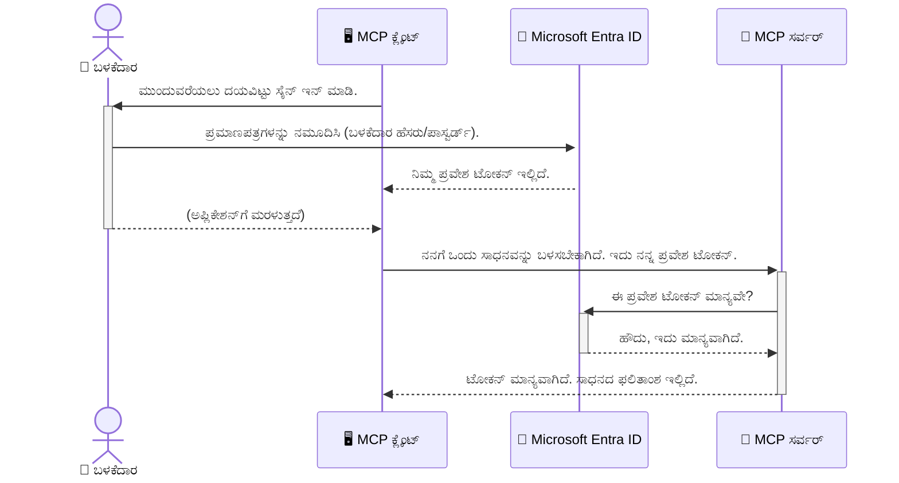

# AI ಕಾರ್ಯಪ್ರವಾಹಗಳನ್ನು ಸುರಕ್ಷಿತಗೊಳಿಸುವುದು: ಮಾದರಿ ಸಾಂದರ್ಭಿಕ ಪ್ರೋಟೋಕಾಲ್ ಸರ್ವರ್‌ಗಳಿಗೆ Entra ID ಪ್ರಾಮಾಣೀಕರಣ

## ಪರಿಚಯ
ನಿಮ್ಮ ಮಾದರಿ ಸಾಂದರ್ಭಿಕ ಪ್ರೋಟೋಕಾಲ್ (MCP) ಸರ್ವರ್ ಅನ್ನು ಸುರಕ್ಷಿತಗೊಳಿಸುವುದು ನಿಮ್ಮ ಮನೆಯ ಮುಂಭಾಗದ ಬಾಗಿಲನ್ನು ಲಾಕ್ ಮಾಡುವಷ್ಟು ಮುಖ್ಯವಾಗಿದೆ. ನಿಮ್ಮ MCP ಸರ್ವರ್ ಅನ್ನು ತೆರೆಯಿಟ್ಟರೆ, ನಿಮ್ಮ ಸಾಧನಗಳು ಮತ್ತು ಡೇಟಾ ಅನಧಿಕೃತ ಪ್ರವೇಶಕ್ಕೆ ಒಳಗಾಗಬಹುದು, ಇದು ಭದ್ರತಾ ಉಲ್ಲಂಘನೆಗಳಿಗೆ ಕಾರಣವಾಗಬಹುದು. Microsoft Entra ID ಒಂದು ಬಲವಾದ ಕ್ಲೌಡ್ ಆಧಾರಿತ ಗುರುತು ಮತ್ತು ಪ್ರವೇಶ ನಿರ್ವಹಣಾ ಪರಿಹಾರವನ್ನು ಒದಗಿಸುತ್ತದೆ, ಇದು ಕೇವಲ ಅನುಮತಿಪ್ರಾಪ್ತ ಬಳಕೆದಾರರು ಮತ್ತು ಅಪ್ಲಿಕೇಶನ್‌ಗಳು ನಿಮ್ಮ MCP ಸರ್ವರ್ ಜೊತೆಗೆ ಸಂವಹನ ಮಾಡಬಹುದೆಂದು ಖಚಿತಪಡಿಸುತ್ತದೆ. ಈ ವಿಭಾಗದಲ್ಲಿ, ನೀವು Entra ID ಪ್ರಾಮಾಣೀಕರಣವನ್ನು ಬಳಸಿ ನಿಮ್ಮ AI ಕಾರ್ಯಪ್ರವಾಹಗಳನ್ನು ಹೇಗೆ ರಕ್ಷಿಸಬಹುದು ಎಂಬುದನ್ನು ಕಲಿಯುತ್ತೀರಿ.

## ಕಲಿಕೆಯ ಉದ್ದೇಶಗಳು
ಈ ವಿಭಾಗದ ಅಂತ್ಯಕ್ಕೆ, ನೀವು ಈ ಕೆಳಗಿನವುಗಳನ್ನು ಮಾಡಲು ಸಾಧ್ಯವಾಗುತ್ತದೆ:

- MCP ಸರ್ವರ್‌ಗಳನ್ನು ಸುರಕ್ಷಿತಗೊಳಿಸುವ ಮಹತ್ವವನ್ನು ಅರ್ಥಮಾಡಿಕೊಳ್ಳುವುದು.
- Microsoft Entra ID ಮತ್ತು OAuth 2.0 ಪ್ರಾಮಾಣೀಕರಣದ ಮೂಲಭೂತಗಳನ್ನು ವಿವರಿಸುವುದು.
- ಸಾರ್ವಜನಿಕ ಮತ್ತು ರಹಸ್ಯ ಗ್ರಾಹಕರ ನಡುವಿನ ವ್ಯತ್ಯಾಸವನ್ನು ಗುರುತಿಸುವುದು.
- ಸ್ಥಳೀಯ (ಸಾರ್ವಜನಿಕ ಗ್ರಾಹಕ) ಮತ್ತು ದೂರಸ್ಥ (ರಹಸ್ಯ ಗ್ರಾಹಕ) MCP ಸರ್ವರ್ ಸನ್ನಿವೇಶಗಳಲ್ಲಿ Entra ID ಪ್ರಾಮಾಣೀಕರಣವನ್ನು ಜಾರಿಗೆ ತರುವುದು.
- AI ಕಾರ್ಯಪ್ರವಾಹಗಳನ್ನು ಅಭಿವೃದ್ಧಿಪಡಿಸುವಾಗ ಭದ್ರತಾ ಉತ್ತಮ ಅಭ್ಯಾಸಗಳನ್ನು ಅನ್ವಯಿಸುವುದು.

## ಭದ್ರತೆ ಮತ್ತು MCP

ನೀವು ನಿಮ್ಮ ಮನೆಯ ಮುಂಭಾಗದ ಬಾಗಿಲನ್ನು ಲಾಕ್ ಮಾಡದೆ ಬಿಡುವುದಿಲ್ಲದಂತೆ, ನಿಮ್ಮ MCP ಸರ್ವರ್ ಅನ್ನು ಯಾರಿಗೂ ಪ್ರವೇಶಿಸಲು ಬಿಡಬಾರದು. ನಿಮ್ಮ AI ಕಾರ್ಯಪ್ರವಾಹಗಳನ್ನು ಸುರಕ್ಷಿತಗೊಳಿಸುವುದು ಬಲವಾದ, ನಂಬಿಗಸ್ತ ಮತ್ತು ಸುರಕ್ಷಿತ ಅಪ್ಲಿಕೇಶನ್‌ಗಳನ್ನು ನಿರ್ಮಿಸಲು ಅಗತ್ಯವಾಗಿದೆ. ಈ ಅಧ್ಯಾಯದಲ್ಲಿ, Microsoft Entra ID ಬಳಸಿ ನಿಮ್ಮ MCP ಸರ್ವರ್‌ಗಳನ್ನು ಸುರಕ್ಷಿತಗೊಳಿಸುವುದನ್ನು ಪರಿಚಯಿಸಲಾಗುತ್ತದೆ, ಇದರಿಂದ ಕೇವಲ ಅನುಮತಿಪ್ರಾಪ್ತ ಬಳಕೆದಾರರು ಮತ್ತು ಅಪ್ಲಿಕೇಶನ್‌ಗಳು ನಿಮ್ಮ ಸಾಧನಗಳು ಮತ್ತು ಡೇಟಾ ಜೊತೆಗೆ ಸಂವಹನ ಮಾಡಬಹುದು.

## MCP ಸರ್ವರ್‌ಗಳಿಗೆ ಭದ್ರತೆ ಏಕೆ ಮುಖ್ಯ?

ನಿಮ್ಮ MCP ಸರ್ವರ್‌ನಲ್ಲಿ ಇಮೇಲ್ ಕಳುಹಿಸುವ ಅಥವಾ ಗ್ರಾಹಕ ಡೇಟಾಬೇಸ್ ಪ್ರವೇಶಿಸುವ ಸಾಧನವಿದ್ದರೆ ಎಂದು ಕಲ್ಪಿಸಿ. ಸುರಕ್ಷಿತಗೊಳಿಸದ ಸರ್ವರ್ ಎಂದರೆ ಯಾರಾದರೂ ಆ ಸಾಧನವನ್ನು ಬಳಸಬಹುದು, ಇದು ಅನಧಿಕೃತ ಡೇಟಾ ಪ್ರವೇಶ, ಸ್ಪ್ಯಾಮ್ ಅಥವಾ ಇತರ ದುಷ್ಟ ಚಟುವಟಿಕೆಗಳಿಗೆ ಕಾರಣವಾಗಬಹುದು.

ಪ್ರಾಮಾಣೀಕರಣವನ್ನು ಜಾರಿಗೆ ತರುವ ಮೂಲಕ, ನೀವು ಸರ್ವರ್‌ಗೆ ಆಗುವ ಪ್ರತಿಯೊಂದು ವಿನಂತಿಯನ್ನು ಪರಿಶೀಲಿಸುತ್ತೀರಿ, ವಿನಂತಿ ಮಾಡುವ ಬಳಕೆದಾರ ಅಥವಾ ಅಪ್ಲಿಕೇಶನ್ ಗುರುತನ್ನು ದೃಢೀಕರಿಸುತ್ತೀರಿ. ಇದು ನಿಮ್ಮ AI ಕಾರ್ಯಪ್ರವಾಹಗಳನ್ನು ಸುರಕ್ಷಿತಗೊಳಿಸುವ ಮೊದಲ ಮತ್ತು ಅತ್ಯಂತ ಪ್ರಮುಖ ಹಂತವಾಗಿದೆ.

## Microsoft Entra ID ಪರಿಚಯ

[**Microsoft Entra ID**](https://adoption.microsoft.com/microsoft-security/entra/) ಒಂದು ಕ್ಲೌಡ್ ಆಧಾರಿತ ಗುರುತು ಮತ್ತು ಪ್ರವೇಶ ನಿರ್ವಹಣಾ ಸೇವೆ. ಇದನ್ನು ನಿಮ್ಮ ಅಪ್ಲಿಕೇಶನ್‌ಗಳಿಗಾಗಿ ವಿಶ್ವವ್ಯಾಪಿ ಭದ್ರತಾ ರಕ್ಷಕ ಎಂದು ಭಾವಿಸಬಹುದು. ಇದು ಬಳಕೆದಾರರ ಗುರುತನ್ನು ಪರಿಶೀಲಿಸುವ (ಪ್ರಾಮಾಣೀಕರಣ) ಮತ್ತು ಅವರು ಏನು ಮಾಡಲು ಅನುಮತಿಸಲಾಗಿದೆ ಎಂದು ನಿರ್ಧರಿಸುವ (ಅಧಿಕಾರ) ಸಂಕೀರ್ಣ ಪ್ರಕ್ರಿಯೆಯನ್ನು ನಿರ್ವಹಿಸುತ್ತದೆ.

Entra ID ಬಳಸಿ ನೀವು:

- ಬಳಕೆದಾರರಿಗೆ ಸುರಕ್ಷಿತ ಸೈನ್-ಇನ್ ಸೌಲಭ್ಯವನ್ನು ಒದಗಿಸಬಹುದು.
- API ಮತ್ತು ಸೇವೆಗಳನ್ನು ರಕ್ಷಿಸಬಹುದು.
- ಕೇಂದ್ರಿತ ಸ್ಥಳದಿಂದ ಪ್ರವೇಶ ನೀತಿಗಳನ್ನು ನಿರ್ವಹಿಸಬಹುದು.

MCP ಸರ್ವರ್‌ಗಳಿಗೆ, Entra ID ನಿಮ್ಮ ಸರ್ವರ್ ಸಾಮರ್ಥ್ಯಗಳಿಗೆ ಯಾರು ಪ್ರವೇಶಿಸಬಹುದು ಎಂಬುದನ್ನು ನಿರ್ವಹಿಸಲು ಬಲವಾದ ಮತ್ತು ವ್ಯಾಪಕವಾಗಿ ನಂಬಿಗಸ್ತ ಪರಿಹಾರವನ್ನು ಒದಗಿಸುತ್ತದೆ.

---

## ಮಾಯಾಜಾಲವನ್ನು ಅರ್ಥಮಾಡಿಕೊಳ್ಳುವುದು: Entra ID ಪ್ರಾಮಾಣೀಕರಣ ಹೇಗೆ ಕಾರ್ಯನಿರ್ವಹಿಸುತ್ತದೆ

Entra ID ಪ್ರಾಮಾಣೀಕರಣವನ್ನು ನಿರ್ವಹಿಸಲು **OAuth 2.0** ಮುಂತಾದ ತೆರೆಯಲಾದ ಮಾನದಂಡಗಳನ್ನು ಬಳಸುತ್ತದೆ. ವಿವರಗಳು ಸಂಕೀರ್ಣವಾಗಬಹುದು, ಆದರೆ ಮೂಲ ಕಲ್ಪನೆ ಸರಳವಾಗಿದೆ ಮತ್ತು ಉದಾಹರಣೆಯೊಂದಿಗೆ ಅರ್ಥಮಾಡಿಕೊಳ್ಳಬಹುದು.

### OAuth 2.0 ಗೆ ಸೌಮ್ಯ ಪರಿಚಯ: ವ್ಯಾಲೆಟ್ ಕೀ

OAuth 2.0 ಅನ್ನು ನಿಮ್ಮ ಕಾರಿನ ವ್ಯಾಲೆಟ್ ಸೇವೆಯಂತೆ ಭಾವಿಸಿ. ನೀವು ರೆಸ್ಟೋರೆಂಟ್‌ಗೆ ಬಂದಾಗ, ನೀವು ವ್ಯಾಲೆಟ್‌ಗೆ ನಿಮ್ಮ ಮಾಸ್ಟರ್ ಕೀ ನೀಡುವುದಿಲ್ಲ. ಬದಲಿಗೆ, ನೀವು **ವ್ಯಾಲೆಟ್ ಕೀ** ಅನ್ನು ನೀಡುತ್ತೀರಿ, ಇದಕ್ಕೆ ಸೀಮಿತ ಅನುಮತಿಗಳು ಇರುತ್ತವೆ—ಇದು ಕಾರನ್ನು ಪ್ರಾರಂಭಿಸಬಹುದು ಮತ್ತು ಬಾಗಿಲುಗಳನ್ನು ಲಾಕ್ ಮಾಡಬಹುದು, ಆದರೆ ಟ್ರಂಕ್ ಅಥವಾ ಗ್ಲೋವ್ ಕಂಬಾರ್ಟ್‌ಮೆಂಟ್ ತೆರೆಯಲು ಸಾಧ್ಯವಿಲ್ಲ.

ಈ ಉದಾಹರಣೆಯಲ್ಲಿ:

- **ನೀವು** ಆಗಿದ್ದೀರಿ **ಬಳಕೆದಾರ**.
- **ನಿಮ್ಮ ಕಾರು** ಆಗಿದೆ **MCP ಸರ್ವರ್** ಅದರ ಅಮೂಲ್ಯ ಸಾಧನಗಳು ಮತ್ತು ಡೇಟಾ ಜೊತೆಗೆ.
- **ವ್ಯಾಲೆಟ್** ಆಗಿದೆ **Microsoft Entra ID**.
- **ಪಾರ್ಕಿಂಗ್ ಅಟೆಂಡೆಂಟ್** ಆಗಿದೆ **MCP ಗ್ರಾಹಕ** (ಸರ್ವರ್ ಪ್ರವೇಶಿಸಲು ಪ್ರಯತ್ನಿಸುವ ಅಪ್ಲಿಕೇಶನ್).
- **ವ್ಯಾಲೆಟ್ ಕೀ** ಆಗಿದೆ **ಪ್ರವೇಶ ಟೋಕನ್**.

ಪ್ರವೇಶ ಟೋಕನ್ ಒಂದು ಸುರಕ್ಷಿತ ಪಠ್ಯದ ಸರಣಿಯಾಗಿದೆ, ಇದು MCP ಗ್ರಾಹಕ Entra ID ನಿಂದ ನೀವು ಸೈನ್ ಇನ್ ಮಾಡಿದ ನಂತರ ಪಡೆಯುತ್ತದೆ. ಗ್ರಾಹಕ ಈ ಟೋಕನ್ ಅನ್ನು MCP ಸರ್ವರ್‌ಗೆ ಪ್ರತಿಯೊಂದು ವಿನಂತಿಯೊಂದಿಗೆ ನೀಡುತ್ತದೆ. ಸರ್ವರ್ ಟೋಕನ್ ಅನ್ನು ಪರಿಶೀಲಿಸಿ ವಿನಂತಿ ಮಾನ್ಯವಾಗಿದೆಯೇ ಮತ್ತು ಗ್ರಾಹಕಕ್ಕೆ ಅಗತ್ಯ ಅನುಮತಿಗಳು ಇದ್ದವೆಯೇ ಎಂದು ಖಚಿತಪಡಿಸಿಕೊಳ್ಳಬಹುದು, ನಿಮ್ಮ ನಿಜವಾದ ಪ್ರಮಾಣಪತ್ರಗಳನ್ನು (ಪಾಸ್ವರ್ಡ್ ಮುಂತಾದವು) ಕೈಗಾರಿಕೆ ಮಾಡದೆ.

### ಪ್ರಾಮಾಣೀಕರಣ ಪ್ರಕ್ರಿಯೆ

ಪ್ರಾಯೋಗಿಕವಾಗಿ ಪ್ರಕ್ರಿಯೆ ಹೇಗೆ ನಡೆಯುತ್ತದೆ:


### Microsoft Authentication Library (MSAL) ಪರಿಚಯ

ನಾವು ಕೋಡ್‌ಗೆ ಮುನ್ನಡೆಸುವ ಮೊದಲು, ಉದಾಹರಣೆಗಳಲ್ಲಿ ನೀವು ಕಾಣುವ ಪ್ರಮುಖ ಘಟಕವನ್ನು ಪರಿಚಯಿಸುವುದು ಮುಖ್ಯ: **Microsoft Authentication Library (MSAL)**.

MSAL ಅನ್ನು Microsoft ಅಭಿವೃದ್ಧಿಪಡಿಸಿದೆ, ಇದು ಡೆವಲಪರ್‌ಗಳಿಗೆ ಪ್ರಾಮಾಣೀಕರಣವನ್ನು ನಿರ್ವಹಿಸುವುದನ್ನು ಬಹಳ ಸುಲಭಗೊಳಿಸುತ್ತದೆ. ನೀವು ಭದ್ರತಾ ಟೋಕನ್‌ಗಳನ್ನು ನಿರ್ವಹಿಸುವ, ಸೈನ್ ಇನ್‌ಗಳನ್ನು ನಿರ್ವಹಿಸುವ ಮತ್ತು ಸೆಷನ್‌ಗಳನ್ನು ರಿಫ್ರೆಶ್ ಮಾಡುವ ಸಂಕೀರ್ಣ ಕೋಡ್ ಬರೆಯಬೇಕಾಗಿಲ್ಲ, MSAL ಈ ಭಾರವನ್ನು ಹೊರುತ್ತದೆ.

MSAL ಬಳಕೆ highly ಶಿಫಾರಸು ಮಾಡಲಾಗುತ್ತದೆ ಏಕೆಂದರೆ:

- **ಇದು ಸುರಕ್ಷಿತವಾಗಿದೆ:** ಇದು ಕೈಗಾರಿಕಾ ಮಾನದಂಡ ಪ್ರೋಟೋಕಾಲ್‌ಗಳು ಮತ್ತು ಭದ್ರತಾ ಉತ್ತಮ ಅಭ್ಯಾಸಗಳನ್ನು ಜಾರಿಗೆ ತರುತ್ತದೆ, ನಿಮ್ಮ ಕೋಡ್‌ನಲ್ಲಿ ದುರ್ಬಲತೆಗಳ ಅಪಾಯವನ್ನು ಕಡಿಮೆ ಮಾಡುತ್ತದೆ.
- **ಇದು ಅಭಿವೃದ್ಧಿಯನ್ನು ಸರಳಗೊಳಿಸುತ್ತದೆ:** OAuth 2.0 ಮತ್ತು OpenID Connect ಪ್ರೋಟೋಕಾಲ್‌ಗಳ ಸಂಕೀರ್ಣತೆಯನ್ನು ಅಡಗಿಸುತ್ತದೆ, ನಿಮಗೆ ಕೆಲವು ಸಾಲುಗಳ ಕೋಡ್‌ನಿಂದ ಬಲವಾದ ಪ್ರಾಮಾಣೀಕರಣವನ್ನು ನಿಮ್ಮ ಅಪ್ಲಿಕೇಶನ್‌ಗೆ ಸೇರಿಸಲು ಅನುಮತಿಸುತ್ತದೆ.
- **ಇದು ನಿರ್ವಹಿಸಲಾಗುತ್ತದೆ:** Microsoft MSAL ಅನ್ನು ಸಕ್ರಿಯವಾಗಿ ನಿರ್ವಹಿಸುತ್ತದೆ ಮತ್ತು ಹೊಸ ಭದ್ರತಾ ಬೆದರಿಕೆಗಳು ಮತ್ತು ವೇದಿಕೆ ಬದಲಾವಣೆಗಳಿಗೆ ತಕ್ಕಂತೆ ನವೀಕರಿಸುತ್ತದೆ.

MSAL .NET, JavaScript/TypeScript, Python, Java, Go ಮತ್ತು iOS ಮತ್ತು Android ಮುಂತಾದ ಮೊಬೈಲ್ ವೇದಿಕೆಗಳನ್ನು ಒಳಗೊಂಡಂತೆ ವಿವಿಧ ಭಾಷೆಗಳು ಮತ್ತು ಅಪ್ಲಿಕೇಶನ್ ಫ್ರೇಮ್ವರ್ಕ್‌ಗಳನ್ನು ಬೆಂಬಲಿಸುತ್ತದೆ. ಇದರಿಂದ ನೀವು ನಿಮ್ಮ ಸಂಪೂರ್ಣ ತಂತ್ರಜ್ಞಾನ ಸ್ಟ್ಯಾಕ್‌ನಲ್ಲಿ ಒಂದೇ ರೀತಿಯ ಪ್ರಾಮಾಣೀಕರಣ ಮಾದರಿಗಳನ್ನು ಬಳಸಬಹುದು.

MSAL ಬಗ್ಗೆ ಹೆಚ್ಚಿನ ಮಾಹಿತಿಗಾಗಿ, ಅಧಿಕೃತ [MSAL ಅವಲೋಕನ ಡಾಕ್ಯುಮೆಂಟೇಶನ್](https://learn.microsoft.com/entra/identity-platform/msal-overview) ಅನ್ನು ಪರಿಶೀಲಿಸಬಹುದು.

---

## Entra ID ಬಳಸಿ ನಿಮ್ಮ MCP ಸರ್ವರ್ ಅನ್ನು ಸುರಕ್ಷಿತಗೊಳಿಸುವುದು: ಹಂತ ಹಂತದ ಮಾರ್ಗದರ್ಶಿ

ಈಗ, Entra ID ಬಳಸಿ ಸ್ಥಳೀಯ MCP ಸರ್ವರ್ (stdio ಮೂಲಕ ಸಂವಹನ ಮಾಡುವ) ಅನ್ನು ಹೇಗೆ ಸುರಕ್ಷಿತಗೊಳಿಸುವುದನ್ನು ನೋಡೋಣ. ಈ ಉದಾಹರಣೆ **ಸಾರ್ವಜನಿಕ ಗ್ರಾಹಕ** ಅನ್ನು ಬಳಸುತ್ತದೆ, ಇದು ಬಳಕೆದಾರರ ಯಂತ್ರದಲ್ಲಿ ನಡೆಯುವ ಅಪ್ಲಿಕೇಶನ್‌ಗಳಿಗೆ, ಉದಾಹರಣೆಗೆ ಡೆಸ್ಕ್‌ಟಾಪ್ ಅಪ್ಲಿಕೇಶನ್ ಅಥವಾ ಸ್ಥಳೀಯ ಅಭಿವೃದ್ಧಿ ಸರ್ವರ್‌ಗೆ ಸೂಕ್ತವಾಗಿದೆ.

### ಸನ್ನಿವೇಶ 1: ಸ್ಥಳೀಯ MCP ಸರ್ವರ್ ಅನ್ನು ಸುರಕ್ಷಿತಗೊಳಿಸುವುದು (ಸಾರ್ವಜನಿಕ ಗ್ರಾಹಕ ಬಳಸಿ)

ಈ ಸನ್ನಿವೇಶದಲ್ಲಿ, ನಾವು ಸ್ಥಳೀಯವಾಗಿ ನಡೆಯುವ MCP ಸರ್ವರ್ ಅನ್ನು ನೋಡುತ್ತೇವೆ, ಇದು `stdio` ಮೂಲಕ ಸಂವಹನ ಮಾಡುತ್ತದೆ ಮತ್ತು ಬಳಕೆದಾರರನ್ನು ಪ್ರವೇಶಿಸಲು Entra ID ಪ್ರಾಮಾಣೀಕರಣವನ್ನು ಬಳಸುತ್ತದೆ. ಸರ್ವರ್‌ನಲ್ಲಿ Microsoft Graph API ನಿಂದ ಬಳಕೆದಾರರ ಪ್ರೊಫೈಲ್ ಮಾಹಿತಿಯನ್ನು ಪಡೆಯುವ ಒಂದು ಸಾಧನ ಇರುತ್ತದೆ.

#### 1. Entra ID ನಲ್ಲಿ ಅಪ್ಲಿಕೇಶನ್ ಅನ್ನು ಸೆಟ್ ಅಪ್ ಮಾಡುವುದು

ಯಾವುದೇ ಕೋಡ್ ಬರೆಯುವ ಮೊದಲು, ನಿಮ್ಮ ಅಪ್ಲಿಕೇಶನ್ ಅನ್ನು Microsoft Entra ID ನಲ್ಲಿ ನೋಂದಾಯಿಸಬೇಕು. ಇದು Entra ID ಗೆ ನಿಮ್ಮ ಅಪ್ಲಿಕೇಶನ್ ಬಗ್ಗೆ ತಿಳಿಸುತ್ತದೆ ಮತ್ತು ಪ್ರಾಮಾಣೀಕರಣ ಸೇವೆಯನ್ನು ಬಳಸಲು ಅನುಮತಿ ನೀಡುತ್ತದೆ.

1. **[Microsoft Entra ಪೋರ್ಟಲ್](https://entra.microsoft.com/)** ಗೆ ಹೋಗಿ.
2. **App registrations** ಗೆ ಹೋಗಿ ಮತ್ತು **New registration** ಕ್ಲಿಕ್ ಮಾಡಿ.
3. ನಿಮ್ಮ ಅಪ್ಲಿಕೇಶನ್‌ಗೆ ಹೆಸರು ನೀಡಿ (ಉದಾ: "My Local MCP Server").
4. **Supported account types** ನಲ್ಲಿ **Accounts in this organizational directory only** ಆಯ್ಕೆಮಾಡಿ.
5. ಈ ಉದಾಹರಣೆಗೆ **Redirect URI** ಖಾಲಿ ಬಿಡಬಹುದು.
6. **Register** ಕ್ಲಿಕ್ ಮಾಡಿ.

ನೋಂದಾಯಿಸಿದ ನಂತರ, **Application (client) ID** ಮತ್ತು **Directory (tenant) ID** ಅನ್ನು ಗಮನಿಸಿ. ನೀವು ನಿಮ್ಮ ಕೋಡ್‌ನಲ್ಲಿ ಇದನ್ನು ಬಳಸಬೇಕಾಗುತ್ತದೆ.

#### 2. ಕೋಡ್: ವಿವರಣೆ

ಪ್ರಾಮಾಣೀಕರಣವನ್ನು ನಿರ್ವಹಿಸುವ ಪ್ರಮುಖ ಭಾಗಗಳನ್ನು ನೋಡೋಣ. ಈ ಉದಾಹರಣೆಯ ಸಂಪೂರ್ಣ ಕೋಡ್ [Entra ID - Local - WAM](https://github.com/Azure-Samples/mcp-auth-servers/tree/main/src/entra-id-local-wam) ಫೋಲ್ಡರ್‌ನಲ್ಲಿ [mcp-auth-servers GitHub ರೆಪೊ](https://github.com/Azure-Samples/mcp-auth-servers) ನಲ್ಲಿ ಲಭ್ಯವಿದೆ.

**`AuthenticationService.cs`**

ಈ ಕ್ಲಾಸ್ Entra ID ಜೊತೆಗೆ ಸಂವಹನವನ್ನು ನಿರ್ವಹಿಸುತ್ತದೆ.

- **`CreateAsync`**: MSAL (Microsoft Authentication Library) ನಿಂದ `PublicClientApplication` ಅನ್ನು ಪ್ರಾರಂಭಿಸುತ್ತದೆ. ಇದು ನಿಮ್ಮ ಅಪ್ಲಿಕೇಶನ್‌ನ `clientId` ಮತ್ತು `tenantId` ನೊಂದಿಗೆ ಸಂರಚಿತವಾಗಿದೆ.
- **`WithBroker`**: ಇದು ಬ್ರೋಕರ್ (ಉದಾ: Windows Web Account Manager) ಬಳಕೆಯನ್ನು ಸಕ್ರಿಯಗೊಳಿಸುತ್ತದೆ, ಇದು ಹೆಚ್ಚು ಸುರಕ್ಷಿತ ಮತ್ತು ನಿರಂತರ ಸೈನ್-ಆನ್ ಅನುಭವವನ್ನು ಒದಗಿಸುತ್ತದೆ.
- **`AcquireTokenAsync`**: ಇದು ಮುಖ್ಯ ವಿಧಾನ. ಮೊದಲು ಟೋಕನ್ ಅನ್ನು ಮೌನವಾಗಿ ಪಡೆಯಲು ಪ್ರಯತ್ನಿಸುತ್ತದೆ (ಅರ್ಥಾತ್ ಬಳಕೆದಾರನಿಗೆ ಮತ್ತೆ ಸೈನ್ ಇನ್ ಆಗಬೇಕಾಗುವುದಿಲ್ಲ). ಮೌನ ಟೋಕನ್ ಪಡೆಯಲಾಗದಿದ್ದರೆ, ಬಳಕೆದಾರನಿಗೆ ಇಂಟರಾಕ್ಟಿವ್ ಸೈನ್ ಇನ್ ಮಾಡಲು ಪ್ರಾಂಪ್ಟ್ ಮಾಡುತ್ತದೆ.

```csharp
// Simplified for clarity
public static async Task<AuthenticationService> CreateAsync(ILogger<AuthenticationService> logger)
{
    var msalClient = PublicClientApplicationBuilder
        .Create(_clientId) // Your Application (client) ID
        .WithAuthority(AadAuthorityAudience.AzureAdMyOrg)
        .WithTenantId(_tenantId) // Your Directory (tenant) ID
        .WithBroker(new BrokerOptions(BrokerOptions.OperatingSystems.Windows))
        .Build();

    // ... cache registration ...

    return new AuthenticationService(logger, msalClient);
}

public async Task<string> AcquireTokenAsync()
{
    try
    {
        // Try silent authentication first
        var accounts = await _msalClient.GetAccountsAsync();
        var account = accounts.FirstOrDefault();

        AuthenticationResult? result = null;

        if (account != null)
        {
            result = await _msalClient.AcquireTokenSilent(_scopes, account).ExecuteAsync();
        }
        else
        {
            // If no account, or silent fails, go interactive
            result = await _msalClient.AcquireTokenInteractive(_scopes).ExecuteAsync();
        }

        return result.AccessToken;
    }
    catch (Exception ex)
    {
        _logger.LogError(ex, "An error occurred while acquiring the token.");
        throw; // Optionally rethrow the exception for higher-level handling
    }
}
```

**`Program.cs`**

ಇಲ್ಲಿ MCP ಸರ್ವರ್ ಅನ್ನು ಸೆಟ್ ಅಪ್ ಮಾಡಲಾಗುತ್ತದೆ ಮತ್ತು ಪ್ರಾಮಾಣೀಕರಣ ಸೇವೆಯನ್ನು ಸಂಯೋಜಿಸಲಾಗುತ್ತದೆ.

- **`AddSingleton<AuthenticationService>`**: ಇದು `AuthenticationService` ಅನ್ನು ಡಿಪೆಂಡೆನ್ಸಿ ಇಂಜೆಕ್ಷನ್ ಕಂಟೈನರ್‌ಗೆ ನೋಂದಾಯಿಸುತ್ತದೆ, ಇದರಿಂದ ಅಪ್ಲಿಕೇಶನ್‌ನ ಇತರ ಭಾಗಗಳು (ಉದಾ: ನಮ್ಮ ಸಾಧನ) ಇದನ್ನು ಬಳಸಬಹುದು.
- **`GetUserDetailsFromGraph` ಸಾಧನ**: ಈ ಸಾಧನಕ್ಕೆ `AuthenticationService` ನ ಒಂದು ಉದಾಹರಣೆ ಬೇಕಾಗುತ್ತದೆ. ಇದು ಏನೂ ಮಾಡುವ ಮೊದಲು `authService.AcquireTokenAsync()` ಅನ್ನು ಕರೆದು ಮಾನ್ಯ ಪ್ರವೇಶ ಟೋಕನ್ ಪಡೆಯುತ್ತದೆ. ಪ್ರಾಮಾಣೀಕರಣ ಯಶಸ್ವಿಯಾದರೆ, ಟೋಕನ್ ಬಳಸಿ Microsoft Graph API ಗೆ ಕರೆ ಮಾಡಿ ಬಳಕೆದಾರರ ವಿವರಗಳನ್ನು ಪಡೆಯುತ್ತದೆ.

```csharp
// Simplified for clarity
[McpServerTool(Name = "GetUserDetailsFromGraph")]
public static async Task<string> GetUserDetailsFromGraph(
    AuthenticationService authService)
{
    try
    {
        // This will trigger the authentication flow
        var accessToken = await authService.AcquireTokenAsync();

        // Use the token to create a GraphServiceClient
        var graphClient = new GraphServiceClient(
            new BaseBearerTokenAuthenticationProvider(new TokenProvider(authService)));

        var user = await graphClient.Me.GetAsync();

        return System.Text.Json.JsonSerializer.Serialize(user);
    }
    catch (Exception ex)
    {
        return $"Error: {ex.Message}";
    }
}
```

#### 3. ಎಲ್ಲವೂ ಹೇಗೆ ಒಟ್ಟಿಗೆ ಕಾರ್ಯನಿರ್ವಹಿಸುತ್ತದೆ

1. MCP ಗ್ರಾಹಕ `GetUserDetailsFromGraph` ಸಾಧನವನ್ನು ಬಳಸಲು ಪ್ರಯತ್ನಿಸಿದಾಗ, ಸಾಧನ ಮೊದಲು `AcquireTokenAsync` ಅನ್ನು ಕರೆದು.
2. `AcquireTokenAsync` MSAL ಲೈಬ್ರರಿಯನ್ನು ಮಾನ್ಯ ಟೋಕನ್‌ಗಾಗಿ ಪರಿಶೀಲಿಸಲು ಪ್ರೇರೇಪಿಸುತ್ತದೆ.
3. ಟೋಕನ್ ಸಿಗದಿದ್ದರೆ, MSAL ಬ್ರೋಕರ್ ಮೂಲಕ ಬಳಕೆದಾರನಿಗೆ Entra ID ಖಾತೆಯಿಂದ ಸೈನ್ ಇನ್ ಮಾಡಲು ಪ್ರಾಂಪ್ಟ್ ಮಾಡುತ್ತದೆ.
4. ಬಳಕೆದಾರ ಸೈನ್ ಇನ್ ಮಾಡಿದ ನಂತರ, Entra ID ಪ್ರವೇಶ ಟೋಕನ್ ಅನ್ನು ನೀಡುತ್ತದೆ.
5. ಸಾಧನ ಟೋಕನ್ ಅನ್ನು ಪಡೆದು Microsoft Graph API ಗೆ ಸುರಕ್ಷಿತ ಕರೆ ಮಾಡುತ್ತದೆ.
6. ಬಳಕೆದಾರರ ವಿವರಗಳು MCP ಗ್ರಾಹಕಕ್ಕೆ ಹಿಂತಿರುಗಿಸಲಾಗುತ್ತದೆ.

ಈ ಪ್ರಕ್ರಿಯೆ ಕೇವಲ ಪ್ರಾಮಾಣೀಕೃತ ಬಳಕೆದಾರರು ಸಾಧನವನ್ನು ಬಳಸಬಹುದು ಎಂದು ಖಚಿತಪಡಿಸುತ್ತದೆ, ಪರಿಣಾಮಕಾರಿಯಾಗಿ ನಿಮ್ಮ ಸ್ಥಳೀಯ MCP ಸರ್ವರ್ ಅನ್ನು ಸುರಕ್ಷಿತಗೊಳಿಸುತ್ತದೆ.

### ಸನ್ನಿವೇಶ 2: ದೂರಸ್ಥ MCP ಸರ್ವರ್ ಅನ್ನು ಸುರಕ್ಷಿತಗೊಳಿಸುವುದು (ರಹಸ್ಯ ಗ್ರಾಹಕ ಬಳಸಿ)

ನಿಮ್ಮ MCP ಸರ್ವರ್ ದೂರದ ಯಂತ್ರದಲ್ಲಿ (ಉದಾ: ಕ್ಲೌಡ್ ಸರ್ವರ್) ನಡೆಯುತ್ತಿದ್ದರೆ ಮತ್ತು HTTP ಸ್ಟ್ರೀಮಿಂಗ್ ಮುಂತಾದ ಪ್ರೋಟೋಕಾಲ್ ಮೂಲಕ ಸಂವಹನ ಮಾಡುತ್ತಿದ್ದರೆ, ಭದ್ರತಾ ಅಗತ್ಯಗಳು ವಿಭಿನ್ನವಾಗುತ್ತವೆ. ಈ ಸಂದರ್ಭದಲ್ಲಿ, ನೀವು **ರಹಸ್ಯ ಗ್ರಾಹಕ** ಮತ್ತು **Authorization Code Flow** ಅನ್ನು ಬಳಸಬೇಕು. ಇದು ಹೆಚ್ಚು ಸುರಕ್ಷಿತ ವಿಧಾನ, ಏಕೆಂದರೆ ಅಪ್ಲಿಕೇಶನ್ ರಹಸ್ಯಗಳು ಬ್ರೌಸರ್‌ಗೆ ಬಹಿರಂಗವಾಗುವುದಿಲ್ಲ.

ಈ ಉದಾಹರಣೆ TypeScript ಆಧಾರಿತ MCP ಸರ್ವರ್ ಅನ್ನು ಬಳಸುತ್ತದೆ, ಇದು Express.js ಮೂಲಕ HTTP ವಿನಂತಿಗಳನ್ನು ನಿರ್ವಹಿಸುತ್ತದೆ.

#### 1. Entra ID ನಲ್ಲಿ ಅಪ್ಲಿಕೇಶನ್ ಸೆಟ್ ಅಪ್ ಮಾಡುವುದು

Entra ID ನಲ್ಲಿ ಸೆಟ್ ಅಪ್ ಸಾರ್ವಜನಿಕ ಗ್ರಾಹಕದಂತೆ ಇದೆ, ಆದರೆ ಒಂದು ಪ್ರಮುಖ ವ್ಯತ್ಯಾಸವಿದೆ: ನೀವು **ಗ್ರಾಹಕ ರಹಸ್ಯ** ರಚಿಸಬೇಕು.

1. **[Microsoft Entra ಪೋರ್ಟಲ್](https://entra.microsoft.com/)** ಗೆ ಹೋಗಿ.
2. ನಿಮ್ಮ ಅಪ್ಲಿಕೇಶನ್ ನೋಂದಣಿಯಲ್ಲಿ **Certificates & secrets** ಟ್ಯಾಬ್‌ಗೆ ಹೋಗಿ.
3. **New client secret** ಕ್ಲಿಕ್ ಮಾಡಿ, ವಿವರಣೆ ನೀಡಿ ಮತ್ತು **Add** ಕ್ಲಿಕ್ ಮಾಡಿ.
4. **ಮುಖ್ಯ:** ರಹಸ್ಯ ಮೌಲ್ಯವನ್ನು ತಕ್ಷಣ ನಕಲಿಸಿ. ನೀವು ಅದನ್ನು ಮತ್ತೆ ನೋಡಲು ಸಾಧ್ಯವಿಲ್ಲ.
5. ನೀವು **Redirect URI** ಅನ್ನು ಕೂಡ ಸಂರಚಿಸಬೇಕು. **Authentication** ಟ್ಯಾಬ್‌ಗೆ ಹೋಗಿ, **Add a platform** ಕ್ಲಿಕ್ ಮಾಡಿ, **Web** ಆಯ್ಕೆಮಾಡಿ ಮತ್ತು ನಿಮ್ಮ ಅಪ್ಲಿಕೇಶನ್ Redirect URI (ಉದಾ: `http://localhost:3001/auth/callback`) ನಮೂದಿಸಿ.

> **⚠️ ಪ್ರಮುಖ ಭದ್ರತಾ ಟಿಪ್ಪಣಿ:** ಉತ್ಪಾದನಾ ಅಪ್ಲಿಕೇಶನ್‌ಗಳಿಗೆ, Microsoft ಗ್ರಾಹಕ ರಹಸ್ಯಗಳ ಬದಲು **Managed Identity** ಅಥವಾ **Workload Identity Federation** ಮುಂತಾದ **ರಹಸ್ಯರಹಿತ ಪ್ರಾಮಾಣೀಕರಣ** ವಿಧಾನಗಳನ್ನು ಬಳಸಲು ಬಲವಾಗಿ ಶಿಫಾರಸು ಮಾಡುತ್ತದೆ. ಗ್ರಾಹಕ ರಹಸ್ಯಗಳು ಬಹಿರಂಗವಾಗುವ ಅಥವಾ ಹಾನಿಗೊಳಗಾಗುವ ಅಪಾಯವನ್ನು ಹೊಂದಿವೆ. ನಿರ್ವಹಿತ ಗುರುತುಗಳು ನಿಮ್ಮ ಕೋಡ್ ಅಥವಾ ಸಂರಚನೆಯಲ್ಲಿ ಪ್ರಮಾಣಪತ್ರಗಳನ್ನು ಸಂಗ್ರಹಿಸುವ ಅಗತ್ಯವನ್ನು ತೆಗೆದುಹಾಕಿ ಹೆಚ್ಚು ಸುರಕ್ಷಿತ ವಿಧಾನವನ್ನು ಒದಗಿಸುತ್ತವೆ.
>
> ನಿರ್ವಹಿತ ಗುರುತುಗಳ ಬಗ್ಗೆ ಮತ್ತು ಅವುಗಳನ್ನು ಹೇಗೆ ಜಾರಿಗೆ ತರುವುದೆಂಬುದರ ಕುರಿತು ಹೆಚ್ಚಿನ ಮಾಹಿತಿಗಾಗಿ, [Managed identities for Azure resources overview](https://learn.microsoft.com/entra/identity/managed-identities-azure-resources/overview) ಅನ್ನು ನೋಡಿ.

#### 2. ಕೋಡ್: ವಿವರಣೆ

ಈ ಉದಾಹರಣೆ ಸೆಷನ್ ಆಧಾರಿತ ವಿಧಾನವನ್ನು ಬಳಸುತ್ತದೆ. ಬಳಕೆದಾರ ಪ್ರಾಮಾಣೀಕರಿಸಿದಾಗ, ಸರ್ವರ್ ಪ್ರವೇಶ ಟೋಕನ್ ಮತ್ತು ರಿಫ್ರೆಶ್ ಟೋಕನ್ ಅನ್ನು ಸೆಷನ್‌ನಲ್ಲಿ ಸಂಗ್ರಹಿಸುತ್ತದೆ ಮತ್ತು ಬಳಕೆದಾರರಿಗೆ ಸೆಷನ್ ಟೋಕನ್ ನೀಡುತ್ತದೆ. ಈ ಸೆಷನ್ ಟೋಕನ್ ನಂತರದ ವಿನಂತಿಗಳಿಗಾಗಿ ಬಳಸಲಾಗುತ್ತದೆ. ಈ ಉದಾಹರಣೆಯ ಸಂಪೂರ್ಣ ಕೋಡ್ [Entra ID - Confidential client](https://github.com/Azure-Samples/mcp-auth-servers/tree/main/src/entra-id-cca-session) ಫೋಲ್ಡರ್‌ನಲ್ಲಿ [mcp-auth-servers GitHub ರೆಪೊ](https://github.com/Azure-Samples/mcp-auth-servers) ನಲ್ಲಿ ಲಭ್ಯವಿದೆ.

**`Server.ts`**

ಈ ಫೈಲ್ Express ಸರ್ವರ್ ಮತ್ತು MCP ಸಾರಿಗೆ ಪದರವನ್ನು ಸೆಟ್ ಅಪ್ ಮಾಡುತ್ತದೆ.

- **`requireBearerAuth`**: ಇದು ಮಧ್ಯವರ್ತಿ (middleware) ಆಗಿದ್ದು `/sse
2. ಬಳಕೆದಾರರು ತಮ್ಮ Entra ID ಖಾತೆಯಿಂದ ಸೈನ್ ಇನ್ ಆಗುತ್ತಾರೆ.
3. Entra ID ಬಳಕೆದಾರರನ್ನು `/auth/callback` ಎಂಡ್‌ಪಾಯಿಂಟ್‌ಗೆ ಅನುಮತಿ ಕೋಡ್ ಜೊತೆಗೆ ಮರುನಿರ್ದೇಶನ ಮಾಡುತ್ತದೆ.
4. ಸರ್ವರ್ ಆ ಕೋಡ್ ಅನ್ನು ಪ್ರವೇಶ ಟೋಕನ್ ಮತ್ತು ರಿಫ್ರೆಶ್ ಟೋಕನ್‌ಗೆ ವಿನಿಮಯ ಮಾಡುತ್ತದೆ, ಅವುಗಳನ್ನು ಸಂಗ್ರಹಿಸುತ್ತದೆ ಮತ್ತು ಕ್ಲೈಂಟ್‌ಗೆ ಕಳುಹಿಸುವ ಸೆಷನ್ ಟೋಕನ್ ಅನ್ನು ರಚಿಸುತ್ತದೆ.
5. ಕ್ಲೈಂಟ್ ಈಗ MCP ಸರ್ವರ್‌ಗೆ ಎಲ್ಲಾ ಭವಿಷ್ಯ ವಿನಂತಿಗಳಿಗಾಗಿ `Authorization` ಹೆಡರ್‌ನಲ್ಲಿ ಈ ಸೆಷನ್ ಟೋಕನ್ ಅನ್ನು ಬಳಸಬಹುದು.
6. `getUserDetails` ಟೂಲ್ ಕರೆ ಮಾಡಿದಾಗ, ಅದು ಸೆಷನ್ ಟೋಕನ್ ಬಳಸಿ Entra ID ಪ್ರವೇಶ ಟೋಕನ್ ಅನ್ನು ಹುಡುಕುತ್ತದೆ ಮತ್ತು ನಂತರ ಅದನ್ನು ಬಳಸಿಕೊಂಡು Microsoft Graph API ಅನ್ನು ಕರೆ ಮಾಡುತ್ತದೆ.

ಈ ಪ್ರಕ್ರಿಯೆ ಸಾರ್ವಜನಿಕ ಕ್ಲೈಂಟ್ ಫ್ಲೋಕ್ಕಿಂತ ಹೆಚ್ಚು ಸಂಕೀರ್ಣವಾಗಿದೆ, ಆದರೆ ಇಂಟರ್ನೆಟ್-ಮುಖಿ ಎಂಡ್‌ಪಾಯಿಂಟ್‌ಗಳಿಗೆ ಅಗತ್ಯವಿದೆ. ದೂರದ MCP ಸರ್ವರ್‌ಗಳು ಸಾರ್ವಜನಿಕ ಇಂಟರ್ನೆಟ್ ಮೂಲಕ ಪ್ರವೇಶಿಸಬಹುದಾಗಿರುವುದರಿಂದ, ಅವು ಅನಧಿಕೃತ ಪ್ರವೇಶ ಮತ್ತು ಸಾಧ್ಯವಾದ ದಾಳಿಗಳ ವಿರುದ್ಧ ರಕ್ಷಣೆಗಾಗಿ ಬಲವಾದ ಭದ್ರತಾ ಕ್ರಮಗಳನ್ನು ಅಗತ್ಯವಿದೆ.


## ಭದ್ರತಾ ಉತ್ತಮ ಅಭ್ಯಾಸಗಳು

- **ಯಾವಾಗಲೂ HTTPS ಬಳಸಿ**: ಟೋಕನ್‌ಗಳನ್ನು ಹಗರಣಗೊಳ್ಳುವುದರಿಂದ ರಕ್ಷಿಸಲು ಕ್ಲೈಂಟ್ ಮತ್ತು ಸರ್ವರ್ ನಡುವಿನ ಸಂವಹನವನ್ನು ಎನ್‌ಕ್ರಿಪ್ಟ್ ಮಾಡಿ.
- **ಪಾತ್ರಾಧಾರಿತ ಪ್ರವೇಶ ನಿಯಂತ್ರಣ (RBAC) ಅನುಷ್ಠಾನಗೊಳಿಸಿ**: ಬಳಕೆದಾರರು ಪ್ರಮಾಣೀಕೃತರಾಗಿದ್ದಾರೆ ಎಂಬುದನ್ನು ಮಾತ್ರ ಪರಿಶೀಲಿಸಬೇಡಿ; ಅವರು ಏನು ಅನುಮತಿಸಲಾಗಿದೆ ಎಂಬುದನ್ನು ಪರಿಶೀಲಿಸಿ. ನೀವು Entra ID ನಲ್ಲಿ ಪಾತ್ರಗಳನ್ನು ವ್ಯಾಖ್ಯಾನಿಸಿ ಅವುಗಳನ್ನು ನಿಮ್ಮ MCP ಸರ್ವರ್‌ನಲ್ಲಿ ಪರಿಶೀಲಿಸಬಹುದು.
- **ನಿಗಾ ಮತ್ತು ಪರಿಶೀಲನೆ ಮಾಡಿ**: ಎಲ್ಲಾ ಪ್ರಮಾಣೀಕರಣ ಘಟನೆಗಳನ್ನು ಲಾಗ್ ಮಾಡಿ, ಇದರಿಂದ ಅನುಮಾನಾಸ್ಪದ ಚಟುವಟಿಕೆಗಳನ್ನು ಪತ್ತೆಹಚ್ಚಿ ಪ್ರತಿಕ್ರಿಯಿಸಬಹುದು.
- **ರೇಟ್ ಲಿಮಿಟಿಂಗ್ ಮತ್ತು ಥ್ರಾಟ್ಲಿಂಗ್ ನಿರ್ವಹಿಸಿ**: Microsoft Graph ಮತ್ತು ಇತರ API ಗಳು ದುರುಪಯೋಗವನ್ನು ತಡೆಯಲು ರೇಟ್ ಲಿಮಿಟಿಂಗ್ ಅನ್ನು ಅನುಷ್ಠಾನಗೊಳಿಸುತ್ತವೆ. ನಿಮ್ಮ MCP ಸರ್ವರ್‌ನಲ್ಲಿ ಎಕ್ಸ್‌ಪೋನೆನ್ಷಿಯಲ್ ಬ್ಯಾಕ್ಓಫ್ ಮತ್ತು ಮರುಪ್ರಯತ್ನ ತಂತ್ರವನ್ನು ಅನುಷ್ಠಾನಗೊಳಿಸಿ HTTP 429 (ಅತಿಯಾದ ವಿನಂತಿಗಳು) ಪ್ರತಿಕ್ರಿಯೆಗಳನ್ನು ಸೌಮ್ಯವಾಗಿ ನಿರ್ವಹಿಸಲು. API ಕರೆಗಳನ್ನು ಕಡಿಮೆ ಮಾಡಲು ಅತಿದೊಡ್ಡ ಪ್ರಮಾಣದಲ್ಲಿ ಪ್ರವೇಶಿಸಲ್ಪಡುವ ಡೇಟಾವನ್ನು ಕ್ಯಾಶ್ ಮಾಡುವುದು ಪರಿಗಣಿಸಿ.
- **ಟೋಕನ್ ಸಂಗ್ರಹಣೆಯನ್ನು ಭದ್ರಗೊಳಿಸಿ**: ಪ್ರವೇಶ ಟೋಕನ್‌ಗಳು ಮತ್ತು ರಿಫ್ರೆಶ್ ಟೋಕನ್‌ಗಳನ್ನು ಸುರಕ್ಷಿತವಾಗಿ ಸಂಗ್ರಹಿಸಿ. ಸ್ಥಳೀಯ ಅಪ್ಲಿಕೇಶನ್‌ಗಳಿಗೆ, ಸಿಸ್ಟಮ್‌ನ ಭದ್ರ ಸಂಗ್ರಹಣಾ ವ್ಯವಸ್ಥೆಗಳನ್ನು ಬಳಸಿ. ಸರ್ವರ್ ಅಪ್ಲಿಕೇಶನ್‌ಗಳಿಗೆ, ಎನ್‌ಕ್ರಿಪ್ಟೆಡ್ ಸಂಗ್ರಹಣೆ ಅಥವಾ Azure Key Vault ಮುಂತಾದ ಭದ್ರ ಕೀ ನಿರ್ವಹಣಾ ಸೇವೆಗಳನ್ನು ಪರಿಗಣಿಸಿ.
- **ಟೋಕನ್ ಅವಧಿ ಮುಗಿಯುವಿಕೆ ನಿರ್ವಹಣೆ**: ಪ್ರವೇಶ ಟೋಕನ್‌ಗಳಿಗೆ ನಿರ್ದಿಷ್ಟ ಅವಧಿ ಇರುತ್ತದೆ. ಮರುಪ್ರಮಾಣೀಕರಣ ಅಗತ್ಯವಿಲ್ಲದೆ ನಿರಂತರ ಬಳಕೆದಾರ ಅನುಭವವನ್ನು ಕಾಪಾಡಲು ರಿಫ್ರೆಶ್ ಟೋಕನ್‌ಗಳನ್ನು ಬಳಸಿ ಸ್ವಯಂಚಾಲಿತ ಟೋಕನ್ ನವೀಕರಣವನ್ನು ಅನುಷ್ಠಾನಗೊಳಿಸಿ.
- **Azure API Management ಬಳಕೆ ಪರಿಗಣಿಸಿ**: ನಿಮ್ಮ MCP ಸರ್ವರ್‌ನಲ್ಲಿ ನೇರವಾಗಿ ಭದ್ರತೆ ಅನುಷ್ಠಾನಗೊಳಿಸುವುದು ನಿಮಗೆ ಸೂಕ್ಷ್ಮ ನಿಯಂತ್ರಣ ನೀಡುತ್ತದೆ, ಆದರೆ API ಗೇಟ್ವೇಗಳು (Azure API Management ಮುಂತಾದವು) ಪ್ರಮಾಣೀಕರಣ, ಅನುಮತಿ, ರೇಟ್ ಲಿಮಿಟಿಂಗ್ ಮತ್ತು ನಿಗಾ ಸೇರಿದಂತೆ ಅನೇಕ ಭದ್ರತಾ ವಿಚಾರಗಳನ್ನು ಸ್ವಯಂಚಾಲಿತವಾಗಿ ನಿರ್ವಹಿಸಬಹುದು. ಅವು ನಿಮ್ಮ ಕ್ಲೈಂಟ್‌ಗಳು ಮತ್ತು MCP ಸರ್ವರ್‌ಗಳ ನಡುವೆ ಕೇಂದ್ರಿತ ಭದ್ರತಾ ಪದರವನ್ನು ಒದಗಿಸುತ್ತವೆ. MCP ಜೊತೆಗೆ API ಗೇಟ್ವೇಗಳನ್ನು ಬಳಸುವ ಬಗ್ಗೆ ಹೆಚ್ಚಿನ ವಿವರಗಳಿಗೆ, ನಮ್ಮ [Azure API Management Your Auth Gateway For MCP Servers](https://techcommunity.microsoft.com/blog/integrationsonazureblog/azure-api-management-your-auth-gateway-for-mcp-servers/4402690) ಅನ್ನು ನೋಡಿ.


## ಪ್ರಮುಖ ಅಂಶಗಳು

- ನಿಮ್ಮ MCP ಸರ್ವರ್ ಅನ್ನು ಭದ್ರಗೊಳಿಸುವುದು ನಿಮ್ಮ ಡೇಟಾ ಮತ್ತು ಉಪಕರಣಗಳನ್ನು ರಕ್ಷಿಸಲು ಅತ್ಯಂತ ಮುಖ್ಯ.
- Microsoft Entra ID ಪ್ರಮಾಣೀಕರಣ ಮತ್ತು ಅನುಮತಿಗಾಗಿ ಬಲವಾದ ಮತ್ತು ವಿಸ್ತಾರಗೊಳ್ಳುವ ಪರಿಹಾರವನ್ನು ಒದಗಿಸುತ್ತದೆ.
- ಸ್ಥಳೀಯ ಅಪ್ಲಿಕೇಶನ್‌ಗಳಿಗೆ **ಸಾರ್ವಜನಿಕ ಕ್ಲೈಂಟ್** ಮತ್ತು ದೂರದ ಸರ್ವರ್‌ಗಳಿಗೆ **ರಹಸ್ಯ ಕ್ಲೈಂಟ್** ಬಳಸಿ.
- **ಅನುಮತಿ ಕೋಡ್ ಫ್ಲೋ** ವೆಬ್ ಅಪ್ಲಿಕೇಶನ್‌ಗಳಿಗೆ ಅತ್ಯಂತ ಭದ್ರ ಆಯ್ಕೆಯಾಗಿದೆ.


## ಅಭ್ಯಾಸ

1. ನೀವು ನಿರ್ಮಿಸಬಹುದಾದ MCP ಸರ್ವರ್ ಬಗ್ಗೆ ಯೋಚಿಸಿ. ಅದು ಸ್ಥಳೀಯ ಸರ್ವರ್ ಆಗಿರುತ್ತದೆಯೇ ಅಥವಾ ದೂರದ ಸರ್ವರ್ ಆಗಿರುತ್ತದೆಯೇ?
2. ನಿಮ್ಮ ಉತ್ತರದ ಆಧಾರದ ಮೇಲೆ, ನೀವು ಸಾರ್ವಜನಿಕ ಅಥವಾ ರಹಸ್ಯ ಕ್ಲೈಂಟ್ ಅನ್ನು ಬಳಸುತ್ತೀರಾ?
3. Microsoft Graph ವಿರುದ್ಧ ಕ್ರಿಯೆಗಳನ್ನು ನಿರ್ವಹಿಸಲು ನಿಮ್ಮ MCP ಸರ್ವರ್ ಯಾವ ಅನುಮತಿಯನ್ನು ಕೇಳುತ್ತದೆ?


## ಕೈಯಲ್ಲಿ ಅಭ್ಯಾಸಗಳು

### ಅಭ್ಯಾಸ 1: Entra ID ನಲ್ಲಿ ಅಪ್ಲಿಕೇಶನ್ ನೋಂದಣಿ ಮಾಡಿ
Microsoft Entra ಪೋರ್ಟಲ್‌ಗೆ ಹೋಗಿ.
ನಿಮ್ಮ MCP ಸರ್ವರ್‌ಗಾಗಿ ಹೊಸ ಅಪ್ಲಿಕೇಶನ್ ಅನ್ನು ನೋಂದಣಿ ಮಾಡಿ.
ಅಪ್ಲಿಕೇಶನ್ (ಕ್ಲೈಂಟ್) ID ಮತ್ತು ಡೈರೆಕ್ಟರಿ (ಟೆನಂಟ್) ID ಅನ್ನು ದಾಖಲಿಸಿ.

### ಅಭ್ಯಾಸ 2: ಸ್ಥಳೀಯ MCP ಸರ್ವರ್ ಅನ್ನು ಭದ್ರಗೊಳಿಸಿ (ಸಾರ್ವಜನಿಕ ಕ್ಲೈಂಟ್)
- ಬಳಕೆದಾರ ಪ್ರಮಾಣೀಕರಣಕ್ಕಾಗಿ MSAL (Microsoft Authentication Library) ಅನ್ನು ಸಂಯೋಜಿಸಲು ಕೋಡ್ ಉದಾಹರಣೆಯನ್ನು ಅನುಸರಿಸಿ.
- Microsoft Graph ನಿಂದ ಬಳಕೆದಾರ ವಿವರಗಳನ್ನು ಪಡೆಯುವ MCP ಟೂಲ್ ಅನ್ನು ಕರೆಮಾಡಿ ಪ್ರಮಾಣೀಕರಣ ಪ್ರಕ್ರಿಯೆಯನ್ನು ಪರೀಕ್ಷಿಸಿ.

### ಅಭ್ಯಾಸ 3: ದೂರದ MCP ಸರ್ವರ್ ಅನ್ನು ಭದ್ರಗೊಳಿಸಿ (ರಹಸ್ಯ ಕ್ಲೈಂಟ್)
- Entra ID ನಲ್ಲಿ ರಹಸ್ಯ ಕ್ಲೈಂಟ್ ಅನ್ನು ನೋಂದಣಿ ಮಾಡಿ ಮತ್ತು ಕ್ಲೈಂಟ್ ಸೀಕ್ರೆಟ್ ರಚಿಸಿ.
- ನಿಮ್ಮ Express.js MCP ಸರ್ವರ್ ಅನ್ನು ಅನುಮತಿ ಕೋಡ್ ಫ್ಲೋ ಬಳಕೆಗಾಗಿ ಸಂರಚಿಸಿ.
- ರಕ್ಷಿತ ಎಂಡ್‌ಪಾಯಿಂಟ್‌ಗಳನ್ನು ಪರೀಕ್ಷಿಸಿ ಮತ್ತು ಟೋಕನ್ ಆಧಾರಿತ ಪ್ರವೇಶವನ್ನು ದೃಢೀಕರಿಸಿ.

### ಅಭ್ಯಾಸ 4: ಭದ್ರತಾ ಉತ್ತಮ ಅಭ್ಯಾಸಗಳನ್ನು ಅನ್ವಯಿಸಿ
- ನಿಮ್ಮ ಸ್ಥಳೀಯ ಅಥವಾ ದೂರದ ಸರ್ವರ್‌ಗೆ HTTPS ಸಕ್ರಿಯಗೊಳಿಸಿ.
- ನಿಮ್ಮ ಸರ್ವರ್ ಲಾಜಿಕ್‌ನಲ್ಲಿ ಪಾತ್ರಾಧಾರಿತ ಪ್ರವೇಶ ನಿಯಂತ್ರಣ (RBAC) ಅನ್ನು ಅನುಷ್ಠಾನಗೊಳಿಸಿ.
- ಟೋಕನ್ ಅವಧಿ ಮುಗಿಯುವಿಕೆ ನಿರ್ವಹಣೆ ಮತ್ತು ಭದ್ರ ಟೋಕನ್ ಸಂಗ್ರಹಣೆಯನ್ನು ಸೇರಿಸಿ.

## ಸಂಪನ್ಮೂಲಗಳು

1. **MSAL ಅವಲೋಕನ ಡಾಕ್ಯುಮೆಂಟೇಶನ್**  
   Microsoft Authentication Library (MSAL) ಹೇಗೆ ವಿವಿಧ ವೇದಿಕೆಗಳಲ್ಲಿ ಭದ್ರ ಟೋಕನ್ ಪಡೆಯುವಿಕೆಯನ್ನು ಸಾದ್ಯಮಾಡುತ್ತದೆ ಎಂಬುದನ್ನು ತಿಳಿಯಿರಿ:  
   [MSAL Overview on Microsoft Learn](https://learn.microsoft.com/en-gb/entra/msal/overview)

2. **Azure-Samples/mcp-auth-servers GitHub ರೆಪೊ**  
   MCP ಸರ್ವರ್‌ಗಳ ಪ್ರಮಾಣೀಕರಣ ಪ್ರಕ್ರಿಯೆಗಳ ಉದಾಹರಣೆಗಳು:  
   [Azure-Samples/mcp-auth-servers on GitHub](https://github.com/Azure-Samples/mcp-auth-servers)

3. **Azure ಸಂಪನ್ಮೂಲಗಳಿಗಾಗಿ ನಿರ್ವಹಿತ ಗುರುತುಗಳ ಅವಲೋಕನ**  
   ಸಿಸ್ಟಮ್ ಅಥವಾ ಬಳಕೆದಾರ ನಿಯೋಜಿತ ನಿರ್ವಹಿತ ಗುರುತುಗಳನ್ನು ಬಳಸಿ ರಹಸ್ಯಗಳನ್ನು ನಿವಾರಿಸುವ ವಿಧಾನ:  
   [Managed Identities Overview on Microsoft Learn](https://learn.microsoft.com/en-us/entra/identity/managed-identities-azure-resources/)

4. **Azure API Management: ನಿಮ್ಮ MCP ಸರ್ವರ್‌ಗಳಿಗಾಗಿ ನಿಮ್ಮ ಪ್ರಮಾಣೀಕರಣ ಗೇಟ್ವೇ**  
   MCP ಸರ್ವರ್‌ಗಳಿಗೆ ಭದ್ರ OAuth2 ಗೇಟ್ವೇ ಆಗಿ APIM ಬಳಕೆಯ ಆಳವಾದ ವಿವರಣೆ:  
   [Azure API Management Your Auth Gateway For MCP Servers](https://techcommunity.microsoft.com/blog/integrationsonazureblog/azure-api-management-your-auth-gateway-for-mcp-servers/4402690)

5. **Microsoft Graph ಅನುಮತಿ ಸೂಚನೆ**  
   Microsoft Graph ಗೆ ನಿಯೋಜಿತ ಮತ್ತು ಅಪ್ಲಿಕೇಶನ್ ಅನುಮತಿಗಳ ಸಂಪೂರ್ಣ ಪಟ್ಟಿ:  
   [Microsoft Graph Permissions Reference](https://learn.microsoft.com/zh-tw/graph/permissions-reference)


## ಕಲಿಕೆಯ ಫಲಿತಾಂಶಗಳು
ಈ ವಿಭಾಗವನ್ನು ಪೂರ್ಣಗೊಳಿಸಿದ ನಂತರ, ನೀವು:

- MCP ಸರ್ವರ್‌ಗಳು ಮತ್ತು AI ಕಾರ್ಯಪ್ರವಾಹಗಳಿಗೆ ಪ್ರಮಾಣೀಕರಣವು ಏಕೆ ಅತ್ಯವಶ್ಯಕ ಎಂಬುದನ್ನು ವಿವರಿಸಬಲ್ಲಿರಿ.
- ಸ್ಥಳೀಯ ಮತ್ತು ದೂರದ MCP ಸರ್ವರ್ ದೃಶ್ಯಾವಳಿಗಳಿಗಾಗಿ Entra ID ಪ್ರಮಾಣೀಕರಣವನ್ನು ಸ್ಥಾಪಿಸಿ ಸಂರಚಿಸಬಲ್ಲಿರಿ.
- ನಿಮ್ಮ ಸರ್ವರ್ ನಿಯೋಜನೆಯ ಆಧಾರದ ಮೇಲೆ ಸೂಕ್ತ ಕ್ಲೈಂಟ್ ಪ್ರಕಾರ (ಸಾರ್ವಜನಿಕ ಅಥವಾ ರಹಸ್ಯ) ಆಯ್ಕೆಮಾಡಬಲ್ಲಿರಿ.
- ಟೋಕನ್ ಸಂಗ್ರಹಣೆ ಮತ್ತು ಪಾತ್ರಾಧಾರಿತ ಅನುಮತಿ ಸೇರಿದಂತೆ ಭದ್ರ ಕೋಡಿಂಗ್ ಅಭ್ಯಾಸಗಳನ್ನು ಅನುಷ್ಠಾನಗೊಳಿಸಬಲ್ಲಿರಿ.
- ನಿಮ್ಮ MCP ಸರ್ವರ್ ಮತ್ತು ಅದರ ಉಪಕರಣಗಳನ್ನು ಅನಧಿಕೃತ ಪ್ರವೇಶದಿಂದ ವಿಶ್ವಾಸದಿಂದ ರಕ್ಷಿಸಬಲ್ಲಿರಿ.

## ಮುಂದಿನದು ಏನು

- [5.13 ಮಾದರಿ ಸನ್ನಿವೇಶ ಪ್ರೋಟೋಕಾಲ್ (MCP) ಅನ್ನು Azure AI Foundry ಜೊತೆಗೆ ಸಂಯೋಜನೆ](../mcp-foundry-agent-integration/README.md)

---

<!-- CO-OP TRANSLATOR DISCLAIMER START -->
**ಅಸ್ವೀಕರಣ**:  
ಈ ದಸ್ತಾವೇಜು AI ಅನುವಾದ ಸೇವೆ [Co-op Translator](https://github.com/Azure/co-op-translator) ಬಳಸಿ ಅನುವಾದಿಸಲಾಗಿದೆ. ನಾವು ನಿಖರತೆಯಿಗಾಗಿ ಪ್ರಯತ್ನಿಸುತ್ತಿದ್ದರೂ, ಸ್ವಯಂಚಾಲಿತ ಅನುವಾದಗಳಲ್ಲಿ ದೋಷಗಳು ಅಥವಾ ಅಸತ್ಯತೆಗಳು ಇರಬಹುದು ಎಂದು ದಯವಿಟ್ಟು ಗಮನಿಸಿ. ಮೂಲ ಭಾಷೆಯಲ್ಲಿರುವ ಮೂಲ ದಸ್ತಾವೇಜನ್ನು ಅಧಿಕೃತ ಮೂಲವೆಂದು ಪರಿಗಣಿಸಬೇಕು. ಪ್ರಮುಖ ಮಾಹಿತಿಗಾಗಿ, ವೃತ್ತಿಪರ ಮಾನವ ಅನುವಾದವನ್ನು ಶಿಫಾರಸು ಮಾಡಲಾಗುತ್ತದೆ. ಈ ಅನುವಾದ ಬಳಕೆಯಿಂದ ಉಂಟಾಗುವ ಯಾವುದೇ ತಪ್ಪು ಅರ್ಥಮಾಡಿಕೆ ಅಥವಾ ತಪ್ಪು ವಿವರಣೆಗಳಿಗೆ ನಾವು ಹೊಣೆಗಾರರಾಗುವುದಿಲ್ಲ.
<!-- CO-OP TRANSLATOR DISCLAIMER END -->