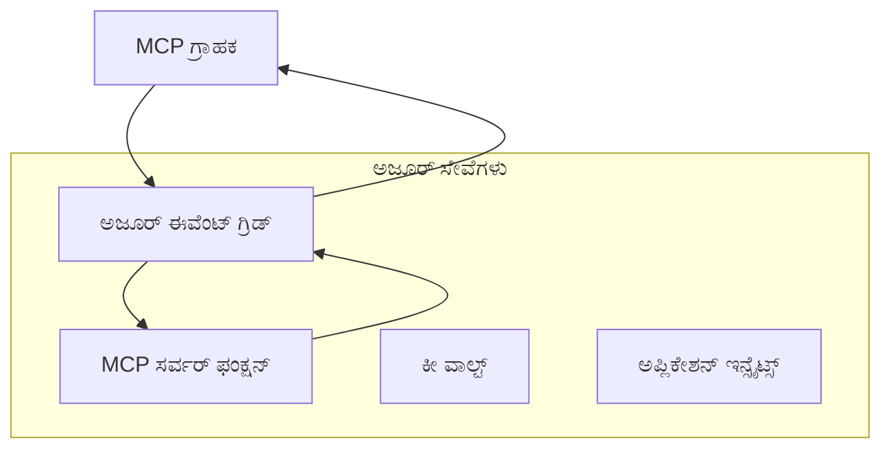
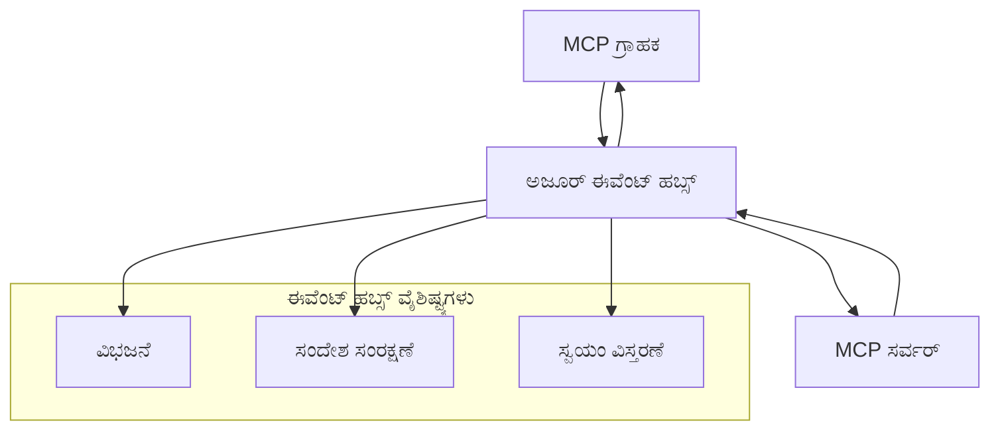

<!--
CO_OP_TRANSLATOR_METADATA:
{
  "original_hash": "c71c60af76120a517809a6cfba47e9a3",
  "translation_date": "2025-12-11T15:01:07+00:00",
  "source_file": "05-AdvancedTopics/mcp-transport/README.md",
  "language_code": "kn"
}
-->
# MCP ಕಸ್ಟಮ್ ಟ್ರಾನ್ಸ್‌ಪೋರ್ಟ್‌ಗಳು - ಉನ್ನತ ಮಟ್ಟದ ಅನುಷ್ಠಾನ ಮಾರ್ಗದರ್ಶಿ

ಮಾದರಿ ಸನ್ನಿವೇಶ ಪ್ರೋಟೋಕಾಲ್ (MCP) ಟ್ರಾನ್ಸ್‌ಪೋರ್ಟ್ ಯಂತ್ರಾಂಗಗಳಲ್ಲಿ ಲವಚಿಕತೆಯನ್ನು ಒದಗಿಸುತ್ತದೆ, ವಿಶೇಷ ಉದ್ಯಮ ಪರಿಸರಗಳಿಗೆ ಕಸ್ಟಮ್ ಅನುಷ್ಠಾನಗಳನ್ನು ಅನುಮತಿಸುತ್ತದೆ. ಈ ಉನ್ನತ ಮಾರ್ಗದರ್ಶಿ, ವಿಸ್ತಾರಗೊಳ್ಳುವ, ಕ್ಲೌಡ್-ನೆಟಿವ್ MCP ಪರಿಹಾರಗಳನ್ನು ನಿರ್ಮಿಸಲು ಪ್ರಾಯೋಗಿಕ ಉದಾಹರಣೆಗಳಾಗಿ Azure Event Grid ಮತ್ತು Azure Event Hubs ಬಳಸಿ ಕಸ್ಟಮ್ ಟ್ರಾನ್ಸ್‌ಪೋರ್ಟ್ ಅನುಷ್ಠಾನಗಳನ್ನು ಅನ್ವೇಷಿಸುತ್ತದೆ.

## ಪರಿಚಯ

MCP ನ ಸ್ಟ್ಯಾಂಡರ್ಡ್ ಟ್ರಾನ್ಸ್‌ಪೋರ್ಟ್‌ಗಳು (stdio ಮತ್ತು HTTP ಸ್ಟ್ರೀಮಿಂಗ್) ಬಹುತೇಕ ಬಳಕೆ ಪ್ರಕರಣಗಳಿಗೆ ಸೇವೆ ನೀಡುತ್ತವೆ, ಆದರೆ ಉದ್ಯಮ ಪರಿಸರಗಳು ಸಾಮಾನ್ಯವಾಗಿ ಸುಧಾರಿತ ವಿಸ್ತಾರಗೊಳ್ಳುವಿಕೆ, ನಂಬಿಕೆ ಮತ್ತು ಇತ್ತೀಚಿನ ಕ್ಲೌಡ್ ಮೂಲಸೌಕರ್ಯಗಳೊಂದಿಗೆ ಏಕೀಕರಣಕ್ಕಾಗಿ ವಿಶೇಷ ಟ್ರಾನ್ಸ್‌ಪೋರ್ಟ್ ಯಂತ್ರಾಂಗಗಳನ್ನು ಅಗತ್ಯವಿರುತ್ತದೆ. ಕಸ್ಟಮ್ ಟ್ರಾನ್ಸ್‌ಪೋರ್ಟ್‌ಗಳು MCP ಗೆ ಅಸಿಂಕ್ರೋನಸ್ ಸಂವಹನ, ಘಟನೆ ಚಾಲಿತ ವಾಸ್ತುಶಿಲ್ಪಗಳು ಮತ್ತು ವಿತರಿತ ಪ್ರಕ್ರಿಯೆಗಾಗಿ ಕ್ಲೌಡ್-ನೆಟಿವ್ ಸಂದೇಶ ಸೇವೆಗಳನ್ನು ಉಪಯೋಗಿಸಲು ಸಾಧ್ಯವಾಗಿಸುತ್ತದೆ.

ಈ ಪಾಠವು ಇತ್ತೀಚಿನ MCP ನಿರ್ದಿಷ್ಟತೆ (2025-06-18), Azure ಸಂದೇಶ ಸೇವೆಗಳು ಮತ್ತು ಸ್ಥಾಪಿತ ಉದ್ಯಮ ಏಕೀಕರಣ ಮಾದರಿಗಳ ಆಧಾರದ ಮೇಲೆ ಉನ್ನತ ಮಟ್ಟದ ಟ್ರಾನ್ಸ್‌ಪೋರ್ಟ್ ಅನುಷ್ಠಾನಗಳನ್ನು ಅನ್ವೇಷಿಸುತ್ತದೆ.

### **MCP ಟ್ರಾನ್ಸ್‌ಪೋರ್ಟ್ ವಾಸ್ತುಶಿಲ್ಪ**

**MCP ನಿರ್ದಿಷ್ಟತೆ (2025-06-18) ನಿಂದ:**

- **ಸ್ಟ್ಯಾಂಡರ್ಡ್ ಟ್ರಾನ್ಸ್‌ಪೋರ್ಟ್‌ಗಳು**: stdio (ಶಿಫಾರಸು ಮಾಡಲಾಗಿದೆ), HTTP ಸ್ಟ್ರೀಮಿಂಗ್ (ದೂರಸ್ಥ ಸಂದರ್ಭಗಳಿಗೆ)
- **ಕಸ್ಟಮ್ ಟ್ರಾನ್ಸ್‌ಪೋರ್ಟ್‌ಗಳು**: MCP ಸಂದೇಶ ವಿನಿಮಯ ಪ್ರೋಟೋಕಾಲ್ ಅನ್ನು ಅನುಷ್ಠಾನಗೊಳಿಸುವ ಯಾವುದೇ ಟ್ರಾನ್ಸ್‌ಪೋರ್ಟ್
- **ಸಂದೇಶ ಸ್ವರೂಪ**: MCP-ನಿರ್ದಿಷ್ಟ ವಿಸ್ತರಣೆಗಳೊಂದಿಗೆ JSON-RPC 2.0
- **ದ್ವಿಮುಖ ಸಂವಹನ**: ಸೂಚನೆಗಳು ಮತ್ತು ಪ್ರತಿಕ್ರಿಯೆಗಳಿಗೆ ಪೂರ್ಣ ಡುಪ್ಲೆಕ್ಸ್ ಸಂವಹನ ಅಗತ್ಯ

## ಕಲಿಕೆಯ ಗುರಿಗಳು

ಈ ಉನ್ನತ ಪಾಠದ ಅಂತ್ಯಕ್ಕೆ, ನೀವು ಸಾಧ್ಯವಾಗುತ್ತದೆ:

- **ಕಸ್ಟಮ್ ಟ್ರಾನ್ಸ್‌ಪೋರ್ಟ್ ಅಗತ್ಯಗಳನ್ನು ಅರ್ಥಮಾಡಿಕೊಳ್ಳಿ**: ಅನುಕೂಲತೆಯನ್ನು ಕಾಪಾಡಿಕೊಂಡು ಯಾವುದೇ ಟ್ರಾನ್ಸ್‌ಪೋರ್ಟ್ ಲೇಯರ್ ಮೇಲೆ MCP ಪ್ರೋಟೋಕಾಲ್ ಅನ್ನು ಅನುಷ್ಠಾನಗೊಳಿಸಿ
- **Azure Event Grid ಟ್ರಾನ್ಸ್‌ಪೋರ್ಟ್ ನಿರ್ಮಿಸಿ**: ಸರ್ವರ್‌ಲೆಸ್ ವಿಸ್ತಾರಗೊಳ್ಳುವಿಕೆಗೆ Azure Event Grid ಬಳಸಿ ಘಟನೆ ಚಾಲಿತ MCP ಸರ್ವರ್‌ಗಳನ್ನು ರಚಿಸಿ
- **Azure Event Hubs ಟ್ರಾನ್ಸ್‌ಪೋರ್ಟ್ ಅನುಷ್ಠಾನಗೊಳಿಸಿ**: ರಿಯಲ್-ಟೈಮ್ ಸ್ಟ್ರೀಮಿಂಗ್‌ಗೆ Azure Event Hubs ಬಳಸಿ ಹೆಚ್ಚಿನ ಪ್ರಮಾಣದ MCP ಪರಿಹಾರಗಳನ್ನು ವಿನ್ಯಾಸಗೊಳಿಸಿ
- **ಉದ್ಯಮ ಮಾದರಿಗಳನ್ನು ಅನ್ವಯಿಸಿ**: ಇತ್ತೀಚಿನ Azure ಮೂಲಸೌಕರ್ಯ ಮತ್ತು ಭದ್ರತಾ ಮಾದರಿಗಳೊಂದಿಗೆ ಕಸ್ಟಮ್ ಟ್ರಾನ್ಸ್‌ಪೋರ್ಟ್‌ಗಳನ್ನು ಏಕೀಕರಿಸಿ
- **ಟ್ರಾನ್ಸ್‌ಪೋರ್ಟ್ ನಂಬಿಕೆಯನ್ನು ನಿರ್ವಹಿಸಿ**: ಉದ್ಯಮ ಸಂದರ್ಭಗಳಿಗೆ ಸಂದೇಶ ಸ್ಥಿರತೆ, ಕ್ರಮ ಮತ್ತು ದೋಷ ನಿರ್ವಹಣೆಯನ್ನು ಅನುಷ್ಠಾನಗೊಳಿಸಿ
- **ಕಾರ್ಯಕ್ಷಮತೆಯನ್ನು ಸುಧಾರಿಸಿ**: ಪ್ರಮಾಣ, ವಿಳಂಬ ಮತ್ತು ಥ್ರೂಪುಟ್ ಅಗತ್ಯಗಳಿಗೆ ಟ್ರಾನ್ಸ್‌ಪೋರ್ಟ್ ಪರಿಹಾರಗಳನ್ನು ವಿನ್ಯಾಸಗೊಳಿಸಿ

## **ಟ್ರಾನ್ಸ್‌ಪೋರ್ಟ್ ಅಗತ್ಯಗಳು**

### **MCP ನಿರ್ದಿಷ್ಟತೆ (2025-06-18) ನಿಂದ ಮೂಲ ಅಗತ್ಯಗಳು:**

```yaml
Message Protocol:
  format: "JSON-RPC 2.0 with MCP extensions"
  bidirectional: "Full duplex communication required"
  ordering: "Message ordering must be preserved per session"
  
Transport Layer:
  reliability: "Transport MUST handle connection failures gracefully"
  security: "Transport MUST support secure communication"
  identification: "Each session MUST have unique identifier"
  
Custom Transport:
  compliance: "MUST implement complete MCP message exchange"
  extensibility: "MAY add transport-specific features"
  interoperability: "MUST maintain protocol compatibility"
```

## **Azure Event Grid ಟ್ರಾನ್ಸ್‌ಪೋರ್ಟ್ ಅನುಷ್ಠಾನ**

Azure Event Grid ಘಟನೆ ಚಾಲಿತ MCP ವಾಸ್ತುಶಿಲ್ಪಗಳಿಗೆ ಸೂಕ್ತವಾದ ಸರ್ವರ್‌ಲೆಸ್ ಘಟನೆ ಮಾರ್ಗದರ್ಶನ ಸೇವೆಯನ್ನು ಒದಗಿಸುತ್ತದೆ. ಈ ಅನುಷ್ಠಾನವು ವಿಸ್ತಾರಗೊಳ್ಳುವ, ಸಡಿಲವಾಗಿ ಜೋಡಿಸಲಾದ MCP ವ್ಯವಸ್ಥೆಗಳನ್ನು ನಿರ್ಮಿಸುವ ವಿಧಾನವನ್ನು ತೋರಿಸುತ್ತದೆ.

### **ವಾಸ್ತುಶಿಲ್ಪ ಅವಲೋಕನ**


### **C# ಅನುಷ್ಠಾನ - Event Grid ಟ್ರಾನ್ಸ್‌ಪೋರ್ಟ್**

```csharp
using Azure.Messaging.EventGrid;
using Microsoft.Extensions.Azure;
using System.Text.Json;

public class EventGridMcpTransport : IMcpTransport
{
    private readonly EventGridPublisherClient _publisher;
    private readonly string _topicEndpoint;
    private readonly string _clientId;
    
    public EventGridMcpTransport(string topicEndpoint, string accessKey, string clientId)
    {
        _publisher = new EventGridPublisherClient(
            new Uri(topicEndpoint), 
            new AzureKeyCredential(accessKey));
        _topicEndpoint = topicEndpoint;
        _clientId = clientId;
    }
    
    public async Task SendMessageAsync(McpMessage message)
    {
        var eventGridEvent = new EventGridEvent(
            subject: $"mcp/{_clientId}",
            eventType: "MCP.MessageReceived",
            dataVersion: "1.0",
            data: JsonSerializer.Serialize(message))
        {
            Id = Guid.NewGuid().ToString(),
            EventTime = DateTimeOffset.UtcNow
        };
        
        await _publisher.SendEventAsync(eventGridEvent);
    }
    
    public async Task<McpMessage> ReceiveMessageAsync(CancellationToken cancellationToken)
    {
        // Event Grid is push-based, so implement webhook receiver
        // This would typically be handled by Azure Functions trigger
        throw new NotImplementedException("Use EventGridTrigger in Azure Functions");
    }
}

// Azure Function for receiving Event Grid events
[FunctionName("McpEventGridReceiver")]
public async Task<IActionResult> HandleEventGridMessage(
    [EventGridTrigger] EventGridEvent eventGridEvent,
    ILogger log)
{
    try
    {
        var mcpMessage = JsonSerializer.Deserialize<McpMessage>(
            eventGridEvent.Data.ToString());
        
        // Process MCP message
        var response = await _mcpServer.ProcessMessageAsync(mcpMessage);
        
        // Send response back via Event Grid
        await _transport.SendMessageAsync(response);
        
        return new OkResult();
    }
    catch (Exception ex)
    {
        log.LogError(ex, "Error processing Event Grid MCP message");
        return new BadRequestResult();
    }
}
```

### **TypeScript ಅನುಷ್ಠಾನ - Event Grid ಟ್ರಾನ್ಸ್‌ಪೋರ್ಟ್**

```typescript
import { EventGridPublisherClient, AzureKeyCredential } from "@azure/eventgrid";
import { McpTransport, McpMessage } from "./mcp-types";

export class EventGridMcpTransport implements McpTransport {
    private publisher: EventGridPublisherClient;
    private clientId: string;
    
    constructor(
        private topicEndpoint: string,
        private accessKey: string,
        clientId: string
    ) {
        this.publisher = new EventGridPublisherClient(
            topicEndpoint,
            new AzureKeyCredential(accessKey)
        );
        this.clientId = clientId;
    }
    
    async sendMessage(message: McpMessage): Promise<void> {
        const event = {
            id: crypto.randomUUID(),
            source: `mcp-client-${this.clientId}`,
            type: "MCP.MessageReceived",
            time: new Date(),
            data: message
        };
        
        await this.publisher.sendEvents([event]);
    }
    
    // ಈವೆಂಟ್ ಚಾಲಿತ ಸ್ವೀಕೃತಿ ಅಜೂರ್ ಫಂಕ್ಷನ್ಸ್ ಮೂಲಕ
    onMessage(handler: (message: McpMessage) => Promise<void>): void {
        // ಅನುಷ್ಠಾನವು ಅಜೂರ್ ಫಂಕ್ಷನ್ಸ್ ಈವೆಂಟ್ ಗ್ರಿಡ್ ಟ್ರಿಗರ್ ಅನ್ನು ಬಳಸುತ್ತದೆ
        // ಇದು ವೆಬ್‌ಹುಕ್ ಸ್ವೀಕರಿಸುವವರಿಗಾಗಿ ಕಲ್ಪನಾತ್ಮಕ ಇಂಟರ್ಫೇಸ್ ಆಗಿದೆ
    }
}

// ಅಜೂರ್ ಫಂಕ್ಷನ್ಸ್ ಅನುಷ್ಠಾನ
import { app, InvocationContext, EventGridEvent } from "@azure/functions";

app.eventGrid("mcpEventGridHandler", {
    handler: async (event: EventGridEvent, context: InvocationContext) => {
        try {
            const mcpMessage = event.data as McpMessage;
            
            // MCP ಸಂದೇಶವನ್ನು ಪ್ರಕ್ರಿಯೆಗೊಳಿಸಿ
            const response = await mcpServer.processMessage(mcpMessage);
            
            // ಈವೆಂಟ್ ಗ್ರಿಡ್ ಮೂಲಕ ಪ್ರತಿಕ್ರಿಯೆಯನ್ನು ಕಳುಹಿಸಿ
            await transport.sendMessage(response);
            
        } catch (error) {
            context.error("Error processing MCP message:", error);
            throw error;
        }
    }
});
```

### **Python ಅನುಷ್ಠಾನ - Event Grid ಟ್ರಾನ್ಸ್‌ಪೋರ್ಟ್**

```python
from azure.eventgrid import EventGridPublisherClient, EventGridEvent
from azure.core.credentials import AzureKeyCredential
import asyncio
import json
from typing import Callable, Optional
import uuid
from datetime import datetime

class EventGridMcpTransport:
    def __init__(self, topic_endpoint: str, access_key: str, client_id: str):
        self.client = EventGridPublisherClient(
            topic_endpoint, 
            AzureKeyCredential(access_key)
        )
        self.client_id = client_id
        self.message_handler: Optional[Callable] = None
    
    async def send_message(self, message: dict) -> None:
        """Send MCP message via Event Grid"""
        event = EventGridEvent(
            data=message,
            subject=f"mcp/{self.client_id}",
            event_type="MCP.MessageReceived",
            data_version="1.0"
        )
        
        await self.client.send(event)
    
    def on_message(self, handler: Callable[[dict], None]) -> None:
        """Register message handler for incoming events"""
        self.message_handler = handler

# ಅಜೂರ್ ಫಂಕ್ಷನ್ಸ್ ಅನುಷ್ಠಾನ
import azure.functions as func
import logging

def main(event: func.EventGridEvent) -> None:
    """Azure Functions Event Grid trigger for MCP messages"""
    try:
        # ಇವೆಂಟ್ ಗ್ರಿಡ್ ಘಟನೆದಿಂದ MCP ಸಂದೇಶವನ್ನು ವಿಶ್ಲೇಷಿಸಿ
        mcp_message = json.loads(event.get_body().decode('utf-8'))
        
        # MCP ಸಂದೇಶವನ್ನು ಪ್ರಕ್ರಿಯೆಗೊಳಿಸಿ
        response = process_mcp_message(mcp_message)
        
        # ಇವೆಂಟ್ ಗ್ರಿಡ್ ಮೂಲಕ ಪ್ರತಿಕ್ರಿಯೆಯನ್ನು ಹಿಂತಿರುಗಿಸಿ
        # (ಅನುಷ್ಠಾನ ಹೊಸ ಇವೆಂಟ್ ಗ್ರಿಡ್ ಕ್ಲೈಂಟ್ ಅನ್ನು ರಚಿಸುವುದು)
        
    except Exception as e:
        logging.error(f"Error processing MCP Event Grid message: {e}")
        raise
```

## **Azure Event Hubs ಟ್ರಾನ್ಸ್‌ಪೋರ್ಟ್ ಅನುಷ್ಠಾನ**

Azure Event Hubs ಕಡಿಮೆ ವಿಳಂಬ ಮತ್ತು ಹೆಚ್ಚಿನ ಸಂದೇಶ ಪ್ರಮಾಣವನ್ನು ಅಗತ್ಯವಿರುವ MCP ಸಂದರ್ಭಗಳಿಗೆ ಹೆಚ್ಚಿನ ಥ್ರೂಪುಟ್, ರಿಯಲ್-ಟೈಮ್ ಸ್ಟ್ರೀಮಿಂಗ್ ಸಾಮರ್ಥ್ಯಗಳನ್ನು ಒದಗಿಸುತ್ತದೆ.

### **ವಾಸ್ತುಶಿಲ್ಪ ಅವಲೋಕನ**


### **C# ಅನುಷ್ಠಾನ - Event Hubs ಟ್ರಾನ್ಸ್‌ಪೋರ್ಟ್**

```csharp
using Azure.Messaging.EventHubs;
using Azure.Messaging.EventHubs.Producer;
using Azure.Messaging.EventHubs.Consumer;
using System.Text;

public class EventHubsMcpTransport : IMcpTransport, IDisposable
{
    private readonly EventHubProducerClient _producer;
    private readonly EventHubConsumerClient _consumer;
    private readonly string _consumerGroup;
    private readonly CancellationTokenSource _cancellationTokenSource;
    
    public EventHubsMcpTransport(
        string connectionString, 
        string eventHubName,
        string consumerGroup = "$Default")
    {
        _producer = new EventHubProducerClient(connectionString, eventHubName);
        _consumer = new EventHubConsumerClient(
            consumerGroup, 
            connectionString, 
            eventHubName);
        _consumerGroup = consumerGroup;
        _cancellationTokenSource = new CancellationTokenSource();
    }
    
    public async Task SendMessageAsync(McpMessage message)
    {
        var messageBody = JsonSerializer.Serialize(message);
        var eventData = new EventData(Encoding.UTF8.GetBytes(messageBody));
        
        // Add MCP-specific properties
        eventData.Properties.Add("MessageType", message.Method ?? "response");
        eventData.Properties.Add("MessageId", message.Id);
        eventData.Properties.Add("Timestamp", DateTimeOffset.UtcNow);
        
        await _producer.SendAsync(new[] { eventData });
    }
    
    public async Task StartReceivingAsync(
        Func<McpMessage, Task> messageHandler)
    {
        await foreach (PartitionEvent partitionEvent in _consumer.ReadEventsAsync(
            _cancellationTokenSource.Token))
        {
            try
            {
                var messageBody = Encoding.UTF8.GetString(
                    partitionEvent.Data.EventBody.ToArray());
                var mcpMessage = JsonSerializer.Deserialize<McpMessage>(messageBody);
                
                await messageHandler(mcpMessage);
            }
            catch (Exception ex)
            {
                // Handle deserialization or processing errors
                Console.WriteLine($"Error processing message: {ex.Message}");
            }
        }
    }
    
    public void Dispose()
    {
        _cancellationTokenSource?.Cancel();
        _producer?.DisposeAsync().AsTask().Wait();
        _consumer?.DisposeAsync().AsTask().Wait();
        _cancellationTokenSource?.Dispose();
    }
}
```

### **TypeScript ಅನುಷ್ಠಾನ - Event Hubs ಟ್ರಾನ್ಸ್‌ಪೋರ್ಟ್**

```typescript
import { 
    EventHubProducerClient, 
    EventHubConsumerClient, 
    EventData 
} from "@azure/event-hubs";

export class EventHubsMcpTransport implements McpTransport {
    private producer: EventHubProducerClient;
    private consumer: EventHubConsumerClient;
    private isReceiving = false;
    
    constructor(
        private connectionString: string,
        private eventHubName: string,
        private consumerGroup: string = "$Default"
    ) {
        this.producer = new EventHubProducerClient(
            connectionString, 
            eventHubName
        );
        this.consumer = new EventHubConsumerClient(
            consumerGroup,
            connectionString,
            eventHubName
        );
    }
    
    async sendMessage(message: McpMessage): Promise<void> {
        const eventData: EventData = {
            body: JSON.stringify(message),
            properties: {
                messageType: message.method || "response",
                messageId: message.id,
                timestamp: new Date().toISOString()
            }
        };
        
        await this.producer.sendBatch([eventData]);
    }
    
    async startReceiving(
        messageHandler: (message: McpMessage) => Promise<void>
    ): Promise<void> {
        if (this.isReceiving) return;
        
        this.isReceiving = true;
        
        const subscription = this.consumer.subscribe({
            processEvents: async (events, context) => {
                for (const event of events) {
                    try {
                        const messageBody = event.body as string;
                        const mcpMessage: McpMessage = JSON.parse(messageBody);
                        
                        await messageHandler(mcpMessage);
                        
                        // ಕನಿಷ್ಠ-ಒಮ್ಮೆ ವಿತರಣೆಗೆ ಚೆಕ್‌ಪಾಯಿಂಟ್ ಅನ್ನು ನವೀಕರಿಸಿ
                        await context.updateCheckpoint(event);
                    } catch (error) {
                        console.error("Error processing Event Hubs message:", error);
                    }
                }
            },
            processError: async (err, context) => {
                console.error("Event Hubs error:", err);
            }
        });
    }
    
    async close(): Promise<void> {
        this.isReceiving = false;
        await this.producer.close();
        await this.consumer.close();
    }
}
```

### **Python ಅನುಷ್ಠಾನ - Event Hubs ಟ್ರಾನ್ಸ್‌ಪೋರ್ಟ್**

```python
from azure.eventhub import EventHubProducerClient, EventHubConsumerClient
from azure.eventhub import EventData
import json
import asyncio
from typing import Callable, Dict, Any
import logging

class EventHubsMcpTransport:
    def __init__(
        self, 
        connection_string: str, 
        eventhub_name: str,
        consumer_group: str = "$Default"
    ):
        self.producer = EventHubProducerClient.from_connection_string(
            connection_string, 
            eventhub_name=eventhub_name
        )
        self.consumer = EventHubConsumerClient.from_connection_string(
            connection_string,
            consumer_group=consumer_group,
            eventhub_name=eventhub_name
        )
        self.is_receiving = False
    
    async def send_message(self, message: Dict[str, Any]) -> None:
        """Send MCP message via Event Hubs"""
        event_data = EventData(json.dumps(message))
        
        # MCP-ನಿರ್ದಿಷ್ಟ ಗುಣಲಕ್ಷಣಗಳನ್ನು ಸೇರಿಸಿ
        event_data.properties = {
            "messageType": message.get("method", "response"),
            "messageId": message.get("id"),
            "timestamp": "2025-01-14T10:30:00Z"  # ನಿಜವಾದ ಟೈಮ್‌ಸ್ಟ್ಯಾಂಪ್ ಬಳಸಿ
        }
        
        async with self.producer:
            event_data_batch = await self.producer.create_batch()
            event_data_batch.add(event_data)
            await self.producer.send_batch(event_data_batch)
    
    async def start_receiving(
        self, 
        message_handler: Callable[[Dict[str, Any]], None]
    ) -> None:
        """Start receiving MCP messages from Event Hubs"""
        if self.is_receiving:
            return
        
        self.is_receiving = True
        
        async with self.consumer:
            await self.consumer.receive(
                on_event=self._on_event_received(message_handler),
                starting_position="-1"  # ಆರಂಭದಿಂದ ಪ್ರಾರಂಭಿಸಿ
            )
    
    def _on_event_received(self, handler: Callable):
        """Internal event handler wrapper"""
        async def handle_event(partition_context, event):
            try:
                # ಇವೆಂಟ್ ಹಬ್ಸ್ ಇವೆಂಟ್‌ನಿಂದ MCP ಸಂದೇಶವನ್ನು ವಿಶ್ಲೇಷಿಸಿ
                message_body = event.body_as_str(encoding='UTF-8')
                mcp_message = json.loads(message_body)
                
                # MCP ಸಂದೇಶವನ್ನು ಪ್ರಕ್ರಿಯೆಗೊಳಿಸಿ
                await handler(mcp_message)
                
                # ಕನಿಷ್ಠ-ಒಮ್ಮೆ ವಿತರಣೆಗೆ ಚೆಕ್‌ಪಾಯಿಂಟ್ ಅನ್ನು ನವೀಕರಿಸಿ
                await partition_context.update_checkpoint(event)
                
            except Exception as e:
                logging.error(f"Error processing Event Hubs message: {e}")
        
        return handle_event
    
    async def close(self) -> None:
        """Clean up transport resources"""
        self.is_receiving = False
        await self.producer.close()
        await self.consumer.close()
```

## **ಉನ್ನತ ಮಟ್ಟದ ಟ್ರಾನ್ಸ್‌ಪೋರ್ಟ್ ಮಾದರಿಗಳು**

### **ಸಂದೇಶ ಸ್ಥಿರತೆ ಮತ್ತು ನಂಬಿಕೆ**

```csharp
// Implementing message durability with retry logic
public class ReliableTransportWrapper : IMcpTransport
{
    private readonly IMcpTransport _innerTransport;
    private readonly RetryPolicy _retryPolicy;
    
    public async Task SendMessageAsync(McpMessage message)
    {
        await _retryPolicy.ExecuteAsync(async () =>
        {
            try
            {
                await _innerTransport.SendMessageAsync(message);
            }
            catch (TransportException ex) when (ex.IsRetryable)
            {
                // Log and retry
                throw;
            }
        });
    }
}
```

### **ಟ್ರಾನ್ಸ್‌ಪೋರ್ಟ್ ಭದ್ರತಾ ಏಕೀಕರಣ**

```csharp
// Integrating Azure Key Vault for transport security
public class SecureTransportFactory
{
    private readonly SecretClient _keyVaultClient;
    
    public async Task<IMcpTransport> CreateEventGridTransportAsync()
    {
        var accessKey = await _keyVaultClient.GetSecretAsync("EventGridAccessKey");
        var topicEndpoint = await _keyVaultClient.GetSecretAsync("EventGridTopic");
        
        return new EventGridMcpTransport(
            topicEndpoint.Value.Value,
            accessKey.Value.Value,
            Environment.MachineName
        );
    }
}
```

### **ಟ್ರಾನ್ಸ್‌ಪೋರ್ಟ್ ಮೇಲ್ವಿಚಾರಣೆ ಮತ್ತು ಗಮನಾರ್ಹತೆ**

```csharp
// Adding telemetry to custom transports
public class ObservableTransport : IMcpTransport
{
    private readonly IMcpTransport _transport;
    private readonly ILogger _logger;
    private readonly TelemetryClient _telemetryClient;
    
    public async Task SendMessageAsync(McpMessage message)
    {
        using var activity = Activity.StartActivity("MCP.Transport.Send");
        activity?.SetTag("transport.type", "EventGrid");
        activity?.SetTag("message.method", message.Method);
        
        var stopwatch = Stopwatch.StartNew();
        
        try
        {
            await _transport.SendMessageAsync(message);
            
            _telemetryClient.TrackDependency(
                "EventGrid",
                "SendMessage",
                DateTime.UtcNow.Subtract(stopwatch.Elapsed),
                stopwatch.Elapsed,
                true
            );
        }
        catch (Exception ex)
        {
            _telemetryClient.TrackException(ex);
            throw;
        }
    }
}
```

## **ಉದ್ಯಮ ಏಕೀಕರಣ ಸಂದರ್ಭಗಳು**

### **ಸಂದರ್ಭ 1: ವಿತರಿತ MCP ಪ್ರಕ್ರಿಯೆ**

ಬಹು ಪ್ರಕ್ರಿಯೆ ನೋಡ್‌ಗಳ ನಡುವೆ MCP ವಿನಂತಿಗಳನ್ನು ವಿತರಿಸಲು Azure Event Grid ಬಳಕೆ:

```yaml
Architecture:
  - MCP Client sends requests to Event Grid topic
  - Multiple Azure Functions subscribe to process different tool types
  - Results aggregated and returned via separate response topic
  
Benefits:
  - Horizontal scaling based on message volume
  - Fault tolerance through redundant processors
  - Cost optimization with serverless compute
```

### **ಸಂದರ್ಭ 2: ರಿಯಲ್-ಟೈಮ್ MCP ಸ್ಟ್ರೀಮಿಂಗ್**

ಹೆಚ್ಚು ಆವರ್ತನೆಯ MCP ಸಂವಹನಗಳಿಗೆ Azure Event Hubs ಬಳಕೆ:

```yaml
Architecture:
  - MCP Client streams continuous requests via Event Hubs
  - Stream Analytics processes and routes messages
  - Multiple consumers handle different aspect of processing
  
Benefits:
  - Low latency for real-time scenarios
  - High throughput for batch processing
  - Built-in partitioning for parallel processing
```

### **ಸಂದರ್ಭ 3: ಸಂಯುಕ್ತ ಟ್ರಾನ್ಸ್‌ಪೋರ್ಟ್ ವಾಸ್ತುಶಿಲ್ಪ**

ವಿಭಿನ್ನ ಬಳಕೆ ಪ್ರಕರಣಗಳಿಗೆ ಬಹು ಟ್ರಾನ್ಸ್‌ಪೋರ್ಟ್‌ಗಳನ್ನು ಸಂಯೋಜಿಸುವುದು:

```csharp
public class HybridMcpTransport : IMcpTransport
{
    private readonly IMcpTransport _realtimeTransport; // Event Hubs
    private readonly IMcpTransport _batchTransport;    // Event Grid
    private readonly IMcpTransport _fallbackTransport; // HTTP Streaming
    
    public async Task SendMessageAsync(McpMessage message)
    {
        // Route based on message characteristics
        var transport = message.Method switch
        {
            "tools/call" when IsRealtime(message) => _realtimeTransport,
            "resources/read" when IsBatch(message) => _batchTransport,
            _ => _fallbackTransport
        };
        
        await transport.SendMessageAsync(message);
    }
}
```

## **ಕಾರ್ಯಕ್ಷಮತೆ ಸುಧಾರಣೆ**

### **Event Grid ಗೆ ಸಂದೇಶ ಬ್ಯಾಚಿಂಗ್**

```csharp
public class BatchingEventGridTransport : IMcpTransport
{
    private readonly List<McpMessage> _messageBuffer = new();
    private readonly Timer _flushTimer;
    private const int MaxBatchSize = 100;
    
    public async Task SendMessageAsync(McpMessage message)
    {
        lock (_messageBuffer)
        {
            _messageBuffer.Add(message);
            
            if (_messageBuffer.Count >= MaxBatchSize)
            {
                _ = Task.Run(FlushMessages);
            }
        }
    }
    
    private async Task FlushMessages()
    {
        List<McpMessage> toSend;
        lock (_messageBuffer)
        {
            toSend = new List<McpMessage>(_messageBuffer);
            _messageBuffer.Clear();
        }
        
        if (toSend.Any())
        {
            var events = toSend.Select(CreateEventGridEvent);
            await _publisher.SendEventsAsync(events);
        }
    }
}
```

### **Event Hubs ಗೆ ವಿಭಾಗೀಕರಣ ತಂತ್ರಜ್ಞಾನ**

```csharp
public class PartitionedEventHubsTransport : IMcpTransport
{
    public async Task SendMessageAsync(McpMessage message)
    {
        // Partition by client ID for session affinity
        var partitionKey = ExtractClientId(message);
        
        var eventData = new EventData(JsonSerializer.SerializeToUtf8Bytes(message))
        {
            PartitionKey = partitionKey
        };
        
        await _producer.SendAsync(new[] { eventData });
    }
}
```

## **ಕಸ್ಟಮ್ ಟ್ರಾನ್ಸ್‌ಪೋರ್ಟ್‌ಗಳ ಪರೀಕ್ಷೆ**

### **ಟೆಸ್ಟ್ ಡಬಲ್ಸ್ ಬಳಸಿ ಘಟಕ ಪರೀಕ್ಷೆ**

```csharp
[Test]
public async Task EventGridTransport_SendMessage_PublishesCorrectEvent()
{
    // Arrange
    var mockPublisher = new Mock<EventGridPublisherClient>();
    var transport = new EventGridMcpTransport(mockPublisher.Object);
    var message = new McpMessage { Method = "tools/list", Id = "test-123" };
    
    // Act
    await transport.SendMessageAsync(message);
    
    // Assert
    mockPublisher.Verify(
        x => x.SendEventAsync(
            It.Is<EventGridEvent>(e => 
                e.EventType == "MCP.MessageReceived" &&
                e.Subject == "mcp/test-client"
            )
        ),
        Times.Once
    );
}
```

### **Azure ಟೆಸ್ಟ್ ಕಂಟೈನರ್‌ಗಳೊಂದಿಗೆ ಏಕೀಕರಣ ಪರೀಕ್ಷೆ**

```csharp
[Test]
public async Task EventHubsTransport_IntegrationTest()
{
    // Using Testcontainers for integration testing
    var eventHubsContainer = new EventHubsContainer()
        .WithEventHub("test-hub");
    
    await eventHubsContainer.StartAsync();
    
    var transport = new EventHubsMcpTransport(
        eventHubsContainer.GetConnectionString(),
        "test-hub"
    );
    
    // Test message round-trip
    var sentMessage = new McpMessage { Method = "test", Id = "123" };
    McpMessage receivedMessage = null;
    
    await transport.StartReceivingAsync(msg => {
        receivedMessage = msg;
        return Task.CompletedTask;
    });
    
    await transport.SendMessageAsync(sentMessage);
    await Task.Delay(1000); // Allow for message processing
    
    Assert.That(receivedMessage?.Id, Is.EqualTo("123"));
}
```

## **ಉತ್ತಮ ಅಭ್ಯಾಸಗಳು ಮತ್ತು ಮಾರ್ಗಸೂಚಿಗಳು**

### **ಟ್ರಾನ್ಸ್‌ಪೋರ್ಟ್ ವಿನ್ಯಾಸ ತತ್ವಗಳು**

1. **ಐಡಂಪೋಟೆನ್ಸಿ**: ನಕಲಿ ಸಂದೇಶಗಳನ್ನು ನಿರ್ವಹಿಸಲು ಸಂದೇಶ ಪ್ರಕ್ರಿಯೆಯನ್ನು ಐಡಂಪೋಟೆಂಟ್ ಆಗಿರಿಸಿ
2. **ದೋಷ ನಿರ್ವಹಣೆ**: ಸಮಗ್ರ ದೋಷ ನಿರ್ವಹಣೆ ಮತ್ತು ಡೆಡ್ ಲೆಟರ್ ಕ್ಯೂಗಳನ್ನು ಅನುಷ್ಠಾನಗೊಳಿಸಿ
3. **ಮೇಲ್ವಿಚಾರಣೆ**: ವಿವರವಾದ ಟೆಲಿಮೆಟ್ರಿ ಮತ್ತು ಆರೋಗ್ಯ ಪರಿಶೀಲನೆಗಳನ್ನು ಸೇರಿಸಿ
4. **ಭದ್ರತೆ**: ನಿರ್ವಹಿತ ಗುರುತುಗಳನ್ನು ಮತ್ತು ಕನಿಷ್ಠ привಿಲೇಜ್ ಪ್ರವೇಶವನ್ನು ಬಳಸಿ
5. **ಕಾರ್ಯಕ್ಷಮತೆ**: ನಿಮ್ಮ ನಿರ್ದಿಷ್ಟ ವಿಳಂಬ ಮತ್ತು ಥ್ರೂಪುಟ್ ಅಗತ್ಯಗಳಿಗೆ ವಿನ್ಯಾಸಗೊಳಿಸಿ

### **Azure-ನಿರ್ದಿಷ್ಟ ಶಿಫಾರಸುಗಳು**

1. **ನಿರ್ವಹಿತ ಗುರುತನ್ನು ಬಳಸಿ**: ಉತ್ಪಾದನೆಯಲ್ಲಿ ಸಂಪರ್ಕ ಸರಣಿಗಳನ್ನು ತಪ್ಪಿಸಿ
2. **ಸರ್ಕ್ಯೂಟ್ ಬ್ರೇಕರ್‌ಗಳನ್ನು ಅನುಷ್ಠಾನಗೊಳಿಸಿ**: Azure ಸೇವಾ ಅವ್ಯವಸ್ಥೆಗಳಿಂದ ರಕ್ಷಿಸಿ
3. **ಖರ್ಚುಗಳನ್ನು ಮೇಲ್ವಿಚಾರಣೆ ಮಾಡಿ**: ಸಂದೇಶ ಪ್ರಮಾಣ ಮತ್ತು ಪ್ರಕ್ರಿಯೆ ಖರ್ಚುಗಳನ್ನು ಟ್ರ್ಯಾಕ್ ಮಾಡಿ
4. **ಪ್ರಮಾಣಕ್ಕೆ ಯೋಜನೆ ಮಾಡಿ**: ವಿಭಾಗೀಕರಣ ಮತ್ತು ವಿಸ್ತಾರಗೊಳ್ಳುವಿಕೆ ತಂತ್ರಗಳನ್ನು ಮೊದಲೇ ವಿನ್ಯಾಸಗೊಳಿಸಿ
5. **ಸಂಪೂರ್ಣವಾಗಿ ಪರೀಕ್ಷಿಸಿ**: ಸಮಗ್ರ ಪರೀಕ್ಷೆಗೆ Azure DevTest Labs ಬಳಸಿ

## **ನಿರ್ಣಯ**

ಕಸ್ಟಮ್ MCP ಟ್ರಾನ್ಸ್‌ಪೋರ್ಟ್‌ಗಳು Azure ಸಂದೇಶ ಸೇವೆಗಳನ್ನು ಬಳಸಿ ಶಕ್ತಿಶಾಲಿ ಉದ್ಯಮ ಸಂದರ್ಭಗಳನ್ನು ಸಾಧ್ಯವಾಗಿಸುತ್ತವೆ. Event Grid ಅಥವಾ Event Hubs ಟ್ರಾನ್ಸ್‌ಪೋರ್ಟ್‌ಗಳನ್ನು ಅನುಷ್ಠಾನಗೊಳಿಸುವ ಮೂಲಕ, ನೀವು ವಿಸ್ತಾರಗೊಳ್ಳುವ, ನಂಬಿಗಸ್ತ MCP ಪರಿಹಾರಗಳನ್ನು ನಿರ್ಮಿಸಬಹುದು, ಇತ್ತೀಚಿನ Azure ಮೂಲಸೌಕರ್ಯಗಳೊಂದಿಗೆ ಸೌಕರ್ಯವಾಗಿ ಏಕೀಕರಿಸುವಂತೆ.

ಕೊಟ್ಟಿರುವ ಉದಾಹರಣೆಗಳು MCP ಪ್ರೋಟೋಕಾಲ್ ಅನುಕೂಲತೆಯನ್ನು ಕಾಪಾಡಿಕೊಂಡು ಮತ್ತು Azure ಉತ್ತಮ ಅಭ್ಯಾಸಗಳನ್ನು ಅನುಸರಿಸಿ ಕಸ್ಟಮ್ ಟ್ರಾನ್ಸ್‌ಪೋರ್ಟ್‌ಗಳನ್ನು ಅನುಷ್ಠಾನಗೊಳಿಸುವ ಉತ್ಪಾದನಾ-ಸಿದ್ಧ ಮಾದರಿಗಳನ್ನು ತೋರಿಸುತ್ತವೆ.

## **ಹೆಚ್ಚಿನ ಸಂಪನ್ಮೂಲಗಳು**

- [MCP ನಿರ್ದಿಷ್ಟತೆ 2025-06-18](https://spec.modelcontextprotocol.io/specification/2025-06-18/)
- [Azure Event Grid ಡಾಕ್ಯುಮೆಂಟೇಶನ್](https://docs.microsoft.com/azure/event-grid/)
- [Azure Event Hubs ಡಾಕ್ಯುಮೆಂಟೇಶನ್](https://docs.microsoft.com/azure/event-hubs/)
- [Azure Functions Event Grid ಟ್ರಿಗರ್](https://docs.microsoft.com/azure/azure-functions/functions-bindings-event-grid)
- [Azure SDK for .NET](https://github.com/Azure/azure-sdk-for-net)
- [Azure SDK for TypeScript](https://github.com/Azure/azure-sdk-for-js)
- [Azure SDK for Python](https://github.com/Azure/azure-sdk-for-python)

---

> *ಈ ಮಾರ್ಗದರ್ಶಿ ಉತ್ಪಾದನಾ MCP ವ್ಯವಸ್ಥೆಗಳಿಗೆ ಪ್ರಾಯೋಗಿಕ ಅನುಷ್ಠಾನ ಮಾದರಿಗಳ ಮೇಲೆ ಕೇಂದ್ರೀಕರಿಸಿದೆ. ನಿಮ್ಮ ನಿರ್ದಿಷ್ಟ ಅಗತ್ಯಗಳು ಮತ್ತು Azure ಸೇವಾ ಮಿತಿಗಳನ್ನು ಎದುರಿಸಿ ಟ್ರಾನ್ಸ್‌ಪೋರ್ಟ್ ಅನುಷ್ಠಾನಗಳನ್ನು ಸದಾ ಪರಿಶೀಲಿಸಿ.*
> **ಪ್ರಸ್ತುತ ಸ್ಟ್ಯಾಂಡರ್ಡ್**: ಈ ಮಾರ್ಗದರ್ಶಿ [MCP ನಿರ್ದಿಷ್ಟತೆ 2025-06-18](https://spec.modelcontextprotocol.io/specification/2025-06-18/) ಟ್ರಾನ್ಸ್‌ಪೋರ್ಟ್ ಅಗತ್ಯಗಳು ಮತ್ತು ಉದ್ಯಮ ಪರಿಸರಗಳಿಗಾಗಿ ಉನ್ನತ ಮಟ್ಟದ ಟ್ರಾನ್ಸ್‌ಪೋರ್ಟ್ ಮಾದರಿಗಳನ್ನು ಪ್ರತಿಬಿಂಬಿಸುತ್ತದೆ.

## ಮುಂದೇನು
- [6. ಸಮುದಾಯ ಕೊಡುಗೆಗಳು](../../06-CommunityContributions/README.md)

---

<!-- CO-OP TRANSLATOR DISCLAIMER START -->
**ಅಸ್ವೀಕಾರ**:  
ಈ ದಸ್ತಾವೇಜು AI ಅನುವಾದ ಸೇವೆ [Co-op Translator](https://github.com/Azure/co-op-translator) ಬಳಸಿ ಅನುವಾದಿಸಲಾಗಿದೆ. ನಾವು ನಿಖರತೆಯಿಗಾಗಿ ಪ್ರಯತ್ನಿಸುತ್ತಿದ್ದರೂ, ಸ್ವಯಂಚಾಲಿತ ಅನುವಾದಗಳಲ್ಲಿ ತಪ್ಪುಗಳು ಅಥವಾ ಅಸತ್ಯತೆಗಳು ಇರಬಹುದು ಎಂದು ದಯವಿಟ್ಟು ಗಮನಿಸಿ. ಮೂಲ ಭಾಷೆಯಲ್ಲಿರುವ ಮೂಲ ದಸ್ತಾವೇಜನ್ನು ಅಧಿಕೃತ ಮೂಲವೆಂದು ಪರಿಗಣಿಸಬೇಕು. ಪ್ರಮುಖ ಮಾಹಿತಿಗಾಗಿ, ವೃತ್ತಿಪರ ಮಾನವ ಅನುವಾದವನ್ನು ಶಿಫಾರಸು ಮಾಡಲಾಗುತ್ತದೆ. ಈ ಅನುವಾದ ಬಳಕೆಯಿಂದ ಉಂಟಾಗುವ ಯಾವುದೇ ತಪ್ಪು ಅರ್ಥಮಾಡಿಕೊಳ್ಳುವಿಕೆ ಅಥವಾ ತಪ್ಪು ವಿವರಣೆಗಳಿಗೆ ನಾವು ಹೊಣೆಗಾರರಾಗುವುದಿಲ್ಲ.
<!-- CO-OP TRANSLATOR DISCLAIMER END -->