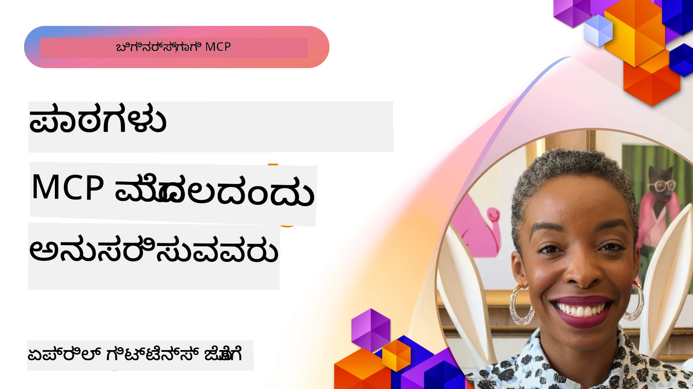

# 🌟 ಆರಂಭಿಕ ಬಗ್ಗೆ ತಿಳಿದವರು ನೀಡಿದ ಪಾಠಗಳು

[](https://youtu.be/jds7dSmNptE)

_(ಈ ಪಾಠದ ವಿಡಿಯೋ ಅನ್ನು ನೋಡಲು ಮೇಲಿನ ಚಿತ್ರ ಕ್ಲಿಕ್ ಮಾಡಿ)_

## 🎯 ಈ ಮಾಡ್ಯೂಲ್ ಒಳಗೊಂಡಿದೆ

ಈ ಮಾಡ್ಯೂಲ್ ನಿಜವಾದ ಸಂಸ್ಥೆಗಳು ಮತ್ತು ಡೆವಲಪర్లు Model Context Protocol (MCP) ಅನ್ನು ಹೇಗೆ ಬಳಸಿ ವಾಸ್ತವಿಕ ಸಮಸ್ಯೆಗಳನ್ನು ಪರಿಹರಿಸುತ್ತಿದ್ದಾರೆ ಮತ್ತು ನವೀನತೆಯನ್ನು ಉತ್ತೇಜಿಸುತ್ತಿದ್ದಾರೆ ಎಂಬುದನ್ನು ನೀವಿಂಕೆರಿಸುತ್ತದೆ. ವಿವರವಾದ ಪ್ರಕರಣ ಅಧ್ಯಯನಗಳು, ಪ್ರಾಯೋಗಿಕ ಯೋಜನೆಗಳು ಮತ್ತು ಉಪಯುಕ್ತ ಉದಾಹರಣೆಗಳ ಮೂಲಕ, MCP ಭದ್ರ, ಮಾಪನೀಯ AI ಸಂಯೋಜನೆಯನ್ನು ಹೇಗೆ ಸಕ್ರಿಯಗೊಳಿಸುತ್ತದೆ ಎಂಬುದನ್ನು ನೀವು ತಿಳಿಯುತ್ತೀರಿ, ಇದು ಭಾಷಾ ಮಾದರಿಗಳು, ಸಾಧನಗಳು ಮತ್ತು ಎಂಟರ್‌ಪ್ರೈಸ್ ಡೇಟಾವನ್ನು ಸಂಪರ್ಕಿಸುತ್ತದೆ.

### 📚 MCP ನ ನಡವಳಿಕೆ ನೋಡಿ

ಈ ಸಿದ್ಧಾಂತರಗಳನ್ನು ಉತ್ಪಾದನೆಗೆ ಸಿದ್ಧ ಸಾಧನಗಳಲ್ಲಿ ಹೇಗೆ ಅನ್ವಯಿಸಲಾಗುತ್ತಿದೆ ಎಂದು ನೋಡಲು ಇಚ್ಛಿಸುವಿರಾ? ನಮ್ಮ [**10 Microsoft MCP Servers That Are Transforming Developer Productivity**](microsoft-mcp-servers.md) ಅನ್ನು ಪರಿಶೀಲಿಸಿ, ಇದರಲ್ಲಿ ನೀವು ಇಂದೆಲ್ಲಾದರೂ ಬಳಸಬಹುದಾದ ನಿಜವಾದ Microsoft MCP ಸರ್ವರ್‌ಗಳು ಪ್ರದರ್ಶಿತರಾಗಿವೆ.

## ಸಂಕ್ಷಿಪ್ತ ಪರಿಚಯ

ಈ ಪಾಠವು ಆರಂಭಿಕ ಉಪಯೋಗದಾರರು Model Context Protocol (MCP) ಅನ್ನು ಹೇಗೆ ಬಳಸಿ ವಾಸ್ತವ ತಂತ್ರಜ್ಞಾನ ಸಮಸ್ಯೆಗಳನ್ನು ಸಮಾಧಾನಗೊಳಿಸಿತ್ತಾರೆಯೋ ಮತ್ತು ಕೈಗಾರಿಕೆಗಳಲ್ಲಿ ನವೀನತೆಯನ್ನು ಹೇಗೆ ಆವಿಷ್ಕರಿಸಿರೋ ಎಂಬುದನ್ನು ವಿವರಿಸುತ್ತದೆ. ವಿವರವಾದ ಪ್ರಕರಣ ಅಧ್ಯಯನಗಳು ಮತ್ತು ಕೈ ಗಳಿಗೆಯ ಯೋಜನೆಗಳ ಮೂಲಕ, ನೀವು MCP ಹೇಗೆ ಮಾನದಂಡಿತ, ಭದ್ರ, ಮತ್ತು ಮಾಪನೀಯ AI ಸಂಯೋಜನೆಕ್ಕೆ ಸುವರ್ಣವಕಾಶ ಕಲ್ಪಿಸುತ್ತದೆ ಎಂಬುದನ್ನು ತಿಳಿಯುತ್ತೀರಿ — ದೊಡ್ಡ ಭಾಷಾ ಮಾದರಿಗಳು, ಸಾಧನಗಳು, ಮತ್ತು ಎಂಟರ್‌ಪ್ರೈಸ್ ಡೇಟಾವನ್ನು ಏಕೀಕೃತ ವ್ಯವಸ್ಥೆಯಲ್ಲಿ ಸಂಪರ್ಕಿಸುತ್ತದೆ. ನೀವು MCP ಆಧಾರಿತ ಪರಿಹಾರಗಳನ್ನು ವಿನ್ಯಾಸಮಾಡಲು ಮತ್ತು ನಿರ್ಮಿಸಲು ಪ್ರಾಯೋಗಿಕ ಅನುಭವ ಪಡೆಯುತ್ತೀರಿ, ಆಂಶಿತ ಅನುಷ್ಠಾನ ಮಾದರಿಗಳಿಂದ ಕಲಿಯುತ್ತೀರಿ ಮತ್ತು MCP ಅನ್ನು ಉತ್ಪಾದನಾ ಪರಿಸರಗಳಲ್ಲಿ ನಿಯೋಜಿಸುವ ಉತ್ತಮ ಅಭ್ಯಾಸಗಳನ್ನು ಕಂಡುಹಿಡಿಯುತ್ತೀರಿ. ಪಾಠವು ಉದಯೋನ್ಮುಖ ಪ್ರವೃತ್ತಿಗಳು, ಭವಿಷ್ಯ ದಿಕ್ಕುಗಳು ಮತ್ತು ಓಪನ್-ಸೋರ್ಸ್ ಸಂಪನ್ಮೂಲಗಳನ್ನೂ ಒದಗಿಸುತ್ತದೆ, ಇದು MCP ತಂತ್ರಜ್ಞಾನ ಮತ್ತು ಅದರ ವಿಕಸಿತ ಪರಿಸರದ ಮುಂಚೂಣಿಯಲ್ಲಿ ನಿಂತಿರಲು ಸಹಾಯ ಮಾಡುತ್ತದೆ.

## ಕಲಿಕಾ ಉದ್ದೇಶಗಳು

- ವಿವಿಧ ಕೈಗಾರಿಕೆಗಳಲ್ಲಿ ನಿಜವಾದ MCP ಅನುಷ್ಠಾನಗಳನ್ನು ವಿಶ್ಲೇಷಣೆಯಾಗಿಸು
- ಸಂಪೂರ್ಣ MCP ಆಧಾರಿತ ಅಪ್ಲಿಕೇಶನ್‌ಗಳನ್ನು ವಿನ್ಯಾಸ ಮಾಡಿ ನಿರ್ಮಿಸು
- MCP ತಂತ್ರಜ್ಞಾನದಲ್ಲಿನ ಉದಯೋನ್ಮುಖ ಪ್ರವೃತ್ತಿಗಳು ಮತ್ತು ಭವಿಷ್ಯ ದಿಕ್ಕುಗಳನ್ನು ಅನ್ವೇಷಿಸಿ
- ನಿಜವಾದ ಅಭಿವೃದ್ಧಿ ಪರಿಸರಗಳಲ್ಲಿ ಉತ್ತಮ ಅಭ್ಯಾಸಗಳನ್ನು ಅನ್ವಯಿಸು

## ನಿಜವಾದ MCP ಅನುಷ್ಠಾನಗಳು

### ಪ್ರಕರಣ ಅಧ್ಯಯನ 1: ಎಂಟರ್‌ಪ್ರೈಸ್ ಗ್ರಾಹಕ ಬೆಂಬಲ ಸ್ವಯಂಕ್ರಿಯ

ಏಕದೇಶೀಯ ಸಂಸ್ಥೆಯು MCP ಆಧಾರಿತ ಪರಿಹಾರವನ್ನು ಅನುಷ್ಠಾನಗೊಳಿಸಿ ತನ್ನ ಗ್ರಾಹಕ ಬೆಂಬಲ ವ್ಯವಸ್ಥೆಗಳ ನಡುವೆ AI ಸಂವಹನಗಳನ್ನು ಮಾನದಂಡಿತಗೊಳಿಸಿತು. ಇದರಿಂದ ಅವರು:

- ಅನೇಕ LLM ಪೂರೈಕೆದಾರರಿಗಾಗಿ ಏಕೀಕೃತ ಇಂಟರ್‌ಫೇಸ್ ಸೃಷ್ಟಿಸಿದರು
- ಇಲಾಖೆಗಳ ನಡುವೆ ಸತತ ಪ್ರಾಂಪ್ಟ್ ನಿರ್ವಹಣೆಯನ್ನು ಕಾಯ್ದುಕೊಂಡರು
- ಬಲವಾದ ಭದ್ರತೆ ಮತ್ತು ಅನುಕೂಲ ನಿಯಂತ್ರಣಗಳನ್ನು ಅನುಷ್ಠಾನಗೊಳಿಸಿದರು
- ನಿರ್ದಿಷ್ಟ ಅಗತ್ಯಗಳ ಆಧಾರದಲ್ಲಿ ವಿಭಿನ್ನ AI ಮಾದರಿಗಳ ನಡುವೆ ಸುಲಭವಾಗಿ ಬದಲಾವಣೆಮಾಡಲು ಸಾಧ್ಯವಾಯಿತು

**ತಾಂತ್ರಿಕ ಅನುಷ್ಠಾನ:**

```python
# ಗ್ರಾಹಕ ಬೆಂಬಲಕ್ಕಾಗಿ ಪೈಥಾನ್ MCP ಸರ್ವರ್ ಜಾರಿಗೊಳಿಸುವಿಕೆ
import logging
import asyncio
from modelcontextprotocol import create_server, ServerConfig
from modelcontextprotocol.server import MCPServer
from modelcontextprotocol.transports import create_http_transport
from modelcontextprotocol.resources import ResourceDefinition
from modelcontextprotocol.prompts import PromptDefinition
from modelcontextprotocol.tool import ToolDefinition

# ಲಾಗಿಂಗ್ ಸನ್ನಿಹಿತ ಮಾಡು
logging.basicConfig(level=logging.INFO)

async def main():
    # ಸರ್ವರ್ ಸ್ಥಾಪನೆ ನಿರ್ಮಿಸು
    config = ServerConfig(
        name="Enterprise Customer Support Server",
        version="1.0.0",
        description="MCP server for handling customer support inquiries"
    )
    
    # MCP ಸರ್ವರ್ ಪ್ರಾರಂಭಿಸು
    server = create_server(config)
    
    # ಜ್ಞಾನ ಆಧಾರ ಸಂಪನ್ಮೂಲಗಳನ್ನು ನೋಂದಣಿ ಮಾಡು
    server.resources.register(
        ResourceDefinition(
            name="customer_kb",
            description="Customer knowledge base documentation"
        ),
        lambda params: get_customer_documentation(params)
    )
    
    # ಪ್ರಾಂಪ್ಟ್ ಟೆಂಪ್ಲೇಟ್‌ಗಳನ್ನು ನೋಂದಣಿ ಮಾಡು
    server.prompts.register(
        PromptDefinition(
            name="support_template",
            description="Templates for customer support responses"
        ),
        lambda params: get_support_templates(params)
    )
    
    # ಬೆಂಬಲ ಸಾಧನಗಳನ್ನು ನೋಂದಣಿ ಮಾಡು
    server.tools.register(
        ToolDefinition(
            name="ticketing",
            description="Create and update support tickets"
        ),
        handle_ticketing_operations
    )
    
    # HTTP ಸಂಚಾರದೊಂದಿಗೆ ಸರ್ವರ್ ಆರಂಭಿಸು
    transport = create_http_transport(port=8080)
    await server.run(transport)

if __name__ == "__main__":
    asyncio.run(main())
```

**ಫಲಿತಾಂಶಗಳು:** ಮಾದರಿ ವೆಚ್ಚಗಳಲ್ಲಿ 30% ಕಡಿತ, ಪ್ರತಿಕ್ರಿಯಾ միասಮತೆಗೆ 45% ಸುಧಾರಣೆ, ಮತ್ತು ಜಾಗತಿಕ ಕಾರ್ಯಾಚರಣೆಗಳಲ್ಲಿ ಸುಧಾರಿತ ಅನುಕೂಲ.

### ಪ್ರಕರಣ ಅಧ್ಯಯನ 2: ಆರೋಗ್ಯ ನಿರ್ಣಯ ಸಹಾಯಕರ

ಒಂದು ಆರೋಗ್ಯ ಸೇವಾ ಪೂರೈಕೆದಾರರು ಬಹು ವೈಶಿಷ್ಟ್ಯಗೊಳಿಸಿದ ವೈದ್ಯಕೀಯ AI ಮಾದರಿಗಳನ್ನು ಒಟ್ಟುಗೂಡಿಸಲು MCP ಮೂಲಸಂಚಿತವನ್ನು ಅಭಿವೃದ್ಧಿಪಡಿಸಿದರು, ಹಾಗಾಗಿ ಸಂವೇದನಶೀಲ ರೋಗಿ ಮಾಹಿತಿ ರಕ್ಷಿಸಲಾಗಿದೆ:

- ಸಾಮಾನ್ಯ ಮತ್ತು ಪರಿಣತ ವೈದ್ಯಕೀಯ ಮಾದರಿಗಳ ನಡುವಿನ ನಿರಂತರ ಬದಲಾವಣೆ
- ಕಟ್ಟುನಿಟ್ಟಾದ ಗೌಪ್ಯತೆ ನಿಯಂತ್ರಣಗಳು ಮತ್ತು ಪರಿಶೀಲನಾ ಟ್ರೇಲ್ಸ್
- ಇಲೆಕ್ಟ್ರಾನಿಕ್ ಹೆಲ್ತ್ ರೆಕಾರ್ಡ್ (EHR) ವ್ಯವಸ್ಥೆಗಳೊಂದಿಗೆ ಸಂಯೋಜನೆ
- ವೈದ್ಯಕೀಯ ಪದಾವಳಿಗೆ ಸತತ ಪ್ರಾಂಪ್ಟ್ ಎಂಜಿನಿಯರಿಂಗ್

**ತಾಂತ್ರಿಕ ಅನುಷ್ಠಾನ:**

```csharp
// C# MCP host application implementation in healthcare application
using Microsoft.Extensions.DependencyInjection;
using ModelContextProtocol.SDK.Client;
using ModelContextProtocol.SDK.Security;
using ModelContextProtocol.SDK.Resources;

public class DiagnosticAssistant
{
    private readonly MCPHostClient _mcpClient;
    private readonly PatientContext _patientContext;
    
    public DiagnosticAssistant(PatientContext patientContext)
    {
        _patientContext = patientContext;
        
        // Configure MCP client with healthcare-specific settings
        var clientOptions = new ClientOptions
        {
            Name = "Healthcare Diagnostic Assistant",
            Version = "1.0.0",
            Security = new SecurityOptions
            {
                Encryption = EncryptionLevel.Medical,
                AuditEnabled = true
            }
        };
        
        _mcpClient = new MCPHostClientBuilder()
            .WithOptions(clientOptions)
            .WithTransport(new HttpTransport("https://healthcare-mcp.example.org"))
            .WithAuthentication(new HIPAACompliantAuthProvider())
            .Build();
    }
    
    public async Task<DiagnosticSuggestion> GetDiagnosticAssistance(
        string symptoms, string patientHistory)
    {
        // Create request with appropriate resources and tool access
        var resourceRequest = new ResourceRequest
        {
            Name = "patient_records",
            Parameters = new Dictionary<string, object>
            {
                ["patientId"] = _patientContext.PatientId,
                ["requestingProvider"] = _patientContext.ProviderId
            }
        };
        
        // Request diagnostic assistance using appropriate prompt
        var response = await _mcpClient.SendPromptRequestAsync(
            promptName: "diagnostic_assistance",
            parameters: new Dictionary<string, object>
            {
                ["symptoms"] = symptoms,
                patientHistory = patientHistory,
                relevantGuidelines = _patientContext.GetRelevantGuidelines()
            });
            
        return DiagnosticSuggestion.FromMCPResponse(response);
    }
}
```

**ಫಲಿತಾಂಶಗಳು:** ವೈದ್ಯರಿಗಾಗಿ ಸುಧಾರಿತ ನಿರ್ಣಯ ಸಲಹೆಗಳು, ಪೂರ್ಣ HIPAA ಅನುಕೂಲತೆ ಸಂರಕ್ಷಣೆ, ಮತ್ತು ವ್ಯವಸ್ಥೆಗಳ ನಡುವೆ ಸಂದರ್ಭ ಬದಲಾವಣೆಯ ಮಹತ್ವಪೂರ್ಣ ಕಡಿತ.

### ಪ್ರಕರಣ ಅಧ್ಯಯನ 3: ಹಣಕಾಸು ಸೇವೆಗಳು ಅಪಾಯ ವಿಶ್ಲೇಷಣೆ

ಒಂದು ಹಣಕಾಸು ಸಂಸ್ಥೆಯು ವಿಭಿನ್ನ ಇಲಾಖೆಗಳ ನಡುವೆ ಅವುಗಳ ಅಪಾಯ ವಿಶ್ಲೇಷಣೆ ಪ್ರಕ್ರಿಯೆಗಳನ್ನು ಮಾನದಂಡಿತಗೊಳಿಸಲು MCP ಅನ್ನು ಅನುಷ್ಠಾನಗೊಳಿಸಿತು:

- ಕ್ರೆಡಿಟ್ ಅಪಾಯ, ವಂಚನೆ ಗುರುತಿಸುವಿಕೆ, ಮತ್ತು ಹೂಡಿಕೆ ಅಪಾಯ ಮಾದರಿಗಳಿಗೆ ಏಕೀಕೃತ ಇಂಟರ್‌ಫೇಸ್ ಸೃಷ್ಟಿ
- ಕಟ್ಟುನಿಟ್ಟಾದ ಪ್ರವೇಶ ನಿಯಂತ್ರಣ ಮತ್ತು ಮಾದರಿ ಆವೃತ್ತಿಮಾಡುವಿಕೆ
- ಎಲ್ಲಾ AI ಶಿಫಾರಸುಗಳ ಪರಿಶೀಲನೀಯತೆ ಖಚಿತಪಡಿಸಿಕೊಂಡವು
- ವಿಭಿನ್ನ ವ್ಯವಸ್ಥೆಗಳಲ್ಲಿನ ಡೇಟಾ ರೂಪರೇಷೆ ಸತತವಾಗಿಡಲ್ಪಟ್ಟಿತು

**ತಾಂತ್ರಿಕ ಅನುಷ್ಠಾನ:**

```java
// ಹಣಕಾಸಿನ ಅಪಾಯ avaliação ಗಾಗಿ ಜಾವಾ MCP ಸರ್ವರ್
import org.mcp.server.*;
import org.mcp.security.*;

public class FinancialRiskMCPServer {
    public static void main(String[] args) {
        // ಹಣಕಾಸಿನ ಅನುಕೂಲತೆಯ ವೈಶಿಷ್ಟ್ಯಗಳೊಂದಿಗೆ MCP ಸರ್ವರ್ ರಚಿಸಿ
        MCPServer server = new MCPServerBuilder()
            .withModelProviders(
                new ModelProvider("risk-assessment-primary", new AzureOpenAIProvider()),
                new ModelProvider("risk-assessment-audit", new LocalLlamaProvider())
            )
            .withPromptTemplateDirectory("./compliance/templates")
            .withAccessControls(new SOCCompliantAccessControl())
            .withDataEncryption(EncryptionStandard.FINANCIAL_GRADE)
            .withVersionControl(true)
            .withAuditLogging(new DatabaseAuditLogger())
            .build();
            
        server.addRequestValidator(new FinancialDataValidator());
        server.addResponseFilter(new PII_RedactionFilter());
        
        server.start(9000);
        
        System.out.println("Financial Risk MCP Server running on port 9000");
    }
}
```

**ಫಲಿತಾಂಶಗಳು:** ನಿಯಮಮಾಲಿಕೆ ಅನುಕೂಲತೆ ಸುಧಾರಣೆ, 40% ವೇಗವಾದ ಮಾದರಿ ನಿಯೋಜನೆ ಚಕ್ರಗಳು, ಮತ್ತು ಇಲಾಖೆಗಳ ನಡುವೆ ಸುಧಾರಿತ ಅಪಾಯ ಮೌಲ್ಯಮಾಪನ ಸತತತೆ.

### ಪ್ರಕರಣ ಅಧ್ಯಯನ 4: Microsoft Playwright MCP ಸರ್ವರ್ ಬ್ರೌಸರ್ ಸ್ವಯಂಕ್ರಿಯೆಗಾಗಿ

Microsoft [Playwright MCP ಸರ್ವರ್](https://github.com/microsoft/playwright-mcp) ಅನ್ನು Model Context Protocol ಮೂಲಕ ಸುರಕ್ಷಿತ, ಮಾನದಂಡಿತ ಬ್ರೌಸರ್ ಸ್ವಯಂಕ್ರಿಯೆಯನ್ನು ಸಕ್ರಿಯಗೊಳಿಸಲು ಅಭಿವೃದ್ಧಿಪಡಿಸಿದೆ. ಈ ಉತ್ಪಾದನೆಗೆ ಸಿದ್ಧ ಸರ್ವರ್ AI ಏಜೆಂಟ್ಗಳು ಮತ್ತು LLM ಗಳಿಗೆ ವೆಬ್ ಬ್ರೌಸರ್‌ಗಳೊಂದಿಗೆ ನಿಯಂತ್ರಿತ, ಪರಿಶೀಲನೀಯ ಮತ್ತು ವಿಸ್ತರಿಸಬಹುದಾದ ರೀತಿಯಲ್ಲಿ ಸಂವಹನ ಮಾಡಲು ಅವಕಾಶ ನೀಡುತ್ತದೆ — ಸ್ವಯಂಚಾಲಿತ ವೆಬ್ ಪರೀಕ್ಷೆ, ಡೇಟಾ ಹೊರತಾಗಿಸುವಿಕೆ ಮತ್ತು ಕೊನೆ-ರಿಂದ-ಕೊನೆ ಕಾರ್ಯ ವಹಿವಾಟುಗಳಿಗೆ ಇದು ಅನುಕೂಲವಾಗುತ್ತದೆ.

> **🎯 ಉತ್ಪಾದನಾ ಸಿದ್ಧ ಸಾಧನ**
> 
> ಈ ಪ್ರಕರಣ ಅಧ್ಯಯನವು ನಿಮಗೆ ಇಂದೇ ಬಳಸಬಹುದಾದ ನಿಜವಾದ MCP ಸರ್ವರ್ ಅನ್ನು ಪ್ರದರ್ಶಿಸುತ್ತದೆ! Playwright MCP ಸರ್ವರ್ ಮತ್ತು ಇತರ 9 ಉತ್ಪಾದನಾ ಸಿದ್ಧ Microsoft MCP ಸರ್ವರ್ಗಳ ಬಗ್ಗೆ ತಿಳಿದುಕೊಳ್ಳಲು ನಮ್ಮ [**Microsoft MCP Servers Guide**](microsoft-mcp-servers.md#8--playwright-mcp-server) ಅನ್ನು ನೋಡಿರಿ.

**ಪ್ರಮುಖ ವೈಶಿಷ್ಟ್ಯಗಳು:**
- ಬ್ರೌಸರ್ ಸ್ವಯಂಕ್ರಿಯೆ ಸಾಮರ್ಥ್ಯಗಳನ್ನು (ನಾವುರೇಶನ್, ಫಾರ್ಮ್ ತುಂಬಿಕೆ, ಸ್ಕ್ರೀನ್‌ಶಾಟ್ ಸೆರೆಹಿಡಿಯುವಿಕೆ, ಇತ್ಯಾದಿ) MCP ಸಾಧನಗಳಾಗಿ ಉದ್ಘಾಟಿಸುತ್ತದೆ
- ಅಸ್ವೀಕೃತ ಕ್ರಿಯೆಗಳನ್ನು ತಡೆಯಲು ಕಟ್ಟುನಿಟ್ಟಾದ ಪ್ರವೇಶ ನಿಯಂತ್ರಣ ಮತ್ತು ಸ್ಯಾಂಡ್‌ಬಾಕ್ಸಿಂಗ್ ಅನುಷ್ಠಾನಗೊಳಿಸಿದೆ
- ಎಲ್ಲಾ ಬ್ರೌಸರ್ ಸಂವಹನಗಳಿಗಾಗಿ ವಿವರವಾದ ಪರಿಶೀಲನಾ ಲಾಗ್‌ಗಳು ಒದಗಿಸುತ್ತದೆ
- ಏಜೆಂಟ್ ಚಾಲಿತ ಸ್ವಯಂಕ್ರಿಯೆಗೆ Azure OpenAI ಮತ್ತು ಇತರೆ LLM ಪೂರೈಕೆದಾರರೊಂದಿಗೆ ಸಂಯೋಜನೆಯನ್ನು ಬೆಂಬಲಿಸುತ್ತದೆ
- GitHub Copilot ನ ಕೋಡಿಂಗ್ ಏಜೆಂಟ್ ನ್ನು ಬ್ರೌಸರ್ ಸಾಮರ್ಥ್ಯಗಳೊಂದಿಗೆ ಚಲಿಸುತ್ತದೆ

**ತಾಂತ್ರಿಕ ಅನುಷ್ಠಾನ:**

```typescript
// ಟೈಪ್‌ಸ್ಕ್ರಿಪ್ಟ್: MCP ಸರ್ವರ್‌ನಲ್ಲಿ ಪ್ಲೇಜ್‌ರೈಟ್ ಬ್ರೌಸರ್ ಆಟೋಮೇಶನ್ ಸಾಧನಗಳನ್ನು ನೋಂದಾಯಿಸಲಾಗುತ್ತಿದೆ
import { createServer, ToolDefinition } from 'modelcontextprotocol';
import { launch } from 'playwright';

const server = createServer({
  name: 'Playwright MCP Server',
  version: '1.0.0',
  description: 'MCP server for browser automation using Playwright'
});

// URL ಗೆ ನವಿಗೇಟ್ ಮಾಡಲು ಮತ್ತು ಸ್ಕ್ರೀನ್‌ಶಾಟ್ ಅನ್ನು ಕೊಳ್ಳಿಸಲು ಸಾಧನವನ್ನು ನೋಂದಾಯಿಸಿ
server.tools.register(
  new ToolDefinition({
    name: 'navigate_and_screenshot',
    description: 'Navigate to a URL and capture a screenshot',
    parameters: {
      url: { type: 'string', description: 'The URL to visit' }
    }
  }),
  async ({ url }) => {
    const browser = await launch();
    const page = await browser.newPage();
    await page.goto(url);
    const screenshot = await page.screenshot();
    await browser.close();
    return { screenshot };
  }
);

// MCP ಸರ್ವರ್ ಪ್ರಾರಂಭಿಸಿ
server.listen(8080);
```

**ಫಲಿತಾಂಶಗಳು:**

- AI ಏಜೆಂಟ್ ಗಳು ಮತ್ತು LLM ಗಳಿಗಾಗಿ ಸುರಕ್ಷಿತ, ಪ್ರೋಗ್ರಾಮ್ಯಾಟಿಕ್ ಬ್ರೌಸರ್ ಸ್ವಯಂಕ್ರಿಯೆಯನ್ನು ಸಕ್ರಿಯಗೊಳಿಸಿದೆ
- ಕೈಯಿಂದ ಪರೀಕ್ಷಾ ಪ್ರಯತ್ನ ಕಡಿಮೆ ಮಾಡಿ ವೆಬ್ ಅಪ್ಲಿಕೇಶನ್‌ಗಳ ಟೆಸ್ಟ್ ವ್ಯಾಪ್ತಿಯನ್ನು ಹೆಚ್ಚಿಸಿದೆ
- ಎಂಟರ್‌ಪ್ರೈಸ್ ಪರಿಸರಗಳಲ್ಲಿ ಬ್ರೌಸರ್ ಆಧಾರಿತ ಸಾಧನ ಸಂಯೋಜನೆಗೆ ಪುನಃಬಳಕೆ ಮಾಡಲು ಸಾಧ್ಯವಿರುವ ವಿಸ್ತರಿಸಬಹುದಾದ ಸ್ಥಾಪನೆಯ ರಚನೆ ಒದಗಿಸಿದೆ
- GitHub Copilot ನ ವೆಬ್ ಬ್ರೌಸಿಂಗ್ ಸಾಮರ್ಥ್ಯಗಳಿಗೆ ಶಕ್ತಿ ನೀಡುತ್ತದೆ

**ನುಡಿ:**

- [Playwright MCP Server GitHub Repository](https://github.com/microsoft/playwright-mcp)
- [Microsoft AI and Automation Solutions](https://azure.microsoft.com/en-us/products/ai-services/)

### ಪ್ರಕರಣ ಅಧ್ಯಯನ 5: Azure MCP – ಎಂಟರ್‌ಪ್ರೈಸ್-ಗ್ರೇಡ್ Model Context Protocol ಸೇವೆಯಾಗಿ

Azure MCP Server ([https://aka.ms/azmcp](https://aka.ms/azmcp)) Microsoft ನ ಆಳವಿರುವ, ಎಂಟರ್‌ಪ್ರೈಸ್-ಗ್ರೇಡ್ Model Context Protocol ನ ನಿರ್ವಹಿತ ಅನುಷ್ಠಾನವಾಗಿದ್ದು, ಮಾಪನೀಯ, ಭದ್ರ ಮತ್ತು ಅನುಕೂಲ MCP ಸರ್ವರ್ ಸಾಮರ್ಥ್ಯಗಳನ್ನು ಕ್ಲೌಡ್ ಸೇವೆಯಾಗಿ ಒದಗಿಸಲು ವಿನ್ಯಾಸಗೊಳಿಸಲಾಗಿದೆ. Azure MCP ಸಂಸ್ಥೆಗಳಿಗೆ ಬೇಗನೆ MCP ಸರ್ವರ್ಗಳನ್ನು ನಿಯೋಜಿಸಿ, ನಿರ್ವಹಿಸಿ ಮತ್ತು Azure AI, ಡೇಟಾ ಮತ್ತು ಭದ್ರತೆ ಸೇವೆಗಳೊಡನೆ ಸಂಯೋಜಿಸಲು, ಕಾರ್ಯಾಚರಣಾ ಮುಷ್ಕರ ಕಡಿಮೆಮಾಡಿ AI ಸ್ವೀಕಾರವನ್ನು ವೇಗೀಕರಿಸುತ್ತದೆ.

> **🎯 ಉತ್ಪಾದನಾ ಸಿದ್ಧ ಸಾಧನ**
> 
> ಇದು ನೀವು ಇಂದೇ ಬಳಸಬಹುದಾದ ನಿಜವಾದ MCP ಸರ್ವರ್! Azure AI Foundry MCP Server ಬಗ್ಗೆ ನಮ್ಮ [**Microsoft MCP Servers Guide**](microsoft-mcp-servers.md) ನಲ್ಲಿ ಹೆಚ್ಚಿನ ಮಾಹಿತಿಯನ್ನು ತಿಳಿದುಕೊಳ್ಳಿ.

- ಸ್ಥಾಪಿತ MCP ಸರ್ವರ್ ಹೋಸ್ಟಿಂಗ್ ಪೂರ್ಣ ನಿರ್ವಹಣೆ, ಸ್ವಯಂವಿಸ್ತರಣೆ, ಮೇಲ್ವಿಚಾರಣೆ ಮತ್ತು ಭದ್ರತೆಯೊಂದಿಗೆ
- Azure OpenAI, Azure AI Search ಮತ್ತು ಇತರೆ Azure ಸೇವೆಗಳೊಡನೆ ಸ್ಥಳೀಯ ಸಂಯೋಜನೆ
- Microsoft Entra ID ಮೂಲಕ ಎಂಟರ್‌ಪ್ರೈಸ್ ಪ್ರಾಮಾಣೀಕರಣ ಮತ್ತು ಪ್ರಾಧಿಕಾರ
- ಕಸ್ಟಮ್ ಸಾಧನಗಳು, ಪ್ರಾಂಪ್ಟ್ ಟೆಂಪ್ಲೇಟುಗಳು, ಮತ್ತು ಸಂಪನ್ಮೂಲ ಸಂಪರ್ಕಕಗಳಿಗೆ ಬೆಂಬಲ
- ಎಂಟರ್‌ಪ್ರೈಸ್ ಭದ್ರತೆ ಮತ್ತು ನಿಯಮಾನುಕೂಲ ಪ್ರತ್ಯಯದ ಜೊತೆಗೆ ಅನುಕೂಲತೆ

**ತಾಂತ್ರಿಕ ಅನುಷ್ಠಾನ:**

```yaml
# Example: Azure MCP server deployment configuration (YAML)
apiVersion: mcp.microsoft.com/v1
kind: McpServer
metadata:
  name: enterprise-mcp-server
spec:
  modelProviders:
    - name: azure-openai
      type: AzureOpenAI
      endpoint: https://<your-openai-resource>.openai.azure.com/
      apiKeySecret: <your-azure-keyvault-secret>
  tools:
    - name: document_search
      type: AzureAISearch
      endpoint: https://<your-search-resource>.search.windows.net/
      apiKeySecret: <your-azure-keyvault-secret>
  authentication:
    type: EntraID
    tenantId: <your-tenant-id>
  monitoring:
    enabled: true
    logAnalyticsWorkspace: <your-log-analytics-id>
```

**ಫಲಿತಾಂಶಗಳು:**  
- ತಯಾರಿಗಾಗಿ ಉಪಯೋಗಿಸುವ, ಅನುಕೂಲ MCP ಸರ್ವರ್ ವೇದಿಕೆಯೊಂದಿಗೆ ಎಂಟರ್‌ಪ್ರೈಸ್ AI ಯೋಜನೆಗಳ ಕಾಲಮಾನ-ಮೌಲ್ಯ ಕಡಿತ
- LLM ಗಳು, ಸಾಧನಗಳು ಮತ್ತು ಎಂಟರ್‌ಪ್ರೈಸ್ ಡೇಟಾ ಮೂಲಗಳ ಸರಳ ಸಂಯೋಜನೆ
- MCP ಕಾರ್ಯಭಾರಗಳಿಗೆ ಉತ್ತಮ ಭದ್ರತೆ, ದರ್ಶನಶೀಲತೆ ಮತ್ತು ಕಾರ್ಯಚಟುವಟಿಕೆ ಪರಿಣಾಮಕಾರಿತ್ವ
- Azure SDK ಉತ್ತಮ ಅಭ್ಯಾಸಗಳು ಮತ್ತು ಪ್ರಚಲಿತ ಪ್ರಾಮಾಣೀಕರಣ ಮಾದರಿಗಳೊಂದಿಗೆ ದಾಖಲಾ ಗುಣಮಟ್ಟ ಸುಧಾರಣೆ

**ಸುತ್ರಗಳು:**  
- [Azure MCP Documentation](https://aka.ms/azmcp)
- [Azure MCP Server GitHub Repository](https://github.com/Azure/azure-mcp)
- [Azure AI Services](https://azure.microsoft.com/en-us/products/ai-services/)
- [Microsoft MCP Center](https://mcp.azure.com)

## ಪ್ರಕರಣ ಅಧ್ಯಯನ 6: NLWeb  
MCP (Model Context Protocol) ಚಾಟ್‌ಬಾಟ್‌ಗಳು ಮತ್ತು AI ಸಹಾಯಕರಿಗೆ ಸಾಧನಗಳೊಡನೆ ಸಂವಹನ ಮಾಡಲು ಉದಯೋನ್ಮುಖ ಪ್ರೋಟೋಕಾಲ್ ಆಗಿದೆ. ಪ್ರತಿ NLWeb ಉದಾಹರಣೆಯೂ ಕೂಡ MCP ಸರ್ವರ್ ಆಗಿದ್ದು, ಒಬ್ಬ ಕೇಂದ್ರಿತ ವಿಧಾನ ask ಅನ್ನು ಬೆಂಬಲಿಸುತ್ತದೆ, ಇದು ವೆಬ್‌ಸೈಟ್‌ಗೆ ನೈಸರ್ಗಿಕ ಭಾಷೆಯಲ್ಲಿ ಪ್ರಶ್ನೆ ಕೇಳಲು ಬಳಸಲಾಗುತ್ತದೆ. ಪ್ರತಿಕ್ರಿಯೆಯು schema.orgಯನ್ನು ಬಳಸುತ್ತದೆ, ಇದು ವೆಬ್ ಡೇಟಾವನ್ನು ವರ್ಣಿಸಲು ವ್ಯಾಪಕವಾಗಿ ಉಪಯೋಗಿಸಲಾಗುವ ಶಬ್ದಕೋಶವಾಗಿದೆ. ಸರ್ವಸ್ವವಾಗಿ ಹೇಳುವುದು ಎಂದರೆ, MCP ಸೂತ್ರ NLWeb ಗೆ Http ಹಾಗೆ ಮತ್ತು HTML ಗೆ ಸಮಾನ. NLWeb ಪ್ರೋಟೋಕಾಲುಗಳು, Schema.org ಸ್ವರೂಪಗಳು ಮತ್ತು ಮಾದರಿ ಕೋಡ್ ಬಳಸಿ ನಿಜವಾಗಿಯೂ ವೇಗವಾಗಿ ಇಂತಹ ಎಂಡಿಪಾಯಿಂಟ್‌ಗಳನ್ನು ಸೈಟ್‌ಗಳು ರಚಿಸಲು ಸಹಾಯಮಾಡುತ್ತದೆ, ಇದರಿಂದ ಮಾನವರಿಗೋ ಮತ್ತು ಯಂತ್ರಗಳಿಗೆ ಸಹ ನೈಸರ್ಗಿಕ ಏಜೆಂಟ್-ದಿಂದ-ಏಜೆಂಟ್ ಸಂವಹನವನ್ನು ಸೌಲಭ್ಯಗೊಳಿಸುತ್ತದೆ.

NLWeb ಗೆ ಎರಡು ವಿಭಿನ್ನ ಅಂಶಗಳಿವೆ.  
- ಒಂದು ಪ್ರೋಟೋಕಾಲ್, ಸ್ವಲ್ಪ ಸರಳವಾದದ್ದು, ಸೈಟ್‌ನ್ನು ನೈಸರ್ಗಿಕ ಭಾಷೆಯಲ್ಲಿ ಸಂಪರ್ಕಿಸಲು, ಮತ್ತು ಪ್ರತಿಕ್ರಿಯೆಗೆ json ಮತ್ತು schema.org ಕ್ಕೆ ಒಪ್ಪುಗೊಳ್ಳುವ ಸ್ವರೂಪವನ್ನು ಬಳಸುವುದು. REST API ಡಾಕ್ಯುಮೆಂಟೇಷನ್ ನಲ್ಲಿ ಹೆಚ್ಚಿನ ವಿವರಗಳನ್ನು ನೋಡಿ.  
- (1) ರ ಸರಳ ಅನುಷ್ಠಾನವು ಇತ್ತೀಚಿನ ಮಾರ್ಕಪ್ ನ್ನು ಉಪಯೋಗಿಸುತ್ತದೆ, ಅದು ಸರಣಿಯಲ್ಲಿರುವ ಐಟಂಗಳ (ಉತ್ಪನ್ನಗಳು, ಬಡುಗೆಗಳಿರುವ ವಿಧಿಗಳು, ಆಕರ್ಷಣೆಗಳು, ವಿಮರ್ಶೆಗಳು ಇತ್ಯಾದಿ) ರೂಪದಲ್ಲಿ ಸೈಟ್‌ಗಳಿಗೊಂದು ಪ್ರಾತಿನಿಧ್ಯ ನೀಡುತ್ತದೆ. ಬಳಕೆದಾರ ಇಂಟರ್ಫೇಸ್ ವಿಗೆಟ್ ಗಳ ಜೊತೆಗೆ ಇದನ್ನು ಸೈಟ್‌ಗಳು ತಮ್ಮ ವಿಷಯಕ್ಕೆ ಸಂವಹನಾತ್ಮಕ ಇಂಟರ್ಫೇಸ್ಗಳನ್ನು ಸುಲಭವಾಗಿ ಒದಗಿಸಲು ಬಳಸಬಹುದು. Life of a chat query ಡಾಕ್ಯುಮೆಂಟೇಷನ್ ನಲ್ಲಿ ಈ ಪ್ರಕ್ರಿಯೆಯ ಕುರಿತು ಹೆಚ್ಚಿನ ವಿವರಗಳಿವೆ.  
 
**ಊರೋಪಗಳು:**  
- [Azure MCP Documentation](https://aka.ms/azmcp)  
- [NLWeb](https://github.com/microsoft/NlWeb)

### ಪ್ರಕರಣ ಅಧ್ಯಯನ 7: Azure AI Foundry MCP ಸರ್ವರ್ – ಎಂಟರ್‌ಪ್ರೈಸ್ AI ಏಜೆಂಟ್ ಸಂಯೋಜನೆ

Azure AI Foundry MCP ಸರ್ವರ್ ಗಳು MCP ಅನ್ನು ಎಂಟರ್‌ಪ್ರೈಸ್ ವಾತಾವರಣದಲ್ಲಿ AI ಏಜೆಂಟ್ ಗಳು ಮತ್ತು ಕಾರ್ಯವಾಹಕಗಳನ್ನು ನಡೆಸಲು ಮತ್ತು ನಿರ್ವಹಿಸಲು ಹೇಗೆ ಬಳಸಬಹುದೋ ತೋರಿಸುತ್ತವೆ. MCP ಮತ್ತು Azure AI Foundry ಅನ್ನು ಸಂಯೋಜಿಸುವ ಮೂಲಕ, ಸಂಸ್ಥೆಗಳು ಏಜೆಂಟ್ ಸಂವಹನಗಳನ್ನು ಮಾನದಂಡಿತಗೊಳಿಸಬಹುದು, Foundry ನ ಕಾರ್ಯಪ್ರವಾಹ ನಿರ್ವಹಣೆಯನ್ನು ಉಪಯೋಗಿಸಬಹುದು, ಮತ್ತು ಸುರಕ್ಷಿತ, ಮಾಪನೀಯ ನಿಯೋಜನೆಗಳನ್ನು ಖಚಿತಪಡಿಸಬಹುದು.

> **🎯 ಉತ್ಪಾದನಾ ಸಿದ್ಧ ಸಾಧನ**
> 
> ಇದು ನೀವು ಇಂದೇ ಬಳಸಬಹುದಾದ ನಿಜವಾದ MCP ಸರ್ವರ್! Azure AI Foundry MCP Server ಬಗ್ಗೆ ನಮ್ಮ [**Microsoft MCP Servers Guide**](microsoft-mcp-servers.md#9--azure-ai-foundry-mcp-server) ನಲ್ಲಿ ಹೆಚ್ಚಿನ ಮಾಹಿತಿಯನ್ನು ತಿಳಿದುಕೊಳ್ಳಿ.

**ಪ್ರಮುಖ ವೈಶಿಷ್ಟ್ಯಗಳು:**
- ಮಾದರಿ ಕ್ಯಾಟಲಾಗ್‌ಗಳು ಮತ್ತು ನಿಯೋಜನೆ ನಿರ್ವಹಣೆಯ ಸಹಿತ Azure AI ಪರಿಸರದ ಸಂಪೂರ್ಣ ಪ್ರವೇಶ
- RAG ಅಪ್ಲಿಕೇಶನ್ ಗಳಿಗಾಗಿ Azure AI Search ಮೂಲಕ ಜ್ಞಾನ ಸೂಚ್ಯಂಕೀಕರಣ
- AI ಮಾದರಿ ಕಾರ್ಯಕ್ಷಮತೆ ಮತ್ತು ಗುಣಮಟ್ಟ ಭರವಸೆಗಾಗಿ ಮೌಲ್ಯಮಾಪನ ಸಾಧನಗಳು
- ಕಟಿಂಗ್-ಎಜ್ ಸಂಶೋಧನಾ ಮಾದರಿಗಳಿಗಾಗಿ Azure AI Foundry ಕ್ಯಾಟಲಾಗ್ ಮತ್ತು ಲ್ಯಾಬ್ಗಳೊಡನೆ ಸಂಯೋಜನೆ
- ಉತ್ಪಾದನಾ ಪರಿಸರಗಳಿಗೆ ಏಜೆಂಟ್ ನಿರ್ವಹಣೆ ಮತ್ತು ಮೌಲ್ಯಮಾಪನ ಸಾಮರ್ಥ್ಯಗಳು

**ಫಲಿತಾಂಶಗಳು:**
- AI ಏಜೆಂಟ್ ಕಾರ್ಯವಾಹಕಗಳ ವೇಗದ ಪ್ರೋಟೋಟೈಪಿಂಗ್ ಮತ್ತು ಬಲವಾದ ಮೇಲ್ವಿಚಾರಣೆ
- ಪ್ರगतಿವಂತ ಪರಿಸರಗಳಿಗೆ Azure AI ಸೇವೆಗಳೊಂದಿಗೆ ನಿರಂತರ ಸಂಯೋಜನೆ
- ಏಜೆಂಟ್ ಪೈಪ್ಲೈನ್ ಲಭ್ಯತೆ ನಿರ್ಮಿಸುವ, ನಿಯೋಜಿಸುವ ಮತ್ತು ಮೇಲ್ವಿಚಾರಣೆಗಾಗಿ ಏಕೀಕೃತ ಇಂಟರ್‌ಫೇಸ್
- ಸಂಸ್ಥೆಗಳಿಗಾಗಿ ಭದ್ರತೆ, ಅನುಕೂಲತೆ ಮತ್ತು ಕಾರ್ಯಚಟುವಟಿಕೆ ಪರಿಣಾಮಕಾರಿತ್ವ ಸುಧಾರಣೆ
- ಸಂಕೀರ್ಣ ಏಜೆಂಟ್ ಚಾಲಿತ ಪ್ರಕ್ರಿಯೆಗಳ ಮೇಲೆ ನಿಯಂತ್ರಣವನ್ನು ಕಾಯ್ದುಕೊಂಡು AI ಸ್ವೀಕಾರವೇಗೀಕರಣ

**ಸುತ್ರಗಳು:**
- [Azure AI Foundry MCP Server GitHub Repository](https://github.com/azure-ai-foundry/mcp-foundry)
- [Integrating Azure AI Agents with MCP (Microsoft Foundry Blog)](https://devblogs.microsoft.com/foundry/integrating-azure-ai-agents-mcp/)

### ಪ್ರಕರಣ ಅಧ್ಯಯನ 8: Foundry MCP Playground – ಪ್ರಯೋಗ ಮತ್ತು ಪ್ರೋಟೋಟೈಪಿಂಗ್

Foundry MCP Playground MCP ಸರ್ವರ್‌ಗಳು ಮತ್ತು Azure AI Foundry ಸಂಯೋಜನೆಗಳೊಂದಿಗೆ ಪ್ರಯೋಗ ಮಾಡಲು ಸಿದ್ಧವಾದ ವಾತಾವರಣವನ್ನು ಒದಗಿಸುತ್ತದೆ. ಡೆವಲಪರ್‌ಗಳು Azure AI Foundry ಕ್ಯಾಟಲಾಗ್ ಮತ್ತು ಲ್ಯಾಬ್‌ಗಳಿಂದ ಸಂಪನ್ಮೂಲಗಳನ್ನು ಬಳಸಿ ವೇಗವಾಗಿ AI ಮಾದರಿಗಳು ಮತ್ತು ಏಜೆಂಟ್ ಕಾರ್ಯವಾಹಕಗಳನ್ನು ಪ್ರೋಟೋಟೈಪ್, ಪರಿಶೀಲಿಸಿ, ಮತ್ತು ಮೌಲ್ಯಮಾಪನ ಮಾಡಬಹುದು. ಪ್ಲೇಗ್ರೌಂಡ್ ಸ್ಥಾಪನೆಯನ್ನು ಸರಳಗೊಳಿಸುತ್ತದೆ, ಮಾದರಿ ಯೋಜನೆಗಳನ್ನು ಒದಗಿಸುತ್ತದೆ, ಮತ್ತು ಸಹಯೋಗಿ ಅಭಿವೃದ್ಧಿಗೆ ಬೆಂಬಲ ನೀಡುತ್ತದೆ, ಇದು ಕಡಿಮೆ ವ್ಯಾಯಾಮದಲ್ಲಿ ಹೊಸ ದೃಷ್ಟಿಕೋನಗಳು ಮತ್ತು ಉತ್ತಮ ಅಭ್ಯಾಸಗಳನ್ನ ಅನ್ವೇಷಿಸಲು ಸುಲಭಮಾಡುತ್ತದೆ. ಸಂಕೀರ್ಣ ಮೂಲಸೌಕರ್ಯವಿಲ್ಲದೆ ಆಲೋಚನೆಗಳ ಸತ್ಯಾಪನಕ್ಕೆ ಮತ್ತು ಪ್ರಯೋಗ ವಿನಿಮಯಕ್ಕೆ ತಂಡಗಳಿಗೆ ಉಪಯುಕ್ತವಾಗಿದೆ. ಬಾರಿಯರನ್ನು ಕಡಿಮೆಮಾಡಿ, ಪ್ಲೇಗ್ರೌಂಡ್ MCP ಮತ್ತು Azure AI Foundry ಪರಿಸರದಲ್ಲಿ ನವೀನತೆ ಮತ್ತು ಸಮುದಾಯ ಕೊಡುಗೆಗಳನ್ನು ಉತ್ತೇಜಿಸುತ್ತದೆ.

**ಸುತ್ರಗಳು:**

- [Foundry MCP Playground GitHub Repository](https://github.com/azure-ai-foundry/foundry-mcp-playground)

### ಪ್ರಕರಣ ಅಧ್ಯಯನ 9: Microsoft Learn Docs MCP ಸರ್ವರ್ – AI ಚಾಲಿತ ಡಾಕ್ಯುಮೆಂಟೇಷನ್ ಪ್ರವೇಶ

Microsoft Learn Docs MCP ಸರ್ವರ್ ಎನ್ನುವುದು ಮಂಡಲೀಯ ಹೋಸ್ಟ್ ಸೇವೆಯಾಗಿದ್ದು, Model Context Protocol ಮೂಲಕ ಅಧಿಕೃತ Microsoft ಡಾಕ್ಯುಮೆಂಟೇಷನ್‌ಗೆ AI ಸಹಾಯಕರಿಗೆ ನೈಜ ಕಾಲದ ಪ್ರವೇಶವನ್ನು ಒದಗಿಸುತ್ತದೆ. ಈ ಉತ್ಪಾದನಾಗತ ಸರ್ವರ್ ಸಂಪೂರ್ಣ Microsoft Learn ಪರಿಸರಕ್ಕೆ ಸಂಪರ್ಕ ನೀಡುತ್ತದೆ ಮತ್ತು ಎಲ್ಲಾ ಅಧಿಕೃತ Microsoft ಮೂಲಗಳ Semantic Search ಅನ್ನು ಸಲೀಸಾಗಿ ಮಾಡುತ್ತದೆ.

> **🎯 ಉತ್ಪಾದನಾ ಸಿದ್ಧ ಸಾಧನ**
> 
> ಇದು ನೀವು ಇಂದೇ ಬಳಸಬಹುದಾದ ನಿಜವಾದ MCP ಸರ್ವರ್! Microsoft Learn Docs MCP Server ಬಗ್ಗೆ ನಮ್ಮ [**Microsoft MCP Servers Guide**](microsoft-mcp-servers.md#1--microsoft-learn-docs-mcp-server) ನಲ್ಲಿ ಹೆಚ್ಚಿನ ಮಾಹಿತಿಯನ್ನು ತಿಳಿದುಕೊಳ್ಳಿ.

**ಪ್ರಮುಖ ವೈಶಿಷ್ಟ್ಯಗಳು:**
- ಅಧಿಕೃತ Microsoft ಡಾಕ್ಯುಮೆಂಟೇಷನ್, Azure ಡಾಕ್ಸ್ ಮತ್ತು Microsoft 365 ಡಾಕ್ಯುಮೆಂಟೇಷನ್‌ಗೆ ನೈಜ ಕಾಲದ ಪ್ರವೇಶ
- ಸಂಧರ್ಭ ಮತ್ತು ಉದ್ದೇಶಗಳನ್ನು ಅರ್ಥಮಾಡಿಕೊಳ್ಳುವ ಪ್ರಗತSemantic ಸರ್ಚ್ ಸಾಮರ್ಥ್ಯಗಳು
- Microsoft Learn ವಿಷಯ ಪ್ರಕಟಿಸಿದಂತೆ ಯಾವಾಗಲೂ ನವೀಕೃತ ಮಾಹಿತಿ
- Microsoft Learn, Azure ಡಾಕ್ಯುಮೆಂಟೇಷನ್ ಮತ್ತು Microsoft 365 ಮೂಲಗಳಾದ್ಯಂತ ವ್ಯಾಪಕ ಕವರೆಜ್
- ಲೇಖನ ಶೀರ್ಷಿಕೆಗಳು ಮತ್ತು URL ಗಳೊಂದಿಗೆ ಗರಿಷ್ಟ 10 ಉನ್ನತ-ಗುಣಮಟ್ಟದ ವಿಷಯದ ತುಂಡುಗಳನ್ನು ಹಿಂತಿರುಗಿಸುತ್ತದೆ

**ಇದನ್ನು ಮುಖ್ಯವಾಗಿಸುವುದು:**
- Microsoft ತಂತ್ರಜ್ಞಾನಗಳ "ಹಳೆಯತಾದ AI ಜ್ಞಾನ" ಸಮಸ್ಯೆಯನ್ನು ಪರಿಹರಿಸುತ್ತದೆ
- AI ಸಹಾಯಕರಿಗೆ ನವೀನ .NET, C#, Azure, ಮತ್ತು Microsoft 365 ವೈಶಿಷ್ಟ್ಯಗಳ ಪ್ರವೇಶವನ್ನು ಖಚಿತಪಡಿಸುತ್ತದೆ
- ಖಚಿತ, ಪ್ರಥಮ ಪಕ್ಷ ಮಾಹಿತಿ ಕೋಡ್ ನಿರ್ಮಾಣಕ್ಕಾಗಿ ನೀಡುತ್ತದೆ
- ಭಾರತೀಯ Microsoft ತಂತ್ರಜ್ಞಾನಗಳೊಂದಿಗೆ ಕೆಲಸ ಮಾಡುವ ಡೆವಲಪರ್‌ಗಳಿಗೆ ಅವಶ್ಯಕ

**ಫಲಿತಾಂಶಗಳು:**
- Microsoft ತಂತ್ರಜ್ಞಾನಗಳ AI-ತಯಾರಿತ ಕೋಡ್ ನ ಯಥಾರ್ಥತೆಗೆ ನುಡುತ್ತಾನೆ ಸುಧಾರಣೆ
- ಇತ್ತೀಚಿನ ಡಾಕ್ಯುಮೆಂಟೇಷನ್ ಮತ್ತು ಉತ್ತಮ ಅಭ್ಯಾಸಗಳನ್ನು ಹುಡುಕುವ ಸಮಯ ಕಡಿತ
- ಸಂಧರ್ಭ-ಅರ್ಥಮಾಡಿದ ಡಾಕ್ಯುಮೆಂಟೇಷನ್ ಪಡೆದುಕೊಳ್ಳುವಿಕೆಯಿಂದ ಡೆವಲಪರ್ ಉತ್ಪಾದಕತೆ ಸುಧಾರಣೆ
- IDE ಯಿಂದ ಹೊರಬರದೇ ಅಭಿವೃದ್ಧಿ ಕಾರ್ಯಚಟುವಟಿಕೆಗಳಿಗೆ ಸ್ತರಸಮಾವೇಶ

**ಸುತ್ರಗಳು:**
- [Microsoft Learn Docs MCP Server GitHub Repository](https://github.com/MicrosoftDocs/mcp)
- [Microsoft Learn Documentation](https://learn.microsoft.com/)

## ಕೈಗೈಯುವ ಯೋಜನೆಗಳು

### ಯೋಜನೆ 1: ಬಹು ಪೂರೈಕೆದಾರ MCP ಸರ್ವರ್ ನಿರ್ಮಿಸಿ

**ಉದ್ದೇಶ:** ನಿರ್ದಿಷ್ಟ ಮಾನದಂಡಗಳ ಆಧಾರದಲ್ಲಿ ಹಲವಾರು AI ಮಾದರಿ ಪೂರೈಕೆದಾರರಿಗೆ ವಿನಂತಿಗಳನ್ನು ಕೈಪಿಡಿಯಾಗಿ ಕಳುಹಿಸುವ MCP ಸರ್ವರ್ ರಚಿಸಿ.

**ಅಗತ್ಯತೆಗಳು:**

- ಕನಿಷ್ಠ ಮೂರು ವಿಭಿನ್ನ ಮಾದರಿ ಪೂರೈಕೆದಾರರನ್ನು ಬೆಂಬಲಿಸಬೇಕು (ಉದಾಹರಣೆಗೆ OpenAI, Anthropic, ಸ್ಥಳೀಯ ಮಾದರಿಗಳು)
- ವಿನಂತಿಯ ಮೆಟಾಡೇಟಾದ ಆಧಾರದ ಮೇಲೆ ಮಾರ್ಗನಿರ್ದೇಶನ ರಚನೆ ಮಾಡಬೇಕು
- ಪೂರೈಕೆದಾರ ಕ್ರೀಡೆನ್ಶಿಯಲ್ಗಳ ನಿರ್ವಹಣೆಗೆ ಸಂರಚನೆ ವ್ಯವಸ್ಥೆಯನ್ನು ನಿರ್ಮಿಸಬೇಕು
- ಕಾರ್ಯಕ್ಷಮತೆ ಮತ್ತು ವೆಚ್ಚಗಳನ್ನು ಹೆಚ್ಚುಮಾಡಲು ಕ್ಯಾಚಿಂಗ್ ಸೇರಿಸಬೇಕು
- ಬಳಕೆ നിരೀಕ್ಷಣೆಗೆ ಸರಳ ಡ್ಯಾಷ್‌ಬೋರ್ಡ್ ರಚಿಸಿ

**ಅನುಷ್ಠಾನ ಹಂತಗಳು:**

1. ಮೂಲ MCP ಸರ್ವರ್ ಮೂಲಸೌಕರ್ಯವನ್ನು ಹೊಂದಿಸು
2. ಪ್ರತಿ AI ಮಾದರಿ ಸೇವೆಗೆ ಪೂರೈಕೆದಾರ ಅಡಾಪ್ಟರ್‌ಗಳನ್ನು ಅನುಷ್ಠಾನಗೊಳಿಸು
3. ವಿನಂತಿ ಗುಣಲಕ್ಷಣಗಳ ಆಧಾರದ ಮೇಲೆ ಮಾರ್ಗನಿರ್ದೇಶನ ತರ್ಕವನ್ನು ರಚಿಸು
4. ಸಕ್ರಿಯ ವಿನಂತಿಗಳಿಗಾಗಿ ಕ್ಯಾಚಿಂಗ್ ವ್ಯವಸ್ಥೆಗಳನ್ನು ಸೇರಿಸು
5. ಮೇಲ್ವಿಚಾರಣೆಯ ಡ್ಯಾಷ್‌ಬೋರ್ಡ್ ಅನ್ನು ಅಭಿವೃದ್ಧಿಪಡಿಸು
6. ವಿವಿಧ ವಿನಂತಿ ಮಾದರಿಗಳೊಂದಿಗೆ ಪರೀಕ್ಷೆ ನಡೆಸು

**ತಂತ್ರಜ್ಞಾನಗಳು:** Python (.NET/Java/Python ನಿಮ್ಮ ಇಷ್ಟದ ಪ್ರಕಾರ), Redis ಕ್ಯಾಚ್ ವ್ಯವಸ್ಥೆಗೆ, ಮತ್ತು ಡ್ಯಾಷ್‌ಬೋರ್ಡ್ ಸೃಷ್ಟಿಗೆ ಸರಳ ವೆಬ್ ಫ್ರೇಮ್ವರ್ಕ್.

### ಯೋಜನೆ 2: ಎಂಟರ್‌ಪ್ರೈಸ್ ಪ್ರಾಂಪ್ಟ್ ನಿರ್ವಹಣಾ ವ್ಯವಸ್ಥೆ
**ಉದ್ದೇಶ:** ಸಂಸ್ಥೆಯಾದ್ಯಂತ ಪ್ರಾಂಪ್ಟ್ ಟೆಂಪ್ಲೇಟುಗಳನ್ನು ನಿರ್ವಹಣೆ, ಆವೃತ್ತಿ ಮತ್ತು ನಿಯೋಜನೆ ಮಾಡಲು MCP ಆಧಾರಿತ ವ್ಯವಸ್ಥೆಯನ್ನು ಅಭಿವೃದ್ಧಿಪಡಿಸುವುದು.

**ಅವಶ್ಯಕತೆಗಳು:**

- ಪ್ರಾಂಪ್ಟ್ ಟೆಂಪ್ಲೇಟುಗಳಿಗೆ ಕೇಂದ್ರಿತ ರೆಪೊಸಿಟರಿಯನ್ನು ರಚಿಸಿ
- ಆವೃತ್ತಿ ಮತ್ತು ಅನುಮೋದನೆ ಕಾರ್ಯಪ್ರವಾಹಗಳನ್ನು ಜಾರಿಗೆ ತರುವುದನ್ನು ಆಳಿಸಿಕೊಂಡಿರಿ
- ಮಾದರಿ ಇನ್ಪುಟ್‌ಗಳೊಂದಿಗೆ ಟೆಂಪ್ಲೇಟು ಪರೀಕ್ಷಣಾ ಸಾಮರ್ಥ್ಯಗಳನ್ನು ನಿರ್ಮಿಸಿ
- ಪಾತ್ರಾಧಾರಿತ ಪ್ರವೇಶ ನಿಯಂತ್ರಣಗಳನ್ನು ಅಭಿವೃದ್ಧಿಪಡಿಸಿ
- ಟೆಂಪ್ಲೇಟುಗಳನ್ನು ಪಡೆದು ನಿಯೋಜಿಸಲು ಒಂದು API ರಚಿಸಿ

**ಅಮಲಾತ್ಮಕ ಹಂತಗಳು:**

1. ಟೆಂಪ್ಲೇಟು ಸಂಗ್ರಹಣೆಗೆ ಡೇಟಾಬೇಸ್ ಸ್ಕೀಮಾವನ್ನು ವಿನ್ಯಾಸಗೊಳಿಸಿ  
2. ಟೆಂಪ್ಲೇಟು CRUD ಆಪರೇಷನ್‌ಗಾಗಿ ಕೋರ್ API ರಚಿಸಿ  
3. ಆವೃತ್ತೀಕರಣ ವ್ಯವಸ್ಥೆಯನ್ನು ಜಾರಿಗೆ ತರಿರಿ  
4. ಅನುಮೋದನೆ ಕಾರ್ಯಪ್ರವಾಹವನ್ನು ನಿರ್ಮಿಸಿ  
5. ಪರೀಕ್ಷಣೆ ಚಟುವಟಿಕೆ ವ್ಯವಸ್ಥೆಯನ್ನು ಅಭಿವೃದ್ಧಿಪಡಿಸಿ  
6. ನಿರ್ವಹಣೆಗೆ ಸರಳ ವೆಬ್ ಇಂಟರ್ಫೇಸ್ ರಚಿಸಿ  
7. MCP ಸರ್ವರ್ ಜೊತೆಗೆ ಸಂಯೋಜಿಸಿ  

**ತಂತ್ರಜ್ಞಾನಗಳು:** ನಿಮ್ಮ ಆಯ್ಕೆಬಂದಿದ್ದ ಬ್ಯಾಕೆಂಡ್ ಫ್ರೇಮ್ವರ್ಕ್, SQL ಅಥವಾ NoSQL ಡೇಟಾಬೇಸ್, ಮತ್ತು ನಿರ್ವಹಣಾ ಇಂಟರ್ಫೇಸ್‌ಗೆ ಫ್ರಂಟೆಂಡ್ ಫ್ರೇಮ್ವರ್ಕ್.

### ಪ್ರಾಜೆಕ್ಟ್ 3: MCP ಆಧಾರಿತ ವಿಷಯ ರಚನೆ ವೇದಿಕೆ

**ಉದ್ದೇಶ:** ವಿವಿಧ ವಿಷಯ ಮೊಬೈಲ್ ಪ್ರಕಾರಗಳಾದ ದ್ವಾರಾ ಒಂದೇ ರೀತಿಯ ಫಲಿತಾಂಶಗಳನ್ನು ಒದಗಿಸಲು MCP ಅನ್ನು ಬಳಸುವ ವಿಷಯ ರಚನೆ ವೇದಿಕೆಯನ್ನು ನಿರ್ಮಿಸುವುದು.

**ಅವಶ್ಯಕತೆಗಳು:**

- ಬಹುಮುಖ ವಿಷಯ ಫಾರ್ಮ್ಯಾಟುಗಳನ್ನು (ಬ್ಲಾಗ್ ಪೋಸ್ಟ್‌ಗಳು, ಸಾಮಾಜಿಕ ಮಾಧ್ಯಮ, ಮಾರುಕಟ್ಟೆ ನಕಲು) ಬೆಂಬಲಿಸುವುದು  
- ಟೆಂಪ್ಲೇಟು ಆಧಾರಿತ ರಚನೆ, ಹೊಂದಾಣಿಕೆಯ ಆಯ್ಕೆಗಳು  
- ವಿಷಯ ವಿಮರ್ಶೆ ಮತ್ತು ಪ್ರತಿಕ್ರಿಯಾ ವ್ಯವಸ್ಥೆ ನಿರ್ಮಿಸುವುದು  
- ವಿಷಯ ಕಾರ್ಯಕ್ಷಮತೆ ಮೆಟರಿಕ್‌ಗಳನ್ನು ಟ್ರ್ಯಾಕ್ ಮಾಡುವುದು  
- ವಿಷಯ ಆವೃತ್ತಿ ಮತ್ತು ಪುನರಾವೃತ್ತಿಗೆ ಬೆಂಬಲ  

**ಅಮಲಾತ್ಮಕ ಹಂತಗಳು:**

1. MCP ಕ್ಲೈಂಟ್ ಮೂಲಭೂತ ರಚನೆಯನ್ನು ಹೊಂದಿಸಿ  
2. ವಿಭಿನ್ನ ವಿಷಯ ಪ್ರಕಾರಗಳಿಗೆ ಟೆಂಪ್ಲೇಟುಗಳನ್ನು ರಚಿಸಿ  
3. ವಿಷಯ ರಚನಾ ಪೈಪ್ಲೈನ್ ನಿರ್ಮಿಸಿ  
4. ವಿಮರ್ಶಾ ವ್ಯವಸ್ಥೆ ಜಾರಿಗೆ ತರುವುದು  
5. ಮೆಟ್ರಿಕ್ ಟ್ರ್ಯಾಕಿಂಗ್ ವ್ಯವಸ್ಥೆಯನ್ನು ಅಭಿವೃದ್ಧಿಪಡಿಸಿ  
6. ಟೆಂಪ್ಲೇಟು ನಿರ್ವಹಣೆ ಮತ್ತು ವಿಷಯ ರಚನೆಗೆ ಬಳಕೆದಾರ ಇಂಟರ್ಫೇಸ್ ಸೃಷ್ಟಿಸಿ  

**ತಂತ್ರಜ್ಞಾನಗಳು:** ನಿಮ್ಮ ಆಯ್ಕೆ programming language, ವೆಬ್ ಫ್ರೇಮ್ವರ್ಕ್, ಮತ್ತು ಡೇಟಾಬೇಸ್ ಸಿಸ್ಟಮ್.

## MCP ತಂತ್ರಜ್ಞಾನದ ಭವಿಷ್ಯದ ದಿಕ್ಕುಗಳು

### ಉದಯವಾಗುತ್ತಿರುವ ಪ್ರವೃತ್ತಿಗಳು

1. **ಬಹು-ಮೋಡಲ್ MCP**  
   - ಚಿತ್ರ, ಧ್ವನಿ, ಮತ್ತು ವಿಡಿಯೋ ಮಾದರಿಗಳೊಂದಿಗೆ ಸಂವಹನವನ್ನು ಮಾನಕೀಕರಿಸಲು MCP ವಿಸ್ತರಣೆ  
   - ಕ್ರಮಣೀಯತೆಯಲ್ಲಿನ ಕ್ರಾಸ್-ಮೋಡಲ್ ತರ್ಕ ಸಾಮರ್ಥ್ಯಗಳ ಅಭಿವೃದ್ಧಿ  
   - ವಿಭಿನ್ನ ಮೋಡಾಡಲ್ಗಾಗಿ ಮಾನಕೀಕೃತ ಪ್ರಾಂಪ್ಟ್ ಫಾರ್ಮ್ಯಾಟುಗಳು  

2. **ಫೆಡರೇಟೆಡ್ MCP ಮೂಲಸೌಕರ್ಯ**  
   - ಸಂಸ್ಥೆಗಳ ನಡುವೆ ಸಂಪನ್ಮೂಲಗಳನ್ನು ಹಂಚಿಕೊಳ್ಳಬಹುದಾದ ವಿನ್ಯಾಸಿತ MCP ಜಾಲಗಳು  
   - ಭದ್ರತೆಯುತ ಮಾದರಿ ಹಂಚಿಕೆಗೆ ಮಾನಕೀಕೃತ ಪ್ರೋಟೋಕಾಲ್‌ಗಳು  
   - ಗೌಪ್ಯತೆ ಕಾಯುವ ಗಣನೆ ತಂತ್ರಗಳು  

3. **MCP ಮಾರುಕಟ್ಟೆಗಳು**  
   - MCP ಟೆಂಪ್ಲೇಟುಗಳು ಮತ್ತು ಪ್ಲಗಿನ್‌ಗಳನ್ನು ಹಂಚಿಕೊಳ್ಳಲು ಮತ್ತು ಆರ್ಥಿಕವಂತರಾಗಿಸಲು ಪರಿಸರಗಳು  
   - ಗುಣಮಟ್ಟ ಖಾತರಿತನ ಮತ್ತು ಪ್ರಮಾಣೀಕರಣ ಪ್ರಕ್ರಿಯೆಗಳು  
   - ಮಾದರಿ ಮಾರುಕಟ್ಟೆಸಂದರ್ಭ ಜೋಡಣೆ  

4. **ಎಜೆ ಕಂಪ್ಯೂಟಿಂಗ್‌ಗಾಗಿ MCP**  
   - ಸಂಪನ್ಮೂಲ-ಮರ್ಯಾದಿತ ಎಡ್ಜ್ ಸಾಧನಗಳಿಗೆ MCP ಮಾನಕಗಳನ್ನು ಹೊಂದಿಕೆ  
   - ಕಡಿಮೆ ಬ್ಯಾಂಡ್‌ವಿತ್ತಿನಲ್ಲಿ ಕಾರ್ಯನಿರ್ವಹಣೆಗೆ ಪರಿಷ್ಕೃತ ಪ್ರೋಟೋಕಾಲ್‌ಗಳು  
   - IoT ಪರಿಸರಗಳಿಗೆ ವಿಶೇಷ MCP ಅನುಷ್ಠಾನಗಳು  

5. **ವಿನಿಯಮಾತ್ಮಕ ಚೌಕಟ್ಟುಗಳು**  
   - ನಿಯಮಾನುಕೂಲತೆಗಾಗಿ MCP ವಿಸ್ತರಣೆಗಳ ಅಭಿವೃದ್ಧಿ  
   - ಮಾನಕೀಕೃತ ಲೆಕ್ಕಪತ್ರ ಮತ್ತು ವಿವರಾತ್ಮಕ ಇಂಟರ್ಫೇಸ್ಗಳು  
   - ಉದಯೋನ್ಮುಖ AI ಆಡಳಿತ ಚೌಕಟ್ಟುಗಳೊಂದಿಗೆ ಇಂಟಿಗ್ರೇಶನ್  

### ಮೈಸಕ್ರೋಸಾಫ್ಟ್‌ನಿಂದ MCP ಪರಿಹಾರಗಳು

ನೇರವಾಗಿ ಅಭಿವೃದ್ಧಿಪಡಿಸಿದ ಕೆಲವು ಓಪನ್-ಸೋರ್ಸ್ ರೆಪೊಸಿಟರಿಗಳನ್ನು ಬಳಸಿಕೊಂಡು ಮೈಸಕ್ರೋಸಾಫ್ಟ್ ಮತ್ತು ಅಜ್ಯೂರ್ ಹಲವು ರೀತಿಯ MCP ಅನುಷ್ಠಾನಗಳಿಗೆ ಸಹಾಯ ಮಾಡಿವೆ:

#### Microsoft ಸಂಸ್ಥೆಯು

1. [playwright-mcp](https://github.com/microsoft/playwright-mcp) - ಬ್ರೌಸರ್ ಸ್ವಯಂಚಾಲನೆ ಮತ್ತು ಪರೀಕ್ಷೆಗಾಗಿ ಪ್ಲೇರೈಟ್ MCP ಸರ್ವರ್  
2. [files-mcp-server](https://github.com/microsoft/files-mcp-server) - ಸ್ಥಳೀಯ ಪರೀಕ್ಷೆ ಮತ್ತು ಸಮುದಾಯ ಹಸ್ತಕ್ಷೇಪಕ್ಕಾಗಿ OneDrive MCP ಸರ್ವರ್  
3. [NLWeb](https://github.com/microsoft/NlWeb) - ತೆರೆಯಲ್ಪಟ್ಟ ಪ್ರೋಟೋಕಾಲ್‌ಗಳ ಮತ್ತು ಸಂಬಂಧಿತ ಉಪಕರಣಗಳ ಸಂಗ್ರಹ, ಇದರ ಮುಖ್ಯ ಗುರಿ AI ವೆಬ್‌ಗಾಗಿ ಪಾಯದಿ ಸ್ಥಾಪನೆ  

#### Azure-Samples ಸಂಸ್ಥೆಯು

1. [mcp](https://github.com/Azure-Samples/mcp) - ಮಲ್ಟಿ-ಭಾಷೆಗಳಲ್ಲಿ ಅಜ್ಯೂರ್ MCP ಸರ್ವರ್‌ಗಳನ್ನು ನಿರ್ಮಿಸುವ ಟೂಲುಗಳು ಮತ್ತು ಸಂಪನ್ಮೂಲಗಳಿಗಾಗಿ ಲಿಂಕ್‌ಗಳು  
2. [mcp-auth-servers](https://github.com/Azure-Samples/mcp-auth-servers) - ಪ್ರಸ್ತುತ Model Context Protocol ಹೊಂದಿರುವ ದೃಢೀಕರಣದ ಉದಾಹರಣೆ MCP ಸರ್ವರ್‌ಗಳು  
3. [remote-mcp-functions](https://github.com/Azure-Samples/remote-mcp-functions) - ಅಜ್ಯೂರ್ ಫಂಕ್ಷನ್‌ಗಳಲ್ಲಿ ರಿಮೋಟ್ MCP ಸರ್ವರ್‌ಗಳಿಗೆ ಲ್ಯಂಡಿಂಗ್ ಪೇಜ್ ಮತ್ತು ಭಾಷಾ-ವಿಶೇಷ ರೆಪೊಗಳ ಲಿಂಕ್‌ಗಳು  
4. [remote-mcp-functions-python](https://github.com/Azure-Samples/remote-mcp-functions-python) - Python ಬಳಸಿ ಅಜ್ಯೂರ್ ಫಂಕ್ಷನ್ಗಳೊಂದಿಗೆ ಕಸ್ಟಮ್ ರಿಮೋಟ್ MCP ಸರ್ವರ್‌ಗಳನ್ನು ನಿರ್ಮಿಸುವ ಕುನ್ನುವಾರ್ಷಿಕ ಟೆಂಪ್ಲೇಟು  
5. [remote-mcp-functions-dotnet](https://github.com/Azure-Samples/remote-mcp-functions-dotnet) - .NET/C# ಬಳಸಿ ಅಜ್ಯೂರ್ ಫಂಕ್ಷನ್ಗಳೊಂದಿಗೆ ಕಸ್ಟಮ್ ರಿಮೋಟ್ MCP ಸರ್ವರ್‌ಗಳ ನಿರ್ಮಾಣ ಮತ್ತು ನಿಯೋಜನೆಗೆ ಟೆಂಪ್ಲೇಟು  
6. [remote-mcp-functions-typescript](https://github.com/Azure-Samples/remote-mcp-functions-typescript) - TypeScript ಬಳಸಿ ಅಜ್ಯೂರ್ ಫಂಕ್ಷನ್ಗಳೊಂದಿಗೆ ರಿಮೋಟ್ MCP ಸರ್ವರ್ ನಿರ್ಮಾಣಕ್ಕೆ ಟೆಂಪ್ಲೇಟು  
7. [remote-mcp-apim-functions-python](https://github.com/Azure-Samples/remote-mcp-apim-functions-python) - Python ಬಳಸಿ ರಿಮೋಟ್ MCP ಸರ್ವರ್‌ಗಳಿಗೆ Azure API ನಿರ್ವಹಣೆಯನ್ನು AI ಗೇಟ್‌ವೇ ಆಗಿ ಬಳಸುವುದು  
8. [AI-Gateway](https://github.com/Azure-Samples/AI-Gateway) - MCP ಸಾಮರ್ಥ್ಯಗಳನ್ನು ಒಳಗೊಂಡ APIM ಐ ❤️ AI ಪ್ರಯೋಗಗಳು, ಅಜ್ಯೂರ್ ಓಪನ್‌ಎಐ ಮತ್ತು AI ಫೌಂಡ್ರಿ ಜೊತೆಗೆ ಸಂಯೋಜನೆ  

ಈ ರೆಪೊಗಳು ವಿವಿಧ ಕಾರ್ಯಕ್ರಮ ಭಾಷೆಗಳು ಮತ್ತು ಅಜ್ಯೂರ್ ಸೇವೆಗಳ ಮೂಲಕ Model Context Protocol ನೊಂದಿಗೆ ಕಾರ್ಯನಿರ್ವಹಿಸಲು ಅನೇಕ ಅನುಷ್ಠಾನ, ಟೆಂಪ್ಲೇಟು ಮತ್ತು ಸಂಪನ್ಮೂಲಗಳನ್ನು ಒದಗಿಸುತ್ತವೆ. ಅವು ಮೂಲ ಸರ್ವರ್ ನಿರ್ಮಾಣ, ದೃಢೀಕರಣ, ಕ್ಲೌಡ್ ನಿಯೋಜನೆ ಮತ್ತು ಎಂಟರ್‌ಪ್ರೈಸ್ ಸಂಯೋಜನೆ ಸೇರಿದಂತೆ ಹಲವು ಉಪಯೋಗದ ಪರಿಸರಗಳನ್ನು ಒಳಗೊಂಡಿವೆ.

#### MCP ಸಂಪನ್ಮoola ಸ೦ಗ್ರಹ

ಆಧಿಕೃತ ಮೈಸಕ್ರೋಸಾಫ್ಟ್ MCP ರೆಪೊನಲ್ಲಿ ಇರುವ [MCP ಸಂಪನ್ಮoola ಡೈರೆಕ್ಟರಿ](https://github.com/microsoft/mcp/tree/main/Resources) ವಿಡಂಬನೆ:  
Model Context Protocol ಸರ್ವರ್‌ಗಳಿಗೆ ಬಳಸಬಹುದಾದ ಸ್ಯಾಂಪಲ್ ಸಂಪನ್ಮೂಲಗಳು, ಪ್ರಾಂಪ್ಟ್ ಟೆಂಪ್ಲೇಟುಗಳು ಮತ್ತು ಉಪಕರಣ ವ್ಯಾಖ್ಯಾನಗಳ ಸಂಗ್ರಹವನ್ನು ನೀಡುತ್ತದೆ. ಈ ಡೈರೆಕ್ಟರಿ ಅಭಿವೃದ್ಧಿಪಡಕರಿಗೆ ಪುನಃಬಳಕೆ ಸಾಧ್ಯವಿರುವ ನಿರ್ಮಾಣ ಘಟಕಗಳು ಮತ್ತು ಅತ್ಯುತ್ತಮ ಉದಾಹರಣೆಗಳನ್ನು ಒದಗಿಸುವ ಮೂಲಕ MCP ಪರಿಶೀಲನೆಗೆ ಸಹಾಯ ಮಾಡುತ್ತದೆ.

- **ಪ್ರಾಂಪ್ಟ್ ಟೆಂಪ್ಲೇಟುಗಳು:** ಸಾಮಾನ್ಯ AI ಕಾರ್ಯಗಳಿಗೆ ಸಿದ್ಧಪ್ರಾಂಪ್ಟ್ ಟೆಂಪ್ಲೇಟುಗಳು, ನಿಮ್ಮ MCP ಸರ್ವರ್ ಅನುಷ್ಠಾನಗಳಿಗೆ ಹೊಂದಿಸಬಹುದಾಗಿವೆ.  
- **ಉಪಕರಣ ವ್ಯಾಖ್ಯಾನಗಳು:** ವಿವಿಧ MCP ಸರ್ವರ್‌ಗಳಲ್ಲಿ ಉಪಕರಣ ಸಂಯೋಜನೆ ಮತ್ತು ಕರೆ ಮಾಡುವುದಕ್ಕೆ ಮಾದರಿ ಉಪಕರಣ ಪರಿಕಲ್ಪನೆಗಳು ಮತ್ತು ಮೆಟಾಡೇಟಾ.  
- **ಸಂಪನ್ಮoola ಮಾದರಿಗಳು:** MCP ಚೌಕಟ್ಟಿನಲ್ಲಿ ಡೇಟಾ ಮೂಲಗಳು, API ಗಳು ಮತ್ತು ಬಾಹ್ಯ ಸೇವೆಗಳ ಸಂಪರ್ಕಕ್ಕೆ ಉದಾಹರಣೆಯ ಸಂಪನ್ಮoola ವ್ಯಾಖ್ಯಾನಗಳು.  
- **ಸಂದರ್ಭಾನುಕೂಲ ಅನುಷ್ಠಾನಗಳು:** ನೈಜ MCP ಯೋಜನೆಗಳಲ್ಲಿ ಸಂಪನ್ಮoola, ಪ್ರಾಂಪ್ಟ್ ಮತ್ತು ಉಪಕರಣಗಳನ್ನು ಹೇಗೆ ರಚಿಸಬೇಕು ಮತ್ತು ಸಂಘಟಿಸಬೇಕು ಎಂದರಿಸುತ್ತದೆ.  

ಈ ಸಂಪನ್ಮoola ವಿಕಸನವನ್ನು ವೇಗಗೊಳಿಸುತ್ತವೆ, ಮಾನಕೀಕರಣವನ್ನು ಉತ್ತೇಜಿಸುತ್ತವೆ ಮತ್ತು MCP ಆಧಾರಿತ ಪರಿಹಾರಗಳನ್ನು ನಿರ್ಮಿಸುವಾಗ ಅತ್ಯುತ್ತಮ ಅಭ್ಯಾಸಗಳನ್ನು ಖಚಿತಪಡಿಸುತ್ತವೆ.

#### MCP ಸಂಪನ್ಮoola ಡೈರೆಕ್ಟರಿ

- [MCP Resources (Sample Prompts, Tools, and Resource Definitions)](https://github.com/microsoft/mcp/tree/main/Resources)

### ಸಂಶೋಧನಾ ಅವಕಾಶಗಳು

- MCP ಚೌಕಟ್ಟಿನಲ್ಲಿ ಪರಿಣಾಮಕಾರಿ ಪ್ರಾಂಪ್ಟ್ ಅಭಿಯೋಗ ತಂತ್ರಗಳು  
- ಬಹು-ಮಾಲೀಕೆ MCP ನಿಯೋಜನೆಗಳಿಗೆ ಭದ್ರತಾ ಮಾದರಿಗಳು  
- ವಿಭಿನ್ನ MCP ಅನುಷ್ಠಾನಗಳ ಕಾರ್ಯಕ್ಷಮತೆ ಮೌಲ್ಯಾಂಕನ  
- MCP ಸರ್ವರ್‌ಗಳ ವಿಧಿ ಪರಿಶೀಲನಾ ವಿಧಾನಗಳು  

## ಸಮಾರೋಪ

ಮಾದರಿ ಸಂಧರ್ಭ ಪ್ರೋಟೋಕಾಲ್ (MCP) ಕೈಗಾರಿಕೆಗಳಲ್ಲಿ ಮಾನಕೀಕೃತ, ಸುರಕ್ಷಿತ ಮತ್ತು ಪರಸ್ಪರ ಕಾರ್ಯಸಾಧಾರಣ AI ಏಕೀಕರಣದ ಭವಿಷ್ಯವನ್ನು ವೇಗವಾಗಿ ರೂಪಿಸುತ್ತಿದೆ. ಈ ಪಾಠದ ಪ್ರಕರಣ ಅಧ್ಯಯನಗಳು ಮತ್ತು ಕೈಯಾರೆ ಪ್ರಾಜೆಕ್ಟ್‌ಗಳಲ್ಲಿ ನೀವು ನೋಡಿದಂತೆ, ಪ್ರಾರಂಭಿಕ ಸ್ವೀಕರಿಸುವವರು — ಮೈಸಕ್ರೋಸಾಫ್ಟ್ ಮತ್ತು ಅಜ್ಯೂರ್ ಸೇರಿ — MCP ಯನ್ನು ನೈಜ-ಜಗತ್ತು ಸವಾಲುಗಳನ್ನು ಪರಿಹರಿಸಲು, AI ಅಂಗೀಕಾರವನ್ನು ವೇಗಗೊಳಿಸಲು ಮತ್ತು ನಿಯಮಾನುಕೂಲತೆ, ಭದ್ರತೆ ಮತ್ತು ವಿಸ್ತರಣೀಯತೆಯನ್ನು ಖಚಿತಪಡಿಸಲು ಬಳಸುತ್ತಿದ್ದಾರೆ. MCP ಮಾಡ್ಯುಲರ್ ದೃಷ್ಟಿಕೋನವು ಸಂಸ್ಥೆಗಳಿಗೆ ದೊಡ್ಡ ಭಾಷಾ ಮಾದರಿಗಳು, ಉಪಕರಣಗಳು ಮತ್ತು ಎಂಟರ್‌ಪ್ರೈಸ್ ಡೇಟಾವನ್ನು ಏಕೀಕೃತ, ಪರಿಶೀಲನೀಯ ಚೌಕಟ್ಟಿನಲ್ಲಿ ಸಂಪರ್ಕಿಸಲು ಸಾದ್ಯವಾಗಿಸುತ್ತದೆ. MCP ಮುಂದುವರೆದಂತೆ, ಸಮುದಾಯದಲ್ಲಿ ಸಕ್ರಿಯವಾಗಿರಿ, ಓಪನ್-ಸೋರ್ಸ್ ಸಂಪನ್ಮೂಲಗಳನ್ನು ಅನ್ವೇಷಿಸಿ ಮತ್ತು ಅತ್ಯುತ್ತಮ ಅಭ್ಯಾಸಗಳನ್ನು ನಂಟಿಸಿಕೊಳ್ಳುವುದು ಭವಿಷ್ಯದಲ್ಲಿ ಬಲವಾದ AI ಪರಿಹಾರಗಳನ್ನು ನಿರ್ಮಿಸಲು ಮುಖ್ಯವಾಗುತ್ತದೆ.

## ಹೆಚ್ಚುವರಿ ಸಂಪನ್ಮೂಲಗಳು

- [MCP Foundry GitHub Repository](https://github.com/azure-ai-foundry/mcp-foundry)  
- [Foundry MCP Playground](https://github.com/azure-ai-foundry/foundry-mcp-playground)  
- [Integrating Azure AI Agents with MCP (Microsoft Foundry Blog)](https://devblogs.microsoft.com/foundry/integrating-azure-ai-agents-mcp/)  
- [MCP GitHub Repository (Microsoft)](https://github.com/microsoft/mcp)  
- [MCP Resources Directory (Sample Prompts, Tools, and Resource Definitions)](https://github.com/microsoft/mcp/tree/main/Resources)  
- [MCP Community & Documentation](https://modelcontextprotocol.io/introduction)  
- [MCP Specification (2025-11-25)](https://spec.modelcontextprotocol.io/specification/2025-11-25/)  
- [Azure MCP Documentation](https://aka.ms/azmcp)  
- [OWASP MCP Top 10](https://microsoft.github.io/mcp-azure-security-guide/mcp/) - ಭದ್ರತಾ ಅತ್ಯುತ್ತಮ ಅಭ್ಯಾಸಗಳು  
- [Playwright MCP Server GitHub Repository](https://github.com/microsoft/playwright-mcp)  
- [Files MCP Server (OneDrive)](https://github.com/microsoft/files-mcp-server)  
- [Azure-Samples MCP](https://github.com/Azure-Samples/mcp)  
- [MCP Auth Servers (Azure-Samples)](https://github.com/Azure-Samples/mcp-auth-servers)  
- [Remote MCP Functions (Azure-Samples)](https://github.com/Azure-Samples/remote-mcp-functions)  
- [Remote MCP Functions Python (Azure-Samples)](https://github.com/Azure-Samples/remote-mcp-functions-python)  
- [Remote MCP Functions .NET (Azure-Samples)](https://github.com/Azure-Samples/remote-mcp-functions-dotnet)  
- [Remote MCP Functions TypeScript (Azure-Samples)](https://github.com/Azure-Samples/remote-mcp-functions-typescript)  
- [Remote MCP APIM Functions Python (Azure-Samples)](https://github.com/Azure-Samples/remote-mcp-apim-functions-python)  
- [AI-Gateway (Azure-Samples)](https://github.com/Azure-Samples/AI-Gateway)  
- [Microsoft AI and Automation Solutions](https://azure.microsoft.com/en-us/products/ai-services/)  

## ಅಭ್ಯಾಸ ಪ್ರಶ್ನೆಗಳು

1. ಒಂದು ಪ್ರಕರಣ ಅಧ್ಯಯನವನ್ನು ವಿಶ್ಲೇಷಿಸಿ ಮತ್ತು ಪರ್ಯಾಯ ಅನುಷ್ಠಾನ ವಿಧಾನವನ್ನು ಪ್ರಸ್ತಾಪಿಸಿ.  
2. ಒಂದು ಪ್ರಾಜೆಕ್ಟ್ ಐಡಿಯವನ್ನು ಆರಿಸಿ ಮತ್ತು ವಿವರವಾದ ತಾಂತ್ರಿಕ ವಿಶೇಷಣವನ್ನು ರಚಿಸಿ.  
3. ಪ್ರಕರಣ ಅಧ್ಯಯನಗಳಲ್ಲಿ ಸೇರದ ಕೈಗಾರಿಕೆಯನ್ನು ಸಂಶೋಧಿಸಿ ಮತ್ತು ಅದರ ವಿಶೇಷ ಸವಾಲುಗಳಿಗೆ MCP ಹೇಗೆ ಪರಿಹಾರ ನೀಡಬಹುದು ಎಂದು ಆಲೋಚಿಸಿ.  
4. ಭವಿಷ್ಯದ ಒಂದು ದಿಕ್ಕನ್ನು ಅನ್ವೇಷಿಸಿ ಮತ್ತು ಅದಕ್ಕೆ ಬೆಂಬಲ ನೀಡುವ ಹೊಸ MCP ವಿಸ್ತರಣೆಯ ಪರಿಕಲ್ಪನೆಯನ್ನು ರಚಿಸಿ.  

## ಮುಂದೇನು

ಹೆಚ್ಚು ಅನ್ವೇಷಿಸಿ: [Microsoft MCP Servers](./microsoft-mcp-servers.md)

ಮುಂದೆ ಹೋಗಿ: [Module 8: Best Practices](../08-BestPractices/README.md)

---

<!-- CO-OP TRANSLATOR DISCLAIMER START -->
**ಖ್ಯಾತಾಚ್ಯುತಿ**:
ಈ ದಸ್ತಾವೇಜು AI ಅನುವಾದ ಸೇವೆ [Co-op Translator](https://github.com/Azure/co-op-translator) ಬಳಸಿಕೊಂಡು ಅನುವಾದಿಸಲಾಗಿದೆ. ನಾವು ಶುದ್ಧತೆಯ ಬಗ್ಗೆ ಯತ್ನಿಸುತ್ತಿದ್ದರೂ, ಸ್ವಯಂಚಾಲಿತ ಅನುವಾದಗಳಲ್ಲಿ ತಪ್ಪುಗಳು ಅಥವಾ ಅಸತ್ಯತೆಗಳನ್ನು ಒಳಗೊಂಡಿರಬಹುದು ಎಂದು ದಯವಿಟ್ಟು ಗಮನಿಸಿ. ಮೂಲ ಭಾಷೆಯಲ್ಲಿನ ಮೂಲ ದಸ್ತಾವೇಜನ್ನು ಅಧಿಕೃತ ಮೂಲವಷ್ಟೆ ಪರಿಗಣಿಸುತ್ತರಬೇಕು. ಮಹತ್ವದ ಮಾಹಿತಿಗಾಗಿ, ವೃತ್ತಿಪರ ಮಾನವರ ಅನುವಾದವನ್ನು ಶಿಫಾರಸು ಮಾಡಲಾಗುತ್ತದೆ. ಈ ಅನುವಾದ ಬಳಕೆಯಿಂದ ಉಂಟಾಗುವ ಯಾವುದೇ ಅಪರ್ಥನೆಗಳಿಗೆ ಅಥವಾ ತಪ್ಪು ವ್ಯಾಖ್ಯಾನಗಳಿಗೆ ನಾವು ಹೊಣೆಗಾರರಾಗಿರುವುದಿಲ್ಲ.
<!-- CO-OP TRANSLATOR DISCLAIMER END -->