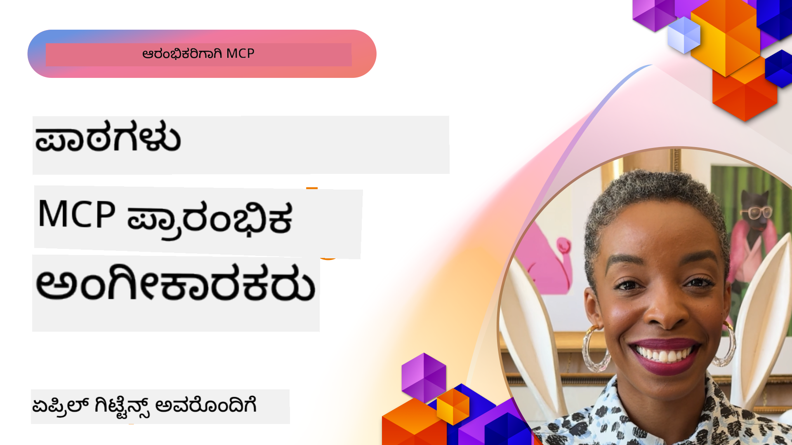

<!--
CO_OP_TRANSLATOR_METADATA:
{
  "original_hash": "41f16dac486d2086a53bc644a01cbe42",
  "translation_date": "2025-12-11T10:00:17+00:00",
  "source_file": "07-LessonsfromEarlyAdoption/README.md",
  "language_code": "kn"
}
-->
# 🌟 ಮೊದಲ ಬಳಕೆದಾರರಿಂದ ಪಾಠಗಳು

[](https://youtu.be/jds7dSmNptE)

_(ಈ ಪಾಠದ ವೀಡಿಯೋವನ್ನು ನೋಡಲು ಮೇಲಿನ ಚಿತ್ರವನ್ನು ಕ್ಲಿಕ್ ಮಾಡಿ)_

## 🎯 ಈ ಮಾಯಾಜಾಲವು ಏನು ಒಳಗೊಂಡಿದೆ

ಈ ಮಾಯಾಜಾಲವು ನಿಜವಾದ ಸಂಸ್ಥೆಗಳು ಮತ್ತು ಡೆವಲಪರ್‌ಗಳು ಮಾದರಿ ಸನ್ನಿವೇಶ ಪ್ರೋಟೋಕಾಲ್ (MCP) ಅನ್ನು ಹೇಗೆ ಉಪಯೋಗಿಸುತ್ತಿದ್ದಾರೆ ಎಂಬುದನ್ನು ಪರಿಶೀಲಿಸುತ್ತದೆ, ನಿಜವಾದ ಸವಾಲುಗಳನ್ನು ಪರಿಹರಿಸಲು ಮತ್ತು ನವೀನತೆಯನ್ನು ಚಾಲನೆ ಮಾಡಲು. ವಿವರವಾದ ಪ್ರಕರಣ ಅಧ್ಯಯನಗಳು, ಕೈಯಲ್ಲಿ ಪ್ರಾಜೆಕ್ಟ್‌ಗಳ ಮೂಲಕ, ನೀವು ಕಂಡುಕೊಳ್ಳುತ್ತೀರಿ MCP ಹೇಗೆ ಭದ್ರ, ವಿಸ್ತಾರಗೊಳ್ಳುವ AI ಸಂಯೋಜನೆಯನ್ನು ಸಕ್ರಿಯಗೊಳಿಸುತ್ತದೆ, ಇದು ಭಾಷಾ ಮಾದರಿಗಳು, ಉಪಕರಣಗಳು ಮತ್ತು ಉದ್ಯಮದ ಡೇಟಾವನ್ನು ಸಂಪರ್ಕಿಸುತ್ತದೆ.

### 📚 MCP ಅನ್ನು ಕ್ರಿಯಾಶೀಲವಾಗಿ ನೋಡಿ

ಈ ತತ್ವಗಳನ್ನು ಉತ್ಪಾದನಾ-ಸಿದ್ಧ ಉಪಕರಣಗಳಲ್ಲಿ ಹೇಗೆ ಅನ್ವಯಿಸಲಾಗಿದೆ ಎಂದು ನೋಡಲು ಬಯಸುವಿರಾ? ನಮ್ಮ [**10 Microsoft MCP ಸರ್ವರ್‌ಗಳು ಡೆವಲಪರ್ ಉತ್ಪಾದಕತೆಯನ್ನು ಪರಿವರ್ತಿಸುತ್ತಿವೆ**](microsoft-mcp-servers.md) ಅನ್ನು ಪರಿಶೀಲಿಸಿ, ಇದು ನಿಜವಾದ Microsoft MCP ಸರ್ವರ್‌ಗಳನ್ನು ತೋರಿಸುತ್ತದೆ, ನೀವು ಇವತ್ತೇ ಬಳಸಬಹುದು.

## ಅವಲೋಕನ

ಈ ಪಾಠವು ಮೊದಲ ಬಳಕೆದಾರರು ಮಾದರಿ ಸನ್ನಿವೇಶ ಪ್ರೋಟೋಕಾಲ್ (MCP) ಅನ್ನು ಹೇಗೆ ಉಪಯೋಗಿಸಿ ನಿಜವಾದ ಜಗತ್ತಿನ ಸವಾಲುಗಳನ್ನು ಪರಿಹರಿಸಿ ಮತ್ತು ಉದ್ಯಮಗಳಲ್ಲಿ ನವೀನತೆಯನ್ನು ಚಾಲನೆ ಮಾಡಿದ್ದಾರೆ ಎಂಬುದನ್ನು ಪರಿಶೀಲಿಸುತ್ತದೆ. ವಿವರವಾದ ಪ್ರಕರಣ ಅಧ್ಯಯನಗಳು ಮತ್ತು ಕೈಯಲ್ಲಿ ಪ್ರಾಜೆಕ್ಟ್‌ಗಳ ಮೂಲಕ, ನೀವು ನೋಡುತ್ತೀರಿ MCP ಹೇಗೆ ಮಾನ್ಯತೆ ಪಡೆದ, ಭದ್ರ ಮತ್ತು ವಿಸ್ತಾರಗೊಳ್ಳುವ AI ಸಂಯೋಜನೆಯನ್ನು ಸಕ್ರಿಯಗೊಳಿಸುತ್ತದೆ — ದೊಡ್ಡ ಭಾಷಾ ಮಾದರಿಗಳು, ಉಪಕರಣಗಳು ಮತ್ತು ಉದ್ಯಮದ ಡೇಟಾವನ್ನು ಏಕೀಕೃತ ಚಟುವಟಿಕೆಗಳಲ್ಲಿ ಸಂಪರ್ಕಿಸುವುದು. ನೀವು MCP ಆಧಾರಿತ ಪರಿಹಾರಗಳನ್ನು ವಿನ್ಯಾಸಗೊಳಿಸುವ ಮತ್ತು ನಿರ್ಮಿಸುವ ಪ್ರಾಯೋಗಿಕ ಅನುಭವವನ್ನು ಪಡೆಯುತ್ತೀರಿ, ಸಾಬೀತಾದ ಅನುಷ್ಠಾನ ಮಾದರಿಗಳಿಂದ ಕಲಿಯುತ್ತೀರಿ ಮತ್ತು ಉತ್ಪಾದನಾ ಪರಿಸರಗಳಲ್ಲಿ MCP ಅನ್ನು ನಿಯೋಜಿಸುವ ಉತ್ತಮ ಅಭ್ಯಾಸಗಳನ್ನು ಕಂಡುಹಿಡಿಯುತ್ತೀರಿ. ಪಾಠವು ಉದಯೋನ್ಮುಖ ಪ್ರವೃತ್ತಿಗಳು, ಭವಿಷ್ಯದ ದಿಕ್ಕುಗಳು ಮತ್ತು ಮುಕ್ತ ಮೂಲ ಸಂಪನ್ಮೂಲಗಳನ್ನು ಹೈಲೈಟ್ ಮಾಡುತ್ತದೆ, ಇದು ನಿಮಗೆ MCP ತಂತ್ರಜ್ಞಾನ ಮತ್ತು ಅದರ ಬೆಳೆಯುತ್ತಿರುವ ಪರಿಸರದಲ್ಲಿ ಮುಂಚೂಣಿಯಲ್ಲಿ ಇರಲು ಸಹಾಯ ಮಾಡುತ್ತದೆ.

## ಕಲಿಕೆಯ ಉದ್ದೇಶಗಳು

- ವಿಭಿನ್ನ ಉದ್ಯಮಗಳಲ್ಲಿ ನಿಜವಾದ MCP ಅನುಷ್ಠಾನಗಳನ್ನು ವಿಶ್ಲೇಷಿಸುವುದು  
- ಸಂಪೂರ್ಣ MCP ಆಧಾರಿತ ಅಪ್ಲಿಕೇಶನ್‌ಗಳನ್ನು ವಿನ್ಯಾಸಗೊಳಿಸಿ ನಿರ್ಮಿಸುವುದು  
- MCP ತಂತ್ರಜ್ಞಾನದಲ್ಲಿ ಉದಯೋನ್ಮುಖ ಪ್ರವೃತ್ತಿಗಳು ಮತ್ತು ಭವಿಷ್ಯದ ದಿಕ್ಕುಗಳನ್ನು ಅನ್ವೇಷಿಸುವುದು  
- ನಿಜವಾದ ಅಭಿವೃದ್ಧಿ ಪರಿಸರಗಳಲ್ಲಿ ಉತ್ತಮ ಅಭ್ಯಾಸಗಳನ್ನು ಅನ್ವಯಿಸುವುದು  

## ನಿಜವಾದ MCP ಅನುಷ್ಠಾನಗಳು

### ಪ್ರಕರಣ ಅಧ್ಯಯನ 1: ಉದ್ಯಮ ಗ್ರಾಹಕ ಬೆಂಬಲ ಸ್ವಯಂಚಾಲನೆ

ಒಂದು ಬಹುರಾಷ್ಟ್ರೀಯ ಸಂಸ್ಥೆ MCP ಆಧಾರಿತ ಪರಿಹಾರವನ್ನು ಅನುಷ್ಠಾನಗೊಳಿಸಿ ತಮ್ಮ ಗ್ರಾಹಕ ಬೆಂಬಲ ವ್ಯವಸ್ಥೆಗಳಲ್ಲಿ AI ಸಂವಹನಗಳನ್ನು ಮಾನ್ಯತೆಗೊಳಿಸಿತು. ಇದರಿಂದ ಅವರಿಗೆ ಸಾಧ್ಯವಾಯಿತು:

- ಹಲವಾರು LLM ಪೂರೈಕೆದಾರರಿಗಾಗಿ ಏಕೀಕೃತ ಇಂಟರ್ಫೇಸ್ ರಚನೆ  
- ಇಲಾಖೆಗಳಾದ್ಯಂತ ಸತತ ಪ್ರಾಂಪ್ಟ್ ನಿರ್ವಹಣೆ  
- ಬಲವಾದ ಭದ್ರತೆ ಮತ್ತು ಅನುಕೂಲ ನಿಯಂತ್ರಣಗಳನ್ನು ಅನುಷ್ಠಾನಗೊಳಿಸುವುದು  
- ನಿರ್ದಿಷ್ಟ ಅಗತ್ಯಗಳ ಆಧಾರದ ಮೇಲೆ ವಿಭಿನ್ನ AI ಮಾದರಿಗಳ ನಡುವೆ ಸುಲಭವಾಗಿ ಬದಲಾವಣೆ  

**ತಾಂತ್ರಿಕ ಅನುಷ್ಠಾನ:**

```python
# ಗ್ರಾಹಕ ಬೆಂಬಲಕ್ಕಾಗಿ ಪೈಥಾನ್ MCP ಸರ್ವರ್ ಅನುಷ್ಠಾನ
import logging
import asyncio
from modelcontextprotocol import create_server, ServerConfig
from modelcontextprotocol.server import MCPServer
from modelcontextprotocol.transports import create_http_transport
from modelcontextprotocol.resources import ResourceDefinition
from modelcontextprotocol.prompts import PromptDefinition
from modelcontextprotocol.tool import ToolDefinition

# ಲಾಗಿಂಗ್ ಅನ್ನು ಸಂರಚಿಸಿ
logging.basicConfig(level=logging.INFO)

async def main():
    # ಸರ್ವರ್ ಸಂರಚನೆ ರಚಿಸಿ
    config = ServerConfig(
        name="Enterprise Customer Support Server",
        version="1.0.0",
        description="MCP server for handling customer support inquiries"
    )
    
    # MCP ಸರ್ವರ್ ಪ್ರಾರಂಭಿಸಿ
    server = create_server(config)
    
    # ಜ್ಞಾನ ಆಧಾರ ಸಂಪನ್ಮೂಲಗಳನ್ನು ನೋಂದಣಿ ಮಾಡಿ
    server.resources.register(
        ResourceDefinition(
            name="customer_kb",
            description="Customer knowledge base documentation"
        ),
        lambda params: get_customer_documentation(params)
    )
    
    # ಪ್ರಾಂಪ್ಟ್ ಟೆಂಪ್ಲೇಟುಗಳನ್ನು ನೋಂದಣಿ ಮಾಡಿ
    server.prompts.register(
        PromptDefinition(
            name="support_template",
            description="Templates for customer support responses"
        ),
        lambda params: get_support_templates(params)
    )
    
    # ಬೆಂಬಲ ಸಾಧನಗಳನ್ನು ನೋಂದಣಿ ಮಾಡಿ
    server.tools.register(
        ToolDefinition(
            name="ticketing",
            description="Create and update support tickets"
        ),
        handle_ticketing_operations
    )
    
    # HTTP ಸಾರಿಗೆ ಮೂಲಕ ಸರ್ವರ್ ಪ್ರಾರಂಭಿಸಿ
    transport = create_http_transport(port=8080)
    await server.run(transport)

if __name__ == "__main__":
    asyncio.run(main())
```
  
**ಫಲಿತಾಂಶಗಳು:** ಮಾದರಿ ವೆಚ್ಚಗಳಲ್ಲಿ 30% ಕಡಿತ, ಪ್ರತಿಕ್ರಿಯೆ ಸತತತೆಯಲ್ಲಿ 45% ಸುಧಾರಣೆ ಮತ್ತು ಜಾಗತಿಕ ಕಾರ್ಯಾಚರಣೆಗಳಲ್ಲಿ ಉತ್ತಮ ಅನುಕೂಲತೆ.

### ಪ್ರಕರಣ ಅಧ್ಯಯನ 2: ಆರೋಗ್ಯ ಸೇವೆ ನಿರ್ಣಯ ಸಹಾಯಕ

ಒಂದು ಆರೋಗ್ಯ ಸೇವಾ ಪೂರೈಕೆದಾರರು MCP ಮೂಲಸೌಕರ್ಯವನ್ನು ಅಭಿವೃದ್ಧಿಪಡಿಸಿ ಹಲವಾರು ವಿಶೇಷ ವೈದ್ಯಕೀಯ AI ಮಾದರಿಗಳನ್ನು ಸಂಯೋಜಿಸಿದರು ಮತ್ತು ಸಂವೇದನಾಶೀಲ ರೋಗಿ ಡೇಟಾವನ್ನು ರಕ್ಷಿಸಿದರು:

- ಸಾಮಾನ್ಯ ಮತ್ತು ವಿಶೇಷ ವೈದ್ಯಕೀಯ ಮಾದರಿಗಳ ನಡುವೆ ನಿರಂತರ ಬದಲಾವಣೆ  
- ಕಠಿಣ ಗೌಪ್ಯತೆ ನಿಯಂತ್ರಣಗಳು ಮತ್ತು ಪರಿಶೀಲನಾ ಟ್ರೇಲ್ಸ್  
- ಇಲೆಕ್ಟ್ರಾನಿಕ್ ಆರೋಗ್ಯ ದಾಖಲೆ (EHR) ವ್ಯವಸ್ಥೆಗಳೊಂದಿಗೆ ಸಂಯೋಜನೆ  
- ವೈದ್ಯಕೀಯ ಪದಸಂಪದೆಯ ನಿರಂತರ ಪ್ರಾಂಪ್ಟ್ ಇಂಜಿನಿಯರಿಂಗ್  

**ತಾಂತ್ರಿಕ ಅನುಷ್ಠಾನ:**

```csharp
// C# MCP host application implementation in healthcare application
using Microsoft.Extensions.DependencyInjection;
using ModelContextProtocol.SDK.Client;
using ModelContextProtocol.SDK.Security;
using ModelContextProtocol.SDK.Resources;

public class DiagnosticAssistant
{
    private readonly MCPHostClient _mcpClient;
    private readonly PatientContext _patientContext;
    
    public DiagnosticAssistant(PatientContext patientContext)
    {
        _patientContext = patientContext;
        
        // Configure MCP client with healthcare-specific settings
        var clientOptions = new ClientOptions
        {
            Name = "Healthcare Diagnostic Assistant",
            Version = "1.0.0",
            Security = new SecurityOptions
            {
                Encryption = EncryptionLevel.Medical,
                AuditEnabled = true
            }
        };
        
        _mcpClient = new MCPHostClientBuilder()
            .WithOptions(clientOptions)
            .WithTransport(new HttpTransport("https://healthcare-mcp.example.org"))
            .WithAuthentication(new HIPAACompliantAuthProvider())
            .Build();
    }
    
    public async Task<DiagnosticSuggestion> GetDiagnosticAssistance(
        string symptoms, string patientHistory)
    {
        // Create request with appropriate resources and tool access
        var resourceRequest = new ResourceRequest
        {
            Name = "patient_records",
            Parameters = new Dictionary<string, object>
            {
                ["patientId"] = _patientContext.PatientId,
                ["requestingProvider"] = _patientContext.ProviderId
            }
        };
        
        // Request diagnostic assistance using appropriate prompt
        var response = await _mcpClient.SendPromptRequestAsync(
            promptName: "diagnostic_assistance",
            parameters: new Dictionary<string, object>
            {
                ["symptoms"] = symptoms,
                patientHistory = patientHistory,
                relevantGuidelines = _patientContext.GetRelevantGuidelines()
            });
            
        return DiagnosticSuggestion.FromMCPResponse(response);
    }
}
```
  
**ಫಲಿತಾಂಶಗಳು:** ವೈದ್ಯರಿಗೆ ಉತ್ತಮ ನಿರ್ಣಯ ಸಲಹೆಗಳು, HIPAA ಅನುಕೂಲತೆ ಪೂರ್ಣವಾಗಿ ಕಾಯ್ದುಕೊಂಡು ಮತ್ತು ವ್ಯವಸ್ಥೆಗಳ ನಡುವೆ ಸನ್ನಿವೇಶ ಬದಲಾವಣೆಯಲ್ಲಿ ಮಹತ್ವದ ಕಡಿತ.

### ಪ್ರಕರಣ ಅಧ್ಯಯನ 3: ಹಣಕಾಸು ಸೇವೆಗಳ ಅಪಾಯ ವಿಶ್ಲೇಷಣೆ

ಒಂದು ಹಣಕಾಸು ಸಂಸ್ಥೆ MCP ಅನ್ನು ವಿವಿಧ ಇಲಾಖೆಗಳ ಅಪಾಯ ವಿಶ್ಲೇಷಣೆ ಪ್ರಕ್ರಿಯೆಗಳನ್ನು ಮಾನ್ಯತೆಗೊಳಿಸಲು ಅನುಷ್ಠಾನಗೊಳಿಸಿತು:

- ಕ್ರೆಡಿಟ್ ಅಪಾಯ, ಮೋಸ ಪತ್ತೆ ಮತ್ತು ಹೂಡಿಕೆ ಅಪಾಯ ಮಾದರಿಗಳಿಗಾಗಿ ಏಕೀಕೃತ ಇಂಟರ್ಫೇಸ್ ರಚನೆ  
- ಕಠಿಣ ಪ್ರವೇಶ ನಿಯಂತ್ರಣಗಳು ಮತ್ತು ಮಾದರಿ ಆವೃತ್ತಿ ನಿರ್ವಹಣೆ  
- ಎಲ್ಲಾ AI ಶಿಫಾರಸುಗಳ ಪರಿಶೀಲನೀಯತೆ ಖಚಿತಪಡಿಸುವುದು  
- ವಿಭಿನ್ನ ವ್ಯವಸ್ಥೆಗಳಾದ್ಯಂತ ಸತತ ಡೇಟಾ ಸ್ವರೂಪ ನಿರ್ವಹಣೆ  

**ತಾಂತ್ರಿಕ ಅನುಷ್ಠಾನ:**

```java
// ಹಣಕಾಸು ಅಪಾಯ ಮೌಲ್ಯಮಾಪನಕ್ಕಾಗಿ ಜಾವಾ MCP ಸರ್ವರ್
import org.mcp.server.*;
import org.mcp.security.*;

public class FinancialRiskMCPServer {
    public static void main(String[] args) {
        // ಹಣಕಾಸು ಅನುಕೂಲತೆಗಳೊಂದಿಗೆ MCP ಸರ್ವರ್ ರಚಿಸಿ
        MCPServer server = new MCPServerBuilder()
            .withModelProviders(
                new ModelProvider("risk-assessment-primary", new AzureOpenAIProvider()),
                new ModelProvider("risk-assessment-audit", new LocalLlamaProvider())
            )
            .withPromptTemplateDirectory("./compliance/templates")
            .withAccessControls(new SOCCompliantAccessControl())
            .withDataEncryption(EncryptionStandard.FINANCIAL_GRADE)
            .withVersionControl(true)
            .withAuditLogging(new DatabaseAuditLogger())
            .build();
            
        server.addRequestValidator(new FinancialDataValidator());
        server.addResponseFilter(new PII_RedactionFilter());
        
        server.start(9000);
        
        System.out.println("Financial Risk MCP Server running on port 9000");
    }
}
```
  
**ಫಲಿತಾಂಶಗಳು:** ನಿಯಂತ್ರಣ ಅನುಕೂಲತೆ ಸುಧಾರಣೆ, 40% ವೇಗವಾದ ಮಾದರಿ ನಿಯೋಜನೆ ಚಕ್ರಗಳು ಮತ್ತು ಇಲಾಖೆಗಳಾದ್ಯಂತ ಅಪಾಯ ಮೌಲ್ಯಮಾಪನ ಸತತತೆ.

### ಪ್ರಕರಣ ಅಧ್ಯಯನ 4: Microsoft Playwright MCP ಸರ್ವರ್ ಬ್ರೌಸರ್ ಸ್ವಯಂಚಾಲನೆಗಾಗಿ

Microsoft [Playwright MCP ಸರ್ವರ್](https://github.com/microsoft/playwright-mcp) ಅನ್ನು ಅಭಿವೃದ್ಧಿಪಡಿಸಿ, ಮಾದರಿ ಸನ್ನಿವೇಶ ಪ್ರೋಟೋಕಾಲ್ ಮೂಲಕ ಭದ್ರ, ಮಾನ್ಯತೆಗೊಳ್ಳುವ ಬ್ರೌಸರ್ ಸ್ವಯಂಚಾಲನೆಯನ್ನು ಸಕ್ರಿಯಗೊಳಿಸಿದೆ. ಈ ಉತ್ಪಾದನಾ-ಸಿದ್ಧ ಸರ್ವರ್ AI ಏಜೆಂಟ್‌ಗಳು ಮತ್ತು LLM ಗಳಿಗೆ ವೆಬ್ ಬ್ರೌಸರ್‌ಗಳೊಂದಿಗೆ ನಿಯಂತ್ರಿತ, ಪರಿಶೀಲನೀಯ ಮತ್ತು ವಿಸ್ತಾರಗೊಳ್ಳುವ ರೀತಿಯಲ್ಲಿ ಸಂವಹನ ಮಾಡಲು ಅವಕಾಶ ನೀಡುತ್ತದೆ — ಸ್ವಯಂಚಾಲಿತ ವೆಬ್ ಪರೀಕ್ಷೆ, ಡೇಟಾ ಹೊರತೆಗೆಯುವಿಕೆ ಮತ್ತು ಅಂತ್ಯದಿಂದ ಅಂತ್ಯವರೆಗೆ ಕಾರ್ಯಪ್ರವಾಹಗಳಂತಹ ಬಳಕೆ ಪ್ರಕರಣಗಳನ್ನು ಸಕ್ರಿಯಗೊಳಿಸುವುದು.

> **🎯 ಉತ್ಪಾದನಾ ಸಿದ್ಧ ಉಪಕರಣ**  
> 
> ಈ ಪ್ರಕರಣ ಅಧ್ಯಯನವು ನೀವು ಇವತ್ತೇ ಬಳಸಬಹುದಾದ ನಿಜವಾದ MCP ಸರ್ವರ್ ಅನ್ನು ತೋರಿಸುತ್ತದೆ! Playwright MCP ಸರ್ವರ್ ಮತ್ತು ಇತರ 9 ಉತ್ಪಾದನಾ-ಸಿದ್ಧ Microsoft MCP ಸರ್ವರ್‌ಗಳ ಬಗ್ಗೆ ತಿಳಿಯಲು ನಮ್ಮ [**Microsoft MCP ಸರ್ವರ್‌ಗಳ ಮಾರ್ಗದರ್ಶಿ**](microsoft-mcp-servers.md#8--playwright-mcp-server) ಅನ್ನು ನೋಡಿ.

**ಪ್ರಮುಖ ವೈಶಿಷ್ಟ್ಯಗಳು:**  
- MCP ಉಪಕರಣಗಳಾಗಿ ಬ್ರೌಸರ್ ಸ್ವಯಂಚಾಲನೆ ಸಾಮರ್ಥ್ಯಗಳನ್ನು (ನಾವಿಗೇಶನ್, ಫಾರ್ಮ್ ಭರ್ತಿ, ಸ್ಕ್ರೀನ್‌ಶಾಟ್ ಸೆರೆಹಿಡಿಯುವಿಕೆ ಇತ್ಯಾದಿ) ಬಹಿರಂಗಪಡಿಸುತ್ತದೆ  
- ಅನಧಿಕೃತ ಕ್ರಿಯೆಗಳನ್ನು ತಡೆಯಲು ಕಠಿಣ ಪ್ರವೇಶ ನಿಯಂತ್ರಣಗಳು ಮತ್ತು ಸ್ಯಾಂಡ್‌ಬಾಕ್ಸಿಂಗ್ ಅನುಷ್ಠಾನಗೊಳಿಸುತ್ತದೆ  
- ಎಲ್ಲಾ ಬ್ರೌಸರ್ ಸಂವಹನಗಳಿಗೆ ವಿವರವಾದ ಪರಿಶೀಲನಾ ಲಾಗ್‌ಗಳನ್ನು ಒದಗಿಸುತ್ತದೆ  
- ಏಜೆಂಟ್ ಚಾಲಿತ ಸ್ವಯಂಚಾಲನೆಗಾಗಿ Azure OpenAI ಮತ್ತು ಇತರ LLM ಪೂರೈಕೆದಾರರೊಂದಿಗೆ ಸಂಯೋಜನೆಯನ್ನು ಬೆಂಬಲಿಸುತ್ತದೆ  
- GitHub Copilot ನ ಕೋಡಿಂಗ್ ಏಜೆಂಟ್‌ಗೆ ವೆಬ್ ಬ್ರೌಸಿಂಗ್ ಸಾಮರ್ಥ್ಯಗಳನ್ನು ಪೂರೈಸುತ್ತದೆ  

**ತಾಂತ್ರಿಕ ಅನುಷ್ಠಾನ:**

```typescript
// ಟೈಪ್‌ಸ್ಕ್ರಿಪ್ಟ್: MCP ಸರ್ವರ್‌ನಲ್ಲಿ ಪ್ಲೇರೈಟ್ ಬ್ರೌಸರ್ ಸ್ವಯಂಚಾಲಿತ ಸಾಧನಗಳನ್ನು ನೋಂದಾಯಿಸಲಾಗುತ್ತಿದೆ
import { createServer, ToolDefinition } from 'modelcontextprotocol';
import { launch } from 'playwright';

const server = createServer({
  name: 'Playwright MCP Server',
  version: '1.0.0',
  description: 'MCP server for browser automation using Playwright'
});

// URL ಗೆ ನಾವಿಗೇಟ್ ಮಾಡಲು ಮತ್ತು ಸ್ಕ್ರೀನ್‌ಶಾಟ್ ಸೆರೆಹಿಡಿಯಲು ಸಾಧನವನ್ನು ನೋಂದಾಯಿಸಿ
server.tools.register(
  new ToolDefinition({
    name: 'navigate_and_screenshot',
    description: 'Navigate to a URL and capture a screenshot',
    parameters: {
      url: { type: 'string', description: 'The URL to visit' }
    }
  }),
  async ({ url }) => {
    const browser = await launch();
    const page = await browser.newPage();
    await page.goto(url);
    const screenshot = await page.screenshot();
    await browser.close();
    return { screenshot };
  }
);

// MCP ಸರ್ವರ್ ಪ್ರಾರಂಭಿಸಿ
server.listen(8080);
```
  
**ಫಲಿತಾಂಶಗಳು:**  

- AI ಏಜೆಂಟ್‌ಗಳು ಮತ್ತು LLM ಗಾಗಿ ಭದ್ರ, ಪ್ರೋಗ್ರಾಮ್ಯಾಟಿಕ್ ಬ್ರೌಸರ್ ಸ್ವಯಂಚಾಲನೆ ಸಕ್ರಿಯಗೊಳಿಸಿದೆ  
- ಕೈಯಿಂದ ಪರೀಕ್ಷಿಸುವ ಪ್ರಯತ್ನವನ್ನು ಕಡಿಮೆ ಮಾಡಿ ವೆಬ್ ಅಪ್ಲಿಕೇಶನ್‌ಗಳ ಪರೀಕ್ಷಾ ವ್ಯಾಪ್ತಿಯನ್ನು ಸುಧಾರಿಸಿದೆ  
- ಉದ್ಯಮ ಪರಿಸರಗಳಲ್ಲಿ ಬ್ರೌಸರ್ ಆಧಾರಿತ ಉಪಕರಣ ಸಂಯೋಜನೆಗೆ ಪುನಃಬಳಕೆ ಮಾಡಬಹುದಾದ, ವಿಸ್ತಾರಗೊಳ್ಳುವ ಚಟುವಟಿಕೆ ಒದಗಿಸಿದೆ  
- GitHub Copilot ನ ವೆಬ್ ಬ್ರೌಸಿಂಗ್ ಸಾಮರ್ಥ್ಯಗಳನ್ನು ಪೂರೈಸುತ್ತದೆ  

**ಸೂಚನೆಗಳು:**  

- [Playwright MCP Server GitHub Repository](https://github.com/microsoft/playwright-mcp)  
- [Microsoft AI and Automation Solutions](https://azure.microsoft.com/en-us/products/ai-services/)  

### ಪ್ರಕರಣ ಅಧ್ಯಯನ 5: Azure MCP – ಉದ್ಯಮ-ಮಟ್ಟದ ಮಾದರಿ ಸನ್ನಿವೇಶ ಪ್ರೋಟೋಕಾಲ್ ಸೇವೆಯಾಗಿ

Azure MCP ([https://aka.ms/azmcp](https://aka.ms/azmcp)) Microsoft ನ ನಿರ್ವಹಿತ, ಉದ್ಯಮ-ಮಟ್ಟದ ಮಾದರಿ ಸನ್ನಿವೇಶ ಪ್ರೋಟೋಕಾಲ್ ಅನುಷ್ಠಾನವಾಗಿದೆ, ಇದು ವಿಸ್ತಾರಗೊಳ್ಳುವ, ಭದ್ರ ಮತ್ತು ಅನುಕೂಲ MCP ಸರ್ವರ್ ಸಾಮರ್ಥ್ಯಗಳನ್ನು ಕ್ಲೌಡ್ ಸೇವೆಯಾಗಿ ಒದಗಿಸಲು ವಿನ್ಯಾಸಗೊಳಿಸಲಾಗಿದೆ. ಈ ಸಮಗ್ರ ಸ್ಯೂಟ್ ವಿವಿಧ Azure ಸೇವೆಗಳು ಮತ್ತು ಸಂದರ್ಭಗಳಿಗೆ ವಿಶೇಷ MCP ಸರ್ವರ್‌ಗಳನ್ನು ಒಳಗೊಂಡಿದೆ.

[Microsoft MCP Center](https://mcp.azure.com) ನಿಮ್ಮ ವಿಸ್ತಾರಗೊಳ್ಳುವ, ಉದ್ಯಮ-ಸಿದ್ಧ MCP ರಿಜಿಸ್ಟ್ರಿಯನ್ನು Azure API ಸೆಂಟರ್ ಮೂಲಕ ನಿರ್ಮಿಸಿ, ಇದು ಲಭ್ಯವಿರುವ Microsoft MCP ಸರ್ವರ್‌ಗಳ ಕ್ಯಾಟಲಾಗ್ ಆಗಿದೆ.

> **🎯 ಉತ್ಪಾದನಾ ಸಿದ್ಧ ಉಪಕರಣಗಳು**  
> 
> ಈ ಪ್ರಕರಣ ಅಧ್ಯಯನವು ಹಲವಾರು ಉತ್ಪಾದನಾ-ಸಿದ್ಧ MCP ಸರ್ವರ್‌ಗಳನ್ನು ಪ್ರತಿನಿಧಿಸುತ್ತದೆ! Azure MCP ಸರ್ವರ್ ಮತ್ತು ಇತರ Azure-ಸಂಯೋಜಿತ ಸರ್ವರ್‌ಗಳ ಬಗ್ಗೆ ತಿಳಿಯಲು ನಮ್ಮ [**Microsoft MCP ಸರ್ವರ್‌ಗಳ ಮಾರ್ಗದರ್ಶಿ**](microsoft-mcp-servers.md#2--azure-mcp-server) ಅನ್ನು ನೋಡಿ.

**ಪ್ರಮುಖ ವೈಶಿಷ್ಟ್ಯಗಳು:**  
- ನಿರ್ಮಿತ ವಿಸ್ತರಣೆ, ಮೇಲ್ವಿಚಾರಣೆ ಮತ್ತು ಭದ್ರತೆ ಹೊಂದಿರುವ ಸಂಪೂರ್ಣ ನಿರ್ವಹಿತ MCP ಸರ್ವರ್ ಹೋಸ್ಟಿಂಗ್  
- Azure OpenAI, Azure AI Search ಮತ್ತು ಇತರ Azure ಸೇವೆಗಳೊಂದಿಗೆ ಸ್ಥಳೀಯ ಸಂಯೋಜನೆ  
- Microsoft Entra ID ಮೂಲಕ ಉದ್ಯಮ ಪ್ರಮಾಣೀಕರಣ ಮತ್ತು ಪ್ರಾಧಿಕಾರ  
- ಕಸ್ಟಮ್ ಉಪಕರಣಗಳು, ಪ್ರಾಂಪ್ಟ್ ಟೆಂಪ್ಲೇಟುಗಳು ಮತ್ತು ಸಂಪನ್ಮೂಲ ಸಂಪರ್ಕಕಾರರಿಗೆ ಬೆಂಬಲ  
- ಉದ್ಯಮ ಭದ್ರತೆ ಮತ್ತು ನಿಯಂತ್ರಣ ಅಗತ್ಯಗಳಿಗೆ ಅನುಕೂಲತೆ  
- ಡೇಟಾಬೇಸ್, ಮೇಲ್ವಿಚಾರಣೆ ಮತ್ತು ಸಂಗ್ರಹಣೆ ಸೇರಿದಂತೆ 15+ ವಿಶೇಷ Azure ಸೇವೆ ಸಂಪರ್ಕಕಾರರು  

**Azure MCP ಸರ್ವರ್ ಸಾಮರ್ಥ್ಯಗಳು:**  
- **ಸಂಪನ್ಮೂಲ ನಿರ್ವಹಣೆ**: ಸಂಪೂರ್ಣ Azure ಸಂಪನ್ಮೂಲ ಜೀವನಚಕ್ರ ನಿರ್ವಹಣೆ  
- **ಡೇಟಾಬೇಸ್ ಸಂಪರ್ಕಕಾರರು**: Azure Database for PostgreSQL ಮತ್ತು SQL Server ಗೆ ನೇರ ಪ್ರವೇಶ  
- **Azure Monitor**: KQL ಚಾಲಿತ ಲಾಗ್ ವಿಶ್ಲೇಷಣೆ ಮತ್ತು ಕಾರ್ಯಾಚರಣೆ ಒಳನೋಟಗಳು  
- **ಪ್ರಮಾಣೀಕರಣ**: DefaultAzureCredential ಮತ್ತು ನಿರ್ವಹಿತ ಗುರುತಿನ ಮಾದರಿಗಳು  
- **ಸಂಗ್ರಹಣೆ ಸೇವೆಗಳು**: ಬ್ಲಾಬ್ ಸ್ಟೋರೇಜ್, ಕ್ಯೂ ಸ್ಟೋರೇಜ್ ಮತ್ತು ಟೇಬಲ್ ಸ್ಟೋರೇಜ್ ಕಾರ್ಯಾಚರಣೆಗಳು  
- **ಕಂಟೈನರ್ ಸೇವೆಗಳು**: Azure Container Apps, Container Instances ಮತ್ತು AKS ನಿರ್ವಹಣೆ  

**ತಾಂತ್ರಿಕ ಅನುಷ್ಠಾನ:**

```yaml
# Example: Azure MCP server deployment configuration (YAML)
apiVersion: mcp.microsoft.com/v1
kind: McpServer
metadata:
  name: enterprise-mcp-server
spec:
  modelProviders:
    - name: azure-openai
      type: AzureOpenAI
      endpoint: https://<your-openai-resource>.openai.azure.com/
      apiKeySecret: <your-azure-keyvault-secret>
  tools:
    - name: document_search
      type: AzureAISearch
      endpoint: https://<your-search-resource>.search.windows.net/
      apiKeySecret: <your-azure-keyvault-secret>
  authentication:
    type: EntraID
    tenantId: <your-tenant-id>
  monitoring:
    enabled: true
    logAnalyticsWorkspace: <your-log-analytics-id>
```
  
**ಫಲಿತಾಂಶಗಳು:**  
- ಉದ್ಯಮ AI ಯೋಜನೆಗಳಿಗೆ ತ್ವರಿತ ಮೌಲ್ಯ-ಸಮಯವನ್ನು ಒದಗಿಸುವ, ಸಿದ್ಧ-ಬಳಕೆ, ಅನುಕೂಲ MCP ಸರ್ವರ್ ವೇದಿಕೆಯನ್ನು ಒದಗಿಸುವ ಮೂಲಕ  
- LLM ಗಳು, ಉಪಕರಣಗಳು ಮತ್ತು ಉದ್ಯಮ ಡೇಟಾ ಮೂಲಗಳ ಸರಳ ಸಂಯೋಜನೆ  
- MCP ಕಾರ್ಯಭಾರಗಳಿಗೆ ಸುಧಾರಿತ ಭದ್ರತೆ, ಗಮನಾರ್ಹತೆ ಮತ್ತು ಕಾರ್ಯಾಚರಣೆ ದಕ್ಷತೆ  
- Azure SDK ಉತ್ತಮ ಅಭ್ಯಾಸಗಳು ಮತ್ತು ಪ್ರಸ್ತುತ ಪ್ರಮಾಣೀಕರಣ ಮಾದರಿಗಳೊಂದಿಗೆ ಸುಧಾರಿತ ಕೋಡ್ ಗುಣಮಟ್ಟ  

**ಸೂಚನೆಗಳು:**  
- [Azure MCP Documentation](https://aka.ms/azmcp)  
- [Azure MCP Server GitHub Repository](https://github.com/Azure/azure-mcp)  
- [Azure AI Services](https://azure.microsoft.com/en-us/products/ai-services/)  
- [Microsoft MCP Center](https://mcp.azure.com)  

## ಪ್ರಕರಣ ಅಧ್ಯಯನ 6: NLWeb  
MCP (ಮಾದರಿ ಸನ್ನಿವೇಶ ಪ್ರೋಟೋಕಾಲ್) ಚಾಟ್‌ಬಾಟ್‌ಗಳು ಮತ್ತು AI ಸಹಾಯಕರು ಉಪಕರಣಗಳೊಂದಿಗೆ ಸಂವಹನ ಮಾಡಲು ಉದಯೋನ್ಮುಖ ಪ್ರೋಟೋಕಾಲ್ ಆಗಿದೆ. ಪ್ರತಿಯೊಂದು NLWeb ಉದಾಹರಣೆಯೂ MCP ಸರ್ವರ್ ಆಗಿದ್ದು, ಒಂದು ಮೂಲ ವಿಧಾನವಾದ ask ಅನ್ನು ಬೆಂಬಲಿಸುತ್ತದೆ, ಇದು ವೆಬ್‌ಸೈಟ್‌ಗೆ ಸಹಜ ಭಾಷೆಯಲ್ಲಿ ಪ್ರಶ್ನೆ ಕೇಳಲು ಬಳಸಲಾಗುತ್ತದೆ. ಹಿಂತಿರುಗುವ ಪ್ರತಿಕ್ರಿಯೆ schema.org ಅನ್ನು ಉಪಯೋಗಿಸುತ್ತದೆ, ಇದು ವೆಬ್ ಡೇಟಾವನ್ನು ವರ್ಣಿಸಲು ವ್ಯಾಪಕವಾಗಿ ಬಳಸುವ ಶಬ್ದಕೋಶವಾಗಿದೆ. ಸಡಿಲವಾಗಿ ಹೇಳುವುದಾದರೆ, MCP ಎಂದರೆ NLWeb, Http ಗೆ HTML ಆಗಿರುವಂತೆ. NLWeb ಪ್ರೋಟೋಕಾಲ್‌ಗಳು, Schema.org ಫಾರ್ಮ್ಯಾಟ್‌ಗಳು ಮತ್ತು ಮಾದರಿ ಕೋಡ್ ಅನ್ನು ಸಂಯೋಜಿಸಿ, ತ್ವರಿತವಾಗಿ ಈ ಎಂಡ್ಪಾಯಿಂಟ್‌ಗಳನ್ನು ರಚಿಸಲು ಸೈಟ್‌ಗಳಿಗೆ ಸಹಾಯ ಮಾಡುತ್ತದೆ, ಇದು ಮಾನವರಿಗೆ ಸಂಭಾಷಣಾತ್ಮಕ ಇಂಟರ್ಫೇಸ್‌ಗಳ ಮೂಲಕ ಮತ್ತು ಯಂತ್ರಗಳಿಗೆ ಸಹಜ ಏಜೆಂಟ್-ನಿಂದ-ಏಜೆಂಟ್ ಸಂವಹನದ ಮೂಲಕ ಲಾಭದಾಯಕವಾಗಿದೆ.

NLWeb ಗೆ ಎರಡು ವಿಭಿನ್ನ ಘಟಕಗಳಿವೆ.  
- ಒಂದು ಪ್ರೋಟೋಕಾಲ್, ಬಹಳ ಸರಳವಾಗಿ ಪ್ರಾರಂಭಿಸಲು, ಸಹಜ ಭಾಷೆಯಲ್ಲಿ ಸೈಟ್ ಜೊತೆಗೆ ಇಂಟರ್ಫೇಸ್ ಮಾಡಲು ಮತ್ತು ಹಿಂತಿರುಗುವ ಉತ್ತರಕ್ಕಾಗಿ json ಮತ್ತು schema.org ಅನ್ನು ಉಪಯೋಗಿಸುವ ಫಾರ್ಮ್ಯಾಟ್. REST API ಬಗ್ಗೆ ಹೆಚ್ಚಿನ ವಿವರಗಳಿಗೆ ಡಾಕ್ಯುಮೆಂಟೇಶನ್ ನೋಡಿ.  
- (1) ರ ಸರಳ ಅನುಷ್ಠಾನ, ಈಗಾಗಲೇ ಇರುವ ಮಾರ್ಕಪ್ ಅನ್ನು ಉಪಯೋಗಿಸಿ, ಉತ್ಪನ್ನಗಳು, ಪಾಕವಿಧಾನಗಳು, ಆಕರ್ಷಣೆಗಳು, ವಿಮರ್ಶೆಗಳು ಮುಂತಾದ ಐಟಂಗಳ ಪಟ್ಟಿಗಳಾಗಿ ಸೈಟ್‌ಗಳನ್ನು ಸಾರಾಂಶಗೊಳಿಸಲು. ಬಳಕೆದಾರ ಇಂಟರ್ಫೇಸ್ ವಿಗೆಟ್ಸ್‌ಗಳೊಂದಿಗೆ, ಸೈಟ್‌ಗಳು ತಮ್ಮ ವಿಷಯಕ್ಕೆ ಸಂಭಾಷಣಾತ್ಮಕ ಇಂಟರ್ಫೇಸ್‌ಗಳನ್ನು ಸುಲಭವಾಗಿ ಒದಗಿಸಬಹುದು. ಇದು ಹೇಗೆ ಕೆಲಸ ಮಾಡುತ್ತದೆ ಎಂಬುದರ ಬಗ್ಗೆ ಹೆಚ್ಚಿನ ವಿವರಗಳಿಗೆ Life of a chat query ಡಾಕ್ಯುಮೆಂಟೇಶನ್ ನೋಡಿ.  

**ಸೂಚನೆಗಳು:**  
- [Azure MCP Documentation](https://aka.ms/azmcp)  
- [NLWeb](https://github.com/microsoft/NlWeb)  

### ಪ್ರಕರಣ ಅಧ್ಯಯನ 7: Azure AI Foundry MCP ಸರ್ವರ್ – ಉದ್ಯಮ AI ಏಜೆಂಟ್ ಸಂಯೋಜನೆ

Azure AI Foundry MCP ಸರ್ವರ್‌ಗಳು MCP ಅನ್ನು ಉದ್ಯಮ ಪರಿಸರಗಳಲ್ಲಿ AI ಏಜೆಂಟ್‌ಗಳು ಮತ್ತು ಕಾರ್ಯಪ್ರವಾಹಗಳನ್ನು ಸಂಯೋಜಿಸಲು ಮತ್ತು ನಿರ್ವಹಿಸಲು ಹೇಗೆ ಬಳಸಬಹುದು ಎಂಬುದನ್ನು ತೋರಿಸುತ್ತವೆ. MCP ಅನ್ನು Azure AI Foundry ಜೊತೆಗೆ ಸಂಯೋಜಿಸುವ ಮೂಲಕ, ಸಂಸ್ಥೆಗಳು ಏಜೆಂಟ್ ಸಂವಹನಗಳನ್ನು ಮಾನ್ಯತೆಗೊಳಿಸಬಹುದು, Foundry ನ ಕಾರ್ಯಪ್ರವಾಹ ನಿರ್ವಹಣೆಯನ್ನು ಉಪಯೋಗಿಸಬಹುದು ಮತ್ತು ಭದ್ರ, ವಿಸ್ತಾರಗೊಳ್ಳುವ ನಿಯೋಜನೆಗಳನ್ನು ಖಚಿತಪಡಿಸಬಹುದು.

> **🎯 ಉತ್ಪಾದನಾ ಸಿದ್ಧ ಉಪಕರಣ**  
> 
> ಇದು ನೀವು ಇವತ್ತೇ ಬಳಸಬಹುದಾದ ನಿಜವಾದ MCP ಸರ್ವರ್! Azure AI Foundry MCP ಸರ್ವರ್ ಬಗ್ಗೆ ತಿಳಿಯಲು ನಮ್ಮ [**Microsoft MCP ಸರ್ವರ್‌ಗಳ ಮಾರ್ಗದರ್ಶಿ**](microsoft-mcp-servers.md#9--azure-ai-foundry-mcp-server) ಅನ್ನು ನೋಡಿ.

**ಪ್ರಮುಖ ವೈಶಿಷ್ಟ್ಯಗಳು:**  
- ಮಾದರಿ ಕ್ಯಾಟಲಾಗ್‌ಗಳು ಮತ್ತು ನಿಯೋಜನೆ ನಿರ್ವಹಣೆಯನ್ನು ಒಳಗೊಂಡ Azure AI ಪರಿಸರಕ್ಕೆ ಸಮಗ್ರ ಪ್ರವೇಶ  
- RAG ಅಪ್ಲಿಕೇಶನ್‌ಗಳಿಗೆ Azure AI Search ಮೂಲಕ ಜ್ಞಾನ ಸೂಚ್ಯಂಕ  
- AI ಮಾದರಿ ಕಾರ್ಯಕ್ಷಮತೆ ಮತ್ತು ಗುಣಮಟ್ಟ ಖಚಿತತೆಗಾಗಿ ಮೌಲ್ಯಮಾಪನ ಉಪಕರಣಗಳು  
- Azure AI Foundry ಕ್ಯಾಟಲಾಗ್ ಮತ್ತು ಲ್ಯಾಬ್‌ಗಳೊಂದಿಗೆ ಸಂಯೋಜನೆ, ಅತ್ಯಾಧುನಿಕ ಸಂಶೋಧನಾ ಮಾದರಿಗಳಿಗಾಗಿ  
- ಉತ್ಪಾದನಾ ಸಂದರ್ಭಗಳಿಗೆ ಏಜೆಂಟ್ ನಿರ್ವಹಣೆ ಮತ್ತು ಮೌಲ್ಯಮಾಪನ ಸಾಮರ್ಥ್ಯಗಳು  

**ಫಲಿತಾಂಶಗಳು:**  
- AI ಏಜೆಂಟ್ ಕಾರ್ಯಪ್ರವಾಹಗಳ ತ್ವರಿತ ಪ್ರೋಟೋಟೈಪಿಂಗ್ ಮತ್ತು ಬಲವಾದ ಮೇಲ್ವಿಚಾರಣೆ  
- Azure AI ಸೇವೆಗಳೊಂದಿಗೆ ಸುಗಮ ಸಂಯೋಜನೆ, ಉನ್ನತ ಸಂದರ್ಭಗಳಿಗೆ  
- ಏಜೆಂಟ್ ಪೈಪ್ಲೈನ್‌ಗಳನ್ನು ನಿರ್ಮಿಸುವ, ನಿಯೋಜಿಸುವ ಮತ್ತು ಮೇಲ್ವಿಚಾರಣೆ ಮಾಡುವ ಏಕೀಕೃತ ಇಂಟರ್ಫೇಸ್  
- ಉದ್ಯಮಗಳಿಗೆ ಸುಧಾರಿತ ಭದ್ರತೆ, ಅನು
**ಇದು ಮಹತ್ವದ ಕಾರಣ:**
- ಮೈಕ್ರೋಸಾಫ್ಟ್ ತಂತ್ರಜ್ಞಾನಗಳ "ಹಳೆಯ AI ಜ್ಞಾನ" ಸಮಸ್ಯೆಯನ್ನು ಪರಿಹರಿಸುತ್ತದೆ
- AI ಸಹಾಯಕರಿಗೆ ಇತ್ತೀಚಿನ .NET, C#, ಅಜೂರ್ ಮತ್ತು ಮೈಕ್ರೋಸಾಫ್ಟ್ 365 ವೈಶಿಷ್ಟ್ಯಗಳಿಗೆ ಪ್ರವೇಶವನ್ನು ಖಚಿತಪಡಿಸುತ್ತದೆ
- ನಿಖರವಾದ ಕೋಡ್ ರಚನೆಗಾಗಿ ಪ್ರಾಧಿಕಾರಿಕ, ಮೊದಲ-ಪಕ್ಷದ ಮಾಹಿತಿಯನ್ನು ಒದಗಿಸುತ್ತದೆ
- ವೇಗವಾಗಿ ಅಭಿವೃದ್ಧಿಯಾಗುತ್ತಿರುವ ಮೈಕ್ರೋಸಾಫ್ಟ್ ತಂತ್ರಜ್ಞಾನಗಳೊಂದಿಗೆ ಕೆಲಸ ಮಾಡುವ ಡೆವಲಪರ್‌ಗಳಿಗೆ ಅಗತ್ಯ

**ಫಲಿತಾಂಶಗಳು:**
- ಮೈಕ್ರೋಸಾಫ್ಟ್ ತಂತ್ರಜ್ಞಾನಗಳಿಗಾಗಿ AI-ರಚಿಸಿದ ಕೋಡ್‌ನ ನಿಖರತೆಯನ್ನು ನाटಕೀಯವಾಗಿ ಸುಧಾರಿಸಿದೆ
- ಪ್ರಸ್ತುತ ಡಾಕ್ಯುಮೆಂಟೇಶನ್ ಮತ್ತು ಉತ್ತಮ ಅಭ್ಯಾಸಗಳನ್ನು ಹುಡುಕಲು ಕಳೆಯುವ ಸಮಯವನ್ನು ಕಡಿಮೆ ಮಾಡಿದೆ
- ಸಾಂದರ್ಭಿಕ-ಜಾಗೃತ ಡಾಕ್ಯುಮೆಂಟೇಶನ್ ಪಡೆಯುವಿಕೆಯಿಂದ ಡೆವಲಪರ್ ಉತ್ಪಾದಕತೆಯನ್ನು ಹೆಚ್ಚಿಸಿದೆ
- IDE ಅನ್ನು ಬಿಟ್ಟುಬಿಡದೆ ಅಭಿವೃದ್ಧಿ ಕಾರ್ಯಪ್ರವಾಹಗಳೊಂದಿಗೆ ನಿರಂತರ ಏಕೀಕರಣ

**ಉಲ್ಲೇಖಗಳು:**
- [Microsoft Learn Docs MCP Server GitHub Repository](https://github.com/MicrosoftDocs/mcp)
- [Microsoft Learn Documentation](https://learn.microsoft.com/)

## ಕೈಯಲ್ಲಿ ಮಾಡುವ ಯೋಜನೆಗಳು

### ಯೋಜನೆ 1: ಬಹು-ಪ್ರದಾತ MCP ಸರ್ವರ್ ನಿರ್ಮಿಸಿ

**ಉದ್ದೇಶ:** ನಿರ್ದಿಷ್ಟ ಮಾನದಂಡಗಳ ಆಧಾರದ ಮೇಲೆ ಅನೇಕ AI ಮಾದರಿ ಪೂರೈಕೆದಾರರಿಗೆ ವಿನಂತಿಗಳನ್ನು ಮಾರ್ಗದರ್ಶನ ಮಾಡಬಲ್ಲ MCP ಸರ್ವರ್ ರಚಿಸಿ.

**ಅವಶ್ಯಕತೆಗಳು:**

- ಕನಿಷ್ಠ ಮೂರು ವಿಭಿನ್ನ ಮಾದರಿ ಪೂರೈಕೆದಾರರನ್ನು ಬೆಂಬಲಿಸಬೇಕು (ಉದಾ: OpenAI, Anthropic, ಸ್ಥಳೀಯ ಮಾದರಿಗಳು)
- ವಿನಂತಿ ಮೆಟಾಡೇಟಾದ ಆಧಾರದ ಮೇಲೆ ಮಾರ್ಗದರ್ಶನ ಯಂತ್ರಣೆಯನ್ನು ಜಾರಿಗೆ ತರುವುದನ್ನು ಅನುಷ್ಠಾನಗೊಳಿಸಿ
- ಪೂರೈಕೆದಾರರ ಪ್ರಮಾಣಪತ್ರಗಳನ್ನು ನಿರ್ವಹಿಸಲು ಸಂರಚನಾ ವ್ಯವಸ್ಥೆಯನ್ನು ರಚಿಸಿ
- ಕಾರ್ಯಕ್ಷಮತೆ ಮತ್ತು ವೆಚ್ಚಗಳನ್ನು ಸುಧಾರಿಸಲು ಕ್ಯಾಶಿಂಗ್ ಸೇರಿಸಿ
- ಬಳಕೆ ನಿಗಾ ವೀಕ್ಷಣೆಗೆ ಸರಳ ಡ್ಯಾಶ್‌ಬೋರ್ಡ್ ನಿರ್ಮಿಸಿ

**ಅನುಷ್ಠಾನ ಹಂತಗಳು:**

1. ಮೂಲ MCP ಸರ್ವರ್ ಮೂಲಸೌಕರ್ಯವನ್ನು ಸ್ಥಾಪಿಸಿ
2. ಪ್ರತಿ AI ಮಾದರಿ ಸೇವೆಗೆ ಪೂರೈಕೆದಾರ ಅಡಾಪ್ಟರ್‌ಗಳನ್ನು ಜಾರಿಗೆ ತರುವುದನ್ನು ಅನುಷ್ಠಾನಗೊಳಿಸಿ
3. ವಿನಂತಿ ಗುಣಲಕ್ಷಣಗಳ ಆಧಾರದ ಮೇಲೆ ಮಾರ್ಗದರ್ಶನ ತರ್ಕವನ್ನು ರಚಿಸಿ
4. ನಿಯಮಿತ ವಿನಂತಿಗಳಿಗಾಗಿ ಕ್ಯಾಶಿಂಗ್ ಯಂತ್ರಣೆಯನ್ನು ಸೇರಿಸಿ
5. ನಿಗಾ ವೀಕ್ಷಣಾ ಡ್ಯಾಶ್‌ಬೋರ್ಡ್ ಅಭಿವೃದ್ಧಿಪಡಿಸಿ
6. ವಿವಿಧ ವಿನಂತಿ ಮಾದರಿಗಳೊಂದಿಗೆ ಪರೀಕ್ಷಿಸಿ

**ತಂತ್ರಜ್ಞಾನಗಳು:** Python (.NET/Java/Python ನಿಮ್ಮ ಇಚ್ಛೆಯ ಆಧಾರದ ಮೇಲೆ), Redis ಕ್ಯಾಶಿಂಗ್‌ಗೆ, ಮತ್ತು ಡ್ಯಾಶ್‌ಬೋರ್ಡ್‌ಗೆ ಸರಳ ವೆಬ್ ಫ್ರೇಮ್ವರ್ಕ್ ಆಯ್ಕೆಮಾಡಿ.

### ಯೋಜನೆ 2: ಎಂಟರ್‌ಪ್ರೈಸ್ ಪ್ರಾಂಪ್ಟ್ ನಿರ್ವಹಣಾ ವ್ಯವಸ್ಥೆ

**ಉದ್ದೇಶ:** ಸಂಸ್ಥೆಯಾದ್ಯಂತ ಪ್ರಾಂಪ್ಟ್ ಟೆಂಪ್ಲೇಟುಗಳನ್ನು ನಿರ್ವಹಿಸುವ, ಆವೃತ್ತಿ ನಿರ್ವಹಿಸುವ ಮತ್ತು ನಿಯೋಜಿಸುವ MCP ಆಧಾರಿತ ವ್ಯವಸ್ಥೆಯನ್ನು ಅಭಿವೃದ್ಧಿಪಡಿಸಿ.

**ಅವಶ್ಯಕತೆಗಳು:**

- ಪ್ರಾಂಪ್ಟ್ ಟೆಂಪ್ಲೇಟುಗಳ ಕೇಂದ್ರಿತ ಸಂಗ್ರಹಾಲಯವನ್ನು ರಚಿಸಿ
- ಆವೃತ್ತಿ ನಿರ್ವಹಣೆ ಮತ್ತು ಅನುಮೋದನೆ ಕಾರ್ಯಪ್ರವಾಹಗಳನ್ನು ಜಾರಿಗೆ ತರುವುದನ್ನು ಅನುಷ್ಠಾನಗೊಳಿಸಿ
- ಮಾದರಿ ಇನ್‌ಪುಟ್‌ಗಳೊಂದಿಗೆ ಟೆಂಪ್ಲೇಟು ಪರೀಕ್ಷಾ ಸಾಮರ್ಥ್ಯಗಳನ್ನು ನಿರ್ಮಿಸಿ
- ಪಾತ್ರ ಆಧಾರಿತ ಪ್ರವೇಶ ನಿಯಂತ್ರಣಗಳನ್ನು ಅಭಿವೃದ್ಧಿಪಡಿಸಿ
- ಟೆಂಪ್ಲೇಟು ಪಡೆಯುವಿಕೆ ಮತ್ತು ನಿಯೋಜನೆಗಾಗಿ API ರಚಿಸಿ

**ಅನುಷ್ಠಾನ ಹಂತಗಳು:**

1. ಟೆಂಪ್ಲೇಟು ಸಂಗ್ರಹಣೆಗೆ ಡೇಟಾಬೇಸ್ ಸ್ಕೀಮಾ ವಿನ್ಯಾಸ ಮಾಡಿ
2. ಟೆಂಪ್ಲೇಟು CRUD ಕಾರ್ಯಾಚರಣೆಗಳಿಗಾಗಿ ಕೋರ್ API ರಚಿಸಿ
3. ಆವೃತ್ತಿ ನಿರ್ವಹಣಾ ವ್ಯವಸ್ಥೆಯನ್ನು ಜಾರಿಗೆ ತರುವುದನ್ನು ಅನುಷ್ಠಾನಗೊಳಿಸಿ
4. ಅನುಮೋದನೆ ಕಾರ್ಯಪ್ರವಾಹವನ್ನು ನಿರ್ಮಿಸಿ
5. ಪರೀಕ್ಷಾ ಫ್ರೇಮ್ವರ್ಕ್ ಅಭಿವೃದ್ಧಿಪಡಿಸಿ
6. ನಿರ್ವಹಣೆಗೆ ಸರಳ ವೆಬ್ ಇಂಟರ್ಫೇಸ್ ರಚಿಸಿ
7. MCP ಸರ್ವರ್ ಜೊತೆಗೆ ಏಕೀಕರಣ ಮಾಡಿ

**ತಂತ್ರಜ್ಞಾನಗಳು:** ನಿಮ್ಮ ಆಯ್ಕೆದ ಬ್ಯಾಕ್‌ಎಂಡ್ ಫ್ರೇಮ್ವರ್ಕ್, SQL ಅಥವಾ NoSQL ಡೇಟಾಬೇಸ್, ಮತ್ತು ನಿರ್ವಹಣಾ ಇಂಟರ್ಫೇಸಿಗಾಗಿ ಫ್ರಂಟ್‌ಎಂಡ್ ಫ್ರೇಮ್ವರ್ಕ್.

### ಯೋಜನೆ 3: MCP ಆಧಾರಿತ ವಿಷಯ ರಚನಾ ವೇದಿಕೆ

**ಉದ್ದೇಶ:** ವಿಭಿನ್ನ ವಿಷಯ ಪ್ರಕಾರಗಳಲ್ಲಿ ಸತತ ಫಲಿತಾಂಶಗಳನ್ನು ಒದಗಿಸಲು MCP ಅನ್ನು ಬಳಸುವ ವಿಷಯ ರಚನಾ ವೇದಿಕೆಯನ್ನು ನಿರ್ಮಿಸಿ.

**ಅವಶ್ಯಕತೆಗಳು:**

- ಬಹು ವಿಷಯ ಸ್ವರೂಪಗಳನ್ನು ಬೆಂಬಲಿಸಬೇಕು (ಬ್ಲಾಗ್ ಪೋಸ್ಟ್‌ಗಳು, ಸಾಮಾಜಿಕ ಮಾಧ್ಯಮ, ಮಾರ್ಕೆಟಿಂಗ್ ಪ್ರತಿಗಳು)
- ಕಸ್ಟಮೈಜೇಶನ್ ಆಯ್ಕೆಗಳೊಂದಿಗೆ ಟೆಂಪ್ಲೇಟು ಆಧಾರಿತ ರಚನೆಯನ್ನು ಜಾರಿಗೆ ತರುವುದನ್ನು ಅನುಷ್ಠಾನಗೊಳಿಸಿ
- ವಿಷಯ ವಿಮರ್ಶೆ ಮತ್ತು ಪ್ರತಿಕ್ರಿಯಾ ವ್ಯವಸ್ಥೆಯನ್ನು ರಚಿಸಿ
- ವಿಷಯ ಕಾರ್ಯಕ್ಷಮತೆ ಮೆಟ್ರಿಕ್‌ಗಳನ್ನು ಟ್ರ್ಯಾಕ್ ಮಾಡಿ
- ವಿಷಯ ಆವೃತ್ತಿ ಮತ್ತು ಪುನರಾವೃತ್ತಿಯನ್ನು ಬೆಂಬಲಿಸಿ

**ಅನುಷ್ಠಾನ ಹಂತಗಳು:**

1. MCP ಕ್ಲೈಂಟ್ ಮೂಲಸೌಕರ್ಯವನ್ನು ಸ್ಥಾಪಿಸಿ
2. ವಿಭಿನ್ನ ವಿಷಯ ಪ್ರಕಾರಗಳಿಗೆ ಟೆಂಪ್ಲೇಟುಗಳನ್ನು ರಚಿಸಿ
3. ವಿಷಯ ರಚನಾ ಪೈಪ್‌ಲೈನ್ ನಿರ್ಮಿಸಿ
4. ವಿಮರ್ಶಾ ವ್ಯವಸ್ಥೆಯನ್ನು ಜಾರಿಗೆ ತರುವುದನ್ನು ಅನುಷ್ಠಾನಗೊಳಿಸಿ
5. ಮೆಟ್ರಿಕ್ ಟ್ರ್ಯಾಕಿಂಗ್ ವ್ಯವಸ್ಥೆಯನ್ನು ಅಭಿವೃದ್ಧಿಪಡಿಸಿ
6. ಟೆಂಪ್ಲೇಟು ನಿರ್ವಹಣೆ ಮತ್ತು ವಿಷಯ ರಚನೆಗಾಗಿ ಬಳಕೆದಾರ ಇಂಟರ್ಫೇಸ್ ರಚಿಸಿ

**ತಂತ್ರಜ್ಞಾನಗಳು:** ನಿಮ್ಮ ಇಚ್ಛೆಯ ಪ್ರೋಗ್ರಾಮಿಂಗ್ ಭಾಷೆ, ವೆಬ್ ಫ್ರೇಮ್ವರ್ಕ್, ಮತ್ತು ಡೇಟಾಬೇಸ್ ವ್ಯವಸ್ಥೆ.

## MCP ತಂತ್ರಜ್ಞಾನಕ್ಕಾಗಿ ಭವಿಷ್ಯದ ದಿಕ್ಕುಗಳು

### ಉದಯೋನ್ಮುಖ ಪ್ರವೃತ್ತಿಗಳು

1. **ಬಹು-ಮೋಡಲ್ MCP**
   - ಚಿತ್ರ, ಧ್ವನಿ ಮತ್ತು ವೀಡಿಯೊ ಮಾದರಿಗಳೊಂದಿಗೆ ಸಂವಹನಗಳನ್ನು ಮಾನಕೀಕರಿಸಲು MCP ವಿಸ್ತರಣೆ
   - ಕ್ರಾಸ್-ಮೋಡಲ್ ತರ್ಕ ಸಾಮರ್ಥ್ಯಗಳ ಅಭಿವೃದ್ಧಿ
   - ವಿಭಿನ್ನ ಮೋಡಾಲಿಟಿಗಳಿಗಾಗಿ ಮಾನಕೀಕೃತ ಪ್ರಾಂಪ್ಟ್ ಸ್ವರೂಪಗಳು

2. **ಫೆಡರೇಟೆಡ್ MCP ಮೂಲಸೌಕರ್ಯ**
   - ಸಂಸ್ಥೆಗಳ ನಡುವೆ ಸಂಪನ್ಮೂಲಗಳನ್ನು ಹಂಚಿಕೊಳ್ಳುವ ವಿತರಿತ MCP ಜಾಲಗಳು
   - ಸುರಕ್ಷಿತ ಮಾದರಿ ಹಂಚಿಕೆಗೆ ಮಾನಕೀಕೃತ ಪ್ರೋಟೋಕಾಲ್‌ಗಳು
   - ಗೌಪ್ಯತೆ-ರಕ್ಷಿಸುವ ಗಣನೆ ತಂತ್ರಗಳು

3. **MCP ಮಾರುಕಟ್ಟೆಗಳು**
   - MCP ಟೆಂಪ್ಲೇಟುಗಳು ಮತ್ತು ಪ್ಲಗಿನ್‌ಗಳನ್ನು ಹಂಚಿಕೊಳ್ಳಲು ಮತ್ತು ಹಣಕಾಸು ಮಾಡಲು ಪರಿಸರಗಳು
   - ಗುಣಮಟ್ಟ ಖಚಿತತೆ ಮತ್ತು ಪ್ರಮಾಣೀಕರಣ ಪ್ರಕ್ರಿಯೆಗಳು
   - ಮಾದರಿ ಮಾರುಕಟ್ಟೆಗಳೊಂದಿಗೆ ಏಕೀಕರಣ

4. **ಎಡ್ಜ್ ಕಂಪ್ಯೂಟಿಂಗ್‌ಗೆ MCP**
   - ಸಂಪನ್ಮೂಲ-ಮಿತಿಯ ಎಡ್ಜ್ ಸಾಧನಗಳಿಗೆ MCP ಮಾನಕಗಳ ಹೊಂದಾಣಿಕೆ
   - ಕಡಿಮೆ ಬ್ಯಾಂಡ್‌ವಿಡ್ತ್ ಪರಿಸರಗಳಿಗೆ ಆಪ್ಟಿಮೈಸ್ ಮಾಡಿದ ಪ್ರೋಟೋಕಾಲ್‌ಗಳು
   - IoT ಪರಿಸರಗಳಿಗೆ ವಿಶೇಷ MCP ಜಾರಿಗೆ

5. **ನಿಯಂತ್ರಣ ಚಟುವಟಿಕೆಗಳು**
   - ನಿಯಂತ್ರಣ ಅನುಕೂಲತೆಯಿಗಾಗಿ MCP ವಿಸ್ತರಣೆಗಳ ಅಭಿವೃದ್ಧಿ
   - ಮಾನಕೀಕೃತ ಆಡಿಟ್ ಟ್ರೇಲ್‌ಗಳು ಮತ್ತು ವಿವರಣೆ ಇಂಟರ್ಫೇಸ್ಗಳು
   - ಉದಯೋನ್ಮುಖ AI ಆಡಳಿತ ಚಟುವಟಿಕೆಗಳೊಂದಿಗೆ ಏಕೀಕರಣ

### ಮೈಕ್ರೋಸಾಫ್ಟ್‌ನಿಂದ MCP ಪರಿಹಾರಗಳು

ಮೈಕ್ರೋಸಾಫ್ಟ್ ಮತ್ತು ಅಜೂರ್ ವಿವಿಧ ಸಂದರ್ಭಗಳಲ್ಲಿ MCP ಜಾರಿಗೆ ಸಹಾಯ ಮಾಡುವ ಹಲವಾರು ಓಪನ್-ಸೋರ್ಸ್ ಸಂಗ್ರಹಾಲಯಗಳನ್ನು ಅಭಿವೃದ್ಧಿಪಡಿಸಿದ್ದಾರೆ:

#### Microsoft Organization

1. [playwright-mcp](https://github.com/microsoft/playwright-mcp) - ಬ್ರೌಸರ್ ಸ್ವಯಂಚಾಲನೆ ಮತ್ತು ಪರೀಕ್ಷೆಗೆ ಪ್ಲೇರೈಟ್ MCP ಸರ್ವರ್
2. [files-mcp-server](https://github.com/microsoft/files-mcp-server) - ಸ್ಥಳೀಯ ಪರೀಕ್ಷೆ ಮತ್ತು ಸಮುದಾಯ ಕೊಡುಗೆಗಾಗಿ OneDrive MCP ಸರ್ವರ್ ಜಾರಿಗೆ
3. [NLWeb](https://github.com/microsoft/NlWeb) - NLWeb ಒಂದು ಸಂಗ್ರಹವಾಗಿದೆ ಓಪನ್ ಪ್ರೋಟೋಕಾಲ್‌ಗಳು ಮತ್ತು ಸಂಬಂಧಿತ ಓಪನ್ ಸೋರ್ಸ್ ಉಪಕರಣಗಳು. ಇದರ ಮುಖ್ಯ ಗುರಿ AI ವೆಬ್‌ಗೆ ಮೂಲಭೂತ ಪದರವನ್ನು ಸ್ಥಾಪಿಸುವುದು

#### Azure-Samples Organization

1. [mcp](https://github.com/Azure-Samples/mcp) - ಅಜೂರ್‌ನಲ್ಲಿ MCP ಸರ್ವರ್‌ಗಳನ್ನು ನಿರ್ಮಿಸಲು ಮತ್ತು ಏಕೀಕರಿಸಲು ಮಾದರಿ, ಉಪಕರಣಗಳು ಮತ್ತು ಸಂಪನ್ಮೂಲಗಳಿಗೆ ಲಿಂಕ್‌ಗಳು
2. [mcp-auth-servers](https://github.com/Azure-Samples/mcp-auth-servers) - ಪ್ರಸ್ತುತ ಮಾದರಿ ಸಾಂದರ್ಭಿಕ ಪ್ರೋಟೋಕಾಲ್ ನಿರ್ದಿಷ್ಟತೆಯೊಂದಿಗೆ ಪ್ರಮಾಣೀಕರಣವನ್ನು ತೋರಿಸುವ MCP ಸರ್ವರ್‌ಗಳ ಉದಾಹರಣೆ
3. [remote-mcp-functions](https://github.com/Azure-Samples/remote-mcp-functions) - ಅಜೂರ್ ಫಂಕ್ಷನ್‌ಗಳಲ್ಲಿ ರಿಮೋಟ್ MCP ಸರ್ವರ್ ಜಾರಿಗೆ ಲ್ಯಾಂಡಿಂಗ್ ಪುಟ ಮತ್ತು ಭಾಷಾ-ನಿರ್ದಿಷ್ಟ ಸಂಗ್ರಹಾಲಯಗಳಿಗೆ ಲಿಂಕ್‌ಗಳು
4. [remote-mcp-functions-python](https://github.com/Azure-Samples/remote-mcp-functions-python) - Python ಬಳಸಿ ಕಸ್ಟಮ್ ರಿಮೋಟ್ MCP ಸರ್ವರ್‌ಗಳನ್ನು ನಿರ್ಮಿಸಲು ಮತ್ತು ನಿಯೋಜಿಸಲು ತ್ವರಿತ ಪ್ರಾರಂಭ ಟೆಂಪ್ಲೇಟು
5. [remote-mcp-functions-dotnet](https://github.com/Azure-Samples/remote-mcp-functions-dotnet) - .NET/C# ಬಳಸಿ ಕಸ್ಟಮ್ ರಿಮೋಟ್ MCP ಸರ್ವರ್‌ಗಳನ್ನು ನಿರ್ಮಿಸಲು ಮತ್ತು ನಿಯೋಜಿಸಲು ತ್ವರಿತ ಪ್ರಾರಂಭ ಟೆಂಪ್ಲೇಟು
6. [remote-mcp-functions-typescript](https://github.com/Azure-Samples/remote-mcp-functions-typescript) - TypeScript ಬಳಸಿ ಕಸ್ಟಮ್ ರಿಮೋಟ್ MCP ಸರ್ವರ್‌ಗಳನ್ನು ನಿರ್ಮಿಸಲು ಮತ್ತು ನಿಯೋಜಿಸಲು ತ್ವರಿತ ಪ್ರಾರಂಭ ಟೆಂಪ್ಲೇಟು
7. [remote-mcp-apim-functions-python](https://github.com/Azure-Samples/remote-mcp-apim-functions-python) - Python ಬಳಸಿ ರಿಮೋಟ್ MCP ಸರ್ವರ್‌ಗಳಿಗೆ ಅಜೂರ್ API ನಿರ್ವಹಣೆಯನ್ನು AI ಗೇಟ್ವೇ ಆಗಿ ಬಳಸುವುದು
8. [AI-Gateway](https://github.com/Azure-Samples/AI-Gateway) - APIM ❤️ AI ಪ್ರಯೋಗಗಳು, MCP ಸಾಮರ್ಥ್ಯಗಳನ್ನು ಒಳಗೊಂಡು, ಅಜೂರ್ OpenAI ಮತ್ತು AI Foundry ಜೊತೆಗೆ ಏಕೀಕರಣ

ಈ ಸಂಗ್ರಹಾಲಯಗಳು ವಿವಿಧ ಪ್ರೋಗ್ರಾಮಿಂಗ್ ಭಾಷೆಗಳು ಮತ್ತು ಅಜೂರ್ ಸೇವೆಗಳೊಂದಿಗೆ ಮಾದರಿ ಸಾಂದರ್ಭಿಕ ಪ್ರೋಟೋಕಾಲ್‌ನಲ್ಲಿ ಕೆಲಸ ಮಾಡಲು ವಿವಿಧ ಜಾರಿಗೆ, ಟೆಂಪ್ಲೇಟುಗಳು ಮತ್ತು ಸಂಪನ್ಮೂಲಗಳನ್ನು ಒದಗಿಸುತ್ತವೆ. ಅವು ಮೂಲ ಸರ್ವರ್ ಜಾರಿಗೆ, ಪ್ರಮಾಣೀಕರಣ, ಕ್ಲೌಡ್ ನಿಯೋಜನೆ ಮತ್ತು ಎಂಟರ್‌ಪ್ರೈಸ್ ಏಕೀಕರಣ ಸಂದರ್ಭಗಳನ್ನು ಒಳಗೊಂಡಿವೆ.

#### MCP ಸಂಪನ್ಮೂಲಗಳ ಡೈರೆಕ್ಟರಿ

ಅಧಿಕೃತ ಮೈಕ್ರೋಸಾಫ್ಟ್ MCP ಸಂಗ್ರಹಾಲಯದಲ್ಲಿರುವ [MCP Resources directory](https://github.com/microsoft/mcp/tree/main/Resources) ಮಾದರಿ ಸಂಪನ್ಮೂಲಗಳು, ಪ್ರಾಂಪ್ಟ್ ಟೆಂಪ್ಲೇಟುಗಳು ಮತ್ತು ಉಪಕರಣ ವ್ಯಾಖ್ಯಾನಗಳ ಸಂಗ್ರಹವನ್ನು ಒದಗಿಸುತ್ತದೆ. ಈ ಡೈರೆಕ್ಟರಿ ಡೆವಲಪರ್‌ಗಳಿಗೆ MCP ಸರ್ವರ್ ಜಾರಿಗೆ ಪುನಃಬಳಕೆ ಮಾಡಬಹುದಾದ ಕಟ್ಟಡ ಘಟಕಗಳು ಮತ್ತು ಉತ್ತಮ ಅಭ್ಯಾಸಗಳ ಉದಾಹರಣೆಗಳನ್ನು ನೀಡುವ ಮೂಲಕ ತ್ವರಿತ ಪ್ರಾರಂಭಕ್ಕೆ ಸಹಾಯ ಮಾಡುತ್ತದೆ:

- **ಪ್ರಾಂಪ್ಟ್ ಟೆಂಪ್ಲೇಟುಗಳು:** ಸಾಮಾನ್ಯ AI ಕಾರ್ಯಗಳು ಮತ್ತು ಸಂದರ್ಭಗಳಿಗೆ ಸಿದ್ಧವಾಗಿರುವ ಪ್ರಾಂಪ್ಟ್ ಟೆಂಪ್ಲೇಟುಗಳು, ನಿಮ್ಮ ಸ್ವಂತ MCP ಸರ್ವರ್ ಜಾರಿಗೆ ಹೊಂದಿಕೊಳ್ಳಬಹುದಾದವು.
- **ಉಪಕರಣ ವ್ಯಾಖ್ಯಾನಗಳು:** ವಿಭಿನ್ನ MCP ಸರ್ವರ್‌ಗಳಲ್ಲಿ ಉಪಕರಣ ಏಕೀಕರಣ ಮತ್ತು ಕರೆ ಮಾಡಲು ಮಾದರಿ ಉಪಕರಣ ಸ್ಕೀಮಾಗಳು ಮತ್ತು ಮೆಟಾಡೇಟಾ.
- **ಸಂಪನ್ಮೂಲ ಮಾದರಿಗಳು:** MCP ಫ್ರೇಮ್ವರ್ಕ್ ಒಳಗೆ ಡೇಟಾ ಮೂಲಗಳು, APIಗಳು ಮತ್ತು ಬಾಹ್ಯ ಸೇವೆಗಳಿಗೆ ಸಂಪರ್ಕಿಸಲು ಉದಾಹರಣೆಯ ಸಂಪನ್ಮೂಲ ವ್ಯಾಖ್ಯಾನಗಳು.
- **ಉಲ್ಲೇಖ ಜಾರಿಗೆ:** ಸಂಪನ್ಮೂಲಗಳು, ಪ್ರಾಂಪ್ಟ್‌ಗಳು ಮತ್ತು ಉಪಕರಣಗಳನ್ನು ನೈಜ MCP ಯೋಜನೆಗಳಲ್ಲಿ ಹೇಗೆ ರಚಿಸಬೇಕು ಮತ್ತು ಸಂಘಟಿಸಬೇಕು ಎಂಬುದನ್ನು ತೋರಿಸುವ ಪ್ರಾಯೋಗಿಕ ಮಾದರಿಗಳು.

ಈ ಸಂಪನ್ಮೂಲಗಳು ಅಭಿವೃದ್ಧಿಯನ್ನು ವೇಗಗೊಳಿಸುತ್ತವೆ, ಮಾನಕೀಕರಣವನ್ನು ಉತ್ತೇಜಿಸುತ್ತವೆ ಮತ್ತು MCP ಆಧಾರಿತ ಪರಿಹಾರಗಳನ್ನು ನಿರ್ಮಿಸುವಾಗ ಉತ್ತಮ ಅಭ್ಯಾಸಗಳನ್ನು ಖಚಿತಪಡಿಸುತ್ತವೆ.

#### MCP ಸಂಪನ್ಮೂಲಗಳ ಡೈರೆಕ್ಟರಿ

- [MCP Resources (Sample Prompts, Tools, and Resource Definitions)](https://github.com/microsoft/mcp/tree/main/Resources)

### ಸಂಶೋಧನಾ ಅವಕಾಶಗಳು

- MCP ಫ್ರೇಮ್ವರ್ಕ್‌ಗಳಲ್ಲಿ ಪರಿಣಾಮಕಾರಿ ಪ್ರಾಂಪ್ಟ್ ಆಪ್ಟಿಮೈಜೇಶನ್ ತಂತ್ರಗಳು
- ಬಹು-ಟೆನಂಟ್ MCP ನಿಯೋಜನೆಗಳಿಗಾಗಿ ಭದ್ರತಾ ಮಾದರಿಗಳು
- ವಿಭಿನ್ನ MCP ಜಾರಿಗೆಗಳ ನಡುವೆ ಕಾರ್ಯಕ್ಷಮತೆ ಮೌಲ್ಯಮಾಪನ
- MCP ಸರ್ವರ್‌ಗಳಿಗಾಗಿ ಫಾರ್ಮಲ್ ಪರಿಶೀಲನೆ ವಿಧಾನಗಳು

## ಸಮಾರೋಪ

ಮಾದರಿ ಸಾಂದರ್ಭಿಕ ಪ್ರೋಟೋಕಾಲ್ (MCP) ಕೈಗಾರಿಕೆಗಳಾದ್ಯಂತ ಮಾನಕೀಕೃತ, ಸುರಕ್ಷಿತ ಮತ್ತು ಪರಸ್ಪರ ಕಾರ್ಯನಿರ್ವಹಣೆಯ AI ಏಕೀಕರಣದ ಭವಿಷ್ಯವನ್ನು ವೇಗವಾಗಿ ರೂಪಿಸುತ್ತಿದೆ. ಈ ಪಾಠದ ಪ್ರಕರಣ ಅಧ್ಯಯನಗಳು ಮತ್ತು ಕೈಯಲ್ಲಿ ಮಾಡುವ ಯೋಜನೆಗಳ ಮೂಲಕ, ನೀವು ಮೈಕ್ರೋಸಾಫ್ಟ್ ಮತ್ತು ಅಜೂರ್ ಸೇರಿದಂತೆ ಪ್ರಾರಂಭಿಕ ಸ್ವೀಕರಿಸುವವರು MCP ಅನ್ನು ಹೇಗೆ ಬಳಸಿಕೊಂಡು ನೈಜ ಜಗತ್ತಿನ ಸವಾಲುಗಳನ್ನು ಪರಿಹರಿಸುತ್ತಿದ್ದಾರೆ, AI ಸ್ವೀಕಾರವನ್ನು ವೇಗಗೊಳಿಸುತ್ತಿದ್ದಾರೆ ಮತ್ತು ಅನುಕೂಲತೆ, ಭದ್ರತೆ ಮತ್ತು ವಿಸ್ತರಣೀಯತೆಯನ್ನು ಖಚಿತಪಡಿಸುತ್ತಿದ್ದಾರೆ ಎಂಬುದನ್ನು ನೋಡಿದ್ದೀರಿ. MCP ನ ಮಡ್ಯೂಲರ್ ವಿಧಾನವು ಸಂಸ್ಥೆಗಳಿಗೆ ದೊಡ್ಡ ಭಾಷಾ ಮಾದರಿಗಳು, ಉಪಕರಣಗಳು ಮತ್ತು ಎಂಟರ್‌ಪ್ರೈಸ್ ಡೇಟಾವನ್ನು ಏಕೀಕೃತ, ಪರಿಶೀಲನೀಯ ಫ್ರೇಮ್ವರ್ಕ್‌ನಲ್ಲಿ ಸಂಪರ್ಕಿಸಲು ಸಾಧ್ಯವಾಗಿಸುತ್ತದೆ. MCP ಮುಂದುವರೆಯುತ್ತಿರೋಂತೆ, ಸಮುದಾಯದೊಂದಿಗೆ ತೊಡಗಿಸಿಕೊಂಡು, ಓಪನ್-ಸೋರ್ಸ್ ಸಂಪನ್ಮೂಲಗಳನ್ನು ಅನ್ವೇಷಿಸಿ, ಉತ್ತಮ ಅಭ್ಯಾಸಗಳನ್ನು ಅನ್ವಯಿಸುವುದು ಭವಿಷ್ಯಕ್ಕೆ ಸಿದ್ಧವಾದ ಬಲಿಷ್ಠ AI ಪರಿಹಾರಗಳನ್ನು ನಿರ್ಮಿಸಲು ಮುಖ್ಯವಾಗಲಿದೆ.

## ಹೆಚ್ಚುವರಿ ಸಂಪನ್ಮೂಲಗಳು

- [MCP Foundry GitHub Repository](https://github.com/azure-ai-foundry/mcp-foundry)
- [Foundry MCP Playground](https://github.com/azure-ai-foundry/foundry-mcp-playground)
- [Integrating Azure AI Agents with MCP (Microsoft Foundry Blog)](https://devblogs.microsoft.com/foundry/integrating-azure-ai-agents-mcp/)
- [MCP GitHub Repository (Microsoft)](https://github.com/microsoft/mcp)
- [MCP Resources Directory (Sample Prompts, Tools, and Resource Definitions)](https://github.com/microsoft/mcp/tree/main/Resources)
- [MCP Community & Documentation](https://modelcontextprotocol.io/introduction)
- [Azure MCP Documentation](https://aka.ms/azmcp)
- [Playwright MCP Server GitHub Repository](https://github.com/microsoft/playwright-mcp)
- [Files MCP Server (OneDrive)](https://github.com/microsoft/files-mcp-server)
- [Azure-Samples MCP](https://github.com/Azure-Samples/mcp)
- [MCP Auth Servers (Azure-Samples)](https://github.com/Azure-Samples/mcp-auth-servers)
- [Remote MCP Functions (Azure-Samples)](https://github.com/Azure-Samples/remote-mcp-functions)
- [Remote MCP Functions Python (Azure-Samples)](https://github.com/Azure-Samples/remote-mcp-functions-python)
- [Remote MCP Functions .NET (Azure-Samples)](https://github.com/Azure-Samples/remote-mcp-functions-dotnet)
- [Remote MCP Functions TypeScript (Azure-Samples)](https://github.com/Azure-Samples/remote-mcp-functions-typescript)
- [Remote MCP APIM Functions Python (Azure-Samples)](https://github.com/Azure-Samples/remote-mcp-apim-functions-python)
- [AI-Gateway (Azure-Samples)](https://github.com/Azure-Samples/AI-Gateway)
- [Microsoft AI and Automation Solutions](https://azure.microsoft.com/en-us/products/ai-services/)

## ಅಭ್ಯಾಸಗಳು

1. ಒಂದು ಪ್ರಕರಣ ಅಧ್ಯಯನವನ್ನು ವಿಶ್ಲೇಷಿಸಿ ಮತ್ತು ಪರ್ಯಾಯ ಜಾರಿಗೆ ವಿಧಾನವನ್ನು ಪ್ರಸ್ತಾಪಿಸಿ.
2. ಒಂದು ಯೋಜನೆ ಕಲ್ಪನೆಯನ್ನು ಆಯ್ಕೆಮಾಡಿ ಮತ್ತು ವಿವರವಾದ ತಾಂತ್ರಿಕ

---

<!-- CO-OP TRANSLATOR DISCLAIMER START -->
**ಅಸ್ವೀಕಾರ**:  
ಈ ದಸ್ತಾವೇಜು AI ಅನುವಾದ ಸೇವೆ [Co-op Translator](https://github.com/Azure/co-op-translator) ಬಳಸಿ ಅನುವಾದಿಸಲಾಗಿದೆ. ನಾವು ನಿಖರತೆಯಿಗಾಗಿ ಪ್ರಯತ್ನಿಸುತ್ತಿದ್ದರೂ, ಸ್ವಯಂಚಾಲಿತ ಅನುವಾದಗಳಲ್ಲಿ ದೋಷಗಳು ಅಥವಾ ಅಸತ್ಯತೆಗಳು ಇರಬಹುದು ಎಂದು ದಯವಿಟ್ಟು ಗಮನಿಸಿ. ಮೂಲ ಭಾಷೆಯಲ್ಲಿರುವ ಮೂಲ ದಸ್ತಾವೇಜನ್ನು ಅಧಿಕೃತ ಮೂಲವೆಂದು ಪರಿಗಣಿಸಬೇಕು. ಮಹತ್ವದ ಮಾಹಿತಿಗಾಗಿ, ವೃತ್ತಿಪರ ಮಾನವ ಅನುವಾದವನ್ನು ಶಿಫಾರಸು ಮಾಡಲಾಗುತ್ತದೆ. ಈ ಅನುವಾದ ಬಳಕೆಯಿಂದ ಉಂಟಾಗುವ ಯಾವುದೇ ತಪ್ಪು ಅರ್ಥಮಾಡಿಕೊಳ್ಳುವಿಕೆ ಅಥವಾ ತಪ್ಪು ವಿವರಣೆಗಳಿಗೆ ನಾವು ಹೊಣೆಗಾರರಾಗುವುದಿಲ್ಲ.
<!-- CO-OP TRANSLATOR DISCLAIMER END -->