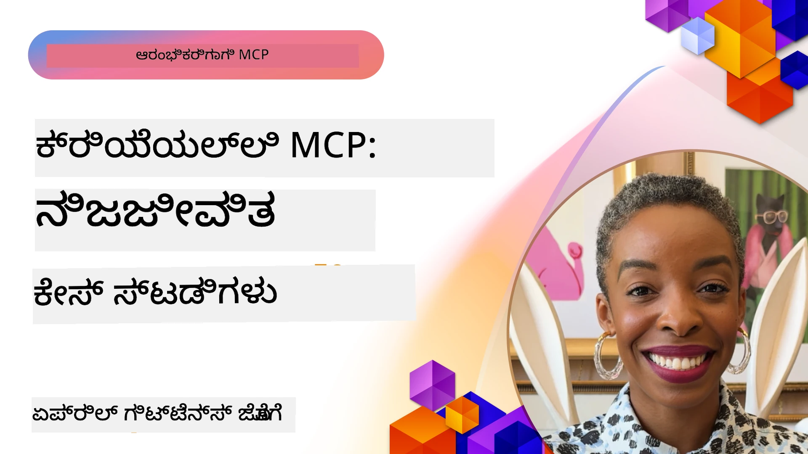

# ಎಂಗಳ MCP: ನಿಜವಾದ دنیا کے کیس مطالعات

_(ಈ ಪಾಠದ ವಿಡಿಯೋ ವೀಕ್ಷಿಸಲು ಮೇಲಿನ ಚಿತ್ರವನ್ನು ಕ್ಲಿಕ್ ಮಾಡಿ)_

ಮಾಡೆಲ್ ಕಾಂಟೆಕ್ಸ್ಟ್ ಪ್ರೋಟೋಕಾಲ್ (MCP) AI ಅಪ್ಲಿಕೇಶನ್‌ಗಳು ಡೇಟಾ, ಉಪಕರಣಗಳು ಮತ್ತು ಸೇವೆಗಳೊಂದಿಗೆ ಇಂಟರ್ಯಾಕ್ ಆಗುವ ರೀತಿಯನ್ನು ಪರಿವರ್ತಿಸುತ್ತಿದೆ. ಈ ವಿಭಾಗವು ವಿವಿಧ ಎಂಟರ್ಪ್ರೈಸ್ ಸನ್ನಿವೇಶಗಳಲ್ಲಿ MCP ನ ಪ್ರಾಯೋಗಿಕ ಅನ್ವಯಗಳನ್ನು ತೋರಿಸುವ ನಿಜವಾದ دنیا کے کیس مطالعاتವನ್ನು ನೀಡುತ್ತದೆ.

## ಅವಲೋಕನ

ಈ ವಿಭಾಗವು MCP ಅನುಷ್ಠಾನಗಳ ನೈಜ ಉದಾಹರಣೆಗಳನ್ನು ಪ್ರದರ್ಶಿಸುತ್ತದೆ, ಮತ್ತು ಸಂಸ್ಥೆಗಳು ಈ ಪ್ರೋಟೋಕಾಲ್ ಅನ್ನು ಸಂಕೀರ್ಣ ವ್ಯವಹಾರ ಸವಾಲುಗಳನ್ನು ಪರಿಹರಿಸಲು ಹೇಗೆ ಬಳಸುತ್ತಿದ್ದಾರೆ ಎಂದು ಹೈಲೈಟ್ ಮಾಡುತ್ತದೆ. ಈ کیس مطالعاتವನ್ನು ಪರಿಶೀಲಿಸುವ ಮೂಲಕ, ನೀವು ವಾಸ್ತವಿಕ ಪರಿಸ್ಥಿತಿಗಳಲ್ಲಿ MCP ನ ಬಹುಮಟ್ಟದ ಬಾಳಿಕೆ, ಪ್ರಮಾಣವರ್ಧನೆ ಮತ್ತು ಪ್ರಾಯೋಗಿಕ ಲಾಭಗಳ ಬಗ್ಗೆ ತಿಳಿವಳಿಕೆ ಪಡೆಯುತ್ತೀರಿ.

## ಮುಖ್ಯ ಅರಿವು ಗುರಿಗಳು

ಈ کیس مطالعاتವನ್ನು ಅನ್ವೇಷಿಸುವುದರಿಂದ ನೀವು:

- MCP ಬಳಸುವ ಮೂಲಕ ನಿರ್ದಿಷ್ಟ ವ್ಯವಹಾರ ಸಮಸ್ಯೆಗಳನ್ನು ಹೇಗೆ ಪರಿಹರಿಸಬಹುದು ಎಂಬುದನ್ನು ಅರ್ಥಮಾಡಿಕೊಳ್ಳುವಿರಿ
- ವಿಭಿನ್ನ ಇಂಟಿಗ್ರೇಶನ್ ಮಾದರಿಗಳು ಮತ್ತು ವಾಸ್ತುಶಿಲ್ಪ ದೃಷ್ಠಿಕೋಣಗಳನ್ನು ತಿಳಿಯುವಿರಿ
- ಎಂಟರ್ಪ್ರೈಸ್ ಪರಿಸರಗಳಲ್ಲಿ MCP ಅನುಷ್ಠಾನಕ್ಕಾಗಿ ಉತ್ತಮ ಅಭ್ಯಾಸಗಳನ್ನು ಗುರುತಿಸುವಿರಿ
- ನಿಜವಾದ دنیا کے ಅನುಷ್ಠಾನಗಳಲ್ಲಿ ಎದುರಿಸುವ ಸವಾಲುಗಳು ಮತ್ತು ಪರಿಹಾರಗಳ ಬಗ್ಗೆ ಅರಿವು ಪಡೆಯುವಿರಿ
- ನಿಮ್ಮ ಸ್ವಂತ ಯೋಜನೆಗಳಲ್ಲಿ ಇದರಂತೆಯೇ ಮಾದರಿಗಳನ್ನು ಅನ್ವಯಿಸುವ ಅವಕಾಶಗಳನ್ನು ಗುರುತಿಸುವಿರಿ

## ವಿಶೇಷ کیس مطالعات

### 1. [ಆಜೂರ್ AI ಯಾತ್ರಾ ಏಜೆಂಟ್ಸ್ – ಉಲ್ಲೇಖ ಅನುಷ್ಠಾನ](./travelagentsample.md)

ಈ کیس مطالعه ಮೈಕ್ರೋಸಾಫ್ಟ್‌ನ ಸಂಪೂರ್ಣ ಉಲ್ಲೇಖ ಪರಿಹಾರವನ್ನು ಪರೀಕ್ಷಿಸುತ್ತದೆ, ಇದು MCP, ಆಜೂರ್ OpenAI ಮತ್ತು ಆಜೂರ್ AI ಶೋಧನೆಯನ್ನು ಬಳಸಿ ಬಹು-ಏಜೆಂಟ್, AI ಚಾಲಿತ ಯಾತ್ರಾ ಯೋಜನೆ ಅಪ್ಲಿಕೇಶನ್ ನಿರ್ಮಿಸುವ ವಿಧಾನವನ್ನು ತೋರಿಸುತ್ತದೆ. ಯೋಜನೆಯು ಪ್ರದರ್ಶಿಸುತ್ತದೆ:

- MCP ಮೂಲಕ ಬಹು-ಏಜೆಂಟ್ ಸಂಯೋಜನೆ
- ಆಜೂರ್ AI ಶೋಧನಿಯೊಂದಿಗೆ ಎಂಟರ್ಪ್ರೈಸ್ ಡೇಟಾ ಏಕೀಕರಣ
- ಆಜೂರ್ ಸೇವೆಗಳ ಬಳಕೆಯಿಂದ ಭದ್ರ, ಪ್ರಮಾಣವರ್ಧಿತ ವಾಸ್ತುಶಿಲ್ಪ
- ಪುನಃಬಳಕೆ ಮಾಡಲು ಸಾಧ್ಯವಿರುವ MCP ಘಟಕಗಳೊಂದಿಗೆ ವಿಸ್ತರಣೀಯ ಉಪಕರಣಗಳು
- ಆಜೂರ್ OpenAI ನಿಂದ ಚಾಲಿತ ಸಂವಾದಾತ್ಮಕ ಬಳಕೆದಾರ ಅನುಭವ

ವಾಸ್ತುಶಿಲ್ಪ ಮತ್ತು ಅನುಷ್ಠಾನ ವಿವರಗಳು MCP ಸಹ ಸಂಯೋಜನಾ ಹಂತವಾಗಿ ಬಳಸಿಕೊಂಡು ಸಂಕೀರ್ಣ, ಬಹು-ಏಜೆಂಟ್ ವ್ಯವಸ್ಥೆಗಳ ನಿರ್ಮಾಣದ ಮೇಲೆ ಅಮೂಲ್ಯ ವಿವರಣೆಗಳನ್ನು ನೀಡುತ್ತವೆ.

### 2. [YouTube ಡೇಟಾ ಮೂಲದಿಂದ ಆಜೂರ್ ಡೆವ್ಓಪ್ಸ್ ಐಟಂಗಳ ನವೀಕರಣ](./UpdateADOItemsFromYT.md)

ಈ کیس مطالعه ಕಾರ್ಯಪ್ರವಾಹಗಳನ್ನು ಸ್ವಯಂಚಾಲಿತಗೊಳಿಸುವುದಕ್ಕಾಗಿ MCP ಯನ್ನು ಪ್ರಾಯೋಗಿಕವಾಗಿ ಹೇಗೆ ಬಳಸಬಹುದು ಎಂಬುದನ್ನು ತೋರಿಸುತ್ತದೆ. ಇದು MCP ಉಪಕರಣಗಳನ್ನು ಹೇಗೆ ಬಳಸಬಹುದು ಎಂದು ತೋರಿಸುತ್ತದೆ:

- ಆನ್ಲೈನ್ ವೇದಿಕೆ (YouTube)ಗಳಿಂದ ಡೇಟಾವನ್ನು ತೆಗೆಯುವುದು
- ಆಜೂರ್ ಡೆವ್ಓಪ್ಸ್ ವ್ಯವಸ್ಥೆಗಳ ಕಾರ್ಯ ಐಟಂಗಳನ್ನು ನವೀಕರಿಸುವುದು
- ಪುನರಾವರ್ತಿತ ಸ್ವಯಂಕ್ರಮಿತ ಕಾರ್ಯಚಟುವಟಿಕೆಗಳನ್ನು ರಚಿಸುವುದು
- ವಿಭಿನ್ನ ವ್ಯವಸ್ಥೆಗಳ ನಡುವೆ ಡೇಟಾವನ್ನು ಏಕೀಕರಿಸುವುದು

ಈ ಉದಾಹರಣೆ ಸರಳ MCP ಅನುಷ್ಠಾನಗಳು ಸಹ ನಿಯಮಿತ ಕಾರ್ಯಗಳನ್ನು ಸ್ವಯಂಚಾಲಿತಗೊಳಿಸುವ ಮೂಲಕ ವ್ಯವಸ್ಥೆಗಳಾದ್ಯಂತ ಡೇಟಾ ಸುತ್ತಲೂ ಸಮರ್ಪಕತೆ ಹೆಚ್ಚಿಸುವುದರ ಮೂಲಕ ಸಾಕಷ್ಟು ದಕ್ಷತೆಯನ್ನು ನೀಡಬಹುದು ಎಂಬುದನ್ನು ವಿವರಿಸುತ್ತದೆ.

### 3. [MCP ಮೂಲಕ ರಿಯಲ್-ಟೈಮ್ ಡಾಕ್ಯುಮೆಂಟೇಶನ್ ಹಿಂತೆಗೆದುಕೊಳ್ಳುವುದು](./docs-mcp/README.md)

ಈ کیس مطالعه Python ಕಾನ್ಸೋಲ್ ಕ್ಲೈಂಟ್ ಅನ್ನು ಮಾದೆಲ್ ಕಾಂಟೆಕ್ಸ್ಟ್ ಪ್ರೋಟೋಕಲ್ (MCP) ಸರ್ವರ್‌ಗೆ ಸಂಪರ್ಕಿಸುವದು ಮತ್ತು ನೈಜ ಸಮಯ, ಸಂದರ್ಭ-ಬುದ್ಧಿವಂತಿಕೆಯ Microsoft ಡಾಕ್ಯುಮೆಂಟೇಶನ್ ಪಡೆಯುವುದನ್ನು ಮತ್ತು ಲಾಗ್ ಮಾಡುವುದನ್ನು ಮಾರ್ಗದರ್ಶನ ಮಾಡುತ್ತದೆ. ನೀವು ಕಲಿಯುತ್ತೀರಿ:

- Python ಕ್ಲೈಂಟ್ ಮತ್ತು ಅಧಿಕೃತ MCP SDK ಬಳಸಿ MCP ಸರ್ವರ್‌ಗೆ ಸಂಪರ್ಕಿಸುವುದು
- ವೈಫ್‌ಲಿಯೋ ವೆಬ್‌ ಕ್ಲೈಂಟುಗಳ ಮೂಲಕ ಪರಿಣಾಮಕಾರಿಯಾದ ನೈಜ-ಸಮಯ ಡೇಟಾ ಹಿಂತೆಗೆದುಕೊಳ್ಳುವುದು
- ಸರ್ವರ್‌ನಲ್ಲಿರುವ ಡಾಕ್ಯುಮೆಂಟೇಶನ್ ಉಪಕರಣಗಳನ್ನು ಕರೆ ಮಾಡಲು ಮತ್ತು ಪ್ರತಿಕ್ರಿಯೆಗಳನ್ನು ನೇರವಾಗಿ ಕಾನ್ಸೋಲ್‌ಗೆ ಲಾಗ್ ಮಾಡಲು
- ಟರ್ಮಿನಲ್ ಬಿಟ್ಟು ಹೋಗದೇ ನವೀಕೃತ Microsoft ಡಾಕ್ಯುಮೆಂಟೇಶನ್ ನಿಮ್ಮ ಕಾರ್ಯಪಥದಲ್ಲಿ ಸೇರಿಸುವುದು

ಈ ಅಧ್ಯಾಯದಲ್ಲಿ ಕೈಗಾಗುವ ಒಂದು ಆಕ್ರಮಿಕ ಅಭ್ಯಾಸ, ಒಂದು ಕಡಿಮೆ ಕೆಲಸ ಮಾಡುವ ಕೋಡ್ ಮಾದರಿ ಮತ್ತು ಹೆಚ್ಚಿನ ತಿಳಿವಳಿಕೆಗಾಗಿ ಹೆಚ್ಚುವರಿ ಸಂಪನ್ಮೂಲಗಳ ಲಿಂಕ್‌ಗಳು ಸೇರಿವೆ. MCP ಡಾಕ್ಯುಮೆಂಟೇಶನ್ ಪ್ರವೇಶ ಮತ್ತು ಡೆವಲಪರ್ ಉತ್ಪಾದಕತೆಯಲ್ಲಿ ಕಾನ್ಸೋಲ್ ಆಧಾರಿತ ಪರಿಸರಗಳಲ್ಲಿ ಹೇಗೆ ಬದಲಾವಣೆ ತಂದಿತು ಎಂದು ಸಂಪೂರ್ಣ ಮಾರ್ಗದರ್ಶನ ಮತ್ತು ಕೋಡ್ ಅನ್ನು ಲಿಂಕ್ ಮಾಡಲಾದ ಅಧ್ಯಾಯದಲ್ಲಿ ನೋಡಿ.

### 4. [MCP ಜೊತೆಗೆ ಇಂಟರ್ಯಾಕ್ಟಿವ್ ಅಧ್ಯಯನ ಯೋಜನೆ ಜನರೇಟರ್ ವೆಬ್ ಅಪ್ಲಿಕೇಶನ್](./docs-mcp/README.md)

ಈ کیس مطالعه Chainlit ಮತ್ತು ಮಾದೆಲ್ ಕಾಂಟೆಕ್ಸ್ಟ್ ಪ್ರೋಟೋಕಾಲ್ (MCP) ಬಳಸಿ ಯಾವುದೇ ವಿಷಯಕ್ಕಾಗಿ ವೈಯಕ್ತಿಕ ಅಧ್ಯಯನ ಯೋಜನೆಗಳನ್ನು ರಚಿಸುವ ಇಂಟರ್ಯಾಕ್ಟಿವ್ ವೆಬ್ ಅಪ್ಲಿಕೇಶನ್ ನಿರ್ಮಿಸುವುದು ಹೇಗೆ ಎಂದು ತೋರಿಸುತ್ತದೆ. ಬಳಕೆದಾರರು ವಿಷಯವನ್ನು (ಉದಾ. "AI-900 ಪ್ರಮಾಣೀಕರಣ") ಮತ್ತು ಅಧ್ಯಯನ ಅವಧಿಯನ್ನು (ಉದಾ. 8 ವಾರಗಳು) ನಿರ್ದಿಷ್ಟಮಾಡಬಹುದು ಮತ್ತು ಅಪ್ಲಿಕೇಶನ್ ವಾರಕ್ಕೆ ವಾರಕ್ಕೆ ಶಿಫಾರಸು ಮಾಡಿದ ವಿಷಯಗಳ ವಿಭಾಗವನ್ನು ಒದಗಿಸುತ್ತದೆ. Chainlit ಸಂವಾದಾತ್ಮಕ ಚಾಟ್ ಇಂಟರ್ಫೇಸ್ ಅನ್ನು ಸಕ್ರೀಯಗೊಳಿಸುತ್ತದೆ, ಅನುಭವವನ್ನು ಆಕರ್ಷಕ ಮತ್ತು ಹೊಂದಿಕೊಳ್ಳುವಂತೆ ಮಾಡುತ್ತದೆ.

- Chainlit ನಿಂದ ಚಾಲಿತ ಸಂವಾದಾತ್ಮಕ ವೆಬ್ ಅಪ್ಲಿಕೇಶನ್
- ವಿಷಯ ಮತ್ತು ಅವಧಿಗಾಗಿ ಬಳಕೆದಾರ ಚಾಲಿತ ಪ್ರಾಂಪ್ಟುಗಳು
- MCP ಬಳಸಿ ವಾರಕ್ಕೆ ವಾರಕ್ಕೆ ವಿಷಯ ಶಿಫಾರಸುಗಳು
- ಸಂವಾದಾತ್ಮಕ ಇಂಟರ್ಫೇಸ್‌ನಲ್ಲಿ ನೈಜ-ಸಮಯ, ಹೊಂದಿಕೊಳ್ಳುವ ಪ್ರತಿಕ್ರಿಯೆಗಳು

ಈ ಯೋಜನೆ ಸಂವಾದಾತ್ಮಕ AI ಮತ್ತು MCP ನ ಸಂಯೋಜನೆ ಮೂಲಕ ಆಧುನಿಕ ವೆಬ್ ವಾತಾವರಣದಲ್ಲಿ ಜೀವಂತ, ಬಳಕೆದಾರ ನಿಯಂತ್ರಿತ ಶೈಕ್ಷಣಿಕ ಸಾಧನಗಳನ್ನು ರಚಿಸಬಹುದು ಎಂದು ತೋರಿಸುತ್ತದೆ.

### 5. [VS ಕೋಡ್‌ನಲ್ಲಿನ ಎಡಿಟರ್ Docs MCP ಸರ್ವರ್ ಜೊತೆಗೆ](./docs-mcp/README.md)

ಈ کیس مطالعه MCP ಸರ್ವರ್ ಬಳಸಿ Microsoft Learn Docs ಅನ್ನು ನಿಮ್ಮ VS ಕೋಡ್ ವಾತಾವರಣಕ್ಕೆ ನೇರವಾಗಿ ಹೇಗೆ ತರುತ್ತೀರೋ ಎಂದು ತೋರಿಸುತ್ತದೆ—ಬ್ರೌಸರ್ ಟ್ಯಾಬ್‌ಗಳನ್ನು ಬದಲಾಯಿಸಬೇಕಾಗಿಲ್ಲ! ನೀವು ಕೆಳಕಂಡ ಪದಗಳನ್ನು ಗಮನಿಸುತ್ತಿರಿ:

- MCP ಪ್ಯಾನೆಲ್ ಅಥವಾ ಕಮಾಂಡ್ ಪ್ಯಾಲೆಟ್ ಬಳಸಿ VS ಕೋಡ್‌ನಲ್ಲಿ ತಕ್ಷಣವೇ ಡಾಕ್ಯುಮೆಂಟ್‌ಗಳನ್ನು ಹುಡುಕಿ ಓದುವುದು
- ಅಪ್-ಡಾಕ್ಯುಮೆಂಟೇಶನ್ ಅನ್ನು ಉಲ್ಲೇಖಿಸಬೇಕು ಮತ್ತು README ಅಥವಾ ಕೋರ್ಸ್ ಮಾರ್ಕ್‌ಡೌನ್ ಫೈಲ್‌ಗಳಲ್ಲಿ ನೇರವಾಗಿ ಲಿಂಕ್ ಸೇರಿಸುವುದು
- GitHub Copilot ಮತ್ತು MCP ನ ಸಂಯೋಜನೆ ಮೂಲಕ ತುಸು AI ಚಾಲಿತ ಡಾಕ್ಯುಮೆಂಟೇಶನ್ ಮತ್ತು ಕೋಡ್ ಕಾರ್ಯಪ್ರವಾಹಗಳು
- ನೈಜ-ಸಮಯ ಪ್ರತಿಕ್ರಿಯೆ ಮತ್ತು Microsoft ಮೂಲದ ಶುದ್ಧತೆಯಿಂದ ಡಾಕ್ಯುಮೆಂಟೇಶನ್ ಪರಿಶೀಲನೆ ಮತ್ತು ಸುಧಾರಣೆ
- ನಿರಂತರ ಡಾಕ್ಯುಮೆಂಟೇಶನ್ ಪರಿಶೀಲನೆಗೆ GitHub ಕಾರ್ಯಚಟುವಟಿಕೆಗಳ ಜೊತೆ MCP ಅನ್ನು ಏಕೀಕರಿಸುವುದು

ಅನುಷ್ಠಾನದೊಳಗೊಂಡಿವೆ:

- ಸುಲಭ ಸೆಟಪ್ಿಗಾಗಿ `.vscode/mcp.json` ಅನ್ನು ಉದಾಹರಣೆ ಸಂರಚನೆ
- ಎಡಿಟರ್ ಅನುಭವದ ಸ್ಕ್ರೀನ್ಶಾಟ್ ಚಾಲನೆಯೊಂದಿಗೆ ಮಾರ್ಗದರ್ಶನ
- ಗರಿಷ್ಠ ಉತ್ಪಾದಕತೆಗಾಗಿ Copilot ಮತ್ತು MCP ಸಂಯೋಜನೆಗೆ ಸಲಹೆಗಳು

ಈ ಪರಿಸ್ಥಿತಿಯು ಕೋರ್ಸ್ ಲೇಖಕರು, ಡಾಕ್ಯುಮೆಂಟೇಶನ್ ಬರಹಗಾರರು ಮತ್ತು ಡೆವಲಪರ್‌ಗಳಿಗೆ ಸೂಕ್ತವಾಗಿದೆ, ಡಾಕ್ಸ್, Copilot ಮತ್ತು ಪರಿಶೀಲನಾ ಉಪಕರಣಗಳೊಂದಿಗೆ ಕೆಲಸ ಮಾಡುವಾಗಲೇ ತಮ್ಮ ಎಡಿಟರ್‌ನಲ್ಲಿ ಕೈಗೊಳ್ಳಲು ಇಚ್ಛಿಸುವವರಿಗೆ.

### 6. [APIM MCP ಸರ್ವರ್ ರಚನೆ](./apimsample.md)

ಈ کیس مطالعه Azure API Management (APIM) ಬಳಸಿ MCP ಸರ್ವರ್ ಅನ್ನು ಹೇಗೆ ಕ್ರಮಾಶಃ ರಚಿಸುವುದು ಎಂಬ ಸೂಚನಾ ಕ್ರಮವನ್ನು ನೀಡುತ್ತದೆ. ಇದು ಒಳಗೊಂಡಿದೆ:

- Azure API Management ನಲ್ಲಿ MCP ಸರ್ವರ್ ಸೆಟ್‌ಅಪ್ ಮಾಡುವುದು
- MCP ಉಪಕರಣಗಳಾಗಿ API ಕಾರ್ಯಾಚರಣೆಗಳನ್ನು ಬಾಹ್ಯಗೊಳಿಸುವುದು
- ದರ ನಿಯಂತ್ರಣ ಮತ್ತು ಭದ್ರತೆಯ ಪpolicyಗಳು ಸಂರಚಿಸುವುದು
- Visual Studio Code ಮತ್ತು GitHub Copilot ಬಳಸಿ MCP ಸರ್ವರ್ ಪರೀಕ್ಷೆ ಮಾಡುವುದು

ಈ ಉದಾಹರಣೆaye Azure ಶಕ್ತಿಗಳನ್ನು ಈ MCP ಸರ್ವರನ್ನು ರಚಿಸಲು ಹೇಗೆ ಬಳಸಬಹುದೆಂದು ಸ_h_ೂಪಿಸುತ್ತದೆ, ಇದರಿಂದ ಎಐ ವ್ಯವಸ್ಥೆಗಳನ್ನು ಎಂಟರ್ಪ್ರೈಸ್ API ಗಳೊಂದಿಗೆ ಏಕರೂಪಗೊಳಿಸುವಿಕೆ ಹೆಚ್ಚಾಗುತ್ತದೆ.

### 7. [GitHub MCP ರೆಜಿಸ್ಟ್ರಿ — ಏಜೆಂಟಿಕ್ ಏಕೀಕರಣ ವೇಗವರ್ಧನೆ](https://github.com/mcp)

ಈ کیس مطالعه GitHub ನ MCP ರೆಜಿಸ್ಟ್ರಿ, 2025 ರ ಸೆಪ್ಟಂಬರಿನಲ್ಲಿ लॉन्च್ ಆದವು, AI ಪರಿಸರದಲ್ಲಿ ಗಂಭೀರ ಸವಾಲಿನ ಪರಿಹಾರವನ್ನು ಸಂಖ್ಯಿಸುವುದು: ಮಾಡೆಲ್ ಕಾಂಟೆಕ್ಸ್ಟ್ ಪ್ರೋಟೋಕಾಲ್ (MCP) ಸರ್ವರ್‌ಗಳ ವಿಭಜಿತ ಹುಡುಕಾಟ ಮತ್ತು ನಿಯೋಜನೆ.

#### ಅವಲೋಕನ

**MCP ರೆಜಿಸ್ಟ್ರಿ** ಬೇಸರಕರವಾಗಿದ್ದ MCP ಸರ್ವರ್‌ಗಳು ರೆಪೊಗಳ ಮತ್ತು ರೆಜಿಸ್ಟ್ರಿಯ ಮೂಲಕ ಚರಕವಾಗಿ ವಿಸ್ತಾರವಾಗಿರುವ ಸಮಸ್ಯೆಯನ್ನು ಪರಿಹರಿಸುತ್ತದೆ, ಇದೇ ಕಾರಣದಿಂದ ಇಂಟಿಗ್ರೇಶನ್ ನಿಧಾನ ಮತ್ತು ತಪ್ಪುಸಹಿತವಾಗಿತ್ತು. ಇವು AI ಏಜೆಂಟ್‌ಗಳಿಗೆ APIs, ಡೇಟಾಬೇಸ್‌ಗಳು ಮತ್ತು ಡಾಕ್ಯುಮೆಂಟೇಶನ್ ಮೂಲಗಳೊಂದಿಗೆ ಸಂವಹನ ಮಾಡಲು ಸಹಾಯ ಮಾಡುತ್ತವೆ.

#### ಸಮಸ್ಯೆ ಹೇಳಿಕೆ

ಏಜೆಂಟಿಕ್ ಕಾರ್ಯಪ್ರವಾಹ ನಿರ್ಮಾತೃಗಳು ಅನೇಕ ಸವಾಲುಗಳನ್ನು ಎದುರಿಸಿದ್ದರು:
- ವಿವಿಧ ವೇದಿಕೆಗಳಲ್ಲಿ MCP ಸರ್ವರ್‌ಗಳು ಕಮ್ಮಿ ಹುಡುಕಲ್ಪಡುವುದು
- ಫೋರಂಗಳಲ್ಲಿ ಮತ್ತು ಡಾಕ್ಯುಮೆಂಟೇಶನ್‌ನಲ್ಲಿ ಅವಶ್ಯಕತೆಯಾಗಿ ಸಿಗುವ ಹೆಚ್ಚುವರಿ ಸೆಟ್‌ಅಪ್ ಪ್ರಶ್ನೆಗಳು
- ಪರಿಶೀಲನೆಯಿಲ್ಲದ ಮತ್ತು ನಂಬಿಗಸ್ತವಲ್ಲದ ಮೂಲಗಳಿಂದ ಭದ್ರತಾ ಅಪಾಯಗಳು
- ಸರ್ವರ್ ಗುಣಮಟ್ಟ ಮತ್ತು ಸಾಮರಸ್ಯಕ್ಕೆ ಮಾನದಂಡಗಳ ಕೊರತೆ

#### ಪರಿಹಾರ ವಾಸ್ತುಶಿಲ್ಪ

GitHub ನ MCP ರೆಜಿಸ್ಟ್ರಿ ನಂಬಿಗಸ್ತ MCP ಸರ್ವರ್‌ಗಳನ್ನು ಕೇಂದ್ರೀಕರಿಸುತ್ತದೆ ಮುಖ್ಯ ಲಕ್ಷಣಗಳೊಂದಿಗೆ:
- VS Code ಮೂಲಕ ಒತ್ತೂ ಮೌಂಟ್ ಅನ್ನು ಒದಗಿಸುವ ಒನ್-ಕ್ಲಿಕ್ ಇನ್‌ಸ್ಟಾಲ್
- ನಕ್ಷತ್ರಗಳು, ಚಟುವಟಿಕೆ ಮತ್ತು ಸಮುದಾಯ ಪರಿಶೀಲನೆಯ ಮೂಲಕ ಶಬ್ದದಲ್ಲಿ ಸಂಕೇತ ವಿಂಗಡಣೆ
- GitHub Copilot ಮತ್ತು ಇತರ MCP-ಹೊಂದಿಕೆಯಾಗುವ ಟೂಲ್ಗಳೊಂದಿಗೆ ನೇರ ಒದಗಿಸುವಿಕೆ
- ಸಮುದಾಯ ಮತ್ತು ಎಂಟರ್ಪ್ರೈಸ್ ಪಾಲುದಾರರು ಕೊಡುಗೆ ನೀಡಲಾರ್ದಂತೆ ತೆರೆಯಾದ ಕೊಡುಗೆ ಮಾದರಿ

#### ವ್ಯವಹಾರ ಪರಿಣಾಮ

ರೆಜಿಸ್ಟ್ರಿಯು ಅಳತೆಯಾದ ಸುಧಾರಣೆಗಳನ್ನು ನೀಡಿದೆ:
- ಮೈಕ್ರೋಸಾಫ್ಟ್ ಲರ್ನ್ MCP ಸರ್ವರ್ ಮಾದರಿಯನ್ನು ಬಳಸಿ ಅಭಿವೃದ್ಧಿಪಡಿಸುವವರಿಗೆ ವೇಗವಾಗಿ ಓಡಾಟ
- `github-mcp-server` ಹೋಲುವ ವಿಶೇಷ ಸರ್ವರ್‌ಗಳ ಮೂಲಕ ಉತ್ತಮ ಉತ್ಪಾದಕತೆ (ಸ್ವಾಭಾವಿಕ ಭಾಷೆ GitHub ಸ್ವಯಂಚಾಲನೆ)
- ಶುದ್ಧವಾಗಿ ಆಯ್ಕೆ ಮಲಿಬಂದಣೆ ಮತ್ತು ಪಾರದರ್ಶಕ ಸಂರಚನೆ ನಿಲುವುಗಳಿಂದ ಬಲವಾದ ಪರಿಸರ ನಂಬಿಕೆ

#### ತಂತ್ರಾತ್ಮಕ ಮೌಲ್ಯ

ಏಜೆಂಟ್ ಜೀವನಚಕ್ರ ನಿರ್ವಹಣೆ ಮತ್ತು ಪುನರಾವರ್ತನೀಯ ಕಾರ್ಯಪ್ರವಾಹಗಳ ತಜ್ಞರಾಗಿ, MCP ರೆಜಿಸ್ಟ್ರಿ ಒದಗಿಸುತ್ತದೆ:
- ಮಾನಕ ಘಟಕಗಳೊಂದಿಗೆ ಮೂಲಭೂತ ಏಜೆಂಟ್ ನಿಯೋಜನೆ ಸಾಮರ್ಥ್ಯಗಳು
- ನಿರಂತರ ಪರೀಕ್ಷೆ ಮತ್ತು ಪರಿಶೀಲನೆಗೆ ರೆಜಿಸ್ಟ್ರಿ ಬೆಂಬಲಿತ ಮೌಲ್ಯಮಾಪನ ಪೈಪ್ಲೈನ್ಗಳು
- ವಿಭಿನ್ನ AI ವೇದಿಕೆಗಳ ನಡುವೆ ಸಲೀಸಾದ ಇಂಟಿಗ್ರೇಶನ್ ಸಾಧ್ಯವಾಗುವ ಕ್ರಾಸ್-ಟೂಲ್ ಪರಸ್ಪರಸಂವಹನ

ಈ کیس مطالعه MCP ರೆಜಿಸ್ಟ್ರಿ ಕೇವಲ ಡೈರೆಕ್ಟರಿ ಮಾತ್ರವಲ್ಲ, ಆದರೆ ವ್ಯಾಪಕ, ನಿಜವಾದ ನೇರ ಮಾದರೀಚರ್ಚೆ ಮತ್ತು ಏಜೆಂಟಿಕ್ ವ್ಯವಸ್ಥೆ ನಿಯೋಜನೆಯ ನೆಲೆಯಾಗಿದೆ ಎಂದು ತೋರಿಸುತ್ತದೆ.

## ಸಮಾರೋಪ

ಈ ಏಳು ಸಮಗ್ರ کیس مطالعه‌ಗಳು ಮಾಡೆಲ್ ಕಾಂಟೆಕ್ಸ್ಟ್ ಪ್ರೋಟೋಕಾಲ್‌ನ ವೈವಿಧ್ಯಮಯತೆ ಮತ್ತು ವಾಸ್ತವಿಕ ಅನ್ವಯಗಳನ್ನು ವಿಸ್ತೃತವಾಗಿ ತೋರಿಸುತ್ತವೆ. ಸಂಕೀರ್ಣ ಬಹು-ಏಜೆಂಟ್ ಯಾತ್ರಾ ಯೋಜನೆ ವ್ಯವಸ್ಥೆಗಳಿನಿಂದ ಆರಂಭಿಸಿ ಎಂಟರ್ಪ್ರೈಸ್ API ನಿರ್ವಹಣೆ, ಸರಳ ಡಾಕ್ಯುಮೆಂಟೇಶನ್ ಕಾರ್ಯಪ್ರವಾಹಗಳವರೆಗೆ ಮತ್ತು ಕ್ರಾಂತಿಕಾರಿ GitHub MCP ರೆಜಿಸ್ಟ್ರಿ‌ವರೆಗೆ, ಈ ಉದಾಹರಣೆಗಳು MCP ಹೇಗೆ ಅವಿಭಾಜ್ಯ, ಪ್ರಮಾಣವರ್ಧಿತ ಮಾರ್ಗದಲ್ಲಿ AI ವ್ಯವಸ್ಥೆಗಳನ್ನ ದತ್ತಗೊಳ್ಳುವ ಉಪಕರಣಗಳು, ಡೇಟಾ ಮತ್ತು ಸೇವೆಗಳೊಂದಿಗೆ ಸಂಯೋಜಿಸುವುದು ಎಂದು ಪ್ರದರ್ಶಿಸುತ್ತವೆ.

ಕೆಲವು MCP ಅನುಷ್ಠಾನಗಳ ಆಯಾಮಗಳು:
- **ಎಂಟರ್ಪ್ರೈಸ್ ಏಕೀಕರಣ**: ಆಜೂರ್ API ನಿರ್ವಹಣೆ ಮತ್ತು ಆಜೂರ್ ಡೆವ್ಓಪ್ಸ್ ಸ್ವಯಂಕ್ರಿಯೆ
- **ಬಹು-ಏಜೆಂಟ್ ಸಂಯೋಜನೆ**: ಒಕ್ಕೂಟ AI ಏಜೆಂಟ್ ಗಳೊಂದಿಗೆ ಯಾತ್ರಾ ಯೋಜನೆ
- **ಡೆವಲಪರ್ ಉತ್ಪಾದಕತೆ**: VS ಕೋಡ್ ಇಂಟಿಗ್ರೇಶನ್ ಮತ್ತು ನೈಜ-ಸಮಯ ಡಾಕ್ಯುಮೆಂಟೇಶನ್ ಪ್ರವೇಶ
- **ಪರಿಸರ ಅಭಿವೃದ್ಧಿ**: GitHub MCP ರೆಜಿಸ್ಟ್ರಿ ಮೂಲಭೂತ ವೇದಿಕೆ ರೂಪದಲ್ಲಿ
- **ಶೈಕ್ಷಣಿಕ ಅನ್ವಯಗಳು**: ಇಂಟರ್ಯಾಕ್ಟಿವ್ ಅಧ್ಯಯನ ಯೋಜನೆ ಜನರೇಟರ್‌ಗಳು ಮತ್ತು ಸಂವಾದಾತ್ಮಕ ಇಂಟರ್ಫೇಸ್ಗಳು

ಈ ಅನುಷ್ಠಾನಗಳನ್ನು ಅಧ್ಯಯನಮಾಡಿ, ನೀವು ಪ್ರಮುಖ ಅರಿವು ಪಡೆಯುತ್ತೀರಿ:
- ವಿಭಿನ್ನ ಪ್ರಮಾಣಗಳು ಮತ್ತು ಉಪಯೋಗದ ಮೇಲೆ ಆಧಾರಿತ ವಾಸ್ತುಶಿಲ್ಪ ಮಾದರಿಗಳು
- ಕಾರ್ಯಕ್ಷಮತೆ ಮತ್ತು ನಿರ್ವಹಣೀಯತೆಯ ಸಮತೋಲನ ಸಾಧಿಸುವ ಅನುಷ್ಠಾನ ತಂತ್ರಗಳು
- ಉತ್ಪಾದನಾ ನಿಯೋಜನೆಗಾಗಿ ಭದ್ರತೆ ಮತ್ತು ಪ್ರಮಾಣವರ್ಧನೆ ಪರಿಗಣನೆಗಳು
- MCP ಸರ್ವರ್ ಅಭಿವೃದ್ಧಿ ಮತ್ತು ಕ್ಲೈಂಟ್ ಇಂಟಿಗ್ರೇಶನ್‌ಗೆ ಉತ್ತಮ ಅಭ್ಯಾಸಗಳು
- ಪರಸ್ಪರ ಸಂಬಂಧಿತ AI-ಚಾಲಿತ ಪರಿಹಾರಗಳ ನಿರ್ಮಾಣಕ್ಕಾಗಿ ಪರಿಸರ ಚಿಂತನ

ಈ ಉದಾಹರಣೆಗಳು ಒಟ್ಟಾರೆ MCP ಕೇವಲ ತತ್ತ್ವೋಪದೇಶವಾಗಿ ಅಲ್ಲ, ಆದರೆ ಸಂಕೀರ್ಣ ವ್ಯವಹಾರ ಸವಾಲುಗಳಿಗೆ ಪ್ರಾಯೋಗಿಕ ಪರಿಹಾರಗಳನ್ನು ಒದಗಿಸುವ ಸಿದ್ಧ ಮತ್ತು ಉತ್ಪಾದನಾ-ಸಿದ್ಧ ಪ್ರೋಟೋಕಾಲ್ ಎಂದು ತೋರಿಸುತ್ತವೆ. ನೀವು ಸರಳ ಸ್ವಯಂಚಾಲಿತ ಉಪಕರಣಗಳನ್ನು ನಿರ್ಮಿಸುತ್ತಿರಲೇಲಿ ಅಥವಾ ನಿಖರವಾದ ಬಹು-ಏಜೆಂಟ್ ವ್ಯವಸ್ಥೆಗಳನ್ನು ನಿರ್ಮಿಸುತ್ತಿರಲೇಲಿ, ಇಲ್ಲಿ ಚಿತ್ರಿತ ಮಾದರಿ ಮತ್ತು ವಿಧಾನಗಳು ನಿಮ್ಮ ಸ್ವಂತ MCP ಯೋಜನೆಗಳಿಗೆ ದೃಢ ತಳವನ್ನು ಒದಗಿಸುತ್ತವೆ.

## ಹೆಚ್ಚುವರಿ ಸಂಪನ್ಮೂಲಗಳು

- [ಆಜೂರ್ AI ಯಾತ್ರಾ ಏಜೆಂಟ್ಸ್ GitHub ಸಂಗ್ರಹಯಾಗು](https://github.com/Azure-Samples/azure-ai-travel-agents)
- [ಆಜೂರ್ ಡೆವ್ಓಪ್ಸ್ MCP ಉಪಕರಣ](https://github.com/microsoft/azure-devops-mcp)
- [ಪ್ಲೇ ರೈಟ್ MCP ಉಪಕರಣ](https://github.com/microsoft/playwright-mcp)
- [Microsoft Docs MCP ಸರ್ವರ್](https://github.com/MicrosoftDocs/mcp)
- [GitHub MCP ರೆಜಿಸ್ಟ್ರಿ — ಏಜೆಂಟಿಕ್ ಏಕೀಕರಣ ವೇಗವರ್ಧನೆ](https://github.com/mcp)
- [MCP ಸಮುದಾಯ ಉದಾಹರಣೆಗಳು](https://github.com/microsoft/mcp)

## ಮುಂದಿನ ಪಾಠ

- ಹಿಂದಿನ: [ಮೊಡ್ಯೂಲ್ 8: ಉತ್ತಮ ಅಭ್ಯಾಸಗಳು](../08-BestPractices/README.md)
- ಮುಂದಿನ: [ಮೊಡ್ಯೂಲ್ 10: AI ಕಾರ್ಯಪ್ರವಾಹಗಳನ್ನು ಸುಗಮಗೊಳಿಸುವುದು: AI ಉಪಕರಣಗಳೊಂದಿಗೆ MCP ಸರ್ವರ್ ನಿರ್ಮಾಣ](../10-StreamliningAIWorkflowsBuildingAnMCPServerWithAIToolkit/README.md)

---

<!-- CO-OP TRANSLATOR DISCLAIMER START -->
**ಅನಧಿಕೃತ ಪ್ರಕಟಣೆ**:  
ಈ ಡಾಕ್ಯುಮೆಂಟ್ ಅನ್ನು AI ಅನುವಾದ ಸೇವೆ [Co-op Translator](https://github.com/Azure/co-op-translator) ಬಳಸಿ ಅನುವಾದಿಸಲಾಗಿದೆ. ನಾವು ಶುದ್ಧತೆಯಿಂದ ಕೆಲಸ ಮಾಡಲು ಪ್ರಯತ್ನಿಸುತ್ತಿದ್ದರೂ, ಸ್ವಯಂಚಾಲಿತ ಅನುವಾದಗಳಲ್ಲಿ ತಪ್ಪುಗಳು ಅಥವಾ ಅಸತ್ಯತೆಗಳು ಇರಬಹುದು ಎಂದು ದಯವಿಟ್ಟು ಗಮನಿಸಿ. ಮೂಲ ಡಾಕ್ಯುಮೆಂಟ್ ಅದರ ಮೂಲ ಭಾಷೆಯಲ್ಲಿರುವದು ಅಧಿಕೃತ ಪ್ರಾಮಾಣಿಕ ಮೂಲವೆಂದು ಪರಿಗಣಿಸಬೇಕು. ಪ್ರಮುಖ ಮಾಹಿತಿಗಾಗಿ, ವೃತ್ತಿಪರ ಮಾನವ ಅನುವಾದವನ್ನು ಶಿಫಾರಸು ಮಾಡಲಾಗುತ್ತದೆ. ಈ ಅನುವಾದ ಬಳಕೆಯಿಂದ ಉಂಟಾಗುವ ಯಾವುದೇ ಅಪವ್ಯಾಖ್ಯಾನ ಅಥವಾ ತಪ್ಪು ಅರ್ಥಮಾಡಿಕೊಳ್ಳುವುದಕ್ಕೆ ನಾವು ಜವಾಬ್ದಾರರಾಗಿಲ್ಲ.
<!-- CO-OP TRANSLATOR DISCLAIMER END -->