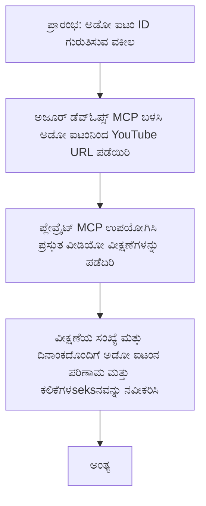

# ಕೇಸ್ ಅಧ್ಯಯನ: YouTube ಡೇಟಾದಿಂದ MCP ಮೂಲಕ Azure DevOps ಐಟಂಗಳನ್ನು ನವೀಕರಿಸುವುದು

> **ಅಸ್ವೀಕರಣ:** YouTube ಹಿನ್ನಡೆಯಂತಹ ವೇದಿಕೆಗಳಿಂದ ಡೇಟಾವನ್ನು ಬಳಸಿಕೊಂಡು Azure DevOps ಐಟಂಗಳನ್ನು ನವೀಕರಿಸುವ ಪ್ರಕ್ರಿಯೆಯನ್ನು ಸ್ವಯಂಚಾಲಿತಗೊಳಿಸಲು ಈಗಾಗಲೇ ಇದ್ದ ಆನ್ಲೈನ್‌ ಸಾಧನಗಳು ಮತ್ತು ವರದಿಗಳಿವೆ. ಈ ಕೆಳಗಿನ ಘಟನಾವಳಿಯನ್ನು MCP ಸಾಧನಗಳನ್ನು ನಿರ್ವಹಣೆ ಮತ್ತು ಏಕೀಕರಣ ಕಾರ್ಯಗಳಿಗೆ ಹೇಗೆ ಅನ್ವಯಿಸಬಹುದು ಎಂಬುದನ್ನು ತೋರಿಸಲು ನಿದರ್ಶನವಾಗಿ ಮಾತ್ರ ಒದಗಿಸಲಾಗಿದೆ.

## ಅವಲೋಕನ

ಈ ಕೇಸ್ ಅಧ್ಯಯನವು ಆನ್‌ಲೈನ್ ವೇದಿಕೆಗಳಿಂದ ಪಡೆದ ಮಾಹಿತಿಯೊಂದಿಗೆ Azure DevOps (ADO) ಕೆಲಸದ ಐಟಂಗಳನ್ನು ನವೀಕರಿಸುವ ಪ್ರಕ್ರಿಯೆಯನ್ನು ಸ್ವಯಂಚಾಲಿತಗೊಳಿಸಲು Model Context Protocol (MCP) ಮತ್ತು ಅದರ ಸಾಧನಗಳನ್ನು ಹೇಗೆ ಬಳಸಬಹುದು ಎಂಬುದರ ಒಂದೇ ಉದಾಹರಣೆಯನ್ನು ತೋರಿಸುತ್ತದೆ. ವಿವರಿಸಲಾದ ಘಟನಾವಳಿ ಇವುಗಳ ವ್ಯಾಪಕ ಸಾಮರ್ಥ್ಯಗಳ ಒಂದು ಮಾತ್ರ ಚಿತ್ರಣವಾಗಿದ್ದು, ಇವು ಅನೇಕ ಹೋಲುವ ಸ್ವಯಂಚಾಲಿತ ಅಗತ್ಯಗಳಿಗೆ ಹೊಂದಿಕೊಳ್ಳಬಹುದು.

ಈ ಉದಾಹರಣೆಯಲ್ಲಿ, ಒಂದು ಅಡ್ವೊಕೇಟ್ ADO ಐಟಂಗಳೊಂದಿಗೆ ಆನ್‌ಲೈನ್ ಸೆಷನ್‌ಗಳನ್ನು ಟ್ರ್ಯಾಕ್ ಮಾಡುತ್ತಾನೆ, ಪ್ರತಿಯೊಬ್ಬ ಐಟಂಗಳೂ YouTube ವೀಡಿಯೋ URL ಅನ್ನು ಒಳಗೊಂಡಿರುತ್ತದೆ. MCP ಸಾಧನಗಳನ್ನು ಬಳಸಿಕೊಂಡು, ಅಡ್ವೊಕೇಟ್ ಇತ್ತೀಚಿನ ವೀಕ್ಷಣೆಗಳ ಸಂಖ್ಯೆಯಂತಹ ವೀಡಿಯೋ ಮಿತ್ರಿಕ್ಸ್‌ಗಳನ್ನು ಪ್ರಗತಿಪಡಿಸುವ ಮೂಲಕ ADO ಐಟಂಗಳನ್ನು ನಿರಂತರವಾಗಿ ಮತ್ತು ಸ್ವಯಂಚಾಲಿತವಾಗಿ ನವೀಕರಿಸಬಹುದು. ಈ ವಿಧಾನವನ್ನು ಇತರ ಆನ್‌ಲೈನ್ ಮೂಲಗಳಿಂದ ಮಾಹಿತಿ ADO ಅಥವಾ ಇತರ ವ್ಯವಸ್ಥೆಗಳಲ್ಲಿ ಏಕೀಕರಣ ಮಾಡಬೇಕಾದ ಸಂದರ್ಭಗಳಿಗೆ ಸಾಮಾನ್ಯಗೊಳಿಸಬಹುದು.

## ಘಟನಾವಳಿ

ಒಂದು ಅಡ್ವೊಕೇಟ್ ಆನ್‌ಲೈನ್ ಸೆಷನ್‌ಗಳು ಮತ್ತು ಸಮುದಾಯ ಭಾಗವಹಿಸುವಿಕೆಯ ಪರಿಣಾಮವನ್ನು ಟ್ರ್ಯಾಕ್ ಮಾಡುವ ಜವಾಬ್ದಾರಿಯಲ್ಲಿದ್ದಾರೆ. ಪ್ರತಿ ಸೆಷನ್ ಅನ್ನು 'DevRel' ಯೋಜನೆಯ ADO ಕೆಲಸದ ಐಟಂ ಆಗಿ ಲಾಗ್ ಮಾಡಲಾಗುತ್ತದೆ, ಮತ್ತು ಆ ಕೆಲಸದ ಐಟಂ YouTube ವೀಡಿಯೋ URL ಗಾಗಿ ಕಾಗದಾಂಶ ಹೊಂದಿದೆ. ಸೆಷನ್ ನ ವ್ಯಾಪ್ತಿಯನ್ನು ನಿಖರವಾಗಿ ವರದಿ ಮಾಡಲು, ಅಡ್ವೊಕೇಟ್ ವೀಡಿಯೋ ವೀಕ್ಷಣೆಗಳ ಇತ್ತೀಚಿನ ಸಂಖ್ಯೆ ಮತ್ತು ಈ ಮಾಹಿತಿಯನ್ನು ಪಡೆದ ದಿನಾಂಕದೊಂದಿಗೆ ADO ಐಟಂ ಅನ್ನು ನವೀಕರಿಸಬೇಕಾಗುತ್ತದೆ.

## ಬಳಸಿದ ಸಾಧನಗಳು

- [Azure DevOps MCP](https://github.com/microsoft/azure-devops-mcp): MCP ಮೂಲಕ ADO ಕೆಲಸದ ಐಟಂಗಳ ಪ್ರೋಗ್ರಾಮಾತ್ಮಕ ಪ್ರವೇಶ ಮತ್ತು ನವೀಕರಣಗಳಿಗೆ ಅವಕಾಶ ಒದಗಿಸುತ್ತದೆ.
- [Playwright MCP](https://github.com/microsoft/playwright-mcp): YouTube ವೀಡಿಯೋ ಅಂಕಿಅಂಶಗಳಂತಹ ವೆಬ್ ಪುಟಗಳಿಂದ ಲೈವ್ ಡೇಟಾ ಹೊರತೆಗೆದುಕೊಳ್ಳಲು ಬ್ರೌಸರ್ ಕ್ರಿಯೆಗಳನ್ನು ಸ್ವಯಂಚಾಲಿತಗೊಳಿಸುತ್ತದೆ.

## ಹಂತ-ಹಂತ ಕಾರ್ಯಪ್ರವಾಹ

1. **ADO ಐಟಂ ಗುರುತಿಸು**: 'DevRel' ಯೋಜನೆಯಲ್ಲಿ ADO ಕೆಲಸದ ಐಟಂ ID (ಉದಾ: 1234) ನಿಂದ ಪ್ರಾರಂಭಿಸಿ.
2. **YouTube URL ಅನ್ನು ಪಡೆಯು**: Azure DevOps MCP ಸಾಧನವನ್ನು ಬಳಸಿ ಕೆಲಸದ ಐಟಂನಿಂದ YouTube URL ಅನ್ನು ಪಡೆಯಿರಿ.
3. **ವೀಡಿಯೋ ವೀಕ್ಷಣೆಗಳನ್ನು ಹೊರತೆಗೆದುಕೊಳ್ಳಿ**: Playwright MCP ಸಾಧನವನ್ನು ಬಳಸಿ YouTube URL ಗೆ ಹೋಗಿ ಪ್ರಸ್ತುತ ವೀಕ್ಷಣೆಗಳ ಸಂಖ್ಯೆಯನ್ನು ಪಡೆದುಕೊಳ್ಳಿ.
4. **ADO ಐಟಂ ನವೀಕರಿಸಿ**: ಇತ್ತೀಚಿನ ವೀಕ್ಷಣೆ ಸಂಖ್ಯೆಯನ್ನು ಮತ್ತು ಪಡೆದ ದಿನಾಂಕವನ್ನು Azure DevOps MCP ಸಾಧನದ ಮೂಲಕ ADO ಕೆಲಸದ 'Impact and Learnings' ವಿಭಾಗದಲ್ಲಿ ಬರೆಯಿರಿ.

## ಉದಾಹರಣೆ ಪ್ರಾಂಪ್ಟ್

```bash
- Work with the ADO Item ID: 1234
- The project is '2025-Awesome'
- Get the YouTube URL for the ADO item
- Use Playwright to get the current views from the YouTube video
- Update the ADO item with the current video views and the updated date of the information
```

## Mermaid Flowchart


## ತಾಂತ್ರಿಕ ಅನುಷ್ಠಾನ

- **MCP ಸಮನ್ವಯತೆಯು**: MCP ಸರ್ವರ್ ನಿಂದ ಕಾರ್ಯಪ್ರವಾಹವನ್ನು ನಿರ್ವಹಿಸಲಾಗುತ್ತದೆ, ಅದು Azure DevOps MCP ಮತ್ತು Playwright MCP ಸಾಧನಗಳ ಬಳಕೆಯನ್ನು ಸಂಯೋಜಿಸುತ್ತದೆ.
- **ಸ್ವಯಂಚಾಲನೆ**: ಪ್ರಕ್ರಿಯೆಯನ್ನು ಕೈಯಿಂದ ಪ್ರಾರಂಭಿಸಬಹುದು ಅಥವಾ ನಿಯಮಿತಅವಧಿಯಲ್ಲಿ ನಡೆಯುವಂತೆ ವೇಳಾಪಟ್ಟಿ ಮಾಡಬಹುದು ताकि ADO ಐಟಂಗಳನ್ನು ನವೀಕರಿಸಲು.
- **ವಿಸ್ತರಣೀಯತೆ**: ಇದೇ ಮಾದರಿಯನ್ನು ADO ಐಟಂಗಳನ್ನು ಇತರೆ ಆನ್ಲೈನ್ ಅಂಕಿಅಂಶಗಳು (ಉದಾ: ಲೈಕ್ಸ್, ಕಾಮೆಂಟ್ಸ್) ಅಥವಾ ಇತರ ವೇದಿಕೆಗಳಿಂದ ನವೀಕರಿಸಲು ವಿಸ್ತರಿಸಬಹುದು.

## ಫಲಿತಾಂಶಗಳು ಮತ್ತು ಪರಿಣಾಮ

- **ಕಾರ್ಯಕ್ಷಮತೆ**: ವೀಡಿಯೋ ಮಿತ್ರಿಕ್ಸ್ ಅನ್ನು ಸ್ವಯಂಚಾಲಿತವಾಗಿ ಪಡೆಯುವುದರಿಂದ ಅಡ್ವೊಕೇಟ್‌ಗಳ ಕೈಯುಳಿತ ಪ್ರಯತ್ನವನ್ನು ಕಡಿಮೆ ಮಾಡುತ್ತದೆ.
- **ನಿಖರತೆ**: ADO ಐಟಂಗಳಲ್ಲಿ ಆನ್‌ಲೈನ್ ಮೂಲಗಳಿಂದ ಲಭ್ಯವಿರುವ ಇತ್ತೀಚಿನ ದತ್ತಾಂಶವನ್ನು ಪ್ರತಿಬಿಂಬಿಸುತ್ತದೆ ಎಂಬುದನ್ನು ಖಚಿತಪಡಿಸುತ್ತದೆ.
- **ಮರುಬಳಕೆ**: ಇತರ ಡೇಟಾ ಮೂಲಗಳು ಅಥವಾ ಮಿತ್ರಿಕ್ಸ್ ಗಳ ನಿಯೋಜನೆಯೊಂದಿಗೆ ಸಾದೃಶ್ಯ ಘಟನಾವಳಿಗಳಿಗೆ ಪುನಃಬಳಕೆಗೊಳ್ಳುವ ಕಾರ್ಯಪ್ರವಾಹವನ್ನು ನೀಡುತ್ತದೆ.

## ಉಲ್ಲೇಖಗಳು

- [Azure DevOps MCP](https://github.com/microsoft/azure-devops-mcp)
- [Playwright MCP](https://github.com/microsoft/playwright-mcp)
- [Model Context Protocol (MCP)](https://modelcontextprotocol.io/)

## ಮುಂದಿನ ದಿಕ್ಕು

- ಹಿಂದಕ್ಕೆ: [ಕೇಸ್ ಅಧ್ಯಯನಗಳ ಅವಲೋಕನ](./README.md)
- ಮುಂದಿನದು: [MCP ಮೂಲಕ ರಿಯಲ್-ಟೈಮ್ ಡಾಕ್ಯುಮೆಂಟೇಶನ್ ರಿಟ್ರೈವಲ್](./docs-mcp/README.md)

---

<!-- CO-OP TRANSLATOR DISCLAIMER START -->
**ಬದಲಾವಣೆ**:  
ಈ ದಸ್ತಾವೇಜು AI ಅನುವಾದ ಸೇವೆ [Co-op Translator](https://github.com/Azure/co-op-translator) ಬಳಸಿ ಅನುವದಿಸಲಾಗಿದೆ. ನಾವು ನಿಖರತೆಯತ್ತ ಪ್ರಯತ್ನಿಸುತ್ತಿದ್ದರೂ, ಸ್ವಯಂಚಾಲಿತ ಅನುವಾದಗಳಲ್ಲಿ ತಪ್ಪುಗಳು ಅಥವಾ ಅಸತ್ಯತೆಗಳು ಇರಬಹುದು ಎಂಬುದನ್ನು ಗಮನದಲ್ಲಿರಿಸಿಕೊಳ್ಳಿ. ಮೂಲ ಭಾಷೆಯಲ್ಲಿರುವ ಮೂಲ ದಸ್ತಾವೇಜನ್ನು ಅಧಿಕೃತ ಮೂಲವಾಗಿ ಪರಿಗಣಿಸಬೇಕು. ಪ್ರಶಸ್ತ ಮಾಹಿತಿಗಾಗಿ ವೃತ್ತಿಪರ ಮಾನವ ಅನುವಾದವನ್ನು ಶಿಫಾರಸು ಮಾಡಲಾಗಿದೆ. ಈ ಅನುವಾದ ಬಳಕೆಯಿಂದ ಉಂಟಾಗಬಹುದಾದ ಯಾವುದೇ ಗೊಂದಲಗಳು ಅಥವಾ ತಪ್ಪುರ್ಥಗಳಿಗಾಗಿ ನಾವು жауапದಾರರಲ್ಲ.
<!-- CO-OP TRANSLATOR DISCLAIMER END -->