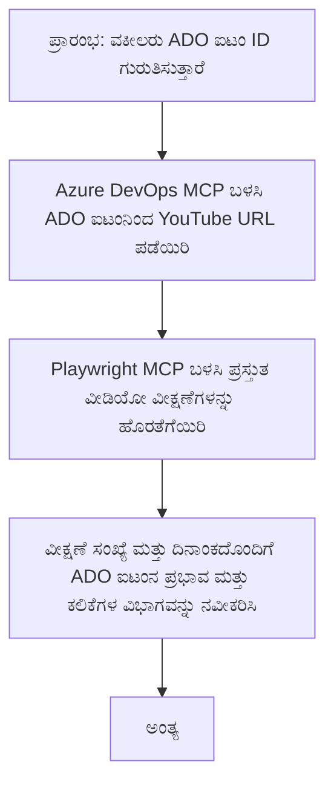

<!--
CO_OP_TRANSLATOR_METADATA:
{
  "original_hash": "14a2dfbea55ef735660a06bd6bdfe5f3",
  "translation_date": "2025-12-11T10:38:34+00:00",
  "source_file": "09-CaseStudy/UpdateADOItemsFromYT.md",
  "language_code": "kn"
}
-->
# ಪ್ರಕರಣ ಅಧ್ಯಯನ: YouTube ಡೇಟಾದಿಂದ MCP ಬಳಸಿ Azure DevOps ಐಟಂಗಳನ್ನು ನವೀಕರಿಸುವುದು

> **ಅಸ್ವೀಕರಣ:** YouTube ಮುಂತಾದ ವೇದಿಕೆಗಳಿಂದ ಡೇಟಾ ಬಳಸಿ Azure DevOps ಐಟಂಗಳನ್ನು ನವೀಕರಿಸುವ ಪ್ರಕ್ರಿಯೆಯನ್ನು ಸ್ವಯಂಚಾಲಿತಗೊಳಿಸುವುದಕ್ಕೆ ಈಗಾಗಲೇ ಆನ್‌ಲೈನ್ ಸಾಧನಗಳು ಮತ್ತು ವರದಿಗಳು ಲಭ್ಯವಿವೆ. ಕೆಳಗಿನ ದೃಶ್ಯಾವಳಿ MCP ಸಾಧನಗಳನ್ನು ಸ್ವಯಂಚಾಲನೆ ಮತ್ತು ಏಕೀಕರಣ ಕಾರ್ಯಗಳಿಗೆ ಹೇಗೆ ಅನ್ವಯಿಸಬಹುದು ಎಂಬುದನ್ನು ತೋರಿಸುವ ಉದಾಹರಣೆಯಾಗಿ ಮಾತ್ರ ನೀಡಲಾಗಿದೆ.

## ಅವಲೋಕನ

ಈ ಪ್ರಕರಣ ಅಧ್ಯಯನವು Model Context Protocol (MCP) ಮತ್ತು ಅದರ ಸಾಧನಗಳನ್ನು ಬಳಸಿಕೊಂಡು YouTube ಮುಂತಾದ ಆನ್‌ಲೈನ್ ವೇದಿಕೆಗಳಿಂದ ಪಡೆದ ಮಾಹಿತಿಯನ್ನು ಬಳಸಿ Azure DevOps (ADO) ಕೆಲಸದ ಐಟಂಗಳನ್ನು ನವೀಕರಿಸುವ ಪ್ರಕ್ರಿಯೆಯನ್ನು ಸ್ವಯಂಚಾಲಿತಗೊಳಿಸುವ ಒಂದು ಉದಾಹರಣೆಯನ್ನು ತೋರಿಸುತ್ತದೆ. ವಿವರಣೆ ನೀಡಲಾದ ದೃಶ್ಯಾವಳಿ ಈ ಸಾಧನಗಳ ವ್ಯಾಪಕ ಸಾಮರ್ಥ್ಯಗಳ ಒಂದು ಉದಾಹರಣೆಯಷ್ಟೇ, ಮತ್ತು ಇವು ಅನೇಕ ಸಮಾನ ಸ್ವಯಂಚಾಲನೆ ಅಗತ್ಯಗಳಿಗೆ ಹೊಂದಿಕೊಳ್ಳಬಹುದು.

ಈ ಉದಾಹರಣೆಯಲ್ಲಿ, ಒಂದು ಅಡ್ವೊಕೇಟ್ ADO ಐಟಂಗಳ ಮೂಲಕ ಆನ್‌ಲೈನ್ ಸೆಷನ್‌ಗಳನ್ನು ಟ್ರ್ಯಾಕ್ ಮಾಡುತ್ತಾನೆ, ಪ್ರತಿಯೊಂದು ಐಟಂ YouTube ವೀಡಿಯೋ URL ಅನ್ನು ಒಳಗೊಂಡಿರುತ್ತದೆ. MCP ಸಾಧನಗಳನ್ನು ಬಳಸಿಕೊಂಡು, ಅಡ್ವೊಕೇಟ್ ADO ಐಟಂಗಳನ್ನು ಇತ್ತೀಚಿನ ವೀಡಿಯೋ ಮೆಟ್ರಿಕ್ಸ್, ಉದಾಹರಣೆಗೆ ವೀಕ್ಷಣೆಗಳ ಸಂಖ್ಯೆ, ಇತ್ಯಾದಿ, ಪುನರಾವರ್ತಿತ ಮತ್ತು ಸ್ವಯಂಚಾಲಿತ ರೀತಿಯಲ್ಲಿ ನವೀಕರಿಸಬಹುದು. ಈ ವಿಧಾನವನ್ನು ಆನ್‌ಲೈನ್ ಮೂಲಗಳಿಂದ ಮಾಹಿತಿ ADO ಅಥವಾ ಇತರ ವ್ಯವಸ್ಥೆಗಳಿಗೆ ಏಕೀಕರಿಸುವ ಅಗತ್ಯವಿರುವ ಇತರ ಬಳಕೆಗಳಿಗೂ ಸಾಮಾನ್ಯಗೊಳಿಸಬಹುದು.

## ದೃಶ್ಯಾವಳಿ

ಒಂದು ಅಡ್ವೊಕೇಟ್ ಆನ್‌ಲೈನ್ ಸೆಷನ್‌ಗಳ ಮತ್ತು ಸಮುದಾಯ ತೊಡಕಿನ ಪರಿಣಾಮವನ್ನು ಟ್ರ್ಯಾಕ್ ಮಾಡುವ ಜವಾಬ್ದಾರಿಯನ್ನು ಹೊಂದಿದ್ದಾನೆ. ಪ್ರತಿಯೊಂದು ಸೆಷನ್ 'DevRel' ಪ್ರಾಜೆಕ್ಟಿನ ADO ಕೆಲಸದ ಐಟಂ ಆಗಿ ಲಾಗ್ ಮಾಡಲ್ಪಡುತ್ತದೆ, ಮತ್ತು ಕೆಲಸದ ಐಟಂ YouTube ವೀಡಿಯೋ URL ಗಾಗಿ ಒಂದು ಕ್ಷೇತ್ರವನ್ನು ಹೊಂದಿರುತ್ತದೆ. ಸೆಷನ್‌ನ ವ್ಯಾಪ್ತಿಯನ್ನು ಸರಿಯಾಗಿ ವರದಿ ಮಾಡಲು, ಅಡ್ವೊಕೇಟ್ ADO ಐಟಂ ಅನ್ನು ಇತ್ತೀಚಿನ ವೀಡಿಯೋ ವೀಕ್ಷಣೆಗಳ ಸಂಖ್ಯೆ ಮತ್ತು ಈ ಮಾಹಿತಿಯನ್ನು ಪಡೆದ ದಿನಾಂಕದೊಂದಿಗೆ ನವೀಕರಿಸಬೇಕಾಗುತ್ತದೆ.

## ಬಳಸಲಾದ ಸಾಧನಗಳು

- [Azure DevOps MCP](https://github.com/microsoft/azure-devops-mcp): MCP ಮೂಲಕ ADO ಕೆಲಸದ ಐಟಂಗಳಿಗೆ ಪ್ರೋಗ್ರಾಮ್ಯಾಟಿಕ್ ಪ್ರವೇಶ ಮತ್ತು ನವೀಕರಣಗಳನ್ನು ಸಕ್ರಿಯಗೊಳಿಸುತ್ತದೆ.
- [Playwright MCP](https://github.com/microsoft/playwright-mcp): YouTube ವೀಡಿಯೋ ಅಂಕಿಅಂಶಗಳಂತಹ ವೆಬ್ ಪುಟಗಳಿಂದ ಲೈವ್ ಡೇಟಾವನ್ನು ತೆಗೆಯಲು ಬ್ರೌಸರ್ ಕ್ರಿಯೆಗಳನ್ನು ಸ್ವಯಂಚಾಲಿತಗೊಳಿಸುತ್ತದೆ.

## ಹಂತ ಹಂತವಾಗಿ ಕಾರ್ಯಪ್ರವಾಹ

1. **ADO ಐಟಂ ಗುರುತಿಸಿ**: 'DevRel' ಪ್ರಾಜೆಕ್ಟಿನ ADO ಕೆಲಸದ ಐಟಂ ID (ಉದಾ: 1234) ನಿಂದ ಪ್ರಾರಂಭಿಸಿ.
2. **YouTube URL ಪಡೆಯಿರಿ**: ಕೆಲಸದ ಐಟಂನಿಂದ YouTube URL ಪಡೆಯಲು Azure DevOps MCP ಸಾಧನವನ್ನು ಬಳಸಿ.
3. **ವೀಡಿಯೋ ವೀಕ್ಷಣೆಗಳನ್ನು ತೆಗೆಯಿರಿ**: Playwright MCP ಸಾಧನವನ್ನು ಬಳಸಿ YouTube URL ಗೆ ಹೋಗಿ ಇತ್ತೀಚಿನ ವೀಕ್ಷಣೆಗಳ ಸಂಖ್ಯೆಯನ್ನು ತೆಗೆಯಿರಿ.
4. **ADO ಐಟಂ ನವೀಕರಿಸಿ**: ಇತ್ತೀಚಿನ ವೀಕ್ಷಣೆಗಳ ಸಂಖ್ಯೆ ಮತ್ತು ಪಡೆದ ದಿನಾಂಕವನ್ನು Azure DevOps MCP ಸಾಧನ ಬಳಸಿ ADO ಕೆಲಸದ ಐಟಂನ 'ಪ್ರಭಾವ ಮತ್ತು ಕಲಿಕೆಗಳು' ವಿಭಾಗದಲ್ಲಿ ಬರೆಯಿರಿ.

## ಉದಾಹರಣಾ ಪ್ರಾಂಪ್ಟ್

```bash
- Work with the ADO Item ID: 1234
- The project is '2025-Awesome'
- Get the YouTube URL for the ADO item
- Use Playwright to get the current views from the YouTube video
- Update the ADO item with the current video views and the updated date of the information
```

## Mermaid Flowchart


## ತಾಂತ್ರಿಕ ಅನುಷ್ಠಾನ

- **MCP ಸಂಯೋಜನೆ**: ಕಾರ್ಯಪ್ರವಾಹವನ್ನು MCP ಸರ್ವರ್ ಸಂಯೋಜಿಸುತ್ತದೆ, ಇದು Azure DevOps MCP ಮತ್ತು Playwright MCP ಸಾಧನಗಳ ಬಳಕೆಯನ್ನು ಸಂಯೋಜಿಸುತ್ತದೆ.
- **ಸ್ವಯಂಚಾಲನೆ**: ಪ್ರಕ್ರಿಯೆಯನ್ನು ಕೈಯಿಂದ ಪ್ರಾರಂಭಿಸಬಹುದು ಅಥವಾ ನಿಯಮಿತ ಅವಧಿಗಳಲ್ಲಿ ADO ಐಟಂಗಳನ್ನು ನವೀಕರಿಸಲು ವೇಳಾಪಟ್ಟಿ ಮಾಡಬಹುದು.
- **ವಿಸ್ತರಣೆ ಸಾಮರ್ಥ್ಯ**: ಇದೇ ಮಾದರಿಯನ್ನು ಇತರ ಆನ್‌ಲೈನ್ ಮೆಟ್ರಿಕ್ಸ್ (ಉದಾ: ಲೈಕ್ಸ್, ಕಾಮೆಂಟ್‌ಗಳು) ಅಥವಾ ಇತರ ವೇದಿಕೆಗಳಿಂದ ADO ಐಟಂಗಳನ್ನು ನವೀಕರಿಸಲು ವಿಸ್ತರಿಸಬಹುದು.

## ಫಲಿತಾಂಶಗಳು ಮತ್ತು ಪ್ರಭಾವ

- **ಕಾರ್ಯಕ್ಷಮತೆ**: ವೀಡಿಯೋ ಮೆಟ್ರಿಕ್ಸ್ ಪಡೆಯುವ ಮತ್ತು ನವೀಕರಿಸುವ ಕಾರ್ಯವನ್ನು ಸ್ವಯಂಚಾಲಿತಗೊಳಿಸುವ ಮೂಲಕ ಅಡ್ವೊಕೇಟ್‌ಗಳ ಕೈಯಿಂದ ಮಾಡುವ ಪ್ರಯತ್ನವನ್ನು ಕಡಿಮೆ ಮಾಡುತ್ತದೆ.
- **ನಿಖರತೆ**: ADO ಐಟಂಗಳಲ್ಲಿ ಆನ್‌ಲೈನ್ ಮೂಲಗಳಿಂದ ಲಭ್ಯವಿರುವ ಇತ್ತೀಚಿನ ಡೇಟಾವನ್ನು ಪ್ರತಿಬಿಂಬಿಸುತ್ತದೆ.
- **ಪುನರಾವರ್ತನೆ ಸಾಮರ್ಥ್ಯ**: ಇತರ ಡೇಟಾ ಮೂಲಗಳು ಅಥವಾ ಮೆಟ್ರಿಕ್ಸ್ ಒಳಗೊಂಡ ಸಮಾನ ದೃಶ್ಯಾವಳಿಗಳಿಗೆ ಪುನಃಬಳಕೆ ಮಾಡಬಹುದಾದ ಕಾರ್ಯಪ್ರವಾಹವನ್ನು ಒದಗಿಸುತ್ತದೆ.

## ಉಲ್ಲೇಖಗಳು

- [Azure DevOps MCP](https://github.com/microsoft/azure-devops-mcp)
- [Playwright MCP](https://github.com/microsoft/playwright-mcp)
- [Model Context Protocol (MCP)](https://modelcontextprotocol.io/)

---

<!-- CO-OP TRANSLATOR DISCLAIMER START -->
**ಅಸ್ವೀಕರಣ**:  
ಈ ದಸ್ತಾವೇಜು AI ಅನುವಾದ ಸೇವೆ [Co-op Translator](https://github.com/Azure/co-op-translator) ಬಳಸಿ ಅನುವಾದಿಸಲಾಗಿದೆ. ನಾವು ನಿಖರತೆಯಿಗಾಗಿ ಪ್ರಯತ್ನಿಸುತ್ತಿದ್ದರೂ, ಸ್ವಯಂಚಾಲಿತ ಅನುವಾದಗಳಲ್ಲಿ ತಪ್ಪುಗಳು ಅಥವಾ ಅಸತ್ಯತೆಗಳು ಇರಬಹುದು ಎಂದು ದಯವಿಟ್ಟು ಗಮನಿಸಿ. ಮೂಲ ಭಾಷೆಯಲ್ಲಿರುವ ಮೂಲ ದಸ್ತಾವೇಜನ್ನು ಅಧಿಕೃತ ಮೂಲವೆಂದು ಪರಿಗಣಿಸಬೇಕು. ಮಹತ್ವದ ಮಾಹಿತಿಗಾಗಿ, ವೃತ್ತಿಪರ ಮಾನವ ಅನುವಾದವನ್ನು ಶಿಫಾರಸು ಮಾಡಲಾಗುತ್ತದೆ. ಈ ಅನುವಾದ ಬಳಕೆಯಿಂದ ಉಂಟಾಗುವ ಯಾವುದೇ ತಪ್ಪು ಅರ್ಥಮಾಡಿಕೊಳ್ಳುವಿಕೆ ಅಥವಾ ತಪ್ಪು ವಿವರಣೆಗಳಿಗೆ ನಾವು ಹೊಣೆಗಾರರಾಗುವುದಿಲ್ಲ.
<!-- CO-OP TRANSLATOR DISCLAIMER END -->