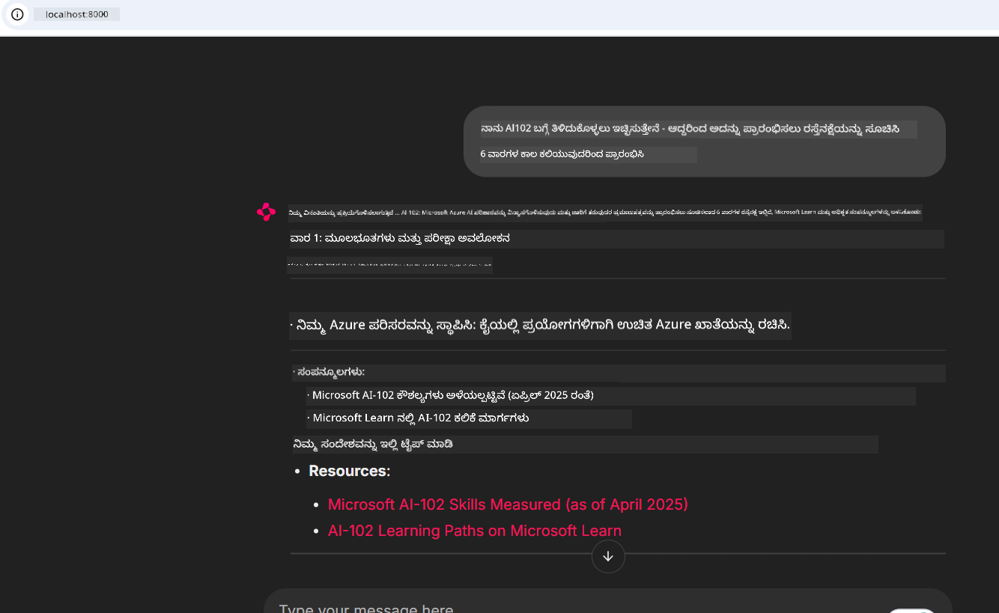
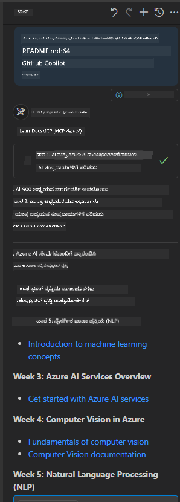

<!--
CO_OP_TRANSLATOR_METADATA:
{
  "original_hash": "4319d291c9d124ecafea52b3d04bfa0e",
  "translation_date": "2025-12-11T13:43:10+00:00",
  "source_file": "09-CaseStudy/docs-mcp/README.md",
  "language_code": "kn"
}
-->
# ಪ್ರಕರಣ ಅಧ್ಯಯನ: ಕ್ಲೈಂಟ್‌ನಿಂದ Microsoft Learn Docs MCP ಸರ್ವರ್‌ಗೆ ಸಂಪರ್ಕಿಸುವುದು

ನೀವು ಎಂದಾದರೂ ಡಾಕ್ಯುಮೆಂಟೇಶನ್ ಸೈಟ್‌ಗಳು, Stack Overflow ಮತ್ತು ಅನಂತ ಶೋಧ ಯಂತ್ರ ಟ್ಯಾಬ್‌ಗಳ ನಡುವೆ ಜಾಗತಿಕವಾಗಿ ಕೆಲಸ ಮಾಡುತ್ತಿದ್ದೀರಾ, ನಿಮ್ಮ ಕೋಡ್‌ನಲ್ಲಿ ಸಮಸ್ಯೆಯನ್ನು ಪರಿಹರಿಸಲು ಪ್ರಯತ್ನಿಸುತ್ತಿದ್ದಾಗ? ಬಹುಶಃ ನೀವು ಡಾಕ್ಸ್‌ಗಾಗಿ ಎರಡನೇ ಮಾನಿಟರ್ ಅನ್ನು ಇಟ್ಟುಕೊಂಡಿದ್ದೀರಾ, ಅಥವಾ ನೀವು ನಿಮ್ಮ IDE ಮತ್ತು ಬ್ರೌಸರ್ ನಡುವೆ ನಿರಂತರವಾಗಿ ಆಲ್ಟ್-ಟ್ಯಾಬ್ ಮಾಡುತ್ತಿದ್ದೀರಾ. ಡಾಕ್ಯುಮೆಂಟೇಶನ್ ಅನ್ನು ನೇರವಾಗಿ ನಿಮ್ಮ ವರ್ಕ್‌ಫ್ಲೋಗೆ—ನಿಮ್ಮ ಅಪ್ಲಿಕೇಶನ್‌ಗಳು, ನಿಮ್ಮ IDE ಅಥವಾ ನಿಮ್ಮ ಸ್ವಂತ ಕಸ್ಟಮ್ ಟೂಲ್ಗಳಲ್ಲಿ ಏಕೀಕೃತವಾಗಿ ತರುವುದಾದರೆ ಹೇಗಿರುತ್ತಿತ್ತು? ಈ ಪ್ರಕರಣ ಅಧ್ಯಯನದಲ್ಲಿ, ನಾವು ನಿಮ್ಮ ಸ್ವಂತ ಕ್ಲೈಂಟ್ ಅಪ್ಲಿಕೇಶನ್‌ನಿಂದ ನೇರವಾಗಿ Microsoft Learn Docs MCP ಸರ್ವರ್‌ಗೆ ಸಂಪರ್ಕಿಸುವ ಮೂಲಕ ಅದನ್ನು ಹೇಗೆ ಮಾಡುವುದು ಎಂಬುದನ್ನು ಅನ್ವೇಷಿಸುವೆವು.

## ಅವಲೋಕನ

ಆಧುನಿಕ ಅಭಿವೃದ್ಧಿ ಕೇವಲ ಕೋಡ್ ಬರೆಯುವುದಲ್ಲ—ಅದು ಸರಿಯಾದ ಸಮಯದಲ್ಲಿ ಸರಿಯಾದ ಮಾಹಿತಿಯನ್ನು ಹುಡುಕುವುದಾಗಿದೆ. ಡಾಕ್ಯುಮೆಂಟೇಶನ್ ಎಲ್ಲೆಡೆ ಇದೆ, ಆದರೆ ಅದು ಬಹುಶಃ ನೀವು ಅದನ್ನು ಅತ್ಯಂತ ಅಗತ್ಯವಿರುವ ಸ್ಥಳದಲ್ಲಿ ಇಲ್ಲ: ನಿಮ್ಮ ಟೂಲ್ಗಳು ಮತ್ತು ವರ್ಕ್‌ಫ್ಲೋಗಳ ಒಳಗೆ. ಡಾಕ್ಯುಮೆಂಟೇಶನ್ ಪಡೆಯುವಿಕೆಯನ್ನು ನೇರವಾಗಿ ನಿಮ್ಮ ಅಪ್ಲಿಕೇಶನ್‌ಗಳಲ್ಲಿ ಏಕೀಕರಿಸುವ ಮೂಲಕ, ನೀವು ಸಮಯವನ್ನು ಉಳಿಸಬಹುದು, ಸಾಂದರ್ಭಿಕ ಬದಲಾವಣೆಯನ್ನು ಕಡಿಮೆ ಮಾಡಬಹುದು ಮತ್ತು ಉತ್ಪಾದಕತೆಯನ್ನು ಹೆಚ್ಚಿಸಬಹುದು. ಈ ವಿಭಾಗದಲ್ಲಿ, ನಾವು ನಿಮಗೆ Microsoft Learn Docs MCP ಸರ್ವರ್‌ಗೆ ಕ್ಲೈಂಟ್ ಅನ್ನು ಹೇಗೆ ಸಂಪರ್ಕಿಸುವುದು ಎಂಬುದನ್ನು ತೋರಿಸುವೆವು, ಆದ್ದರಿಂದ ನೀವು ನಿಮ್ಮ ಅಪ್ಲಿಕೇಶನ್ ಅನ್ನು ಬಿಟ್ಟು ಹೋಗದೆ ನೈಜ-ಸಮಯ, ಸಾಂದರ್ಭಿಕ-ಜಾಗೃತ ಡಾಕ್ಯುಮೆಂಟೇಶನ್ ಅನ್ನು ಪ್ರವೇಶಿಸಬಹುದು.

ನಾವು ಸಂಪರ್ಕ ಸ್ಥಾಪಿಸುವ ಪ್ರಕ್ರಿಯೆಯನ್ನು, ವಿನಂತಿಯನ್ನು ಕಳುಹಿಸುವುದನ್ನು ಮತ್ತು ಸ್ಟ್ರೀಮಿಂಗ್ ಪ್ರತಿಕ್ರಿಯೆಗಳನ್ನು ಪರಿಣಾಮಕಾರಿಯಾಗಿ ನಿರ್ವಹಿಸುವುದನ್ನು ಹಾದುಹೋಗುತ್ತೇವೆ. ಈ ವಿಧಾನವು ನಿಮ್ಮ ವರ್ಕ್‌ಫ್ಲೋವನ್ನು ಸುಗಮಗೊಳಿಸುವುದಲ್ಲದೆ, ಹೆಚ್ಚು ಬುದ್ಧಿವಂತ, ಸಹಾಯಕ ಡೆವಲಪರ್ ಟೂಲ್ಗಳನ್ನು ನಿರ್ಮಿಸುವ ದ್ವಾರವನ್ನು ತೆರೆಯುತ್ತದೆ.

## ಕಲಿಕೆಯ ಉದ್ದೇಶಗಳು

ನಾವು ಇದನ್ನು ಏಕೆ ಮಾಡುತ್ತಿದ್ದೇವೆ? ಏಕೆಂದರೆ ಉತ್ತಮ ಡೆವಲಪರ್ ಅನುಭವಗಳು ಅಡಚಣೆಯನ್ನು ತೆಗೆದುಹಾಕುವವು. ನಿಮ್ಮ ಕೋಡ್ ಎಡಿಟರ್, ಚಾಟ್‌ಬಾಟ್ ಅಥವಾ ವೆಬ್ ಅಪ್ಲಿಕೇಶನ್ Microsoft Learn ನ ಇತ್ತೀಚಿನ ವಿಷಯವನ್ನು ಬಳಸಿ ನಿಮ್ಮ ಡಾಕ್ಯುಮೆಂಟೇಶನ್ ಪ್ರಶ್ನೆಗಳಿಗೆ ತಕ್ಷಣ ಉತ್ತರ ನೀಡಬಹುದಾದ ಜಗತ್ತನ್ನು ಕಲ್ಪಿಸಿ. ಈ ಅಧ್ಯಾಯದ ಕೊನೆಯಲ್ಲಿ, ನೀವು ತಿಳಿದುಕೊಳ್ಳುವಿರಿ:

- ಡಾಕ್ಯುಮೆಂಟೇಶನ್‌ಗಾಗಿ MCP ಸರ್ವರ್-ಕ್ಲೈಂಟ್ ಸಂವಹನದ ಮೂಲಭೂತಗಳನ್ನು ಅರ್ಥಮಾಡಿಕೊಳ್ಳುವುದು
- Microsoft Learn Docs MCP ಸರ್ವರ್‌ಗೆ ಸಂಪರ್ಕಿಸಲು ಕಾನ್ಸೋಲ್ ಅಥವಾ ವೆಬ್ ಅಪ್ಲಿಕೇಶನ್ ಅನ್ನು ಅನುಷ್ಠಾನಗೊಳಿಸುವುದು
- ನೈಜ-ಸಮಯ ಡಾಕ್ಯುಮೆಂಟೇಶನ್ ಪಡೆಯಲು ಸ್ಟ್ರೀಮಿಂಗ್ HTTP ಕ್ಲೈಂಟ್‌ಗಳನ್ನು ಬಳಸುವುದು
- ನಿಮ್ಮ ಅಪ್ಲಿಕೇಶನ್‌ನಲ್ಲಿ ಡಾಕ್ಯುಮೆಂಟೇಶನ್ ಪ್ರತಿಕ್ರಿಯೆಗಳನ್ನು ಲಾಗ್ ಮಾಡುವುದು ಮತ್ತು ವ್ಯಾಖ್ಯಾನಿಸುವುದು

ನೀವು ಈ ಕೌಶಲ್ಯಗಳು ಪ್ರತಿಕ್ರಿಯಾಶೀಲವಾಗಿರುವುದಲ್ಲದೆ, ನಿಜವಾಗಿಯೂ ಸಂವಾದಾತ್ಮಕ ಮತ್ತು ಸಾಂದರ್ಭಿಕ-ಜಾಗೃತವಾಗಿರುವ ಟೂಲ್ಗಳನ್ನು ನಿರ್ಮಿಸಲು ಸಹಾಯ ಮಾಡುವುದನ್ನು ನೋಡುತ್ತೀರಿ.

## ದೃಶ್ಯ 1 - MCP ಮೂಲಕ ನೈಜ-ಸಮಯ ಡಾಕ್ಯುಮೆಂಟೇಶನ್ ಪಡೆಯುವುದು

ಈ ದೃಶ್ಯದಲ್ಲಿ, ನಾವು ನಿಮಗೆ Microsoft Learn Docs MCP ಸರ್ವರ್‌ಗೆ ಕ್ಲೈಂಟ್ ಅನ್ನು ಸಂಪರ್ಕಿಸುವುದನ್ನು ತೋರಿಸುವೆವು, ಆದ್ದರಿಂದ ನೀವು ನಿಮ್ಮ ಅಪ್ಲಿಕೇಶನ್ ಅನ್ನು ಬಿಟ್ಟು ಹೋಗದೆ ನೈಜ-ಸಮಯ, ಸಾಂದರ್ಭಿಕ-ಜಾಗೃತ ಡಾಕ್ಯುಮೆಂಟೇಶನ್ ಅನ್ನು ಪ್ರವೇಶಿಸಬಹುದು.

ಇದನ್ನು ಅಭ್ಯಾಸದಲ್ಲಿ ಹಾಕೋಣ. ನಿಮ್ಮ ಕಾರ್ಯವೆಂದರೆ Microsoft Learn Docs MCP ಸರ್ವರ್‌ಗೆ ಸಂಪರ್ಕಿಸುವ, `microsoft_docs_search` ಟೂಲ್ ಅನ್ನು ಕರೆಸುವ ಮತ್ತು ಸ್ಟ್ರೀಮಿಂಗ್ ಪ್ರತಿಕ್ರಿಯೆಯನ್ನು ಕಾನ್ಸೋಲ್‌ಗೆ ಲಾಗ್ ಮಾಡುವ ಅಪ್ಲಿಕೇಶನ್ ಅನ್ನು ಬರೆಯುವುದು.

### ಈ ವಿಧಾನ ಏಕೆ?
ಇದು ಹೆಚ್ಚು ಪ್ರಗತಿಶೀಲ ಏಕೀಕರಣಗಳನ್ನು ನಿರ್ಮಿಸುವ ಆಧಾರವಾಗಿದೆ—ನೀವು ಚಾಟ್‌ಬಾಟ್, IDE ವಿಸ್ತರಣೆ ಅಥವಾ ವೆಬ್ ಡ್ಯಾಶ್‌ಬೋರ್ಡ್ ಅನ್ನು ಶಕ್ತಿಮಾಡಬೇಕಾದರೆ.

ನೀವು ಈ ದೃಶ್ಯಕ್ಕೆ ಸಂಬಂಧಿಸಿದ ಕೋಡ್ ಮತ್ತು ಸೂಚನೆಗಳನ್ನು [`solution`](./solution/README.md) ಫೋಲ್ಡರ್‌ನಲ್ಲಿ ಈ ಪ್ರಕರಣ ಅಧ್ಯಯನದೊಳಗೆ ಕಾಣಬಹುದು. ಹಂತಗಳು ನಿಮಗೆ ಸಂಪರ್ಕವನ್ನು ಸ್ಥಾಪಿಸುವುದನ್ನು ಮಾರ್ಗದರ್ಶನ ಮಾಡುತ್ತವೆ:
- ಅಧಿಕೃತ MCP SDK ಮತ್ತು ಸ್ಟ್ರೀಮಬಲ್ HTTP ಕ್ಲೈಂಟ್ ಬಳಸಿ ಸಂಪರ್ಕ
- ಡಾಕ್ಯುಮೆಂಟೇಶನ್ ಪಡೆಯಲು `microsoft_docs_search` ಟೂಲ್ ಅನ್ನು ಕ್ವೇರಿ ಪ್ಯಾರಾಮೀಟರ್ ಜೊತೆಗೆ ಕರೆಮಾಡಿ
- ಸರಿಯಾದ ಲಾಗಿಂಗ್ ಮತ್ತು ದೋಷ ನಿರ್ವಹಣೆಯನ್ನು ಅನುಷ್ಠಾನಗೊಳಿಸಿ
- ಬಳಕೆದಾರರು ಅನೇಕ ಶೋಧ ಕ್ವೆರಿಗಳನ್ನು ನಮೂದಿಸಲು ಅನುಮತಿಸುವ ಸಂವಾದಾತ್ಮಕ ಕಾನ್ಸೋಲ್ ಇಂಟರ್ಫೇಸ್ ರಚಿಸಿ

ಈ ದೃಶ್ಯವು ಹೇಗೆ:
- Docs MCP ಸರ್ವರ್‌ಗೆ ಸಂಪರ್ಕಿಸುವುದು
- ಕ್ವೇರಿ ಕಳುಹಿಸುವುದು
- ಫಲಿತಾಂಶಗಳನ್ನು ಪಾರ್ಸ್ ಮಾಡಿ ಮುದ್ರಿಸುವುದು

ಇದೀಗ ಪರಿಹಾರವನ್ನು ಚಾಲನೆ ಮಾಡಿದಾಗ ಹೇಗಿರಬಹುದು ಎಂಬುದನ್ನು ನೋಡಿ:

```
Prompt> What is Azure Key Vault?
Answer> Azure Key Vault is a cloud service for securely storing and accessing secrets. ...
```

ಕೆಳಗಿನದು ಕನಿಷ್ಠ ಮಾದರಿ ಪರಿಹಾರವಾಗಿದೆ. ಸಂಪೂರ್ಣ ಕೋಡ್ ಮತ್ತು ವಿವರಗಳು ಪರಿಹಾರ ಫೋಲ್ಡರ್‌ನಲ್ಲಿ ಲಭ್ಯವಿವೆ.

<details>
<summary>Python</summary>

```python
import asyncio
from mcp.client.streamable_http import streamablehttp_client
from mcp import ClientSession

async def main():
    async with streamablehttp_client("https://learn.microsoft.com/api/mcp") as (read_stream, write_stream, _):
        async with ClientSession(read_stream, write_stream) as session:
            await session.initialize()
            result = await session.call_tool("microsoft_docs_search", {"query": "Azure Functions best practices"})
            print(result.content)

if __name__ == "__main__":
    asyncio.run(main())
```

- ಸಂಪೂರ್ಣ ಅನುಷ್ಠಾನ ಮತ್ತು ಲಾಗಿಂಗ್‌ಗಾಗಿ, [`scenario1.py`](../../../../09-CaseStudy/docs-mcp/solution/python/scenario1.py) ಅನ್ನು ನೋಡಿ.
- ಸ್ಥಾಪನೆ ಮತ್ತು ಬಳಕೆಯ ಸೂಚನೆಗಳಿಗಾಗಿ, ಅದೇ ಫೋಲ್ಡರ್‌ನಲ್ಲಿರುವ [`README.md`](./solution/python/README.md) ಫೈಲ್ ಅನ್ನು ನೋಡಿ.
</details>


## ದೃಶ್ಯ 2 - MCP ಮೂಲಕ ಸಂವಾದಾತ್ಮಕ ಅಧ್ಯಯನ ಯೋಜನೆ ಜನರೇಟರ್ ವೆಬ್ ಅಪ್ಲಿಕೇಶನ್

ಈ ದೃಶ್ಯದಲ್ಲಿ, ನೀವು Docs MCP ಅನ್ನು ವೆಬ್ ಅಭಿವೃದ್ಧಿ ಯೋಜನೆಯಲ್ಲಿ ಏಕೀಕರಿಸುವುದನ್ನು ಕಲಿಯುತ್ತೀರಿ. ಗುರಿಯೇ ಬಳಕೆದಾರರು ವೆಬ್ ಇಂಟರ್ಫೇಸ್‌ನಿಂದ ನೇರವಾಗಿ Microsoft Learn ಡಾಕ್ಯುಮೆಂಟೇಶನ್ ಅನ್ನು ಹುಡುಕಲು ಸಾಧ್ಯವಾಗಿಸುವುದು, ನಿಮ್ಮ ಅಪ್ಲಿಕೇಶನ್ ಅಥವಾ ಸೈಟ್‌ನಲ್ಲಿ ಡಾಕ್ಯುಮೆಂಟೇಶನ್ ತಕ್ಷಣ ಲಭ್ಯವಾಗುವಂತೆ ಮಾಡುವುದು.

ನೀವು ಹೇಗೆ:
- ವೆಬ್ ಅಪ್ಲಿಕೇಶನ್ ಅನ್ನು ಸ್ಥಾಪಿಸುವುದು
- Docs MCP ಸರ್ವರ್‌ಗೆ ಸಂಪರ್ಕಿಸುವುದು
- ಬಳಕೆದಾರರ ಇನ್ಪುಟ್ ಅನ್ನು ನಿರ್ವಹಿಸುವುದು ಮತ್ತು ಫಲಿತಾಂಶಗಳನ್ನು ಪ್ರದರ್ಶಿಸುವುದು

ಇದೀಗ ಪರಿಹಾರವನ್ನು ಚಾಲನೆ ಮಾಡಿದಾಗ ಹೇಗಿರಬಹುದು ಎಂಬುದನ್ನು ನೋಡಿ:

```
User> I want to learn about AI102 - so suggest the roadmap to get it started from learn for 6 weeks

Assistant> Here’s a detailed 6-week roadmap to start your preparation for the AI-102: Designing and Implementing a Microsoft Azure AI Solution certification, using official Microsoft resources and focusing on exam skills areas:

---
## Week 1: Introduction & Fundamentals
- **Understand the Exam**: Review the [AI-102 exam skills outline](https://learn.microsoft.com/en-us/credentials/certifications/exams/ai-102/).
- **Set up Azure**: Sign up for a free Azure account if you don't have one.
- **Learning Path**: [Introduction to Azure AI services](https://learn.microsoft.com/en-us/training/modules/intro-to-azure-ai/)
- **Focus**: Get familiar with Azure portal, AI capabilities, and necessary tools.

....more weeks of the roadmap...

Let me know if you want module-specific recommendations or need more customized weekly tasks!
```

ಕೆಳಗಿನದು ಕನಿಷ್ಠ ಮಾದರಿ ಪರಿಹಾರವಾಗಿದೆ. ಸಂಪೂರ್ಣ ಕೋಡ್ ಮತ್ತು ವಿವರಗಳು ಪರಿಹಾರ ಫೋಲ್ಡರ್‌ನಲ್ಲಿ ಲಭ್ಯವಿವೆ.



<details>
<summary>Python (Chainlit)</summary>

Chainlit ಸಂವಾದಾತ್ಮಕ AI ವೆಬ್ ಅಪ್ಲಿಕೇಶನ್‌ಗಳನ್ನು ನಿರ್ಮಿಸಲು ಫ್ರೇಮ್ವರ್ಕ್ ಆಗಿದೆ. ಇದು ಸಂವಾದಾತ್ಮಕ ಚಾಟ್‌ಬಾಟ್‌ಗಳು ಮತ್ತು ಸಹಾಯಕರನ್ನು ಸುಲಭವಾಗಿ ರಚಿಸಲು ಸಹಾಯ ಮಾಡುತ್ತದೆ, ಅವು MCP ಟೂಲ್ಗಳನ್ನು ಕರೆದು ನೈಜ-ಸಮಯದಲ್ಲಿ ಫಲಿತಾಂಶಗಳನ್ನು ಪ್ರದರ್ಶಿಸಬಹುದು. ಇದು ವೇಗದ ಪ್ರೋಟೋಟೈಪಿಂಗ್ ಮತ್ತು ಬಳಕೆದಾರ ಸ್ನೇಹಿ ಇಂಟರ್ಫೇಸ್‌ಗಳಿಗೆ ಸೂಕ್ತವಾಗಿದೆ.

```python
import chainlit as cl
import requests

MCP_URL = "https://learn.microsoft.com/api/mcp"

@cl.on_message
def handle_message(message):
    query = {"question": message}
    response = requests.post(MCP_URL, json=query)
    if response.ok:
        result = response.json()
        cl.Message(content=result.get("answer", "No answer found.")).send()
    else:
        cl.Message(content="Error: " + response.text).send()
```

- ಸಂಪೂರ್ಣ ಅನುಷ್ಠಾನಕ್ಕಾಗಿ, [`scenario2.py`](../../../../09-CaseStudy/docs-mcp/solution/python/scenario2.py) ಅನ್ನು ನೋಡಿ.
- ಸ್ಥಾಪನೆ ಮತ್ತು ಚಾಲನೆ ಸೂಚನೆಗಳಿಗಾಗಿ, [`README.md`](./solution/python/README.md) ಅನ್ನು ನೋಡಿ.
</details>


## ದೃಶ್ಯ 3: VS Code ನಲ್ಲಿ MCP ಸರ್ವರ್‌ನೊಂದಿಗೆ ಎಡಿಟರ್ ಒಳಗಿನ ಡಾಕ್ಸ್

ನೀವು Microsoft Learn Docs ಅನ್ನು ನೇರವಾಗಿ ನಿಮ್ಮ VS Code ಒಳಗೆ ಪಡೆಯಲು ಬಯಸಿದರೆ (ಬ್ರೌಸರ್ ಟ್ಯಾಬ್‌ಗಳನ್ನು ಬದಲಾಯಿಸುವ ಬದಲು), ನೀವು ನಿಮ್ಮ ಎಡಿಟರ್‌ನಲ್ಲಿ MCP ಸರ್ವರ್ ಅನ್ನು ಬಳಸಬಹುದು. ಇದು ನಿಮಗೆ ಅನುಮತಿಸುತ್ತದೆ:
- ನಿಮ್ಮ ಕೋಡಿಂಗ್ ಪರಿಸರವನ್ನು ಬಿಟ್ಟು ಹೋಗದೆ VS Code ನಲ್ಲಿ ಡಾಕ್ಸ್ ಅನ್ನು ಹುಡುಕಿ ಓದಲು.
- ಡಾಕ್ಯುಮೆಂಟೇಶನ್ ಅನ್ನು ಉಲ್ಲೇಖಿಸಿ ಮತ್ತು README ಅಥವಾ ಕೋರ್ಸ್ ಫೈಲ್‌ಗಳಲ್ಲಿ ನೇರವಾಗಿ ಲಿಂಕ್‌ಗಳನ್ನು ಸೇರಿಸಲು.
- GitHub Copilot ಮತ್ತು MCP ಅನ್ನು ಒಟ್ಟಿಗೆ ಬಳಸಿಕೊಂಡು ನಿರಂತರ, AI-ಚಾಲಿತ ಡಾಕ್ಯುಮೆಂಟೇಶನ್ ವರ್ಕ್‌ಫ್ಲೋ ಅನ್ನು ಅನುಭವಿಸಲು.

**ನೀವು ಹೇಗೆ:**
- ನಿಮ್ಮ ವರ್ಕ್‌ಸ್ಪೇಸ್ ರೂಟ್‌ಗೆ ಮಾನ್ಯವಾದ `.vscode/mcp.json` ಫೈಲ್ ಅನ್ನು ಸೇರಿಸುವುದು (ಕೆಳಗಿನ ಉದಾಹರಣೆಯನ್ನು ನೋಡಿ).
- MCP ಪ್ಯಾನೆಲ್ ಅನ್ನು ತೆರೆಯುವುದು ಅಥವಾ VS Code ನಲ್ಲಿ ಕಮಾಂಡ್ ಪ್ಯಾಲೆಟ್ ಬಳಸಿ ಡಾಕ್ಸ್ ಹುಡುಕುವುದು ಮತ್ತು ಸೇರಿಸುವುದು.
- ನೀವು ಕೆಲಸ ಮಾಡುವಾಗ ನಿಮ್ಮ ಮಾರ್ಕ್‌ಡೌನ್ ಫೈಲ್‌ಗಳಲ್ಲಿ ನೇರವಾಗಿ ಡಾಕ್ಯುಮೆಂಟೇಶನ್ ಉಲ್ಲೇಖಿಸುವುದು.
- ಈ ವರ್ಕ್‌ಫ್ಲೋವನ್ನು GitHub Copilot ಜೊತೆಗೆ ಸಂಯೋಜಿಸಿ ಇನ್ನಷ್ಟು ಉತ್ಪಾದಕತೆಯನ್ನು ಪಡೆಯುವುದು.

ಇದು VS Code ನಲ್ಲಿ MCP ಸರ್ವರ್ ಅನ್ನು ಸ್ಥಾಪಿಸುವ ಉದಾಹರಣೆ:

```json
{
  "servers": {
    "LearnDocsMCP": {
      "url": "https://learn.microsoft.com/api/mcp"
    }
  }
}
```

</details>

> ಸ್ಕ್ರೀನ್‌ಶಾಟ್‌ಗಳು ಮತ್ತು ಹಂತ ಹಂತದ ಮಾರ್ಗದರ್ಶನದೊಂದಿಗೆ ವಿವರವಾದ ವಾಕ್ತೃಪಥಕ್ಕಾಗಿ, [`README.md`](./solution/scenario3/README.md) ಅನ್ನು ನೋಡಿ.



ಈ ವಿಧಾನವು ತಾಂತ್ರಿಕ ಕೋರ್ಸ್‌ಗಳನ್ನು ನಿರ್ಮಿಸುವವರು, ಡಾಕ್ಯುಮೆಂಟೇಶನ್ ಬರೆಯುವವರು ಅಥವಾ ನಿರಂತರ ಉಲ್ಲೇಖ ಅಗತ್ಯವಿರುವ ಕೋಡ್ ಅಭಿವೃದ್ಧಿಪಡಿಸುವವರಿಗೆ ಸೂಕ್ತವಾಗಿದೆ.

## ಪ್ರಮುಖ ಪಾಠಗಳು

ಡಾಕ್ಯುಮೆಂಟೇಶನ್ ಅನ್ನು ನೇರವಾಗಿ ನಿಮ್ಮ ಟೂಲ್ಗಳಲ್ಲಿ ಏಕೀಕರಿಸುವುದು ಕೇವಲ ಸೌಕರ್ಯವಲ್ಲ—ಇದು ಉತ್ಪಾದಕತೆಯ ಗೇಮ್ ಚೇಂಜರ್ ಆಗಿದೆ. ನಿಮ್ಮ ಕ್ಲೈಂಟ್‌ನಿಂದ Microsoft Learn Docs MCP ಸರ್ವರ್‌ಗೆ ಸಂಪರ್ಕಿಸುವ ಮೂಲಕ, ನೀವು:

- ನಿಮ್ಮ ಕೋಡ್ ಮತ್ತು ಡಾಕ್ಯುಮೆಂಟೇಶನ್ ನಡುವೆ ಸಾಂದರ್ಭಿಕ ಬದಲಾವಣೆಯನ್ನು ನಿವಾರಿಸಬಹುದು
- ನೈಜ-ಸಮಯದಲ್ಲಿ ನವೀಕೃತ, ಸಾಂದರ್ಭಿಕ-ಜಾಗೃತ ಡಾಕ್ಸ್ ಪಡೆಯಬಹುದು
- ಹೆಚ್ಚು ಬುದ್ಧಿವಂತ, ಸಂವಾದಾತ್ಮಕ ಡೆವಲಪರ್ ಟೂಲ್ಗಳನ್ನು ನಿರ್ಮಿಸಬಹುದು

ಈ ಕೌಶಲ್ಯಗಳು ನಿಮಗೆ ಪರಿಣಾಮಕಾರಿಯಾಗಿ ಮತ್ತು ಆನಂದಕರವಾಗಿ ಬಳಸಬಹುದಾದ ಪರಿಹಾರಗಳನ್ನು ರಚಿಸಲು ಸಹಾಯ ಮಾಡುತ್ತವೆ.

## ಹೆಚ್ಚುವರಿ ಸಂಪನ್ಮೂಲಗಳು

ನಿಮ್ಮ ಅರ್ಥವನ್ನು ಗಾಢಗೊಳಿಸಲು, ಈ ಅಧಿಕೃತ ಸಂಪನ್ಮೂಲಗಳನ್ನು ಅನ್ವೇಷಿಸಿ:

- [Microsoft Learn Docs MCP Server (GitHub)](https://github.com/MicrosoftDocs/mcp)
- [Azure MCP Server (mcp-python) ಪ್ರಾರಂಭಿಸುವುದು](https://learn.microsoft.com/en-us/azure/developer/azure-mcp-server/get-started#create-the-python-app)
- [Azure MCP Server ಎಂದರೇನು?](https://learn.microsoft.com/en-us/azure/developer/azure-mcp-server/)
- [ಮಾದರಿ ಸಾಂದರ್ಭಿಕ ಪ್ರೋಟೋಕಾಲ್ (MCP) ಪರಿಚಯ](https://modelcontextprotocol.io/introduction)
- [MCP ಸರ್ವರ್‌ನಿಂದ ಪ್ಲಗಿನ್‌ಗಳನ್ನು ಸೇರಿಸುವುದು (Python)](https://learn.microsoft.com/en-us/semantic-kernel/concepts/plugins/adding-mcp-plugins)

---

<!-- CO-OP TRANSLATOR DISCLAIMER START -->
**ಅಸ್ವೀಕರಣ**:  
ಈ ದಸ್ತಾವೇಜು AI ಅನುವಾದ ಸೇವೆ [Co-op Translator](https://github.com/Azure/co-op-translator) ಬಳಸಿ ಅನುವಾದಿಸಲಾಗಿದೆ. ನಾವು ನಿಖರತೆಯಿಗಾಗಿ ಪ್ರಯತ್ನಿಸುತ್ತಿದ್ದರೂ, ಸ್ವಯಂಚಾಲಿತ ಅನುವಾದಗಳಲ್ಲಿ ದೋಷಗಳು ಅಥವಾ ಅಸತ್ಯತೆಗಳು ಇರಬಹುದು ಎಂದು ದಯವಿಟ್ಟು ಗಮನಿಸಿ. ಮೂಲ ಭಾಷೆಯಲ್ಲಿರುವ ಮೂಲ ದಸ್ತಾವೇಜನ್ನು ಅಧಿಕೃತ ಮೂಲವೆಂದು ಪರಿಗಣಿಸಬೇಕು. ಮಹತ್ವದ ಮಾಹಿತಿಗಾಗಿ, ವೃತ್ತಿಪರ ಮಾನವ ಅನುವಾದವನ್ನು ಶಿಫಾರಸು ಮಾಡಲಾಗುತ್ತದೆ. ಈ ಅನುವಾದ ಬಳಕೆಯಿಂದ ಉಂಟಾಗುವ ಯಾವುದೇ ತಪ್ಪು ಅರ್ಥಮಾಡಿಕೊಳ್ಳುವಿಕೆ ಅಥವಾ ತಪ್ಪು ವಿವರಣೆಗಳಿಗೆ ನಾವು ಹೊಣೆಗಾರರಾಗುವುದಿಲ್ಲ.
<!-- CO-OP TRANSLATOR DISCLAIMER END -->