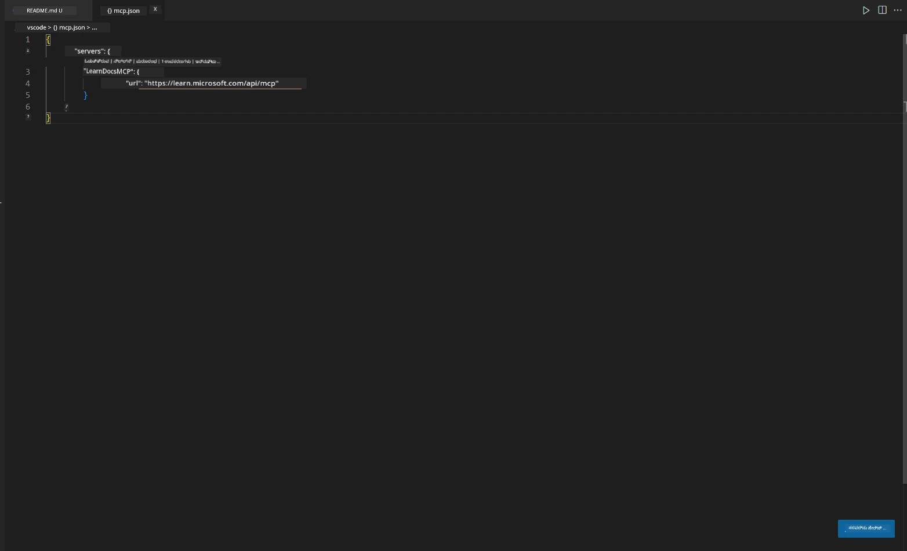
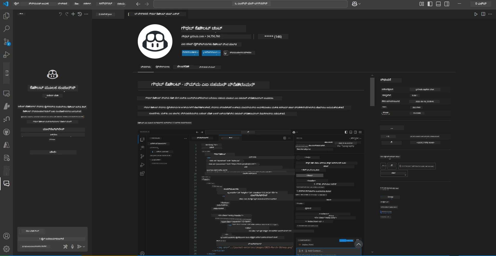
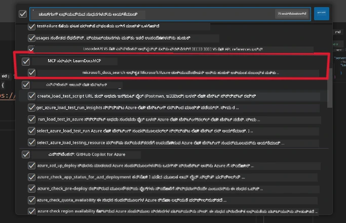
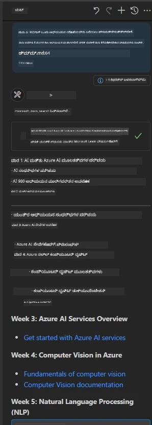
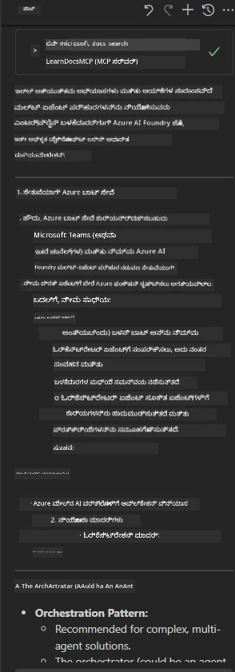

# ದೃಶ್ಯ 3: VS ಕೋಡ್‌ನಲ್ಲಿ MCP ಸರ್ವರ್‌ನೊಂದಿಗೆ ಸಂಪಾದಕದಲ್ಲಿ ಡಾಕ್ಸ್

## ಅವಲೋಕನ

ಈ ದೃಶ್ಯದಲ್ಲಿ, ನೀವು MCP ಸರ್ವರ್ ಬಳಸಿ ಮೈಕ್ರೋಸಾಫ್ಟ್ ಲರ್ನ್ ಡಾಕ್ಸ್ ಅನ್ನು ನೇರವಾಗಿ ನಿಮ್ಮ Visual Studio Code ಪರಿಸರಕ್ಕೆ ಹೇಗೆ ತರಬೇಕೆಂದು ಕಲಿಯುತ್ತೀರಿ. ಡಾಕ್ಯುಮೆಂಟೇಶನ್ ಹುಡುಕಲು ಬ್ರೌಸರ್ ಟ್ಯಾಬ್‌ಗಳನ್ನು ನಿರಂತರವಾಗಿ ಬದಲಾಯಿಸುವ ಬದಲು, ನೀವು ನಿಮ್ಮ ಸಂಪಾದಕದೊಳಗೆ ಅಧಿಕೃತ ಡಾಕ್ಸ್‌ಗಳನ್ನು ಪ್ರವೇಶಿಸಬಹುದು, ಹುಡುಕಬಹುದು ಮತ್ತು ಉಲ್ಲೇಖಿಸಬಹುದು. ಈ ವಿಧಾನವು ನಿಮ್ಮ ಕಾರ್ಯಪ್ರವಾಹವನ್ನು ಸರಳಗೊಳಿಸುತ್ತದೆ, ನಿಮಗೆ ಗಮನ ಕೇಂದ್ರಿತವಾಗಿರಲು ಸಹಾಯ ಮಾಡುತ್ತದೆ ಮತ್ತು GitHub Copilot ಮುಂತಾದ ಸಾಧನಗಳೊಂದಿಗೆ ನಿರಂತರ ಸಂಯೋಜನೆಯನ್ನು ಸಾದ್ಯಮಾಡುತ್ತದೆ.

- VS ಕೋಡ್ ಒಳಗೆ ನಿಮ್ಮ ಕೋಡಿಂಗ್ ಪರಿಸರವನ್ನು ಬಿಟ್ಟುಬಿಡದೆ ಡಾಕ್ಸ್ ಹುಡುಕಿ ಓದಿ.
- ಡಾಕ್ಯುಮೆಂಟೇಶನ್ ಉಲ್ಲೇಖಿಸಿ ಮತ್ತು ಲಿಂಕ್‌ಗಳನ್ನು ನೇರವಾಗಿ ನಿಮ್ಮ README ಅಥವಾ ಕೋರ್ಸ್ ಫೈಲ್‌ಗಳಲ್ಲಿ ಸೇರಿಸಿ.
- GitHub Copilot ಮತ್ತು MCP ಅನ್ನು ಒಟ್ಟಿಗೆ ಬಳಸಿಕೊಂಡು ನಿರಂತರ, AI-ಚಾಲಿತ ಡಾಕ್ಯುಮೆಂಟೇಶನ್ ಕಾರ್ಯಪ್ರವಾಹವನ್ನು ಅನುಭವಿಸಿ.

## ಕಲಿಕೆಯ ಉದ್ದೇಶಗಳು

ಈ ಅಧ್ಯಾಯದ ಕೊನೆಯಲ್ಲಿ, ನೀವು VS ಕೋಡ್ ಒಳಗೆ MCP ಸರ್ವರ್ ಅನ್ನು ಸೆಟ್ ಅಪ್ ಮಾಡಿ ಬಳಸುವ ಮೂಲಕ ನಿಮ್ಮ ಡಾಕ್ಯುಮೆಂಟೇಶನ್ ಮತ್ತು ಅಭಿವೃದ್ಧಿ ಕಾರ್ಯಪ್ರವಾಹವನ್ನು ಹೇಗೆ ಸುಧಾರಿಸಬಹುದು ಎಂಬುದನ್ನು ಅರ್ಥಮಾಡಿಕೊಳ್ಳುತ್ತೀರಿ. ನೀವು ಈ ಕೆಳಗಿನವುಗಳನ್ನು ಮಾಡಲು ಸಾಧ್ಯವಾಗುತ್ತದೆ:

- ಡಾಕ್ಯುಮೆಂಟೇಶನ್ ಹುಡುಕಲು MCP ಸರ್ವರ್ ಬಳಕೆಗೆ ನಿಮ್ಮ ವರ್ಕ್‌ಸ್ಪೇಸ್ ಅನ್ನು ಸಂರಚಿಸಿ.
- VS ಕೋಡ್ ಒಳಗೆ ನೇರವಾಗಿ ಡಾಕ್ಯುಮೆಂಟೇಶನ್ ಹುಡುಕಿ ಮತ್ತು ಸೇರಿಸಿ.
- GitHub Copilot ಮತ್ತು MCP ಶಕ್ತಿಯನ್ನು ಸಂಯೋಜಿಸಿ ಹೆಚ್ಚು ಉತ್ಪಾದಕ, AI-ವೃದ್ಧಿತ ಕಾರ್ಯಪ್ರವಾಹವನ್ನು ಅನುಭವಿಸಿ.

ಈ ಕೌಶಲ್ಯಗಳು ನಿಮಗೆ ಗಮನ ಕೇಂದ್ರಿತವಾಗಿರಲು, ಡಾಕ್ಯುಮೆಂಟೇಶನ್ ಗುಣಮಟ್ಟವನ್ನು ಸುಧಾರಿಸಲು ಮತ್ತು ಅಭಿವೃದ್ಧಿಪಡಿಸುವವರಾಗಿಯೂ ಅಥವಾ ತಾಂತ್ರಿಕ ಲೇಖಕರಾಗಿಯೂ ನಿಮ್ಮ ಉತ್ಪಾದಕತೆಯನ್ನು ಹೆಚ್ಚಿಸಲು ಸಹಾಯ ಮಾಡುತ್ತವೆ.

## ಪರಿಹಾರ

ಸಂಪಾದಕದಲ್ಲಿ ಡಾಕ್ಯುಮೆಂಟೇಶನ್ ಪ್ರವೇಶವನ್ನು ಸಾಧಿಸಲು, ನೀವು MCP ಸರ್ವರ್ ಅನ್ನು VS ಕೋಡ್ ಮತ್ತು GitHub Copilot ಜೊತೆಗೆ ಸಂಯೋಜಿಸುವ ಕ್ರಮಗಳನ್ನು ಅನುಸರಿಸುತ್ತೀರಿ. ಈ ಪರಿಹಾರವು ಕೋರ್ಸ್ ಲೇಖಕರು, ಡಾಕ್ಯುಮೆಂಟೇಶನ್ ಬರಹಗಾರರು ಮತ್ತು ಡಾಕ್ಸ್ ಮತ್ತು Copilot ಜೊತೆಗೆ ಕೆಲಸ ಮಾಡುವಾಗ ಸಂಪಾದಕದಲ್ಲಿ ತಮ್ಮ ಗಮನವನ್ನು ಕಾಪಾಡಿಕೊಳ್ಳಲು ಬಯಸುವ ಅಭಿವೃದ್ಧಿಪಡಿಸುವವರಿಗೆ ಸೂಕ್ತವಾಗಿದೆ.

- ಕೋರ್ಸ್ ಅಥವಾ ಪ್ರಾಜೆಕ್ಟ್ ಡಾಕ್ಯುಮೆಂಟೇಶನ್ ಬರೆಯುವಾಗ README ಗೆ ಉಲ್ಲೇಖ ಲಿಂಕ್‌ಗಳನ್ನು ತ್ವರಿತವಾಗಿ ಸೇರಿಸಿ.
- ಕೋಡ್ ರಚಿಸಲು Copilot ಬಳಸಿ ಮತ್ತು ಸಂಬಂಧಿತ ಡಾಕ್ಸ್ ತಕ್ಷಣ ಹುಡುಕಲು MCP ಬಳಸಿ.
- ನಿಮ್ಮ ಸಂಪಾದಕದಲ್ಲಿ ಗಮನ ಕೇಂದ್ರಿತವಾಗಿರಿ ಮತ್ತು ಉತ್ಪಾದಕತೆಯನ್ನು ಹೆಚ್ಚಿಸಿ.

### ಹಂತ-ಹಂತ ಮಾರ್ಗದರ್ಶಿ

ಪ್ರಾರಂಭಿಸಲು, ಈ ಹಂತಗಳನ್ನು ಅನುಸರಿಸಿ. ಪ್ರತಿ ಹಂತಕ್ಕೆ, ಪ್ರಕ್ರಿಯೆಯನ್ನು ದೃಶ್ಯಮಾಡಲು assets ಫೋಲ್ಡರ್‌ನಿಂದ ಸ್ಕ್ರೀನ್‌ಶಾಟ್ ಸೇರಿಸಬಹುದು.

1. **MCP ಸಂರಚನೆಯನ್ನು ಸೇರಿಸಿ:**
   ನಿಮ್ಮ ಪ್ರಾಜೆಕ್ಟ್ ರೂಟ್‌ನಲ್ಲಿ `.vscode/mcp.json` ಫೈಲ್ ರಚಿಸಿ ಮತ್ತು ಕೆಳಗಿನ ಸಂರಚನೆಯನ್ನು ಸೇರಿಸಿ:
   ```json
   {
     "servers": {
       "LearnDocsMCP": {
         "url": "https://learn.microsoft.com/api/mcp"
       }
     }
   }
   ```
   ಈ ಸಂರಚನೆ VS ಕೋಡ್‌ಗೆ [`Microsoft Learn Docs MCP server`](https://github.com/MicrosoftDocs/mcp) ಗೆ ಹೇಗೆ ಸಂಪರ್ಕಿಸಬೇಕೆಂದು ತಿಳಿಸುತ್ತದೆ.
   
   
    
2. **GitHub Copilot ಚಾಟ್ ಪ್ಯಾನೆಲ್ ತೆರೆಯಿರಿ:**
   ನೀವು GitHub Copilot ವಿಸ್ತರಣೆ ಈಗಾಗಲೇ ಸ್ಥಾಪಿಸದಿದ್ದರೆ, VS ಕೋಡ್‌ನ ವಿಸ್ತರಣೆ ವೀಕ್ಷಣೆಯಲ್ಲಿ ಹೋಗಿ ಅದನ್ನು ಸ್ಥಾಪಿಸಿ. ನೀವು ಅದನ್ನು ನೇರವಾಗಿ [Visual Studio Code Marketplace](https://marketplace.visualstudio.com/items?itemName=GitHub.copilot-chat) ನಿಂದ ಡೌನ್‌ಲೋಡ್ ಮಾಡಬಹುದು. ನಂತರ, ಸೈಡ್‌ಬಾರ್‌ನಿಂದ Copilot ಚಾಟ್ ಪ್ಯಾನೆಲ್ ತೆರೆಯಿರಿ.

   

3. **ಏಜೆಂಟ್ ಮೋಡ್ ಸಕ್ರಿಯಗೊಳಿಸಿ ಮತ್ತು ಸಾಧನಗಳನ್ನು ಪರಿಶೀಲಿಸಿ:**
   Copilot ಚಾಟ್ ಪ್ಯಾನೆಲ್‌ನಲ್ಲಿ ಏಜೆಂಟ್ ಮೋಡ್ ಸಕ್ರಿಯಗೊಳಿಸಿ.

   

   ಏಜೆಂಟ್ ಮೋಡ್ ಸಕ್ರಿಯಗೊಳಿಸಿದ ನಂತರ, MCP ಸರ್ವರ್ ಲಭ್ಯವಿರುವ ಸಾಧನಗಳ ಪಟ್ಟಿಯಲ್ಲಿ ಇದೆ ಎಂದು ಪರಿಶೀಲಿಸಿ. ಇದು Copilot ಏಜೆಂಟ್‌ಗೆ ಸಂಬಂಧಿತ ಮಾಹಿತಿಯನ್ನು ಪಡೆಯಲು ಡಾಕ್ಯುಮೆಂಟೇಶನ್ ಸರ್ವರ್‌ಗೆ ಪ್ರವೇಶ ನೀಡುತ್ತದೆ.
   
   
4. **ಹೊಸ ಚಾಟ್ ಪ್ರಾರಂಭಿಸಿ ಮತ್ತು ಏಜೆಂಟ್‌ಗೆ ಪ್ರಶ್ನೆ ಕೇಳಿ:**
   Copilot ಚಾಟ್ ಪ್ಯಾನೆಲ್‌ನಲ್ಲಿ ಹೊಸ ಚಾಟ್ ತೆರೆಯಿರಿ. ಈಗ ನೀವು ನಿಮ್ಮ ಡಾಕ್ಯುಮೆಂಟೇಶನ್ ಪ್ರಶ್ನೆಗಳನ್ನು ಏಜೆಂಟ್‌ಗೆ ಕೇಳಬಹುದು. ಏಜೆಂಟ್ MCP ಸರ್ವರ್ ಬಳಸಿ ಸಂಬಂಧಿತ ಮೈಕ್ರೋಸಾಫ್ಟ್ ಲರ್ನ್ ಡಾಕ್ಯುಮೆಂಟೇಶನ್ ನೇರವಾಗಿ ನಿಮ್ಮ ಸಂಪಾದಕದಲ್ಲಿ ತೋರಿಸುತ್ತದೆ.

   - *"ನಾನು ವಿಷಯ X ಗಾಗಿ ಅಧ್ಯಯನ ಯೋಜನೆಯನ್ನು ಬರೆಯಲು ಪ್ರಯತ್ನಿಸುತ್ತಿದ್ದೇನೆ. ನಾನು ಅದನ್ನು 8 ವಾರಗಳ ಕಾಲ ಅಧ್ಯಯನ ಮಾಡಲಿದ್ದೇನೆ, ಪ್ರತಿ ವಾರಕ್ಕೆ ನಾನು ತೆಗೆದುಕೊಳ್ಳಬೇಕಾದ ವಿಷಯವನ್ನು ಸೂಚಿಸಿ."*

   

5. **ಲೈವ್ ಪ್ರಶ್ನೆ:**

   > Azure AI Foundry Discord ನ [#get-help](https://discord.gg/D6cRhjHWSC) ವಿಭಾಗದಿಂದ ಲೈವ್ ಪ್ರಶ್ನೆಯನ್ನು ತೆಗೆದುಕೊಳ್ಳೋಣ ([ಮೂಲ ಸಂದೇಶವನ್ನು ನೋಡಿ](https://discord.com/channels/1113626258182504448/1385498306720829572)):
   
   *"ನಾನು Azure AI Foundry ನಲ್ಲಿ ಅಭಿವೃದ್ಧಿಪಡಿಸಿದ AI ಏಜೆಂಟ್‌ಗಳೊಂದಿಗೆ ಬಹು ಏಜೆಂಟ್ ಪರಿಹಾರವನ್ನು ನಿಯೋಜಿಸುವ ಬಗ್ಗೆ ಉತ್ತರಗಳನ್ನು ಹುಡುಕುತ್ತಿದ್ದೇನೆ. Copilot ಸ್ಟುಡಿಯೋ ಚಾನೆಲ್‌ಗಳಂತಹ ನೇರ ನಿಯೋಜನೆ ವಿಧಾನವಿಲ್ಲ ಎಂದು ನೋಡುತ್ತಿದ್ದೇನೆ. ಆದ್ದರಿಂದ, ಉದ್ಯಮ ಬಳಕೆದಾರರು ಸಂವಹನ ಮಾಡಿಕೊಳ್ಳಲು ಮತ್ತು ಕೆಲಸವನ್ನು ಮುಗಿಸಲು ಈ ನಿಯೋಜನೆಯನ್ನು ಮಾಡಲು ವಿಭಿನ್ನ ಮಾರ್ಗಗಳು ಯಾವುವು?
ನಮ್ಮ ಬಳಿ ಅನೇಕ ಲೇಖನಗಳು/ಬ್ಲಾಗ್‌ಗಳು ಇವೆ, ಅವುಗಳು Azure Bot ಸೇವೆಯನ್ನು ಬಳಸಬಹುದು ಎಂದು ಹೇಳುತ್ತವೆ, ಇದು MS ತಂಡಗಳು ಮತ್ತು Azure AI Foundry ಏಜೆಂಟ್‌ಗಳ ನಡುವೆ ಸೇತುವೆಯಾಗಿ ಕಾರ್ಯನಿರ್ವಹಿಸುತ್ತದೆ, ನಾನು Azure ಬಾಟ್ ಅನ್ನು ಸ್ಥಾಪಿಸಿದರೆ ಅದು Azure ಫಂಕ್ಷನ್ ಮೂಲಕ Azure AI Foundry ನಲ್ಲಿ ಇರುವ Orchestrator ಏಜೆಂಟ್‌ಗೆ ಸಂಪರ್ಕ ಹೊಂದುತ್ತದೆ ಮತ್ತು ನಿಯೋಜನೆಯನ್ನು ನಿರ್ವಹಿಸುತ್ತದೆ ಅಥವಾ ಬಹು ಏಜೆಂಟ್ ಪರಿಹಾರದ ಪ್ರತಿಯೊಂದು AI ಏಜೆಂಟ್ ಭಾಗಕ್ಕೆ Bot ಫ್ರೇಮ್ವರ್ಕ್‌ನಲ್ಲಿ ನಿಯೋಜನೆ ಮಾಡಲು Azure ಫಂಕ್ಷನ್ ರಚಿಸಬೇಕಾಗುತ್ತದೆಯೇ? ಯಾವುದೇ ಇತರ ಸಲಹೆಗಳು ಸ್ವಾಗತಾರ್ಹ."*

   

   ಏಜೆಂಟ್ ಸಂಬಂಧಿತ ಡಾಕ್ಯುಮೆಂಟೇಶನ್ ಲಿಂಕ್‌ಗಳು ಮತ್ತು ಸಾರಾಂಶಗಳೊಂದಿಗೆ ಪ್ರತಿಕ್ರಿಯಿಸುತ್ತದೆ, ನೀವು ಅವುಗಳನ್ನು ನೇರವಾಗಿ ನಿಮ್ಮ ಮಾರ್ಕ್‌ಡೌನ್ ಫೈಲ್‌ಗಳಲ್ಲಿ ಸೇರಿಸಬಹುದು ಅಥವಾ ನಿಮ್ಮ ಕೋಡ್‌ನಲ್ಲಿ ಉಲ್ಲೇಖಗಳಾಗಿ ಬಳಸಬಹುದು.
   
### ಮಾದರಿ ಪ್ರಶ್ನೆಗಳು

ನೀವು ಪ್ರಯತ್ನಿಸಬಹುದಾದ ಕೆಲವು ಉದಾಹರಣಾ ಪ್ರಶ್ನೆಗಳು ಇಲ್ಲಿವೆ. ಈ ಪ್ರಶ್ನೆಗಳು MCP ಸರ್ವರ್ ಮತ್ತು Copilot ಹೇಗೆ ಒಟ್ಟಿಗೆ ಕೆಲಸಮಾಡಿ ತಕ್ಷಣ, ಸಾಂದರ್ಭಿಕ ಜ್ಞಾನ ಹೊಂದಿರುವ ಡಾಕ್ಯುಮೆಂಟೇಶನ್ ಮತ್ತು ಉಲ್ಲೇಖಗಳನ್ನು VS ಕೋಡ್ ಬಿಟ್ಟುಬಿಡದೆ ಒದಗಿಸಬಹುದು ಎಂಬುದನ್ನು ತೋರಿಸುತ್ತವೆ:

- "ನನಗೆ Azure Functions ಟ್ರಿಗರ್‌ಗಳನ್ನು ಹೇಗೆ ಬಳಸುವುದು ತೋರಿಸಿ."
- "Azure Key Vault ಅಧಿಕೃತ ಡಾಕ್ಯುಮೆಂಟೇಶನ್‌ಗೆ ಲಿಂಕ್ ಸೇರಿಸಿ."
- "Azure ಸಂಪನ್ಮೂಲಗಳನ್ನು ಸುರಕ್ಷಿತಗೊಳಿಸುವ ಉತ್ತಮ ಅಭ್ಯಾಸಗಳು ಯಾವುವು?"
- "Azure AI ಸೇವೆಗಳಿಗಾಗಿ ಕ್ವಿಕ್‌ಸ್ಟಾರ್ಟ್ ಹುಡುಕಿ."

ಈ ಪ್ರಶ್ನೆಗಳು MCP ಸರ್ವರ್ ಮತ್ತು Copilot ಹೇಗೆ ಒಟ್ಟಿಗೆ ಕೆಲಸಮಾಡಿ ತಕ್ಷಣ, ಸಾಂದರ್ಭಿಕ ಜ್ಞಾನ ಹೊಂದಿರುವ ಡಾಕ್ಯುಮೆಂಟೇಶನ್ ಮತ್ತು ಉಲ್ಲೇಖಗಳನ್ನು VS ಕೋಡ್ ಬಿಟ್ಟುಬಿಡದೆ ಒದಗಿಸಬಹುದು ಎಂಬುದನ್ನು ತೋರಿಸುತ್ತವೆ.

---

---

<!-- CO-OP TRANSLATOR DISCLAIMER START -->
**ಅಸ್ವೀಕರಣ**:  
ಈ ದಸ್ತಾವೇಜು AI ಅನುವಾದ ಸೇವೆ [Co-op Translator](https://github.com/Azure/co-op-translator) ಬಳಸಿ ಅನುವಾದಿಸಲಾಗಿದೆ. ನಾವು ನಿಖರತೆಯಿಗಾಗಿ ಪ್ರಯತ್ನಿಸುತ್ತಿದ್ದರೂ, ಸ್ವಯಂಚಾಲಿತ ಅನುವಾದಗಳಲ್ಲಿ ತಪ್ಪುಗಳು ಅಥವಾ ಅಸತ್ಯತೆಗಳು ಇರಬಹುದು ಎಂದು ದಯವಿಟ್ಟು ಗಮನಿಸಿ. ಮೂಲ ಭಾಷೆಯಲ್ಲಿರುವ ಮೂಲ ದಸ್ತಾವೇಜನ್ನು ಅಧಿಕೃತ ಮೂಲವೆಂದು ಪರಿಗಣಿಸಬೇಕು. ಪ್ರಮುಖ ಮಾಹಿತಿಗಾಗಿ, ವೃತ್ತಿಪರ ಮಾನವ ಅನುವಾದವನ್ನು ಶಿಫಾರಸು ಮಾಡಲಾಗುತ್ತದೆ. ಈ ಅನುವಾದ ಬಳಕೆಯಿಂದ ಉಂಟಾಗುವ ಯಾವುದೇ ತಪ್ಪು ಅರ್ಥಮಾಡಿಕೊಳ್ಳುವಿಕೆ ಅಥವಾ ತಪ್ಪು ವಿವರಣೆಗಳಿಗೆ ನಾವು ಹೊಣೆಗಾರರಾಗುವುದಿಲ್ಲ.
<!-- CO-OP TRANSLATOR DISCLAIMER END -->