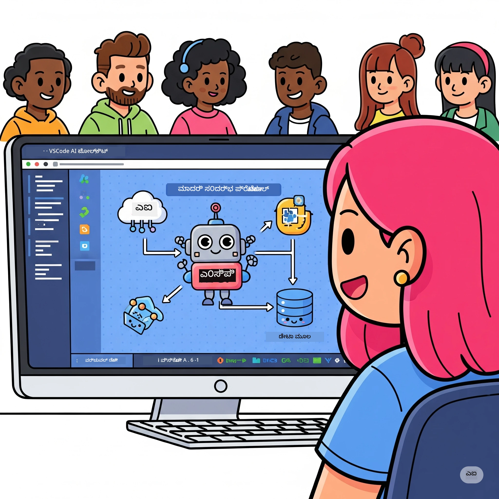

# AI ವರ್ಕ್‌ಫ್ಲೋಗಳ ಸರಳೀಕರಣ: AI ಟೂಲ್ಕಿಟ್‌ನೊಂದಿಗೆ MCP ಸರ್ವರ್ ನಿರ್ಮಾಣ

## 🎯 ಅವಲೋಕನ

_(ಈ ಪಾಠದ ವೀಡಿಯೋವನ್ನು ವೀಕ್ಷಿಸಲು ಮೇಲಿನ ಚಿತ್ರವನ್ನು ಕ್ಲಿಕ್ ಮಾಡಿ)_

**ಮಾಡೆಲ್ ಕಾಂಟೆಕ್ಸ್ಟ್ ಪ್ರೊಟೋಕಾಲ್ (MCP) ಕಾರ್ಯಾಗಾರಕ್ಕೆ** ನಿಮಗೆ ಸ್ವಾಗತ! ಈ ಸಂಪೂರ್ಣ ಹ್ಯಾಂಡ್‌ಗಳುನ್ ಕಾರ್ಯಾಗಾರವು ಎರಡು ನವೀನ ತಂತ್ರಜ್ಞಾನಗಳನ್ನು ಸಂಯೋಜಿಸಿ AI ಅರ್ಜಿಗಳ ಅಭಿವೃದ್ಧಿಯನ್ನು ಕ್ರಾಂತಿಕಾರಿಯಾಗಿಸುತ್ತದೆ:

- **🔗 ಮಾಡೆಲ್ ಕಾಂಟೆಕ್ಸ್ಟ್ ಪ್ರೊಟೋಕಾಲ್ (MCP)**: ಸುಗಮ AI-ಟೂಲ್ ಸಂಯೋಜನೆಗಾಗಿ ಒಂದು ಓಪನ್ ಸ್ಟ್ಯಾಂಡರ್ಡ್
- **🛠️ ವಿಎಸ್ ಕೋಡ್‌ಗಾಗಿ AI ಟೂಲ್ಕಿಟ್ (AITK)**: ಮೈಕ್ರೋಸಾಫ್ಟ್‌ನ ಶಕ್ತಿಶಾಲಿ AI ಅಭಿವೃದ್ಧಿ ಹೆಚ್ಚುವರಿ

### 🎓 ನೀವು ಯಾರು ಕಲಿಯುತ್ತೀರಿ

ಈ ಕಾರ್ಯಾಗಾರದ ಕೊನೆಯಲ್ಲಿ, ನೀವು ದಕ್ಷತೆ ಹೊಂದಿರುವ ಬುದ್ಧಿವಂತ ಅಪ್ಲಿಕೇಶನ್‌ಗಳನ್ನು ನಿರ್ಮಿಸುವ ಕಲೆಯ ಮಾಲೀಕರಾಗುತ್ತೀರಿ, ಅವು AI ಮಾದರಿಗಳನ್ನು ನೈಜ ವಿಶ್ವದ ಸಾಧನಗಳು ಮತ್ತು ಸೇವೆಗಳಿಗೆ ಸೇರುತ್ತವೆ. ಸ್ವಯಂಚಾಲಿತ ಪರೀಕ್ಷೆಯಿಂದ ಇಂದಕಂಡಂತೆ ಕಸ್ಟಮ್ API ಸಂಯೋಜನೆಗಳವರೆಗೆ, ಸಂಕೀರ್ಣ ವ್ಯವಹಾರ ಸಮಸ್ಯೆಗಳನ್ನು ಪರಿಹರಿಸಲು ನೀವು ಪ್ರಾಯೋಗಿಕ ಕೌಶಲ್ಯಗಳನ್ನು ಪಡೆಯುತ್ತೀರಿ.

## 🏗️ ತಂತ್ರಜ್ಞಾನ ಸ್ಟ್ಯಾಕ್

### 🔌 ಮಾಡೆಲ್ ಕಾಂಟೆಕ್ಸ್ಟ್ ಪ್ರೊಟೋಕಾಲ್ (MCP)

MCP ಎಂದರೆ **"USB-C for AI"** — ಇದು AI ಮಾದರಿಗಳನ್ನು ಬಾಹ್ಯ ಸಾಧನಗಳು ಮತ್ತು ಡೇಟಾ ಮೂಲಗಳಿಗೆ ಸಂಪರ್ಕಿಸುವ ಸರ್ವತ್ರ ಪ್ರಸಾರಿ ಸಂಜೀವಿ ಮಾನದಂಡ.

**✨ ಪ್ರಮುಖ ವೈಶಿಷ್ಟ್ಯಗಳು:**

- 🔄 **ಮಾನದಂಡಿತ ಸಂಯೋಜನೆ**: AI-ಟೂಲ್ಗಳ ಸಂಪರ್ಕಕ್ಕಾಗಿ ವಿಶ್ವಮಾನ್ಯ ಇಂಟರ್‌ಫೇಸ್
- 🏛️ **ಲವಚಿಕ ವಿನ್ಯಾಸ**: ಲೊಕಲ್ ಮತ್ತು ರಿಮೋಟ್ ಸರ್ವರ್‌ಗಳು stdio/SSE ಸಾರಾಂಶದ ಮೂಲಕ
- 🧰 **ಸಂಪನ್ನ ಪರಿಸರ**: ಒಂದು ಪ್ರೊಟೋಕಾಲ್‌ನಲ್ಲಿ ಸಾಧನಗಳು, ಪ್ರಾಂಪ್ಟ್‌ಗಳು ಮತ್ತು ಸಂಪನ್ಮೂಲಗಳು
- 🔒 **ಉತ್ಪಾದನಾ-ಸಿದ್ಧ**: ಉಂಟಾದ ಸುರಕ್ಷತೆ ಮತ್ತು ನಂಬಕತೆ

**🎯 MCP ಯಾಕೆ ಮುಖ್ಯ:**
USB-C ತಂತಿ ಗೊಂದಲವನ್ನು ನಿವಾರಿಸಿದಂತೆ, MCP AI ಸಂಯೋಜನೆಗಳ ಸಂಕೀರ್ಣತೆಯನ್ನು ನಿವಾರಿಸುತ್ತದೆ. ಒಂದು ಪ್ರೊಟೋಕಾಲ್, ಅನಂತ ಸಾಧ್ಯತೆಗಳು.

### 🤖 ವಿಎಸ್ ಕೋಡ್‌ಗಾಗಿ AI ಟೂಲ್ಕಿಟ್ (AITK)

ಮೈಕ್ರೋಸಾಫ್ಟ್‌ನ ಪ್ರಮುಖ AI ಅಭಿವೃದ್ಧಿ ವಿಸ್ತರಣೆಯಾಗಿದೆ, ಇದು VS ಕೋಡ್ ಅನ್ನು AI ಶಕ್ತಿಯಿಂದ ತುಂಬಿರುವ ಪ್ಲಾಟ್‌ಫಾರ್ಮ್ ಆಗಿ ಪರಿವರ್ತಿಸುತ್ತದೆ.

**🚀 ಮೂಲ ಸಾಮರ್ಥ್ಯಗಳು:**

- 📦 **ಮಾದರಿ ಕ್ಯಾಟಲಾಗ್**: ಆಜ್ಯೂರ್ AI, ಗಿಥಬ್, ಹಳೆಯಂಗ್ ಫೇಸ್, ಒಲ್ಲಾಮಾ ವರೆಗೆ ಮಾದರಿಗಳನ್ನು ಪ್ರವೇಶಿಸಬಹುದು
- ⚡ **ಸ್ಥಳೀಯ ನಿರ್ಧಾರ**: ONNX-ಆಪ್ಟಿಮೈಸ್ ಮಾಡಿದ CPU/GPU/NPU ಚಾಲನೆ
- 🏗️ **ಏಜೆಂಟ್ ಬಿಲ್ಡರ್**: MCP ಸಂಯೋಜನೆಯೊಂದಿಗೆ ದೃಶ್ಯ AI ಏಜೆಂಟ್ ಅಭಿವೃದ್ಧಿ
- 🎭 **ಮಲ್ಟಿ-ಮೋಡಲ್**: ಪಠ್ಯ, ದೃಷ್ಟಿ ಮತ್ತು ರಚಿತ ಔಟ್‌ಪುಟ್ ಬೆಂಬಲ

**💡 ಅಭಿವೃದ್ಧಿ ಪ್ರಯೋಜನಗಳು:**

- ಶೂನ್ಯಕಾಂಫಿಗ್ ಮಾದರಿ ನಿಯೋಜನೆ
- ದೃಶ್ಯ ಪ್ರಾಂಪ್ಟ್ ಎಂಜಿನಿಯರಿಂಗ್
- ನೇರ-ಸಮಯ ಪರೀಕ್ಷಾ ಮೈದಾನ
- ಸ್ಮೂತ್ MCP ಸರ್ವರ್ ಸಂಯೋಜನೆ

## 📚 ಕಲಿಕೆಯ ಪ್ರಯಾಣ

### [🚀 Module 1: AI Toolkit Fundamentals](./lab1/README.md)

**ಅವಧಿ**: 15 ನಿಮಿಷಗಳು

- 🛠️ VS ಕೋಡ್‌ಗಾಗಿ AI ಟೂಲ್ಕಿಟ್ ಅನ್ನು ಸ್ಥಾಪಿಸಿ ಮತ್ತು ಸಂರಚಿಸಿ
- 🗂️ ಮಾದರಿ ಕ್ಯಾಟಲಾಗ್ ಅನ್ವೇಷಿಸಿ (100+ ಮಾದರಿಗಳು GitHub, ONNX, OpenAI,Anthropic, Googleರಿಂದ)
- 🎮 ನೇರ-ಸಮಯ ಮಾದರಿ ಪರೀಕ್ಷೆಗೆ ಇಂಟರಾಕ್ಟಿವ್ ಪ್ಲೇಗ್ರೌಂಡ್ ಅಧ್ಯಯನ ಮಾಡಿ
- 🤖 ನಿಮ್ಮ ಮೊದಲ AI ಏಜೆಂಟ್ ಅನ್ನು ಏಜೆಂಟ್ ಬಿಲ್ಡರ್ ಬಳಸಿ ನಿರ್ಮಿಸಿ
- 📊 ಅಳತೆಗಳೊಂದಿಗೆ ಮಾದರಿಯ ಕಾರ್ಯಕ್ಷಮತೆ ಅಳೆಯಿರಿ (F1, ಸಂಬಂಧ, ಸादೃಶ್ಯತೆ, ಸಮ್ಮೇಳನ)
- ⚡ ಬ್ಯಾಚ್ ಪ್ರಕ್ರಿಯೆ ಮತ್ತು ಮಲ್ಟಿ-ಮೋಡಲ್ ಬೆಂಬಲ ಸಾಮರ್ಥ್ಯಗಳನ್ನು ಕಲಿಯೋಣ

**🎯 ಕಲಿಕಾ ಫಲಿತಾಂಶ**: AITK ಸಾಮರ್ಥ್ಯಗಳ ಸಂಪೂರ್ಣ ಅರಿವಿನಿಂದ ಕಾರ್ಯನಿರ್ವಹಿಸುವ AI ಏಜೆಂಟ್ ಅನ್ನು ರಚಿಸಿ

### [🌐 Module 2: MCP with AI Toolkit Fundamentals](./lab2/README.md)

**ಅವಧಿ**: 20 ನಿಮಿಷಗಳು

- 🧠 ಮಾಡೆಲ್ ಕಾಂಟೆಕ್ಸ್ಟ್ ಪ್ರೊಟೋಕಾಲ್ (MCP) ವಿನ್ಯಾಸ ಮತ್ತು ಸಿದ್ಧಾಂತಗಳನ್ನು ದಕ್ಷತೆಯಿಂದ ಅರಿತುಕೊಳ್ಳಿ
- 🌐 ಮೈಕ್ರೋಸಾಫ್ಟ್‌ನ MCP ಸರ್ವರ್ ಪರಿಸರವನ್ನು ವಿಶ್ಲೇಷಿಸಿ
- 🤖 Playwright MCP ಸರ್ವರ್ ಬಳಸಿ ಬ್ರೌಸರ್ ಆಟೋಮೇಷನ್ ಏಜೆಂಟ್ ನಿರ್ಮಿಸಿ
- 🔧 MCP ಸರ್ವರ್‌ಗಳನ್ನು AI Toolkit ಏಜೆಂಟ್ ಬಿಲ್ಡರ್‌ಗಳಿಗೆ ಸಂಯೋಜಿಸಿ
- 📊 ನಿಮ್ಮ ಏಜೆಂಟ್‌ಗಳಲ್ಲಿ MCP ಸಾಧನಗಳನ್ನು ಹೊಂದಿಸಿ ಮತ್ತು ಪರೀಕ್ಷಿಸಿ
- 🚀 MCP ಶಕ್ತಿಯುಳ್ಳ ಏಜೆಂಟ್‌ಗಳನ್ನು ರಫ್ತುಮಾಡಿ ಹಾಗೂ ಉತ್ಪಾದನೆಗೆ ನಿಯೋಜಿಸಿ

**🎯 ಕಲಿಕಾ ಫಲಿತಾಂಶ**: MCP ಮೂಲಕ ಬಾಹ್ಯ ಸಾಧನಗಳೊಂದಿಗೆ ಶಕ್ತಿಶಾಲಿ AI ಏಜೆಂಟ್ ಅನ್ನು ನಿಯೋಜಿಸಿ

### [🔧 Module 3: Advanced MCP Development with AI Toolkit](./lab3/README.md)

**ಅವಧಿ**: 20 ನಿಮಿಷಗಳು

- 💻 AI ಟೂಲ್ಕಿಟ್ ಬಳಸಿ ಕಸ್ಟಮ್ MCP ಸರ್ವರ್‌ಗಳನ್ನು ನಿರ್ಮಿಸಿ
- 🐍 ಅಧುನಿಕ MCP Python SDK (v1.9.3) ಅನ್ನು ಸಂರಚಿಸಿ ಮತ್ತು ಉಪಯೋಗಿಸಿ
- 🔍 ಡಿಬಗ್ಗೆ ಇನ್ನಷ್ಟೂ ಸಹ MCP ಇನ್ಸ್‌ಪೆಕ್ಟರ್ ಅನ್ನು ಹೊಂದಿಸಿ
- 🛠️ ವೃತ್ತಿಪರ ಡಿಬಗ್ಗಿಂಗ್ ಕಾರ್ಯಪ್ರವಾಹಗಳುಳ್ಳ ವಾತಾವರಣದಲ್ಲಿ ವಿದೇಶ MCP ಸರ್ವರ್ ನಿರ್ಮಿಸಿ
- 🧪 ಏಜೆಂಟ್ ಬಿಲ್ಡರ್ ಮತ್ತು ಇನ್ಸ್‌ಪೆಕ್ಟರ್ ಪರಿಸರಗಳಲ್ಲಿ MCP ಸರ್ವರ್‌ಗಳನ್ನು ಡಿಬಗ್ ಮಾಡಿ

**🎯 ಕಲಿಕಾ ಫಲಿತಾಂಶ**: ಆಧುನಿಕ ಸಾಧನಗಳೊಂದಿಗೆ ಕಸ್ಟಮ್ MCP ಸರ್ವರ್‌ಗಳನ್ನು ಅಭಿವೃದ್ಧಿಪಡಿಸಿ ಡಿಬಗ್ ಮಾಡುವುದು

### [🐙 Module 4: Practical MCP Development - Custom GitHub Clone Server](./lab4/README.md)

**ಅವಧಿ**: 30 ನಿಮಿಷಗಳು

- 🏗️ ನೈಜ ಜಗತ್ತಿನ GitHub ಕ್ಲೋನ್ MCP ಸರ್ವರ್ ಅನ್ನು ಅಭಿವೃದ್ಧಿ ಕಾರ್ಯಪ್ರವಾಹಗಳಿಗೆ ನಿರ್ಮಿಸಿ
- 🔄 ಮಾನ್ಯತೆ ಮತ್ತು ದೋಷ ನಿರ್ವಹಣೆಯೊಂದಿಗೆ ಸ್ಮಾರ್ಟ್ ರೆಪೊಸಿಟರಿ ಕ್ಲೋನಿಂಗ್ ಅನ್ನು ಜಾರಿಗೊಳಿಸಿ
- 📁 ಬುದ್ಧಿವಂತ ಡೈರೆಕ್ಟರಿ ನಿರ್ವಹಣೆ ಮತ್ತು VS ಕೋಡ್ ಒಕ್ಕೂಟವನ್ನು ರಚಿಸಿ
- 🤖 GitHub Copilot ಏಜೆಂಟ್ ಮೋಡ್ ಬಳಸಿ ಕಸ್ಟಮ್ MCP ಸಾಧನಗಳನ್ನು ಉಪಯೋಗಿಸಿ
- 🛡️ ಉತ್ಪಾದನೆ-ಸಿದ್ಧ ನಂಬಕತೆ ಮತ್ತು ಕ್ರಾಸ್-ಪ್ಲಾಟ್‌ಫಾರ್ಮ್ ಹೊಂದಾಣಿಕೆ ಅನ್ವಯಿಸಿ

**🎯 ಕಲಿಕಾ ಫಲಿತಾಂಶ**: ನೈಜ ಅಭಿವೃದ್ಧಿ ಕಾರ್ಯಪ್ರವಾಹಗಳನ್ನು ಸರಳಗೊಳಿಸುವ ಉತ್ಪಾದನಾ-ಸಿದ್ಧ MCP ಸರ್ವರ್ ಅನ್ನು ನಿಯೋಜಿಸಿ

## 💡 ನೈಜ ಜಗತ್ತಿನ ಅನ್ವಯಗಳು ಮತ್ತು ಪರಿಣಾಮ

### 🏢 ಎಂಟರ್ಪ್ರೈಸಿನ ಬಳಕೆ ಪ್ರಕರಣಗಳು

#### 🔄 ಡೇವ್‌ಆಪ್ಸ್ ಸ್ವಯಂಚಾಲನೆ

ನಿಮ್ಮ ಅಭಿವೃದ್ಧಿ ಕಾರ್ಯಪ್ರವಾಹವನ್ನು ಬುದ್ಧಿವಂತ ಸ್ವಯಂಚಾಲನೆ ಮೂಲಕ ಪರಿವರ್ತಿಸಿ:

- **ಸ್ಮಾರ್ಟ್ ರೆಪೊಸಿಟರಿ ನಿರ್ವಹಣೆ**: AI ಚಾಲಿತ ಕೋಡ್ ವಿಮರ್ಶೆ ಮತ್ತು ಮರ್ಜ್ ನಿರ್ಣಯಗಳು
- **ಬುದ್ಧಿವಂತ CI/CD**: ಕೋಡ್ ಬದಲಾವಣೆ ಆಧಾರಿತ ಸ್ವಯಂಚಾಲಿತ ಪೈಪ್‌ಲೈನ್ ಆಪ್ಟಿಮೈಜೆಶನ್
- **ಸಮಸ್ಯೆ ವರ್ಗೀಕರಣ**: ತಮಾಷೆಯದ ದೋಷ ವರ್ಗೀಕರಣ ಮತ್ತು ಜವಾಬ್ದಾರಿ ನಿಗದಿಪಡಿಸುವಿಕೆ

#### 🧪 ಗುಣಮಟ್ಟ ಭದ್ರತೆ ಕ್ರಾಂತಿ

AI ಚಾಲಿತ ಸ್ವಯಂಚಾಲನೆಯೊಂದಿಗೆ ಪರೀಕ್ಷೆಗಳನ್ನು ಸುಧಾರಿಸಿ:

- **ಬುದ್ಧಿವಂತ ಪರೀಕ್ಷಾ ಸೃಷ್ಟಿ**: ಸ್ವಯಂಚಾಲಿತವಾಗಿ ಸಮಗ್ರ ಪರೀಕ್ಷಾ ಸರಣಿಗಳನ್ನು ರಚಿಸುವುದು
- **ದೃಶ್ಯ ಉತ್ತರಚಾರ ಪರೀಕ್ಷೆ**: AI ಚಾಲಿತ UI ಬದಲಾವಣೆ ಪತ್ತೆ
- **ಕಾರ್ಯಕ್ಷಮತೆ ಗಮನವಿಡುವಿಕೆ**: ಮುಂಚಿತ ಸಮಸ್ಯೆ ಗುರುತು ಮತ್ತು ಪರಿಹಾರ

#### 📊 ಡೇಟಾ ಪೈಪ್ಲೈನ್ ಬುದ್ಧಿವಂತಿಕೆ

ಸ್ಮಾರ್ಟ್ ಡೇಟಾ ಪ್ರಕ್ರಿಯೆ ಕಾರ್ಯಪ್ರವಾಹಗಳನ್ನು ನಿರ್ಮಿಸಿ:

- **ಮಾನ್ಯമായ ETL ಪ್ರಕ್ರಿಯೆಗಳು**: ಸ್ವಯಂ-ಆಪ್ಟಿಮೈಸ್ ಆಗುವ ಡೇಟಾ ಪರಿವರ್ತನೆಗಳು
- **ಅಸಮಾನ್ಯ ಪತ್ತೆ**: ನೇರ-ಸಮಯ ಡೇಟಾ ಗುಣಮಟ್ಟ ನಿಯಂತರಣೆ
- **ಬುದ್ಧಿವಂತ ಮಾರ್ಗದರ್ಶನ**: ಸ್ಮಾರ್ಟ್ ಡೇಟಾ ಹರಿವು ನಿರ್ವಹಣೆ

#### 🎧 ಗ್ರಾಹಕ ಅನುಭವ ಹೆಚ್ಚುವರಿ

ಅದ್ಭುತ ಗ್ರಾಹಕ ಸಂವಹನವನ್ನು ಸೃಷ್ಟಿಸಿ:

- **ಸಂದರ್ಭಗ್ರಾಫಿಕ ಬೆಂಬಲ**: ಗ್ರಾಹಕ ಇತಿಹಾಸವನ್ನು ಪ್ರವೇಶಿಸುವ AI ಏಜೆಂಟ್‌ಗಳು
- **ಮುಂಚಿತ ಸಮಸ್ಯೆ ಪರಿಹಾರ**: ಭವಿಷ್ಯನಿರೀಕ್ಷಣಾ ಗ್ರಾಹಕ ಸೇವೆ
- **ಬಹು-ಚಾನೆಲ್ ಒಕ್ಕೂಟ**: ಪ್ಲಾಟ್‌ಫಾರ್ಮ್‌ಗಳಾದ್ಯಂತ ಏಕೀಕೃತ AI ಅನುಭವ

## 🛠️ ಪೂರ್ವಾಪೇಕ್ಷೆಗಳು ಮತ್ತು ಸೆಟ್‌ಅಪ್

### 💻 ಸಿಸ್ಟಮ್ ಅಗತ್ಯತೆಗಳು

| ಘಟಕ | ಅವಶ್ಯಕತೆ | ಟಿಪ್ಪಣಿಗಳು |
|-----------|-------------|-------|
| **ಆಪರೇಟಿಂಗ್ ಸಿಸ್ಟಮ್** | Windows 10+, macOS 10.15+, ಲಿನಕ್ಸ್ | ಯಾವುದೇ ಆಧುನಿಕ OS |
| **ವಿಶುವಲ್ ಸ್ಟುಡಿಯೊ ಕೋಡ್** | ಇತ್ತೀಚಿನ ಸ್ಥಿರ ಆವೃತ್ತಿ | AITKಗೆ ಅಗತ್ಯ |
| **ನೋಡ್.ಜೆಎಸ್** | v18.0+ ಮತ್ತು npm | MCP ಸರ್ವರ್ ವಿನ್ಯಾಸಕ್ಕೆ |
| **ಪೈಥಾನ್** | 3.10+ | Python MCP ಸರ್ವರ್‌ಗಳಿಗೆ ಐಚ್ಛಿಕ |
| **ಮೆಮರಿ** | ಕನಿಷ್ಠ 8GB RAM | ಸ್ಥಳೀಯ ಮಾದರಿಗಳಿಗೆ 16GB ಶಿಫಾರಸು |

### 🔧 ಅಭಿವೃದ್ಧಿ ಪರಿಸರ

#### ಶಿಫಾರಸು ಮಾಡಲಾದ VS ಕೋಡ್ ಎಕ್ಸ್ಟೆನ್ಷನ್ಸ್

- **AI Toolkit** (ms-windows-ai-studio.windows-ai-studio)
- **Python** (ms-python.python)
- **Python Debugger** (ms-python.debugpy)
- **GitHub Copilot** (GitHub.copilot) - ಐಚ್ಛಿಕ ಆದರೆ ಸಹಾಯಕ

#### ಐಚ್ಛಿಕ ಸಾಧನಗಳು

- **uv**: ಆಧುನಿಕ Python ಪ್ಯಾಕೇಜ್ ಮ್ಯಾನೇಜರ್
- **MCP Inspector**: MCP ಸರ್ವರ್‌ಗಾಗಿ ದೃಶ್ಯ ಡಿಬಗಿಂಗ್ ಸಾಧನ
- **Playwright**: ವೆಬ್ ಸ್ವಯಂಚಾಲನೆ ಉದಾಹರಣೆಗಳಿಗೆ

## 🎖️ ಕಲಿಕೆಯ ಫಲಿತಾಂಶಗಳು ಮತ್ತು ಪ್ರಮಾಣೀಕರಣ ಮಾರ್ಗ

### 🏆 ಕೌಶಲ್ಯ ನಿಪುಣತಾ ತಹಶೀಲ ಅಧಿಸೂಚಿ

ಈ ಕಾರ್ಯಾಗಾರವನ್ನು ಪೂರ್ಣಗೊಳಿಸುವ ಮೂಲಕ, ನೀವು ಇವುಗಳಲ್ಲಿ ನಿಪುಣರಾದೀರಿ:

#### 🎯 ಮೂಲ ಸಾಮರ್ಥ್ಯಗಳು

- [ ] **MCP ಪ್ರೊಟೋಕಾಲ್ ನಿಪುಣತೆ**: ವಿನ್ಯಾಸ ಹಾಗೂ ಅನುಷ್ಠಾನ ಮಾದರಿಗಳ ಆಳವಾದ ಅರ್ಥಮಾಡಿಕೊಳ್ಳಿ
- [ ] **AITK ಪರಿಣತಿ**: ವೇಗದ ಅಭಿವೃದ್ಧಿಗಾಗಿ AI ಟೂಲ್ಕಿಟ್ ನ ನಿಪುಣ ಉಪಯೋಗ
- [ ] **ಕಸ್ಟಮ್ ಸರ್ವರ್ ಅಭಿವೃದ್ಧಿ**: ಉತ್ಪಾದನಾ MCP ಸರ್ವರ್‌ಗಳನ್ನು ನಿರ್ಮಿಸಿ, ನಿಯೋಜಿಸಿ, ಮತ್ತು ನಿರ್ವಹಿಸಿ
- [ ] **ಟೂಲ್ ಸಂಯೋಜನೆ ಉತ್ಕೃಷ್ಟತೆ**: AI ಮತ್ತು ಇರುವ ಅಭಿವೃದ್ಧಿ ಕಾರ್ಯಪ್ರವಾಹಗಳ ಕಡಿ ತಪ್ಪದೇ ಸಂಪರ್ಕಿಸಿ
- [ ] **ಸಮಸ್ಯೆ-ನಿರಾಕರಣ ಅನ್ವಯಿಕೆ**: ಕಲಿತ ಕೌಶಲ್ಯಗಳನ್ನು ನೈಜ ವ್ಯವಹಾರ ಸಮಸ್ಯೆಗಳಿಗೆ ಅನ್ವಯಿಸಿ

#### 🔧 ತಾಂತ್ರಿಕ ಕೌಶಲ್ಯಗಳು

- [ ] VS ಕೋಡ್‌ನಲ್ಲಿ AI Toolkit ಸ್ಥಾಪಿಸಿ ಮತ್ತು ಸಂರಚಿಸಿ
- [ ] ಕಸ್ಟಮ್ MCP ಸರ್ವರ್‌ಗಳನ್ನು ವಿನ್ಯಾಸ ಮಾಡಿ ಮತ್ತು ಅನುಷ್ಠಾನಗೊಳಿಸಿ
- [ ] GitHub ಮಾದರಿಗಳನ್ನು MCP ವಿನ್ಯಾಸಕ್ಕೆ ಸಂಯೋಜಿಸಿ
- [ ] Playwright ಬಳಸಿ ಸ್ವಯಂಚಾಲಿತ ಪರೀಕ್ಷಾ ಕಾರ್ಯಪ್ರವಾಹಗಳನ್ನು ನಿರ್ಮಿಸಿ
- [ ] ಉತ್ಪಾದನೆಗೆ AI ಏಜೆಂಟುಗಳನ್ನು ನಿಯೋಜಿಸಿ
- [ ] MCP ಸರ್ವರ್ ಕಾರ್ಯಕ್ಷಮತೆಯನ್ನು ಡಿಬಗ್ ಮಾಡಿ ಮತ್ತು ಉತ್ತಮಗೊಳಿಸಿ

#### 🚀 ಅಗ್ರಗಣ್ಯ ಸಾಮರ್ಥ್ಯಗಳು

- [ ] ಎಂಟರ್ಪ್ರೈಸ್-ಮಾಪನ AI ಸಂಯೋಜನೆಗಳ ವಿನ್ಯಾಸ
- [ ] AI ಅಪ್ಲಿಕೇಶನ್ಗಳಿಗಾಗಿ ಭದ್ರತೆ ಉತ್ತಮ ಪ್ರಕ್ರಿಯೆಗಳ ಅನುಷ್ಠಾನ
- [ ] ಮಾಪನೋಗ್ಯ MCP ಸರ್ವರ್ ವಿನ್ಯಾಸಗಳು
- [ ] ನಿರ್ದಿಷ್ಟ ಕ್ಷೇತ್ರಗಳಿಗಾಗಿ ಕಸ್ಟಮ್ ಟೂಲ್ ಸರಣಿಯ ರಚನೆ
- [ ] AI-ಸ್ವಜಾತಿ ಅಭಿವೃದ್ಧಿಯಲ್ಲಿ ಇತರೆಗಳನ್ನು ಮಾರ್ಗದರ್ಶನ

## 📖 ಹೆಚ್ಚುವರಿ ಸಂಪನ್ಮೂಲಗಳು

- [MCP ನಿರ್ದಿಷ್ಟೀಕರಣ (2025-11-25)](https://spec.modelcontextprotocol.io/specification/2025-11-25/)
- [AI Toolkit GitHub ಡಿಪಾಜಿಟರಿ](https://github.com/microsoft/vscode-ai-toolkit)
- [ನಮೂನೆ MCP ಸರ್ವರ್‌ಗಳ ಸಂಗ್ರಹಣೆ](https://github.com/modelcontextprotocol/servers)
- [ಉತ್ತಮ ಅಭ್ಯಾಸಗಳ ಗೈಡ್](https://modelcontextprotocol.io/docs/best-practices)
- [OWASP MCP ಟಾಪ್ 10](https://microsoft.github.io/mcp-azure-security-guide/mcp/) - ಸುರಕ್ಷತೆಯ ಉತ್ತಮ ಅಭ್ಯಾಸಗಳು

---

**🚀 ನಿಮ್ಮ AI ಅಭಿವೃದ್ಧಿ ಕಾರ್ಯಪ್ರವಾಹವನ್ನು ಕ್ರಾಂತಿಕಾರಿಯಾಗಿಸಲು ಸಜ್ಜಾಗುತ್ತಿದ್ದೀರಾ?**

MCP ಮತ್ತು AI ಟೂಲ್ಕಿಟ್ ಜೊತೆಗೆ ಬುದ್ಧಿವಂತ ಅಪ್ಲಿಕೇಶನ್‌ಗಳ ಭವಿಷ್ಯವನ್ನು ನಿರ್ಮಿಸೋಣ!

## ಮುಂದೇನು

ಮುಂದುವರಿಯಿರಿ: [Module 11: MCP Server Hands-On Labs](../11-MCPServerHandsOnLabs/README.md)

---

<!-- CO-OP TRANSLATOR DISCLAIMER START -->
**ಜ್ಞಾಪನೆ**:  
ಈ ಡಾಕ್ಯುಮೆಂಟ್ ಅನ್ನು AI ಅನುವಾದ ಸೇವೆ [Co-op Translator](https://github.com/Azure/co-op-translator) ಬಳಸಿ ಅನುವಾದಿಸಲಾಗಿದೆ. ನಾವು ಅച്ചುಮೆಚ್ಚಿನ ಪ್ರಮಾಣವನ್ನು ಕಾಪಾಡಲು ಪ್ರಯತ್ನಿಸುತ್ತಿದ್ದರೂ, ಸ್ವಯಂಕ್ರಿಯ ಅನುವಾದಗಳಲ್ಲಿ ತಪ್ಪುಗಳು ಅಥವಾ ಅಸಮ್ಮತಿಗಳಿರುವ ಸಾಧ್ಯತೆ ಇದೆ. ಮೂಲ ಭಾಷೆಯ ಡಾಕ್ಯುಮೆಂಟ್ ಸಂವೇದನಾತ್ಮಕ ಮೂಲವಾಗಿರುತ್ತದೆ ಎಂದು ಪರಿಗಣಿಸಬೇಕು. ಪ್ರಮುಖ ಮಾಹಿತಿಗಾಗಿ ವೃತ್ತಿಪರ ಮಾನವ ಅನುವಾದವನ್ನು ಶಿಫಾರಸು ಮಾಡಲಾಗುತ್ತದೆ. ಈ ಅನುವಾದ ಬಳಕೆಯಿಂದ ಆಗೋ ಯಾವುದೇ ತಪ್ಪಾ ಅರ್ಥಮಾಡಿಕೊಳ್ಳುವಿಕೆಗೆ ನಾವು ಜವಾಬ್ದಾರರಾಗುವುದಿಲ್ಲ.
<!-- CO-OP TRANSLATOR DISCLAIMER END -->