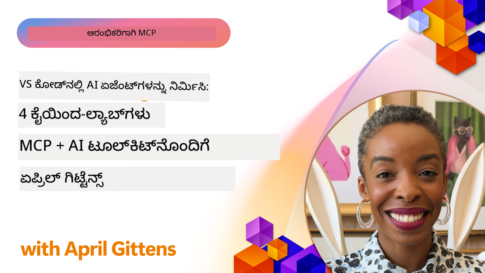

<!--
CO_OP_TRANSLATOR_METADATA:
{
  "original_hash": "1b000fd6e1b04c047578bfc5d07d54eb",
  "translation_date": "2025-12-11T11:41:46+00:00",
  "source_file": "10-StreamliningAIWorkflowsBuildingAnMCPServerWithAIToolkit/README.md",
  "language_code": "kn"
}
-->
# AI ಕಾರ್ಯಪ್ರವಾಹಗಳನ್ನು ಸರಳಗೊಳಿಸುವುದು: AI ಟೂಲ್ಕಿಟ್‌ನೊಂದಿಗೆ MCP ಸರ್ವರ್ ನಿರ್ಮಾಣ

## 🎯 ಅವಲೋಕನ

_(ಈ ಪಾಠದ ವೀಡಿಯೋವನ್ನು ನೋಡಲು ಮೇಲಿನ ಚಿತ್ರವನ್ನು ಕ್ಲಿಕ್ ಮಾಡಿ)_

**ಮಾಡೆಲ್ ಕಾಂಟೆಕ್ಸ್ಟ್ ಪ್ರೋಟೋಕಾಲ್ (MCP) ಕಾರ್ಯಾಗಾರಕ್ಕೆ ಸ್ವಾಗತ!** ಈ ಸಮಗ್ರ ಹ್ಯಾಂಡ್ಸ್-ಆನ್ ಕಾರ್ಯಾಗಾರವು ಎರಡು ಅತ್ಯಾಧುನಿಕ ತಂತ್ರಜ್ಞಾನಗಳನ್ನು ಸಂಯೋಜಿಸಿ AI ಅಪ್ಲಿಕೇಶನ್ ಅಭಿವೃದ್ಧಿಯನ್ನು ಕ್ರಾಂತಿಕಾರಿಯಾಗಿ ರೂಪಿಸುತ್ತದೆ:

- **🔗 ಮಾಡೆಲ್ ಕಾಂಟೆಕ್ಸ್ಟ್ ಪ್ರೋಟೋಕಾಲ್ (MCP)**: ನಿರಂತರ AI-ಟೂಲ್ ಸಂಯೋಜನೆಗಾಗಿ ಓಪನ್ ಸ್ಟ್ಯಾಂಡರ್ಡ್
- **🛠️ ವಿಸುಯಲ್ ಸ್ಟುಡಿಯೋ ಕೋಡ್‌ಗಾಗಿ AI ಟೂಲ್ಕಿಟ್ (AITK)**: ಮೈಕ್ರೋಸಾಫ್ಟ್‌ನ ಶಕ್ತಿಶಾಲಿ AI ಅಭಿವೃದ್ಧಿ ವಿಸ್ತರಣೆ

### 🎓 ನೀವು ಕಲಿಯುವದು ಏನು

ಈ ಕಾರ್ಯಾಗಾರದ ಅಂತ್ಯಕ್ಕೆ, ನೀವು ಬುದ್ಧಿವಂತ ಅಪ್ಲಿಕೇಶನ್‌ಗಳನ್ನು ನಿರ್ಮಿಸುವ ಕಲೆಗಳಲ್ಲಿ ಪರಿಣತಿ ಪಡೆಯುತ್ತೀರಿ, ಅವು AI ಮಾದರಿಗಳನ್ನು ನೈಜ ಜಗತ್ತಿನ ಉಪಕರಣಗಳು ಮತ್ತು ಸೇವೆಗಳೊಂದಿಗೆ ಸೇರ್ಪಡೆ ಮಾಡುತ್ತವೆ. ಸ್ವಯಂಚಾಲಿತ ಪರೀಕ್ಷೆಯಿಂದ ಕಸ್ಟಮ್ API ಸಂಯೋಜನೆಗಳವರೆಗೆ, ನೀವು ಸಂಕೀರ್ಣ ವ್ಯವಹಾರ ಸವಾಲುಗಳನ್ನು ಪರಿಹರಿಸಲು ಪ್ರಾಯೋಗಿಕ ಕೌಶಲ್ಯಗಳನ್ನು ಪಡೆಯುತ್ತೀರಿ.

## 🏗️ ತಂತ್ರಜ್ಞಾನ ಸ್ಟ್ಯಾಕ್

### 🔌 ಮಾಡೆಲ್ ಕಾಂಟೆಕ್ಸ್ಟ್ ಪ್ರೋಟೋಕಾಲ್ (MCP)

MCP ಎಂದರೆ **"AI ಗಾಗಿ USB-C"** - AI ಮಾದರಿಗಳನ್ನು ಹೊರಗಿನ ಉಪಕರಣಗಳು ಮತ್ತು ಡೇಟಾ ಮೂಲಗಳಿಗೆ ಸಂಪರ್ಕಿಸುವ ವಿಶ್ವವ್ಯಾಪಿ ಸ್ಟ್ಯಾಂಡರ್ಡ್.

**✨ ಪ್ರಮುಖ ವೈಶಿಷ್ಟ್ಯಗಳು:**

- 🔄 **ಪ್ರಮಾಣೀಕೃತ ಸಂಯೋಜನೆ**: AI-ಟೂಲ್ ಸಂಪರ್ಕಗಳಿಗೆ ವಿಶ್ವವ್ಯಾಪಿ ಇಂಟರ್ಫೇಸ್
- 🏛️ **ಲವಚಿಕ معماري**: ಸ್ಥಳೀಯ ಮತ್ತು ದೂರದ ಸರ್ವರ್‌ಗಳು stdio/SSE ಸಾರಿಗೆ ಮೂಲಕ
- 🧰 **ಸಮೃದ್ಧ ಪರಿಸರ**: ಒಬ್ಬ ಪ್ರೋಟೋಕಾಲ್‌ನಲ್ಲಿ ಉಪಕರಣಗಳು, ಪ್ರಾಂಪ್ಟ್‌ಗಳು ಮತ್ತು ಸಂಪನ್ಮೂಲಗಳು
- 🔒 **ಎಂಟರ್‌ಪ್ರೈಸ್-ಸಿದ್ಧ**: ಒಳಗೊಂಡಿರುವ ಭದ್ರತೆ ಮತ್ತು ನಂಬಿಕೆ

**🎯 MCP ಯಾಕೆ ಮುಖ್ಯ:**
USB-C ಕೇಬಲ್ ಗೊಂದಲವನ್ನು ನಿವಾರಣೆ ಮಾಡಿದಂತೆ, MCP AI ಸಂಯೋಜನೆಗಳ ಸಂಕೀರ್ಣತೆಯನ್ನು ನಿವಾರಣೆ ಮಾಡುತ್ತದೆ. ಒಂದು ಪ್ರೋಟೋಕಾಲ್, ಅನಂತ ಸಾಧ್ಯತೆಗಳು.

### 🤖 ವಿಸುಯಲ್ ಸ್ಟುಡಿಯೋ ಕೋಡ್‌ಗಾಗಿ AI ಟೂಲ್ಕಿಟ್ (AITK)

ಮೈಕ್ರೋಸಾಫ್ಟ್‌ನ ಪ್ರಮುಖ AI ಅಭಿವೃದ್ಧಿ ವಿಸ್ತರಣೆ, ಇದು VS ಕೋಡ್ ಅನ್ನು AI ಶಕ್ತಿಶಾಲಿ ಪ್ಲಾಟ್‌ಫಾರ್ಮ್ ಆಗಿ ಪರಿವರ್ತಿಸುತ್ತದೆ.

**🚀 ಮೂಲ ಸಾಮರ್ಥ್ಯಗಳು:**

- 📦 **ಮಾದರಿ ಕ್ಯಾಟಲಾಗ್**: ಅಜೂರ್ AI, GitHub, Hugging Face, Ollama ನಿಂದ ಮಾದರಿಗಳನ್ನು ಪ್ರವೇಶಿಸಿ
- ⚡ **ಸ್ಥಳೀಯ ನಿರ್ಣಯ**: ONNX-ಆಪ್ಟಿಮೈಸ್ ಮಾಡಿದ CPU/GPU/NPU ಕಾರ್ಯಾಚರಣೆ
- 🏗️ **ಏಜೆಂಟ್ ಬಿಲ್ಡರ್**: MCP ಸಂಯೋಜನೆಯೊಂದಿಗೆ ದೃಶ್ಯ AI ಏಜೆಂಟ್ ಅಭಿವೃದ್ಧಿ
- 🎭 **ಬಹು-ಮಾದರಿ**: ಪಠ್ಯ, ದೃಷ್ಟಿ ಮತ್ತು ರಚನಾತ್ಮಕ ಔಟ್‌ಪುಟ್ ಬೆಂಬಲ

**💡 ಅಭಿವೃದ್ಧಿ ಲಾಭಗಳು:**

- ಶೂನ್ಯ-ಕಾನ್ಫಿಗ್ ಮಾದರಿ ನಿಯೋಜನೆ
- ದೃಶ್ಯ ಪ್ರಾಂಪ್ಟ್ ಎಂಜಿನಿಯರಿಂಗ್
- ನೈಜ-ಸಮಯ ಪರೀಕ್ಷಾ ಪ್ಲೇಗ್ರೌಂಡ್
- ನಿರಂತರ MCP ಸರ್ವರ್ ಸಂಯೋಜನೆ

## 📚 ಕಲಿಕೆಯ ಪ್ರಯಾಣ

### [🚀 ಘಟಕ 1: AI ಟೂಲ್ಕಿಟ್ ಮೂಲಭೂತಗಳು](./lab1/README.md)

**ಅವಧಿ**: 15 ನಿಮಿಷಗಳು

- 🛠️ VS ಕೋಡ್‌ಗೆ AI ಟೂಲ್ಕಿಟ್ ಅನ್ನು ಸ್ಥಾಪಿಸಿ ಮತ್ತು ಸಂರಚಿಸಿ
- 🗂️ ಮಾಡೆಲ್ ಕ್ಯಾಟಲಾಗ್ ಅನ್ನು ಅನ್ವೇಷಿಸಿ (GitHub, ONNX, OpenAI, Anthropic, Google ನಿಂದ 100+ ಮಾದರಿಗಳು)
- 🎮 ನೈಜ-ಸಮಯ ಮಾದರಿ ಪರೀಕ್ಷೆಗೆ ಇಂಟರಾಕ್ಟಿವ್ ಪ್ಲೇಗ್ರೌಂಡ್‌ನಲ್ಲಿ ಪರಿಣತಿ ಪಡೆಯಿರಿ
- 🤖 ಏಜೆಂಟ್ ಬಿಲ್ಡರ್ ಬಳಸಿ ನಿಮ್ಮ ಮೊದಲ AI ಏಜೆಂಟ್ ನಿರ್ಮಿಸಿ
- 📊 ಒಳಗೊಂಡಿರುವ ಮೆಟ್ರಿಕ್ಸ್ (F1, ಪ್ರಾಸಂಗಿಕತೆ, ಸಾದೃಶ್ಯತೆ, ಸಮ್ಮಿಲನ) ಮೂಲಕ ಮಾದರಿ ಕಾರ್ಯಕ್ಷಮತೆಯನ್ನು ಮೌಲ್ಯಮಾಪನ ಮಾಡಿ
- ⚡ ಬ್ಯಾಚ್ ಪ್ರೊಸೆಸಿಂಗ್ ಮತ್ತು ಬಹು-ಮಾದರಿ ಬೆಂಬಲ ಸಾಮರ್ಥ್ಯಗಳನ್ನು ಕಲಿಯಿರಿ

**🎯 ಕಲಿಕೆಯ ಫಲಿತಾಂಶ**: AITK ಸಾಮರ್ಥ್ಯಗಳ ಸಮಗ್ರ ಅರ್ಥದೊಂದಿಗೆ ಕಾರ್ಯನಿರ್ವಹಿಸುವ AI ಏಜೆಂಟ್ ರಚಿಸಿ

### [🌐 ಘಟಕ 2: MCP ಮತ್ತು AI ಟೂಲ್ಕಿಟ್ ಮೂಲಭೂತಗಳು](./lab2/README.md)

**ಅವಧಿ**: 20 ನಿಮಿಷಗಳು

- 🧠 ಮಾಡೆಲ್ ಕಾಂಟೆಕ್ಸ್ಟ್ ಪ್ರೋಟೋಕಾಲ್ (MCP) معماري ಮತ್ತು ತತ್ವಗಳನ್ನು ಪರಿಣತಿ ಪಡೆಯಿರಿ
- 🌐 ಮೈಕ್ರೋಸಾಫ್ಟ್‌ನ MCP ಸರ್ವರ್ ಪರಿಸರವನ್ನು ಅನ್ವೇಷಿಸಿ
- 🤖 Playwright MCP ಸರ್ವರ್ ಬಳಸಿ ಬ್ರೌಸರ್ ಸ್ವಯಂಚಾಲಿತ ಏಜೆಂಟ್ ನಿರ್ಮಿಸಿ
- 🔧 MCP ಸರ್ವರ್‌ಗಳನ್ನು AI ಟೂಲ್ಕಿಟ್ ಏಜೆಂಟ್ ಬಿಲ್ಡರ್‌ಗೆ ಸಂಯೋಜಿಸಿ
- 📊 ನಿಮ್ಮ ಏಜೆಂಟ್‌ಗಳಲ್ಲಿ MCP ಉಪಕರಣಗಳನ್ನು ಸಂರಚಿಸಿ ಮತ್ತು ಪರೀಕ್ಷಿಸಿ
- 🚀 ಉತ್ಪಾದನೆ ಬಳಕೆಗೆ MCP-ಚಾಲಿತ ಏಜೆಂಟ್‌ಗಳನ್ನು ರಫ್ತು ಮಾಡಿ ಮತ್ತು ನಿಯೋಜಿಸಿ

**🎯 ಕಲಿಕೆಯ ಫಲಿತಾಂಶ**: ಹೊರಗಿನ ಉಪಕರಣಗಳ ಮೂಲಕ ಶಕ್ತಿಶಾಲಿ AI ಏಜೆಂಟ್ ಅನ್ನು ನಿಯೋಜಿಸಿ

### [🔧 ಘಟಕ 3: AI ಟೂಲ್ಕಿಟ್‌ನೊಂದಿಗೆ ಉನ್ನತ MCP ಅಭಿವೃದ್ಧಿ](./lab3/README.md)

**ಅವಧಿ**: 20 ನಿಮಿಷಗಳು

- 💻 AI ಟೂಲ್ಕಿಟ್ ಬಳಸಿ ಕಸ್ಟಮ್ MCP ಸರ್ವರ್‌ಗಳನ್ನು ರಚಿಸಿ
- 🐍 ಇತ್ತೀಚಿನ MCP Python SDK (v1.9.3) ಅನ್ನು ಸಂರಚಿಸಿ ಮತ್ತು ಬಳಸಿ
- 🔍 ಡಿಬಗ್ ಮಾಡಲು MCP ಇನ್ಸ್ಪೆಕ್ಟರ್ ಅನ್ನು ಸ್ಥಾಪಿಸಿ ಮತ್ತು ಉಪಯೋಗಿಸಿ
- 🛠️ ವೃತ್ತಿಪರ ಡಿಬಗ್ ಕಾರ್ಯಪ್ರವಾಹಗಳೊಂದಿಗೆ ವಾತಾವರಣ MCP ಸರ್ವರ್ ನಿರ್ಮಿಸಿ
- 🧪 ಏಜೆಂಟ್ ಬಿಲ್ಡರ್ ಮತ್ತು ಇನ್ಸ್ಪೆಕ್ಟರ್ ಪರಿಸರಗಳಲ್ಲಿ MCP ಸರ್ವರ್‌ಗಳನ್ನು ಡಿಬಗ್ ಮಾಡಿ

**🎯 ಕಲಿಕೆಯ ಫಲಿತಾಂಶ**: ಆಧುನಿಕ ಉಪಕರಣಗಳೊಂದಿಗೆ ಕಸ್ಟಮ್ MCP ಸರ್ವರ್‌ಗಳನ್ನು ಅಭಿವೃದ್ಧಿಪಡಿಸಿ ಮತ್ತು ಡಿಬಗ್ ಮಾಡಿ

### [🐙 ಘಟಕ 4: ಪ್ರಾಯೋಗಿಕ MCP ಅಭಿವೃದ್ಧಿ - ಕಸ್ಟಮ್ GitHub ಕ್ಲೋನ್ ಸರ್ವರ್](./lab4/README.md)

**ಅವಧಿ**: 30 ನಿಮಿಷಗಳು

- 🏗️ ಅಭಿವೃದ್ಧಿ ಕಾರ್ಯಪ್ರವಾಹಗಳಿಗಾಗಿ ನೈಜ GitHub ಕ್ಲೋನ್ MCP ಸರ್ವರ್ ನಿರ್ಮಿಸಿ
- 🔄 ಮಾನ್ಯತೆ ಮತ್ತು ದೋಷ ನಿರ್ವಹಣೆಯೊಂದಿಗೆ ಸ್ಮಾರ್ಟ್ ರೆಪೊಸಿಟರಿ ಕ್ಲೋನಿಂಗ್ ಅನ್ನು ಜಾರಿಗೆ ತರುವಿರಿ
- 📁 ಬುದ್ಧಿವಂತ ಡೈರೆಕ್ಟರಿ ನಿರ್ವಹಣೆ ಮತ್ತು VS ಕೋಡ್ ಸಂಯೋಜನೆ ರಚಿಸಿ
- 🤖 ಕಸ್ಟಮ್ MCP ಉಪಕರಣಗಳೊಂದಿಗೆ GitHub Copilot ಏಜೆಂಟ್ ಮೋಡ್ ಬಳಸಿ
- 🛡️ ಉತ್ಪಾದನೆ-ಸಿದ್ಧ ನಂಬಿಕೆ ಮತ್ತು ಕ್ರಾಸ್-ಪ್ಲಾಟ್‌ಫಾರ್ಮ್ ಹೊಂದಾಣಿಕೆ ಅನ್ವಯಿಸಿ

**🎯 ಕಲಿಕೆಯ ಫಲಿತಾಂಶ**: ನೈಜ ಅಭಿವೃದ್ಧಿ ಕಾರ್ಯಪ್ರವಾಹಗಳನ್ನು ಸರಳಗೊಳಿಸುವ ಉತ್ಪಾದನೆ-ಸಿದ್ಧ MCP ಸರ್ವರ್ ಅನ್ನು ನಿಯೋಜಿಸಿ

## 💡 ನೈಜ ಜಗತ್ತಿನ ಅಪ್ಲಿಕೇಶನ್‌ಗಳು ಮತ್ತು ಪ್ರಭಾವ

### 🏢 ಎಂಟರ್‌ಪ್ರೈಸ್ ಬಳಕೆ ಪ್ರಕರಣಗಳು

#### 🔄 ಡೆವ್ಓಪ್ಸ್ ಸ್ವಯಂಚಾಲನೆ

ನಿಮ್ಮ ಅಭಿವೃದ್ಧಿ ಕಾರ್ಯಪ್ರವಾಹವನ್ನು ಬುದ್ಧಿವಂತ ಸ್ವಯಂಚಾಲನೆಯೊಂದಿಗೆ ಪರಿವರ್ತಿಸಿ:

- **ಸ್ಮಾರ್ಟ್ ರೆಪೊಸಿಟರಿ ನಿರ್ವಹಣೆ**: AI ಚಾಲಿತ ಕೋಡ್ ವಿಮರ್ಶೆ ಮತ್ತು ಮರ್ಜ್ ನಿರ್ಧಾರಗಳು
- **ಬುದ್ಧಿವಂತ CI/CD**: ಕೋಡ್ ಬದಲಾವಣೆಗಳ ಆಧಾರದ ಮೇಲೆ ಸ್ವಯಂಚಾಲಿತ ಪೈಪ್ಲೈನ್ ಆಪ್ಟಿಮೈಜೆಷನ್
- **ಇಶ್ಯೂ ಟ್ರೈಯಾಜ್**: ಸ್ವಯಂಚಾಲಿತ ದೋಷ ವರ್ಗೀಕರಣ ಮತ್ತು ನಿಯೋಜನೆ

#### 🧪 ಗುಣಮಟ್ಟ ಭರವಸೆ ಕ್ರಾಂತಿ

AI ಚಾಲಿತ ಸ್ವಯಂಚಾಲನೆಯೊಂದಿಗೆ ಪರೀಕ್ಷೆಯನ್ನು ಎತ್ತಿ:

- **ಬುದ್ಧಿವಂತ ಪರೀಕ್ಷಾ ರಚನೆ**: ಸ್ವಯಂಚಾಲಿತವಾಗಿ ಸಮಗ್ರ ಪರೀಕ್ಷಾ ಸ್ಯೂಟ್‌ಗಳನ್ನು ರಚಿಸಿ
- **ದೃಶ್ಯ ರಿಗ್ರೆಷನ್ ಪರೀಕ್ಷೆ**: AI ಚಾಲಿತ UI ಬದಲಾವಣೆ ಪತ್ತೆ
- **ಕಾರ್ಯಕ್ಷಮತೆ ಮೇಲ್ವಿಚಾರಣೆ**: ಪ್ರೋಆಕ್ಟಿವ್ ಸಮಸ್ಯೆ ಗುರುತಿಸುವಿಕೆ ಮತ್ತು ಪರಿಹಾರ

#### 📊 ಡೇಟಾ ಪೈಪ್ಲೈನ್ ಬುದ್ಧಿವಂತಿಕೆ

ಸ್ಮಾರ್ಟ್ ಡೇಟಾ ಪ್ರಕ್ರಿಯೆ ಕಾರ್ಯಪ್ರವಾಹಗಳನ್ನು ನಿರ್ಮಿಸಿ:

- **ಅನುಕೂಲಿತ ETL ಪ್ರಕ್ರಿಯೆಗಳು**: ಸ್ವಯಂ-ಆಪ್ಟಿಮೈಜಿಂಗ್ ಡೇಟಾ ಪರಿವರ್ತನೆಗಳು
- **ವಿಚಿತ್ರತೆ ಪತ್ತೆ**: ನೈಜ-ಸಮಯ ಡೇಟಾ ಗುಣಮಟ್ಟ ಮೇಲ್ವಿಚಾರಣೆ
- **ಬುದ್ಧಿವಂತ ಮಾರ್ಗದರ್ಶನ**: ಸ್ಮಾರ್ಟ್ ಡೇಟಾ ಹರಿವು ನಿರ್ವಹಣೆ

#### 🎧 ಗ್ರಾಹಕ ಅನುಭವ ಸುಧಾರಣೆ

ಅತ್ಯುತ್ತಮ ಗ್ರಾಹಕ ಸಂವಹನಗಳನ್ನು ರಚಿಸಿ:

- **ಸಂದರ್ಭ-ಜಾಗೃತ ಬೆಂಬಲ**: ಗ್ರಾಹಕ ಇತಿಹಾಸಕ್ಕೆ ಪ್ರವೇಶ ಹೊಂದಿರುವ AI ಏಜೆಂಟ್‌ಗಳು
- **ಪ್ರೋಆಕ್ಟಿವ್ ಸಮಸ್ಯೆ ಪರಿಹಾರ**: ಭವಿಷ್ಯವಾಣಿ ಗ್ರಾಹಕ ಸೇವೆ
- **ಬಹು-ಚಾನೆಲ್ ಸಂಯೋಜನೆ**: ವೇದಿಕೆಗಳಾದ್ಯಾಂತ ಏಕೀಕೃತ AI ಅನುಭವ

## 🛠️ ಪೂರ್ವಾಪೇಕ್ಷೆಗಳು ಮತ್ತು ಸೆಟಪ್

### 💻 ವ್ಯವಸ್ಥೆ ಅಗತ್ಯಗಳು

| ಘಟಕ | ಅಗತ್ಯ | ಟಿಪ್ಪಣಿಗಳು |
|-----------|-------------|-------|
| **ಆಪರೇಟಿಂಗ್ ಸಿಸ್ಟಮ್** | ವಿಂಡೋಸ್ 10+, macOS 10.15+, ಲಿನಕ್ಸ್ | ಯಾವುದೇ ಆಧುನಿಕ OS |
| **ವಿಸುಯಲ್ ಸ್ಟುಡಿಯೋ ಕೋಡ್** | ಇತ್ತೀಚಿನ ಸ್ಥಿರ ಆವೃತ್ತಿ | AITK ಗಾಗಿ ಅಗತ್ಯ |
| **Node.js** | v18.0+ ಮತ್ತು npm | MCP ಸರ್ವರ್ ಅಭಿವೃದ್ಧಿಗಾಗಿ |
| **Python** | 3.10+ | Python MCP ಸರ್ವರ್‌ಗಳಿಗೆ ಐಚ್ಛಿಕ |
| **ಮೆಮೊರಿ** | ಕನಿಷ್ಠ 8GB RAM | ಸ್ಥಳೀಯ ಮಾದರಿಗಳಿಗೆ 16GB ಶಿಫಾರಸು |

### 🔧 ಅಭಿವೃದ್ಧಿ ಪರಿಸರ

#### ಶಿಫಾರಸು ಮಾಡಿದ VS ಕೋಡ್ ವಿಸ್ತರಣೆಗಳು

- **AI Toolkit** (ms-windows-ai-studio.windows-ai-studio)
- **Python** (ms-python.python)
- **Python Debugger** (ms-python.debugpy)
- **GitHub Copilot** (GitHub.copilot) - ಐಚ್ಛಿಕ ಆದರೆ ಸಹಾಯಕ

#### ಐಚ್ಛಿಕ ಉಪಕರಣಗಳು

- **uv**: ಆಧುನಿಕ Python ಪ್ಯಾಕೇಜ್ ಮ್ಯಾನೇಜರ್
- **MCP Inspector**: MCP ಸರ್ವರ್‌ಗಳ ದೃಶ್ಯ ಡಿಬಗ್ ಉಪಕರಣ
- **Playwright**: ವೆಬ್ ಸ್ವಯಂಚಾಲನೆ ಉದಾಹರಣೆಗಳಿಗೆ

## 🎖️ ಕಲಿಕೆಯ ಫಲಿತಾಂಶಗಳು ಮತ್ತು ಪ್ರಮಾಣಪತ್ರ ಮಾರ್ಗ

### 🏆 ಕೌಶಲ್ಯ ಪರಿಣತಿ ಪರಿಶೀಲನೆ

ಈ ಕಾರ್ಯಾಗಾರವನ್ನು ಪೂರ್ಣಗೊಳಿಸುವ ಮೂಲಕ, ನೀವು ಈ ಕ್ಷೇತ್ರಗಳಲ್ಲಿ ಪರಿಣತಿ ಪಡೆಯುತ್ತೀರಿ:

#### 🎯 ಮೂಲ ಸಾಮರ್ಥ್ಯಗಳು

- [ ] **MCP ಪ್ರೋಟೋಕಾಲ್ ಪರಿಣತಿ**: معماري ಮತ್ತು ಅನುಷ್ಠಾನ ಮಾದರಿಗಳ ಆಳವಾದ ಅರ್ಥ
- [ ] **AITK ನಿಪುಣತೆ**: ವೇಗದ ಅಭಿವೃದ್ಧಿಗಾಗಿ AI ಟೂಲ್ಕಿಟ್ ನ ಪರಿಣತಿ
- [ ] **ಕಸ್ಟಮ್ ಸರ್ವರ್ ಅಭಿವೃದ್ಧಿ**: ಉತ್ಪಾದನೆ MCP ಸರ್ವರ್‌ಗಳನ್ನು ನಿರ್ಮಿಸಿ, ನಿಯೋಜಿಸಿ ಮತ್ತು ನಿರ್ವಹಿಸಿ
- [ ] **ಟೂಲ್ ಸಂಯೋಜನೆ ಶ್ರೇಷ್ಠತೆ**: ಅಸ್ತಿತ್ವದಲ್ಲಿರುವ ಅಭಿವೃದ್ಧಿ ಕಾರ್ಯಪ್ರವಾಹಗಳೊಂದಿಗೆ AI ಅನ್ನು ನಿರಂತರವಾಗಿ ಸಂಪರ್ಕಿಸಿ
- [ ] **ಸಮಸ್ಯೆ-ಪರಿಹಾರ ಅನ್ವಯಿಕೆ**: ಕಲಿತ ಕೌಶಲ್ಯಗಳನ್ನು ನೈಜ ವ್ಯವಹಾರ ಸವಾಲುಗಳಿಗೆ ಅನ್ವಯಿಸಿ

#### 🔧 ತಾಂತ್ರಿಕ ಕೌಶಲ್ಯಗಳು

- [ ] VS ಕೋಡ್‌ನಲ್ಲಿ AI ಟೂಲ್ಕಿಟ್ ಅನ್ನು ಸ್ಥಾಪಿಸಿ ಮತ್ತು ಸಂರಚಿಸಿ
- [ ] ಕಸ್ಟಮ್ MCP ಸರ್ವರ್‌ಗಳನ್ನು ವಿನ್ಯಾಸಗೊಳಿಸಿ ಮತ್ತು ಅನುಷ್ಠಾನಗೊಳಿಸಿ
- [ ] GitHub ಮಾದರಿಗಳನ್ನು MCP معماريಗೆ ಸಂಯೋಜಿಸಿ
- [ ] Playwright ಬಳಸಿ ಸ್ವಯಂಚಾಲಿತ ಪರೀಕ್ಷಾ ಕಾರ್ಯಪ್ರವಾಹಗಳನ್ನು ನಿರ್ಮಿಸಿ
- [ ] ಉತ್ಪಾದನೆ ಬಳಕೆಗೆ AI ಏಜೆಂಟ್‌ಗಳನ್ನು ನಿಯೋಜಿಸಿ
- [ ] MCP ಸರ್ವರ್ ಕಾರ್ಯಕ್ಷಮತೆಯನ್ನು ಡಿಬಗ್ ಮಾಡಿ ಮತ್ತು ಆಪ್ಟಿಮೈಸ್ ಮಾಡಿ

#### 🚀 ಉನ್ನತ ಸಾಮರ್ಥ್ಯಗಳು

- [ ] ಎಂಟರ್‌ಪ್ರೈಸ್-ಮಟ್ಟದ AI ಸಂಯೋಜನೆಗಳನ್ನು معماريಗೊಳಿಸಿ
- [ ] AI ಅಪ್ಲಿಕೇಶನ್‌ಗಳಿಗೆ ಭದ್ರತಾ ಉತ್ತಮ ಅಭ್ಯಾಸಗಳನ್ನು ಅನುಷ್ಠಾನಗೊಳಿಸಿ
- [ ] ವಿಸ್ತರಿಸಬಹುದಾದ MCP ಸರ್ವರ್ معماريಗಳನ್ನು ವಿನ್ಯಾಸಗೊಳಿಸಿ
- [ ] ನಿರ್ದಿಷ್ಟ ಕ್ಷೇತ್ರಗಳಿಗೆ ಕಸ್ಟಮ್ ಟೂಲ್ ಚೈನ್‌ಗಳನ್ನು ರಚಿಸಿ
- [ ] AI-ಸ್ವಭಾವದ ಅಭಿವೃದ್ಧಿಯಲ್ಲಿ ಇತರರನ್ನು ಮಾರ್ಗದರ್ಶನ ಮಾಡಿ

## 📖 ಹೆಚ್ಚುವರಿ ಸಂಪನ್ಮೂಲಗಳು

- [MCP ಸ್ಪೆಸಿಫಿಕೇಶನ್](https://modelcontextprotocol.io/docs)
- [AI Toolkit GitHub ಸಂಗ್ರಹಾಲಯ](https://github.com/microsoft/vscode-ai-toolkit)
- [ನಮೂನಾ MCP ಸರ್ವರ್‌ಗಳ ಸಂಗ್ರಹ](https://github.com/modelcontextprotocol/servers)
- [ಉತ್ತಮ ಅಭ್ಯಾಸಗಳ ಮಾರ್ಗದರ್ಶಿ](https://modelcontextprotocol.io/docs/best-practices)

---

**🚀 ನಿಮ್ಮ AI ಅಭಿವೃದ್ಧಿ ಕಾರ್ಯಪ್ರವಾಹವನ್ನು ಕ್ರಾಂತಿಕಾರಿಯಾಗಿ ರೂಪಿಸಲು ಸಿದ್ಧರಿದ್ದೀರಾ?**

MCP ಮತ್ತು AI ಟೂಲ್ಕಿಟ್‌ನೊಂದಿಗೆ ಬುದ್ಧಿವಂತ ಅಪ್ಲಿಕೇಶನ್‌ಗಳ ಭವಿಷ್ಯವನ್ನು ಒಟ್ಟಿಗೆ ನಿರ್ಮಿಸೋಣ!

---

<!-- CO-OP TRANSLATOR DISCLAIMER START -->
**ಅಸ್ವೀಕಾರ**:  
ಈ ದಸ್ತಾವೇಜು AI ಅನುವಾದ ಸೇವೆ [Co-op Translator](https://github.com/Azure/co-op-translator) ಬಳಸಿ ಅನುವಾದಿಸಲಾಗಿದೆ. ನಾವು ನಿಖರತೆಯಿಗಾಗಿ ಪ್ರಯತ್ನಿಸುತ್ತಿದ್ದರೂ, ಸ್ವಯಂಚಾಲಿತ ಅನುವಾದಗಳಲ್ಲಿ ತಪ್ಪುಗಳು ಅಥವಾ ಅಸತ್ಯತೆಗಳು ಇರಬಹುದು ಎಂದು ದಯವಿಟ್ಟು ಗಮನಿಸಿ. ಮೂಲ ಭಾಷೆಯಲ್ಲಿರುವ ಮೂಲ ದಸ್ತಾವೇಜನ್ನು ಅಧಿಕೃತ ಮೂಲವೆಂದು ಪರಿಗಣಿಸಬೇಕು. ಪ್ರಮುಖ ಮಾಹಿತಿಗಾಗಿ, ವೃತ್ತಿಪರ ಮಾನವ ಅನುವಾದವನ್ನು ಶಿಫಾರಸು ಮಾಡಲಾಗುತ್ತದೆ. ಈ ಅನುವಾದ ಬಳಕೆಯಿಂದ ಉಂಟಾಗುವ ಯಾವುದೇ ತಪ್ಪು ಅರ್ಥಮಾಡಿಕೊಳ್ಳುವಿಕೆ ಅಥವಾ ತಪ್ಪು ವಿವರಣೆಗಳಿಗೆ ನಾವು ಹೊಣೆಗಾರರಾಗುವುದಿಲ್ಲ.
<!-- CO-OP TRANSLATOR DISCLAIMER END -->