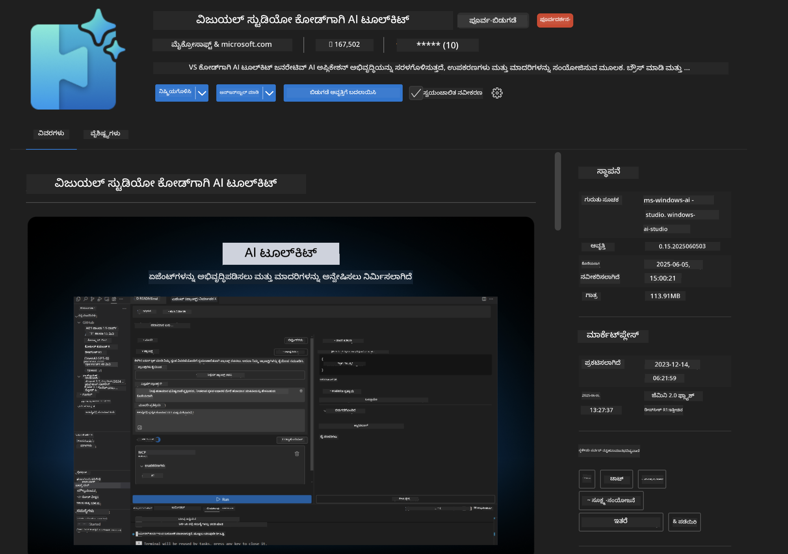
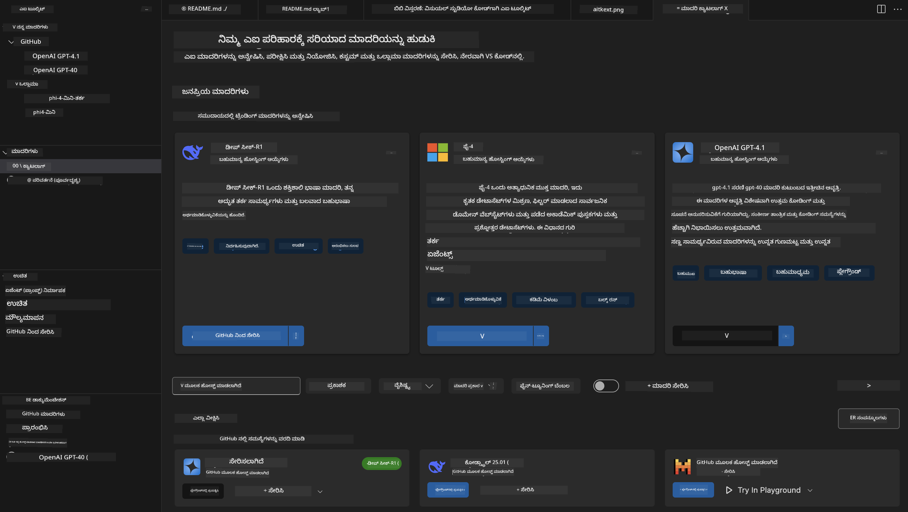
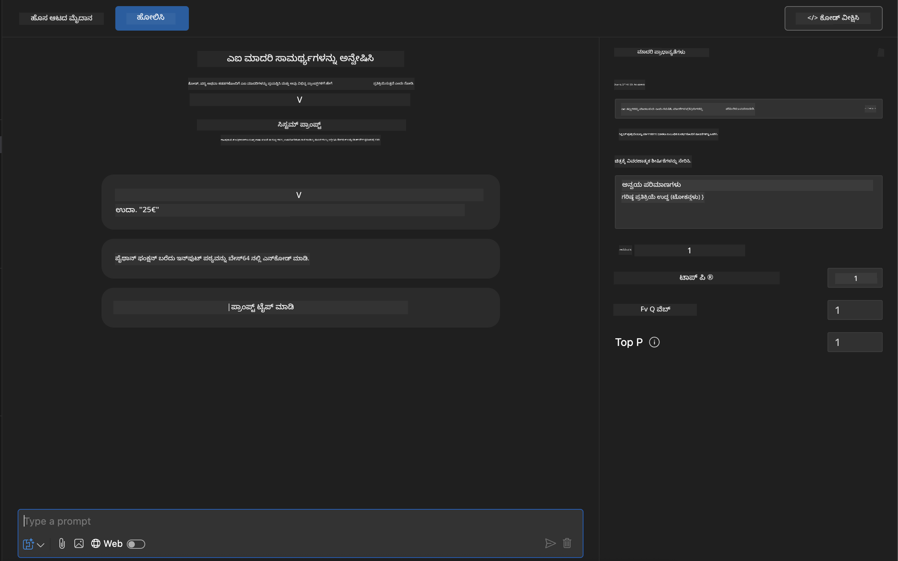
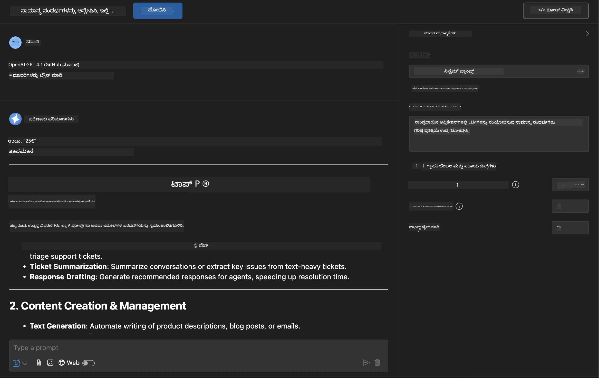
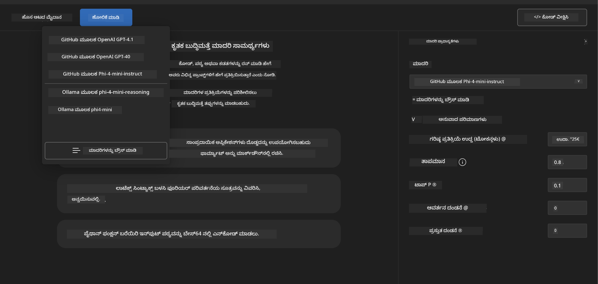
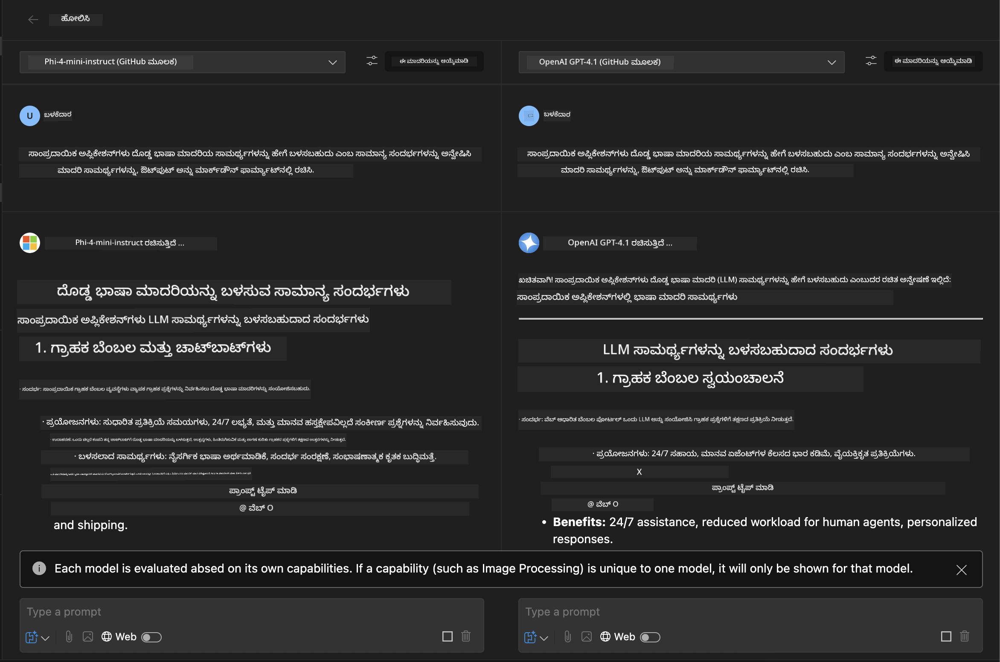
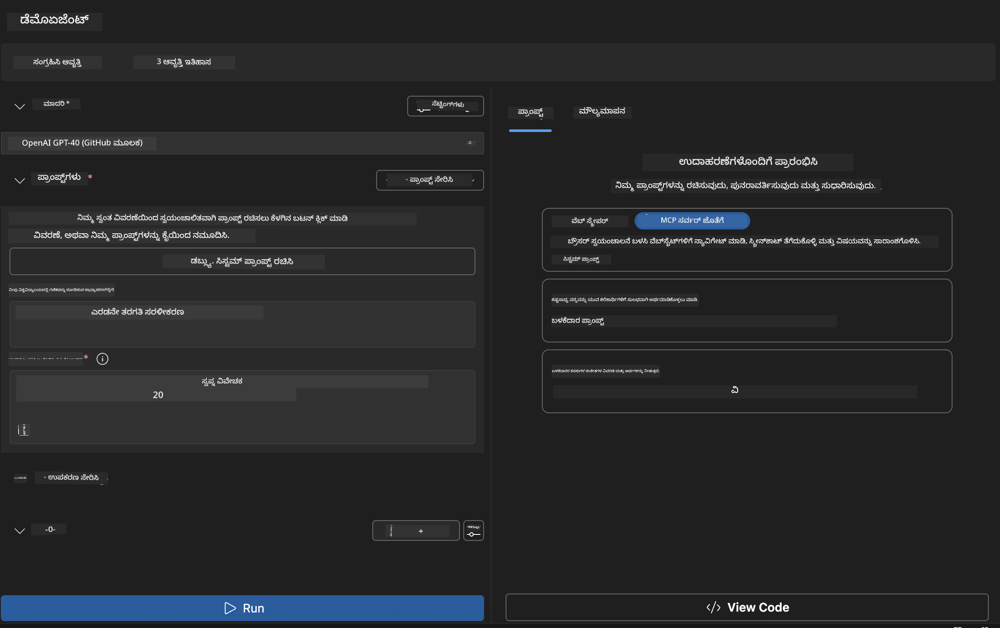
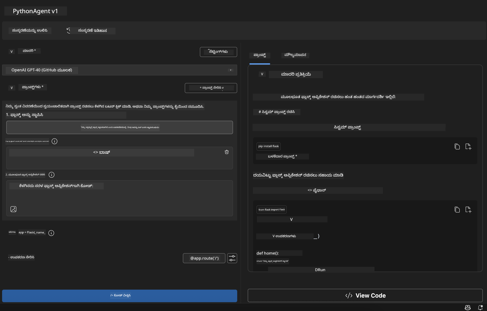

<!--
CO_OP_TRANSLATOR_METADATA:
{
  "original_hash": "2aa9dbc165e104764fa57e8a0d3f1c73",
  "translation_date": "2025-12-11T16:46:40+00:00",
  "source_file": "10-StreamliningAIWorkflowsBuildingAnMCPServerWithAIToolkit/lab1/README.md",
  "language_code": "kn"
}
-->
# 🚀 ಮೋಡ್ಯೂಲ್ 1: AI ಟೂಲ್‌ಕಿಟ್ ಮೂಲಭೂತಗಳು

[]()
[]()
[]()

## 📋 ಕಲಿಕೆಯ ಉದ್ದೇಶಗಳು

ಈ ಮೋಡ್ಯೂಲ್‌ನ ಅಂತ್ಯಕ್ಕೆ, ನೀವು ಸಾಧ್ಯವಾಗುತ್ತದೆ:
- ✅ Visual Studio Code ಗಾಗಿ AI ಟೂಲ್‌ಕಿಟ್ ಅನ್ನು ಸ್ಥಾಪಿಸಿ ಮತ್ತು ಸಂರಚಿಸಿ
- ✅ ಮಾದರಿ ಕ್ಯಾಟಲಾಗ್ ಅನ್ನು ನಾವಿಗೇಟ್ ಮಾಡಿ ಮತ್ತು ವಿಭಿನ್ನ ಮಾದರಿ ಮೂಲಗಳನ್ನು ಅರ್ಥಮಾಡಿಕೊಳ್ಳಿ
- ✅ ಮಾದರಿ ಪರೀಕ್ಷೆ ಮತ್ತು ಪ್ರಯೋಗಕ್ಕಾಗಿ ಪ್ಲೇಗ್ರೌಂಡ್ ಬಳಸಿ
- ✅ ಏಜೆಂಟ್ ಬಿಲ್ಡರ್ ಬಳಸಿ ಕಸ್ಟಮ್ AI ಏಜೆಂಟ್‌ಗಳನ್ನು ರಚಿಸಿ
- ✅ ವಿಭಿನ್ನ ಪೂರೈಕೆದಾರರ ನಡುವೆ ಮಾದರಿ ಕಾರ್ಯಕ್ಷಮತೆಯನ್ನು ಹೋಲಿಸಿ
- ✅ ಪ್ರಾಂಪ್ಟ್ ಎಂಜಿನಿಯರಿಂಗ್‌ಗೆ ಉತ್ತಮ ಅಭ್ಯಾಸಗಳನ್ನು ಅನ್ವಯಿಸಿ

## 🧠 AI ಟೂಲ್‌ಕಿಟ್ (AITK) ಗೆ ಪರಿಚಯ

**Visual Studio Code ಗಾಗಿ AI ಟೂಲ್‌ಕಿಟ್** ಮೈಸ್ರೋಸಾಫ್ಟ್‌ನ ಪ್ರಮುಖ ವಿಸ್ತರಣೆ ಆಗಿದ್ದು, VS ಕೋಡ್ ಅನ್ನು ಸಮಗ್ರ AI ಅಭಿವೃದ್ಧಿ ಪರಿಸರವಾಗಿ ಪರಿವರ್ತಿಸುತ್ತದೆ. ಇದು AI ಸಂಶೋಧನೆ ಮತ್ತು ಪ್ರಾಯೋಗಿಕ ಅನ್ವಯ ಅಭಿವೃದ್ಧಿಯ ನಡುವೆ ಸೇತುವೆಯನ್ನು ನಿರ್ಮಿಸಿ, ಜನರೇಟಿವ್ AI ಅನ್ನು ಎಲ್ಲಾ ಕೌಶಲ್ಯ ಮಟ್ಟದ ಡೆವಲಪರ್‌ಗಳಿಗೆ ಲಭ್ಯವಾಗಿಸುತ್ತದೆ.

### 🌟 ಪ್ರಮುಖ ಸಾಮರ್ಥ್ಯಗಳು

| ವೈಶಿಷ್ಟ್ಯ | ವಿವರಣೆ | ಬಳಕೆ ಪ್ರಕರಣ |
|---------|-------------|----------|
| **🗂️ ಮಾದರಿ ಕ್ಯಾಟಲಾಗ್** | GitHub, ONNX, OpenAI, Anthropic, Google ನಿಂದ 100+ ಮಾದರಿಗಳನ್ನು ಪ್ರವೇಶಿಸಿ | ಮಾದರಿ ಅನ್ವೇಷಣೆ ಮತ್ತು ಆಯ್ಕೆ |
| **🔌 BYOM ಬೆಂಬಲ** | ನಿಮ್ಮ ಸ್ವಂತ ಮಾದರಿಗಳನ್ನು (ಸ್ಥಳೀಯ/ದೂರಸ್ಥ) ಸಂಯೋಜಿಸಿ | ಕಸ್ಟಮ್ ಮಾದರಿ ನಿಯೋಜನೆ |
| **🎮 ಇಂಟರಾಕ್ಟಿವ್ ಪ್ಲೇಗ್ರೌಂಡ್** | ಚಾಟ್ ಇಂಟರ್ಫೇಸ್‌ನೊಂದಿಗೆ ರಿಯಲ್-ಟೈಮ್ ಮಾದರಿ ಪರೀಕ್ಷೆ | ವೇಗದ ಪ್ರೋಟೋಟೈಪಿಂಗ್ ಮತ್ತು ಪರೀಕ್ಷೆ |
| **📎 ಬಹು-ಮೋಡಲ್ ಬೆಂಬಲ** | ಪಠ್ಯ, ಚಿತ್ರಗಳು ಮತ್ತು ಅಟ್ಯಾಚ್ಮೆಂಟ್‌ಗಳನ್ನು ನಿರ್ವಹಿಸಿ | ಸಂಕೀರ್ಣ AI ಅನ್ವಯಗಳು |
| **⚡ ಬ್ಯಾಚ್ ಪ್ರೊಸೆಸಿಂಗ್** | ಹಲವಾರು ಪ್ರಾಂಪ್ಟ್‌ಗಳನ್ನು ಒಂದೇ ಸಮಯದಲ್ಲಿ ಚಾಲನೆ ಮಾಡಿ | ಪರಿಣಾಮಕಾರಿ ಪರೀಕ್ಷಾ ಕಾರ್ಯಪ್ರವಾಹಗಳು |
| **📊 ಮಾದರಿ ಮೌಲ್ಯಮಾಪನ** | ಒಳಗೊಂಡ ಮೆಟ್ರಿಕ್ಸ್ (F1, ಪ್ರಾಸಂಗಿಕತೆ, ಸಾದೃಶ್ಯತೆ, ಸಮ್ಮಿಲನ) | ಕಾರ್ಯಕ್ಷಮತೆ ಮೌಲ್ಯಮಾಪನ |

### 🎯 AI ಟೂಲ್‌ಕಿಟ್ ಮಹತ್ವವೇನು

- **🚀 ವೇಗವಂತ ಅಭಿವೃದ್ಧಿ**: ಕಲ್ಪನೆದಿಂದ ಪ್ರೋಟೋಟೈಪ್‌ಗೆ ನಿಮಿಷಗಳಲ್ಲಿ
- **🔄 ಏಕೀಕೃತ ಕಾರ್ಯಪ್ರವಾಹ**: ಹಲವಾರು AI ಪೂರೈಕೆದಾರರಿಗಾಗಿ ಒಂದೇ ಇಂಟರ್ಫೇಸ್
- **🧪 ಸುಲಭ ಪ್ರಯೋಗ**: ಸಂಕೀರ್ಣ ಸೆಟ್‌ಅಪ್ ಇಲ್ಲದೆ ಮಾದರಿಗಳನ್ನು ಹೋಲಿಸಿ
- **📈 ಉತ್ಪಾದನೆಗೆ ಸಿದ್ಧ**: ಪ್ರೋಟೋಟೈಪ್‌ನಿಂದ ನಿಯೋಜನೆಗೆ ನಿರಂತರ ಪರಿವರ್ತನೆ

## 🛠️ ಪೂರ್ವಾಪೇಕ್ಷೆಗಳು ಮತ್ತು ಸೆಟ್‌ಅಪ್

### 📦 AI ಟೂಲ್‌ಕಿಟ್ ವಿಸ್ತರಣೆ ಸ್ಥಾಪನೆ

**ಹಂತ 1: ವಿಸ್ತರಣೆ ಮಾರುಕಟ್ಟೆಗೆ ಪ್ರವೇಶಿಸಿ**
1. Visual Studio Code ತೆರೆಯಿರಿ
2. ವಿಸ್ತರಣೆ ವೀಕ್ಷಣೆಗೆ ನಾವಿಗೇಟ್ ಮಾಡಿ (`Ctrl+Shift+X` ಅಥವಾ `Cmd+Shift+X`)
3. "AI Toolkit" ಅನ್ನು ಹುಡುಕಿ

**ಹಂತ 2: ನಿಮ್ಮ ಆವೃತ್ತಿಯನ್ನು ಆಯ್ಕೆಮಾಡಿ**
- **🟢 ಬಿಡುಗಡೆ**: ಉತ್ಪಾದನಾ ಬಳಕೆಗೆ ಶಿಫಾರಸು ಮಾಡಲಾಗಿದೆ
- **🔶 ಪೂರ್ವ-ಬಿಡುಗಡೆ**: ಅತ್ಯಾಧುನಿಕ ವೈಶಿಷ್ಟ್ಯಗಳಿಗೆ ಮುಂಚಿತ ಪ್ರವೇಶ

**ಹಂತ 3: ಸ್ಥಾಪಿಸಿ ಮತ್ತು ಸಕ್ರಿಯಗೊಳಿಸಿ**



### ✅ ಪರಿಶೀಲನಾ ಪಟ್ಟಿ
- [ ] AI Toolkit ಐಕಾನ್ VS ಕೋಡ್ ಸೈಡ್‌ಬಾರ್‌ನಲ್ಲಿ ಕಾಣಿಸುತ್ತದೆ
- [ ] ವಿಸ್ತರಣೆ ಸಕ್ರಿಯಗೊಂಡಿದೆ ಮತ್ತು ಸಕ್ರಿಯವಾಗಿದೆ
- [ ] ಔಟ್‌ಪುಟ್ ಪ್ಯಾನೆಲ್‌ನಲ್ಲಿ ಯಾವುದೇ ಸ್ಥಾಪನಾ ದೋಷಗಳಿಲ್ಲ

## 🧪 ಕೈಯಿಂದ ಅಭ್ಯಾಸ 1: GitHub ಮಾದರಿಗಳನ್ನು ಅನ್ವೇಷಣೆ

**🎯 ಉದ್ದೇಶ**: ಮಾದರಿ ಕ್ಯಾಟಲಾಗ್‌ನಲ್ಲಿ ಪರಿಣತಿ ಪಡೆಯಿರಿ ಮತ್ತು ನಿಮ್ಮ ಮೊದಲ AI ಮಾದರಿಯನ್ನು ಪರೀಕ್ಷಿಸಿ

### 📊 ಹಂತ 1: ಮಾದರಿ ಕ್ಯಾಟಲಾಗ್ ನಾವಿಗೇಟ್ ಮಾಡಿ

ಮಾದರಿ ಕ್ಯಾಟಲಾಗ್ ನಿಮ್ಮ AI ಪರಿಸರಕ್ಕೆ ಪ್ರವೇಶದ್ವಾರವಾಗಿದೆ. ಇದು ಹಲವಾರು ಪೂರೈಕೆದಾರರಿಂದ ಮಾದರಿಗಳನ್ನು ಸಂಗ್ರಹಿಸಿ, ಆಯ್ಕೆಮಾಡಲು ಮತ್ತು ಹೋಲಿಸಲು ಸುಲಭವಾಗಿಸುತ್ತದೆ.

**🔍 ನಾವಿಗೇಶನ್ ಮಾರ್ಗದರ್ಶಿ:**

AI Toolkit ಸೈಡ್‌ಬಾರ್‌ನಲ್ಲಿ **MODELS - Catalog** ಮೇಲೆ ಕ್ಲಿಕ್ ಮಾಡಿ



**💡 ಪ್ರೋ ಟಿಪ್**: ನಿಮ್ಮ ಬಳಕೆ ಪ್ರಕರಣಕ್ಕೆ ಹೊಂದಿಕೆಯಾಗುವ ವಿಶೇಷ ಸಾಮರ್ಥ್ಯಗಳಿರುವ ಮಾದರಿಗಳನ್ನು ಹುಡುಕಿ (ಉದಾ: ಕೋಡ್ ರಚನೆ, ಸೃಜನಾತ್ಮಕ ಬರವಣಿಗೆ, ವಿಶ್ಲೇಷಣೆ).

**⚠️ ಗಮನಿಸಿ**: GitHub-ನಲ್ಲಿರುವ ಮಾದರಿಗಳು (ಅಂದರೆ GitHub Models) ಉಚಿತವಾಗಿ ಬಳಸಬಹುದು ಆದರೆ ವಿನಂತಿಗಳು ಮತ್ತು ಟೋಕನ್‌ಗಳ ಮೇಲೆ ದರ ಮಿತಿಗಳು ಅನ್ವಯಿಸುತ್ತವೆ. ನೀವು GitHub ಹೊರಗಿನ ಮಾದರಿಗಳನ್ನು (ಅಂದರೆ, Azure AI ಅಥವಾ ಇತರ ಎಂಡ್‌ಪಾಯಿಂಟ್‌ಗಳ ಮೂಲಕ ಹೋಸ್ಟ್ ಮಾಡಲಾದ ಹೊರಗಿನ ಮಾದರಿಗಳು) ಪ್ರವೇಶಿಸಲು, ನೀವು ಸೂಕ್ತ API ಕೀ ಅಥವಾ ಪ್ರಮಾಣೀಕರಣವನ್ನು ಒದಗಿಸಬೇಕಾಗುತ್ತದೆ.

### 🚀 ಹಂತ 2: ನಿಮ್ಮ ಮೊದಲ ಮಾದರಿಯನ್ನು ಸೇರಿಸಿ ಮತ್ತು ಸಂರಚಿಸಿ

**ಮಾದರಿ ಆಯ್ಕೆ ತಂತ್ರ:**
- **GPT-4.1**: ಸಂಕೀರ್ಣ ತರ್ಕ ಮತ್ತು ವಿಶ್ಲೇಷಣೆಗೆ ಅತ್ಯುತ್ತಮ
- **Phi-4-mini**: ಸರಳ ಕಾರ್ಯಗಳಿಗೆ ತೂಕ ಕಡಿಮೆ, ವೇಗದ ಪ್ರತಿಕ್ರಿಯೆಗಳು

**🔧 ಸಂರಚನಾ ಪ್ರಕ್ರಿಯೆ:**
1. ಕ್ಯಾಟಲಾಗ್‌ನಿಂದ **OpenAI GPT-4.1** ಆಯ್ಕೆಮಾಡಿ
2. **Add to My Models** ಕ್ಲಿಕ್ ಮಾಡಿ - ಇದು ಮಾದರಿಯನ್ನು ಬಳಕೆಗೆ ನೋಂದಾಯಿಸುತ್ತದೆ
3. **Try in Playground** ಆಯ್ಕೆಮಾಡಿ ಮತ್ತು ಪರೀಕ್ಷಾ ಪರಿಸರವನ್ನು ಪ್ರಾರಂಭಿಸಿ
4. ಮಾದರಿ ಪ್ರಾರಂಭಿಕರಣಕ್ಕಾಗಿ ಕಾಯಿರಿ (ಮೊದಲ ಬಾರಿ ಸೆಟ್‌ಅಪ್ ಸ್ವಲ್ಪ ಸಮಯ ತೆಗೆದುಕೊಳ್ಳಬಹುದು)



**⚙️ ಮಾದರಿ ಪರಿಮಾಣಗಳನ್ನು ಅರ್ಥಮಾಡಿಕೊಳ್ಳುವುದು:**
- **Temperature**: ಸೃಜನಶೀಲತೆಯನ್ನು ನಿಯಂತ್ರಿಸುತ್ತದೆ (0 = ನಿರ್ಧಾರಾತ್ಮಕ, 1 = ಸೃಜನಾತ್ಮಕ)
- **Max Tokens**: ಗರಿಷ್ಠ ಪ್ರತಿಕ್ರಿಯೆ ಉದ್ದ
- **Top-p**: ಪ್ರತಿಕ್ರಿಯೆಯ ವೈವಿಧ್ಯತೆಯಿಗಾಗಿ ನ್ಯೂಕ್ಲಿಯಸ್ ಸ್ಯಾಂಪ್ಲಿಂಗ್

### 🎯 ಹಂತ 3: ಪ್ಲೇಗ್ರೌಂಡ್ ಇಂಟರ್ಫೇಸ್‌ನಲ್ಲಿ ಪರಿಣತಿ ಪಡೆಯಿರಿ

ಪ್ಲೇಗ್ರೌಂಡ್ ನಿಮ್ಮ AI ಪ್ರಯೋಗಾಲಯವಾಗಿದೆ. ಇದರ ಸಾಮರ್ಥ್ಯವನ್ನು ಗರಿಷ್ಠಗೊಳಿಸುವ ವಿಧಾನ ಇಲ್ಲಿದೆ:

**🎨 ಪ್ರಾಂಪ್ಟ್ ಎಂಜಿನಿಯರಿಂಗ್ ಉತ್ತಮ ಅಭ್ಯಾಸಗಳು:**
1. **ನಿಖರವಾಗಿರಿ**: ಸ್ಪಷ್ಟ, ವಿವರವಾದ ಸೂಚನೆಗಳು ಉತ್ತಮ ಫಲಿತಾಂಶ ನೀಡುತ್ತವೆ
2. **ಪರಿಸ್ಥಿತಿಯನ್ನು ಒದಗಿಸಿ**: ಸಂಬಂಧಿತ ಹಿನ್ನೆಲೆ ಮಾಹಿತಿಯನ್ನು ಸೇರಿಸಿ
3. **ಉದಾಹರಣೆಗಳನ್ನು ಬಳಸಿ**: ಮಾದರಿಗೆ ನೀವು ಏನು ಬೇಕೆಂದು ಉದಾಹರಣೆಗಳ ಮೂಲಕ ತೋರಿಸಿ
4. **ಪುನರಾವರ್ತಿಸಿ**: ಪ್ರಾಥಮಿಕ ಫಲಿತಾಂಶಗಳ ಆಧಾರದ ಮೇಲೆ ಪ್ರಾಂಪ್ಟ್‌ಗಳನ್ನು ಸುಧಾರಿಸಿ

**🧪 ಪರೀಕ್ಷಾ ದೃಶ್ಯಗಳು:**
```markdown
# Example 1: Code Generation
"Write a Python function that calculates the factorial of a number using recursion. Include error handling and docstrings."

# Example 2: Creative Writing
"Write a professional email to a client explaining a project delay, maintaining a positive tone while being transparent about challenges."

# Example 3: Data Analysis
"Analyze this sales data and provide insights: [paste your data]. Focus on trends, anomalies, and actionable recommendations."
```



### 🏆 ಸವಾಲು ಅಭ್ಯಾಸ: ಮಾದರಿ ಕಾರ್ಯಕ್ಷಮತೆ ಹೋಲಿಕೆ

**🎯 ಗುರಿ**: ಒಂದೇ ಪ್ರಾಂಪ್ಟ್‌ಗಳನ್ನು ಬಳಸಿ ವಿಭಿನ್ನ ಮಾದರಿಗಳನ್ನು ಹೋಲಿಸಿ ಅವುಗಳ ಶಕ್ತಿಗಳನ್ನು ಅರ್ಥಮಾಡಿಕೊಳ್ಳಿ

**📋 ಸೂಚನೆಗಳು:**
1. **Phi-4-mini** ಅನ್ನು ನಿಮ್ಮ ಕಾರ್ಯಸ್ಥಳಕ್ಕೆ ಸೇರಿಸಿ
2. GPT-4.1 ಮತ್ತು Phi-4-mini ಎರಡಕ್ಕೂ ಒಂದೇ ಪ್ರಾಂಪ್ಟ್ ಬಳಸಿ



3. ಪ್ರತಿಕ್ರಿಯೆಯ ಗುಣಮಟ್ಟ, ವೇಗ ಮತ್ತು ನಿಖರತೆಯನ್ನು ಹೋಲಿಸಿ
4. ನಿಮ್ಮ ಕಂಡುಹಿಡಿತಗಳನ್ನು ಫಲಿತಾಂಶ ವಿಭಾಗದಲ್ಲಿ ದಾಖಲಿಸಿ



**💡 ಕಂಡುಹಿಡಿಯಬೇಕಾದ ಪ್ರಮುಖ ಅಂಶಗಳು:**
- LLM ಮತ್ತು SLM ಅನ್ನು ಯಾವಾಗ ಬಳಸಬೇಕು
- ವೆಚ್ಚ ಮತ್ತು ಕಾರ್ಯಕ್ಷಮತೆ ನಡುವಿನ ವ್ಯತ್ಯಾಸಗಳು
- ವಿಭಿನ್ನ ಮಾದರಿಗಳ ವಿಶೇಷ ಸಾಮರ್ಥ್ಯಗಳು

## 🤖 ಕೈಯಿಂದ ಅಭ್ಯಾಸ 2: ಏಜೆಂಟ್ ಬಿಲ್ಡರ್ ಬಳಸಿ ಕಸ್ಟಮ್ ಏಜೆಂಟ್‌ಗಳನ್ನು ನಿರ್ಮಾಣ

**🎯 ಉದ್ದೇಶ**: ನಿರ್ದಿಷ್ಟ ಕಾರ್ಯಗಳು ಮತ್ತು ಕಾರ್ಯಪ್ರವಾಹಗಳಿಗೆ ಹೊಂದಿಕೆಯಾಗುವ ವಿಶೇಷ AI ಏಜೆಂಟ್‌ಗಳನ್ನು ರಚಿಸಿ

### 🏗️ ಹಂತ 1: ಏಜೆಂಟ್ ಬಿಲ್ಡರ್ ಅರ್ಥಮಾಡಿಕೊಳ್ಳಿ

ಏಜೆಂಟ್ ಬಿಲ್ಡರ್ AI ಟೂಲ್‌ಕಿಟ್‌ನ ಪ್ರಮುಖ ಭಾಗವಾಗಿದೆ. ಇದು ದೊಡ್ಡ ಭಾಷಾ ಮಾದರಿಗಳ ಶಕ್ತಿಯನ್ನು ಕಸ್ಟಮ್ ಸೂಚನೆಗಳು, ನಿರ್ದಿಷ್ಟ ಪರಿಮಾಣಗಳು ಮತ್ತು ವಿಶೇಷ ಜ್ಞಾನಗಳೊಂದಿಗೆ ಸಂಯೋಜಿಸಿ ಉದ್ದೇಶಪೂರ್ವಕ AI ಸಹಾಯಕರನ್ನು ರಚಿಸಲು ಅನುಮತಿಸುತ್ತದೆ.

**🧠 ಏಜೆಂಟ್ ವಾಸ್ತುಶಿಲ್ಪ ಘಟಕಗಳು:**
- **ಮೂಲ ಮಾದರಿ**: ಆಧಾರ LLM (GPT-4, Groks, Phi, ಇತ್ಯಾದಿ)
- **ಸಿಸ್ಟಮ್ ಪ್ರಾಂಪ್ಟ್**: ಏಜೆಂಟ್ ವ್ಯಕ್ತಿತ್ವ ಮತ್ತು ವರ್ತನೆಯನ್ನು ನಿರ್ಧರಿಸುತ್ತದೆ
- **ಪರಿಮಾಣಗಳು**: ಉತ್ತಮ ಕಾರ್ಯಕ್ಷಮತೆಯಿಗಾಗಿ ಸೂಕ್ಷ್ಮ ಸಂರಚನೆಗಳು
- **ಟೂಲ್‌ಗಳ ಸಂಯೋಜನೆ**: ಹೊರಗಿನ APIಗಳು ಮತ್ತು MCP ಸೇವೆಗಳಿಗೆ ಸಂಪರ್ಕ
- **ಸ್ಮೃತಿ**: ಸಂಭಾಷಣಾ ಸನ್ನಿವೇಶ ಮತ್ತು ಸೆಷನ್ ಸ್ಥಿರತೆ



### ⚙️ ಹಂತ 2: ಏಜೆಂಟ್ ಸಂರಚನೆ ಆಳವಾದ ಅಧ್ಯಯನ

**🎨 ಪರಿಣಾಮಕಾರಿ ಸಿಸ್ಟಮ್ ಪ್ರಾಂಪ್ಟ್ ರಚನೆ:**
```markdown
# Template Structure:
## Role Definition
You are a [specific role] with expertise in [domain].

## Capabilities
- List specific abilities
- Define scope of knowledge
- Clarify limitations

## Behavior Guidelines
- Response style (formal, casual, technical)
- Output format preferences
- Error handling approach

## Examples
Provide 2-3 examples of ideal interactions
```

*ನೀವು AI ಬಳಸಿ ಪ್ರಾಂಪ್ಟ್‌ಗಳನ್ನು ರಚಿಸಲು ಮತ್ತು ಸುಧಾರಿಸಲು Generate System Prompt ಅನ್ನು ಸಹ ಬಳಸಬಹುದು*

**🔧 ಪರಿಮಾಣಗಳ ಪರಿಷ್ಕರಣೆ:**
| ಪರಿಮಾಣ | ಶಿಫಾರಸು ಮಾಡಿದ ವ್ಯಾಪ್ತಿ | ಬಳಕೆ ಪ್ರಕರಣ |
|-----------|------------------|----------|
| **Temperature** | 0.1-0.3 | ತಾಂತ್ರಿಕ/ವಾಸ್ತವಿಕ ಪ್ರತಿಕ್ರಿಯೆಗಳು |
| **Temperature** | 0.7-0.9 | ಸೃಜನಾತ್ಮಕ/ಬ್ರೈನ್‌ಸ್ಟಾರ್ಮಿಂಗ್ ಕಾರ್ಯಗಳು |
| **Max Tokens** | 500-1000 | ಸಂಕ್ಷಿಪ್ತ ಪ್ರತಿಕ್ರಿಯೆಗಳು |
| **Max Tokens** | 2000-4000 | ವಿವರವಾದ ವಿವರಣೆಗಳು |

### 🐍 ಹಂತ 3: ಪ್ರಾಯೋಗಿಕ ಅಭ್ಯಾಸ - ಪೈಥಾನ್ ಪ್ರೋಗ್ರಾಮಿಂಗ್ ಏಜೆಂಟ್

**🎯 ಮಿಷನ್**: ವಿಶೇಷ ಪೈಥಾನ್ ಕೋಡಿಂಗ್ ಸಹಾಯಕನನ್ನು ರಚಿಸಿ

**📋 ಸಂರಚನಾ ಹಂತಗಳು:**

1. **ಮಾದರಿ ಆಯ್ಕೆ**: **Claude 3.5 Sonnet** ಆಯ್ಕೆಮಾಡಿ (ಕೋಡ್‌ಗೆ ಅತ್ಯುತ್ತಮ)

2. **ಸಿಸ್ಟಮ್ ಪ್ರಾಂಪ್ಟ್ ವಿನ್ಯಾಸ**:
```markdown
# Python Programming Expert Agent

## Role
You are a senior Python developer with 10+ years of experience. You excel at writing clean, efficient, and well-documented Python code.

## Capabilities
- Write production-ready Python code
- Debug complex issues
- Explain code concepts clearly
- Suggest best practices and optimizations
- Provide complete working examples

## Response Format
- Always include docstrings
- Add inline comments for complex logic
- Suggest testing approaches
- Mention relevant libraries when applicable

## Code Quality Standards
- Follow PEP 8 style guidelines
- Use type hints where appropriate
- Handle exceptions gracefully
- Write readable, maintainable code
```

3. **ಪರಿಮಾಣ ಸಂರಚನೆ**:
   - Temperature: 0.2 (ಸ್ಥಿರ, ನಂಬಿಗಸ್ತ ಕೋಡ್‌ಗಾಗಿ)
   - Max Tokens: 2000 (ವಿವರವಾದ ವಿವರಣೆಗಳು)
   - Top-p: 0.9 (ಸಮತೋಲನ ಸೃಜನಶೀಲತೆ)



### 🧪 ಹಂತ 4: ನಿಮ್ಮ ಪೈಥಾನ್ ಏಜೆಂಟ್ ಅನ್ನು ಪರೀಕ್ಷಿಸಿ

**ಪರೀಕ್ಷಾ ದೃಶ್ಯಗಳು:**
1. **ಮೂಲ ಕಾರ್ಯ**: "ಪ್ರೈಮ್ ಸಂಖ್ಯೆಗಳನ್ನ ಹುಡುಕುವ ಫಂಕ್ಷನ್ ರಚಿಸಿ"
2. **ಸಂಕೀರ್ಣ ಅಲ್ಗಾರಿಥಮ್**: "ಇನ್ಸರ್ಟ್, ಡಿಲೀಟ್ ಮತ್ತು ಸರ್ಚ್ ವಿಧಾನಗಳೊಂದಿಗೆ ಬೈನರಿ ಸರ್ಚ್ ಟ್ರೀ ಅನುಷ್ಠಾನಗೊಳಿಸಿ"
3. **ವಾಸ್ತವಿಕ ಸಮಸ್ಯೆ**: "ರೇಟ್ ಲಿಮಿಟಿಂಗ್ ಮತ್ತು ಮರುಪ್ರಯತ್ನಗಳನ್ನು ನಿರ್ವಹಿಸುವ ವೆಬ್ ಸ್ಕ್ರೇಪರ್ ನಿರ್ಮಿಸಿ"
4. **ಡಿಬಗಿಂಗ್**: "ಈ ಕೋಡ್ ಅನ್ನು ಸರಿಪಡಿಸಿ [ಬಗ್ಗಿ ಕೋಡ್ ಪೇಸ್ಟ್ ಮಾಡಿ]"

**🏆 ಯಶಸ್ಸಿನ ಮಾನದಂಡಗಳು:**
- ✅ ಕೋಡ್ ದೋಷರಹಿತವಾಗಿ ಕಾರ್ಯನಿರ್ವಹಿಸುತ್ತದೆ
- ✅ ಸರಿಯಾದ ಡಾಕ್ಯುಮೆಂಟೇಶನ್ ಒಳಗೊಂಡಿದೆ
- ✅ ಪೈಥಾನ್ ಉತ್ತಮ ಅಭ್ಯಾಸಗಳನ್ನು ಅನುಸರಿಸುತ್ತದೆ
- ✅ ಸ್ಪಷ್ಟ ವಿವರಣೆಗಳನ್ನು ಒದಗಿಸುತ್ತದೆ
- ✅ ಸುಧಾರಣೆಗಳನ್ನು ಸೂಚಿಸುತ್ತದೆ

## 🎓 ಮೋಡ್ಯೂಲ್ 1 ಸಮಾರೋಪ ಮತ್ತು ಮುಂದಿನ ಹಂತಗಳು

### 📊 ಜ್ಞಾನ ಪರಿಶೀಲನೆ

ನಿಮ್ಮ ಅರ್ಥವನ್ನು ಪರೀಕ್ಷಿಸಿ:
- [ ] ಕ್ಯಾಟಲಾಗ್‌ನಲ್ಲಿನ ಮಾದರಿಗಳ ನಡುವಿನ ವ್ಯತ್ಯಾಸವನ್ನು ವಿವರಿಸಬಹುದೇ?
- [ ] ನೀವು ಯಶಸ್ವಿಯಾಗಿ ಕಸ್ಟಮ್ ಏಜೆಂಟ್ ರಚಿಸಿ ಪರೀಕ್ಷಿಸಿದ್ದೀರಾ?
- [ ] ವಿಭಿನ್ನ ಬಳಕೆ ಪ್ರಕರಣಗಳಿಗೆ ಪರಿಮಾಣಗಳನ್ನು ಹೇಗೆ ಪರಿಷ್ಕರಿಸುವುದು ಅರ್ಥವಾಗಿದೆಯೇ?
- [ ] ಪರಿಣಾಮಕಾರಿ ಸಿಸ್ಟಮ್ ಪ್ರಾಂಪ್ಟ್‌ಗಳನ್ನು ವಿನ್ಯಾಸಗೊಳಿಸಬಹುದೇ?

### 📚 ಹೆಚ್ಚುವರಿ ಸಂಪನ್ಮೂಲಗಳು

- **AI Toolkit ಡಾಕ್ಯುಮೆಂಟೇಶನ್**: [ಅಧಿಕೃತ ಮೈಸ್ರೋಸಾಫ್ಟ್ ಡಾಕ್ಸ್](https://github.com/microsoft/vscode-ai-toolkit)
- **ಪ್ರಾಂಪ್ಟ್ ಎಂಜಿನಿಯರಿಂಗ್ ಮಾರ್ಗದರ್ಶಿ**: [ಉತ್ತಮ ಅಭ್ಯಾಸಗಳು](https://platform.openai.com/docs/guides/prompt-engineering)
- **AI Toolkit ನಲ್ಲಿ ಮಾದರಿಗಳು**: [ಅಭಿವೃದ್ಧಿಯಲ್ಲಿರುವ ಮಾದರಿಗಳು](https://github.com/microsoft/vscode-ai-toolkit/blob/main/doc/models.md)

**🎉 ಅಭಿನಂದನೆಗಳು!** ನೀವು AI ಟೂಲ್‌ಕಿಟ್‌ನ ಮೂಲಭೂತಗಳನ್ನು ಪರಿಣತಿ ಪಡೆದಿದ್ದೀರಿ ಮತ್ತು ಹೆಚ್ಚು ಪ್ರಗತಿಶೀಲ AI ಅನ್ವಯಗಳನ್ನು ನಿರ್ಮಿಸಲು ಸಿದ್ಧರಾಗಿದ್ದೀರಿ!

### 🔜 ಮುಂದಿನ ಮೋಡ್ಯೂಲ್‌ಗೆ ಮುಂದುವರಿಯಿರಿ

ಹೆಚ್ಚಿನ ಪ್ರಗತಿಶೀಲ ಸಾಮರ್ಥ್ಯಗಳಿಗೆ ಸಿದ್ಧರಿದ್ದೀರಾ? ಮುಂದುವರಿಯಿರಿ **[ಮೋಡ್ಯೂಲ್ 2: MCP with AI Toolkit Fundamentals](../lab2/README.md)** ಇಲ್ಲಿ ನೀವು ಕಲಿಯುತ್ತೀರಿ:
- ನಿಮ್ಮ ಏಜೆಂಟ್‌ಗಳನ್ನು Model Context Protocol (MCP) ಬಳಸಿ ಹೊರಗಿನ ಟೂಲ್‌ಗಳಿಗೆ ಸಂಪರ್ಕಿಸುವುದು
- Playwright ಬಳಸಿ ಬ್ರೌಸರ್ ಸ್ವಯಂಚಾಲಿತ ಏಜೆಂಟ್‌ಗಳನ್ನು ನಿರ್ಮಿಸುವುದು
- MCP ಸರ್ವರ್‌ಗಳನ್ನು ನಿಮ್ಮ AI Toolkit ಏಜೆಂಟ್‌ಗಳೊಂದಿಗೆ ಸಂಯೋಜಿಸುವುದು
- ಹೊರಗಿನ ಡೇಟಾ ಮತ್ತು ಸಾಮರ್ಥ್ಯಗಳೊಂದಿಗೆ ನಿಮ್ಮ ಏಜೆಂಟ್‌ಗಳನ್ನು ಸೂಪರ್‌ಚಾರ್ಜ್ ಮಾಡುವುದು

---

<!-- CO-OP TRANSLATOR DISCLAIMER START -->
**ಅಸ್ವೀಕರಣ**:  
ಈ ದಸ್ತಾವೇಜು [Co-op Translator](https://github.com/Azure/co-op-translator) ಎಂಬ AI ಅನುವಾದ ಸೇವೆಯನ್ನು ಬಳಸಿ ಅನುವಾದಿಸಲಾಗಿದೆ. ನಾವು ಶುದ್ಧತೆಯತ್ತ ಪ್ರಯತ್ನಿಸುತ್ತಿದ್ದರೂ, ಸ್ವಯಂಚಾಲಿತ ಅನುವಾದಗಳಲ್ಲಿ ತಪ್ಪುಗಳು ಅಥವಾ ಅಸತ್ಯತೆಗಳು ಇರಬಹುದು ಎಂದು ದಯವಿಟ್ಟು ಗಮನಿಸಿ. ಮೂಲ ಭಾಷೆಯಲ್ಲಿರುವ ಮೂಲ ದಸ್ತಾವೇಜನ್ನು ಅಧಿಕೃತ ಮೂಲವೆಂದು ಪರಿಗಣಿಸಬೇಕು. ಮಹತ್ವದ ಮಾಹಿತಿಗಾಗಿ, ವೃತ್ತಿಪರ ಮಾನವ ಅನುವಾದವನ್ನು ಶಿಫಾರಸು ಮಾಡಲಾಗುತ್ತದೆ. ಈ ಅನುವಾದ ಬಳಕೆಯಿಂದ ಉಂಟಾಗುವ ಯಾವುದೇ ತಪ್ಪು ಅರ್ಥಮಾಡಿಕೊಳ್ಳುವಿಕೆ ಅಥವಾ ತಪ್ಪು ವಿವರಣೆಗಳಿಗೆ ನಾವು ಹೊಣೆಗಾರರಾಗುವುದಿಲ್ಲ.
<!-- CO-OP TRANSLATOR DISCLAIMER END -->