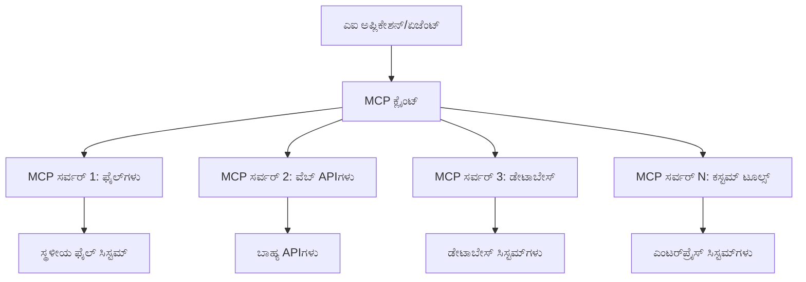
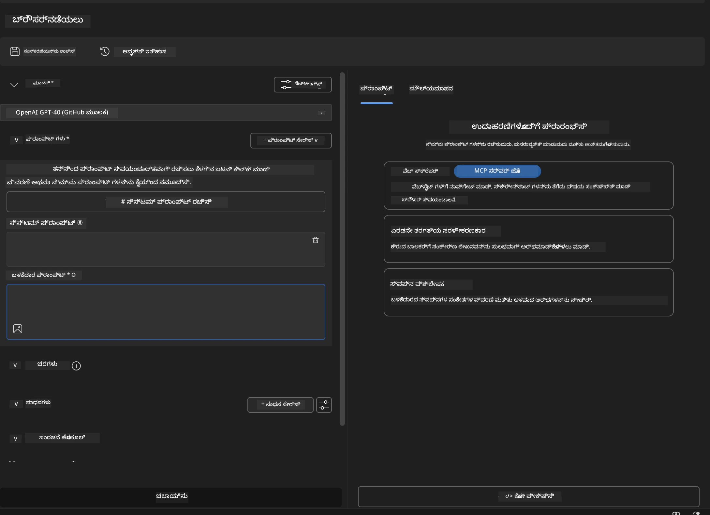
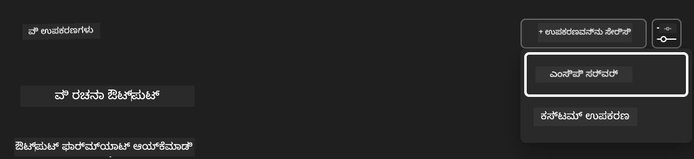
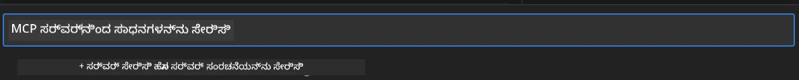
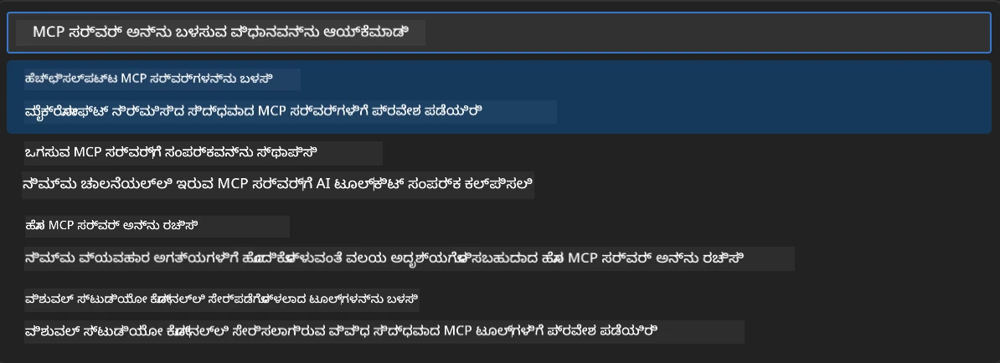
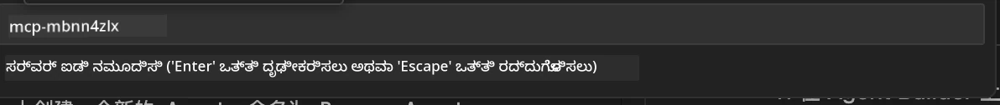
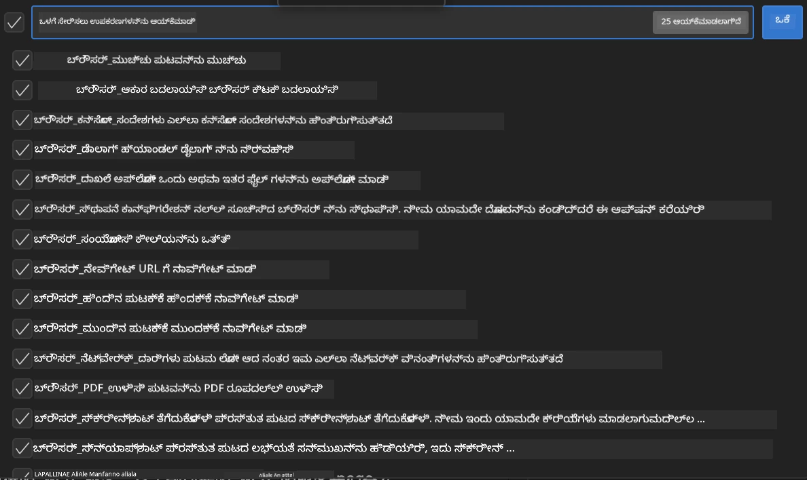
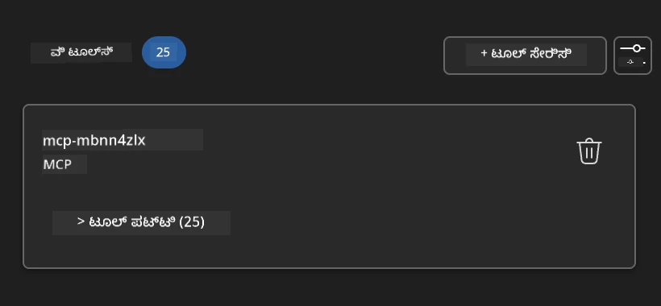
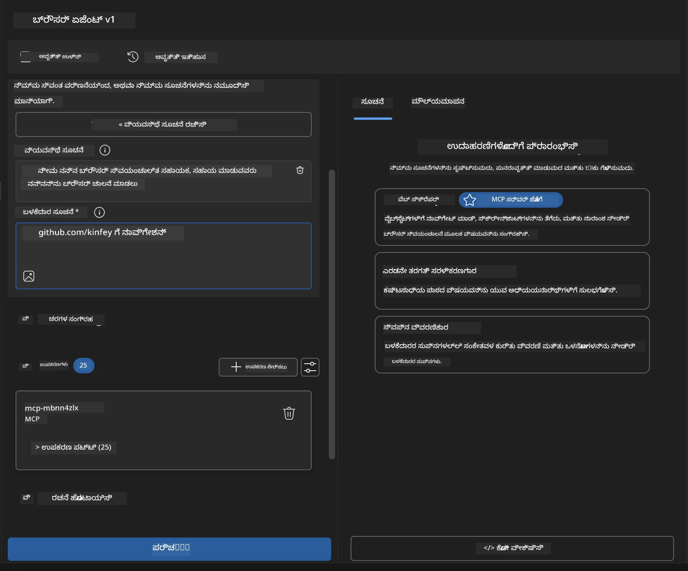

# 🌐 ಮೋಡ್ಯೂಲ್ 2: AI ಟೂಲ್ಕಿಟ್ ಮೂಲಭೂತಗಳೊಂದಿಗೆ MCP

[]()
[]()
[]()

## 📋 ಕಲಿಕೆಯ ಉದ್ದೇಶಗಳು

ಈ ಮೋಡ್ಯೂಲ್ ಮುಗಿದಾಗ, ನೀವು ಸಾಧ್ಯವಾಗುತ್ತದೆ:
- ✅ ಮಾದರಿ ಸನ್ನಿವೇಶ ಪ್ರೋಟೋಕಾಲ್ (MCP) ವಾಸ್ತುಶಿಲ್ಪ ಮತ್ತು ಲಾಭಗಳನ್ನು ಅರ್ಥಮಾಡಿಕೊಳ್ಳಿ
- ✅ ಮೈಕ್ರೋಸಾಫ್ಟ್‌ನ MCP ಸರ್ವರ್ ಪರಿಸರವನ್ನು ಅನ್ವೇಷಿಸಿ
- ✅ MCP ಸರ್ವರ್‌ಗಳನ್ನು AI ಟೂಲ್ಕಿಟ್ ಏಜೆಂಟ್ ಬಿಲ್ಡರ್ ಜೊತೆಗೆ ಸಂಯೋಜಿಸಿ
- ✅ Playwright MCP ಬಳಸಿ ಕಾರ್ಯನಿರ್ವಹಿಸುವ ಬ್ರೌಸರ್ ಸ್ವಯಂಚಾಲಿತ ಏಜೆಂಟ್ ನಿರ್ಮಿಸಿ
- ✅ ನಿಮ್ಮ ಏಜೆಂಟ್‌ಗಳಲ್ಲಿ MCP ಸಾಧನಗಳನ್ನು ಸಂರಚಿಸಿ ಮತ್ತು ಪರೀಕ್ಷಿಸಿ
- ✅ ಉತ್ಪಾದನಾ ಬಳಕೆಗೆ MCP-ಚಾಲಿತ ಏಜೆಂಟ್‌ಗಳನ್ನು ರಫ್ತು ಮಾಡಿ ಮತ್ತು ನಿಯೋಜಿಸಿ

## 🎯 ಮೋಡ್ಯೂಲ್ 1 ಮೇಲೆ ನಿರ್ಮಾಣ

ಮೋಡ್ಯೂಲ್ 1 ನಲ್ಲಿ, ನಾವು AI ಟೂಲ್ಕಿಟ್ ಮೂಲಭೂತಗಳನ್ನು ನಿಭಾಯಿಸಿ ನಮ್ಮ ಮೊದಲ Python ಏಜೆಂಟ್ ಅನ್ನು ರಚಿಸಿದ್ದೇವೆ. ಈಗ ನಾವು ನಿಮ್ಮ ಏಜೆಂಟ್‌ಗಳನ್ನು ಕ್ರಾಂತಿಕಾರಿ **ಮಾದರಿ ಸನ್ನಿವೇಶ ಪ್ರೋಟೋಕಾಲ್ (MCP)** ಮೂಲಕ ಬಾಹ್ಯ ಸಾಧನಗಳು ಮತ್ತು ಸೇವೆಗಳಿಗೆ ಸಂಪರ್ಕಿಸುವ ಮೂಲಕ **ಅಧಿಕ ಶಕ್ತಿ** ನೀಡುತ್ತೇವೆ.

ಇದನ್ನು ಮೂಲ ಕ್ಯಾಲ್ಕ್ಯುಲೇಟರ್‌ನಿಂದ ಸಂಪೂರ್ಣ ಕಂಪ್ಯೂಟರ್‌ಗೆ ಅಪ್‌ಗ್ರೇಡ್ ಮಾಡಿಕೊಳ್ಳುವುದಾಗಿ ಭಾವಿಸಿ - ನಿಮ್ಮ AI ಏಜೆಂಟ್‌ಗಳು ಈ ಸಾಮರ್ಥ್ಯಗಳನ್ನು ಪಡೆಯುತ್ತವೆ:
- 🌐 ವೆಬ್‌ಸೈಟ್‌ಗಳನ್ನು ಬ್ರೌಸ್ ಮಾಡಿ ಮತ್ತು ಸಂವಹನ ಮಾಡುವುದು
- 📁 ಕಡತಗಳನ್ನು ಪ್ರವೇಶಿಸಿ ಮತ್ತು ನಿರ್ವಹಿಸುವುದು
- 🔧 ಎಂಟರ್‌ಪ್ರೈಸ್ ವ್ಯವಸ್ಥೆಗಳೊಂದಿಗೆ ಸಂಯೋಜನೆ
- 📊 API ಗಳಿಂದ ನೈಜ-ಸಮಯ ಡೇಟಾ ಪ್ರಕ್ರಿಯೆ

## 🧠 ಮಾದರಿ ಸನ್ನಿವೇಶ ಪ್ರೋಟೋಕಾಲ್ (MCP) ಅರ್ಥಮಾಡಿಕೊಳ್ಳುವುದು

### 🔍 MCP ಎಂದರೆ ಏನು?

ಮಾದರಿ ಸನ್ನಿವೇಶ ಪ್ರೋಟೋಕಾಲ್ (MCP) ಎಂದರೆ **"AI ಅಪ್ಲಿಕೇಶನ್‌ಗಳಿಗೆ USB-C"** - ದೊಡ್ಡ ಭಾಷಾ ಮಾದರಿಗಳನ್ನು (LLMs) ಬಾಹ್ಯ ಸಾಧನಗಳು, ಡೇಟಾ ಮೂಲಗಳು ಮತ್ತು ಸೇವೆಗಳಿಗೆ ಸಂಪರ್ಕಿಸುವ ಕ್ರಾಂತಿಕಾರಿ ಮುಕ್ತ ಮಾನಕ. USB-C ಒಂದು ಸಾಮಾನ್ಯ ಸಂಪರ್ಕವನ್ನು ಒದಗಿಸುವ ಮೂಲಕ ಕೇಬಲ್ ಗೊಂದಲವನ್ನು ನಿವಾರಣೆ ಮಾಡಿದಂತೆ, MCP ಒಂದು ಮಾನಕ ಪ್ರೋಟೋಕಾಲ್ ಮೂಲಕ AI ಸಂಯೋಜನೆ ಸಂಕೀರ್ಣತೆಯನ್ನು ನಿವಾರಣೆ ಮಾಡುತ್ತದೆ.

### 🎯 MCP ಪರಿಹರಿಸುವ ಸಮಸ್ಯೆ

**MCP ಮೊದಲು:**
- 🔧 ಪ್ರತಿ ಸಾಧನಕ್ಕೆ ಕಸ್ಟಮ್ ಸಂಯೋಜನೆಗಳು
- 🔄 ಸ್ವಂತ ಪರಿಹಾರಗಳೊಂದಿಗೆ ವಿಕ್ರೇತೃ ಲಾಕ್-ಇನ್  
- 🔒 ಅಡ್ಹಾಕ್ ಸಂಪರ್ಕಗಳಿಂದ ಭದ್ರತಾ ದುರ್ಬಲತೆಗಳು
- ⏱️ ಮೂಲ ಸಂಯೋಜನೆಗಳಿಗೆ ತಿಂಗಳುಗಳ ಅಭಿವೃದ್ಧಿ

**MCP ಜೊತೆಗೆ:**
- ⚡ ಪ್ಲಗ್-ಅಂಡ್-ಪ್ಲೇ ಸಾಧನ ಸಂಯೋಜನೆ
- 🔄 ವಿಕ್ರೇತೃ-ನಿರಪೇಕ್ಷ ವಾಸ್ತುಶಿಲ್ಪ
- 🛡️ ಒಳಗೊಂಡ ಭದ್ರತಾ ಉತ್ತಮ ಅಭ್ಯಾಸಗಳು
- 🚀 ಹೊಸ ಸಾಮರ್ಥ್ಯಗಳನ್ನು ಸೇರಿಸಲು ನಿಮಿಷಗಳು

### 🏗️ MCP ವಾಸ್ತುಶಿಲ್ಪ ಆಳವಾದ ವಿಶ್ಲೇಷಣೆ

MCP ಒಂದು **ಕ್ಲೈಂಟ್-ಸರ್ವರ್ ವಾಸ್ತುಶಿಲ್ಪ** ಅನುಸರಿಸುತ್ತದೆ, ಇದು ಸುರಕ್ಷಿತ, ವಿಸ್ತಾರಗೊಳ್ಳುವ ಪರಿಸರವನ್ನು ಸೃಷ್ಟಿಸುತ್ತದೆ:


**🔧 ಮುಖ್ಯ ಘಟಕಗಳು:**

| ಘಟಕ | ಪಾತ್ರ | ಉದಾಹರಣೆಗಳು |
|-----------|------|----------|
| **MCP ಹೋಸ್ಟ್‌ಗಳು** | MCP ಸೇವೆಗಳನ್ನು ಉಪಯೋಗಿಸುವ ಅಪ್ಲಿಕೇಶನ್‌ಗಳು | Claude Desktop, VS Code, AI Toolkit |
| **MCP ಕ್ಲೈಂಟ್‌ಗಳು** | ಪ್ರೋಟೋಕಾಲ್ ಹ್ಯಾಂಡ್ಲರ್‌ಗಳು (ಸರ್ವರ್‌ಗಳೊಂದಿಗೆ 1:1) | ಹೋಸ್ಟ್ ಅಪ್ಲಿಕೇಶನ್‌ಗಳಲ್ಲಿ ನಿರ್ಮಿತ |
| **MCP ಸರ್ವರ್‌ಗಳು** | ಮಾನಕ ಪ್ರೋಟೋಕಾಲ್ ಮೂಲಕ ಸಾಮರ್ಥ್ಯಗಳನ್ನು ಬಹಿರಂಗಪಡಿಸುವುದು | Playwright, Files, Azure, GitHub |
| **ಟ್ರಾನ್ಸ್‌ಪೋರ್ಟ್ ಲೇಯರ್** | ಸಂವಹನ ವಿಧಾನಗಳು | stdio, HTTP, WebSockets |


## 🏢 ಮೈಕ್ರೋಸಾಫ್ಟ್‌ನ MCP ಸರ್ವರ್ ಪರಿಸರ

ಮೈಕ್ರೋಸಾಫ್ಟ್ MCP ಪರಿಸರವನ್ನು ವ್ಯಾಪಕ ಎಂಟರ್‌ಪ್ರೈಸ್-ಗ್ರೇಡ್ ಸರ್ವರ್‌ಗಳೊಂದಿಗೆ ಮುನ್ನಡೆಸುತ್ತದೆ, ಇದು ನೈಜ ವ್ಯವಹಾರ ಅಗತ್ಯಗಳನ್ನು ಪೂರೈಸುತ್ತದೆ.

### 🌟 ವೈಶಿಷ್ಟ್ಯಗೊಳಿಸಿದ ಮೈಕ್ರೋಸಾಫ್ಟ್ MCP ಸರ್ವರ್‌ಗಳು

#### 1. ☁️ ಅಜೂರ್ MCP ಸರ್ವರ್
**🔗 ರೆಪೊಸಿಟರಿ**: [azure/azure-mcp](https://github.com/azure/azure-mcp)
**🎯 ಉದ್ದೇಶ**: AI ಸಂಯೋಜನೆಯೊಂದಿಗೆ ಸಮಗ್ರ ಅಜೂರ್ ಸಂಪನ್ಮೂಲ ನಿರ್ವಹಣೆ

**✨ ಪ್ರಮುಖ ವೈಶಿಷ್ಟ್ಯಗಳು:**
- ಘೋಷಣಾತ್ಮಕ ಮೂಲಸೌಕರ್ಯ ಪ್ರಾವಿಧಾನ
- ನೈಜ-ಸಮಯ ಸಂಪನ್ಮೂಲ ಮೇಲ್ವಿಚಾರಣೆ
- ವೆಚ್ಚದ ಆಪ್ಟಿಮೈಜೆಷನ್ ಶಿಫಾರಸುಗಳು
- ಭದ್ರತಾ ಅನುಕೂಲತೆ ಪರಿಶೀಲನೆ

**🚀 ಬಳಕೆ ಪ್ರಕರಣಗಳು:**
- AI ಸಹಾಯದೊಂದಿಗೆ ಮೂಲಸೌಕರ್ಯ-ಆಸ್-ಕೋಡ್
- ಸ್ವಯಂಚಾಲಿತ ಸಂಪನ್ಮೂಲ ವಿಸ್ತರಣೆ
- ಕ್ಲೌಡ್ ವೆಚ್ಚ ಆಪ್ಟಿಮೈಜೆಷನ್
- ಡೆವ್ಓಪ್ಸ್ ಕಾರ್ಯಪ್ರವಾಹ ಸ್ವಯಂಚಾಲನೆ

#### 2. 📊 ಮೈಕ್ರೋಸಾಫ್ಟ್ ಡೇಟಾವರ್ಸ್ MCP
**📚 ಡಾಕ್ಯುಮೆಂಟೇಶನ್**: [Microsoft Dataverse Integration](https://go.microsoft.com/fwlink/?linkid=2320176)
**🎯 ಉದ್ದೇಶ**: ವ್ಯವಹಾರ ಡೇಟಾಗಾಗಿ ನೈಸರ್ಗಿಕ ಭಾಷೆ ಇಂಟರ್ಫೇಸ್

**✨ ಪ್ರಮುಖ ವೈಶಿಷ್ಟ್ಯಗಳು:**
- ನೈಸರ್ಗಿಕ ಭಾಷೆ ಡೇಟಾಬೇಸ್ ಪ್ರಶ್ನೆಗಳು
- ವ್ಯವಹಾರ ಸನ್ನಿವೇಶ ಅರ್ಥಮಾಡಿಕೊಳ್ಳುವುದು
- ಕಸ್ಟಮ್ ಪ್ರಾಂಪ್ಟ್ ಟೆಂಪ್ಲೇಟುಗಳು
- ಎಂಟರ್‌ಪ್ರೈಸ್ ಡೇಟಾ ಆಡಳಿತ

**🚀 ಬಳಕೆ ಪ್ರಕರಣಗಳು:**
- ವ್ಯವಹಾರ ಬುದ್ಧಿವಂತಿಕೆ ವರದಿ
- ಗ್ರಾಹಕ ಡೇಟಾ ವಿಶ್ಲೇಷಣೆ
- ಮಾರಾಟ ಪೈಪ್‌ಲೈನ್ ಒಳನೋಟಗಳು
- ಅನುಕೂಲತೆ ಡೇಟಾ ಪ್ರಶ್ನೆಗಳು

#### 3. 🌐 Playwright MCP ಸರ್ವರ್
**🔗 ರೆಪೊಸಿಟರಿ**: [microsoft/playwright-mcp](https://github.com/microsoft/playwright-mcp)
**🎯 ಉದ್ದೇಶ**: ಬ್ರೌಸರ್ ಸ್ವಯಂಚಾಲನೆ ಮತ್ತು ವೆಬ್ ಸಂವಹನ ಸಾಮರ್ಥ್ಯಗಳು

**✨ ಪ್ರಮುಖ ವೈಶಿಷ್ಟ್ಯಗಳು:**
- ಕ್ರಾಸ್-ಬ್ರೌಸರ್ ಸ್ವಯಂಚಾಲನೆ (ಕ್ರೋಮ್, ಫೈರ್‌ಫಾಕ್ಸ್, ಸಫಾರಿ)
- ಬುದ್ಧಿವಂತ ಅಂಶ ಪತ್ತೆ
- ಸ್ಕ್ರೀನ್‌ಶಾಟ್ ಮತ್ತು PDF ತಯಾರಿಕೆ
- ನೆಟ್‌ವರ್ಕ್ ಟ್ರಾಫಿಕ್ ಮೇಲ್ವಿಚಾರಣೆ

**🚀 ಬಳಕೆ ಪ್ರಕರಣಗಳು:**
- ಸ್ವಯಂಚಾಲಿತ ಪರೀಕ್ಷಾ ಕಾರ್ಯಪ್ರವಾಹಗಳು
- ವೆಬ್ ಸ್ಕ್ರಾಪಿಂಗ್ ಮತ್ತು ಡೇಟಾ ಹೊರತೆಗೆಯುವಿಕೆ
- UI/UX ಮೇಲ್ವಿಚಾರಣೆ
- ಸ್ಪರ್ಧಾತ್ಮಕ ವಿಶ್ಲೇಷಣೆ ಸ್ವಯಂಚಾಲನೆ

#### 4. 📁 ಫೈಲ್ಸ್ MCP ಸರ್ವರ್
**🔗 ರೆಪೊಸಿಟರಿ**: [microsoft/files-mcp-server](https://github.com/microsoft/files-mcp-server)
**🎯 ಉದ್ದೇಶ**: ಬುದ್ಧಿವಂತ ಫೈಲ್ ಸಿಸ್ಟಮ್ ಕಾರ್ಯಾಚರಣೆಗಳು

**✨ ಪ್ರಮುಖ ವೈಶಿಷ್ಟ್ಯಗಳು:**
- ಘೋಷಣಾತ್ಮಕ ಫೈಲ್ ನಿರ್ವಹಣೆ
- ವಿಷಯ ಸಮನ್ವಯ
- ಆವೃತ್ತಿ ನಿಯಂತ್ರಣ ಸಂಯೋಜನೆ
- ಮೆಟಾಡೇಟಾ ಹೊರತೆಗೆಯುವಿಕೆ

**🚀 ಬಳಕೆ ಪ್ರಕರಣಗಳು:**
- ಡಾಕ್ಯುಮೆಂಟೇಶನ್ ನಿರ್ವಹಣೆ
- ಕೋಡ್ ರೆಪೊಸಿಟರಿ ಸಂಘಟನೆ
- ವಿಷಯ ಪ್ರಕಟಣಾ ಕಾರ್ಯಪ್ರವಾಹಗಳು
- ಡೇಟಾ ಪೈಪ್‌ಲೈನ್ ಫೈಲ್ ಹ್ಯಾಂಡ್ಲಿಂಗ್

#### 5. 📝 MarkItDown MCP ಸರ್ವರ್
**🔗 ರೆಪೊಸಿಟರಿ**: [microsoft/markitdown](https://github.com/microsoft/markitdown)
**🎯 ಉದ್ದೇಶ**: ಸುಧಾರಿತ ಮಾರ್ಕ್‌ಡೌನ್ ಪ್ರಕ್ರಿಯೆ ಮತ್ತು ನಿರ್ವಹಣೆ

**✨ ಪ್ರಮುಖ ವೈಶಿಷ್ಟ್ಯಗಳು:**
- ಶ್ರೀಮಂತ ಮಾರ್ಕ್‌ಡೌನ್ ಪಾರ್ಸಿಂಗ್
- ಫಾರ್ಮ್ಯಾಟ್ ಪರಿವರ್ತನೆ (MD ↔ HTML ↔ PDF)
- ವಿಷಯ ರಚನೆ ವಿಶ್ಲೇಷಣೆ
- ಟೆಂಪ್ಲೇಟು ಪ್ರಕ್ರಿಯೆ

**🚀 ಬಳಕೆ ಪ್ರಕರಣಗಳು:**
- ತಾಂತ್ರಿಕ ಡಾಕ್ಯುಮೆಂಟೇಶನ್ ಕಾರ್ಯಪ್ರವಾಹಗಳು
- ವಿಷಯ ನಿರ್ವಹಣಾ ವ್ಯವಸ್ಥೆಗಳು
- ವರದಿ ತಯಾರಿಕೆ
- ಜ್ಞಾನ ಆಧಾರ ಸ್ವಯಂಚಾಲನೆ

#### 6. 📈 ಕ್ಲ್ಯಾರಿಟಿ MCP ಸರ್ವರ್
**📦 ಪ್ಯಾಕೇಜ್**: [@microsoft/clarity-mcp-server](https://www.npmjs.com/package/@microsoft/clarity-mcp-server)
**🎯 ಉದ್ದೇಶ**: ವೆಬ್ ವಿಶ್ಲೇಷಣೆ ಮತ್ತು ಬಳಕೆದಾರ ವರ್ತನೆ ಒಳನೋಟಗಳು

**✨ ಪ್ರಮುಖ ವೈಶಿಷ್ಟ್ಯಗಳು:**
- ಹೀಟ್ಮ್ಯಾಪ್ ಡೇಟಾ ವಿಶ್ಲೇಷಣೆ
- ಬಳಕೆದಾರ ಸೆಷನ್ ರೆಕಾರ್ಡಿಂಗ್‌ಗಳು
- ಕಾರ್ಯಕ್ಷಮತೆ ಮೆಟ್ರಿಕ್‌ಗಳು
- ಪರಿವರ್ತನೆ ಫನ್ನಲ್ ವಿಶ್ಲೇಷಣೆ

**🚀 ಬಳಕೆ ಪ್ರಕರಣಗಳು:**
- ವೆಬ್‌ಸೈಟ್ ಆಪ್ಟಿಮೈಜೆಷನ್
- ಬಳಕೆದಾರ ಅನುಭವ ಸಂಶೋಧನೆ
- A/B ಪರೀಕ್ಷಾ ವಿಶ್ಲೇಷಣೆ
- ವ್ಯವಹಾರ ಬುದ್ಧಿವಂತಿಕೆ ಡ್ಯಾಶ್‌ಬೋರ್ಡ್‌ಗಳು

### 🌍 ಸಮುದಾಯ ಪರಿಸರ

ಮೈಕ್ರೋಸಾಫ್ಟ್ ಸರ್ವರ್‌ಗಳ ಹೊರತಾಗಿ, MCP ಪರಿಸರದಲ್ಲಿ ಸೇರಿವೆ:
- **🐙 GitHub MCP**: ರೆಪೊಸಿಟರಿ ನಿರ್ವಹಣೆ ಮತ್ತು ಕೋಡ್ ವಿಶ್ಲೇಷಣೆ
- **🗄️ ಡೇಟಾಬೇಸ್ MCPಗಳು**: PostgreSQL, MySQL, MongoDB ಸಂಯೋಜನೆಗಳು
- **☁️ ಕ್ಲೌಡ್ ಪ್ರೊವೈಡರ್ MCPಗಳು**: AWS, GCP, ಡಿಜಿಟಲ್ ಓಷನ್ ಸಾಧನಗಳು
- **📧 ಸಂವಹನ MCPಗಳು**: Slack, Teams, ಇಮೇಲ್ ಸಂಯೋಜನೆಗಳು

## 🛠️ ಹ್ಯಾಂಡ್ಸ್-ಆನ್ ಲ್ಯಾಬ್: ಬ್ರೌಸರ್ ಸ್ವಯಂಚಾಲಿತ ಏಜೆಂಟ್ ನಿರ್ಮಾಣ

**🎯 ಯೋಜನೆಯ ಗುರಿ**: Playwright MCP ಸರ್ವರ್ ಬಳಸಿ ಬುದ್ಧಿವಂತ ಬ್ರೌಸರ್ ಸ್ವಯಂಚಾಲಿತ ಏಜೆಂಟ್ ರಚಿಸಿ, ಇದು ವೆಬ್‌ಸೈಟ್‌ಗಳನ್ನು ನಾವಿಗೇಟ್ ಮಾಡಿ, ಮಾಹಿತಿ ಹೊರತೆಗೆಯುತ್ತದೆ ಮತ್ತು ಸಂಕೀರ್ಣ ವೆಬ್ ಸಂವಹನಗಳನ್ನು ನಿರ್ವಹಿಸುತ್ತದೆ.

### 🚀 ಹಂತ 1: ಏಜೆಂಟ್ ಮೂಲಭೂತ ಸ್ಥಾಪನೆ

#### ಹಂತ 1: ನಿಮ್ಮ ಏಜೆಂಟ್ ಪ್ರಾರಂಭಿಸಿ
1. **AI ಟೂಲ್ಕಿಟ್ ಏಜೆಂಟ್ ಬಿಲ್ಡರ್ ತೆರೆಯಿರಿ**
2. **ಹೊಸ ಏಜೆಂಟ್ ರಚಿಸಿ** ಕೆಳಗಿನ ಸಂರಚನೆಯೊಂದಿಗೆ:
   - **ಹೆಸರು**: `BrowserAgent`
   - **ಮಾದರಿ**: GPT-4o ಆಯ್ಕೆಮಾಡಿ




### 🔧 ಹಂತ 2: MCP ಸಂಯೋಜನೆ ಕಾರ್ಯಪ್ರವಾಹ

#### ಹಂತ 3: MCP ಸರ್ವರ್ ಸಂಯೋಜನೆ ಸೇರಿಸಿ
1. **ಏಜೆಂಟ್ ಬಿಲ್ಡರ್‌ನ ಸಾಧನ ವಿಭಾಗಕ್ಕೆ ನಾವಿಗೇಟ್ ಮಾಡಿ**
2. **"Add Tool" ಕ್ಲಿಕ್ ಮಾಡಿ** ಸಂಯೋಜನೆ ಮೆನು ತೆರೆಯಲು
3. **ಲಭ್ಯವಿರುವ ಆಯ್ಕೆಗಳಿಂದ "MCP Server" ಆಯ್ಕೆಮಾಡಿ**



**🔍 ಸಾಧನ ಪ್ರಕಾರಗಳನ್ನು ಅರ್ಥಮಾಡಿಕೊಳ್ಳುವುದು:**
- **ನಿರ್ಮಿತ ಸಾಧನಗಳು**: ಪೂರ್ವ-ಕಾನ್ಫಿಗರ್ ಮಾಡಿದ AI ಟೂಲ್ಕಿಟ್ ಕಾರ್ಯಗಳು
- **MCP ಸರ್ವರ್‌ಗಳು**: ಬಾಹ್ಯ ಸೇವೆ ಸಂಯೋಜನೆಗಳು
- **ಕಸ್ಟಮ್ APIಗಳು**: ನಿಮ್ಮ ಸ್ವಂತ ಸೇವೆ ಎಂಡ್ಪಾಯಿಂಟ್‌ಗಳು
- **ಫಂಕ್ಷನ್ ಕಾಲಿಂಗ್**: ನೇರ ಮಾದರಿ ಕಾರ್ಯ ಪ್ರವೇಶ

#### ಹಂತ 4: MCP ಸರ್ವರ್ ಆಯ್ಕೆ
1. **ಮುಂದುವರೆಯಲು "MCP Server" ಆಯ್ಕೆಮಾಡಿ**


2. **ಲಭ್ಯವಿರುವ ಸಂಯೋಜನೆಗಳನ್ನು ಅನ್ವೇಷಿಸಲು MCP ಕ್ಯಾಟಲಾಗ್ ಬ್ರೌಸ್ ಮಾಡಿ**



### 🎮 ಹಂತ 3: Playwright MCP ಸಂರಚನೆ

#### ಹಂತ 5: Playwright ಆಯ್ಕೆಮಾಡಿ ಮತ್ತು ಸಂರಚಿಸಿ
1. **ಮೈಕ್ರೋಸಾಫ್ಟ್ ದೃಢೀಕೃತ ಸರ್ವರ್‌ಗಳಿಗೆ ಪ್ರವೇಶಿಸಲು "Use Featured MCP Servers" ಕ್ಲಿಕ್ ಮಾಡಿ**
2. **ವೈಶಿಷ್ಟ್ಯಗೊಳಿಸಿದ ಪಟ್ಟಿಯಿಂದ "Playwright" ಆಯ್ಕೆಮಾಡಿ**
3. **ಡೀಫಾಲ್ಟ್ MCP ID ಅನ್ನು ಒಪ್ಪಿಕೊಳ್ಳಿ ಅಥವಾ ನಿಮ್ಮ ಪರಿಸರಕ್ಕೆ ಹೊಂದಿಸಿ**



#### ಹಂತ 6: Playwright ಸಾಮರ್ಥ್ಯಗಳನ್ನು ಸಕ್ರಿಯಗೊಳಿಸಿ
**🔑 ಪ್ರಮುಖ ಹಂತ**: ಗರಿಷ್ಠ ಕಾರ್ಯಕ್ಷಮತೆಗಾಗಿ ಲಭ್ಯವಿರುವ ಎಲ್ಲಾ Playwright ವಿಧಾನಗಳನ್ನು ಆಯ್ಕೆಮಾಡಿ



**🛠️ ಅಗತ್ಯ Playwright ಸಾಧನಗಳು:**
- **ನಾವಿಗೇಶನ್**: `goto`, `goBack`, `goForward`, `reload`
- **ಸಂವಹನ**: `click`, `fill`, `press`, `hover`, `drag`
- **ಹೊರತೆಗೆಯುವಿಕೆ**: `textContent`, `innerHTML`, `getAttribute`
- **ಮಾನ್ಯತೆ**: `isVisible`, `isEnabled`, `waitForSelector`
- **ಕ್ಯಾಪ್ಚರ್**: `screenshot`, `pdf`, `video`
- **ನೆಟ್‌ವರ್ಕ್**: `setExtraHTTPHeaders`, `route`, `waitForResponse`

#### ಹಂತ 7: ಸಂಯೋಜನೆ ಯಶಸ್ಸು ಪರಿಶೀಲಿಸಿ
**✅ ಯಶಸ್ಸಿನ ಸೂಚಕಗಳು:**
- ಎಲ್ಲಾ ಸಾಧನಗಳು ಏಜೆಂಟ್ ಬಿಲ್ಡರ್ ಇಂಟರ್ಫೇಸಿನಲ್ಲಿ ಕಾಣಿಸುತ್ತವೆ
- ಸಂಯೋಜನೆ ಪ್ಯಾನೆಲ್‌ನಲ್ಲಿ ಯಾವುದೇ ದೋಷ ಸಂದೇಶಗಳಿಲ್ಲ
- Playwright ಸರ್ವರ್ ಸ್ಥಿತಿ "Connected" ಎಂದು ತೋರಿಸುತ್ತದೆ



**🔧 ಸಾಮಾನ್ಯ ಸಮಸ್ಯೆಗಳ ಪರಿಹಾರ:**
- **ಸಂಪರ್ಕ ವಿಫಲವಾಗಿದೆ**: ಇಂಟರ್ನೆಟ್ ಸಂಪರ್ಕ ಮತ್ತು ಫೈರ್‌ವಾಲ್ ಸೆಟ್ಟಿಂಗ್‌ಗಳನ್ನು ಪರಿಶೀಲಿಸಿ
- **ಸಾಧನಗಳು ಕಾಣಿಸುವುದಿಲ್ಲ**: ಸ್ಥಾಪನೆಯ ಸಮಯದಲ್ಲಿ ಎಲ್ಲಾ ಸಾಮರ್ಥ್ಯಗಳನ್ನು ಆಯ್ಕೆಮಾಡಿದೆಯೇ ಎಂದು ಖಚಿತಪಡಿಸಿಕೊಳ್ಳಿ
- **ಅನುಮತಿ ದೋಷಗಳು**: VS Code ಗೆ ಅಗತ್ಯ ವ್ಯವಸ್ಥಾ ಅನುಮತಿಗಳು ಇದ್ದವೆಯೇ ಎಂದು ಪರಿಶೀಲಿಸಿ

### 🎯 ಹಂತ 4: ಸುಧಾರಿತ ಪ್ರಾಂಪ್ಟ್ ಎಂಜಿನಿಯರಿಂಗ್

#### ಹಂತ 8: ಬುದ್ಧಿವಂತ ವ್ಯವಸ್ಥೆ ಪ್ರಾಂಪ್ಟ್‌ಗಳನ್ನು ವಿನ್ಯಾಸಗೊಳಿಸಿ
Playwright ನ ಸಂಪೂರ್ಣ ಸಾಮರ್ಥ್ಯಗಳನ್ನು ಬಳಸುವ ಸುಧಾರಿತ ಪ್ರಾಂಪ್ಟ್‌ಗಳನ್ನು ರಚಿಸಿ:

```markdown
# Web Automation Expert System Prompt

## Core Identity
You are an advanced web automation specialist with deep expertise in browser automation, web scraping, and user experience analysis. You have access to Playwright tools for comprehensive browser control.

## Capabilities & Approach
### Navigation Strategy
- Always start with screenshots to understand page layout
- Use semantic selectors (text content, labels) when possible
- Implement wait strategies for dynamic content
- Handle single-page applications (SPAs) effectively

### Error Handling
- Retry failed operations with exponential backoff
- Provide clear error descriptions and solutions
- Suggest alternative approaches when primary methods fail
- Always capture diagnostic screenshots on errors

### Data Extraction
- Extract structured data in JSON format when possible
- Provide confidence scores for extracted information
- Validate data completeness and accuracy
- Handle pagination and infinite scroll scenarios

### Reporting
- Include step-by-step execution logs
- Provide before/after screenshots for verification
- Suggest optimizations and alternative approaches
- Document any limitations or edge cases encountered

## Ethical Guidelines
- Respect robots.txt and rate limiting
- Avoid overloading target servers
- Only extract publicly available information
- Follow website terms of service
```

#### ಹಂತ 9: ಡೈನಾಮಿಕ್ ಬಳಕೆದಾರ ಪ್ರಾಂಪ್ಟ್‌ಗಳನ್ನು ರಚಿಸಿ
ವಿವಿಧ ಸಾಮರ್ಥ್ಯಗಳನ್ನು ಪ್ರದರ್ಶಿಸುವ ಪ್ರಾಂಪ್ಟ್‌ಗಳನ್ನು ವಿನ್ಯಾಸಗೊಳಿಸಿ:

**🌐 ವೆಬ್ ವಿಶ್ಲೇಷಣೆ ಉದಾಹರಣೆ:**
```markdown
Navigate to github.com/kinfey and provide a comprehensive analysis including:
1. Repository structure and organization
2. Recent activity and contribution patterns  
3. Documentation quality assessment
4. Technology stack identification
5. Community engagement metrics
6. Notable projects and their purposes

Include screenshots at key steps and provide actionable insights.
```



### 🚀 ಹಂತ 5: ಕಾರ್ಯಗತಗೊಳಿಸುವಿಕೆ ಮತ್ತು ಪರೀಕ್ಷೆ

#### ಹಂತ 10: ನಿಮ್ಮ ಮೊದಲ ಸ್ವಯಂಚಾಲಿತ ಕಾರ್ಯಾಚರಣೆ ನಡೆಸಿ
1. **ಸ್ವಯಂಚಾಲಿತ ಕ್ರಮವನ್ನು ಪ್ರಾರಂಭಿಸಲು "Run" ಕ್ಲಿಕ್ ಮಾಡಿ**
2. **ನೈಜ-ಸಮಯ ಕಾರ್ಯಗತಗೊಳಿಸುವಿಕೆಯನ್ನು ಮೇಲ್ವಿಚಾರಿಸಿ**:
   - ಕ್ರೋಮ್ ಬ್ರೌಸರ್ ಸ್ವಯಂಚಾಲಿತ
- ಶೂನ್ಯದಿಂದ ವಾತಾವರಣ MCP ಸರ್ವರ್ ನಿರ್ಮಿಸಿ

---

<!-- CO-OP TRANSLATOR DISCLAIMER START -->
**ಅಸ್ವೀಕರಣ**:  
ಈ ದಸ್ತಾವೇಜು AI ಅನುವಾದ ಸೇವೆ [Co-op Translator](https://github.com/Azure/co-op-translator) ಬಳಸಿ ಅನುವಾದಿಸಲಾಗಿದೆ. ನಾವು ನಿಖರತೆಯಿಗಾಗಿ ಪ್ರಯತ್ನಿಸುತ್ತಿದ್ದರೂ, ಸ್ವಯಂಚಾಲಿತ ಅನುವಾದಗಳಲ್ಲಿ ತಪ್ಪುಗಳು ಅಥವಾ ಅಸತ್ಯತೆಗಳು ಇರಬಹುದು ಎಂದು ದಯವಿಟ್ಟು ಗಮನಿಸಿ. ಮೂಲ ಭಾಷೆಯಲ್ಲಿರುವ ಮೂಲ ದಸ್ತಾವೇಜನ್ನು ಅಧಿಕೃತ ಮೂಲವೆಂದು ಪರಿಗಣಿಸಬೇಕು. ಮಹತ್ವದ ಮಾಹಿತಿಗಾಗಿ, ವೃತ್ತಿಪರ ಮಾನವ ಅನುವಾದವನ್ನು ಶಿಫಾರಸು ಮಾಡಲಾಗುತ್ತದೆ. ಈ ಅನುವಾದ ಬಳಕೆಯಿಂದ ಉಂಟಾಗುವ ಯಾವುದೇ ತಪ್ಪು ಅರ್ಥಮಾಡಿಕೊಳ್ಳುವಿಕೆ ಅಥವಾ ತಪ್ಪು ವಿವರಣೆಗಳಿಗೆ ನಾವು ಹೊಣೆಗಾರರಾಗುವುದಿಲ್ಲ.
<!-- CO-OP TRANSLATOR DISCLAIMER END -->