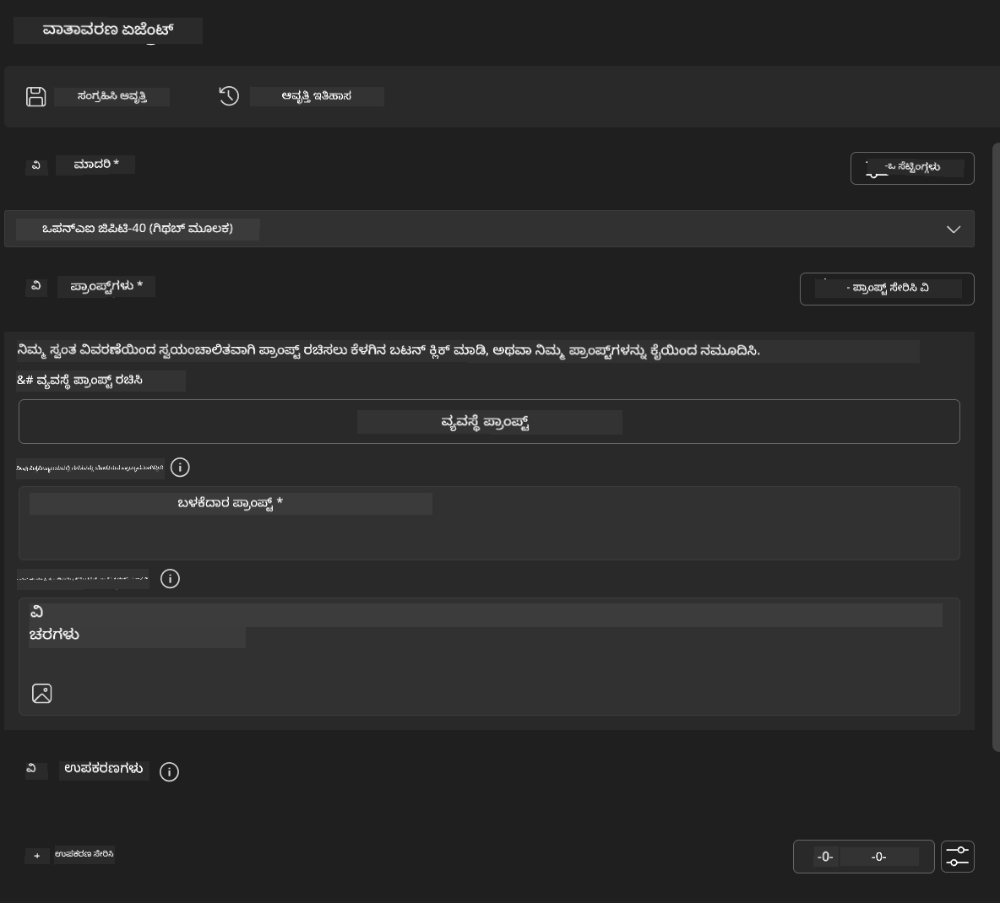
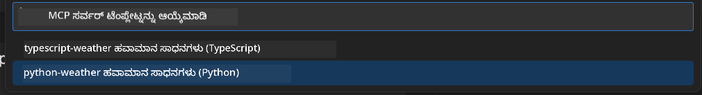
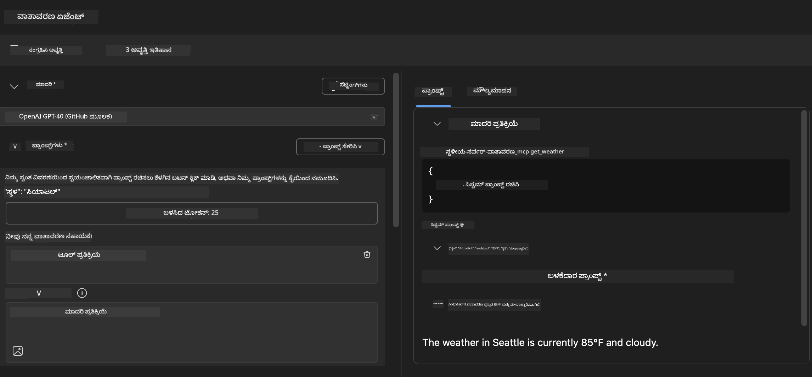
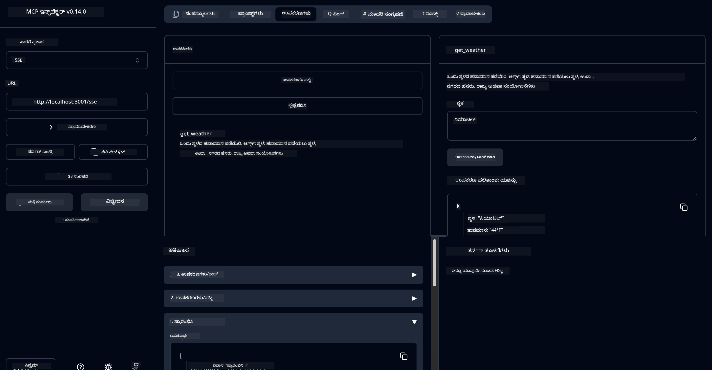

<!--
CO_OP_TRANSLATOR_METADATA:
{
  "original_hash": "dd8da3f75addcef453fe11f02a270217",
  "translation_date": "2025-12-11T16:50:24+00:00",
  "source_file": "10-StreamliningAIWorkflowsBuildingAnMCPServerWithAIToolkit/lab3/README.md",
  "language_code": "kn"
}
-->
# 🔧 ಮೋಡ್ಯೂಲ್ 3: AI ಟೂಲ್ಕಿಟ್‌ನೊಂದಿಗೆ ಅಡ್ವಾನ್ಸ್ಡ್ MCP ಅಭಿವೃದ್ಧಿ


## 🎯 ಕಲಿಕೆಯ ಉದ್ದೇಶಗಳು

ಈ ಪ್ರಯೋಗಾಲಯದ ಅಂತ್ಯಕ್ಕೆ, ನೀವು ಸಾಧ್ಯವಾಗುತ್ತದೆ:

- ✅ AI ಟೂಲ್ಕಿಟ್ ಬಳಸಿ ಕಸ್ಟಮ್ MCP ಸರ್ವರ್‌ಗಳನ್ನು ರಚಿಸುವುದು
- ✅ ಇತ್ತೀಚಿನ MCP Python SDK (v1.9.3) ಅನ್ನು ಸಂರಚಿಸಿ ಮತ್ತು ಬಳಸುವುದು
- ✅ ಡಿಬಗ್ ಮಾಡಲು MCP ಇನ್ಸ್‌ಪೆಕ್ಟರ್ ಅನ್ನು ಸೆಟ್ ಅಪ್ ಮಾಡಿ ಮತ್ತು ಬಳಸುವುದು
- ✅ ಏಜೆಂಟ್ ಬಿಲ್ಡರ್ ಮತ್ತು ಇನ್ಸ್‌ಪೆಕ್ಟರ್ ಪರಿಸರಗಳಲ್ಲಿ MCP ಸರ್ವರ್‌ಗಳನ್ನು ಡಿಬಗ್ ಮಾಡುವುದು
- ✅ ಅಡ್ವಾನ್ಸ್ಡ್ MCP ಸರ್ವರ್ ಅಭಿವೃದ್ಧಿ ಕಾರ್ಯಪ್ರವಾಹಗಳನ್ನು ಅರ್ಥಮಾಡಿಕೊಳ್ಳುವುದು

## 📋 ಪೂರ್ವಾಪೇಕ್ಷಿತಗಳು

- ಲ್ಯಾಬ್ 2 (MCP ಮೂಲಭೂತಗಳು) ಪೂರ್ಣಗೊಳಿಸಲಾಗಿದೆ
- AI ಟೂಲ್ಕಿಟ್ ವಿಸ್ತರಣೆ ಹೊಂದಿರುವ VS ಕೋಡ್
- Python 3.10+ ಪರಿಸರ
- ಇನ್ಸ್‌ಪೆಕ್ಟರ್ ಸೆಟ್ ಅಪ್‌ಗಾಗಿ Node.js ಮತ್ತು npm

## 🏗️ ನೀವು ನಿರ್ಮಿಸುವುದು

ಈ ಪ್ರಯೋಗಾಲಯದಲ್ಲಿ, ನೀವು **ವಾತಾವರಣ MCP ಸರ್ವರ್** ಅನ್ನು ರಚಿಸುವಿರಿ, ಇದು ತೋರಿಸುತ್ತದೆ:
- ಕಸ್ಟಮ್ MCP ಸರ್ವರ್ ಅನುಷ್ಠಾನ
- AI ಟೂಲ್ಕಿಟ್ ಏಜೆಂಟ್ ಬಿಲ್ಡರ್ ಜೊತೆಗೆ ಏಕೀಕರಣ
- ವೃತ್ತಿಪರ ಡಿಬಗ್ ಕಾರ್ಯಪ್ರವಾಹಗಳು
- ಆಧುನಿಕ MCP SDK ಬಳಕೆ ಮಾದರಿಗಳು

---

## 🔧 ಮುಖ್ಯ ಘಟಕಗಳ ಅವಲೋಕನ

### 🐍 MCP Python SDK
ಮಾದರಿ ಸನ್ನಿವೇಶ ಪ್ರೋಟೋಕಾಲ್ Python SDK ಕಸ್ಟಮ್ MCP ಸರ್ವರ್‌ಗಳನ್ನು ನಿರ್ಮಿಸಲು ಆಧಾರವನ್ನು ಒದಗಿಸುತ್ತದೆ. ನೀವು ಸುಧಾರಿತ ಡಿಬಗ್ ಸಾಮರ್ಥ್ಯಗಳೊಂದಿಗೆ ಆವೃತ್ತಿ 1.9.3 ಅನ್ನು ಬಳಸುತ್ತೀರಿ.

### 🔍 MCP ಇನ್ಸ್‌ಪೆಕ್ಟರ್
ಶಕ್ತಿಶಾಲಿ ಡಿಬಗ್ ಸಾಧನ, ಇದು ಒದಗಿಸುತ್ತದೆ:
- ರಿಯಲ್-ಟೈಮ್ ಸರ್ವರ್ ಮಾನಿಟರಿಂಗ್
- ಸಾಧನ ಕಾರ್ಯಾಚರಣೆ ದೃಶ್ಯೀಕರಣ
- ನೆಟ್‌ವರ್ಕ್ ವಿನಂತಿ/ಪ್ರತಿಕ್ರಿಯೆ ಪರಿಶೀಲನೆ
- ಪರಸ್ಪರ ಕ್ರಿಯಾಶೀಲ ಪರೀಕ್ಷಾ ಪರಿಸರ

---

## 📖 ಹಂತ ಹಂತವಾಗಿ ಅನುಷ್ಠಾನ

### ಹಂತ 1: ಏಜೆಂಟ್ ಬಿಲ್ಡರ್‌ನಲ್ಲಿ WeatherAgent ರಚಿಸಿ

1. VS ಕೋಡ್‌ನಲ್ಲಿ AI ಟೂಲ್ಕಿಟ್ ವಿಸ್ತರಣೆ ಮೂಲಕ **ಏಜೆಂಟ್ ಬಿಲ್ಡರ್ ಪ್ರಾರಂಭಿಸಿ**
2. ಕೆಳಗಿನ ಸಂರಚನೆಯೊಂದಿಗೆ **ಹೊಸ ಏಜೆಂಟ್ ರಚಿಸಿ**:
   - ಏಜೆಂಟ್ ಹೆಸರು: `WeatherAgent`



### ಹಂತ 2: MCP ಸರ್ವರ್ ಪ್ರಾಜೆಕ್ಟ್ ಪ್ರಾರಂಭಿಸಿ

1. ಏಜೆಂಟ್ ಬಿಲ್ಡರ್‌ನಲ್ಲಿ **ಟೂಲ್ಸ್ → Add Tool** ಗೆ ಹೋಗಿ
2. ಲಭ್ಯವಿರುವ ಆಯ್ಕೆಗಳಿಂದ **"MCP Server"** ಆಯ್ಕೆಮಾಡಿ
3. **"Create A new MCP Server"** ಆಯ್ಕೆಮಾಡಿ
4. `python-weather` ಟೆಂಪ್ಲೇಟನ್ನು ಆಯ್ಕೆಮಾಡಿ
5. ನಿಮ್ಮ ಸರ್ವರ್‌ಗೆ ಹೆಸರು ನೀಡಿ: `weather_mcp`



### ಹಂತ 3: ಪ್ರಾಜೆಕ್ಟ್ ತೆರೆಯಿರಿ ಮತ್ತು ಪರಿಶೀಲಿಸಿ

1. ರಚಿಸಲಾದ ಪ್ರಾಜೆಕ್ಟ್ ಅನ್ನು VS ಕೋಡ್‌ನಲ್ಲಿ ತೆರೆಯಿರಿ
2. ಪ್ರಾಜೆಕ್ಟ್ ರಚನೆಯನ್ನು ಪರಿಶೀಲಿಸಿ:
   ```
   weather_mcp/
   ├── src/
   │   ├── __init__.py
   │   └── server.py
   ├── inspector/
   │   ├── package.json
   │   └── package-lock.json
   ├── .vscode/
   │   ├── launch.json
   │   └── tasks.json
   ├── pyproject.toml
   └── README.md
   ```

### ಹಂತ 4: ಇತ್ತೀಚಿನ MCP SDK ಗೆ ಅಪ್‌ಗ್ರೇಡ್ ಮಾಡಿ

> **🔍 ಏಕೆ ಅಪ್‌ಗ್ರೇಡ್?** ಸುಧಾರಿತ ವೈಶಿಷ್ಟ್ಯಗಳು ಮತ್ತು ಉತ್ತಮ ಡಿಬಗ್ ಸಾಮರ್ಥ್ಯಗಳಿಗಾಗಿ ಇತ್ತೀಚಿನ MCP SDK (v1.9.3) ಮತ್ತು ಇನ್ಸ್‌ಪೆಕ್ಟರ್ ಸೇವೆ (0.14.0) ಬಳಸಲು ಬಯಸುತ್ತೇವೆ.

#### 4a. Python ಅವಲಂಬನೆಗಳನ್ನು ನವೀಕರಿಸಿ

**`pyproject.toml` ಸಂಪಾದಿಸಿ:** [./code/weather_mcp/pyproject.toml](../../../../10-StreamliningAIWorkflowsBuildingAnMCPServerWithAIToolkit/lab3/code/weather_mcp/pyproject.toml) ನವೀಕರಿಸಿ

#### 4b. ಇನ್ಸ್‌ಪೆಕ್ಟರ್ ಸಂರಚನೆಯನ್ನು ನವೀಕರಿಸಿ

**`inspector/package.json` ಸಂಪಾದಿಸಿ:** [./code/weather_mcp/inspector/package.json](../../../../10-StreamliningAIWorkflowsBuildingAnMCPServerWithAIToolkit/lab3/code/weather_mcp/inspector/package.json) ನವೀಕರಿಸಿ

#### 4c. ಇನ್ಸ್‌ಪೆಕ್ಟರ್ ಅವಲಂಬನೆಗಳನ್ನು ನವೀಕರಿಸಿ

**`inspector/package-lock.json` ಸಂಪಾದಿಸಿ:** [./code/weather_mcp/inspector/package-lock.json](../../../../10-StreamliningAIWorkflowsBuildingAnMCPServerWithAIToolkit/lab3/code/weather_mcp/inspector/package-lock.json) ನವೀಕರಿಸಿ

> **📝 ಟಿಪ್ಪಣಿ:** ಈ ಫೈಲ್ ವ್ಯಾಪಕ ಅವಲಂಬನೆ ವ್ಯಾಖ್ಯಾನಗಳನ್ನು ಹೊಂದಿದೆ. ಕೆಳಗಿನವು ಮೂಲ ರಚನೆ - ಸಂಪೂರ್ಣ ವಿಷಯವು ಸರಿಯಾದ ಅವಲಂಬನೆ ಪರಿಹಾರವನ್ನು ಖಚಿತಪಡಿಸುತ್ತದೆ.

> **⚡ ಸಂಪೂರ್ಣ ಪ್ಯಾಕೇಜ್ ಲಾಕ್:** ಸಂಪೂರ್ಣ package-lock.json ~3000 ಸಾಲುಗಳ ಅವಲಂಬನೆ ವ್ಯಾಖ್ಯಾನಗಳನ್ನು ಹೊಂದಿದೆ. ಮೇಲಿನವು ಮುಖ್ಯ ರಚನೆಯನ್ನು ತೋರಿಸುತ್ತದೆ - ಸಂಪೂರ್ಣ ಅವಲಂಬನೆ ಪರಿಹಾರಕ್ಕಾಗಿ ನೀಡಲಾದ ಫೈಲ್ ಬಳಸಿ.

### ಹಂತ 5: VS ಕೋಡ್ ಡಿಬಗ್ ಸಂರಚನೆ

*ಗಮನಿಸಿ: ಸೂಚಿಸಿದ ಮಾರ್ಗದಲ್ಲಿ ಫೈಲ್ ನಕಲಿಸಿ ಸ್ಥಳೀಯ ಫೈಲ್ ಅನ್ನು ಬದಲಾಯಿಸಿ*

#### 5a. ಲಾಂಚ್ ಸಂರಚನೆಯನ್ನು ನವೀಕರಿಸಿ

**`.vscode/launch.json` ಸಂಪಾದಿಸಿ:**

```json
{
  "version": "0.2.0",
  "configurations": [
    {
      "name": "Attach to Local MCP",
      "type": "debugpy",
      "request": "attach",
      "connect": {
        "host": "localhost",
        "port": 5678
      },
      "presentation": {
        "hidden": true
      },
      "internalConsoleOptions": "neverOpen",
      "postDebugTask": "Terminate All Tasks"
    },
    {
      "name": "Launch Inspector (Edge)",
      "type": "msedge",
      "request": "launch",
      "url": "http://localhost:6274?timeout=60000&serverUrl=http://localhost:3001/sse#tools",
      "cascadeTerminateToConfigurations": [
        "Attach to Local MCP"
      ],
      "presentation": {
        "hidden": true
      },
      "internalConsoleOptions": "neverOpen"
    },
    {
      "name": "Launch Inspector (Chrome)",
      "type": "chrome",
      "request": "launch",
      "url": "http://localhost:6274?timeout=60000&serverUrl=http://localhost:3001/sse#tools",
      "cascadeTerminateToConfigurations": [
        "Attach to Local MCP"
      ],
      "presentation": {
        "hidden": true
      },
      "internalConsoleOptions": "neverOpen"
    }
  ],
  "compounds": [
    {
      "name": "Debug in Agent Builder",
      "configurations": [
        "Attach to Local MCP"
      ],
      "preLaunchTask": "Open Agent Builder",
    },
    {
      "name": "Debug in Inspector (Edge)",
      "configurations": [
        "Launch Inspector (Edge)",
        "Attach to Local MCP"
      ],
      "preLaunchTask": "Start MCP Inspector",
      "stopAll": true
    },
    {
      "name": "Debug in Inspector (Chrome)",
      "configurations": [
        "Launch Inspector (Chrome)",
        "Attach to Local MCP"
      ],
      "preLaunchTask": "Start MCP Inspector",
      "stopAll": true
    }
  ]
}
```

**`.vscode/tasks.json` ಸಂಪಾದಿಸಿ:**

```
{
  "version": "2.0.0",
  "tasks": [
    {
      "label": "Start MCP Server",
      "type": "shell",
      "command": "python -m debugpy --listen 127.0.0.1:5678 src/__init__.py sse",
      "isBackground": true,
      "options": {
        "cwd": "${workspaceFolder}",
        "env": {
          "PORT": "3001"
        }
      },
      "problemMatcher": {
        "pattern": [
          {
            "regexp": "^.*$",
            "file": 0,
            "location": 1,
            "message": 2
          }
        ],
        "background": {
          "activeOnStart": true,
          "beginsPattern": ".*",
          "endsPattern": "Application startup complete|running"
        }
      }
    },
    {
      "label": "Start MCP Inspector",
      "type": "shell",
      "command": "npm run dev:inspector",
      "isBackground": true,
      "options": {
        "cwd": "${workspaceFolder}/inspector",
        "env": {
          "CLIENT_PORT": "6274",
          "SERVER_PORT": "6277",
        }
      },
      "problemMatcher": {
        "pattern": [
          {
            "regexp": "^.*$",
            "file": 0,
            "location": 1,
            "message": 2
          }
        ],
        "background": {
          "activeOnStart": true,
          "beginsPattern": "Starting MCP inspector",
          "endsPattern": "Proxy server listening on port"
        }
      },
      "dependsOn": [
        "Start MCP Server"
      ]
    },
    {
      "label": "Open Agent Builder",
      "type": "shell",
      "command": "echo ${input:openAgentBuilder}",
      "presentation": {
        "reveal": "never"
      },
      "dependsOn": [
        "Start MCP Server"
      ],
    },
    {
      "label": "Terminate All Tasks",
      "command": "echo ${input:terminate}",
      "type": "shell",
      "problemMatcher": []
    }
  ],
  "inputs": [
    {
      "id": "openAgentBuilder",
      "type": "command",
      "command": "ai-mlstudio.agentBuilder",
      "args": {
        "initialMCPs": [ "local-server-weather_mcp" ],
        "triggeredFrom": "vsc-tasks"
      }
    },
    {
      "id": "terminate",
      "type": "command",
      "command": "workbench.action.tasks.terminate",
      "args": "terminateAll"
    }
  ]
}
```


---

## 🚀 ನಿಮ್ಮ MCP ಸರ್ವರ್ ಅನ್ನು ಚಾಲನೆ ಮಾಡಿ ಮತ್ತು ಪರೀಕ್ಷಿಸಿ

### ಹಂತ 6: ಅವಲಂಬನೆಗಳನ್ನು ಸ್ಥಾಪಿಸಿ

ಸಂರಚನಾ ಬದಲಾವಣೆಗಳನ್ನು ಮಾಡಿದ ನಂತರ, ಕೆಳಗಿನ ಆಜ್ಞೆಗಳನ್ನು ಚಾಲನೆ ಮಾಡಿ:

**Python ಅವಲಂಬನೆಗಳನ್ನು ಸ್ಥಾಪಿಸಿ:**
```bash
uv sync
```

**ಇನ್ಸ್‌ಪೆಕ್ಟರ್ ಅವಲಂಬನೆಗಳನ್ನು ಸ್ಥಾಪಿಸಿ:**
```bash
cd inspector
npm install
```

### ಹಂತ 7: ಏಜೆಂಟ್ ಬಿಲ್ಡರ್‌ನಲ್ಲಿ ಡಿಬಗ್ ಮಾಡಿ

1. **F5 ಒತ್ತಿ** ಅಥವಾ **"Debug in Agent Builder"** ಸಂರಚನೆಯನ್ನು ಬಳಸಿ
2. ಡಿಬಗ್ ಪ್ಯಾನೆಲ್‌ನಿಂದ ಸಂಯುಕ್ತ ಸಂರಚನೆಯನ್ನು ಆಯ್ಕೆಮಾಡಿ
3. ಸರ್ವರ್ ಪ್ರಾರಂಭವಾಗಲು ಮತ್ತು ಏಜೆಂಟ್ ಬಿಲ್ಡರ್ ತೆರೆಯಲು ಕಾಯಿರಿ
4. ನೈಸರ್ಗಿಕ ಭಾಷಾ ಪ್ರಶ್ನೆಗಳೊಂದಿಗೆ ನಿಮ್ಮ ವಾತಾವರಣ MCP ಸರ್ವರ್ ಅನ್ನು ಪರೀಕ್ಷಿಸಿ

ಈ ರೀತಿಯ ಇನ್‌ಪುಟ್ ಪ್ರಾಂಪ್ಟ್ ನೀಡಿ

SYSTEM_PROMPT

```
You are my weather assistant
```

USER_PROMPT

```
How's the weather like in Seattle
```



### ಹಂತ 8: MCP ಇನ್ಸ್‌ಪೆಕ್ಟರ್‌ನೊಂದಿಗೆ ಡಿಬಗ್ ಮಾಡಿ

1. **"Debug in Inspector"** ಸಂರಚನೆಯನ್ನು ಬಳಸಿ (Edge ಅಥವಾ Chrome)
2. `http://localhost:6274` ನಲ್ಲಿ ಇನ್ಸ್‌ಪೆಕ್ಟರ್ ಇಂಟರ್ಫೇಸ್ ತೆರೆಯಿರಿ
3. ಪರಸ್ಪರ ಕ್ರಿಯಾಶೀಲ ಪರೀಕ್ಷಾ ಪರಿಸರವನ್ನು ಅನ್ವೇಷಿಸಿ:
   - ಲಭ್ಯವಿರುವ ಸಾಧನಗಳನ್ನು ವೀಕ್ಷಿಸಿ
   - ಸಾಧನ ಕಾರ್ಯಾಚರಣೆಯನ್ನು ಪರೀಕ್ಷಿಸಿ
   - ನೆಟ್‌ವರ್ಕ್ ವಿನಂತಿಗಳನ್ನು ಮಾನಿಟರ್ ಮಾಡಿ
   - ಸರ್ವರ್ ಪ್ರತಿಕ್ರಿಯೆಗಳನ್ನು ಡಿಬಗ್ ಮಾಡಿ



---

## 🎯 ಪ್ರಮುಖ ಕಲಿಕೆಯ ಫಲಿತಾಂಶಗಳು

ಈ ಪ್ರಯೋಗಾಲಯವನ್ನು ಪೂರ್ಣಗೊಳಿಸುವ ಮೂಲಕ, ನೀವು:

- [x] **AI ಟೂಲ್ಕಿಟ್ ಟೆಂಪ್ಲೇಟುಗಳನ್ನು ಬಳಸಿ ಕಸ್ಟಮ್ MCP ಸರ್ವರ್ ರಚಿಸಿದ್ದಾರೆ**
- [x] **ಸುಧಾರಿತ ಕಾರ್ಯಕ್ಷಮತೆಗಾಗಿ ಇತ್ತೀಚಿನ MCP SDK (v1.9.3) ಗೆ ಅಪ್‌ಗ್ರೇಡ್ ಮಾಡಿದ್ದಾರೆ**
- [x] **ಏಜೆಂಟ್ ಬಿಲ್ಡರ್ ಮತ್ತು ಇನ್ಸ್‌ಪೆಕ್ಟರ್ ಎರಡರಿಗೂ ವೃತ್ತಿಪರ ಡಿಬಗ್ ಕಾರ್ಯಪ್ರವಾಹಗಳನ್ನು ಸಂರಚಿಸಿದ್ದಾರೆ**
- [x] **ಪರಸ್ಪರ ಕ್ರಿಯಾಶೀಲ ಸರ್ವರ್ ಪರೀಕ್ಷೆಗೆ MCP ಇನ್ಸ್‌ಪೆಕ್ಟರ್ ಅನ್ನು ಸೆಟ್ ಅಪ್ ಮಾಡಿದ್ದಾರೆ**
- [x] **MCP ಅಭಿವೃದ್ಧಿಗಾಗಿ VS ಕೋಡ್ ಡಿಬಗ್ ಸಂರಚನೆಗಳನ್ನು ನಿಪುಣರಾಗಿದ್ದಾರೆ**

## 🔧 ಅನ್ವೇಷಿಸಿದ ಅಡ್ವಾನ್ಸ್ಡ್ ವೈಶಿಷ್ಟ್ಯಗಳು

| ವೈಶಿಷ್ಟ್ಯ | ವಿವರಣೆ | ಬಳಕೆ ಪ್ರಕರಣ |
|---------|-------------|----------|
| **MCP Python SDK v1.9.3** | ಇತ್ತೀಚಿನ ಪ್ರೋಟೋಕಾಲ್ ಅನುಷ್ಠಾನ | ಆಧುನಿಕ ಸರ್ವರ್ ಅಭಿವೃದ್ಧಿ |
| **MCP ಇನ್ಸ್‌ಪೆಕ್ಟರ್ 0.14.0** | ಪರಸ್ಪರ ಕ್ರಿಯಾಶೀಲ ಡಿಬಗ್ ಸಾಧನ | ರಿಯಲ್-ಟೈಮ್ ಸರ್ವರ್ ಪರೀಕ್ಷೆ |
| **VS ಕೋಡ್ ಡಿಬಗಿಂಗ್** | ಏಕೀಕೃತ ಅಭಿವೃದ್ಧಿ ಪರಿಸರ | ವೃತ್ತಿಪರ ಡಿಬಗ್ ಕಾರ್ಯಪ್ರವಾಹ |
| **ಏಜೆಂಟ್ ಬಿಲ್ಡರ್ ಏಕೀಕರಣ** | ನೇರ AI ಟೂಲ್ಕಿಟ್ ಸಂಪರ್ಕ | ಅಂತ್ಯ-ದಿಂದ-ಅಂತ್ಯ ಏಜೆಂಟ್ ಪರೀಕ್ಷೆ |

## 📚 ಹೆಚ್ಚುವರಿ ಸಂಪನ್ಮೂಲಗಳು

- [MCP Python SDK ಡಾಕ್ಯುಮೆಂಟೇಶನ್](https://modelcontextprotocol.io/docs/sdk/python)
- [AI ಟೂಲ್ಕಿಟ್ ವಿಸ್ತರಣೆ ಮಾರ್ಗದರ್ಶಿ](https://code.visualstudio.com/docs/ai/ai-toolkit)
- [VS ಕೋಡ್ ಡಿಬಗಿಂಗ್ ಡಾಕ್ಯುಮೆಂಟೇಶನ್](https://code.visualstudio.com/docs/editor/debugging)
- [ಮಾದರಿ ಸನ್ನಿವೇಶ ಪ್ರೋಟೋಕಾಲ್ ಸ್ಪೆಸಿಫಿಕೇಶನ್](https://modelcontextprotocol.io/docs/concepts/architecture)

---

**🎉 ಅಭಿನಂದನೆಗಳು!** ನೀವು ಯಶಸ್ವಿಯಾಗಿ ಲ್ಯಾಬ್ 3 ಅನ್ನು ಪೂರ್ಣಗೊಳಿಸಿದ್ದೀರಿ ಮತ್ತು ವೃತ್ತಿಪರ ಅಭಿವೃದ್ಧಿ ಕಾರ್ಯಪ್ರವಾಹಗಳನ್ನು ಬಳಸಿ ಕಸ್ಟಮ್ MCP ಸರ್ವರ್‌ಗಳನ್ನು ರಚಿಸಿ, ಡಿಬಗ್ ಮಾಡಿ ಮತ್ತು ನಿಯೋಜಿಸಬಹುದು.

### 🔜 ಮುಂದಿನ ಮೋಡ್ಯೂಲ್‌ಗೆ ಮುಂದುವರಿಯಿರಿ

ನಿಮ್ಮ MCP ಕೌಶಲ್ಯಗಳನ್ನು ನೈಜ ಜಗತ್ತಿನ ಅಭಿವೃದ್ಧಿ ಕಾರ್ಯಪ್ರವಾಹಕ್ಕೆ ಅನ್ವಯಿಸಲು ಸಿದ್ಧರಿದ್ದೀರಾ? ಮುಂದುವರಿಯಿರಿ **[ಮೋಡ್ಯೂಲ್ 4: ಪ್ರಾಯೋಗಿಕ MCP ಅಭಿವೃದ್ಧಿ - ಕಸ್ಟಮ್ GitHub ಕ್ಲೋನ್ ಸರ್ವರ್](../lab4/README.md)** ಇಲ್ಲಿ ನೀವು:
- GitHub ರೆಪೊಸಿಟರಿ ಕಾರ್ಯಾಚರಣೆಗಳನ್ನು ಸ್ವಯಂಚಾಲಿತಗೊಳಿಸುವ ಉತ್ಪಾದನಾ-ಸಿದ್ಧ MCP ಸರ್ವರ್ ನಿರ್ಮಿಸುವಿರಿ
- MCP ಮೂಲಕ GitHub ರೆಪೊಸಿಟರಿ ಕ್ಲೋನಿಂಗ್ ಕಾರ್ಯಕ್ಷಮತೆಯನ್ನು ಅನುಷ್ಠಾನಗೊಳಿಸುವಿರಿ
- VS ಕೋಡ್ ಮತ್ತು GitHub Copilot ಏಜೆಂಟ್ ಮೋಡ್ ಜೊತೆಗೆ ಕಸ್ಟಮ್ MCP ಸರ್ವರ್‌ಗಳನ್ನು ಏಕೀಕರಿಸುವಿರಿ
- ಉತ್ಪಾದನಾ ಪರಿಸರಗಳಲ್ಲಿ ಕಸ್ಟಮ್ MCP ಸರ್ವರ್‌ಗಳನ್ನು ಪರೀಕ್ಷಿಸಿ ನಿಯೋಜಿಸುವಿರಿ
- ಅಭಿವೃದ್ಧಿಪಡಕರಿಗಾಗಿ ಪ್ರಾಯೋಗಿಕ ಕಾರ್ಯಪ್ರವಾಹ ಸ್ವಯಂಚಾಲನೆ ಕಲಿಯುವಿರಿ

---

<!-- CO-OP TRANSLATOR DISCLAIMER START -->
**ಅಸ್ವೀಕರಣ**:  
ಈ ದಸ್ತಾವೇಜು AI ಅನುವಾದ ಸೇವೆ [Co-op Translator](https://github.com/Azure/co-op-translator) ಬಳಸಿ ಅನುವಾದಿಸಲಾಗಿದೆ. ನಾವು ನಿಖರತೆಯಿಗಾಗಿ ಪ್ರಯತ್ನಿಸುತ್ತಿದ್ದರೂ, ಸ್ವಯಂಚಾಲಿತ ಅನುವಾದಗಳಲ್ಲಿ ತಪ್ಪುಗಳು ಅಥವಾ ಅಸತ್ಯತೆಗಳು ಇರಬಹುದು ಎಂದು ದಯವಿಟ್ಟು ಗಮನಿಸಿ. ಮೂಲ ಭಾಷೆಯಲ್ಲಿರುವ ಮೂಲ ದಸ್ತಾವೇಜನ್ನು ಅಧಿಕೃತ ಮೂಲವೆಂದು ಪರಿಗಣಿಸಬೇಕು. ಪ್ರಮುಖ ಮಾಹಿತಿಗಾಗಿ, ವೃತ್ತಿಪರ ಮಾನವ ಅನುವಾದವನ್ನು ಶಿಫಾರಸು ಮಾಡಲಾಗುತ್ತದೆ. ಈ ಅನುವಾದ ಬಳಕೆಯಿಂದ ಉಂಟಾಗುವ ಯಾವುದೇ ತಪ್ಪು ಅರ್ಥಮಾಡಿಕೊಳ್ಳುವಿಕೆ ಅಥವಾ ತಪ್ಪು ವಿವರಣೆಗಳಿಗೆ ನಾವು ಹೊಣೆಗಾರರಾಗುವುದಿಲ್ಲ.
<!-- CO-OP TRANSLATOR DISCLAIMER END -->