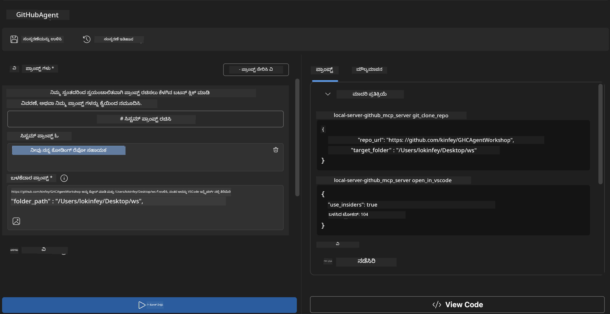
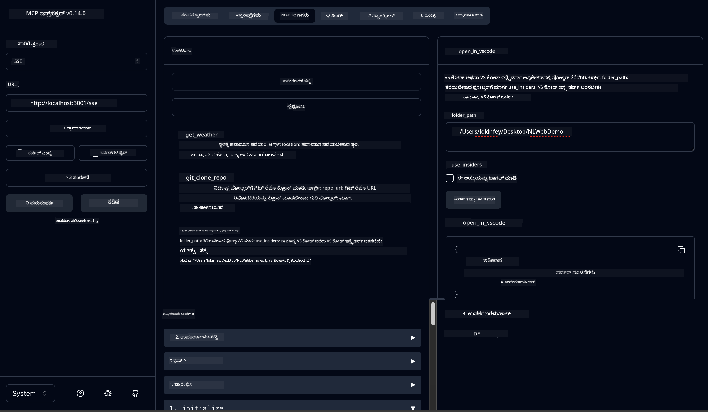

<!--
CO_OP_TRANSLATOR_METADATA:
{
  "original_hash": "f83bc722dc758efffd68667d6a1db470",
  "translation_date": "2025-12-11T16:54:21+00:00",
  "source_file": "10-StreamliningAIWorkflowsBuildingAnMCPServerWithAIToolkit/lab4/README.md",
  "language_code": "kn"
}
-->
# 🐙 Module 4: ಪ್ರಾಯೋಗಿಕ MCP ಅಭಿವೃದ್ಧಿ - ಕಸ್ಟಮ್ GitHub ಕ್ಲೋನ್ ಸರ್ವರ್


> **⚡ ತ್ವರಿತ ಪ್ರಾರಂಭ:** ಕೇವಲ 30 ನಿಮಿಷಗಳಲ್ಲಿ GitHub ರೆಪೊಸಿಟರಿ ಕ್ಲೋನಿಂಗ್ ಮತ್ತು VS Code ಏಕೀಕರಣವನ್ನು ಸ್ವಯಂಚಾಲಿತಗೊಳಿಸುವ ಉತ್ಪಾದನಾ-ಸಿದ್ಧ MCP ಸರ್ವರ್ ನಿರ್ಮಿಸಿ!

## 🎯 ಕಲಿಕೆಯ ಉದ್ದೇಶಗಳು

ಈ ಪ್ರಯೋಗಶಾಲೆಯ ಅಂತ್ಯಕ್ಕೆ, ನೀವು ಸಾಧ್ಯವಾಗುತ್ತದೆ:

- ✅ ನೈಜ ಜಗತ್ತಿನ ಅಭಿವೃದ್ಧಿ ಕಾರ್ಯಪ್ರವಾಹಗಳಿಗೆ ಕಸ್ಟಮ್ MCP ಸರ್ವರ್ ರಚಿಸುವುದು
- ✅ MCP ಮೂಲಕ GitHub ರೆಪೊಸಿಟರಿ ಕ್ಲೋನಿಂಗ್ ಕಾರ್ಯಕ್ಷಮತೆಯನ್ನು ಜಾರಿಗೆ ತರುವುದು
- ✅ ಕಸ್ಟಮ್ MCP ಸರ್ವರ್‌ಗಳನ್ನು VS Code ಮತ್ತು ಏಜೆಂಟ್ ಬಿಲ್ಡರ್ ಜೊತೆಗೆ ಏಕೀಕರಿಸುವುದು
- ✅ GitHub Copilot ಏಜೆಂಟ್ ಮೋಡ್ ಅನ್ನು ಕಸ್ಟಮ್ MCP ಉಪಕರಣಗಳೊಂದಿಗೆ ಬಳಸುವುದು
- ✅ ಉತ್ಪಾದನಾ ಪರಿಸರಗಳಲ್ಲಿ ಕಸ್ಟಮ್ MCP ಸರ್ವರ್‌ಗಳನ್ನು ಪರೀಕ್ಷಿಸಿ ನಿಯೋಜಿಸುವುದು

## 📋 ಪೂರ್ವಾಪೇಕ್ಷಿತಗಳು

- ಪ್ರಯೋಗಶಾಲೆಗಳು 1-3 (MCP ಮೂಲಭೂತಗಳು ಮತ್ತು ಉನ್ನತ ಅಭಿವೃದ್ಧಿ) ಪೂರ್ಣಗೊಳಿಸಲಾಗಿದೆ
- GitHub Copilot ಚಂದಾದಾರಿಕೆ ([ಉಚಿತ ಸೈನ್ ಅಪ್ ಲಭ್ಯವಿದೆ](https://github.com/github-copilot/signup))
- AI ಟೂಲ್ಕಿಟ್ ಮತ್ತು GitHub Copilot ವಿಸ್ತರಣೆಗಳೊಂದಿಗೆ VS Code
- Git CLI ಸ್ಥಾಪನೆ ಮತ್ತು ಸಂರಚನೆ

## 🏗️ ಯೋಜನೆಯ ಅವಲೋಕನ

### **ನೈಜ ಜಗತ್ತಿನ ಅಭಿವೃದ್ಧಿ ಸವಾಲು**
ಅಭಿವೃದ್ಧಿಪಡಿಸುವವರಾಗಿ, ನಾವು ಸಾಮಾನ್ಯವಾಗಿ GitHub ಅನ್ನು ಬಳಸಿಕೊಂಡು ರೆಪೊಸಿಟರಿಗಳನ್ನು ಕ್ಲೋನ್ ಮಾಡಿ ಅವುಗಳನ್ನು VS Code ಅಥವಾ VS Code Insiders ನಲ್ಲಿ ತೆರೆಯುತ್ತೇವೆ. ಈ ಕೈಯಿಂದ ಮಾಡುವ ಪ್ರಕ್ರಿಯೆ ಒಳಗೊಂಡಿದೆ:
1. ಟರ್ಮಿನಲ್/ಕಮಾಂಡ್ ಪ್ರಾಂಪ್ಟ್ ತೆರೆಯುವುದು
2. ಬೇಕಾದ ಡೈರೆಕ್ಟರಿಯ ಕಡೆಗೆ ನಾವಿಗೇಟ್ ಮಾಡುವುದು
3. `git clone` ಕಮಾಂಡ್ ಚಾಲನೆ ಮಾಡುವುದು
4. ಕ್ಲೋನ್ ಮಾಡಿದ ಡೈರೆಕ್ಟರಿಯಲ್ಲಿ VS Code ತೆರೆಯುವುದು

**ನಮ್ಮ MCP ಪರಿಹಾರ ಇದನ್ನು ಒಂದೇ ಬುದ್ಧಿವಂತ ಕಮಾಂಡ್ ಆಗಿ ಸರಳಗೊಳಿಸುತ್ತದೆ!**

### **ನೀವು ನಿರ್ಮಿಸುವುದು ಏನು**
**GitHub ಕ್ಲೋನ್ MCP ಸರ್ವರ್** (`git_mcp_server`) ಇದು ನೀಡುತ್ತದೆ:

| ವೈಶಿಷ್ಟ್ಯ | ವಿವರಣೆ | ಲಾಭ |
|---------|-------------|---------|
| 🔄 **ಸ್ಮಾರ್ಟ್ ರೆಪೊಸಿಟರಿ ಕ್ಲೋನಿಂಗ್** | ಮಾನ್ಯತೆ ಸಹಿತ GitHub ರೆಪೊಗಳನ್ನು ಕ್ಲೋನ್ ಮಾಡುವುದು | ಸ್ವಯಂಚಾಲಿತ ದೋಷ ಪರಿಶೀಲನೆ |
| 📁 **ಬುದ್ಧಿವಂತ ಡೈರೆಕ್ಟರಿ ನಿರ್ವಹಣೆ** | ಸುರಕ್ಷಿತವಾಗಿ ಡೈರೆಕ್ಟರಿಗಳನ್ನು ಪರಿಶೀಲಿಸಿ ರಚಿಸುವುದು | ಮರುಬರೆಯುವಿಕೆಯನ್ನು ತಡೆಯುತ್ತದೆ |
| 🚀 **ಕ್ರಾಸ್-ಪ್ಲಾಟ್‌ಫಾರ್ಮ್ VS Code ಏಕೀಕರಣ** | ಪ್ರಾಜೆಕ್ಟ್‌ಗಳನ್ನು VS Code/Insiders ನಲ್ಲಿ ತೆರೆಯುವುದು | ನಿರಂತರ ಕಾರ್ಯಪ್ರವಾಹ ಪರಿವರ್ತನೆ |
| 🛡️ **ದೃಢ ದೋಷ ನಿರ್ವಹಣೆ** | ನೆಟ್‌ವರ್ಕ್, ಅನುಮತಿ ಮತ್ತು ಮಾರ್ಗ ಸಮಸ್ಯೆಗಳನ್ನು ನಿರ್ವಹಿಸುವುದು | ಉತ್ಪಾದನಾ-ಸಿದ್ಧ ವಿಶ್ವಾಸಾರ್ಹತೆ |

---

## 📖 ಹಂತ ಹಂತವಾಗಿ ಜಾರಿಗೆ ತರುವಿಕೆ

### ಹಂತ 1: ಏಜೆಂಟ್ ಬಿಲ್ಡರ್‌ನಲ್ಲಿ GitHub ಏಜೆಂಟ್ ರಚಿಸಿ

1. AI ಟೂಲ್ಕಿಟ್ ವಿಸ್ತರಣೆಯ ಮೂಲಕ **ಏಜೆಂಟ್ ಬಿಲ್ಡರ್** ಪ್ರಾರಂಭಿಸಿ
2. ಕೆಳಗಿನ ಸಂರಚನೆಯೊಂದಿಗೆ **ಹೊಸ ಏಜೆಂಟ್ ರಚಿಸಿ:**
   ```
   Agent Name: GitHubAgent
   ```

3. **ಕಸ್ಟಮ್ MCP ಸರ್ವರ್ ಪ್ರಾರಂಭಿಸಿ:**
   - **ಟೂಲ್ಸ್** → **ಟೂಲ್ ಸೇರಿಸಿ** → **MCP ಸರ್ವರ್** ಗೆ ಹೋಗಿ
   - **"ಹೊಸ MCP ಸರ್ವರ್ ರಚಿಸಿ"** ಆಯ್ಕೆಮಾಡಿ
   - ಗರಿಷ್ಠ ಲವಚಿಕತೆಗೆ **Python ಟೆಂಪ್ಲೇಟ್** ಆಯ್ಕೆಮಾಡಿ
   - **ಸರ್ವರ್ ಹೆಸರು:** `git_mcp_server`

### ಹಂತ 2: GitHub Copilot ಏಜೆಂಟ್ ಮೋಡ್ ಸಂರಚಿಸಿ

1. VS Code ನಲ್ಲಿ GitHub Copilot ತೆರೆಯಿರಿ (Ctrl/Cmd + Shift + P → "GitHub Copilot: Open")
2. Copilot ಇಂಟರ್ಫೇಸ್ನಲ್ಲಿ **ಏಜೆಂಟ್ ಮಾದರಿ** ಆಯ್ಕೆಮಾಡಿ
3. ಉತ್ತಮ ತರ್ಕ ಸಾಮರ್ಥ್ಯಕ್ಕಾಗಿ **Claude 3.7 ಮಾದರಿ** ಆಯ್ಕೆಮಾಡಿ
4. ಉಪಕರಣ ಪ್ರವೇಶಕ್ಕಾಗಿ **MCP ಏಕೀಕರಣ** ಸಕ್ರಿಯಗೊಳಿಸಿ

> **💡 ಪ್ರೊ ಟಿಪ್:** Claude 3.7 ಅಭಿವೃದ್ಧಿ ಕಾರ್ಯಪ್ರವಾಹಗಳು ಮತ್ತು ದೋಷ ನಿರ್ವಹಣಾ ಮಾದರಿಗಳ ಉತ್ತಮ ಅರ್ಥವನ್ನು ಒದಗಿಸುತ್ತದೆ.

### ಹಂತ 3: ಮೂಲ MCP ಸರ್ವರ್ ಕಾರ್ಯಕ್ಷಮತೆಯನ್ನು ಜಾರಿಗೆ ತರುವುದು

**GitHub Copilot ಏಜೆಂಟ್ ಮೋಡ್ ಜೊತೆಗೆ ಕೆಳಗಿನ ವಿವರವಾದ ಪ್ರಾಂಪ್ಟ್ ಬಳಸಿ:**

```
Create two MCP tools with the following comprehensive requirements:

🔧 TOOL A: clone_repository
Requirements:
- Clone any GitHub repository to a specified local folder
- Return the absolute path of the successfully cloned project
- Implement comprehensive validation:
  ✓ Check if target directory already exists (return error if exists)
  ✓ Validate GitHub URL format (https://github.com/user/repo)
  ✓ Verify git command availability (prompt installation if missing)
  ✓ Handle network connectivity issues
  ✓ Provide clear error messages for all failure scenarios

🚀 TOOL B: open_in_vscode
Requirements:
- Open specified folder in VS Code or VS Code Insiders
- Cross-platform compatibility (Windows/Linux/macOS)
- Use direct application launch (not terminal commands)
- Auto-detect available VS Code installations
- Handle cases where VS Code is not installed
- Provide user-friendly error messages

Additional Requirements:
- Follow MCP 1.9.3 best practices
- Include proper type hints and documentation
- Implement logging for debugging purposes
- Add input validation for all parameters
- Include comprehensive error handling
```

### ಹಂತ 4: ನಿಮ್ಮ MCP ಸರ್ವರ್ ಅನ್ನು ಪರೀಕ್ಷಿಸಿ

#### 4a. ಏಜೆಂಟ್ ಬಿಲ್ಡರ್‌ನಲ್ಲಿ ಪರೀಕ್ಷೆ

1. ಏಜೆಂಟ್ ಬಿಲ್ಡರ್‌ಗೆ ಡಿಬಗ್ ಸಂರಚನೆಯನ್ನು ಪ್ರಾರಂಭಿಸಿ
2. ಈ ಸಿಸ್ಟಮ್ ಪ್ರಾಂಪ್ಟ್ ಬಳಸಿ ನಿಮ್ಮ ಏಜೆಂಟ್ ಅನ್ನು ಸಂರಚಿಸಿ:

```
SYSTEM_PROMPT:
You are my intelligent coding repository assistant. You help developers efficiently clone GitHub repositories and set up their development environment. Always provide clear feedback about operations and handle errors gracefully.
```

3. ವಾಸ್ತವಿಕ ಬಳಕೆದಾರ ದೃಶ್ಯಾವಳಿಗಳೊಂದಿಗೆ ಪರೀಕ್ಷಿಸಿ:

```
USER_PROMPT EXAMPLES:

Scenario : Basic Clone and Open
"Clone {Your GitHub Repo link such as https://github.com/kinfey/GHCAgentWorkshop
 } and save to {The global path you specify}, then open it with VS Code Insiders"
```



**ನಿರೀಕ್ಷಿತ ಫಲಿತಾಂಶಗಳು:**
- ✅ ಮಾರ್ಗದ ದೃಢೀಕರಣದೊಂದಿಗೆ ಯಶಸ್ವಿ ಕ್ಲೋನಿಂಗ್
- ✅ ಸ್ವಯಂಚಾಲಿತ VS Code ಪ್ರಾರಂಭ
- ✅ ಅಮಾನ್ಯ ದೃಶ್ಯಾವಳಿಗಳಿಗೆ ಸ್ಪಷ್ಟ ದೋಷ ಸಂದೇಶಗಳು
- ✅ ಅಂಚು ಪ್ರಕರಣಗಳ ಸರಿಯಾದ ನಿರ್ವಹಣೆ

#### 4b. MCP ಇನ್ಸ್‌ಪೆಕ್ಟರ್‌ನಲ್ಲಿ ಪರೀಕ್ಷೆ




---


**🎉 ಅಭಿನಂದನೆಗಳು!** ನೀವು ನೈಜ ಅಭಿವೃದ್ಧಿ ಕಾರ್ಯಪ್ರವಾಹ ಸವಾಲುಗಳನ್ನು ಪರಿಹರಿಸುವ ಪ್ರಾಯೋಗಿಕ, ಉತ್ಪಾದನಾ-ಸಿದ್ಧ MCP ಸರ್ವರ್ ಅನ್ನು ಯಶಸ್ವಿಯಾಗಿ ರಚಿಸಿದ್ದೀರಿ. ನಿಮ್ಮ ಕಸ್ಟಮ್ GitHub ಕ್ಲೋನ್ ಸರ್ವರ್ MCP ಶಕ್ತಿಯನ್ನು ಪ್ರದರ್ಶಿಸುತ್ತದೆ, ಇದು ಅಭಿವೃದ್ಧಿಪಡಿಸುವವರ ಉತ್ಪಾದಕತೆಯನ್ನು ಸ್ವಯಂಚಾಲಿತಗೊಳಿಸುವ ಮತ್ತು ಸುಧಾರಿಸುವುದಕ್ಕೆ ಸಹಾಯ ಮಾಡುತ್ತದೆ.

### 🏆 ಸಾಧನೆ ಅನ್ಲಾಕ್ ಮಾಡಲಾಗಿದೆ:
- ✅ **MCP ಡೆವಲಪರ್** - ಕಸ್ಟಮ್ MCP ಸರ್ವರ್ ರಚಿಸಲಾಗಿದೆ
- ✅ **ಕಾರ್ಯಪ್ರವಾಹ ಸ್ವಯಂಚಾಲಕ** - ಅಭಿವೃದ್ಧಿ ಪ್ರಕ್ರಿಯೆಗಳನ್ನು ಸರಳಗೊಳಿಸಲಾಗಿದೆ  
- ✅ **ಏಕೀಕರಣ ತಜ್ಞ** - ಅನೇಕ ಅಭಿವೃದ್ಧಿ ಉಪಕರಣಗಳನ್ನು ಸಂಪರ್ಕಿಸಲಾಗಿದೆ
- ✅ **ಉತ್ಪಾದನಾ ಸಿದ್ಧ** - ನಿಯೋಜಿಸಲು ಸಿದ್ಧ ಪರಿಹಾರಗಳನ್ನು ನಿರ್ಮಿಸಲಾಗಿದೆ

---

## 🎓 ಕಾರ್ಯಾಗಾರ ಪೂರ್ಣಗೊಳಿಸುವಿಕೆ: Model Context Protocol ಜೊತೆಗೆ ನಿಮ್ಮ ಪ್ರಯಾಣ

**ಪ್ರಿಯ ಕಾರ್ಯಾಗಾರ ಭಾಗವಹಿಸುವವರು,**

Model Context Protocol ಕಾರ್ಯಾಗಾರದ ಎಲ್ಲಾ ನಾಲ್ಕು ಘಟಕಗಳನ್ನು ಪೂರ್ಣಗೊಳಿಸಿದ ನಿಮಗೆ ಅಭಿನಂದನೆಗಳು! ನೀವು ಮೂಲ AI ಟೂಲ್ಕಿಟ್ ತತ್ವಗಳನ್ನು ಅರ್ಥಮಾಡಿಕೊಳ್ಳುವುದರಿಂದ ಪ್ರಾರಂಭಿಸಿ ನೈಜ ಜಗತ್ತಿನ ಅಭಿವೃದ್ಧಿ ಸವಾಲುಗಳನ್ನು ಪರಿಹರಿಸುವ ಉತ್ಪಾದನಾ-ಸಿದ್ಧ MCP ಸರ್ವರ್‌ಗಳನ್ನು ನಿರ್ಮಿಸುವವರೆಗೆ ದೂರದೂರಿಗೆ ಬಂದಿದ್ದೀರಿ.

### 🚀 ನಿಮ್ಮ ಕಲಿಕೆಯ ಮಾರ್ಗ ಸಂಕ್ಷಿಪ್ತ:

**[ಘಟಕ 1](../lab1/README.md)**: ನೀವು AI ಟೂಲ್ಕಿಟ್ ಮೂಲಭೂತಗಳು, ಮಾದರಿ ಪರೀಕ್ಷೆ ಮತ್ತು ನಿಮ್ಮ ಮೊದಲ AI ಏಜೆಂಟ್ ರಚನೆಗಳನ್ನು ಅನ್ವೇಷಿಸಿದರು.

**[ಘಟಕ 2](../lab2/README.md)**: MCP ವಾಸ್ತುಶಿಲ್ಪವನ್ನು ಕಲಿತು, Playwright MCP ಅನ್ನು ಏಕೀಕರಿಸಿ, ನಿಮ್ಮ ಮೊದಲ ಬ್ರೌಸರ್ ಸ್ವಯಂಚಾಲಕ ಏಜೆಂಟ್ ನಿರ್ಮಿಸಿದರು.

**[ಘಟಕ 3](../lab3/README.md)**: ಹವಾಮಾನ MCP ಸರ್ವರ್ ಜೊತೆಗೆ ಕಸ್ಟಮ್ MCP ಸರ್ವರ್ ಅಭಿವೃದ್ಧಿಗೆ ಮುಂದುವರಿದು, ಡಿಬಗ್ ಉಪಕರಣಗಳನ್ನು ನಿಪುಣತೆಯಿಂದ ಬಳಸಿದರು.

**[ಘಟಕ 4](../lab4/README.md)**: ಈಗ ನೀವು ಎಲ್ಲವನ್ನೂ ಅನ್ವಯಿಸಿ ನೈಜ GitHub ರೆಪೊ ಕಾರ್ಯಪ್ರವಾಹ ಸ್ವಯಂಚಾಲಕ ಉಪಕರಣವನ್ನು ರಚಿಸಿದ್ದೀರಿ.

### 🌟 ನೀವು ನಿಪುಣರಾದ ವಿಷಯಗಳು:

- ✅ **AI ಟೂಲ್ಕಿಟ್ ಪರಿಸರ**: ಮಾದರಿಗಳು, ಏಜೆಂಟ್‌ಗಳು ಮತ್ತು ಏಕೀಕರಣ ಮಾದರಿಗಳು
- ✅ **MCP ವಾಸ್ತುಶಿಲ್ಪ**: ಕ್ಲೈಂಟ್-ಸರ್ವರ್ ವಿನ್ಯಾಸ, ಸಾರಿಗೆ ಪ್ರೋಟೋಕಾಲ್‌ಗಳು ಮತ್ತು ಭದ್ರತೆ
- ✅ **ಡೆವಲಪರ್ ಉಪಕರಣಗಳು**: ಪ್ಲೇಗ್ರೌಂಡ್, ಇನ್ಸ್‌ಪೆಕ್ಟರ್ ಮತ್ತು ಉತ್ಪಾದನಾ ನಿಯೋಜನೆ
- ✅ **ಕಸ್ಟಮ್ ಅಭಿವೃದ್ಧಿ**: ನಿಮ್ಮದೇ MCP ಸರ್ವರ್‌ಗಳನ್ನು ನಿರ್ಮಿಸುವುದು, ಪರೀಕ್ಷಿಸುವುದು ಮತ್ತು ನಿಯೋಜಿಸುವುದು
- ✅ **ಪ್ರಾಯೋಗಿಕ ಅನ್ವಯಿಕೆಗಳು**: AI ಮೂಲಕ ನೈಜ ಕಾರ್ಯಪ್ರವಾಹ ಸವಾಲುಗಳನ್ನು ಪರಿಹರಿಸುವುದು

### 🔮 ನಿಮ್ಮ ಮುಂದಿನ ಹಂತಗಳು:

1. **ನಿಮ್ಮದೇ MCP ಸರ್ವರ್ ನಿರ್ಮಿಸಿ**: ನಿಮ್ಮ ವಿಶಿಷ್ಟ ಕಾರ್ಯಪ್ರವಾಹಗಳನ್ನು ಸ್ವಯಂಚಾಲಿತಗೊಳಿಸಲು ಈ ಕೌಶಲ್ಯಗಳನ್ನು ಅನ್ವಯಿಸಿ
2. **MCP ಸಮುದಾಯದಲ್ಲಿ ಸೇರಿ**: ನಿಮ್ಮ ಸೃಷ್ಟಿಗಳನ್ನು ಹಂಚಿಕೊಳ್ಳಿ ಮತ್ತು ಇತರರಿಂದ ಕಲಿಯಿರಿ
3. **ಉನ್ನತ ಏಕೀಕರಣವನ್ನು ಅನ್ವೇಷಿಸಿ**: MCP ಸರ್ವರ್‌ಗಳನ್ನು ಎಂಟರ್‌ಪ್ರೈಸ್ ವ್ಯವಸ್ಥೆಗಳಿಗೆ ಸಂಪರ್ಕಿಸಿ
4. **ಓಪನ್ ಸೋರ್ಸ್‌ಗೆ ಕೊಡುಗೆ ನೀಡಿ**: MCP ಉಪಕರಣಗಳು ಮತ್ತು ಡಾಕ್ಯುಮೆಂಟೇಶನ್ ಸುಧಾರಣೆಗೆ ಸಹಾಯ ಮಾಡಿ

ಈ ಕಾರ್ಯಾಗಾರವು ಕೇವಲ ಪ್ರಾರಂಭವಾಗಿದೆ ಎಂದು ನೆನಸಿಕೊಳ್ಳಿ. Model Context Protocol ಪರಿಸರವು ವೇಗವಾಗಿ ಅಭಿವೃದ್ಧಿಯಾಗುತ್ತಿದೆ, ಮತ್ತು ನೀವು ಈಗ AI-ಚಾಲಿತ ಅಭಿವೃದ್ಧಿ ಉಪಕರಣಗಳ ಮುಂಭಾಗದಲ್ಲಿದ್ದೀರಿ.

**ನಿಮ್ಮ ಭಾಗವಹಿಸುವಿಕೆ ಮತ್ತು ಕಲಿಕೆಗೆ ಸಮರ್ಪಣೆಗೆ ಧನ್ಯವಾದಗಳು!**

ನಾವು ಈ ಕಾರ್ಯಾಗಾರವು ನಿಮ್ಮ ಅಭಿವೃದ್ಧಿ ಪ್ರಯಾಣದಲ್ಲಿ AI ಉಪಕರಣಗಳನ್ನು ನಿರ್ಮಿಸುವ ಮತ್ತು ಸಂವಹನ ಮಾಡುವ ರೀತಿಯನ್ನು ಪರಿವರ್ತಿಸುವ ಆಲೋಚನೆಗಳನ್ನು ಪ್ರೇರೇಪಿಸಿದೆ ಎಂದು ಆಶಿಸುತ್ತೇವೆ.

**ಸಂತೋಷಕರ ಕೋಡಿಂಗ್!**

---

---

<!-- CO-OP TRANSLATOR DISCLAIMER START -->
**ಅಸ್ವೀಕರಣ**:  
ಈ ದಸ್ತಾವೇಜು AI ಅನುವಾದ ಸೇವೆ [Co-op Translator](https://github.com/Azure/co-op-translator) ಬಳಸಿ ಅನುವಾದಿಸಲಾಗಿದೆ. ನಾವು ನಿಖರತೆಯಿಗಾಗಿ ಪ್ರಯತ್ನಿಸುತ್ತಿದ್ದರೂ, ಸ್ವಯಂಚಾಲಿತ ಅನುವಾದಗಳಲ್ಲಿ ದೋಷಗಳು ಅಥವಾ ಅಸತ್ಯತೆಗಳು ಇರಬಹುದು ಎಂದು ದಯವಿಟ್ಟು ಗಮನಿಸಿ. ಮೂಲ ಭಾಷೆಯಲ್ಲಿರುವ ಮೂಲ ದಸ್ತಾವೇಜನ್ನು ಅಧಿಕೃತ ಮೂಲವಾಗಿ ಪರಿಗಣಿಸಬೇಕು. ಮಹತ್ವದ ಮಾಹಿತಿಗಾಗಿ, ವೃತ್ತಿಪರ ಮಾನವ ಅನುವಾದವನ್ನು ಶಿಫಾರಸು ಮಾಡಲಾಗುತ್ತದೆ. ಈ ಅನುವಾದ ಬಳಕೆಯಿಂದ ಉಂಟಾಗುವ ಯಾವುದೇ ತಪ್ಪು ಅರ್ಥಮಾಡಿಕೊಳ್ಳುವಿಕೆ ಅಥವಾ ತಪ್ಪು ವಿವರಣೆಗಳಿಗೆ ನಾವು ಹೊಣೆಗಾರರಾಗುವುದಿಲ್ಲ.
<!-- CO-OP TRANSLATOR DISCLAIMER END -->