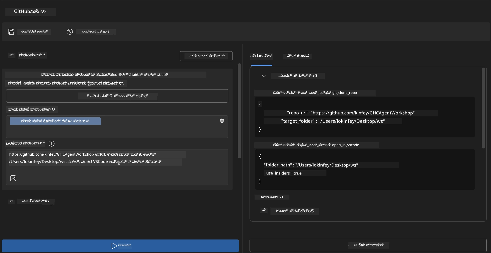
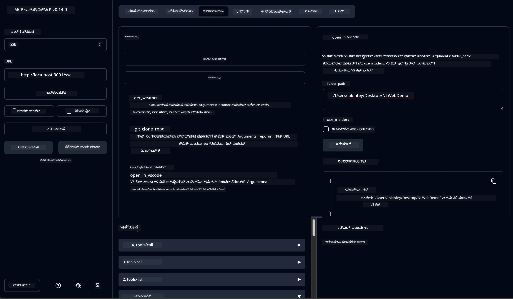

# 🐙 Module 4: ಪ್ರಾಯೋಗಿಕ MCP ಅಭಿವೃದ್ಧಿ - ಕಸ್ಟಮ್ GitHub ಕ್ಲೋನ್ ಸರ್ವರ್


> **⚡ ತ್ವರಿತ ಪ್ರಾರಂಭ:** ಗಿಟ್‌ಹಬ್ ರೆಪೊಸಿ ಕ್ಲೋನಿಂಗ್ ಮತ್ತು VS ಕೋಡ್ ಇಂಟಿಗ್ರೇಶನ್ ಸ್ವಯಂಚಾಲಿತಗೊಳಿಸುವ ಉತ್ಪಾದನೆಗೆ ಸಿದ್ಧ MCP ಸರ್ವರ್ ಅನ್ನು ಕೇವಲ 30 ನಿಮಿಷಗಳಲ್ಲಿ ನಿರ್ಮಿಸಿರಿ!

## 🎯 ಕಲಿಕೆ ಗುರಿಗಳು

ಈ ಪ್ರಯೋಗಶಾಲೆಯ ಅಂತ್ಯಕ್ಕೆ, ನೀವು ಸೇಕ್ಷಿಸಲಾಗುತ್ತದೆ:

- ✅ ವಾಸ್ತವಿಕ ಅಭಿವೃದ್ಧಿ ಕಾರ್ಯಪ್ರವಾಹಗಳಿಗಾಗಿ ಕಸ್ಟಮ್ MCP ಸರ್ವರ್ ರಚನೆ
- ✅ MCP ಮೂಲಕ GitHub ರೆಪೊಸಿಟರಿ ಕ್ಲೋನಿಂಗ್ ಕಾರ್ಯಕ್ಷಮತೆ ಅನುಷ್ಠಾನ
- ✅ ಕಸ್ಟಮ್ MCP ಸರ್ವರ್‌ಗಳನ್ನು VS ಕೋಡ್ ಮತ್ತು ಏಜೆಂಟ್ ಬಿಲ್ಡರ್‌ ಜತೆ ಏಕೀಕರಣ
- ✅ GitHub Copilot ಏಜೆಂಟ್ ಮೋಡ್ ಅನ್ನು ಕಸ್ಟಮ್ MCP ಸಾಧನಗಳೊಂದಿಗೆ ಉಪಯೋಗಿಸುವುದು
- ✅ ಉತ್ಪಾದನಾ ಪರಿಸರಗಳಲ್ಲಿ ಕಸ್ಟಮ್ MCP ಸರ್ವರ್‌ಗಳನ್ನು ಪರೀಕ್ಷಿಸಿ ನಿಯೋಜಿಸುವುದು

## 📋 ಪೂರ್ವಾಪೇಕ್ಷಿತಗಳು

- ಪ್ರಯೋಗಶಾಲೆಗಳು 1-3 (MCP ಮೂಲತತ್ವಗಳು ಮತ್ತು ಸುಧಾರಿತ ಅಭಿವೃದ್ಧಿ) ಪೂರ್ಣಗೊಳಿಸಲಾಗಿದೆ
- GitHub Copilot ಸಬ್‍ಸ್ಕ್ರಿಪ್ಷನ್ ([ಉಚಿತ ಸೈನ್ ಅಪ್ ಲಭ್ಯ](https://github.com/github-copilot/signup))
- AI Toolkit ಮತ್ತು GitHub Copilot ವಿಸ್ತರಣೆಗಳೊಂದಿಗೆ VS ಕೋಡ್
- Git CLI ಸ್ಥಾಪಿತ ಮತ್ತು ಸಂರಚಿತ

## 🏗️ ಯೋಜನೆನೋಟ

### **ವಾಸ್ತವಿಕ ಅಭಿವೃದ್ಧಿ ಸವಾಲು**
ಡವೆಲಪರ್‌ಗಳಾಗಿ, ನಾವು thường GitHub ರೆಪೊಸೆಗಳ ಅನ್ನು ಕ್ಲೋನಿಂಗ್ ಮಾಡಿ VS ಕೋಡ್ ಅಥವಾ VS ಕೋಡ್ ಇನ್ಸೈಡರ್ಗಾಗಿ ತೆರೆಯುವ ಕೆಲಸ ಮಾಡುತ್ತೇವೆ. ಈ ಕೈಗಾರಿಕಾ ಪ್ರಕ್ರಿಯೆಯಲ್ಲಿ:
1. ಟರ್ಮಿನಲ್/ಕಮಾಂಡ್ ಪ್ರಾಂಪ್ಟ್ ತೆರೆಯುವುದು
2. ಬೇಕಾದ ಡೈರೆಕ್ಟರಿಗೆ ಬರುವುದು
3. `git clone` ಕಮಾಂಡ್ ಚಾಲಿಸುವುದು
4. ಕ್ಲೋನ್ ಮಾಡಿದ ಡೈರೆಕ್ಟರಿಯಲ್ಲಿ VS ಕೋಡ್ ತೆರೆಯುವುದು

**ನಮ್ಮ MCP ಪರಿಹಾರ ಇದನ್ನು ಒಂದು ಸ್ಮಾರ್ಟ್ ಕಮಾಂಡ್‌ನಲ್ಲಿ ಸರಳಗೊಳಿಸುತ್ತದೆ!**

### **ನೀವು ನಿರ್ಮಿಸುವುದು ಏನು**
GitHub Clone MCP ಸರ್ವರ್ (`git_mcp_server`) ಈ ಎಲ್ಲವುಗಳನ್ನು ಒದಗಿಸುತ್ತದೆ:

| ವೈಶಿಷ್ಟ್ಯ | ವಿವರಣೆ | ಲಾಭ |
|---------|-------------|---------|
| 🔄 **ಸ್ಮಾರ್ಟ್ ರೆಪೊಸಿಟರಿ ಕ್ಲೋನಿಂಗ್** | ಸಾಕ್ಷ್ಯಪತ್ರಗಳೊಂದಿಗೆ GitHub ರೆಪೊಗಳ ಕ್ಲೋನಿಂಗ್ | ಸ್ವಯಂಚಾಲಿತ ದೋಷ ಪರಿಶೀಲನೆ |
| 📁 **ಬುದ್ಧಿವಂತಿಕೆಯಿಂದ ಡೈರೆಕ್ಟರಿ ನಿರ್ವಹಣೆ** | ಡೈರೆಕ್ಟರಿಗಳನ್ನು ಪರಿಶೀಲಿಸಿ ಸುರಕ್ಷಿತವಾಗಿ ಸೃಷ್ಟಿಸುವುದು | ಮರುಬರೆಯನ್ನು ತಡೆಯುತ್ತದೆ |
| 🚀 **ಕ್ರಾಸ್-ಪ್ಲಾಟ್‌ಫಾರ್ಮ್ VS ಕೋಡ್ ಏಕೀಕರಣ** | ಪ್ರಾಜೆಕ್ಟ್‌ಗಳನ್ನು VS ಕೋಡ್/ಇನ್ಸೈಡರ್ಸ್‌ನಲ್ಲಿ ತೆರೆಯುವುದು | ನಿರಂತರ ಕೆಲಸದ ಹಾದಿ |
| 🛡️ **ಬಲಿಷ್ಠ ದೋಷ ನಿರ್ವಹಣೆ** | ನೆಟ್‌ವರ್ಕ್, ಅನುಮತಿ, ಮತ್ತು ಪಾಥ್ ಸಮಸ್ಯೆಗಳನ್ನು ನಿರ್ವಹಿಸುವುದು | ಉತ್ಪಾದನೆಗೆ ಸಿದ್ಧವಾದ ವಿಶ್ವಾಸಾರ್ಹತೆ |

---

## 📖 ಹಂತ ಹಂತದ ಅನುಷ್ಠಾನ

### ಹಂತ 1: ಏಜೆಂಟ್ ಬಿಲ್ಡರ್ ನಲ್ಲಿ GitHub ಏಜೆಂಟ್ ರಚನೆ

1. AI Toolkit ವಿಸ್ತರಣೆ ಮೂಲಕ **Agent Builder** ಆರಂಭಿಸಿ
2. ಕೆಳಗಿನ ಸಂರಚನೆಯೊಂದಿಗೆ **ಹೊಸ ಏಜೆಂಟ್ ರಚಿಸಿ:**
   ```
   Agent Name: GitHubAgent
   ```

3. **ಕಸ್ಟಮ್ MCP ಸರ್ವರ್ ಪ್ರಾರಂಭಿಸಿ:**
   - **Tools** → **Add Tool** → **MCP Server** ಗೆ ಹೋಗಿ
   - **"Create A new MCP Server"** ಅನ್ನು ಆಯ್ಕೆಮಾಡಿ
   - ಹೆಚ್ಚು მოქಲಿಕೆಗೆ **Python template** ಆಯ್ಕೆಮಾಡಿ
   - **ಸರ್ವರ್ ಹೆಸರು:** `git_mcp_server`

### ಹಂತ 2: GitHub Copilot ಏಜೆಂಟ್ ಮೋಡ್ ಸಂರಚನೆ

1. VS ಕೋಡ್ ನಲ್ಲಿ GitHub Copilot ತೆರೆಯಿರಿ (Ctrl/Cmd + Shift + P → "GitHub Copilot: Open")
2. Copilot ಇಂಟರ್‌ಫೇಸ್‌ನಲ್ಲಿ **Agent Model** ಆಯ್ಕೆಮಾಡಿ
3. ಉತ್ತಮ ತಾರ್ಕಿಕ ಸಾಮರ್ಥ್ಯಕ್ಕಾಗಿ **Claude 3.7 ಮಾದರಿ** ಆಯ್ಕೆಮಾಡಿ
4. ಉಪಕರಣ ಪ್ರವೇಶಕ್ಕಾಗಿ **MCP ಇಂಟಿಗ್ರೇಶನ್ ಸಕ್ರಿಯಗೊಳಿಸಿ**

> **💡 ಪ್ರೊ ಟಿಪ್:** Claude 3.7 ಅಭಿವೃದ್ಧಿ ಕಾರ್ಯಪ್ರವಾಹಗಳು ಮತ್ತು ದೋಷ ನಿರ್ವಹಣಾ ಮಂಡಲಗಳನ್ನು ಉತ್ತಮವಾಗಿ ಅರ್ಥಮಾಡಿಕೊಳ್ಳುತ್ತದೆ.

### ಹಂತ 3: ಮುಖ್ಯ MCP ಸರ್ವರ್ ಕಾರ್ಯಕ್ಷಮತೆ ಅನುಷ್ಠಾನ

**GitHub Copilot ಏಜೆಂಟ್ ಮೋಡ್ ಜೊತೆ ಕೆಳಗಿನ ವಿವರಪೂರ್ಣ ಪ್ರಾಂಪ್ಟ್ ಬಳಸಿ:**

```
Create two MCP tools with the following comprehensive requirements:

🔧 TOOL A: clone_repository
Requirements:
- Clone any GitHub repository to a specified local folder
- Return the absolute path of the successfully cloned project
- Implement comprehensive validation:
  ✓ Check if target directory already exists (return error if exists)
  ✓ Validate GitHub URL format (https://github.com/user/repo)
  ✓ Verify git command availability (prompt installation if missing)
  ✓ Handle network connectivity issues
  ✓ Provide clear error messages for all failure scenarios

🚀 TOOL B: open_in_vscode
Requirements:
- Open specified folder in VS Code or VS Code Insiders
- Cross-platform compatibility (Windows/Linux/macOS)
- Use direct application launch (not terminal commands)
- Auto-detect available VS Code installations
- Handle cases where VS Code is not installed
- Provide user-friendly error messages

Additional Requirements:
- Follow MCP 1.9.3 best practices
- Include proper type hints and documentation
- Implement logging for debugging purposes
- Add input validation for all parameters
- Include comprehensive error handling
```

### ಹಂತ 4: ನಿಮ್ಮ MCP ಸರ್ವರ್ ಪರೀಕ್ಷೆ

#### 4a. ಏಜೆಂಟ್ ಬಿಲ್ಡರ್‌ನಲ್ಲಿ ಪರೀಕ್ಷೆ

1. ಏಜೆಂಟ್ ಬಿಲ್ಡರ್‌ನ ಡಿಬಗ್ ಸಂರಚನೆಯನ್ನು ಪ್ರಾರಂಭಿಸಿ
2. ಈ ಸಿಸ್ಟಮ್ ಪ್ರಾಂಪ್ಟ್ ಸಹಿತ ನಿಮ್ಮ ಏಜೆಂಟ್ ಅನ್ನು ಸಂರಚಿಸಿ:

```
SYSTEM_PROMPT:
You are my intelligent coding repository assistant. You help developers efficiently clone GitHub repositories and set up their development environment. Always provide clear feedback about operations and handle errors gracefully.
```

3. ವಾಸ್ತವಿಕ ಬಳಕೆದಾರ ಪರಿದೃಶ್ಯಗಳೊಂದಿಗೆ ಪರೀಕ್ಷಿಸಿ:

```
USER_PROMPT EXAMPLES:

Scenario : Basic Clone and Open
"Clone {Your GitHub Repo link such as https://github.com/kinfey/GHCAgentWorkshop
 } and save to {The global path you specify}, then open it with VS Code Insiders"
```



**ನಿರೀಕ್ಷಿತ ಫಲಿತಾಂಶಗಳು:**
- ✅ ಮಾರ್ಗವನ್ನು ಖಚಿತಪಡಿಸಿದೊಂದಿಗೆ ಯಶಸ್ವೀ ಕ್ಲೋನಿಂಗ್
- ✅ ಸ್ವಯಂಚಾಲಿತ VS ಕೋಡ್ ಪ್ರಾರಂಭ
- ✅ ಅಮಾನ್ಯ ಸಂದರ್ಭಗಳಿಗೆ ಸ್ಪಷ್ಟ ದೋಷ ಸಂದೇಶಗಳು
- ✅ ಅತಿದೊಡ್ಡ ಪ್ರಕರಣಗಳ ಸರಿಯಾದ ನಿರ್ವಹಣೆ

#### 4b. MCP ಇನ್ಸ್ಪೆಕ್ಟರ್ ನಲ್ಲಿ ಪರೀಕ್ಷೆ



---


**🎉 ಅಭಿನಂದನೆಗಳು!** ನೀವು ಯಥಾರ್ಥ ಮತ್ತು ಉತ್ಪಾದನೆಗೆ ಸಿದ್ಧ MCP ಸರ್ವರ್ ಅನ್ನು ಯಶಸ್ವಿಯಾಗಿ ರಚಿಸಿದ್ದೀರಿ, ಇದು ವಾಸ್ತವಿಕ ಅಭಿವೃದ್ಧಿ ಕಾರ್ಯಪ್ರವಾಹ ಸವಾಲುಗಳನ್ನು ಪರಿಹರಿಸುತ್ತದೆ. ನಿಮ್ಮ ಕಸ್ಟಮ್ GitHub ಕ್ಲೋನ್ ಸರ್ವರ್ ನಿರ್ವಹಣೆ ಸ್ವಯಂಚಾಲನೆಯ ಮತ್ತು ಅಭಿವೃದ್ಧಿ ಉತ್ಪಾದಕತೆ ಹೆಚ್ಚಳದ MCP ಶಕ್ತಿಯನ್ನು ತೋರಿಸುತ್ತದೆ.

### 🏆 ಸಾಧನೆ ಅನ್ಲಾಕ್ ಆಗಿದೆ:
- ✅ **MCP ಡವೆಲಪರ್** - ಕಸ್ಟಮ್ MCP ಸರ್ವರ್ ರಚಿಸಲಾಗಿದೆ
- ✅ **ಕಾರ್ಯಪ್ರವಾಹ ಸ್ವಯಂಚಾಲಕ** - ಅಭಿವೃದ್ಧಿ ಪ್ರಕ್ರಿಯೆಗಳ ಸರಳೀಕರಣ  
- ✅ **ಎಕತೆಯ ತಜ್ಞ** - ಹಲವು ಅಭಿವೃದ್ಧಿ ಸಾಧನಗಳನ್ನು ಸಂಪರ್ಕಿಸಿದವರು
- ✅ **ಉತ್ಪಾದನೆಗೆ ಸಿದ್ಧ** - ನಿಯೋಜಿಸಬಹುದಾದ ಪರಿಹಾರಗಳನ್ನು ನಿರ್ಮಿಸಿದವರು

---

## 🎓 ಕಾರ್ಯಾಗಾರದ ಪೂರ್ಣಗೊಳಿಸು: Model Context Protocol ಜೊತೆಗೆ ನಿಮ್ಮ ಪ್ರಯಾಣ

**ಪ್ರಿಯ ಕಾರ್ಯಾಗಾರ ಭಾಗವಹಿಸುವವರು,**

Model Context Protocol ಕಾರ್ಯಾಗಾರದ ಎಲ್ಲಾ ನಾಲ್ಕು ಮೋಡ್ಯೂಲ್‌ಗಳನ್ನು ಪೂರ್ಣಗೊಳಿಸಿದ ಬಗ್ಗೆ ಅಭಿನಂದನೆಗಳು! ನೀವು AI Toolkit ಮೂಲತತ್ತ್ವಗಳನ್ನು ಅರ್ಥಮಾಡಿಕೊಳ್ಳುವುದರಿಂದ ಉತ್ಪಾದನೆಗೆ ಸಿದ್ಧ MCP ಸರ್ವರ್‌ಗಳನ್ನು ನಿರ್ಮಿಸುವ ತನಕ ದೊಡ್ಡ ಪಥವನ್ನು ಸಾಗಿದ್ದೀರಿ, ಜಾಗತಿಕ ಅಭಿವೃದ್ಧಿ ಸವಾಲುಗಳನ್ನು ಪರಿಹರಿಸುತ್ತಿರುವಂತೆ.

### 🚀 ನಿಮ್ಮ ಕಲಿಕೆಯ ಮಾರ್ಗದ ಸಂಕ್ಷಿಪ್ತ ವಿವರಣೆ:

**[ಮೋಡ್ಯೂಲ್ 1](../lab1/README.md)**: AI Toolkit ಮೂಲಭೂತವನ್ನು ಅನ್ವೇಷಿಸಿ ಮೊದಲ AI ಏಜೆಂಟ್‌ನ ರಚನೆ.

**[ಮೋಡ್ಯೂಲ್ 2](../lab2/README.md)**: MCP ವಾಸ್ತುಶಿಲ್ಪ ತಿಳಿದುಕೊಳ್ಳಲಾಯಿತು, Playwright MCP ಸಂಯೋಜನೆ ಮತ್ತು ಬ್ರೌಸರ್ ಸ್ವಯಂಚಾಲನ ಏಜೆಂಟ್ ನಿರ್ಮಾಣ.

**[ಮೋಡ್ಯೂಲ್ 3](../lab3/README.md)**: custom MCP ಸರ್ವರ್ ಅಭಿವೃದ್ಧಿ ಮತ್ತು ಡಿಬಗ್ ಸಲಕರಣೆಗಳಲ್ಲಿ ನಿಪುಣತೆ.

**[ಮೋಡ್ಯೂಲ್ 4](../lab4/README.md)**: ಉತ್ತಮ ಆಧುನಿಕ GitHub ಸಂಗ್ರಹ ಕಾರ್ಯೋನ್ಮುಖ ಸ್ವಯಂಚಾಲನಾ ಸಾಧನ ನಿರ್ಮಾಣ.

### 🌟 ನೀವು ಪಡೆಯಿರುವನ್ನು ನೀವೇ ಮಾಸ್ಟರ್ ಮಾಡಿಕೊಂಡಿದ್ದೀರಾ:

- ✅ **AI Toolkit ಪರಿಸರ**: ಮಾದರಿಗಳು, ಏಜೆಂಟ್‌ಗಳು, ಮತ್ತು ಏಕೀಕರಣ ಮಾದರಿಗಳು
- ✅ **MCP ವಾಸ್ತುಶಿಲ್ಪ**: ಕ್ಲೈಂಟ್-ಸರ್ವರ್ ವಿನ್ಯಾಸ, ಟ್ರಾನ್ಸ್‌ಪೋರ್ಟ್ ಪ್ರೊಟೋಕಾಲ್‌ಗಳು, ಮತ್ತು ಭದ್ರತೆ
- ✅ **ಡವೆಲಪರ್ ಸಾಧನಗಳು**: ಪ್ಲೇಗ್ರೌಂಡ್, ಇನ್ಸ್ಪೆಕ್ಟರ್, ಮತ್ತು ಉತ್ಪಾದನೆ ನಿಯೋಜನೆ
- ✅ **ಕಸ್ಟಮ್ ಅಭಿವೃದ್ಧಿ**: ನಿಮ್ಮ ಸ್ವಂತ MCP ಸರ್ವರ್‌ಗಳನ್ನು ನಿರ್ಮಾಣ, ಪರೀಕ್ಷೆ, ಮತ್ತು ನಿಯೋಜನೆ
- ✅ **ಪ್ರಾಯೋಗಿಕ ಅನ್ವಯಗಳು**: AI ಮೂಲಕ ವಾಸ್ತವಿಕ ಕಾರ್ಯಪ್ರವಾಹ ಸವಾಲುಗಳನ್ನು ಪರಿಹರಿಸುವುದು

### 🔮 ನಿಮ್ಮ ಮುಂದಿನ ಹಂತಗಳು:

1. **ನಿಮ್ಮದೇ MCP ಸರ್ವರ್ ನಿರ್ಮಿಸಿಕೊಳ್ಳಿ**: ನಿಮ್ಮ ವಿಶಿಷ್ಟ ಕಾರ್ಯಪ್ರವಾಹಗಳನ್ನು ಸ್ವಯಂಚಾಲಿತಗೊಳಿಸಲು
2. **MCP ಸಮುದಾಯಕ್ಕೆ ಸೇರಿ**: ನಿಮ್ಮ ರಚನೆಗಳನ್ನು ಹಂಚಿಕೊಳ್ಳಿ ಮತ್ತು ಇತರರಿಂದ ಕಲಿಯಿರಿ
3. **ಸುಧಾರಿತ ಏಕೀಕರಣಗಳನ್ನು ಅನ್ವೇಷಿಸಿ**: MCP ಸರ್ವರ್‌ಗಳನ್ನು ಉದ್ಯಮ ವ್ಯವಸ್ಥೆಗಳಿಗೆ ಸಂಪರ್ಕಿಸಿ
4. **ಒಪನ್ ಸೋರ್ಸ್‌ಗೆ ಕೊಡುಗೆ ನೀಡಿರಿ**: MCP ಸಾಧನ ಮತ್ತು ದಸ್ತಾವೇಜರದಲ್ಲಿ ಸಹಾಯ ಮಾಡಿ

ಈ ಕಾರ್ಯಾಗಾರವು ಪ್ರಾರಂಭ ಮಾತ್ರ. Model Context Protocol ಪರಿಸರವು ವೇಗವಾಗಿ ಬೆಳೆಯುತ್ತಿದೆ, ಮತ್ತು ನೀವು ಈಗ AI ಚಾಲಿತ ಅಭಿವೃದ್ಧಿ ಸಾಧನಗಳಲ್ಲಿ ಮುಂಚೂಣಿಯಲ್ಲಿ ಇರಲು ಸಿದ್ಧರಾಗಿದ್ದೀರಾ.

**ನಿಮ್ಮ ಭಾಗವಹಿಸುವಿಕೆ ಮತ್ತು ಕಲಿಕೆಗೆ ಬದ್ಧತೆಗಾಗಿ ಧನ್ಯವಾದಗಳು!**

ನಮ್ಮ ಈ ಕಾರ್ಯಾಗಾರವು ನಿಮ್ಮ ಅಭಿವೃದ್ಧಿ ಪ್ರಯಾಣದಲ್ಲಿ AI ಸಾಧನಗಳನ್ನು ನಿರ್ಮಿಸುವ ಮತ್ತು ಉಪಯೋಗಿಸುವ ಕ್ರಮದಲ್ಲಿ ಹೊಸ ಆಲೋಚನೆಗಳನ್ನು ಹುಟ್ಟುಹಾಕುತ್ತದೆ ಎಂದು ನಾವು ಭಾವಿಸುತ್ತೇವೆ.

**ಶುಭಕೋಡಿಂಗ್!**

---

## ಮುಂದೇನು

Module 10 ನಲ್ಲಿ ಎಲ್ಲಾ ಪ್ರಯೋಗಶಾಲೆಗಳು ಪೂರ್ಣಗೊಂಡಾಗ ಅಭಿನಂದನೆಗಳು!

- ಹಿಂದಿನದಕ್ಕೆ: [Module 10 Overview](../README.md)
- ಮುಂದುವರೆಯಿರಿ: [Module 11: MCP Server Hands-On Labs](../../11-MCPServerHandsOnLabs/README.md)

---

<!-- CO-OP TRANSLATOR DISCLAIMER START -->
**ಅಸ್ವೀಕರಣ ಸೂಚನೆ**:  
ಈ ದಸ್ತಾವೇಜು AI ಅನುವಾದ сервис್ [Co-op Translator](https://github.com/Azure/co-op-translator) ಬಳಸಿ ಅನುವಾದಿಸಲಾಗಿದೆ. ನಾವು ಸರಿಯಾದ ಅನುವಾದದ ಪ್ರಯತ್ನ ಮಾಡುತ್ತೇವೆ, ಆದರೆ ಸ್ವಯಂಚಾಲಿತ ಅನುವಾದಗಳಲ್ಲಿ ದೋಷಗಳು ಅಥವಾ ತಪ್ಪುಗಳು ಇರಬಹುದು ಎಂಬುದನ್ನು ದಯವಿಟ್ಟು ಗಮನಿಸಿರಿ. ಮೂಲ ಭಾಷೆಯ ದಸ್ತಾವೇಜು ಅಧಿಕೃತ ಮೂಲ ಎಂದು ಪರಿಗಣಿಸಬೇಕು. ಪ್ರಮುಖ ಮಾಹಿತಿಗಾಗಿ, ವೃತ್ತಿಪರ ಮಾನವ ಅನುವಾದವನ್ನು ಶಿಫಾರಸು ಮಾಡಲಾಗುತ್ತದೆ. ಈ ಅನುವಾದ ಬಳಕೆಯಿಂದ ಉಂಟಾಗುವ ಯಾವುದೇ ತಪ್ಪು ಅರ್ಥಗ್ರಹಣೆ ಅಥವಾ ತಪ್ಪು ಅರ್ಥಪೂರ್ವಕತೆಗಳಿಗೆ ನಾವು ಹೊಣೆಗಾರರಾಗುವುದಿಲ್ಲ.
<!-- CO-OP TRANSLATOR DISCLAIMER END -->