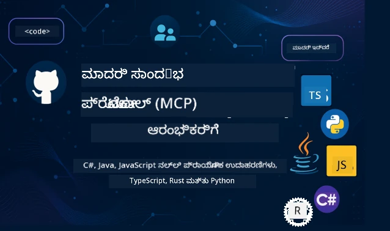

 

[](https://GitHub.com/microsoft/mcp-for-beginners/graphs/contributors)
[](https://GitHub.com/microsoft/mcp-for-beginners/issues)
[](https://GitHub.com/microsoft/mcp-for-beginners/pulls)
[](http://makeapullrequest.com)

[](https://GitHub.com/microsoft/mcp-for-beginners/watchers)
[](https://GitHub.com/microsoft/mcp-for-beginners/fork)
[](https://GitHub.com/microsoft/mcp-for-beginners/stargazers)


[](https://discord.gg/nTYy5BXMWG)

ಈ ಸಂಪನ್ಮೂಲಗಳನ್ನು ಬಳಸುವುದು ಪ್ರಾರಂಭಿಸಲು ಈ ಹಂತಗಳನ್ನು ಅನುಸರಿಸಿ:
1. **ರಿಪೋಸಿಟರಿಯನ್ನು ಫೋರ್ಕ್ ಮಾಡಿ**: ಕ್ಲಿಕ್ ಮಾಡಿ [](https://GitHub.com/microsoft/mcp-for-beginners/fork)
2. **ರಿಪೋಸಿಟರಿಯನ್ನು ಕ್ಲೋನ್ ಮಾಡಿ**:   `git clone https://github.com/microsoft/mcp-for-beginners.git`
3. **ಸೇರಿಕೊಳ್ಳಿ** [](https://discord.gg/nTYy5BXMWG)


### 🌐 ಬಹುಭಾಷಾ ಬೆಂಬಲ

#### GitHub ಆ್ಯಕ್ಷನ್ ಮೂಲಕ ಬೆಂಬಲಿಸಲಾಗಿದೆ (ಸ್ವಯಂಚಾಲಿತ ಮತ್ತು ಸದಾ ನವೀಕೃತ)

<!-- CO-OP TRANSLATOR LANGUAGES TABLE START -->
[Arabic](../ar/README.md) | [Bengali](../bn/README.md) | [Bulgarian](../bg/README.md) | [Burmese (Myanmar)](../my/README.md) | [Chinese (Simplified)](../zh-CN/README.md) | [Chinese (Traditional, Hong Kong)](../zh-HK/README.md) | [Chinese (Traditional, Macau)](../zh-MO/README.md) | [Chinese (Traditional, Taiwan)](../zh-TW/README.md) | [Croatian](../hr/README.md) | [Czech](../cs/README.md) | [Danish](../da/README.md) | [Dutch](../nl/README.md) | [Estonian](../et/README.md) | [Finnish](../fi/README.md) | [French](../fr/README.md) | [German](../de/README.md) | [Greek](../el/README.md) | [Hebrew](../he/README.md) | [Hindi](../hi/README.md) | [Hungarian](../hu/README.md) | [Indonesian](../id/README.md) | [Italian](../it/README.md) | [Japanese](../ja/README.md) | [Kannada](./README.md) | [Korean](../ko/README.md) | [Lithuanian](../lt/README.md) | [Malay](../ms/README.md) | [Malayalam](../ml/README.md) | [Marathi](../mr/README.md) | [Nepali](../ne/README.md) | [Nigerian Pidgin](../pcm/README.md) | [Norwegian](../no/README.md) | [Persian (Farsi)](../fa/README.md) | [Polish](../pl/README.md) | [Portuguese (Brazil)](../pt-BR/README.md) | [Portuguese (Portugal)](../pt-PT/README.md) | [Punjabi (Gurmukhi)](../pa/README.md) | [Romanian](../ro/README.md) | [Russian](../ru/README.md) | [Serbian (Cyrillic)](../sr/README.md) | [Slovak](../sk/README.md) | [Slovenian](../sl/README.md) | [Spanish](../es/README.md) | [Swahili](../sw/README.md) | [Swedish](../sv/README.md) | [Tagalog (Filipino)](../tl/README.md) | [Tamil](../ta/README.md) | [Telugu](../te/README.md) | [Thai](../th/README.md) | [Turkish](../tr/README.md) | [Ukrainian](../uk/README.md) | [Urdu](../ur/README.md) | [Vietnamese](../vi/README.md)

> **ನೀವು ಸ್ಥಳೀಯವಾಗಿ ಕ್ಲೋನ್ ಮಾಡಲು ಇಷ್ಟಪಡುವಿರಾ?**
>
> ಈ ರಿಪೋಸಿಟರಿ 50+ ಭಾಷಾ ಅನುವಾದಗಳನ್ನು ಹೊಂದಿದ್ದು ಡೌನ್ಲೋಡ್ ಗಾತ್ರವನ್ನು ಸಾಕಷ್ಟು ಹೆಚ್ಚಿಸುತ್ತದೆ. ಅನುವಾದಗಳಿಲ್ಲದೇ ಕ್ಲೋನ್ ಮಾಡಲು sparse checkout ಬಳಸಿ:
>
> **Bash / macOS / Linux:**
> ```bash
> git clone --filter=blob:none --sparse https://github.com/microsoft/mcp-for-beginners.git
> cd mcp-for-beginners
> git sparse-checkout set --no-cone '/*' '!translations' '!translated_images'
> ```
>
> **CMD (Windows):**
> ```cmd
> git clone --filter=blob:none --sparse https://github.com/microsoft/mcp-for-beginners.git
> cd mcp-for-beginners
> git sparse-checkout set --no-cone "/*" "!translations" "!translated_images"
> ```
>
> ಈ ಮೂಲಕ ನಿಮಗೆ ಕೋರ್ಸ್ ಪೂರ್ಣಗೊಳಿಸಲು ಬೇಕಾದ ಎಲ್ಲ ವಸ್ತುಗಳೊಂದಿಗೆ ವೇಗವಾದ ಡೌನ್ಲೋಡ್ ಸಿಗುತ್ತದೆ.
<!-- CO-OP TRANSLATOR LANGUAGES TABLE END -->

# 🚀 ಮಾದರಿ ಸಂಧರ್ಭ ಪ್ರೊಟೋಕಾಲ್ (MCP) ಶುರುವಾತಿಗಾಗಿನ ಪಠ್ಯಕ್ರಮ

## **C#, ಜಾವಾ, ಜಾವಾಸ್ಕ್ರಿಪ್ಟ್, ರಸ್ಟ್, ಪೈಥಾನ್ ಮತ್ತು ಟೈಪ್ಸ್ಕ್ರಿಪ್ಟ್‌ನಲ್ಲಿ ಕೈಬಿಟ್ಟಿಕೊಂಡ ಉದಾಹರಣೆಗಳೊಂದಿಗೆ MCP ಕಲಿಯಿರಿ**

## 🧠 ಮಾದರಿ ಸಂಧರ್ಭ ಪ್ರೊಟೋಕಾಲ್ ಪಠ್ಯಕ್ರಮದ ಅವಲೋಕನ
ಮಾದರಿ ಸಂಧರ್ಭ ಪ್ರೊಟೋಕಾಲ್‌ನ ನಿಮ್ಮ ಪ್ರಯಾಣಕ್ಕೆ ಸ್ವಾಗತ! ನೀವು ಎಂದಾದರೂ AI ಅನ್ವಯಗಳು ವಿಭಿನ್ನ ಸಾಧನಗಳು ಮತ್ತು ಸೇವೆಗಳೊಂದಿಗೆ ಹೇಗೆ ಸಂಪರ್ಕ ಸಾಧಿಸುತ್ತವೆ ಎಂದು ಆಶ್ಚರ್ಯಚಕಿತರಾಗಿದ್ದರೆ, ನೀವು ಈಗ ಅಭಿವೃದ್ಧಿಪಡಿಸುವ ಬುದ್ಧಿವಂತ ವ್ಯವಸ್ಥೆಗಳ ನಿರ್ಮಾಣದ ವಿಧಾನವನ್ನು ಹೊಸದಾಗಿ ಕಂಡುಹಿಡಿಯಲಿದ್ದೀರಿ.

MCP ಅನ್ನು AI ಅನ್ವಯಗಳಿಗಾಗಿ ವಿಶ್ವವ್ಯಾಪಿ ಭಾಷಾಂತರಕಾರ ಎಂದು ಪರಿಗಣಿಸಿ — ನೀವು USB ಪೋರ್ಟ್‌ಗಳ ಮೂಲಕ ನಿಮ್ಮ ಕಂಪ್ಯೂಟರ್‌ಗೆ ಯಾವುದೇ ಸಾಧನವನ್ನು ಸಂಪರ್ಕಿಸುವಂತೆ, MCP AI ಮಾದರಿಗಳಿಗೆ ಯಾವುದೇ ಸಾಧನ ಅಥವಾ ಸೇವೆಗಳಿಗೆ ಮಾನಕ ರೀತಿಯಲ್ಲಿ ಸಂಪರ್ಕ ಸಾಧಿಸಲು ಅನುಮತಿಸುತ್ತದೆ. ನೀವು ನಿಮ್ಮ ಮೊದಲ ಚಾಟ್‌ಬಾಟ್ ಅನ್ನು ನಿರ್ಮಿಸುತ್ತಿದ್ದೀರಾ ಅಥವಾ ಸಂಕೀರ್ಣ AI ಕಾರ್ಯಪಥಗಳ üzerinde ಕೆಲಸ ಮಾಡುತ್ತಿದ್ದೀರಾ, MCP ನ ಅರಿವು ನಿಮ್ಮ ಅಪ್ಲಿಕೇಶನ್‌ಗಳನ್ನು ಹೆಚ್ಚು ಶಕ್ತಿಶಾಲಿ ಮತ್ತು ಅನುಕೂಲಕರವಾಗಿ ಸೃಜಿಸುವ ಶಕ್ತಿಯನ್ನು ನೀಡುತ್ತದೆ.

ಈ ಪಠ್ಯಕ್ರಮವು ನಿಮ್ಮ ಕಲಿಕಾ ಪ್ರಯಾಣಕ್ಕಾಗಿ ಉತ್ತಮ ಸಹಾನುಭೂತಿಯೊಂದಿಗೆ ವಿನ್ಯಾಸಗೊಳಿಸಲಾಗಿದೆ. ನಾವು ನೀವು ಈಗಾಗಲೇ ಅರ್ಥಮಾಡಿಕೊಂಡಿರುವ ಸರಳ ಕಲ್ಪನೆಗಳಿಂದ ಪ್ರಾರಂಭಿಸಿ, ನಿಮ್ಮ ಮೆಚ್ಚಿನ ಪ್ರೋಗ್ರಾಮಿಂಗ್ ಭಾಷೆಯಲ್ಲಿ ಕೈಬಿಟ್ಟಿಕೆಯ ಮೂಲಕ ನಿಮ್ಮ ಪರಿಣತಿಯನ್ನು ಕ್ರಮವಾಗಿ ನಿರ್ಮಿಸುವೆವು. ಪ್ರತಿಯೊಂದು ಹಂತವೂ ಸ್ಪಷ್ಟ ವಿವರಣೆಗಳು, ಪ್ರಾಯೋಗಿಕ ಉದಾಹರಣೆಗಳು ಮತ್ತು ಸಾಕಷ್ಟು ಪ್ರೋತ್ಸಾಹವನ್ನು ಒಳಗೊಂಡಿದೆ.

ನೀವು ಈ ಪ್ರಯಾಣವನ್ನು ಪೂರ್ಣಗೊಳಿಸಿದಾಗ, ನೀವು ನಿಮ್ಮ ಸ್ವಂತ MCP ಸರ್ವರ್‌ಗಳನ್ನು ನಿರ್ಮಿಸಲು, ಜನಪ್ರಿಯ AI ವೇದಿಕೆಗಳೊಂದಿಗೆ ಸಂಯೋಜಿಸಲು ಮತ್ತು ಈ ತಂತ್ರಜ್ಞಾನವು AI ಅಭಿವೃದ್ಧಿಯ ಭವಿಷ್ಯವನ್ನು ಹೇಗೆ ಪುನರ್ಬರಳಿಸುತ್ತಿದೆ ಎಂಬುದನ್ನು ಬೋಧನೆ ಮಾಡಲು আত্মವಿಶ್ವಾಸ ಹೊಂದಿರುತ್ತೀರಿ. ಬನ್ನಿ, ಈ ಉತ್ಸಾಹಭರಿತ ಸಾಹಸವನ್ನು ಹಂಚಿಕೊಳ್ಳೋಣ!

### ಅಧಿಕೃತ ಡಾಕ್ಯುಮೆಂಟೇಶನ್ ಮತ್ತು ವಿಶೇಷಣಗಳು

ಈ ಪಠ್ಯಕ್ರಮವು **MCP Specification 2025-11-25** (ಇತ್ತೀಚಿನ ಸ್ಥಿರ ಬಿಡುಗಡೆ) ನೊಂದಿಗೆ ಅಳಕ್ಕಿದ್ದು, MCP ವಿಶೇಷಣ ದಿನಾಂಕ ಆಧಾರಿತ ಆವೃತ್ತೀಕರಣ (YYYY-MM-DD ಸ್ವರೂಪ) ಬಳಸಿ ಸ್ಪಷ್ಟ ಪ್ರೋಟೋಕಾಲ್ ಆವೃತ್ತಿ ಟ್ರ್ಯಾಕಿಂಗ್ ಅನ್ನು ಖಾತ್ರಿ ಪಡಿಸುತ್ತದೆ.

ಈ ಸಂಪನ್ಮೂಲಗಳು ನಿಮ್ಮ ತಿಳಿವಳಿಕೆಯಲ್ಲಿ ಹೆಚ್ಚಾಗುತ್ತಾ ಹೆಚ್ಚು ಮೌಲ್ಯಯುತವಾಗುತ್ತವೆ, ಆದರೆ ಎಲ್ಲಾುದನ್ನೂ ತಕ್ಷಣ ಓದಲು ಒತ್ತಡವನ್ನು ಅನುಭವಿಸಬೇಡಿ. ನಿಮ್ಮ ಆಸಕ್ತಿಯ ಪ್ರದೇಶಗಳಿಂದ ಆರಂಭಿಸಿ!
- 📘 [MCP ಡಾಕ್ಯುಮೆಂಟೇಶನ್](https://modelcontextprotocol.io/) – ಇದು ನಿಮಗೆ ಹಂತ ಹಂತವಾಗಿ ಟ್ಯುಟೋರಿಯಲ್ಗಳು ಮತ್ತು ಬಳಕೆದಾರ ಮಾರ್ಗदರ್ಶಕರಿಗಾಗಿ ಹೋಗಿಸುವ ಮೂಲಸಂಪತ್ತು. ಡಾಕ್ಯುಮೆಂಟೇಶನ್ ಶುರುವರಿಗಾಗಿಯೇ ಬರೆದಿದ್ದು, ಸ್ಪಷ್ಟ ಉದಾಹರಣೆಗಳೊಂದಿಗೆ ನಿಮಗೆ ತಮಗೆ ಅನುಗುಣವಾಗಿ ಅನುಸರಿಸಲು ಸಾದ್ಯವಾಗುವಂತೆ ಮಾಡುತ್ತದೆ.
- 📜 [MCP ವಿಶೇಷಣ](https://modelcontextprotocol.io/specification/2025-11-25) – ಇದನ್ನು ನಿಮ್ಮ ಸಂಪೂರ್ಣ ಸೂಚಕ ಕೈಪಿಡಿ ಎಂದು ಪರಿಗಣಿಸಿ. ಪಠ್ಯಕ್ರಮವನ್ನು ಮುಗಿಸುವ ವೇಳೆ, ನೀವು ಇಲ್ಲಿ ವಿಶೇಷ ವಿವರಗಳನ್ನು ಪರಿಶೀಲಿಸಲು ಮತ್ತು ಪ್ರगत ವೈಶಿಷ್ಟ್ಯಗಳನ್ನು ಅನ್ವೇಷಿಸಲು ಮರಳುವಿರಿ.
- 📜 [MCP ವಿಶೇಷಣ ಆವೃತ್ತೀಕರಣ](https://modelcontextprotocol.io/specification/versioning) – ಇದರಲ್ಲಿದೆ ಪ್ರೋಟೋಕಾಲ್ ಆವೃತ್ತಿ ಇತಿಹಾಸ ಮತ್ತು MCP ದಿನಾಂಕ ಆಧಾರಿತ ಆವೃತ್ತೀಕರಣ (YYYY-MM-DD ಸ್ವರೂಪ) ಹೇಗೆ ಬಳಸುತ್ತದೆ ಎಂಬ ಮಾಹಿತಿಗಳು.
- 🧑‍💻 [MCP GitHub ರಿಪೋಸಿಟರಿ](https://github.com/modelcontextprotocol) – ಇಲ್ಲಿ ನೀವು ಅನೇಕ ಪ್ರೋಗ್ರಾಮಿಂಗ್ ಭಾಷೆಗಳಲ್ಲಿ SDKಗಳು, ಸಾಧನಗಳು ಮತ್ತು ಕೋಡ್ ಉದಾಹರಣೆಗಳನ್ನು ಕಾಣಬಹುದು. ಇದು ಪ್ರಾಯೋಗಿಕ ಉದಾಹರಣೆಗಳ ಮತ್ತು ಬಳಕೆಗೆ ತಯಾರಾಗಿರುವ ಘಟಕಗಳ ರತ್ನಸಾಗರೋ示.
- 🌐 [MCP ಸಮುದಾಯ](https://github.com/orgs/modelcontextprotocol/discussions) – MCP ಬಗ್ಗೆ fellow ಕಲಿಕಾದಾರರು ಮತ್ತು ಅನುಭವಿ ಡೆವಲಪರ್‌ಗಳೊಂದಿಗೆ ಚರ್ಚೆಗಳಲ್ಲಿ ಸೇರಿಕೊಳ್ಳಿ. ಇದು ಪ್ರಶ್ನೆಗಳಿಗಾಗಿಯೂ ಜ್ಞಾನ ಹಂಚಿಕೊಳ್ಳುವ ಸಹಾಯಕ ಸಮುದಾಯವಾಗಿದೆ.
  
## ಕಲಿಕೆಯ ಗುರಿಗಳು

ಈ ಪಠ್ಯಕ್ರಮದ ಕೊನೆಯಲ್ಲಿ, ನೀವು ನಿಮ್ಮ ಹೊಸ ಸಾಮರ್ಥ್ಯಗಳ ಬಗ್ಗೆ ಆತ್ಮವಿಶ್ವಾಸ ಮತ್ತು ಉತ್ಸಾಹವನ್ನು ಹೊಂದಿರುತ್ತೀರಿ. ನೀವು ಸಾಧಿಸುವವುಗಳು:

• **MCP ಮೂಲಭೂತಗಳನ್ನು ಅರ್ಥಮಾಡಿಕೊಳ್ಳಿ**: ಮಾದರಿ ಸಂಧರ್ಭ ಪ್ರೊಟೋಕಾಲ್ ಎಂದರೇನು ಮತ್ತು ಇದು AI ಅನ್ವಯಗಳ ಸಹಕಾರವನ್ನು ಹೇಗೆ ಕ್ರಾಂತಿಕರವಾಗಿ ಬದಲಾಯಿಸುತ್ತಿದೆ ಎಂಬುದನ್ನು ಉದಾಹರಣೆಗಳ ಮತ್ತು ಉಪಮೆಗಳ ಮೂಲಕ ಉತ್ತಮವಾಗಿ ಅರ್ಥಮಾಡಿಕೊಳ್ಳುತ್ತೀರಿ.

• **ನಿಮ್ಮ ಮೊದಲ MCP ಸರ್ವರ್ ಅನ್ನು ನಿರ್ಮಿಸಿ**: ನಿಮ್ಮ ಮೆಚ್ಚಿನ ಪ್ರೋಗ್ರಾಮಿಂಗ್ ಭಾಷೆಯಲ್ಲಿ ಕೆಲಸ ಮಾಡುವ MCP ಸರ್ವರ್ ಅನ್ನು ಸರಳ ಉದಾಹರಣೆಗಳಿಂದ ಪ್ರಾರಂಭಿಸಿ ಹಂತ ಹಂತವಾಗಿ ನಿಮ್ಮ ಕೌಶಲ್ಯವನ್ನು ಹೆಚ್ಚಿಸುತ್ತೀರಿ.

• **AI ಮಾದರಿಗಳನ್ನು ನಿಜವಾದ ಸಾಧನಗಳಿಗೆ ಸಂಪರ್ಕಿಸಿ**: AI ಮಾದರಿಗಳು ಮತ್ತು ನೈಜ ಸೇವೆಗಳ ನಡುವೆ ಸೇತುವೆ ನಿರ್ಮಿಸುವುದನ್ನು ಕಲಿತು, ನಿಮ್ಮ ಅಪ್ಲಿಕೇಶನ್‌ಗಳಿಗೆ ಹೊಸ ಶಕ್ತಿಗಳನ್ನು ನೀಡುತ್ತೀರಿ.

• **ಭದ್ರತಾ ಉತ್ತಮ ಕ್ರಮಗಳನ್ನು ಅನುಷ್ಠಾನ ಮಾಡಿ**: ನಿಮ್ಮ MCP ಅನುಷ್ಠಾನಗಳನ್ನು ಸುರಕ್ಷಿತವಾಗಿಡಲು ಹೇಗೆ ಮಾಡಬೇಕು ಎಂಬುದನ್ನು ತಿಳಿದು, ನಿಮ್ಮ ಅಪ್ಲಿಕೇಶನ್‌ಗಳು ಮತ್ತು ಬಳಕೆದಾರರನ್ನೂ ರಕ್ಷಿಸುತ್ತೀರಿ.

• **ಆತ್ಮವಿಶ್ವಾಸದಿಂದ ನಿಯೋಜಿಸಿ**: ಅಭಿವೃದ್ಧಿಯಿಂದ ಉತ್ಪಾದನೆಗೆ ನಿಮ್ಮ MCP ಪ್ರಾಜೆಕ್ಟ್‌ಗಳನ್ನು ಹೇಗೆ ತೆಗೆದುಕೊಳ್ಳುವುದು ಎಂಬ ಪ್ರಾಯೋಗಿಕ ನಿಯೋಜನೆ ತಂತ್ರಗಳನ್ನು ಗಂಭೀರವಾಗಿ ತಿಳಿದಿರುತ್ತೀರಿ.

• **MCP ಸಮುದಾಯದಲ್ಲಿ ಸೇರಿಕೊಳ್ಳಿ**: AI ಅಪ್ಲಿಕೇಶನ್ ಅಭಿವೃದ್ಧಿಯ ಭವಿಷ್ಯವನ್ನು ರೂಪಿಸುತ್ತಿರುವ ಬೆಳೆಯುತ್ತಿರುವ ಡೆವಲಪರ್ ಸಮುದಾಯದ ಭಾಗವಾಗಿ ಪರಿಣಮಿಸುತ್ತೀರಿ.

## ಅಗತ್ಯ ಹಿನ್ನೆಲೆ

MCP ವಿಶೇಷಾಂಶಗಳಿಗೆ ಮುನ್ನಡೆಸುವ ಮೊದಲು, ಕೆಲ ಮೂಲಭೂತ ತತ್ವಗಳು ನಿಮಗೆ ಆರಾಮದಾಯಕವಾಗಿರಲಿ ಎಂದು ನಾವು ಗಮನಿಸುವೆವು. ನಿಮ್ಮಲ್ಲಿ ಈ ಕ್ಷೇತ್ರಗಳಲ್ಲಿ ಪರಿಣತಿ ಇಲ್ಲದಿದ್ದರೂ ಚಿಂತೆ ಇಲ್ಲ – ನಾವು ಹೋಗುವಂತೆ ನೀವು ತಿಳಿಯಬೇಕಾದ ಎಲ್ಲವನ್ನೂ ವಿವರಿಸುತ್ತೇವೆ!

### ಪ್ರೋಟೋಕಾಲ್‌ಗಳನ್ನು ಅರ್ಥಮಾಡಿಕೊಳ್ಳುವುದು (ಮೂಲಭೂತ ಆಧಾರ)

ಮೂಲಭೂತವಾಗಿ ಪ್ರೋಟೋಕಾಲ್ ಅನ್ನು ಸಂಭಾಷಣೆಯ ನಿಯಮಗಳಂತೆ ಊಹಿಸಿ. ನೀವು ಸ್ನೇಹಿತನಿಗೆ ಕಾಲ್ ಮಾಡಿದಾಗ, ಉತ್ತರಿಸುವಾಗ "ಹೆಲೋ" ಎಂದು ಹೇಳುವುದನ್ನು ಇಬ್ಬರ ಮೇಲೂ ತಿಳಿದಿರುತ್ತದೆ, ಮಾತನಾಡಲು ಮರಳಿ ಬದಲಾನೆಯಾಗುತ್ತದೆ ಮತ್ತು ಮುಗಿದಾಗ "ಬಹುಗ್ಗೆ" ಅಂತ ಹೇಳುತ್ತಾರೆ. ಕಂಪ್ಯೂಟರ್ ಪ್ರೋಗ್ರಾಮ್ಗಳಿಗೂ ಸಮಾನ ನಿಯಮಗಳು ಬೇಕಾಗಿವೆ ಸಮರ್ಥವಾಗಿ ಸಂಪರ್ಕ ಸಾಧಿಸಲು.

MCP ಒಂದು ಪ್ರೋಟೋಕಾಲ್ - ಇದು AI ಮಾದರಿಗಳು ಮತ್ತು ಅಪ್ಲಿಕೇಶನ್‌ಗಳು ಸಾಧನಗಳು ಮತ್ತು ಸೇವೆಗಳೊಂದಿಗೆ ಪದರಶೀಲ "ಸಂಭಾಷಣೆ" ನಡೆಸುವ ಸಹಾಯಕ ನಿಯಮಗಳ ಸಂಕಲನ. ಮಾನವ ಸಂವಹನ ಸುಗಮವಾಗಲು ಸಂಭಾಷಣೆ ನಿಯಮಗಳು ಅಗತ್ಯವಿರುವಂತೆ, MCP ಇದ್ದಾಗ AI ಅಪ್ಲಿಕೇಶನ್ ಸಂವಹನ ಹೆಚ್ಚಿನ ನಂಬಿಕೆ ಮತ್ತು ಶಕ್ತಿ ಹೊಂದಿರುತ್ತದೆ.

### ಕ್ಲೈಂಟ್-ಸರ್ವರ್ ಸಂಬಂಧಗಳು (ಪ್ರೋಗ್ರಾಮ್ಗಳು ಹೇಗೆ ಕಾರ್ಯನಿರ್ವಹಿಸುತ್ತವೆ)

ನೀವು ಪ್ರತಿದಿನವೂ ಕ್ಲೈಂಟ್-ಸರ್ವರ್ ಸಂಬಂಧಗಳನ್ನು ಬಳಕೆ ಮಾಡುತ್ತೀರಾ! ನೀವು ವೆಬ್ ಬ್ರೌಸರ್ (ಕ್ಲೈಂಟ್) ಬಳಸಿಕೊಂಡು ಒಂದು ವೆಬ್‌ಸೈಟ್‌ಗೆ ಭೇಟಿ ನೀಡುವಾಗ, ಆ ಪುಟದ ವಿಷಯವನ್ನು ಕಳುಹಿಸುವ ವೆಬ್ ಸರ್ವರ್‌ಗೆ ನೀವು ಸಂಪರ್ಕ ಹೊಂದುತ್ತೀರಿ. ಬ್ರೌಸರ್ ಮಾಹಿತಿಗೆ ಹೇಗೆ ಕೇಳಬೇಕು ಗೊತ್ತಿದೆ, ಸರ್ವರ್ ಪ್ರತಿಕ್ರಿಯೆ ನೀಡುವುದು ತಿಳಿದೆ.

MCP ನಲ್ಲಿ, AI ಮಾದರಿಗಳು ಮಾಹಿತಿ ಅಥವಾ ಕ್ರಿಯೆಗಳಿಗಾಗಿ ಕೇಳುವ ಕ್ಲೈಂಟ್‌ಗಳಂತೆ ಕೆಲಸ ಮಾಡುತ್ತವೆ, MCP ಸರ್ವರ್‌ಗಳು ಆ ಶಕ್ತಿಗಳನ್ನು ಪೂರೈಸುತ್ತವೆ. ಇದು ಸರಳ ಸಹಾಯಕನಂತೆ (ಸರ್ವರ್) ಇದರಿಂದ AI ನಿಂದ ನಿರ್ದಿಷ್ಟ ಕೆಲಸಗಳು ಮಾಡಲು ಕೇಳಬಹುದು.

### ಮಾನಕೀಕರಣದ ಮಹತ್ವ (ವಸ್ತುಗಳು ಜೊತೆಗೆ ಕಾರ್ಯನಿರ್ವಹಿಸುವಂತೆ ಮಾಡುವುದು)

ಪ್ರತಿದೊಂದು ಕಾರು ತಯಾರಕರು ಬೇರೆಯ ಬಗೆಯ ಅನಿಲ ಪಂಪುಗಳನ್ನೂ ಬಳಸದಿದ್ದರೆ ಹೇಗಿರುತ್ತಿತ್ತೆಂದು ಭಾವಿಸಿ — ಪ್ರತಿಯೊಂದು ಕಾರಿಗೆ ಬೇರೆಯಾದ ಅಡಾಪ್ಟರ್ ಬೇಕಾಗುತ್ತದೆ! ಮಾನಕೀಕರಣ ಎಂದರೆ ಸಾಮಾನ್ಯ ವಿಧಾನಗಳನ್ನು ಒಪ್ಪಿಕೊಂಡು ವಸ್ತುಗಳು ಜೋಡಿಸಿಕೊಳ್ಳಲು ಸುಗಮವಾಗುವಂತೆ ಮಾಡುವುದು.

MCP AI ಅನ್ವಯಗಳಿಗೆ ಈ ಮಾನಕೀಕರಣವನ್ನು ಒದಗಿಸುತ್ತದೆ. ಪ್ರತಿಯೊಂದು AI ಮಾದರಿ ಪ್ರತಿಯೊಂದು ಸಾಧನದೊಂದಿಗೆ ಕೆಲಸ ಮಾಡಲು ವಿಶೇಷ ಕೋಡ್ ಬರೆಯಬೇಕಾಗಿಲ್ಲ; MCP ಒಂದು ಸಾಮಾನ್ಯ ಸಂವಹನ ಮಾರ್ಗವನ್ನು ರಚಿಸುತ್ತದೆ. ಇದರಿಂದ ಡೆವಲಪರ್‌ಗಳು ಸಾಧನಗಳನ್ನು ಒಂದೇ ಬಾರಿ ನಿರ್ಮಿಸಿ ಅನೇಕ ವೈವಿಧ್ಯಮಯ AI ವ್ಯವಸ್ಥೆಗಳಿಗೆ పనಿಪಡುವಂತೆ ಮಾಡಬಹುದು.

## 🧭 ನಿಮ್ಮ ಕಲಿಕಾ ಮಾರ್ಗದ ಅವಲೋಕನ

ನಿಮ್ಮ MCP ಪ್ರಯಾಣವು ಕ್ರಮೇಣ ನಿಮ್ಮ ಆತ್ಮವಿಶ್ವಾಸ ಮತ್ತು ಕೌಶಲ್ಯಗಳನ್ನು ನಿರ್ಮಿಸಲು ಜಾಗರೂಕತಾಪೂರ್ವಕವಾಗಿ ರಚಿಸಲಾಗಿದೆ. ಪ್ರತಿ ಹಂತವು ಹೊಸ ಕಲ್ಪನೆಗಳನ್ನು ಪರಿಚಯಿಸುವ ಜೊತೆಗೆ ನೀವು ಈಗಾಗಲೇ ಕಲಿತದ್ದನ್ನು ಬಲಪಡಿಸುತ್ತದೆ.

### 🌱 ಮೂಲಭೂತ ಹಂತ: ಮೂಲತತ್ವಗಳನ್ನು ಅರ್ಥಮಾಡಿಕೊಳ್ಳುವುದು (ಮಾಡ್ಯೂಲ್ 0-2)

ನಿಮ್ಮ ಸಾಹಸ ಇಲ್ಲಿ ಪ್ರಾರಂಭವಾಗುತ್ತದೆ! ನಾವು MCP ತತ್ವಗಳನ್ನು ಪರಿಚಿತ ಉಪಮೆಗಳು ಮತ್ತು ಸರಳ ಉದಾಹರಣೆಗಳೊಂದಿಗೆ ಪರಿಚಯಿಸುವೆವು. MCP ಎಂದರೇನು, ಅದು ಏಕೆ ಅಗತ್ಯ ಮತ್ತು ಅದು AI ಅಭಿವೃದ್ಧಿಯದೇ ಬೃಹದ್ ಲೋಕದಲ್ಲಿ ಹೇಗೆ ಜೋಡಿಕೊಳ್ಳುತ್ತದೆ ಎಂಬುದನ್ನು ನೀವು ಅರ್ಥಮಾಡಿಕೊಳ್ಳುತ್ತೀರಿ.

• **ಮಾಡ್ಯೂಲ್ 0 - MCP ಪರಿಚಯ**: MCP ಎಂದರೇನು ಮತ್ತು ಅದು ಆಧುನಿಕ AI ಅಪ್ಲಿಕೇಶನ್‌ಗಳಿಗೆ ಎಷ್ಟು ಮಹತ್ವವಿದೆ ಎಂದು ಅನ್ವೇಷಿಸುವುದು. MCP ನ ನಿಜಜೀವಿತ ಉದಾಹರಣೆಗಳನ್ನು ನೋಡಿ, ಡೆವಲಪರ್‌ಗಳು ಎದುರಿಸುವ ಸಾಮಾನ್ಯ ಸಮಸ್ಯೆಗಳನ್ನು MCP ಹೇಗೆ ಪರಿಹರಿಸುತ್ತದೆ ಎಂಬುದನ್ನು ಅರ್ಥಮಾಡಿಕೊಳ್ಳುವುದು.

• **ಮಾಡ್ಯೂಲ್ 1 - ಪ್ರಮುಖ ತತ್ತ್ವಗಳ ವಿವರಣೆ**: ಇಲ್ಲಿಯು MCP ನ ಅಗತ್ಯಿತ ಕಟ್ಟಡ ಬ್ಲಾಕ್‌ಗಳನ್ನು ಕಲಿಯುವಿರಿ. ನಾವು ಬಹಳ ಉಪಮೆಗಳು ಮತ್ತು ದೃಶ್ಯ ಉದಾಹರಣೆಗಳನ್ನು ಬಳಸುತ್ತೇವೆ ಇದು ತತ್ವಗಳನ್ನು ಸಹಜ ಮತ್ತು ಅರ್ಥಮಾಡಿಕೊಳ್ಳಬಹುದಾದಂತೆ ಮಾಡುತ್ತದೆ.

• **ಮಾಡ್ಯೂಲ್ 2 - MCP ನಲ್ಲಿ ಭದ್ರತೆ**: ಭದ್ರತೆ ಭಯಂಕರವೆನ್ನಿಸಬಹುದು, ಆದರೆ MCP ಒಳಗೆ ಕಟ್ಟಿರುವ ಭದ್ರತಾ ಲಕ್ಷಣಗಳನ್ನು ತಿಳಿಸುವೆವು ಮತ್ತು ಆರಂಭದಿಂದಲೇ ನಿಮ್ಮ ಅಪ್ಲಿಕೇಶನ್ಗಳನ್ನು ರಕ್ಷಿಸುವ ಉತ್ತಮ ವಿಧಾನಗಳನ್ನು ಕಲಿಸುವೆವು.

### 🔨 ನಿರ್ಮಾಣ ಹಂತ: ನಿಮ್ಮ ಮೊದಲ ಅನುಷ್ಠಾನಗಳನ್ನು ಸೃಷ್ಟಿಸುವುದು (ಮಾಡ್ಯೂಲ್ 3)

ಈಗ ನಿಜವಾದ ಮಜಾ ಪ್ರಾರಂಭವಾಗಿoದಿದೆ! ನೀವು ಕೈಬಿಟ್ಟಿಕೊಂಡ MCP ಸರ್ವರ್‌ಗಳು ಮತ್ತು ಕ್ಲೈಂಟ್‌ಗಳನ್ನು ನಿರ್ಮಿಸುವ ಅನುಭವ ಪಡೆಯುತ್ತೀರಿ. ಚಿಂತೆ ಬೇಡ - ನಾವು ಸರಳದಿಂದ ಪ್ರಾರಂಭಿಸಿ ಪ್ರತೀ ಹಂತದಲ್ಲಿ ದಿಕ್ಕು ತೋರಿಸುತ್ತೇವೆ.
ಈ ಮಾಯ್ದ್ಯೂಲ್‌ಗಳಲ್ಲಿ ನಿಮ್ಮ ಇಚ್ಛಿತ ಪ್ರೋಗ್ರಾಮಿಂಗ್ ಭಾಷೆಯಲ್ಲಿ ಅಭ್ಯಾಸ ಮಾಡಲು ಹಲವಾರು ಹ್ಯಾಂಡ್ಸ್-ಆನ್ ಗೈಡ್ಗಳು ಸೇರಿವೆ. ನೀವು ನಿಮ್ಮ ಮೊದಲ ಸರ್ವರ್ ಅನ್ನು ರಚಿಸುತ್ತೀರಿ, ಅದಕ್ಕೆ ಸಂಪರ್ಕ ಹೊಂದುತ್ತುವ ಕ್ಲೈಯಂಟ್ ಅನ್ನು ನಿರ್ಮಿಸುತ್ತೀರಿ ಮತ್ತು VS ಕೋಡ್ ಹೀಗೆ ಜನಪ್ರಿಯ ಅಭಿವೃದ್ಧಿ ಉಪಕರಣಗಳೊಂದಿಗೆ ಇಂಟಿಗ್ರೇಟ್ ಮಾಡುತ್ತೀರಿ.

ಪ್ರತಿ ಗೈಡ್ ಸಂಪೂರ್ಣ ಕೋಡ್ ಉದಾಹರಣೆಗಳು, ಸಮಸ್ಯೆ ಪರಿಹಾರ ಸಲಹೆಗಳು ಮತ್ತು ನಾವು ವಿಶೇಷ ವಿನ್ಯಾಸ ಆಲೋಚನೆಗಳನ್ನು ಏಕೆ ಮಾಡುತ್ತೇವೆ ಎಂಬುದರ ವಿವರಣೆಗಳನ್ನು ಒಳಗೊಂಡಿದೆ. ಈ ಹಂತದ ಅಂತ್ಯಕ್ಕೆ, ನಿಮಗೆ ಹೆಮ್ಮೆಪಡುವಂತೆ ಕಾರ್ಯನಿರ್ವಹಿಸುವ MCP ಅನುಷ್ಠಾನಗಳು ಇರಲಿವೆ!

### 🚀 ಬೆಳವಣಿಗೆಯ ಹಂತ: ಆ್ಯಡ್ವಾನ್ಸ್ಡ್ ಸಂಕುಲಗಳು ಮತ್ತು ವಾಸ್ತವಿಕ ಅನ್ವಯ (ಮಾಡ್ಯೂಲ್‌ಗಳು 4-5)

ಬೆಸಿಕ್ಸ್‌ನಲ್ಲಿ ಪರಿಣಿತರಾಗಿರುವ ನಂತರ, ನೀವು ಇನ್ನಷ್ಟು sophisticated MCP ವೈಶಿಷ್ಟ್ಯಗಳನ್ನು ಅನ್ವೇಷಿಸಲು ಸಿದ್ದರಾಗಿರುತ್ತೀರಿ. ನಾವು ಕಾರ್ಯತತ್ಪರ ಅನುಷ್ಠಾನ ನಿಯೋಜನೆಗಳು, ಡೀಬಗ್ಗಿಂಗ್ ತಂತ್ರಗಳು ಮತ್ತು ಬಹು-ಮೋಡಲ್ AI ಏಕೀಕರಣದಂತಹ ಆಧುನಿಕ ವಿಷಯಗಳನ್ನು ಆವರಿಸೋಣ.

ನೀವು MCP ಅನುಷ್ಠಾನಗಳನ್ನು ಉತ್ಪಾದನೆ ಬಳಕೆಗಾಗಿ ಹೇಗೆ ವಿಸ್ತರಿಸಬೇಕು ಮತ್ತು ಅಜ್ಯೂರ್ ಹೀಗೆ ಕ್ಲೌಡ್ ವೇದಿಕೆಗಳೊಂದಿಗೆ ಹೇಗೆ ಇಂಟಿಗ್ರೇಟ್ ಮಾಡಬೇಕು ಎಂಬುದನ್ನು ತಿಳಿಯುತ್ತೀರಿ. ಈ ಮಾಡ್ಯೂಲ್‌ಗಳು ನಿಜ ಜೀವನದ ಬೇಡಿಕೆಗಳನ್ನು ತೊಳೆಯಲಾದ MCP ಪರಿಹಾರಗಳನ್ನು ರಚಿಸಲು ನಿಮಗೆ ಸಿದ್ಧತೆ ನೀಡುತ್ತವೆ.

### 🌟 ಪರಿಣತಿ ಹಂತ: ಸಮುದಾಯ ಮತ್ತು ವಿಶೇಷೀಕರಣ (ಮಾಡ್ಯೂಲ್‌ಗಳು 6-11)

ಕೊನೆಯ ಹಂತವು MCP ಸಮುದಾಯಕ್ಕೆ ಸೇರಿಕೊಳ್ಳುವುದರನ್ನೂ ಮತ್ತು ನೀವು ಹೆಚ್ಚು ಆಸಕ್ತಿ ಹೊಂದಿರುವ ಕ್ಷೇತ್ರಗಳಲ್ಲಿ ಪರಿಣತಿಯನ್ನು ಗಳಿಸುವುದರನ್ನೂ ಗಮನ ಹರಿಸುತ್ತದೆ. ನೀವು ಓಪನ್ ಸೋರ್ಸ್ MCP ಪ್ರಾಜೆಕ್ಟ್ಗಳಿಗೆ 어떻게 ಕೊಡುಗೆ ನೀಡುವುದು, ಉನ್ನತ ಪ್ರಮಾಣೀಕರಣ ಮಾದರಿಗಳನ್ನು ಅನುಷ್ಠಾನಗೊಳಿಸುವುದು, ಹಾಗೂ ಸಮಗ್ರ ಡೇಟಾಬೇಸ್ ಇಂಟಿಗ್ರೇಟಡ್ ಪರಿಹಾರಗಳನ್ನು ನಿರ್ಮಿಸುವುದು ಕಲಿಯುತ್ತೀರಿ.

ಮಾಡ್ಯೂಲ್ 11 ವಿಶೇಷವಾಗಿ ಪ್ರಸ್ತಾಪಿಸುವ ಅಗತ್ಯವಿದೆ - ಇದು PostgreSQL ಇಂಟಿಗ್ರೇಶನ್ ಸಹಿತ ಉತ್ಪಾದನಾರ್ಹ MCP ಸರ್ವರ್‌ಗಳನ್ನು ನಿರ್ಮಿಸಲು 13 ಲ್ಯಾಬ್‌ಗಳೊಳಗಿನ ಸಂಪೂರ್ಣ ಹ್ಯಾಂಡ್ಸ್-ಆನ್ ಅಧ್ಯಯನ ಮಾರ್ಗವಿದೆ. ಇದು ನೀವು ಕಲಿತ ಎಲ್ಲವನ್ನೂ ಒಟ್ಟುಗೂಡಿಸುವ ಒಂದು ಕ್ಯಾಪ್‌ಸ್ಟೋನ್ ಪ್ರಾಜೆಕ್ಟ್ ಹೀಗೆಯೇ!

### 📚 ಸಂಪೂರ್ಣ ಪಠ್ಯಕ್ರಮ ರಚನೆ

| ಮಾಡ್ಯೂಲ್ | ವಿಷಯ | ವಿವರಣೆ | ಲಿಂಕ್ |
|--------|-------|-------------|------|
| **ಮಾಡ್ಯೂಲ್ 0-3: ಮೂಲಭೂತಗಳು** | | | |
| 00 | MCP ಪರಿಚಯ | ಮಾದರಿ ಸಂಧರ್ಭ ಪ್ರೋಟೋಕಾಲ್ ಮತ್ತು AI ಪೈಪ್‌ಲೈನ್‌ಗಳಲ್ಲಿ ಅದರ ಮಹತ್ವದ ಅವಲೋಕನ | [ಹೆಚ್ಚು ಓದಿ](./00-Introduction/README.md) |
| 01 | ಕೋರ್ ಸಂಕುಲಗಳ ವಿವರಣೆ | ಕೋರ್ MCP ಸಂಕುಲಗಳ ಆಳವಾದ ಪರಿಶೀಲನೆ | [ಹೆಚ್ಚು ಓದಿ](./01-CoreConcepts/README.md) |
| 02 | MCPನಲ್ಲಿ ಸುರಕ್ಷತೆ | ಸುರಕ್ಷತಾ ಅಪಾಯಗಳು ಮತ್ತು ಉತ್ತಮ ಅಭ್ಯಾಸಗಳು | [ಹೆಚ್ಚು ಓದಿ](./02-Security/README.md) |
| 03 | MCP ಪ್ರಾರಂಭಿಸುವುದು | ಪರಿಸರ ಸೆಟಪ್, ಮೂಲಭೂತ ಸರ್ವರ್‌ಗಳು/ಕ್ಲೈಯಂಟ್‌ಗಳು, ಇಂಟಿಗ್ರೇಶನ್ | [ಹೆಚ್ಚು ಓದಿ](./03-GettingStarted/README.md) |
| **ಮಾಡ್ಯೂಲ್ 3: ನಿಮ್ಮ ಮೊದಲ ಸರ್ವರ್ ಮತ್ತು ಕ್ಲೈಯಂಟ್ ನಿರ್ಮಾಣ** | | | |
| 3.1 | ಮೊದಲ ಸರ್ವರ್ | ನಿಮ್ಮ ಮೊದಲ MCP ಸರ್ವರ್ ರಚನೆ | [ಗೈಡ್](./03-GettingStarted/01-first-server/README.md) |
| 3.2 | ಮೊದಲ ಕ್ಲೈಯಂಟ್ | ಮೂಲ MCP ಕ್ಲೈಯಂಟ್ ಅಭಿವೃದ್ಧಿ | [ಗೈಡ್](./03-GettingStarted/02-client/README.md) |
| 3.3 | LLM ಸಹಿತ ಕ್ಲೈಯಂಟ್ | ದೊಡ್ಡ ಭಾಷಾ ಮಾದರಿಗಳ ಏಕೀಕರಣ | [ಗೈಡ್](./03-GettingStarted/03-llm-client/README.md) |
| 3.4 | VS ಕೋಡ್ ಇಂಟಿಗ್ರೇಶನ್ | VS ಕೋಡ್ನಲ್ಲಿ MCP ಸರ್ವರ್‌ಗಳನ್ನು ಬಳಸುವುದು | [ಗೈಡ್](./03-GettingStarted/04-vscode/README.md) |
| 3.5 | stdio ಸರ್ವರ್ | stdio ಸಾರಿಗೆ ಬಳಸಿ ಸರ್ವರ್‌ಗಳನ್ನು ರಚಿಸುವುದು | [ಗೈಡ್](./03-GettingStarted/05-stdio-server/README.md) |
| 3.6 | HTTP ಸ್ಟ್ರೀಮಿಂಗ್ | MCPನಲ್ಲಿ HTTP ಸ್ಟ್ರೀಮಿಂಗ್ ಅನುಷ್ಠಾನ | [ಗೈಡ್](./03-GettingStarted/06-http-streaming/README.md) |
| 3.7 | AI ಟೂಲ್ಕಿಟ್ | MCPಯೊಂದಿಗೆ AI ಟೂಲ್ಕಿಟ್ ಬಳಕೆ | [ಗೈಡ್](./03-GettingStarted/07-aitk/README.md) |
| 3.8 | ಪರೀಕ್ಷೆ | ನಿಮ್ಮ MCP ಸರ್ವರ್ ಅನುಷ್ಠಾನ ಪರೀಕ್ಷೆ | [ಗೈಡ್](./03-GettingStarted/08-testing/README.md) |
| 3.9 | ನಿಯೋಜನೆ | MCP ಸರ್ವರ್‌ಗಳನ್ನು ಉತ್ಪಾದನೆಗೆ ನಿಯೋಜಿಸುವುದು | [ಗೈಡ್](./03-GettingStarted/09-deployment/README.md) |
| 3.10 | ಪ್ರಗತಿಶೀಲ ಸರ್ವರ್ ಬಳಕೆ | ಪ್ರಗತಿಶೀಲ ವೈಶಿಷ್ಟ್ಯ ಬಳಕೆ ಮತ್ತು ಸುಧಾರಿತ ಆರ್ಕಿಟೆಕ್ಚರ್‌ಗೆ ಪ್ರಗತಿಶೀಲ ಸರ್ವರ್‌ಗಳನ್ನು ಉಪಯೋಗಿಸುವುದು | [ಗೈಡ್](./03-GettingStarted/10-advanced/README.md) |
| 3.11 | ಸರಳ ಪ್ರಮಾಣೀಕರಣ | ಪ್ರಾರಂಭದಿಂದಲೇ ಪ್ರಮಾಣೀಕರಣ ಮತ್ತು RBAC ಬಗೆಗಿನ ಅಧ್ಯಾಯ | [ಗೈಡ್](./03-GettingStarted/11-simple-auth/README.md) |
| 3.12 | MCP ಹೋಸ್ಟ್‌ಗಳು | Claude ಡೆಸ್ಕ್‌ಟಾಪ್, Cursor, Cline ಮತ್ತು ಇತರ MCP ಹೋಸ್ಟ್‌ಗಳು ಸಜ್ಜುಗೊಳಿಸುವುದು | [ಗೈಡ್](./03-GettingStarted/12-mcp-hosts/README.md) |
| 3.13 | MCP ಇನ್ಸ್ಪೆಕ್ಟರ್ | ಇನ್ಸ್ಪೆಕ್ಟರ್ ಉಪಕರಣದಿಂದ MCP ಸರ್ವರ್‌ಗಳನ್ನು ಡೀಬಗ್ ಮತ್ತು ಪರೀಕ್ಷೆ ಮಾಡುವುದು | [ಗೈಡ್](./03-GettingStarted/13-mcp-inspector/README.md) |
| **ಮಾಡ್ಯೂಲ್ 4-5: ಕಾರ್ಯತತ್ಪರ ಮತ್ತು ಉನ್ನತ** | | | |
| 04 | ಕಾರ್ಯತತ್ಪರ ಅನುಷ್ಠಾನ | SDKಗಳು, ಡೀಬಗ್ಗಿಂಗ್, ಪರೀಕ್ಷೆ, ಮರುಬಳಕೆ ಪ್ರಾಂಪ್ಟ್ ಟೆಂಪ್ಲೇಟುಗಳು | [ಹೆಚ್ಚು ಓದಿ](./04-PracticalImplementation/README.md) |
| 4.1 | ಪುಟಾಧಿಕಾರ | ಕರಸರ್ ಆಧಾರಿತ ಪುಟಾಧಿಕಾರ ಬಳಸಿ ದೊಡ್ಡ ಫಲಿತಾಂಶಗಳನ್ನು ನಿಭಾಯಿಸುವುದು | [ಗೈಡ್](./04-PracticalImplementation/pagination/README.md) |
| 05 | MCPನಲ್ಲಿ ಆಧುನಿಕ ವಿಷಯಗಳು | ಬಹು-ಮೋಡಲ್ AI, ವಿಸ್ತರಣೆ, ಎಂಟರ್‌ಪ್ರೈಸ್ ಬಳಕೆ | [ಹೆಚ್ಚು ಓದಿ](./05-AdvancedTopics/README.md) |
| 5.1 | ಅಜ್ಯೂರ್ ಇಂಟಿಗ್ರೇಷನ್ | ಅಜ್ಯೂರ್ ಜೊತೆ MCP ಏಕೀಕರಣ | [ಗೈಡ್](./05-AdvancedTopics/mcp-integration/README.md) |
| 5.2 | ಬಹು-ಮೋಡಲಿಟಿ | ಅನೇಕ ಮೋಡಲಿಟಿಗಳೊಂದಿಗೆ ಕೆಲಸ | [ಗೈಡ್](./05-AdvancedTopics/mcp-multi-modality/README.md) |
| 5.3 | OAuth2 ಡೆಮೋ | OAuth2 ಪ್ರಮಾಣೀಕರಣ ಅನುಷ್ಠಾನ | [ಗೈಡ್](./05-AdvancedTopics/mcp-oauth2-demo/README.md) |
| 5.4 | ರೂಟ್ ಸ೦ದರ್ಭಗಳು | ರೂಟ್ ಸ೦ದರ್ಭಗಳನ್ನು ತಿಳಿದುಕೊಳ್ಳುವುದು ಮತ್ತು ಅನುಷ್ಠಾನ ಮಾಡುವುದು | [ಗೈಡ್](./05-AdvancedTopics/mcp-root-contexts/README.md) |
| 5.5 | ಮಾರ್ಗದರ್ಶನ | MCP ಮಾರ್ಗ ನಿರ್ದೇಶಕ ತಂತ್ರಗಳು | [ಗೈಡ್](./05-AdvancedTopics/mcp-routing/README.md) |
| 5.6 | ಮಾದರಿ ಸಂಗ್ರಹಣ | MCPನಲ್ಲಿ ಮಾದರಿ ಸಂಗ್ರಹಣ ತಂತ್ರಗಳು | [ಗೈಡ್](./05-AdvancedTopics/mcp-sampling/README.md) |
| 5.7 | ವಿಸ್ತರಣೆ | MCP ಅನುಷ್ಠಾನಗಳನ್ನು ವಿಸ್ತರಿಸುವುದು | [ಗೈಡ್](./05-AdvancedTopics/mcp-scaling/README.md) |
| 5.8 | ಸುರಕ್ಷತೆ | ಉನ್ನತ ಮಟ್ಟದ ಸುರಕ್ಷತಾ ಪರಿಗಣನೆಗಳು | [ಗೈಡ್](./05-AdvancedTopics/mcp-security/README.md) |
| 5.9 | ವೆಬ್ ಶೋಧನೆ | ವೆಬ್ ಶೋಧನೆ ಸಾಮರ್ಥ್ಯಗಳನ್ನು ಅನುಷ್ಠಾನಗೊಳಿಸುವುದು | [ಗೈಡ್](./05-AdvancedTopics/web-search-mcp/README.md) |
| 5.10 | ರಿಯಲ್‌ಟೈಂ ಸ್ಟ್ರೀಮಿಂಗ್ | ನೇರಪ್ರಸಾರ ಕಾರ್ಯಕ್ಷಮತೆಯನ್ನು ನಿರ್ಮಿಸುವುದು | [ಗೈಡ್](./05-AdvancedTopics/mcp-realtimestreaming/README.md) |
| 5.11 | ರಿಯಲ್‌ಟೈಂ ಶೋಧನೆ | ನೇರಪ್ರಸಾರ ಶೋಧನೆಯನ್ನು ಅನುಷ್ಠಾನಗೊಳಿಸುವುದು | [ಗೈಡ್](./05-AdvancedTopics/mcp-realtimesearch/README.md) |
| 5.12 | ಎಂಟ್ರಾ ID ಪ್ರಮಾಣೀಕರಣ | Microsoft Entra ID ಬಳಸಿ ಪ್ರಮಾಣೀಕರಣ | [ಗೈಡ್](./05-AdvancedTopics/mcp-security-entra/README.md) |
| 5.13 | ಫೌಂಡ್ರಿ ಇಂಟಿಗ್ರೇಷನ್ | ಅಜ್ಯೂರ್ AI Foundry ಜೊತೆಗೆ ಏಕೀಕರಣ | [ಗೈಡ್](./05-AdvancedTopics/mcp-foundry-agent-integration/README.md) |
| 5.14 | ಸ೦ದರ್ಭ ಎಂಜಿನಿಯರಿಂಗ್ | ಪರಿಣಾಮಕಾರಿಯಾದ ಸ೦ದರ್ಭ ಎಂಜಿನಿಯರಿಂಗ್ ತಂತ್ರಗಳು | [ಗೈಡ್](./05-AdvancedTopics/mcp-contextengineering/README.md) |
| 5.15 | MCP ಕಸ್ಟಮ್ ಸಾರಿಗೆ | ಕಸ್ಟಮ್ ಸಾರಿಗೆ ಅನುಷ್ಠಾನಗಳು | [ಗೈಡ್](./05-AdvancedTopics/mcp-transport/README.md) |
| 5.16 | ಪ್ರೋಟೋಕಾಲ್ ವೈಶಿಷ್ಟ್ಯಗಳು | ಪ್ರಗತಿ ಸೂಚನೆಗಳು, ರದ್ದುಪಡಿಸುವಿಕೆ, ಸಂಪನ್ಮೂಲ ಟೆಂಪ್ಲೇಟುಗಳು | [ಗೈಡ್](./05-AdvancedTopics/mcp-protocol-features/README.md) |
| **ಮಾಡ್ಯೂಲ್ 6-10: ಸಮುದಾಯ ಮತ್ತು ಉತ್ತಮ ಅಭ್ಯಾಸಗಳು** | | | |
| 06 | ಸಮುದಾಯ ಕೊಡುಗೆಗಳು | MCP ಪರಿಸರದೊಡನೆ ಹೇಗೆ ಸಹಭಾಗಿತ್ವ ಸಾಧಿಸುವುದು | [ಗೈಡ್](./06-CommunityContributions/README.md) |
| 07 | ಪ್ರಾರಂಭಿಕ ಸ್ವೀಕಾರದಿಂದ ಮಾಹಿತಿ | ನಿಜ ಜೀವನದ ಅನುಷ್ಠಾನ ಕಥೆಗಳು | [ಗೈಡ್](./07-LessonsfromEarlyAdoption/README.md) |
| 08 | MCPಗಾಗಿ ಉತ್ತಮ ಅಭ್ಯಾಸಗಳು | ಕಾರ್ಯಕ್ಷಮತೆ, ದೋಷ ತಡೆಯಲು, ಸ್ಥೈರ್ಯತೆ | [ಗೈಡ್](./08-BestPractices/README.md) |
| 09 | MCP ಕೇಸ್ ಅಧ್ಯಯನಗಳು | ಕಾರ್ಯತತ್ಪರ ಅನುಷ್ಠಾನ ಉದಾಹರಣೆಗಳು | [ಗೈಡ್](./09-CaseStudy/README.md) |
| 10 | ಹ್ಯಾಂಡ್ಸ್-ಆನ್ ಕಾರ್ಯಾಗಾರ | AI ಟೂಲ್ಕಿಟ್ ಸಹಿತ MCP ಸರ್ವರ್ ನಿರ್ಮಾಣ | [ಲ್ಯಾಬ್](./10-StreamliningAIWorkflowsBuildingAnMCPServerWithAIToolkit/README.md) |
| **ಮಾಡ್ಯೂಲ್ 11: MCP ಸರ್ವರ್ ಹ್ಯಾಂಡ್ಸ್-ಆನ್ ಲ್ಯಾಬ್** | | | |
| 11 | MCP ಸರ್ವರ್ ಡೇಟಾಬೇಸ್ ಇಂಟಿಗ್ರೇಷನ್ | PostgreSQL ಇಂಟಿಗ್ರೇಶನ್‌ಗೆ 13-ಲ್ಯಾಬ್ ಸಂಪೂರ್ಣ ಹ್ಯಾಂಡ್ಸ್-ಆನ್ ಅಧ್ಯಯನ ಮಾರ್ಗ | [ಲ್ಯಾಬ್‌ಗಳು](./11-MCPServerHandsOnLabs/README.md) |
| 11.1 | ಪರಿಚಯ | ಡೇಟಾಬೇಸ್ ಇಂಟಿಗ್ರೇಶನ್ ಮತ್ತು ರೀಟೇಲ್ ವಿಶ್ಲೇಷಣೆ ಉಪಯೋಗ ಪ್ರಕರಣಗಳೊಡನೆ MCP ಅವಲೋಕನ | [ಲ್ಯಾಬ್ 00](./11-MCPServerHandsOnLabs/00-Introduction/README.md) |
| 11.2 | ಮೂಲ ಆರ್ಕಿಟೆಕ್ಚರ್ | MCP ಸರ್ವರ್ ಆರ್ಕಿಟೆಕ್ಚರ್, ಡೇಟಾಬೇಸ್ ಸ್ತರಗಳು ಮತ್ತು ಸುರಕ್ಷತಾ ಮಾದರಿಗಳನ್ನು ಅರ್ಥಮಾಡಿಕೊಳ್ಳುವುದು | [ಲ್ಯಾಬ್ 01](./11-MCPServerHandsOnLabs/01-Architecture/README.md) |
| 11.3 | ಸುರಕ್ಷತೆ ಮತ್ತು ಬಹು-ಭಾಡಿಲಿಕೆ | ರೋ ಲೆವೆಲ್ ಸುರಕ್ಷತೆ, ಪ್ರಮಾಣೀಕರಣ ಮತ್ತು ಬಹು-ಭಾಡಿಲಿಕ ದತ್ತಾಂಶ ಪ್ರವೇಶ | [ಲ್ಯಾಬ್ 02](./11-MCPServerHandsOnLabs/02-Security/README.md) |
| 11.4 | ಪರಿಸರ ಸೆಟಪ್ | ಅಭಿವೃದ್ಧಿ ಪರಿಸರ, ಡೋಕರ್, ಅಜ್ಯೂರ್ ಸಂಪನ್ಮೂಲಗಳನ್ನು ಸಜ್ಜುಗೊಳಿಸುವುದು | [ಲ್ಯಾಬ್ 03](./11-MCPServerHandsOnLabs/03-Setup/README.md) |
| 11.5 | ಡೇಟಾಬೇಸ್ ವಿನ್ಯಾಸ | PostgreSQL ಸೆಟಪ್, ರೀಟೇಲ್ ಸ್ಕೀಮಾ ವಿನ್ಯಾಸ ಮತ್ತು ತೋರುವ ಡೇಟಾ | [ಲ್ಯಾಬ್ 04](./11-MCPServerHandsOnLabs/04-Database/README.md) |
| 11.6 | MCP ಸರ್ವರ್ ಅನುಷ್ಠಾನ | ಡೇಟಾಬೇಸ್ ಏಕೀಕರಣದಿಂದ ಫಾಸ್ಟ್ MCP ಸರ್ವರ್ ನಿರ್ಮಾಣ | [ಲ್ಯಾಬ್ 05](./11-MCPServerHandsOnLabs/05-MCP-Server/README.md) |
| 11.7 | ಉಪಕರಣ ಅಭಿವೃದ್ಧಿ | ಡೇಟಾಬೇಸ್ ಪ್ರಶ್ನೆ ಉಪಕರಣಗಳು ಮತ್ತು ಸ್ಕೀಮಾ ಇಂಟ್ರೊಸ್ಕ್ಫೆಕ್ಷನ್ ರಚಿಸುವುದು | [ಲ್ಯಾಬ್ 06](./11-MCPServerHandsOnLabs/06-Tools/README.md) |
| 11.8 | ಸಾಂದರ್ಭಿಕ ಶೋಧನೆ | ಅಜ್ಯೂರ್ ಓಪನ್ AI ಮತ್ತು pgvector ಬಳಸಿ ವೆಕ್ಟರ್ ಎम्बೆಡ್ಡಿಂಗ್ ಅನುಷ್ಠಾನ | [ಲ್ಯಾಬ್ 07](./11-MCPServerHandsOnLabs/07-Semantic-Search/README.md) |
| 11.9 | ಪರೀಕ್ಷೆ ಮತ್ತು ಡೀಬಗ್ಗಿಂಗ್ | ಪರೀಕ್ಷಾ ತಂತ್ರಗಳು, ಡೀಬಗ್ಗಿಂಗ್ ಉಪಕರಣಗಳು ಮತ್ತು ಮಾನ್ಯತೆ ವಿಧಾನಗಳು | [ಲ್ಯಾಬ್ 08](./11-MCPServerHandsOnLabs/08-Testing/README.md) |
| 11.10 | VS ಕೋಡ್ ಇಂಟಿಗ್ರೇಶನ್ | VS ಕೋಡ್ MCP ಏಕೀಕರಣ ಮತ್ತು AI ಚಾಟ್ ಬಳಕೆ ಸಜ್ಜುಗೊಳಿಸುವುದು | [ಲ್ಯಾಬ್ 09](./11-MCPServerHandsOnLabs/09-VS-Code/README.md) |
| 11.11 | ನಿಯೋಜನೆ ತಂತ್ರಗಳು | ಡೋಕರ್ ನಿಯೋಜನೆ, ಅಜ್ಯೂರ್ ಕಂಟೈನರ್ ಅಪ್ಸ್, ಮತ್ತು ವಿಸ್ತರಣೆ ಪರಿಗಣನೆಗಳು | [ಲ್ಯಾಬ್ 10](./11-MCPServerHandsOnLabs/10-Deployment/README.md) |
| 11.12 | ಮೇಲ್ವಿಚಾರಣೆ | ಅಪ್ಲಿಕೇಶನ್ ಇನ್ಸೈಟ್ಸ್, ಲಾಗಿಂಗ್, ಕಾರ್ಯಕ್ಷಮತಾ ಮೇಲ್ವಿಚಾರಣೆ | [ಲ್ಯಾಬ್ 11](./11-MCPServerHandsOnLabs/11-Monitoring/README.md) |
| 11.13 | ಉತ್ತಮ ಅಭ್ಯಾಸಗಳು | ಕಾರ್ಯಕ್ಷಮತೆ ಅತ್ಯಧಿಕೃತಗೊಳಿಸುವಿಕೆ, ಸುರಕ್ಷತಾ ಗಟ್ಟುಗೊಳಿಸುವಿಕೆ, ಮತ್ತು ಉತ್ಪಾದನೆ ಸಲಹೆಗಳು | [ಲ್ಯಾಬ್ 12](./11-MCPServerHandsOnLabs/12-Best-Practices/README.md) |

### 💻 ಉದಾಹರಣಾತ್ಮಕ ಕೋಡ್ ಪ್ರಾಜೆಕ್ಟ್ಗಳು

MCP ಕಲಿಕೆಯ ಅತ್ಯಂತ ರೋಮಾಂಚಕಾರಿ ಭಾಗಗಳಲ್ಲಿ ಒಂದೇನೆಂದರೆ ನಿಮ್ಮ ಕೋಡ್ ಕೌಶಲಗಳನ್ನು ಕ್ರಮೇಣ ಅಭಿವೃದ್ಧಿಪಡಿಸುವುದು. ನಾವು ನಮ್ಮ ಕೋಡ್ ಉದಾಹರಣೆಗಳನ್ನು ಸರಳವಾಗಿ ಪ್ರಾರಂಭಿಸಿ ನಿಮ್ಮ ಅರ್ಥಗತತೆ ಹೆಚ್ಚಾಗುವಂತೆ ಹೆಚ್ಚು ಸೂಕ್ಷ್ಮವಾಗುವಂತೆ ವಿನ್ಯಾಸಗೊಳಿಸಿದ್ದೇವೆ. ನಾವು ತತ್ವಗಳನ್ನು ಪರಿಚಯಿಸುವ ರೀತಿಯು - ಅರ್ಥಮಾಡಿಕೊಳ್ಳಲು ಸುಲಭವಿರುವ ಕೋಡ್ ಆದರೆ ನಿಜವಾದ MCP ತತ್ವಗಳನ್ನು ಪ್ರದರ್ಶಿಸುವುದು, ನೀವು ಈ ಕೋಡ್ ಏನು ಮಾಡುತ್ತದೆ ಎಂಬುದನ್ನು ಮಾತ್ರವಲ್ಲದೇ, ಇದನ್ನು ಏಕೆ ಹಾಗೆ ರಚಿಸಲಾಗಿದೆ ಎಂಬುದನ್ನೂ ಮತ್ತು ಇದು ದೊಡ್ಡ MCP ಅಪ್ಲಿಕೇಶನ್‌ಗಳೊಳಗೆ ಹೇಗೆ ಫಿಟ್ ಆಗುತ್ತದೆ ಎಂಬುದನ್ನೂ ನಿಮಗೆ ಅರ್ಥವಾಗುತ್ತದೆ.

#### ಮೂಲ MCP ಕ್ಯಾಲ್ಕುಲೇಟರ್ ಮಾದರಿಗಳು

| ಭಾಷೆ | ವಿವರಣೆ | ಲಿಂಕ್ |
|----------|-------------|------|
| C# | MCP ಸರ್ವರ್ ಉದಾಹರಣೆ | [ಕೋಡ್ ನೋಡಿ](./03-GettingStarted/samples/csharp/README.md) |
| ಜಾವಾ | MCP ಕ್ಯಾಲ್ಕುಲೇಟರ್ | [ಕೋಡ್ ನೋಡಿ](./03-GettingStarted/samples/java/calculator/README.md) |
| ಜಾವಾಸ್ಕ್ರಿಪ್ಟ್ | MCP ಡೆಮೋ | [ಕೋಡ್ ನೋಡಿ](./03-GettingStarted/samples/javascript/README.md) |
| ಪೈಥಾನ್ | MCP ಸರ್ವರ್ | [ಕೋಡ್ ನೋಡಿ](../../03-GettingStarted/samples/python/mcp_calculator_server.py) |
| ಟೈಪ್‌ಸ್ಕ್ರಿಪ್ಟ್ | MCP ಉದಾಹರಣೆ | [ಕೋಡ್ ನೋಡಿ](./03-GettingStarted/samples/typescript/README.md) |
| ರಸ್ಟ್ | MCP ಉದಾಹರಣೆ | [ಕೋಡ್ ನೋಡಿ](./03-GettingStarted/samples/rust/README.md) |

#### ಪ್ರೊಗ್ರಇಸ್ MCP ಅನುಷ್ಠಾನಗಳು

| ಭಾಷೆ | ವಿವರಣೆ | ಲಿಂಕ್ |
|----------|-------------|------|
| C# | ಆಧುನಿಕ ಮಾದರಿ | [ಕೋಡ್ ನೋಡಿ](./04-PracticalImplementation/samples/csharp/README.md) |
| ಸ್ಪ್ರಿಂಗ್ ಜಾವಾ | ಕಂಟೈನರ್ ಅಪ್ ಉದಾಹರಣೆ | [ಕೋಡ್ ನೋಡಿ](./04-PracticalImplementation/samples/java/containerapp/README.md) |
| ಜಾವಾಸ್ಕ್ರಿಪ್ಟ್ | ಆಧುನಿಕ ಮಾದರಿ | [ಕೋಡ್ ನೋಡಿ](./04-PracticalImplementation/samples/javascript/README.md) |
| ಪೈಥಾನ್ | ಸಂಕೀರ್ಣ ಅನುಷ್ಠಾನ | [ಕೋಡ್ ನೋಡಿ](./04-PracticalImplementation/samples/python/README.md) |
| ಟೈಪ್ಸ್ಕ್ರಿಪ್ಟ್ | ಕಂಟೈನ್ ಮಾದರಿ | [ಕೋಡ್ ನೋಡಿ](./04-PracticalImplementation/samples/typescript/README.md) |


## 🎯 MCP ಕಲಿಕೆಯ ಪೂರ್ವಾಪೇಕ್ಷೆಗಳು

ಈ ಪಠ್ಯಕ್ರಮದಿಂದ ಗರಿಷ್ಠ ಲಾಭ ಪಡೆಯಲು, ನಿಮಗೆ:

- ಕೆಳಗಿನ ಭಾಷೆಗಳಲ್ಲಿ ಕನಿಷ್ಠ ಒಂದರಲ್ಲಿ ಪ್ರೋಗ್ರಾಮಿಂಗ್ ಬಗ್ಗೆ ಮೂಲ ಜ್ಞಾನ: C#, ಜಾವಾ, ಜಾವಾಸ್ಕ್ರಿಪ್ಟ್, ಪೈಥಾನ್, ಅಥವಾ ಟೈಪ್ಸ್ಕ್ರಿಪ್ಟ್
- ಕ್ಲೈಯಂಟ್-ಸರ್ವರ್ ಮಾದರಿ ಮತ್ತು APIಗಳ ಅರಿವು
- REST ಮತ್ತು HTTP ಸಂಧರ್ಭಗಳ ಪರಿಚಯ
- (ಐಚ್ಛಿಕ) AI/ML ತತ್ತ್ವಗಳಲ್ಲಿ ಹಿನ್ನೆಲೆ

- ನಮ್ಮ ಸಮುದಾಯ ಚರ್ಚೆಗಳಲ್ಲಿ ಭಾಗವಹಿಸುವಿಕೆ ಮತ್ತು ಬೆಂಬಲ ಪಡೆಯುವಿಕೆ

## 📚 ಅಧ್ಯಯನ ಗೈಡ್ ಮತ್ತು ಸಂಪನ್ಮೂಲಗಳು

ಈ ರೆಪೊಸಿಟರಿಯಲ್ಲಿ ನಿಮಗೆ ಮಾರ್ಗದರ್ಶನ ಮತ್ತು ಪರಿಣಾಮಕಾರಿಯಾಗಿ ಕಲಿಯಲು ಅನೇಕ ಸಂಪನ್ಮೂಲಗಳಿವೆ:

### ಅಧ್ಯಯನ ಗೈಡ್
ಒಂದು ಸಂಪೂರ್ಣ [ಅಧ್ಯಯನ ಮಾರ್ಗದರ್ಶಿ](./study_guide.md) ಈ ಸಂಗ್ರಹದ ನಾವಿಗೆ ಪರಿಣಾಮಕಾರಿಯಾಗಿ ಸಹಾಯ ಮಾಡಲು ಲಭ್ಯವಿದೆ. ಈ ದೃಶ್ಯಾತ್ಮಕ ಪಠ್ಯಕ್ರಮ ನಕ್ಷೆ ಎಲ್ಲಾ ವಿಷಯಗಳು ಹೇಗೆ ಸಂಪರ್ಕ ಹೊಂದಿವೆ ಎಂಬುದನ್ನು ತೋರಿಸುತ್ತದೆ ಮತ್ತು ಮಾದರಿ ಯೋಜನೆಗಳನ್ನು ಪರಿಣಾಮಕಾರಿಯಾಗಿ ಬಳಸುವ ಬಗ್ಗೆ ಮಾರ್ಗದರ್ಶನ ನೀಡುತ್ತದೆ. ನೀವು ದೊಡ್ಡ ಚಿತ್ರವನ್ನು ವೀಕ್ಷಿಸುವ ದೃಶ್ಯಾತ್ಮಕ ಅಭ್ಯಾಸದವರು ಆಗಿದ್ದರೆ ಇದು ವಿಶೇಷವಾಗಿ ಸಹಾಯಕವಾಗಿದೆ.

ಮಾರ್ಗದರ್ಶಿ ಒಳಗೊಂಡಿದೆ:
- ಎಲ್ಲಾ ವಿಷಯಗಳನ್ನು ಒಳಗೊಂಡಿರುವ ದೃಶ್ಯಾತ್ಮಕ ಪಠ್ಯಕ್ರಮ ನಕ್ಷೆ
- ಪ್ರತಿ ಸಂಗ್ರಹದ ವಿಭಾಗದ ವಿವರವಾದ ವಿಭಾಗಾವಣೆ
- ಮಾದರಿ ಯೋಜನೆಗಳನ್ನು ಬಳಸುವುದು ಹೇಗೆ ಎಂಬ ಮಾರ್ಗದರ್ಶನ
- ವಿಭಿನ್ನ ಕೌಶಲ್ಯ ಮಟ್ಟಗಳಿಗೆ ಶಿಫಾರಸು ಮಾಡಿದ ಪಾಠಮಾರ್ಗಗಳು
- ನಿಮ್ಮ ಅಧ್ಯಯನ ಪ್ರಯಾಣವನ್ನು ಪೂರ್ಣಗೊಳಿಸುವುದಕ್ಕೆ ಬಾಹ್ಯ ಸಂಪನ್ಮೂಲಗಳು

### ಬದಲಾವಣೆ ಪತ್ರಿಕೆ

ನಾವು ಪಠ್ಯಕ್ರಮ ಸಾಮಗ್ರಿಗಳ ಎಲ್ಲಾ ಪ್ರಮುಖ ನವೀಕರಣಗಳನ್ನು ಟ್ರ್ಯಾಕ್ ಮಾಡುವ ವಿವರವಾದ [ಬದಲಾವಣೆ ಪತ್ರಿಕೆಯನ್ನು](./changelog.md) ನಿರ್ವಹಿಸುತ್ತೇವೆ, ಆದ್ದರಿಂದ ನೀವು ಅತಿ ಇತ್ತೀಚಿನ ಸುಧಾರಣೆಗಳು ಮತ್ತು ಸೇರ್ಪಡೆಗಳನ್ನು ತಿಳಿದುಕೊಳ್ಳಬಹುದು.
- ಹೊಸ ವಿಷಯ ಸೇರಿಸಲಾಗಿದೆಯ
- ಸಂರಚನಾತ್ಮಕ ಬದಲಾವಣೆಗಳು
- ವೈಶಿಷ್ಟ್ಯ ಸುಧಾರಣೆಗಳು
- ಡಾಕ್ಯುಮೆಂಟೇಷನ್ ನವೀಕರಣಗಳು

## 🛠️ ಈ ಪಠ್ಯಕ್ರಮವನ್ನು ಪರಿಣಾಮಕಾರಿಯಾಗಿ ಬಳಸುವುದು ಹೇಗೆ

ಈ ಮಾರ್ಗದರ್ಶಿಯ ಪ್ರತಿ ಪಾಠದಲ್ಲಿ ಒಳಗೊಂಡಿದೆ:

1. MCP ಅಂಶಗಳ ಸ್ಪಷ್ಟ ವಿವರಣೆಗಳು  
2. ವಿವಿಧ ಭಾಷೆಗಳಲ್ಲಿ ಸಜೀವ ಕೋಡ್ ಉದಾಹರಣೆಗಳು  
3. ನಿಜವಾದ MCP ಅಪ್ಲಿಕೇಶನ್ ಗಳನ್ನು ನಿರ್ಮಿಸಲು ಅಭ್ಯಾಸಗಳು  
4. ಮುನ್ನಡೆ ವಿದ್ಯಾರ್ಥಿಗಳಿಗೆ ಹೆಚ್ಚುವರಿ ಸಂಪನ್ಮೂಲಗಳು

### C# ಮೂಲಕ MCP ಕಲಿಯೋಣ - ಪಾಠ ಸರಣಿ
ಹೆಚ್ಚು ಪ್ರಗತಿಶೀಲ AI ಮಾದರಿಗಳು ಮತ್ತು ಗ್ರಾಹಕ ಅಪ್ಲಿಕೇಶನ್‌ಗಳ ನಡುವಣ ಸಂವಹನಗಳನ್ನು ಮಾನಕೀಕರಿಸಲು ವಿನ್ಯಾಸ ಮಾಡಲಾದ ಆಧುನಿಕ ಮಾದಲ್ ಕಾಂಟೆಕ್ಸ್ಟ್ ಪ್ರೋಟೋಕಾಲ್ (MCP) ಬಗ್ಗೆ ಕಲಿಯೋಣ. ಈ ಪ್ರಾರಂಭಿಕ ಸ್ನೇಹಿ ಅಧివೇಶನದ ಮೂಲಕ ನಾವು MCP ಅನ್ನು ಪರಿಚಯಿಸುವುದು ಮತ್ತು ನಿಮ್ಮ ಮೊದಲ MCP ಸರ್ವರ್ ಸೃಷ್ಟಿಸುವುದಕ್ಕೆ ಮಾರ್ಗದರ್ಶನ ನೀಡುವಾಗಿದೆ.
#### C#: [https://aka.ms/letslearnmcp-csharp](https://aka.ms/letslearnmcp-csharp)
#### Java: [https://aka.ms/letslearnmcp-java](https://aka.ms/letslearnmcp-java)
#### JavaScript: [https://aka.ms/letslearnmcp-javascript](https://aka.ms/letslearnmcp-javascript)
#### Python: [https://aka.ms/letslearnmcp-python](https://aka.ms/letslearnmcp-python)

## 🎓 ನಿಮ್ಮ MCP ಪ್ರಯಾಣ ಆರಂಭವಾಗುತ್ತದೆ

ಅಭಿನಂದನೆಗಳು! ನೀವು ಒಂದು ರೋಚಕ ಪ್ರಯಾಣದ ಮೊದಲ ಹೆಜ್ಜೆಯನ್ನು ಹಾಕಿದ್ದೀರಿ, ಇದು ನಿಮ್ಮ ಪ್ರೋಗ್ರಾಮಿಂಗ್ ಸಾಮರ್ಥ್ಯಗಳನ್ನು ವಿಸ್ತರಿಸಿ ನಿಮ್ಮನ್ನು AI ಅಭಿವೃದ್ಧಿಯ ತಾಜಾ ಮೇಳೆಗೆ ಸಂಪರ್ಕಿಸುತ್ತದೆ.

### ನೀವು ಈಗಾಗಲೇ ಸಾಧಿಸಿದ್ದೀರಿ

ಈ ಪರಿಚಯವನ್ನು ಓದುವ ಮೂಲಕ, ನೀವು ಈಗಾಗಲೇ ನಿಮ್ಮ MCP ಜ್ಞಾನ ನೆಲೆಯನ್ನು ನಿರ್ಮಿಸಲು ಪ್ರಾರಂಭಿಸಿದ್ದೀರಿ. MCP ಏನು, ಅದು ಏಕೆ ಮುಖ್ಯವೋ ಮತ್ತು ಈ ಪಠ್ಯಕ್ರಮವು ನಿಮ್ಮ ಅಧ್ಯಯನ ಪ್ರಯಾಣವನ್ನು ಹೇಗೆ ಬೆಂಬಲಿಸುತ್ತದೆ ಎಂಬುದನ್ನು ನೀವು ಅರ್ಥಮಾಡಿಕೊಂಡಿದ್ದೀರಿ. ಇದು ಒಂದು ಮಹತ್ವದ ಸಾಧನೆ ಮತ್ತು ಈ ಪ್ರಮುಖ ತಂತ್ರಜ್ಞಾನದಲ್ಲಿ ನಿಮ್ಮ ಪರಿಣತಿಯ ಆರಂಭವಾಗಿದೆ.

### ಮುಂಬರುವ ಸಾಹಸ

ನೀವು ಪಠ್ಯಕ್ರಮದ ಘಟಕಗಳನ್ನು ಮುಗಿಸುವಂತೆ, ಪ್ರತಿಯೊಬ್ಬ ತಜ್ಞ ಕೂಡ ಒಮ್ಮೆ ಪ್ರಾರಂಭಿಕರಾಗಿದ್ದರೂ ಸ್ಮರಿಸಿ. ಈಗ ಸಂಕೀರ್ಣ ಕಂಡುಬರುವುದು ಮನೆಯಾದ ತತ್ವಗಳು ಅಭ್ಯಾಸದ ಮೂಲಕ ಮತ್ತು ಅನ್ವಯಿಸುವಾಗ ಸಹಜವಾಗುವವು. ಪ್ರತಿ ಚಿಕ್ಕ ಹೆಜ್ಜೆ ಶಕ್ತಿಶಾಲಿ ಸಾಮರ್ಥ್ಯಗಳ ಕಡೆ ದಾರಿ ತೋರಿಸುವುದು, ಇದು ನಿಮ್ಮ ಅಭಿವೃದ್ಧಿ ವೃತ್ತಿಜೀವನದಲ್ಲಿ ನಿಮಗೆ ಸಹಾಯಕವಾಗಲಿದೆ.

### ನಿಮ್ಮ ಬೆಂಬಲ ಜಾಲ

ನೀವು MCP ಬಗ್ಗೆ ಉತ್ಸಾಹದಿಂದ ಬೆಸೆದ ಶಿಕ್ಷಣಾರ್ಥಿಗಳು ಮತ್ತು ತಜ್ಞರ ಸಮುದಾಯಕ್ಕೆ ಸೇರುತ್ತಿದ್ದೀರಿ, ಆಗಸ್ಟ್ ಉದ್ಯೋಗ ನಿವೃತ್ತಿಗಳಲ್ಲಿ ಸಹಾಯ ಮಾಡಲು ಬಯಸುವವರು. ನೀವು ಕೋಡ್ ಸಮಸ್ಯೆಯಲ್ಲಿ ಮಾಡದಿದ್ದರೂ ಅಥವಾ ಒಂದು ಅಲ್ಬಂಗಳನ್ನು ಹಂಚಿಕೊಳ್ಳಲು ಉತ್ಸಾಹಿಯಾಗಿದ್ದರೂ, ಸಮುದಾಯ ನಿಮ್ಮ ಪ್ರಯಾಣಕ್ಕೆ ಬೆಂಬಲ ನೀಡಲು ಇಲ್ಲಿ ಇದೆ.

ನೀವು ತೊಂದರೆಗೆ ಬಿದ್ದರೆ ಅಥವಾ AI ಅಪ್ಲಿಕೇಶನ್‌ಗಳನ್ನು ನಿರ್ಮಿಸುವ ಕುರಿತು ಯಾವುದೇ ಪ್ರಶ್ನೆಗಳಿದ್ದರೆ, MCP ಬಗ್ಗೆ fellow learners ಮತ್ತು ಅನುಭವ ಹೊಂದಿದ ಡೆವಲಪರ್‌ರೊಂದಿಗೆ ಚರ್ಚೆ ಮಾಡಲು ಸೇರಿ. ಇಲ್ಲಿ ಇದು ಬೆಂಬಲಕಾರಿ ಸಮುದಾಯವಾಗಿದ್ದು ಪ್ರಶ್ನೆಗಳಿಗೆ ಸ್ವಾಗತವಾಗಿದ್ದು ಜ್ಞಾನವನ್ನು ಮುಕ್ತವಾಗಿ ಹಂಚಿಕೊಳ್ಳುತ್ತಾರೆ.

[](https://discord.gg/nTYy5BXMWG)

ನೀವು ಉತ್ಪನ್ನ ಪ್ರತಿಕ್ರಿಯೆ ಅಥವಾ ದೋಷಗಳನ್ನು ಕಂಡುಕೊಳ್ಳುತ್ತಿದ್ದರೆ ಭೇಟಿ ನೀಡಿ:

[](https://aka.ms/foundry/forum)

### ಪ್ರಾರಂಭಿಸಲು ಸಿದ್ದವಾಗಿದ್ದೀರಾ?

ನಿಮ್ಮ MCP ಸಾಹಸ ಈಗ ಆರಂಭವಾಗುತ್ತದೆ! ನಿಮ್ಮ ಮೊದಲ MCP ಅನುಭವಗಳಿಗೆ module 0 ನಿಂದ ಪ್ರಾರಂಭಿಸಿ ಅಥವಾ ನೀವು ನಿರ್ಮಿಸುವುದಕ್ಕೆ ಹೋಗುತ್ತಿರುವ ಮಾದರಿ ಯೋಜನೆಗಳನ್ನು ಅನ್ವೇಷಿಸಿ. ನೆನಪಿಡಿ - ಪ್ರತಿಯೊಂದು ತಜ್ಞನು ಈಗಿರುವಂತೆಯೇ ಪ್ರಾರಂಭಿಸಿದ್ದಾನೆ, ಸಹನೆ ಮತ್ತು ಅಭ್ಯಾಸದೊಂದಿಗೆ ನೀವು ಏನು ಸಾಧಿಸಬಹುದು ಎಂದು ಆಶ್ಚರ್ಯಚಕಿತರಾಗುತ್ತೀರಿ.

ಮಾದಲ್ ಕಾಂಟೆಕ್ಸ್ಟ್ ಪ್ರೋಟೋಕಾಲ್ ಅಭಿವೃದ್ಧಿಯ ಜಗತ್ತಿಗೆ ಸ್ವಾಗತ. ಬನ್ನಿ ಒಂದೊಮ್ಮೆ ಅದ್ಭುತವಾದದ್ದನ್ನು ನಿರ್ಮಿಸೋಣ!

## 🤝 ಅಧ್ಯಯನ ಸಮುದಾಯಕ್ಕೆ ಕೊಡುಗೆ ನೀಡುವುದು

ನಿಮ್ಮಂತಹ ಕಲಿಯುವವರ ಕೊಡುಗೆಗಳಿಂದ ಈ ಪಠ್ಯಕ್ರಮ ಹೆಚ್ಚು ಬಲವಾಗುತ್ತದೆ! ನೀವು ಟೈಪೋ ಸರಿಪಡಿಸುತ್ತಿದ್ದೀರಾ, ಮತ್ತಷ್ಟು ಸ್ಪಷ್ಟ ವಿವರಣೆಯನ್ನು ಸೂಚಿಸುತ್ತಿದ್ದೀರಾ, ಅಥವಾ ಹೊಸ ಉದಾಹರಣೆಯನ್ನು ಸೇರಿಸುತ್ತಿದ್ದೀರಾ, ನಿಮ್ಮ ಕೊಡುಗೆಗಳು ಇತರ ಪ್ರಾರಂಭಿಕರಿಗೆ ಯಶಸ್ಸನ್ನು ತಂದುಕೊಡುವಲ್ಲಿ ಸಹಾಯ ಮಾಡುತ್ತವೆ.

ಕೋಡ್ ಉದಾಹರಣೆಗಳನ್ನು ಕೊಡುಗೆ ನೀಡಿದ Microsoft ಮೌಲ್ಯಯುತ ವೃತ್ತಿಪರ [ಶಿವಂ ಗೊಯಾಲ್](https://www.linkedin.com/in/shivam2003/) ಅವರಿಗೆ ಧನ್ಯವಾದಗಳು.

ಕೊಡುಗೆ ಪ್ರಕ್ರಿಯೆ ಸೌಹಾರ್ದಯುತ ಮತ್ತು ಬೆಂಬಲಾತ್ಮಕವಾಗಿರಲು ವಿನ್ಯಾಸಗೊಳಿಸಲಾಗಿದೆ. ಹೆಚ್ಚಿನ ಕೊಡುಗೆಗಳಿಗೆ Contributor License Agreement (CLA) ಅಗತ್ಯವಿದೆ ಆದರೆ ಸ್ವಯಂ ಸಕ್ರಿಯ ಉಪಕರಣಗಳು ನಿಮಗೆ ಪ್ರಕ್ರಿಯೆಯನ್ನು ಸುಗಮವಾಗಿಸುವಲ್ಲಿ ಮಾರ್ಗದರ್ಶನ ನೀಡುತ್ತವೆ.

## 📜 ಓಪನ್ ಸೋರ್ಸ್ ಕಲಿಕೆ

ಈ ಸಂಪೂರ್ಣ ಪಠ್ಯಕ್ರಮವು MIT [ಲೈಸೆನ್ಸ್](../../LICENSE) ಅಡಿಯಲ್ಲಿ ಲಭ್ಯವಾಗಿದ್ದು, ನೀವು ಇದನ್ನು ಬಳಸಬಹುದು, ಮಾರ್ಪಡಿಸಬಹುದು ಮತ್ತು ಮುಕ್ತವಾಗಿ ಹಂಚಿಕೊಳ್ಳಬಹುದು. ಇದು ಮಾದಲ್ ಕಾಂಟೆಕ್ಸ್ಟ್ ಪ್ರೋಟೋಕಾಲ್ ಜ್ಞಾನವನ್ನು ಎಲ್ಲ ಡೆವಲಪರ್ಸ್‌ಿಗೂ ಲಭ್ಯವಾಗಲಿ ಎಂಬ ನಮ್ಮ ಗುರಿಯನ್ನು ಬೆಂಬಲಿಸುತ್ತದೆ.

## 🤝 ಕೊಡುಗೆ ಮಾರ್ಗಸೂಚಿಗಳು

ಈ ಯೋಜನೆ ಕೊಡುಗೆಗಳು ಮತ್ತು ಸಲಹೆಗಳನ್ನು ಸ್ವಾಗತಿಸುತ್ತದೆ. ಹೆಚ್ಚಿನ ಕೊಡುಗೆಗಳಿಗೆ ನೀವು Contributor License Agreement (CLA) ಒಪ್ಪಿಕೊಳ್ಳಬೇಕು, ಅದು ನೀವು ನಿಮ್ಮ ಕೊಡುಗೆ ಬಳಸಲು ಹಾಗೂ ಹಂಚಿಕೊಳ್ಳಲು ಹಕ್ಕು ಹೊಂದಿರೋಕೆ ದೃಢಪಡಿಸುತ್ತದೆ. ವಿವರಗಳಿಗೆ: <https://cla.opensource.microsoft.com> ನೋಡಿ.

ನೀವು ಪುಲ್ ರಿಕ್ವೆಸ್ಟ್ ಸಲ್ಲಿಸುವಾಗ, CLA ಬಾಟ್ ನಿಮ್ಮಿಂದ CLA ಅಗತ್ಯವಿದೆಯೇ ಎಂಬುದನ್ನು ಸ್ವಯಂಕ್ಷಣ ಪರಿಶೀಲಿಸಿ PR ಗೆ ಅಗತ್ಯ ಚಿಹ್ನೆಗಳನ್ನು ಸೇರಿಸುತ್ತದೆ (ಉದಾಹರಣೆಗೆ, ಸ್ಥಿತಿ ಪರಿಶೀಲನೆ, ಕಾಮೆಂಟ್). ಬಾಟ್ ನೀಡುವ ನಿರ್ದೇಶನಗಳನ್ನು ಅನುಸರಿಸಿ. ನೀವು ನಮ್ಮ CLA ಉಪಯೋಗಿಸುವ ಎಲ್ಲಾ ಸಂಗ್ರಹಗಳಲ್ಲೂ ಇದನ್ನು ಒಂದೇ ಬಾರಿ ಮಾಡಬೇಕು.

ಈ ಯೋಜನೆ [Microsoft Open Source Code of Conduct](https://opensource.microsoft.com/codeofconduct/) ಅನ್ನು ಅಂಗೀಕರಿಸಿದೆ. ಹೆಚ್ಚಿನ ಮಾಹಿತಿಗಾಗಿ [Code of Conduct FAQ](https://opensource.microsoft.com/codeofconduct/faq/) ನೋಡಿ ಅಥವಾ [opencode@microsoft.com](mailto:opencode@microsoft.com) ಗೆ ಪ್ರಶ್ನೆಗಳು ಅಥವಾ ಕಾಮೆಂಟ್‌ಗಳಿಗೆ ಸಂಪರ್ಕಿಸಿ.

---

*ನಿಮ್ಮ MCP ಪ್ರಯಾಣವನ್ನು ಆರಂಭಿಸಲು ಸಿದ್ಧರಾಗಿ? [Module 00 - Introduction to MCP](./00-Introduction/README.md) ನಿಂದ ಪ್ರಾರಂಭಿಸಿ ಮತ್ತು ಮಾದಲ್ ಕಾಂಟೆಕ್ಸ್ಟ್ ಪ್ರೋಟೋಕಾಲ್ ಅಭಿವೃದ್ಧಿಯ ಜಗತ್ತಿನಲ್ಲಿ ನಿಮ್ಮ ಮೊದಲ ಹೆಜ್ಜೆಗಳು ಹಾಕಿ!*

## 🎒 ಇತರೆ ಕೋರ್ಸುಗಳು
ನಮ್ಮ ತಂಡ ಇತರೆ ಕೋರ್ಸುಗಳನ್ನು ವಿನ್ಯಾಸ ಮಾಡುತ್ತದೆ! ನೋಡಿ:

<!-- CO-OP TRANSLATOR OTHER COURSES START -->
### LangChain
[](https://aka.ms/langchain4j-for-beginners)
[](https://aka.ms/langchainjs-for-beginners?WT.mc_id=m365-94501-dwahlin)
[](https://github.com/microsoft/langchain-for-beginners?WT.mc_id=m365-94501-dwahlin)
---

### Azure / Edge / MCP / Agents
[](https://github.com/microsoft/AZD-for-beginners?WT.mc_id=academic-105485-koreyst)
[](https://github.com/microsoft/edgeai-for-beginners?WT.mc_id=academic-105485-koreyst)
[](https://github.com/microsoft/mcp-for-beginners?WT.mc_id=academic-105485-koreyst)
[](https://github.com/microsoft/ai-agents-for-beginners?WT.mc_id=academic-105485-koreyst)

---
 
### Generative AI Series
[](https://github.com/microsoft/generative-ai-for-beginners?WT.mc_id=academic-105485-koreyst)
[-9333EA?style=for-the-badge&labelColor=E5E7EB&color=9333EA)](https://github.com/microsoft/Generative-AI-for-beginners-dotnet?WT.mc_id=academic-105485-koreyst)
[-C084FC?style=for-the-badge&labelColor=E5E7EB&color=C084FC)](https://github.com/microsoft/generative-ai-for-beginners-java?WT.mc_id=academic-105485-koreyst)
[-E879F9?style=for-the-badge&labelColor=E5E7EB&color=E879F9)](https://github.com/microsoft/generative-ai-with-javascript?WT.mc_id=academic-105485-koreyst)

---
 
### Core Learning
[](https://aka.ms/ml-beginners?WT.mc_id=academic-105485-koreyst)
[](https://aka.ms/datascience-beginners?WT.mc_id=academic-105485-koreyst)
[](https://aka.ms/ai-beginners?WT.mc_id=academic-105485-koreyst)
[](https://github.com/microsoft/Security-101?WT.mc_id=academic-96948-sayoung)
[](https://aka.ms/webdev-beginners?WT.mc_id=academic-105485-koreyst)
[](https://aka.ms/iot-beginners?WT.mc_id=academic-105485-koreyst)
[](https://github.com/microsoft/xr-development-for-beginners?WT.mc_id=academic-105485-koreyst)

---
 
### Copilot Series
[](https://aka.ms/GitHubCopilotAI?WT.mc_id=academic-105485-koreyst)
[](https://github.com/microsoft/mastering-github-copilot-for-dotnet-csharp-developers?WT.mc_id=academic-105485-koreyst)
[](https://github.com/microsoft/CopilotAdventures?WT.mc_id=academic-105485-koreyst)
<!-- CO-OP TRANSLATOR OTHER COURSES END -->

---

<!-- CO-OP TRANSLATOR DISCLAIMER START -->
**ಬೇರ್ಪಡಿ**:  
ಈ ದಸ್ತಾವೇಜನ್ನು AI ಅನುವಾದ ಸೇವೆ [Co-op Translator](https://github.com/Azure/co-op-translator) ಬಳಸಿ ಅನುವಾದಿಸಲಾಗಿದೆ. ನಾವು ಶುದ್ದತೆಗೆ ಪ್ರಯತ್ನಿಸುತ್ತಿದ್ದರೂ, ಸ್ವಯಂಚಾಲಿತ ಅನುವಾದಗಳಲ್ಲಿ ತಪ್ಪುಗಳು ಅಥವಾ ಅಸತ್ಯತೆಗಳು ಇರಬಹುದು ಎಂಬುದನ್ನು ದಯವಿಟ್ಟು ಗಮನದಲ್ಲಿರಿಸಿಕೊಳ್ಳಿ. ಮೂಲ ಭಾಷೆಯಲ್ಲಿರುವ ಮೂಲ ದಸ್ತಾವೇಜನ್ನೇ ಅಧಿಕೃತ ಮೂಲವೆಂದು ಪರಿಗಣಿಸಬೇಕು. ಮಹತ್ವಪೂರ್ಣ ಮಾಹಿತಿಗಾಗಿ ವೃತ್ತಿಪರ ಮಾನವ ಅನುವಾದವನ್ನು ಶಿಫಾರಸು ಮಾಡಲಾಗಿದೆ. ಈ ಅನುವಾದದಿಂದ ಉಂಟಾಗುವ ಯಾವುದೇ ಅರ್ಥಮಾಡಿಕೊಳ್ಳಲು ತಪ್ಪುಗಳು ಅಥವಾ ಅನುಭವನೆಗಾಗಿ ನಾವು ಜವಾಬ್ದಾರಿಯಾಗುವುದಿಲ್ಲ.
<!-- CO-OP TRANSLATOR DISCLAIMER END -->