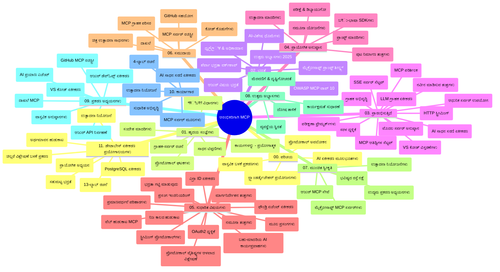

# ಆರಂಭಿಕರಿಗಾಗಿ ಮಾದರಿ ಸ್ಫೂರ್ತಿ ಪ್ರೋಟೋಕಾಲ್ (MCP) - ಅಧ್ಯಯನ ಗೈಡ್

ಈ ಅಧ್ಯಯನ ಗೈಡ್ "ಅರಂಭಿಕರಿಗಾಗಿ ಮಾದರಿ ಸ್ಫೂರ್ತಿ ಪ್ರೋಟೋಕಾಲ್ (MCP)" ಪಠ್ಯಕ್ರಮದ ಸಂಗ್ರಹಣಾ ರಚನೆ ಮತ್ತು ವಿಷಯದ ಅವಲೋಕನವನ್ನು ಒದಗಿಸುತ್ತದೆ. ಈ ಗೈಡ್ ಅನ್ನು ಸಂಗ್ರಹಣೆಯನ್ನು ಪರಿಣಾಮಕಾರಿಯಾಗಿ ನ್ಯಾವಿಗೇಟ್ ಮಾಡಲು ಮತ್ತು ಲಭ್ಯವಿರುವ ಸಂಪನ್ಮೂಲಗಳ ಉತ್ತಮ ಉಪಯೋಗಕ್ಕಾಗಿ ಬಳಸಿ.

## ಸಂಗ್ರಹಣೆ ಅವಲೋಕನ

ಮಾದರಿ ಸ್ಫೂರ್ತಿ ಪ್ರೋಟೋಕಾಲ್ (MCP) AI ಮಾದರಿಗಳು ಮತ್ತು ಕ್ಲೈಂಟ್ ಅಪ್ಲಿಕೇಶನ್ಗಳ ನಡುವಿನ ಸಂವಹನಕ್ಕೆ ಸಾಮಾನ್ಯೀಕೃತ ರೂಪರೇಖೆಯಾಗಿದೆ. ಆಂಪತ್ರೋಪಿಕ್ ಮೂಲಕ ಪ್ರಾರಂಭವಾಗಿ ನಿರ್ಮಿಸಲ್ಪಟ್ಟ MCP, ಇದೀಗ ಅಧಿಕೃತ GitHub ಸಂಸ್ಥೆ ಮೂಲಕ MCP ಸಮುದಾಯದವರಿಂದ ನಿರ್ವಹಣೆಗಿನಾಗಿದೆ. ಈ ಸಂಗ್ರಹಣೆಯು AI ಡೆವಲಪರ್ಗಳು, ವ್ಯವಸ್ಥೆ ವಿನ್ಯಾಸಗಾರರು ಮತ್ತು ತಂತ್ರಾಂಶ ಇಂಜಿನಿಯರ್ರುಗಳಿಗಾಗಿ C#, ಜಾವಾ, ಜಾವಾಸ್ಕ್ರಿಪ್ಟ್, ಪೈಥಾನ್ ಮತ್ತು ಟೈಪ್‌ಸ್ಕ್ರಿಪ್ಟ್ ನಲ್ಲಿ ಕೈಗೊಳ್ಳಬಹುದಾದ ಕೋಡ್ ಉದಾಹರಣೆಗಳೊಂದಿಗೆ ಸಮಗ್ರ ಪಠ್ಯಕ್ರಮವನ್ನು ಒದಗಿಸುತ್ತದೆ.

## ದೃಶ್ಯ ಪಠ್ಯಕ್ರಮ ನಕ್ಷೆ

## ಸಂಗ್ರಹಣೆ ರಚನೆ

ಸಂಗ್ರಹಣೆ ಹನ್ನೊಂದು ಮುಖ್ಯ ವಿಭಾಗಗಳಲ್ಲಿ ಸಂಘಟನೆಯಾಗಿದ್ದು, ಪ್ರತಿ ವಿಭಾಗ MCP ಯ ವಿಭಿನ್ನ ಅಂಶಗಳ ಮೇಲೆ ಕೇಂದ್ರೀಕೃತವಾಗಿದೆ:

1. **ಪರಿಚಯ (00-Introduction/)**
   - ಮಾದರಿ ಸ್ಫೂರ್ತಿ ಪ್ರೋಟೋಕಾಲ್ ಪರಿಚಯ
   - AI ಪೈಪ್ಲೈನ್ಗಳಲ್ಲಿ ಮಾನದಂಡೀಕರಣದ ಮಹತ್ವ
   - ಪ್ರಯೋಜನಗಳು ಮತ್ತು ವ್ಯವಹಾರಿಕ ಉಪಯೋಗಗಳು

2. **ಮೂಲಭೂತ ಸಿದ್ಧಾಂತಗಳು (01-CoreConcepts/)**
   - ಕ್ಲೈಂಟ್-ಸರ್ವರ್ ವಾಸ್ತುಶಿಲ್ಪ
   - ಪ್ರಮುಖ ಪ್ರೋಟೋಕಾಲ್ ಘಟಕಗಳು
   - MCP ನ ಸಂದೇಶ ಮಾದರಿಗಳು

3. **ಭದ್ರತೆ (02-Security/)**
   - MCP ಆಧಾರಿತ ವ್ಯವಸ್ಥೆಗಳಲ್ಲಿ ಭದ್ರತಾಿಲ್ಲಿ ಬೆದರಿಕೆಗಳು
   - ಅನುಷ್ಠಾನ ಭದ್ರತೆಗಾಗಿ ಶ್ರೇಷ್ಠ ಅಭ್ಯಾಸಗಳು
   - ಪ್ರಾಮಾಣೀಕರಣ ಮತ್ತು ಅಧಿಕಾರ ನಿಯಂತ್ರಣ ತಂತ್ರಗಳು
   - **ವಿಸ್ತೃತ ಭದ್ರತಾ ಡಾಕ್ಯುಮೆಂಟೇಶನ್**:
     - MCP ಭದ್ರತಾ ಶ್ರೇಷ್ಠ ಅಭ್ಯಾಸಗಳು 2025
     - ಅಜ್ಯೂರ್ ವಿಷಯ ಭದ್ರತಾ ಅನುಷ್ಠಾನ ಗೈಡ್
     - MCP ಭದ್ರತಾ ನಿಯಂತ್ರಣಗಳು ಮತ್ತು ತಂತ್ರಗಳು
     - MCP ಶ್ರೇಷ್ಠ ಅಭ್ಯಾಸಗಳು ತ್ವರಿತ ಉಲ್ಲೇಖ
   - **ಪ್ರಮುಖ ಭದ್ರತಾ ವಿಷಯಗಳು**:
     - ಪ್ರಾಂಪ್ಟ್ ಇಂಜೆಕ್ಷನ್ ಮತ್ತು ಸಾಧನ ವಿಷಕಾರಣ ದಾಳಿಗಳು
     - ಸೆಷನ್ ಹೈಜ್ಯಾಕಿಂಗ್ ಮತ್ತು ಗೊಂದಲದ ಪ್ರತಿನಿಧಿ ಸಮಸ್ಯೆಗಳು
     - ಟೋಕನ್ ಪಾಸ್ಸ್ತ್ರೂ ದೌರ್ಬಲ್ಯಗಳು
     - ಹೆಚ್ಚಿನ ಅನುಮತಿಗಳು ಮತ್ತು ಪ್ರವೇಶ ನಿಯಂತ್ರಣ
     - AI ಘಟಕಗಳ ಸರಬರಾಜು ಸರಣಿ ಭದ್ರತೆ
     - Microsoft Prompt Shields ಇನ್ಟಿಗ್ರೆಷನ್

4. **ಪ್ರಾರಂಭಿಕತೆ (03-GettingStarted/)**
   - ಪರಿಸರ ಸೆಟ್ಟಪ್ ಮತ್ತು ಕನ್ಫಿಗರೇಶನ್
   - ಮೌಲಿಕ MCP ಸರ್ವರ್ ಮತ್ತು ಕ್ಲೈಂಟ್ ನಿರ್ಮಾಣ
   - ಇವುಗಳ ಇಂಟಿಗ್ರೇಷನ್
   - ಒಳಗೊಂಡಿದೆ:
     - ಪ್ರಥಮ ಸರ್ವರ್ ಅನುಷ್ಠಾನ
     - ಕ್ಲೈಂಟ್ ಅಭಿವೃದ್ಧಿ
     - LLM ಕ್ಲೈಂಟ್ ಇಂಟಿಗ್ರೇಷನ್
     - VS ಕೋಡ್ ಇಂಟಿಗ್ರೇಷನ್
     - ಸರ್ವರ್-ಸೆಂಟ್ ಇವೆಂಟ್ (SSE) ಸರ್ವರ್
     - ಉನ್ನತ ಸರ್ವರ್ ಬಳಕೆ
     - HTTP ಸ್ಟ್ರೀಮಿಂಗ್
     - AI ಟೂಲ್ ಕಿಟ್ ಇಂಟಿಗ್ರೇಷನ್
     - ಪರೀಕ್ಷಾ ತಂತ್ರಗಳು
     - ನಿಯೋಜನೆ ಮಾರ್ಗದರ್ಶಿಕೆಗಳು

5. **ವ್ಯವಹಾರಿಕ ಅನುಷ್ಠಾನ (04-PracticalImplementation/)**
   - ವಿಭಿನ್ನ ಪ್ರೋಗ್ರಾಮಿಂಗ್ ಭಾಷೆಗಳ SDK ಬಳಕೆ
   - ಡಿಬಗ್ಗಿಂಗ್, ಪರೀಕ್ಷೆ, ಮಾನ್ಯತೆ ತಂತ್ರಗಳು
   - ಮರುಬಳಕೆ ಮಾಡಬಹುದಾದ ಪ್ರಾಂಪ್ಟ್ ಟೆಂಪ್ಲೇಟುಗಳು ಮತ್ತು ಕಾರ್ಯವಾಹಿಗಳು
   - ಅನುಷ್ಠಾನ ಉದಾಹರಣೆಗಳಿರುವ ಪ್ರಾಜೆಕ್ಟ್ಗಳು

6. **ಅಧುನಿಕ ವಿಷಯಗಳು (05-AdvancedTopics/)**
   - ಸ್ಫೂರ್ತಿ ಇಂಜಿನಿಯರಿಂಗ್ ತಂತ್ರಗಳು
   - ಫೌಂಡ್ರಿ ಏಜೆಂಟ್ ಇಂಟಿಗ್ರೇಷನ್
   - ಬಹುಮಾಧ್ಯಮ AI ಕಾರ್ಯವಾಹಿಗಳು 
   - OAuth2 ಪ್ರಾಮಾಣೀಕರಣ ಡೆಮೋಗಳು
   - ನಿಜಕಾಲ ಓದುಗ ಸೇವೆಗಳು
   - ನಿಜಕಾಲ ಸ್ಟ್ರೀಮಿಂಗ್
   - ಮೂಲ ಸ್ಫೂರ್ತಿಗಳು ಅನುಷ್ಠಾನ
   - ಮಾರ್ಗಚಾರಿಕೆ ತಂತ್ರಗಳು
   - ಸ್ಯಾಂಪ್ಲಿಂಗ್ ತಂತ್ರಗಳು
   - ತೀವ್ರತೆಗೊಳಿಸುವಿಕೆ ವಿಧಾನಗಳು
   - ಭದ್ರತೆ ಪರಿಗಣನೆಗಳು
   - ಎಂಟ್ರಾ ಐಡಿ ಭದ್ರತಾ ಇಂಟಿಗ್ರೇಷನ್
   - ವೆಬ್ ಇದೋಕೋಡ್ ಸಂಯೋಜನೆ

7. **ಸಮುದಾಯ ಕೊಡುಗೆಗಳು (06-CommunityContributions/)**
   - ಕೋಡ್ ಮತ್ತು ಡಾಕ್ಯುಮೆಂಟೇಶನ್ ಕೊಡುಗೆ ಮಾಡುವುದು ಹೇಗೆ
   - GitHub ಮೂಲಕ ಸಹಕರಿಸುವುದು
   - ಸಮುದಾಯ ಚಾಲಿತ ಸುಧಾರಣೆಗಳು ಮತ್ತು ಪ್ರತಿಕ್ರಿಯೆಗಳು
   - ವಿವಿಧ MCP ಕ್ಲೈಂಟ್ ಗಳು ಬಳಸುವುದು (Claude ಡೆಸ್ಕ್‌ಟಾಪ್, Cline, VSCode)
   - ಜನಪ್ರಿಯ MCP ಸರ್ವರ್ ಗಳೊಂದಿಗೆ ಕೆಲಸ (ಚಿತ್ರ ಸೃಷ್ಟಿ ಸೇರಿದಂತೆ)

8. **ಪ್ರಾಥಮಿಕ ಸ್ವೀಕಾರದಿಂದ ಪಾಠಗಳು (07-LessonsfromEarlyAdoption/)**
   - ನಿಜಜೀವನ ಅನುಷ್ಠಾನಗಳು ಮತ್ತು ಯಶೋಗಾಥೆಗಳು
   - MCP ಆಧಾರಿತ ಪರಿಹಾರಗಳ ನಿರ್ಮಾಣ ಮತ್ತು ನಿಯೋಜನೆ
   - ಪ್ರವೃತ್ತಿಗಳು ಮತ್ತು ಭವಿಷ್ಯದ ಯೋಜನೆ
   - **Microsoft MCP ಸರ್ವರ್‌ಗಳ ಮಾರ್ಗದರ್ಶಿ**: 10 ಉತ್ಪಾದನಾ-ಸಿದ್ಧ Microsoft MCP ಸರ್ವರ್ ಗಳು:
     - Microsoft Learn Docs MCP ಸರ್ವರ್
     - Azure MCP ಸರ್ವರ್ (15+ ವಿಶೇಷ ಸಂಪರ್ಕಕಗಳು)
     - GitHub MCP ಸರ್ವರ್
     - Azure DevOps MCP ಸರ್ವರ್
     - MarkItDown MCP ಸರ್ವರ್
     - SQL ಸರ್ವರ್ MCP ಸರ್ವರ್
     - Playwright MCP ಸರ್ವರ್
     - Dev Box MCP ಸರ್ವರ್
     - Azure AI Foundry MCP ಸರ್ವರ್
     - Microsoft 365 ಏಜೆಂಟ್‌ಗಳು ಟೂಲ್ಕಿಟ್ MCP ಸರ್ವರ್

9. **ಶ್ರೇಷ್ಠ ಅಭ್ಯಾಸಗಳು (08-BestPractices/)**
   - ಕಾರ್ಯಕ್ಷಮತೆ ಸೂಕ್ಷ್ಮಸ್ಥಿತಿ ಮತ್ತು ಸುಧಾರಣೆ 
   - ದೋಷ ಸಹಿಷ್ಣುತೆಯ MCP ವ್ಯವಸ್ಥೆಗಳ ವಿನ್ಯಾಸ
   - ಪರೀಕ್ಷಾ ಮತ್ತು ತಾಳ್ಮೆ ತಂತ್ರಗಳು

10. **ಘಟನಾ ಅಧ್ಯಯನಗಳು (09-CaseStudy/)**
    - MCP ವಿವಿಧತನವನ್ನು ತೋರಿಸುವ ಏಳು ಸಂಪೂರ್ಣ ಘಟನಾ ಅಧ್ಯಯನಗಳು:
    - **Azure AI ಟ್ರಾವಲ್ ಏಜೆಂಟ್‌ಗಳು**: ಬಹು ಏಜೆಂಟ್ ಸಂಯೋಜನೆ Azure OpenAI ಮತ್ತು AI Search ನೊಂದಿಗೆ
    - **Azure DevOps ಸಂಯೋಜನೆ**: YouTube ಡೇಟಾ ನವೀಕರಣಗಳಿಂದ ಕಾರ್ಯವಾಹಿ ಸ್ವಯಂಕ್ರಿಯತೆ
    - **ನಿಜಕಾಲ ಡಾಕ್ಯುಮೆಂಟೇಶನ್ ರಿಟ್ರೀವಲ್**: ಪೈಥಾನ್ ಕൺಸೋಲ್ ಕ್ಲೈಂಟ್ ಮತ್ತು ಸ್ಟ್ರೀಮಿಂಗ್ HTTP
    - **ಸಂವಾದಾತ್ಮಕ ಅಧ್ಯಯನ ಯೋಜನಾ ನಿರ್ಮಾಪಕ**: Chainlit ವೆಬ್ ಅಪ್ಲಿಕೇಶನ್ ಸಂವಾದಾತ್ಮಕ AI ಯೊಂದಿಗೆ
    - **ಇನ್-ಎಡಿಟರ್ ಡಾಕ್ಯುಮೆಂಟೇಶನ್**: VS ಕೋಡ್ ಇಂಟಿಗ್ರೇಷನ್ GitHub Copilot ಕಾರ್ಯವಾಹಿಗಳೊಂದಿಗೆ
    - **Azure API ನಿರ್ವಾಹ:** MCP ಸರ್ವರ್ ಸೃಷ್ಟಿಯೊಡನೆ ಎಂಟರ್‌ಪ್ರೈಸ್ API ಇಂಟಿಗ್ರೇಷನ್
    - **GitHub MCP ರಿಜಿಸ್ಟ್ರಿ:** ಪರಿಸರ ವ್ಯವಸ್ಥೆ ಅಭಿವೃದ್ಧಿ ಮತ್ತು ಏಜೆಂಟಿಕ್ ಇಂಟಿಗ್ರೇಷನ್ ವೇದಿಕೆ
    - ಎಂಟರ್‌ಪ್ರೈಸ್ ಇಂಟಿಗ್ರೇಷನ್, ಡೆವಲಪರ್ ಉತ್ಪಾದಕತೆ ಮತ್ತು ಪರಿಸರ ವ್ಯವಸ್ಥೆ ಅಭಿವೃದ್ಧಿ ಉದಾಹರಣೆಗಳು

11. **ಹತ್ತನೇ section: ಕೈಕಳಿಗಳ ಕಾರ್ಯಾಗಾರ (10-StreamliningAIWorkflowsBuildingAnMCPServerWithAIToolkit/)**
    - MCP ಮತ್ತು AI ಟೂಲ್‌ಕಿಟ್ ಜೊತೆ ಕೈಗೂಡು ವು ಕಾರ್ಯಾಗಾರ
    - ನಿಜಜೀವನ ಉಪಕರಣಗಳೊಂದಿಗೆ AI ಮಾದರಿಗಳನ್ನು ಸಂಪರ್ಕಿಸುವ ಬುದ್ಧಿವಂತ ಅಪ್ಲಿಕೇಶನ್ಗಳ ನಿರ್ಮಾಣ
    - ಮೂಲಭೂತಗಳು, ಕಸ್ಟಮ್ ಸರ್ವರ್ ಅಭಿವೃದ್ಧಿ ಮತ್ತು ಉತ್ಪಾದನಾ ನಿಯೋಜನಾ ತಂತ್ರಗಳನ್ನು ಒಳಗೊಂಡ ಪ್ರಾಯೋಗಿಕ ಘಟಕಗಳು
    - **ಲ್ಯಾಬ್ ರಚನೆ**:
      - ಲ್ಯಾಬ್ 1: MCP ಸರ್ವರ್ ಮೂಲಭೂತಗಳು
      - ಲ್ಯಾಬ್ 2: ಉನ್ನತ MCP ಸರ್ವರ್ ಅಭಿವೃದ್ಧಿ
      - ಲ್ಯಾಬ್ 3: AI ಟೂಲ್‌ಕಿಟ್ ಇಂಟಿಗ್ರೇಷನ್
      - ಲ್ಯಾಬ್ 4: ಉತ್ಪಾದನಾ ನಿಯೋಜನೆ ಮತ್ತು ತೀವ್ರತೆಗೊಳಿಸುವಿಕೆ
    - ಹಂತ ಹಂತದ ಸೂಚನೆಗಳೊಂದಿಗೆ ಲ್ಯಾಬ್ ಆಧಾರಿತ ಅಧ್ಯಯನ

12. **MCP ಸರ್ವರ್ ಡೇಟಾಬೇಸ್ ಇಂಟಿಗ್ರೇಷನ್ ಲ್ಯಾಬ್‌ಗಳು (11-MCPServerHandsOnLabs/)**
    - PostgreSQL ಇಂಟಿಗ್ರೇಷನ್ ಜೊತೆಗೆ ಉತ್ಪಾದನಾ-ಸಿದ್ಧ MCP ಸರ್ವರ್ ಗಳಿಗಾಗಿ 13-ಲ್ಯಾಬ್ ಸಂಪೂರ್ಣ ತಿಳುಕೊಳ್ಳುವಿಕೆ
    - Zava Retail ವ್ಯವಹಾರ ಪರಿಸರದ ನಿಜಜೀವನ ಚಲನ
    - ಎಂಟರ್‌ಪ್ರೈಸ್ ಮಟ್ಟದ ಮಾದರಿಗಳು: ಸಾಲಿನ ಮಟ್ಟದ ಭದ್ರತೆ (RLS), ಅರ್ಥವಂತ ಹುಡುಕಾಟ, ಬಹು-ಕಿರಣ ಸಂಚಿಕೆ ಪ್ರವೇಶ
    - **ಸಂಪೂರ್ಣ ಲ್ಯಾಬ್ ರಚನೆ**:
      - ಲ್ಯಾಬ್ 00-03: ಆಧಾರಗಳು - ಪರಿಚಯ, ವಾಸ್ತುಶಿಲ್ಪ, ಭದ್ರತೆ, ಪರಿಸರ ಸೆಟ್ಟಪ್
      - ಲ್ಯಾಬ್ 04-06: MCP ಸರ್ವರ್ ನಿರ್ಮಾಣ - ಡೇಟಾಬೇಸ್ ವಿನ್ಯಾಸ, MCP ಸರ್ವರ್ ಅನುಷ್ಠಾನ, ಸಾಧನ ಅಭಿವೃದ್ಧಿ
      - ಲ್ಯಾಬ್ 07-09: ಉನ್ನತ ವೈಶಿಷ್ಟ್ಯಗಳು - ಅರ್ಥವಂತ ಹುಡುಕಾಟ, ಪರೀಕ್ಷೆ & ಡಿಬಗಿಂಗ್, VS ಕೋಡ್ ಇಂಟಿಗ್ರೇಷನ್
      - ಲ್ಯಾಬ್ 10-12: ಉತ್ಪಾದನೆ & ಶ್ರೇಷ್ಠ ಅಭ್ಯಾಸಗಳು - ನಿಯೋಜನೆ, ನಿರೀಕ್ಷಣೆ, ಸುಧಾರಣೆ
    - **ಕಾವಲ್ ಮಾಡಲಾದ ತಂತ್ರಜ್ಞಾನಗಳು**: FastMCP ಫ್ರೆಮಕರ್ಕ್, PostgreSQL, Azure OpenAI, Azure ಕಂಟೈನರ್ ಆ್ಯಪ್ಸ್, ಅಪ್ಲಿಕೇಶನ್ ಇನ್ಸೈಟ್‌ಗಳು
    - **ಅಧ್ಯಯನ ಫಲಿತಾಂಶಗಳು**: ಉತ್ಪಾದನಾ-ಸಿದ್ಧ MCP ಸರ್ವರ್ ಗಳು, ಡೇಟಾಬೇಸ್ ಇಂಟಿಗ್ರೆಷನ್ ಮಾದರಿಗಳು, AI-ಚಾಲಿತ ವಿಶ್ಲೇಷಣೆಗಳು, ಎಂಟರ್‌ಪ್ರೈಸ್ ಭದ್ರತೆ

## ಹೆಚ್ಚುವರಿ ಸಂಪನ್ಮೂಲಗಳು

ಸಂಗ್ರಹಣೆಯು ಬೆಂಬಲಿಸುವ ಸಂಪನ್ಮೂಲಗಳನ್ನು ಒಳಗೊಂಡಿದೆ:

- **ಚಿತ್ರಗಳ ಫೋಲ್ಡರ್**: ಪಠ್ಯಕ್ರಮದಲ್ಲಿ ಬಳಸಲಾದ ಚಿತ್ರರೂಪಗಳು ಮತ್ತು வரைಪಟಗಳು
- **ಭಾಷಾಂತರಗಳು**: ಬಹುಭಾಷಾ ಬೆಂಬಲ ಮತ್ತು ಸ್ವಯಂಚಾಲಿತ ಡಾಕ್ಯುಮೆಂಟೇಶನ್ ಭಾಷಾಂತರಗಳು
- **ಅಧಿಕೃತ MCP ಸಂಪನ್ಮೂಲಗಳು**:
  - [MCP ಡಾಕ್ಯುಮೆಂಟೇಶನ್](https://modelcontextprotocol.io/)
  - [MCP ವಿಶೇಷಣ](https://spec.modelcontextprotocol.io/)
  - [MCP GitHub ಸಂಗ್ರಹಣೆ](https://github.com/modelcontextprotocol)

## ಈ ಸಂಗ್ರಹಣೆಯನ್ನು ಹೇಗೆ ಉಪಯೋಗಿಸಬೆಕು

1. **ಕ್ರಮದಲ್ಲಿ ಅಧ್ಯಯನ**: 00 ರಿಂದ 11 ರವರೆಗಿನ ಅಧ್ಯಾಯಗಳನ್ನು ಕ್ರಮವಾಗಿ ಅನುಸರಿಸಿ ಸರಣಿಬದ್ಧ ಅಧ್ಯಯನಕ್ಕಾಗಿ.
2. **ಭಾಷಾ-ಸ್ಪೆಶಲಿಸ್ಟ್ ಗಮನ**: ನೀವು ಆಸಕ್ತ ವಿಹಿತ ಪ್ರೋಗ್ರಾಮಿಂಗ್ ಭಾಷೆಯಲ್ಲಿನ ಅನುಷ್ಠಾನಗಳಿಗಾಗಿ ಸ್ಯಾಂಪಲ್ ಡೈರೆಕ್ಟರಿಗಳನ್ನು ಪರಿಶೀಲಿಸಿ.
3. **ವ್ಯವಹಾರಿಕ ಅನುಷ್ಠಾನ**: ಪರಿಸರ ಸೆಟ್ಅಪ್ ಮಾಡಿ ಹಾಗೂ ನಿಮ್ಮ ಮೊದಲ MCP ಸರ್ವರ್ ಮತ್ತು ಕ್ಲೈಂಟ್ ರಚನೆಗೆ "Getting Started" ವಿಭಾಗದಿಂದ ಪ್ರಾರಂಭಿಸಿ.
4. **ಅಧಿಕೃತ ಅನ್ವೇಷಣೆ**: ಆಧಾರಭೂತ ತಿಳುವಳಿಕೆ ಹೊಂದಿದ ನಂತರ, ಉನ್ನತ ವಿಷಯಗಳಿಗೆ ಡೈವ್ ಮಾಡಿ ಜ್ಞಾನವನ್ನ ವಿಸ್ತರಿಸಿ.
5. **ಸಮುದಾಯ ಭಾಗವಹಿಸುವಿಕೆ**: MCP ಸಮುದಾಯಕ್ಕೆ GitHub ಚರ್ಚೆಗಳು ಮತ್ತು Discord ಚಾನೆಲ್‌ಗಳ ಮೂಲಕ ಸೇರಿ ತಜ್ಞರು ಮತ್ತು ಸಹ ಡೆವಲಪರ್ಗಳೊಂದಿಗೆ ಸಂಪರ್ಕ ಸಾಧಿಸಿ.

## MCP ಕ್ಲೈಂಟ್‌ಗಳು ಮತ್ತು ಸಾಧನಗಳು

ಪಠ್ಯಕ್ರಮವು ವಿವಿಧ MCP ಕ್ಲೈಂಟ್‌ಗಳು ಮತ್ತು ಸಾಧನಗಳನ್ನು ಒಳಗೊಂಡಿದೆ:

1. **ಅಧಿಕೃತ ಕ್ಲೈಂಟ್‌ಗಳು**:
   - Visual Studio Code 
   - MCP Visual Studio Code ನಲ್ಲಿ
   - Claude ಡೆಸ್ಕ್‌ಟಾಪ್
   - VSCode ನಲ್ಲಿ Claude 
   - Claude API

2. **ಸಮುದಾಯ ಕ್ಲೈಂಟ್‌ಗಳು**:
   - Cline (ಟರ್ಮಿನಲ್-ಆಧಾರಿತ)
   - Cursor (ಕೋಡ್ ಎಡಿಟರ್)
   - ChatMCP
   - Windsurf

3. **MCP ನಿರ್ವಹಣಾ ಸಾಧನಗಳು**:
   - MCP CLI
   - MCP ಮ್ಯಾನೇಜರ್
   - MCP ಲಿಂಕರ
   - MCP ರೌಟರ್

## ಜನಪ್ರಿಯ MCP ಸರ್ವರ್‌ಗಳು

ಸಂಗ್ರಹಣೆ ಸಾರ್ವಜನಿಕವಾಗಿ ಅಳವಡಿಸಿರುವ MCP ಸರ್ವರ್‌ಗಳನ್ನು ಪರಿಚಯಿಸುತ್ತದೆ, ಇವುಗಳಲ್ಲಿ:

1. **ಅಧಿಕೃತ Microsoft MCP ಸರ್ವರ್‌ಗಳು**:
   - Microsoft Learn Docs MCP ಸರ್ವರ್
   - Azure MCP ಸರ್ವರ್ (15+ ವಿಶೇಷ ಸಂಪರ್ಕಗಳು)
   - GitHub MCP ಸರ್ವರ್
   - Azure DevOps MCP ಸರ್ವರ್
   - MarkItDown MCP ಸರ್ವರ್
   - SQL ಸರ್ವರ್ MCP ಸರ್ವರ್
   - Playwright MCP ಸರ್ವರ್
   - Dev Box MCP ಸರ್ವರ್
   - Azure AI Foundry MCP ಸರ್ವರ್
   - Microsoft 365 ಏಜೆಂಟ್ ಟೂಲ್ಕಿಟ್ MCP ಸರ್ವರ್

2. **ಅಧಿಕೃತ ಕಚೇರಿ ಸರ್ವರ್‌ಗಳು**:
   - ಫೈಲ್ ಸಿಸ್ಟಮ್
   - ಫೆಚ್
   - ಮೆಮರಿ
   - ಕ್ರಮಾನುಗತ ಚಿಂತನೆ

3. **ಚಿತ್ರ ಸೃಷ್ಟಿ**:
   - Azure OpenAI DALL-E 3
   - ಸ್ಟೇಬಲ್ ಡಿಫ್ಯೂಶನ್ ವೆಬ್‌ಯುಐ
   - ನಿಯೋಜನೆ

4. **ಅಭಿವೃದ್ಧಿ ಸಾಧನಗಳು**:
   - Git MCP
   - ಟರ್ಮಿನಲ್ ನಿಯಂತ್ರಣ
   - ಕೋಡ್ ಸಹಾಯಕ

5. **ವಿಶಿಷ್ಟ ಸರ್ವರ್‌ಗಳು**:
   - Salesforce
   - Microsoft Teams
   - Jira ಮತ್ತು Confluence

## ಕೊಡುಗೆ ನೀಡುವುದು

ಈ ಸಂಗ್ರಹಣೆ ಸಮುದಾಯದಿಂದ ಉದಾರವಾಗಿ ಕೊಡುಗೆಗಳನ್ನು ಸ್ವಾಗತಿಸುತ್ತದೆ. MCP ಪರಿಸರಕ್ಕೆ ಪರಿಣಾಮಕಾರಿಯಾಗಿ ಕೊಡುಗೆ ನೀಡಲು ಮಾರ್ಗದರ್ಶನಕ್ಕಾಗಿ ಸಮುದಾಯ ಕೊಡುಗೆಗಳು ವಿಭಾಗವನ್ನು ನೋಡಿ.

----

*ಈ ಅಧ್ಯಯನ ಗೈಡ್ ಅನ್ನು 2026 ಫೆಬ್ರವರಿ 5 ರಂದು MCP ವಿಶೇಷಣ 2025-11-25 ರ ಇತ್ತೀಚಿನ ಆವೃತ್ತಿಯನ್ನು ಪ್ರತಿಬಿಂಬಿಸುವಂತೆ ಅಪ್‌ಡೇಟ್ ಮಾಡಲಾಗಿದೆ ಮತ್ತು ಆ ದಿನಾಂಕದ ವೇಳೆಗೆ ಸಂಗ್ರಹಣೆಯ ಅವಲೋಕನವನ್ನು ಒದಗಿಸುತ್ತದೆ. ಆದರೂ ಸಂಗ್ರಹಣೆಯ ವಿಷಯವನ್ನು ಈ ದಿನಾಂಕದ ನಂತರದ ಆಧಾರದಿಂದ ಅಪ್‌ಡೇಟ್ ಮಾಡಬಹುದು.*

---

<!-- CO-OP TRANSLATOR DISCLAIMER START -->
**ವಿವರಣೆ**:  
ಈ ದಾಖಲೆ AI ಅನುವಾದ ಸೇವೆ [Co-op Translator](https://github.com/Azure/co-op-translator) ಬಳಸಿ ಅನುವಾದಿಸಲಾಗಿದೆ. ನಾವು ನಿಖರತೆಗಾಗಿ ಪ್ರಯತ್ನಿಸುತ್ತಿದ್ದರೂ, ಸ್ವಯಂಚಾಲಿತ ಅನುವಾದಗಳಲ್ಲಿ ದೋಷಗಳು ಅಥವಾ ತಪ್ಪುಗಳು ಇರಬಹುದೆಂದು ದಯವಿಟ್ಟು ಜಾಗೃತಿ ವಹಿಸಿ. ಮೂಲ ಭಾಷೆಯಲ್ಲಿರುವ ಮೂಲ ದಾಖಲೆ ಆಧिकारिक ಮೂಲವೆನಿಸಬೇಕು. ಮಹತ್ವದ ಮಾಹಿತಿಗಾಗಿ ವೃತ್ತಿಪರ ಮಾನವನ ಅನುವಾದವನ್ನು ಶಿಫಾರಸು ಮಾಡಲಾಗುತ್ತದೆ. ಈ ಅನುವಾದ ಬಳಕೆಯಿಂದ ಉಂಟಾಗುವ ಯಾವುದೇ ಅರ್ಥಅಗತ್ಯತೆ ಅಥವಾ ತಪ್ಪು ವಿಷಯಕ್ಕಾಗಿ ನಾವು ಜವಾಬ್ದಾರಿಯಾಗಿದ್ದೇವೆ ಎಂದು ಪರಿಗಣಿಸದಿರಿ.
<!-- CO-OP TRANSLATOR DISCLAIMER END -->