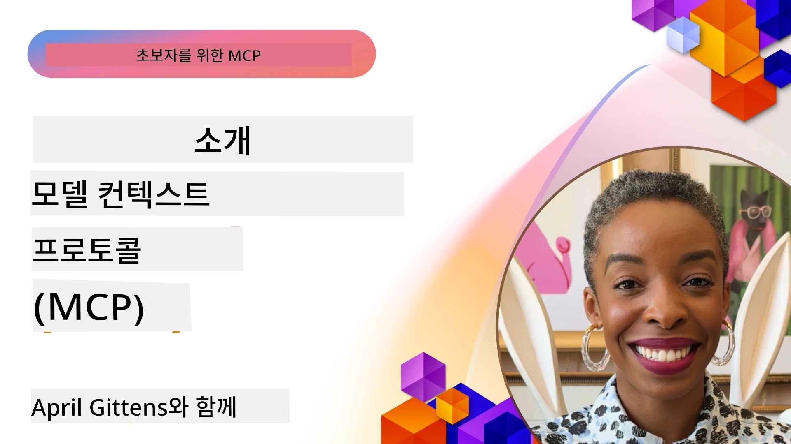
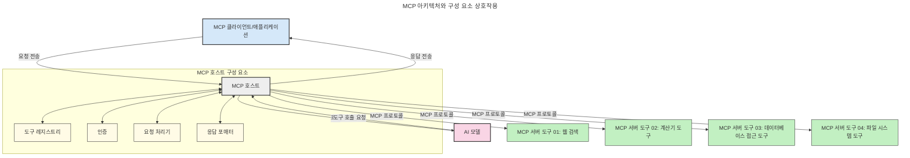

# Model Context Protocol(MCP) 소개: 확장 가능한 AI 애플리케이션에서 중요한 이유

[](https://youtu.be/agBbdiOPLQA)

_(위 이미지를 클릭하면 이 강의의 영상을 볼 수 있습니다)_

생성형 AI 애플리케이션은 종종 사용자가 자연어 프롬프트로 앱과 상호작용할 수 있게 해주기 때문에 큰 진전입니다. 그러나 이러한 앱에 더 많은 시간과 자원을 투자할수록 기능과 리소스를 쉽게 통합하여 확장하기 쉽고, 여러 모델을 지원할 수 있으며, 다양한 모델의 복잡성을 다룰 수 있도록 해야 합니다. 요컨대, 생성형 AI 앱은 시작은 쉽지만 성장하고 복잡해질수록 아키텍처를 정의하기 시작해야 하며, 일관된 방식으로 앱을 구축하기 위해 표준에 의존해야 할 가능성이 높습니다. 여기서 MCP가 등장하여 체계적으로 정리하고 표준을 제공합니다.

---

## **🔍 Model Context Protocol(MCP)란?**

**Model Context Protocol(MCP)**는 **대규모 언어 모델(LLM)**이 외부 도구, API 및 데이터 소스와 원활하게 상호작용할 수 있도록 하는 **개방형, 표준화된 인터페이스**입니다. 모델의 학습 데이터를 넘어 AI 모델 기능을 향상시키는 일관된 아키텍처를 제공하여 더 스마트하고 확장 가능하며 반응성 높은 AI 시스템을 가능하게 합니다.

---

## **🎯 AI에서 표준화가 중요한 이유**

생성형 AI 애플리케이션이 점점 복잡해짐에 따라 **확장성, 확장 가능성, 유지보수 용이성, 공급업체 종속 회피**를 보장하는 표준 채택이 필수적입니다. MCP는 다음과 같은 요구를 충족합니다:

- 모델-도구 통합의 통합
- 깨지기 쉬운 일회성 맞춤 솔루션 감소
- 여러 공급업체의 다양한 모델이 하나의 생태계 내에서 공존 가능

**참고:** MCP는 개방형 표준으로 소개되지만 IEEE, IETF, W3C, ISO 또는 기타 기존 표준화 기관을 통한 표준화 계획은 없습니다.

---

## **📚 학습 목표**

이 글을 마치면 다음을 할 수 있습니다:

- **Model Context Protocol(MCP)** 정의와 사용 사례 파악
- MCP가 모델-도구 간 통신을 어떻게 표준화하는지 이해
- MCP 아키텍처의 핵심 구성 요소 식별
- 기업 및 개발 환경에서 MCP의 실제 적용 사례 탐색

---

## **💡 Model Context Protocol(MCP)이 게임체인저인 이유**

### **🔗 MCP는 AI 상호작용의 단편화를 해결합니다**

MCP 이전에는 모델과 도구를 통합하려면 다음이 필요했습니다:

- 도구-모델 쌍마다 맞춤 코드 작성
- 공급업체마다 비표준 API 사용
- 업데이트로 인한 잦은 장애
- 도구 수 증가 시 낮은 확장성

### **✅ MCP 표준화의 이점**

| **이점**                  | **설명**                                                                 |
|---------------------------|--------------------------------------------------------------------------|
| 상호운용성               | LLM들이 서로 다른 공급업체의 도구와 원활하게 작동                          |
| 일관성                   | 플랫폼 및 도구 전반에 걸쳐 균일한 동작                                    |
| 재사용성                 | 한 번 만든 도구를 여러 프로젝트 및 시스템에서 활용 가능                    |
| 개발 가속화              | 표준화되고 플러그앤플레이 가능한 인터페이스 사용으로 개발 시간 단축         |

---

## **🧱 MCP 아키텍처 개요**

MCP는 **클라이언트-서버 모델**을 따르며:

- **MCP 호스트**는 AI 모델을 운영
- **MCP 클라이언트**가 요청 시작
- **MCP 서버**가 컨텍스트, 도구 및 기능을 제공

### **핵심 구성 요소:**

- **리소스** – 모델에 제공되는 정적 또는 동적 데이터  
- **프롬프트** – 안내 생성용 미리 정의된 워크플로  
- **도구** – 검색, 계산 등 실행 가능한 함수  
- **샘플링** – 재귀적 상호작용으로 에이전트 행동 구현
- **이끌어내기(Elicitation)** – 서버 주도의 사용자 입력 요청
- **루트(Roots)** – 서버 접근 제어를 위한 파일시스템 경계

### **프로토콜 아키텍처:**

MCP는 2계층 아키텍처 사용:
- **데이터 계층**: JSON-RPC 2.0 기반 통신 및 생명주기 관리와 원시 기능
- **전송 계층**: STDIO(로컬) 및 SSE(streamable HTTP, 원격) 통신 채널

---

## MCP 서버 동작 방식

MCP 서버는 다음과 같이 동작합니다:

- **요청 흐름**:
    1. 요청은 최종 사용자 또는 사용자를 대신하는 소프트웨어에 의해 시작됩니다.
    2. **MCP 클라이언트**가 AI 모델 런타임을 관리하는 **MCP 호스트**에 요청을 보냅니다.
    3. **AI 모델**은 사용자 프롬프트를 수신하고, 하나 이상의 도구 호출을 통해 외부 도구 또는 데이터 접근을 요청할 수 있습니다.
    4. **MCP 호스트**가 모델을 직접 거치지 않고 표준화된 프로토콜을 사용해 적절한 **MCP 서버**와 통신합니다.
- **MCP 호스트 기능**:
    - **도구 레지스트리**: 사용 가능한 도구와 기능 카탈로그 유지
    - **인증**: 도구 접근 권한 검증
    - **요청 처리기**: 모델로부터 들어오는 도구 요청 처리
    - **응답 포맷터**: 모델이 이해할 수 있는 형식으로 도구 출력 구조화
- **MCP 서버 실행**:
    - **MCP 호스트**가 하나 이상의 **MCP 서버**로 도구 호출을 라우팅하며, 각 서버는 검색, 계산, 데이터베이스 쿼리 등 전문 기능을 노출
    - **MCP 서버**는 자체 연산을 수행하고 결과를 일관된 형식으로 **MCP 호스트**에 반환
    - **MCP 호스트**는 이 결과를 포맷하여 **AI 모델**에 전달
- **응답 완료**:
    - **AI 모델**이 도구 출력을 종합해 최종 응답 생성
    - **MCP 호스트**는 이 응답을 **MCP 클라이언트**에 보내고, 클라이언트가 최종 사용자 또는 호출 소프트웨어에 전달


## 👨‍💻 MCP 서버 구축 방법 (예제 포함)

MCP 서버는 데이터를 제공하고 기능을 확장하여 LLM의 기능을 확장할 수 있게 합니다.

직접 시도해보고 싶나요? 아래는 다양한 언어/스택별 SDK와 간단한 MCP 서버 생성 예제입니다:

- **Python SDK**: https://github.com/modelcontextprotocol/python-sdk

- **TypeScript SDK**: https://github.com/modelcontextprotocol/typescript-sdk

- **Java SDK**: https://github.com/modelcontextprotocol/java-sdk

- **C#/.NET SDK**: https://github.com/modelcontextprotocol/csharp-sdk


## 🌍 MCP의 실제 활용 사례

MCP는 AI 기능 확장을 통해 다양한 응용을 가능하게 합니다:

| **응용 분야**              | **설명**                                                                  |
|----------------------------|---------------------------------------------------------------------------|
| 기업 데이터 통합           | LLM을 데이터베이스, CRM, 내부 도구와 연결                                  |
| 에이전틱 AI 시스템         | 도구 접근 및 의사결정 워크플로우가 있는 자율 에이전트 지원                  |
| 다중 모달 애플리케이션     | 텍스트, 이미지, 오디오 도구를 하나의 통합 AI 앱에서 결합                    |
| 실시간 데이터 통합         | 더 정확하고 최신의 출력을 위한 실시간 데이터 AI 상호작용에 도입             |


### 🧠 MCP = AI 상호작용을 위한 범용 표준

Model Context Protocol(MCP)는 USB-C가 장치의 물리적 연결을 표준화한 것처럼 AI 상호작용의 범용 표준 역할을 합니다. AI 세계에서 MCP는 모델(클라이언트)이 외부 도구와 데이터 제공자(서버)와 원활하게 통합될 수 있도록 일관된 인터페이스를 제공합니다. 이는 각 API나 데이터 소스마다 다양한 맞춤 프로토콜 필요성을 없애줍니다.

MCP 호환 도구(즉, MCP 서버)는 통합된 표준을 따릅니다. 이러한 서버들은 제공하는 도구나 작업 목록을 나열하고, AI 에이전트의 요청에 따라 해당 작업을 수행합니다. MCP를 지원하는 AI 에이전트 플랫폼은 서버에서 사용 가능한 도구를 탐색하고 이 표준 프로토콜을 통해 호출할 수 있습니다.

### 💡 지식 접근 용이성 제공

도구 제공 외에도 MCP는 지식 접근을 용이하게 합니다. 이는 애플리케이션이 대형 언어 모델(LLM)에 컨텍스트를 제공하기 위해 다양한 데이터 소스와 연결하도록 합니다. 예를 들어, MCP 서버는 회사 문서 저장소를 나타내어 에이전트가 필요 시 관련 정보를 검색할 수 있게 합니다. 다른 서버는 이메일 전송이나 기록 업데이트 같은 특정 작업을 처리할 수 있습니다. 에이전트 관점에서 이들은 단순히 사용할 수 있는 도구이며, 일부 도구는 데이터(지식 컨텍스트)를 반환하고 다른 도구는 작업을 수행합니다. MCP는 이 둘을 효율적으로 관리합니다.

MCP 서버에 연결된 에이전트는 표준 형식을 통해 서버의 사용 가능한 기능과 접근 가능한 데이터를 자동으로 학습합니다. 이 표준화 덕분에 도구 가용성이 동적으로 변할 수 있습니다. 예를 들어, 새로운 MCP 서버를 에이전트 시스템에 추가하면 에이전트 지시문을 추가로 수정하지 않아도 즉시 그 기능을 사용할 수 있습니다.

이 간소화된 통합은 다음 다이어그램에 묘사된 흐름과 일치하며, 서버가 도구와 지식을 모두 제공하여 시스템 간 원활한 협업을 보장합니다.

### 👉 예시: 확장 가능한 에이전트 솔루션

```mermaid
---
title: MCP를 통한 확장 가능한 에이전트 솔루션
description: 사용자가 여러 MCP 서버와 연결된 LLM과 상호작용하는 방식을 보여주는 다이어그램으로, 각 서버는 지식과 도구를 제공하여 확장 가능한 AI 시스템 아키텍처를 만듭니다
---
graph TD
    User -->|프롬프트| LLM
    LLM -->|응답| User
    LLM -->|MCP| ServerA
    LLM -->|MCP| ServerB
    ServerA -->|범용 커넥터| ServerB
    ServerA --> KnowledgeA
    ServerA --> ToolsA
    ServerB --> KnowledgeB
    ServerB --> ToolsB

    subgraph Server A
        KnowledgeA[지식]
        ToolsA[도구]
    end

    subgraph Server B
        KnowledgeB[지식]
        ToolsB[도구]
    end
```유니버설 커넥터는 MCP 서버들이 서로 통신하고 기능을 공유하도록 하여 ServerA가 ServerB에 작업을 위임하거나 도구와 지식에 접근할 수 있게 합니다. 이는 서버들 간 도구와 데이터를 연합(federate)하여 확장 가능하고 모듈식이면서 유연한 에이전트 아키텍처를 지원합니다. MCP가 도구 노출을 표준화했기에, 에이전트는 하드코딩된 통합 없이 서버를 동적으로 탐색하고 요청을 라우팅할 수 있습니다.

도구 및 지식 연합: 도구와 데이터를 서버 전반에 걸쳐 접근 가능하게 하여 더 확장 가능하고 모듈식인 에이전트 아키텍처 지원.

### 🔄 클라이언트측 LLM 통합을 통한 고급 MCP 시나리오

기본 MCP 아키텍처를 넘어, 클라이언트와 서버 모두 LLM을 포함하는 고급 시나리오가 있습니다. 다음 다이어그램에서 **클라이언트 앱**은 사용자 LLM을 위한 여러 MCP 도구가 있는 IDE일 수 있습니다:

```mermaid
---
title: 클라이언트-서버 LLM 통합을 통한 고급 MCP 시나리오
description: 사용자, 클라이언트 애플리케이션, 클라이언트 LLM, 여러 MCP 서버, 서버 LLM 간의 상세 상호작용 흐름을 보여주는 시퀀스 다이어그램으로, 도구 탐색, 사용자 상호작용, 직접 도구 호출, 기능 협상 단계를 설명합니다
---
sequenceDiagram
    autonumber
    actor User as 👤 사용자
    participant ClientApp as 🖥️ 클라이언트 앱
    participant ClientLLM as 🧠 클라이언트 LLM
    participant Server1 as 🔧 MCP 서버 1
    participant Server2 as 📚 MCP 서버 2
    participant ServerLLM as 🤖 서버 LLM
    
    %% Discovery Phase
    rect rgb(220, 240, 255)
        Note over ClientApp, Server2: 도구 탐색 단계
        ClientApp->>+Server1: 사용 가능한 도구/리소스 요청
        Server1-->>-ClientApp: 도구 목록 반환 (JSON)
        ClientApp->>+Server2: 사용 가능한 도구/리소스 요청
        Server2-->>-ClientApp: 도구 목록 반환 (JSON)
        Note right of ClientApp: 통합 도구 카탈로그를<br/>로컬에 저장
    end
    
    %% User Interaction
    rect rgb(255, 240, 220)
        Note over User, ClientLLM: 사용자 상호작용 단계
        User->>+ClientApp: 자연어 프롬프트 입력
        ClientApp->>+ClientLLM: 프롬프트 + 도구 카탈로그 전달
        ClientLLM->>-ClientLLM: 프롬프트 분석 및 도구 선택
    end
    
    %% Scenario A: Direct Tool Calling
    alt 직접 도구 호출
        rect rgb(220, 255, 220)
            Note over ClientApp, Server1: 시나리오 A: 직접 도구 호출
            ClientLLM->>+ClientApp: 도구 실행 요청
            ClientApp->>+Server1: 특정 도구 실행
            Server1-->>-ClientApp: 결과 반환
            ClientApp->>+ClientLLM: 결과 처리
            ClientLLM-->>-ClientApp: 응답 생성
            ClientApp-->>-User: 최종 답변 표시
        end
    
    %% Scenario B: Feature Negotiation (VS Code style)
    else 기능 협상 (VS Code 스타일)
        rect rgb(255, 220, 220)
            Note over ClientApp, ServerLLM: 시나리오 B: 기능 협상
            ClientLLM->>+ClientApp: 필요한 기능 식별
            ClientApp->>+Server2: 기능/역량 협상
            Server2->>+ServerLLM: 추가 컨텍스트 요청
            ServerLLM-->>-Server2: 컨텍스트 제공
            Server2-->>-ClientApp: 사용 가능한 기능 반환
            ClientApp->>+Server2: 협상 도구 호출
            Server2-->>-ClientApp: 결과 반환
            ClientApp->>+ClientLLM: 결과 처리
            ClientLLM-->>-ClientApp: 응답 생성
            ClientApp-->>-User: 최종 답변 표시
        end
    end
```

## 🔐 MCP의 실질적 이점

MCP 사용의 실질적 이점은 다음과 같습니다:

- **최신성**: 모델이 학습 데이터를 넘어 최신 정보를 접근 가능
- **기능 확장**: 모델이 훈련받지 않은 작업에 특화된 도구 활용 가능
- **환각 감소**: 외부 데이터 소스가 사실적 근거 제공
- **프라이버시**: 민감한 데이터는 프롬프트에 포함되지 않고 안전한 환경에 보관

## 📌 주요 요점

MCP 사용의 주요 요점은 다음과 같습니다:

- **MCP**는 AI 모델이 도구 및 데이터와 상호작용하는 방식을 표준화
- 확장성, 일관성, 상호운용성 촉진
- MCP는 개발 시간 단축, 신뢰성 향상, 모델 기능 확장에 도움
- 클라이언트-서버 아키텍처는 유연하고 확장 가능한 AI 애플리케이션 가능케 함

## 🧠 연습 문제

여러분이 만들고 싶은 AI 애플리케이션을 생각해보세요.

- 어떤 **외부 도구나 데이터**가 기능을 향상할 수 있을까요?
- MCP가 통합을 어떻게 **더 쉽고 신뢰성 있게** 만들 수 있을까요?

## 추가 자료

- [MCP GitHub 저장소](https://github.com/modelcontextprotocol)


## 다음 내용

다음: [챕터 1: 핵심 개념](../01-CoreConcepts/README.md)

---

<!-- CO-OP TRANSLATOR DISCLAIMER START -->
**면책 조항**:  
이 문서는 AI 번역 서비스 [Co-op Translator](https://github.com/Azure/co-op-translator)를 사용하여 번역되었습니다. 정확성을 위해 노력하였으나 자동 번역에는 오류나 부정확한 점이 포함될 수 있으니 참고하시기 바랍니다. 원본 문서가 권위 있는 자료로 간주되어야 합니다. 중요한 정보의 경우, 전문적인 인력에 의한 번역을 권장합니다. 이 번역 사용으로 인해 발생하는 오해나 잘못된 해석에 대해서 당사는 책임을 지지 않습니다.
<!-- CO-OP TRANSLATOR DISCLAIMER END -->