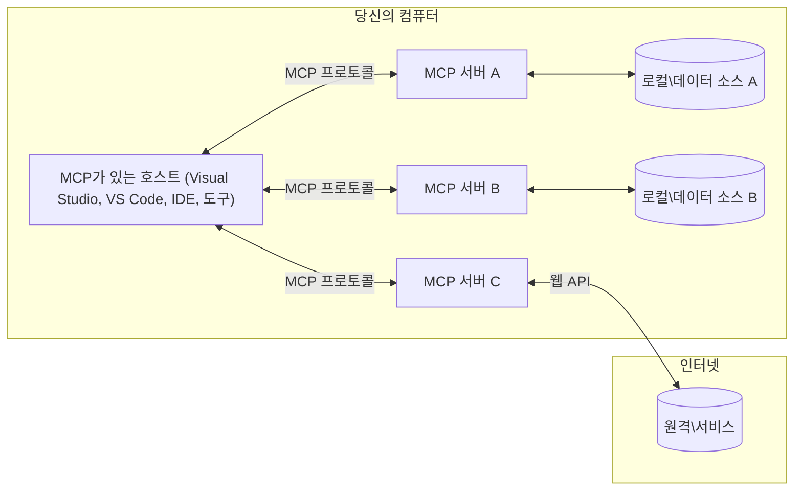

# MCP 핵심 개념: AI 통합을 위한 모델 컨텍스트 프로토콜 숙달하기

[](https://youtu.be/earDzWGtE84)

_(위 이미지를 클릭하면 이 수업의 동영상을 볼 수 있습니다)_

[Model Context Protocol (MCP)](https://github.com/modelcontextprotocol)은 대형 언어 모델(LLM)과 외부 도구, 애플리케이션, 데이터 소스 간의 통신을 최적화하는 강력하고 표준화된 프레임워크입니다.  
이 가이드에서는 MCP의 핵심 개념을 안내합니다. MCP의 클라이언트-서버 아키텍처, 주요 구성 요소, 통신 메커니즘 및 구현 모범 사례에 대해 배우게 됩니다.

- **명시적 사용자 동의**: 모든 데이터 접근 및 작업은 실행 전에 명시적 사용자 승인이 필요합니다. 사용자는 어떤 데이터에 접근하는지, 어떤 작업이 수행되는지를 명확히 이해해야 하며 권한과 승인에 대해 세밀한 제어가 가능해야 합니다.

- **데이터 프라이버시 보호**: 사용자 데이터는 명시적 동의가 있을 때만 노출되며 전체 상호작용 주기 동안 강력한 접근 제어로 보호되어야 합니다. 구현체는 무단 데이터 전송을 방지하고 엄격한 개인정보 경계를 유지해야 합니다.

- **도구 실행의 안전성**: 모든 도구 호출은 도구의 기능, 매개변수 및 잠재적 영향을 명확히 이해한 상태에서 명시적 사용자 동의를 요구합니다. 견고한 보안 경계로 의도하지 않은, 위험하거나 악의적인 도구 실행을 방지해야 합니다.

- **전송 계층 보안**: 모든 통신 채널은 적절한 암호화 및 인증 메커니즘을 사용해야 합니다. 원격 연결은 안전한 전송 프로토콜과 적절한 자격 증명 관리를 구현해야 합니다.

#### 구현 지침:

- **권한 관리**: 사용자가 접근 가능한 서버, 도구, 자원을 세밀하게 제어할 수 있는 권한 시스템 구현  
- **인증 및 인가**: OAuth, API 키 등 보안 인증 방법과 적절한 토큰 관리 및 만료 적용  
- **입력 검증**: 정의된 스키마에 따라 모든 매개변수와 데이터 입력 검증하여 인젝션 공격 방지  
- **감사 로깅**: 보안 모니터링 및 컴플라이언스 유지를 위해 모든 작업 로그를 포괄적으로 유지

## 개요

이 수업에서는 모델 컨텍스트 프로토콜(MCP) 생태계를 구성하는 기본 아키텍처와 구성 요소를 탐구합니다. MCP 상호작용을 구동하는 클라이언트-서버 아키텍처, 핵심 요소 및 통신 메커니즘에 대해 배우게 됩니다.

## 주요 학습 목표

이 수업을 마치면 다음을 할 수 있습니다:

- MCP 클라이언트-서버 아키텍처 이해  
- 호스트, 클라이언트, 서버의 역할과 책임 파악  
- MCP를 유연한 통합 계층으로 만드는 핵심 기능 분석  
- MCP 생태계 내에서 정보가 어떻게 흐르는지 학습  
- .NET, Java, Python, JavaScript 코드 예제를 통해 실용적 통찰력 습득

## MCP 아키텍처: 심층 탐구

MCP 생태계는 클라이언트-서버 모델을 기반으로 구축됩니다. 이 모듈식 구조는 AI 애플리케이션이 도구, 데이터베이스, API 및 컨텍스트 리소스와 효율적으로 상호작용할 수 있도록 합니다. MCP 아키텍처를 핵심 구성 요소별로 분해해 봅시다.

MCP는 기본적으로 호스트 애플리케이션이 여러 서버에 연결하는 클라이언트-서버 아키텍처를 따릅니다:


- **MCP 호스트**: VSCode, Claude Desktop, IDE, 또는 MCP를 통해 데이터에 접근하려는 AI 도구 같은 프로그램  
- **MCP 클라이언트**: 서버와 1:1 연결을 유지하는 프로토콜 클라이언트  
- **MCP 서버**: 표준화된 모델 컨텍스트 프로토콜을 통해 특정 기능을 제공하는 경량 프로그램  
- **로컬 데이터 소스**: MCP 서버가 안전하게 접근 가능한 컴퓨터의 파일, 데이터베이스, 서비스  
- **원격 서비스**: MCP 서버가 API를 통해 연결 가능한 인터넷 상의 외부 시스템  

MCP 프로토콜은 날짜 기반 버전 관리(YYYY-MM-DD 형식)의 진화하는 표준입니다. 현재 프로토콜 버전은 **2025-11-25**입니다. 최신 업데이트는 [프로토콜 사양](https://modelcontextprotocol.io/specification/2025-11-25/)에서 확인할 수 있습니다.

### 1. 호스트

모델 컨텍스트 프로토콜(MCP)에서 **호스트**는 사용자가 프로토콜과 상호작용하는 주요 인터페이스 역할을 하는 AI 애플리케이션입니다. 호스트는 각 서버 연결에 대해 전용 MCP 클라이언트를 생성하여 여러 MCP 서버와의 연결을 조정하고 관리합니다. 호스트 예시는 다음과 같습니다:

- **AI 애플리케이션**: Claude Desktop, Visual Studio Code, Claude Code  
- **개발 환경**: MCP 통합이 된 IDE 및 코드 편집기  
- **커스텀 애플리케이션**: 목적별 구축된 AI 에이전트 및 도구  

**호스트**는 AI 모델 상호작용을 조정하는 애플리케이션입니다. 그들은:

- **AI 모델 조율**: 반응 생성 및 AI 워크플로 조정을 위해 LLM을 실행하거나 상호작용  
- **클라이언트 연결 관리**: MCP 서버 연결당 하나의 MCP 클라이언트를 생성 및 유지  
- **사용자 인터페이스 제어**: 대화 흐름, 사용자 상호작용, 응답 표시 처리  
- **보안 적용**: 권한, 보안 제약, 인증 관리  
- **사용자 동의 처리**: 데이터 공유와 도구 실행에 대한 사용자 승인을 관리

### 2. 클라이언트

**클라이언트**는 호스트와 MCP 서버 간에 전용 1:1 연결을 유지하는 핵심 구성 요소입니다. 각 MCP 클라이언트는 특정 MCP 서버에 연결하기 위해 호스트가 인스턴스화하며, 이를 통해 체계적이고 안전한 통신 채널을 보장합니다. 여러 클라이언트를 통해 호스트는 동시에 여러 서버에 연결할 수 있습니다.

**클라이언트**는 호스트 애플리케이션 내의 연결자 구성 요소입니다. 그들은:

- **프로토콜 통신**: JSON-RPC 2.0 요청을 서버에 보내 프롬프트 및 지시 전달  
- **기능 협상**: 초기화 시 서버와 지원 기능 및 프로토콜 버전 협상  
- **도구 실행 관리**: 모델의 도구 실행 요청 처리 및 응답 관리  
- **실시간 업데이트**: 서버로부터 알림 및 실시간 업데이트 처리  
- **응답 처리**: 서버 응답을 처리하고 사용자에게 표시할 형식으로 변환

### 3. 서버

**서버**는 MCP 클라이언트에 컨텍스트, 도구, 기능을 제공하는 프로그램입니다. 서버는 로컬(호스트와 같은 기기) 또는 원격(외부 플랫폼)에서 실행될 수 있으며 클라이언트 요청을 처리하고 구조화된 응답을 제공합니다. 서버는 표준화된 모델 컨텍스트 프로토콜을 통해 특정 기능을 노출합니다.

**서버**는 컨텍스트와 기능을 제공하는 서비스입니다. 그들은:

- **기능 등록**: 클라이언트에 사용 가능한 프리미티브(자원, 프롬프트, 도구)를 등록하고 노출  
- **요청 처리**: 클라이언트의 도구 호출, 자원 요청, 프롬프트 요청 수신 및 실행  
- **컨텍스트 제공**: 모델 응답을 향상시키기 위한 컨텍스트 정보 및 데이터 제공  
- **상태 관리**: 세션 상태 유지 및 필요 시 상태 기반 상호작용 처리  
- **실시간 알림**: 연결된 클라이언트에 기능 변경 및 업데이트 알림 전송  

서버는 누구나 특화된 기능으로 모델 기능을 확장하기 위해 개발할 수 있으며, 로컬 및 원격 배포 시나리오 모두를 지원합니다.

### 4. 서버 프리미티브

모델 컨텍스트 프로토콜(MCP) 서버는 클라이언트, 호스트 및 언어 모델 간의 풍부한 상호작용을 위한 기본 빌딩 블록을 정의하는 세 가지 핵심 **프리미티브**를 제공합니다. 이 프리미티브들은 프로토콜을 통해 사용할 수 있는 컨텍스트 정보 및 작업 유형을 명세합니다.

MCP 서버는 다음 세 가지 핵심 프리미티브 중 임의 조합을 노출할 수 있습니다:

#### 자원(Resources)

**자원**은 AI 애플리케이션에 컨텍스트 정보를 제공하는 데이터 소스입니다. 정적 또는 동적 콘텐츠를 나타내어 모델의 이해와 의사 결정 능력을 향상시킵니다:

- **컨텍스트 데이터**: AI 모델이 소비하는 구조화된 정보 및 컨텍스트  
- **지식 베이스**: 문서 저장소, 기사, 매뉴얼, 연구 논문  
- **로컬 데이터 소스**: 파일, 데이터베이스, 로컬 시스템 정보  
- **외부 데이터**: API 응답, 웹 서비스, 원격 시스템 데이터  
- **동적 콘텐츠**: 외부 조건에 따라 업데이트되는 실시간 데이터  

자원은 URI로 식별되며 `resources/list`를 통해 검색, `resources/read`를 통해 조회할 수 있습니다:

```text
file://documents/project-spec.md
database://production/users/schema
api://weather/current
```

#### 프롬프트(Prompts)

**프롬프트**는 언어 모델과의 상호작용을 구조화하는 데 도움이 되는 재사용 가능한 템플릿입니다. 표준화된 상호작용 패턴 및 템플릿화된 워크플로를 제공합니다:

- **템플릿 기반 상호작용**: 사전 구조화된 메시지 및 대화 시작자  
- **워크플로 템플릿**: 공통 작업 및 상호작용에 대한 표준화된 시퀀스  
- **Few-shot 예시**: 모델 지침을 위한 예시 기반 템플릿  
- **시스템 프롬프트**: 모델 동작과 컨텍스트를 정의하는 기초 프롬프트  
- **동적 템플릿**: 특정 컨텍스트에 적응하는 매개변수화된 프롬프트  

프롬프트는 변수 치환을 지원하며 `prompts/list`로 검색하고 `prompts/get`으로 조회할 수 있습니다:

```markdown
Generate a {{task_type}} for {{product}} targeting {{audience}} with the following requirements: {{requirements}}
```

#### 도구(Tools)

**도구**는 AI 모델이 호출하여 특정 작업을 수행할 수 있는 실행 가능한 함수입니다. MCP 생태계에서 "동사" 역할을 하며 모델이 외부 시스템과 상호작용하도록 합니다:

- **실행 가능한 함수**: 모델이 특정 매개변수로 호출할 수 있는 독립적 작업  
- **외부 시스템 통합**: API 호출, 데이터베이스 쿼리, 파일 작업, 계산  
- **고유 식별**: 각 도구는 고유한 이름, 설명, 매개변수 스키마를 가짐  
- **구조화된 입출력**: 검증된 매개변수를 받고 구조화되고 타입이 지정된 응답 반환  
- **행동 기능**: 모델이 실제 작업을 수행하고 실시간 데이터를 조회할 수 있게 함  

도구는 매개변수 검증을 위해 JSON 스키마로 정의되며 `tools/list`를 통해 검색하고 `tools/call`로 실행합니다. 도구는 더 나은 UI 표시를 위해 **아이콘**과 같은 추가 메타데이터를 포함할 수 있습니다.

**도구 주석**: 도구는 `readOnlyHint`, `destructiveHint` 같은 행동 주석을 지원하여 도구가 읽기 전용인지 파괴적 작업인지 설명, 클라이언트가 도구 실행에 대해 정보에 근거한 결정을 내릴 수 있도록 돕습니다.

도구 정의 예시:

```typescript
server.tool(
  "search_products", 
  {
    query: z.string().describe("Search query for products"),
    category: z.string().optional().describe("Product category filter"),
    max_results: z.number().default(10).describe("Maximum results to return")
  }, 
  async (params) => {
    // 검색을 수행하고 구조화된 결과를 반환합니다
    return await productService.search(params);
  }
);
```

## 클라이언트 프리미티브

모델 컨텍스트 프로토콜(MCP)에서 **클라이언트**는 서버가 호스트 애플리케이션에 추가 기능을 요청할 수 있도록 하는 프리미티브를 노출할 수 있습니다. 이러한 클라이언트 측 프리미티브는 AI 모델 기능 및 사용자 상호작용에 접근 가능한 더 풍부하고 상호작용적인 서버 구현을 가능하게 합니다.

### 샘플링(Sampling)

**샘플링**은 서버가 클라이언트의 AI 애플리케이션에서 언어 모델 완성을 요청할 수 있게 합니다. 이 프리미티브는 서버가 자체 모델 종속성을 포함하지 않고 LLM 기능을 활용할 수 있도록 합니다:

- **모델 독립적 접근**: 서버가 LLM SDK 포함이나 모델 관리 없이 완성을 요청 가능  
- **서버 주도 AI**: 서버가 클라이언트 AI 모델을 사용해 자율적으로 콘텐츠 생성 가능  
- **재귀적 LLM 상호작용**: 서버가 AI 지원이 필요한 복잡한 시나리오 지원  
- **동적 콘텐츠 생성**: 호스트 모델을 이용해 컨텍스트별 응답 생성 가능  
- **도구 호출 지원**: 서버가 `tools` 및 `toolChoice` 매개변수를 포함해 클라이언트 모델의 도구 호출 활성화 가능  

샘플링은 `sampling/complete` 메서드를 통해 시작, 서버가 클라이언트에 완성 요청을 전송합니다.

### 루트(Roots)

**루트**는 클라이언트가 서버에 파일 시스템 경계를 표준화된 방식으로 노출하여 서버가 접근 가능한 디렉터리 및 파일을 파악하도록 돕습니다:

- **파일시스템 경계 정의**: 서버가 운영 가능한 파일 경계 지정  
- **접근 제어**: 서버가 접근 권한 있는 디렉터리와 파일 인지 지원  
- **동적 업데이트**: 클라이언트가 루트 목록 변경 시 서버에 알림 전송  
- **URI 기반 식별**: `file://` URI를 사용해 접근 가능한 디렉터리와 파일 식별  

루트는 `roots/list` 메서드로 검색하며, 클라이언트는 루트가 변경되면 `notifications/roots/list_changed`를 전송합니다.

### 정보 요청(Elicitation)

**정보 요청**은 서버가 클라이언트 인터페이스를 통해 사용자로부터 추가 정보 또는 확인을 요청할 수 있게 합니다:

- **사용자 입력 요청**: 도구 실행 시 필요한 추가 정보 서버 요청  
- **확인 대화상자**: 민감하거나 영향력 있는 작업에 대해 사용자 승인 요청  
- **상호작용 워크플로**: 단계별 사용자 상호작용 생성 가능  
- **동적 매개변수 수집**: 도구 실행 중 누락되었거나 선택적 매개변수 수집  

정보 요청은 클라이언트 인터페이스를 통해 사용자 입력을 수집하는 `elicitation/request` 메서드를 사용해 수행합니다.

**URL 모드 정보 요청**: 서버는 URL 기반 사용자 상호작용도 요청할 수 있으며, 사용자를 외부 웹 페이지로 안내해 인증, 승인, 데이터 입력을 수행하도록 할 수 있습니다.

### 로깅(Logging)

**로깅**은 서버가 디버깅, 모니터링, 운영 가시성을 위해 클라이언트에 구조화된 로그 메시지를 전송할 수 있도록 합니다:

- **디버깅 지원**: 문제 해결을 위한 상세 실행 로그 제공  
- **운영 모니터링**: 상태 업데이트 및 성능 지표 전송  
- **오류 보고**: 상세 오류 컨텍스트 및 진단 정보 제공  
- **감사 추적**: 서버 작업 및 결정을 포괄적으로 기록  

로깅 메시지는 서버 작업의 투명성을 높이고 디버깅을 용이하게 하기 위해 클라이언트로 전송됩니다.

## MCP 내 정보 흐름

모델 컨텍스트 프로토콜(MCP)은 호스트, 클라이언트, 서버, 모델 간의 구조화된 정보 흐름을 정의합니다. 이 흐름을 이해하면 사용자 요청이 어떻게 처리되고 외부 도구 및 데이터가 모델 응답에 통합되는지 명확해집니다.

- **호스트가 연결 시작**  
  IDE 또는 채팅 인터페이스 같은 호스트 애플리케이션이 일반적으로 STDIO, WebSocket 또는 다른 지원되는 전송 수단을 통해 MCP 서버에 연결을 설정합니다.

- **기능 협상**  
  호스트 내 클라이언트와 서버는 지원하는 기능, 도구, 자원, 프로토콜 버전에 관한 정보를 교환합니다. 이를 통해 양쪽 모두 세션에서 사용 가능한 기능을 이해합니다.

- **사용자 요청**  
  사용자가 호스트와 상호작용(예: 프롬프트 입력 또는 명령)합니다. 호스트는 이 입력을 수집하여 처리를 위해 클라이언트에 전달합니다.

- **자원 또는 도구 사용**  
  - 클라이언트는 모델 이해를 증진하기 위해 서버에 추가 컨텍스트 또는 자원(파일, 데이터베이스 항목, 지식 기반 문서 등)을 요청할 수 있습니다.  
  - 모델이 도구가 필요하다고 판단하면(예: 데이터 조회, 계산 수행, API 호출) 클라이언트는 도구 이름과 매개변수를 명시한 도구 호출 요청을 서버에 전송합니다.

- **서버 실행**  
서버는 리소스 또는 도구 요청을 수신하여 필요한 작업(예: 함수 실행, 데이터베이스 쿼리, 파일 검색 등)을 수행하고 결과를 구조화된 형식으로 클라이언트에 반환합니다.

- **응답 생성**  
  클라이언트는 서버의 응답(리소스 데이터, 도구 출력 등)을 진행 중인 모델 상호작용에 통합합니다. 모델은 이 정보를 사용하여 포괄적이고 문맥에 적합한 응답을 생성합니다.

- **결과 표시**  
  호스트는 클라이언트로부터 최종 출력을 받아 사용자에게 제공합니다. 이때 모델이 생성한 텍스트와 도구 실행 또는 리소스 조회 결과를 모두 포함하는 경우가 많습니다.

이 흐름은 MCP가 모델과 외부 도구 및 데이터 소스를 원활하게 연결하여 고급 인터랙티브하고 문맥 인지적인 AI 애플리케이션을 지원할 수 있도록 합니다.

## 프로토콜 아키텍처 및 계층

MCP는 완전한 통신 프레임워크를 제공하기 위해 함께 작동하는 두 개의 별도 아키텍처 계층으로 구성됩니다:

### 데이터 계층

**데이터 계층**은 **JSON-RPC 2.0**을 기반으로 하는 핵심 MCP 프로토콜을 구현합니다. 이 계층은 메시지 구조, 의미론, 상호작용 패턴을 정의합니다:

#### 핵심 구성 요소:

- **JSON-RPC 2.0 프로토콜**: 모든 통신은 표준화된 JSON-RPC 2.0 메시지 형식을 사용하여 메서드 호출, 응답, 알림을 수행  
- **수명 주기 관리**: 클라이언트와 서버 간 연결 초기화, 기능 협상, 세션 종료 처리  
- **서버 원시 기능**: 서버가 도구, 리소스, 프롬프트를 통해 핵심 기능을 제공할 수 있도록 함  
- **클라이언트 원시 기능**: 서버가 LLM 샘플링 요청, 사용자 입력 유도, 로그 메시지 전송을 할 수 있도록 함  
- **실시간 알림**: 폴링 없이 동적 업데이트를 위한 비동기 알림 지원  

#### 주요 기능:

- **프로토콜 버전 협상**: 호환성을 위해 날짜 형식(YYYY-MM-DD) 기반 버저닝 사용  
- **기능 탐색**: 클라이언트와 서버가 초기화 과정에서 지원 기능 정보를 교환  
- **상태 유지 세션**: 여러 상호작용에 걸친 연결 상태를 유지하여 문맥 연속성 보장  

### 전송 계층

**전송 계층**은 MCP 참가자 간 통신 채널, 메시지 프레이밍, 인증을 관리합니다:

#### 지원 전송 메커니즘:

1. **STDIO 전송**:  
   - 표준 입력/출력 스트림을 사용하여 직접 프로세스 간 통신  
   - 네트워크 오버헤드가 없는 동일 머신 내 로컬 프로세스에 최적화  
   - 로컬 MCP 서버 구현에 흔히 사용됨

2. **스트리밍 가능한 HTTP 전송**:  
   - 클라이언트에서 서버로는 HTTP POST 사용  
   - 서버에서 클라이언트로는 선택적 서버-발행 이벤트(Server-Sent Events, SSE) 스트리밍  
   - 네트워크를 통한 원격 서버 통신 지원  
   - 표준 HTTP 인증(베어러 토큰, API 키, 커스텀 헤더) 지원  
   - MCP는 보안 토큰 인증을 위해 OAuth 사용 권장

#### 전송 추상화:

전송 계층은 데이터 계층으로부터 통신 세부사항을 추상화하여 모든 전송 메커니즘에서 동일한 JSON-RPC 2.0 메시지 형식을 사용할 수 있게 합니다. 이를 통해 애플리케이션은 로컬과 원격 서버 간 전환을 원활하게 수행할 수 있습니다.

### 보안 고려사항

MCP 구현체는 프로토콜의 모든 운영에서 안전하고 신뢰할 수 있으며 보안이 보장된 상호작용을 위해 다음과 같은 중요한 보안 원칙을 따라야 합니다:

- **사용자 동의 및 제어**: 데이터 접근 또는 작업 수행 전 명시적 사용자 동의 필요. 사용자는 공유되는 데이터와 승인된 작업을 명확히 통제할 수 있어야 하며, 이를 검토하고 승인할 수 있는 직관적인 사용자 인터페이스 제공 필요.

- **데이터 프라이버시**: 사용자 데이터는 명시적 동의 하에만 노출되어야 하며 적절한 접근 제어로 보호되어야 함. MCP 구현체는 무단 데이터 전송을 방지하고 모든 상호작용에서 프라이버시가 유지되도록 해야 함.

- **도구 안전성**: 도구 호출 전 명시적 사용자 동의 필요. 사용자는 각 도구 기능을 명확히 이해해야 하며, 의도치 않거나 위험한 도구 실행을 막기 위해 견고한 보안 경계가 적용되어야 함.

이러한 보안 원칙 준수를 통해 MCP는 강력한 AI 통합을 가능케 하면서도 모든 프로토콜 상호작용에서 사용자 신뢰, 프라이버시, 안전을 보장합니다.

## 코드 예제: 주요 구성 요소

아래는 주요 MCP 서버 구성 요소와 도구를 구현하는 방법을 설명하는 여러 인기 프로그래밍 언어의 코드 예제입니다.

### .NET 예제: 도구가 포함된 간단한 MCP 서버 만들기

다음은 사용자 지정 도구를 포함한 간단한 MCP 서버를 구현하는 실용적인 .NET 코드 예제입니다. 이 예제는 도구 정의 및 등록, 요청 처리, Model Context Protocol을 사용한 서버 연결 방법을 보여줍니다.

```csharp
using System;
using System.Threading.Tasks;
using ModelContextProtocol.Server;
using ModelContextProtocol.Server.Transport;
using ModelContextProtocol.Server.Tools;

public class WeatherServer
{
    public static async Task Main(string[] args)
    {
        // Create an MCP server
        var server = new McpServer(
            name: "Weather MCP Server",
            version: "1.0.0"
        );
        
        // Register our custom weather tool
        server.AddTool<string, WeatherData>("weatherTool", 
            description: "Gets current weather for a location",
            execute: async (location) => {
                // Call weather API (simplified)
                var weatherData = await GetWeatherDataAsync(location);
                return weatherData;
            });
        
        // Connect the server using stdio transport
        var transport = new StdioServerTransport();
        await server.ConnectAsync(transport);
        
        Console.WriteLine("Weather MCP Server started");
        
        // Keep the server running until process is terminated
        await Task.Delay(-1);
    }
    
    private static async Task<WeatherData> GetWeatherDataAsync(string location)
    {
        // This would normally call a weather API
        // Simplified for demonstration
        await Task.Delay(100); // Simulate API call
        return new WeatherData { 
            Temperature = 72.5,
            Conditions = "Sunny",
            Location = location
        };
    }
}

public class WeatherData
{
    public double Temperature { get; set; }
    public string Conditions { get; set; }
    public string Location { get; set; }
}
```

### 자바 예제: MCP 서버 구성 요소

이 예제는 위 .NET 예제와 동일한 MCP 서버 및 도구 등록을 자바로 구현한 코드입니다.

```java
import io.modelcontextprotocol.server.McpServer;
import io.modelcontextprotocol.server.McpToolDefinition;
import io.modelcontextprotocol.server.transport.StdioServerTransport;
import io.modelcontextprotocol.server.tool.ToolExecutionContext;
import io.modelcontextprotocol.server.tool.ToolResponse;

public class WeatherMcpServer {
    public static void main(String[] args) throws Exception {
        // MCP 서버 생성
        McpServer server = McpServer.builder()
            .name("Weather MCP Server")
            .version("1.0.0")
            .build();
            
        // 날씨 도구 등록
        server.registerTool(McpToolDefinition.builder("weatherTool")
            .description("Gets current weather for a location")
            .parameter("location", String.class)
            .execute((ToolExecutionContext ctx) -> {
                String location = ctx.getParameter("location", String.class);
                
                // 날씨 데이터 가져오기 (간소화됨)
                WeatherData data = getWeatherData(location);
                
                // 포맷된 응답 반환
                return ToolResponse.content(
                    String.format("Temperature: %.1f°F, Conditions: %s, Location: %s", 
                    data.getTemperature(), 
                    data.getConditions(), 
                    data.getLocation())
                );
            })
            .build());
        
        // stdio 전송을 사용하여 서버 연결
        try (StdioServerTransport transport = new StdioServerTransport()) {
            server.connect(transport);
            System.out.println("Weather MCP Server started");
            // 프로세스 종료 시까지 서버 실행 유지
            Thread.currentThread().join();
        }
    }
    
    private static WeatherData getWeatherData(String location) {
        // 구현 시 날씨 API를 호출함
        // 예제 목적을 위해 간소화됨
        return new WeatherData(72.5, "Sunny", location);
    }
}

class WeatherData {
    private double temperature;
    private String conditions;
    private String location;
    
    public WeatherData(double temperature, String conditions, String location) {
        this.temperature = temperature;
        this.conditions = conditions;
        this.location = location;
    }
    
    public double getTemperature() {
        return temperature;
    }
    
    public String getConditions() {
        return conditions;
    }
    
    public String getLocation() {
        return location;
    }
}
```

### 파이썬 예제: MCP 서버 구축

이 예제는 fastmcp를 사용하므로 먼저 설치를 권장합니다:

```python
pip install fastmcp
```
코드 샘플:

```python
#!/usr/bin/env python3
import asyncio
from fastmcp import FastMCP
from fastmcp.transports.stdio import serve_stdio

# FastMCP 서버 생성
mcp = FastMCP(
    name="Weather MCP Server",
    version="1.0.0"
)

@mcp.tool()
def get_weather(location: str) -> dict:
    """Gets current weather for a location."""
    return {
        "temperature": 72.5,
        "conditions": "Sunny",
        "location": location
    }

# 클래스를 사용하는 대안 접근법
class WeatherTools:
    @mcp.tool()
    def forecast(self, location: str, days: int = 1) -> dict:
        """Gets weather forecast for a location for the specified number of days."""
        return {
            "location": location,
            "forecast": [
                {"day": i+1, "temperature": 70 + i, "conditions": "Partly Cloudy"}
                for i in range(days)
            ]
        }

# 클래스 도구 등록
weather_tools = WeatherTools()

# 서버 시작
if __name__ == "__main__":
    asyncio.run(serve_stdio(mcp))
```

### 자바스크립트 예제: MCP 서버 만들기

이 예제는 자바스크립트에서 MCP 서버를 생성하고 두 개의 날씨 관련 도구를 등록하는 방법을 보여줍니다.

```javascript
// 공식 모델 컨텍스트 프로토콜 SDK 사용
import { McpServer } from "@modelcontextprotocol/sdk/server/mcp.js";
import { StdioServerTransport } from "@modelcontextprotocol/sdk/server/stdio.js";
import { z } from "zod"; // 매개변수 검증을 위해

// MCP 서버 생성
const server = new McpServer({
  name: "Weather MCP Server",
  version: "1.0.0"
});

// 날씨 도구 정의
server.tool(
  "weatherTool",
  {
    location: z.string().describe("The location to get weather for")
  },
  async ({ location }) => {
    // 보통은 날씨 API를 호출합니다
    // 시연을 위해 간소화됨
    const weatherData = await getWeatherData(location);
    
    return {
      content: [
        { 
          type: "text", 
          text: `Temperature: ${weatherData.temperature}°F, Conditions: ${weatherData.conditions}, Location: ${weatherData.location}` 
        }
      ]
    };
  }
);

// 예보 도구 정의
server.tool(
  "forecastTool",
  {
    location: z.string(),
    days: z.number().default(3).describe("Number of days for forecast")
  },
  async ({ location, days }) => {
    // 보통은 날씨 API를 호출합니다
    // 시연을 위해 간소화됨
    const forecast = await getForecastData(location, days);
    
    return {
      content: [
        { 
          type: "text", 
          text: `${days}-day forecast for ${location}: ${JSON.stringify(forecast)}` 
        }
      ]
    };
  }
);

// 도우미 함수들
async function getWeatherData(location) {
  // API 호출 시뮬레이션
  return {
    temperature: 72.5,
    conditions: "Sunny",
    location: location
  };
}

async function getForecastData(location, days) {
  // API 호출 시뮬레이션
  return Array.from({ length: days }, (_, i) => ({
    day: i + 1,
    temperature: 70 + Math.floor(Math.random() * 10),
    conditions: i % 2 === 0 ? "Sunny" : "Partly Cloudy"
  }));
}

// stdio 전송을 사용하여 서버 연결
const transport = new StdioServerTransport();
server.connect(transport).catch(console.error);

console.log("Weather MCP Server started");
```

이 자바스크립트 예제는 서버에 연결하고 프롬프트를 전송하며 도구 호출을 포함한 응답을 처리하는 MCP 클라이언트 생성 방법을 시연합니다.

## 보안 및 권한 부여

MCP는 프로토콜 전반에 걸쳐 보안 및 권한 관리를 위한 여러 내장 개념과 메커니즘을 포함합니다:

1. **도구 권한 제어**:  
  클라이언트는 세션 동안 모델이 사용할 수 있는 도구를 지정할 수 있습니다. 이를 통해 명시적으로 승인된 도구만 접근 가능하게 하여 의도치 않거나 위험한 작업 위험을 줄입니다. 권한은 사용자 선호, 조직 정책 또는 상호작용 문맥에 따라 동적으로 구성할 수 있습니다.

2. **인증**:  
  서버는 도구, 리소스, 민감 작업 접근 전에 인증을 요구할 수 있습니다. API 키, OAuth 토큰 또는 기타 인증 체계를 사용할 수 있습니다. 올바른 인증은 신뢰할 수 있는 클라이언트 및 사용자만 서버 기능을 호출할 수 있게 보장합니다.

3. **검증**:  
  모든 도구 호출에 대해 매개변수 검증이 적용됩니다. 각 도구는 매개변수의 예상 타입, 형식, 제약 조건을 정의하며 서버는 들어오는 요청을 이에 따라 검증합니다. 이는 잘못된 입력이나 악의적 입력이 도구 구현에 도달하는 것을 방지하고 작업 무결성을 유지합니다.

4. **요율 제한**:  
  서버 자원 남용 방지 및 공정 사용 보장을 위해 MCP 서버는 도구 호출 및 리소스 접근에 대해 요율 제한을 구현할 수 있습니다. 요율 제한은 사용자별, 세션별, 또는 전체적으로 적용 가능하며, 서비스 거부 공격이나 과도한 자원 소비로부터 보호합니다.

이러한 메커니즘을 결합하여 MCP는 외부 도구 및 데이터 소스와 언어 모델을 안전하게 통합할 수 있는 기반을 제공하며, 사용자와 개발자에게는 접근 및 사용에 대한 세밀한 제어권을 부여합니다.

## 프로토콜 메시지 및 통신 흐름

MCP 통신은 구조화된 **JSON-RPC 2.0** 메시지를 사용하여 호스트, 클라이언트, 서버 간 명확하고 신뢰성 있는 상호작용을 가능하게 합니다. 프로토콜은 다양한 작업에 대해 특정 메시지 패턴을 정의합니다:

### 핵심 메시지 유형:

#### **초기화 메시지**
- **`initialize` 요청**: 연결을 수립하고 프로토콜 버전과 기능을 협상  
- **`initialize` 응답**: 지원되는 기능과 서버 정보를 확인  
- **`notifications/initialized`**: 초기화가 완료되었고 세션이 준비되었음을 알림  

#### **탐색 메시지**
- **`tools/list` 요청**: 서버에서 사용 가능한 도구 검색  
- **`resources/list` 요청**: 사용 가능한 리소스(데이터 소스) 목록 요청  
- **`prompts/list` 요청**: 사용 가능한 프롬프트 템플릿 조회  

#### **실행 메시지**  
- **`tools/call` 요청**: 지정된 도구를 제공된 매개변수로 실행  
- **`resources/read` 요청**: 특정 리소스에서 콘텐츠 검색  
- **`prompts/get` 요청**: 선택적 매개변수와 함께 프롬프트 템플릿 가져오기  

#### **클라이언트 측 메시지**
- **`sampling/complete` 요청**: 서버가 클라이언트에 LLM 완성 요청  
- **`elicitation/request`**: 서버가 클라이언트를 통해 사용자 입력 요청  
- **로그 메시지**: 서버가 클라이언트에 구조화된 로그 메시지 전송  

#### **알림 메시지**
- **`notifications/tools/list_changed`**: 도구 변경 사항을 클라이언트에 알림  
- **`notifications/resources/list_changed`**: 리소스 변경 사항을 클라이언트에 알림  
- **`notifications/prompts/list_changed`**: 프롬프트 변경 사항을 클라이언트에 알림  

### 메시지 구조:

모든 MCP 메시지는 JSON-RPC 2.0 형식을 따르며:  
- **요청 메시지**: `id`, `method`, 선택적 `params` 포함  
- **응답 메시지**: `id` 및 `result` 또는 `error` 포함  
- **알림 메시지**: `method` 및 선택적 `params` 포함 (`id` 없음, 응답 미요구)  

이러한 구조화된 통신은 실시간 업데이트, 도구 체인, 견고한 오류 처리 같은 고급 시나리오를 지원하는 신뢰성 있고 추적 가능하며 확장 가능한 상호작용을 보장합니다.

### 작업(실험적)

**작업**은 MCP 요청에 대해 지연된 결과 조회 및 상태 추적이 가능한 내구성 실행 래퍼를 제공하는 실험적 기능입니다:

- **장기 실행 작업**: 비용이 많이 드는 계산, 워크플로 자동화, 배치 처리 추적  
- **지연 결과**: 작업 상태를 폴링하여 작업 완료 시 결과 조회  
- **상태 추적**: 정의된 수명 주기 상태를 통해 작업 진행 상황 모니터링  
- **다단계 작업**: 여러 상호작용에 걸친 복잡한 워크플로 지원  

작업은 즉시 완료할 수 없는 작업의 비동기 실행 패턴을 가능하게 하도록 표준 MCP 요청을 감쌉니다.

## 주요 요점

- **아키텍처**: MCP는 호스트가 서버에 대한 여러 클라이언트 연결을 관리하는 클라이언트-서버 아키텍처 사용  
- **참가자**: 생태계는 호스트(AI 애플리케이션), 클라이언트(프로토콜 커넥터), 서버(기능 제공자) 포함  
- **전송 메커니즘**: STDIO(로컬) 및 스트리밍 가능한 HTTP와 선택적 SSE(원격) 지원  
- **핵심 원시 기능**: 서버는 도구(실행 가능한 함수), 리소스(데이터 소스), 프롬프트(템플릿)를 노출  
- **클라이언트 원시 기능**: 서버는 샘플링(도구 호출 지원 LLM 완성), 유도(URL 모드 포함 사용자 입력), 루트(파일 시스템 경계), 로깅을 클라이언트에 요청 가능  
- **실험적 기능**: 작업은 장기 실행 작업을 위한 내구성 실행 래퍼 제공  
- **프로토콜 기반**: JSON-RPC 2.0 및 날짜 기반 버전관리(현재: 2025-11-25)  
- **실시간 기능**: 동적 업데이트 및 실시간 동기화 위한 알림 지원  
- **보안 우선**: 명시적 사용자 동의, 데이터 프라이버시 보호, 보안 전송이 핵심 요구사항  

## 연습

자신의 도메인에서 유용할 간단한 MCP 도구를 설계하세요. 다음을 정의해 보세요:  
1. 도구 이름  
2. 수락할 매개변수  
3. 반환할 출력  
4. 모델이 이 도구를 사용해 사용자 문제를 해결하는 방법  

---

## 다음 단계

다음: [Chapter 2: Security](../02-Security/README.md)

---

<!-- CO-OP TRANSLATOR DISCLAIMER START -->
**면책 조항**:  
이 문서는 AI 번역 서비스 [Co-op Translator](https://github.com/Azure/co-op-translator)를 사용하여 번역되었습니다. 정확성을 위해 노력하고 있지만, 자동 번역에는 오류나 부정확성이 포함될 수 있음을 유의해 주시기 바랍니다. 원문은 해당 언어의 원본 문서가 권위 있는 자료로 간주되어야 합니다. 중요한 정보의 경우 전문적인 인간 번역을 권장합니다. 본 번역 사용으로 인한 어떠한 오해나 잘못된 해석에 대해 당사는 책임을 지지 않습니다.
<!-- CO-OP TRANSLATOR DISCLAIMER END -->