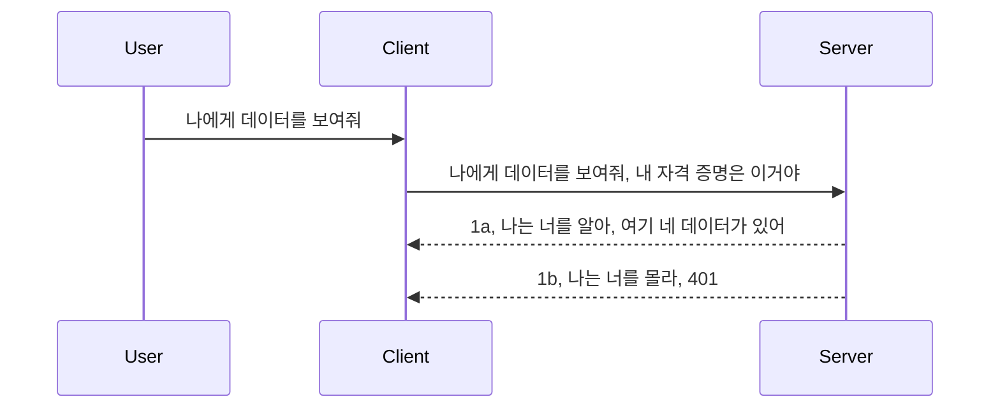

# 간단한 인증

MCP SDK는 OAuth 2.1 사용을 지원합니다. 솔직히 말해서 OAuth는 인증 서버, 리소스 서버, 자격 증명 제출, 코드 획득, 코드로부터 베어러 토큰 교환, 결국 리소스 데이터를 받는 과정 등 꽤 복잡한 개념을 포함하는 과정입니다. OAuth 사용에 익숙하지 않은 경우, 기본 수준의 인증부터 시작해 점차 더 나은 보안으로 구축하는 것이 좋습니다. 이 챕터가 존재하는 이유도 바로 더 발전된 인증으로 여러분을 이끌기 위해서입니다.

## 인증이란 무엇인가?

인증은 인증(authentication)과 권한 부여(authorization)의 약자입니다. 우리는 두 가지를 수행해야 합니다:

- **인증(Authentication)**: 사람이 우리 집에 들어올 수 있는지, 즉 우리가 보유한 MCP 서버 기능이 실행되는 리소스 서버에 접근할 권한이 있는지 확인하는 과정입니다.
- **권한 부여(Authorization)**: 사용자가 요청하는 특정 리소스 예를 들어 주문, 상품 등에 접근할 수 있는지, 혹은 읽기만 가능하고 삭제는 불가능한 경우인지 등을 판별하는 과정입니다.

## 자격 증명: 시스템에 우리가 누구인지 알리는 방법

대부분의 웹 개발자는 서버에 자격 증명, 보통은 인증을 위해 허용 여부를 나타내는 비밀 정보를 제공하는 방식으로 생각합니다. 이 자격 증명은 일반적으로 사용자 이름과 비밀번호의 base64 인코딩 버전이거나 특정 사용자를 고유하게 식별하는 API 키입니다.

이것은 보통 다음과 같이 "Authorization"라는 헤더를 통해 전송됩니다:

```json
{ "Authorization": "secret123" }
```

이것을 보통 기본 인증(basic authentication)이라고 부릅니다. 전체 흐름은 다음과 같습니다:


흐름을 이해했으니, 어떻게 구현할까요? 대부분의 웹 서버는 미들웨어라는 개념이 있는데, 이는 요청 과정 중 실행되어 자격 증명을 확인하고, 해당 자격 증명이 유효하면 요청을 통과시키는 코드 조각입니다. 만약 유효하지 않으면 인증 오류를 반환합니다. 구현 예시는 다음과 같습니다:

**Python**

```python
class AuthMiddleware(BaseHTTPMiddleware):
    async def dispatch(self, request, call_next):

        has_header = request.headers.get("Authorization")
        if not has_header:
            print("-> Missing Authorization header!")
            return Response(status_code=401, content="Unauthorized")

        if not valid_token(has_header):
            print("-> Invalid token!")
            return Response(status_code=403, content="Forbidden")

        print("Valid token, proceeding...")
       
        response = await call_next(request)
        # 응답에서 고객 헤더를 추가하거나 어떤 방식으로든 변경하십시오
        return response


starlette_app.add_middleware(CustomHeaderMiddleware)
```

여기서:

- `AuthMiddleware`라는 미들웨어를 만들었으며, 웹 서버가 `dispatch` 메서드를 호출합니다.
- 웹 서버에 미들웨어를 추가했습니다:

    ```python
    starlette_app.add_middleware(AuthMiddleware)
    ```

- Authorization 헤더가 있는지 그리고 전송된 비밀이 유효한지 검사하는 검증 로직을 작성했습니다:

    ```python
    has_header = request.headers.get("Authorization")
    if not has_header:
        print("-> Missing Authorization header!")
        return Response(status_code=401, content="Unauthorized")

    if not valid_token(has_header):
        print("-> Invalid token!")
        return Response(status_code=403, content="Forbidden")
    ```

비밀이 존재하고 유효한 경우, `call_next`를 호출해 요청을 통과시키고 응답을 반환합니다.

    ```python
    response = await call_next(request)
    # 응답에 고객 헤더를 추가하거나 어떤 방식으로든 변경합니다
    return response
    ```

작동 방식은 클라이언트가 서버에 웹 요청을 수행하면 미들웨어가 호출되고, 구현된 대로 요청을 통과시키거나 클라이언트가 진행할 수 없음을 나타내는 오류를 반환합니다.

**TypeScript**

Express라는 인기 프레임워크에서 미들웨어를 만들어 MCP 서버에 도달하기 전에 요청을 가로챕니다. 코드 예시는 다음과 같습니다:

```typescript
function isValid(secret) {
    return secret === "secret123";
}

app.use((req, res, next) => {
    // 1. 권한 부여 헤더가 있습니까?
    if(!req.headers["Authorization"]) {
        res.status(401).send('Unauthorized');
    }
    
    let token = req.headers["Authorization"];

    // 2. 유효성 확인.
    if(!isValid(token)) {
        res.status(403).send('Forbidden');
    }

   
    console.log('Middleware executed');
    // 3. 요청 파이프라인의 다음 단계로 요청을 전달합니다.
    next();
});
```

코드에서:

1. 우선 Authorization 헤더가 있는지 확인, 없으면 401 오류를 전송합니다.
2. 자격 증명 또는 토큰이 유효한지 확인, 아니라면 403 오류를 전송합니다.
3. 마지막으로 요청 파이프라인에서 요청을 전달하고 요청된 리소스를 반환합니다.

## 연습: 인증 구현하기

지금까지 배운 내용을 바탕으로 구현을 시도해봅시다. 계획은 다음과 같습니다:

서버

- 웹 서버와 MCP 인스턴스 생성.
- 서버용 미들웨어 구현.

클라이언트 

- 헤더를 통해 자격 증명과 함께 웹 요청 전송.

### -1- 웹 서버와 MCP 인스턴스 생성

첫 번째 단계로 웹 서버 인스턴스와 MCP 서버를 생성해야 합니다.

**Python**

MCP 서버 인스턴스를 만들고 starlette 웹 앱을 생성한 다음 uvicorn으로 호스팅합니다.

```python
# MCP 서버 생성 중

app = FastMCP(
    name="MCP Resource Server",
    instructions="Resource Server that validates tokens via Authorization Server introspection",
    host=settings["host"],
    port=settings["port"],
    debug=True
)

# starlette 웹 앱 생성 중
starlette_app = app.streamable_http_app()

# uvicorn을 통해 앱 제공 중
async def run(starlette_app):
    import uvicorn
    config = uvicorn.Config(
            starlette_app,
            host=app.settings.host,
            port=app.settings.port,
            log_level=app.settings.log_level.lower(),
        )
    server = uvicorn.Server(config)
    await server.serve()

run(starlette_app)
```

이 코드에서는:

- MCP 서버를 생성합니다.
- MCP 서버에서 `app.streamable_http_app()`을 통해 starlette 웹 앱을 구성합니다.
- uvicorn `server.serve()`로 웹 앱을 호스팅합니다.

**TypeScript**

MCP 서버 인스턴스를 생성합니다.

```typescript
const server = new McpServer({
      name: "example-server",
      version: "1.0.0"
    });

    // ... 서버 리소스, 도구 및 프롬프트 설정 ...
```

MCP 서버 생성은 POST /mcp 라우트 정의 내부에서 수행해야 하므로 위 코드를 이동해 이렇게 만듭니다:

```typescript
import express from "express";
import { randomUUID } from "node:crypto";
import { McpServer } from "@modelcontextprotocol/sdk/server/mcp.js";
import { StreamableHTTPServerTransport } from "@modelcontextprotocol/sdk/server/streamableHttp.js";
import { isInitializeRequest } from "@modelcontextprotocol/sdk/types.js"

const app = express();
app.use(express.json());

// 세션 ID별 전송을 저장하는 맵
const transports: { [sessionId: string]: StreamableHTTPServerTransport } = {};

// 클라이언트에서 서버로의 통신을 위한 POST 요청 처리
app.post('/mcp', async (req, res) => {
  // 기존 세션 ID 확인
  const sessionId = req.headers['mcp-session-id'] as string | undefined;
  let transport: StreamableHTTPServerTransport;

  if (sessionId && transports[sessionId]) {
    // 기존 전송 재사용
    transport = transports[sessionId];
  } else if (!sessionId && isInitializeRequest(req.body)) {
    // 새로운 초기화 요청
    transport = new StreamableHTTPServerTransport({
      sessionIdGenerator: () => randomUUID(),
      onsessioninitialized: (sessionId) => {
        // 세션 ID별 전송 저장
        transports[sessionId] = transport;
      },
      // DNS 리바인딩 보호는 이전 호환성을 위해 기본적으로 비활성화 되어 있습니다. 서버를
      // 로컬에서 실행하는 경우, 다음을 설정해야 합니다:
      // enableDnsRebindingProtection: true,
      // allowedHosts: ['127.0.0.1'],
    });

    // 닫힐 때 전송 정리
    transport.onclose = () => {
      if (transport.sessionId) {
        delete transports[transport.sessionId];
      }
    };
    const server = new McpServer({
      name: "example-server",
      version: "1.0.0"
    });

    // ... 서버 자원, 도구 및 프롬프트 설정 ...

    // MCP 서버에 연결
    await server.connect(transport);
  } else {
    // 잘못된 요청
    res.status(400).json({
      jsonrpc: '2.0',
      error: {
        code: -32000,
        message: 'Bad Request: No valid session ID provided',
      },
      id: null,
    });
    return;
  }

  // 요청 처리
  await transport.handleRequest(req, res, req.body);
});

// GET 및 DELETE 요청을 위한 재사용 가능 핸들러
const handleSessionRequest = async (req: express.Request, res: express.Response) => {
  const sessionId = req.headers['mcp-session-id'] as string | undefined;
  if (!sessionId || !transports[sessionId]) {
    res.status(400).send('Invalid or missing session ID');
    return;
  }
  
  const transport = transports[sessionId];
  await transport.handleRequest(req, res);
};

// SSE를 통한 서버-클라이언트 알림용 GET 요청 처리
app.get('/mcp', handleSessionRequest);

// 세션 종료를 위한 DELETE 요청 처리
app.delete('/mcp', handleSessionRequest);

app.listen(3000);
```

이제 MCP 서버 생성이 `app.post("/mcp")` 내부로 이동한 것을 볼 수 있습니다.

다음은 들어오는 자격 증명을 검증할 미들웨어를 만드는 단계입니다.

### -2- 서버용 미들웨어 구현

미들웨어 부분으로 넘어갑니다. 여기서 `Authorization` 헤더 내의 자격 증명을 찾고 검증하는 미들웨어를 만듭니다. 허용할 만하면 요청이 리소스를 처리하도록 진행됩니다(예: 도구 목록 조회, 리소스 읽기 또는 MCP 기능 요청).

**Python**

미들웨어 생성은 `BaseHTTPMiddleware`를 상속하여 클래스를 작성해야 합니다. 중요한 부분 두 가지:

- 요청 객체 `request`, 헤더 정보를 읽습니다.
- `call_next`, 클라이언트가 허용하는 자격 증명을 제출했으면 호출할 콜백입니다.

먼저 `Authorization` 헤더가 없을 경우를 처리합니다:

```python
has_header = request.headers.get("Authorization")

# 헤더가 없으면 401 에러 반환, 그렇지 않으면 계속 진행.
if not has_header:
    print("-> Missing Authorization header!")
    return Response(status_code=401, content="Unauthorized")
```

인증 실패 시 401 권한 없음 메시지를 반환합니다.

자격 증명이 제출되었으면 다음과 같이 유효성을 검사합니다:

```python
 if not valid_token(has_header):
    print("-> Invalid token!")
    return Response(status_code=403, content="Forbidden")
```

여기서 403 금지 메시지를 반환하는 부분을 볼 수 있습니다. 아래는 위 내용을 모두 구현한 미들웨어 전체 코드입니다:

```python
class AuthMiddleware(BaseHTTPMiddleware):
    async def dispatch(self, request, call_next):

        has_header = request.headers.get("Authorization")
        if not has_header:
            print("-> Missing Authorization header!")
            return Response(status_code=401, content="Unauthorized")

        if not valid_token(has_header):
            print("-> Invalid token!")
            return Response(status_code=403, content="Forbidden")

        print("Valid token, proceeding...")
        print(f"-> Received {request.method} {request.url}")
        response = await call_next(request)
        response.headers['Custom'] = 'Example'
        return response

```

좋습니다. `valid_token` 함수는 무엇인가요? 다음과 같습니다:

```python
# 프로덕션에는 사용하지 마세요 - 개선하세요 !!
def valid_token(token: str) -> bool:
    # "Bearer " 접두사를 제거하세요
    if token.startswith("Bearer "):
        token = token[7:]
        return token == "secret-token"
    return False
```

물론 개선할 여지가 있습니다.

중요: 이런 비밀을 코드에 직접 포함시키면 절대 안 됩니다. 비교할 값을 데이터 소스나 IDP(Identity Provider)에서 가져오거나, 더 나아가 IDP가 검증을 담당하도록 해야 합니다.

**TypeScript**

Express에서는 `use` 메서드에 미들웨어 함수를 전달하여 구현합니다.

해야 할 일:

- 요청 객체의 `Authorization` 속성에서 자격 증명을 확인.
- 자격 증명 검증 후 유효하면 요청을 계속 진행하게 하여 MCP 요청을 처리(예: 도구 목록 조회, 리소스 읽기 등).

헤더가 없으면 요청 진행을 중단합니다:

```typescript
if(!req.headers["authorization"]) {
    res.status(401).send('Unauthorized');
    return;
}
```

처음부터 헤더가 없으면 401 에러가 발생합니다.

다음으로 자격 증명이 유효한지 확인하고 아니라면 다른 메시지와 함께 중단합니다:

```typescript
if(!isValid(token)) {
    res.status(403).send('Forbidden');
    return;
} 
```

이번에는 403 에러가 발생하는 모습을 볼 수 있습니다.

전체 코드는 다음과 같습니다:

```typescript
app.use((req, res, next) => {
    console.log('Request received:', req.method, req.url, req.headers);
    console.log('Headers:', req.headers["authorization"]);
    if(!req.headers["authorization"]) {
        res.status(401).send('Unauthorized');
        return;
    }
    
    let token = req.headers["authorization"];

    if(!isValid(token)) {
        res.status(403).send('Forbidden');
        return;
    }  

    console.log('Middleware executed');
    next();
});
```

웹 서버에 미들웨어를 설정해 클라이언트가 전달하기를 기대하는 자격 증명을 검사합니다. 그렇다면 클라이언트는 어떻게 해야 할까요?

### -3- 헤더를 통해 자격 증명과 함께 웹 요청 전송

클라이언트가 헤더를 통해 자격 증명을 전달하는지 확인해야 합니다. MCP 클라이언트를 사용하므로 방법을 알아봅시다.

**Python**

클라이언트는 자격 증명 헤더를 다음과 같이 전달해야 합니다:

```python
# 값을 하드코딩하지 말고 최소한 환경 변수나 더 안전한 저장소에 보관하세요
token = "secret-token"

async with streamablehttp_client(
        url = f"http://localhost:{port}/mcp",
        headers = {"Authorization": f"Bearer {token}"}
    ) as (
        read_stream,
        write_stream,
        session_callback,
    ):
        async with ClientSession(
            read_stream,
            write_stream
        ) as session:
            await session.initialize()
      
            # TODO, 클라이언트에서 수행하고 싶은 작업, 예: 도구 목록 작성, 도구 호출 등
```

여기서 `headers = {"Authorization": f"Bearer {token}"}` 처럼 `headers` 속성을 채웁니다.

**TypeScript**

두 단계로 접근합니다:

1. 자격 증명이 담긴 구성 객체를 만듭니다.
2. 이 구성 객체를 전송층에 전달합니다.

```typescript

// 여기와 같이 값을 하드코딩하지 마세요. 최소한 환경 변수로 두고 개발 모드에서는 dotenv 같은 것을 사용하세요.
let token = "secret123"

// 클라이언트 전송 옵션 객체 정의
let options: StreamableHTTPClientTransportOptions = {
  sessionId: sessionId,
  requestInit: {
    headers: {
      "Authorization": "secret123"
    }
  }
};

// 옵션 객체를 전송에 전달하세요
async function main() {
   const transport = new StreamableHTTPClientTransport(
      new URL(serverUrl),
      options
   );
```

위 코드처럼 `options` 객체를 만들어 헤더를 `requestInit` 속성 아래에 둡니다.

중요: 여기서 어떻게 개선할까요? 현재 구현은 문제가 있습니다. 우선 HTTPS 없이는 매우 위험합니다. 설령 HTTPS라도 자격 증명 탈취 위험이 있습니다. 그래서 토큰을 쉽게 폐기할 수 있고, 요청 위치, 빈도(봇 행동 여부) 등 추가 검증이 가능한 시스템이 필요합니다.

하지만 단순 인증만 필요하고 인증되지 않은 누군가가 API를 호출하지 못하도록 하는 간단한 API에 있어서는 꽤 좋은 시작점입니다.

이를 바탕으로 보안 강화를 위해 JWT(JSON Web Token)라는 표준 형식을 사용해봅시다.

## JSON 웹 토큰, JWT

기존 단순 자격 증명에서 개선하려 합니다. JWT를 사용하면 얻는 즉각적인 이점은?

- **보안 향상**. 기본 인증은 사용자명과 비밀번호를 base64로 인코딩한 토큰(또는 API 키)를 계속 전송하는 위험이 있습니다. JWT는 사용자명과 비밀번호를 초기 전송 후 토큰을 받고, 이 토큰은 시간 제한(만료)도 있습니다. 세밀한 접근 제어(역할, 범위, 권한)도 쉽게 가능합니다.
- **무상태성 및 확장성**. JWT는 자체 포함 정보로 사용자 정보를 담아 서버 측 세션 저장소 필요를 없앱니다. 토큰은 로컬에서 검증 가능.
- **상호 운용성 및 페더레이션**. JWT는 OpenID Connect 핵심이며 Entra ID, Google Identity, Auth0 같은 알려진 신원 공급자와 함께 사용됩니다. 싱글 사인온 등 엔터프라이즈급 기능을 지원합니다.
- **모듈성 및 유연성**. Azure API Management, NGINX 같은 API 게이트웨이와도 사용 가능하며, 인증 시나리오와 서버 간 통신(대리 및 위임 시나리오)도 지원합니다.
- **성능 및 캐싱**. JWT는 디코딩 후 캐시 가능하여 파싱 부담을 줄입니다. 고트래픽 앱에서 처리량을 향상시키고 인프라 부하를 완화합니다.
- **고급 기능**. 서버에서 검증하는 인트로스펙션 및 토큰 무효화 기능도 지원합니다.

이 모든 이점을 바탕으로 구현을 한 단계 업그레이드합시다.

## 기본 인증을 JWT로 전환하기

전반적 변경 사항은 다음과 같습니다:

- **JWT 토큰 생성법 학습** 및 클라이언트에서 서버로 전송 준비.
- **JWT 토큰 검증** 및 유효하다면 자원 제공.
- **토큰 안전 저장** 방법.
- **라우트 보호** MCP 기능별 라우트 보호.
- **리프레시 토큰 도입** 짧은 수명 토큰과 만료 시 새 토큰 획득용 긴 수명 리프레시 토큰, 리프레시 엔드포인트와 회전 전략 구현.

### -1- JWT 토큰 생성

JWT 토큰은 다음 구성요소로 이뤄집니다:

- **헤더**: 사용 알고리즘과 토큰 타입.
- **페이로드**: sub(토큰이 대표하는 사용자/주체, 보통 사용자 ID), exp(만료시간), role(권한) 등의 클레임.
- **서명**: 비밀키나 개인키로 서명.

헤더, 페이로드, 인코딩된 토큰을 생성해야 합니다.

**Python**

```python

import jwt
import jwt
from jwt.exceptions import ExpiredSignatureError, InvalidTokenError
import datetime

# JWT 서명에 사용되는 비밀 키
secret_key = 'your-secret-key'

header = {
    "alg": "HS256",
    "typ": "JWT"
}

# 사용자 정보 및 클레임과 만료 시간
payload = {
    "sub": "1234567890",               # 주체 (사용자 ID)
    "name": "User Userson",                # 사용자 정의 클레임
    "admin": True,                     # 사용자 정의 클레임
    "iat": datetime.datetime.utcnow(),# 발급 시각
    "exp": datetime.datetime.utcnow() + datetime.timedelta(hours=1)  # 만료 시각
}

# 인코딩하기
encoded_jwt = jwt.encode(payload, secret_key, algorithm="HS256", headers=header)
```

위 코드에서는:

- HS256 알고리즘과 JWT를 타입으로 하는 헤더 정의.
- 주체 혹은 사용자 ID, 사용자명, 역할, 발행 시각, 만료 시각을 포함하는 페이로드 생성. 만료 시각 반영으로 시간 제한 기능 구현.

**TypeScript**

JWT 토큰 생성에 필요한 의존성을 추가합니다.

```sh

npm install jsonwebtoken
npm install --save-dev @types/jsonwebtoken
```

이제 헤더와 페이로드를 만들고 인코딩 토큰을 생성합니다.

```typescript
import jwt from 'jsonwebtoken';

const secretKey = 'your-secret-key'; // 운영 환경에서 환경 변수를 사용하십시오

// 페이로드를 정의하십시오
const payload = {
  sub: '1234567890',
  name: 'User usersson',
  admin: true,
  iat: Math.floor(Date.now() / 1000), // 발급 시각
  exp: Math.floor(Date.now() / 1000) + 60 * 60 // 1시간 후 만료
};

// 헤더 정의 (선택 사항, jsonwebtoken이 기본값 설정)
const header = {
  alg: 'HS256',
  typ: 'JWT'
};

// 토큰 생성
const token = jwt.sign(payload, secretKey, {
  algorithm: 'HS256',
  header: header
});

console.log('JWT:', token);
```

이 토큰은:

HS256으로 서명
1시간 유효
sub, name, admin, iat, exp 같은 클레임 포함

### -2- 토큰 검증

서버에서 클라이언트가 보낸 토큰이 유효한지 검증해야 합니다. 구조와 유효성 확인을 포함하여 여러 검증을 수행해야 합니다. 사용자 존재 여부 등 추가 검증도 권장됩니다.

토큰을 디코딩하여 내용 확인, 검증을 시작합니다.

**Python**

```python

# JWT를 디코드하고 검증합니다
try:
    decoded = jwt.decode(token, secret_key, algorithms=["HS256"])
    print("✅ Token is valid.")
    print("Decoded claims:")
    for key, value in decoded.items():
        print(f"  {key}: {value}")
except ExpiredSignatureError:
    print("❌ Token has expired.")
except InvalidTokenError as e:
    print(f"❌ Invalid token: {e}")

```

`jwt.decode`를 호출해 토큰, 비밀키, 알고리즘으로 디코드합니다. 실패 시 오류가 발생하므로 try-catch 구문 사용.

**TypeScript**

`jwt.verify` 호출로 디코딩된 토큰을 얻고 검증합니다. 실패 시 구조가 틀렸거나 토큰이 만료된 상태입니다.

```typescript

try {
  const decoded = jwt.verify(token, secretKey);
  console.log('Decoded Payload:', decoded);
} catch (err) {
  console.error('Token verification failed:', err);
}
```

참고: 앞서 언급한 것처럼 추가 검증을 수행해 이 토큰이 우리 시스템의 사용자를 가리키는지, 권한이 적합한지 확인해야 합니다.
다음으로 역할 기반 접근 제어, 즉 RBAC에 대해 살펴보겠습니다.

## 역할 기반 접근 제어 추가

다양한 역할이 서로 다른 권한을 가지도록 표현하고자 합니다. 예를 들어, 관리자는 모든 작업을 할 수 있고, 일반 사용자는 읽기/쓰기를 할 수 있으며, 게스트는 읽기만 할 수 있다고 가정해 보겠습니다. 따라서 가능한 권한 수준은 다음과 같습니다:

- Admin.Write 
- User.Read
- Guest.Read

이제 미들웨어로 이러한 제어를 구현하는 방법을 살펴보겠습니다. 미들웨어는 각각의 경로별로 추가할 수도 있고, 모든 경로에 대해 추가할 수도 있습니다.

**Python**

```python
from starlette.middleware.base import BaseHTTPMiddleware
from starlette.responses import JSONResponse
import jwt

# 비밀을 코드에 직접 넣지 마세요. 이것은 시연 목적으로만 사용됩니다. 안전한 장소에서 읽으세요.
SECRET_KEY = "your-secret-key" # 이것을 환경 변수에 넣으세요
REQUIRED_PERMISSION = "User.Read"

class JWTPermissionMiddleware(BaseHTTPMiddleware):
    async def dispatch(self, request, call_next):
        auth_header = request.headers.get("Authorization")
        if not auth_header or not auth_header.startswith("Bearer "):
            return JSONResponse({"error": "Missing or invalid Authorization header"}, status_code=401)

        token = auth_header.split(" ")[1]
        try:
            decoded = jwt.decode(token, SECRET_KEY, algorithms=["HS256"])
        except jwt.ExpiredSignatureError:
            return JSONResponse({"error": "Token expired"}, status_code=401)
        except jwt.InvalidTokenError:
            return JSONResponse({"error": "Invalid token"}, status_code=401)

        permissions = decoded.get("permissions", [])
        if REQUIRED_PERMISSION not in permissions:
            return JSONResponse({"error": "Permission denied"}, status_code=403)

        request.state.user = decoded
        return await call_next(request)


```

다음과 같이 미들웨어를 추가하는 몇 가지 방법이 있습니다:

```python

# 대안 1: starlette 앱을 구성하는 동안 미들웨어 추가
middleware = [
    Middleware(JWTPermissionMiddleware)
]

app = Starlette(routes=routes, middleware=middleware)

# 대안 2: starlette 앱이 이미 구성된 후에 미들웨어 추가
starlette_app.add_middleware(JWTPermissionMiddleware)

# 대안 3: 라우트별로 미들웨어 추가
routes = [
    Route(
        "/mcp",
        endpoint=..., # 핸들러
        middleware=[Middleware(JWTPermissionMiddleware)]
    )
]
```

**TypeScript**

`app.use`와 모든 요청에 대해 실행되는 미들웨어를 사용할 수 있습니다. 

```typescript
app.use((req, res, next) => {
    console.log('Request received:', req.method, req.url, req.headers);
    console.log('Headers:', req.headers["authorization"]);

    // 1. 인증 헤더가 전송되었는지 확인합니다

    if(!req.headers["authorization"]) {
        res.status(401).send('Unauthorized');
        return;
    }
    
    let token = req.headers["authorization"];

    // 2. 토큰이 유효한지 확인합니다
    if(!isValid(token)) {
        res.status(403).send('Forbidden');
        return;
    }  

    // 3. 토큰 사용자가 우리 시스템에 존재하는지 확인합니다
    if(!isExistingUser(token)) {
        res.status(403).send('Forbidden');
        console.log("User does not exist");
        return;
    }
    console.log("User exists");

    // 4. 토큰이 올바른 권한을 가지고 있는지 검증합니다
    if(!hasScopes(token, ["User.Read"])){
        res.status(403).send('Forbidden - insufficient scopes');
    }

    console.log("User has required scopes");

    console.log('Middleware executed');
    next();
});

```

미들웨어가 수행할 수 있고, 수행해야 하는 몇 가지 중요한 작업은 다음과 같습니다:

1. 인증 헤더가 존재하는지 확인
2. 토큰이 유효한지 확인, `isValid` 메서드를 호출하는데, 이 메서드는 JWT 토큰의 무결성과 유효성을 검사하도록 직접 작성한 함수입니다.
3. 시스템에 사용자가 존재하는지 검증, 반드시 확인해야 합니다.

   ```typescript
    // DB의 사용자들
   const users = [
     "user1",
     "User usersson",
   ]

   function isExistingUser(token) {
     let decodedToken = verifyToken(token);

     // TODO, 사용자가 DB에 존재하는지 확인하세요
     return users.includes(decodedToken?.name || "");
   }
   ```

   위에서는 매우 간단한 `users` 리스트를 생성했지만, 실제로는 데이터베이스에 있어야 합니다.

4. 추가로, 토큰이 올바른 권한을 가지고 있는지도 확인해야 합니다.

   ```typescript
   if(!hasScopes(token, ["User.Read"])){
        res.status(403).send('Forbidden - insufficient scopes');
   }
   ```

   위 미들웨어 코드에서는 토큰에 User.Read 권한이 포함되어 있는지 확인하며, 없으면 403 에러를 반환합니다. 아래는 `hasScopes` 헬퍼 메서드입니다.

   ```typescript
   function hasScopes(scope: string, requiredScopes: string[]) {
     let decodedToken = verifyToken(scope);
    return requiredScopes.every(scope => decodedToken?.scopes.includes(scope));
  }
   ```

Have a think which additional checks you should be doing, but these are the absolute minimum of checks you should be doing.

Using Express as a web framework is a common choice. There are helpers library when you use JWT so you can write less code.

- `express-jwt`, helper library that provides a middleware that helps decode your token.
- `express-jwt-permissions`, this provides a middleware `guard` that helps check if a certain permission is on the token.

Here's what these libraries can look like when used:

```typescript
const express = require('express');
const jwt = require('express-jwt');
const guard = require('express-jwt-permissions')();

const app = express();
const secretKey = 'your-secret-key'; // put this in env variable

// Decode JWT and attach to req.user
app.use(jwt({ secret: secretKey, algorithms: ['HS256'] }));

// Check for User.Read permission
app.use(guard.check('User.Read'));

// multiple permissions
// app.use(guard.check(['User.Read', 'Admin.Access']));

app.get('/protected', (req, res) => {
  res.json({ message: `Welcome ${req.user.name}` });
});

// Error handler
app.use((err, req, res, next) => {
  if (err.code === 'permission_denied') {
    return res.status(403).send('Forbidden');
  }
  next(err);
});

```

지금까지 미들웨어를 사용하여 인증과 권한 부여를 모두 처리하는 방법을 보았습니다. 그렇다면 MCP는 어떨까요, 인증 방식에 변화를 주나요? 다음 섹션에서 알아보겠습니다.

### -3- MCP에 RBAC 추가

지금까지 미들웨어를 통해 RBAC를 추가하는 방법을 보았지만, MCP의 경우 기능별 RBAC를 쉽게 추가하는 방법이 없습니다. 그래서 어떻게 해야 할까요? 간단히 말해, 클라이언트가 특정 툴을 호출할 권한이 있는지를 확인하는 코드를 넣으면 됩니다:

기능별 RBAC를 구현하는 방법에는 여러 가지 선택지가 있습니다:

- 권한 수준을 확인해야 하는 각 툴, 리소스, 프롬프트에 대해 권한 검사를 추가합니다.

   **python**

   ```python
   @tool()
   def delete_product(id: int):
      try:
          check_permissions(role="Admin.Write", request)
      catch:
        pass # 클라이언트 인증 실패, 인증 오류 발생
   ```

   **typescript**

   ```typescript
   server.registerTool(
    "delete-product",
    {
      title: Delete a product",
      description: "Deletes a product",
      inputSchema: { id: z.number() }
    },
    async ({ id }) => {
      
      try {
        checkPermissions("Admin.Write", request);
        // 할 일, id를 productService와 remote entry로 전송하기
      } catch(Exception e) {
        console.log("Authorization error, you're not allowed");  
      }

      return {
        content: [{ type: "text", text: `Deletected product with id ${id}` }]
      };
    }
   );
   ```


- 고급 서버 방식을 사용하고 요청 핸들러에 검사 코드를 집중하여 검사해야 할 위치를 최소화합니다.

   **Python**

   ```python
   
   tool_permission = {
      "create_product": ["User.Write", "Admin.Write"],
      "delete_product": ["Admin.Write"]
   }

   def has_permission(user_permissions, required_permissions) -> bool:
      # user_permissions: 사용자가 가진 권한 목록
      # required_permissions: 도구에 필요한 권한 목록
      return any(perm in user_permissions for perm in required_permissions)

   @server.call_tool()
   async def handle_call_tool(
     name: str, arguments: dict[str, str] | None
   ) -> list[types.TextContent]:
    # request.user.permissions은 사용자의 권한 목록이라고 가정
     user_permissions = request.user.permissions
     required_permissions = tool_permission.get(name, [])
     if not has_permission(user_permissions, required_permissions):
        # "도구 {name}을 호출할 권한이 없습니다" 오류 발생
        raise Exception(f"You don't have permission to call tool {name}")
     # 계속 진행하여 도구 호출
     # ...
   ```   
   

   **TypeScript**

   ```typescript
   function hasPermission(userPermissions: string[], requiredPermissions: string[]): boolean {
       if (!Array.isArray(userPermissions) || !Array.isArray(requiredPermissions)) return false;
       // 사용자가 적어도 하나 이상의 필수 권한을 가지고 있으면 true를 반환합니다
       
       return requiredPermissions.some(perm => userPermissions.includes(perm));
   }
  
   server.setRequestHandler(CallToolRequestSchema, async (request) => {
      const { params: { name } } = request;
  
      let permissions = request.user.permissions;
  
      if (!hasPermission(permissions, toolPermissions[name])) {
         return new Error(`You don't have permission to call ${name}`);
      }
  
      // 계속 진행하세요..
   });
   ```

   참고로, 위 코드가 간단해지려면 미들웨어가 요청 객체의 user 속성에 디코딩된 토큰을 할당해야 합니다.

### 요약

이제 RBAC를 일반적으로 그리고 MCP에 대해 지원하는 방법을 논의했으니, 직접 보안을 구현해 보면서 개념을 제대로 이해했는지 확인할 시간입니다.

## 과제 1: 기본 인증을 사용하여 mcp 서버와 mcp 클라이언트 구축

여기서는 HTTP 헤더를 통해 자격 증명을 전송하는 방법을 배웁니다.

## 솔루션 1

[Solution 1](./code/basic/README.md)

## 과제 2: 과제 1의 솔루션을 JWT 사용으로 업그레이드

첫 번째 솔루션을 사용하지만, 이번에는 개선해 봅시다.

기본 인증 대신 JWT를 사용합니다.

## 솔루션 2

[Solution 2](./solution/jwt-solution/README.md)

## 도전 과제

"Add RBAC to MCP" 섹션에서 설명한 대로 도구별 RBAC를 추가해 보십시오.

## 요약

이번 장에서 보안을 전혀 적용하지 않는 것부터 기본 보안, JWT, 그리고 MCP에 JWT를 추가하는 방법까지 많은 것을 배웠길 바랍니다.

우리는 커스텀 JWT로 탄탄한 기반을 구축했지만, 규모가 커지면서 표준 기반의 신원 모델로 이동하고 있습니다. Entra나 Keycloak 같은 IdP를 도입하면 토큰 발급, 검증, 수명 주기 관리를 신뢰할 수 있는 플랫폼에 위임할 수 있어, 애플리케이션 로직과 사용자 경험에 집중할 수 있습니다.

이를 위해 더 심화된 [Entra 장](../../05-AdvancedTopics/mcp-security-entra/README.md)도 준비되어 있습니다.

## 다음 단계

- 다음: [MCP 호스트 설정](../12-mcp-hosts/README.md)

---

<!-- CO-OP TRANSLATOR DISCLAIMER START -->
**면책 조항**:  
이 문서는 AI 번역 서비스 [Co-op Translator](https://github.com/Azure/co-op-translator)를 사용하여 번역되었습니다. 정확성을 위해 최선을 다하고 있지만, 자동 번역에는 오류나 부정확성이 있을 수 있음을 양해해 주시기 바랍니다. 원본 문서는 해당 언어의 원본 문서를 권위 있는 자료로 간주해야 합니다. 중요한 정보에 대해서는 전문적인 인간 번역을 권장합니다. 이 번역의 사용으로 인해 발생하는 오해나 잘못된 해석에 대해 당사는 책임을 지지 않습니다.
<!-- CO-OP TRANSLATOR DISCLAIMER END -->