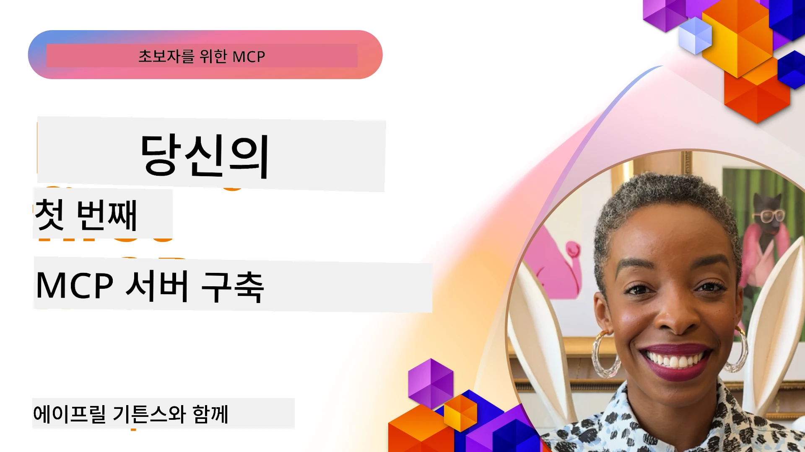

## 시작하기  

_(위 이미지를 클릭하면 이 수업의 영상을 볼 수 있습니다)_

이 섹션은 여러 개의 수업으로 구성되어 있습니다:

- **1 첫 번째 서버**, 이 첫 번째 수업에서는 첫 번째 서버를 만드는 방법과 검사 도구(inspector tool)를 사용하여 서버를 검사하는 방법을 배웁니다. 이는 서버를 테스트하고 디버그하는 데 유용한 방법입니다, [수업으로 가기](01-first-server/README.md)

- **2 클라이언트**, 이 수업에서는 서버에 연결할 수 있는 클라이언트를 작성하는 방법을 배웁니다, [수업으로 가기](02-client/README.md)

- **3 LLM이 포함된 클라이언트**, 클라이언트를 더 잘 작성하는 방법은 LLM을 추가하여 클라이언트가 서버와 협상하여 수행할 작업을 결정하도록 하는 것입니다, [수업으로 가기](03-llm-client/README.md)

- **4 Visual Studio Code에서 서버 GitHub Copilot 에이전트 모드 사용하기**. 여기서는 Visual Studio Code 내에서 MCP 서버를 실행하는 방법을 다룹니다, [수업으로 가기](04-vscode/README.md)

- **5 stdio 전송 서버** stdio 전송은 로컬 MCP 서버-클라이언트 통신에 권장되는 표준으로, 프로세스 격리가 내장된 안전한 서브프로세스 기반 통신을 제공합니다 [수업으로 가기](05-stdio-server/README.md)

- **6 MCP를 사용한 HTTP 스트리밍 (스트리밍 HTTP)**. 최신 HTTP 스트리밍 전송(원격 MCP 서버에 권장되는 접근법, [MCP 사양 2025-11-25](https://spec.modelcontextprotocol.io/specification/2025-11-25/basic/transports/#streamable-http) 참조), 진행 알림, 스트리머블 HTTP를 사용하여 확장 가능하고 실시간 MCP 서버와 클라이언트를 구현하는 방법을 배웁니다. [수업으로 가기](06-http-streaming/README.md)

- **7 VSCode용 AI 툴킷 활용하기** MCP 클라이언트와 서버를 소비하고 테스트하는 방법 [수업으로 가기](07-aitk/README.md)

- **8 테스트**. 이 수업에서는 다양한 방법으로 서버와 클라이언트를 테스트하는 방법에 중점을 둡니다, [수업으로 가기](08-testing/README.md)

- **9 배포**. 이 장에서는 MCP 솔루션 배포의 다양한 방법을 살펴봅니다, [수업으로 가기](09-deployment/README.md)

- **10 고급 서버 사용법**. 이 장은 고급 서버 사용법을 다룹니다, [수업으로 가기](./10-advanced/README.md)

- **11 인증**. 기본 인증에서 JWT 및 RBAC 사용에 이르기까지 간단한 인증 추가 방법을 다룹니다. 여기에서 시작하고 5장의 고급 주제를 살펴본 다음 2장의 권장 보안 강화 방법을 수행하는 것을 권장합니다, [수업으로 가기](./11-simple-auth/README.md)

- **12 MCP 호스트**. Claude Desktop, Cursor, Cline, Windsurf 등 인기 있는 MCP 호스트 클라이언트를 구성하고 사용합니다. 전송 유형과 문제 해결 방법을 배웁니다, [수업으로 가기](./12-mcp-hosts/README.md)

- **13 MCP 검사기**. MCP 검사기 도구를 사용하여 MCP 서버를 대화식으로 디버그하고 테스트합니다. 도구, 리소스 및 프로토콜 메시지 문제 해결 방법을 배웁니다, [수업으로 가기](./13-mcp-inspector/README.md)

Model Context Protocol (MCP)은 애플리케이션이 LLM에 컨텍스트를 제공하는 방식을 표준화한 오픈 프로토콜입니다. MCP는 AI 애플리케이션용 USB-C 포트처럼 생각할 수 있으며, AI 모델을 다양한 데이터 소스와 도구에 연결하는 표준화된 방법을 제공합니다.

## 학습 목표

이 수업이 끝나면 다음을 할 수 있습니다:

- C#, Java, Python, TypeScript, JavaScript 용 MCP 개발 환경 설정
- 맞춤 기능(리소스, 프롬프트, 도구)으로 기본 MCP 서버 구축 및 배포
- MCP 서버에 연결하는 호스트 애플리케이션 생성
- MCP 구현 테스트 및 디버깅
- 일반적인 설정 문제와 해결 방법 이해
- MCP 구현을 인기 있는 LLM 서비스에 연결

## MCP 환경 설정

MCP 작업을 시작하기 전에 개발 환경을 준비하고 기본 워크플로우를 이해하는 것이 중요합니다. 이 섹션에서는 MCP를 원활하게 시작할 수 있도록 초기 설정 단계를 안내합니다.

### 사전 준비 사항

MCP 개발을 시작하기 전에 다음을 갖추었는지 확인하세요:

- **개발 환경**: 선택한 언어(C#, Java, Python, TypeScript, 또는 JavaScript)용
- **IDE/편집기**: Visual Studio, Visual Studio Code, IntelliJ, Eclipse, PyCharm 또는 최신 코드 편집기
- **패키지 관리자**: NuGet, Maven/Gradle, pip, 또는 npm/yarn
- **API 키**: 호스트 애플리케이션에서 사용할 AI 서비스용 API 키

### 공식 SDK

앞으로 나올 장들에서는 Python, TypeScript, Java, .NET을 사용하여 구축한 솔루션을 볼 수 있습니다. 여기 공식 지원하는 SDK 전체 목록입니다.

MCP는 여러 언어용 공식 SDK를 제공합니다 ([MCP 사양 2025-11-25](https://spec.modelcontextprotocol.io/specification/2025-11-25/)에 맞춰): 
- [C# SDK](https://github.com/modelcontextprotocol/csharp-sdk) - Microsoft와 협력하여 관리
- [Java SDK](https://github.com/modelcontextprotocol/java-sdk) - Spring AI와 협력하여 관리
- [TypeScript SDK](https://github.com/modelcontextprotocol/typescript-sdk) - 공식 TypeScript 구현
- [Python SDK](https://github.com/modelcontextprotocol/python-sdk) - 공식 Python 구현(FastMCP)
- [Kotlin SDK](https://github.com/modelcontextprotocol/kotlin-sdk) - 공식 Kotlin 구현
- [Swift SDK](https://github.com/modelcontextprotocol/swift-sdk) - Loopwork AI와 협력하여 관리
- [Rust SDK](https://github.com/modelcontextprotocol/rust-sdk) - 공식 Rust 구현
- [Go SDK](https://github.com/modelcontextprotocol/go-sdk) - 공식 Go 구현

## 주요 내용 요약

- 언어별 SDK로 MCP 개발 환경 설정이 간단함
- 명확한 스키마와 함께 도구를 생성 및 등록하여 MCP 서버 구축
- MCP 클라이언트는 서버 및 모델에 연결되어 확장된 기능 활용
- 신뢰할 수 있는 MCP 구현을 위해 테스트와 디버깅 필수
- 배포 옵션은 로컬 개발부터 클라우드 솔루션까지 다양

## 연습하기

이 섹션의 모든 장의 연습 문제를 보완하는 샘플이 있습니다. 각 장에도 자체 연습 문제와 과제가 있습니다.

- [Java 계산기](./samples/java/calculator/README.md)
- [.Net 계산기](../../../03-GettingStarted/samples/csharp)
- [JavaScript 계산기](./samples/javascript/README.md)
- [TypeScript 계산기](./samples/typescript/README.md)
- [Python 계산기](../../../03-GettingStarted/samples/python)

## 추가 자료

- [Azure에서 Model Context Protocol을 사용해 에이전트 빌드하기](https://learn.microsoft.com/azure/developer/ai/intro-agents-mcp)
- [Azure Container Apps를 이용한 원격 MCP (Node.js/TypeScript/JavaScript)](https://learn.microsoft.com/samples/azure-samples/mcp-container-ts/mcp-container-ts/)
- [.NET OpenAI MCP 에이전트](https://learn.microsoft.com/samples/azure-samples/openai-mcp-agent-dotnet/openai-mcp-agent-dotnet/)

## 다음 단계

첫 번째 수업 시작하기: [첫 번째 MCP 서버 만들기](01-first-server/README.md)

이 모듈을 완료한 후 계속 진행: [모듈 4: 실무 구현](../04-PracticalImplementation/README.md)

---

<!-- CO-OP TRANSLATOR DISCLAIMER START -->
**면책 조항**:  
이 문서는 AI 번역 서비스 [Co-op Translator](https://github.com/Azure/co-op-translator)를 사용하여 번역되었습니다. 최대한 정확하게 번역하려 노력했으나, 자동 번역에는 오류나 부정확성이 포함될 수 있음을 알려드립니다. 원문 문서가 권위 있는 자료로 간주되어야 합니다. 중요한 정보의 경우에는 전문적인 사람 번역을 권장합니다. 본 번역 사용으로 인한 오해나 잘못된 해석에 대해 당사는 책임을 지지 않습니다.
<!-- CO-OP TRANSLATOR DISCLAIMER END -->