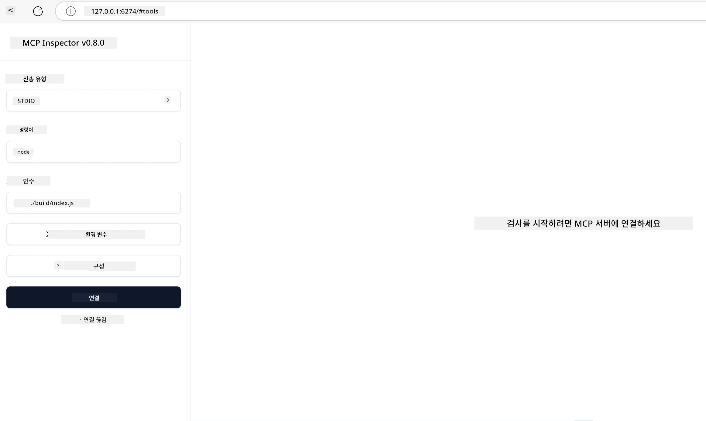

# 실용적 구현

[](https://youtu.be/vCN9-mKBDfQ)

_(위 이미지를 클릭하여 이 강의 영상 시청)_

실용적 구현은 모델 컨텍스트 프로토콜(MCP)의 힘이 구체화되는 부분입니다. MCP의 이론과 아키텍처를 이해하는 것도 중요하지만, 실제 가치를 발휘하는 것은 이 개념들을 적용하여 실제 문제를 해결하는 솔루션을 구축, 테스트 및 배포할 때입니다. 이 장에서는 개념적 지식과 실질적인 개발 간의 격차를 연결하며, MCP 기반 애플리케이션을 실현하는 과정을 안내합니다.

지능형 어시스턴트를 개발하든, 비즈니스 워크플로우에 AI를 통합하든, 데이터 처리용 맞춤 도구를 만들든, MCP는 유연한 기반을 제공합니다. 언어에 구애받지 않는 설계와 인기 프로그래밍 언어용 공식 SDK를 통해 다양한 개발자들이 손쉽게 접근할 수 있습니다. 이 SDK들을 활용하면 다양한 플랫폼과 환경에서 신속하게 프로토타입을 제작, 반복, 확장할 수 있습니다.

다음 섹션에서는 C#, Java with Spring, TypeScript, JavaScript, Python에서 MCP를 구현하는 방법을 보여주는 실용적인 예제, 샘플 코드, 배포 전략을 소개합니다. 또한 MCP 서버를 디버깅 및 테스트하고 API를 관리하며 Azure를 사용해 솔루션을 클라우드에 배포하는 방법도 배우게 됩니다. 이 실습 자료들은 학습 속도를 높이고 자신 있게 강건한 생산용 MCP 애플리케이션을 구축할 수 있도록 설계되었습니다.

## 개요

이 강의는 여러 프로그래밍 언어에 걸친 MCP 구현의 실용적 측면에 중점을 둡니다. C#, Java with Spring, TypeScript, JavaScript, Python에서 MCP SDK를 사용해 견고한 애플리케이션을 구축하고, MCP 서버를 디버그 및 테스트하며 재사용 가능한 리소스, 프롬프트, 도구를 만드는 방법을 살펴봅니다.

## 학습 목표

이 강의를 완료하면 다음을 할 수 있습니다:

- 다양한 프로그래밍 언어의 공식 SDK를 사용해 MCP 솔루션 구현하기
- 체계적으로 MCP 서버 디버깅 및 테스트하기
- 서버 기능(리소스, 프롬프트, 도구) 생성 및 사용하기
- 복잡한 작업을 위한 효과적인 MCP 워크플로우 설계하기
- 성능과 신뢰성을 위한 MCP 구현 최적화하기

## 공식 SDK 리소스

모델 컨텍스트 프로토콜은 여러 언어용 공식 SDK를 제공합니다 ([MCP Specification 2025-11-25](https://spec.modelcontextprotocol.io/specification/2025-11-25/)와 연동):

- [C# SDK](https://github.com/modelcontextprotocol/csharp-sdk)
- [Java with Spring SDK](https://github.com/modelcontextprotocol/java-sdk) **참고:** [Project Reactor](https://projectreactor.io) 의존성 필요. ([논의 이슈 246](https://github.com/orgs/modelcontextprotocol/discussions/246) 참조)
- [TypeScript SDK](https://github.com/modelcontextprotocol/typescript-sdk)
- [Python SDK](https://github.com/modelcontextprotocol/python-sdk)
- [Kotlin SDK](https://github.com/modelcontextprotocol/kotlin-sdk)
- [Go SDK](https://github.com/modelcontextprotocol/go-sdk)

## MCP SDK 사용법

이 섹션에서는 여러 프로그래밍 언어에 걸쳐 MCP를 구현한 실용적 예제를 제공합니다. `samples` 디렉터리에 언어별로 정리된 샘플 코드를 확인할 수 있습니다.

### 이용 가능한 샘플

저장소에는 다음 언어별 [샘플 구현](../../../04-PracticalImplementation/samples)이 포함되어 있습니다:

- [C#](./samples/csharp/README.md)
- [Java with Spring](./samples/java/containerapp/README.md)
- [TypeScript](./samples/typescript/README.md)
- [JavaScript](./samples/javascript/README.md)
- [Python](./samples/python/README.md)

각 샘플은 해당 언어 및 생태계에 맞는 핵심 MCP 개념과 구현 패턴을 보여줍니다.

### 실용 가이드

추가 실용 MCP 구현 가이드:

- [페이지네이션 및 대용량 결과 집합](./pagination/README.md) - 도구, 리소스 및 대규모 데이터셋용 커서 기반 페이지네이션 처리

## 핵심 서버 기능

MCP 서버는 다음 기능 중 임의 조합을 구현할 수 있습니다:

### 리소스

리소스는 사용자 또는 AI 모델이 사용할 맥락과 데이터를 제공합니다:

- 문서 저장소
- 지식 베이스
- 구조화된 데이터 소스
- 파일 시스템

### 프롬프트

프롬프트는 사용자용 템플릿화된 메시지 및 워크플로우입니다:

- 미리 정의된 대화 템플릿
- 안내된 상호작용 패턴
- 특수화된 대화 구조

### 도구

도구는 AI 모델이 실행할 기능들입니다:

- 데이터 처리 유틸리티
- 외부 API 통합
- 계산 기능
- 검색 기능

## 샘플 구현: C# 구현

공식 C# SDK 저장소에는 MCP의 여러 측면을 보여주는 샘플 구현들이 포함되어 있습니다:

- **기본 MCP 클라이언트**: MCP 클라이언트 생성 및 도구 호출 방법을 설명하는 간단한 예제
- **기본 MCP 서버**: 도구 기본 등록이 포함된 최소 서버 구현
- **고급 MCP 서버**: 도구 등록, 인증 및 오류 처리가 포함된 완전한 서버
- **ASP.NET 통합**: ASP.NET Core와 통합하는 예제
- **도구 구현 패턴**: 다양한 복잡성 수준의 도구 구현 패턴들

MCP C# SDK는 미리보기 상태이며 API가 변경될 수 있습니다. SDK 발전에 맞춰 이 블로그도 지속적으로 업데이트할 예정입니다.

### 주요 기능

- [C# MCP Nuget ModelContextProtocol](https://www.nuget.org/packages/ModelContextProtocol)
- [첫 MCP 서버 빌드하기](https://devblogs.microsoft.com/dotnet/build-a-model-context-protocol-mcp-server-in-csharp/)

완전한 C# 구현 샘플은 [공식 C# SDK 샘플 저장소](https://github.com/modelcontextprotocol/csharp-sdk)를 방문하세요.

## 샘플 구현: Java with Spring 구현

Java with Spring SDK는 엔터프라이즈급 기능과 함께 강력한 MCP 구현 옵션을 제공합니다.

### 주요 기능

- 스프링 프레임워크 통합
- 강력한 타입 안전성
- 반응형 프로그래밍 지원
- 포괄적인 오류 처리

완전한 Java with Spring 구현 샘플은 샘플 디렉터리의 [Java with Spring 샘플](samples/java/containerapp/README.md)을 참고하세요.

## 샘플 구현: JavaScript 구현

JavaScript SDK는 경량화되고 유연한 MCP 구현 방식을 제공합니다.

### 주요 기능

- Node.js 및 브라우저 지원
- Promise 기반 API
- Express 및 기타 프레임워크와 손쉬운 통합
- 스트리밍용 WebSocket 지원

완전한 JavaScript 구현 샘플은 샘플 디렉터리의 [JavaScript 샘플](samples/javascript/README.md)을 참고하세요.

## 샘플 구현: Python 구현

Python SDK는 우수한 ML 프레임워크 통합과 함께 파이썬다운 MCP 구현 방식을 제공합니다.

### 주요 기능

- asyncio 기반 async/await 지원
- FastAPI 통합
- 간단한 도구 등록
- 인기 ML 라이브러리와 네이티브 통합

완전한 Python 구현 샘플은 샘플 디렉터리의 [Python 샘플](samples/python/README.md)을 참고하세요.

## API 관리

Azure API Management는 MCP 서버 보안에 훌륭한 솔루션입니다. MCP 서버 앞에 Azure API Management 인스턴스를 두어 다음과 같은 기능들을 처리하도록 할 수 있습니다:

- 속도 제한
- 토큰 관리
- 모니터링
- 부하 분산
- 보안

### Azure 샘플

아래는 바로 그 예제이며, 즉 [MCP 서버를 만들고 Azure API Management로 보안 설정하는](https://github.com/Azure-Samples/remote-mcp-apim-functions-python) 샘플입니다.

인증 흐름이 아래 이미지에서 어떻게 진행되는지 확인하세요:


위 이미지에서 다음이 일어납니다:

- 인증/인가가 Microsoft Entra를 사용해 진행됩니다.
- Azure API Management는 게이트웨이 역할을 하며 정책을 사용해 트래픽을 관리합니다.
- Azure Monitor는 모든 요청을 기록해 추가 분석을 지원합니다.

#### 인증 흐름

인증 흐름을 좀 더 자세히 살펴봅니다:


#### MCP 인증 명세

자세한 내용은 [MCP 인증 명세](https://spec.modelcontextprotocol.io/specification/2025-11-25/basic/authorization/)를 참고하세요.

## 원격 MCP 서버를 Azure에 배포하기

앞서 언급한 샘플을 배포할 수 있는지 살펴봅시다:

1. 저장소 복제

    ```bash
    git clone https://github.com/Azure-Samples/remote-mcp-apim-functions-python.git
    cd remote-mcp-apim-functions-python
    ```

1. `Microsoft.App` 리소스 공급자 등록하기

   - Azure CLI 사용 시, `az provider register --namespace Microsoft.App --wait` 실행
   - Azure PowerShell 사용 시, `Register-AzResourceProvider -ProviderNamespace Microsoft.App` 실행 후, 잠시 후 `(Get-AzResourceProvider -ProviderNamespace Microsoft.App).RegistrationState`로 등록 완료 여부 확인

1. 다음 [azd](https://aka.ms/azd) 명령어를 실행하여 API Management 서비스, 함수 앱(코드 포함) 및 필요한 Azure 리소스 일체 프로비저닝

    ```shell
    azd up
    ```

    이 명령으로 Azure의 모든 클라우드 리소스가 배포되어야 합니다.

### MCP Inspector로 서버 테스트하기

1. **새 터미널 창에서** MCP Inspector를 설치하고 실행

    ```shell
    npx @modelcontextprotocol/inspector
    ```

    다음과 유사한 인터페이스가 나타납니다:

    

1. 앱에 표시된 URL(예: [http://127.0.0.1:6274/#resources](http://127.0.0.1:6274/#resources))에서 MCP Inspector 웹 앱을 CTRL 클릭으로 로드
1. 전송 유형을 `SSE`로 설정
1. `azd up` 실행 후 표시되는 실행 중인 API Management SSE 엔드포인트 URL을 설정하고 **연결** 클릭:

    ```shell
    https://<apim-servicename-from-azd-output>.azure-api.net/mcp/sse
    ```

1. **도구 목록 확인**. 도구를 클릭한 후 **도구 실행**.

모든 단계를 성공적으로 마쳤다면 MCP 서버에 연결되었고 도구 호출이 가능한 상태일 것입니다.

## Azure용 MCP 서버

[Remote-mcp-functions](https://github.com/Azure-Samples/remote-mcp-functions-dotnet): Python, C# .NET, Node/TypeScript용 Azure Functions를 사용해 사용자 맞춤 원격 MCP 서버를 빠르게 구축하고 배포하는 템플릿 저장소 모음입니다.

샘플은 개발자가 다음을 할 수 있게 완전한 솔루션을 제공합니다:

- 로컬 빌드 및 실행: 로컬 머신에서 MCP 서버 개발 및 디버깅
- Azure에 배포: `azd up` 단일 명령어로 클라우드로 손쉽게 배포
- 클라이언트 연결: VS Code의 Copilot 에이전트 모드, MCP Inspector 도구 등 다양한 클라이언트와 MCP 서버 연결

### 주요 기능

- 보안 설계: 키와 HTTPS를 이용해 MCP 서버 보안 유지
- 인증 옵션: 내장 인증 및/또는 API Management를 통해 OAuth 지원
- 네트워크 격리: Azure Virtual Networks(VNET)를 통한 네트워크 격리 지원
- 서버리스 아키텍처: Azure Functions를 활용한 확장 가능하고 이벤트 기반 실행
- 로컬 개발: 포괄적인 로컬 개발 및 디버깅 지원
- 간단한 배포: Azure로의 간소화된 배포 프로세스

저장소는 프로덕션 준비된 MCP 서버 구현을 빠르게 시작할 수 있도록 필요한 모든 구성 파일, 소스 코드, 인프라 정의를 포함합니다.

- [Azure Remote MCP Functions Python](https://github.com/Azure-Samples/remote-mcp-functions-python) - Python으로 Azure Functions 기반 MCP 샘플 구현
- [Azure Remote MCP Functions .NET](https://github.com/Azure-Samples/remote-mcp-functions-dotnet) - C# .NET으로 Azure Functions 기반 MCP 샘플 구현
- [Azure Remote MCP Functions Node/Typescript](https://github.com/Azure-Samples/remote-mcp-functions-typescript) - Node/TypeScript로 Azure Functions 기반 MCP 샘플 구현

## 주요 요점

- MCP SDK는 견고한 MCP 솔루션 구현을 위한 언어별 도구를 제공합니다
- 디버깅과 테스트 과정은 신뢰할 수 있는 MCP 애플리케이션에 매우 중요합니다
- 재사용 가능한 프롬프트 템플릿은 일관된 AI 상호작용을 가능하게 합니다
- 잘 설계된 워크플로우는 여러 도구를 사용해 복잡한 작업을 조율할 수 있습니다
- MCP 솔루션 구현은 보안, 성능, 오류 처리를 반드시 고려해야 합니다

## 연습 과제

자신의 영역에서 실제 문제를 해결하는 실용적인 MCP 워크플로우를 설계하세요:

1. 이 문제 해결에 유용할 3~4개의 도구를 식별하세요
2. 이 도구들이 어떻게 상호작용하는지 워크플로우 다이어그램을 만드세요
3. 선호하는 언어로 도구 하나의 기본 버전을 구현하세요
4. 모델이 효과적으로 도구를 사용하도록 돕는 프롬프트 템플릿을 만드세요

## 추가 리소스

---

## 다음 단계

다음: [고급 주제](../05-AdvancedTopics/README.md)

---

<!-- CO-OP TRANSLATOR DISCLAIMER START -->
**면책 조항**:  
이 문서는 AI 번역 서비스 [Co-op Translator](https://github.com/Azure/co-op-translator)를 사용하여 번역되었습니다. 정확성을 위해 노력하고 있으나, 자동 번역에는 오류나 부정확한 내용이 포함될 수 있음을 유의해 주시기 바랍니다. 원문 문서는 해당 언어의 권위 있는 자료로 간주되어야 합니다. 중요한 정보의 경우 전문적인 인간 번역을 권장합니다. 이 번역 사용으로 인해 발생하는 오해나 잘못된 해석에 대해서는 당사가 책임지지 않습니다.
<!-- CO-OP TRANSLATOR DISCLAIMER END -->