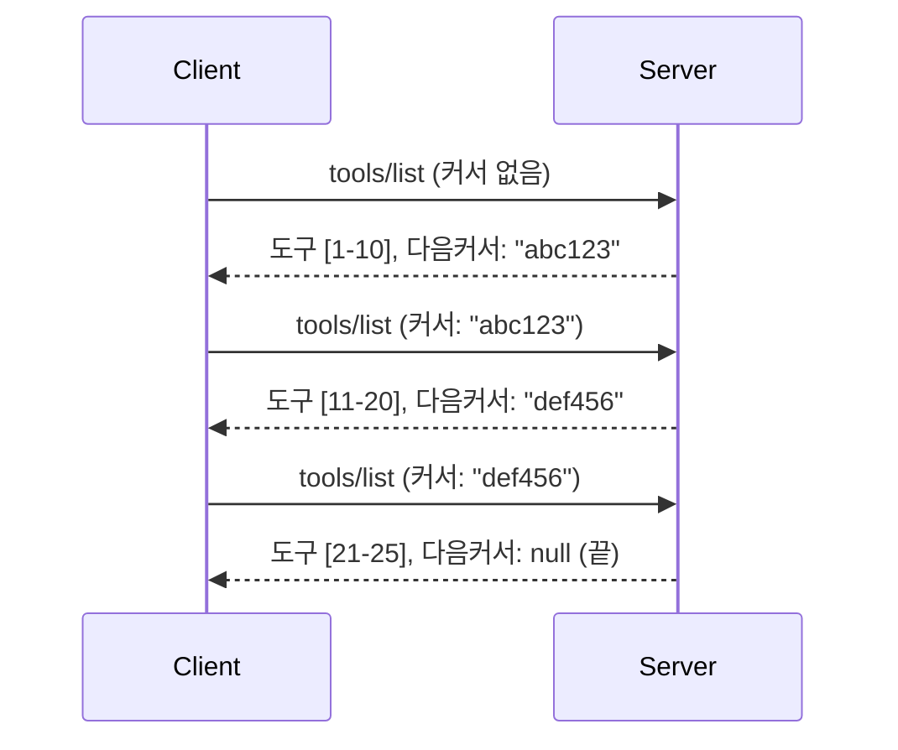

# MCP에서 페이지네이션과 대용량 결과 집합

MCP 서버가 수천 개의 파일, 데이터베이스 레코드 또는 검색 결과와 같은 대규모 데이터셋을 처리할 때 메모리를 효율적으로 관리하고 반응성 있는 사용자 경험을 제공하려면 페이지네이션이 필요합니다. 이 가이드는 MCP에서 페이지네이션을 구현하고 사용하는 방법을 다룹니다.

## 페이지네이션이 중요한 이유

페이지네이션이 없으면 대규모 응답이 다음과 같은 문제를 일으킬 수 있습니다:

- **메모리 부족** - 수백만 개의 레코드를 한 번에 로드
- **느린 응답 시간** - 모든 데이터가 로드될 때까지 사용자 대기
- **타임아웃 오류** - 요청이 타임아웃 제한을 초과
- **AI 성능 저하** - LLM이 방대한 컨텍스트를 처리하는 데 어려움

MCP는 결과 집합을 안정적이고 일관되게 페이지 처리하기 위해 **커서 기반 페이지네이션**을 사용합니다.

---

## MCP 페이지네이션 동작 방식

### 커서 개념

**커서**는 결과 집합 내 위치를 표시하는 불투명한 문자열입니다. 긴 책에서의 북마크와 같이 생각할 수 있습니다.


### MCP 메서드의 페이지네이션

다음 MCP 메서드들이 페이지네이션을 지원합니다:

| 메서드 | 반환값 | 커서 지원 |
|--------|---------|----------------|
| `tools/list` | 도구 정의 | ✅ |
| `resources/list` | 리소스 정의 | ✅ |
| `prompts/list` | 프롬프트 정의 | ✅ |
| `resources/templates/list` | 리소스 템플릿 | ✅ |

---

## 서버 구현

### Python (FastMCP)

```python
from mcp.server import Server
from mcp.types import Tool, ListToolsResult
import math

app = Server("paginated-server")

# 시뮬레이션된 대용량 데이터셋
ALL_TOOLS = [
    Tool(name=f"tool_{i}", description=f"Tool number {i}", inputSchema={})
    for i in range(100)
]

PAGE_SIZE = 10

@app.list_tools()
async def list_tools(cursor: str | None = None) -> ListToolsResult:
    """List tools with pagination support."""
    
    # 시작 인덱스를 얻기 위해 커서 디코딩
    start_index = 0
    if cursor:
        try:
            start_index = int(cursor)
        except ValueError:
            start_index = 0
    
    # 결과 페이지 가져오기
    end_index = min(start_index + PAGE_SIZE, len(ALL_TOOLS))
    page_tools = ALL_TOOLS[start_index:end_index]
    
    # 다음 커서 계산하기
    next_cursor = None
    if end_index < len(ALL_TOOLS):
        next_cursor = str(end_index)
    
    return ListToolsResult(
        tools=page_tools,
        nextCursor=next_cursor
    )
```

### TypeScript

```typescript
import { Server } from "@modelcontextprotocol/sdk/server/index.js";
import { ListToolsResultSchema } from "@modelcontextprotocol/sdk/types.js";

const server = new Server({
  name: "paginated-server",
  version: "1.0.0"
});

// 시뮬레이션된 대용량 데이터셋
const ALL_TOOLS = Array.from({ length: 100 }, (_, i) => ({
  name: `tool_${i}`,
  description: `Tool number ${i}`,
  inputSchema: { type: "object", properties: {} }
}));

const PAGE_SIZE = 10;

server.setRequestHandler(ListToolsResultSchema, async (request) => {
  // 커서 디코딩
  let startIndex = 0;
  if (request.params?.cursor) {
    startIndex = parseInt(request.params.cursor, 10) || 0;
  }
  
  // 결과 페이지 가져오기
  const endIndex = Math.min(startIndex + PAGE_SIZE, ALL_TOOLS.length);
  const pageTools = ALL_TOOLS.slice(startIndex, endIndex);
  
  // 다음 커서 계산하기
  const nextCursor = endIndex < ALL_TOOLS.length ? String(endIndex) : undefined;
  
  return {
    tools: pageTools,
    nextCursor
  };
});
```

### Java (Spring MCP)

```java
@Service
public class PaginatedToolService {
    
    private static final int PAGE_SIZE = 10;
    private final List<Tool> allTools;
    
    public PaginatedToolService() {
        // 대용량 데이터셋 초기화
        this.allTools = IntStream.range(0, 100)
            .mapToObj(i -> new Tool("tool_" + i, "Tool number " + i, Map.of()))
            .collect(Collectors.toList());
    }
    
    @McpMethod("tools/list")
    public ListToolsResult listTools(@Param("cursor") String cursor) {
        // 커서 디코딩
        int startIndex = 0;
        if (cursor != null && !cursor.isEmpty()) {
            try {
                startIndex = Integer.parseInt(cursor);
            } catch (NumberFormatException e) {
                startIndex = 0;
            }
        }
        
        // 결과 페이지 가져오기
        int endIndex = Math.min(startIndex + PAGE_SIZE, allTools.size());
        List<Tool> pageTools = allTools.subList(startIndex, endIndex);
        
        // 다음 커서 계산
        String nextCursor = endIndex < allTools.size() ? String.valueOf(endIndex) : null;
        
        return new ListToolsResult(pageTools, nextCursor);
    }
}
```

---

## 클라이언트 구현

### Python 클라이언트

```python
from mcp import ClientSession

async def get_all_tools(session: ClientSession) -> list:
    """Fetch all tools using pagination."""
    all_tools = []
    cursor = None
    
    while True:
        result = await session.list_tools(cursor=cursor)
        all_tools.extend(result.tools)
        
        if result.nextCursor is None:
            break
        cursor = result.nextCursor
    
    return all_tools

# 사용법
async with client_session as session:
    tools = await get_all_tools(session)
    print(f"Found {len(tools)} tools")
```

### TypeScript 클라이언트

```typescript
import { Client } from "@modelcontextprotocol/sdk/client/index.js";

async function getAllTools(client: Client): Promise<Tool[]> {
  const allTools: Tool[] = [];
  let cursor: string | undefined = undefined;
  
  do {
    const result = await client.listTools({ cursor });
    allTools.push(...result.tools);
    cursor = result.nextCursor;
  } while (cursor);
  
  return allTools;
}

// 사용법
const tools = await getAllTools(client);
console.log(`Found ${tools.length} tools`);
```

### 지연 로딩 패턴

매우 큰 데이터셋의 경우 필요에 따라 페이지를 로드하세요:

```python
class PaginatedToolIterator:
    """Lazily iterate through paginated tools."""
    
    def __init__(self, session: ClientSession):
        self.session = session
        self.cursor = None
        self.buffer = []
        self.exhausted = False
    
    async def __anext__(self):
        # 버퍼에서 가능하면 반환
        if self.buffer:
            return self.buffer.pop(0)
        
        # 모든 페이지를 다 사용했는지 확인
        if self.exhausted:
            raise StopAsyncIteration
        
        # 다음 페이지 가져오기
        result = await self.session.list_tools(cursor=self.cursor)
        self.buffer = list(result.tools)
        self.cursor = result.nextCursor
        
        if self.cursor is None:
            self.exhausted = True
        
        if not self.buffer:
            raise StopAsyncIteration
        
        return self.buffer.pop(0)
    
    def __aiter__(self):
        return self

# 사용법 - 대용량 데이터셋에 대해 메모리 효율적임
async for tool in PaginatedToolIterator(session):
    process_tool(tool)
```

---

## 리소스용 페이지네이션

리소스는 디렉터리나 대규모 데이터셋에 대해 페이지네이션이 자주 필요합니다:

```python
from mcp.server import Server
from mcp.types import Resource, ListResourcesResult
import os

app = Server("file-server")

@app.list_resources()
async def list_resources(cursor: str | None = None) -> ListResourcesResult:
    """List files in directory with pagination."""
    
    directory = "/data/files"
    all_files = sorted(os.listdir(directory))
    
    # 커서 디코딩 (파일 인덱스)
    start_index = int(cursor) if cursor else 0
    page_size = 20
    end_index = min(start_index + page_size, len(all_files))
    
    # 이 페이지에 대한 리소스 리스트 생성
    resources = []
    for filename in all_files[start_index:end_index]:
        filepath = os.path.join(directory, filename)
        resources.append(Resource(
            uri=f"file://{filepath}",
            name=filename,
            mimeType="application/octet-stream"
        ))
    
    # 다음 커서 계산
    next_cursor = str(end_index) if end_index < len(all_files) else None
    
    return ListResourcesResult(
        resources=resources,
        nextCursor=next_cursor
    )
```

---

## 커서 설계 전략

### 전략 1: 인덱스 기반 (단순)

```python
# 커서는 단지 인덱스입니다
cursor = "50"  # 50번째 항목에서 시작합니다
```

**장점:** 단순하고 상태 비저장  
**단점:** 항목이 추가/삭제되면 결과가 이동할 수 있음

### 전략 2: ID 기반 (안정적)

```python
# 커서는 마지막으로 본 ID입니다
cursor = "item_abc123"  # 이 항목 다음부터 시작합니다
```

**장점:** 항목이 변경되어도 안정적  
**단점:** 정렬된 ID 필요

### 전략 3: 인코딩된 상태 (복잡)

```python
import base64
import json

def encode_cursor(state: dict) -> str:
    return base64.b64encode(json.dumps(state).encode()).decode()

def decode_cursor(cursor: str) -> dict:
    return json.loads(base64.b64decode(cursor).decode())

# 커서는 여러 상태 필드를 포함합니다
cursor = encode_cursor({
    "offset": 50,
    "filter": "active",
    "sort": "name"
})
```

**장점:** 복잡한 상태를 인코딩 가능  
**단점:** 더 복잡하고 커서 문자열이 길어짐

---

## 모범 사례

### 1. 적절한 페이지 크기 선택

```python
# 데이터 크기를 고려하세요
PAGE_SIZE_SMALL_ITEMS = 100   # 간단한 메타데이터
PAGE_SIZE_MEDIUM_ITEMS = 20   # 더 풍부한 객체
PAGE_SIZE_LARGE_ITEMS = 5     # 복잡한 내용
```

### 2. 잘못된 커서 우아하게 처리

```python
@app.list_tools()
async def list_tools(cursor: str | None = None) -> ListToolsResult:
    try:
        start_index = int(cursor) if cursor else 0
        if start_index < 0 or start_index >= len(ALL_TOOLS):
            start_index = 0  # 처음으로 재설정
    except (ValueError, TypeError):
        start_index = 0  # 잘못된 커서, 새로 시작
    # ...
```

### 3. 총 개수 포함 (선택 사항)

```python
return ListToolsResult(
    tools=page_tools,
    nextCursor=next_cursor,
    # 일부 구현은 UI 진행 상황을 위한 전체 합계를 포함합니다
    _meta={"total": len(ALL_TOOLS)}
)
```

### 4. 극단적 케이스 테스트

```python
async def test_pagination():
    # 빈 결과 집합
    result = await session.list_tools()
    assert result.tools == []
    assert result.nextCursor is None
    
    # 단일 페이지
    result = await session.list_tools()
    assert len(result.tools) <= PAGE_SIZE
    
    # 잘못된 커서
    result = await session.list_tools(cursor="invalid")
    assert result.tools  # 첫 페이지를 반환해야 함
```

---

## 자주 하는 실수

### ❌ 모든 결과를 반환한 후 클라이언트에서 페이지네이션 수행

```python
# 나쁨: 모든 것을 메모리에 로드함
@app.list_tools()
async def list_tools() -> ListToolsResult:
    all_tools = load_all_tools()  # 100만 개의 도구!
    return ListToolsResult(tools=all_tools)
```

### ✅ 데이터 소스에서 페이지네이션 수행

```python
# 좋음: 필요한 것만 로드합니다
@app.list_tools()
async def list_tools(cursor: str | None = None) -> ListToolsResult:
    offset = int(cursor) if cursor else 0
    tools = await db.query_tools(offset=offset, limit=PAGE_SIZE)
    return ListToolsResult(tools=tools, nextCursor=...)
```

---

## 다음 단계

- [모듈 5.14 - 컨텍스트 엔지니어링](../../05-AdvancedTopics/mcp-contextengineering/README.md)
- [모듈 8 - 모범 사례](../../08-BestPractices/README.md)
- [3.8 - MCP 서버 테스트](../../03-GettingStarted/08-testing/README.md)

---

## 추가 자료

- [MCP 사양 - 페이지네이션](https://spec.modelcontextprotocol.io/specification/2025-11-25/)
- [커서 기반 페이지네이션 설명](https://slack.engineering/evolving-api-pagination-at-slack/)
- [Python SDK 페이지네이션 테스트](https://github.com/modelcontextprotocol/python-sdk/blob/main/tests/client/test_list_methods_cursor.py)

---

<!-- CO-OP TRANSLATOR DISCLAIMER START -->
**면책 조항**:  
이 문서는 AI 번역 서비스 [Co-op Translator](https://github.com/Azure/co-op-translator)를 사용하여 번역되었습니다. 정확성을 위해 최선을 다하고 있으나, 자동 번역에는 오류나 부정확성이 포함될 수 있음을 유의해 주시기 바랍니다. 원본 문서의 원어는 권위 있는 출처로 간주되어야 합니다. 중요한 정보의 경우 전문 인간 번역을 권장합니다. 본 번역의 사용으로 인한 오해나 오해석에 대해 당사는 어떠한 법적 책임도 지지 않습니다.
<!-- CO-OP TRANSLATOR DISCLAIMER END -->