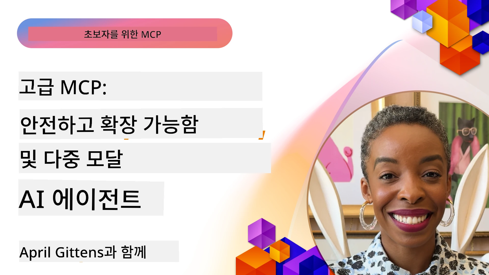

# 고급 MCP 주제

_(위 이미지를 클릭하여 이 수업의 비디오를 시청하세요)_

이 장에서는 모델 컨텍스트 프로토콜(MCP) 구현의 고급 주제들을 다루며, 다중 모달 통합, 확장성, 보안 모범 사례, 엔터프라이즈 통합 등을 포함합니다. 이 주제들은 현대 AI 시스템의 요구 사항을 충족할 수 있는 견고하고 프로덕션에 적합한 MCP 애플리케이션을 구축하는 데 필수적입니다.

## 개요

이 수업은 모델 컨텍스트 프로토콜 구현의 고급 개념을 탐구하며, 다중 모달 통합, 확장성, 보안 모범 사례, 엔터프라이즈 통합에 중점을 둡니다. 이 주제들은 복잡한 요구 사항을 처리할 수 있는 프로덕션급 MCP 애플리케이션을 구축하는 데 필수적입니다.

## 학습 목표

이 수업이 끝나면 다음을 할 수 있습니다:

- MCP 프레임워크 내에서 다중 모달 기능 구현
- 고부하 시나리오에 적합한 확장성 있는 MCP 아키텍처 설계
- MCP의 보안 원칙에 맞는 보안 모범 사례 적용
- MCP를 엔터프라이즈 AI 시스템 및 프레임워크와 통합
- 프로덕션 환경에서 성능 및 신뢰성 최적화

## 수업 및 샘플 프로젝트

| 링크 | 제목 | 설명 |
|------|-------|-------------|
| [5.1 Integration with Azure](./mcp-integration/README.md) | Azure와의 통합 | Azure에서 MCP 서버를 통합하는 방법 학습 |
| [5.2 Multi modal sample](./mcp-multi-modality/README.md) | MCP 다중 모달 샘플 | 오디오, 이미지 및 다중 모달 응답 샘플 |
| [5.3 MCP OAuth2 sample](../../../05-AdvancedTopics/mcp-oauth2-demo) | MCP OAuth2 데모 | 인증 및 자원 서버로서의 MCP와 OAuth2를 보여주는 최소 Spring Boot 앱. 안전한 토큰 발급, 보호된 엔드포인트, Azure Container Apps 배포, API 관리 통합 시연. |
| [5.4 Root Contexts](./mcp-root-contexts/README.md) | 루트 컨텍스트 | 루트 컨텍스트에 대해 더 배우고 구현 방법 학습 |
| [5.5 Routing](./mcp-routing/README.md) | 라우팅 | 다양한 유형의 라우팅 학습 |
| [5.6 Sampling](./mcp-sampling/README.md) | 샘플링 | 샘플링 작업 방법 학습 |
| [5.7 Scaling](./mcp-scaling/README.md) | 확장 | 확장성에 대해 학습 |
| [5.8 Security](./mcp-security/README.md) | 보안 | MCP 서버 보안 강화 |
| [5.9 Web Search sample](./web-search-mcp/README.md) | 웹 검색 MCP | SerpAPI와 통합한 Python MCP 서버 및 클라이언트로 실시간 웹, 뉴스, 제품 검색 및 Q&A 제공. 다중 도구 오케스트레이션, 외부 API 통합, 견고한 오류 처리 시연. |
| [5.10 Realtime Streaming](./mcp-realtimestreaming/README.md) | 스트리밍 | 실시간 데이터 스트리밍은 오늘날 즉각적인 정보 접근을 요구하는 비즈니스와 애플리케이션에 필수적입니다. |
| [5.11 Realtime Web Search](./mcp-realtimesearch/README.md) | 웹 검색 | MCP가 AI 모델, 검색 엔진, 애플리케이션 간 컨텍스트 관리를 표준화하여 실시간 웹 검색을 어떻게 혁신하는지. |
| [5.12  Entra ID Authentication for Model Context Protocol Servers](./mcp-security-entra/README.md) | Entra ID 인증 | Microsoft Entra ID는 클라우드 기반의 강력한 식별 및 접근 관리 솔루션을 제공하여 권한 있는 사용자와 애플리케이션만 MCP 서버와 상호작용할 수 있도록 지원합니다. |
| [5.13 Azure AI Foundry Agent Integration](./mcp-foundry-agent-integration/README.md) | Azure AI Foundry 통합 | MCP 서버와 Azure AI Foundry 에이전트를 통합하는 방법 학습, 강력한 도구 오케스트레이션 및 표준화된 외부 데이터 소스 연결로 엔터프라이즈 AI 기능 제공. |
| [5.14 Context Engineering](./mcp-contextengineering/README.md) | 컨텍스트 엔지니어링 | MCP 서버를 위한 컨텍스트 최적화, 동적 컨텍스트 관리, MCP 프레임워크 내 효과적인 프롬프트 엔지니어링 전략 등 컨텍스트 엔지니어링 미래 기회. |
| [5.15 MCP Custom Transport](./mcp-transport/README.md) | 사용자 정의 전송 | 특수 MCP 통신 시나리오를 위한 맞춤형 전송 메커니즘 구현 방법 학습. |
| [5.16 Protocol Features Deep Dive](./mcp-protocol-features/README.md) | 프로토콜 기능 | 진행 알림, 요청 취소, 리소스 템플릿, 오류 처리 패턴 등 고급 프로토콜 기능 숙달. |

> **MCP 사양 2025-11-25 신규**: 사양은 이제 **작업**(진행 추적이 가능한 장시간 실행 작업), **도구 주석**(안전성을 위한 도구 행동에 관한 메타데이터), **URL 모드 요청**(클라이언트에 특정 URL 콘텐츠 요청), 그리고 향상된 **루트**(작업 공간 컨텍스트 관리용) 등 실험적 지원을 포함합니다. 자세한 내용은 [MCP 사양 변경 로그](https://spec.modelcontextprotocol.io/) 참조.

## 추가 참고 자료

최신 고급 MCP 주제 정보는 다음을 참조하세요:
- [MCP 문서](https://modelcontextprotocol.io/)
- [MCP 사양 (2025-11-25)](https://spec.modelcontextprotocol.io/specification/2025-11-25/)
- [GitHub 저장소](https://github.com/modelcontextprotocol)
- [OWASP MCP 상위 10개](https://microsoft.github.io/mcp-azure-security-guide/mcp/) - 보안 위험 및 완화책
- [MCP 보안 서밋 워크숍 (Sherpa)](https://azure-samples.github.io/sherpa/) - 실습 보안 교육

## 주요 요점

- 다중 모달 MCP 구현은 텍스트 처리 이상의 AI 기능을 확장
- 확장성은 엔터프라이즈 배포에 필수이며 수평 및 수직 확장을 통해 해결 가능
- 포괄적인 보안 조치는 데이터 보호 및 적절한 접근 제어 보장
- Azure OpenAI 및 Microsoft AI Foundry와 같은 플랫폼과의 엔터프라이즈 통합은 MCP 기능을 강화
- 최적화된 아키텍처와 세심한 리소스 관리가 고급 MCP 구현에 이점 제공

## 연습 과제

특정 사용 사례에 맞는 엔터프라이즈급 MCP 구현 설계:

1. 사용 사례에 대한 다중 모달 요구 사항 식별
2. 민감 데이터 보호를 위한 보안 제어 개요 작성
3. 가변 부하를 처리할 수 있는 확장 가능한 아키텍처 설계
4. 엔터프라이즈 AI 시스템과의 통합 지점 계획
5. 잠재적 성능 병목 현상 및 완화 전략 문서화

## 추가 리소스

- [Azure OpenAI 문서](https://learn.microsoft.com/en-us/azure/ai-services/openai/)
- [Microsoft AI Foundry 문서](https://learn.microsoft.com/en-us/ai-services/)

---

## 다음 단계

이 모듈의 수업을 [5.1 MCP Integration](./mcp-integration/README.md)부터 시작하여 살펴보세요.

모듈을 완료한 후에는 [모듈 6: 커뮤니티 기여](../06-CommunityContributions/README.md)로 계속 진행하세요.

---

<!-- CO-OP TRANSLATOR DISCLAIMER START -->
**면책 조항**:  
이 문서는 AI 번역 서비스 [Co-op Translator](https://github.com/Azure/co-op-translator)를 사용하여 번역되었습니다. 정확성을 위해 노력하고 있으나, 자동 번역 결과에 오류나 부정확한 내용이 포함될 수 있음을 유의하시기 바랍니다. 원문 문서는 해당 언어의 공식 자료로 간주되어야 합니다. 중요한 정보의 경우, 전문적인 인간 번역을 권장합니다. 본 번역 사용으로 인한 오해나 잘못된 해석에 대해서는 당사가 책임지지 않습니다.
<!-- CO-OP TRANSLATOR DISCLAIMER END -->