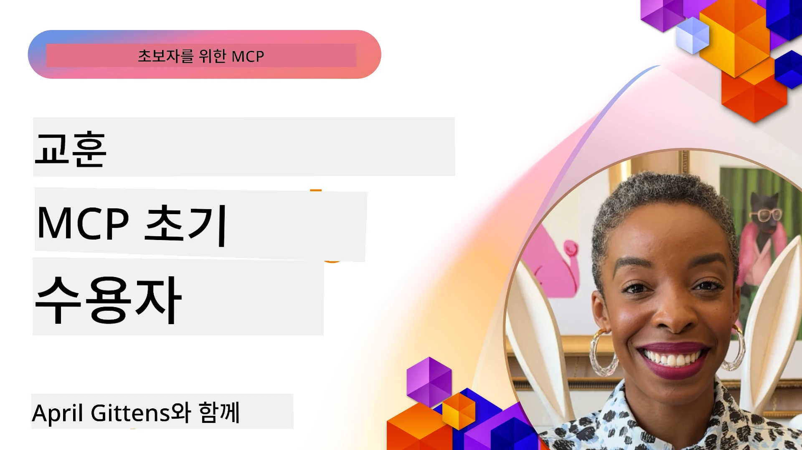

# 🌟 초기 도입자들의 교훈

[](https://youtu.be/jds7dSmNptE)

_(위 이미지를 클릭하여 이 수업의 동영상을 시청하세요)_

## 🎯 이 모듈에서 다루는 내용

이 모듈은 실제 조직과 개발자가 모델 컨텍스트 프로토콜(MCP)을 활용하여 실제 문제를 해결하고 혁신을 주도하는 방법을 탐구합니다. 상세한 사례 연구, 실습 프로젝트, 실용적인 예제를 통해 MCP가 언어 모델, 도구, 엔터프라이즈 데이터를 연결하는 안전하고 확장 가능한 AI 통합을 어떻게 가능하게 하는지 알아봅니다.

### 📚 MCP를 실제로 보기

이 원칙들이 생산 준비가 된 도구에 어떻게 적용되는지 보고 싶나요? 지금 사용할 수 있는 실제 마이크로소프트 MCP 서버를 소개하는 [**10가지 마이크로소프트 MCP 서버가 개발자 생산성을 혁신하는 방법**](microsoft-mcp-servers.md)를 확인해 보세요.

## 개요

이 수업에서는 초기 도입자들이 모델 컨텍스트 프로토콜(MCP)을 활용해 산업 전반에 걸쳐 실제 문제를 해결하고 혁신을 주도한 사례를 탐구합니다. 상세한 사례 연구와 실습 프로젝트를 통해 MCP가 대규모 언어 모델, 도구, 엔터프라이즈 데이터를 통합적인 프레임워크로 연결하는 표준화되고 안전하며 확장 가능한 AI 통합을 어떻게 구현하는지 살펴봅니다. MCP 기반 솔루션을 설계하고 구축하는 실무 경험을 쌓고, 검증된 구현 패턴을 배우며, 프로덕션 환경에 MCP를 배포하기 위한 모범 사례를 발견하게 될 것입니다. 또한 떠오르는 트렌드, 향후 방향성, 오픈소스 리소스도 소개하여 MCP 기술과 진화하는 생태계의 최전선에 머물 수 있도록 도와줍니다.

## 학습 목표

- 다양한 산업에서의 실제 MCP 구현 사례 분석
- 완전한 MCP 기반 애플리케이션 설계 및 구축
- MCP 기술의 새로운 트렌드 및 미래 방향 탐색
- 실제 개발 시나리오에서 모범 사례 적용

## 실제 MCP 구현 사례

### 사례 연구 1: 엔터프라이즈 고객 지원 자동화

글로벌 다국적 기업이 고객 지원 시스템 전반에 걸쳐 AI 상호작용을 표준화하기 위해 MCP 기반 솔루션을 구현했습니다. 이를 통해 다음을 실현했습니다:

- 다수의 LLM 공급자를 위한 통합 인터페이스 구축
- 부서 간 일관된 프롬프트 관리 유지
- 견고한 보안 및 컴플라이언스 제어 구현
- 특정 요구에 따라 다양한 AI 모델 간 손쉬운 전환

**기술적 구현:**

```python
# 고객 지원을 위한 Python MCP 서버 구현
import logging
import asyncio
from modelcontextprotocol import create_server, ServerConfig
from modelcontextprotocol.server import MCPServer
from modelcontextprotocol.transports import create_http_transport
from modelcontextprotocol.resources import ResourceDefinition
from modelcontextprotocol.prompts import PromptDefinition
from modelcontextprotocol.tool import ToolDefinition

# 로깅 구성
logging.basicConfig(level=logging.INFO)

async def main():
    # 서버 구성 생성
    config = ServerConfig(
        name="Enterprise Customer Support Server",
        version="1.0.0",
        description="MCP server for handling customer support inquiries"
    )
    
    # MCP 서버 초기화
    server = create_server(config)
    
    # 지식 베이스 리소스 등록
    server.resources.register(
        ResourceDefinition(
            name="customer_kb",
            description="Customer knowledge base documentation"
        ),
        lambda params: get_customer_documentation(params)
    )
    
    # 프롬프트 템플릿 등록
    server.prompts.register(
        PromptDefinition(
            name="support_template",
            description="Templates for customer support responses"
        ),
        lambda params: get_support_templates(params)
    )
    
    # 지원 도구 등록
    server.tools.register(
        ToolDefinition(
            name="ticketing",
            description="Create and update support tickets"
        ),
        handle_ticketing_operations
    )
    
    # HTTP 전송으로 서버 시작
    transport = create_http_transport(port=8080)
    await server.run(transport)

if __name__ == "__main__":
    asyncio.run(main())
```
  
**결과:** 모델 비용 30% 절감, 응답 일관성 45% 향상, 글로벌 운영 전반에 걸친 컴플라이언스 강화

### 사례 연구 2: 의료 진단 보조

의료 제공자가 민감한 환자 데이터 보호를 보장하면서 여러 전문 의료 AI 모델을 통합하는 MCP 인프라를 개발했습니다:

- 일반 의료 모델과 전문 의료 모델 간의 원활한 전환
- 엄격한 개인정보 보호 제어 및 감사 추적
- 기존 전자의무기록(EHR) 시스템과의 통합
- 의료 용어에 대한 일관된 프롬프트 엔지니어링

**기술적 구현:**

```csharp
// C# MCP host application implementation in healthcare application
using Microsoft.Extensions.DependencyInjection;
using ModelContextProtocol.SDK.Client;
using ModelContextProtocol.SDK.Security;
using ModelContextProtocol.SDK.Resources;

public class DiagnosticAssistant
{
    private readonly MCPHostClient _mcpClient;
    private readonly PatientContext _patientContext;
    
    public DiagnosticAssistant(PatientContext patientContext)
    {
        _patientContext = patientContext;
        
        // Configure MCP client with healthcare-specific settings
        var clientOptions = new ClientOptions
        {
            Name = "Healthcare Diagnostic Assistant",
            Version = "1.0.0",
            Security = new SecurityOptions
            {
                Encryption = EncryptionLevel.Medical,
                AuditEnabled = true
            }
        };
        
        _mcpClient = new MCPHostClientBuilder()
            .WithOptions(clientOptions)
            .WithTransport(new HttpTransport("https://healthcare-mcp.example.org"))
            .WithAuthentication(new HIPAACompliantAuthProvider())
            .Build();
    }
    
    public async Task<DiagnosticSuggestion> GetDiagnosticAssistance(
        string symptoms, string patientHistory)
    {
        // Create request with appropriate resources and tool access
        var resourceRequest = new ResourceRequest
        {
            Name = "patient_records",
            Parameters = new Dictionary<string, object>
            {
                ["patientId"] = _patientContext.PatientId,
                ["requestingProvider"] = _patientContext.ProviderId
            }
        };
        
        // Request diagnostic assistance using appropriate prompt
        var response = await _mcpClient.SendPromptRequestAsync(
            promptName: "diagnostic_assistance",
            parameters: new Dictionary<string, object>
            {
                ["symptoms"] = symptoms,
                patientHistory = patientHistory,
                relevantGuidelines = _patientContext.GetRelevantGuidelines()
            });
            
        return DiagnosticSuggestion.FromMCPResponse(response);
    }
}
```
  
**결과:** HIPAA 완전 준수 상태에서 의사의 진단 제안을 향상시키고 시스템 간 컨텍스트 전환 횟수 대폭 감소

### 사례 연구 3: 금융 서비스 리스크 분석

금융 기관이 다양한 부서 전반에서 리스크 분석 프로세스를 표준화하기 위해 MCP를 구현했습니다:

- 신용 리스크, 사기 탐지 및 투자 리스크 모델을 위한 통합 인터페이스 구축
- 엄격한 접근 제어 및 모델 버전 관리 구현
- 모든 AI 권고 사항에 대한 감사지원 보장
- 다양한 시스템 간 데이터 형식 일관성 유지

**기술적 구현:**

```java
// 금융 위험 평가를 위한 Java MCP 서버
import org.mcp.server.*;
import org.mcp.security.*;

public class FinancialRiskMCPServer {
    public static void main(String[] args) {
        // 금융 규정 준수 기능을 갖춘 MCP 서버 생성
        MCPServer server = new MCPServerBuilder()
            .withModelProviders(
                new ModelProvider("risk-assessment-primary", new AzureOpenAIProvider()),
                new ModelProvider("risk-assessment-audit", new LocalLlamaProvider())
            )
            .withPromptTemplateDirectory("./compliance/templates")
            .withAccessControls(new SOCCompliantAccessControl())
            .withDataEncryption(EncryptionStandard.FINANCIAL_GRADE)
            .withVersionControl(true)
            .withAuditLogging(new DatabaseAuditLogger())
            .build();
            
        server.addRequestValidator(new FinancialDataValidator());
        server.addResponseFilter(new PII_RedactionFilter());
        
        server.start(9000);
        
        System.out.println("Financial Risk MCP Server running on port 9000");
    }
}
```
  
**결과:** 규제 준수 향상, 모델 배포 주기 40% 단축, 부서 간 리스크 평가 일관성 개선

### 사례 연구 4: Microsoft Playwright MCP 서버를 이용한 브라우저 자동화

마이크로소프트는 모델 컨텍스트 프로토콜을 통해 안전하고 표준화된 브라우저 자동화를 가능하게 하는 [Playwright MCP 서버](https://github.com/microsoft/playwright-mcp)를 개발했습니다. 이 프로덕션 준비된 서버는 AI 에이전트와 LLM이 통제되고 감사 가능한 방식으로 웹 브라우저와 상호작용하도록 하여 자동화된 웹 테스트, 데이터 추출, 엔드 투 엔드 워크플로우와 같은 사용 사례를 지원합니다.

> **🎯 프로덕션 준비 도구**  
>  
> 이 사례 연구는 지금 바로 사용할 수 있는 실제 MCP 서버를 보여줍니다! Playwright MCP 서버 및 기타 9개의 생산 준비된 Microsoft MCP 서버에 대해 더 알고 싶다면 [**Microsoft MCP 서버 가이드**](microsoft-mcp-servers.md#8--playwright-mcp-server)를 참고하세요.

**주요 기능:**  
- 탐색, 폼 입력, 스크린샷 캡처 등 브라우저 자동화 기능을 MCP 도구로 노출  
- 무단 작업 방지를 위한 엄격한 접근 제어 및 샌드박싱 구현  
- 모든 브라우저 상호작용에 대한 상세한 감사 로그 제공  
- Azure OpenAI 및 기타 LLM 공급자와의 연동 지원, 에이전트 주도 자동화 가능  
- GitHub Copilot 코딩 에이전트에 웹 브라우징 기능 제공

**기술적 구현:**

```typescript
// TypeScript: MCP 서버에 Playwright 브라우저 자동화 도구 등록
import { createServer, ToolDefinition } from 'modelcontextprotocol';
import { launch } from 'playwright';

const server = createServer({
  name: 'Playwright MCP Server',
  version: '1.0.0',
  description: 'MCP server for browser automation using Playwright'
});

// URL로 이동하고 스크린샷을 캡처하는 도구 등록
server.tools.register(
  new ToolDefinition({
    name: 'navigate_and_screenshot',
    description: 'Navigate to a URL and capture a screenshot',
    parameters: {
      url: { type: 'string', description: 'The URL to visit' }
    }
  }),
  async ({ url }) => {
    const browser = await launch();
    const page = await browser.newPage();
    await page.goto(url);
    const screenshot = await page.screenshot();
    await browser.close();
    return { screenshot };
  }
);

// MCP 서버 시작
server.listen(8080);
```
  
**결과:**

- AI 에이전트 및 LLM을 위한 안전한 프로그래밍 방식의 브라우저 자동화 지원  
- 수동 테스트 작업 감소 및 웹 애플리케이션 테스트 커버리지 향상  
- 기업 환경에서 브라우저 기반 도구 통합을 위한 재사용 가능하고 확장 가능한 프레임워크 제공  
- GitHub Copilot의 웹 브라우징 기능 동력 제공

**참고 자료:**

- [Playwright MCP 서버 GitHub 저장소](https://github.com/microsoft/playwright-mcp)  
- [Microsoft AI 및 자동화 솔루션](https://azure.microsoft.com/en-us/products/ai-services/)

### 사례 연구 5: Azure MCP – 엔터프라이즈급 모델 컨텍스트 프로토콜 서비스

Azure MCP 서버([https://aka.ms/azmcp](https://aka.ms/azmcp))는 마이크로소프트의 관리형 엔터프라이즈급 모델 컨텍스트 프로토콜 구현으로, 확장 가능하며 안전하고 규정을 준수하는 MCP 서버 기능을 클라우드 서비스로 제공합니다. Azure MCP는 조직이 MCP 서버를 빠르게 배포, 관리, 통합할 수 있도록 하며 Azure AI, 데이터, 보안 서비스와 연계해 운영 부담을 줄이고 AI 도입을 가속화합니다.

> **🎯 프로덕션 준비 도구**  
>  
> 이것은 지금 바로 사용할 수 있는 실제 MCP 서버입니다! Azure AI Foundry MCP 서버에 대해 더 알고 싶다면 [**Microsoft MCP 서버 가이드**](microsoft-mcp-servers.md)를 참고하세요.

- 완전 관리형 MCP 서버 호스팅, 내장된 확장, 모니터링 및 보안 제공  
- Azure OpenAI, Azure AI 검색 및 기타 Azure 서비스와의 네이티브 통합  
- Microsoft Entra ID를 통한 엔터프라이즈 인증 및 권한 부여  
- 사용자 지정 도구, 프롬프트 템플릿, 리소스 커넥터 지원  
- 엔터프라이즈 보안 및 규제 요구사항 준수

**기술적 구현:**

```yaml
# Example: Azure MCP server deployment configuration (YAML)
apiVersion: mcp.microsoft.com/v1
kind: McpServer
metadata:
  name: enterprise-mcp-server
spec:
  modelProviders:
    - name: azure-openai
      type: AzureOpenAI
      endpoint: https://<your-openai-resource>.openai.azure.com/
      apiKeySecret: <your-azure-keyvault-secret>
  tools:
    - name: document_search
      type: AzureAISearch
      endpoint: https://<your-search-resource>.search.windows.net/
      apiKeySecret: <your-azure-keyvault-secret>
  authentication:
    type: EntraID
    tenantId: <your-tenant-id>
  monitoring:
    enabled: true
    logAnalyticsWorkspace: <your-log-analytics-id>
```
  
**결과:**  
- 준비된, 규정을 준수하는 MCP 서버 플랫폼 제공으로 엔터프라이즈 AI 프로젝트의 가치 실현 시간 단축  
- LLM, 도구, 엔터프라이즈 데이터 소스의 통합 간소화  
- MCP 워크로드에 대한 보안성, 관찰성 및 운영 효율성 향상  
- Azure SDK 모범 사례 및 최신 인증 패턴 적용으로 코드 품질 개선

**참고 자료:**  
- [Azure MCP 문서](https://aka.ms/azmcp)  
- [Azure MCP 서버 GitHub 저장소](https://github.com/Azure/azure-mcp)  
- [Azure AI 서비스](https://azure.microsoft.com/en-us/products/ai-services/)  
- [Microsoft MCP 센터](https://mcp.azure.com)

## 사례 연구 6: NLWeb  
MCP(모델 컨텍스트 프로토콜)는 챗봇과 AI 어시스턴트가 도구와 상호작용하기 위한 새롭게 떠오르는 프로토콜입니다. 모든 NLWeb 인스턴스도 MCP 서버로, 핵심 메서드 하나인 ask를 지원하며, 이 메서드는 자연어로 웹사이트에 질문을 하도록 사용됩니다. 반환된 응답은 웹 데이터 기술을 설명하는 널리 사용되는 어휘 schema.org를 활용합니다. 쉽게 말해 MCP는 NLWeb이 Http에 대응하는 HTML과 같습니다. NLWeb은 프로토콜, Schema.org 포맷 및 샘플 코드를 결합하여 사이트가 이러한 엔드포인트를 빠르게 생성할 수 있게 하여, 대화형 인터페이스를 통한 인간 사용자와 자연스러운 에이전트 간 상호작용을 모두 지원합니다.

NLWeb에는 두 가지 구별되는 구성 요소가 있습니다.
- 자연어 인터페이스를 위해 매우 간단한 프로토콜과 반환 답변에 json 및 schema.org를 활용하는 포맷. REST API 문서에서 자세한 내용을 확인할 수 있습니다.  
- 기존 마크업을 활용하는 (1)의 간단한 구현체로, 제품, 레시피, 명소, 리뷰 등 항목 목록으로 추상화할 수 있는 사이트에 적합합니다. 사용자 인터페이스 위젯과 함께 사이트 콘텐츠에 쉽게 대화형 인터페이스를 제공할 수 있습니다. Life of a chat query 문서에서 자세한 내용을 볼 수 있습니다.

**참고 자료:**  
- [Azure MCP 문서](https://aka.ms/azmcp)  
- [NLWeb](https://github.com/microsoft/NlWeb)

### 사례 연구 7: Azure AI Foundry MCP 서버 – 엔터프라이즈 AI 에이전트 통합

Azure AI Foundry MCP 서버는 MCP가 엔터프라이즈 환경에서 AI 에이전트와 워크플로우를 조율하고 관리하는 데 어떻게 활용될 수 있는지 보여줍니다. MCP와 Azure AI Foundry를 통합함으로써, 조직은 에이전트 상호작용을 표준화하고, Foundry의 워크플로우 관리를 활용하며, 안전하고 확장 가능한 배포를 보장할 수 있습니다.

> **🎯 프로덕션 준비 도구**  
>  
> 이것은 지금 바로 사용할 수 있는 실제 MCP 서버입니다! Azure AI Foundry MCP 서버에 대해 더 알고 싶다면 [**Microsoft MCP 서버 가이드**](microsoft-mcp-servers.md#9--azure-ai-foundry-mcp-server)를 참고하세요.

**주요 기능:**  
- 모델 카탈로그 및 배포 관리를 포함한 Azure AI 생태계에 대한 포괄적 접근  
- RAG 애플리케이션을 위한 Azure AI 검색을 통한 지식 인덱싱  
- AI 모델 성능 및 품질 보증 평가 도구  
- 첨단 연구 모델을 위한 Azure AI Foundry 카탈로그 및 랩 통합  
- 실제 시나리오용 에이전트 관리 및 평가 기능

**결과:**  
- AI 에이전트 워크플로우의 빠른 프로토타입 제작과 강력한 모니터링  
- 고급 시나리오를 위한 Azure AI 서비스와 원활한 통합  
- 에이전트 파이프라인 구축, 배포, 모니터링을 위한 통합 인터페이스  
- 엔터프라이즈의 보안, 컴플라이언스, 운영 효율성 향상  
- 복잡한 에이전트 주도 프로세스에 대한 제어를 유지하면서 AI 도입 가속화

**참고 자료:**  
- [Azure AI Foundry MCP 서버 GitHub 저장소](https://github.com/azure-ai-foundry/mcp-foundry)  
- [Azure AI 에이전트와 MCP 통합 (Microsoft Foundry 블로그)](https://devblogs.microsoft.com/foundry/integrating-azure-ai-agents-mcp/)

### 사례 연구 8: Foundry MCP 플레이그라운드 – 실험 및 프로토타이핑

Foundry MCP 플레이그라운드는 MCP 서버 및 Azure AI Foundry 통합 실험용으로 바로 사용할 수 있는 환경을 제공합니다. 개발자는 Azure AI Foundry 카탈로그 및 연구소 리소스를 활용하여 AI 모델과 에이전트 워크플로우를 빠르게 프로토타입하고 테스트하며 평가할 수 있습니다. 플레이그라운드는 설정을 간소화하고 샘플 프로젝트를 제공하며 협업 개발을 지원해 최소한의 오버헤드로 모범 사례와 새로운 시나리오를 탐구하기 쉽도록 합니다. 이는 복잡한 인프라 없이 아이디어 검증, 실험 공유, 학습 가속화를 원하는 팀에 특히 유용하며 MCP와 Azure AI Foundry 생태계에서 혁신과 커뮤니티 기여를 촉진합니다.

**참고 자료:**

- [Foundry MCP 플레이그라운드 GitHub 저장소](https://github.com/azure-ai-foundry/foundry-mcp-playground)

### 사례 연구 9: Microsoft Learn Docs MCP 서버 – AI 기반 문서 접근

Microsoft Learn Docs MCP 서버는 모델 컨텍스트 프로토콜을 통해 AI 어시스턴트에 공식 Microsoft 문서에 실시간으로 접근할 수 있는 클라우드 호스팅 서비스입니다. 이 프로덕션 준비된 서버는 광범위한 Microsoft Learn 생태계와 연결되어 모든 공식 Microsoft 소스에 대한 의미 기반 검색을 가능하게 합니다.

> **🎯 프로덕션 준비 도구**  
>  
> 이것은 지금 바로 사용할 수 있는 실제 MCP 서버입니다! Microsoft Learn Docs MCP 서버에 대해 더 알고 싶다면 [**Microsoft MCP 서버 가이드**](microsoft-mcp-servers.md#1--microsoft-learn-docs-mcp-server)를 참고하세요.

**주요 기능:**  
- 공식 Microsoft 문서, Azure 문서, Microsoft 365 문서에 대한 실시간 접근  
- 문맥과 의도를 이해하는 고급 의미 검색 기능  
- Microsoft Learn 콘텐츠 게시 시 항상 최신 정보 제공  
- Microsoft Learn, Azure 문서, Microsoft 365 자료 전반에 걸친 포괄적 커버리지  
- 기사 제목과 URL과 함께 최대 10개의 고품질 콘텐츠 청크 반환

**중요성:**  
- Microsoft 기술에 대한 ‘오래된 AI 지식’ 문제 해결  
- AI 어시스턴트가 최신 .NET, C#, Azure, Microsoft 365 기능에 접근 가능  
- 정확한 코드 생성을 위한 권위 있는 1차 정보 제공  
- 빠르게 진화하는 Microsoft 기술을 사용하는 개발자에게 필수적

**결과:**  
- Microsoft 기술용 AI 생성 코드 정확도 대폭 향상  
- 최신 문서 및 모범 사례 검색 시간 단축  
- 문맥 인지 문서 검색을 통한 개발자 생산성 증대  
- IDE를 떠나지 않고도 개발 워크플로우에 무리 없이 통합

**참고 자료:**  
- [Microsoft Learn Docs MCP 서버 GitHub 저장소](https://github.com/MicrosoftDocs/mcp)  
- [Microsoft Learn 문서](https://learn.microsoft.com/)

## 실습 프로젝트

### 프로젝트 1: 다중 공급자 MCP 서버 구축

**목표:** 특정 기준에 따라 여러 AI 모델 공급자에게 요청을 라우팅할 수 있는 MCP 서버를 만듭니다.

**요구사항:**

- 최소 세 가지 모델 공급자 지원 (예: OpenAI, Anthropic, 로컬 모델)  
- 요청 메타데이터를 기반으로 하는 라우팅 메커니즘 구현  
- 공급자 자격 증명 관리용 구성 시스템 구축  
- 성능 및 비용 최적화를 위한 캐싱 추가  
- 사용량 모니터링을 위한 간단한 대시보드 제작

**구현 단계:**

1. 기본 MCP 서버 인프라 구축  
2. 각 AI 모델 서비스별 공급자 어댑터 구현  
3. 요청 속성을 기반으로 하는 라우팅 로직 생성  
4. 빈번한 요청에 대한 캐싱 메커니즘 추가  
5. 모니터링 대시보드 개발  
6. 다양한 요청 패턴에 대한 테스트

**기술:** Python (.NET/Java/Python 중 선호하는 언어), 캐싱을 위한 Redis, 대시보드용 간단한 웹 프레임워크 중 선택

### 프로젝트 2: 엔터프라이즈 프롬프트 관리 시스템
**목표:** 조직 전체에서 프롬프트 템플릿을 관리, 버전 관리 및 배포하기 위한 MCP 기반 시스템 개발.

**요구 사항:**

- 프롬프트 템플릿을 위한 중앙 집중식 저장소 생성
- 버전 관리 및 승인 워크플로우 구현
- 샘플 입력을 통한 템플릿 테스트 기능 구축
- 역할 기반 접근 제어 개발
- 템플릿 검색 및 배포를 위한 API 생성

**구현 단계:**

1. 템플릿 저장을 위한 데이터베이스 스키마 설계
2. 템플릿 CRUD 작업을 위한 핵심 API 생성
3. 버전 관리 시스템 구현
4. 승인 워크플로우 구축
5. 테스트 프레임워크 개발
6. 관리용 간단한 웹 인터페이스 생성
7. MCP 서버와 통합

**기술:** 백엔드 프레임워크, SQL 또는 NoSQL 데이터베이스, 관리 인터페이스용 프론트엔드 프레임워크를 자유롭게 선택.

### 프로젝트 3: MCP 기반 콘텐츠 생성 플랫폼

**목표:** MCP를 활용하여 다양한 콘텐츠 유형에서 일관된 결과를 제공하는 콘텐츠 생성 플랫폼 구축.

**요구 사항:**

- 다양한 콘텐츠 형식 지원 (블로그 게시물, 소셜 미디어, 마케팅 카피)
- 맞춤화 옵션이 포함된 템플릿 기반 생성 구현
- 콘텐츠 검토 및 피드백 시스템 구축
- 콘텐츠 성과 지표 추적
- 콘텐츠 버전 관리 및 반복 지원

**구현 단계:**

1. MCP 클라이언트 인프라 구축
2. 다양한 콘텐츠 유형별 템플릿 생성
3. 콘텐츠 생성 파이프라인 구축
4. 검토 시스템 구현
5. 지표 추적 시스템 개발
6. 템플릿 관리 및 콘텐츠 생성을 위한 사용자 인터페이스 생성

**기술:** 선호하는 프로그래밍 언어, 웹 프레임워크, 데이터베이스 시스템 사용.

## MCP 기술의 미래 방향

### 새로운 트렌드

1. **멀티모달 MCP**
   - 이미지, 오디오, 비디오 모델과의 상호작용 표준화 위한 MCP 확장
   - 교차 모달 추론 기능 개발
   - 다양한 모달리티에 대한 표준화된 프롬프트 형식

2. **분산형 MCP 인프라**
   - 조직 간 자원 공유가 가능한 분산 MCP 네트워크
   - 안전한 모델 공유를 위한 표준 프로토콜
   - 개인정보 보호 계산 기술

3. **MCP 마켓플레이스**
   - MCP 템플릿 및 플러그인 공유 및 수익화를 위한 생태계
   - 품질 보증 및 인증 프로세스
   - 모델 마켓플레이스와의 통합

4. **엣지 컴퓨팅용 MCP**
   - 자원 제한 엣지 디바이스에 적합한 MCP 표준화
   - 저대역폭 환경에 최적화된 프로토콜
   - IoT 생태계 특화 MCP 구현

5. **규제 프레임워크**
   - 규제 준수를 위한 MCP 확장 개발
   - 표준화된 감사 추적 및 설명 가능성 인터페이스
   - 신흥 AI 거버넌스 프레임워크와 통합

### Microsoft의 MCP 솔루션

Microsoft와 Azure는 다양한 시나리오에서 MCP 구현을 지원하기 위해 여러 오픈소스 저장소를 개발했습니다:

#### Microsoft 조직

1. [playwright-mcp](https://github.com/microsoft/playwright-mcp) - 브라우저 자동화 및 테스트용 Playwright MCP 서버
2. [files-mcp-server](https://github.com/microsoft/files-mcp-server) - 로컬 테스트 및 커뮤니티 기여를 위한 OneDrive MCP 서버 구현
3. [NLWeb](https://github.com/microsoft/NlWeb) - NLWeb은 AI 웹을 위한 기반 레이어 구축에 중점을 둔 오픈 프로토콜과 도구 모음

#### Azure-Samples 조직

1. [mcp](https://github.com/Azure-Samples/mcp) - 여러 언어를 사용한 Azure MCP 서버 구축 및 통합을 위한 샘플, 도구, 리소스 링크
2. [mcp-auth-servers](https://github.com/Azure-Samples/mcp-auth-servers) - 현재 Model Context Protocol 사양에 따른 인증 데모 MCP 서버
3. [remote-mcp-functions](https://github.com/Azure-Samples/remote-mcp-functions) - Azure Functions 기반 원격 MCP 서버 구현 랜딩 페이지 및 언어별 저장소 링크
4. [remote-mcp-functions-python](https://github.com/Azure-Samples/remote-mcp-functions-python) - Azure Functions와 Python을 사용한 원격 MCP 서버 구축 및 배포를 위한 퀵스타트 템플릿
5. [remote-mcp-functions-dotnet](https://github.com/Azure-Samples/remote-mcp-functions-dotnet) - Azure Functions와 .NET/C#을 사용한 원격 MCP 서버 퀵스타트 템플릿
6. [remote-mcp-functions-typescript](https://github.com/Azure-Samples/remote-mcp-functions-typescript) - Azure Functions와 TypeScript를 활용한 원격 MCP 서버 퀵스타트 템플릿
7. [remote-mcp-apim-functions-python](https://github.com/Azure-Samples/remote-mcp-apim-functions-python) - Python을 사용한 Azure API Management를 통한 원격 MCP 서버 게이트웨이
8. [AI-Gateway](https://github.com/Azure-Samples/AI-Gateway) - Azure OpenAI 및 AI Foundry와 통합된 MCP 기능을 포함한 APIM ❤️ AI 실험들

이 저장소들은 다양한 프로그래밍 언어와 Azure 서비스를 활용한 Model Context Protocol 작업을 위한 여러 구현, 템플릿, 리소스를 제공합니다. 기본 서버 구현부터 인증, 클라우드 배포, 엔터프라이즈 통합 시나리오까지 다양한 사용 사례를 다룹니다.

#### MCP 리소스 디렉터리

공식 Microsoft MCP 저장소 내 [MCP Resources 디렉터리](https://github.com/microsoft/mcp/tree/main/Resources)는 Model Context Protocol 서버와 함께 사용할 수 있는 샘플 리소스, 프롬프트 템플릿, 도구 정의의 엄선된 컬렉션을 제공합니다. 이 디렉터리는 재사용 가능한 빌딩 블록과 모범 사례 예제를 통해 개발자가 MCP를 빠르게 시작할 수 있도록 설계되었습니다:

- **프롬프트 템플릿:** 일반 AI 작업 및 시나리오에 활용 가능한 즉시 사용 가능한 프롬프트 템플릿으로, 자체 MCP 서버 구현에 맞게 조정 가능
- **도구 정의:** 다양한 MCP 서버 간 도구 통합 및 호출 표준화를 위한 도구 스키마 및 메타데이터 예제
- **리소스 샘플:** MCP 프레임워크 내 데이터 소스, API, 외부 서비스 연결용 리소스 정의 예제
- **참고 구현:** 실제 MCP 프로젝트에서 리소스, 프롬프트, 도구의 구조와 조직 방법을 보여주는 실용 샘플

이 리소스들은 개발 가속화, 표준화 촉진, 우수 사례 적용을 도와 MCP 기반 솔루션 구축과 배포 시 품질을 보장합니다.

#### MCP 리소스 디렉터리

- [MCP 리소스 (샘플 프롬프트, 도구 및 리소스 정의)](https://github.com/microsoft/mcp/tree/main/Resources)

### 연구 기회

- MCP 프레임워크 내 효율적인 프롬프트 최적화 기법
- 다중 테넌트 MCP 배포를 위한 보안 모델
- 다양한 MCP 구현 간 성능 벤치마킹
- MCP 서버의 형식적 검증 방법

## 결론

Model Context Protocol (MCP)은 산업 전반에 걸쳐 표준화되고 안전하며 상호 운용 가능한 AI 통합의 미래를 빠르게 형성하고 있습니다. 이 수업에서 다룬 사례 연구와 실습 프로젝트를 통해 Microsoft와 Azure를 포함한 초기 도입자들이 MCP를 활용해 실제 문제를 해결하고 AI 도입을 가속화하며 준수, 보안, 확장성을 보장하는 방법을 확인했습니다. MCP의 모듈화 접근법은 조직이 대규모 언어 모델, 도구, 기업 데이터를 통합되고 감사 가능한 단일 프레임워크에서 연결할 수 있게 합니다. MCP가 계속 발전함에 따라 커뮤니티와의 지속적 소통, 오픈소스 자원 탐색, 최선의 실천 방법 적용은 견고하고 미래지향적인 AI 솔루션 구축의 핵심이 될 것입니다.

## 추가 리소스

- [MCP Foundry GitHub 저장소](https://github.com/azure-ai-foundry/mcp-foundry)
- [Foundry MCP Playground](https://github.com/azure-ai-foundry/foundry-mcp-playground)
- [Azure AI 에이전트와 MCP 통합 (Microsoft Foundry 블로그)](https://devblogs.microsoft.com/foundry/integrating-azure-ai-agents-mcp/)
- [MCP GitHub 저장소 (Microsoft)](https://github.com/microsoft/mcp)
- [MCP 리소스 디렉터리 (샘플 프롬프트, 도구 및 리소스 정의)](https://github.com/microsoft/mcp/tree/main/Resources)
- [MCP 커뮤니티 및 문서](https://modelcontextprotocol.io/introduction)
- [MCP 사양 (2025-11-25)](https://spec.modelcontextprotocol.io/specification/2025-11-25/)
- [Azure MCP 문서](https://aka.ms/azmcp)
- [OWASP MCP Top 10](https://microsoft.github.io/mcp-azure-security-guide/mcp/) - 보안 우수 사례
- [Playwright MCP 서버 GitHub 저장소](https://github.com/microsoft/playwright-mcp)
- [Files MCP 서버 (OneDrive)](https://github.com/microsoft/files-mcp-server)
- [Azure-Samples MCP](https://github.com/Azure-Samples/mcp)
- [MCP 인증 서버들 (Azure-Samples)](https://github.com/Azure-Samples/mcp-auth-servers)
- [원격 MCP 함수 (Azure-Samples)](https://github.com/Azure-Samples/remote-mcp-functions)
- [원격 MCP 함수 Python (Azure-Samples)](https://github.com/Azure-Samples/remote-mcp-functions-python)
- [원격 MCP 함수 .NET (Azure-Samples)](https://github.com/Azure-Samples/remote-mcp-functions-dotnet)
- [원격 MCP 함수 TypeScript (Azure-Samples)](https://github.com/Azure-Samples/remote-mcp-functions-typescript)
- [원격 MCP APIM 함수 Python (Azure-Samples)](https://github.com/Azure-Samples/remote-mcp-apim-functions-python)
- [AI-Gateway (Azure-Samples)](https://github.com/Azure-Samples/AI-Gateway)
- [Microsoft AI 및 자동화 솔루션](https://azure.microsoft.com/en-us/products/ai-services/)

## 실습 과제

1. 사례 연구 중 하나를 분석하고 대체 구현 방안을 제안하시오.
2. 프로젝트 아이디어 중 하나를 선택하여 상세한 기술 사양서를 작성하시오.
3. 사례 연구에 다루지 않은 산업 분야를 조사하고 MCP가 해당 분야의 구체적 과제를 어떻게 해결할 수 있을지 개요를 작성하시오.
4. 미래 방향 중 하나를 탐색하고 이를 지원하는 새로운 MCP 확장 개념을 만들시오.

## 다음 단계

더 알아보기: [Microsoft MCP 서버들](./microsoft-mcp-servers.md)

계속하기: [모듈 8: 모범 사례](../08-BestPractices/README.md)

---

<!-- CO-OP TRANSLATOR DISCLAIMER START -->
**면책 조항**:  
이 문서는 AI 번역 서비스 [Co-op Translator](https://github.com/Azure/co-op-translator)를 사용하여 번역되었습니다. 정확성을 위해 최선을 다하고 있으나 자동 번역에는 오류나 부정확성이 있을 수 있음을 유의해 주시기 바랍니다. 원본 문서는 해당 언어의 원문이 권위 있는 출처로 간주되어야 합니다. 중요한 정보의 경우 전문적인 인간 번역을 권장합니다. 본 번역 사용으로 인해 발생하는 오해나 잘못된 해석에 대해서는 책임을 지지 않습니다.
<!-- CO-OP TRANSLATOR DISCLAIMER END -->