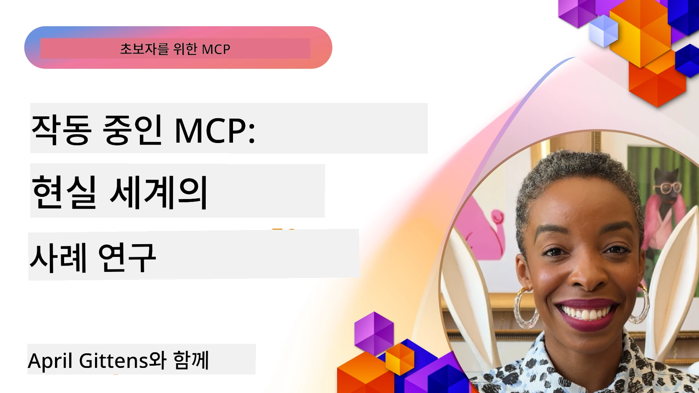

# MCP 실행 사례: 실제 사례 연구

_(위 이미지를 클릭하면 이 수업의 동영상을 볼 수 있습니다)_

Model Context Protocol(MCP)은 AI 애플리케이션이 데이터, 도구 및 서비스와 상호작용하는 방식을 혁신하고 있습니다. 이 섹션에서는 다양한 기업 시나리오에서 MCP의 실제 적용 사례를 보여줍니다.

## 개요

이 섹션에서는 MCP 구현의 구체적인 예를 통해 조직들이 이 프로토콜을 활용해 복잡한 비즈니스 문제를 어떻게 해결하고 있는지 소개합니다. 사례 연구를 살펴보면 실제 상황에서 MCP의 다재다능함, 확장성, 실질적 이점에 대한 통찰을 얻을 수 있습니다.

## 주요 학습 목표

이 사례 연구들을 탐구함으로써 여러분은:

- MCP가 특정 비즈니스 문제 해결에 어떻게 적용될 수 있는지 이해하고
- 다양한 통합 패턴과 아키텍처 접근 방식을 배우며
- 기업 환경에서 MCP 구현을 위한 모범 사례를 인식하고
- 실제 구현 과정에서 마주한 도전과 해결책에 대한 통찰을 얻고
- 유사한 패턴을 자신의 프로젝트에 적용할 기회를 발견하게 됩니다

## 주요 사례 연구

### 1. [Azure AI 여행사 – 참조 구현](./travelagentsample.md)

이 사례 연구는 MCP, Azure OpenAI, Azure AI Search를 사용해 다중 에이전트 기반 AI 여행 계획 애플리케이션을 구축하는 마이크로소프트의 포괄적 참조 솔루션을 다룹니다. 프로젝트는 다음을 보여줍니다:

- MCP를 통한 다중 에이전트 오케스트레이션
- Azure AI Search와의 기업 데이터 통합
- Azure 서비스로 안전하고 확장 가능한 아키텍처 구현
- 재사용 가능한 MCP 구성요소를 통한 확장 가능한 도구링
- Azure OpenAI 기반 대화형 사용자 경험

아키텍처 및 구현 세부사항은 MCP를 조율 계층으로 활용한 복잡한 다중 에이전트 시스템 구축에 대한 유용한 통찰을 제공합니다.

### 2. [YouTube 데이터로 Azure DevOps 항목 업데이트](./UpdateADOItemsFromYT.md)

이 사례 연구는 MCP를 이용해 워크플로우 자동화를 실용적으로 적용한 예를 보여줍니다. MCP 도구를 사용하여:

- 온라인 플랫폼(YouTube)에서 데이터 추출
- Azure DevOps 시스템의 작업 항목 업데이트
- 반복 가능한 자동화 워크플로우 생성
- 분산된 시스템 간 데이터 통합

이 예제는 비교적 단순한 MCP 구현이라도 일상 업무 자동화와 시스템 간 데이터 일관성 향상을 통해 상당한 효율성을 제공할 수 있음을 보여줍니다.

### 3. [MCP를 활용한 실시간 문서 검색](./docs-mcp/README.md)

이 사례 연구에서는 Python 콘솔 클라이언트를 MCP 서버에 연결하여 실시간으로 컨텍스트 인식 Microsoft 문서를 검색하고 기록하는 방법을 안내합니다. 배울 내용은:

- Python 클라이언트와 공식 MCP SDK를 사용하여 MCP 서버에 연결하는 방법
- 효율적이고 실시간 데이터 검색을 위한 스트리밍 HTTP 클라이언트 활용
- 서버의 문서화 도구 호출 및 응답을 콘솔에 직접 기록하는 방법
- 터미널을 벗어나지 않고 최신 Microsoft 문서를 워크플로우에 통합하는 방법

이 챕터에는 실습 과제, 최소한의 작동 코드 샘플, 심화 학습을 위한 리소스 링크가 포함되어 있습니다. MCP가 콘솔 기반 환경에서 문서 접근성과 개발자 생산성을 어떻게 혁신할 수 있는지 전체 워크스루와 코드를 참조하세요.

### 4. [MCP 기반 대화형 학습 계획 생성 웹앱](./docs-mcp/README.md)

이 사례 연구는 Chainlit와 Model Context Protocol(MCP)을 사용해 주제별 맞춤형 학습 계획을 생성하는 대화형 웹 애플리케이션을 구축하는 방법을 보여줍니다. 사용자는 예를 들어 "AI-900 인증" 같은 주제와 8주 같은 학습 기간을 지정하면 앱은 주별 추천 콘텐츠를 제공합니다. Chainlit은 대화형 채팅 인터페이스를 가능하게 하여 경험을 흥미롭고 적응적으로 만듭니다.

- Chainlit가 지원하는 대화형 웹 앱
- 사용자가 주제와 기간을 직접 지정하는 프롬프트
- MCP를 사용한 주별 콘텐츠 추천
- 채팅 인터페이스 내 실시간 적응형 응답

이 프로젝트는 대화형 AI와 MCP를 결합하여 현대적 웹 환경에서 동적이고 사용자 중심의 교육 도구를 만드는 방식을 보여줍니다.

### 5. [VS Code 내 MCP 서버로 에디터 내 문서 확인](./docs-mcp/README.md)

이 사례 연구는 MCP 서버를 이용해 Microsoft Learn Docs를 VS Code 환경 안으로 직접 불러오는 방법을 보여줍니다—더 이상 브라우저 탭을 전환하지 않아도 됩니다! 방법은 다음과 같습니다:

- MCP 패널이나 명령 팔레트를 사용해 VS Code 내부에서 즉시 문서 검색 및 읽기
- 문서 참조 및 README 혹은 강의용 마크다운 파일에 링크 삽입
- GitHub Copilot과 MCP를 함께 사용해 원활하고 AI 지원 문서 및 코드 워크플로우 구현
- 실시간 피드백과 Microsoft에서 제공하는 정확성으로 문서 검증 및 개선
- 연속적인 문서 검증을 위한 GitHub 워크플로우와 MCP 통합

구현에는 다음이 포함됩니다:

- 손쉬운 설정을 위한 `.vscode/mcp.json` 예제 구성
- 에디터 내 경험을 보여주는 스크린샷 설치 절차
- Copilot과 MCP의 결합 방법에 대한 팁

이 시나리오는 코스 저자, 문서 작성자, 개발자가 문서, Copilot, 검증 도구를 에디터 내에서 작업하며 집중력을 유지하는 데 이상적입니다.

### 6. [APIM MCP 서버 생성](./apimsample.md)

이 사례 연구는 Azure API Management(APIM)를 사용해 MCP 서버를 만드는 단계별 가이드를 제공합니다. 내용은 다음을 포함합니다:

- Azure API Management에서 MCP 서버 설정
- MCP 도구로 API 작업 공개
- 속도 제한 및 보안을 위한 정책 구성
- Visual Studio Code 및 GitHub Copilot을 사용한 MCP 서버 테스트

이 예시는 Azure 기능을 활용해 견고한 MCP 서버를 구축하고, AI 시스템과 기업 API 간 통합을 강화하는 방법을 보여 줍니다.

### 7. [GitHub MCP 레지스트리 — 에이전틱 통합 가속화](https://github.com/mcp)

이 사례 연구는 2025년 9월에 출시된 GitHub MCP 레지스트리가 AI 생태계의 중요한 문제인 분산된 MCP 서버 발견 및 배포 문제를 어떻게 해결하는지 살펴봅니다.

#### 개요
**MCP 레지스트리**는 리포지토리와 레지스트리에 흩어진 MCP 서버의 증가하는 문제를 해결합니다. 이전에는 통합이 느리고 오류가 잦았습니다. 이러한 서버들은 AI 에이전트가 API, 데이터베이스, 문서 소스 등 외부 시스템과 상호작용할 수 있게 합니다.

#### 문제 정의
에이전틱 워크플로우를 구축하는 개발자들이 마주한 문제:
- 서로 다른 플랫폼에 분산된 MCP 서버의 **열악한 발견성**
- 포럼과 문서 전반에 흩어진 **중복 설정 질문**
- 검증되지 않은 출처로부터 발생하는 **보안 위험**
- 서버 품질과 호환성에 대한 **표준화 부족**

#### 솔루션 아키텍처
GitHub MCP 레지스트리는 신뢰할 수 있는 MCP 서버를 중앙 집중화하며 주요 기능은:
- VS Code를 통한 **원클릭 설치** 통합으로 간소화된 설정
- 별, 활동, 커뮤니티 검증을 통한 **시그널 대 잡음 정렬**
- GitHub Copilot과 다른 MCP 호환 도구와의 **직접 통합**
- 커뮤니티와 기업 파트너가 모두 기여할 수 있는 **오픈 기여 모델**

#### 비즈니스 영향
이 레지스트리는 다음과 같은 측정 가능한 개선을 가져왔습니다:
- Microsoft Learn MCP 서버처럼 공식 문서를 에이전트에 직접 스트리밍하는 도구로 개발자 **온보딩 속도 향상**
- 자연어 GitHub 자동화(PR 생성, CI 재실행, 코드 스캔)를 가능케 하는 전문화 서버(`github-mcp-server`)를 통한 **생산성 향상**
- 신뢰할 수 있는 목록 및 투명한 구성 표준을 통한 **생태계 신뢰 강화**

#### 전략적 가치
에이전트 수명주기 관리 및 재현 가능한 워크플로우 전문가는 MCP 레지스트리를 통해:
- 표준화된 구성 요소를 활용한 **모듈성 에이전트 배포 기능**
- 일관된 테스트 및 검증을 지원하는 **레지스트리 기반 평가 파이프라인**
- 다양한 AI 플랫폼 간 매끄러운 통합을 가능케 하는 **도구 간 상호운용성**

이 사례 연구는 MCP 레지스트리가 단순한 디렉터리를 넘어 확장 가능하고 실제 모델 통합과 에이전트 시스템 배포를 위한 기반 플랫폼임을 보여줍니다.

## 결론

이 일곱 가지 종합 사례 연구는 Model Context Protocol의 뛰어난 다재다능함과 다양한 실제 시나리오에서의 활용을 입증합니다. 복잡한 다중 에이전트 여행 계획 시스템, 기업 API 관리, 간소화된 문서 워크플로우에서 혁신적인 GitHub MCP 레지스트리에 이르기까지, 이 사례들은 MCP가 AI 시스템을 도구, 데이터, 서비스와 연결하는 표준화되고 확장 가능한 방식을 제공하여 탁월한 가치를 구현함을 보여줍니다.

사례 연구는 MCP 구현의 여러 차원을 포괄합니다:
- **기업 통합**: Azure API 관리와 Azure DevOps 자동화
- **다중 에이전트 오케스트레이션**: 조율된 AI 에이전트와 함께하는 여행 계획
- **개발자 생산성**: VS Code 통합 및 실시간 문서 접근
- **생태계 개발**: GitHub MCP 레지스트리 기반 플랫폼
- **교육 응용**: 대화형 학습 계획 생성기 및 대화 인터페이스

이 구현을 학습함으로써 얻는 핵심 통찰은:
- 다양한 규모와 사용 사례에 맞는 **아키텍처 패턴**
- 기능성과 유지 보수성을 균형 있게 한 **구현 전략**
- 프로덕션 배포 시 고려해야 할 **보안 및 확장성**
- MCP 서버 개발 및 클라이언트 통합을 위한 **모범 사례**
- 상호 연결된 AI 기반 솔루션 구축을 위한 **생태계 사고방식**

이 사례들은 MCP가 단순 이론적 프레임워크가 아닌, 복잡한 비즈니스 문제에 실질적 솔루션을 제공하는 성숙하고 프로덕션 준비된 프로토콜임을 보여줍니다. 단순 자동화 도구든 정교한 다중 에이전트 시스템이든, 여기 제시된 패턴과 접근법은 여러분 자신의 MCP 프로젝트에 견고한 기반을 제공합니다.

## 추가 자료

- [Azure AI Travel Agents GitHub 저장소](https://github.com/Azure-Samples/azure-ai-travel-agents)
- [Azure DevOps MCP 도구](https://github.com/microsoft/azure-devops-mcp)
- [Playwright MCP 도구](https://github.com/microsoft/playwright-mcp)
- [Microsoft Docs MCP 서버](https://github.com/MicrosoftDocs/mcp)
- [GitHub MCP 레지스트리 — 에이전틱 통합 가속화](https://github.com/mcp)
- [MCP 커뮤니티 예제](https://github.com/microsoft/mcp)

## 다음 단계

- 이전: [모듈 8: 모범 사례](../08-BestPractices/README.md)
- 다음: [모듈 10: AI 워크플로우 간소화: AI 툴킷으로 MCP 서버 구축](../10-StreamliningAIWorkflowsBuildingAnMCPServerWithAIToolkit/README.md)

---

<!-- CO-OP TRANSLATOR DISCLAIMER START -->
**면책 조항**:  
이 문서는 AI 번역 서비스 [Co-op Translator](https://github.com/Azure/co-op-translator)를 사용하여 번역되었습니다. 정확성을 위해 최선을 다하고 있으나, 자동 번역에는 오류나 부정확한 내용이 포함될 수 있음을 유의해 주시기 바랍니다. 원문은 해당 문서의 권위 있는 출처로 간주되어야 합니다. 중요한 정보의 경우 전문가의 인간 번역을 권장합니다. 본 번역 사용으로 인한 오해나 잘못된 해석에 대해 당사는 책임을 지지 않습니다.
<!-- CO-OP TRANSLATOR DISCLAIMER END -->