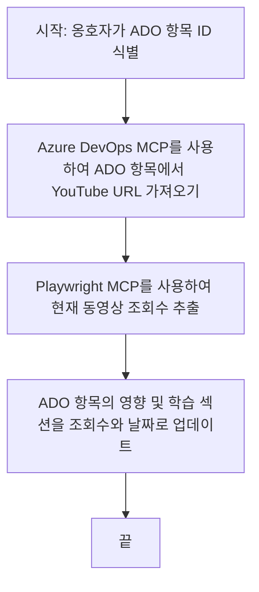

# 사례 연구: MCP로 YouTube 데이터에서 Azure DevOps 항목 업데이트하기

> **면책 조항:** YouTube와 같은 플랫폼의 데이터를 사용하여 Azure DevOps 항목을 업데이트하는 프로세스를 자동화할 수 있는 기존 온라인 도구와 보고서가 있습니다. 다음 시나리오는 MCP 도구가 자동화 및 통합 작업에 어떻게 적용될 수 있는지 보여주는 샘플 사용 사례로 제공됩니다.

## 개요

이 사례 연구는 Model Context Protocol(MCP)과 해당 도구를 사용하여 온라인 플랫폼(예: YouTube)에서 가져온 정보로 Azure DevOps(ADO) 작업 항목을 업데이트하는 프로세스를 자동화하는 한 가지 예를 보여줍니다. 설명된 시나리오는 이러한 도구의 광범위한 기능 중 하나를 설명하는 것으로, 여러 유사한 자동화 요구 사항에 맞게 조정할 수 있습니다.

이 예제에서 Advocate는 각 항목에 YouTube 비디오 URL이 포함된 ADO 항목을 사용하여 온라인 세션을 추적합니다. MCP 도구를 활용하면 Advocate는 조회 수와 같은 최신 비디오 지표로 ADO 항목을 반복적이고 자동화된 방식으로 최신 상태로 유지할 수 있습니다. 이 방법은 온라인 소스의 정보를 ADO 또는 기타 시스템에 통합해야 하는 다른 사용 사례에도 일반화할 수 있습니다.

## 시나리오

Advocate는 온라인 세션과 커뮤니티 참여의 영향력을 추적할 책임이 있습니다. 각 세션은 'DevRel' 프로젝트의 ADO 작업 항목으로 기록되며, 해당 작업 항목에는 YouTube 비디오 URL 필드가 포함되어 있습니다. 세션의 도달 범위를 정확하게 보고하려면 Advocate는 현재 비디오 조회 수와 이 정보가 검색된 날짜를 ADO 항목에 업데이트해야 합니다.

## 사용 도구

- [Azure DevOps MCP](https://github.com/microsoft/azure-devops-mcp): MCP를 통해 ADO 작업 항목에 프로그래밍 방식으로 접근하고 업데이트할 수 있게 합니다.
- [Playwright MCP](https://github.com/microsoft/playwright-mcp): YouTube 비디오 통계와 같은 웹 페이지의 실시간 데이터를 추출하기 위해 브라우저 동작을 자동화합니다.

## 단계별 워크플로우

1. **ADO 항목 식별**: 'DevRel' 프로젝트에서 ADO 작업 항목 ID(예: 1234)를 시작점으로 합니다.
2. **YouTube URL 가져오기**: Azure DevOps MCP 도구를 사용하여 작업 항목에서 YouTube URL을 가져옵니다.
3. **비디오 조회 수 추출**: Playwright MCP 도구를 사용하여 YouTube URL로 이동하고 현재 조회 수를 추출합니다.
4. **ADO 항목 업데이트**: Azure DevOps MCP 도구를 이용해 'Impact and Learnings' 섹션에 최신 조회 수와 조회 날짜를 기록합니다.

## 예제 프롬프트

```bash
- Work with the ADO Item ID: 1234
- The project is '2025-Awesome'
- Get the YouTube URL for the ADO item
- Use Playwright to get the current views from the YouTube video
- Update the ADO item with the current video views and the updated date of the information
```

## Mermaid 흐름도


## 기술 구현

- **MCP 오케스트레이션**: 워크플로우는 MCP 서버가 Azure DevOps MCP와 Playwright MCP 도구 사용을 조정하면서 오케스트레이션됩니다.
- **자동화**: 프로세스는 수동으로 실행하거나 정기적으로 실행되도록 예약하여 ADO 항목을 최신 상태로 유지할 수 있습니다.
- **확장성**: 동일한 패턴을 사용하여 좋아요, 댓글 등의 다른 온라인 지표나 다른 플랫폼에서 ADO 항목을 업데이트하는 데 확장할 수 있습니다.

## 결과 및 영향

- **효율성**: Advocate의 수작업 노력을 줄이고 비디오 지표 조회 및 업데이트를 자동화합니다.
- **정확성**: ADO 항목이 온라인 소스에서 제공하는 최신 데이터를 반영하도록 보장합니다.
- **재사용성**: 다른 데이터 소스나 지표를 포함하는 유사한 시나리오에서 재사용 가능한 워크플로우를 제공합니다.

## 참고 문헌

- [Azure DevOps MCP](https://github.com/microsoft/azure-devops-mcp)
- [Playwright MCP](https://github.com/microsoft/playwright-mcp)
- [Model Context Protocol (MCP)](https://modelcontextprotocol.io/)

## 다음 단계

- 이전으로: [사례 연구 개요](./README.md)
- 다음: [MCP를 사용한 실시간 문서 검색](./docs-mcp/README.md)

---

<!-- CO-OP TRANSLATOR DISCLAIMER START -->
**면책 조항**:  
이 문서는 AI 번역 서비스 [Co-op Translator](https://github.com/Azure/co-op-translator)를 사용하여 번역되었습니다. 정확성을 위해 최선을 다하고 있으나 자동 번역에는 오류나 부정확성이 포함될 수 있음을 유의하시기 바랍니다. 원본 문서의 원어 버전이 권위 있는 출처로 간주되어야 합니다. 중요한 정보의 경우, 전문적인 인간 번역을 권장합니다. 본 번역 사용으로 인한 오해나 오해석에 대해 당사는 책임을 지지 않습니다.
<!-- CO-OP TRANSLATOR DISCLAIMER END -->