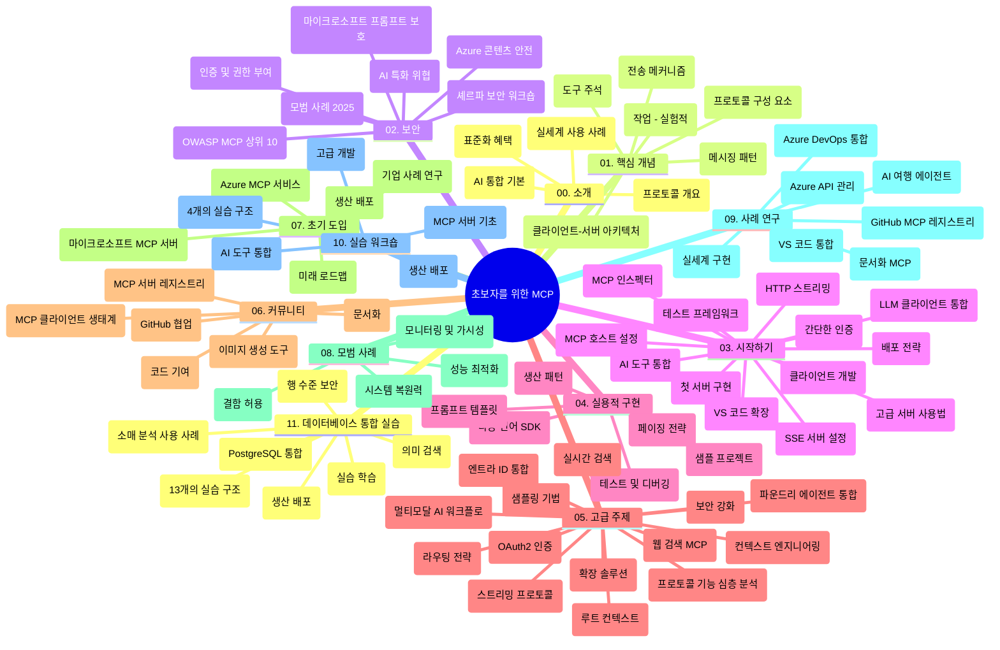

# 초보자를 위한 모델 컨텍스트 프로토콜(MCP) - 학습 가이드

이 학습 가이드는 "초보자를 위한 모델 컨텍스트 프로토콜(MCP)" 커리큘럼의 리포지토리 구조와 내용을 개관합니다. 이 가이드를 사용하여 리포지토리를 효율적으로 탐색하고 제공되는 리소스를 최대한 활용하세요.

## 리포지토리 개요

모델 컨텍스트 프로토콜(MCP)은 AI 모델과 클라이언트 애플리케이션 간 상호작용을 위한 표준화된 프레임워크입니다. 초기에는 Anthropic에서 개발하였으며, 현재는 공식 GitHub 조직을 통해 광범위한 MCP 커뮤니티가 유지 관리합니다. 이 리포지토리는 C#, Java, JavaScript, Python 및 TypeScript의 실습 코드 예제와 함께 AI 개발자, 시스템 설계자 및 소프트웨어 엔지니어를 위해 설계된 종합 교육 과정을 제공합니다.

## 시각적 커리큘럼 지도

## 리포지토리 구조

리포지토리는 MCP의 다양한 측면에 초점을 맞춘 열한 개 주요 섹션으로 구성됩니다:

1. **소개 (00-Introduction/)**
   - 모델 컨텍스트 프로토콜 개요
   - AI 파이프라인에서 표준화의 중요성
   - 실용적인 사용 사례 및 이점

2. **핵심 개념 (01-CoreConcepts/)**
   - 클라이언트-서버 아키텍처
   - 주요 프로토콜 구성 요소
   - MCP의 메시징 패턴

3. **보안 (02-Security/)**
   - MCP 기반 시스템의 보안 위협
   - 구현 보안을 위한 모범 사례
   - 인증 및 권한 부여 전략
   - **포괄적인 보안 문서**:
     - MCP 보안 모범 사례 2025
     - Azure 콘텐츠 안전성 구현 가이드
     - MCP 보안 제어 및 기법
     - MCP 모범 사례 빠른 참조
   - **주요 보안 주제**:
     - 프롬프트 인젝션 및 도구 오염 공격
     - 세션 하이재킹 및 혼동된 대리인 문제
     - 토큰 전달 취약점
     - 과도한 권한 및 접근 제어
     - AI 구성 요소의 공급망 보안
     - Microsoft 프롬프트 쉴드 통합

4. **시작하기 (03-GettingStarted/)**
   - 환경 설정 및 구성
   - 기본 MCP 서버 및 클라이언트 생성
   - 기존 애플리케이션과 통합
   - 다음 섹션 포함:
     - 첫 서버 구현
     - 클라이언트 개발
     - LLM 클라이언트 통합
     - VS Code 통합
     - 서버 전송 이벤트(SSE) 서버
     - 고급 서버 사용법
     - HTTP 스트리밍
     - AI 툴킷 통합
     - 테스트 전략
     - 배포 가이드라인

5. **실용적 구현 (04-PracticalImplementation/)**
   - 여러 프로그래밍 언어로 SDK 사용
   - 디버깅, 테스트 및 검증 기법
   - 재사용 가능한 프롬프트 템플릿 및 작업 흐름 작성
   - 구현 예제를 포함한 샘플 프로젝트

6. **고급 주제 (05-AdvancedTopics/)**
   - 컨텍스트 엔지니어링 기법
   - Foundry 에이전트 통합
   - 멀티모달 AI 작업 흐름
   - OAuth2 인증 데모
   - 실시간 검색 기능
   - 실시간 스트리밍
   - 루트 컨텍스트 구현
   - 라우팅 전략
   - 샘플링 기법
   - 확장 방법론
   - 보안 고려 사항
   - Entra ID 보안 통합
   - 웹 검색 통합

7. **커뮤니티 기여 (06-CommunityContributions/)**
   - 코드 및 문서 기여 방법
   - GitHub 협업
   - 커뮤니티 주도 향상 및 피드백
   - 다양한 MCP 클라이언트 사용법 (Claude Desktop, Cline, VSCode)
   - 이미지 생성 포함 인기 MCP 서버 작업

8. **초기 도입에서 얻은 교훈 (07-LessonsfromEarlyAdoption/)**
   - 실제 구현 및 성공 사례
   - MCP 기반 솔루션 구축 및 배포
   - 트렌드 및 향후 로드맵
   - **Microsoft MCP 서버 안내서**: 다음을 포함한 10개 생산 준비된 Microsoft MCP 서버 종합 안내서:
     - Microsoft Learn Docs MCP 서버
     - Azure MCP 서버 (15개 이상의 전문 커넥터)
     - GitHub MCP 서버
     - Azure DevOps MCP 서버
     - MarkItDown MCP 서버
     - SQL Server MCP 서버
     - Playwright MCP 서버
     - Dev Box MCP 서버
     - Azure AI Foundry MCP 서버
     - Microsoft 365 Agents Toolkit MCP 서버

9. **모범 사례 (08-BestPractices/)**
   - 성능 조정 및 최적화
   - 내결함성 MCP 시스템 설계
   - 테스트 및 복원력 전략

10. **사례 연구 (09-CaseStudy/)**
    - 다양한 상황에서 MCP의 다재다능함을 보여주는 **7가지 종합 사례 연구**:
    - **Azure AI 여행 에이전트**: Azure OpenAI 및 AI 검색을 활용한 멀티 에이전트 오케스트레이션
    - **Azure DevOps 통합**: YouTube 데이터 업데이트를 자동화하는 워크플로우
    - **실시간 문서 검색**: 스트리밍 HTTP를 사용하는 Python 콘솔 클라이언트
    - **인터랙티브 학습 계획 생성기**: 대화형 AI를 사용하는 Chainlit 웹 앱
    - **에디터 내 문서**: GitHub Copilot 워크플로우와 VS Code 통합
    - **Azure API 관리**: MCP 서버 생성과 엔터프라이즈 API 통합
    - **GitHub MCP 레지스트리**: 생태계 개발 및 에이전트 통합 플랫폼
    - 엔터프라이즈 통합, 개발자 생산성, 생태계 개발을 포함한 구현 예제

11. **실습 워크숍 (10-StreamliningAIWorkflowsBuildingAnMCPServerWithAIToolkit/)**
    - MCP와 AI 툴킷을 결합한 포괄적 실습 워크숍
    - AI 모델과 실제 도구를 연결하는 지능형 애플리케이션 구축
    - 기본, 맞춤형 서버 개발, 프로덕션 배포 전략을 다루는 실용 모듈
    - **랩 구성**:
      - 랩 1: MCP 서버 기본
      - 랩 2: 고급 MCP 서버 개발
      - 랩 3: AI 툴킷 통합
      - 랩 4: 프로덕션 배포 및 확장
    - 단계별 지침에 따른 랩 기반 학습 방법

12. **MCP 서버 데이터베이스 통합 랩 (11-MCPServerHandsOnLabs/)**
    - PostgreSQL 통합을 통해 프로덕션 준비된 MCP 서버를 구축하는 **포괄적인 13랩 학습 경로**
    - Zava Retail 사례를 이용한 실제 소매 분석 구현
    - 행 수준 보안(RLS), 의미 기반 검색, 다중 테넌트 데이터 접근 등 엔터프라이즈급 패턴
    - **전체 랩 구성**:
      - **랩 00-03: 기초** - 소개, 아키텍처, 보안, 환경 설정
      - **랩 04-06: MCP 서버 구축** - 데이터베이스 설계, MCP 서버 구현, 도구 개발
      - **랩 07-09: 고급 기능** - 의미 기반 검색, 테스트 및 디버깅, VS Code 통합
      - **랩 10-12: 프로덕션 및 모범 사례** - 배포, 모니터링, 최적화
    - **사용 기술**: FastMCP 프레임워크, PostgreSQL, Azure OpenAI, Azure 컨테이너 앱, Application Insights
    - **학습 성과**: 프로덕션 준비 MCP 서버, 데이터베이스 통합 패턴, AI 기반 분석, 엔터프라이즈 보안

## 추가 리소스

리포지토리에는 다음과 같은 지원 리소스가 포함되어 있습니다:

- **Images 폴더**: 커리큘럼 전반에 사용된 다이어그램 및 일러스트레이션 포함
- **번역**: 문서의 다국어 지원 및 자동 번역
- **공식 MCP 리소스**:
  - [MCP Documentation](https://modelcontextprotocol.io/)
  - [MCP Specification](https://spec.modelcontextprotocol.io/)
  - [MCP GitHub Repository](https://github.com/modelcontextprotocol)

## 이 리포지토리 사용 방법

1. **순차적 학습**: 구조화된 학습을 위해 챕터(00~11)를 차례대로 진행하세요.
2. **언어별 집중**: 특정 프로그래밍 언어에 관심이 있다면, 샘플 디렉토리에서 해당 언어로 된 구현을 탐색하세요.
3. **실용적 구현**: 먼저 "시작하기" 섹션에서 환경 설정 및 첫 MCP 서버와 클라이언트를 생성해 보세요.
4. **고급 탐구**: 기본기를 익힌 뒤에는 고급 주제로 넘어가 지식을 확장하세요.
5. **커뮤니티 참여**: GitHub 토론과 Discord 채널을 통해 전문가 및 동료 개발자와 교류하세요.

## MCP 클라이언트 및 도구

커리큘럼에는 다양한 MCP 클라이언트와 도구가 포함되어 있습니다:

1. **공식 클라이언트**:
   - Visual Studio Code
   - Visual Studio Code 내 MCP
   - Claude Desktop
   - VSCode 내 Claude
   - Claude API

2. **커뮤니티 클라이언트**:
   - Cline (터미널 기반)
   - Cursor (코드 편집기)
   - ChatMCP
   - Windsurf

3. **MCP 관리 도구**:
   - MCP CLI
   - MCP Manager
   - MCP Linker
   - MCP Router

## 인기 MCP 서버

리포지토리는 다양한 MCP 서버를 소개합니다:

1. **공식 Microsoft MCP 서버**:
   - Microsoft Learn Docs MCP 서버
   - Azure MCP 서버 (15개 이상의 전문 커넥터)
   - GitHub MCP 서버
   - Azure DevOps MCP 서버
   - MarkItDown MCP 서버
   - SQL Server MCP 서버
   - Playwright MCP 서버
   - Dev Box MCP 서버
   - Azure AI Foundry MCP 서버
   - Microsoft 365 Agents Toolkit MCP 서버

2. **공식 참조 서버**:
   - Filesystem
   - Fetch
   - Memory
   - Sequential Thinking

3. **이미지 생성**:
   - Azure OpenAI DALL-E 3
   - Stable Diffusion WebUI
   - Replicate

4. **개발 도구**:
   - Git MCP
   - Terminal Control
   - Code Assistant

5. **전문 서버**:
   - Salesforce
   - Microsoft Teams
   - Jira & Confluence

## 기여

이 리포지토리는 커뮤니티의 기여를 환영합니다. MCP 생태계에 효과적으로 기여하는 방법은 커뮤니티 기여 섹션을 참고하세요.

----

*이 학습 가이드는 2026년 2월 5일 최신 MCP 사양 2025-11-25를 반영하여 마지막으로 업데이트되었으며, 해당 날짜 기준의 리포지토리 개요를 제공합니다. 이후 리포지토리 내용은 변경될 수 있습니다.*

---

<!-- CO-OP TRANSLATOR DISCLAIMER START -->
**면책 조항**:  
이 문서는 AI 번역 서비스 [Co-op Translator](https://github.com/Azure/co-op-translator)를 사용하여 번역되었습니다. 정확성을 위해 노력하고 있지만, 자동 번역에는 오류나 부정확한 부분이 포함될 수 있음을 유의하시기 바랍니다. 원본 문서가 권위 있는 출처로 간주되어야 합니다. 중요한 정보의 경우 전문적인 인간 번역을 권장합니다. 본 번역의 사용으로 인해 발생하는 모든 오해나 잘못된 해석에 대해 당사는 책임을 지지 않습니다.
<!-- CO-OP TRANSLATOR DISCLAIMER END -->