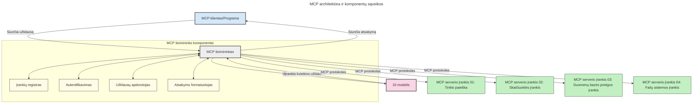

# Įvadas į Modelio konteksto protokolą (MCP): kodėl tai svarbu plečiamoms AI programoms

[](https://youtu.be/agBbdiOPLQA)

_(Spustelėkite aukščiau esantį paveikslėlį, norėdami peržiūrėti šios pamokos vaizdo įrašą)_

Generatyviosios AI programos yra didelis žingsnis į priekį, nes dažnai leidžia naudotojui bendrauti su programa naudodami natūralios kalbos užklausas. Tačiau, investavus daugiau laiko ir išteklių į tokias programas, norite užtikrinti, kad galėtumėte lengvai integruoti funkcionalumus ir išteklius taip, kad būtų paprasta plėsti, kad programa galėtų aptarnauti ne vieną, o kelis modelius bei valdyti įvairias modelių sudėtingumo detales. Trumpai tariant, generatyvinių AI programėlių kūrimas yra paprastas pradžioje, bet augant ir sudėtingėjant, reikia pradėti apibrėžti architektūrą ir tikriausiai reikės remtis standartu, kad užtikrintumėte, jog jūsų programos yra kuriamos vieningai. Čia į pagalbą ateina MCP, organizuojantis ir teikiantis standartą.

---

## **🔍 Kas yra Modelio konteksto protokolas (MCP)?**

**Modelio konteksto protokolas (MCP)** yra **atvira, standartizuota sąsaja**, leidžianti dideliems kalbiniams modeliams (LLM) sklandžiai bendrauti su išorinėmis priemonėmis, API ir duomenų šaltiniais. Jis suteikia nuoseklią architektūrą, leidžiančią AI modeliui išplėsti funkcionalumą už mokymosi duomenų ribų, suteikiant išmanesnes, plečiamos ir labiau reaguojančias AI sistemas.

---

## **🎯 Kodėl AI standartizavimas yra svarbus**

Didėjant generatyviųjų AI programų sudėtingumui, būtina priimti standartus, užtikrinančius **plečiamumą, išplėčiamumą, priežiūros galimybes** ir **vengimą priklausyti nuo vieno tiekėjo**. MCP atitinka šiuos poreikius:

- Vieningai integruoja modelius su įrankiais
- Mažina trapias, vienkartines nestandartines sprendinių kūrimo priemones
- Leidžia keliems skirtingų tiekėjų modeliams egzistuoti vienoje ekosistemoje

**Pastaba:** Nors MCP skelbia save atviru standartu, nėra planų jį standartizuoti per esamas standartų institucijas, tokias kaip IEEE, IETF, W3C, ISO ar kitus standartų institucijas.

---

## **📚 Mokymosi tikslai**

Baigę šį straipsnį, sugebėsite:

- Apibrėžti **Modelio konteksto protokolą (MCP)** ir jo naudojimo atvejus
- Suprasti, kaip MCP standartizuoja modelių ir įrankių komunikaciją
- Atpažinti pagrindines MCP architektūros dalis
- Išnagrinėti realių MCP taikymų verslo ir kūrimo kontekstuose

---

## **💡 Kodėl Modelio konteksto protokolas (MCP) keičia žaidimo taisykles**

### **🔗 MCP sprendžia AI sąveikų fragmentaciją**

Prieš MCP modelių integravimas su įrankiais reikalavo:

- Individualaus kodo kiekvienai įrankio ir modelio porai
- Nestandartinių API kiekvienam tiekėjui
- Dažnų nutrūkimų dėl atnaujinimų
- Blogo plečiamumo, kai įrankių daugėja

### **✅ MCP standartizavimo privalumai**

| **Privalumas**          | **Aprašymas**                                                               |
|------------------------|-----------------------------------------------------------------------------|
| Sąveikumas             | LLM su įrankiais veikia sklandžiai per skirtingus tiekėjus                  |
| Nuoseklumas            | Vienodas elgesys įvairiose platformose ir įrankiuose                       |
| Pakartotinis naudojimas| Vieną kartą sukurti įrankiai gali būti naudojami per projektus ir sistemas  |
| Spartesnis vystymas    | Sutrumpina vystymo laiką, naudojant standartizuotas, plug-and-play sąsajas  |

---

## **🧱 Aukšto lygio MCP architektūros apžvalga**

MCP seka **kliento-serverio modelį**, kur:

- **MCP šeimininkai** paleidžia AI modelius
- **MCP klientai** inicijuoja užklausas
- **MCP serveriai** aptarnauja kontekstą, įrankius ir galimybes

### **Pagrindinės sudedamosios dalys:**

- **Ištekliai** – statiniai arba dinaminiai duomenys modeliams  
- **Užklausos** – iš anksto apibrėžti darbo eigų srautai vadovaujamai generacijai  
- **Įrankiai** – vykdomos funkcijos, tokios kaip paieška, skaičiavimai  
- **Imitavimas** – agentinė elgsena per rekursyvias sąveikas  
- **Prašymas** – serverio inicijuotos užklausos naudotojo įvestims  
- **Šaknys** – failų sistemos ribos serverio prieigos kontrolei  

### **Protokolo architektūra:**

MCP naudoja dviejų sluoksnių architektūrą:
- **Duomenų sluoksnis**: komunikacija pagrįsta JSON-RPC 2.0 su gyvavimo valdymu ir primityvais
- **Transporto sluoksnis**: STDIO (vietinis) ir Streamable HTTP su SSE (nuotolinis) komunikacijos kanalai

---

## Kaip veikia MCP serveriai

MCP serveriai veikia šiuo būdu:

- **Užklausų srautas**:
    1. Užklausą inicijuoja galutinis naudotojas arba programinė įranga jo vardu.
    2. **MCP klientas** siunčia užklausą į **MCP šeimininką**, kuris valdo AI modelio veikimą.
    3. **AI modelis** gauna naudotojo užklausą ir gali prašyti prieigos prie išorinių įrankių ar duomenų per vieną ar kelis įrankių kvietimus.
    4. **MCP šeimininkas**, o ne tiesiogiai modelis, komunikuoja su atitinkamais **MCP serveriais** naudodamas standartizuotą protokolą.
- **MCP šeimininko funkcijos**:
    - **Įrankių registras**: palaiko katalogą prieinamų įrankių ir jų galimybių.
    - **Autentifikacija**: tikrina leidimus prieiti prie įrankių.
    - **Užklausų valdymas**: apdoroja modelio gautas užklausas įrankiams.
    - **Atsakymų formavimas**: struktūruoja įrankių pateikiamus duomenis formatu, suprantamu modeliui.
- **MCP serverių vykdymas**:
    - **MCP šeimininkas** nukreipia įrankių kvietimus vienam ar keliems **MCP serveriams**, kurie suteikia specializuotas funkcijas (pvz., paieška, skaičiavimai, duomenų bazės užklausos).
    - **MCP serveriai** atlieka savo operacijas ir grąžina rezultatus MCP šeimininkui vienodame formate.
    - **MCP šeimininkas** formatuoja ir perduoda šiuos rezultatus AI modeliui.
- **Atsakymo užbaigimas**:
    - **AI modelis** įtraukia įrankių rezultatus į galutinį atsakymą.
    - **MCP šeimininkas** siunčia atsakymą atgal **MCP klientui**, kuris jį perduoda galutiniam naudotojui arba kviečiančiai programinei įrangai.
    


## 👨‍💻 Kaip sukurti MCP serverį (su pavyzdžiais)

MCP serveriai leidžia išplėsti LLM galimybes teikdami duomenis ir funkcionalumą.

Pasiruošę išbandyti? Čia rasite kalbų ir/ar technologijų specifinių SDK su pavyzdžiais, kaip sukurti paprastus MCP serverius įvairiomis kalbomis/technologijų rinkiniais:

- **Python SDK**: https://github.com/modelcontextprotocol/python-sdk

- **TypeScript SDK**: https://github.com/modelcontextprotocol/typescript-sdk

- **Java SDK**: https://github.com/modelcontextprotocol/java-sdk

- **C#/.NET SDK**: https://github.com/modelcontextprotocol/csharp-sdk


## 🌍 Realaus pasaulio MCP panaudojimo atvejai

MCP leidžia platų taikomųjų sričių spektrą, išplėsdamas AI galimybes:

| **Panaudojimas**            | **Aprašymas**                                                                |
|----------------------------|-------------------------------------------------------------------------------|
| Įmonių duomenų integracija | Sujungia LLM su duomenų bazėmis, CRM ar vidiniais įrankiais                   |
| Agentinės AI sistemos      | Leidžia autonominiams agentams naudotis įrankiais ir priimti sprendimus       |
| Daugiaplatformės programos | Kartu sujungia tekstinius, vaizdų ir garso įrankius vienoje vientisoje AI aplikacijoje |
| Realaus laiko duomenų integracija | Įtraukia gyvus duomenis į AI sąveikas, kad rezultatai būtų tikslesni ir dabartiniai |

### 🧠 MCP = Visuotinė AI sąveikų standartas

Modelio konteksto protokolas (MCP) veikia kaip universalus AI sąveikų standartas, panašiai kaip USB-C standartizavo fizinius įrenginių sujungimus. AI pasaulyje MCP suteikia nuoseklią sąsają, leidžiančią modeliams (klientams) sklandžiai integruotis su išoriniais įrankiais ir duomenų tiekėjais (serveriais). Tai panaikina poreikį naudoti įvairius, individualiai sukurtus protokolus kiekvienam API arba duomenų šaltiniui.

Pagal MCP, įrankis, suderinamas su MCP (vadinamas MCP serveriu), laikosi vieningo standarto. Šie serveriai gali nurodyti teikiamus įrankius ar veiksmus ir vykdyti juos, kai AI agentas jų prašo. AI agentų platformos, palaikančios MCP, sugeba nustatyti prieinamus įrankius iš serverių ir iškviesti juos per šį standartizuotą protokolą.

### 💡 Palengvina prieigą prie žinių

Be įrankių teikimo, MCP taip pat palengvina prieigą prie žinių. Jis leidžia programoms suteikti kontekstą dideliems kalbiniams modeliams (LLM) susiedamas juos su įvairiais duomenų šaltiniais. Pavyzdžiui, MCP serveris gali atstovauti įmonės dokumentų saugyklą, leisdamas agentams gauti reikalingą informaciją pagal poreikį. Kitas serveris galėtų vykdyti specifines užduotis, tokias kaip el. laiškų siuntimas ar įrašų atnaujinimas. Agentui tai yra tiesiog įrankiai—kai kurie įrankiai grąžina duomenis (žinių kontekstą), o kiti atlieka veiksmus. MCP efektyviai valdo abu.

Prisijungęs prie MCP serverio, agentas automatiškai išmoksta serverio prieinamas funkcijas ir duomenis per standartizuotą formatą. Ši standartizacija leidžia dinamiškai naudoti priemones. Pavyzdžiui, pridėjus naują MCP serverį į agento sistemą, jo funkcijos tampa iš karto prieinamos be papildomo agento instrukcijų keitimo.

Ši sklandi integracija atitinka žemiau pateiktoje diagramoje parodytą srautą, kur serveriai tiekia tiek įrankius, tiek žinias, užtikrindami sklandų sistemos bendradarbiavimą.

### 👉 Pavyzdys: plečiamo agento sprendimas

```mermaid
---
title: Mastelio keičiamo agento sprendimas su MCP
description: Diagrama, rodanti, kaip vartotojas bendrauja su LLM, kuris jungiasi prie kelių MCP serverių, kiekvienas serveris teikia žinias ir įrankius, sukuriant mastelio keičiamą DI sistemos architektūrą
---
graph TD
    User -->|Užklausa| LLM
    LLM -->|Atsakymas| User
    LLM -->|MCP| ServerA
    LLM -->|MCP| ServerB
    ServerA -->|Universali jungtis| ServerB
    ServerA --> KnowledgeA
    ServerA --> ToolsA
    ServerB --> KnowledgeB
    ServerB --> ToolsB

    subgraph Server A
        KnowledgeA[Žinios]
        ToolsA[Įrankiai]
    end

    subgraph Server B
        KnowledgeB[Žinios]
        ToolsB[Įrankiai]
    end
```Universalus jungtis leidžia MCP serveriams tarpusavyje komunikuoti ir dalintis galimybėmis, leidžiant ServerA deleguoti užduotis ServerB arba pasiekti jo įrankius ir žinias. Tai federuoja įrankius ir duomenis tarp serverių, palaikydama plečiamas ir moduliarias agentų architektūras. Kadangi MCP standartizuoja įrankių viešinimą, agentai gali dinamiškai rasti ir maršrutuoti užklausas tarp serverių be standartiškai užkoduotų integracijų.

Įrankių ir žinių federacija: Įrankiai ir duomenys prieinami tarp serverių, leidžiantys kurti plečiamas ir moduliarias agentines architektūras.

### 🔄 Pažangios MCP situacijos su kliento pusės LLM integracija

Išskyrus bazinę MCP architektūrą, yra pažangių scenarijų, kai tiek klientas, tiek serveris turi LLM, leidžiančių sudėtingesnes sąveikas. Žemiau esančioje diagramoje **Kliento aplikacija** galėtų būti IDE su daug MCP įrankių, kuriuos naudotojas naudoja per LLM:

```mermaid
---
title: Pažangios MCP scenarijai su kliento-serverio LLM integracija
description: Sekos diagrama, rodanti detalią sąveikos eigą tarp vartotojo, kliento programos, kliento LLM, kelių MCP serverių ir serverio LLM, iliustruojanti įrankių atradimą, vartotojo sąveiką, tiesioginį įrankių kvietimą ir funkcijų derybų etapus
---
sequenceDiagram
    autonumber
    actor User as 👤 Vartotojas
    participant ClientApp as 🖥️ Kliento programa
    participant ClientLLM as 🧠 Kliento LLM
    participant Server1 as 🔧 MCP serveris 1
    participant Server2 as 📚 MCP serveris 2
    participant ServerLLM as 🤖 Serverio LLM
    
    %% Discovery Phase
    rect rgb(220, 240, 255)
        Note over ClientApp, Server2: ĮRANKIŲ ATRADIMO ETAPAS
        ClientApp->>+Server1: Prašyti turimų įrankių/išteklų
        Server1-->>-ClientApp: Grąžinti įrankių sąrašą (JSON)
        ClientApp->>+Server2: Prašyti turimų įrankių/išteklų
        Server2-->>-ClientApp: Grąžinti įrankių sąrašą (JSON)
        Note right of ClientApp: Išsaugoti sujungtą įrankių<br/>katalogą lokaliai
    end
    
    %% User Interaction
    rect rgb(255, 240, 220)
        Note over User, ClientLLM: VARTOTOJO SĄVEIKOS ETAPAS
        User->>+ClientApp: Įvesti natūralios kalbos užklausą
        ClientApp->>+ClientLLM: Persiųsti užklausą + įrankių katalogą
        ClientLLM->>-ClientLLM: Analizuoti užklausą ir pasirinkti įrankius
    end
    
    %% Scenario A: Direct Tool Calling
    alt Tiesioginis įrankių kvietimas
        rect rgb(220, 255, 220)
            Note over ClientApp, Server1: SCENARIJUS A: TIESIOGINIS ĮRANKIŲ KVĖTIMAS
            ClientLLM->>+ClientApp: Prašyti įrankio vykdymo
            ClientApp->>+Server1: Vykdyti konkretų įrankį
            Server1-->>-ClientApp: Grąžinti rezultatus
            ClientApp->>+ClientLLM: Apdoroti rezultatus
            ClientLLM-->>-ClientApp: Sukurti atsakymą
            ClientApp-->>-User: Rodyti galutinį atsakymą
        end
    
    %% Scenario B: Feature Negotiation (VS Code style)
    else Funkcijų derybos (VS Code stilius)
        rect rgb(255, 220, 220)
            Note over ClientApp, ServerLLM: SCENARIJUS B: FUNKCIJŲ DERYBOS
            ClientLLM->>+ClientApp: Nustatyti reikalingas funkcijas
            ClientApp->>+Server2: Derėtis dėl funkcijų/galimybių
            Server2->>+ServerLLM: Prašyti papildomos konteksto informacijos
            ServerLLM-->>-Server2: Pateikti kontekstą
            Server2-->>-ClientApp: Grąžinti turimas funkcijas
            ClientApp->>+Server2: Kviesti suderintus įrankius
            Server2-->>-ClientApp: Grąžinti rezultatus
            ClientApp->>+ClientLLM: Apdoroti rezultatus
            ClientLLM-->>-ClientApp: Sukurti atsakymą
            ClientApp-->>-User: Rodyti galutinį atsakymą
        end
    end
```
## 🔐 Praktiniai MCP privalumai

Čia pateikiami pagrindiniai MCP naudojimo privalumai:

- **Šviežumas**: Modeliai gali pasiekti atnaujintą informaciją už mokymo duomenų ribų
- **Galimybių išplėtimas**: Modeliai gali naudotis specializuotais įrankiais už savo mokymosi srities ribų
- **Sumažintos klaidos**: Išoriniai duomenų šaltiniai suteikia faktinį pagrindą
- **Privatumas**: Jautrūs duomenys gali išlikti saugioje aplinkoje, o ne būti tiesiogiai įterpti į užklausas

## 📌 Svarbiausi pastebėjimai

Pagrindiniai MCP naudojimo pastebėjimai:

- **MCP** standartizuoja, kaip AI modeliai bendrauja su įrankiais ir duomenimis
- Skatina **išplėčiamumą, nuoseklumą ir sąveikumą**
- MCP padeda **sutrumpinti kūrimo laiką, pagerinti patikimumą ir išplėsti modelių galimybes**
- Klientų-serverių architektūra **leidžia kurti lanksčias, plečiamos AI programas**

## 🧠 Užduotis

Pagalvokite apie AI programą, kurią norite kurti.

- Kokie **išoriniai įrankiai ar duomenys** galėtų išplėsti jos galimybes?
- Kaip MCP galėtų palengvinti integraciją ir padaryti ją **patikimesnę**?

## Papildomi ištekliai

- [MCP GitHub saugykla](https://github.com/modelcontextprotocol)


## Kas toliau

Toliau: [1 skyrius: pagrindinės sąvokos](../01-CoreConcepts/README.md)

---

<!-- CO-OP TRANSLATOR DISCLAIMER START -->
**Atsakomybės apribojimas**:
Šis dokumentas išverstas naudojant dirbtinio intelekto vertimo paslaugą [Co-op Translator](https://github.com/Azure/co-op-translator). Nors stengiamės užtikrinti tikslumą, atkreipkite dėmesį, kad automatiniai vertimai gali turėti klaidų ar netikslumų. Pirminis dokumentas jo gimtąja kalba yra laikomas autoritetingu šaltiniu. Kritinei informacijai rekomenduojame naudotis profesionalaus žmogaus vertimu. Mes neatsakome už bet kokius nesusipratimus ar neteisingus interpretavimus, kylant iš šio vertimo naudojimo.
<!-- CO-OP TRANSLATOR DISCLAIMER END -->