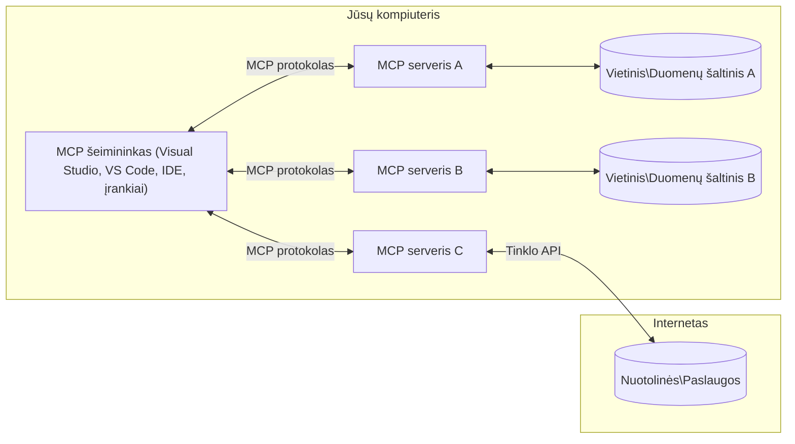

# MCP Pagrindinės Sąvokos: Modelio Konteksto Protokolo Įvaldymas AI Integracijai

[](https://youtu.be/earDzWGtE84)

_(Spustelėkite aukščiau esantį paveikslėlį, kad peržiūrėtumėte šios pamokos vaizdo įrašą)_

[Modelio Konteksto Protokolas (MCP)](https://github.com/modelcontextprotocol) yra galinga, standartizuota sistema, kuri optimizuoja komunikaciją tarp Didelių Kalbos Modelių (LLM) ir išorinių įrankių, programų bei duomenų šaltinių.  
Šis vadovas supažindins jus su MCP pagrindinėmis sąvokomis. Sužinosite apie jo klientų-serverių architektūrą, svarbiausius komponentus, komunikacijos mechanizmus ir įgyvendinimo gerąsias praktikas.

- **Aiškus Vartotojo Sutikimas**: Visas prieigos prie duomenų ir operacijų vykdymas reikalauja aiškaus vartotojo patvirtinimo prieš vykdymą. Vartotojai turi aiškiai suprasti, kokie duomenys bus pasiekiami ir kokie veiksmai bus atliekami, turėdami galimybę smulkiai kontroliuoti leidimus ir autorizacijas.

- **Duomenų Privatumo Apsauga**: Vartotojo duomenys yra atskleidžiami tik su aiškiu sutikimu ir turi būti saugomi naudojant tvirtus prieigos kontrolės mechanizmus per visą sąveikos laikotarpį. Įgyvendinimai turi užkirsti kelią neįgaliotam duomenų perdavimui ir laikytis griežtų privatumo ribų.

- **Įrankių Vykdymo Sauga**: Kiekvienas įrankio kvietimas reikalauja aiškaus vartotojo sutikimo su aiškiu supratimu apie įrankio funkcionalumą, parametrus ir galimą poveikį. Reikalingos tvirtos saugumo ribos, kad būtų užkirstas kelias neplanuotam, nesaugiam ar kenksmingam įrankių vykdymui.

- **Transporto Lygmens Saugumas**: Visos komunikacijos kanalai turi naudoti tinkamus šifravimo ir autentifikavimo mechanizmus. Nuotoliniai ryšiai turi įgyvendinti saugius transporto protokolus ir tinkamą kredencialų valdymą.

#### Įgyvendinimo gaires:

- **Leidimų Valdymas**: Įgyvendinkite smulkiai valdomas leidimų sistemas, kurios leidžia vartotojams kontroliuoti, prie kurių serverių, įrankių ir išteklių galima prieiti
- **Autentifikacija ir Autorizacija**: Naudokite saugius autentifikacijos metodus (OAuth, API raktus) su tinkamu žetonų valdymu ir galiojimo laikų nustatymu  
- **Įvesties Patikrinimas**: Patikrinkite visus parametrus ir duomenų įvestis pagal apibrėžtas schemas, kad būtų išvengta injekcijos atakų
- **Audito Įrašai**: Laikykite išsamius visų operacijų įrašus saugumo stebėsenai ir atitikčiai

## Apžvalga

Šioje pamokoje nagrinėjama pagrindinė Modelio Konteksto Protokolo (MCP) ekosistemos architektūra ir komponentai. Sužinosite apie klientų-serverių architektūrą, reikšmingus komponentus ir komunikacijos mechanizmus, kurie užtikrina MCP sąveikas.

## Svarbiausi mokymosi tikslai

Šios pamokos pabaigoje jūs:

- Suprasite MCP klientų-serverių architektūrą.
- Atpažinsite šeimininkų, klientų ir serverių vaidmenis ir atsakomybes.
- Išanalizuosite pagrindines savybes, dėl kurių MCP yra lankstus integracijos sluoksnis.
- Sužinosite, kaip teka informacija MCP ekosistemoje.
- Įgysite praktinių įžvalgų per kodo pavyzdžius .NET, Java, Python ir JavaScript kalbomis.

## MCP Architektūra: Gilus Žvilgsnis

MCP ekosistema yra paremta klientų-serverių modeliu. Ši modulinė struktūra leidžia DI programoms efektyviai sąveikauti su įrankiais, duomenų bazėmis, API ir kontekstiniais ištekliais. Suskirstykime šią architektūrą į pagrindinius komponentus.

Iš esmės MCP laikosi klientų-serverių architektūros, kur šeimininko programa gali jungtis prie kelių serverių:


- **MCP Šeimininkai**: Programos, tokios kaip VSCode, Claude Desktop, IDE ar DI įrankiai, norintys pasiekti duomenis per MCP  
- **MCP Klientai**: Protokolo klientai, palaikantys 1:1 ryšius su serveriais  
- **MCP Serveriai**: Lengvos programos, kurios kiekviena per standartizuotą Modelio Konteksto Protokolą teikia konkrečias galimybes  
- **Vietiniai Duomenų Šaltiniai**: Jūsų kompiuterio failai, duomenų bazės ir paslaugos, prie kurių MCP serveriai gali saugiai prieiti  
- **Nuotolinės Paslaugos**: Išorinės sistemos, prieinamos internetu, prie kurių MCP serveriai gali jungtis per API.

MCP Protokolas yra evoliucionuojantis standartas, naudojantis datos pagrindu versijavimą (formatu YYYY-MM-DD). Dabartinė protokolo versija yra **2025-11-25**. Naujausią informaciją apie [protokolo specifikaciją](https://modelcontextprotocol.io/specification/2025-11-25/) galite rasti čia.

### 1. Šeimininkai

Modelio Konteksto Protokole (MCP), **šeimininkai** yra DI programos, veikiančios kaip pagrindinė vartotojų sąsaja, per kurią vartotojai sąveikauja su protokolu. Šeimininkai koordinuoja ir valdo ryšius su keliais MCP serveriais, sukurdami atskirą MCP klientą kiekvienam serverio ryšiui. Pavyzdžiai:

- **DI Programos**: Claude Desktop, Visual Studio Code, Claude Code  
- **Kūrimo Aplinkos**: IDE ir kodo redaktoriai su MCP integracija  
- **Specializuotos Programos**: Tikslingai sukurtos DI agentūros ir įrankiai

**Šeimininkai** yra programos, koordinuojančios DI modelių sąveiką. Jie:

- **Orkestruoja DI Modelius**: Atlieka ar sąveikauja su LLM, generuoja atsakymus ir koordinuoja DI darbo eigą  
- **Valdo Klientų Ryšius**: Sukuria ir palaiko po vieną MCP klientą kiekvienam MCP serverio ryšiui  
- **Valdo Vartotojo Sąsają**: Tvarko pokalbių eigos valdymą, vartotojų sąveikas ir atsakymų pateikimą  
- **Įgyvendina Saugumą**: Kontroliuoja leidimus, saugumo ribas ir autentifikaciją  
- **Tvarko Vartotojo Sutikimą**: Valdo vartotojo patvirtinimus dėl duomenų dalijimosi ir įrankių vykdymo

### 2. Klientai

**Klientai** yra esminiai komponentai, palaikantys specializuotus vienas su vienu ryšius tarp šeimininkų ir MCP serverių. Kiekvienas MCP klientas yra inicijuojamas šeimininko, kad prisijungtų prie konkretaus MCP serverio, užtikrinant organizuotus ir saugius komunikacijos kanalus. Daug klientų leidžia šeimininkams vienu metu jungtis prie kelių serverių.

**Klientai** yra jungties komponentai šeimininko programoje. Jie:

- **Protokolo Komunikacija**: Siunčia JSON-RPC 2.0 užklausas serveriams su užuominomis ir instrukcijomis  
- **Galimybių Derybos**: Derinasi dėl palaikomų funkcijų ir protokolo versijų su serveriais inicializacijos metu  
- **Įrankių Vykdymas**: Tvarko įrankio vykdymo užklausas iš modelių ir apdoroja atsakymus  
- **Realaus Laiko Atnaujinimai**: Tvarko pranešimus ir realaus laiko atnaujinimus iš serverių  
- **Atsakymų Apdorojimas**: Apdoroja ir formatuoja serverių atsakymus vartotojams rodyti

### 3. Serveriai

**Serveriai** yra programos, teikiančios kontekstą, įrankius ir galimybes MCP klientams. Jie gali veikti vietoje ( toje pačioje mašinoje kaip šeimininkas) arba nuotoliniu būdu (išorinėse platformose) ir atsako už klientų užklausų apdorojimą bei struktūrizuotų atsakymų teikimą. Serveriai per standartizuotą Modelio Konteksto Protokolą suteikia konkrečią funkcionalumą.

**Serveriai** yra paslaugos, teikiančios kontekstą ir galimybes. Jie:

- **Funkcijų Registracija**: Registruoja ir atskleidžia klientams prieinamus primityvus (ištekliai, užuominos, įrankiai)  
- **Užklausų Apdorojimas**: Priima ir vykdo įrankių kvietimus, išteklių užklausas ir užuominų užklausas iš klientų  
- **Konteksto Teikimas**: Teikia kontekstinę informaciją ir duomenis, kad pagerintų modelio atsakymus  
- **Būseno Valdymas**: Laiko sesijos būseną ir tvarko būsenoje išlikusias sąveikas, kai reikia  
- **Realaus Laiko Pranešimai**: Siunčia pranešimus apie galimybių pakeitimus ir atnaujinimus prijungtiems klientams

Serverius gali kurti bet kas, kad praplėstų modelio galimybes specializuota funkcionalumu, ir jie palaiko tiek vietinius, tiek nuotolinius diegimo scenarijus.

### 4. Serverio Primityvai

Modelio Konteksto Protokolo (MCP) serveriai teikia tris pagrindinius **primityvus**, kurie apibrėžia pagrindinius blokelius turtingoms sąveikoms tarp klientų, šeimininkų ir kalbos modelių. Šie primityvai nurodo kontekstinės informacijos ir veiksmų tipus, prieinamus per protokolą.

MCP serveriai gali atskleisti bet kokią šių trijų pagrindinių primityvų kombinaciją:

#### Ištekliai

**Ištekliai** yra duomenų šaltiniai, teikiantys kontekstinę informaciją DI programoms. Jie atstovauja statinį arba dinaminį turinį, kuris gali pagerinti modelio supratimą ir sprendimų priėmimą:

- **Kontekstinė Informacija**: Struktūruota informacija ir kontekstas DI modeliui  
- **Žinių Bazės**: Dokumentų saugyklos, straipsniai, vadovai ir moksliniai darbai  
- **Vietiniai Duomenų Šaltiniai**: Failai, duomenų bazės ir vietinė sistemos informacija  
- **Išoriniai Duomenys**: API atsakymai, interneto paslaugos ir nuotoliniai sistemos duomenys  
- **Dinaminis Turinys**: Realiojo laiko duomenys, kurie atnaujinami pagal išorines sąlygas

Ištekliai identifikuojami URI ir palaiko atradimą per `resources/list`, bei gavimą per `resources/read` metodus:

```text
file://documents/project-spec.md
database://production/users/schema
api://weather/current
```
  
#### Užuominos

**Užuominos** yra pakartotinai naudojami šablonai, padedantys struktūruoti sąveikas su kalbos modeliais. Jos suteikia standartizuotus sąveikos šablonus ir šabloninius darbo srautus:

- **Šablonu pagrįstos sąveikos**: Iš anksto struktūruoti pranešimai ir pokalbių pradmenys  
- **Darbo srautų šablonai**: Standartizuotos sekos bendroms užduotims ir sąveikoms  
- **Pavyzdiniai šablonai**: Šablonai su pavyzdžiais modelio instrukcijoms  
- **Sisteminės užuominos**: Pagrindinės užuominos, apibrėžiančios modelio elgseną ir kontekstą  
- **Dinaminių šablonai**: Parametrizuotos užuominos, prisitaikančios prie konkrečių kontekstų

Užuominos palaiko kintamųjų keitimą ir gali būti randamos per `prompts/list` bei gaunamos su `prompts/get`:

```markdown
Generate a {{task_type}} for {{product}} targeting {{audience}} with the following requirements: {{requirements}}
```
  
#### Įrankiai

**Įrankiai** yra vykdomos funkcijos, kurias DI modeliai gali iškviesti atlikti specifinius veiksmus. Jie atspindi MCP ekosistemos "veiksmažodžius", leidžiančius modeliams sąveikauti su išorinėmis sistemomis:

- **Vykdomos funkcijos**: Atskiri veiksmai, kuriuos modeliai gali iškviesti su specifiniais parametrais  
- **Išorinės sistemos integracija**: API kvietimai, duomenų bazės užklausos, failų operacijos, skaičiavimai  
- **Unikali tapatybė**: Kiekvienas įrankis turi unikalų pavadinimą, aprašymą ir parametrų schemą  
- **Struktūruota I/O**: Įrankiai priima patikrintus parametrus ir grąžina struktūrizuotus, tipizuotus atsakymus  
- **Veiksmų galimybės**: Leidžia modeliams atlikti realaus pasaulio veiksmus ir gauti gyvus duomenis

Įrankiai aprašomi JSON Schema, kad būtų vykdoma parametrų validacija, ir atrandami per `tools/list`, vykdomi per `tools/call`. Įrankiai taip pat gali turėti **piktogramas** kaip papildomą metaduomenį geresniam vartotojo sąsajos pristatymui.

**Įrankių Anotacijos**: Įrankiai palaiko elgesio anotacijas (pvz., `readOnlyHint`, `destructiveHint`), kurios nurodo, ar įrankis yra tik skaitymui skirtas arba destruktyvus, padedančios klientams priimti informuotus sprendimus dėl įrankio vykdymo.

Pavyzdinė įrankio apibrėžtis:

```typescript
server.tool(
  "search_products", 
  {
    query: z.string().describe("Search query for products"),
    category: z.string().optional().describe("Product category filter"),
    max_results: z.number().default(10).describe("Maximum results to return")
  }, 
  async (params) => {
    // Vykdyti paiešką ir grąžinti struktūrizuotus rezultatus
    return await productService.search(params);
  }
);
```
  
## Klientų Primityvai

Modelio Konteksto Protokole (MCP), **klientai** gali atskleisti primityvus, kurie leidžia serveriams prašyti papildomų galimybių iš šeimininko programos. Šie klientų pusės primityvai leidžia turtingesnes, interaktyvesnes serverių įgyvendinimo galimybes, galinčias pasiekti DI modelio galimybes ir vartotojo sąveikas.

### Imtinių (Sampling)

**Imtinės** leidžia serveriams prašyti kalbos modelio pabaigų iš kliento DI programos. Šis primityvas leidžia serveriams naudotis LLM galimybėmis, nepateikiant savo modelio priklausomybių:

- **Modelio Nepriklausoma Prieiga**: Serveriai gali prašyti generuoti atsakymus be LLM SDK ar valdymo  
- **Serverio Inicijuotas DI**: Leidžia serveriams savarankiškai generuoti turinį naudodami kliento DI modelį  
- **Rekursyvios LLM Sąveikos**: Palaiko sudėtingas situacijas, kai serveriams reikalinga DI pagalba apdorojimui  
- **Dinaminis Turinio Generavimas**: Leidžia serveriams kurti kontekstinius atsakymus naudojant šeimininko modelį  
- **Įrankių Kvietimų Parama**: Serveriai gali įtraukti `tools` ir `toolChoice` parametrus, kad leistų kliento modeliui vykdyti įrankius imtinių metu

Imtinės inicijuojamos per `sampling/complete` metodą, kuriuo serveriai siunčia užklausas klientams.

### Šaknys (Roots)

**Šaknys** suteikia standartizuotą būdą klientams atskleisti failų sistemos ribas serveriams, padedant serveriams suprasti, kurias direktorijas ir failus jie gali pasiekti:

- **Failų Sistemos Ribos**: Nustato ribas, kur serveriai gali veikti failų sistemoje  
- **Prieigos Kontrolė**: Padeda serveriams suprasti, prie kurių katalogų ir failų jie turi leidimą prieiti  
- **Dinaminiai Atnaujinimai**: Klientai gali informuoti serverius, kai šaknų sąrašas keičiasi  
- **URI pagrindu identifikavimas**: Šaknys naudoja `file://` URI, identifikuojančius prieinamus katalogus ir failus

Šaknys randamos per `roots/list` metodą, o klientai siunčia `notifications/roots/list_changed`, kai šaknys keičiasi.

### Klausinėjimas (Elicitation)

**Klausinėjimas** leidžia serveriams prašyti papildomos informacijos arba patvirtinimo iš vartotojų per kliento sąsają:

- **Vartotojo Įvesties Pateikimas**: Serveriai gali prašyti papildomos informacijos, kai to reikia įrankių vykdymui  
- **Patvirtinimo Dialogai**: Prašo vartotojo patvirtinimo jautriems ar svarbiems veiksmams  
- **Interaktyvūs Darbo Srautai**: Leidžia serveriams kurti žingsnis po žingsnio vartotojo sąveikas  
- **Dinaminis Parametrų Rinkimas**: Surenka trūkstamus arba pasirenkamus parametrus įrankių vykdymo metu

Klausinėjimo užklausos atliekamos naudojant `elicitation/request` metodą, kad būtų surinkta vartotojo įvestis per kliento sąsają.

**URL Režimo Klausinėjimas**: Serveriai taip pat gali prašyti URL pagrindu veikiančių vartotojo sąveikų, leidžiančių nukreipti vartotojus į išorines interneto svetaines autentifikavimui, patvirtinimui ar duomenų įvedimui.

### Registravimas (Logging)

**Registravimas** leidžia serveriams siųsti struktūruotus logų pranešimus klientams, skirtus klaidų diagnozavimui, stebėsenai ir operaciniam matomumui:

- **Klaidų Nustatymo Parama**: Leidžia serveriams pateikti detalius vykdymo įrašus trikčiai spręsti  
- **Operacijų Stebėsena**: Siunčia būsenos atnaujinimus ir našumo metriką klientams  
- **Klaidų Ataskaitos**: Teikia išsamią klaidų kontekstinę ir diagnostinę informaciją  
- **Audito Takeliai**: Kuria išsamius serverio veiksmų ir sprendimų įrašus

Registravimo pranešimai siunčiami klientams, kad būtų užtikrintas skaidrumas dėl serverių veiklos ir palengvintas klaidų radimas.

## Informacijos Srautas MCP

Modelio Konteksto Protokolas (MCP) apibrėžia struktūruotą informacijos srautą tarp šeimininkų, klientų, serverių ir modelių. Šio srauto supratimas padeda aiškiai matyti, kaip apdorojami vartotojo prašymai ir kaip išoriniai įrankiai bei duomenys integruojami į modelio atsakymus.

- **Šeimininkas Inicializuoja Ryšį**  
  Šeimininko programa (pvz., IDE ar pokalbių sąsaja) užmezga ryšį su MCP serveriu, paprastai per STDIO, WebSocket arba kitą palaikomą transportą.

- **Galimybių Derybos**  
  Klientas (integruotas į šeimininką) ir serveris keičiasi informacija apie palaikomas funkcijas, įrankius, išteklius ir protokolo versijas. Tai užtikrina abipusį supratimą apie sesijos galimybes.

- **Vartotojo Prašymas**  
  Vartotojas sąveikauja su šeimininku (pvz., įveda užuominą ar komandą). Šeimininkas surenka šį įvestį ir perduoda klientui apdorojimui.

- **Ištekliaus ar Įrankio Naudojimas**  
  - Klientas gali paprašyti papildomo konteksto ar išteklių iš serverio (pvz., failų, duomenų bazių įrašų ar žinių bazės straipsnių), kad praturtintų modelio supratimą.  
  - Jei modelis nusprendžia, kad reikia įrankio (pvz., duomenų gavimui, skaičiavimo atlikimui ar API kvietimui), klientas siunčia įrankio kvietimo užklausą serveriui, nurodydamas įrankio pavadinimą ir parametrus.

- **Serverio Vykdymas**  
Serveris gauna išteklių ar įrankių užklausą, atlieka reikiamus veiksmus (pvz., vykdo funkciją, užklausia duomenų bazę ar atsiunčia failą) ir grąžina rezultatus klientui struktūrizuotu formatu.

- **Atsakymo generavimas**  
  Klientas integruoja serverio atsakymus (išteklių duomenis, įrankių rezultatus ir kt.) į vykstantį modelio sąveikos procesą. Modelis naudoja šią informaciją, kad sugeneruotų išsamų ir kontekstualiai tinkamą atsakymą.

- **Rezultatų pateikimas**  
  Pagrindinė sistema gauna galutinį klientų išvestį ir pateikia ją vartotojui, dažnai įtraukdama tiek modelio sugeneruotą tekstą, tiek įrankių vykdymo ar išteklių paieškos rezultatus.

Šis srautas leidžia MCP palaikyti pažangias, interaktyvias ir kontekstualiai jautrias dirbtinio intelekto programas, sklandžiai sujungiant modelius su išoriniais įrankiais ir duomenų šaltiniais.

## Protokolo architektūra ir sluoksniai

MCP susideda iš dviejų atskirų architektūrinių sluoksnių, kurie kartu sudaro pilną komunikacijos sistemą:

### Duomenų sluoksnis

**Duomenų sluoksnis** įgyvendina pagrindinį MCP protokolą, naudojant **JSON-RPC 2.0** kaip pagrindą. Šis sluoksnis apibrėžia žinučių struktūrą, semantiką ir sąveikos modelius:

#### Pagrindiniai komponentai:

- **JSON-RPC 2.0 protokolas**: visa komunikacija vyksta pagal standartizuotą JSON-RPC 2.0 žinučių formatą metodų kvietimams, atsakymams ir pranešimams
- **Gyvavimo ciklo valdymas**: tvarko ryšio inicializavimą, galimybių derybas ir sesijos nutraukimą tarp klientų ir serverių
- **Serverio primityvai**: leidžia serveriams teikti pagrindines funkcijas per įrankius, išteklius ir užklausas
- **Kliento primityvai**: leidžia serveriams prašyti LLM imčių, vartotojo įvesties ir siųsti žurnalo pranešimus
- **Realaus laiko pranešimai**: palaiko asinchroninius pranešimus dinamiškiems atnaujinimams be nuolatinio tikrinimo

#### Svarbiausios savybės:

- **Protokolo versijos derybos**: naudoja datos pagrindu grindžiamą versijavimą (YYYY-MM-DD), kad užtikrintų suderinamumą
- **Galimybių atradimas**: klientai ir serveriai keičiasi palaikomų funkcijų informacija inicializavimo metu
- **Būsenos išlaikymas**: palaiko ryšio būseną per kelias sąveikas, kad būtų išlaikyta konteksto tęstinumas

### Transporto sluoksnis

**Transporto sluoksnis** valdo komunikacijos kanalus, žinučių formavimą ir autentifikavimą tarp MCP dalyvių:

#### Palaikomi transporto mechanizmai:

1. **STDIO transportas**:
   - naudoja standartinius įvesties/išvesties srautus tiesioginei procesų komunikacijai
   - optimalus vietiniams procesams tame pačiame įrenginyje be tinklo vėlavimų
   - dažnai naudojamas vietinėms MCP serverio implementacijoms

2. **Streamable HTTP transportas**:
   - naudoja HTTP POST klientų-siuntėjų žinutėms  
   - neprivaloma Server-Sent Events (SSE) serverio-kliento srautui
   - leidžia nuotolinę serverių komunikaciją per tinklus
   - palaiko standartinę HTTP autentifikaciją (nešėjo žetonai, API raktai, nestandartiniai antraštės)
   - MCP rekomenduoja OAuth saugiai autentifikacijai su žetonais

#### Transporto abstrakcija:

Transporto sluoksnis abstrahuoja komunikacijos detales nuo duomenų sluoksnio, leidžiant naudoti tą patį JSON-RPC 2.0 žinučių formatą visuose transporto mechanizmuose. Ši abstrakcija leidžia programoms sklandžiai pereiti tarp vietinių ir nuotolinių serverių.

### Saugumo aspektai

MCP įgyvendinimai turi laikytis kelių svarbių saugumo principų, užtikrinančių saugias, patikimas ir saugias sąveikas per visą protokolo veikimą:

- **Vartotojo sutikimas ir valdymas**: vartotojai turi aiškiai sutikti prieš gaunant duomenis ar atliekant veiksmus. Jie turi aiškiai kontroliuoti, kokie duomenys dalijami ir kuriems veiksmams suteikiamas leidimas, palaikomi intuityvios vartotojo sąsajos peržiūrai ir veiksmų patvirtinimui.

- **Duomenų privatumas**: vartotojo duomenys atskleidžiami tik gavus aiškų sutikimą ir privalo būti apsaugoti tinkamomis prieigos kontrolėmis. MCP įgyvendinimai turi apsaugoti nuo neteisėtos duomenų perdavimo ir užtikrinti privatumo išlaikymą per visas sąveikas.

- **Įrankių saugumas**: prieš kviečiant bet kurį įrankį reikia gauti aiškų vartotojo sutikimą. Vartotojai turi aiškiai suprasti kiekvieno įrankio funkcionalumą, o griežtos saugumo ribos turi užkirsti kelią neplanuotam ar nesaugiam įrankių vykdymui.

Laikantis šių saugumo principų, MCP užtikrina vartotojų pasitikėjimą, privatumą ir saugumą per visus protokolo veiksmus, taip pat leidžia galingas DI integracijas.

## Kodo pavyzdžiai: pagrindiniai komponentai

Žemiau pateikti kelių populiarių programavimo kalbų kodo pavyzdžiai, iliustruojantys, kaip įgyvendinti pagrindinius MCP serverio komponentus ir įrankius.

### .NET pavyzdys: paprasto MCP serverio kūrimas su įrankiais

Čia pateiktas praktinis .NET kodo pavyzdys, demonstruojantis, kaip įgyvendinti paprastą MCP serverį su pritaikytais įrankiais. Šis pavyzdys rodo, kaip apibrėžti ir užregistruoti įrankius, tvarkyti užklausas ir prijungti serverį naudojant Model Context Protocol.

```csharp
using System;
using System.Threading.Tasks;
using ModelContextProtocol.Server;
using ModelContextProtocol.Server.Transport;
using ModelContextProtocol.Server.Tools;

public class WeatherServer
{
    public static async Task Main(string[] args)
    {
        // Create an MCP server
        var server = new McpServer(
            name: "Weather MCP Server",
            version: "1.0.0"
        );
        
        // Register our custom weather tool
        server.AddTool<string, WeatherData>("weatherTool", 
            description: "Gets current weather for a location",
            execute: async (location) => {
                // Call weather API (simplified)
                var weatherData = await GetWeatherDataAsync(location);
                return weatherData;
            });
        
        // Connect the server using stdio transport
        var transport = new StdioServerTransport();
        await server.ConnectAsync(transport);
        
        Console.WriteLine("Weather MCP Server started");
        
        // Keep the server running until process is terminated
        await Task.Delay(-1);
    }
    
    private static async Task<WeatherData> GetWeatherDataAsync(string location)
    {
        // This would normally call a weather API
        // Simplified for demonstration
        await Task.Delay(100); // Simulate API call
        return new WeatherData { 
            Temperature = 72.5,
            Conditions = "Sunny",
            Location = location
        };
    }
}

public class WeatherData
{
    public double Temperature { get; set; }
    public string Conditions { get; set; }
    public string Location { get; set; }
}
```

### Java pavyzdys: MCP serverio komponentai

Šiame pavyzdyje demonstruojama ta pati MCP serverio ir įrankių registracija kaip aukščiau pateiktame .NET pavyzdyje, tačiau įgyvendinta Java kalba.

```java
import io.modelcontextprotocol.server.McpServer;
import io.modelcontextprotocol.server.McpToolDefinition;
import io.modelcontextprotocol.server.transport.StdioServerTransport;
import io.modelcontextprotocol.server.tool.ToolExecutionContext;
import io.modelcontextprotocol.server.tool.ToolResponse;

public class WeatherMcpServer {
    public static void main(String[] args) throws Exception {
        // Sukurkite MCP serverį
        McpServer server = McpServer.builder()
            .name("Weather MCP Server")
            .version("1.0.0")
            .build();
            
        // Užregistruokite oro sąlygų įrankį
        server.registerTool(McpToolDefinition.builder("weatherTool")
            .description("Gets current weather for a location")
            .parameter("location", String.class)
            .execute((ToolExecutionContext ctx) -> {
                String location = ctx.getParameter("location", String.class);
                
                // Gaukite oro duomenis (supaprastinta)
                WeatherData data = getWeatherData(location);
                
                // Grąžinkite suformatuotą atsakymą
                return ToolResponse.content(
                    String.format("Temperature: %.1f°F, Conditions: %s, Location: %s", 
                    data.getTemperature(), 
                    data.getConditions(), 
                    data.getLocation())
                );
            })
            .build());
        
        // Prijunkite serverį naudojant stdio transportą
        try (StdioServerTransport transport = new StdioServerTransport()) {
            server.connect(transport);
            System.out.println("Weather MCP Server started");
            // Laikykite serverį veikiančią, kol procesas bus nutrauktas
            Thread.currentThread().join();
        }
    }
    
    private static WeatherData getWeatherData(String location) {
        // Įgyvendinimas kviečia oro sąlygų API
        // Supaprastinta pavyzdinio naudojimo tikslais
        return new WeatherData(72.5, "Sunny", location);
    }
}

class WeatherData {
    private double temperature;
    private String conditions;
    private String location;
    
    public WeatherData(double temperature, String conditions, String location) {
        this.temperature = temperature;
        this.conditions = conditions;
        this.location = location;
    }
    
    public double getTemperature() {
        return temperature;
    }
    
    public String getConditions() {
        return conditions;
    }
    
    public String getLocation() {
        return location;
    }
}
```

### Python pavyzdys: MCP serverio kūrimas

Šiame pavyzdyje naudojamas fastmcp, todėl prašome jį pirmiausiai įdiegti:

```python
pip install fastmcp
```
Kodo pavyzdys:

```python
#!/usr/bin/env python3
import asyncio
from fastmcp import FastMCP
from fastmcp.transports.stdio import serve_stdio

# Sukurkite FastMCP serverį
mcp = FastMCP(
    name="Weather MCP Server",
    version="1.0.0"
)

@mcp.tool()
def get_weather(location: str) -> dict:
    """Gets current weather for a location."""
    return {
        "temperature": 72.5,
        "conditions": "Sunny",
        "location": location
    }

# Alternatyvus požiūris naudojant klasę
class WeatherTools:
    @mcp.tool()
    def forecast(self, location: str, days: int = 1) -> dict:
        """Gets weather forecast for a location for the specified number of days."""
        return {
            "location": location,
            "forecast": [
                {"day": i+1, "temperature": 70 + i, "conditions": "Partly Cloudy"}
                for i in range(days)
            ]
        }

# Užregistruokite klasės įrankius
weather_tools = WeatherTools()

# Paleiskite serverį
if __name__ == "__main__":
    asyncio.run(serve_stdio(mcp))
```

### JavaScript pavyzdys: MCP serverio kūrimas

Šiame pavyzdyje rodoma, kaip sukurti MCP serverį JavaScript kalba ir kaip užregistruoti du oru susijusius įrankius.

```javascript
// Naudojant oficialų Model Context Protocol SDK
import { McpServer } from "@modelcontextprotocol/sdk/server/mcp.js";
import { StdioServerTransport } from "@modelcontextprotocol/sdk/server/stdio.js";
import { z } from "zod"; // Parametrų tikrinimui

// Sukurti MCP serverį
const server = new McpServer({
  name: "Weather MCP Server",
  version: "1.0.0"
});

// Apibrėžti orų įrankį
server.tool(
  "weatherTool",
  {
    location: z.string().describe("The location to get weather for")
  },
  async ({ location }) => {
    // Paprastai tai kviečia orų API
    // Supaprastinta demonstracijai
    const weatherData = await getWeatherData(location);
    
    return {
      content: [
        { 
          type: "text", 
          text: `Temperature: ${weatherData.temperature}°F, Conditions: ${weatherData.conditions}, Location: ${weatherData.location}` 
        }
      ]
    };
  }
);

// Apibrėžti prognozių įrankį
server.tool(
  "forecastTool",
  {
    location: z.string(),
    days: z.number().default(3).describe("Number of days for forecast")
  },
  async ({ location, days }) => {
    // Paprastai tai kviečia orų API
    // Supaprastinta demonstracijai
    const forecast = await getForecastData(location, days);
    
    return {
      content: [
        { 
          type: "text", 
          text: `${days}-day forecast for ${location}: ${JSON.stringify(forecast)}` 
        }
      ]
    };
  }
);

// Pagalbinės funkcijos
async function getWeatherData(location) {
  // Simuliuoti API kvietimą
  return {
    temperature: 72.5,
    conditions: "Sunny",
    location: location
  };
}

async function getForecastData(location, days) {
  // Simuliuoti API kvietimą
  return Array.from({ length: days }, (_, i) => ({
    day: i + 1,
    temperature: 70 + Math.floor(Math.random() * 10),
    conditions: i % 2 === 0 ? "Sunny" : "Partly Cloudy"
  }));
}

// Prisijungti prie serverio naudojant stdio transportą
const transport = new StdioServerTransport();
server.connect(transport).catch(console.error);

console.log("Weather MCP Server started");
```

Šis JavaScript pavyzdys demonstruoja, kaip sukurti MCP klientą, kuris jungiasi prie serverio, siunčia užklausą ir apdoroja atsakymą, įskaitant visas įrankių kvietimų vykdymo detales.

## Saugumas ir autorizacija

MCP apima keletą įmontuotų koncepcijų ir mechanizmų, skirtų saugumui ir autorizacijai valdyti per visą protokolo veikimą:

1. **Įrankių leidimų valdymas**:  
  Klientai gali nurodyti, kuriuos įrankius modelis gali naudoti sesijos metu. Tai užtikrina, kad prieinami būtų tik aiškiai įgalioti įrankiai, sumažinant nepageidautinų ar nesaugių veiksmų riziką. Leidimai gali būti dinamiškai nustatomi pagal vartotojų pageidavimus, organizacijos politiką ar sąveikos kontekstą.

2. **Autentifikacija**:  
  Serveriai gali reikalauti autentifikacijos prieš suteikiant prieigą prie įrankių, išteklių ar jautrių veiksmų. Tai gali būti API raktai, OAuth žetonai ar kitos autentifikacijos schemos. Teisinga autentifikacija užtikrina, kad tik patikimi klientai ir vartotojai galėtų naudoti serverio galimybes.

3. **Patikra**:  
  Visi įrankių kvietimai turi parametrų patikrą. Kiekvienas įrankis apibrėžia parametrų laukiamus tipus, formatus ir apribojimus, o serveris patikrina gaunamas užklausas. Tai apsaugo nuo netinkamos ar kenksmingos įvesties pateikimo į įrankių įgyvendinimą ir padeda išlaikyti veiksmų vientisumą.

4. **Pralaidumo ribojimas**:  
  Siekiant apsaugoti nuo piktnaudžiavimo ir užtikrinti teisingą serverio išteklių naudojimą, MCP serveriai gali taikyti kvietimų įrankiams ir prieigos prie išteklių pralaidumo ribojimą. Pralaidumo ribos gali būti taikomos pagal vartotoją, sesiją arba globaliai, padedančios apsisaugoti nuo paslaugos atsisakymo atakų ar per didelio išteklių sunaudojimo.

Derinant šiuos mechanizmus MCP suteikia saugią platformą integruoti kalbos modelius su išoriniais įrankiais ir duomenų šaltiniais, kartu suteikiant vartotojams ir kūrėjams detalias priemones prieigos ir naudojimo kontrolei.

## Protokolo žinutės ir komunikacijos srautas

MCP komunikacijai naudojamos struktūruotos **JSON-RPC 2.0** žinutės, leidžiančios užtikrinti aiškią ir patikimą sąveiką tarp pagrindų, klientų ir serverių. Protokolas apibrėžia specifinius žinučių modelius įvairiems veiksmų tipams:

### Pagrindinės žinutės rūšys:

#### **Inicializacijos žinutės**
- **`initialize` užklausa**: užmezga ryšį ir derasi dėl protokolo versijos bei galimybių
- **`initialize` atsakymas**: patvirtina palaikomas funkcijas ir serverio informaciją  
- **`notifications/initialized`**: signalizuoja, kad inicializacija baigta ir sesija pasirengusi

#### **Atradimo žinutės**
- **`tools/list` užklausa**: atranda serverio siūlomus įrankius
- **`resources/list` užklausa**: išvardina turimus išteklius (duomenų šaltinius)
- **`prompts/list` užklausa**: gauna turimus užklausų šablonus

#### **Vykdymo žinutės**  
- **`tools/call` užklausa**: vykdo konkretų įrankį su pateiktais parametrais
- **`resources/read` užklausa**: gauna turinį iš konkretaus ištekliaus
- **`prompts/get` užklausa**: ištraukia užklausos šabloną su neprivalomais parametrais

#### **Kliento pusės žinutės**
- **`sampling/complete` užklausa**: serveris prašo užbaigimo iš LLM per klientą
- **`elicitation/request`**: serveris prašo vartotojo įvesties per kliento sąsają
- Žurnalo žinutės: serveris siunčia struktūruotus žurnalo pranešimus klientui

#### **Pranešimų žinutės**
- **`notifications/tools/list_changed`**: serveris informuoja klientą apie įrankių pakeitimus
- **`notifications/resources/list_changed`**: serveris informuoja klientą apie išteklių pakeitimus  
- **`notifications/prompts/list_changed`**: serveris informuoja klientą apie užklausų šablonų pakeitimus

### Žinučių struktūra:

Visos MCP žinutės atitinka JSON-RPC 2.0 formatą su:
- **Užklausos žinutėmis**: turi `id`, `method` ir neprivalomus `params`
- **Atsakymo žinutėmis**: turi `id` ir arba `result`, arba `error`  
- **Pranešimų žinutėmis**: turi `method` ir neprivalomus `params` (nėra `id`, nereikalaujama atsakymo)

Ši struktūruota komunikacija užtikrina patikimas, sekančias ir plečiamas sąveikas, palaikančias pažangias scenarijus, tokias kaip realaus laiko atnaujinimai, įrankių grandinavimas ir patikimas klaidų tvarkymas.

### Užduotys (Eksperimentinė funkcija)

**Užduotys** yra eksperimentinė funkcija, suteikianti tvirtus vykdymo apvalkalus, leidžiančius atidėtą rezultatų gavimą ir būseno stebėjimą MCP užklausų atveju:

- **Ilgalaikės operacijos**: seka brangias kompiuterines užduotis, darbų automatizavimą ir partijų apdorojimą
- **Atidėti rezultatai**: leidžia tikrinti užduoties būseną ir gauti rezultatus operacijoms užbaigus
- **Būseno stebėjimas**: stebi užduoties eigą per apibrėžtas gyvavimo ciklo būsenas
- **Daugiapakopės operacijos**: palaiko sudėtingus darbo procesus, apimančius kelias sąveikas

Užduotys apgaubia standartines MCP užklausas, leisdamos naudoti asinchroninius vykdymo modelius operacijoms, kurios negali būti įvykdytos iš karto.

## Pagrindinės pastabos

- **Architektūra**: MCP naudoja klientas-serveris architektūrą, kur pagrindai valdo kelis klientų ryšius su serveriais
- **Dalyviai**: ekosistemoje yra pagrindai (DI programos), klientai (protokolo jungtys) ir serveriai (galimybių teikėjai)
- **Transporto mechanizmai**: komunikacija palaiko STDIO (vietinį) ir Streamable HTTP su neprivalomu SSE (nuotolinį)
- **Pagrindiniai primityvai**: serveriai eksponuoja įrankius (vykdomas funkcijas), išteklius (duomenų šaltinius) ir užklausas (šablonus)
- **Kliento primityvai**: serveriai gali prašyti pavyzdžių generavimo (LLM užbaigimai su įrankių kvietimų palaikymu), įvedimo (vartotojo įvesties įskaitant URL režimą), šaknų (failų sistemos ribos) ir žurnalo iš klientų
- **Eksperimentinės funkcijos**: užduotys suteikia tvirtus vykdymo apvalkalus ilgalaikėms operacijoms
- **Protokolo pagrindas**: paremtas JSON-RPC 2.0 su datos pagrindu grindžiamu versijavimu (dabartinė: 2025-11-25)
- **Realaus laiko galimybės**: palaiko pranešimus dinamiškiems atnaujinimams ir realaus laiko sinchronizacijai
- **Pirmoje vietoje saugumas**: aiškus vartotojo sutikimas, duomenų privatumo apsauga ir saugus transportas yra pagrindiniai reikalavimai

## Užduotis

Sukurkite paprastą MCP įrankį, kuris būtų naudingas jūsų domenui. Apibrėžkite:
1. Kaip būtų pavadintas įrankis
2. Kokius parametrus jis priimtų
3. Kokį rezultatą grąžintų
4. Kaip modelis galėtų panaudoti šį įrankį vartotojo problemų sprendimui

---

## Kas toliau

Toliau: [2 skyrius: Saugumas](../02-Security/README.md)

---

<!-- CO-OP TRANSLATOR DISCLAIMER START -->
**Atsakomybės apribojimas**:  
Šis dokumentas buvo išverstas naudojant dirbtinio intelekto vertimo paslaugą [Co-op Translator](https://github.com/Azure/co-op-translator). Nors siekiame tikslumo, prašome atkreipti dėmesį, kad automatizuoti vertimai gali turėti klaidų ar netikslumų. Originalus dokumentas jo gimtąja kalba turi būti laikomas autoritetingu šaltiniu. Svarbiai informacijai rekomenduojamas profesionalus žmogiškas vertimas. Mes neatsakome už bet kokius nesusipratimus ar neteisingus interpretavimus, kylančius naudojant šį vertimą.
<!-- CO-OP TRANSLATOR DISCLAIMER END -->